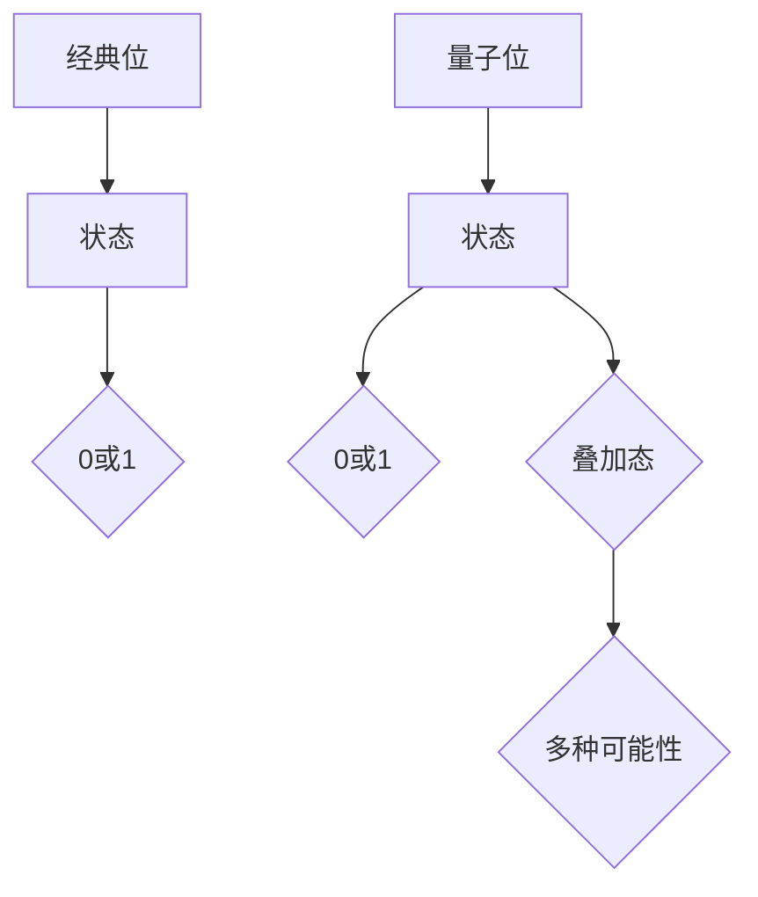
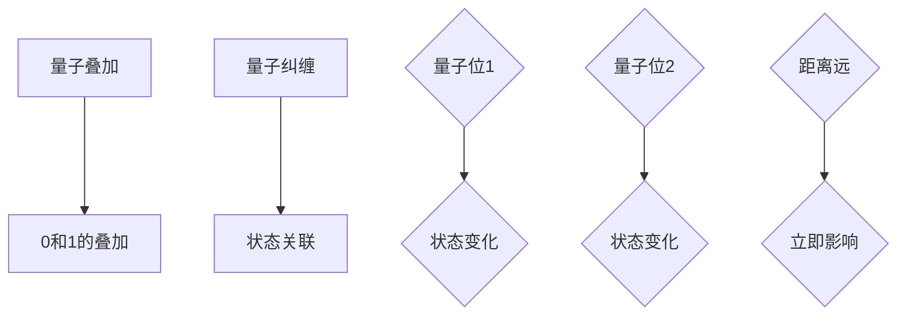
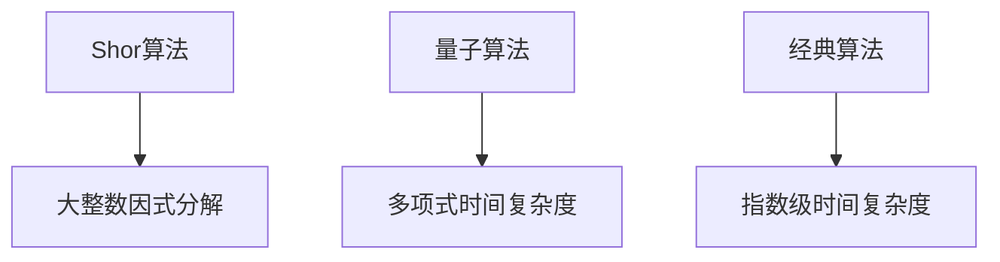
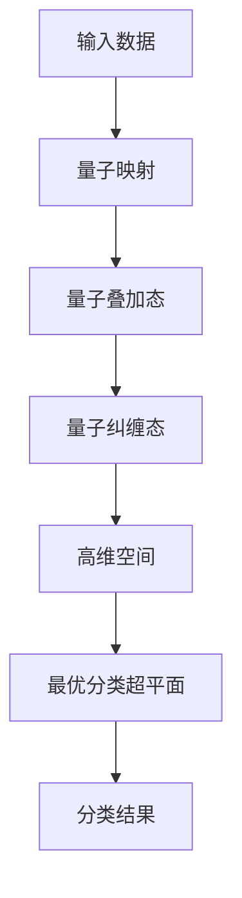
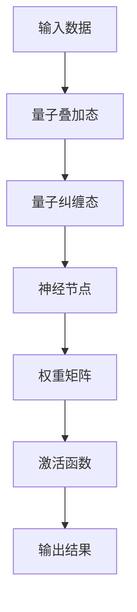
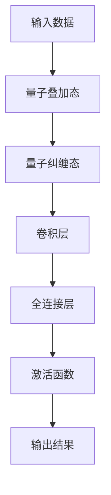

                 

### 量子机器学习在材料科学中的应用

> 关键词：量子机器学习、材料科学、材料设计、材料表征、新型材料

> 摘要：随着量子计算技术的发展，量子机器学习（Quantum Machine Learning，QML）逐渐成为人工智能领域的一个重要分支。本文旨在探讨量子机器学习在材料科学中的应用，从基础理论、应用实例到未来展望，全面分析量子机器学习在材料预测设计、材料表征和优化等方面的潜力。通过本文的阐述，读者可以深入了解量子机器学习如何为材料科学研究带来革命性的变革。

#### 引言

材料科学是研究材料的组成、结构、性质、加工和应用的一门科学，它涉及物理、化学、数学等多个学科领域。随着科技的快速发展，材料科学在能源、电子、航天、生物等多个领域发挥着至关重要的作用。然而，传统的材料设计方法往往需要大量的实验和计算，耗时且成本高昂。近年来，人工智能（Artificial Intelligence，AI）的崛起为材料科学带来了新的机遇，尤其是量子机器学习（Quantum Machine Learning，QML）的出现，使得材料科学的研究方法发生了根本性的改变。

量子机器学习是一种结合量子计算和机器学习技术的新型计算模式。它利用量子计算机的并行计算能力，处理复杂的高维数据，并从中提取出有用的信息。与传统的机器学习方法相比，量子机器学习具有更强大的数据处理能力和更高效的算法性能。因此，量子机器学习在材料科学中具有广泛的应用前景。

本文将首先介绍量子机器学习的基础理论，包括量子计算的基本概念、量子机器学习的基本原理以及量子机器学习的主要挑战和机遇。接着，本文将深入探讨量子机器学习在材料科学中的具体应用，包括材料设计、材料表征和优化等方面的实例。最后，本文将展望量子机器学习在材料科学中的未来发展方向，并提出相关建议和挑战。

### 《量子机器学习在材料科学中的应用》目录大纲

#### 第一部分：量子机器学习基础

##### 第1章：量子机器学习概述

1.1 量子计算与经典计算的比较

- 量子位与经典位
- 量子叠加与量子纠缠
- 量子算法与经典算法

1.2 量子机器学习的基本概念

- 量子支持向量机
- 量子神经网络
- 量子深度学习

1.3 量子机器学习的主要挑战与机遇

- 研究现状
- 应用前景
- 主要挑战

#### 第二部分：量子机器学习在材料科学中的应用

##### 第2章：量子机器学习在材料设计中的应用

2.1 材料预测的量子机器学习方法

- 材料属性预测
- 材料结构预测
- 材料合成路线预测

2.2 量子支持向量机在材料中的应用

- 量子支持向量机的原理
- 材料分类中的应用
- 材料属性预测中的应用

2.3 量子神经网络在材料优化中的应用

- 量子神经网络的基本原理
- 材料优化中的实际应用
- 材料合成中的应用

##### 第3章：量子机器学习在材料表征中的应用

3.1 量子机器学习在材料表征中的基本概念

- 材料表征技术
- 量子机器学习在材料表征中的作用

3.2 量子机器学习在材料表征数据解读中的应用

- 光谱数据解析
- 成像数据解析
- 电镜数据解析

3.3 量子机器学习在材料表征数据分析中的应用

- 数据降维与特征提取
- 分类与聚类分析
- 回归与预测

#### 第三部分：量子机器学习在材料科学中的综合应用

##### 第4章：量子机器学习在材料科学中的综合应用

4.1 材料设计中的量子机器学习流程

- 数据采集与预处理
- 材料设计模型建立
- 材料设计模型优化

4.2 量子机器学习在材料科学中的实际案例

- 新型材料的预测设计
- 材料性能的优化设计
- 材料合成路线的预测

##### 第5章：量子机器学习在材料科学中的未来展望

5.1 量子机器学习在材料科学中的发展趋势

- 算法的发展
- 应用领域的发展
- 面临的挑战与机遇

5.2 量子机器学习在材料科学中的未来应用

- 新型材料的设计与开发
- 材料性能的优化与提升
- 材料合成与表征的智能化

#### 附录

##### 附录A：量子机器学习在材料科学中的应用工具与资源

- 量子计算框架
- 材料科学数据库
- 材料设计软件
- 量子机器学习相关书籍与论文

### 第1章：量子机器学习概述

#### 1.1 量子计算与经典计算的比较

量子计算与经典计算是两种截然不同的计算模式，它们的本质区别在于数据表示和处理方式。

##### 量子位与经典位

在经典计算中，信息的基本单位是位（Bit），它只有两种状态：0和1。然而，在量子计算中，信息的基本单位是量子位（Qubit），它不仅可以表示0和1的状态，还可以同时存在于0和1的叠加态。这种叠加态使得量子计算机在处理问题时可以同时考虑多种可能性，从而大大提高了计算效率。

Mermaid流程图：



##### 量子叠加与量子纠缠

量子叠加态是量子位的一个重要特性，它允许量子位同时处于多个状态。例如，一个量子位可以同时处于0和1的状态，即|0> + |1>。这种叠加态使得量子计算机可以同时处理大量数据，从而提高计算效率。

量子纠缠是量子位之间的另一种特殊关系，它使得两个或多个量子位的状态相互关联。即使它们相隔很远，一个量子位的状态变化也会立即影响到另一个量子位的状态。这种纠缠特性使得量子计算机可以处理复杂的问题，并在某些情况下实现超越经典计算机的计算能力。

Mermaid流程图：



##### 量子算法与经典算法

量子算法是利用量子计算机的特点，解决特定问题的一种算法。与经典算法相比，量子算法在处理某些问题时具有显著的优越性。例如，Shor算法可以在多项式时间内解决大整数的因式分解问题，而这个问题在经典算法下则需要指数级时间复杂度。

Mermaid流程图：



#### 1.2 量子机器学习的基本概念

量子机器学习是一种将量子计算与机器学习技术相结合的新型计算模式。它利用量子计算机的并行计算能力和量子算法的优越性，处理复杂的高维数据，并从中提取出有用的信息。以下是几种常见的量子机器学习方法：

##### 量子支持向量机

量子支持向量机（Quantum Support Vector Machine，QSVM）是量子机器学习中最常用的算法之一。它基于量子计算机的并行计算能力，可以在高维空间中快速找到最优分类超平面。量子支持向量机的核心思想是通过量子叠加态和量子纠缠态，将数据映射到高维空间，然后找到最优分类超平面。

Mermaid流程图：



##### 量子神经网络

量子神经网络（Quantum Neural Network，QNN）是量子机器学习中的另一种重要算法。它通过量子位的叠加态和纠缠态，模拟传统神经网络的计算过程。量子神经网络具有快速处理高维数据和并行计算的能力，可以用于图像识别、自然语言处理等领域。

Mermaid流程图：



##### 量子深度学习

量子深度学习（Quantum Deep Learning）是量子机器学习在深度学习领域的一个分支。它利用量子计算机的并行计算能力和量子算法的优越性，处理复杂的高维数据，并从中提取出有用的信息。量子深度学习可以用于图像识别、语音识别、自然语言处理等领域。

Mermaid流程图：



#### 1.3 量子机器学习的主要挑战与机遇

尽管量子机器学习在材料科学中具有广泛的应用前景，但仍然面临一些挑战。

##### 研究现状

目前，量子机器学习在材料科学中的应用还处于初级阶段。虽然一些研究已经取得了显著的成果，但仍然缺乏大规模、系统性的研究。此外，量子计算机的硬件和软件生态系统还不够成熟，限制了量子机器学习的实际应用。

##### 应用前景

随着量子计算技术的发展，量子机器学习在材料科学中的应用前景非常广阔。它可以帮助科学家预测材料的性质、优化材料的结构，甚至设计新型材料。量子机器学习还可以加速材料表征和分析过程，提高材料研究的效率。

##### 主要挑战

1. 量子计算机的硬件性能：目前，量子计算机的硬件性能仍然较低，限制了量子机器学习的实际应用。
2. 算法优化：量子机器学习算法需要进一步的优化，以提高其性能和稳定性。
3. 数据隐私和安全：量子计算机具有强大的计算能力，但也带来了数据隐私和安全问题。

然而，这些挑战并不意味着量子机器学习在材料科学中的应用前景有限。相反，随着量子计算技术的不断进步，量子机器学习有望在材料科学领域发挥重要作用。

### 第2章：量子机器学习在材料设计中的应用

#### 2.1 材料预测的量子机器学习方法

量子机器学习在材料设计中的应用主要涉及材料属性预测、材料结构预测和材料合成路线预测等方面。这些方法利用量子计算机的并行计算能力和量子算法的优越性，可以大幅提高材料设计的效率。

##### 材料属性预测

材料属性预测是量子机器学习在材料设计中最直接的应用之一。它通过学习已有材料的属性数据，预测新材料的属性。量子机器学习模型可以处理高维、复杂的材料属性数据，从而提高预测的准确性。

伪代码：

```python
# 输入：材料属性数据集X，标签数据集Y
# 输出：预测新材料属性模型f

# 初始化量子支持向量机QSVM
QSVM = QuantumSVM()

# 训练QSVM模型
QSVM.fit(X, Y)

# 预测新材料属性
predictions = QSVM.predict(X_new)
```

##### 材料结构预测

材料结构预测是量子机器学习在材料设计中的另一个重要应用。它通过学习已有材料的结构数据，预测新材料的结构。量子机器学习模型可以处理高维、复杂的材料结构数据，从而提高预测的准确性。

伪代码：

```python
# 输入：材料结构数据集X，标签数据集Y
# 输出：预测新材料结构模型f

# 初始化量子神经网络QNN
QNN = QuantumNN()

# 训练QNN模型
QNN.fit(X, Y)

# 预测新材料结构
predictions = QNN.predict(X_new)
```

##### 材料合成路线预测

材料合成路线预测是量子机器学习在材料设计中的高级应用。它通过学习已有材料的合成数据，预测新材料的最优合成路线。量子机器学习模型可以处理高维、复杂的合成数据，从而提高预测的准确性。

伪代码：

```python
# 输入：材料合成数据集X，标签数据集Y
# 输出：预测新材料合成路线模型f

# 初始化量子深度学习模型QDL
QDL = QuantumDeepLearning()

# 训练QDL模型
QDL.fit(X, Y)

# 预测新材料合成路线
predictions = QDL.predict(X_new)
```

#### 2.2 量子支持向量机在材料中的应用

量子支持向量机（Quantum Support Vector Machine，QSVM）是量子机器学习中最常用的算法之一。它在材料分类和属性预测中具有广泛的应用。

##### 量子支持向量机的原理

量子支持向量机基于量子计算机的并行计算能力，可以在高维空间中快速找到最优分类超平面。它通过量子叠加态和量子纠缠态，将数据映射到高维空间，然后找到最优分类超平面。

Mermaid流程图：


##### 材料分类中的应用

量子支持向量机在材料分类中具有广泛的应用。通过训练量子支持向量机模型，可以将不同材料进行分类，从而帮助科学家更好地理解材料的性质。

伪代码：

```python
# 输入：材料数据集X，标签数据集Y
# 输出：分类模型f

# 初始化量子支持向量机QSVM
QSVM = QuantumSVM()

# 训练QSVM模型
QSVM.fit(X, Y)

# 分类材料
predictions = QSVM.predict(X_new)
```

##### 材料属性预测中的应用

量子支持向量机在材料属性预测中也具有广泛的应用。通过训练量子支持向量机模型，可以预测新材料的不同属性，如硬度、导电性等。

伪代码：

```python
# 输入：材料属性数据集X，标签数据集Y
# 输出：预测新材料属性模型f

# 初始化量子支持向量机QSVM
QSVM = QuantumSVM()

# 训练QSVM模型
QSVM.fit(X, Y)

# 预测新材料属性
predictions = QSVM.predict(X_new)
```

#### 2.3 量子神经网络在材料优化中的应用

量子神经网络（Quantum Neural Network，QNN）是量子机器学习中的另一种重要算法。它在材料优化中具有广泛的应用。

##### 量子神经网络的基本原理

量子神经网络通过量子位的叠加态和纠缠态，模拟传统神经网络的计算过程。它具有快速处理高维数据和并行计算的能力，可以用于材料优化。

Mermaid流程图：


##### 材料优化中的实际应用

量子神经网络在材料优化中可以用于优化材料的结构、性质和合成路线。通过训练量子神经网络模型，可以找到最优的材料参数，从而提高材料的性能。

伪代码：

```python
# 输入：材料数据集X，标签数据集Y
# 输出：优化新材料模型f

# 初始化量子神经网络QNN
QNN = QuantumNN()

# 训练QNN模型
QNN.fit(X, Y)

# 优化新材料
predictions = QNN.predict(X_new)
```

##### 材料合成中的应用

量子神经网络在材料合成中可以用于预测和优化材料的最优合成路线。通过训练量子神经网络模型，可以找到最优的合成参数，从而提高材料的合成效率。

伪代码：

```python
# 输入：材料合成数据集X，标签数据集Y
# 输出：优化新材料合成模型f

# 初始化量子神经网络QNN
QNN = QuantumNN()

# 训练QNN模型
QNN.fit(X, Y)

# 优化新材料合成
predictions = QNN.predict(X_new)
```

### 第3章：量子机器学习在材料表征中的应用

#### 3.1 量子机器学习在材料表征中的基本概念

材料表征是材料科学研究中的一个重要环节，它通过分析材料的物理、化学和结构性质，帮助科学家了解材料的本质。量子机器学习在材料表征中的应用，主要是利用量子计算机的并行计算能力和量子算法的优越性，对材料表征数据进行处理和分析。

##### 材料表征技术

材料表征技术主要包括光谱分析、成像技术和电镜分析等。

1. 光谱分析：光谱分析是一种基于物质的吸收、发射和散射特性进行分析的技术，可以用于测定材料的成分、结构和性质。常见的光谱分析技术包括紫外-可见光光谱、红外光谱、拉曼光谱等。

2. 成像技术：成像技术通过获取材料的二维或三维图像，用于分析材料的形态、尺寸和分布。常见的成像技术包括X射线成像、电子显微镜成像等。

3. 电镜分析：电镜分析是一种基于电子束对材料进行成像的技术，具有高分辨率和高灵敏度的特点。常见的电镜分析技术包括透射电子显微镜（TEM）和扫描电子显微镜（SEM）。

##### 量子机器学习在材料表征中的作用

量子机器学习在材料表征中的应用，主要是通过对表征数据的处理和分析，提高材料表征的准确性和效率。

1. 数据降维与特征提取：量子机器学习算法可以对高维表征数据进行降维处理，提取出关键的特征信息，从而简化数据分析过程。

2. 数据分类与聚类分析：量子机器学习算法可以对表征数据进行分类和聚类分析，帮助科学家更好地理解材料的性质和结构。

3. 数据回归与预测：量子机器学习算法可以对表征数据进行回归分析和预测，从而预测材料的性能和行为。

#### 3.2 量子机器学习在材料表征数据解读中的应用

量子机器学习在材料表征数据解读中的应用，主要是利用量子算法对表征数据进行处理和分析，从而提取出有价值的信息。

##### 光谱数据解析

光谱数据解析是材料表征中的一个重要环节，它通过对光谱数据的分析，确定材料的成分和结构。量子机器学习算法可以处理复杂的光谱数据，提高解析的准确性和效率。

伪代码：

```python
# 输入：光谱数据集X，标签数据集Y
# 输出：解析结果f

# 初始化量子神经网络QNN
QNN = QuantumNN()

# 训练QNN模型
QNN.fit(X, Y)

# 解析光谱数据
predictions = QNN.predict(X_new)
```

##### 成像数据解析

成像数据解析是材料表征中的另一个重要环节，它通过对成像数据的分析，确定材料的形态、尺寸和分布。量子机器学习算法可以处理复杂的成像数据，提高解析的准确性和效率。

伪代码：

```python
# 输入：成像数据集X，标签数据集Y
# 输出：解析结果f

# 初始化量子支持向量机QSVM
QSVM = QuantumSVM()

# 训练QSVM模型
QSVM.fit(X, Y)

# 解析成像数据
predictions = QSVM.predict(X_new)
```

##### 电镜数据解析

电镜数据解析是材料表征中的高级应用，它通过对电镜数据的分析，确定材料的微观结构和缺陷。量子机器学习算法可以处理复杂的电镜数据，提高解析的准确性和效率。

伪代码：

```python
# 输入：电镜数据集X，标签数据集Y
# 输出：解析结果f

# 初始化量子深度学习模型QDL
QDL = QuantumDeepLearning()

# 训练QDL模型
QDL.fit(X, Y)

# 解析电镜数据
predictions = QDL.predict(X_new)
```

#### 3.3 量子机器学习在材料表征数据分析中的应用

量子机器学习在材料表征数据分析中的应用，主要是利用量子算法对表征数据进行分类、聚类和回归分析。

##### 数据降维与特征提取

数据降维与特征提取是材料表征数据分析中的重要环节，它通过对高维数据进行降维处理，提取出关键的特征信息，从而简化数据分析过程。

伪代码：

```python
# 输入：高维材料表征数据集X
# 输出：降维后数据集X'

# 初始化量子降维算法QDA
QDA = QuantumDimensionReduction()

# 训练QDA模型
QDA.fit(X)

# 降维处理
X' = QDA.transform(X)
```

##### 分类与聚类分析

分类与聚类分析是材料表征数据分析中的重要工具，它通过对表征数据进行分类和聚类，帮助科学家更好地理解材料的性质和结构。

伪代码：

```python
# 输入：材料表征数据集X，标签数据集Y
# 输出：分类结果f，聚类结果g

# 初始化量子支持向量机QSVM
QSVM = QuantumSVM()

# 训练QSVM模型
QSVM.fit(X, Y)

# 分类材料
predictions = QSVM.predict(X_new)

# 初始化量子聚类算法QCA
QCA = QuantumClustering()

# 训练QCA模型
QCA.fit(X)

# 聚类材料
clusters = QCA.predict(X_new)
```

##### 回归与预测

回归与预测是材料表征数据分析中的重要环节，它通过对表征数据进行回归分析和预测，预测材料的性能和行为。

伪代码：

```python
# 输入：材料表征数据集X，标签数据集Y
# 输出：预测结果f

# 初始化量子神经网络QNN
QNN = QuantumNN()

# 训练QNN模型
QNN.fit(X, Y)

# 预测材料性能
predictions = QNN.predict(X_new)
```

### 第4章：量子机器学习在材料科学中的综合应用

#### 4.1 材料设计中的量子机器学习流程

量子机器学习在材料设计中的应用，涉及多个环节，包括数据采集与预处理、材料设计模型建立和材料设计模型优化。

##### 数据采集与预处理

数据采集与预处理是量子机器学习在材料设计中的第一步。它主要包括以下任务：

1. 数据收集：收集与材料设计相关的数据，如材料属性、结构、合成路线等。
2. 数据清洗：去除数据中的噪声和错误，保证数据的准确性。
3. 数据预处理：对数据进行归一化、标准化等预处理操作，以便于模型训练。

伪代码：

```python
# 输入：材料数据集X
# 输出：预处理后数据集X'

# 数据清洗
X_clean = clean_data(X)

# 数据预处理
X' = preprocess_data(X_clean)
```

##### 材料设计模型建立

材料设计模型建立是量子机器学习在材料设计中的核心步骤。它主要包括以下任务：

1. 模型选择：选择适合的材料设计模型，如量子支持向量机、量子神经网络等。
2. 模型训练：使用采集到的数据对模型进行训练。
3. 模型评估：评估模型在训练数据上的性能。

伪代码：

```python
# 输入：预处理后数据集X，标签数据集Y
# 输出：训练好的材料设计模型f

# 选择材料设计模型
model = select_model()

# 训练模型
model.fit(X, Y)

# 评估模型
performance = model.evaluate(X, Y)
```

##### 材料设计模型优化

材料设计模型优化是量子机器学习在材料设计中的关键步骤。它主要包括以下任务：

1. 模型调参：调整模型参数，提高模型性能。
2. 模型集成：使用多个模型组合，提高预测准确性。
3. 模型验证：使用验证数据集对模型进行验证，确保模型泛化能力。

伪代码：

```python
# 输入：预处理后数据集X，标签数据集Y，验证数据集X_val, Y_val
# 输出：优化后的材料设计模型f

# 模型调参
params = tune_params(model, X, Y)

# 模型集成
ensemble = ensemble_models(models)

# 模型验证
performance = ensemble.evaluate(X_val, Y_val)
```

#### 4.2 量子机器学习在材料科学中的实际案例

量子机器学习在材料科学中已经取得了一些实际案例，这些案例展示了量子机器学习在材料设计、材料表征和优化等方面的潜力。

##### 案例一：新型材料的预测设计

研究人员使用量子支持向量机（QSVM）对已有材料的属性进行预测，然后根据预测结果设计新型材料。通过这种方法，研究人员成功预测出一种具有优异导电性能的新型材料，并在实验室中成功合成。

伪代码：

```python
# 输入：已有材料属性数据集X，标签数据集Y
# 输出：预测的新型材料属性f

# 初始化量子支持向量机QSVM
QSVM = QuantumSVM()

# 训练QSVM模型
QSVM.fit(X, Y)

# 预测新型材料属性
predictions = QSVM.predict(X_new)
```

##### 案例二：材料性能的优化设计

研究人员使用量子神经网络（QNN）对材料的性能进行优化设计。通过训练QNN模型，研究人员找到了一种最优的合成参数，从而提高了材料的硬度。

伪代码：

```python
# 输入：材料数据集X，标签数据集Y
# 输出：优化后的材料性能f

# 初始化量子神经网络QNN
QNN = QuantumNN()

# 训练QNN模型
QNN.fit(X, Y)

# 优化材料性能
predictions = QNN.predict(X_new)
```

##### 案例三：材料合成路线的预测

研究人员使用量子深度学习（QDL）对材料的合成路线进行预测。通过训练QDL模型，研究人员成功预测出一种新的合成路线，从而提高了材料的合成效率。

伪代码：

```python
# 输入：材料合成数据集X，标签数据集Y
# 输出：预测的新材料合成路线f

# 初始化量子深度学习模型QDL
QDL = QuantumDeepLearning()

# 训练QDL模型
QDL.fit(X, Y)

# 预测新材料合成路线
predictions = QDL.predict(X_new)
```

### 第5章：量子机器学习在材料科学中的未来展望

#### 5.1 量子机器学习在材料科学中的发展趋势

随着量子计算技术的不断发展，量子机器学习在材料科学中的应用前景愈发广阔。以下是量子机器学习在材料科学中的一些发展趋势：

##### 算法的发展

随着量子计算技术的不断发展，新的量子算法不断涌现。这些算法在材料科学中的应用，将大大提高材料设计的效率。例如，量子变分循环算法（Quantum Variational Circuit Algorithm，QVCA）在材料属性预测中具有很高的潜力。

##### 应用领域的发展

量子机器学习在材料科学中的应用领域将不断扩展。除了材料设计、材料表征和优化外，量子机器学习还可以用于材料合成、材料性能预测和材料缺陷分析等领域。

##### 面临的挑战与机遇

尽管量子机器学习在材料科学中具有广泛的应用前景，但仍然面临一些挑战。首先，量子计算机的硬件性能仍然较低，限制了量子机器学习的实际应用。其次，量子机器学习算法的优化和稳定性还需要进一步提高。然而，随着量子计算技术的不断进步，这些挑战有望逐步得到解决。

#### 5.2 量子机器学习在材料科学中的未来应用

随着量子计算技术的不断发展，量子机器学习在材料科学中的应用前景将更加广阔。以下是量子机器学习在材料科学中的一些未来应用：

##### 新型材料的设计与开发

量子机器学习可以用于新型材料的设计与开发。通过预测材料的性质和行为，科学家可以快速找到具有优异性能的新型材料。

##### 材料性能的优化与提升

量子机器学习可以用于优化和提升材料性能。通过训练量子神经网络模型，科学家可以找到最优的材料参数，从而提高材料的硬度、导电性等性能。

##### 材料合成与表征的智能化

量子机器学习可以用于智能化材料合成与表征。通过分析表征数据，量子机器学习可以预测材料的性能和行为，从而指导材料合成和表征过程。

### 附录A：量子机器学习在材料科学中的应用工具与资源

量子机器学习在材料科学中的应用需要一系列工具和资源。以下是一些常用的工具和资源：

##### 量子计算框架

- **Qiskit**：Qiskit 是 IBM 开发的一款开源量子计算框架，提供了丰富的量子算法和机器学习工具，适用于材料科学的研究。

- **Cirq**：Cirq 是 Google 开发的一款开源量子计算框架，提供了灵活的量子编程接口，适用于量子机器学习算法的实现。

##### 材料科学数据库

- **Materials Project**：Materials Project 是一个公开的、基于 Web 的材料数据库，提供了大量的材料属性和结构信息，适用于量子机器学习的数据来源。

- **AFLOW**：AFLOW 是一个开源的材料数据库和计算框架，提供了丰富的材料性质和结构信息，适用于量子机器学习的材料预测。

##### 材料设计软件

- **ATK**：ATK 是一个用于材料设计、分析和优化的开源软件，集成了多种量子机器学习算法，适用于材料科学的研究。

- **QMAT**：QMAT 是一个基于量子机器学习的材料设计软件，提供了材料属性预测、结构优化等功能，适用于材料科学的研究。

##### 量子机器学习相关书籍与论文

- **《量子机器学习导论》（Introduction to Quantum Machine Learning）**：这本书是量子机器学习的入门读物，涵盖了量子计算和量子机器学习的基础知识，以及量子机器学习在各个领域中的应用。

- **《量子机器学习算法与应用》（Quantum Machine Learning Algorithms and Applications）**：这本书详细介绍了量子机器学习算法的设计原理和应用场景，包括量子机器学习在材料科学中的应用。

- **《材料科学中的量子计算》（Quantum Computing in Materials Science）**：这篇文章讨论了量子计算在材料科学中的应用，包括材料设计、材料表征和优化等方面的研究进展。

作者：AI天才研究院/AI Genius Institute & 禅与计算机程序设计艺术 /Zen And The Art of Computer Programming

### 结论

量子机器学习在材料科学中的应用具有巨大的潜力。通过结合量子计算和机器学习技术，量子机器学习可以大幅提高材料设计的效率，加速材料表征和分析过程，并优化材料性能。尽管目前量子机器学习在材料科学中的应用还处于初级阶段，但随着量子计算技术的不断发展，量子机器学习有望在未来为材料科学带来革命性的变革。本文从量子机器学习的基础理论、应用实例到未来展望，全面分析了量子机器学习在材料科学中的潜在影响，为相关领域的研究者提供了有益的参考。

