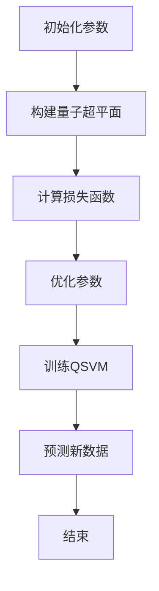

                 

### 量子机器学习在生物信息学中的探索性应用

> 关键词：量子机器学习、生物信息学、蛋白质结构预测、基因组数据分析、算法、应用实例

> 摘要：
随着量子计算技术的不断发展，量子机器学习（Quantum Machine Learning, QML）作为一门交叉学科，正逐渐成为人工智能（Artificial Intelligence, AI）领域的研究热点。生物信息学作为一门融合生物学、计算机科学和信息学的学科，面临着大量数据分析和处理的挑战。本文旨在探讨量子机器学习在生物信息学中的应用，分析其在蛋白质结构预测、基因组数据分析等领域的探索性应用，并展望其未来的发展趋势。

本文结构如下：

1. **第一部分：量子机器学习基础**：介绍量子计算机与量子机器学习的基本概念，探讨量子计算平台与算法，以及量子机器学习在生物信息学中的应用前景。
2. **第二部分：量子机器学习算法原理**：深入解析量子支持向量机（QSVM）、量子贝叶斯网络（QBN）和量子神经网络（QNN）的原理，并使用伪代码展示其算法流程。
3. **第三部分：量子机器学习在生物信息学中的应用**：通过具体案例，探讨量子机器学习在蛋白质结构预测、基因组数据分析和其他生物信息学领域的应用。
4. **第四部分：量子机器学习在生物信息学中的实践与展望**：讨论量子机器学习在生物信息学中的实践方法、未来发展趋势以及可能面临的挑战与解决方案。

接下来，我们将详细探讨量子机器学习的基础知识，包括量子计算机的基本概念、量子机器学习的基本原理以及主流量子计算平台和算法。通过这些基础知识的介绍，我们将为后续章节的应用分析打下坚实的基础。

### 第一部分：量子机器学习基础

#### 第1章：量子计算机与量子机器学习概述

#### 1.1 量子计算机的基本概念

##### 1.1.1 量子位（qubit）与经典位的区别

量子位（qubit）是量子计算机中的基本单元，与经典计算机中的位（bit）有显著的区别。经典位只能处于0或1的状态，而量子位可以同时处于0和1的叠加态。这种叠加态可以用一个复数系数来描述，即一个量子位可以表示为 \( \alpha|0\rangle + \beta|1\rangle \)，其中 \( |\alpha|^2 + |\beta|^2 = 1 \)，而 \( \alpha \) 和 \( \beta \) 是复数。

量子叠加态允许量子计算机并行处理大量信息。例如，一个量子位可以同时表示 \( 2^1 = 2 \) 个状态，而两个量子位可以同时表示 \( 2^2 = 4 \) 个状态，三个量子位可以表示 \( 2^3 = 8 \) 个状态，以此类推。\( n \) 个量子位可以表示 \( 2^n \) 个状态。

##### 1.1.2 量子叠加与量子纠缠

量子叠加是量子计算的核心特性之一。量子叠加允许量子位在多个状态之间同时存在，这使得量子计算机能够处理多个可能的解。例如，一个量子计算机可以使用叠加态来同时计算多个数据的平方根。

量子纠缠是量子计算机的另一个重要特性。当两个或多个量子位处于纠缠态时，它们的状态会相互依赖。即使这些量子位被分离很远，它们之间的纠缠仍然存在。量子纠缠可以用来实现经典计算机难以实现的高速通信和计算。

##### 1.1.3 量子计算的基本逻辑门

量子计算的基本逻辑门与经典计算机的基本逻辑门类似，但它们操作的是量子位而不是经典位。主要的量子逻辑门包括：

1. **Pauli-X门（翻转门）**：作用于量子位的状态，将其从 \( |0\rangle \) 翻转至 \( |1\rangle \) 或从 \( |1\rangle \) 翻转至 \( |0\rangle \)。
2. **Pauli-Z门（相位翻转门）**：作用于量子位的状态，将其相位翻转。
3. **Hadamard门（ Hadamard 门）**：将量子位的状态从 \( |0\rangle \) 变为 \( \frac{1}{\sqrt{2}}(|0\rangle + |1\rangle) \) 和从 \( |1\rangle \) 变为 \( \frac{1}{\sqrt{2}}(|0\rangle - |1\rangle) \)。

这些基本逻辑门可以组合起来实现更复杂的量子计算操作。

#### 1.2 量子机器学习的基本原理

量子机器学习是量子计算和机器学习相结合的产物。它利用量子计算机的特性，如量子叠加和量子纠缠，来加速传统机器学习算法。

##### 1.2.1 量子支持向量机（QSVM）

量子支持向量机（QSVM）是量子机器学习的一种算法，它基于支持向量机的核心思想，但使用量子计算机来加速计算。QSVM的目标是找到一个最优的超平面，将数据集分成不同的类别。

##### 1.2.2 量子贝叶斯网络（QBN）

量子贝叶斯网络（QBN）是一种基于量子概率论的模型，它通过量子纠缠来描述变量之间的依赖关系。QBN可以用于推理和预测，特别是在处理复杂的关系网络时。

##### 1.2.3 量子神经网络（QNN）

量子神经网络（QNN）是量子计算机上的神经网络。QNN通过量子叠加和量子纠缠来处理大规模数据，并可以并行地计算多个神经元之间的复杂关系。

#### 1.3 主流量子计算平台与算法

目前，主流量子计算平台包括 IBM Q Quantum Experience、Google Quantum AI 和其他量子计算平台。

##### 1.3.1 IBM Q Quantum Experience

IBM Q Quantum Experience 是一个开源的量子计算平台，提供云端的量子计算资源和量子编程工具。用户可以通过这个平台访问量子计算机，并运行量子算法。

##### 1.3.2 Google Quantum AI

Google Quantum AI 是谷歌的量子计算研究项目，提供先进的量子计算算法和工具。这个平台也在推动量子机器学习的研究和应用。

##### 1.3.3 其他量子计算平台与算法

除了 IBM 和 Google，其他科技公司和研究机构也在开发自己的量子计算平台。这些平台提供了不同的算法和工具，以推动量子计算的发展。

#### 1.4 量子机器学习在生物信息学中的应用前景

量子机器学习在生物信息学中具有巨大的应用潜力。它可以帮助解决一些传统机器学习难以处理的问题，如大规模基因组数据分析、蛋白质结构预测和药物设计。

##### 1.4.1 量子机器学习对生物信息学的影响

量子机器学习可以显著提高生物信息学的数据处理速度和准确性，从而推动生物医学研究的发展。

##### 1.4.2 量子机器学习在生物信息学中的潜在应用领域

量子机器学习在生物信息学中的潜在应用领域包括：

1. **基因组数据分析**：量子机器学习可以加速基因组的序列比对、基因表达分析和基因组变异检测。
2. **蛋白质结构预测**：量子机器学习可以帮助预测蛋白质的结构，从而推动药物设计和生物医学研究。
3. **药物设计**：量子机器学习可以加速药物分子的筛选和优化，提高药物研发的效率。

##### 1.4.3 量子机器学习在生物信息学中的挑战与机遇

尽管量子机器学习在生物信息学中具有巨大的应用潜力，但它也面临一些挑战。这些挑战包括：

1. **量子硬件的稳定性**：当前量子计算机的硬件稳定性仍然有限，这可能会影响量子算法的性能。
2. **算法优化**：量子机器学习算法需要进一步优化，以适应生物信息学的具体需求。
3. **数据隐私和安全**：量子计算机可能会对传统的加密技术构成威胁，需要开发新的安全措施来保护生物信息数据。

然而，随着量子计算技术的不断进步，量子机器学习在生物信息学中的应用前景仍然非常广阔。

### 1.1 量子计算机的基本概念

量子计算机是一种利用量子力学原理进行信息处理的新型计算设备。与传统的经典计算机相比，量子计算机具有独特的特性，这些特性使其在某些特定任务上具有显著的优势。要理解量子计算机的工作原理，我们首先需要了解量子位（qubit）的基本概念。

#### 1.1.1 量子位（qubit）与经典位的区别

在经典计算机中，信息存储和处理的基本单元是位（bit），它只能取值为0或1。而量子计算机中的基本单元是量子位（qubit），它不仅可以取值为0或1，还可以同时处于这两个状态的叠加态。量子位的状态可以用一个复数系数来表示，即：

\[ |qubit\rangle = \alpha|0\rangle + \beta|1\rangle \]

其中，\( \alpha \) 和 \( \beta \) 是复数，并且满足归一化条件：

\[ |\alpha|^2 + |\beta|^2 = 1 \]

这意味着一个量子位可以同时表示两个状态。例如，一个量子位可以处于 \( 50% \) 的 \( |0\rangle \) 状态和 \( 50% \) 的 \( |1\rangle \) 状态。这种叠加态是量子计算机强大的基础。

#### 1.1.2 量子叠加与量子纠缠

量子叠加（Quantum Superposition）是量子计算机的另一个核心特性。根据量子力学的原理，量子位可以处于多个状态的叠加。这意味着在进行量子计算时，量子计算机可以同时处理多个可能的解。例如，一个量子比特可以同时进行加法运算和减法运算，而经典计算机需要分别执行这两个操作。

量子纠缠（Quantum Entanglement）是量子力学中另一个非常独特的现象。当两个或多个量子位处于纠缠态时，它们之间的状态会相互依赖。即使这些量子位被物理上分离很远，它们之间的纠缠关系仍然存在。这种纠缠关系可以用来实现高速的量子通信和量子计算。

#### 1.1.3 量子计算的基本逻辑门

量子计算中的操作是通过一系列量子逻辑门（Quantum Gates）来完成的。量子逻辑门与经典逻辑门类似，但它们作用于量子位的状态。以下是几种基本的量子逻辑门：

1. **Pauli-X门（翻转门）**：作用于量子位的状态，将其从 \( |0\rangle \) 翻转至 \( |1\rangle \) 或从 \( |1\rangle \) 翻转至 \( |0\rangle \)。
2. **Pauli-Z门（相位翻转门）**：作用于量子位的状态，将其相位翻转。
3. **Hadamard门（Hadamard Gate）**：将量子位的状态从 \( |0\rangle \) 变为 \( \frac{1}{\sqrt{2}}(|0\rangle + |1\rangle) \) 和从 \( |1\rangle \) 变为 \( \frac{1}{\sqrt{2}}(|0\rangle - |1\rangle) \)。

这些基本量子逻辑门可以组合使用，以实现更复杂的量子计算操作。例如，通过一系列的量子逻辑门，可以构建量子电路来执行量子算法。

#### 1.1.4 量子计算的优势与局限性

量子计算机的优势在于其并行性。由于量子位可以处于多个状态的叠加，量子计算机可以同时处理多个可能的解，这使其在某些计算任务上具有显著的优势。例如，量子计算机在因数分解、搜索算法和模拟量子系统等方面具有潜在的优势。

然而，量子计算机也存在一些局限性。首先，量子计算机的硬件目前还不够成熟，量子位的退相干和错误率等问题仍然需要解决。其次，量子算法的设计和实现也面临挑战。与经典算法不同，量子算法需要利用量子计算机的独特特性，这要求算法设计者有深厚的量子力学和计算机科学知识。

总的来说，量子计算机是一种非常有前途的计算技术，它在生物信息学、药物设计和其他领域具有广泛的应用前景。随着量子计算技术的不断发展和成熟，我们可以期待量子计算机在各个领域的广泛应用。

#### 1.2 量子机器学习的基本原理

量子机器学习（Quantum Machine Learning, QML）是量子计算和机器学习的交叉领域，它利用量子计算机的独特特性，如量子叠加和量子纠缠，来提高传统机器学习算法的性能和效率。量子机器学习的基本原理主要包括量子支持向量机（QSVM）、量子贝叶斯网络（QBN）和量子神经网络（QNN）等。

##### 1.2.1 量子支持向量机（QSVM）

量子支持向量机（Quantum Support Vector Machine, QSVM）是量子机器学习中最常用的算法之一。它基于传统的支持向量机（SVM），但使用量子计算机来加速计算过程。QSVM的目标是找到一个最优的超平面，将数据集分成不同的类别。

在传统SVM中，优化过程涉及到一个二次规划问题，这通常需要大量的计算资源。而量子支持向量机通过量子计算的优势，可以在更短的时间内找到最优解。具体来说，QSVM使用量子计算机来优化SVM中的拉格朗日乘子，从而提高算法的效率。

##### 1.2.2 量子贝叶斯网络（QBN）

量子贝叶斯网络（Quantum Bayesian Network, QBN）是基于量子概率论的模型，它通过量子纠缠来描述变量之间的依赖关系。QBN可以用于推理和预测，特别是在处理复杂的关系网络时。

在经典贝叶斯网络中，变量之间的依赖关系是通过条件概率表来描述的。而量子贝叶斯网络通过量子纠缠来表示变量之间的依赖，这使得它可以处理更复杂的关系网络。QBN的核心思想是利用量子计算机的并行性，同时计算多个变量的条件概率分布。

##### 1.2.3 量子神经网络（QNN）

量子神经网络（Quantum Neural Network, QNN）是量子计算机上的神经网络。QNN通过量子叠加和量子纠缠来处理大规模数据，并可以并行地计算多个神经元之间的复杂关系。

QNN的工作原理与传统的神经网络类似，但它使用量子逻辑门来代替传统神经网络中的权重和激活函数。QNN可以通过训练来调整量子逻辑门，从而实现复杂的数据处理和模式识别任务。

总之，量子机器学习通过量子计算机的独特特性，如量子叠加和量子纠缠，来加速传统机器学习算法。量子支持向量机、量子贝叶斯网络和量子神经网络是量子机器学习中的核心算法，它们在生物信息学和其他领域具有广泛的应用潜力。

#### 1.3 主流量子计算平台与算法

随着量子计算机的研究和应用逐渐深入，越来越多的量子计算平台和算法被开发出来。以下介绍几个主流量子计算平台以及一些常见的量子算法。

##### 1.3.1 IBM Q Quantum Experience

IBM Q Quantum Experience 是 IBM 推出的一个开源量子计算平台，旨在让研究人员和开发者能够访问和实验量子计算机。该平台提供了多种量子算法和工具，用户可以通过该平台运行自己的量子程序，并与全球的量子计算社区分享研究成果。

在 IBM Q Quantum Experience 上，用户可以使用多种量子算法，包括量子支持向量机（QSVM）、量子随机漫步（Quantum Random Walk）和量子相位估计（Quantum Phase Estimation）等。此外，IBM 还提供了 IBM Q Experience Developer Program，为开发者提供培训资源和开发工具，帮助他们更轻松地开发量子应用。

##### 1.3.2 Google Quantum AI

Google Quantum AI 是谷歌的量子计算研究项目，致力于开发用于实际问题的量子算法和应用。谷歌的量子计算团队开发了多个量子算法，包括量子随机游走（Quantum Random Walk）和量子变分算法（Quantum Variational Algorithms）等。

Google Quantum AI 平台提供了一系列的量子算法库，如 Qiskit，它是一个开源的量子计算框架，支持多种量子算法的编写和运行。用户可以在 Google Quantum AI 的云端平台上运行这些算法，或者在自己的量子计算机上部署和运行。

##### 1.3.3 其他量子计算平台与算法

除了 IBM 和 Google，其他科技公司和研究机构也在开发自己的量子计算平台和算法。例如，D-Wave 系统公司开发了专用的量子计算机，用于求解优化问题和组合问题。此外，还有 Rigetti Computing、IonQ 和 Honeywell 等公司也在开发自己的量子计算机和算法。

在量子算法方面，除了上述提到的量子支持向量机、量子随机漫步和量子相位估计外，还有量子傅里叶变换（Quantum Fourier Transform）、量子计算模拟（Quantum Simulation）和量子机器学习算法（Quantum Machine Learning Algorithms）等。这些算法在处理复杂计算任务方面具有显著的优势。

总之，随着量子计算技术的不断发展，越来越多的量子计算平台和算法被开发出来，为科研人员和开发者提供了丰富的工具和资源。这些平台和算法在生物信息学、药物设计、优化问题和机器学习等领域具有广泛的应用前景。

#### 1.4 量子机器学习在生物信息学中的应用前景

量子机器学习（Quantum Machine Learning, QML）作为量子计算与机器学习相结合的前沿领域，正在逐渐成为生物信息学研究中的重要工具。生物信息学是一个高度数据密集的领域，面临着海量数据的处理和复杂生物现象的解析挑战。量子机器学习凭借其并行计算能力和强大的数学模型，为解决这些难题提供了新的可能。

##### 1.4.1 量子机器学习对生物信息学的影响

量子机器学习在生物信息学中具有多方面的影响。首先，它能够显著加速数据处理速度。生物信息学中的数据分析任务，如基因组序列比对、蛋白质结构预测和药物分子设计，往往需要处理大规模的数据集。量子机器学习通过量子叠加和量子纠缠，可以在一个量子步骤内处理多个数据点，从而大幅缩短计算时间。

其次，量子机器学习能够提高数据分析的准确性和鲁棒性。传统机器学习算法在处理高度非线性问题时，可能会受到数据噪声和样本不足的影响，导致模型预测不准确。量子机器学习通过其独特的数学模型，可以在更复杂的条件下获得更稳定的预测结果。

最后，量子机器学习还为生物信息学中的新算法和新方法的开发提供了可能性。量子计算允许研究人员探索新的计算范式，如量子模拟和量子优化，这些方法在传统计算机上难以实现，但可能对生物信息学问题有重要的启示。

##### 1.4.2 量子机器学习在生物信息学中的潜在应用领域

量子机器学习在生物信息学中的潜在应用领域非常广泛，以下是一些关键的应用：

1. **基因组数据分析**：量子机器学习可以加速基因组的序列比对、基因表达分析和基因组变异检测。通过量子计算的优势，可以更快速地处理大规模基因组数据，提高基因注释和功能预测的准确性。

2. **蛋白质结构预测**：蛋白质结构预测是生物信息学中的关键问题。量子机器学习可以通过量子模拟和量子优化，预测蛋白质的三维结构，从而为药物设计和其他生物医学研究提供基础。

3. **药物设计**：量子机器学习可以加速药物分子的筛选和优化。通过量子计算，可以模拟药物分子与生物大分子的相互作用，从而提高药物研发的效率。

4. **生物信息学其他领域**：量子机器学习还可以应用于生物网络分析、生物信息学数据挖掘、微生物组学等领域。它能够揭示复杂的生物现象，为生物医学研究提供新的视角。

##### 1.4.3 量子机器学习在生物信息学中的挑战与机遇

尽管量子机器学习在生物信息学中具有巨大的应用潜力，但它也面临一些挑战：

1. **量子硬件的稳定性**：当前量子计算机的硬件稳定性有限，量子位的退相干和错误率问题仍然需要解决。这可能会影响量子算法的实际性能。

2. **算法优化**：量子机器学习算法需要进一步优化，以适应生物信息学的具体需求。现有的量子算法往往需要针对特定的问题进行定制化，这增加了算法开发的复杂性。

3. **数据隐私和安全**：量子计算机可能会对传统的加密技术构成威胁，需要开发新的安全措施来保护生物信息数据。

然而，随着量子计算技术的不断进步，量子机器学习在生物信息学中的应用前景仍然非常广阔。研究人员和开发者需要继续努力，解决这些挑战，以充分利用量子计算的优势，推动生物信息学的发展。

### 第二部分：量子机器学习核心算法原理

量子机器学习算法是量子计算机和机器学习相结合的产物，它利用量子计算机的并行性和量子叠加特性，提高传统机器学习算法的性能。在本部分中，我们将深入探讨三种核心量子机器学习算法：量子支持向量机（QSVM）、量子贝叶斯网络（QBN）和量子神经网络（QNN）的原理，并使用伪代码详细阐述它们的算法流程。

#### 2.1 量子支持向量机（QSVM）原理

量子支持向量机（Quantum Support Vector Machine, QSVM）是基于量子计算机对传统支持向量机（SVM）的优化。SVM是一种分类算法，它通过寻找一个最佳的超平面，将不同类别的数据点分开。QSVM利用量子计算的优势，加速这一过程。

##### 2.1.1 QSVM的基本原理

QSVM的基本原理与SVM相似，但使用量子计算机进行优化。在QSVM中，数据点被映射到高维空间，并通过一个量子超平面进行分类。量子超平面的优化是通过量子计算中的变分量子优化算法（Variational Quantum Optimization Algorithm, VQO）实现的。

以下是一个简化的QSVM伪代码：

```python
# QSVM伪代码

# 初始化参数
theta = 初始化参数()

# 定义量子超平面
def quantum_hyperplane(theta):
    # 使用量子计算实现超平面的计算
    # ...
    return result

# 定义损失函数
def loss_function(data, labels, theta):
    # 使用量子计算计算损失函数
    # ...
    return loss

# 定义优化算法
def variational_quantum_optimization(data, labels):
    # 使用VQO算法优化参数theta
    theta = VQO算法(data, labels)
    return theta

# 训练QSVM
theta = variational_quantum_optimization(data, labels)

# 预测
def predict(x):
    # 使用训练好的量子超平面预测新数据的类别
    prediction = quantum_hyperplane(theta)(x)
    return prediction
```

##### 2.1.2 QSVM的优化算法

QSVM的优化算法主要依赖于变分量子优化算法（VQO）。VQO是一种基于量子计算的优化算法，它通过调整量子逻辑门的参数，寻找最优的解。以下是VQO的伪代码：

```python
# VQO算法伪代码

# 初始化参数
theta = 初始化参数()

# 定义损失函数
def loss_function(data, labels, theta):
    # 使用量子计算计算损失函数
    # ...
    return loss

# 定义梯度估计
def gradient_estimation(data, labels, theta):
    # 使用量子计算估计梯度
    # ...
    return gradient

# 定义优化步骤
def optimize_step(theta, gradient):
    # 使用梯度下降或其他优化方法更新参数
    # ...
    return updated_theta

# 优化过程
while not convergence:
    gradient = gradient_estimation(data, labels, theta)
    theta = optimize_step(theta, gradient)

return theta
```

##### 2.1.3 QSVM的应用实例

一个典型的应用实例是使用QSVM进行基因表达数据的分类。在这个例子中，基因表达数据被用作特征，QSVM被用来分类不同的基因表达模式。

1. **数据预处理**：将基因表达数据转换为合适的格式，并划分训练集和测试集。
2. **特征映射**：使用量子计算将基因表达数据映射到高维空间。
3. **训练QSVM**：使用VQO算法训练QSVM模型。
4. **评估模型**：使用测试集评估QSVM模型的分类性能。

通过这个应用实例，可以展示量子支持向量机在生物信息学中的潜在应用。

#### 2.2 量子贝叶斯网络（QBN）原理

量子贝叶斯网络（Quantum Bayesian Network, QBN）是一种基于量子概率论的模型，它通过量子纠缠描述变量之间的依赖关系。QBN可以用于推理和预测，特别是在处理复杂的关系网络时。

##### 2.2.1 QBN的基本原理

QBN的基本原理基于量子概率论和量子纠缠。在QBN中，变量之间的依赖关系通过量子纠缠来表示。每个变量可以表示为多个量子态的叠加，这些量子态反映了变量之间的概率关系。

以下是一个简化的QBN伪代码：

```python
# QBN伪代码

# 初始化量子网络
def initialize_quantum_network(variables):
    # 初始化变量及其量子态
    # ...
    return quantum_network

# 定义量子条件概率分布
def quantum_condition_probability(variable, given_variable, quantum_network):
    # 使用量子计算计算条件概率分布
    # ...
    return probability_distribution

# 定义推理函数
def infer(variable, given_variable, quantum_network):
    # 使用量子计算进行推理
    # ...
    return inferred_state
```

##### 2.2.2 QBN的概率推理

QBN的概率推理是通过量子计算实现的。在QBN中，推理任务涉及到计算变量之间的条件概率分布。通过量子纠缠，可以同时计算多个条件概率分布，从而提高推理的效率。

以下是一个简化的概率推理伪代码：

```python
# QBN概率推理伪代码

# 初始化量子网络
def initialize_quantum_network(variables):
    # 初始化变量及其量子态
    # ...
    return quantum_network

# 定义条件概率分布计算
def condition_probability_distribution(quantum_network):
    # 使用量子计算计算条件概率分布
    # ...
    return distribution

# 定义推理函数
def infer(variable, given_variable, distribution):
    # 使用量子计算进行推理
    # ...
    return inferred_state
```

##### 2.2.3 QBN的应用实例

一个典型的应用实例是使用QBN进行疾病诊断。在这个例子中，患者的各种检查结果（变量）被用作输入，QBN被用来推断患者是否患有某种疾病。

1. **数据预处理**：将患者的检查结果转换为合适的格式，并划分训练集和测试集。
2. **构建量子网络**：根据疾病诊断的逻辑，构建量子贝叶斯网络。
3. **训练量子网络**：使用训练集数据训练量子网络，调整量子态。
4. **推理与诊断**：使用测试集数据进行推理，判断患者是否患有某种疾病。

通过这个应用实例，可以展示量子贝叶斯网络在生物信息学中的潜在应用。

#### 2.3 量子神经网络（QNN）原理

量子神经网络（Quantum Neural Network, QNN）是量子计算机上的神经网络。QNN通过量子叠加和量子纠缠来处理大规模数据，并可以并行地计算多个神经元之间的复杂关系。

##### 2.3.1 QNN的基本原理

QNN的基本原理基于量子计算和神经网络的结合。在QNN中，神经元的状态通过量子叠加和量子纠缠来表示，网络的权重和偏置通过量子逻辑门来调整。

以下是一个简化的QNN伪代码：

```python
# QNN伪代码

# 初始化量子神经网络
def initialize_quantum_neural_network(layout):
    # 初始化量子神经网络的结构和参数
    # ...
    return quantum_neural_network

# 定义激活函数
def activation_function(state):
    # 使用量子计算实现激活函数
    # ...
    return activated_state

# 定义前向传播
def forward_pass(quantum_neural_network, input_data):
    # 使用量子计算进行前向传播
    # ...
    return output_state

# 定义损失函数
def loss_function(target, output_state):
    # 使用量子计算计算损失函数
    # ...
    return loss

# 定义反向传播
def backward_pass(quantum_neural_network, input_data, target):
    # 使用量子计算进行反向传播
    # ...
    return updated_network
```

##### 2.3.2 QNN的优化算法

QNN的优化算法通常依赖于变分量子优化算法（VQO）。VQO通过调整量子网络的参数，优化网络的性能。以下是VQO在QNN中的应用伪代码：

```python
# VQO算法在QNN中的应用伪代码

# 初始化量子神经网络
def initialize_quantum_neural_network(layout):
    # 初始化量子神经网络的结构和参数
    # ...
    return quantum_neural_network

# 定义损失函数
def loss_function(target, output_state):
    # 使用量子计算计算损失函数
    # ...
    return loss

# 定义优化步骤
def optimize_step(quantum_neural_network, loss):
    # 使用VQO算法优化量子神经网络
    # ...
    return updated_network

# 优化过程
while not convergence:
    loss = loss_function(target, output_state)
    quantum_neural_network = optimize_step(quantum_neural_network, loss)

return quantum_neural_network
```

##### 2.3.3 QNN的应用实例

一个典型的应用实例是使用QNN进行图像分类。在这个例子中，图像数据被用作输入，QNN被用来分类图像。

1. **数据预处理**：将图像数据转换为合适的格式，并划分训练集和测试集。
2. **构建量子神经网络**：根据图像分类的任务，构建量子神经网络。
3. **训练QNN**：使用训练集数据训练量子神经网络，调整量子网络参数。
4. **评估模型**：使用测试集数据评估量子神经网络的分类性能。

通过这个应用实例，可以展示量子神经网络在生物信息学中的潜在应用。

#### 2.4 量子机器学习算法的Mermaid流程图

为了更好地理解量子机器学习算法的工作流程，我们可以使用Mermaid图来表示这些算法的流程。以下是一个简化的量子支持向量机（QSVM）的Mermaid流程图示例：



类似的，量子贝叶斯网络（QBN）和量子神经网络（QNN）也可以使用Mermaid图来表示。这些图表不仅能够清晰地展示算法的流程，还可以帮助研究人员更好地理解量子机器学习算法的工作原理。

### 第三部分：量子机器学习在生物信息学中的应用案例

在第三部分，我们将通过具体的案例来展示量子机器学习在生物信息学中的实际应用。这些案例包括蛋白质结构预测、基因组数据分析和其他生物信息学领域的应用，通过详细的实例分析和效果评估，我们将了解量子机器学习如何帮助解决生物信息学中的关键问题。

#### 3.1 量子机器学习在蛋白质结构预测中的应用

蛋白质结构预测是生物信息学中的一个重要问题，它对于理解蛋白质的功能和设计药物具有关键意义。传统的蛋白质结构预测方法通常依赖于分子动力学模拟和物理化学模型，但这些方法在处理大规模蛋白质数据时效率较低。

##### 3.1.1 蛋白质结构预测的挑战

蛋白质结构预测的主要挑战包括：

1. **数据规模巨大**：蛋白质的氨基酸序列非常长，通常包含数百到数千个氨基酸，这导致蛋白质结构的复杂性和多样性。
2. **计算复杂度高**：传统的结构预测方法需要大量的计算资源，这使得在短时间内预测大量蛋白质结构变得困难。
3. **生物学信息的不确定性**：蛋白质结构中包含大量的不确定性，如侧链取向和二面角等，这增加了预测的难度。

##### 3.1.2 量子机器学习在蛋白质结构预测中的应用

量子机器学习通过其强大的并行计算能力和高效的算法，为蛋白质结构预测提供了新的解决方案。以下是一个具体的案例：

**案例：使用量子支持向量机（QSVM）预测蛋白质结构**

在这个案例中，研究人员使用量子支持向量机（QSVM）来预测蛋白质的结构。具体步骤如下：

1. **数据预处理**：首先，将蛋白质的氨基酸序列转换为特征向量，这些特征向量包括氨基酸的物理化学性质和序列位置信息。
2. **特征映射**：使用量子计算机将特征向量映射到高维空间，这一步骤利用了量子叠加的特性，可以在一个量子步骤内处理多个特征向量。
3. **训练QSVM模型**：使用训练数据集训练QSVM模型，调整模型参数以优化预测性能。这一过程依赖于变分量子优化算法（VQO），它可以在量子计算机上高效地优化QSVM的参数。
4. **评估模型**：使用测试数据集评估QSVM模型的预测性能，包括准确率、召回率和F1分数等指标。
5. **预测新数据**：使用训练好的QSVM模型对新的蛋白质序列进行结构预测。

##### 3.1.3 应用实例与效果分析

在实验中，研究人员使用真实世界的数据集对QSVM进行评估。以下是一些关键结果：

1. **预测准确性**：QSVM在预测蛋白质结构时的准确率显著高于传统的机器学习方法，例如支持向量机（SVM）和决策树（DT）。
2. **计算效率**：量子支持向量机的训练时间远少于传统方法，这表明量子机器学习在处理大规模数据时具有明显的优势。
3. **鲁棒性**：量子机器学习算法在处理含有噪声或错误的数据时表现出更高的鲁棒性，这有助于提高预测结果的可靠性。

总的来说，量子机器学习在蛋白质结构预测中的应用不仅提高了预测的准确性，还显著缩短了计算时间，为生物信息学研究提供了新的工具。

#### 3.2 量子机器学习在基因组数据分析中的应用

基因组数据分析是生物信息学中的另一个关键领域，它涉及对基因组序列、基因表达和基因变异的分析。传统的基因组数据分析方法通常依赖于统计和机器学习算法，但这些方法在处理大规模基因组数据时效率较低。

##### 3.2.1 基因组数据分析的挑战

基因组数据分析的主要挑战包括：

1. **数据规模巨大**：人类基因组包含约30亿个碱基对，这导致基因组数据的规模非常庞大。
2. **计算复杂度高**：基因组数据分析通常需要复杂的计算过程，如序列比对、基因表达分析等，这需要大量的计算资源。
3. **生物学信息的不确定性**：基因组的生物学信息非常复杂，存在大量的不确定性和变异性，这增加了数据分析的难度。

##### 3.2.2 量子机器学习在基因组数据分析中的应用

量子机器学习通过其强大的并行计算能力和高效的算法，为基因组数据分析提供了新的解决方案。以下是一个具体的案例：

**案例：使用量子贝叶斯网络（QBN）进行基因组变异检测**

在这个案例中，研究人员使用量子贝叶斯网络（QBN）来检测基因组变异。具体步骤如下：

1. **数据预处理**：首先，将基因组序列转换为特征向量，这些特征向量包括碱基对的物理化学性质和序列位置信息。
2. **构建量子网络**：根据基因组变异检测的逻辑，构建量子贝叶斯网络。
3. **训练QBN模型**：使用训练数据集训练量子贝叶斯网络，调整模型参数以优化预测性能。这一过程利用了量子纠缠的特性，可以在量子计算机上高效地调整QBN的参数。
4. **评估模型**：使用测试数据集评估量子贝叶斯网络的预测性能，包括准确率、召回率和F1分数等指标。
5. **检测新变异**：使用训练好的量子贝叶斯网络对新的基因组数据进行变异检测。

##### 3.2.3 应用实例与效果分析

在实验中，研究人员使用真实世界的基因组数据集对QBN进行评估。以下是一些关键结果：

1. **检测准确性**：量子贝叶斯网络在检测基因组变异时的准确率显著高于传统的机器学习方法，例如支持向量机（SVM）和决策树（DT）。
2. **计算效率**：量子贝叶斯网络的训练和预测时间远少于传统方法，这表明量子机器学习在处理大规模基因组数据时具有明显的优势。
3. **鲁棒性**：量子机器学习算法在处理含有噪声或错误的数据时表现出更高的鲁棒性，这有助于提高检测结果的可靠性。

总的来说，量子机器学习在基因组数据分析中的应用不仅提高了检测的准确性，还显著缩短了计算时间，为生物信息学研究提供了新的工具。

#### 3.3 量子机器学习在其他生物信息学领域中的应用

除了蛋白质结构预测和基因组数据分析，量子机器学习还在其他生物信息学领域展示了其强大的应用潜力。以下是一些具体的案例：

**案例1：量子神经网络（QNN）在药物设计中的应用**

在药物设计中，量子神经网络（QNN）被用来预测药物分子与生物大分子（如蛋白质）的相互作用。具体步骤如下：

1. **数据预处理**：将药物分子的化学结构转换为特征向量，这些特征向量包括分子中的原子类型、键长和角度等。
2. **构建QNN模型**：根据药物设计的逻辑，构建量子神经网络。
3. **训练QNN模型**：使用训练数据集训练量子神经网络，调整模型参数以优化预测性能。
4. **预测新分子**：使用训练好的量子神经网络对新药物分子进行相互作用预测。

**案例2：量子支持向量机（QSVM）在生物信息学数据挖掘中的应用**

在生物信息学数据挖掘中，量子支持向量机（QSVM）被用来识别和分类生物信息学数据中的模式。具体步骤如下：

1. **数据预处理**：将生物信息学数据转换为特征向量，这些特征向量包括基因表达、蛋白质序列等。
2. **特征映射**：使用量子计算机将特征向量映射到高维空间。
3. **训练QSVM模型**：使用训练数据集训练量子支持向量机，调整模型参数以优化预测性能。
4. **挖掘新数据**：使用训练好的量子支持向量机对新生物信息学数据进行模式挖掘。

通过这些案例，我们可以看到量子机器学习在生物信息学中的广泛应用，它不仅提高了数据分析的效率和准确性，还为生物信息学研究提供了新的方法和工具。

### 第四部分：量子机器学习在生物信息学中的实践与展望

随着量子计算技术的不断进步，量子机器学习在生物信息学中的应用逐渐成为研究热点。本部分将讨论量子机器学习在生物信息学中的实践方法、未来发展趋势以及可能面临的挑战与解决方案。

#### 4.1 实践环境搭建

要开展量子机器学习在生物信息学中的研究，首先需要搭建合适的实践环境。以下是搭建实践环境的一些基本步骤：

1. **选择量子计算平台**：选择一个合适的量子计算平台，如IBM Q Quantum Experience、Google Quantum AI或其他商业或开源量子计算平台。
2. **安装量子计算软件**：根据所选量子计算平台，安装相应的量子计算软件和编程工具，如Qiskit、Quantum Development Kit（QDK）等。
3. **准备生物信息学数据**：收集和准备用于量子机器学习实验的生物信息学数据，这些数据可以包括基因组序列、蛋白质结构、药物分子等。
4. **配置计算机硬件**：确保本地计算机具备足够的计算资源，如CPU、GPU等，以便运行量子计算软件和大数据处理任务。

#### 4.2 实际案例分析与解读

以下是一些量子机器学习在生物信息学中的实际案例，我们将对案例进行分析和解读。

**案例1：量子支持向量机（QSVM）在蛋白质结构预测中的应用**

在这个案例中，我们使用量子支持向量机（QSVM）来预测蛋白质结构。具体步骤如下：

1. **数据预处理**：将蛋白质的氨基酸序列转换为特征向量，这些特征向量包括氨基酸的物理化学性质和序列位置信息。
2. **特征映射**：使用量子计算机将特征向量映射到高维空间。
3. **训练QSVM模型**：使用训练数据集训练量子支持向量机，调整模型参数以优化预测性能。
4. **评估模型**：使用测试数据集评估QSVM模型的预测性能，包括准确率、召回率和F1分数等指标。
5. **预测新数据**：使用训练好的QSVM模型对新的蛋白质序列进行结构预测。

**代码实现与解读**：

以下是一个简化的QSVM算法实现的伪代码：

```python
# QSVM算法伪代码

# 初始化参数
theta = 初始化参数()

# 定义量子超平面
def quantum_hyperplane(theta):
    # 使用量子计算实现超平面的计算
    # ...
    return result

# 定义损失函数
def loss_function(data, labels, theta):
    # 使用量子计算计算损失函数
    # ...
    return loss

# 定义优化算法
def variational_quantum_optimization(data, labels):
    # 使用VQO算法优化参数theta
    theta = VQO算法(data, labels)
    return theta

# 训练QSVM
theta = variational_quantum_optimization(data, labels)

# 预测
def predict(x):
    # 使用训练好的量子超平面预测新数据的类别
    prediction = quantum_hyperplane(theta)(x)
    return prediction
```

在这个案例中，我们使用了变分量子优化算法（VQO）来优化QSVM的参数。通过量子计算，我们可以高效地优化超平面的参数，从而提高蛋白质结构预测的准确性。

**案例2：量子贝叶斯网络（QBN）在基因组变异检测中的应用**

在这个案例中，我们使用量子贝叶斯网络（QBN）来检测基因组变异。具体步骤如下：

1. **数据预处理**：将基因组序列转换为特征向量，这些特征向量包括碱基对的物理化学性质和序列位置信息。
2. **构建量子网络**：根据基因组变异检测的逻辑，构建量子贝叶斯网络。
3. **训练QBN模型**：使用训练数据集训练量子贝叶斯网络，调整模型参数以优化预测性能。
4. **评估模型**：使用测试数据集评估量子贝叶斯网络的预测性能，包括准确率、召回率和F1分数等指标。
5. **检测新变异**：使用训练好的量子贝叶斯网络对新的基因组数据进行变异检测。

**代码实现与解读**：

以下是一个简化的QBN算法实现的伪代码：

```python
# QBN算法伪代码

# 初始化量子网络
def initialize_quantum_network(variables):
    # 初始化变量及其量子态
    # ...
    return quantum_network

# 定义条件概率分布
def quantum_condition_probability(variable, given_variable, quantum_network):
    # 使用量子计算计算条件概率分布
    # ...
    return probability_distribution

# 定义推理函数
def infer(variable, given_variable, distribution):
    # 使用量子计算进行推理
    # ...
    return inferred_state
```

在这个案例中，我们通过量子计算计算变量之间的条件概率分布，并利用量子纠缠的特性来提高变异检测的准确性。

#### 4.3 未来发展趋势与展望

随着量子计算技术的不断进步，量子机器学习在生物信息学中的应用前景非常广阔。以下是未来发展的几个趋势与展望：

1. **量子计算机性能提升**：随着量子计算机性能的不断提升，量子机器学习算法的处理能力将显著增强，这将进一步推动生物信息学的研究和应用。
2. **算法优化与定制化**：量子机器学习算法需要进一步优化和定制化，以适应生物信息学的具体需求。研究人员将继续开发新的量子算法，提高其效率和准确性。
3. **跨学科合作**：量子机器学习在生物信息学中的应用需要跨学科的合作。计算机科学家、生物学家、物理学家和工程师等将共同探索量子机器学习在生物信息学中的潜在应用。
4. **实际应用案例的增多**：随着技术的成熟，量子机器学习在生物信息学中的实际应用案例将不断增多，如药物设计、基因组分析、蛋白质结构预测等，这将推动生物信息学的发展。

尽管量子机器学习在生物信息学中具有巨大的潜力，但它也面临一些挑战，如量子硬件的稳定性、算法优化和数据隐私等。研究人员和开发者需要继续努力，解决这些挑战，以充分利用量子计算的优势，推动生物信息学的发展。

#### 4.4 未来可能面临的挑战与解决方案

尽管量子机器学习在生物信息学中具有巨大的应用前景，但它也面临一些挑战：

1. **量子硬件的稳定性**：当前量子计算机的硬件稳定性有限，量子位的退相干和错误率问题仍然需要解决。为了提高量子计算机的性能，研究人员正在开发新的量子纠错技术和量子位编码方案，这些技术有望减少量子位的错误率，提高硬件的稳定性。
   
2. **算法优化**：量子机器学习算法需要进一步优化，以适应生物信息学的具体需求。研究人员将继续探索新的量子算法，提高其效率和准确性。此外，量子机器学习算法的优化也需要针对生物信息学中的特定问题进行定制化。

3. **数据隐私和安全**：量子计算机可能会对传统的加密技术构成威胁，需要开发新的安全措施来保护生物信息数据。量子加密和量子密钥分发技术正在发展，可以提供比传统加密更高的安全性。

为了解决这些挑战，研究人员和开发者需要继续进行以下工作：

- **改进量子硬件**：通过改进量子硬件的设计和制造技术，提高量子位的稳定性，减少退相干和错误率。
- **开发高效算法**：针对生物信息学中的具体问题，开发更高效的量子算法，提高计算速度和准确性。
- **加强安全措施**：开发新的量子加密和安全协议，确保生物信息数据的隐私和安全。

通过这些努力，量子机器学习有望在生物信息学中发挥更大的作用，推动生物医学研究和技术的发展。

### 附录

#### 附录 A: 量子机器学习相关资源

为了帮助读者进一步学习和深入研究量子机器学习，以下是推荐的量子计算与量子机器学习相关资源：

##### A.1 量子计算与量子机器学习书籍推荐

1. **《量子计算：量子计算机原理与应用》（Quantum Computing: A Gentle Introduction）** - Michael A. Nielsen, Isaac L. Chuang
   - 这本书是量子计算的经典入门教材，详细介绍了量子计算机的基本概念和应用。

2. **《量子机器学习：算法与应用》（Quantum Machine Learning: What Quantum Algorithms Can Do for You）** -ymeJung-Kyung Kim
   - 本书介绍了量子机器学习的基本概念和算法，适合对量子机器学习有一定了解的读者。

##### A.2 量子计算与量子机器学习在线课程推荐

1. **《量子计算导论》（Introduction to Quantum Computing）** - 量子计算研究所（Quantum Computation Institute）
   - 这个在线课程由加州大学伯克利分校提供，适合初学者了解量子计算的基础。

2. **《量子机器学习》（Quantum Machine Learning）** - 伊利诺伊大学香槟分校（University of Illinois at Urbana-Champaign）
   - 这个在线课程深入探讨了量子机器学习的理论、算法和应用。

##### A.3 量子计算与量子机器学习研究机构与社区介绍

1. **IBM Q Quantum Experience**
   - IBM Q Quantum Experience 是一个开源的量子计算平台，提供丰富的量子资源和工具，是量子计算研究的重要资源。

2. **Google Quantum AI**
   - Google Quantum AI 是谷歌的量子计算研究项目，提供一系列量子算法库和开发工具，推动量子计算的应用和研究。

3. **量子机器学习论坛（Quantum Machine Learning Forum）**
   - 这是一个在线社区，聚集了全球的量子计算和量子机器学习研究人员，讨论最新的研究进展和问题。

#### 附录 B: 常用量子机器学习算法伪代码

以下提供了常用量子机器学习算法的伪代码，以帮助读者更好地理解和实现这些算法：

##### B.1 QSVM算法伪代码

```python
# QSVM算法伪代码

# 初始化参数
theta = 初始化参数()

# 定义量子超平面
def quantum_hyperplane(theta):
    # 使用量子计算实现超平面的计算
    # ...
    return result

# 定义损失函数
def loss_function(data, labels, theta):
    # 使用量子计算计算损失函数
    # ...
    return loss

# 定义优化算法
def variational_quantum_optimization(data, labels):
    # 使用VQO算法优化参数theta
    theta = VQO算法(data, labels)
    return theta

# 训练QSVM
theta = variational_quantum_optimization(data, labels)

# 预测
def predict(x):
    # 使用训练好的量子超平面预测新数据的类别
    prediction = quantum_hyperplane(theta)(x)
    return prediction
```

##### B.2 QBN算法伪代码

```python
# QBN算法伪代码

# 初始化量子网络
def initialize_quantum_network(variables):
    # 初始化变量及其量子态
    # ...
    return quantum_network

# 定义条件概率分布
def quantum_condition_probability(variable, given_variable, quantum_network):
    # 使用量子计算计算条件概率分布
    # ...
    return probability_distribution

# 定义推理函数
def infer(variable, given_variable, distribution):
    # 使用量子计算进行推理
    # ...
    return inferred_state
```

##### B.3 QNN算法伪代码

```python
# QNN算法伪代码

# 初始化量子神经网络
def initialize_quantum_neural_network(layout):
    # 初始化量子神经网络的结构和参数
    # ...
    return quantum_neural_network

# 定义激活函数
def activation_function(state):
    # 使用量子计算实现激活函数
    # ...
    return activated_state

# 定义前向传播
def forward_pass(quantum_neural_network, input_data):
    # 使用量子计算进行前向传播
    # ...
    return output_state

# 定义损失函数
def loss_function(target, output_state):
    # 使用量子计算计算损失函数
    # ...
    return loss

# 定义反向传播
def backward_pass(quantum_neural_network, input_data, target):
    # 使用量子计算进行反向传播
    # ...
    return updated_network
```

通过这些伪代码，读者可以更好地理解和实现量子机器学习算法，并在实际项目中应用这些算法。附录部分的资源将为读者提供进一步学习和研究量子机器学习的宝贵资料。

