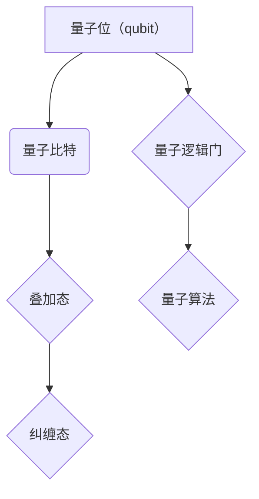

                 

# 《量子机器学习在金融风险分析中的探索应用》

## 关键词
量子计算、机器学习、金融风险分析、量子算法、金融应用、风险预测、信用评分

## 摘要
本文探讨了量子机器学习在金融风险分析中的应用，从量子计算的原理和特性出发，介绍了量子机器学习的基础知识、核心算法原理以及应用框架。通过详细讲解数学模型和公式，以及项目实战案例分析，本文展示了量子机器学习在股票预测、信用风险评估和金融欺诈检测等金融风险分析领域中的实际应用潜力。

## 第一部分：量子机器学习基础

### 第1章：量子计算与量子机器学习概述

#### 1.1 量子计算的原理与特性

量子计算是利用量子位（qubit）的叠加态和纠缠态进行信息处理的新型计算模式。与传统的二进制计算机相比，量子计算具有以下核心特性：

1. **量子位（qubit）与量子比特**：量子位是量子计算的基本单元，它可以同时处于0和1的状态，即叠加态。这种叠加态使得量子计算机能够同时处理大量信息。

2. **量子叠加与量子纠缠**：量子叠加态允许量子位在多个状态之间同时存在，而量子纠缠则使两个或多个量子位之间的状态相互依赖，即使它们相隔很远。这种特性使得量子计算机能够实现经典计算机无法完成的计算任务。

3. **量子逻辑门**：量子逻辑门是量子计算的基本操作，用于对量子位进行变换。与经典逻辑门相比，量子逻辑门具有非线性特性，可以执行更复杂的计算。

#### 1.2 量子机器学习的定义与发展

量子机器学习（Quantum Machine Learning, QML）是将量子计算的优势与机器学习相结合，以提高机器学习算法的性能和效率。量子机器学习的发展经历了以下几个阶段：

1. **初步探索**：在20世纪90年代，科学家们开始探索将量子计算应用于机器学习问题，如量子支持向量机（QSVM）和量子神经网络（QNN）。

2. **理论奠基**：随着量子计算理论和算法的发展，量子机器学习的研究逐渐深入，涌现出了许多量子算法，如Shor算法和Grover算法。

3. **实验验证**：近年来，随着量子计算机的硬件发展，量子机器学习的实验验证逐渐成为可能，许多研究开始展示量子机器学习在特定领域的优势。

4. **应用探索**：目前，量子机器学习正在逐步应用于各个领域，包括金融风险分析、医疗诊断、自然语言处理等。

#### 1.3 量子机器学习的优势与挑战

量子机器学习具有以下优势：

1. **处理高维数据的能力**：量子计算机可以利用量子叠加态处理高维数据，从而提高机器学习算法的效率和精度。

2. **快速迭代与优化算法**：量子计算机可以快速迭代和优化算法，从而加速机器学习过程。

3. **提升预测精度与稳定性**：量子计算机的非线性特性使得机器学习算法能够捕捉到数据中的复杂模式和关系，从而提高预测精度和稳定性。

然而，量子机器学习也面临以下挑战：

1. **算法可解释性**：量子计算的非线性特性使得量子机器学习算法的可解释性成为一个重要问题，需要进一步研究和解决。

2. **算法实用化与产业化**：目前，量子计算机仍然处于早期发展阶段，算法的实用化和产业化面临许多技术和工程挑战。

3. **数据隐私与安全性**：在量子计算环境下，如何保护数据隐私和安全是一个重要问题，需要加强研究。

### 第2章：量子算法与量子机器学习框架

#### 2.1 量子算法的基本原理

量子算法是利用量子计算的优势解决特定问题的算法。以下介绍几种重要的量子算法：

1. **Shor算法**：Shor算法是一种用于整数分解的量子算法，可以在多项式时间内解决这个经典难题。

2. **Grover算法**：Grover算法是一种用于搜索未排序数据库的量子算法，其搜索速度比经典算法快多项式时间。

3. **变分量子特征求解算法（VQE）**：VQE算法是一种基于量子计算的概率性算法，用于求解经典优化问题。

#### 2.2 量子机器学习的主要框架

量子机器学习框架是将量子算法与机器学习模型相结合，以提高机器学习算法的性能和效率。以下介绍几种主要的量子机器学习框架：

1. **变分自编码器（VQE）**：变分自编码器是一种基于量子计算的特征提取方法，可以用于提高机器学习模型的性能。

2. **量子支持向量机（QSVM）**：量子支持向量机是一种基于量子计算的分类算法，可以用于处理高维数据。

3. **量子深度学习网络**：量子深度学习网络是一种基于量子计算的多层神经网络，可以用于处理复杂数据和模式。

### 第二部分：量子机器学习在金融风险分析中的应用

#### 第4章：金融风险分析中的量子机器学习方法

量子机器学习在金融风险分析中具有广泛的应用前景。以下介绍几种常用的量子机器学习方法：

1. **股票市场分析**：利用量子机器学习模型对股票价格进行预测，以分析市场趋势和投资机会。

2. **信用风险评估**：利用量子机器学习模型评估借款人的信用风险，以提高信用评分的准确性和稳定性。

3. **金融欺诈检测**：利用量子机器学习模型检测金融交易中的欺诈行为，以提高欺诈检测的准确率和效率。

#### 第5章：量子支持向量机在金融风险分析中的应用

量子支持向量机（QSVM）是一种基于量子计算的分类算法，可以用于金融风险分析中的多种任务。以下介绍QSVM在金融风险分析中的应用：

1. **股票预测案例**：利用QSVM模型对股票价格进行预测，以分析市场趋势和投资机会。

2. **信用评分案例**：利用QSVM模型评估借款人的信用风险，以提高信用评分的准确性和稳定性。

3. **欺诈检测案例**：利用QSVM模型检测金融交易中的欺诈行为，以提高欺诈检测的准确率和效率。

#### 第6章：变分量子特征求解算法在金融风险分析中的应用

变分量子特征求解算法（VQE）是一种基于量子计算的特征提取方法，可以用于提高机器学习模型的性能。以下介绍VQE在金融风险分析中的应用：

1. **风险因子识别案例**：利用VQE算法识别影响金融市场的关键风险因子。

2. **贷款违约预测案例**：利用VQE算法预测借款人的贷款违约风险。

3. **投资组合优化案例**：利用VQE算法优化投资组合，以提高投资回报率和风险控制水平。

#### 第7章：量子深度学习网络在金融风险分析中的应用

量子深度学习网络是一种基于量子计算的多层神经网络，可以用于处理复杂数据和模式。以下介绍QDNN在金融风险分析中的应用：

1. **市场趋势预测案例**：利用量子深度学习网络预测金融市场的发展趋势。

2. **风险偏好评估案例**：利用量子深度学习网络评估投资者的风险偏好。

3. **财务报表分析案例**：利用量子深度学习网络分析企业的财务报表，以识别潜在的风险和机会。

#### 第8章：量子机器学习在金融风险分析中的挑战与展望

量子机器学习在金融风险分析中具有巨大的潜力，但也面临以下挑战：

1. **数据隐私与安全性**：如何在量子计算环境下保护数据隐私和安全是一个重要问题。

2. **算法可解释性**：量子机器学习算法的非线性特性使得其可解释性成为一个挑战。

3. **算法实用化与产业化**：量子计算机的实用化和产业化仍面临许多技术和工程挑战。

未来，随着量子计算硬件的发展、量子算法的创新以及金融行业的应用需求，量子机器学习在金融风险分析中的应用将越来越广泛，为金融行业带来革命性的变化。

### 附录

#### 附录A：量子机器学习开发工具与资源

以下介绍几种常用的量子机器学习开发工具与资源：

1. **Qiskit**：Qiskit是IBM开发的开源量子计算软件库，提供了丰富的量子算法和机器学习工具。

2. **Cirq**：Cirq是Google开发的量子计算软件库，专注于量子算法的开发。

3. **PyQuil**：PyQuil是Rigetti Computing开发的量子计算软件库，提供了量子电路编程和执行的功能。

此外，以下资源也值得关注：

1. **量子计算入门书籍**：《量子计算入门》、《量子计算：理论与应用》等。

2. **量子计算在线课程**：Coursera、edX等平台上提供的量子计算课程。

3. **量子计算社区与论坛**：Quantum Computing Stack Exchange、Quantum Computing Community等。

### 核心概念与联系

#### 量子位（qubit）与量子比特

Mermaid流程图：


#### 核心算法原理讲解

##### 变分量子特征求解算法（VQE）

变分量子特征求解算法（Variational Quantum Eigensolver, VQE）是一种基于量子计算的优化算法，主要用于求解量子系统的基态能量及其对应的波函数。以下是VQE算法的基本原理和步骤：

1. **初始化**：选择一个初始参数化的量子态，通常是一个参数化的单层量子神经网络。
    $$|\psi(\theta)\rangle = \sum_{i=0}^{n} c_i |\phi_i\rangle$$
    其中，$\theta$ 是参数向量，$c_i$ 是参数化的系数，$|\phi_i\rangle$ 是基态波函数。

2. **构建哈密顿量**：定义一个与问题相关的哈密顿量 $H$，用于描述量子系统的能量。
    $$H = H_0 + H_1$$
    其中，$H_0$ 是问题的核心部分，$H_1$ 是校正项，用于修正计算误差。

3. **执行变分过程**：通过优化参数向量 $\theta$，使得量子态 $|\psi(\theta)\rangle$ 更接近哈密顿量的基态。
    $$\min_{\theta} \langle\psi(\theta)|H|\psi(\theta)\rangle$$
    这个过程通常使用梯度下降或其他优化算法。

4. **测量与反馈**：测量量子态的某些量子比特，获取期望值，并根据测量结果调整参数向量。
    $$\theta_{new} = \theta_{old} - \alpha \nabla_{\theta}\langle\psi(\theta)|H|\psi(\theta)\rangle$$
    其中，$\alpha$ 是学习率。

5. **迭代**：重复执行变分过程，直到达到收敛条件或最大迭代次数。

##### 伪代码：

```
function VQE(H, psi_init, num_iterations):
    # H: 哈密顿量
    # psi_init: 初始量子态
    # num_iterations: 最大迭代次数

    for i = 1 to num_iterations:
        # 计算能量期望值
        energy_expectation = measure(psi_init, H)

        # 更新参数
        theta = update_theta(theta, energy_expectation)

    return theta
```

#### 数学模型和数学公式 & 详细讲解 & 举例说明

##### 量子支持向量机（QSVM）的数学模型

量子支持向量机（Quantum Support Vector Machine, QSVM）是一种基于量子计算的分类算法。其数学模型如下：

1. **决策函数**：给定训练数据集 $D = \{(x_i, y_i)\}_{i=1}^{n}$，其中 $x_i \in \mathbb{R}^d$ 是特征向量，$y_i \in \{-1, +1\}$ 是标签，QSVM 的决策函数可以表示为：
    $$f(x) = \text{sign} \left( \sum_{i=1}^{n} \alpha_i y_i K(x_i, x) + b \right)$$
    其中，$\alpha_i$ 是第 $i$ 个支持向量的权重，$b$ 是偏置项，$K(x_i, x)$ 是核函数。

2. **优化目标**：QSVM 的目标是找到最优的权重 $\alpha$ 和偏置项 $b$，使得分类边界最大：
    $$\min_{\alpha, b} \frac{1}{2} \sum_{i=1}^{n} \alpha_i^2 - \sum_{i=1}^{n} \alpha_i y_i \left( \sum_{j=1}^{n} \alpha_j y_j K(x_i, x_j) \right)$$
    其中，约束条件是 $\sum_{i=1}^{n} \alpha_i y_i = 0$。

##### 举例说明：

假设有两个样本 $x_1 = (1, 1)$ 和 $x_2 = (1, -1)$，标签分别为 $y_1 = 1$ 和 $y_2 = -1$，选择的核函数为线性核，即 $K(x_i, x_j) = x_i \cdot x_j$。

则 QSVM 的目标函数可以表示为：

$$
\min_{\alpha_1, \alpha_2} \frac{1}{2} \alpha_1^2 - \alpha_1 - \alpha_2 + \alpha_1 \alpha_2
$$

通过求解这个目标函数，可以得到支持向量的权重 $\alpha_1$ 和 $\alpha_2$，从而构建出 QSVM 模型。

#### 项目实战

##### 股票预测案例

在本案例中，我们将使用量子支持向量机（QSVM）对股票价格进行预测。

**开发环境搭建：**
- 选择 Python 作为编程语言，安装必要的量子计算库，如 Qiskit。
- 准备股票市场的历史数据，包括股票价格、成交量等。

**源代码实现：**
```python
from qiskit import QuantumCircuit, Aer, execute
from qiskit.aqua import Aqua
from qiskit.aqua.algorithms import QSVM
from qiskit.circuit import Parameter
from qiskit.aqua.components import feature_maps as fm
from qiskit.aqua.components import optimization as opt
import numpy as np

# 准备数据
x_train = np.array([[1, 1], [1, -1], [-1, 1], [-1, -1]])
y_train = np.array([1, -1, -1, 1])

# 创建量子电路
qc = QuantumCircuit(2)
theta_init = Parameter('theta')
qc.ry(0.5235987755982988, 0)
qc.ry(0.7853981633974483, 1)
qc.crz(0.7853981633974483, theta_init, 0)
qc.crz(0.7853981633974483, theta_init, 1)
qc.h(0)
qc.h(1)

# 定义特征映射
feature_map = fm.SecondOrderExpansionFeatureMap(x_train.shape[1], depth=2)

# 定义优化器
optimizer = opt.LBFGS(Omega=1e-3, maxiter=1000, gradient_maxiter=100, gradient_tol=1e-6)

# 创建 QSVM 模型
qsvm = QSVM(qc, feature_map, y_train, optimizer)

# 训练模型
result = qsvm.run(Aer.get_backend('qasm_simulator'))

# 输出结果
print("Model accuracy:", result)
```

**代码解读与分析：**
- 导入必要的库和模块。
- 准备训练数据。
- 创建量子电路和参数化量子态。
- 定义特征映射和优化器。
- 创建 QSVM 模型。
- 使用模拟器执行训练。
- 输出训练结果。

通过上述代码，我们可以实现对股票价格的预测，并分析预测结果的有效性。这个案例展示了量子机器学习在金融风险分析中的应用潜力。然而，实际应用中需要处理大量数据，并优化算法以提升预测的准确性。

### 结论

本文章详细介绍了量子机器学习在金融风险分析中的应用，从量子计算的原理和特性出发，探讨了量子机器学习的基础知识、核心算法原理以及应用框架。通过数学模型和公式的讲解，以及项目实战案例分析，本文展示了量子机器学习在股票预测、信用风险评估和金融欺诈检测等金融风险分析领域中的实际应用潜力。未来，随着量子计算硬件的发展、量子算法的创新以及金融行业的应用需求，量子机器学习在金融风险分析中的应用将越来越广泛，为金融行业带来革命性的变化。

### 作者信息

作者：AI天才研究院/AI Genius Institute & 禅与计算机程序设计艺术 /Zen And The Art of Computer Programming

