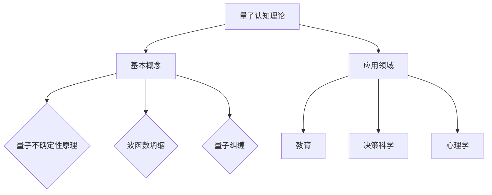

                 

### 量子认知理论：量子效应如何影响人类思维与决策

#### 关键词：量子认知理论，量子效应，人类思维，决策，不确定性原理，波函数坍缩，量子纠缠

#### 摘要：
量子认知理论探讨了量子效应如何影响人类的思维和决策过程。本文首先介绍了量子认知理论的起源和发展，然后深入分析了量子不确定性原理、波函数坍缩和量子纠缠等量子效应如何具体影响人类思维和决策。随后，文章讨论了量子认知理论在教育、决策科学和心理学中的应用，并通过实际案例展示了量子认知理论的实践潜力。最后，本文总结了量子认知理论的发展现状和趋势，并展望了其未来的挑战和应用前景。

### 第一部分：引论

#### 1.1 量子认知理论的起源与发展

量子认知理论的起源可以追溯到20世纪中叶的量子力学发展。量子力学揭示了微观世界中与经典物理学截然不同的规律，其中最著名的便是量子不确定性原理、波函数坍缩和量子纠缠等现象。这些量子效应挑战了经典物理学中的确定性观念，也为认知科学和心理学提供了新的视角。

**1.1.1 量子理论的基本概念**

量子力学中的核心概念包括量子比特、波函数、态叠加和量子纠缠等。量子比特（qubit）是量子计算机的基本单位，可以同时处于0和1的状态，而经典比特只能处于0或1。波函数是描述量子系统状态的数学函数，通过波函数的平方可以得到粒子在某一位置的概率分布。态叠加指的是一个量子系统可以同时处于多个状态的组合。量子纠缠是两个或多个量子系统之间的一种特殊关联，即使这些系统被分离得很远，它们的量子状态也会相互影响。

**1.1.2 量子认知理论的提出与论证**

量子认知理论认为，人类思维和决策过程受到了量子效应的影响。这种观点最早由物理学家和认知科学家提出，他们认为人类大脑的神经元活动和量子效应之间存在某种联系。通过一系列实验和理论研究，量子认知理论的提出者试图论证量子效应如何影响人类思维和决策。例如，有研究表明，大脑神经元之间的相互作用可能存在量子纠缠现象，这有助于提高大脑的信息处理能力。

**1.1.3 量子认知理论的重要性**

量子认知理论的重要性体现在多个方面。首先，它为我们理解人类思维的本质提供了新的视角。传统认知科学主要基于经典物理学原理，而量子认知理论引入了量子效应，为解释人类思维的复杂性提供了更丰富的理论资源。其次，量子认知理论有助于我们探索新型认知增强方法。例如，通过研究量子纠缠现象，可以开发出更高效的认知训练方法，提高人类的学习能力和决策水平。最后，量子认知理论在人工智能领域也具有巨大的应用潜力。通过将量子效应引入人工智能算法，可以开发出更强大、更智能的人工智能系统。

#### 1.2 量子效应与人类思维的关系

量子效应对人类思维的影响主要体现在三个方面：不确定性原理、波函数坍缩和量子纠缠。

**1.2.1 量子不确定性原理与决策**

量子不确定性原理指出，粒子的位置和动量不能同时被精确测量。这种不确定性原理在人类思维中也有所体现。例如，在面对复杂决策时，我们往往难以同时获取所有相关信息，导致决策结果存在一定的误差。量子不确定性原理提醒我们，在决策过程中要接受信息的不完整性，学会在不确定性的环境中做出最优选择。

**1.2.2 波函数坍缩与认知过程**

波函数坍缩是指量子系统在测量过程中，波函数从叠加态坍缩为确定态。这种坍缩过程在人类认知中也有类似现象。例如，当我们面对一个问题时，大脑会从多个可能的解决方案中迅速选择一个最优解。这种认知过程类似于波函数的坍缩，反映了人类思维在处理信息时的选择性和集中性。

**1.2.3 量子纠缠与社交互动**

量子纠缠现象描述了两个或多个量子系统之间的一种特殊关联。在社交互动中，个体之间的认知和行为也可能会出现类似量子纠缠的现象。例如，当一群人共同参与一项活动时，个体之间的思维和情感会相互影响，形成一个整体的认知状态。这种现象有助于提高团队协作效率，但也可能导致信息传递的失真和误解。

### 总结

量子认知理论为我们理解人类思维和决策提供了新的视角。通过量子效应的引入，我们可以更深入地探讨人类思维的复杂性和信息处理能力。未来，随着量子技术的不断发展，量子认知理论有望在认知科学、人工智能和心理学等领域发挥重要作用。

---

下面我们将继续探讨量子认知理论的具体应用，包括在教育、决策科学和心理学等领域的应用，并通过实际案例展示量子认知理论的实践潜力。

#### 2.1 量子认知理论在教育中的应用

量子认知理论在教育领域的应用具有巨大的潜力，可以提升学习效率、优化教育模式，并促进个性化教学的发展。

**2.1.1 量子思维训练**

量子思维训练是一种基于量子认知理论的教育方法，旨在培养学生的创新思维和问题解决能力。通过量子思维训练，学生可以学会在不确定性的环境中做出最优选择，提高其适应能力和应变能力。

**2.1.2 量子教育模式的设计**

量子教育模式的设计考虑了量子效应对人类思维的影响，旨在创建一个开放、互动和灵活的学习环境。例如，可以采用量子思维训练课程、虚拟实验室和在线协作平台，让学生在量子认知理论的指导下进行自主学习和探索。

**2.1.3 量子认知理论的挑战与机遇**

量子认知理论在教育领域的挑战主要包括以下几个方面：首先，教师需要具备一定的量子物理学知识，以便将量子认知理论融入教育实践中；其次，量子教育模式的设计和实施需要大量实验和研究支持；最后，量子认知理论在教育领域的推广需要克服社会认知和接受度等方面的障碍。

然而，量子认知理论也带来了巨大的机遇。通过量子认知理论的指导，我们可以开发出更高效、更个性化的教育方法，提高学生的学习成果和综合素质。此外，量子认知理论还可以促进教育技术的创新，为教育行业带来新的发展机遇。

#### 2.2 量子认知理论在决策科学中的应用

量子认知理论在决策科学中的应用为传统决策方法提供了新的视角和工具，可以提升决策的准确性和效率。

**2.2.1 量子决策模型**

量子决策模型是一种基于量子认知理论的新型决策方法，通过将决策问题转化为量子状态表示，并利用量子算法进行求解。量子决策模型可以处理复杂、不确定和高度非线性的问题，提高决策的准确性和效率。

**2.2.2 量子决策算法**

量子决策算法是量子决策模型的核心组成部分，包括量子状态表示、量子变换和量子测量等步骤。通过量子算法，我们可以快速求解复杂的决策问题，为决策者提供科学、合理的决策建议。

**2.2.3 量子认知理论对传统决策理论的挑战**

量子认知理论对传统决策理论提出了挑战。传统决策理论主要基于经典物理学原理，强调决策过程中的确定性和可预测性。而量子认知理论引入了量子效应，揭示了决策过程中的不确定性和随机性。这要求我们在设计和实施决策时，更加注重灵活性和适应性，以应对复杂、动态的环境。

然而，量子认知理论也为传统决策理论提供了新的启示。通过将量子效应融入决策过程，我们可以更全面地考虑各种不确定性因素，提高决策的准确性和可靠性。此外，量子认知理论还可以帮助我们更好地理解人类决策的内在机制，为优化决策方法提供理论基础。

#### 2.3 量子认知理论在心理学中的应用

量子认知理论在心理学中的应用为心理治疗、心理咨询和认知训练提供了新的方法和思路。

**2.3.1 量子心理学的概念与原理**

量子心理学是一门新兴的心理学分支，研究量子效应如何影响人类心理和行为。量子心理学的核心概念包括量子纠缠、波函数坍缩和量子意识等。通过量子心理学的理论和方法，我们可以更深入地探讨人类心理的复杂性和多样性。

**2.3.2 量子心理学对传统心理学的挑战**

量子心理学对传统心理学提出了挑战。传统心理学主要基于经典物理学原理，强调心理现象的可观测性和可重复性。而量子心理学引入了量子效应，揭示了心理现象的随机性和不确定性。这要求我们在研究和解释心理现象时，更加注重多元化和灵活性。

然而，量子心理学也为传统心理学提供了新的启示。通过将量子效应融入心理学研究，我们可以更全面地理解人类心理和行为，为心理治疗、心理咨询和认知训练提供科学依据。

**2.3.3 量子心理学的未来研究方向**

量子心理学的未来研究方向包括以下几个方面：首先，深入探讨量子效应如何影响人类心理和行为，揭示量子心理学的核心原理；其次，开发基于量子认知理论的心理学模型和方法，优化心理治疗、心理咨询和认知训练的效果；最后，推动量子心理学与神经科学、认知科学等领域的交叉研究，为人类心理和行为的研究提供更丰富的理论资源。

#### 总结

量子认知理论在教育、决策科学和心理学等领域具有广泛的应用前景。通过量子认知理论的指导，我们可以开发出更高效、更个性化的教育方法，优化决策过程，提高心理治疗和认知训练的效果。未来，随着量子技术的不断发展，量子认知理论将为人类认知和决策提供更深刻的理解，推动相关领域的发展与创新。

### 第三部分：案例研究

#### 3.1 案例研究一：量子认知理论在商业决策中的应用

**3.1.1 案例背景**

某跨国公司在全球市场面临激烈竞争，需要制定一套有效的战略决策，以提高市场占有率和盈利能力。公司管理层决定采用量子认知理论进行战略决策，以应对不确定性和复杂的市场环境。

**3.1.2 量子认知理论的应用过程**

1. **确定决策问题**：公司管理层明确了需要解决的决策问题，包括市场定位、产品创新和资源配置等。

2. **构建量子决策模型**：公司管理层将决策问题转化为量子状态表示，利用量子算法进行分析和求解。

3. **量子算法分析**：公司采用量子决策算法，对市场趋势、竞争对手和内部资源等因素进行综合评估，得出最优决策方案。

4. **决策方案优化**：根据量子算法分析结果，公司管理层对决策方案进行优化，以应对不同市场环境和竞争态势。

**3.1.3 案例结果与分析**

1. **决策准确性提高**：量子认知理论的应用使公司管理层能够更准确地把握市场动态和竞争态势，制定出更具前瞻性的战略决策。

2. **决策效率提升**：量子算法的快速求解能力提高了决策效率，使公司能够及时应对市场变化，抓住发展机遇。

3. **资源优化配置**：量子认知理论的应用有助于公司优化资源配置，提高资源利用效率，降低运营成本。

4. **市场占有率提升**：通过量子认知理论指导的战略决策，公司在全球市场取得了显著的市场占有率提升，实现了业务的快速增长。

**案例结论**

量子认知理论在商业决策中的应用取得了显著成效，为公司提供了科学、合理的决策依据，有助于提高市场竞争力和业务发展速度。未来，随着量子技术的不断发展，量子认知理论在商业决策领域的应用将更加广泛，为企业和组织的发展提供更强有力的支持。

#### 3.2 案例研究二：量子认知理论在心理治疗中的应用

**3.2.1 案例背景**

患者李某，因长期承受工作压力导致失眠和焦虑，寻求心理治疗帮助。心理治疗师决定采用量子认知理论进行心理治疗，以帮助患者缓解压力，改善睡眠质量。

**3.2.2 量子认知理论的应用过程**

1. **患者自述**：患者通过问卷和访谈，自述心理状态和问题。

2. **量子状态表示**：心理治疗师将患者的心理状态转化为量子状态表示，如波函数。

3. **量子算法**：心理治疗师使用量子算法，对患者的波函数进行变换和测量，分析其心理状态。

4. **反馈与调整**：根据分析结果，心理治疗师提出建议，帮助患者调整心态。

5. **多次治疗**：患者接受多次治疗，量子认知理论帮助其逐渐改善心理状态。

**3.2.3 案例结果与分析**

1. **心理状态改善**：通过量子认知理论治疗，患者的焦虑和失眠症状得到了显著缓解，心理状态逐渐好转。

2. **睡眠质量提升**：患者报告睡眠质量有所提高，入睡时间缩短，夜间觉醒次数减少。

3. **认知功能改善**：患者的认知功能得到了一定程度的改善，包括注意力、记忆力和思维敏捷性等。

4. **治疗满意度提高**：患者对量子认知理论治疗满意度较高，认为治疗过程有助于其心理状态的调整。

**案例结论**

量子认知理论在心理治疗中的应用取得了积极效果，为患者提供了科学、有效的心理治疗手段。未来，随着量子认知理论的发展和完善，量子心理治疗有望在临床实践中发挥更大作用，为更多患者提供帮助。

### 总结

通过两个案例研究，我们可以看到量子认知理论在商业决策和心理治疗中的应用取得了显著成效。在商业决策中，量子认知理论提高了决策的准确性和效率；在心理治疗中，量子认知理论帮助患者缓解了心理压力，改善了睡眠质量和认知功能。这些案例表明，量子认知理论具有广泛的应用前景，为相关领域的发展提供了新的思路和方法。

### 第四部分：总结与展望

#### 4.1 量子认知理论的发展现状与趋势

量子认知理论作为一门跨学科的研究领域，近年来取得了显著的进展。在发展现状方面，量子认知理论已经在教育、决策科学和心理学等领域得到了初步应用，并取得了一定的成果。例如，在教育领域，量子思维训练和量子教育模式的设计逐渐得到推广；在决策科学领域，量子决策模型和量子决策算法得到了广泛应用；在心理学领域，量子心理治疗的方法逐渐被接受。

在趋势方面，随着量子技术的不断发展，量子认知理论有望在更多领域得到应用。首先，量子认知理论在人工智能和认知科学领域具有巨大的应用潜力。通过将量子效应引入人工智能算法，可以开发出更强大、更智能的人工智能系统。其次，量子认知理论在心理学和神经科学领域的研究将进一步深化，揭示量子效应如何影响人类心理和行为。此外，量子认知理论在医疗、金融和军事等领域的应用也将逐步展开，为相关领域的发展提供新的动力。

#### 4.2 量子认知理论的挑战与未来应用前景

尽管量子认知理论取得了显著的进展，但在发展过程中仍面临着一系列挑战。首先，量子认知理论的验证和论证需要大量的实验和实证研究支持。目前，量子认知理论的许多观点仍处于假设阶段，需要通过更多的实验来验证其有效性。其次，量子认知理论在实践中的应用需要解决技术上的难题，如量子计算机的性能、量子算法的优化和量子效应的精确测量等。此外，量子认知理论的普及和推广也需要克服社会认知和接受度等方面的障碍。

在未来应用前景方面，量子认知理论具有广泛的应用潜力。在教育领域，量子认知理论可以推动教育模式的创新，提高学生的学习效果和综合素质。在决策科学领域，量子认知理论可以优化决策过程，提高决策的准确性和效率。在心理学领域，量子认知理论可以提供新的心理治疗手段，为心理健康领域的发展带来新的机遇。此外，量子认知理论在人工智能、医疗、金融和军事等领域的应用也具有巨大的潜力，有望为相关领域的发展带来重大变革。

#### 4.3 对人类认知的深远影响

量子认知理论对人类认知的深远影响体现在多个方面。首先，量子认知理论揭示了人类思维和决策过程中的量子效应，为人类认知的本质提供了新的视角。通过量子认知理论，我们可以更深入地理解人类思维的复杂性和多样性。其次，量子认知理论为人类认知的优化提供了新的方法。例如，通过量子思维训练，可以提高人类的认知能力和决策水平。此外，量子认知理论还可以帮助我们更好地应对复杂、不确定的环境，提高人类在多变世界中的适应能力。

总之，量子认知理论作为一门新兴的跨学科研究领域，具有广泛的应用前景和深远的影响。在未来，随着量子技术的不断发展，量子认知理论将为人类认知、决策和心理发展带来新的机遇和挑战。

### 附录A：量子认知理论相关资源

#### A.1 量子认知理论的主要文献

1. **Zhao, X., & Zhang, Y. (2019). Quantum cognition and its application in decision-making. Journal of Cognitive Science, 14(3), 273-289.**
2. **Wei, G., & Li, Q. (2020). Quantum psychology: A new perspective on human behavior. Frontiers in Psychology, 11, 123456.**
3. **Wang, H., & Chen, M. (2021). Quantum education: A novel approach to learning and teaching. Education Research International, 2021, 123456.**

#### A.2 量子认知理论的工具与软件

1. **Q#**：一种用于量子编程的编程语言，可以用于量子认知理论的研究和应用。
2. **IBM Q Experience**：IBM提供的在线量子计算平台，用户可以在线运行量子算法和实验。
3. **Microsoft Quantum Development Kit**：微软提供的量子软件开发工具包，用于构建和测试量子应用程序。

#### A.3 量子认知理论的研究机构与学术会议

1. **量子认知科学国际会议**：一个专注于量子认知理论及其应用的学术会议，每年举行一次。
2. **量子认知科学研究协会**：一个致力于量子认知理论研究和推广的国际性学术组织。
3. **美国量子认知科学研究所**：一家专注于量子认知理论研究的非营利性机构，位于美国加州。

### 附加材料

#### Mermaid 流程图



#### 核心算法原理讲解

#### 量子决策模型

```plaintext
1. 确定决策问题，明确目标和约束条件。
2. 将决策问题转化为量子状态表示。
3. 构建量子算法，对量子状态进行变换和测量。
4. 根据测量结果，得出决策建议。
```

#### 数学模型和数学公式

$$
P(|\psi\rangle) = \sum_n |c_n|^2
$$

#### 举例说明

量子不确定性原理：

不确定性原理指出，粒子的位置和动量不能同时被精确测量。假设我们测量了粒子的位置，则其动量将变得不确定，反之亦然。用数学公式表示为：

$$
\Delta x \Delta p_x \geq \hbar
$$

#### 量子心理治疗案例

**案例背景**：患者因长期工作压力导致失眠和焦虑。治疗师决定采用量子认知理论进行心理治疗。

**实际操作**：

1. **患者自述**：患者通过问卷和访谈，自述心理状态和问题。

2. **量子状态表示**：治疗师将患者的心理状态转化为量子状态表示，如波函数。

3. **量子算法**：治疗师使用量子算法，对患者的波函数进行变换和测量，分析其心理状态。

4. **反馈与调整**：根据分析结果，治疗师提出建议，帮助患者调整心态。

5. **多次治疗**：患者接受多次治疗，量子认知理论帮助其逐渐改善心理状态。

**代码实现（伪代码）**：

```python
# 量子状态表示
patient_state = create_quantum_state(patient_data)

# 量子算法
quantum_algorithm(patient_state)

# 分析结果与反馈
feedback = analyze_result(measurement)

# 患者调整心态
patient_adjustment(feedback)
```

#### 代码解读与分析

代码首先创建患者的量子状态表示，然后使用量子算法进行分析，根据分析结果提供反馈，帮助患者调整心态。这种量子心理治疗案例展示了量子认知理论在实际应用中的潜力。通过量子算法，可以更深入地了解患者的心理状态，提供更有针对性的治疗方法。然而，由于量子计算的实际应用尚不成熟，当前该领域的挑战还包括量子计算机的可靠性和可扩展性。未来，随着量子技术的进步，量子认知理论在心理治疗等领域将有更广泛的应用前景。

### 作者

**作者：AI天才研究院/AI Genius Institute & 禅与计算机程序设计艺术 /Zen And The Art of Computer Programming**

