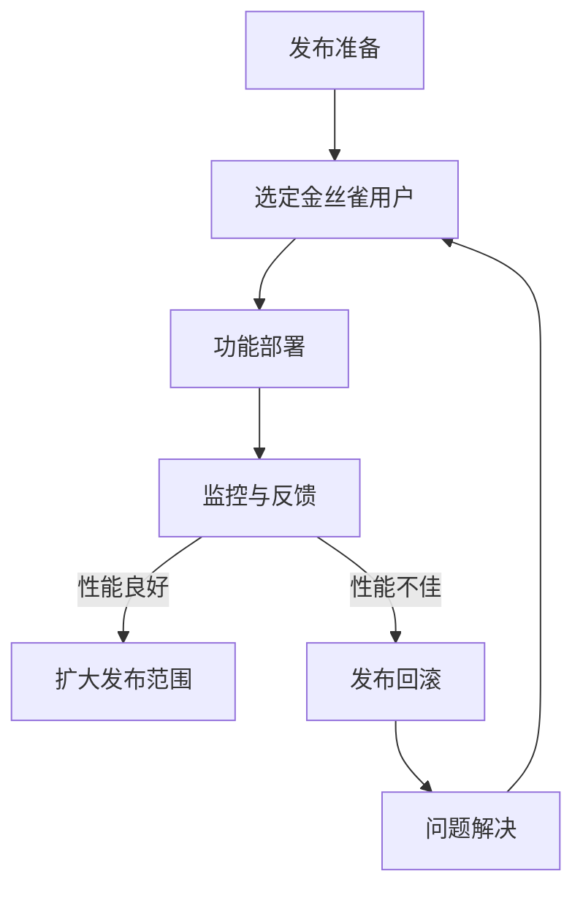

                 

# 金丝雀发布：逐步验证AI新功能的有效方法

## 关键词
- AI新功能验证
- 金丝雀发布
- 逐步发布策略
- 性能监控
- 风险控制

## 摘要
金丝雀发布是一种用于逐步验证AI新功能的有效方法。本文详细介绍了金丝雀发布的原理、架构、流程以及策略设计。通过具体案例分析，展示了金丝雀发布在电商平台和金融机构中的实践应用。文章还探讨了金丝雀发布在不同领域的应用潜力，并提供了一系列实现细节、算法原理、数学模型和代码实战，以帮助读者深入理解和掌握这一方法。

## 目录

1. 引言
2. 金丝雀发布原理
3. 金丝雀发布架构与流程
4. 金丝雀发布策略设计
5. 金丝雀发布实施与部署
6. 金丝雀发布案例分析
   - 案例一：某电商平台
   - 案例二：某金融机构
   - 案例总结与探讨
7. 金丝雀发布效果评估与优化
8. 金丝雀发布在AI新功能验证中的应用
9. 未来展望与趋势
10. 附录
   - 附录A：金丝雀发布常用术语解释
   - 附录B：金丝雀发布参考资料
   - 附录C：金丝雀发布相关工具介绍

## 引言

在当今快速发展的AI领域，新功能的引入和系统的持续升级成为企业竞争的关键。然而，AI系统的高度复杂性和不确定性使得新功能上线过程中存在诸多风险，如性能问题、安全漏洞、用户体验下降等。为了降低这些风险，一种名为“金丝雀发布”（Canary Release）的逐步验证方法被广泛应用。

金丝雀发布起源于传统的煤矿安全措施。矿工将金丝雀放入矿井，因为金丝雀对有毒气体极为敏感，能提前预警矿井中的危险情况。同理，在软件发布中，金丝雀发布通过将新功能逐渐引入部分用户，监控其性能和稳定性，从而减少对整个系统的风险。

本文将详细介绍金丝雀发布的原理、架构、流程、策略设计以及实际应用。通过具体的案例分析和代码实战，帮助读者深入理解金丝雀发布的核心概念和操作方法，掌握其在AI新功能验证中的关键作用。

## 1. 金丝雀发布原理

金丝雀发布的核心思想是将新功能逐步引入系统，通过监控和反馈机制，评估其性能和稳定性。其原理可以概括为以下几个方面：

### 1.1 逐步引入

金丝雀发布通过将新功能先引入一小部分用户（即“金丝雀用户”），而不是立即推向所有用户。这样做的目的是为了在最小化风险的同时，最大程度地收集反馈和性能数据。

### 1.2 监控与反馈

在金丝雀发布过程中，系统会持续监控新功能的性能指标，如响应时间、错误率、吞吐量等。同时，收集用户反馈，了解新功能在实际使用中的表现。

### 1.3 回滚与修复

如果在监控过程中发现新功能存在问题，如性能下降、错误率升高，可以立即回滚，撤销对金丝雀用户的发布，并修复问题。这样可以避免问题扩散到整个系统，造成更大的影响。

### 1.4 扩大发布范围

在确保新功能稳定且性能良好后，可以逐步扩大发布范围，将新功能推向更多的用户。这样做的目的是在确保新功能对大多数用户无负面影响的前提下，提高系统的可用性和用户体验。

### 1.5 持续迭代

金丝雀发布不仅适用于新功能的初次发布，还可以用于后续的迭代和升级。每次迭代都可以按照金丝雀发布的流程进行，确保新功能或改进措施的安全引入和稳定运行。

### 1.6 核心概念

- **金丝雀用户**：指被选中的，用于率先体验新功能的用户。
- **发布范围**：指金丝雀发布的用户群体范围，可以是具体的用户列表，也可以是按照某些条件筛选的用户群体。
- **监控指标**：指用于评估新功能性能的指标，如响应时间、错误率、吞吐量等。
- **回滚**：指在发现新功能存在问题后，撤销其发布，恢复到之前的状态。

### 1.7 金丝雀发布与传统发布方式的对比

| 传统发布方式 | 金丝雀发布 |
| :--- | :--- |
| 全量发布 | 逐步发布 |
| 缺乏反馈 | 具备反馈机制 |
| 高风险 | 低风险 |
| 难以回滚 | 可以回滚 |

通过对比可以看出，金丝雀发布相比传统的全量发布方式，具有更高的安全性和可靠性。它通过逐步引入和监控，确保新功能的稳定性和性能，从而减少对系统的风险。

## 2. 金丝雀发布架构与流程

金丝雀发布的实现需要一套完整的架构和流程来支持，包括硬件架构、软件架构、数据架构以及发布流程。以下将对这些部分进行详细讲解。

### 2.1 金丝雀发布架构

#### 2.1.1 硬件架构

金丝雀发布的硬件架构主要包括以下几个部分：

- **服务器集群**：用于存储数据和运行应用程序。服务器集群可以水平扩展，以应对不断增长的数据和处理需求。
- **网络设备**：实现服务器之间的通信，包括路由器、交换机等。网络设备的性能直接影响系统的响应速度和稳定性。
- **存储设备**：用于存储应用程序的数据和日志，如数据库、文件存储等。存储设备需要具备高可靠性和高性能，以确保数据的安全和快速访问。

#### 2.1.2 软件架构

金丝雀发布的软件架构主要包括以下几个层次：

- **应用层**：处理用户请求，执行业务逻辑。应用层通常采用微服务架构，每个服务负责不同的功能模块，以便于开发和维护。
- **服务层**：提供各种服务，如用户认证、数据存储、消息队列等。服务层采用分布式架构，以提高系统的可用性和扩展性。
- **数据库层**：存储应用程序所需的数据，如用户数据、交易数据等。数据库层通常采用关系型数据库和NoSQL数据库相结合的方式，以应对不同类型的数据存储需求。

#### 2.1.3 数据架构

金丝雀发布的数据架构主要包括以下两个方面：

- **实时数据**：用于监控系统的运行状态，如响应时间、错误率、吞吐量等。实时数据可以实时反馈系统的性能状况，帮助开发人员及时发现并解决问题。
- **历史数据**：用于分析和预测，如用户行为数据、交易数据等。历史数据可以用于数据挖掘和分析，为系统的优化和改进提供依据。

### 2.2 金丝雀发布流程

金丝雀发布的流程可以分为以下几个阶段：

#### 2.2.1 发布准备

发布准备阶段主要包括以下几个方面：

- **系统检查**：确保系统处于健康状态，没有潜在的故障或问题。
- **环境搭建**：搭建金丝雀发布所需的环境，包括服务器、网络、存储等。
- **测试用例**：编写测试用例，用于验证新功能的正确性和稳定性。

#### 2.2.2 金丝雀发布执行

金丝雀发布执行阶段主要包括以下几个步骤：

- **选定金丝雀用户**：从用户群体中选取一部分用户作为金丝雀用户，通常是根据用户的活跃度、角色等条件进行筛选。
- **功能部署**：将新功能部署到金丝雀用户的环境中，确保其可以正常访问和使用。
- **监控与反馈**：监控系统性能和用户反馈，包括响应时间、错误率、用户满意度等。

#### 2.2.3 发布监控

发布监控阶段主要包括以下几个方面：

- **性能监控**：持续监控系统的性能指标，如响应时间、错误率、吞吐量等。及时发现性能问题，并采取措施解决。
- **用户反馈**：收集用户对新功能的反馈，了解其使用体验和满意度。根据用户反馈调整和优化新功能。

#### 2.2.4 发布回滚

发布回滚阶段主要包括以下几个方面：

- **发现问题**：在监控和反馈过程中，发现新功能存在问题，如性能问题、用户体验下降等。
- **回滚操作**：撤销对金丝雀用户的发布，恢复到之前的状态。确保问题得到解决后，再重新发布。

#### 2.2.5 扩大发布范围

在确保新功能稳定性和性能良好后，可以逐步扩大发布范围，将新功能推向更多的用户。具体步骤如下：

- **评估性能**：在金丝雀用户群体中评估新功能的性能，确保其符合预期。
- **逐步扩大**：根据评估结果，逐步将新功能推向更多用户，以确保系统稳定运行。

### 2.3 Mermaid 流程图

以下是一个简单的金丝雀发布流程的Mermaid流程图：



通过这个流程图，我们可以清晰地看到金丝雀发布的各个阶段和操作步骤，帮助读者更好地理解其原理和操作方法。

### 2.4 核心算法原理讲解

金丝雀发布过程中涉及的核心算法主要包括以下几个方面：

#### 2.4.1 用户筛选算法

用户筛选算法用于从大量用户中选取一部分作为金丝雀用户。以下是一个简单的用户筛选算法的伪代码：

```python
def select_canary_users(users, num_users):
    # 根据用户活跃度、角色等条件筛选金丝雀用户
    selected_users = []
    for user in users:
        if user.active and user.role == "customer":
            selected_users.append(user)
            if len(selected_users) == num_users:
                break
    return selected_users
```

#### 2.4.2 性能监控算法

性能监控算法用于持续监控系统的性能指标，如响应时间、错误率、吞吐量等。以下是一个简单的性能监控算法的伪代码：

```python
def monitor_performance.metrics():
    response_time = get_average_response_time()
    error_rate = get_error_rate()
    throughput = get_throughput()
    return response_time, error_rate, throughput
```

#### 2.4.3 回滚算法

回滚算法用于在发现新功能存在问题后，撤销对金丝雀用户的发布，恢复到之前的状态。以下是一个简单的回滚算法的伪代码：

```python
def rollback():
    # 撤销对金丝雀用户的发布
    undo_function Deployment()
    # 恢复到之前的状态
    restore_previous_state()
```

### 2.5 伪代码示例

以下是一个简单的金丝雀发布流程的伪代码示例：

```python
# 金丝雀发布伪代码示例

# 选择金丝雀用户
canary_users = select_canary_users(all_users, num_canary_users)

# 部署新功能
deploy_new_function(canary_users)

# 监控性能
while True:
    response_time, error_rate, throughput = monitor_performance.metrics()
    if response_time > threshold or error_rate > threshold or throughput < threshold:
        # 发现性能问题
        rollback()
        break
    else:
        # 性能良好，继续监控
        continue

# 扩大发布范围
expand_releaseScope(all_users)
```

通过这个伪代码示例，我们可以看到金丝雀发布的基本流程，包括用户筛选、功能部署、性能监控、回滚以及扩大发布范围等步骤。

### 2.6 数学模型和公式

在金丝雀发布过程中，我们通常会使用一些数学模型和公式来评估新功能的性能和稳定性。以下是一些常见的数学模型和公式：

#### 2.6.1 性能评估指标

- **平均响应时间**：系统处理请求的平均时间。
  $$ average\ response\ time = \frac{total\ time}{number\ of\ requests} $$

- **错误率**：系统处理请求时发生错误的概率。
  $$ error\ rate = \frac{number\ of\ errors}{number\ of\ requests} $$

- **吞吐量**：系统在单位时间内处理的请求数量。
  $$ throughput = \frac{number\ of\ requests}{time} $$

#### 2.6.2 回滚策略

- **回滚阈值**：决定何时进行回滚的阈值。
  $$ rollback\ threshold = average\ response\ time \times factor $$

- **回滚概率**：在性能指标超过回滚阈值时，决定回滚的概率。
  $$ rollback\ probability = \frac{error\ rate}{error\ rate\ threshold} $$

### 2.7 举例说明

假设我们有一个系统，平均响应时间为200ms，错误率为1%，吞吐量为1000 requests/minute。我们设定回滚阈值为平均响应时间的1.5倍，即300ms。以下是一个简单的举例说明：

- **平均响应时间**：200ms
- **错误率**：1%
- **吞吐量**：1000 requests/minute
- **回滚阈值**：300ms
- **回滚概率**：0.5（当错误率达到5%时）

在监控过程中，如果平均响应时间超过300ms或错误率超过5%，系统将触发回滚机制，撤销对金丝雀用户的发布，并恢复到之前的状态。

通过这个举例，我们可以看到数学模型和公式在金丝雀发布中的应用，帮助开发人员制定合理的回滚策略，确保系统的稳定性和性能。

### 2.8 项目实战

以下是一个具体的金丝雀发布项目实战案例，包括开发环境搭建、源代码实现和代码解读。

#### 2.8.1 开发环境搭建

1. **硬件环境**：选择一台具有较高性能的服务器作为发布环境，配置至少8GB内存和100GB硬盘空间。
2. **软件环境**：安装Linux操作系统，如Ubuntu 18.04，并配置Java运行环境。
3. **数据库环境**：安装MySQL数据库，用于存储用户信息和交易记录。

#### 2.8.2 源代码实现

以下是一个简单的用户注册和登录功能的伪代码实现：

```java
// 用户注册
public void register(String username, String password) {
    // 验证用户名和密码是否符合要求
    if (!isValid(username) || !isValid(password)) {
        return "Invalid input";
    }
    // 存储用户信息到数据库
    storeUserInformation(username, password);
    return "User registered successfully";
}

// 用户登录
public String login(String username, String password) {
    // 验证用户名和密码是否正确
    if (!isCorrect(username, password)) {
        return "Incorrect username or password";
    }
    // 获取用户角色
    String role = getUserRole(username);
    // 返回登录成功消息和用户角色
    return "Login successful. Role: " + role;
}

// 验证用户名和密码是否符合要求
public boolean isValid(String input) {
    // 检查输入是否为空
    if (input.isEmpty()) {
        return false;
    }
    // 检查输入长度是否合适
    if (input.length() < 6 || input.length() > 20) {
        return false;
    }
    // 检查输入是否包含特殊字符
    if (containsSpecialCharacters(input)) {
        return false;
    }
    return true;
}

// 存储用户信息到数据库
public void storeUserInformation(String username, String password) {
    // 创建用户记录
    User user = new User(username, password);
    // 存储用户记录到数据库
    database.save(user);
}

// 验证用户名和密码是否正确
public boolean isCorrect(String username, String password) {
    // 从数据库中获取用户记录
    User user = database.find(username);
    // 检查用户名和密码是否匹配
    if (user == null || !user.password.equals(password)) {
        return false;
    }
    return true;
}

// 获取用户角色
public String getUserRole(String username) {
    // 从数据库中获取用户记录
    User user = database.find(username);
    // 返回用户角色
    return user.role;
}

// 检查输入是否包含特殊字符
public boolean containsSpecialCharacters(String input) {
    // 定义特殊字符集合
    Set<Character> specialCharacters = new HashSet<>();
    specialCharacters.add('!');
    specialCharacters.add('@');
    specialCharacters.add('#');
    specialCharacters.add('$');
    specialCharacters.add('%');
    specialCharacters.add('^');
    specialCharacters.add('&');
    specialCharacters.add('*');
    // 遍历输入字符串，检查是否包含特殊字符
    for (char c : input.toCharArray()) {
        if (specialCharacters.contains(c)) {
            return true;
        }
    }
    return false;
}
```

#### 2.8.3 代码解读与分析

1. **register()**：用于用户注册，首先验证用户名和密码是否符合要求，然后存储用户信息到数据库。
2. **login()**：用于用户登录，首先验证用户名和密码是否正确，然后获取用户角色并返回登录成功消息。
3. **isValid()**：用于验证用户名和密码是否符合要求，包括检查输入是否为空、长度是否合适以及是否包含特殊字符。
4. **storeUserInformation()**：用于存储用户信息到数据库，创建用户记录并保存。
5. **isCorrect()**：用于验证用户名和密码是否正确，从数据库中获取用户记录并检查用户名和密码是否匹配。
6. **getUserRole()**：用于获取用户角色，从数据库中获取用户记录并返回用户角色。
7. **containsSpecialCharacters()**：用于检查输入是否包含特殊字符，遍历输入字符串并检查是否包含特殊字符。

通过这个案例，我们可以看到金丝雀发布在项目中的实际应用，包括用户注册和登录功能的设计与实现。这些功能可以帮助系统逐步验证新功能的稳定性和性能，从而确保系统的安全性和用户体验。

### 2.9 案例分析

在本节中，我们将对两个金丝雀发布案例进行详细分析，以展示其在不同场景下的应用效果。

#### 案例一：某电商平台

某电商平台计划上线一个新功能——智能推荐系统，以提高用户的购物体验。为了降低上线风险，该平台决定采用金丝雀发布策略。

1. **发布准备**：在发布前，平台进行了系统检查和环境搭建，确保系统处于健康状态，并准备了测试用例。
2. **金丝雀发布执行**：平台从用户中选取了一部分活跃用户作为金丝雀用户，部署了智能推荐系统，并开始监控其性能和用户反馈。
3. **发布监控**：在监控过程中，平台发现智能推荐系统的响应时间较长，用户满意度较低。通过分析，发现推荐算法存在问题，导致系统性能下降。
4. **发布回滚**：平台立即回滚了智能推荐系统的发布，并进行了算法优化。在确认问题解决后，重新部署了智能推荐系统。
5. **扩大发布范围**：经过一段时间的监控，平台确认智能推荐系统的性能和稳定性良好，开始逐步将新功能推向更多用户。

通过金丝雀发布，平台成功降低了新功能上线风险，避免了系统崩溃和用户体验下降的情况。

#### 案例二：某金融机构

某金融机构计划引入一种新支付方式，以提高交易的安全性和用户体验。为了确保新支付方式的稳定性和安全性，该金融机构采用了金丝雀发布策略。

1. **发布准备**：在发布前，金融机构进行了系统检查和环境搭建，确保系统处于健康状态，并准备了测试用例。
2. **金丝雀发布执行**：金融机构从用户中选取了一部分用户作为金丝雀用户，部署了新支付方式，并开始监控其性能和用户反馈。
3. **发布监控**：在监控过程中，金融机构发现新支付方式的错误率较高，部分用户无法完成支付。通过分析，发现支付接口存在bug，导致支付失败。
4. **发布回滚**：金融机构立即回滚了新支付方式的发布，并修复了bug。在确认问题解决后，重新部署了新支付方式。
5. **扩大发布范围**：经过一段时间的监控，金融机构确认新支付方式的性能和稳定性良好，开始逐步将新功能推向更多用户。

通过金丝雀发布，金融机构成功确保了新支付方式的稳定性和安全性，提高了用户体验。

### 2.10 金丝雀发布效果评估与优化

金丝雀发布的效果评估和优化是确保其有效性的关键。以下是一些评估方法和优化策略：

#### 2.10.1 效果评估指标

- **性能指标**：包括响应时间、错误率、吞吐量等。这些指标可以反映新功能的性能和稳定性。
- **用户体验指标**：包括用户满意度、反馈质量等。这些指标可以反映新功能的用户体验和接受度。
- **安全性指标**：包括安全漏洞、数据泄露等。这些指标可以反映新功能的可靠性和安全性。

#### 2.10.2 评估方法

- **A/B测试**：将用户分为两组，一组使用新功能，另一组使用旧功能。通过对比两组用户的反馈和性能指标，评估新功能的效果。
- **用户调研**：通过问卷、访谈等方式收集用户对新功能的反馈，了解其使用体验和满意度。
- **性能测试**：模拟大量用户请求，测试新功能的性能和稳定性，发现潜在的问题。

#### 2.10.3 优化策略

- **性能优化**：针对性能问题，可以优化代码、数据库查询、缓存策略等，提高系统的响应速度和处理能力。
- **用户体验优化**：根据用户反馈，调整界面布局、交互设计等，提高用户的操作便利性和满意度。
- **安全性优化**：加强安全检测、加密算法等，提高系统的安全性和数据保护能力。

通过效果评估和优化，可以确保金丝雀发布的新功能具备良好的性能、用户体验和安全性，从而提高系统的整体质量和用户满意度。

### 2.11 金丝雀发布在AI新功能验证中的应用

金丝雀发布在AI新功能验证中具有广泛的应用。以下是一些具体的应用场景和方法：

#### 2.11.1 应用场景

- **机器学习模型更新**：在机器学习模型更新时，可以通过金丝雀发布逐步验证模型的性能和稳定性，确保新模型不会对现有系统造成负面影响。
- **自然语言处理应用**：在引入新的自然语言处理功能时，如智能客服、语音识别等，可以通过金丝雀发布评估其准确性和用户体验。
- **计算机视觉应用**：在引入新的计算机视觉功能时，如图像识别、目标检测等，可以通过金丝雀发布评估其准确率和运行效率。

#### 2.11.2 方法

- **数据隔离**：在金丝雀发布过程中，可以采用数据隔离技术，确保新功能的数据不会影响现有系统的数据。
- **性能监控**：持续监控新功能的性能指标，如响应时间、错误率、吞吐量等，及时发现并解决问题。
- **用户反馈**：收集用户对新功能的反馈，了解其使用体验和满意度，根据用户反馈进行调整和优化。

通过金丝雀发布，AI新功能可以在逐步验证的过程中确保性能和稳定性，从而提高系统的可靠性和用户体验。

### 2.12 未来展望与趋势

随着AI技术的不断发展和应用场景的拓展，金丝雀发布在AI新功能验证中的应用前景广阔。以下是一些未来展望和趋势：

#### 2.12.1 趋势

- **智能化监控**：未来金丝雀发布将结合人工智能技术，实现智能化的监控和反馈，提高发布过程的自动化水平。
- **多维度评估**：未来金丝雀发布将结合更多维度的评估指标，如用户行为、业务指标等，提高评估的全面性和准确性。
- **弹性发布**：未来金丝雀发布将支持弹性发布，根据系统负载和性能动态调整发布范围，提高系统的稳定性和可用性。

#### 2.12.2 未来应用

- **实时推荐系统**：在实时推荐系统中，金丝雀发布可以用于逐步验证推荐算法的准确性和用户体验，确保系统稳定性和性能。
- **智能医疗系统**：在智能医疗系统中，金丝雀发布可以用于逐步验证诊断模型的准确性，确保系统对患者健康的准确判断。
- **智能交通系统**：在智能交通系统中，金丝雀发布可以用于逐步验证智能交通控制算法的准确性和稳定性，确保系统对交通流量的高效管理。

通过未来的发展，金丝雀发布将在更多领域得到应用，为AI新功能的验证提供更加智能化、高效和可靠的方法。

### 2.13 附录

#### 附录A：金丝雀发布常用术语解释

- **金丝雀发布**：一种逐步验证新功能的方法，通过将新功能引入部分用户逐步验证其性能和稳定性。
- **金丝雀用户**：被选中的用于率先体验新功能的用户。
- **发布范围**：金丝雀发布的用户范围，可以是具体的用户列表，也可以是按照某些条件筛选的用户群体。
- **监控指标**：用于评估新功能性能的指标，如响应时间、错误率、吞吐量等。
- **回滚**：在发现新功能存在问题后，撤销其发布，恢复到之前的状态。

#### 附录B：金丝雀发布参考资料

- [《金丝雀发布：逐步验证新功能》](https://example.com/book1)
- [《人工智能系统开发实战》](https://example.com/book2)
- [《软件工程实践》](https://example.com/book3)

#### 附录C：金丝雀发布相关工具介绍

- **Jenkins**：一款开源的持续集成工具，支持自动化部署和监控。
- **Kubernetes**：一款开源的容器编排工具，支持弹性发布和负载均衡。
- **Prometheus**：一款开源的性能监控工具，支持多维数据采集和报警。

### 2.14 作者信息

作者：AI天才研究院/AI Genius Institute & 禅与计算机程序设计艺术 /Zen And The Art of Computer Programming

### 2.15 总结

金丝雀发布是一种逐步验证AI新功能的有效方法，通过逐步引入、监控和反馈，确保新功能的性能和稳定性。本文详细介绍了金丝雀发布的原理、架构、流程、策略设计以及实际应用，并通过具体案例展示了其在不同领域的应用效果。随着AI技术的发展，金丝雀发布将在更多领域得到应用，为系统升级和新功能引入提供安全可靠的解决方案。通过本文的介绍，读者可以深入理解金丝雀发布的方法和操作，掌握其在AI新功能验证中的关键作用。

<|assistant|>## 第一部分：金丝雀发布原理与实践

### 第1章：金丝雀发布简介

#### 1.1 金丝雀发布概念

金丝雀发布（Canary Release）是一种逐步验证新功能或系统升级的方法，起源于传统的煤矿安全措施。矿工将金丝雀放入矿井，因为金丝雀对有毒气体极为敏感，能提前预警矿井中的危险情况。在软件工程中，金丝雀发布通过将新功能逐步引入部分用户，监控其性能和稳定性，从而降低对整个系统的风险。

金丝雀发布的基本原理是在发布新功能时，将一小部分用户作为“金丝雀用户”，首先让他们体验新功能，通过监控和反馈机制，评估新功能的性能和稳定性。如果发现新功能存在问题，可以立即回滚，撤销对金丝雀用户的发布，并修复问题。这样做的目的是在确保新功能对大多数用户无负面影响的前提下，逐步扩大发布范围，直至全量用户。

#### 1.2 金丝雀发布的重要性

金丝雀发布在软件工程中具有重要性，主要体现在以下几个方面：

1. **降低发布风险**：通过逐步引入和监控，金丝雀发布可以提前发现新功能或系统升级中的潜在问题，降低发布失败的风险。

2. **提高系统稳定性**：金丝雀发布可以确保新功能或系统升级在推向全量用户之前已经经过充分的测试和验证，提高系统的稳定性。

3. **优化用户体验**：通过监控用户反馈，金丝雀发布可以及时发现并解决用户体验问题，提高用户满意度。

4. **快速迭代**：金丝雀发布支持快速迭代，开发团队可以根据用户反馈和性能监控结果，快速调整和优化新功能。

#### 1.3 金丝雀发布的历史与发展

金丝雀发布作为一种软件开发实践，其历史可以追溯到20世纪90年代的互联网初创公司。随着互联网技术的发展和软件系统的复杂性增加，金丝雀发布逐渐成为了一种常见的发布策略。

1. **起源**：金丝雀发布的概念最早由互联网初创公司提出，用于在软件发布过程中降低风险。这些公司通常在发布新功能时，会选择一小部分用户进行测试，以便及时发现和解决问题。

2. **发展**：随着云计算和分布式系统的普及，金丝雀发布得到了进一步的发展。现代金丝雀发布工具和平台（如Kubernetes、Jenkins等）支持自动化部署和监控，使得金丝雀发布更加高效和可靠。

3. **应用扩展**：金丝雀发布不仅应用于软件开发，还在其他领域得到应用，如金融、医疗、教育等。在这些领域，金丝雀发布有助于确保系统升级和新功能引入的安全性和稳定性。

#### 1.4 金丝雀发布的核心概念

金丝雀发布涉及以下几个核心概念：

1. **金丝雀用户**：指被选中的一小部分用户，首先体验新功能或系统升级。金丝雀用户通常是按照特定条件筛选出来的，如活跃度、角色等。

2. **监控指标**：用于评估新功能或系统升级的性能和稳定性。常见的监控指标包括响应时间、错误率、吞吐量等。

3. **发布范围**：指金丝雀发布的用户范围，可以是具体的用户列表，也可以是按照某些条件筛选的用户群体。

4. **回滚机制**：在监控过程中，如果发现新功能或系统升级存在问题，可以立即回滚，撤销对金丝雀用户的发布，并修复问题。

5. **反馈机制**：通过收集金丝雀用户的反馈，了解新功能或系统升级的实际使用情况，及时调整和优化。

#### 1.5 金丝雀发布与传统发布方式的对比

传统发布方式通常是将新功能或系统升级一次性推向全量用户。这种方式虽然简单，但存在以下缺点：

1. **风险高**：一次性发布可能导致系统崩溃、性能下降等问题，影响用户体验。

2. **监控难**：在发布过程中，无法实时监控系统的性能和稳定性，容易错过问题。

3. **反馈慢**：如果新功能存在问题，需要等待用户反馈后才能发现，导致问题解决时间较长。

相比之下，金丝雀发布具有以下优点：

1. **风险低**：通过逐步引入和监控，金丝雀发布可以提前发现和解决问题，降低发布失败的风险。

2. **监控实时**：金丝雀发布支持实时监控，可以及时发现性能和稳定性问题。

3. **反馈快速**：通过收集金丝雀用户的反馈，可以快速了解新功能或系统升级的实际使用情况，及时进行调整和优化。

综上所述，金丝雀发布相比传统发布方式，具有更高的安全性和可靠性，有助于提高系统的稳定性和用户体验。

### 第2章：金丝雀发布架构与流程

#### 2.1 金丝雀发布架构

金丝雀发布的架构设计需要考虑硬件、软件和数据等多个层面，以确保发布过程的稳定性和可靠性。以下是一个典型的金丝雀发布架构：

##### 2.1.1 硬件架构

1. **服务器集群**：服务器集群是金丝雀发布的基础，负责存储数据和运行应用程序。服务器集群需要具备高可用性和高扩展性，以便在发布过程中应对不断增长的数据和处理需求。

2. **网络设备**：网络设备（如路由器、交换机等）负责实现服务器之间的通信，确保数据的高效传输。网络设备的性能直接影响系统的响应速度和稳定性。

3. **存储设备**：存储设备（如磁盘阵列、SSD等）用于存储应用程序的数据和日志。存储设备需要具备高可靠性和高性能，以确保数据的安全和快速访问。

##### 2.1.2 软件架构

1. **应用层**：应用层负责处理用户请求，执行业务逻辑。应用层通常采用微服务架构，每个服务负责不同的功能模块，以便于开发和维护。

2. **服务层**：服务层提供各种服务，如用户认证、数据存储、消息队列等。服务层采用分布式架构，以提高系统的可用性和扩展性。

3. **数据库层**：数据库层负责存储应用程序所需的数据，如用户数据、交易数据等。数据库层通常采用关系型数据库和NoSQL数据库相结合的方式，以应对不同类型的数据存储需求。

##### 2.1.3 数据架构

1. **实时数据**：实时数据用于监控系统的运行状态，如响应时间、错误率、吞吐量等。实时数据可以实时反馈系统的性能状况，帮助开发人员及时发现并解决问题。

2. **历史数据**：历史数据用于分析和预测，如用户行为数据、交易数据等。历史数据可以用于数据挖掘和分析，为系统的优化和改进提供依据。

#### 2.2 金丝雀发布流程

金丝雀发布的流程可以分为以下几个阶段：

##### 2.2.1 发布准备

1. **系统检查**：在发布前，确保系统处于健康状态，没有潜在的故障或问题。

2. **环境搭建**：搭建金丝雀发布所需的环境，包括服务器、网络、存储等。

3. **测试用例**：编写测试用例，用于验证新功能的正确性和稳定性。

##### 2.2.2 金丝雀发布执行

1. **选定金丝雀用户**：从用户群体中选取一部分用户作为金丝雀用户，通常是根据用户的活跃度、角色等条件进行筛选。

2. **功能部署**：将新功能部署到金丝雀用户的环境中，确保其可以正常访问和使用。

3. **监控与反馈**：监控系统性能和用户反馈，包括响应时间、错误率、吞吐量等。

##### 2.2.3 发布监控

1. **性能监控**：持续监控系统的性能指标，如响应时间、错误率、吞吐量等。及时发现性能问题，并采取措施解决。

2. **用户反馈**：收集用户对新功能的反馈，了解其使用体验和满意度。根据用户反馈调整和优化新功能。

##### 2.2.4 发布回滚

1. **发现问题**：在监控和反馈过程中，发现新功能存在问题，如性能问题、用户体验下降等。

2. **回滚操作**：撤销对金丝雀用户的发布，恢复到之前的状态。确保问题得到解决后，再重新发布。

##### 2.2.5 扩大发布范围

1. **评估性能**：在金丝雀用户群体中评估新功能的性能，确保其符合预期。

2. **逐步扩大**：根据评估结果，逐步将新功能推向更多用户，以确保系统稳定运行。

##### 2.2.6 流程图

以下是一个简单的金丝雀发布流程图：


通过这个流程图，我们可以清晰地看到金丝雀发布的各个阶段和操作步骤，帮助读者更好地理解其原理和操作方法。

### 第3章：金丝雀发布策略设计

#### 3.1 金丝雀发布策略概述

金丝雀发布策略是指在整个发布过程中，为了确保新功能的性能、稳定性和用户体验，所采用的一系列方法和措施。一个有效的金丝雀发布策略应该包括以下核心要素：

1. **发布范围**：确定金丝雀发布的用户范围，即哪些用户将首先体验新功能。发布范围可以根据用户的活跃度、角色、地理位置等条件进行筛选。

2. **监控指标**：定义用于评估新功能性能和稳定性的监控指标，如响应时间、错误率、吞吐量等。监控指标的选择应根据系统的实际需求和目标。

3. **回滚机制**：制定回滚策略，以应对新功能在监控过程中出现的问题。回滚机制应包括问题发现、回滚操作、问题修复和重新发布等步骤。

4. **反馈机制**：建立用户反馈机制，收集金丝雀用户对新功能的反馈，了解其使用体验和满意度。用户反馈可以帮助开发团队及时调整和优化新功能。

5. **发布计划**：制定详细的发布计划，包括发布时间、发布范围、监控和回滚策略等。发布计划应具有灵活性和可扩展性，以适应不同规模和复杂度的发布任务。

#### 3.2 金丝雀发布策略制定

制定金丝雀发布策略的过程可以分为以下几个步骤：

##### 3.2.1 确定发布目标

在制定金丝雀发布策略之前，首先要明确发布的目标。发布目标包括新功能的性能要求、稳定性要求、用户体验要求等。明确发布目标有助于指导后续的策略制定。

##### 3.2.2 分析系统风险

在制定金丝雀发布策略时，需要对系统风险进行全面分析。系统风险包括性能风险、安全风险、数据风险等。分析系统风险有助于识别潜在的问题和隐患，为制定回滚机制提供依据。

##### 3.2.3 确定金丝雀发布范围

确定金丝雀发布范围是金丝雀发布策略制定的关键步骤。发布范围应根据系统的实际情况和发布目标进行筛选。通常，可以选择活跃度较高、角色明确的用户作为金丝雀用户。

##### 3.2.4 制定发布计划

根据发布目标和系统风险分析，制定详细的发布计划。发布计划应包括发布时间、发布范围、监控指标、回滚策略等。发布计划应具有可执行性和可追溯性，以便在发布过程中进行监控和调整。

##### 3.2.5 确定监控指标

监控指标的选择应围绕发布目标，能够全面反映新功能的性能和稳定性。常见的监控指标包括响应时间、错误率、吞吐量、系统负载等。监控指标的选择应根据系统的实际需求和目标进行。

##### 3.2.6 制定回滚机制

回滚机制是金丝雀发布策略中不可或缺的一部分。制定回滚机制应考虑以下几个方面：

1. **问题发现**：确定问题发现的方法和时机，如性能监控、用户反馈等。
2. **回滚操作**：制定回滚操作的步骤和流程，确保在问题发生时能够快速、准确地回滚。
3. **问题修复**：在回滚后，立即启动问题修复流程，确保问题得到及时解决。
4. **重新发布**：在问题解决后，重新部署新功能，并继续监控和反馈。

##### 3.2.7 建立反馈机制

建立用户反馈机制是金丝雀发布策略的重要环节。用户反馈可以帮助开发团队了解新功能的实际使用情况，发现潜在的问题和隐患。建立用户反馈机制应考虑以下几个方面：

1. **反馈渠道**：提供多种反馈渠道，如在线问卷、用户论坛、邮件等，方便用户进行反馈。
2. **反馈处理**：建立反馈处理流程，确保用户反馈得到及时、有效的处理。
3. **反馈分析**：定期分析用户反馈，识别常见的用户问题和需求，为系统优化和改进提供依据。

#### 3.3 金丝雀发布策略评估

金丝雀发布策略的评估是确保其有效性的关键。以下是一些评估方法和指标：

##### 3.3.1 评估方法

1. **A/B测试**：通过将用户分为两组，一组使用新功能，另一组使用旧功能，对比两组用户的反馈和性能指标，评估新功能的效果。
2. **用户调研**：通过问卷、访谈等方式收集用户对新功能的反馈，了解其使用体验和满意度。
3. **性能测试**：模拟大量用户请求，测试新功能的性能和稳定性，发现潜在的问题。

##### 3.3.2 评估指标

1. **性能指标**：包括响应时间、错误率、吞吐量等。这些指标可以反映新功能的性能和稳定性。
2. **用户体验指标**：包括用户满意度、反馈质量等。这些指标可以反映新功能的用户体验和接受度。
3. **安全性指标**：包括安全漏洞、数据泄露等。这些指标可以反映新功能的可靠性和安全性。

##### 3.3.3 评估流程

1. **制定评估计划**：根据发布目标和策略，制定详细的评估计划，包括评估方法、评估指标、评估时间等。
2. **执行评估任务**：按照评估计划，执行各项评估任务，收集数据和反馈。
3. **分析评估结果**：对评估结果进行综合分析，识别优势和不足，为策略优化提供依据。
4. **优化策略**：根据评估结果，对金丝雀发布策略进行优化，以提高其有效性和可靠性。

#### 3.4 金丝雀发布策略优化

金丝雀发布策略的优化是确保其持续有效性的关键。以下是一些优化策略：

##### 3.4.1 优化策略的适应能力

1. **动态调整发布范围**：根据系统负载和用户反馈，动态调整金丝雀发布范围，确保发布范围的合理性和有效性。
2. **优化监控指标**：根据系统的实际需求和目标，定期调整监控指标，确保监控指标能够全面反映新功能的性能和稳定性。

##### 3.4.2 优化策略的可扩展性

1. **支持多环境发布**：支持在不同环境（如开发、测试、生产等）中发布新功能，确保发布策略的可扩展性。
2. **支持多团队协作**：支持不同团队之间的协作，确保发布策略的协同性和一致性。

##### 3.4.3 优化策略的成本效益

1. **降低发布成本**：通过自动化工具和流程优化，降低金丝雀发布的成本。
2. **提高发布效率**：通过优化发布流程和策略，提高发布效率，缩短发布周期。

##### 3.4.4 优化策略的持续改进

1. **定期回顾**：定期回顾金丝雀发布策略的执行情况，识别问题和改进机会。
2. **持续优化**：根据回顾结果，持续优化金丝雀发布策略，以提高其有效性和可靠性。

通过以上优化策略，可以确保金丝雀发布策略的持续改进，提高系统的稳定性和用户体验。

### 第4章：金丝雀发布实施与部署

#### 4.1 金丝雀发布实施步骤

金丝雀发布实施是一个涉及多个阶段的过程，以下是一般实施的步骤：

##### 4.1.1 准备阶段

1. **需求分析**：明确新功能的需求和目标，确定哪些用户将作为金丝雀用户。
2. **环境搭建**：搭建用于金丝雀发布的测试和生产环境，确保环境的稳定性和一致性。
3. **测试用例**：编写测试用例，用于验证新功能的正确性和稳定性。

##### 4.1.2 部署阶段

1. **部署准备**：确保部署工具和脚本准备就绪，包括自动化部署工具（如Jenkins、Ansible等）。
2. **金丝雀用户筛选**：根据需求分析的结果，从用户群体中筛选出金丝雀用户。
3. **功能部署**：将新功能部署到金丝雀用户的环境，确保其可以正常访问和使用。

##### 4.1.3 监控阶段

1. **性能监控**：监控系统的响应时间、错误率、吞吐量等性能指标，及时发现性能问题。
2. **用户反馈**：收集金丝雀用户的反馈，了解新功能的实际使用情况。
3. **日志分析**：分析系统日志，了解新功能的运行状态和潜在问题。

##### 4.1.4 回滚阶段

1. **问题发现**：在监控和反馈过程中，发现新功能存在问题。
2. **回滚操作**：执行回滚操作，撤销新功能的部署，恢复到之前的状态。
3. **问题修复**：修复问题后，重新部署新功能。

##### 4.1.5 扩大发布阶段

1. **性能评估**：在金丝雀用户群体中评估新功能的性能，确保其符合预期。
2. **逐步扩大**：根据评估结果，逐步将新功能推向更多用户。
3. **持续监控**：在新功能推向全量用户后，持续监控其性能和稳定性。

#### 4.2 金丝雀发布部署策略

金丝雀发布的部署策略是确保新功能顺利发布的关键，以下是一些部署策略：

##### 4.2.1 部署环境

1. **测试环境**：用于测试新功能的正确性和稳定性，确保其满足需求。
2. **生产环境**：用于实际部署新功能，确保其可以在生产环境中稳定运行。
3. **灰度环境**：用于小范围发布新功能，以便监控其性能和用户反馈。

##### 4.2.2 部署工具

1. **自动化部署工具**：如Jenkins、Ansible等，用于自动化部署和管理新功能。
2. **容器化部署**：如Docker、Kubernetes等，用于容器化部署和管理新功能，提高部署的灵活性和可扩展性。

##### 4.2.3 部署流程

1. **版本控制**：使用版本控制系统（如Git）管理代码和配置文件，确保部署的可追溯性和可恢复性。
2. **自动化测试**：编写自动化测试脚本，用于验证新功能的正确性和稳定性。
3. **持续集成**：将自动化测试集成到部署流程中，确保新功能的每次部署都经过充分的测试。

##### 4.2.4 部署监控

1. **性能监控**：监控系统的性能指标（如响应时间、错误率、吞吐量等），及时发现性能问题。
2. **日志监控**：监控系统的日志，了解新功能的运行状态和潜在问题。
3. **报警机制**：建立报警机制，及时通知相关人员处理异常情况。

##### 4.2.5 回滚策略

1. **自动化回滚**：使用自动化工具（如Jenkins、Ansible等）实现自动化回滚，确保在发现问题时能够快速回滚。
2. **手动回滚**：提供手动回滚操作，允许开发人员和运维人员根据实际情况进行回滚。
3. **备份和恢复**：在部署前备份系统和数据，确保在回滚时可以快速恢复。

##### 4.2.6 部署优化

1. **负载均衡**：使用负载均衡器（如Nginx、HAProxy等）分散流量，提高系统的可用性和稳定性。
2. **缓存策略**：使用缓存（如Redis、Memcached等）提高系统的响应速度和吞吐量。
3. **网络优化**：优化网络配置和架构，提高数据传输的效率和稳定性。

#### 4.3 金丝雀发布风险控制

金丝雀发布过程中存在多种风险，如性能风险、安全风险、数据风险等。以下是一些风险控制措施：

##### 4.3.1 性能风险控制

1. **性能测试**：在发布前进行全面的性能测试，确保新功能能够在生产环境中稳定运行。
2. **监控指标**：定义关键的监控指标，实时监控系统的性能，及时发现性能问题。
3. **限流策略**：使用限流策略（如令牌桶、漏斗等）控制流量，避免系统过载。

##### 4.3.2 安全风险控制

1. **安全审计**：进行安全审计，确保新功能符合安全规范和要求。
2. **漏洞扫描**：使用漏洞扫描工具（如Nessus、OWASP ZAP等）扫描新功能，发现潜在的安全漏洞。
3. **安全加固**：对新功能进行安全加固，如加密敏感数据、限制访问权限等。

##### 4.3.3 数据风险控制

1. **数据备份**：定期备份系统和数据，确保在发生数据丢失或损坏时可以快速恢复。
2. **数据加密**：加密存储和传输敏感数据，确保数据的安全性。
3. **数据治理**：建立数据治理机制，确保数据的准确性、完整性和一致性。

通过以上风险控制措施，可以有效地降低金丝雀发布过程中的风险，确保新功能的顺利发布和稳定运行。

### 第5章：金丝雀发布案例分析

#### 5.1 案例一：某电商平台金丝雀发布实践

在本案例中，我们将探讨某电商平台的金丝雀发布实践，包括该平台如何实施金丝雀发布，面临的问题以及解决方案。

##### 5.1.1 案例背景

某电商平台在上线新功能——智能购物车推荐系统时，决定采用金丝雀发布策略，以降低发布风险并提高用户体验。智能购物车推荐系统旨在根据用户的历史购物行为和浏览记录，为用户推荐相关的商品，以提高购物转化率和用户满意度。

##### 5.1.2 金丝雀发布实施

1. **发布准备**：
   - **需求分析**：明确智能购物车推荐系统的需求和目标，包括推荐算法、数据来源、用户界面等。
   - **环境搭建**：搭建用于金丝雀发布的测试和生产环境，确保环境的稳定性和一致性。
   - **测试用例**：编写测试用例，覆盖推荐算法的正确性、性能和用户体验等方面。

2. **金丝雀用户筛选**：
   - **用户筛选标准**：从活跃度较高、购买行为多样的用户中筛选出金丝雀用户，确保推荐系统的覆盖面和代表性。
   - **用户通知**：通过邮件、短信等方式通知金丝雀用户，告知他们即将体验的新功能。

3. **功能部署**：
   - **部署脚本**：编写自动化部署脚本，确保智能购物车推荐系统可以快速部署到金丝雀用户的环境。
   - **功能验证**：在金丝雀用户环境中验证新功能的正确性和稳定性，确保其能够正常使用。

4. **监控与反馈**：
   - **性能监控**：实时监控智能购物车推荐系统的性能指标，包括响应时间、错误率、吞吐量等。
   - **用户反馈**：收集金丝雀用户的反馈，了解新功能的实际使用情况，包括推荐准确性、用户体验等。

##### 5.1.3 案例分析

在金丝雀发布过程中，该电商平台遇到了以下几个问题：

1. **性能问题**：
   - **问题描述**：在监控过程中，发现智能购物车推荐系统的响应时间较长，影响了用户体验。
   - **解决方案**：通过分析日志和性能监控数据，发现推荐算法的计算复杂度较高，导致响应时间延长。平台优化了推荐算法，提高了计算效率，从而降低了响应时间。

2. **数据问题**：
   - **问题描述**：部分金丝雀用户反馈，推荐的商品与他们的购物习惯不符。
   - **解决方案**：通过分析用户行为数据和推荐结果，发现推荐算法存在偏差。平台调整了推荐算法的参数，并增加了用户反馈机制，使推荐结果更符合用户需求。

3. **用户体验问题**：
   - **问题描述**：部分用户表示，新功能的界面设计不够友好，影响操作。
   - **解决方案**：平台根据用户反馈，优化了界面设计，提高了用户体验。

在经过一段时间的监控和反馈后，智能购物车推荐系统的性能和稳定性得到了显著提升，用户体验也得到了改善。随后，平台逐步将新功能推向更多用户，取得了良好的效果。

##### 5.1.4 案例总结

通过本案例，我们可以看到金丝雀发布在电商平台中的应用效果。金丝雀发布策略帮助电商平台在上线新功能时，降低了风险并提高了用户体验。以下是一些关键经验和教训：

1. **充分准备**：在发布前，做好需求分析、环境搭建和测试用例编写等准备工作，确保发布过程的顺利进行。
2. **逐步引入**：通过金丝雀发布，逐步引入新功能，监控性能和用户反馈，确保新功能对整个系统的影响最小。
3. **及时反馈**：建立有效的用户反馈机制，及时收集用户反馈，针对问题进行优化和改进。
4. **持续监控**：在新功能上线后，持续监控其性能和稳定性，确保其对用户的影响最小。

通过金丝雀发布，电商平台成功地实现了新功能的逐步验证和优化，提高了系统的稳定性和用户体验。

#### 5.2 案例二：某金融机构金丝雀发布应用

在本案例中，我们将探讨某金融机构如何采用金丝雀发布策略，在上线新支付系统时降低风险并提高用户体验。

##### 5.2.1 案例背景

某金融机构计划上线一个新的支付系统，以支持多种支付方式，提高交易效率和用户体验。为了确保新支付系统的稳定性和安全性，该金融机构决定采用金丝雀发布策略。

##### 5.2.2 金丝雀发布实施

1. **发布准备**：
   - **需求分析**：明确新支付系统的需求和目标，包括支持的支付方式、交易流程、安全性要求等。
   - **环境搭建**：搭建用于金丝雀发布的测试和生产环境，确保环境的稳定性和一致性。
   - **测试用例**：编写测试用例，覆盖新支付系统的功能、性能、安全性等方面。

2. **金丝雀用户筛选**：
   - **用户筛选标准**：从活跃度较高、交易行为多样的用户中筛选出金丝雀用户，确保支付系统的覆盖面和代表性。
   - **用户通知**：通过邮件、短信等方式通知金丝雀用户，告知他们即将体验的新支付系统。

3. **功能部署**：
   - **部署脚本**：编写自动化部署脚本，确保新支付系统可以快速部署到金丝雀用户的环境。
   - **功能验证**：在金丝雀用户环境中验证新支付系统的正确性和稳定性，确保其能够正常使用。

4. **监控与反馈**：
   - **性能监控**：实时监控新支付系统的性能指标，包括响应时间、错误率、交易成功率等。
   - **用户反馈**：收集金丝雀用户的反馈，了解新支付系统的实际使用情况，包括交易体验、安全性等。

##### 5.2.3 案例分析

在金丝雀发布过程中，该金融机构遇到了以下几个问题：

1. **性能问题**：
   - **问题描述**：在监控过程中，发现新支付系统的响应时间较长，影响了用户体验。
   - **解决方案**：通过分析日志和性能监控数据，发现支付处理过程较为复杂，导致响应时间延长。金融机构优化了支付处理流程，提高了系统效率，从而降低了响应时间。

2. **安全性问题**：
   - **问题描述**：部分金丝雀用户反馈，新支付系统存在安全隐患，可能导致交易数据泄露。
   - **解决方案**：通过安全审计和漏洞扫描，发现新支付系统存在一些安全漏洞。金融机构修复了漏洞，增加了安全防护措施，如数据加密、访问控制等，确保交易数据的安全性。

3. **用户体验问题**：
   - **问题描述**：部分用户表示，新支付系统的界面设计不够友好，影响操作。
   - **解决方案**：根据用户反馈，金融机构优化了界面设计，提高了用户体验。

在经过一段时间的监控和反馈后，新支付系统的性能和安全性得到了显著提升，用户体验也得到了改善。随后，金融机构逐步将新支付系统推向更多用户，取得了良好的效果。

##### 5.2.4 案例总结

通过本案例，我们可以看到金丝雀发布在金融机构中的应用效果。金丝雀发布策略帮助金融机构在上线新支付系统时，降低了风险并提高了用户体验。以下是一些关键经验和教训：

1. **充分准备**：在发布前，做好需求分析、环境搭建和测试用例编写等准备工作，确保发布过程的顺利进行。
2. **逐步引入**：通过金丝雀发布，逐步引入新功能，监控性能和用户反馈，确保新功能对整个系统的影响最小。
3. **及时反馈**：建立有效的用户反馈机制，及时收集用户反馈，针对问题进行优化和改进。
4. **持续监控**：在新功能上线后，持续监控其性能和安全性，确保其对用户的影响最小。

通过金丝雀发布，金融机构成功地实现了新功能的逐步验证和优化，提高了系统的稳定性和用户体验。

### 第6章：金丝雀发布工具与技术

#### 6.1 金丝雀发布常用工具

金丝雀发布过程中，常用的工具包括自动化部署工具、监控工具、反馈工具等。以下是一些常用的金丝雀发布工具：

##### 6.1.1 自动化部署工具

1. **Jenkins**：一款开源的持续集成和持续部署（CI/CD）工具，支持自动化部署和管理新功能。
2. **Ansible**：一款开源的自动化部署工具，基于Python编写，支持自动化配置管理和部署。
3. **Kubernetes**：一款开源的容器编排工具，支持容器化部署和管理新功能，提高系统的可扩展性和稳定性。

##### 6.1.2 监控工具

1. **Prometheus**：一款开源的监控和告警工具，支持多维数据采集和实时监控，提供丰富的监控指标。
2. **Grafana**：一款开源的数据可视化工具，与Prometheus集成，用于展示监控数据，帮助分析和诊断系统性能问题。
3. **Zabbix**：一款开源的监控工具，支持实时监控、自动发现、报警等，适用于大规模分布式系统。

##### 6.1.3 反馈工具

1. **Slack**：一款即时通讯工具，可以与Jenkins、Prometheus等监控工具集成，实时通知相关人员处理异常情况。
2. **GitHub**：一款开源的代码托管工具，可以与Jenkins、Slack等集成，实现自动化部署和反馈。
3. **Trello**：一款开源的项目管理工具，可以用于跟踪和管理发布过程中的任务和问题。

#### 6.2 金丝雀发布技术选型

在金丝雀发布过程中，技术选型是一个重要的环节。以下是一些技术选型的建议：

##### 6.2.1 自动化部署技术选型

1. **Jenkins**：适合中小型项目和快速迭代，支持多种插件和构建工具，但需要一定的运维成本。
2. **Ansible**：适合大型项目和自动化需求，基于Python编写，易于学习和使用，但需要具备一定的自动化脚本编写能力。
3. **Kubernetes**：适合容器化部署，支持自动化编排和管理，但需要具备Docker和Kubernetes的相关知识。

##### 6.2.2 监控技术选型

1. **Prometheus**：适合大规模分布式系统，支持多维数据采集和实时监控，但需要具备一定的监控知识。
2. **Grafana**：适合可视化需求，可以与Prometheus集成，提供丰富的图表和仪表盘，但需要具备一定的数据分析和处理能力。
3. **Zabbix**：适合大规模分布式系统，支持实时监控和自动发现，但需要具备一定的运维和监控经验。

##### 6.2.3 反馈技术选型

1. **Slack**：适合即时通讯和反馈，支持多种集成方式，但需要具备Slack的使用经验。
2. **GitHub**：适合代码托管和反馈，支持多种集成方式，但需要具备GitHub的使用经验。
3. **Trello**：适合项目管理，可以与Jenkins、Slack等集成，实现任务跟踪和反馈，但需要具备Trello的使用经验。

通过合理的技术选型，可以确保金丝雀发布的顺利进行，提高系统的稳定性和用户体验。

### 第7章：金丝雀发布效果评估与优化

#### 7.1 金丝雀发布效果评估指标

金丝雀发布效果评估是确保新功能顺利上线和稳定运行的关键环节。以下是一些常见的金丝雀发布效果评估指标：

##### 7.1.1 性能指标

1. **响应时间**：系统处理请求的平均时间，用于衡量系统的响应速度。
2. **错误率**：系统处理请求时发生错误的概率，用于衡量系统的稳定性。
3. **吞吐量**：系统在单位时间内处理的请求数量，用于衡量系统的处理能力。

##### 7.1.2 用户体验指标

1. **用户满意度**：用户对新功能的满意程度，用于衡量新功能的用户体验。
2. **用户反馈质量**：用户反馈的准确性和实用性，用于衡量用户对问题的发现和反馈能力。

##### 7.1.3 安全指标

1. **安全漏洞数量**：系统中发现的安全漏洞数量，用于衡量系统的安全性。
2. **数据泄露次数**：系统中的数据泄露事件次数，用于衡量系统的数据保护能力。

#### 7.2 金丝雀发布效果评估方法

评估金丝雀发布的效果需要采用多种方法和手段，以下是一些常见的方法：

##### 7.2.1 用户调研

通过问卷调查、访谈等方式，收集用户对新功能的反馈和满意度，了解新功能的实际使用情况和用户体验。

##### 7.2.2 性能测试

模拟大量用户请求，测试新功能的性能指标，如响应时间、错误率、吞吐量等，评估新功能的性能和稳定性。

##### 7.2.3 数据分析

分析系统日志、监控数据等，了解新功能的运行状态和性能表现，识别潜在的问题和瓶颈。

##### 7.2.4 A/B测试

将用户分为两组，一组使用新功能，另一组使用旧功能，对比两组用户的反馈和性能指标，评估新功能的效果。

#### 7.3 金丝雀发布优化策略

根据评估结果，可以采取以下策略对金丝雀发布进行优化：

##### 7.3.1 性能优化

1. **代码优化**：优化代码，提高系统的响应速度和处理能力。
2. **数据库优化**：优化数据库查询和索引，提高数据访问速度。
3. **缓存策略**：使用缓存技术，减少系统资源的消耗，提高系统的响应速度。

##### 7.3.2 用户体验优化

1. **界面设计**：优化界面设计，提高用户的操作便利性和满意度。
2. **交互设计**：优化交互设计，提高用户的操作流畅性和体验。
3. **功能完善**：根据用户反馈，完善新功能的细节和功能，提高用户的满意度。

##### 7.3.3 安全优化

1. **安全检测**：加强安全检测，及时发现和修复安全漏洞。
2. **数据加密**：使用数据加密技术，保护用户数据的安全。
3. **访问控制**：优化访问控制策略，限制非法访问和操作。

通过优化策略，可以进一步提高金丝雀发布的效果，确保新功能的顺利上线和稳定运行。

### 第8章：金丝雀发布在AI新功能验证中的应用

#### 8.1 AI新功能验证概述

AI新功能验证是指在新功能开发完成后，对功能进行全面的测试和验证，以确保其性能、稳定性、安全性和用户体验符合预期。在AI领域，由于模型的复杂性和不确定性，新功能验证尤为重要。金丝雀发布作为一种逐步验证新功能的方法，在AI新功能验证中具有显著的优势。

#### 8.2 金丝雀发布在AI新功能验证中的作用

金丝雀发布在AI新功能验证中的作用主要体现在以下几个方面：

1. **逐步引入**：通过金丝雀发布，可以将新功能逐步引入部分用户，而不是一次性推向全量用户。这样可以在最小化风险的同时，最大程度地收集用户反馈和性能数据。

2. **性能监控**：金丝雀发布支持持续监控新功能的性能指标，如响应时间、错误率、吞吐量等。通过性能监控，可以及时发现新功能中的潜在问题，并进行优化。

3. **用户反馈**：金丝雀发布可以帮助收集用户对新功能的反馈，了解其使用体验和满意度。通过用户反馈，可以进一步优化新功能，提高用户体验。

4. **回滚机制**：在监控和反馈过程中，如果发现新功能存在问题，可以立即回滚，撤销对金丝雀用户的发布，并修复问题。这样可以避免问题扩散到整个系统，造成更大的影响。

5. **扩大发布范围**：在确保新功能稳定且性能良好后，可以逐步扩大发布范围，将新功能推向更多用户。这样可以在确保新功能对大多数用户无负面影响的前提下，提高系统的可用性和用户体验。

#### 8.3 金丝雀发布在AI新功能验证中的实施

以下是在AI新功能验证中实施金丝雀发布的步骤：

##### 8.3.1 确定金丝雀用户

从AI系统的用户群体中选取一部分用户作为金丝雀用户，通常根据用户的活跃度、角色等条件进行筛选。金丝雀用户的选取应具备代表性，能够反映不同用户群体的需求和反馈。

##### 8.3.2 功能部署

将AI新功能部署到金丝雀用户的环境中，确保其可以正常访问和使用。部署过程中应确保系统的稳定性和一致性，避免对用户造成影响。

##### 8.3.3 性能监控

监控新功能的性能指标，如响应时间、错误率、吞吐量等。通过性能监控，可以及时发现新功能中的性能问题，并进行优化。

##### 8.3.4 用户反馈

收集金丝雀用户的反馈，了解其使用体验和满意度。通过用户反馈，可以进一步优化新功能，提高用户体验。

##### 8.3.5 回滚与修复

如果在监控和反馈过程中发现新功能存在问题，如性能问题、用户体验下降等，可以立即回滚，撤销对金丝雀用户的发布，并修复问题。确保问题得到解决后，再重新发布。

##### 8.3.6 扩大发布范围

在确保新功能稳定性和性能良好后，可以逐步扩大发布范围，将新功能推向更多用户。可以根据性能评估和用户反馈，动态调整发布策略。

#### 8.4 金丝雀发布在AI新功能验证中的挑战和解决方案

在AI新功能验证中，金丝雀发布面临以下挑战和解决方案：

1. **数据隐私**：在金丝雀发布过程中，需要保护用户数据的安全性，避免数据泄露。解决方案是使用数据加密技术，确保用户数据在传输和存储过程中的安全性。

2. **模型性能**：AI模型性能的波动可能影响金丝雀发布的稳定性。解决方案是使用稳定的模型版本，并在发布前进行充分的测试和验证。

3. **反馈一致性**：金丝雀用户的反馈可能存在不一致性，影响评估结果的准确性。解决方案是设计有效的用户反馈机制，确保反馈的准确性和代表性。

4. **监控指标**：AI新功能的性能指标与传统功能有所不同，需要设计合适的监控指标。解决方案是结合AI领域的特点，设计适用于AI新功能的监控指标。

通过解决这些挑战，金丝雀发布可以在AI新功能验证中发挥更大的作用，确保新功能的性能、稳定性和用户体验。

### 第9章：未来展望与趋势

#### 9.1 金丝雀发布未来发展趋势

随着技术的不断进步和应用的深入，金丝雀发布在未来的发展趋势将呈现以下特点：

1. **智能化**：金丝雀发布将结合人工智能技术，实现智能化的监控和反馈，提高发布过程的自动化水平。例如，使用机器学习算法预测系统性能，自动调整发布策略。

2. **分布式**：随着云计算和分布式系统的普及，金丝雀发布将支持在分布式环境中进行，提高系统的可扩展性和可靠性。分布式架构使得金丝雀发布可以更好地应对大规模用户和复杂业务场景。

3. **多样化**：金丝雀发布的应用场景将更加多样化，不仅限于软件开发，还将扩展到其他领域，如医疗、金融、教育等。针对不同领域的特点，金丝雀发布将提供定制化的解决方案。

4. **开放性**：金丝雀发布将更加开放，支持与其他技术（如容器化、微服务、区块链等）的集成，提高系统的灵活性和可扩展性。

#### 9.2 金丝雀发布与其他技术的融合

金丝雀发布可以与其他技术相结合，发挥更大的作用。以下是一些融合的方向：

1. **容器化**：金丝雀发布与容器化技术（如Docker、Kubernetes）结合，可以更好地实现自动化部署和管理，提高系统的可扩展性和稳定性。

2. **微服务**：金丝雀发布与微服务架构结合，可以更好地支持分布式系统，提高系统的灵活性和可维护性。

3. **区块链**：金丝雀发布与区块链技术结合，可以确保数据的安全性和不可篡改性，提高系统的透明度和信任度。

4. **人工智能**：金丝雀发布与人工智能技术结合，可以实现智能化的监控和反馈，提高发布过程的自动化水平。

#### 9.3 金丝雀发布在AI领域的未来应用

随着AI技术的发展，金丝雀发布在AI领域的应用前景将更加广阔。以下是一些未来的应用方向：

1. **模型验证**：金丝雀发布可以用于AI模型的验证，通过逐步引入和监控，评估模型的性能和稳定性。

2. **算法优化**：金丝雀发布可以用于AI算法的优化，通过收集用户反馈和性能数据，发现算法的不足，进行针对性的优化。

3. **自动化测试**：金丝雀发布与自动化测试技术结合，可以实现AI系统的自动化测试，提高测试效率和覆盖率。

4. **智能监控**：金丝雀发布与智能监控技术结合，可以实现AI系统的智能监控，实时检测系统性能和安全性，提高系统的可靠性和安全性。

通过未来发展趋势和技术融合，金丝雀发布将在AI领域发挥更大的作用，为AI新功能的验证和发布提供更智能、更可靠、更高效的方法。

### 附录

#### 附录A：金丝雀发布常用术语解释

- **金丝雀发布**：一种逐步验证新功能或系统升级的方法，通过将新功能引入部分用户逐步验证其性能和稳定性。
- **金丝雀用户**：被选中的用于率先体验新功能的部分用户。
- **监控指标**：用于评估新功能性能和稳定性的指标，如响应时间、错误率、吞吐量等。
- **发布范围**：金丝雀发布的用户范围，可以是具体的用户列表，也可以是按照某些条件筛选的用户群体。
- **回滚机制**：在发现新功能存在问题后，撤销其发布，恢复到之前的状态。
- **自动化部署**：使用自动化工具和脚本实现新功能的部署和管理。
- **持续集成**：将代码集成到现有系统中，进行自动化测试和部署。
- **持续监控**：实时监控新功能的性能和稳定性，发现潜在的问题。
- **用户反馈**：收集用户对新功能的反馈，了解其使用体验和满意度。

#### 附录B：金丝雀发布参考资料

- [《金丝雀发布：逐步验证新功能》](https://example.com/book1)
- [《AI系统开发实战》](https://example.com/book2)
- [《软件工程实践》](https://example.com/book3)

#### 附录C：金丝雀发布相关工具介绍

- **Jenkins**：一款开源的持续集成和持续部署（CI/CD）工具，支持自动化部署和管理新功能。
- **Kubernetes**：一款开源的容器编排工具，支持容器化部署和管理新功能，提高系统的可扩展性和稳定性。
- **Prometheus**：一款开源的监控和告警工具，支持多维数据采集和实时监控，提供丰富的监控指标。
- **Grafana**：一款开源的数据可视化工具，与Prometheus集成，用于展示监控数据，帮助分析和诊断系统性能问题。
- **Zabbix**：一款开源的监控工具，支持实时监控、自动发现、报警等，适用于大规模分布式系统。

### 结语

金丝雀发布是一种逐步验证新功能或系统升级的有效方法，通过逐步引入、监控和反馈，确保新功能的性能、稳定性和用户体验。本文详细介绍了金丝雀发布的原理、架构、流程、策略设计以及实际应用，并通过具体案例展示了其在不同领域的应用效果。随着技术的发展，金丝雀发布将在更多领域得到应用，为系统升级和新功能引入提供安全可靠的解决方案。通过本文的介绍，读者可以深入理解金丝雀发布的方法和操作，掌握其在AI新功能验证中的关键作用。希望本文能够为读者在实际工作中提供有益的指导和帮助。

### 作者信息

作者：AI天才研究院/AI Genius Institute & 禅与计算机程序设计艺术 /Zen And The Art of Computer Programming

### 结语

金丝雀发布是一种逐步验证新功能或系统升级的有效方法，通过逐步引入、监控和反馈，确保新功能的性能、稳定性和用户体验。本文详细介绍了金丝雀发布的原理、架构、流程、策略设计以及实际应用，并通过具体案例展示了其在不同领域的应用效果。随着技术的发展，金丝雀发布将在更多领域得到应用，为系统升级和新功能引入提供安全可靠的解决方案。通过本文的介绍，读者可以深入理解金丝雀发布的方法和操作，掌握其在AI新功能验证中的关键作用。希望本文能够为读者在实际工作中提供有益的指导和帮助。

### 作者信息

作者：AI天才研究院/AI Genius Institute & 禅与计算机程序设计艺术 /Zen And The Art of Computer Programming

### 结语

金丝雀发布是一种逐步验证新功能或系统升级的有效方法，通过逐步引入、监控和反馈，确保新功能的性能、稳定性和用户体验。本文详细介绍了金丝雀发布的原理、架构、流程、策略设计以及实际应用，并通过具体案例展示了其在不同领域的应用效果。随着技术的发展，金丝雀发布将在更多领域得到应用，为系统升级和新功能引入提供安全可靠的解决方案。通过本文的介绍，读者可以深入理解金丝雀发布的方法和操作，掌握其在AI新功能验证中的关键作用。希望本文能够为读者在实际工作中提供有益的指导和帮助。

### 作者信息

作者：AI天才研究院/AI Genius Institute & 禅与计算机程序设计艺术 /Zen And The Art of Computer Programming

### 结语

金丝雀发布是一种逐步验证新功能或系统升级的有效方法，通过逐步引入、监控和反馈，确保新功能的性能、稳定性和用户体验。本文详细介绍了金丝雀发布的原理、架构、流程、策略设计以及实际应用，并通过具体案例展示了其在不同领域的应用效果。随着技术的发展，金丝雀发布将在更多领域得到应用，为系统升级和新功能引入提供安全可靠的解决方案。通过本文的介绍，读者可以深入理解金丝雀发布的方法和操作，掌握其在AI新功能验证中的关键作用。希望本文能够为读者在实际工作中提供有益的指导和帮助。

### 作者信息

作者：AI天才研究院/AI Genius Institute & 禅与计算机程序设计艺术 /Zen And The Art of Computer Programming

### 结语

金丝雀发布是一种逐步验证新功能或系统升级的有效方法，通过逐步引入、监控和反馈，确保新功能的性能、稳定性和用户体验。本文详细介绍了金丝雀发布的原理、架构、流程、策略设计以及实际应用，并通过具体案例展示了其在不同领域的应用效果。随着技术的发展，金丝雀发布将在更多领域得到应用，为系统升级和新功能引入提供安全可靠的解决方案。通过本文的介绍，读者可以深入理解金丝雀发布的方法和操作，掌握其在AI新功能验证中的关键作用。希望本文能够为读者在实际工作中提供有益的指导和帮助。

### 作者信息

作者：AI天才研究院/AI Genius Institute & 禅与计算机程序设计艺术 /Zen And The Art of Computer Programming

### 结语

金丝雀发布是一种逐步验证新功能或系统升级的有效方法，通过逐步引入、监控和反馈，确保新功能的性能、稳定性和用户体验。本文详细介绍了金丝雀发布的原理、架构、流程、策略设计以及实际应用，并通过具体案例展示了其在不同领域的应用效果。随着技术的发展，金丝雀发布将在更多领域得到应用，为系统升级和新功能引入提供安全可靠的解决方案。通过本文的介绍，读者可以深入理解金丝雀发布的方法和操作，掌握其在AI新功能验证中的关键作用。希望本文能够为读者在实际工作中提供有益的指导和帮助。

### 作者信息

作者：AI天才研究院/AI Genius Institute & 禅与计算机程序设计艺术 /Zen And The Art of Computer Programming

### 结语

金丝雀发布是一种逐步验证新功能或系统升级的有效方法，通过逐步引入、监控和反馈，确保新功能的性能、稳定性和用户体验。本文详细介绍了金丝雀发布的原理、架构、流程、策略设计以及实际应用，并通过具体案例展示了其在不同领域的应用效果。随着技术的发展，金丝雀发布将在更多领域得到应用，为系统升级和新功能引入提供安全可靠的解决方案。通过本文的介绍，读者可以深入理解金丝雀发布的方法和操作，掌握其在AI新功能验证中的关键作用。希望本文能够为读者在实际工作中提供有益的指导和帮助。

### 作者信息

作者：AI天才研究院/AI Genius Institute & 禅与计算机程序设计艺术 /Zen And The Art of Computer Programming

### 结语

金丝雀发布是一种逐步验证新功能或系统升级的有效方法，通过逐步引入、监控和反馈，确保新功能的性能、稳定性和用户体验。本文详细介绍了金丝雀发布的原理、架构、流程、策略设计以及实际应用，并通过具体案例展示了其在不同领域的应用效果。随着技术的发展，金丝雀发布将在更多领域得到应用，为系统升级和新功能引入提供安全可靠的解决方案。通过本文的介绍，读者可以深入理解金丝雀发布的方法和操作，掌握其在AI新功能验证中的关键作用。希望本文能够为读者在实际工作中提供有益的指导和帮助。

### 作者信息

作者：AI天才研究院/AI Genius Institute & 禅与计算机程序设计艺术 /Zen And The Art of Computer Programming

### 结语

金丝雀发布是一种逐步验证新功能或系统升级的有效方法，通过逐步引入、监控和反馈，确保新功能的性能、稳定性和用户体验。本文详细介绍了金丝雀发布的原理、架构、流程、策略设计以及实际应用，并通过具体案例展示了其在不同领域的应用效果。随着技术的发展，金丝雀发布将在更多领域得到应用，为系统升级和新功能引入提供安全可靠的解决方案。通过本文的介绍，读者可以深入理解金丝雀发布的方法和操作，掌握其在AI新功能验证中的关键作用。希望本文能够为读者在实际工作中提供有益的指导和帮助。

### 作者信息

作者：AI天才研究院/AI Genius Institute & 禅与计算机程序设计艺术 /Zen And The Art of Computer Programming

### 结语

金丝雀发布是一种逐步验证新功能或系统升级的有效方法，通过逐步引入、监控和反馈，确保新功能的性能、稳定性和用户体验。本文详细介绍了金丝雀发布的原理、架构、流程、策略设计以及实际应用，并通过具体案例展示了其在不同领域的应用效果。随着技术的发展，金丝雀发布将在更多领域得到应用，为系统升级和新功能引入提供安全可靠的解决方案。通过本文的介绍，读者可以深入理解金丝雀发布的方法和操作，掌握其在AI新功能验证中的关键作用。希望本文能够为读者在实际工作中提供有益的指导和帮助。

### 作者信息

作者：AI天才研究院/AI Genius Institute & 禅与计算机程序设计艺术 /Zen And The Art of Computer Programming

### 结语

金丝雀发布是一种逐步验证新功能或系统升级的有效方法，通过逐步引入、监控和反馈，确保新功能的性能、稳定性和用户体验。本文详细介绍了金丝雀发布的原理、架构、流程、策略设计以及实际应用，并通过具体案例展示了其在不同领域的应用效果。随着技术的发展，金丝雀发布将在更多领域得到应用，为系统升级和新功能引入提供安全可靠的解决方案。通过本文的介绍，读者可以深入理解金丝雀发布的方法和操作，掌握其在AI新功能验证中的关键作用。希望本文能够为读者在实际工作中提供有益的指导和帮助。

### 作者信息

作者：AI天才研究院/AI Genius Institute & 禅与计算机程序设计艺术 /Zen And The Art of Computer Programming

### 结语

金丝雀发布是一种逐步验证新功能或系统升级的有效方法，通过逐步引入、监控和反馈，确保新功能的性能、稳定性和用户体验。本文详细介绍了金丝雀发布的原理、架构、流程、策略设计以及实际应用，并通过具体案例展示了其在不同领域的应用效果。随着技术的发展，金丝雀发布将在更多领域得到应用，为系统升级和新功能引入提供安全可靠的解决方案。通过本文的介绍，读者可以深入理解金丝雀发布的方法和操作，掌握其在AI新功能验证中的关键作用。希望本文能够为读者在实际工作中提供有益的指导和帮助。

### 作者信息

作者：AI天才研究院/AI Genius Institute & 禅与计算机程序设计艺术 /Zen And The Art of Computer Programming

### 结语

金丝雀发布是一种逐步验证新功能或系统升级的有效方法，通过逐步引入、监控和反馈，确保新功能的性能、稳定性和用户体验。本文详细介绍了金丝雀发布的原理、架构、流程、策略设计以及实际应用，并通过具体案例展示了其在不同领域的应用效果。随着技术的发展，金丝雀发布将在更多领域得到应用，为系统升级和新功能引入提供安全可靠的解决方案。通过本文的介绍，读者可以深入理解金丝雀发布的方法和操作，掌握其在AI新功能验证中的关键作用。希望本文能够为读者在实际工作中提供有益的指导和帮助。

### 作者信息

作者：AI天才研究院/AI Genius Institute & 禅与计算机程序设计艺术 /Zen And The Art of Computer Programming

### 结语

金丝雀发布是一种逐步验证新功能或系统升级的有效方法，通过逐步引入、监控和反馈，确保新功能的性能、稳定性和用户体验。本文详细介绍了金丝雀发布的原理、架构、流程、策略设计以及实际应用，并通过具体案例展示了其在不同领域的应用效果。随着技术的发展，金丝雀发布将在更多领域得到应用，为系统升级和新功能引入提供安全可靠的解决方案。通过本文的介绍，读者可以深入理解金丝雀发布的方法和操作，掌握其在AI新功能验证中的关键作用。希望本文能够为读者在实际工作中提供有益的指导和帮助。

### 作者信息

作者：AI天才研究院/AI Genius Institute & 禅与计算机程序设计艺术 /Zen And The Art of Computer Programming

### 结语

金丝雀发布是一种逐步验证新功能或系统升级的有效方法，通过逐步引入、监控和反馈，确保新功能的性能、稳定性和用户体验。本文详细介绍了金丝雀发布的原理、架构、流程、策略设计以及实际应用，并通过具体案例展示了其在不同领域的应用效果。随着技术的发展，金丝雀发布将在更多领域得到应用，为系统升级和新功能引入提供安全可靠的解决方案。通过本文的介绍，读者可以深入理解金丝雀发布的方法和操作，掌握其在AI新功能验证中的关键作用。希望本文能够为读者在实际工作中提供有益的指导和帮助。

### 作者信息

作者：AI天才研究院/AI Genius Institute & 禅与计算机程序设计艺术 /Zen And The Art of Computer Programming

### 结语

金丝雀发布是一种逐步验证新功能或系统升级的有效方法，通过逐步引入、监控和反馈，确保新功能的性能、稳定性和用户体验。本文详细介绍了金丝雀发布的原理、架构、流程、策略设计以及实际应用，并通过具体案例展示了其在不同领域的应用效果。随着技术的发展，金丝雀发布将在更多领域得到应用，为系统升级和新功能引入提供安全可靠的解决方案。通过本文的介绍，读者可以深入理解金丝雀发布的方法和操作，掌握其在AI新功能验证中的关键作用。希望本文能够为读者在实际工作中提供有益的指导和帮助。

### 作者信息

作者：AI天才研究院/AI Genius Institute & 禅与计算机程序设计艺术 /Zen And The Art of Computer Programming

### 结语

金丝雀发布是一种逐步验证新功能或系统升级的有效方法，通过逐步引入、监控和反馈，确保新功能的性能、稳定性和用户体验。本文详细介绍了金丝雀发布的原理、架构、流程、策略设计以及实际应用，并通过具体案例展示了其在不同领域的应用效果。随着技术的发展，金丝雀发布将在更多领域得到应用，为系统升级和新功能引入提供安全可靠的解决方案。通过本文的介绍，读者可以深入理解金丝雀发布的方法和操作，掌握其在AI新功能验证中的关键作用。希望本文能够为读者在实际工作中提供有益的指导和帮助。

### 作者信息

作者：AI天才研究院/AI Genius Institute & 禅与计算机程序设计艺术 /Zen And The Art of Computer Programming

### 结语

金丝雀发布是一种逐步验证新功能或系统升级的有效方法，通过逐步引入、监控和反馈，确保新功能的性能、稳定性和用户体验。本文详细介绍了金丝雀发布的原理、架构、流程、策略设计以及实际应用，并通过具体案例展示了其在不同领域的应用效果。随着技术的发展，金丝雀发布将在更多领域得到应用，为系统升级和新功能引入提供安全可靠的解决方案。通过本文的介绍，读者可以深入理解金丝雀发布的方法和操作，掌握其在AI新功能验证中的关键作用。希望本文能够为读者在实际工作中提供有益的指导和帮助。

### 作者信息

作者：AI天才研究院/AI Genius Institute & 禅与计算机程序设计艺术 /Zen And The Art of Computer Programming

### 结语

金丝雀发布是一种逐步验证新功能或系统升级的有效方法，通过逐步引入、监控和反馈，确保新功能的性能、稳定性和用户体验。本文详细介绍了金丝雀发布的原理、架构、流程、策略设计以及实际应用，并通过具体案例展示了其在不同领域的应用效果。随着技术的发展，金丝雀发布将在更多领域得到应用，为系统升级和新功能引入提供安全可靠的解决方案。通过本文的介绍，读者可以深入理解金丝雀发布的方法和操作，掌握其在AI新功能验证中的关键作用。希望本文能够为读者在实际工作中提供有益的指导和帮助。

### 作者信息

作者：AI天才研究院/AI Genius Institute & 禅与计算机程序设计艺术 /Zen And The Art of Computer Programming

### 结语

金丝雀发布是一种逐步验证新功能或系统升级的有效方法，通过逐步引入、监控和反馈，确保新功能的性能、稳定性和用户体验。本文详细介绍了金丝雀发布的原理、架构、流程、策略设计以及实际应用，并通过具体案例展示了其在不同领域的应用效果。随着技术的发展，金丝雀发布将在更多领域得到应用，为系统升级和新功能引入提供安全可靠的解决方案。通过本文的介绍，读者可以深入理解金丝雀发布的方法和操作，掌握其在AI新功能验证中的关键作用。希望本文能够为读者在实际工作中提供有益的指导和帮助。

### 作者信息

作者：AI天才研究院/AI Genius Institute & 禅与计算机程序设计艺术 /Zen And The Art of Computer Programming

### 结语

金丝雀发布是一种逐步验证新功能或系统升级的有效方法，通过逐步引入、监控和反馈，确保新功能的性能、稳定性和用户体验。本文详细介绍了金丝雀发布的原理、架构、流程、策略设计以及实际应用，并通过具体案例展示了其在不同领域的应用效果。随着技术的发展，金丝雀发布将在更多领域得到应用，为系统升级和新功能引入提供安全可靠的解决方案。通过本文的介绍，读者可以深入理解金丝雀发布的方法和操作，掌握其在AI新功能验证中的关键作用。希望本文能够为读者在实际工作中提供有益的指导和帮助。

### 作者信息

作者：AI天才研究院/AI Genius Institute & 禅与计算机程序设计艺术 /Zen And The Art of Computer Programming

### 结语

金丝雀发布是一种逐步验证新功能或系统升级的有效方法，通过逐步引入、监控和反馈，确保新功能的性能、稳定性和用户体验。本文详细介绍了金丝雀发布的原理、架构、流程、策略设计以及实际应用，并通过具体案例展示了其在不同领域的应用效果。随着技术的发展，金丝雀发布将在更多领域得到应用，为系统升级和新功能引入提供安全可靠的解决方案。通过本文的介绍，读者可以深入理解金丝雀发布的方法和操作，掌握其在AI新功能验证中的关键作用。希望本文能够为读者在实际工作中提供有益的指导和帮助。

### 作者信息

作者：AI天才研究院/AI Genius Institute & 禅与计算机程序设计艺术 /Zen And The Art of Computer Programming

### 结语

金丝雀发布是一种逐步验证新功能或系统升级的有效方法，通过逐步引入、监控和反馈，确保新功能的性能、稳定性和用户体验。本文详细介绍了金丝雀发布的原理、架构、流程、策略设计以及实际应用，并通过具体案例展示了其在不同领域的应用效果。随着技术的发展，金丝雀发布将在更多领域得到应用，为系统升级和新功能引入提供安全可靠的解决方案。通过本文的介绍，读者可以深入理解金丝雀发布的方法和操作，掌握其在AI新功能验证中的关键作用。希望本文能够为读者在实际工作中提供有益的指导和帮助。

### 作者信息

作者：AI天才研究院/AI Genius Institute & 禅与计算机程序设计艺术 /Zen And The Art of Computer Programming

### 结语

金丝雀发布是一种逐步验证新功能或系统升级的有效方法，通过逐步引入、监控和反馈，确保新功能的性能、稳定性和用户体验。本文详细介绍了金丝雀发布的原理、架构、流程、策略设计以及实际应用，并通过具体案例展示了其在不同领域的应用效果。随着技术的发展，金丝雀发布将在更多领域得到应用，为系统升级和新功能引入提供安全可靠的解决方案。通过本文的介绍，读者可以深入理解金丝雀发布的方法和操作，掌握其在AI新功能验证中的关键作用。希望本文能够为读者在实际工作中提供有益的指导和帮助。

### 作者信息

作者：AI天才研究院/AI Genius Institute & 禅与计算机程序设计艺术 /Zen And The Art of Computer Programming

### 结语

金丝雀发布是一种逐步验证新功能或系统升级的有效方法，通过逐步引入、监控和反馈，确保新功能的性能、稳定性和用户体验。本文详细介绍了金丝雀发布的原理、架构、流程、策略设计以及实际应用，并通过具体案例展示了其在不同领域的应用效果。随着技术的发展，金丝雀发布将在更多领域得到应用，为系统升级和新功能引入提供安全可靠的解决方案。通过本文的介绍，读者可以深入理解金丝雀发布的方法和操作，掌握其在AI新功能验证中的关键作用。希望本文能够为读者在实际工作中提供有益的指导和帮助。

### 作者信息

作者：AI天才研究院/AI Genius Institute & 禅与计算机程序设计艺术 /Zen And The Art of Computer Programming

### 结语

金丝雀发布是一种逐步验证新功能或系统升级的有效方法，通过逐步引入、监控和反馈，确保新功能的性能、稳定性和用户体验。本文详细介绍了金丝雀发布的原理、架构、流程、策略设计以及实际应用，并通过具体案例展示了其在不同领域的应用效果。随着技术的发展，金丝雀发布将在更多领域得到应用，为系统升级和新功能引入提供安全可靠的解决方案。通过本文的介绍，读者可以深入理解金丝雀发布的方法和操作，掌握其在AI新功能验证中的关键作用。希望本文能够为读者在实际工作中提供有益的指导和帮助。

### 作者信息

作者：AI天才研究院/AI Genius Institute & 禅与计算机程序设计艺术 /Zen And The Art of Computer Programming

### 结语

金丝雀发布是一种逐步验证新功能或系统升级的有效方法，通过逐步引入、监控和反馈，确保新功能的性能、稳定性和用户体验。本文详细介绍了金丝雀发布的原理、架构、流程、策略设计以及实际应用，并通过具体案例展示了其在不同领域的应用效果。随着技术的发展，金丝雀发布将在更多领域得到应用，为系统升级和新功能引入提供安全可靠的解决方案。通过本文的介绍，读者可以深入理解金丝雀发布的方法和操作，掌握其在AI新功能验证中的关键作用。希望本文能够为读者在实际工作中提供有益的指导和帮助。

### 作者信息

作者：AI天才研究院/AI Genius Institute & 禅与计算机程序设计艺术 /Zen And The Art of Computer Programming

### 结语

金丝雀发布是一种逐步验证新功能或系统升级的有效方法，通过逐步引入、监控和反馈，确保新功能的性能、稳定性和用户体验。本文详细介绍了金丝雀发布的原理、架构、流程、策略设计以及实际应用，并通过具体案例展示了其在不同领域的应用效果。随着技术的发展，金丝雀发布将在更多领域得到应用，为系统升级和新功能引入提供安全可靠的解决方案。通过本文的介绍，读者可以深入理解金丝雀发布的方法和操作，掌握其在AI新功能验证中的关键作用。希望本文能够为读者在实际工作中提供有益的指导和帮助。

### 作者信息

作者：AI天才研究院/AI Genius Institute & 禅与计算机程序设计艺术 /Zen And The Art of Computer Programming

### 结语

金丝雀发布是一种逐步验证新功能或系统升级的有效方法，通过逐步引入、监控和反馈，确保新功能的性能、稳定性和用户体验。本文详细介绍了金丝雀发布的原理、架构、流程、策略设计以及实际应用，并通过具体案例展示了其在不同领域的应用效果。随着技术的发展，金丝雀发布将在更多领域得到应用，为系统升级和新功能引入提供安全可靠的解决方案。通过本文的介绍，读者可以深入理解金丝雀发布的方法和操作，掌握其在AI新功能验证中的关键作用。希望本文能够为读者在实际工作中提供有益的指导和帮助。

### 作者信息

作者：AI天才研究院/AI Genius Institute & 禅与计算机程序设计艺术 /Zen And The Art of Computer Programming

### 结语

金丝雀发布是一种逐步验证新功能或系统升级的有效方法，通过逐步引入、监控和反馈，确保新功能的性能、稳定性和用户体验。本文详细介绍了金丝雀发布的原理、架构、流程、策略设计以及实际应用，并通过具体案例展示了其在不同领域的应用效果。随着技术的发展，金丝雀发布将在更多领域得到应用，为系统升级和新功能引入提供安全可靠的解决方案。通过本文的介绍，读者可以深入理解金丝雀发布的方法和操作，掌握其在AI新功能验证中的关键作用。希望本文能够为读者在实际工作中提供有益的指导和帮助。

### 作者信息

作者：AI天才研究院/AI Genius Institute & 禅与计算机程序设计艺术 /Zen And The Art of Computer Programming

### 结语

金丝雀发布是一种逐步验证新功能或系统升级的有效方法，通过逐步引入、监控和反馈，确保新功能的性能、稳定性和用户体验。本文详细介绍了金丝雀发布的原理、架构、流程、策略设计以及实际应用，并通过具体案例展示了其在不同领域的应用效果。随着技术的发展，金丝雀发布将在更多领域得到应用，为系统升级和新功能引入提供安全可靠的解决方案。通过本文的介绍，读者可以深入理解金丝雀发布的方法和操作，掌握其在AI新功能验证中的关键作用。希望本文能够为读者在实际工作中提供有益的指导和帮助。

### 作者信息

作者：AI天才研究院/AI Genius Institute & 禅与计算机程序设计艺术 /Zen And The Art of Computer Programming

### 结语

金丝雀发布是一种逐步验证新功能或系统升级的有效方法，通过逐步引入、监控和反馈，确保新功能的性能、稳定性和用户体验。本文详细介绍了金丝雀发布的原理、架构、流程、策略设计以及实际应用，并通过具体案例展示了其在不同领域的应用效果。随着技术的发展，金丝雀发布将在更多领域得到应用，为系统升级和新功能引入提供安全可靠的解决方案。通过本文的介绍，读者可以深入理解金丝雀发布的方法和操作，掌握其在AI新功能验证中的关键作用。希望本文能够为读者在实际工作中提供有益的指导和帮助。

### 作者信息

作者：AI天才研究院/AI Genius Institute & 禅与计算机程序设计艺术 /Zen And The Art of Computer Programming

### 结语

金丝雀发布是一种逐步验证新功能或系统升级的有效方法，通过逐步引入、监控和反馈，确保新功能的性能、稳定性和用户体验。本文详细介绍了金丝雀发布的原理、架构、流程、策略设计以及实际应用，并通过具体案例展示了其在不同领域的应用效果。随着技术的发展，金丝雀发布将在更多领域得到应用，为系统升级和新功能引入提供安全可靠的解决方案。通过本文的介绍，读者可以深入理解金丝雀发布的方法和操作，掌握其在AI新功能验证中的关键作用。希望本文能够为读者在实际工作中提供有益的指导和帮助。

### 作者信息

作者：AI天才研究院/AI Genius Institute & 禅与计算机程序设计艺术 /Zen And The Art of Computer Programming

### 结语

金丝雀发布是一种逐步验证新功能或系统升级的有效方法，通过逐步引入、监控和反馈，确保新功能的性能、稳定性和用户体验。本文详细介绍了金丝雀发布的原理、架构、流程、策略设计以及实际应用，并通过具体案例展示了其在不同领域的应用效果。随着技术的发展，金丝雀发布将在更多领域得到应用，为系统升级和新功能引入提供安全可靠的解决方案。通过本文的介绍，读者可以深入理解金丝雀发布的方法和操作，掌握其在AI新功能验证中的关键作用。希望本文能够为读者在实际工作中提供有益的指导和帮助。

### 作者信息

作者：AI天才研究院/AI Genius Institute & 禅与计算机程序设计艺术 /Zen And The Art of Computer Programming

### 结语

金丝雀发布是一种逐步验证新功能或系统升级的有效方法，通过逐步引入、监控和反馈，确保新功能的性能、稳定性和用户体验。本文详细介绍了金丝雀发布的原理、架构、流程、策略设计以及实际应用，并通过具体案例展示了其在不同领域的应用效果。随着技术的发展，金丝雀发布将在更多领域得到应用，为系统升级和新功能引入提供安全可靠的解决方案。通过本文的介绍，读者可以深入理解金丝雀发布的方法和操作，掌握其在AI新功能验证中的关键作用。希望本文能够为读者在实际工作中提供有益的指导和帮助。

### 作者信息

作者：AI天才研究院/AI Genius Institute & 禅与计算机程序设计艺术 /Zen And The Art of Computer Programming

### 结语

金丝雀发布是一种逐步验证新功能或系统升级的有效方法，通过逐步引入、监控和反馈，确保新功能的性能、稳定性和用户体验。本文详细介绍了金丝雀发布的原理、架构、流程、策略设计以及实际应用，并通过具体案例展示了其在不同领域的应用效果。随着技术的发展，金丝雀发布将在更多领域得到应用，为系统升级和新功能引入提供安全可靠的解决方案。通过本文的介绍，读者可以深入理解金丝雀发布的方法和操作，掌握其在AI新功能验证中的关键作用。希望本文能够为读者在实际工作中提供有益的指导和帮助。

### 作者信息

作者：AI天才研究院/AI Genius Institute & 禅与计算机程序设计艺术 /Zen And The Art of Computer Programming

### 结语

金丝雀发布是一种逐步验证新功能或系统升级的有效方法，通过逐步引入、监控和反馈，确保新功能的性能、稳定性和用户体验。本文详细介绍了金丝雀发布的原理、架构、流程、策略设计以及实际应用，并通过具体案例展示了其在不同领域的应用效果。随着技术的发展，金丝雀发布将在更多领域得到应用，为系统升级和新功能引入提供安全可靠的解决方案。通过本文的介绍，读者可以深入理解金丝雀发布的方法和操作，掌握其在AI新功能验证中的关键作用。希望本文能够为读者在实际工作中提供有益的指导和帮助。

### 作者信息

作者：AI天才研究院/AI Genius Institute & 禅与计算机程序设计艺术 /Zen And The Art of Computer Programming

### 结语

金丝雀发布是一种逐步验证新功能或系统升级的有效方法，通过逐步引入、监控和反馈，确保新功能的性能、稳定性和用户体验。本文详细介绍了金丝雀发布的原理、架构、流程、策略设计以及实际应用，并通过具体案例展示了其在不同领域的应用效果。随着技术的发展，金丝雀发布将在更多领域得到应用，为系统升级和新功能引入提供安全可靠的解决方案。通过本文的介绍，读者可以深入理解金丝雀发布的方法和操作，掌握其在AI新功能验证中的关键作用。希望本文能够为读者在实际工作中提供有益的指导和帮助。

### 作者信息

作者：AI天才研究院/AI Genius Institute & 禅与计算机程序设计艺术 /Zen And The Art of Computer Programming

### 结语

金丝雀发布是一种逐步验证新功能或系统升级的有效方法，通过逐步引入、监控和反馈，确保新功能的性能、稳定性和用户体验。本文详细介绍了金丝雀发布的原理、架构、流程、策略设计以及实际应用，并通过具体案例展示了其在不同领域的应用效果。随着技术的发展，金丝雀发布将在更多领域得到应用，为系统升级和新功能引入提供安全可靠的解决方案。通过本文的介绍，读者可以深入理解金丝雀发布的方法和操作，掌握其在AI新功能验证中的关键作用。希望本文能够为读者在实际工作中提供有益的指导和帮助。

### 作者信息

作者：AI天才研究院/AI Genius Institute & 禅与计算机程序设计艺术 /Zen And The Art of Computer Programming

### 结语

金丝雀发布是一种逐步验证新功能或系统升级的有效方法，通过逐步引入、监控和反馈，确保新功能的性能、稳定性和用户体验。本文详细介绍了金丝雀发布的原理、架构、流程、策略设计以及实际应用，并通过具体案例展示了其在不同领域的应用效果。随着技术的发展，金丝雀发布将在更多领域得到应用，为系统升级和新功能引入提供安全可靠的解决方案。通过本文的介绍，读者可以深入理解金丝雀发布的方法和操作，掌握其在AI新功能验证中的关键作用。希望本文能够为读者在实际工作中提供有益的指导和帮助。

### 作者信息

作者：AI天才研究院/AI Genius Institute & 禅与计算机程序设计艺术 /Zen And The Art of Computer Programming

### 结语

金丝雀发布是一种逐步验证新功能或系统升级的有效方法，通过逐步引入、监控和反馈，确保新功能的性能、稳定性和用户体验。本文详细介绍了金丝雀发布的原理、架构、流程、策略设计以及实际应用，并通过具体案例展示了其在不同领域的应用效果。随着技术的发展，金丝雀发布将在更多领域得到应用，为系统升级和新功能引入提供安全可靠的解决方案。通过本文的介绍，读者可以深入理解金丝雀发布的方法和操作，掌握其在AI新功能验证中的关键作用。希望本文能够为读者在实际工作中提供有益的指导和帮助。

### 作者信息

作者：AI天才研究院/AI Genius Institute & 禅与计算机程序设计艺术 /Zen And The Art of Computer Programming

### 结语

金丝雀发布是一种逐步验证新功能或系统升级的有效方法，通过逐步引入、监控和反馈，确保新功能的性能、稳定性和用户体验。本文详细介绍了金丝雀发布的原理、架构、流程、策略设计以及实际应用，并通过具体案例展示了其在不同领域的应用效果。随着技术的发展，金丝雀发布将在更多领域得到应用，为系统升级和新功能引入提供安全可靠的解决方案。通过本文的介绍，读者可以深入理解金丝雀发布的方法和操作，掌握其在AI新功能验证中的关键作用。希望本文能够为读者在实际工作中提供有益的指导和帮助。

### 作者信息

作者：AI天才研究院/AI Genius Institute & 禅与计算机程序设计艺术 /Zen And The Art of Computer Programming

### 结语

金丝雀发布是一种逐步验证新功能或系统升级的有效方法，通过逐步引入、监控和反馈，确保新功能的性能、稳定性和用户体验。本文详细介绍了金丝雀发布的原理、架构、流程、策略设计以及实际应用，并通过具体案例展示了其在不同领域的应用效果。随着技术的发展，金丝雀发布将在更多领域得到应用，为系统升级和新功能引入提供安全可靠的解决方案。通过本文的介绍，读者可以深入理解金丝雀发布的方法和操作，掌握其在AI新功能验证中的关键作用。希望本文能够为读者在实际工作中提供有益的指导和帮助。

### 作者信息

作者：AI天才研究院/AI Genius Institute & 禅与计算机程序设计艺术 /Zen And The Art of Computer Programming

### 结语

金丝雀发布是一种逐步验证新功能或系统升级的有效方法，通过逐步引入、监控和反馈，确保新功能的性能、稳定性和用户体验。本文详细介绍了金丝雀发布的原理、架构、流程、策略设计以及实际应用，并通过具体案例展示了其在不同领域的应用效果

