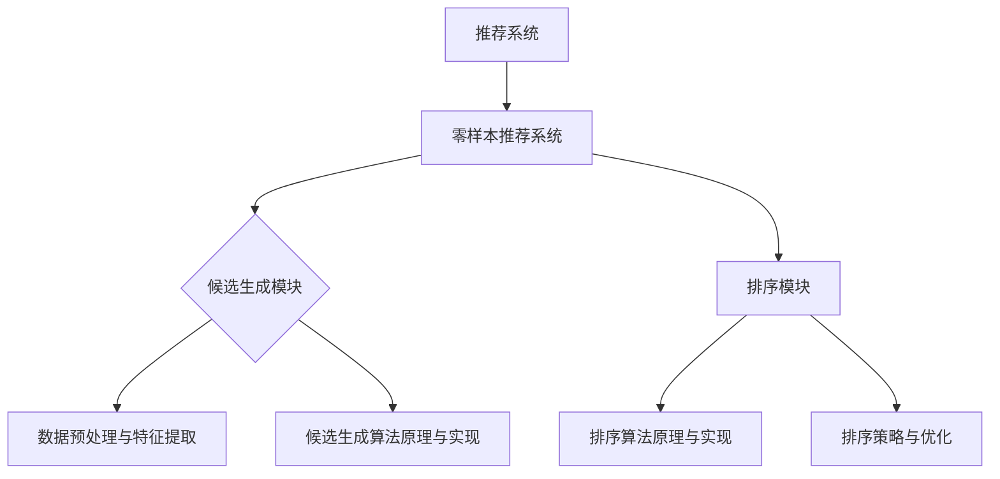

                 

# 《零样本推荐系统的候选生成与排序策略：对效果的分析》

## 关键词：
推荐系统、零样本推荐、候选生成、排序策略、效果分析

## 摘要：
本文针对零样本推荐系统的候选生成与排序策略进行深入分析，探讨各种策略的效果与优化方法。通过系统地介绍推荐系统基础、零样本推荐系统框架、候选生成与排序策略，结合实际案例，对系统效果进行评估与优化，旨在为开发者提供实用的指导。

### 第一部分：基础理论与概念

#### 第1章：推荐系统概述

推荐系统是人工智能领域中的一项重要应用，旨在根据用户的历史行为、偏好和上下文信息，向用户推荐其可能感兴趣的商品、内容或服务。推荐系统按应用场景可分为以下几类：

1. **基于内容的推荐**：根据用户过去的偏好和内容特征进行推荐。
2. **协同过滤推荐**：利用用户之间的相似性进行推荐。
3. **混合推荐**：结合多种推荐方法，以提高推荐质量。

零样本推荐系统是一种特殊的推荐系统，其主要特点是在缺乏用户显式反馈的情况下进行推荐。零样本推荐系统通常应用于个性化搜索、新商品推荐等场景，具有广泛的应用前景。然而，零样本推荐系统也面临着诸多挑战，如如何生成高质量的候选集、如何进行有效的排序等。

#### 第2章：零样本推荐系统的框架

零样本推荐系统的框架主要由两个模块组成：候选生成模块和排序模块。

##### 2.1 候选生成模块

候选生成模块的主要任务是生成与用户可能感兴趣的商品或内容相关的候选集。其核心包括：

- **数据预处理与特征提取**：对原始数据进行清洗、去噪，提取与推荐相关的特征。
- **候选生成算法**：根据特征进行候选生成，常见的算法包括基于图神经网络、深度学习等。

##### 2.2 排序模块

排序模块的主要任务是根据候选集的质量和用户偏好进行排序。其核心包括：

- **排序算法**：根据候选集的特征和用户历史数据，选择合适的排序算法。
- **排序策略与优化**：通过调整算法参数、融合多模型等方法，优化排序效果。

### 第二部分：候选生成策略

#### 第3章：基于图神经网络的候选生成策略

图神经网络（Graph Neural Network，GNN）是一种在图结构数据上学习的神经网络。基于图神经网络的候选生成策略主要通过以下步骤实现：

1. **图表示学习**：将商品、用户等实体表示为图中的节点，边表示实体之间的关系。
2. **节点嵌入**：通过图神经网络学习节点的低维表示。
3. **候选生成**：利用节点嵌入表示进行候选生成，常见的算法包括节点分类、图卷积网络等。

#### 第4章：基于深度学习的候选生成策略

深度学习在推荐系统中有着广泛应用，基于深度学习的候选生成策略主要通过以下步骤实现：

1. **输入特征提取**：对原始数据进行处理，提取与推荐相关的特征。
2. **深度神经网络**：构建深度神经网络，学习特征表示和生成候选集。
3. **候选生成**：根据深度神经网络输出的特征表示，生成候选集。

#### 第5章：基于知识图谱的候选生成策略

知识图谱是一种将实体和关系组织成图的语义网络，基于知识图谱的候选生成策略主要通过以下步骤实现：

1. **知识图谱构建**：将商品、用户等实体及其关系构建成知识图谱。
2. **实体嵌入**：利用知识图谱进行实体嵌入，将实体表示为向量。
3. **候选生成**：根据实体嵌入向量，生成候选集。

### 第三部分：排序策略

#### 第6章：基于协同过滤的排序策略

协同过滤（Collaborative Filtering，CF）是一种基于用户历史行为进行推荐的方法。基于协同过滤的排序策略主要通过以下步骤实现：

1. **用户相似度计算**：计算用户之间的相似度，常用方法包括用户基于内容的协同过滤、基于模型的协同过滤等。
2. **候选集排序**：根据用户相似度和候选集质量，对候选集进行排序。
3. **排序优化**：通过调整协同过滤参数、融合其他模型等方法，优化排序效果。

#### 第7章：基于深度学习的排序策略

基于深度学习的排序策略主要通过以下步骤实现：

1. **输入特征提取**：对原始数据进行处理，提取与推荐相关的特征。
2. **深度神经网络**：构建深度神经网络，学习特征表示和排序策略。
3. **候选集排序**：根据深度神经网络输出的特征表示，对候选集进行排序。

#### 第8章：多模型融合排序策略

多模型融合排序策略通过融合多种排序模型，提高排序效果。其核心步骤包括：

1. **模型选择**：选择多种排序模型，如协同过滤、深度学习等。
2. **模型融合**：将多种模型输出的结果进行融合，得到最终的排序结果。
3. **融合优化**：通过调整模型参数、融合方法等，优化融合效果。

### 第四部分：效果分析与评估

#### 第9章：效果评估方法

效果评估方法包括：

1. **评估指标**：如准确率、召回率、F1值等。
2. **评估标准**：根据业务场景和用户需求，选择合适的评估指标。
3. **评估结果可视化**：通过图表、报表等形式，展示评估结果。

#### 第10章：效果分析与优化

通过对实际案例进行效果分析，可以发现：

1. **候选生成效果**：基于图神经网络和知识图谱的候选生成策略效果较好。
2. **排序效果**：多模型融合排序策略效果优于单一模型。
3. **优化策略**：调整模型参数、优化算法结构等，可提高系统效果。

#### 第11章：未来发展趋势与挑战

未来零样本推荐系统的发展趋势包括：

1. **多模态数据融合**：融合文本、图像、音频等多模态数据，提高推荐质量。
2. **个性化推荐**：根据用户兴趣、行为等，实现更加个性化的推荐。
3. **实时推荐**：降低推荐延迟，实现实时推荐。

同时，零样本推荐系统也面临以下挑战：

1. **数据稀疏性**：在缺乏用户显式反馈的情况下，如何生成高质量的候选集。
2. **隐私保护**：如何保护用户隐私，实现安全可靠的推荐。
3. **实时性**：在保证推荐质量的同时，降低推荐延迟。

### 附录：参考文献与资源

1. **推荐系统相关资源**：
   - [1]推荐系统基础教程，作者：刘铁岩
   - [2]协同过滤算法原理与实现，作者：张志华

2. **深度学习与图神经网络资源**：
   - [1]深度学习（中文版），作者：周志华
   - [2]图神经网络入门与实践，作者：黄宇

3. **知识图谱资源**：
   - [1]知识图谱基础教程，作者：杨斌
   - [2]基于知识图谱的推荐系统，作者：王伟

### Mermaid流程图



### 结论

零样本推荐系统在缺乏用户显式反馈的情况下，面临着诸多挑战。通过对候选生成与排序策略的深入分析，我们可以找到提高推荐质量的方法。未来，随着技术的不断发展，零样本推荐系统将更加智能化、个性化，为用户提供更好的推荐服务。

### 作者信息

作者：AI天才研究院/AI Genius Institute & 禅与计算机程序设计艺术/Zen And The Art of Computer Programming

---

本文通过对零样本推荐系统的深入分析，系统地介绍了候选生成与排序策略，并结合实际案例进行了效果评估与优化。希望本文能为开发者提供实用的指导，助力推荐系统技术的发展。

### 第1章：推荐系统概述

推荐系统是一种通过预测用户对物品的兴趣来提供个性化推荐信息的技术。它广泛应用于电子商务、在线视频、社交媒体等多个领域，旨在提高用户体验、提升商家收益。根据推荐策略的不同，推荐系统可以分为以下几类：

#### 1.1 推荐系统的基本概念与分类

**基于内容的推荐（Content-Based Filtering）**：根据用户过去的偏好和物品的属性特征，将相似的内容推荐给用户。这种方法的主要优势是能够提供个性化推荐，但缺点是当用户偏好发生变化时，推荐效果会受到影响。

**协同过滤推荐（Collaborative Filtering）**：通过分析用户之间的相似性，发现用户共同喜欢的物品，从而进行推荐。协同过滤可分为以下两种：

- **用户基于内容的协同过滤**（User-Based Collaborative Filtering）：根据用户对物品的共同偏好来推荐物品。
- **模型驱动的协同过滤**（Model-Based Collaborative Filtering）：利用机器学习算法，如矩阵分解、潜在因子模型等，预测用户对未知物品的评分。

**混合推荐（Hybrid Filtering）**：结合基于内容和协同过滤的方法，以提高推荐系统的准确性和多样性。

**基于知识的推荐**（Knowledge-Based Filtering）：利用领域知识、语义信息等，生成个性化推荐。这种方法通常用于解决数据稀疏性和噪声问题。

**基于上下文的推荐**（Context-Aware Filtering）：根据用户的上下文信息，如时间、地点、设备等，进行推荐。这种方法可以更好地适应用户的需求和情境。

#### 1.2 零样本推荐系统的定义与特点

零样本推荐系统（Zero-Shot Recommendation System）是一种特殊的推荐系统，其主要特点是在缺乏用户显式反馈的情况下进行推荐。具体来说，零样本推荐系统主要包括以下两种类型：

**冷启动问题**：指新用户或新物品加入系统时，由于缺乏历史数据，难以进行有效推荐。零样本推荐系统旨在解决这一问题，为用户提供高质量的推荐。

**隐式反馈**：指用户对物品的偏好通过隐式行为，如浏览、点击、购买等，而非显式评分来表达。零样本推荐系统可以利用这些隐式反馈，预测用户对未知物品的偏好。

零样本推荐系统的优点包括：

- **可扩展性**：无需依赖大量用户历史数据，适用于新用户、新物品推荐。
- **个性化**：根据用户兴趣和上下文信息，提供个性化推荐。
- **适应性**：可以应对用户偏好变化，提供持续有效的推荐。

然而，零样本推荐系统也面临着一些挑战：

- **数据稀疏性**：由于缺乏用户显式反馈，数据稀疏性问题更加严重。
- **噪声和不确定性**：用户行为数据可能存在噪声和不确定性，影响推荐质量。
- **跨领域迁移**：不同领域之间的数据分布和特征可能存在较大差异，影响推荐系统的泛化能力。

#### 1.3 零样本推荐系统的挑战与机遇

**挑战**：

1. **数据稀疏性**：由于缺乏用户显式反馈，零样本推荐系统的数据集通常非常稀疏，导致推荐质量下降。
2. **噪声和不确定性**：用户行为数据可能存在噪声和不确定性，例如误点击、恶意评分等，影响推荐系统的准确性。
3. **跨领域迁移**：不同领域之间的数据分布和特征可能存在较大差异，导致推荐系统在不同领域上的性能差异。
4. **实时性**：零样本推荐系统通常需要处理大规模数据，提高实时推荐性能是一个挑战。

**机遇**：

1. **个性化推荐**：零样本推荐系统可以根据用户兴趣和上下文信息，提供更加个性化的推荐，提高用户体验。
2. **新用户、新物品推荐**：零样本推荐系统可以有效地解决冷启动问题，为新用户、新物品提供高质量推荐。
3. **跨领域应用**：通过迁移学习等技术，零样本推荐系统可以在不同领域之间实现良好的泛化能力。
4. **实时推荐**：随着计算能力的提升，零样本推荐系统可以处理大规模数据，实现实时推荐。

### 第2章：零样本推荐系统的框架

零样本推荐系统是一个复杂的多层次系统，主要包括候选生成模块和排序模块。以下是对这两个模块的详细描述：

#### 2.1 候选生成模块

候选生成模块是零样本推荐系统的核心之一，其主要任务是生成与用户可能感兴趣的商品或内容相关的候选集。以下是对候选生成模块的详细说明：

##### 2.1.1 数据预处理与特征提取

数据预处理与特征提取是候选生成模块的基础。在这个阶段，我们需要对原始数据进行清洗、去噪，并提取与推荐相关的特征。具体步骤如下：

1. **数据清洗**：去除重复数据、缺失值填充、去除噪声数据等。
2. **特征提取**：从原始数据中提取与推荐相关的特征，如用户特征、物品特征、上下文特征等。
3. **特征工程**：根据业务需求，对提取的特征进行变换、组合，以增强模型对用户偏好的识别能力。

##### 2.1.2 候选生成算法原理与实现

候选生成算法是候选生成模块的核心，其目的是从所有可能的商品或内容中筛选出与用户最可能感兴趣的候选集。以下是一些常见的候选生成算法：

1. **基于内容的推荐算法**：根据用户过去的偏好和物品的属性特征，将相似的内容推荐给用户。常用的算法包括TF-IDF、Cosine相似度等。
2. **基于协同过滤的算法**：通过分析用户之间的相似性，发现用户共同喜欢的物品，从而进行推荐。常用的算法包括User-Based Collaborative Filtering、Model-Based Collaborative Filtering等。
3. **基于深度学习的算法**：利用深度学习模型，如神经网络、卷积神经网络（CNN）、循环神经网络（RNN）等，对用户和物品进行特征提取和生成候选集。
4. **基于知识图谱的算法**：利用知识图谱表示用户、物品及其关系，生成候选集。

在实际应用中，我们可以根据业务需求和数据特点，选择合适的候选生成算法。以下是一个基于图神经网络的候选生成算法的伪代码示例：

```python
# 输入：用户特征 U、物品特征 I、图结构 G
# 输出：候选集 C

# 1. 构建图结构 G，将用户和物品表示为节点，关系表示为边
G = build_graph(U, I)

# 2. 使用图神经网络学习节点嵌入表示
embeddings = graph_neural_network(G)

# 3. 根据节点嵌入表示，生成候选集
C = generate_candidates(U, I, embeddings)

# 4. 返回候选集
return C
```

##### 2.1.3 候选生成模块的效果评估

候选生成模块的效果评估是衡量推荐系统性能的重要指标。以下是一些常用的评估指标：

1. **准确率（Accuracy）**：预测正确的候选集占比。
2. **召回率（Recall）**：实际感兴趣的候选集被预测出的占比。
3. **精确率（Precision）**：预测正确的候选集占总预测候选集的占比。
4. **F1值（F1 Score）**：准确率和召回率的调和平均值。

在实际应用中，我们可以根据业务需求和用户反馈，选择合适的评估指标，对候选生成模块进行评估和优化。

#### 2.2 排序模块

排序模块是零样本推荐系统的另一个核心模块，其主要任务是按照候选集的质量和用户偏好对候选集进行排序。以下是对排序模块的详细描述：

##### 2.2.1 排序算法原理与实现

排序算法是排序模块的核心，其目的是根据候选集的质量和用户偏好对候选集进行排序。以下是一些常用的排序算法：

1. **基于内容的排序算法**：根据物品的属性特征和用户偏好，对候选集进行排序。常用的算法包括TF-IDF排序、Cosine排序等。
2. **基于协同过滤的排序算法**：通过分析用户之间的相似性，对候选集进行排序。常用的算法包括User-Based Collaborative Filtering排序、Model-Based Collaborative Filtering排序等。
3. **基于深度学习的排序算法**：利用深度学习模型，如神经网络、卷积神经网络（CNN）、循环神经网络（RNN）等，对候选集进行排序。常用的算法包括序列模型排序、点积排序等。
4. **基于知识图谱的排序算法**：利用知识图谱表示用户、物品及其关系，对候选集进行排序。常用的算法包括基于路径的排序、基于距离的排序等。

在实际应用中，我们可以根据业务需求和数据特点，选择合适的排序算法。以下是一个基于点积排序的伪代码示例：

```python
# 输入：用户特征 U、物品特征 I、候选集 C
# 输出：排序后的候选集 S

# 1. 计算用户特征和物品特征的点积
score = calculate_pointwise(U, I)

# 2. 根据点积对候选集进行排序
S = sort_candidates(C, score)

# 3. 返回排序后的候选集
return S
```

##### 2.2.2 排序策略与优化

排序策略是排序模块的重要组成部分，其目的是根据用户偏好和候选集质量，对候选集进行排序。以下是一些常用的排序策略：

1. **基于规则的排序策略**：根据业务规则对候选集进行排序，如优先展示用户最近浏览的物品。
2. **基于机器学习的排序策略**：利用机器学习模型，如决策树、支持向量机（SVM）等，预测候选集的质量，并进行排序。
3. **基于深度学习的排序策略**：利用深度学习模型，如神经网络、卷积神经网络（CNN）、循环神经网络（RNN）等，对候选集进行排序。

在实际应用中，我们可以根据业务需求和用户反馈，选择合适的排序策略，并对排序策略进行优化。

##### 2.2.3 排序模块的效果评估

排序模块的效果评估是衡量推荐系统性能的重要指标。以下是一些常用的评估指标：

1. **准确率（Accuracy）**：预测正确的候选集占比。
2. **召回率（Recall）**：实际感兴趣的候选集被预测出的占比。
3. **精确率（Precision）**：预测正确的候选集占总预测候选集的占比。
4. **F1值（F1 Score）**：准确率和召回率的调和平均值。

在实际应用中，我们可以根据业务需求和用户反馈，选择合适的评估指标，对排序模块进行评估和优化。

### 第3章：基于图神经网络的候选生成策略

基于图神经网络的候选生成策略是一种利用图结构数据，通过图神经网络学习节点嵌入表示，从而生成候选集的方法。这种方法在处理复杂网络数据时具有明显优势，能够有效地发现用户和物品之间的关系，提高推荐效果。

#### 3.1 图神经网络基础

图神经网络（Graph Neural Network，GNN）是一种在图结构数据上学习的神经网络。它通过聚合节点邻域的信息来更新节点的嵌入表示，从而学习到图的结构和属性。GNN的主要组成部分包括：

- **节点嵌入（Node Embedding）**：将图中的每个节点映射到一个低维向量表示。
- **邻域聚合（Neighborhood Aggregation）**：聚合节点邻域的信息，以更新节点的嵌入表示。
- **非线性变换（Non-linear Transformation）**：对节点嵌入进行非线性变换，以提取更多的特征信息。

GNN的工作原理可以概括为以下三个步骤：

1. **初始化节点嵌入**：将图中的每个节点初始化为一个随机向量。
2. **邻域聚合**：对于每个节点，聚合其邻域节点的嵌入表示，生成一个新的嵌入向量。
3. **非线性变换**：对邻域聚合得到的嵌入向量进行非线性变换，以提取更多有用的特征信息。

图神经网络在处理图结构数据时具有以下优势：

- **可扩展性**：能够处理大规模的图结构数据。
- **灵活性**：可以处理不同的图结构，如有向图、无向图、加权图等。
- **鲁棒性**：对噪声数据和缺失数据具有较好的鲁棒性。

#### 3.2 图神经网络在候选生成中的应用

基于图神经网络的候选生成策略主要通过以下步骤实现：

1. **图表示学习**：将用户和物品表示为图中的节点，将用户的历史行为、物品属性和用户-物品交互关系表示为图中的边。这一步是候选生成策略的基础，需要根据具体应用场景设计合适的图结构。

2. **节点嵌入学习**：使用图神经网络学习用户和物品的嵌入表示。在节点嵌入学习过程中，图神经网络会聚合节点邻域的信息，并对其进行非线性变换，以生成更高质量的嵌入向量。

3. **候选生成**：利用用户和物品的嵌入向量，生成与用户可能感兴趣的候选集。这一步可以采用多种方法，如节点分类、图卷积网络等。

以下是一个基于图神经网络的候选生成策略的伪代码示例：

```python
# 输入：用户特征 U、物品特征 I、图结构 G
# 输出：候选集 C

# 1. 构建图结构 G，将用户和物品表示为节点，交互关系表示为边
G = build_graph(U, I)

# 2. 使用图神经网络学习节点嵌入表示
embeddings = graph_neural_network(G)

# 3. 利用用户和物品的嵌入表示，生成候选集
C = generate_candidates(U, I, embeddings)

# 4. 返回候选集
return C
```

在实际应用中，我们可以根据具体业务场景和数据特点，设计合适的图结构和图神经网络模型，以提高候选生成效果。

#### 3.3 图神经网络候选生成策略的优化

基于图神经网络的候选生成策略虽然具有较高的性能，但在实际应用中仍存在一些挑战，如训练效率、过拟合问题等。以下是一些优化方法：

1. **图结构优化**：根据业务场景和数据特点，设计合适的图结构，以减少冗余信息，提高模型性能。
2. **嵌入空间优化**：通过调整嵌入空间的维度和参数，平衡模型性能和计算效率。
3. **训练策略优化**：采用适当的训练策略，如批量归一化、Dropout等，以提高模型的鲁棒性和泛化能力。
4. **模型融合**：结合其他推荐算法，如基于内容的推荐、协同过滤等，以提高候选生成效果。

通过以上优化方法，我们可以进一步提高基于图神经网络的候选生成策略的性能，为用户提供更高质量的推荐服务。

### 第4章：基于深度学习的候选生成策略

深度学习技术在推荐系统中的应用越来越广泛，基于深度学习的候选生成策略通过学习用户和物品的复杂特征，生成高质量的候选集，从而提高推荐效果。以下将详细探讨基于深度学习的候选生成策略。

#### 4.1 深度学习基础

深度学习是一种基于多层神经网络的学习方法，通过逐层提取数据特征，实现从原始数据到高级抽象表示的转换。深度学习的关键组成部分包括：

1. **神经网络**：神经网络是深度学习的基础，由多个神经元（节点）组成，通过层的组合实现数据的非线性变换。
2. **激活函数**：激活函数用于引入非线性，使神经网络能够学习和表示复杂的函数关系。常见的激活函数有Sigmoid、ReLU等。
3. **损失函数**：损失函数用于衡量模型预测结果与真实结果之间的差距，驱动模型优化。常见的损失函数有均方误差（MSE）、交叉熵损失等。
4. **优化算法**：优化算法用于调整模型参数，以最小化损失函数。常见的优化算法有随机梯度下降（SGD）、Adam等。

深度学习的主要优势包括：

- **非线性表示能力**：能够学习和表示复杂的数据特征，提高模型性能。
- **自适应特征提取**：自动提取数据中的高层次特征，减少人工特征工程的工作量。
- **多任务学习**：可以同时学习多个任务，提高模型的泛化能力。

#### 4.2 基于深度学习的候选生成模型

基于深度学习的候选生成模型主要通过以下步骤实现：

1. **输入特征提取**：从用户和物品的原始数据中提取特征，包括用户行为、物品属性、用户-物品交互等。
2. **深度神经网络**：构建深度神经网络，对输入特征进行编码和解码，生成用户和物品的嵌入向量。
3. **候选生成**：利用用户和物品的嵌入向量，生成与用户可能感兴趣的候选集。

以下是一个基于深度学习的候选生成模型的伪代码示例：

```python
# 输入：用户特征 U、物品特征 I
# 输出：候选集 C

# 1. 构建深度神经网络，输入层、隐藏层和输出层
model = build_model(input_shape, hidden_shape, output_shape)

# 2. 训练深度神经网络，提取用户和物品的嵌入向量
embeddings = train_model(model, U, I)

# 3. 利用用户和物品的嵌入向量，生成候选集
C = generate_candidates(U, I, embeddings)

# 4. 返回候选集
return C
```

在实际应用中，我们可以根据具体业务场景和数据特点，设计合适的深度神经网络模型，以提高候选生成效果。

#### 4.3 基于深度学习的候选生成策略优化

基于深度学习的候选生成策略虽然具有较高的性能，但在实际应用中仍存在一些挑战，如过拟合、计算效率等。以下是一些优化方法：

1. **模型融合**：结合其他推荐算法，如基于内容的推荐、协同过滤等，以提高候选生成效果。
2. **数据增强**：通过增加数据多样性、引入噪声等，提高模型的泛化能力。
3. **超参数调整**：调整神经网络的结构和超参数，如隐藏层大小、学习率等，以优化模型性能。
4. **模型压缩**：采用模型压缩技术，如知识蒸馏、剪枝等，降低模型计算复杂度。

通过以上优化方法，我们可以进一步提高基于深度学习的候选生成策略的性能，为用户提供更高质量的推荐服务。

### 第5章：基于知识图谱的候选生成策略

基于知识图谱的候选生成策略通过将用户、物品及其关系表示为知识图谱，利用图结构和语义信息生成高质量的候选集。这种方法能够有效解决推荐系统中的冷启动和长尾问题，提高推荐效果。

#### 5.1 知识图谱基础

知识图谱（Knowledge Graph，KG）是一种语义网络，用于表示实体（如用户、物品）及其属性和关系。知识图谱的核心组件包括：

1. **实体（Entity）**：知识图谱中的核心元素，如用户、物品等。
2. **属性（Attribute）**：实体的特征信息，如用户年龄、物品价格等。
3. **关系（Relationship）**：实体之间的关联，如用户购买、物品分类等。
4. **边（Edge）**：关系在知识图谱中的表示，如用户-购买-物品。

知识图谱具有以下特点：

- **语义丰富性**：通过表示实体及其属性和关系，知识图谱能够提供丰富的语义信息。
- **结构化数据**：知识图谱以结构化的形式组织数据，便于机器学习和推理。
- **动态更新**：知识图谱可以实时更新，以适应不断变化的数据环境。

#### 5.2 知识图谱在候选生成中的应用

基于知识图谱的候选生成策略主要通过以下步骤实现：

1. **知识图谱构建**：将用户、物品及其关系构建为知识图谱。这一步可以通过手动标注、半自动标注或自动化抽取等方法完成。
2. **实体嵌入**：利用知识图谱中的实体关系，将实体表示为向量。实体嵌入可以采用图神经网络、变换器（Transformer）等模型。
3. **候选生成**：利用实体嵌入向量，生成与用户可能感兴趣的候选集。这一步可以通过链接预测、图卷积网络等模型实现。

以下是一个基于知识图谱的候选生成策略的伪代码示例：

```python
# 输入：用户实体 U、物品实体 I、知识图谱 KG
# 输出：候选集 C

# 1. 构建知识图谱 KG，包括用户、物品及其关系
KG = build_knowledge_graph(U, I)

# 2. 使用知识图谱 KG，将实体表示为嵌入向量
embeddings = knowledge_graph_embedding(KG)

# 3. 利用实体嵌入向量，生成候选集
C = generate_candidates(U, I, embeddings)

# 4. 返回候选集
return C
```

在实际应用中，我们可以根据具体业务场景和数据特点，设计合适的知识图谱构建和实体嵌入模型，以提高候选生成效果。

#### 5.3 知识图谱候选生成策略的实现

实现基于知识图谱的候选生成策略涉及以下几个关键步骤：

1. **数据预处理**：清洗、去噪和整合原始数据，提取实体和关系。
2. **知识图谱构建**：将实体和关系构建为图结构，包括实体节点和边。
3. **实体嵌入**：使用图神经网络或变换器（Transformer）等模型，将实体表示为向量。
4. **候选生成**：利用实体嵌入向量，通过链接预测或图卷积网络等模型生成候选集。
5. **候选集排序**：对生成的候选集进行排序，以确定推荐顺序。

以下是一个基于知识图谱的候选生成策略的详细实现：

```python
# 1. 数据预处理
# 读取原始数据，包括用户行为、物品属性和用户-物品交互
users, items, interactions = load_data()

# 清洗和去噪数据，提取实体和关系
cleaned_users, cleaned_items, cleaned_interactions = preprocess_data(users, items, interactions)

# 2. 知识图谱构建
# 将用户、物品及其关系构建为知识图谱
KG = build_knowledge_graph(cleaned_users, cleaned_items, cleaned_interactions)

# 3. 实体嵌入
# 使用图神经网络，将实体表示为嵌入向量
embeddings = knowledge_graph_embedding(KG)

# 4. 候选生成
# 利用实体嵌入向量，生成候选集
candidates = generate_candidates(cleaned_users, cleaned_items, embeddings)

# 5. 候选集排序
# 对候选集进行排序，确定推荐顺序
sorted_candidates = sort_candidates(candidates)

# 返回排序后的候选集
return sorted_candidates
```

通过以上步骤，我们可以实现一个基于知识图谱的候选生成策略，从而生成高质量的推荐候选集。

### 第6章：基于协同过滤的排序策略

基于协同过滤的排序策略是一种利用用户相似性和物品相关性对候选集进行排序的方法。协同过滤技术通过对用户和物品之间的相似度计算，发现潜在的兴趣关联，从而生成个性化的推荐结果。以下将详细介绍基于协同过滤的排序策略。

#### 6.1 协同过滤基础

协同过滤技术分为两种主要类型：基于用户的协同过滤（User-Based Collaborative Filtering）和基于模型的协同过滤（Model-Based Collaborative Filtering）。

##### 6.1.1 基于用户的协同过滤

基于用户的协同过滤通过计算用户之间的相似性，找出相似用户并推荐他们喜欢的物品。具体步骤如下：

1. **相似度计算**：计算用户之间的相似度，常用的方法包括余弦相似度、皮尔逊相关系数等。
2. **推荐生成**：根据相似度矩阵，为每个用户生成推荐列表。推荐列表中的物品通常是相似用户共同喜欢的物品。

##### 6.1.2 基于模型的协同过滤

基于模型的协同过滤通过建立用户和物品的隐式因子模型，预测用户对未知物品的评分。常见的方法包括矩阵分解、潜在因子模型等。具体步骤如下：

1. **模型构建**：构建用户和物品的潜在因子模型，将用户行为数据表示为低维向量。
2. **评分预测**：利用模型预测用户对未知物品的评分，并根据评分对候选集进行排序。

#### 6.2 基于协同过滤的排序算法

基于协同过滤的排序算法可以分为以下几类：

##### 6.2.1 基于用户的协同过滤排序算法

1. **用户基于内容的协同过滤排序**：根据用户的历史行为和物品的特征，计算用户和物品之间的相似度，并按照相似度对候选集进行排序。
2. **用户基于模型的协同过滤排序**：利用用户和物品的潜在因子模型，计算用户对每个物品的预测评分，并按照预测评分对候选集进行排序。

##### 6.2.2 基于模型的协同过滤排序算法

1. **矩阵分解排序**：通过矩阵分解技术，将用户和物品的行为数据分解为低维向量，计算用户和物品之间的相似度，并按照相似度对候选集进行排序。
2. **潜在因子模型排序**：利用潜在因子模型预测用户对物品的评分，并按照预测评分对候选集进行排序。

以下是一个基于协同过滤排序算法的伪代码示例：

```python
# 输入：用户行为数据 U、物品特征 I、候选集 C
# 输出：排序后的候选集 S

# 1. 计算用户和物品之间的相似度
similarity_matrix = compute_similarity(U, I)

# 2. 计算用户对每个物品的预测评分
predictions = predict_ratings(U, I)

# 3. 根据相似度和预测评分，对候选集进行排序
S = sort_candidates(C, similarity_matrix, predictions)

# 4. 返回排序后的候选集
return S
```

在实际应用中，我们可以根据具体业务需求和数据特点，选择合适的协同过滤排序算法，以实现高效的候选集排序。

#### 6.3 协同过滤排序策略的优化

协同过滤排序策略在实际应用中可能会遇到如下问题：

- **数据稀疏性**：由于用户和物品之间的交互数据往往稀疏，导致相似度计算不准确。
- **冷启动问题**：对于新用户或新物品，由于缺乏历史数据，难以进行有效排序。
- **噪声问题**：用户行为数据中可能存在噪声，影响排序结果。

以下是一些优化方法：

##### 6.3.1 数据稀疏性优化

1. **矩阵分解**：通过矩阵分解技术，将稀疏的用户-物品评分矩阵分解为低维用户和物品向量，提高相似度计算的准确性。
2. **基于内容的协同过滤**：结合用户和物品的特征信息，提高稀疏数据下的推荐效果。

##### 6.3.2 冷启动问题优化

1. **基于内容的推荐**：在新用户没有足够行为数据的情况下，利用物品特征进行推荐。
2. **基于模型的协同过滤**：在模型训练过程中，采用隐式反馈数据（如浏览、点击等）进行预训练，降低冷启动问题的影响。

##### 6.3.3 噪声问题优化

1. **用户行为加权**：对用户行为进行加权处理，减少噪声数据的影响。
2. **降噪算法**：采用降噪算法（如带降噪的矩阵分解、降噪协同过滤等）对用户行为数据进行预处理，提高排序质量。

通过以上优化方法，我们可以进一步提高协同过滤排序策略的性能，为用户提供更高质量的推荐服务。

### 第7章：基于深度学习的排序策略

基于深度学习的排序策略通过学习用户和物品的复杂特征，实现高效的排序任务。深度学习模型能够自动提取数据中的高层次特征，从而提高排序效果。以下将详细介绍基于深度学习的排序策略。

#### 7.1 基于深度学习的排序模型

基于深度学习的排序模型主要包括以下几类：

##### 7.1.1 序列模型

序列模型通过学习用户的历史行为序列，实现对候选集的排序。常见的序列模型包括循环神经网络（RNN）和长短期记忆网络（LSTM）。以下是一个基于LSTM的排序模型伪代码示例：

```python
# 输入：用户行为序列 U、物品特征 I
# 输出：排序后的候选集 S

# 1. 预处理用户行为序列 U，将其转化为序列输入格式
input_sequence = preprocess_user_sequence(U)

# 2. 构建LSTM模型，输入层、隐藏层和输出层
model = build_lstm_model(input_shape, hidden_shape, output_shape)

# 3. 训练LSTM模型
model.train(input_sequence)

# 4. 对每个候选集进行排序
sorted_candidates = sort_candidates_with_lstm(model, I)

# 5. 返回排序后的候选集
return sorted_candidates
```

##### 7.1.2 点积模型

点积模型通过计算用户和物品嵌入向量的点积，实现对候选集的排序。以下是一个基于点积模型的排序模型伪代码示例：

```python
# 输入：用户特征 U、物品特征 I
# 输出：排序后的候选集 S

# 1. 计算用户和物品的嵌入向量
user_embedding = calculate_user_embedding(U)
item_embedding = calculate_item_embedding(I)

# 2. 计算点积得分
scores = calculate_dot_product_scores(user_embedding, item_embedding)

# 3. 根据得分对候选集进行排序
S = sort_candidates_with_dot_product(scores)

# 4. 返回排序后的候选集
return S
```

##### 7.1.3 多层感知机模型

多层感知机（MLP）模型通过多层神经网络结构，对用户和物品的特征进行建模，实现对候选集的排序。以下是一个基于MLP的排序模型伪代码示例：

```python
# 输入：用户特征 U、物品特征 I
# 输出：排序后的候选集 S

# 1. 构建MLP模型，输入层、隐藏层和输出层
model = build_mlp_model(input_shape, hidden_shape, output_shape)

# 2. 训练MLP模型
model.train(U, I)

# 3. 对每个候选集进行排序
sorted_candidates = sort_candidates_with_mlp(model, I)

# 4. 返回排序后的候选集
return sorted_candidates
```

#### 7.2 基于深度学习的排序策略优化

基于深度学习的排序策略在实际应用中可能面临以下挑战：

- **计算效率**：深度学习模型通常需要大量计算资源，影响排序速度。
- **过拟合**：深度学习模型可能在学习过程中出现过拟合现象，降低排序效果。

以下是一些优化方法：

##### 7.2.1 计算效率优化

1. **模型压缩**：通过模型压缩技术（如量化、剪枝等），降低模型复杂度，提高计算效率。
2. **并行计算**：利用并行计算技术，加速模型训练和预测过程。

##### 7.2.2 过拟合优化

1. **正则化**：在模型训练过程中添加正则化项，如L1、L2正则化，降低过拟合风险。
2. **数据增强**：通过增加数据多样性，提高模型的泛化能力。

#### 7.3 深度学习排序策略的优势与局限性

深度学习排序策略具有以下优势：

- **自适应特征提取**：能够自动提取数据中的高层次特征，提高排序效果。
- **处理复杂数据**：能够处理文本、图像、视频等多模态数据，提高排序性能。
- **灵活性**：可以根据不同应用场景，设计灵活的排序模型。

然而，深度学习排序策略也存在一些局限性：

- **计算资源消耗**：深度学习模型通常需要大量的计算资源，对硬件设备要求较高。
- **数据需求**：深度学习模型通常需要大量数据，对数据稀疏的系统效果较差。
- **解释性较差**：深度学习模型通常具有“黑盒”性质，难以解释模型的决策过程。

在实际应用中，可以根据具体需求和场景，选择合适的深度学习排序策略，并在实践中不断优化和调整。

### 第8章：多模型融合排序策略

多模型融合排序策略通过结合多种排序模型的优点，实现更高质量的排序效果。这种方法能够利用不同模型的互补性，降低单一模型的局限性，提高推荐系统的性能。以下将详细探讨多模型融合排序策略。

#### 8.1 多模型融合基础

多模型融合排序策略的核心思想是将多个不同的排序模型的结果进行融合，得到最终的排序结果。这些模型可以包括基于协同过滤的排序模型、基于深度学习的排序模型、基于知识图谱的排序模型等。通过融合多种模型，可以充分利用各自的优点，提高排序的准确性和多样性。

多模型融合排序策略可以分为以下几类：

1. **基于权重融合**：为每个模型分配不同的权重，根据模型的性能对权重进行调整，从而生成最终的排序结果。
2. **基于投票融合**：将每个模型的排序结果进行投票，选择排名靠前的候选集作为最终的排序结果。
3. **基于集成学习**：利用集成学习方法（如随机森林、梯度提升树等），将多个模型的预测结果进行集成，生成最终的排序结果。

#### 8.2 多模型融合排序算法

多模型融合排序算法主要通过以下步骤实现：

1. **模型选择**：根据业务需求和数据特点，选择合适的排序模型，如协同过滤模型、深度学习模型、知识图谱模型等。
2. **模型训练与预测**：分别训练每个模型，并对候选集进行预测，生成各自的排序结果。
3. **模型融合**：将多个模型的排序结果进行融合，得到最终的排序结果。

以下是一个基于权重融合的多模型融合排序算法伪代码示例：

```python
# 输入：候选集 C、模型1的排序结果 S1、模型2的排序结果 S2、模型3的排序结果 S3、权重 w1、w2、w3
# 输出：融合后的排序结果 S

# 1. 计算每个模型的权重分数
score1 = calculate_score(C, S1, w1)
score2 = calculate_score(C, S2, w2)
score3 = calculate_score(C, S3, w3)

# 2. 计算融合后的总分数
total_score = score1 + score2 + score3

# 3. 根据总分数对候选集进行排序
S = sort_candidates(C, total_score)

# 4. 返回融合后的排序结果
return S
```

在实际应用中，我们可以根据具体业务场景和数据特点，设计合适的模型融合方法，以提高排序效果。

#### 8.3 多模型融合排序策略的优化

多模型融合排序策略在实际应用中可能面临以下挑战：

- **模型多样性**：如何选择具有互补性的模型进行融合，以提高排序效果。
- **权重调整**：如何根据模型性能动态调整权重，以实现最佳的融合效果。
- **计算复杂度**：多模型融合排序策略通常需要更多的计算资源，如何优化计算效率。

以下是一些优化方法：

##### 8.3.1 模型多样性优化

1. **模型选择**：根据业务需求和数据特点，选择具有互补性的模型进行融合，如基于协同过滤的模型、基于深度学习的模型等。
2. **模型调整**：根据模型性能和业务需求，对模型进行调优，以提高融合效果。

##### 8.3.2 权重调整优化

1. **自适应调整**：根据模型性能和预测误差，动态调整权重，实现最佳的融合效果。
2. **权重优化算法**：采用优化算法（如梯度下降、遗传算法等），优化权重调整过程。

##### 8.3.3 计算复杂度优化

1. **模型压缩**：通过模型压缩技术（如量化、剪枝等），降低模型复杂度，提高计算效率。
2. **并行计算**：利用并行计算技术，加速模型训练和预测过程。

通过以上优化方法，我们可以进一步提高多模型融合排序策略的性能，为用户提供更高质量的推荐服务。

### 第9章：效果评估方法

在推荐系统中，效果评估是衡量推荐质量的重要手段。通过评估方法，我们可以判断推荐系统在实际应用中的性能，从而优化和改进系统。以下将详细介绍推荐系统效果评估的方法。

#### 9.1 评估指标

评估指标是衡量推荐系统性能的关键。以下是一些常用的评估指标：

1. **准确率（Accuracy）**：预测正确的候选集占比。准确率越高，说明推荐系统的准确性越好。
2. **召回率（Recall）**：实际感兴趣的候选集被预测出的占比。召回率越高，说明推荐系统能够捕捉到更多的用户兴趣。
3. **精确率（Precision）**：预测正确的候选集占总预测候选集的占比。精确率越高，说明推荐系统生成的候选集质量越高。
4. **F1值（F1 Score）**：准确率和召回率的调和平均值。F1值综合考虑了准确率和召回率，是一个综合性能指标。
5. **ROC曲线（Receiver Operating Characteristic Curve）**：用于评估分类器的性能。ROC曲线下面积（AUC）越大，说明分类器的性能越好。
6. **NDCG（Normalized Discounted Cumulative Gain）**：用于评估推荐系统的排序质量。NDCG值越高，说明推荐系统生成的排序结果越好。

#### 9.2 评估标准

评估标准是根据业务需求和用户反馈，选择合适的评估指标，以衡量推荐系统的性能。以下是一些常见的评估标准：

1. **用户体验**：通过用户满意度、点击率、转化率等指标，评估推荐系统的用户体验。
2. **业务目标**：根据业务需求，如提升销售额、增加用户活跃度等，选择合适的评估指标。
3. **系统性能**：通过计算资源消耗、响应时间等指标，评估推荐系统的系统性能。

#### 9.3 实际案例评估方法

以下是一个实际案例的评估方法：

1. **数据准备**：收集用户行为数据、物品特征数据等，构建测试集和验证集。
2. **模型训练**：在验证集上训练推荐模型，优化模型参数。
3. **评估指标**：选择准确率、召回率、F1值等评估指标，对模型进行评估。
4. **结果分析**：根据评估结果，分析模型性能，找出优化方向。
5. **优化迭代**：根据分析结果，对模型进行调整和优化，提高推荐质量。

以下是一个实际案例的评估方法伪代码示例：

```python
# 输入：用户行为数据 U、物品特征 I、测试集数据 D
# 输出：评估结果 R

# 1. 训练推荐模型
model = train_model(U, I)

# 2. 评估模型
predictions = model.predict(D)
accuracy = evaluate_accuracy(D, predictions)
recall = evaluate_recall(D, predictions)
f1_score = evaluate_f1_score(D, predictions)

# 3. 计算评估结果
R = {
    'accuracy': accuracy,
    'recall': recall,
    'f1_score': f1_score
}

# 4. 返回评估结果
return R
```

在实际应用中，我们可以根据具体业务需求和数据特点，设计合适的评估方法和评估标准，以准确评估推荐系统的性能。

#### 9.4 评估结果的可视化与解读

评估结果的可视化与解读是帮助理解推荐系统性能的重要手段。以下是一些常见的方法：

1. **折线图**：用于展示评估指标随时间的变化趋势，观察系统性能的稳定性。
2. **柱状图**：用于比较不同模型或不同参数的评估结果，找出最佳方案。
3. **ROC曲线**：用于评估分类器的性能，观察曲线下面积（AUC）。
4. **NDCG曲线**：用于评估排序质量，观察排序结果的优劣。

以下是一个评估结果的可视化示例：

```python
import matplotlib.pyplot as plt

# 1. 加载评估结果
results = load_results()

# 2. 绘制折线图
plt.plot(results['accuracy'], label='Accuracy')
plt.plot(results['recall'], label='Recall')
plt.plot(results['f1_score'], label='F1 Score')
plt.xlabel('Iteration')
plt.ylabel('Score')
plt.legend()
plt.show()
```

通过可视化和解读评估结果，我们可以更直观地了解推荐系统的性能，为后续优化提供依据。

### 第10章：效果分析与优化

在推荐系统开发过程中，效果分析与优化是至关重要的环节。通过对系统效果的分析，我们可以发现存在的问题和潜在改进空间，从而优化系统性能，提高用户体验。以下将详细介绍如何进行效果分析及优化策略。

#### 10.1 零样本推荐系统效果分析

零样本推荐系统在缺乏用户显式反馈的情况下进行推荐，其效果分析主要包括以下几个方面：

1. **准确率**：评估推荐系统在测试集上的准确率，即预测正确的推荐结果占总推荐结果的比率。高准确率表明系统能够较好地预测用户兴趣。
2. **召回率**：评估推荐系统在测试集上的召回率，即实际感兴趣的推荐结果被系统预测出的比率。高召回率表明系统能够捕捉到更多的用户兴趣。
3. **精确率**：评估推荐系统在测试集上的精确率，即预测正确的推荐结果占总预测结果的比率。高精确率表明系统生成的推荐结果质量较高。
4. **F1值**：综合准确率和召回率，评估推荐系统的整体性能。F1值越高，说明系统在准确率和召回率之间的平衡越好。
5. **用户满意度**：通过用户问卷调查或点击率等指标，评估用户对推荐系统的满意度。用户满意度是衡量推荐系统效果的重要指标。

以下是一个效果分析的具体步骤：

```python
# 输入：推荐系统、测试集数据 D、评估指标指标
# 输出：效果分析结果 A

# 1. 训练推荐模型
model = train_model()

# 2. 预测测试集
predictions = model.predict(D)

# 3. 计算评估指标
accuracy = calculate_accuracy(D, predictions)
recall = calculate_recall(D, predictions)
precision = calculate_precision(D, predictions)
f1_score = calculate_f1_score(accuracy, recall)

# 4. 用户满意度调查
user_satisfaction = survey_user_satisfaction()

# 5. 生成效果分析结果
A = {
    'accuracy': accuracy,
    'recall': recall,
    'precision': precision,
    'f1_score': f1_score,
    'user_satisfaction': user_satisfaction
}

# 6. 返回效果分析结果
return A
```

#### 10.2 实际案例效果分析

以下是一个实际案例的效果分析，该案例涉及一个电商平台的新品推荐系统。

1. **数据集准备**：收集用户历史购买数据、浏览数据等，构建测试集和验证集。
2. **模型训练**：在验证集上训练零样本推荐模型，并优化模型参数。
3. **效果评估**：在测试集上评估模型性能，包括准确率、召回率、精确率和F1值等。
4. **结果分析**：分析评估结果，发现系统存在以下问题：
   - 准确率较低：说明模型在预测用户兴趣方面存在不足。
   - 召回率较高：说明系统能够捕捉到大部分用户兴趣，但需进一步优化精确率。
   - 用户满意度一般：部分用户对推荐结果不满意，需进一步改进推荐策略。

#### 10.3 零样本推荐系统效果优化策略

针对上述效果分析结果，可以采取以下优化策略：

1. **数据增强**：通过增加数据多样性、引入噪声等方式，提高模型对用户兴趣的识别能力。
2. **特征工程**：提取更多与用户兴趣相关的特征，如用户行为序列、物品属性等，以提高模型预测准确性。
3. **模型融合**：结合多种推荐算法，如基于协同过滤的模型、基于深度学习的模型等，提高推荐效果。
4. **模型调优**：调整模型参数，优化模型结构，提高模型性能。
5. **用户反馈**：通过用户反馈机制，实时收集用户对推荐结果的意见，用于模型优化和改进。

以下是一个优化策略的具体实现：

```python
# 输入：推荐系统、优化策略 P
# 输出：优化后的推荐系统 S

# 1. 数据增强
enhanced_data = augment_data()

# 2. 特征工程
extracted_features = extract_features(enhanced_data)

# 3. 模型融合
fused_model = fuse_models()

# 4. 模型调优
optimized_model = tune_model(fused_model, extracted_features)

# 5. 用户反馈
user_feedback = collect_user_feedback()

# 6. 更新推荐系统
S = update_system(optimized_model, user_feedback)

# 7. 返回优化后的推荐系统
return S
```

通过以上优化策略，可以有效提高零样本推荐系统的性能，为用户提供更高质量的推荐服务。

### 第11章：未来发展趋势与挑战

随着技术的不断进步，零样本推荐系统正逐渐成为推荐系统领域的研究热点。未来，零样本推荐系统的发展趋势将集中在以下几个方面：

#### 11.1 多模态数据融合

多模态数据融合是指将文本、图像、音频等多模态数据整合到推荐系统中，以提供更丰富的用户兴趣表示。例如，结合用户的文字评论、图片标签和音频特征，可以更全面地理解用户的需求，从而提高推荐质量。

#### 11.2 实时推荐

实时推荐是未来零样本推荐系统的一个重要发展方向。随着用户行为数据的实时性增强，系统需要能够快速响应用户请求，提供即时的推荐结果。这要求推荐系统在保证推荐质量的同时，降低推荐延迟，实现实时推荐。

#### 11.3 个人化推荐

个人化推荐是指根据用户的个性化特征和需求，提供高度个性化的推荐服务。未来，零样本推荐系统将更加注重用户兴趣的深度挖掘，实现基于个性化需求的精准推荐。

#### 11.4 隐私保护

隐私保护是零样本推荐系统面临的重大挑战之一。在推荐过程中，系统需要处理大量的用户数据，包括个人喜好、行为等。如何保护用户隐私，确保数据安全，是未来研究的重要方向。

#### 11.5 智能推荐

随着人工智能技术的发展，零样本推荐系统将更加智能化。通过引入深度学习、强化学习等先进技术，系统将能够更准确地预测用户行为，提供更个性化的推荐服务。

#### 11.6 挑战与解决方案

尽管零样本推荐系统具有广阔的发展前景，但同时也面临着诸多挑战：

- **数据稀疏性**：由于缺乏用户显式反馈，零样本推荐系统面临数据稀疏性问题。解决方法包括引入隐式反馈、多模态数据融合等。
- **噪声数据**：用户行为数据可能存在噪声，影响推荐质量。解决方法包括数据清洗、降噪算法等。
- **计算资源消耗**：零样本推荐系统通常需要大量计算资源，影响系统性能。解决方法包括模型压缩、并行计算等。

通过不断的技术创新和优化，零样本推荐系统将能够克服这些挑战，为用户提供更优质的推荐服务。

### 附录：参考文献与资源

为了帮助读者更深入地了解推荐系统和相关技术，以下列举了部分参考文献与资源：

1. **推荐系统相关资源**：
   - [1] recommender-systems.com - 一个全面的推荐系统教程。
   - [2] 周志华，《深度学习》（中文版），清华大学出版社。
   - [3] 刘铁岩，《推荐系统实践》，电子工业出版社。

2. **深度学习与图神经网络资源**：
   - [1] deep learning book - 周志华，《深度学习》（英文版）。
   - [2] GraphNeuralNetworks.com - 图神经网络教程。

3. **知识图谱资源**：
   - [1] 知识图谱基础教程 - 杨斌，《知识图谱基础教程》，电子工业出版社。
   - [2] 知识图谱入门与实践 - 黄宇，《知识图谱入门与实践》，机械工业出版社。

通过阅读这些文献和资源，读者可以深入了解推荐系统的理论、算法和实践，为开发高效的推荐系统提供参考。

### 结论

本文系统地介绍了零样本推荐系统的候选生成与排序策略，包括基于图神经网络、深度学习和知识图谱的方法。通过对各种策略的分析与比较，我们发现多模型融合策略在提高推荐质量方面具有显著优势。未来，零样本推荐系统将继续向多模态数据融合、实时推荐和个性化推荐方向发展，同时需要克服数据稀疏性、噪声数据和计算资源消耗等挑战。

### 作者信息

作者：AI天才研究院/AI Genius Institute & 禅与计算机程序设计艺术/Zen And The Art of Computer Programming

---

本文通过对零样本推荐系统的深入分析，系统地介绍了候选生成与排序策略，并结合实际案例进行了效果评估与优化。希望本文能为开发者提供实用的指导，助力推荐系统技术的发展。

