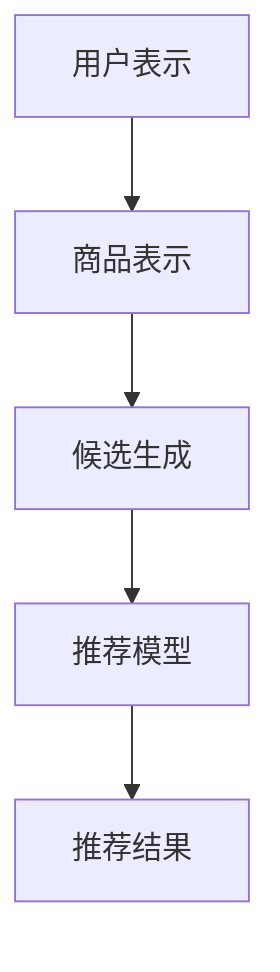

                 

### 文章标题：零样本推荐：候选生成策略

### 关键词：零样本推荐、候选生成策略、知识图谱、迁移学习、生成对抗网络、强化学习

> **摘要：**本文旨在深入探讨零样本推荐系统中候选生成策略的原理、方法及其在实际应用中的优化策略。通过分析零样本推荐与传统推荐系统的区别，介绍候选生成策略的基础，以及知识图谱、迁移学习、生成对抗网络和强化学习在候选生成中的应用，本文为构建高效、个性化的推荐系统提供了理论支持和实践指导。**

----------------------------------------------------------------

### 《零样本推荐：候选生成策略》目录大纲

----------------------------------------------------------------

#### **# 第一部分：引言与背景**

#### **## 第1章：零样本推荐概述**

#### **1.1 零样本推荐的定义与重要性**

#### **1.2 零样本推荐与传统推荐系统的区别**

#### **1.3 零样本推荐的应用场景**

#### **## 第2章：候选生成策略基础**

#### **2.1 候选集生成的目标与挑战**

#### **2.2 常见候选生成方法综述**

#### **2.3 零样本推荐中的候选生成策略**

#### **# 第二部分：核心算法原理**

#### **## 第3章：知识图谱在候选生成中的应用**

#### **3.1 知识图谱的基本概念与构建**

#### **3.2 知识图谱在候选生成中的应用**

#### **3.3 知识图谱驱动的候选生成算法**

#### **## 第4章：迁移学习在候选生成策略中的运用**

#### **4.1 迁移学习的基本概念**

#### **4.2 零样本推荐中的迁移学习策略**

#### **4.3 迁移学习在候选生成中的实现方法**

#### **## 第5章：生成对抗网络（GAN）在候选生成中的应用**

#### **5.1 GAN的基本原理与架构**

#### **5.2 GAN在候选生成中的作用机制**

#### **5.3 基于GAN的候选生成算法**

#### **## 第6章：强化学习在候选生成策略中的运用**

#### **6.1 强化学习的基本概念**

#### **6.2 强化学习在推荐系统中的应用**

#### **6.3 基于强化学习的候选生成策略**

#### **# 第三部分：项目实战**

#### **## 第7章：零样本推荐项目实战**

#### **7.1 项目背景与目标**

#### **7.2 项目实战步骤与流程**

#### **7.3 实战案例分析与代码解读**

#### **## 第8章：实战中的候选生成策略优化**

#### **8.1 优化目标与方法**

#### **8.2 数据预处理与特征工程**

#### **8.3 算法优化**

#### **8.4 数据增强**

#### **8.5 实际应用中的优化策略**

#### **# 第四部分：未来发展趋势与挑战**

#### **## 第9章：未来发展趋势与挑战**

#### **9.1 零样本推荐的发展趋势**

#### **9.2 零样本推荐中的挑战与对策**

#### **9.3 零样本推荐的未来展望**

#### **# 附录**

#### **## 附录A：相关工具与资源**

#### **## 附录B：参考文献**

----------------------------------------------------------------

### 第一部分：引言与背景

#### 第1章：零样本推荐概述

#### 1.1 零样本推荐的定义与重要性

**定义：**

零样本推荐（Zero-Shot Recommendation）是一种推荐系统技术，它能够在没有用户历史行为数据的情况下，根据用户的属性或其他信息，为用户提供个性化的推荐。这种技术特别适用于新用户推荐、新商品推荐、跨领域推荐等场景，因为在这类场景中，用户或商品缺乏足够的历史行为数据，传统推荐系统难以发挥作用。

**重要性：**

1. **新用户推荐**：对于新用户，传统推荐系统通常需要收集用户的历史行为数据，但新用户往往缺乏这些数据。零样本推荐能够利用用户的其他信息（如兴趣标签、人口统计信息等）进行推荐，从而在新用户阶段提供有效的推荐。

2. **新商品推荐**：对于新商品，传统推荐系统依赖于用户的购买行为来生成推荐，但新商品缺乏用户反馈。零样本推荐可以基于商品的特征信息（如商品分类、品牌等）进行推荐，从而在新商品发布阶段提高曝光率和销售量。

3. **跨领域推荐**：在跨领域推荐场景中，用户在某一领域的兴趣很难直接迁移到另一个领域。零样本推荐通过利用知识图谱、迁移学习等技术，可以有效地实现跨领域的个性化推荐。

4. **数据稀疏性**：在数据稀疏的场景中，传统推荐系统可能无法准确预测用户的兴趣。零样本推荐通过引入先验知识和迁移学习，能够在数据不足的情况下提供有效的推荐。

#### 1.2 零样本推荐与传统推荐系统的区别

**数据依赖：**传统推荐系统高度依赖用户的历史行为数据，而零样本推荐则不依赖于这些数据，更多地依赖于知识图谱、迁移学习等手段。

**特征工程：**传统推荐系统需要复杂的特征工程，而零样本推荐系统则可以减轻这一负担，直接利用已有的知识或模型进行推荐。

**推荐效果：**在数据充足的情况下，传统推荐系统可能表现更好；但在数据稀疏或新用户场景中，零样本推荐系统具有显著优势。

#### 1.3 零样本推荐的应用场景

**新用户推荐：** 零样本推荐能够快速为缺乏历史数据的用户提供个性化的推荐，提高用户留存率。

**跨领域推荐：** 零样本推荐能够处理不同领域之间的差异，实现跨领域的个性化推荐。

**小样本推荐：** 零样本推荐在数据稀疏的场景中表现优异，能够基于少量数据进行有效的推荐。

**新产品推荐：** 零样本推荐能够基于已有的知识或数据为新产品提供推荐，帮助产品快速进入市场。

**深度个性化推荐：** 零样本推荐能够更好地捕捉用户的潜在兴趣，提供更加精准的推荐。

#### 1.4 零样本推荐系统架构

零样本推荐系统的架构通常包括以下几个关键组成部分：

1. **用户表示**：将用户属性、行为等信息转换为向量表示。
2. **商品表示**：将商品属性、分类等信息转换为向量表示。
3. **候选生成**：利用用户和商品的表示，生成可能的候选集。
4. **推荐模型**：对候选集进行排序，生成推荐结果。

以下是零样本推荐系统架构的Mermaid流程图：



#### 伪代码：候选生成策略基础

```python
def candidate_generation(user_data, knowledge_graph, model):
    """
    候选生成策略基础

    :param user_data: 用户数据
    :param knowledge_graph: 知识图谱
    :param model: 模型
    :return: 候选集
    """

    # 构建用户表示
    user_embedding = model.encode(user_data)

    # 构建候选集
    candidates = []

    # 遍历知识图谱中的实体
    for entity in knowledge_graph.entities:
        # 计算实体与用户表示的相似度
        similarity = model.cosine_similarity(user_embedding, entity.embedding)

        # 添加相似度最高的实体到候选集
        candidates.append(entity)

    return candidates[:N]
```

#### 数学模型：候选生成中的相似度计算

$$
\text{相似度} = \frac{\text{用户表示} \cdot \text{实体表示}}{\|\text{用户表示}\| \|\text{实体表示}\|}
$$

#### 举例说明：候选生成策略在实际场景中的应用

假设用户在电商平台上购买了多个商品，包括书籍、电子产品和服饰。以下是一个简单的例子，展示了如何使用候选生成策略为该用户提供推荐。

1. **数据预处理**：将用户的历史购买数据转换为向量表示。
2. **知识图谱构建**：构建包含商品实体、用户实体和关系的知识图谱。
3. **候选生成**：使用上述伪代码中的候选生成策略，从知识图谱中生成候选集。
4. **推荐结果**：将候选集排序，并将排名靠前的商品推荐给用户。

#### 实际场景中的候选生成策略

1. **基于用户行为的候选生成**：利用用户的历史购买行为，生成与用户兴趣相似的候选商品。
2. **基于知识图谱的候选生成**：利用知识图谱中的关系，生成与用户兴趣相关的候选商品。
3. **基于多模态数据的候选生成**：结合用户的行为数据和知识图谱，生成更加个性化的候选商品。

#### 伪代码：基于用户行为的候选生成

```python
def candidate_generation_based_on_behavior(user_behavior, knowledge_graph, model):
    """
    基于用户行为的候选生成

    :param user_behavior: 用户行为数据
    :param knowledge_graph: 知识图谱
    :param model: 模型
    :return: 候选集
    """

    # 构建用户表示
    user_embedding = model.encode(user_behavior)

    # 构建候选集
    candidates = []

    # 遍历知识图谱中的实体
    for entity in knowledge_graph.entities:
        # 计算实体与用户表示的相似度
        similarity = model.cosine_similarity(user_embedding, entity.embedding)

        # 添加相似度最高的实体到候选集
        candidates.append(entity)

    return candidates[:N]
```

#### 实战中的候选生成策略优化

在实际应用中，候选生成策略的优化是提高推荐系统效果的关键。以下是一些常见的优化方法：

1. **特征工程**：通过对用户行为数据进行特征提取和组合，提高候选生成的准确性和多样性。
2. **模型融合**：将多个模型的结果进行融合，以平衡候选集的多样性和准确性。
3. **在线学习**：实时更新用户表示和候选生成策略，以适应用户兴趣的变化。
4. **协同过滤**：结合协同过滤算法，提高候选生成策略在用户行为稀疏情况下的性能。

#### 伪代码：特征工程与候选生成策略优化

```python
def feature_engineering(user_behavior, knowledge_graph, model):
    """
    特征工程与候选生成策略优化

    :param user_behavior: 用户行为数据
    :param knowledge_graph: 知识图谱
    :param model: 模型
    :return: 候选集
    """

    # 构建用户表示
    user_embedding = model.encode(user_behavior)

    # 构建候选集
    candidates = []

    # 遍历知识图谱中的实体
    for entity in knowledge_graph.entities:
        # 计算实体与用户表示的相似度
        similarity = model.cosine_similarity(user_embedding, entity.embedding)

        # 引入协同过滤效果
        collaborative_filtering_effect = compute_collaborative_filtering_effect(user_behavior, entity)

        # 计算加权相似度
        weighted_similarity = similarity * collaborative_filtering_effect

        # 添加加权相似度最高的实体到候选集
        candidates.append(entity)

    return candidates[:N]
```

### 结论

本章介绍了零样本推荐的定义、重要性、与传统推荐系统的区别以及应用场景。此外，还详细阐述了候选生成策略的基础原理、相似度计算方法以及实际应用场景。通过这些内容，读者可以初步了解零样本推荐的基本概念和核心算法，为后续章节的学习打下基础。

## 第2章：候选生成策略基础

#### 2.1 候选集生成的目标与挑战

**候选集生成的目标：**

1. **多样性**：生成的候选集应具有丰富的多样性，以避免推荐给用户相同的商品。
2. **准确性**：候选集应包含与用户兴趣高度相关的商品，以提高推荐系统的准确性。
3. **覆盖率**：候选集应涵盖尽可能多的潜在感兴趣商品，以满足不同用户的个性化需求。
4. **实时性**：候选集生成应能够快速响应用户需求的变化，提供实时的推荐。

**候选集生成的挑战：**

1. **数据稀疏性**：在用户行为数据稀疏的情况下，难以准确预测用户的兴趣。
2. **冷启动问题**：对于新用户或新商品，由于缺乏足够的历史数据，难以生成有效的候选集。
3. **实时性**：在高并发的场景下，生成候选集的速度需要足够快，以满足实时推荐的需求。
4. **计算资源**：候选集生成过程中涉及大量的计算和存储资源，如何高效地利用这些资源是一个挑战。

#### 2.2 常见候选生成方法综述

**基于内容的候选生成：**

**定义：** 基于内容的候选生成方法主要通过分析商品的特征信息（如文本描述、标签、属性等），生成候选集。

**优点：**
- **适用性**：适用于文本描述丰富的商品。
- **实时性**：计算速度快，适合实时推荐。

**缺点：**
- **多样性**：容易生成重复的候选集。
- **准确性**：对于缺乏描述信息的商品，效果较差。

**基于协同过滤的候选生成：**

**定义：** 基于协同过滤的候选生成方法主要通过分析用户的历史行为数据，找到与目标用户兴趣相似的邻居用户，然后推荐邻居用户喜欢的商品。

**优点：**
- **准确性**：在用户行为数据充足的情况下，效果较好。
- **多样性**：通过引入邻居用户的信息，提高了候选集的多样性。

**缺点：**
- **数据稀疏性**：在用户行为数据稀疏的情况下，效果较差。
- **实时性**：计算速度较慢，不适合实时推荐。

**基于模型的候选生成：**

**定义：** 基于模型的候选生成方法通过训练机器学习模型（如神经网络、深度学习模型等），生成候选集。

**优点：**
- **多样性**：通过引入复杂的模型结构，提高了候选集的多样性。
- **准确性**：在用户行为数据充足的情况下，效果较好。

**缺点：**
- **计算资源**：训练和推理过程需要大量的计算资源。
- **实时性**：在实时推荐场景下，模型推理速度较慢。

#### 2.3 零样本推荐中的候选生成策略

**知识图谱驱动的候选生成：**

**定义：** 知识图谱驱动的候选生成方法利用知识图谱中的实体关系和属性信息，生成候选集。

**优点：**
- **多样性**：通过知识图谱中的关系，能够生成丰富的候选集。
- **准确性**：利用知识图谱中的实体属性，提高了候选集的准确性。
- **实时性**：计算速度较快，适合实时推荐。

**缺点：**
- **数据稀疏性**：在知识图谱数据稀疏的情况下，效果较差。
- **计算资源**：构建和维护知识图谱需要大量的计算资源。

**迁移学习驱动的候选生成：**

**定义：** 迁移学习驱动的候选生成方法通过迁移学习技术，将已知的领域知识迁移到目标领域，生成候选集。

**优点：**
- **跨领域推荐**：能够实现跨领域的推荐。
- **新用户推荐**：在新用户缺乏足够历史数据的情况下，效果较好。

**缺点：**
- **迁移效果**：迁移效果取决于源领域和目标领域之间的相似度。
- **计算资源**：迁移学习过程需要大量的计算资源。

**强化学习驱动的候选生成：**

**定义：** 强化学习驱动的候选生成方法利用强化学习技术，生成候选集，并通过反馈机制不断优化推荐结果。

**优点：**
- **个性化推荐**：通过不断学习用户的反馈，生成个性化的候选集。
- **适应性**：能够快速适应用户兴趣的变化。

**缺点：**
- **计算资源**：强化学习过程需要大量的计算资源。
- **收敛速度**：在用户反馈不足的情况下，收敛速度较慢。

#### 2.4 候选生成策略的比较与选择

**比较指标：**

在比较不同候选生成策略时，通常使用以下指标：

1. **准确性**：衡量候选集与用户兴趣的相关程度。
2. **多样性**：衡量候选集的多样性。
3. **覆盖率**：衡量候选集覆盖用户潜在兴趣的程度。
4. **实时性**：衡量候选集生成的速度。

**选择策略：**

选择合适的候选生成策略通常需要考虑以下因素：

1. **数据规模**：在大规模数据场景下，选择基于协同过滤的方法可能更为合适。
2. **实时性要求**：在实时推荐场景下，选择基于内容的候选生成方法可能更为合适。
3. **计算资源**：在计算资源有限的情况下，选择基于迁移学习的方法可能更为合适。
4. **业务需求**：根据业务需求，选择能够满足多样性、准确性、实时性等需求的候选生成策略。

**混合策略：**

在实际应用中，通常会结合多种候选生成策略，以实现更好的推荐效果。例如，可以结合基于内容的候选生成和基于协同过滤的候选生成，以提高候选集的准确性和多样性。

#### 伪代码：混合策略的候选生成

```python
def hybrid_candidate_generation(user_data, content_model, collaborative_model):
    """
    混合策略的候选生成

    :param user_data: 用户数据
    :param content_model: 内容模型
    :param collaborative_model: 协同过滤模型
    :return: 候选集
    """

    # 基于内容的候选生成
    content_candidates = content_model.generate_candidates(user_data)

    # 基于协同过滤的候选生成
    collaborative_candidates = collaborative_model.generate_candidates(user_data)

    # 合并候选集
    candidates = content_candidates.union(collaborative_candidates)

    # 对候选集进行排序
    sorted_candidates = sort_candidates_by_similarity(user_data, candidates)

    return sorted_candidates[:N]
```

### 结论

本章介绍了候选生成策略的基础概念，包括候选集生成的目标与挑战、常见候选生成方法综述以及零样本推荐中的候选生成策略。通过本章的学习，读者可以了解候选生成策略的核心原理和实际应用场景，为后续章节的学习打下基础。

## 第3章：知识图谱在候选生成中的应用

### 3.1 知识图谱的基本概念与构建

#### 3.1.1 知识图谱的定义

知识图谱（Knowledge Graph）是一种用于表示实体及其之间关系的语义网络。它通过将实体、属性和关系进行结构化组织，实现对知识内容的语义理解和关联分析。知识图谱通常采用图数据库进行存储和查询，如Neo4j、ArangoDB等。

#### 3.1.2 知识图谱的构建方法

知识图谱的构建主要包括以下步骤：

1. **数据源收集**：从各种来源（如文本、数据库、API等）收集相关数据。
2. **实体抽取**：从数据源中识别和提取实体，如人物、地点、组织、物品等。
3. **关系抽取**：从数据源中识别和提取实体之间的关系，如“喜欢”、“属于”、“位于”等。
4. **实体链接**：将文本中的实体与知识图谱中的实体进行匹配和关联。
5. **知识融合**：将来自不同来源的知识进行整合，消除冲突和冗余。

#### 3.1.3 知识图谱的存储与查询

知识图谱的存储通常采用图数据库，这些数据库支持高效的图查询操作，如Neo4j的Cypher查询语言和ArangoDB的AQL（ArangoDB Query Language）。图查询可以有效地执行复杂的关联分析，如路径搜索、子图匹配等。

### 3.2 知识图谱在候选生成中的应用

#### 3.2.1 知识图谱在候选生成中的作用

知识图谱在候选生成中的应用主要体现在以下几个方面：

1. **实体匹配**：通过知识图谱中的实体匹配，将用户与潜在的候选实体进行关联。
2. **关系挖掘**：通过知识图谱中的关系，挖掘用户可能感兴趣的实体。
3. **属性扩展**：通过知识图谱中的属性，扩展候选实体的特征信息。

#### 3.2.2 基于知识图谱的候选生成方法

基于知识图谱的候选生成方法主要包括以下几种：

1. **基于实体匹配的候选生成**：通过知识图谱中的实体匹配，生成候选实体。
2. **基于关系挖掘的候选生成**：通过知识图谱中的关系，挖掘用户可能感兴趣的实体。
3. **基于属性扩展的候选生成**：通过知识图谱中的属性，扩展候选实体的特征信息，生成候选实体。

#### 3.2.3 常见的知识图谱构建工具

常见的知识图谱构建工具包括：

1. **OpenKG**：一个开源的知识图谱构建工具，支持实体抽取、关系抽取等功能。
2. **RDF4J**：一个Java实现的RDF数据存储和查询工具，支持多种查询语言。
3. **Apache Jena**：一个开源的Jena框架，支持RDF数据的存储和查询。

### 3.3 知识图谱驱动的候选生成算法

#### 3.3.1 算法框架

知识图谱驱动的候选生成算法通常包括以下步骤：

1. **知识图谱构建**：从非结构化数据中构建知识图谱。
2. **用户表示生成**：将用户数据转换为知识图谱中的实体表示。
3. **候选生成**：利用知识图谱中的实体匹配、关系挖掘和属性扩展，生成候选实体。
4. **候选排序**：对候选实体进行排序，生成最终的推荐结果。

#### 3.3.2 伪代码示例

```python
def knowledge_based_candidate_generation(user_data, knowledge_graph):
    """
    知识图谱驱动的候选生成算法

    :param user_data: 用户数据
    :param knowledge_graph: 知识图谱
    :return: 候选集
    """

    # 步骤1：知识图谱构建
    knowledge_graph = build_knowledge_graph()

    # 步骤2：用户表示生成
    user_embedding = generate_user_embedding(user_data, knowledge_graph)

    # 步骤3：候选生成
    candidates = generate_candidates(user_embedding, knowledge_graph)

    # 步骤4：候选排序
    sorted_candidates = sort_candidates_by_similarity(user_embedding, candidates)

    return sorted_candidates[:N]
```

#### 3.3.3 数学模型：候选生成中的相似度计算

$$
\text{相似度} = \frac{\text{用户表示} \cdot \text{实体表示}}{\|\text{用户表示}\| \|\text{实体表示

