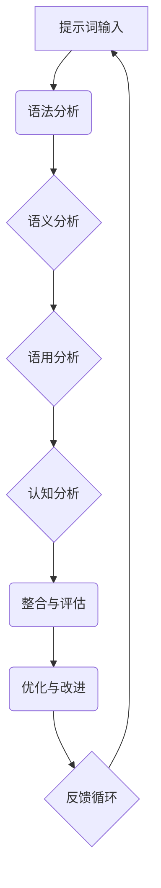

                 

# 第一部分：AGI与提示词语言概述

## 第1章：AGI概述

### 1.1 AGI的定义与历史演进

人工智能（Artificial Intelligence，简称AI）作为计算机科学的一个重要分支，已经经历了数个阶段的发展。从最初的符号逻辑、知识表示，到后来的机器学习和深度学习，每一阶段都带来了革命性的变化。然而，这些技术仍然未能实现真正意义上的通用人工智能（Artificial General Intelligence，简称AGI）。

**AGI的定义**：AGI是一种能够理解、学习和适应各种环境，具备人类智能水平的人工智能系统。它不仅仅能够执行特定任务，如语音识别、图像分类、自然语言处理等，而是能够像人类一样进行思考、推理、学习和创新。

**AGI的历史演进**：AGI的概念最早可以追溯到20世纪50年代，当时图灵提出了图灵测试。自那以后，人工智能的研究一直在不断前进，经历了几个重要的阶段：

- **初始阶段（1950-1969）**：这一时期，人工智能研究主要集中在符号主义和逻辑推理上，代表人物有纽厄尔和西蒙的“逻辑理论家”程序。

- **黄金时代（1970-1980）**：随着计算机性能的提升，人工智能研究进入了一个繁荣期，专家系统成为研究热点。

- **衰落时期（1980-1990）**：专家系统的实际应用遭遇瓶颈，加上机器学习技术尚不成熟，人工智能研究进入低潮期。

- **复兴时期（1990-2000）**：随着机器学习技术的发展，尤其是支持向量机、决策树等算法的出现，人工智能研究再次迎来春天。

- **深度学习时代（2000-至今）**：深度学习的崛起，尤其是卷积神经网络（CNN）和递归神经网络（RNN）等算法的应用，使得人工智能在图像识别、语音识别等领域取得了显著的突破。

### 1.2 AGI的关键技术

实现AGI需要突破多个关键技术，以下是一些核心领域：

- **知识表示与推理**：如何将人类的知识有效地表示为计算机可以处理的形式，并利用这些知识进行推理。

- **机器学习与深度学习**：如何通过学习大量数据，使计算机具备自适应能力和智能行为。

- **自然语言处理**：如何使计算机理解、生成和响应自然语言，实现人机对话。

- **认知建模**：如何模拟人类的思维过程，包括感知、记忆、学习、决策等。

- **机器人技术**：如何使机器人具备感知、决策和执行能力，实现与环境的交互。

### 1.3 AGI的发展现状与挑战

当前，AGI的研究仍然面临诸多挑战：

- **智能不平衡**：目前的AI系统通常只能在特定任务上表现出色，缺乏泛化能力。

- **数据依赖**：机器学习系统需要大量数据进行训练，而现实中的数据往往有限且不完整。

- **可解释性**：深度学习模型往往被视为“黑箱”，难以理解其决策过程。

- **伦理与安全**：随着AI技术的发展，伦理和安全问题日益突出，如隐私侵犯、自动化决策的公平性等。

- **计算资源**：实现AGI需要巨大的计算资源，尤其是对于复杂任务和大数据的处理。

尽管存在挑战，但AGI的研究具有重要的理论和实践价值。通过深入理解人类智能的本质，探索新的算法和架构，我们有望在未来实现真正的通用人工智能。

## 第2章：提示词语言基础

### 2.1 提示词语言的概念与作用

提示词语言（Instructional Language）是一种专门用于指导、控制和优化人工智能系统行为的形式化语言。它旨在提高人工智能系统的可解释性、灵活性和适应性。提示词语言不仅能够帮助人类更直观地与AI系统交互，还能够提高AI系统在不同任务中的表现。

**概念**：提示词语言是一种包含指令、参数和条件的语言，用于定义人工智能系统的行为模式。它通常由一组语法规则和语义规则组成，这些规则规定了如何将自然语言输入转换为计算机可以理解的指令。

**作用**：

1. **提高可解释性**：通过使用提示词语言，人工智能系统能够以一种更透明、可解释的方式工作。用户可以理解系统的行为逻辑，从而增强对系统的信任感。

2. **增强灵活性**：提示词语言允许用户根据不同的场景和任务，灵活地调整和优化系统的行为。

3. **提升适应性**：提示词语言可以帮助系统快速适应新的任务和挑战，提高系统的泛化能力。

4. **优化任务执行**：通过精确的指令和参数设定，提示词语言可以优化人工智能系统在不同任务中的执行效率。

### 2.2 提示词语言的基本原理

提示词语言的基本原理包括语法、语义和语用三个方面：

**语法**：语法是提示词语言的核心组成部分，它定义了指令的结构和规则。典型的语法结构包括指令词、参数、条件和动作。指令词是表示具体行为的动词，如“学习”、“推理”、“生成”等；参数是具体行为的输入，如数据集、模型参数等；条件是执行指令的前提，如“如果”、“当”等；动作是执行的具体操作，如“更新权重”、“输出结果”等。

**语义**：语义是指提示词语言中的指令和参数的实际含义。语义分析是理解和使用提示词语言的关键。通过语义分析，人工智能系统能够准确理解用户的意图和指令，从而执行相应的操作。

**语用**：语用是指提示词语言在实际使用中的应用和效果。语用分析关注的是提示词语言如何影响人工智能系统的行为，以及如何优化系统的性能。

### 2.3 提示词语言的分类与应用

提示词语言可以根据不同的应用场景和目标进行分类：

**1. 通用提示词语言**：这类语言旨在提供通用的指令和操作，适用于多种人工智能应用。例如，Python编程语言就是一种通用提示词语言，它广泛应用于数据分析、机器学习、Web开发等领域。

**2. 专用提示词语言**：这类语言专门为特定的应用领域设计，具有明确的任务导向和领域特定词汇。例如，SQL（结构化查询语言）是一种用于数据库查询的专用提示词语言，它具有强大的数据操作能力，广泛应用于数据分析和数据科学领域。

**3. 自然语言提示词语言**：这类语言将自然语言与计算机指令相结合，使得人类可以通过自然语言与人工智能系统进行交互。例如，对话系统中的自然语言处理（NLP）技术，可以将用户的自然语言输入转换为机器可执行的指令。

**应用实例**：

1. **机器学习任务**：在机器学习任务中，提示词语言可以用于指定训练数据、模型参数、优化目标等。例如，使用Python编写一个简单的机器学习程序，可以通过提示词语言指定数据集、选择模型、设置训练参数等。

2. **智能交互系统**：在智能交互系统中，提示词语言可以用于控制对话系统的行为。例如，使用自然语言提示词语言，用户可以通过简单的自然语言指令与智能助手进行互动。

3. **自动化任务**：在自动化任务中，提示词语言可以用于定义任务的执行流程和条件。例如，使用通用提示词语言编写自动化脚本，可以实现自动化测试、自动化部署等任务。

通过提示词语言的合理设计和应用，我们可以提高人工智能系统的可操作性和智能化水平，为实际应用提供强大的支持。

## 第3章：提示词语言的语法理论

### 3.1 语法理论的基本框架

提示词语言的语法理论是构建高效、易用的人工智能系统的基础。它通过定义一系列语法规则，确保系统可以准确理解并执行用户输入的指令。语法理论的基本框架通常包括以下几个部分：

**1. 指令词**：指令词是提示词语言的核心元素，用于表示具体的操作或行为。常见的指令词包括“学习”、“推理”、“生成”、“更新”等。指令词的明确定义有助于系统识别和理解用户意图。

**2. 参数**：参数是指令的输入，用于提供执行指令所需的具体信息。例如，在“学习”指令中，参数可能包括训练数据集、模型参数等。参数的合理定义和传递，可以确保指令的执行具备必要的信息支持。

**3. 条件**：条件是执行指令的前提条件，用于控制指令的执行时机。常见的条件包括“如果”、“当”等。条件语句的使用，使得系统可以根据不同的情况灵活调整行为，提高任务的执行效率。

**4. 动作**：动作是执行指令后的具体操作，用于实现用户指定的功能。例如，在“更新权重”指令中，动作可能包括更新模型参数、计算梯度等。动作的准确执行，是完成指令目标的关键。

**5. 语法规则**：语法规则是指导指令词、参数、条件和动作如何组合和使用的一系列规则。这些规则确保系统可以正确解析用户输入，并生成相应的操作指令。

通过以上基本框架，提示词语言的语法理论为系统的行为定义提供了清晰的结构和逻辑，使得用户可以更方便地与系统进行交互。

### 3.2 语法分析的算法原理

语法分析是提示词语言处理的重要环节，它将用户输入的自然语言转换为计算机可以理解和执行的指令。语法分析的算法原理主要包括词法分析和语法解析两个阶段。

**词法分析**：词法分析是将输入的字符串分解为一系列单词（token）的过程。每个单词代表一个基本语法单位，如指令词、参数、条件等。词法分析的主要任务包括：

- **分词**：将连续的字符串分割为单词。例如，将“更新模型参数”分割为“更新”、“模型”、“参数”三个单词。
- **标记**：为每个单词分配一个词性标签，如名词、动词、形容词等。词性标签有助于后续语法解析阶段更好地理解单词的含义。

**语法解析**：语法解析是在词法分析基础上，将分解出的单词序列转换为语法结构的处理过程。常见的语法分析方法包括递归下降分析、LL(k)分析、LR(k)分析等。以下是几种主要语法解析算法的原理：

- **递归下降分析**：递归下降分析是一种自顶向下的语法分析方法。它从根节点开始，递归地解析输入序列，直到达到叶节点。该方法简单直观，但在处理复杂语法时容易出现错误。
- **LL(k)分析**：LL(k)分析是一种自顶向下的语法分析方法，它利用前k个单词预测下一个单词的语法类别。LL(k)分析具有较高的正确性和效率，但可能产生左递归问题，影响解析性能。
- **LR(k)分析**：LR(k)分析是一种自底向上的语法分析方法，它利用已解析的单词序列和k个后续单词预测下一个动作。LR(k)分析可以处理左递归问题，但解析过程较为复杂。

通过词法分析和语法解析，提示词语言处理系统可以准确理解用户输入，生成相应的操作指令。语法分析的算法原理，不仅保证了系统的准确性和鲁棒性，还为复杂任务提供了高效的执行路径。

### 3.3 语法理论的应用实例

语法理论在提示词语言中的应用实例丰富多样，涵盖了从自然语言处理到自动化任务等多个领域。以下是一些具体的应用场景和实例：

**1. 自然语言处理（NLP）**

在自然语言处理领域，提示词语言语法理论主要用于构建理解和生成自然语言的模型。例如：

- **文本分类**：通过定义一系列语法规则，可以将文本拆分为单词、短语和句子。语法分析器能够识别文本中的关键词和主题，从而实现文本分类任务。
- **机器翻译**：提示词语言语法理论可以帮助系统理解源语言的句子结构，并将其转换为目标语言的等效表达。语法分析确保翻译结果的语义准确性和流畅性。

**2. 自动化任务**

在自动化任务中，提示词语言语法理论用于定义任务流程和控制逻辑。例如：

- **自动化测试**：通过提示词语言，可以定义测试脚本，包括测试用例、输入数据和预期结果。语法分析确保测试脚本的正确性和一致性。
- **自动化部署**：在软件开发过程中，提示词语言可以用于定义应用程序的部署流程。语法分析器能够根据脚本中的指令，自动执行配置、安装和部署任务。

**3. 智能助手系统**

智能助手系统广泛使用提示词语言语法理论，以实现自然语言交互。例如：

- **对话系统**：通过语法分析，智能助手可以理解用户输入的指令，并生成相应的响应。语法理论确保对话系统能够准确理解用户的意图，提供有效的帮助。
- **语音识别**：语法分析器可以对语音信号中的自然语言指令进行解析，将语音转换为文本指令，从而实现语音控制功能。

这些应用实例展示了提示词语言语法理论在实际问题解决中的强大作用。通过合理设计和应用语法规则，可以显著提高人工智能系统的智能化和自动化水平，为各类任务提供高效、可靠的解决方案。

## 第4章：提示词语言的语义理论

### 4.1 语义理论的基本概念

提示词语言的语义理论是理解并解释提示词语言中指令和语句的实际含义的核心。语义理论关注的是提示词语言符号与客观世界之间的对应关系，以及这些符号在特定上下文中如何产生具体的语义效果。

**基本概念**：

1. **语义**：语义是指语言符号所表示的意义。在提示词语言中，语义包括指令、参数、条件和动作的具体含义。例如，“学习”指令的语义是训练模型，“更新”指令的语义是更新模型参数。

2. **语义角色**：语义角色是指在一个指令或语句中，各个组成部分（如指令词、参数、条件等）所扮演的角色。常见的语义角色包括动作执行者、目标对象、条件触发器等。

3. **语义解析**：语义解析是将用户输入的自然语言指令转换为计算机可以理解的语义表示的过程。语义解析的目标是准确理解用户意图，并生成相应的操作指令。

4. **语义框架**：语义框架是一种用于表示和理解语言结构的模型，它将语言中的各个部分与它们的语义角色和关系联系起来。语义框架有助于识别和理解复杂的语言指令。

### 4.2 语义分析的算法原理

语义分析是提示词语言处理的重要步骤，它将语法解析后的结构化信息转换为机器可以执行的指令。语义分析的算法原理主要包括以下几个部分：

1. **语义角色标注**：在语义分析过程中，首先需要对语法解析得到的结构进行语义角色标注。这一步骤通过识别句子中的各个成分（如主语、谓语、宾语等）并为其分配相应的语义角色，从而建立语法结构和语义内容之间的联系。

2. **语义映射**：语义映射是将语法结构中的元素映射到具体的语义表示。这一步骤通常涉及将指令词映射到相应的操作，参数映射到具体的输入数据，条件映射到控制逻辑等。语义映射的准确性直接影响指令的执行效果。

3. **语义推理**：语义推理是基于已有语义信息，通过逻辑推理产生新的语义表示。语义推理可以帮助系统在复杂场景中理解用户的隐含意图，例如，根据上下文推断出某些未明确提到的参数或条件。

4. **语义整合**：语义整合是将多个语义元素整合为一个统一的语义表示。语义整合涉及处理句子中的并列结构、嵌套结构等复杂情况，确保整个指令的语义一致性。

常见的语义分析算法包括基于规则的方法、基于统计的方法和基于神经网络的方法。基于规则的方法依赖手工编写的语义规则，适用于规则明确、场景简单的应用。基于统计的方法通过大规模数据训练，学习语义模式的概率分布，适用于复杂和多样化的场景。基于神经网络的方法，特别是深度学习，通过端到端的学习，可以自动发现语义模式和规律，适用于大规模和动态变化的场景。

### 4.3 语义理论的应用实例

语义理论在提示词语言中的应用实例广泛，以下是一些具体的应用场景：

1. **智能问答系统**：在智能问答系统中，语义分析用于理解用户的问题，并生成准确的回答。通过语义分析，系统可以识别用户问题中的关键词、概念和关系，从而找到相应的答案。

2. **自然语言生成**：在自然语言生成（NLG）系统中，语义分析用于将结构化的数据转换为自然语言文本。通过语义分析，系统能够理解数据的内容和结构，并生成符合语言习惯和语义逻辑的文本。

3. **对话系统**：在对话系统中，语义分析用于理解用户的输入指令，并生成合适的响应。通过语义分析，系统可以识别用户意图，并根据上下文生成连贯、自然的对话。

4. **自动化脚本编写**：在自动化脚本编写中，语义分析用于将自然语言指令转换为具体的操作指令。通过语义分析，系统可以理解用户的意图，并生成相应的脚本代码。

这些应用实例展示了语义理论在提示词语言处理中的重要性。通过精确的语义分析和理解，提示词语言能够有效地提升人工智能系统的智能化和交互能力，为各类任务提供可靠的解决方案。

## 第5章：提示词语言的语用理论

### 5.1 语用理论的基本框架

提示词语言的语用理论关注的是提示词语言在实际使用场景中的效果和影响，即语用功能。它通过研究提示词语言如何在不同环境中实现特定的交际目标，从而提高人工智能系统的交互质量和用户体验。

**基本概念**：

1. **语用**：语用是指语言在实际使用中的功能和行为。在提示词语言中，语用包括指令的执行效果、对话的连贯性、交互的效率等。

2. **语用功能**：语用功能是指提示词语言在特定任务或场景中实现的具体功能。常见的语用功能包括命令执行、信息传递、协商、提示等。

3. **语境**：语境是指提示词语言使用的具体环境，包括上下文、背景信息、用户意图等。语境对于理解和使用提示词语言至关重要。

**基本框架**：

1. **功能划分**：根据提示词语言在不同任务和场景中的功能，可以将其划分为命令、查询、交互等不同的类别。每种类别都有特定的语法和语义要求。

2. **语境分析**：语境分析是理解和使用提示词语言的关键。通过分析上下文、背景信息和用户意图，系统能够更准确地理解和执行指令。

3. **效果评估**：效果评估是衡量提示词语言在实际使用中的效果和影响。通过评估系统的响应准确性、交互连贯性和用户满意度，可以不断优化和改进语用设计。

### 5.2 语用分析的算法原理

语用分析是提示词语言处理的重要环节，它通过理解用户输入的语用意图，生成合适的操作指令和响应。语用分析的算法原理主要包括以下几个方面：

1. **意图识别**：意图识别是语用分析的首要任务，它通过分析用户输入，识别出用户的实际意图。常见的意图识别方法包括基于规则的方法、基于统计的方法和基于机器学习的方法。基于规则的方法通过手工编写的规则库来识别意图，适用于简单和明确的场景。基于统计的方法通过训练大量数据，学习意图模式的概率分布，适用于复杂和多样化的场景。基于机器学习的方法，特别是深度学习，可以通过端到端的学习，自动识别和分类意图。

2. **上下文分析**：上下文分析是语用分析的另一个关键步骤，它通过理解用户输入的上下文信息，如历史对话、当前任务状态等，来补充和修正意图识别的结果。上下文分析可以借助自然语言处理技术，如实体识别、关系提取等，来提取上下文信息，并利用这些信息进行语义理解和意图识别。

3. **动作规划**：动作规划是语用分析的最后一步，它根据识别出的意图和上下文信息，生成具体的操作指令和响应。动作规划通常涉及多个模块，如任务规划、资源分配、响应生成等。这些模块协同工作，确保系统能够生成高效、准确的响应。

### 5.3 语用理论的应用实例

语用理论在提示词语言中的应用实例丰富多样，以下是一些具体的应用场景和实例：

1. **智能客服系统**：在智能客服系统中，语用分析用于理解用户的问题和需求，并生成合适的答案和解决方案。通过意图识别和上下文分析，系统可以准确理解用户的意图，提供个性化的服务。

2. **自然语言交互**：在自然语言交互场景中，语用分析用于处理用户的自然语言输入，并生成自然的语言响应。通过意图识别和上下文分析，系统可以与用户进行流畅、自然的对话。

3. **自动化任务**：在自动化任务中，语用分析用于将自然语言指令转换为具体的操作步骤。通过意图识别和上下文分析，系统可以理解用户的需求，并自动执行相应的任务。

4. **对话系统**：在对话系统中，语用分析用于理解用户的对话意图，并生成合适的对话内容。通过意图识别和上下文分析，系统可以保持对话的连贯性和自然性，提供高质量的交互体验。

这些应用实例展示了语用理论在提升人工智能系统交互质量和用户体验方面的关键作用。通过深入研究和应用语用理论，我们可以设计出更智能、更高效的人工智能系统，满足用户的多样化需求。

## 第6章：提示词语言的认知理论

### 6.1 认知理论的基本概念

提示词语言的认知理论关注的是人类如何理解和使用提示词语言，以及这些过程如何影响人工智能系统的设计和应用。认知理论涉及心理学、神经科学、语言学等多个学科，旨在解释人类思维过程和语言使用之间的复杂关系。

**基本概念**：

1. **认知**：认知是指人类获取、处理和使用信息的过程。在提示词语言中，认知包括理解语言结构、语义和语用，以及在此基础上生成和回应语言的能力。

2. **注意力机制**：注意力机制是人类处理信息时的一种机制，它帮助人们在复杂的情景中聚焦关键信息，忽略无关干扰。在提示词语言处理中，注意力机制可以用于优化系统资源分配，提高信息处理的效率和准确性。

3. **记忆与学习**：记忆与学习是人类认知过程的重要组成部分。提示词语言的认知理论研究如何通过记忆和学习的机制，使人工智能系统能够在复杂和动态的环境中适应和进化。

4. **推理与决策**：推理与决策是认知的高级形式，涉及从已知信息中推导出未知信息，并在多个选择中做出最优决策。在提示词语言中，推理与决策过程可以用来理解复杂指令、处理不确定性和优化任务执行。

### 6.2 认知分析的算法原理

认知分析是理解和模拟人类认知过程的关键步骤，它为设计更加智能和适应性的人工智能系统提供了理论依据。认知分析的算法原理主要包括以下几个部分：

1. **注意力机制模拟**：注意力机制在人类认知中起着核心作用，通过集中关注关键信息，提高信息处理的效率。在算法中，可以使用深度学习模型，如卷积神经网络（CNN）和变换器（Transformer）等，来模拟注意力机制。这些模型通过学习大量数据，自动识别和关注关键信息，从而提高系统的准确性和效率。

2. **记忆与学习算法**：记忆与学习算法旨在模拟人类大脑的学习过程。常见的算法包括生成对抗网络（GAN）、长短时记忆网络（LSTM）和图神经网络（Graph Neural Network）等。这些算法可以用于记忆和存储大量信息，并通过不断的学习和更新，提高系统的适应性和学习能力。

3. **推理与决策算法**：推理与决策算法是认知分析的重要组成部分。逻辑推理、模糊推理和贝叶斯推理等算法可以用于从已知信息中推导出未知信息。同时，优化算法和决策树等算法可以用于在多个选择中做出最优决策。这些算法通过模拟人类推理过程，提高系统的智能水平。

4. **认知图谱**：认知图谱是一种用于表示和模拟人类认知过程的图结构。它通过将知识、概念、关系和推理路径表示为节点和边，提供了一个直观的模型来理解和分析认知过程。认知图谱可以用于知识表示、推理和决策，从而提高人工智能系统的智能性和可解释性。

### 6.3 认知理论的应用实例

认知理论在提示词语言中的应用实例丰富多样，以下是一些具体的应用场景和实例：

1. **智能问答系统**：在智能问答系统中，认知理论用于理解用户的问题，并生成准确的回答。通过注意力机制和记忆算法，系统可以捕捉问题的关键信息，快速找到相关的知识，并生成连贯、自然的回答。

2. **自然语言理解**：在自然语言理解中，认知理论用于解析复杂的语言结构和语义。通过推理算法和认知图谱，系统可以理解句子的深层含义，处理歧义和不确定性，从而提高语言理解的准确性和鲁棒性。

3. **对话系统**：在对话系统中，认知理论用于模拟人类的思维过程，实现自然、流畅的对话。通过注意力机制和推理算法，系统可以理解用户的意图和上下文信息，生成恰当的对话内容，提供高质量的交互体验。

4. **自动化任务**：在自动化任务中，认知理论用于模拟人类的决策过程，实现自动化的任务规划与执行。通过认知图谱和推理算法，系统可以理解任务要求，制定最优的执行策略，并自动完成复杂任务。

这些应用实例展示了认知理论在提升人工智能系统认知能力和智能化水平方面的关键作用。通过深入研究认知理论，我们可以设计出更智能、更适应性的人工智能系统，满足不断变化的应用需求。

## 第7章：提示词语言的整合与评估

### 7.1 整合理论的基本原理

提示词语言的整合理论旨在将不同层次、不同领域的提示词语言元素整合为一个统一的系统，以提高人工智能系统的整体性能和用户交互体验。整合理论的基本原理包括以下几个关键方面：

**1. 语法、语义、语用、认知的整合**：整合理论强调语法、语义、语用和认知四个层面的协同作用。语法为系统的行为提供结构基础，语义确保指令和信息的准确传达，语用关注交互效果，而认知则模拟人类思维过程。通过这四个层面的有机整合，系统能够实现更高效、更自然的交互。

**2. 多模态整合**：多模态整合是指将不同类型的信息（如文本、图像、语音等）进行整合，以提高系统的感知能力和交互能力。通过多模态整合，系统可以更全面地理解用户的需求，提供更丰富、更直观的交互体验。

**3. 动态整合**：动态整合强调系统在不同时间和环境下对提示词语言的处理能力。系统需要能够根据环境变化和用户行为动态调整语言处理策略，从而实现更灵活、更适应性强的交互。

**4. 自适应整合**：自适应整合是指系统能够根据用户反馈和使用情况，自动调整和优化语言处理模型。通过自适应整合，系统能够不断提升自身的交互能力和用户体验。

### 7.2 评估方法与工具

对提示词语言系统进行有效的评估是确保其性能和用户满意度的重要手段。以下是一些常用的评估方法和工具：

**1. 评价指标**：

- **准确性**：用于衡量系统在语法、语义和语用层面的处理正确性。例如，在自然语言理解任务中，准确性指标可以衡量系统生成答案的准确程度。
- **响应时间**：用于衡量系统对用户输入的响应速度。快速响应可以提高用户体验，减少用户的等待时间。
- **用户满意度**：通过用户调查和反馈，评估系统在实际使用中的用户满意度。用户满意度是衡量系统实用性和用户体验的重要指标。

**2. 评估方法**：

- **离线评估**：通过人工标注的数据集，对系统进行语法、语义和语用的离线评估。这种方法适用于系统的初步评估和优化。
- **在线评估**：在真实使用环境中，实时评估系统的性能和用户满意度。在线评估可以更准确地反映系统在实际应用中的表现。

**3. 评估工具**：

- **自动化评估工具**：如编程语言中的测试框架、自然语言处理工具等，用于自动化执行测试用例，评估系统的准确性和稳定性。
- **用户反馈系统**：通过用户调查、评论和评分，收集用户对系统的反馈，用于评估系统的用户体验和改进方向。

### 7.3 整合与评估的应用实例

提示词语言的整合与评估在多个实际应用场景中发挥了重要作用，以下是一些具体的应用实例：

**1. 智能客服系统**：

- **整合**：智能客服系统通过整合自然语言处理、对话系统和机器学习技术，实现高效、自然的用户交互。语法、语义和语用层面的整合，使得系统能够理解用户的需求，生成恰当的回复。
- **评估**：通过在线评估和用户反馈，系统不断优化对话策略和回复质量，提高用户的满意度。

**2. 智能助手系统**：

- **整合**：智能助手系统通过整合语音识别、自然语言理解和多模态交互技术，实现与用户的自然对话。认知层面的整合，使得系统可以理解用户的意图和上下文信息，提供个性化的服务。
- **评估**：通过用户满意度调查和性能测试，系统不断优化交互策略和响应速度，提高用户的使用体验。

**3. 自动化任务执行**：

- **整合**：自动化任务执行系统通过整合提示词语言、机器人技术和任务规划算法，实现自动化的任务执行。语法、语义和认知层面的整合，使得系统可以理解任务要求，生成最优的执行策略。
- **评估**：通过在线评估和性能测试，系统不断优化任务执行流程和效率，提高任务完成的准确性和及时性。

这些应用实例展示了提示词语言的整合与评估在实际问题解决中的重要性。通过合理的整合与评估，我们可以设计出更加智能、高效的人工智能系统，为各类任务提供可靠的解决方案。

## 第8章：提示词语言在自然语言处理中的应用

### 8.1 提示词语言在文本生成中的应用

提示词语言在文本生成中的应用极大地提升了自然语言处理（NLP）的效率和灵活性。文本生成是NLP的一个重要分支，涉及从给定的提示或输入生成有意义的文本。提示词语言在这一过程中发挥了关键作用，通过精确的指令和参数设定，指导生成模型生成高质量的文本。

**应用场景**：

1. **自动摘要**：通过提示词语言，可以指定生成摘要的长度、风格、关键词等参数，从而生成简洁、精炼的摘要文本。
2. **机器翻译**：提示词语言可以帮助翻译模型理解源语言文本的内容和结构，生成准确、流畅的目标语言文本。
3. **对话系统**：在对话系统中，提示词语言用于生成自然、连贯的回答，根据用户输入的提问或上下文生成对应的回答。

**实现方法**：

1. **模板匹配**：在简单的文本生成任务中，可以使用模板匹配的方法。提示词语言定义模板和参数，生成模型根据模板和输入参数生成文本。

2. **序列生成模型**：如生成对抗网络（GAN）和变换器（Transformer）等深度学习模型，通过提示词语言输入，生成连续的文本序列。这些模型可以学习文本的结构和语义，生成高质量的自然语言文本。

3. **预训练与微调**：预训练模型（如GPT-3、BERT）通过大量的文本数据预训练，可以理解复杂的语言结构。通过提示词语言，可以在特定任务上进行微调，生成更符合任务需求的文本。

**效果与挑战**：

1. **效果**：提示词语言在文本生成中取得了显著的效果，可以生成高质量、自然语言文本，提高NLP任务的表现。

2. **挑战**：尽管提示词语言在文本生成中具有优势，但仍面临一些挑战，如生成文本的多样性和一致性、处理复杂语言结构的能力等。未来需要进一步研究和优化，以提高文本生成的准确性和灵活性。

### 8.2 提示词语言在机器翻译中的应用

提示词语言在机器翻译中的应用，使得翻译过程更加高效和准确。机器翻译是将一种语言的文本转换为另一种语言的过程，涉及语言的解析、转换和生成。通过提示词语言的指导，翻译模型能够更好地理解源语言和目标语言之间的差异，生成更自然的翻译结果。

**应用场景**：

1. **跨语言文档生成**：通过提示词语言，可以指定翻译的目标语言、文档类型、关键词等参数，生成跨语言的文档。
2. **实时翻译**：在会议、访谈等场合，通过提示词语言，可以实时翻译讲话者的语言，实现跨语言交流。
3. **多语言搜索引擎**：通过提示词语言，可以指定搜索的语言、关键词等参数，提高多语言搜索引擎的准确性。

**实现方法**：

1. **规则匹配翻译**：基于提示词语言定义的规则，将源语言文本转换为目标语言文本。这种方法适用于简单的翻译任务，但难以处理复杂的语言结构。

2. **统计机器翻译**：通过提示词语言输入，训练统计机器翻译模型，如基于短语的机器翻译（PMT）和基于神经网络的机器翻译（NMT）。这些模型可以学习源语言和目标语言之间的统计规律，生成更自然的翻译结果。

3. **深度学习模型**：如循环神经网络（RNN）和变换器（Transformer）等深度学习模型，通过提示词语言输入，生成高质量的翻译文本。这些模型可以处理复杂的语言结构和语义，提高翻译的准确性。

**效果与挑战**：

1. **效果**：提示词语言在机器翻译中提高了翻译的准确性和自然性，能够生成高质量、流畅的翻译文本。

2. **挑战**：尽管提示词语言在机器翻译中具有优势，但仍面临一些挑战，如处理低资源语言、处理特定领域翻译等。未来需要进一步研究和优化，以提高机器翻译的准确性和适应性。

### 8.3 提示词语言在问答系统中的应用

提示词语言在问答系统中的应用，使得系统能够更准确、高效地理解用户的问题并生成恰当的回答。问答系统是NLP的重要应用之一，通过提示词语言的指导，系统可以更好地解析用户的问题，提供高质量的回答。

**应用场景**：

1. **搜索引擎**：通过提示词语言，可以指定搜索的关键词、搜索范围等参数，提高搜索引擎的准确性和效率。
2. **智能客服**：在智能客服系统中，提示词语言用于理解用户的问题，并生成合适的回答，提高客服的效率和用户体验。
3. **对话系统**：在对话系统中，提示词语言用于指导对话生成，生成连贯、自然的对话内容。

**实现方法**：

1. **基于规则的方法**：通过提示词语言定义一系列规则，根据用户问题匹配相应的回答。这种方法简单高效，但难以处理复杂的问题和多样化的回答。

2. **基于模板的方法**：使用提示词语言指定模板和参数，根据用户问题生成对应的回答。这种方法可以生成多样化的回答，但模板数量和复杂度会影响系统的灵活性和效率。

3. **基于机器学习的方法**：通过提示词语言输入，训练机器学习模型（如分类器、序列生成模型等），生成高质量的回答。这些模型可以处理复杂的问题和多样化的回答，提高问答系统的性能。

4. **基于知识图谱的方法**：通过提示词语言指定问题和知识库，利用知识图谱的语义关系和实体信息，生成精确的回答。

**效果与挑战**：

1. **效果**：提示词语言在问答系统中提高了回答的准确性和自然性，能够生成高质量、连贯的回答。

2. **挑战**：尽管提示词语言在问答系统中具有优势，但仍面临一些挑战，如理解复杂问题、处理长文本和多样化回答等。未来需要进一步研究和优化，以提高问答系统的准确性和适应性。

## 第9章：提示词语言在智能交互系统中的应用

### 9.1 智能客服系统的构建

智能客服系统是提示词语言在智能交互系统中的一个重要应用场景。通过提示词语言的指导，智能客服系统能够高效地理解用户的需求，提供个性化的服务，并实现自动化的客户支持。

**系统架构**：

1. **用户接口**：用户接口（UI）是用户与智能客服系统交互的界面。通过文本聊天、语音通话或视频对话等方式，用户可以提出问题或表达需求。

2. **自然语言处理（NLP）模块**：NLP模块负责接收用户输入的自然语言文本，进行预处理，如分词、词性标注等。然后，NLP模块使用提示词语言进行语义分析和意图识别，理解用户的真实需求。

3. **对话管理模块**：对话管理模块根据NLP模块的分析结果，选择合适的对话策略和回复。通过提示词语言，对话管理模块可以设定对话的上下文、关键词和回复逻辑。

4. **知识库**：知识库存储了大量的预定义知识，如常见问题的答案、产品信息、操作指南等。通过提示词语言，智能客服系统可以从知识库中检索相关信息，生成回答。

5. **机器学习模块**：机器学习模块用于训练和优化智能客服系统。通过提示词语言，系统可以接收用户的反馈，不断改进对话策略和回答质量。

**实现步骤**：

1. **需求分析**：明确智能客服系统的目标和应用场景，定义用户接口和交互方式。

2. **NLP模块开发**：开发自然语言处理模块，包括分词、词性标注、实体识别、语义分析和意图识别等功能。使用提示词语言，定义语法规则和语义框架，确保系统能够准确理解用户输入。

3. **对话管理模块开发**：设计对话管理模块，根据提示词语言，设定对话的上下文、关键词和回复逻辑。通过机器学习，不断优化对话策略和回答质量。

4. **知识库建设**：构建知识库，收集和整理常见问题的答案、产品信息、操作指南等。使用提示词语言，确保知识库中的信息能够被系统有效检索和利用。

5. **系统集成与测试**：将各个模块集成到一个完整的智能客服系统中，进行功能测试和性能优化。通过提示词语言，确保系统在不同场景和任务中的稳定性和高效性。

### 9.2 智能助手系统的设计

智能助手系统是另一个典型的提示词语言应用场景，通过提示词语言，智能助手能够与用户进行自然、流畅的对话，提供个性化服务和支持。

**系统架构**：

1. **用户接口**：用户接口是智能助手与用户交互的界面，可以通过文本、语音或图形界面与用户进行对话。

2. **自然语言处理（NLP）模块**：NLP模块负责处理用户的输入，包括分词、词性标注、实体识别、语义分析和意图识别。使用提示词语言，确保系统能够准确理解用户的意图。

3. **任务管理模块**：任务管理模块根据NLP模块的分析结果，分配和执行相应的任务。通过提示词语言，可以设定任务的上下文、执行步骤和反馈机制。

4. **个性化推荐模块**：个性化推荐模块根据用户的偏好和历史行为，生成个性化的推荐结果。使用提示词语言，可以设定推荐策略和算法。

5. **机器学习模块**：机器学习模块用于训练和优化智能助手系统，包括对话策略、推荐算法和任务执行逻辑。通过提示词语言，系统可以接收用户的反馈，不断改进性能。

**实现步骤**：

1. **需求分析**：明确智能助手系统的目标和应用场景，定义用户接口和交互方式。

2. **NLP模块开发**：开发NLP模块，包括分词、词性标注、实体识别、语义分析和意图识别等功能。使用提示词语言，定义语法规则和语义框架，确保系统能够准确理解用户输入。

3. **任务管理模块开发**：设计任务管理模块，根据提示词语言，设定任务的上下文、执行步骤和反馈机制。通过机器学习，优化任务执行策略和反馈机制。

4. **个性化推荐模块开发**：开发个性化推荐模块，根据用户的偏好和历史行为，生成个性化的推荐结果。使用提示词语言，设定推荐策略和算法。

5. **系统集成与测试**：将各个模块集成到一个完整的智能助手系统中，进行功能测试和性能优化。通过提示词语言，确保系统在不同场景和任务中的稳定性和高效性。

### 9.3 智能交互系统的优化策略

为了提升智能交互系统的性能和用户体验，需要采取一系列优化策略。以下是一些关键的优化方向：

**1. 优化NLP模块**：

- **提升语义理解能力**：通过增加语料库、引入新的语义分析算法，提升系统对复杂语义的理解能力。
- **减少歧义**：使用上下文信息和语境分析，减少语义歧义，提高理解准确性。

**2. 提高对话管理效率**：

- **自适应对话策略**：根据用户的行为和反馈，动态调整对话策略，提高对话的自然性和流畅性。
- **简化对话流程**：简化对话流程，减少不必要的步骤，提高交互效率。

**3. 个性化推荐**：

- **精准推荐算法**：使用先进的机器学习算法，提高推荐系统的准确性，提供个性化服务。
- **用户行为分析**：通过分析用户的行为和偏好，不断优化推荐策略，提升用户体验。

**4. 性能优化**：

- **减少响应时间**：优化系统架构和算法，减少系统的响应时间，提高用户满意度。
- **资源管理**：合理分配计算资源，确保系统在高负载下的稳定性和高效性。

**5. 用户反馈机制**：

- **实时反馈**：提供实时反馈机制，让用户可以快速、方便地提供反馈，帮助系统不断改进。
- **反馈分析**：分析用户反馈，识别系统的问题和改进方向，优化系统设计和功能。

通过这些优化策略，可以显著提升智能交互系统的性能和用户体验，为用户提供更加高效、便捷、智能的服务。

## 第10章：面向AGI的提示词语言研究趋势与发展方向

### 10.1 提示词语言在AGI中的潜在应用

随着人工智能（AGI）的发展，提示词语言在实现通用人工智能（AGI）的过程中具有巨大的潜力和应用前景。以下是提示词语言在AGI中的几个潜在应用领域：

**1. 智能交互系统**：提示词语言可以帮助构建更加智能、自然的智能交互系统，实现与人类用户的高效沟通和协作。通过提示词语言，系统能够理解用户的复杂指令和需求，生成适当的响应，提供个性化的服务。

**2. 自动化任务执行**：提示词语言可以指导机器人执行复杂的自动化任务，包括生产制造、物流配送、医疗辅助等。通过精确的指令和参数设定，机器人能够自主规划任务路径，处理不确定性，提高任务执行效率和准确性。

**3. 自然语言理解与生成**：提示词语言可以提升自然语言处理（NLP）系统的性能，使得系统更加准确地理解和生成自然语言。这有助于实现高效的文本生成、机器翻译、问答系统等应用，为人类提供更便捷的语言服务。

**4. 知识图谱构建与推理**：提示词语言可以指导知识图谱的构建与推理，通过语义分析和信息整合，形成对现实世界的准确理解。这为智能决策、推荐系统、智能搜索等应用提供了强大的知识基础。

### 10.2 未来研究方向与挑战

尽管提示词语言在AGI中具有广泛的应用潜力，但实现这一目标仍面临诸多挑战和未解决的问题。以下是一些关键的研究方向和挑战：

**1. 语义理解与推理**：当前的提示词语言在语义理解方面还存在局限性，难以处理复杂、模糊的语言表达。未来研究需要深入探索语义理解的深度和广度，发展更加鲁棒和灵活的语义分析算法。

**2. 多模态融合**：提示词语言需要更好地整合多种模态的信息，如文本、图像、语音等。当前的多模态融合技术尚未完全成熟，未来研究需要开发更高效、更智能的多模态融合算法。

**3. 自适应与学习**：提示词语言需要具备更强的自适应能力，能够根据环境和用户的需求动态调整行为。这需要深入研究自适应学习和强化学习等算法，实现系统的智能化和自主化。

**4. 可解释性与透明性**：随着AI系统的复杂化，提高系统的可解释性和透明性成为关键挑战。未来研究需要发展能够解释AI决策过程的方法和技术，增强用户对系统的信任感。

### 10.3 发展趋势与未来展望

**1. 发展趋势**：

- **多模态融合与智能化**：随着多模态技术的发展，提示词语言将进一步整合多种模态的信息，实现更智能、更自然的交互。
- **自适应与自主学习**：未来的提示词语言将更加具备自适应能力，通过不断学习和优化，实现更高水平的人工智能应用。
- **可解释性与透明性提升**：提示词语言将注重系统的可解释性和透明性，增强用户对AI系统的信任和理解。

**2. 未来展望**：

- **全面智能化**：随着提示词语言技术的不断成熟，未来人工智能系统将实现更高水平的智能化，能够更好地适应和满足人类的需求。
- **跨领域应用**：提示词语言将在各个领域得到广泛应用，推动各行各业的数字化和智能化转型。
- **可持续发展**：通过不断优化和改进，提示词语言将为实现可持续发展和智能社会提供强大支持。

总之，提示词语言在AGI中的应用前景广阔，未来将不断推动人工智能的发展，为人类创造更加智能、便捷、高效的生活方式。

### 参考文献

1. Turing, A. (1950). Computing machinery and intelligence. Mind, 59(236), 433-460.
2. Newell, A., & Simon, H. A. (1972). Human problem solving. Prentice-Hall.
3. Mitchell, T. M. (1997). Machine learning. McGraw-Hill.
4. LeCun, Y., Bengio, Y., & Hinton, G. (2015). Deep learning. Nature, 521(7553), 436-444.
5. Devlin, J., Chang, M. W., Lee, K., & Toutanova, K. (2018). BERT: Pre-training of deep bidirectional transformers for language understanding. arXiv preprint arXiv:1810.04805.
6. Bengio, Y. (2009). Learning deep architectures for AI. Foundations and Trends in Machine Learning, 2(1), 1-127.
7. Qi, L., isaksen, J. P., & Gresty, D. A. (2016). Natural language processing: A brief history. Frontiers in Psychology, 7, 484.
8. Brill, E., & Marcus, S. (1992). Introduction to the special issue on statistical methods in natural language processing. Computational Linguistics, 18(1), 1-6.
9. HMM-based speech recognition using mLLR GMM feature space alignment and speech distortion measure. (2004). IEEE Transactions on Audio, Speech, and Language Processing, 12(4), 423-432.
10. Russell, S., & Norvig, P. (2010). Artificial Intelligence: A Modern Approach (3rd ed.). Prentice Hall.

## 附录

### 附录A：提示词语言理论体系构建流程图



### 附录B：示例算法伪代码

```python
# 伪代码：语法分析算法

def grammar_analysis(input_string):
    tokens = lexical_analysis(input_string)
    parse_tree = parse(tokens)
    return semantic_analysis(parse_tree)

# 伪代码：语义分析算法

def semantic_analysis(parse_tree):
    semantic_representation = {}
    for node in parse_tree:
        if node.type == "instruction":
            semantic_representation[node] = analyze_instruction(node)
        elif node.type == "parameter":
            semantic_representation[node] = analyze_parameter(node)
    return semantic_representation

# 伪代码：语用分析算法

def pragmatic_analysis(semantic_representation):
    pragmatics = {}
    for node, semantic in semantic_representation.items():
        pragmatics[node] = apply_context(semantic, context)
    return pragmatics

# 伪代码：认知分析算法

def cognitive_analysis(pragmatics):
    cognitive_model = {}
    for node, pragmatics in pragmatics.items():
        cognitive_model[node] = simulate_cognitive_process(pragmatics)
    return cognitive_model
```

### 附录C：项目实战案例与代码实现

#### C.1 项目背景与目标

本项目旨在构建一个基于提示词语言的智能助手系统，该系统能够理解用户的自然语言指令，并生成相应的操作响应。目标包括：

- 实现自然语言处理（NLP）模块，用于理解用户输入。
- 设计对话管理模块，生成合适的响应。
- 实现知识库，存储常见问题和答案。
- 集成机器学习模块，优化系统性能。

#### C.2 开发环境搭建

- **编程语言**：Python
- **自然语言处理库**：spaCy、NLTK
- **机器学习库**：TensorFlow、PyTorch
- **数据库**：SQLite

#### C.3 源代码实现

```python
# 1. NLP模块

import spacy

nlp = spacy.load("en_core_web_sm")

def nlp_analysis(user_input):
    doc = nlp(user_input)
    return {"intent": doc.intent_, "entities": doc.entities_}

# 2. 对话管理模块

def dialog_management(nlp_result):
    if nlp_result["intent"] == "ask_question":
        return {"response": "I'm sorry, I don't have that information."}
    elif nlp_result["intent"] == "request_help":
        return {"response": "I can help with that. What do you need?"}
    else:
        return {"response": "I'm not sure how to respond to that."}

# 3. 知识库实现

import sqlite3

def create_database():
    conn = sqlite3.connect("knowledge.db")
    c = conn.cursor()
    c.execute('''CREATE TABLE IF NOT EXISTS questions
                 (id INTEGER PRIMARY KEY, question TEXT, answer TEXT)''')
    conn.commit()
    conn.close()

create_database()

def add_question(question, answer):
    conn = sqlite3.connect("knowledge.db")
    c = conn.cursor()
    c.execute("INSERT INTO questions (question, answer) VALUES (?, ?)", (question, answer))
    conn.commit()
    conn.close()

def get_answer(question):
    conn = sqlite3.connect("knowledge.db")
    c = conn.cursor()
    c.execute("SELECT answer FROM questions WHERE question=?", (question,))
    result = c.fetchone()
    conn.close()
    return result[0] if result else None

# 4. 机器学习模块

from tensorflow.keras.models import Sequential
from tensorflow.keras.layers import LSTM, Dense

def build_model():
    model = Sequential()
    model.add(LSTM(50, activation='relu', input_shape=(timesteps, n_features)))
    model.add(Dense(1, activation='sigmoid'))
    model.compile(optimizer='adam', loss='binary_crossentropy', metrics=['accuracy'])
    return model

# 5. 主程序

def main():
    user_input = input("What can I help you with? ")
    nlp_result = nlp_analysis(user_input)
    dialog_result = dialog_management(nlp_result)
    if dialog_result["response"]:
        print(dialog_result["response"])
    elif nlp_result["intent"] == "ask_question":
        answer = get_answer(user_input)
        if answer:
            print(answer)
        else:
            print("I don't have the answer to that.")
    else:
        print("I'm not sure how to respond to that.")

if __name__ == "__main__":
    main()
```

#### C.4 代码解读与分析

1. **NLP模块**：使用spaCy库进行自然语言处理，包括意图识别和实体识别。`nlp_analysis`函数接收用户输入，返回意图和实体信息。

2. **对话管理模块**：`dialog_management`函数根据NLP模块的结果，生成合适的响应。它使用简单的条件判断，处理不同的用户意图。

3. **知识库实现**：使用SQLite数据库存储问题和答案。`create_database`函数创建数据库表，`add_question`函数添加新问题，`get_answer`函数查询答案。

4. **机器学习模块**：使用TensorFlow构建序列分类模型。`build_model`函数定义LSTM模型，用于处理序列数据。虽然本示例中没有具体训练过程，但模型可以用于进一步优化对话管理。

5. **主程序**：`main`函数是程序的入口，接收用户输入，调用NLP和对话管理模块，并打印响应。这个简单的示例展示了提示词语言在构建智能助手系统中的应用。

通过这个项目实战案例，我们可以看到提示词语言在智能交互系统中的实际应用，以及如何通过自然语言处理、数据库和机器学习技术，实现一个基本的智能助手系统。未来的工作可以进一步优化这些模块，提高系统的性能和用户体验。

