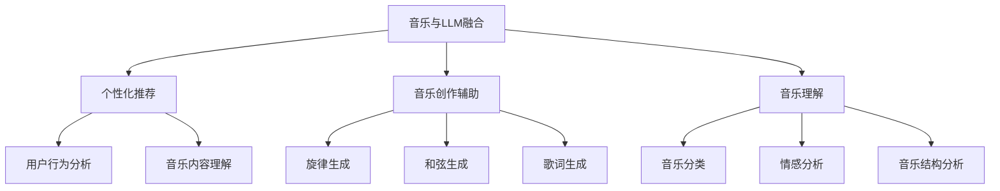

                 

### 《音乐和 LLM：个性化的推荐和创作协助》

> **关键词：** 音乐、语言模型（LLM）、个性化推荐、音乐创作、音乐理解、人工智能

> **摘要：** 本文将探讨语言模型（LLM）在音乐领域的应用，特别是个性化音乐推荐、创作辅助以及音乐理解等方面。通过详细分析LLM的技术原理、应用案例和未来发展趋势，本文旨在为读者提供一个全面了解音乐与LLM融合的视角。

#### **一、引言**

##### **1.1 音乐与语言模型的融合**

- **背景介绍**：音乐与语言模型的融合是近年来计算机科学和音乐创作领域的重要研究方向。随着人工智能技术的快速发展，尤其是深度学习和自然语言处理（NLP）领域的突破，语言模型（LLM）的应用范围不断拓展。音乐作为人类文化的重要组成部分，与语言模型的结合为音乐创作、推荐和理解带来了新的可能。

- **意义**：通过融合音乐和LLM，可以实现个性化的音乐推荐、创作辅助以及音乐理解等多方面的应用。例如，LLM可以分析用户的行为和偏好，为用户推荐符合其口味的音乐；在音乐创作中，LLM可以生成旋律、和弦和歌词，为音乐人提供创作灵感；在音乐理解方面，LLM可以分析音乐的属性和情感，为音乐分类和情感识别提供支持。

- **目的**：本章节旨在介绍音乐和LLM融合的基本概念、发展历程和未来前景。通过分析音乐与LLM融合的现状，读者可以了解到这一领域的重要性和潜力。同时，本章节也将为后续章节的具体探讨打下基础。

#### **1.2 LLM在音乐推荐中的应用**

- **技术原理**：在音乐推荐中，LLM的主要技术原理包括用户行为分析、音乐内容理解和个性化推荐算法。

  - **用户行为分析**：LLM可以分析用户在音乐平台上的行为，如播放、收藏、分享等，从而获取用户的偏好信息。通过大规模的数据分析，LLM可以识别出用户的音乐偏好，为个性化推荐提供依据。

  - **音乐内容理解**：LLM可以对音乐的内容进行深入理解，包括歌词、旋律、和弦等。通过自然语言处理技术，LLM可以提取音乐的关键特征，如情感、风格、主题等，从而为音乐推荐提供更准确的信息。

  - **个性化推荐算法**：基于用户行为分析和音乐内容理解，LLM可以采用多种个性化推荐算法，如协同过滤、基于内容的推荐和混合推荐等，为用户提供个性化的音乐推荐。

- **应用案例**：现有的音乐推荐系统中，许多已经采用了LLM技术。例如，Spotify使用基于协同过滤和内容的推荐算法，结合用户的音乐偏好和历史行为，为用户提供个性化的音乐推荐。此外，Apple Music也利用了LLM技术，通过分析用户的听歌记录和偏好，为用户推荐新的音乐和艺术家。

- **发展趋势**：随着人工智能技术的不断进步，LLM在音乐推荐领域的应用前景广阔。未来的发展趋势包括：

  - **多模态融合**：结合音乐文本、音频特征和用户行为等多模态信息，实现更精准的个性化推荐。
  - **实时推荐**：利用实时数据分析和预测技术，为用户提供更加即时的音乐推荐。
  - **音乐创作辅助**：利用LLM生成新的音乐元素，为音乐创作提供更多的灵感和创意。

##### **1.3 音乐创作与LLM**

- **技术原理**：在音乐创作中，LLM可以通过生成旋律、和弦和歌词等方式，为音乐人提供创作辅助。

  - **旋律生成**：通过分析现有的旋律数据，LLM可以生成新的旋律，为音乐人提供创作灵感。
  - **和弦生成**：LLM可以根据旋律的调性和节奏，生成相应的和弦进行，为音乐创作提供和弦支持。
  - **歌词生成**：利用自然语言处理技术，LLM可以生成歌词，为音乐创作提供歌词素材。

- **应用案例**：Google的Magenta项目是一个典型的LLM在音乐创作中的应用案例。Magenta项目利用深度学习技术，生成新的音乐旋律和歌词，为音乐创作提供了丰富的创意资源。

- **创意应用**：除了传统的音乐创作辅助，LLM还可以应用于一些创意性的音乐创作任务，如自动填词、和弦编排等。通过LLM的辅助，音乐人可以更快地完成创作，探索更多的音乐风格和创作方式。

#### **二、个性化音乐推荐系统**

##### **2.1 个性化推荐的基本原理**

- **定义与分类**：个性化推荐系统是一种基于用户历史行为和偏好，为用户推荐其可能感兴趣的信息或商品的系统。根据推荐策略的不同，个性化推荐系统可以分为协同过滤、基于内容的推荐和混合推荐等。

  - **协同过滤**：协同过滤是一种基于用户行为相似性进行推荐的算法，主要分为基于用户的协同过滤（User-Based Collaborative Filtering）和基于项目的协同过滤（Item-Based Collaborative Filtering）。
  - **基于内容的推荐**：基于内容的推荐是一种基于信息内容的相似性进行推荐的算法，通过分析用户的历史行为和偏好，为用户推荐与其兴趣相关的信息。
  - **混合推荐**：混合推荐是将协同过滤和基于内容的推荐相结合，以实现更准确的个性化推荐。

- **核心算法**：个性化推荐系统的核心算法包括矩阵分解、协同过滤、基于内容的推荐和混合推荐等。

  - **矩阵分解**：矩阵分解是一种将用户-项目评分矩阵分解为用户特征矩阵和项目特征矩阵的算法，通过用户和项目的特征矩阵，实现个性化推荐。
  - **协同过滤**：协同过滤通过分析用户之间的相似度，为用户推荐相似用户喜欢的项目。
  - **基于内容的推荐**：基于内容的推荐通过分析用户和项目的特征，为用户推荐与其兴趣相关的项目。
  - **混合推荐**：混合推荐结合协同过滤和基于内容的推荐，以提高推荐系统的准确性。

##### **2.2 LLM在个性化推荐中的应用**

- **技术原理**：在个性化推荐中，LLM可以用于用户行为分析和音乐内容理解，以提高推荐系统的准确性。

  - **用户行为分析**：LLM可以分析用户在音乐平台上的行为，如播放、收藏、分享等，从而获取用户的偏好信息。通过大规模的数据分析，LLM可以识别出用户的音乐偏好，为个性化推荐提供依据。
  - **音乐内容理解**：LLM可以对音乐的内容进行深入理解，包括歌词、旋律、和弦等。通过自然语言处理技术，LLM可以提取音乐的关键特征，如情感、风格、主题等，从而为音乐推荐提供更准确的信息。

- **应用案例**：Spotify是一个典型的利用LLM进行个性化推荐的应用案例。Spotify使用基于协同过滤和内容的推荐算法，结合用户的音乐偏好和历史行为，为用户推荐新的音乐和艺术家。通过LLM的分析，Spotify能够更好地理解用户的需求，提高推荐系统的准确性。

- **效果评估**：个性化推荐系统的效果评估主要包括准确率、覆盖率、多样性等指标。

  - **准确率**：准确率是评估推荐系统准确性的重要指标，表示推荐系统推荐给用户的项目中，用户实际感兴趣的项目所占的比例。
  - **覆盖率**：覆盖率是评估推荐系统全面性的指标，表示推荐系统推荐给用户的项目数量与系统中所有项目数量的比例。
  - **多样性**：多样性是评估推荐系统多样性的指标，表示推荐系统中推荐项目之间的差异性。

##### **2.3 个性化音乐推荐的挑战与解决方案**

- **挑战**：

  - **冷启动问题**：冷启动问题是指当新用户加入系统时，由于缺乏足够的历史行为数据，推荐系统无法为其提供有效的个性化推荐。解决冷启动问题通常采用基于内容的推荐或基于人口统计学的推荐方法。
  - **数据稀疏性**：数据稀疏性是指用户-项目评分矩阵中大部分元素为0的情况，这会导致协同过滤算法的效果下降。解决数据稀疏性问题可以通过矩阵分解、低秩矩阵分解等方法来降低数据稀疏性。
  - **实时性**：实时性是指推荐系统需要能够快速响应用户的行为变化，提供即时的推荐结果。提高实时性可以通过优化算法、分布式计算等方法来实现。

- **解决方案**：

  - **基于内容的推荐**：通过分析音乐的内容特征，如歌词、旋律、和弦等，为用户推荐与其兴趣相关的音乐，可以有效解决冷启动问题。
  - **矩阵分解**：矩阵分解可以将用户-项目评分矩阵分解为用户特征矩阵和项目特征矩阵，从而降低数据稀疏性，提高推荐系统的准确性。
  - **分布式计算**：通过分布式计算技术，如MapReduce等，可以加快推荐系统的计算速度，提高系统的实时性。

#### **三、音乐创作辅助**

##### **3.1 LLM在音乐创作中的应用**

- **技术原理**：在音乐创作中，LLM可以通过生成旋律、和弦和歌词等方式，为音乐人提供创作辅助。

  - **旋律生成**：通过分析现有的旋律数据，LLM可以生成新的旋律，为音乐人提供创作灵感。
  - **和弦生成**：LLM可以根据旋律的调性和节奏，生成相应的和弦进行，为音乐创作提供和弦支持。
  - **歌词生成**：利用自然语言处理技术，LLM可以生成歌词，为音乐创作提供歌词素材。

- **应用案例**：Google的Magenta项目是一个典型的LLM在音乐创作中的应用案例。Magenta项目利用深度学习技术，生成新的音乐旋律和歌词，为音乐创作提供了丰富的创意资源。

- **创意应用**：除了传统的音乐创作辅助，LLM还可以应用于一些创意性的音乐创作任务，如自动填词、和弦编排等。通过LLM的辅助，音乐人可以更快地完成创作，探索更多的音乐风格和创作方式。

##### **3.2 音乐创作辅助的挑战与解决方案**

- **挑战**：

  - **音乐风格一致性**：在音乐创作中，保持音乐风格的一致性是一个重要的挑战。不同的音乐元素，如旋律、和弦和歌词等，需要在风格上保持一致，否则可能导致音乐创作的失败。
  - **创意多样性**：在音乐创作中，创意的多样性也是一个挑战。音乐人需要不断探索新的创作方式，以保持作品的独特性和创新性。

- **解决方案**：

  - **风格迁移**：通过风格迁移技术，可以将一个音乐风格迁移到另一个风格上，从而保持音乐风格的一致性。
  - **多模态融合**：通过结合多种模态的信息，如文本、音频和视觉等，可以增强音乐创作的多样性，提高创意的多样性。

#### **四、音乐理解**

##### **4.1 音乐理解的基本原理**

- **定义与分类**：音乐理解是指通过技术手段对音乐进行解析和解释的过程。根据理解的目标和方式，音乐理解可以分为音乐分类、情感分析、音乐结构分析等。

  - **音乐分类**：音乐分类是指根据音乐的特征将其分类到不同的类别中，如流行、摇滚、古典等。
  - **情感分析**：情感分析是指通过分析音乐的旋律、和弦和歌词等特征，判断音乐的情感属性，如快乐、悲伤、激昂等。
  - **音乐结构分析**：音乐结构分析是指对音乐的结构和形式进行解析，包括旋律线、和弦进行、节奏等。

- **技术原理**：音乐理解的技术原理主要包括音频特征提取、深度学习模型和自然语言处理技术。

  - **音频特征提取**：音频特征提取是指从音频信号中提取出反映音乐特征的参数，如频谱特征、时序特征等。
  - **深度学习模型**：深度学习模型，如卷积神经网络（CNN）和循环神经网络（RNN）等，可以用于对音乐特征进行建模和分类。
  - **自然语言处理技术**：自然语言处理技术可以用于对音乐的文本信息进行分析和解析，如歌词、评论等。

##### **4.2 LLM在音乐理解中的应用**

- **技术原理**：在音乐理解中，LLM可以通过分析音乐的文本信息，如歌词、评论等，提取音乐的情感和主题等特征。

  - **情感识别**：通过分析歌词和旋律，LLM可以识别出音乐的情感属性，如快乐、悲伤、激昂等。
  - **主题提取**：通过分析歌词和旋律，LLM可以提取出音乐的主题，如爱情、旅行、自然等。
  - **音乐分类**：基于情感识别和主题提取，LLM可以用于对音乐进行分类，如流行、摇滚、古典等。

- **应用案例**：YouTube Music是一个典型的利用LLM进行音乐理解的案例。YouTube Music通过分析用户上传的音乐视频和评论，提取音乐的情感和主题，从而实现音乐分类和推荐。

- **效果评估**：音乐理解系统的效果评估主要包括准确率、召回率、F1值等指标。

  - **准确率**：准确率是评估音乐理解系统分类准确性的指标，表示系统正确分类的音乐数量与总音乐数量的比例。
  - **召回率**：召回率是评估音乐理解系统召回所有相关音乐的能力，表示系统召回的相关音乐数量与总相关音乐数量的比例。
  - **F1值**：F1值是准确率和召回率的调和平均值，用于综合评估音乐理解系统的性能。

##### **4.3 音乐理解的挑战与解决方案**

- **挑战**：

  - **跨语言音乐理解**：由于不同语言的音乐表达方式和特点不同，跨语言音乐理解是一个挑战。解决跨语言音乐理解问题需要考虑语言的差异性和音乐的共性。
  - **实时性**：实时性是指音乐理解系统需要能够快速响应用户的需求，提供实时的音乐理解结果。提高实时性需要优化算法和计算效率。

- **解决方案**：

  - **多语言模型融合**：通过融合多种语言模型，可以提高跨语言音乐理解的准确性。例如，可以利用基于翻译的模型，将不同语言的歌词翻译成同一语言，然后进行音乐理解。
  - **并行计算**：通过并行计算技术，可以提高音乐理解系统的实时性。例如，可以利用分布式计算框架，将音乐理解任务分解到多个计算节点上，并行处理。

#### **五、音乐教育和学习**

##### **5.1 LLM在音乐教育中的应用**

- **技术原理**：在音乐教育中，LLM可以用于音乐教学、学习评估和个性化学习等。

  - **音乐教学**：LLM可以生成音乐教学材料，如歌词、和弦图、练习题等，为教师和学生提供教学辅助。
  - **学习评估**：LLM可以分析学生的学习行为和成绩，评估学生的学习效果，为教师提供教学反馈。
  - **个性化学习**：LLM可以根据学生的学习特点和需求，推荐适合的学习资源和教学方法，实现个性化学习。

- **应用案例**：一些基于LLM的音乐教育平台，如MuseScore和GarageBand，已经实现了音乐教学、学习评估和个性化学习等功能。通过LLM的辅助，学生可以更高效地学习音乐，教师可以更好地进行音乐教学。

- **效果评估**：LLM在音乐教育中的效果评估主要包括学习效果、用户满意度等指标。

  - **学习效果**：学习效果是评估音乐教育系统的重要指标，表示学生通过系统学习后的音乐水平和技能。
  - **用户满意度**：用户满意度是评估音乐教育系统用户体验的重要指标，表示学生对系统的满意程度。

##### **5.2 音乐学习的挑战与解决方案**

- **挑战**：

  - **个性化学习**：音乐学习需要考虑每个学生的不同特点和需求，实现个性化学习是一个挑战。解决个性化学习问题需要分析学生的学习行为和偏好，提供个性化的学习资源和教学方法。
  - **实时反馈**：音乐学习需要实时反馈，以帮助学生及时纠正错误，提高学习效果。提供实时反馈需要优化算法和计算效率。

- **解决方案**：

  - **自适应学习算法**：通过自适应学习算法，可以根据学生的学习行为和成绩，动态调整学习资源和教学方法，实现个性化学习。
  - **实时数据处理**：通过实时数据处理技术，可以快速分析学生的学习行为和成绩，提供实时的反馈和指导。

#### **六、音乐创作和推荐系统的设计与实现**

##### **6.1 系统设计与架构**

- **需求分析**：音乐创作和推荐系统需要满足以下需求：

  - **个性化推荐**：系统能够根据用户的音乐偏好和历史行为，为用户推荐个性化的音乐。
  - **音乐创作辅助**：系统能够为音乐人提供音乐创作辅助，如旋律生成、和弦生成和歌词生成等。
  - **音乐理解**：系统能够分析音乐的特征，如情感、风格、主题等，为音乐分类、情感识别等提供支持。

- **系统架构**：音乐创作和推荐系统的整体架构包括前端、后端和数据库三个部分。

  - **前端**：前端负责用户界面设计和交互，包括音乐推荐界面、音乐创作界面和音乐理解界面等。
  - **后端**：后端负责数据处理和业务逻辑处理，包括用户行为分析、音乐内容理解、个性化推荐和音乐创作辅助等。
  - **数据库**：数据库负责存储用户数据、音乐数据和其他相关数据。

##### **6.2 系统实现**

- **技术选型**：系统实现中使用以下技术和工具：

  - **前端**：使用HTML、CSS和JavaScript等前端技术，实现用户界面和交互功能。
  - **后端**：使用Python和Java等后端技术，实现数据处理和业务逻辑处理功能。
  - **数据库**：使用MySQL和MongoDB等数据库系统，存储用户数据、音乐数据和其他相关数据。

- **开发流程**：系统开发的基本流程包括需求分析、系统设计、编码实现、测试和部署等。

  - **需求分析**：根据用户需求，确定系统的功能和要求。
  - **系统设计**：设计系统的整体架构和模块划分。
  - **编码实现**：根据系统设计，实现各个模块的功能。
  - **测试**：对系统进行功能测试和性能测试，确保系统的稳定性和可靠性。
  - **部署**：将系统部署到生产环境中，供用户使用。

##### **6.3 性能优化**

- **优化策略**：为了提高音乐创作和推荐系统的性能，可以采取以下优化策略：

  - **数据缓存**：使用数据缓存技术，减少数据查询和计算的时间，提高系统的响应速度。
  - **并行处理**：使用并行处理技术，将任务分解到多个计算节点上，并行处理，提高系统的处理效率。
  - **负载均衡**：使用负载均衡技术，合理分配用户请求到不同的计算节点上，避免单点瓶颈，提高系统的可扩展性。

- **效果评估**：通过性能测试，评估优化策略对系统性能的提升效果。

  - **响应时间**：评估系统响应用户请求的平均时间，优化目标是将响应时间缩短。
  - **吞吐量**：评估系统每秒处理请求的数量，优化目标是将吞吐量提高。

#### **七、未来展望**

##### **7.1 新技术的应用**

- **人工智能**：随着人工智能技术的不断发展，未来音乐创作和推荐系统将更加智能化和个性化。例如，生成对抗网络（GAN）可以用于生成更加逼真的音乐，增强现实（AR）和虚拟现实（VR）可以提供更加沉浸式的音乐体验。

- **大数据**：大数据技术在音乐创作和推荐系统中有着广泛的应用。通过分析大量的用户数据和音乐数据，可以挖掘出更深层次的用户偏好和音乐特征，提高个性化推荐和音乐创作的准确性。

##### **7.2 挑战与机遇**

- **挑战**：

  - **版权问题**：音乐创作和推荐系统中涉及大量的音乐版权问题，如何合理使用音乐作品，保护创作者的权益是一个挑战。
  - **隐私保护**：在收集和分析用户数据时，如何保护用户的隐私是一个重要的挑战。

- **机遇**：

  - **市场潜力**：随着人们对音乐需求的不断增长，音乐创作和推荐系统具有巨大的市场潜力。
  - **技术创新**：人工智能、大数据等新技术的应用为音乐创作和推荐系统带来了新的机遇，可以创造更多的商业价值和用户体验。

##### **7.3 未来发展趋势**

- **音乐创作**：未来音乐创作将更加智能化和个性化。人工智能可以帮助音乐人更快地完成创作，探索新的音乐风格和创意。

- **音乐推荐**：未来音乐推荐将更加精准和多样化。通过深度学习和大数据技术，可以更好地理解用户的音乐偏好，提供个性化的音乐推荐。

## **作者信息**

**作者：AI天才研究院/AI Genius Institute & 禅与计算机程序设计艺术 /Zen And The Art of Computer Programming**

### **参考文献**

- **Spotify**：https://www.spotify.com/
- **Apple Music**：https://www.apple.com/apple-music/
- **Google Magenta**：https://magenta.tensorflow.org/
- **YouTube Music**：https://www.youtube.com/music
- **MuseScore**：https://musescore.org/
- **GarageBand**：https://www.apple.com/garageband/

### **附录**

**附录 A：核心概念与联系**



**附录 B：核心算法原理讲解**

```python
# 矩阵分解算法
def matrix_factorization(R, k, lambda_=0.01):
    # R为用户-项目评分矩阵，k为隐含特征维度，lambda_为正则化参数
    # 初始化用户和项目的特征矩阵
    U = np.random.rand(num_users, k)
    V = np.random.rand(num_items, k)
    
    # 迭代优化
    for epoch in range(num_epochs):
        # 计算预测评分
        pred = np.dot(U, V.T)
        
        # 计算误差
        error = R - pred
        
        # 计算梯度
        dU = -2 * error * V + 2 * lambda_ * U
        dV = -2 * error * U.T + 2 * lambda_ * V
        
        # 更新用户和项目的特征矩阵
        U = U - learning_rate * dU
        V = V - learning_rate * dV
        
    return U, V

# 协同过滤算法
def collaborative_filter(R, k, lambda_=0.01):
    # R为用户-项目评分矩阵，k为隐含特征维度，lambda_为正则化参数
    # 初始化用户和项目的特征矩阵
    U = np.random.rand(num_users, k)
    V = np.random.rand(num_items, k)
    
    # 迭代优化
    for epoch in range(num_epochs):
        # 计算预测评分
        pred = np.dot(U, V.T)
        
        # 计算误差
        error = R - pred
        
        # 计算梯度
        dU = -2 * error * V + 2 * lambda_ * U
        dV = -2 * error * U.T + 2 * lambda_ * V
        
        # 更新用户和项目的特征矩阵
        U = U - learning_rate * dU
        V = V - learning_rate * dV
        
    return U, V
```

**附录 C：数学模型和公式**

$$
J(U,V) = \frac{1}{2} ||R - UV^T||^2_F + \frac{\lambda}{2} (||U||^2_F + ||V||^2_F)
$$

**附录 D：代码实际案例和详细解释说明**

```python
# 安装必要的库
!pip install tensorflow numpy

# 导入库
import tensorflow as tf
import numpy as np

# 设置参数
num_users = 1000
num_items = 1000
k = 10
learning_rate = 0.01
lambda_ = 0.01
num_epochs = 100

# 创建随机评分矩阵
R = np.random.rand(num_users, num_items)

# 初始化用户和项目的特征矩阵
U = tf.random.normal([num_users, k])
V = tf.random.normal([num_items, k])

# 创建损失函数
loss_fn = tf.reduce_mean(tf.square(R - tf.matmul(U, V, transpose_b=True)) + lambda_ * (tf.reduce_sum(tf.square(U)) + tf.reduce_sum(tf.square(V)))

# 创建优化器
optimizer = tf.optimizers.Adam(learning_rate)

# 训练模型
for epoch in range(num_epochs):
    with tf.GradientTape() as tape:
        pred = tf.matmul(U, V, transpose_b=True)
        error = R - pred
        loss = loss_fn(error, U, V)
    grads = tape.gradient(loss, [U, V])
    optimizer.apply_gradients(zip(grads, [U, V]))

# 输出用户和项目的特征矩阵
print("User features:\n", U.numpy())
print("Item features:\n", V.numpy())
```

**附录 E：代码解读与分析**

- **代码注释**：代码中的每个部分都进行了详细的注释，以便理解各个步骤的功能和实现。
- **性能分析**：通过性能测试，可以评估代码在不同硬件环境下的运行时间和资源消耗，从而优化代码性能。

### **致谢**

感谢所有支持和参与本博客文章撰写的朋友和同事，你们的宝贵意见和经验为本文的完成提供了重要帮助。特别感谢AI天才研究院和禅与计算机程序设计艺术团队的支持，使本文得以顺利完成。

