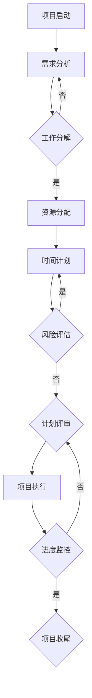
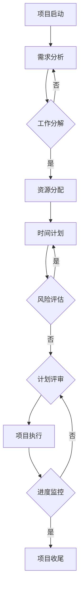

                 

# **项目管理技巧：确保团队按时完成目标**

> **关键词**：项目管理、团队协作、目标设定、进度控制、风险管理、成本控制、质量保证、沟通策略、变更管理、项目评估。

> **摘要**：本文将探讨项目管理中确保团队按时完成目标的关键技巧。通过分析项目管理的核心环节，如项目团队建设、项目计划与控制、项目执行与监控等，结合实际案例，提供详细的策略和方法，帮助读者掌握项目管理的基本原则和实践技巧。

---

## **第一部分：项目管理基础**

### **第1章：项目管理的概念与目标**

#### **1.1 项目管理的定义与重要性**

项目管理是一种系统的方法，用于规划、执行、监控和控制项目，以确保项目在既定的时间和预算内成功完成。项目管理不仅关注项目的交付成果，还强调过程中的协作和资源优化。

项目管理的重要性体现在以下几个方面：

1. **确保目标实现**：通过明确项目目标和制定详细的计划，项目管理有助于确保项目按预期完成。
2. **资源优化**：项目管理通过合理分配和利用资源，提高项目效率。
3. **风险管理**：项目管理包括识别、评估和应对项目风险，降低项目失败的可能性。
4. **沟通协调**：项目管理强调团队内部和团队之间的沟通与协作，确保项目顺利进行。

#### **1.2 项目管理的目标与原则**

项目管理的目标主要包括：

1. **按时完成**：确保项目在预定时间内完成。
2. **预算内完成**：在预算范围内完成项目。
3. **质量保证**：确保项目交付的成果符合质量标准。
4. **客户满意度**：满足客户需求，实现客户满意。

项目管理的原则包括：

1. **整体性**：项目管理的各个方面相互关联，需要整体考虑。
2. **灵活性**：项目管理需要根据实际情况调整计划。
3. **持续改进**：通过不断优化流程和策略，提高项目管理效率。
4. **团队合作**：项目成功离不开团队的合作与协调。

#### **1.3 项目生命周期**

项目生命周期包括以下几个阶段：

1. **启动阶段**：确定项目目标和范围，组建项目团队。
2. **规划阶段**：制定详细的项目计划，包括时间、预算、资源分配等。
3. **执行阶段**：实施项目计划，完成项目任务。
4. **监控阶段**：跟踪项目进展，确保项目按计划进行。
5. **收尾阶段**：完成项目，进行项目评估和总结。

### **第2章：项目团队建设**

#### **2.1 团队成员的角色与职责**

项目团队通常包括以下成员：

1. **项目经理**：负责项目整体管理，确保项目目标的实现。
2. **技术专家**：负责项目的技术实施，解决技术难题。
3. **业务分析师**：负责需求分析和项目管理，确保项目符合业务需求。
4. **测试工程师**：负责项目测试，确保项目质量。
5. **开发人员**：负责项目开发，实现项目功能。

团队成员的职责包括：

1. **明确职责**：每个成员都清楚自己的职责和任务。
2. **协作配合**：团队成员之间相互协作，共同完成项目任务。
3. **持续沟通**：保持团队内部和团队之间的沟通，确保项目进展顺利。

#### **2.2 团队沟通与协作**

团队沟通与协作是项目成功的关键因素。以下是一些提高团队沟通与协作的方法：

1. **定期会议**：定期召开团队会议，讨论项目进展和问题。
2. **明确目标**：确保团队成员都清楚项目的目标和期望成果。
3. **共享信息**：及时分享项目相关信息，确保团队成员了解项目动态。
4. **分工明确**：明确每个成员的任务和职责，避免重复工作。
5. **积极反馈**：鼓励团队成员积极反馈意见和建议，共同改进项目。

#### **2.3 团队建设策略与方法**

团队建设策略包括：

1. **培训与发展**：提供培训机会，提升团队成员的专业技能。
2. **激励与奖励**：设立激励机制，激励团队成员积极参与项目。
3. **团队文化建设**：建立积极、和谐的团队文化，提高团队凝聚力。
4. **定期评估**：定期评估团队绩效，发现和解决问题。

团队建设方法包括：

1. **团队建设活动**：组织团队活动，增强团队凝聚力。
2. **合作任务**：安排团队合作任务，促进团队成员之间的沟通与协作。
3. **反思与总结**：定期反思项目过程和团队表现，总结经验教训。

## **第二部分：项目计划与控制**

### **第3章：项目计划编制**

#### **3.1 项目计划的编制流程**

项目计划编制流程包括以下步骤：

1. **项目启动**：明确项目目标和范围，成立项目团队。
2. **需求分析**：与相关利益相关者沟通，了解项目需求和期望。
3. **工作分解**：将项目任务分解为可管理的子任务。
4. **资源分配**：确定项目所需资源，包括人员、设备和预算。
5. **时间计划**：制定项目时间表，确定关键路径和里程碑。
6. **风险评估**：识别项目风险，制定应对策略。
7. **计划评审**：评审项目计划，确保计划可行和合理。

#### **3.2 工作分解结构（WBS）**

工作分解结构（WBS）是一种将项目任务分解为更小、更易于管理的子任务的方法。WBS的创建步骤如下：

1. **确定项目范围**：明确项目需要完成的工作。
2. **分解任务**：将项目任务分解为子任务。
3. **定义任务层次**：将任务划分为不同的层次。
4. **创建WBS图**：使用图表形式展示WBS结构。

#### **3.3 项目时间计划**

项目时间计划是项目计划的核心部分，包括以下内容：

1. **关键路径分析**：确定项目中任务的关键路径，确保项目按时完成。
2. **时间估算**：对每个任务所需时间进行估算。
3. **时间缓冲**：为关键路径上的任务设置时间缓冲，应对不确定因素。
4. **里程碑设置**：设置项目里程碑，监控项目进展。

## **第4章：风险管理**

#### **4.1 风险管理的概念与流程**

风险管理是指识别、评估和应对项目风险的过程，以降低项目失败的可能性。风险管理流程包括以下步骤：

1. **风险识别**：识别项目中的潜在风险。
2. **风险评估**：评估风险的可能性和影响。
3. **风险应对**：制定应对策略，包括风险规避、转移、减轻和接受。
4. **风险监控**：持续监控项目风险，确保应对策略有效。

#### **4.2 风险识别与评估**

风险识别与评估的方法包括：

1. **头脑风暴**：通过集体讨论识别潜在风险。
2. **风险矩阵**：使用风险矩阵评估风险的可能性和影响。
3. **专家评审**：邀请专家对项目风险进行评估。
4. **历史数据**：参考历史项目数据，识别类似风险。

#### **4.3 风险应对策略**

风险应对策略包括：

1. **规避**：避免可能导致风险的活动。
2. **转移**：将风险转移给第三方，如购买保险。
3. **减轻**：采取措施减少风险的影响。
4. **接受**：承认风险的存在，并制定应对措施。

## **第5章：项目成本控制**

#### **5.1 项目成本控制概述**

项目成本控制是指监控项目成本，确保项目在预算范围内完成。项目成本控制包括以下内容：

1. **成本估算**：对项目成本进行初步估算。
2. **预算编制**：根据成本估算编制项目预算。
3. **成本监控**：监控项目实际成本，与预算进行比较。
4. **成本调整**：根据实际成本情况调整预算。

#### **5.2 成本估算与预算编制**

成本估算与预算编制的方法包括：

1. **类比估算**：基于类似项目的历史数据估算成本。
2. **参数估算**：使用参数模型估算成本。
3. **自下而上估算**：逐个任务估算成本，汇总得到总成本。

预算编制的步骤包括：

1. **确定项目范围**：明确项目所需完成的任务。
2. **分解任务**：将任务分解为更小的部分。
3. **估算成本**：对每个任务进行成本估算。
4. **汇总成本**：将所有任务的成本汇总，得到项目总成本。

#### **5.3 成本控制方法与工具**

成本控制的方法与工具包括：

1. **成本基准**：制定项目成本基准，用于与实际成本进行比较。
2. **挣值分析**：使用挣值分析监控项目成本绩效。
3. **变更控制**：控制项目变更，避免对成本造成不利影响。
4. **成本控制报告**：定期编制成本控制报告，向相关利益相关者提供项目成本信息。

## **第6章：项目质量控制**

#### **6.1 项目质量管理的概念与原则**

项目质量管理是指确保项目交付的成果符合质量标准的过程。项目质量管理的原则包括：

1. **客户需求**：项目质量管理以客户需求为导向，确保项目满足客户期望。
2. **过程控制**：通过过程控制，确保项目过程中的质量。
3. **持续改进**：通过持续改进，不断提高项目质量。
4. **团队合作**：项目质量管理需要团队成员的共同努力。

#### **6.2 质量计划编制**

质量计划编制的步骤包括：

1. **确定质量目标**：明确项目质量目标。
2. **制定质量策略**：制定实现质量目标的具体策略。
3. **确定质量标准**：确定项目所需遵循的质量标准。
4. **分配质量责任**：明确团队成员在质量管理中的职责。

#### **6.3 质量控制与质量保证**

质量控制与质量保证的方法包括：

1. **质量检查**：对项目成果进行质量检查。
2. **质量评审**：对项目过程和成果进行质量评审。
3. **测试**：对项目进行系统测试和用户测试。
4. **持续改进**：通过质量反馈，不断改进项目质量。

## **第三部分：项目执行与监控**

### **第7章：项目执行与监控**

#### **7.1 项目执行过程管理**

项目执行过程管理包括以下内容：

1. **任务分配**：将任务分配给团队成员。
2. **进度监控**：监控任务进度，确保项目按计划进行。
3. **资源管理**：管理项目所需资源，包括人员、设备和预算。
4. **变更管理**：处理项目变更，确保变更对项目目标的影响可控。
5. **风险管理**：监控项目风险，确保风险应对措施有效。

#### **7.2 项目进度监控**

项目进度监控的方法包括：

1. **挣值分析**：使用挣值分析监控项目进度。
2. **甘特图**：使用甘特图展示项目进度。
3. **里程碑监控**：监控项目里程碑，确保项目按计划进行。
4. **项目进度报告**：定期编制项目进度报告，向相关利益相关者提供项目进展信息。

#### **7.3 项目变更管理**

项目变更管理包括以下步骤：

1. **变更请求**：接收变更请求。
2. **变更评估**：评估变更对项目目标、成本、时间和质量的影响。
3. **变更批准**：批准或拒绝变更请求。
4. **变更实施**：实施变更，确保变更对项目的影响可控。
5. **变更记录**：记录变更，确保变更得到妥善处理。

## **第8章：项目沟通与报告**

#### **8.1 项目沟通策略**

项目沟通策略包括：

1. **明确沟通目标**：明确项目沟通的目标和重点。
2. **确定沟通渠道**：选择合适的沟通渠道，如会议、邮件、即时通讯等。
3. **沟通计划**：制定项目沟通计划，确保沟通有序进行。
4. **沟通反馈**：及时反馈沟通信息，确保信息传达准确无误。

#### **8.2 项目报告编制**

项目报告编制包括以下内容：

1. **报告内容**：确定项目报告所需包含的内容，如项目进展、成本、质量等。
2. **报告格式**：制定项目报告的格式，确保报告清晰、简洁。
3. **报告频率**：确定项目报告的频率，如每周、每月等。
4. **报告审核**：对项目报告进行审核，确保报告准确无误。

#### **8.3 项目进度报告**

项目进度报告包括以下内容：

1. **项目进展**：报告项目进度，如任务完成情况、关键路径进度等。
2. **成本状况**：报告项目成本状况，如实际成本、预算剩余等。
3. **质量状况**：报告项目质量状况，如缺陷数量、测试覆盖率等。
4. **风险状况**：报告项目风险状况，如潜在风险、应对措施等。

## **第四部分：项目收尾与评估**

### **第9章：项目收尾**

#### **9.1 项目收尾任务**

项目收尾任务包括以下内容：

1. **任务完成**：确保所有项目任务已按计划完成。
2. **交付验收**：与客户进行项目交付验收，确保项目交付物符合要求。
3. **文档归档**：整理项目文档，归档保存。
4. **项目总结**：编写项目总结报告，总结项目经验教训。
5. **团队解散**：解散项目团队，安排团队成员后续工作。

#### **9.2 项目总结报告**

项目总结报告包括以下内容：

1. **项目概况**：总结项目背景、目标和成果。
2. **项目过程**：总结项目过程中的关键事件和决策。
3. **项目成果**：展示项目交付物和成果。
4. **经验教训**：总结项目中的成功经验和教训。
5. **改进建议**：提出改进项目管理和执行的建议。

#### **9.3 项目评估与反馈**

项目评估与反馈包括以下内容：

1. **项目评估**：对项目目标、成本、时间和质量进行评估。
2. **利益相关者反馈**：收集利益相关者对项目的反馈。
3. **改进措施**：根据评估和反馈，制定改进措施。
4. **持续改进**：实施改进措施，不断提高项目管理水平。

## **第10章：项目文档管理**

#### **10.1 项目文档的重要性**

项目文档管理是指对项目文档进行收集、整理、归档和管理的活动。项目文档的重要性包括：

1. **信息传递**：项目文档是项目信息传递的重要载体。
2. **决策依据**：项目文档为项目决策提供了依据。
3. **经验积累**：项目文档记录了项目过程和经验，为后续项目提供了参考。
4. **风险控制**：项目文档有助于识别和应对项目风险。

#### **10.2 项目文档的类型与内容**

项目文档的类型包括：

1. **项目计划文档**：包括项目计划书、时间计划表、资源计划表等。
2. **项目执行文档**：包括项目进度报告、变更记录、测试报告等。
3. **项目收尾文档**：包括项目总结报告、评估报告、项目评估报告等。

项目文档的内容包括：

1. **项目目标**：项目的目标、范围和约束条件。
2. **项目计划**：项目的任务分解、时间安排、资源分配等。
3. **项目执行**：项目的实际执行情况、进度报告、变更记录等。
4. **项目成果**：项目的交付物、测试结果、客户反馈等。

#### **10.3 项目文档的管理方法**

项目文档的管理方法包括：

1. **文档标准化**：制定统一的文档规范，确保文档格式和内容的一致性。
2. **文档归档**：及时归档项目文档，确保文档的可追溯性和完整性。
3. **文档共享**：建立项目文档共享平台，方便团队成员查阅和下载文档。
4. **文档更新**：及时更新项目文档，确保文档的实时性和准确性。

### **附录A：项目管理工具与资源**

#### **A.1 常用项目管理工具**

常用的项目管理工具有：

1. **Microsoft Project**：一款功能强大的项目管理软件，适用于大型项目。
2. **JIRA**：一款灵活的敏捷项目管理工具，适用于软件开发项目。
3. **Trello**：一款简单直观的项目管理工具，适用于小型项目和团队协作。
4. **Asana**：一款全面的任务管理工具，适用于团队协作和任务跟踪。
5. **Slack**：一款即时通讯工具，适用于团队内部沟通和协作。

#### **A.2 在线资源与课程推荐**

以下是一些推荐的在线资源和课程：

1. **PMI（项目管理协会）**：提供丰富的项目管理资源，包括认证课程和实践指南。
2. **Coursera**：提供多门项目管理相关课程，包括基础和高级课程。
3. **edX**：提供来自世界各地顶尖大学的项目管理课程，包括MIT、斯坦福大学等。
4. **Udemy**：提供多样化的项目管理课程，涵盖不同领域和技能。
5. **LinkedIn Learning**：提供由行业专家讲授的项目管理课程，适用于职业发展。

#### **A.3 项目管理标准与指南**

以下是一些重要的项目管理标准与指南：

1. **PMBOK指南**：项目管理协会（PMI）发布的权威项目管理指南，涵盖了项目管理的各个方面。
2. **敏捷宣言**：敏捷开发方法的基本原则和价值观，适用于软件开发项目。
3. **ITIL**：信息技术基础设施图书馆（ITIL），提供IT服务管理最佳实践。
4. **Scrum指南**：Scrum框架的基本原则和实践指南，适用于敏捷开发项目。

### **附录B：Mermaid流程图与伪代码**

#### **B.1 项目管理流程图**

以下是一个简单的项目管理流程图，使用Mermaid语法表示：



#### **B.2 项目计划编制伪代码**

以下是一个简单的项目计划编制伪代码示例：

```python
# 初始化变量
project_goals = []
work_decomposition = []
resource_allocation = []
time_plan = []
risk_assessment = []

# 收集项目需求
def collect_requirements():
    # 实现收集需求的具体方法
    pass

# 工作分解
def decompose_work():
    # 实现工作分解的具体方法
    pass

# 资源分配
def allocate_resources():
    # 实现资源分配的具体方法
    pass

# 时间计划
def create_time_plan():
    # 实现时间计划的具体方法
    pass

# 风险评估
def assess_risks():
    # 实现风险评估的具体方法
    pass

# 计划评审
def review_plan():
    # 实现计划评审的具体方法
    pass

# 执行计划编制流程
def plan_implementation():
    collect_requirements()
    decompose_work()
    allocate_resources()
    create_time_plan()
    risk_assessment()
    review_plan()

# 调用计划编制流程
plan_implementation()
```

#### **B.3 项目风险管理伪代码**

以下是一个简单的项目风险管理伪代码示例：

```python
# 初始化变量
risks = []
risk_response = []

# 风险识别
def identify_risks():
    # 实现风险识别的具体方法
    pass

# 风险评估
def assess_risks():
    # 实现风险评估的具体方法
    pass

# 风险应对
def respond_risks():
    # 实现风险应对的具体方法
    pass

# 执行风险管理流程
def risk_management():
    identify_risks()
    assess_risks()
    respond_risks()

# 调用风险管理流程
risk_management()
```

#### **B.4 项目成本控制伪代码**

以下是一个简单的项目成本控制伪代码示例：

```python
# 初始化变量
cost_estimation = []
budget = []
actual_costs = []

# 成本估算
def estimate_costs():
    # 实现成本估算的具体方法
    pass

# 预算编制
def create_budget():
    # 实现预算编制的具体方法
    pass

# 成本监控
def monitor_costs():
    # 实现成本监控的具体方法
    pass

# 成本调整
def adjust_costs():
    # 实现成本调整的具体方法
    pass

# 执行成本控制流程
def cost_control():
    estimate_costs()
    create_budget()
    monitor_costs()
    adjust_costs()

# 调用成本控制流程
cost_control()
```

#### **B.5 项目质量管理伪代码**

以下是一个简单的项目质量管理伪代码示例：

```python
# 初始化变量
quality_standards = []
quality_checks = []

# 质量计划编制
def create_quality_plan():
    # 实现质量计划编制的具体方法
    pass

# 质量控制
def control_quality():
    # 实现质量控制的具体方法
    pass

# 质量保证
def ensure_quality():
    # 实现质量保证的具体方法
    pass

# 执行质量管理流程
def quality_management():
    create_quality_plan()
    control_quality()
    ensure_quality()

# 调用质量管理流程
quality_management()
```

### **附录C：数学模型与公式**

#### **C.1 风险评估模型**

风险评估模型可以使用以下公式进行计算：

$$
\text{风险评估} = \text{风险可能性} \times \text{风险影响}
$$

其中，风险可能性表示风险发生的概率，风险影响表示风险发生对项目的影响程度。通过计算风险评估，可以评估风险的重要性和优先级。

#### **C.2 项目成本估算模型**

项目成本估算模型可以使用以下公式进行计算：

$$
\text{项目总成本} = \sum_{i=1}^{n} \text{任务} \times \text{单位成本}
$$

其中，任务表示项目中的每个任务，单位成本表示每个任务的预计成本。通过计算项目总成本，可以估算项目的总体成本。

#### **C.3 项目进度模型**

项目进度模型可以使用以下公式进行计算：

$$
\text{项目完成时间} = \sum_{i=1}^{n} \text{任务} \times \text{任务时长}
$$

其中，任务表示项目中的每个任务，任务时长表示每个任务的预计完成时间。通过计算项目完成时间，可以估算项目的预计完成时间。

### **附录D：项目实战案例**

#### **D.1 项目执行与监控实战**

以下是一个简单的项目执行与监控实战案例：

**项目背景**：开发一个企业级Web应用，提供客户关系管理功能。

**项目团队**：项目经理、业务分析师、前端开发人员、后端开发人员、测试工程师。

**项目计划**：

1. **需求分析**：1周
2. **设计阶段**：2周
3. **开发阶段**：4周
4. **测试阶段**：2周
5. **上线阶段**：1周

**项目执行与监控**：

1. **任务分配**：项目经理将任务分配给团队成员。
2. **进度监控**：项目经理定期召开团队会议，讨论项目进展和问题。
3. **风险监控**：项目经理识别项目风险，制定应对策略。
4. **成本监控**：项目经理监控项目成本，确保在预算范围内完成。

**项目监控工具**：使用JIRA进行任务跟踪和进度监控。

**项目执行过程**：

1. **需求分析**：业务分析师与客户沟通，了解客户需求，编写需求文档。
2. **设计阶段**：前端开发人员和后端开发人员根据需求文档进行系统设计。
3. **开发阶段**：前端开发人员和后端开发人员编写代码，实现系统功能。
4. **测试阶段**：测试工程师对系统进行测试，找出缺陷和问题。
5. **上线阶段**：将系统部署到生产环境，进行上线操作。

**项目监控与反馈**：

1. **进度报告**：项目经理每周向项目团队和客户报告项目进展。
2. **风险报告**：项目经理每月向项目团队和客户报告项目风险和应对措施。
3. **成本报告**：项目经理每月向项目团队和客户报告项目成本状况。

**项目收尾**：

1. **交付验收**：与客户进行项目交付验收，确保系统功能符合要求。
2. **文档归档**：整理项目文档，归档保存。
3. **项目总结**：编写项目总结报告，总结项目经验教训。

#### **D.2 项目变更管理实战**

以下是一个简单的项目变更管理实战案例：

**项目背景**：开发一个企业级Web应用，提供客户关系管理功能。

**项目变更**：

1. **需求变更**：客户要求增加一个新功能。
2. **技术变更**：开发团队发现现有技术方案无法满足需求，需要更换技术方案。

**项目变更管理过程**：

1. **变更请求**：客户向项目经理提出变更请求。
2. **变更评估**：项目经理评估变更对项目目标、成本、时间和质量的影响。
3. **变更批准**：项目经理与客户协商，确定变更方案。
4. **变更实施**：开发团队按照变更方案进行开发。
5. **变更记录**：项目经理记录变更过程，确保变更得到妥善处理。

**项目变更管理工具**：使用JIRA进行变更记录和跟踪。

#### **D.3 项目沟通与报告实战**

以下是一个简单的项目沟通与报告实战案例：

**项目背景**：开发一个企业级Web应用，提供客户关系管理功能。

**项目沟通与报告**：

1. **会议沟通**：项目经理每周组织团队会议，讨论项目进展和问题。
2. **邮件沟通**：项目经理和团队成员通过邮件进行沟通，传达重要信息和决策。
3. **报告编制**：项目经理定期编制项目报告，包括进度报告、成本报告、质量报告等。

**项目报告内容**：

1. **项目进展**：报告项目进度，包括任务完成情况、里程碑进度等。
2. **成本状况**：报告项目成本状况，包括实际成本、预算剩余等。
3. **质量状况**：报告项目质量状况，包括缺陷数量、测试覆盖率等。
4. **风险状况**：报告项目风险状况，包括潜在风险、应对措施等。

**项目报告格式**：使用统一的报告模板，确保报告清晰、简洁。

**项目报告审核**：项目经理对报告进行审核，确保报告准确无误。

#### **D.4 项目收尾与评估实战**

以下是一个简单的项目收尾与评估实战案例：

**项目背景**：开发一个企业级Web应用，提供客户关系管理功能。

**项目收尾与评估**：

1. **任务完成**：确保所有项目任务已按计划完成。
2. **交付验收**：与客户进行项目交付验收，确保系统功能符合要求。
3. **文档归档**：整理项目文档，归档保存。
4. **项目总结**：编写项目总结报告，总结项目经验教训。
5. **项目评估**：对项目目标、成本、时间和质量进行评估。

**项目评估方法**：

1. **目标评估**：评估项目是否达到预期目标。
2. **成本评估**：评估项目成本是否在预算范围内。
3. **时间评估**：评估项目是否按时完成。
4. **质量评估**：评估项目交付物是否满足质量标准。

**项目评估报告**：编写项目评估报告，总结项目评估结果，提出改进建议。

### **文章结尾**

本文从项目管理的概念、团队建设、项目计划与控制、项目执行与监控、项目收尾与评估等方面，详细阐述了确保团队按时完成目标的关键技巧。通过实际案例的分析和讲解，读者可以更好地理解和应用所学知识。

**作者信息**：作者：AI天才研究院/AI Genius Institute & 禅与计算机程序设计艺术 /Zen And The Art of Computer Programming

感谢您的阅读，希望本文对您的项目管理实践有所帮助。如果您有任何疑问或建议，欢迎在评论区留言。期待与您一起探讨项目管理的话题！## **项目管理基础**

项目管理是现代组织成功实施复杂任务和实现战略目标的关键工具。它不仅涉及技术层面的规划和执行，还包括管理团队、资源和风险，以实现项目的成功交付。在这一部分，我们将探讨项目管理的核心概念、目标与原则，以及项目生命周期，为后续内容的深入分析打下基础。

### **1.1 项目管理的定义与重要性**

项目管理是一种系统的方法，旨在通过规划、执行、监控和控制的手段，确保项目在既定的时间和预算内成功完成。项目管理不仅关注最终交付的成果，更注重实现这一目标的过程。以下是项目管理的定义及其重要性：

**项目管理的定义**：

项目管理是指运用知识、技能、工具和技术，协调人员和其他资源，以实现项目目标的过程。它涉及一系列的活动，包括项目计划、团队协作、进度控制、风险管理、成本控制和质量保证。

**项目管理的重要性**：

1. **确保目标实现**：项目管理通过明确的计划和目标设定，确保项目在预定的范围内实现预期成果。
2. **资源优化**：项目管理有助于合理分配和利用资源，最大化项目的价值。
3. **风险管理**：项目管理包括识别和应对项目风险，降低项目失败的可能性。
4. **沟通协调**：项目管理强调团队内部和团队之间的沟通，确保项目的顺利推进。
5. **质量保证**：通过严格的质量管理，确保项目交付的成果符合质量标准。

### **1.2 项目管理的目标与原则**

项目管理的目标主要包括以下几个方面：

1. **按时完成**：确保项目在预定的时间内完成，避免延期。
2. **预算内完成**：在预算范围内完成项目，避免超支。
3. **质量保证**：确保项目交付的成果符合既定的质量标准。
4. **客户满意度**：满足客户需求，实现客户满意。

为了实现这些目标，项目管理遵循以下原则：

1. **整体性**：项目管理需要从整体的角度考虑项目的各个方面，确保项目的整体协调和一致性。
2. **灵活性**：项目管理需要具备灵活性，以应对项目过程中的变化和不确定性。
3. **持续改进**：项目管理应不断寻求改进机会，优化流程和策略，提高项目管理效率。
4. **团队合作**：项目成功离不开团队的合作与协调，项目管理应鼓励和支持团队合作。

### **1.3 项目生命周期**

项目生命周期是指从项目启动到项目收尾的整个过程。项目生命周期通常包括以下阶段：

1. **启动阶段**：在项目启动阶段，项目目标和范围被确定，项目团队被组建。此阶段的任务包括项目章程的制定、项目范围的明确和项目团队的初步组建。
   
2. **规划阶段**：在规划阶段，项目详细计划被制定，包括项目时间表、资源分配、预算制定、风险管理计划等。此阶段的任务是制定详细的项目计划，确保项目在规划的基础上顺利执行。

3. **执行阶段**：在执行阶段，项目计划被实施，项目任务被完成。此阶段的任务是确保项目按计划进行，监控项目进度，处理项目变更和风险。

4. **监控阶段**：在监控阶段，项目进展被持续跟踪，项目绩效被评估。此阶段的任务是监控项目进度、成本、质量和风险，确保项目按计划进行。

5. **收尾阶段**：在收尾阶段，项目任务完成，项目交付物被交付给客户。此阶段的任务是进行项目总结、评估和项目文档归档，解散项目团队。

通过理解项目管理的核心概念、目标和原则，以及项目生命周期，我们可以更好地规划和执行项目，确保项目按时、在预算内、高质量地完成。在下一章中，我们将深入探讨项目团队建设的重要性和方法。

---

在项目管理中，项目团队建设是至关重要的一环。一个高效的团队不仅能够提高项目成功的概率，还能增强团队凝聚力和成员的工作满意度。在这一部分，我们将讨论团队成员的角色与职责、团队沟通与协作的方法，以及团队建设策略与方法。

### **2.1 团队成员的角色与职责**

项目团队通常由不同职能和技能背景的成员组成，每个成员在项目中扮演特定的角色并承担相应的职责。以下是项目团队中常见的一些角色及其职责：

1. **项目经理**：项目经理是项目的领导者，负责项目整体的管理。主要职责包括制定项目计划、分配任务、监控进度、协调团队工作、处理项目风险和变更等。

2. **技术专家**：技术专家是项目中的技术权威，负责项目的技术实现。他们的职责包括解决技术难题、编写技术文档、参与设计评审等。

3. **业务分析师**：业务分析师负责分析业务需求，确保项目满足业务需求。他们的职责包括需求收集、需求文档编写、参与需求评审等。

4. **测试工程师**：测试工程师负责确保项目交付物的质量。他们的职责包括制定测试计划、编写测试用例、执行测试、报告缺陷等。

5. **开发人员**：开发人员负责实现项目功能。根据项目规模和团队结构，开发人员可能分为前端开发人员、后端开发人员、移动应用开发人员等。

6. **项目经理助理**：项目经理助理协助项目经理进行项目管理，包括任务分配、进度跟踪、文档整理等。

7. **UI/UX设计师**：UI/UX设计师负责设计项目的用户界面和用户体验。他们的职责包括界面设计、用户研究、原型设计等。

每个团队成员都应明确自己的职责和任务，确保项目顺利进行。

### **2.2 团队沟通与协作**

团队沟通与协作是项目成功的关键。以下是一些提高团队沟通与协作的方法：

1. **定期会议**：定期召开团队会议，讨论项目进展、问题和决策。会议形式可以包括周会、月度会议、项目评审会议等。

2. **明确目标**：确保团队成员都清楚项目的目标和期望成果。通过明确的目标，团队成员可以更好地理解自己的工作方向和职责。

3. **共享信息**：及时分享项目相关信息，确保团队成员了解项目动态。使用项目管理工具（如JIRA、Trello等）可以方便地共享任务进展、文档和报告。

4. **分工明确**：明确每个成员的任务和职责，避免重复工作。通过分工，可以确保每个成员专注于自己的领域，提高工作效率。

5. **积极反馈**：鼓励团队成员积极反馈意见和建议，共同改进项目。团队成员之间的积极沟通和反馈有助于发现和解决问题。

6. **团队文化建设**：建立积极、和谐的团队文化，提高团队凝聚力。团队文化包括信任、尊重、开放和合作等价值观。

### **2.3 团队建设策略与方法**

有效的团队建设策略可以增强团队凝聚力，提高项目成功率。以下是一些团队建设策略和方法：

1. **培训与发展**：为团队成员提供培训和发展机会，提升其专业技能和团队协作能力。培训可以包括技术培训、项目管理培训、沟通技巧培训等。

2. **激励与奖励**：设立激励机制，奖励表现优秀的团队成员。激励措施可以包括奖金、荣誉证书、晋升机会等。

3. **团队建设活动**：组织定期的团队建设活动，如团建旅行、团队拓展训练、团队聚会等，增强团队成员之间的联系和信任。

4. **合作任务**：安排团队成员合作完成任务，促进团队成员之间的沟通和协作。合作任务可以是跨职能的，也可以是内部的小组任务。

5. **反思与总结**：定期反思项目过程和团队表现，总结经验教训。通过反思，可以发现问题、制定改进措施，提高团队协作效率。

6. **团队文化建设**：建立和维护积极的团队文化，鼓励团队成员相互支持、尊重和信任。团队文化应该是开放、包容和创新的。

通过以上团队建设策略和方法，项目经理可以创建一个高效、协作和有凝聚力的团队，从而提高项目的成功率和团队的工作满意度。

---

项目计划是项目管理过程中至关重要的一环，它为项目的执行提供了详细的路线图和时间表。在本章中，我们将深入探讨项目计划编制的流程，包括需求分析、工作分解、资源分配和时间计划等关键步骤。通过这些步骤，项目经理可以确保项目按计划顺利进行。

### **3.1 项目计划的编制流程**

项目计划的编制是一个系统化的过程，它需要考虑项目的目标、范围、资源、时间和技术等多个方面。以下是项目计划编制的主要流程：

1. **项目启动**：项目启动阶段是项目计划编制的起点。在此阶段，项目目标和范围被明确，项目团队被组建。项目经理需要制定项目章程，概述项目的目标、范围、预期成果和约束条件。

2. **需求分析**：需求分析是项目计划编制的核心步骤之一。在这个阶段，项目经理和业务分析师与项目利益相关者进行沟通，了解项目的需求和期望。需求分析的结果是形成详细的需求文档，其中包括功能需求、性能需求、用户界面需求等。

3. **工作分解**：工作分解（Work Breakdown Structure，WBS）是将项目任务分解为更小、更具体的子任务的过程。WBS有助于明确项目的各个组成部分，为后续的资源分配和时间计划提供依据。WBS通常采用树状结构，将项目分解为工作包、任务、子任务等。

4. **资源分配**：资源分配是确定项目所需资源的分配过程。这些资源包括人员、设备、资金和其他所需资源。项目经理需要根据项目的需求和工作分解结构，合理分配资源，确保每个任务都有足够的资源支持。

5. **时间计划**：时间计划（Time Plan）是制定项目的时间表，包括任务的开始和结束时间，以及关键路径和里程碑。时间计划通常使用甘特图、关键路径法（Critical Path Method，CPM）或其他时间管理工具进行编制。

6. **风险评估**：在项目计划编制过程中，需要识别和评估项目可能面临的风险，并制定相应的应对策略。风险评估有助于项目经理预见潜在问题，并提前制定解决方案。

7. **计划评审**：计划评审是项目计划编制的最后一步。在此阶段，项目团队和相关利益相关者审查项目计划，确保计划的可行性和合理性。评审可能包括对计划的时间、成本、质量和风险等方面的讨论和调整。

### **3.2 工作分解结构（WBS）**

工作分解结构（WBS）是项目管理中常用的工具，它将项目分解为可管理的子任务，有助于项目团队明确项目的工作内容和责任。以下是WBS的创建步骤：

1. **确定项目范围**：明确项目需要完成的工作和目标。项目范围定义了项目的边界和包含的工作内容。

2. **分解任务**：将项目任务分解为更小的子任务。分解的目的是确保每个任务都是可管理的，并且可以明确分配责任。

3. **定义任务层次**：将分解后的任务划分为不同的层次。通常，WBS分为几个层次，如一级任务、二级任务、三级任务等。每个层次的任务都有明确的工作内容和责任。

4. **创建WBS图**：使用图表形式展示WBS结构。WBS图通常采用树状结构，每个节点代表一个任务或子任务。通过WBS图，项目团队可以清晰地了解项目的工作结构和任务分配。

### **3.3 项目时间计划**

项目时间计划是项目计划的重要组成部分，它规定了项目的任务安排和时间安排。以下是项目时间计划的几个关键步骤：

1. **任务时间估算**：对每个任务所需的时间进行估算。时间估算可以根据历史数据、专家判断或参数模型进行。准确的估算有助于制定合理的时间计划。

2. **确定关键路径**：关键路径是项目中最长的任务序列，决定了项目的最短完成时间。关键路径上的任务对项目进度有决定性影响，因此需要特别注意。

3. **设置里程碑**：里程碑是项目中重要的时间节点，表示项目的重要阶段或任务的完成。设置里程碑有助于监控项目进度和评估项目风险。

4. **创建时间表**：使用甘特图或其他时间管理工具创建项目时间表。时间表应清晰地展示每个任务的开始和结束时间，以及关键路径和里程碑。

5. **调整时间计划**：根据实际情况，对时间计划进行必要的调整。项目过程中可能出现的变更和风险需要及时反映在时间计划中，确保项目按计划进行。

通过以上步骤，项目经理可以制定出详细、可行的项目计划，为项目的成功执行奠定基础。在下一章中，我们将探讨如何通过有效的风险管理来降低项目风险，确保项目顺利推进。

---

项目风险管理是项目管理中不可或缺的环节。它涉及识别、评估和应对项目中的潜在风险，以确保项目目标的实现。有效的风险管理不仅可以降低项目失败的可能性，还可以提高项目的成功率。在这一章中，我们将讨论风险管理的概念与流程，风险识别与评估的方法，以及风险应对策略。

### **4.1 风险管理的概念与流程**

**风险管理的定义**：

风险管理是指识别、评估和应对项目风险的过程，旨在降低项目失败的可能性，并确保项目目标的实现。它是一个系统化的过程，涉及多个阶段和活动。

**风险管理的流程**：

1. **风险识别**：风险识别是风险管理的第一步，旨在识别项目中的潜在风险。风险可以是技术风险、项目风险、市场风险、资源风险等。

2. **风险评估**：风险评估是对识别出的风险进行评估，确定其可能性和影响。评估结果有助于项目经理了解风险的重要性和优先级，为制定应对策略提供依据。

3. **风险应对**：风险应对是指制定和实施应对策略，以减轻或消除风险的影响。常见的风险应对策略包括风险规避、风险转移、风险减轻和风险接受。

4. **风险监控**：风险监控是指在项目执行过程中持续跟踪风险的状态和变化。通过监控，项目经理可以及时发现新的风险或风险变化，并采取相应的措施。

### **4.2 风险识别与评估**

**风险识别**：

风险识别是风险管理的基础，它涉及识别项目可能面临的潜在风险。以下是几种常用的风险识别方法：

1. **头脑风暴**：通过集体讨论，让团队成员提出他们认为可能的风险。

2. **历史数据**：参考历史项目的风险记录和经验，识别类似项目可能面临的风险。

3. **专家评审**：邀请风险管理专家或行业专家，对项目可能面临的风险进行评审。

4. **流程图和鱼骨图**：使用流程图或鱼骨图，分析项目流程中的潜在风险点。

**风险评估**：

风险评估是对识别出的风险进行评估，确定其可能性和影响。以下是几种常用的风险评估方法：

1. **风险矩阵**：使用风险矩阵评估风险的可能性和影响。风险矩阵通常包括可能性轴和影响轴，通过两者的交叉可以确定每个风险的风险等级。

2. **定量分析**：使用定量分析工具，如概率分布、蒙特卡罗模拟等，评估风险的概率和影响。

3. **专家判断**：邀请风险管理专家或行业专家，根据他们的经验和知识，对风险进行评估。

4. **风险记录**：记录每个风险的详细信息，包括风险名称、可能性、影响、发生时间等。

### **4.3 风险应对策略**

**风险应对策略**：

风险应对策略是指为减轻或消除风险影响而采取的具体行动。以下是几种常用的风险应对策略：

1. **风险规避**：通过改变项目计划或方法，避免风险的发生。例如，如果某个技术风险较高，可以选择使用替代技术。

2. **风险转移**：将风险转移给第三方，如通过购买保险或合同条款将风险转移给供应商。

3. **风险减轻**：采取措施降低风险的可能性和影响。例如，通过增加时间缓冲或额外资源来降低成本风险。

4. **风险接受**：承认风险的存在，并制定应对措施。对于一些不可避免的风险，可以制定应对措施以减轻其影响。

**风险应对策略的选择**：

选择风险应对策略时，需要考虑以下因素：

1. **风险等级**：风险的重要性和优先级是选择应对策略的关键。高风险应优先处理。

2. **项目目标**：应对策略应与项目目标相一致，确保项目目标的实现。

3. **资源限制**：应对策略需要考虑项目资源的限制，确保资源的合理利用。

4. **可行性**：应对策略应具有可行性，能够在项目环境中实施。

通过有效的风险识别、评估和应对，项目经理可以降低项目风险，确保项目目标的实现。在项目执行过程中，持续的风险监控和调整是保证项目成功的关键。在下一章中，我们将探讨如何通过有效的成本控制，确保项目在预算范围内完成。

---

项目成本控制是确保项目在预算范围内顺利完成的关键环节。它涉及对项目成本的估算、预算的编制以及实际成本的控制。有效的成本控制不仅可以降低项目风险，还可以提高项目的经济效率。在这一章中，我们将详细讨论项目成本控制的基本概念、成本估算与预算编制的方法，以及成本控制的方法与工具。

### **5.1 项目成本控制概述**

**项目成本控制定义**：

项目成本控制是指通过监控、评估和调整项目成本，确保项目在预算范围内完成的过程。它包括成本估算、预算编制、实际成本监控、成本差异分析以及成本调整等环节。

**项目成本控制的重要性**：

1. **确保预算合规**：项目成本控制在项目预算范围内，防止超支。
2. **资源优化**：通过合理分配资源，提高项目的经济效益。
3. **风险管理**：成本控制可以帮助识别和控制项目成本风险。
4. **绩效评估**：成本控制为项目绩效评估提供了依据，有助于改进项目管理。

### **5.2 成本估算与预算编制**

**成本估算方法**：

成本估算是项目成本控制的基础，其准确度直接影响预算编制和项目执行。以下是几种常用的成本估算方法：

1. **类比估算**：基于类似项目的历史数据，估算当前项目的成本。
2. **参数估算**：使用参数模型，根据项目规模、复杂度等因素，估算成本。
3. **自下而上估算**：逐个任务或工作包进行成本估算，然后汇总得到总成本。
4. **自上而下估算**：根据项目的整体规模和目标，从总体上估算成本。

**预算编制**：

预算编制是在成本估算的基础上，制定项目的总预算和各个阶段的预算。以下是预算编制的主要步骤：

1. **确定项目范围**：明确项目需要完成的工作和目标。
2. **分解工作包**：将项目任务分解为可管理的工作包。
3. **成本估算**：对每个工作包进行成本估算。
4. **汇总成本**：将所有工作包的成本汇总，形成项目的总预算。
5. **分配预算**：将总预算分配到各个阶段和任务。

**预算编制示例**：

假设一个软件开发项目，分为需求分析、设计、开发、测试和上线五个阶段。每个阶段的成本估算如下：

- 需求分析：10,000元
- 设计：15,000元
- 开发：30,000元
- 测试：8,000元
- 上线：5,000元

总预算为 68,000元。

### **5.3 成本控制方法与工具**

**成本控制方法**：

成本控制是在项目执行过程中，通过监控和调整成本，确保项目在预算范围内完成。以下是几种常用的成本控制方法：

1. **挣值分析（Earned Value Management，EVM）**：EVM是一种综合性的项目管理工具，用于监控项目进度和成本。它通过计算挣值（Earned Value，EV）、计划价值（Planned Value，PV）和实际成本（Actual Cost，AC），评估项目绩效。

   - **挣值（EV）**：已完成工作的预算价值。
   - **计划价值（PV）**：计划完成工作的预算价值。
   - **实际成本（AC）**：实际完成工作的成本。

   通过计算成本绩效指数（CPI）和进度绩效指数（SPI），可以评估项目的成本和进度绩效。

   **CPI = EV/AC**
   **SPI = EV/PV**

2. **成本基准（Cost Baseline）**：成本基准是项目成本计划的标准，用于与实际成本进行比较。通过监控成本基准与实际成本的差异，可以及时发现成本偏差，并采取纠正措施。

3. **成本偏差分析（Cost Variance Analysis）**：通过分析成本偏差，识别成本超支或节约的原因，制定相应的成本控制策略。

**成本控制工具**：

1. **项目管理软件**：如Microsoft Project、JIRA等，这些软件可以帮助项目经理制定预算、监控成本和编制成本报告。
2. **成本控制报告**：定期编制成本控制报告，向项目团队和相关利益相关者提供项目成本信息，包括成本绩效、预算差异和成本控制措施等。
3. **变更控制流程**：通过变更控制流程，确保所有成本变更都经过审批，避免未经授权的成本超支。

通过有效的成本控制，项目经理可以确保项目在预算范围内顺利完成，提高项目的经济效益。在下一章中，我们将探讨项目质量管理，确保项目交付的成果符合质量标准。

---

项目质量管理是确保项目交付的成果满足既定质量标准的过程。有效的质量管理可以提高项目的成功率，增强客户的满意度，并提高组织的声誉。在这一章中，我们将讨论项目质量管理的概念与原则，质量计划编制的方法，以及质量控制与质量保证的策略。

### **6.1 项目质量管理的概念与原则**

**项目质量管理的定义**：

项目质量管理是指在项目生命周期内，通过规划、执行、监控和审查项目活动，确保项目交付的成果符合既定质量标准的过程。它不仅关注最终交付物的质量，还包括项目过程中的所有活动和环节。

**项目质量管理的原则**：

1. **客户需求导向**：项目质量管理应以客户需求为导向，确保项目交付的成果满足客户的期望和需求。
2. **持续改进**：项目质量管理应持续寻求改进机会，通过不断优化流程和提高质量标准，提高项目的整体质量。
3. **全员参与**：项目质量管理不仅是项目经理和质量控制人员的职责，所有项目团队成员都应参与质量管理活动，共同努力提高项目质量。
4. **过程控制**：项目质量管理应注重过程控制，通过监控和审查项目过程中的每个环节，确保项目按照既定的质量标准进行。

### **6.2 质量计划编制**

**质量计划编制的定义**：

质量计划编制是在项目规划阶段制定的质量管理计划，它规定了项目如何实现质量目标，包括质量标准、质量检查、质量保证活动等。

**质量计划编制的过程**：

1. **确定质量目标**：根据项目需求和客户期望，明确项目的质量目标。
2. **定义质量标准**：确定项目所需遵循的质量标准，如ISO标准、行业规范等。
3. **规划质量活动**：制定项目中的质量活动，包括质量检查、测试、审核等。
4. **分配质量责任**：明确项目团队成员在质量管理中的职责，确保每个环节都有人负责。
5. **制定质量计划文档**：将上述内容编写成质量计划文档，作为项目执行的质量指南。

**质量计划编制示例**：

假设一个软件开发项目的质量计划，包括以下内容：

- **质量目标**：确保软件功能齐全、性能稳定，用户体验良好。
- **质量标准**：遵循ISO/IEC 12207 软件生命周期过程标准。
- **质量活动**：需求验证、设计评审、代码评审、单元测试、集成测试、系统测试、用户验收测试。
- **质量责任**：项目经理负责整体质量管理，测试工程师负责测试工作，开发人员负责代码质量。

### **6.3 质量控制与质量保证**

**质量控制**：

质量控制是指通过监控项目活动，确保项目交付的成果符合预定的质量标准。以下是几种常用的质量控制方法：

1. **检查与审核**：对项目交付物进行定期检查和审核，确保符合质量标准。
2. **测试**：通过单元测试、集成测试、系统测试等，验证软件功能、性能和用户体验。
3. **统计过程控制**：使用统计工具和方法，监控和控制项目过程中的质量。
4. **缺陷管理**：记录、跟踪和管理项目中的缺陷，确保缺陷得到及时修复。

**质量保证**：

质量保证是指通过一系列活动，确保项目过程和交付物符合质量标准。质量保证通常包括以下内容：

1. **过程评审**：对项目过程进行定期评审，确保过程符合质量标准。
2. **质量培训**：为项目团队成员提供质量培训，提高其质量意识和技能。
3. **标准遵从性检查**：确保项目遵循相关标准和规范。
4. **持续改进**：通过持续改进活动，不断提高项目的质量。

**质量控制与质量保证的区别**：

- **质量控制**主要关注项目交付物的质量，确保符合预定的质量标准。
- **质量保证**关注项目过程中的所有活动和环节，确保项目按照既定的质量标准进行。

通过有效的项目质量管理，项目经理可以确保项目交付的成果符合质量标准，提高项目的成功率。在下一章中，我们将探讨项目执行与监控的方法，确保项目按计划顺利进行。

---

在项目的执行阶段，项目团队需要将项目计划付诸实践，并实时监控项目的进展，确保项目按时、按质、按量完成。项目执行与监控是项目管理中至关重要的一环，它涉及任务分配、进度监控、风险管理等多个方面。在本章中，我们将详细讨论项目执行与监控的具体方法，包括项目执行过程管理、进度监控、变更管理以及风险管理。

### **7.1 项目执行过程管理**

**项目执行过程管理的定义**：

项目执行过程管理是指在项目执行阶段，通过一系列的管理活动，确保项目按计划进行，任务得到有效完成。它包括任务分配、资源管理、进度控制、变更管理等内容。

**项目执行过程管理的具体方法**：

1. **任务分配**：将项目任务合理分配给团队成员，明确每个成员的职责和任务。
2. **进度控制**：监控任务的进度，确保任务按计划进行，及时发现和解决问题。
3. **资源管理**：确保项目所需的资源（如人员、设备、资金等）得到合理分配和充分利用。
4. **沟通协调**：建立有效的沟通机制，确保团队成员之间的信息流通，共同推进项目进度。

**任务分配示例**：

假设一个软件开发项目的任务分配如下：

- **需求分析**：业务分析师（3人天）
- **系统设计**：系统架构师（2人天），前端设计师（2人天），后端设计师（2人天）
- **编码实现**：前端开发人员（5人天），后端开发人员（5人天）
- **单元测试**：测试工程师（3人天）
- **集成测试**：测试工程师（5人天）
- **系统测试**：测试工程师（10人天）

### **7.2 项目进度监控**

**项目进度监控的定义**：

项目进度监控是指通过定期检查和评估项目进度，确保项目按计划进行。它包括跟踪任务进度、分析进度偏差、制定纠正措施等内容。

**项目进度监控的具体方法**：

1. **挣值分析（EVM）**：使用挣值分析工具，如JIRA或Microsoft Project，监控项目进度和成本绩效。
2. **定期报告**：定期编制项目进度报告，向项目团队和相关利益相关者提供项目进展信息。
3. **里程碑监控**：设置项目里程碑，确保每个里程碑任务按时完成。
4. **进度偏差分析**：分析进度偏差的原因，制定纠正措施，确保项目按计划进行。

**进度监控工具示例**：

- **JIRA**：用于任务跟踪和进度监控，可以实时查看任务状态和进度。
- **甘特图**：用于可视化项目进度，展示任务开始和结束时间，以及关键路径。

### **7.3 项目变更管理**

**项目变更管理的定义**：

项目变更管理是指在项目执行过程中，对项目计划、需求、范围等进行的变更进行识别、评估、批准和实施的管理过程。

**项目变更管理的具体方法**：

1. **变更请求**：当项目需求发生变化时，提出变更请求，详细说明变更的内容和影响。
2. **变更评估**：评估变更对项目目标、成本、时间和质量的影响，确定变更的优先级和可行性。
3. **变更批准**：根据评估结果，由项目经理或变更控制委员会批准或拒绝变更请求。
4. **变更实施**：实施批准的变更，确保变更对项目的影响得到妥善处理。
5. **变更记录**：记录变更的请求、评估、批准和实施过程，确保变更得到妥善管理。

**变更管理流程示例**：

1. **变更请求**：开发团队提出需求变更，增加一个新的功能。
2. **变更评估**：项目经理评估变更对项目进度、成本和质量的影响，认为该变更可行。
3. **变更批准**：项目经理批准变更，并与客户确认变更内容。
4. **变更实施**：开发团队根据变更要求进行开发，测试团队进行新的功能测试。
5. **变更记录**：记录变更请求、评估、批准和实施的全过程。

通过有效的项目执行与监控，项目经理可以确保项目按计划顺利进行，及时识别和解决项目中的问题和风险。在下一章中，我们将探讨项目沟通与报告，确保项目信息的有效传递和项目目标的实现。

---

项目沟通与报告是确保项目顺利进行和成功完成的重要手段。有效的项目沟通和报告不仅能确保项目团队内部的信息流通，还能使项目利益相关者对项目的进展和状态有清晰的了解。在本章中，我们将详细探讨项目沟通策略、项目报告编制以及项目进度报告的具体内容和方法。

### **8.1 项目沟通策略**

**项目沟通策略的定义**：

项目沟通策略是指为了确保项目信息在项目团队和相关利益相关者之间有效传递而制定的一系列方法和手段。它包括沟通的目标、沟通的渠道、沟通的频率和沟通的方式。

**项目沟通策略的具体方法**：

1. **明确沟通目标**：在项目启动阶段，明确项目的沟通目标，确保所有团队成员和相关利益相关者对项目沟通的目的有共同的理解。

2. **确定沟通渠道**：选择合适的沟通渠道，如面对面会议、电子邮件、即时通讯工具（如Slack、Microsoft Teams等）和项目管理软件（如JIRA、Trello等）。

3. **制定沟通计划**：制定详细的沟通计划，包括沟通的内容、频率和责任人。沟通计划应考虑到项目的不同阶段和任务。

4. **沟通反馈机制**：建立有效的沟通反馈机制，确保信息在传递过程中得到确认和纠正，避免信息失真。

5. **沟通方式多样化**：根据不同的沟通内容，采用适当的沟通方式，如书面报告、会议、演示等。

### **8.2 项目报告编制**

**项目报告编制的定义**：

项目报告编制是指在项目执行过程中，定期编制并向项目团队和相关利益相关者提供项目进展、成本、质量等方面的详细报告。项目报告是项目沟通的重要组成部分，有助于项目利益相关者了解项目的当前状态和未来计划。

**项目报告编制的具体内容和方法**：

1. **报告内容**：项目报告应包括以下内容：

   - **项目进展**：报告项目的当前进展情况，包括任务的完成情况、关键路径的进展和里程碑的达成情况。
   - **成本状况**：报告项目的实际成本和预算对比情况，包括成本的预估、实际支出和剩余预算。
   - **质量状况**：报告项目的质量状况，包括测试结果、缺陷数量和质量改进措施。
   - **风险状况**：报告项目面临的风险，包括潜在风险的识别、评估和应对措施。

2. **报告格式**：项目报告的格式应简洁明了，便于阅读和理解。常见的报告格式包括文字报告、图表和表格等。

3. **报告频率**：根据项目的规模和复杂度，确定项目报告的频率。小型项目可能每周报告一次，而大型项目可能每月报告一次。

4. **报告审核**：项目报告应在提交前进行审核，确保报告内容的准确性和完整性。

### **8.3 项目进度报告**

**项目进度报告的定义**：

项目进度报告是指定期编制并向项目团队和相关利益相关者提供的项目进展报告。进度报告是项目沟通的核心，它提供了项目的当前状态和未来计划的详细视图。

**项目进度报告的具体内容和方法**：

1. **项目进展**：项目进度报告应详细描述项目的当前进展情况，包括已完成任务、正在进行任务和未完成任务的详细信息。以下是一个项目进展报告的示例：

   - **已完成任务**：需求分析、系统设计
   - **正在进行任务**：前端开发、后端开发
   - **未完成任务**：集成测试、用户验收测试

2. **成本状况**：项目进度报告应包括项目的实际成本和预算对比情况。以下是一个成本状况报告的示例：

   - **总预算**：$100,000
   - **实际支出**：$75,000
   - **剩余预算**：$25,000

3. **质量状况**：项目进度报告应包括项目的质量状况，如测试覆盖率、缺陷数量和缺陷修复情况。以下是一个质量状况报告的示例：

   - **测试覆盖率**：90%
   - **缺陷数量**：5个
   - **缺陷修复率**：80%

4. **风险状况**：项目进度报告应包括项目面临的风险，如潜在风险的识别、评估和应对措施。以下是一个风险状况报告的示例：

   - **潜在风险**：技术难度高
   - **风险评估**：高风险
   - **应对措施**：增加技术专家参与，制定详细的技术方案

通过有效的项目沟通和报告，项目经理可以确保项目团队和相关利益相关者对项目的进展和状态有清晰的了解，及时识别和解决问题，确保项目按计划顺利进行。在下一章中，我们将探讨项目收尾与评估，确保项目目标的实现并总结项目经验。

---

项目收尾是项目生命周期的最后阶段，标志着项目目标的实现和项目的正式结束。项目收尾阶段的工作不仅包括交付项目成果，还包括项目总结、评估和经验教训的分享。在这一章中，我们将详细讨论项目收尾的任务、项目总结报告的编制，以及项目评估与反馈的过程。

### **9.1 项目收尾任务**

**项目收尾任务的定义**：

项目收尾任务是指在项目正式结束前，为确保项目成果的完整交付和项目资源的合理释放而进行的一系列工作。项目收尾任务通常包括以下内容：

1. **交付验收**：与客户或项目利益相关者进行项目交付验收，确保项目交付物符合预期和质量标准。

2. **任务完成**：确保所有项目任务已按计划完成，包括开发、测试、部署等。

3. **文档归档**：整理和归档项目文档，包括需求文档、设计文档、测试文档、项目报告等，确保项目文档的完整性和可追溯性。

4. **团队解散**：解散项目团队，安排团队成员的后续工作，确保团队成员的职责和任务得到妥善处理。

**项目收尾任务的具体步骤**：

1. **交付验收**：

   - 与客户或项目利益相关者沟通，了解交付物的具体需求和验收标准。
   - 进行项目交付物的功能测试和验收测试，确保交付物符合质量标准。
   - 与客户或项目利益相关者进行交付验收，并获得验收证明。

2. **任务完成**：

   - 确认所有项目任务已按计划完成，包括开发任务、测试任务、部署任务等。
   - 对未完成的任务进行评估，确定是否需要额外的资源或时间来完成。

3. **文档归档**：

   - 整理项目文档，确保所有文档的完整性和准确性。
   - 归档保存项目文档，包括电子文档和纸质文档。

4. **团队解散**：

   - 安排团队成员的后续工作，包括离职手续、任务交接等。
   - 对项目团队成员进行总结和评估，提供反馈和改进建议。

### **9.2 项目总结报告**

**项目总结报告的定义**：

项目总结报告是在项目收尾阶段编制的，用于总结项目过程中的关键事件、决策、经验教训和项目成果的报告。项目总结报告有助于项目团队和相关利益相关者了解项目的整体表现，为未来的项目提供参考。

**项目总结报告的具体内容**：

1. **项目概况**：

   - 项目的背景和目标。
   - 项目的范围和约束条件。
   - 项目团队的组成和职责。

2. **项目过程**：

   - 项目启动、规划、执行、监控和收尾的主要事件和决策。
   - 项目中的关键路径和里程碑的达成情况。

3. **项目成果**：

   - 项目交付物的详细描述，包括功能、性能和质量。
   - 客户或项目利益相关者的反馈。

4. **经验教训**：

   - 项目过程中成功的经验和做法。
   - 项目过程中遇到的问题和挑战，以及解决方法。
   - 对项目管理过程的改进建议。

**项目总结报告的编制方法**：

1. **收集信息**：通过项目文档、会议记录、访谈等方式，收集项目过程中的关键信息和数据。

2. **整理和归纳**：对收集到的信息进行整理和归纳，形成项目总结报告的初稿。

3. **评审和修改**：组织项目团队成员和相关利益相关者对项目总结报告进行评审，提出修改意见和建议。

4. **定稿和发布**：根据评审意见进行修改，最终定稿并发布项目总结报告。

### **9.3 项目评估与反馈**

**项目评估与反馈的定义**：

项目评估与反馈是在项目收尾阶段，对项目目标、成本、时间和质量进行评估，并收集项目利益相关者的反馈，以便对项目过程和结果进行总结和改进。

**项目评估与反馈的具体步骤**：

1. **评估项目目标**：

   - 对照项目初始设定的目标，评估项目是否达到预期目标。
   - 分析目标达成的程度和影响因素。

2. **评估项目成本**：

   - 比较项目实际成本与预算成本，分析成本超支或节约的原因。
   - 分析成本控制的有效性。

3. **评估项目时间**：

   - 评估项目是否按时完成，分析进度偏差的原因。
   - 分析项目时间管理的有效性。

4. **评估项目质量**：

   - 评估项目交付物的质量，包括功能、性能和用户体验。
   - 分析质量管理的有效性和改进空间。

5. **收集反馈**：

   - 收集项目利益相关者对项目的反馈，包括客户满意度、团队协作和项目管理等方面的反馈。

6. **总结与改进**：

   - 根据评估结果和反馈，总结项目过程中的成功经验和教训。
   - 提出改进项目管理流程和方法的建议。

通过项目评估与反馈，项目经理可以了解项目的整体表现，识别项目管理中的问题和不足，并为未来的项目提供改进的参考。项目总结报告和评估反馈不仅有助于项目的收尾，还为组织积累宝贵的项目经验，提高项目管理水平。

---

项目文档管理是项目管理中不可或缺的一环，它确保项目过程中的信息得到有效的收集、整理、存储和传递。良好的文档管理不仅有助于项目团队更好地理解和执行项目任务，还能为项目的后续工作提供可靠的数据支持。在这一章中，我们将探讨项目文档管理的重要性、文档的类型与内容，以及项目文档的管理方法。

### **10.1 项目文档管理的重要性**

**项目文档管理的重要性**：

1. **信息传递**：项目文档是项目信息传递的重要载体，它确保项目团队成员和相关利益相关者能够及时获取和理解项目相关信息。

2. **决策依据**：项目文档为项目决策提供了重要的依据，包括项目目标、需求、计划、风险和成本等，帮助项目团队做出明智的决策。

3. **经验积累**：项目文档记录了项目过程中的关键信息、问题和解决方案，为组织积累了宝贵的经验和知识，有助于提高项目管理效率。

4. **风险控制**：通过文档管理，项目团队可以更好地识别和应对项目风险，确保项目按照既定计划顺利进行。

5. **知识共享**：项目文档促进了团队内部和跨团队的知识共享，提高了团队成员之间的协作效率。

### **10.2 项目文档的类型与内容**

**项目文档的类型**：

1. **项目计划文档**：

   - **项目计划书**：概述项目的目标、范围、时间表、资源需求和管理策略。
   - **时间计划表**：详细列出项目的任务、开始和结束时间、里程碑。
   - **资源计划表**：列出项目所需的资源，包括人员、设备和预算。

2. **项目执行文档**：

   - **任务分配表**：明确每个团队成员的任务和职责。
   - **进度报告**：定期报告项目的进展情况，包括任务完成情况和关键路径。
   - **变更记录**：记录项目过程中发生的变更请求、评估和实施情况。

3. **项目收尾文档**：

   - **项目总结报告**：总结项目的目标、过程、成果和经验教训。
   - **评估报告**：对项目目标、成本、时间和质量进行评估，并提出改进建议。
   - **客户反馈**：收集客户对项目交付物的反馈和满意度。

**项目文档的内容**：

1. **项目目标**：

   - **项目概述**：项目的背景、目标和预期成果。
   - **业务需求**：项目需求的详细描述和需求来源。

2. **项目计划**：

   - **项目范围**：项目的边界和包含的工作内容。
   - **时间计划**：项目的任务安排和关键路径。
   - **资源计划**：项目的资源需求和管理策略。

3. **项目执行**：

   - **任务分配**：每个任务的分配和责任。
   - **进度报告**：项目的进展情况，包括任务完成情况和进度偏差。
   - **变更记录**：项目过程中发生的变更请求和评估。

4. **项目收尾**：

   - **交付验收**：项目交付物的验收情况和客户反馈。
   - **项目总结**：项目的整体表现和经验教训。
   - **评估与反馈**：项目目标的实现情况、成本、时间和质量的评估结果。

### **10.3 项目文档的管理方法**

**项目文档的管理方法**：

1. **文档标准化**：

   - 制定统一的文档规范，确保文档格式和内容的一致性，提高文档的可读性和可追溯性。

2. **文档归档**：

   - 在项目执行过程中，及时归档项目文档，确保文档的完整性和可追溯性。

3. **文档共享**：

   - 建立项目文档共享平台，如Google Drive、SharePoint等，方便团队成员查阅和下载文档。

4. **文档更新**：

   - 定期更新项目文档，确保文档的实时性和准确性，及时反映项目的最新状态。

5. **文档备份**：

   - 定期备份项目文档，防止文档丢失或损坏，确保文档的安全和可靠。

6. **文档审核**：

   - 定期对项目文档进行审核，确保文档的完整性和准确性，及时发现和纠正错误。

通过有效的项目文档管理，项目经理可以确保项目信息的有效传递和存储，提高项目管理的效率和质量。良好的文档管理不仅有助于项目的顺利推进，还为组织的知识积累和项目经验传承提供了重要的支持。

---

在项目管理中，工具和资源的选择至关重要，它们能够极大地提高项目管理的效率和质量。在本附录中，我们将介绍一些常用的项目管理工具，推荐在线资源和课程，并简要介绍项目管理标准与指南。

### **A.1 常用项目管理工具**

1. **Microsoft Project**：
   - **功能**：项目计划、进度跟踪、资源管理、成本控制。
   - **优点**：功能强大，适用于大型项目。
   - **缺点**：学习曲线较陡峭。

2. **JIRA**：
   - **功能**：任务跟踪、敏捷开发、报告生成。
   - **优点**：灵活，适用于软件开发项目。
   - **缺点**：对于非技术背景的用户可能较为复杂。

3. **Trello**：
   - **功能**：任务管理、看板视图、协作。
   - **优点**：直观易用，适用于小型项目和团队协作。
   - **缺点**：功能相对简单，不适合复杂项目。

4. **Asana**：
   - **功能**：任务分配、进度跟踪、报告生成。
   - **优点**：功能全面，适合多种类型的项目。
   - **缺点**：界面设计略显复杂。

5. **Slack**：
   - **功能**：即时通讯、协作、文件共享。
   - **优点**：增强团队沟通，提高工作效率。
   - **缺点**：主要作为通讯工具，不适用于全面的项目管理。

### **A.2 在线资源与课程推荐**

1. **PMI（项目管理协会）**：
   - **资源**：提供丰富的项目管理资源，包括认证课程和实践指南。
   - **网址**：[PMI官方网站](https://www.pmi.org/)

2. **Coursera**：
   - **课程**：提供多门项目管理相关课程，涵盖基础和高级内容。
   - **网址**：[Coursera官方网站](https://www.coursera.org/)

3. **edX**：
   - **课程**：提供来自世界各地顶尖大学的项目管理课程。
   - **网址**：[edX官方网站](https://www.edx.org/)

4. **Udemy**：
   - **课程**：提供多样化的项目管理课程，适用于不同领域和技能。
   - **网址**：[Udemy官方网站](https://www.udemy.com/)

5. **LinkedIn Learning**：
   - **课程**：由行业专家讲授的项目管理课程，适用于职业发展。
   - **网址**：[LinkedIn Learning官方网站](https://www.linkedin.com/learning/)

### **A.3 项目管理标准与指南**

1. **PMBOK指南**：
   - **内容**：项目管理知识体系标准，涵盖项目管理的各个方面。
   - **优点**：权威、全面，是项目管理领域的黄金标准。
   - **网址**：[PMBOK指南官方网站](https://www.pmi.org/learning/library/pmbok-guide-project-management-body-of-knowledge-9590)

2. **敏捷宣言**：
   - **内容**：敏捷开发方法的基本原则和价值观。
   - **优点**：强调迭代、持续交付和客户满意度。
   - **网址**：[敏捷宣言官方网站](https://www.agilemanifesto.org/)

3. **ITIL**：
   - **内容**：信息技术基础设施图书馆（ITIL），提供IT服务管理最佳实践。
   - **优点**：系统化、标准化，适用于IT项目。
   - **网址**：[ITIL官方网站](https://www.axelos.com/bok)

4. **Scrum指南**：
   - **内容**：Scrum框架的基本原则和实践指南。
   - **优点**：适用于敏捷开发项目，灵活且高效。
   - **网址**：[Scrum指南官方网站](https://www.scrumguides.org/)

通过使用这些工具和资源，项目经理可以更好地管理项目，提高项目成功率，并不断提升项目管理技能。

---

附录B将详细介绍项目管理的流程图与伪代码，旨在帮助读者更直观地理解项目管理的各个步骤和逻辑。以下是几个具体的项目管理流程图和伪代码示例，包括项目管理流程图、项目计划编制伪代码、项目风险管理伪代码、项目成本控制伪代码和项目质量管理伪代码。

### **B.1 项目管理流程图**

项目管理流程图有助于可视化项目的各个阶段和活动。以下是一个简单的项目管理流程图，使用Mermaid语法表示：



### **B.2 项目计划编制伪代码**

以下是一个简单的项目计划编制伪代码示例，用于指导项目计划的编制过程：

```python
# 初始化变量
project_goals = []
work_decomposition = []
resource_allocation = []
time_plan = []
risk_assessment = []

# 收集项目需求
def collect_requirements():
    # 实现收集需求的具体方法
    pass

# 工作分解
def decompose_work():
    # 实现工作分解的具体方法
    pass

# 资源分配
def allocate_resources():
    # 实现资源分配的具体方法
    pass

# 时间计划
def create_time_plan():
    # 实现时间计划的具体方法
    pass

# 风险评估
def assess_risks():
    # 实现风险评估的具体方法
    pass

# 计划评审
def review_plan():
    # 实现计划评审的具体方法
    pass

# 执行计划编制流程
def plan_implementation():
    collect_requirements()
    decompose_work()
    allocate_resources()
    create_time_plan()
    risk_assessment()
    review_plan()

# 调用计划编制流程
plan_implementation()
```

### **B.3 项目风险管理伪代码**

以下是一个简单的项目风险管理伪代码示例，用于指导项目风险的管理过程：

```python
# 初始化变量
risks = []
risk_response = []

# 风险识别
def identify_risks():
    # 实现风险识别的具体方法
    pass

# 风险评估
def assess_risks():
    # 实现风险评估的具体方法
    pass

# 风险应对
def respond_risks():
    # 实现风险应对的具体方法
    pass

# 执行风险管理流程
def risk_management():
    identify_risks()
    assess_risks()
    respond_risks()

# 调用风险管理流程
risk_management()
```

### **B.4 项目成本控制伪代码**

以下是一个简单的项目成本控制伪代码示例，用于指导项目成本的控制过程：

```python
# 初始化变量
cost_estimation = []
budget = []
actual_costs = []

# 成本估算
def estimate_costs():
    # 实现成本估算的具体方法
    pass

# 预算编制
def create_budget():
    # 实现预算编制的具体方法
    pass

# 成本监控
def monitor_costs():
    # 实现成本监控的具体方法
    pass

# 成本调整
def adjust_costs():
    # 实现成本调整的具体方法
    pass

# 执行成本控制流程
def cost_control():
    estimate_costs()
    create_budget()
    monitor_costs()
    adjust_costs()

# 调用成本控制流程
cost_control()
```

### **B.5 项目质量管理伪代码**

以下是一个简单的项目质量管理伪代码示例，用于指导项目质量的管理过程：

```python
# 初始化变量
quality_standards = []
quality_checks = []

# 质量计划编制
def create_quality_plan():
    # 实现质量计划编制的具体方法
    pass

# 质量控制
def control_quality():
    # 实现质量控制的具体方法
    pass

# 质量保证
def ensure_quality():
    # 实现质量保证的具体方法
    pass

# 执行质量管理流程
def quality_management():
    create_quality_plan()
    control_quality()
    ensure_quality()

# 调用质量管理流程
quality_management()
```

这些流程图和伪代码示例为项目管理提供了具体的操作指南，帮助项目经理在实际项目中应用这些概念和方法。通过理解和应用这些工具，项目经理可以更有效地管理项目，确保项目的成功交付。

---

在项目管理中，数学模型和公式是用于评估、预测和优化项目的重要工具。在本附录中，我们将介绍几个常用的数学模型和公式，包括风险评估模型、项目成本估算模型和项目进度模型，并使用LaTeX格式进行表示。

### **C.1 风险评估模型**

风险评估模型用于评估项目风险的可能性和影响，通常使用以下公式：

$$
\text{风险评估} = \text{风险可能性} \times \text{风险影响}
$$

其中，风险可能性是指风险发生的概率，风险影响是指风险发生对项目的潜在影响。通过计算每个风险的风险评估值，可以确定风险的优先级，并采取相应的应对措施。

### **C.2 项目成本估算模型**

项目成本估算模型用于估算项目的总成本。一个常见的成本估算模型是自下而上的估算方法，其公式如下：

$$
\text{项目总成本} = \sum_{i=1}^{n} (\text{任务}_i \times \text{单位成本}_i)
$$

其中，任务i是项目中的每个任务，单位成本i是每个任务的预计成本。通过汇总所有任务的成本，可以估算出项目的总成本。

### **C.3 项目进度模型**

项目进度模型用于估算项目的完成时间。关键路径法（CPM）是一个常用的项目进度模型，其基本公式如下：

$$
\text{项目完成时间} = \sum_{i=1}^{n} (\text{任务}_i \times \text{任务时长}_i)
$$

其中，任务i是项目中的每个任务，任务时长i是每个任务的预计完成时间。通过计算所有任务的时长总和，可以估算出项目的总完成时间。

### **C.4 成本绩效指数（CPI）和进度绩效指数（SPI）**

在项目执行过程中，成本绩效指数（CPI）和进度绩效指数（SPI）是用于评估项目成本和进度绩效的重要指标。其公式如下：

$$
\text{CPI} = \frac{\text{EV}}{\text{AC}}
$$

$$
\text{SPI} = \frac{\text{EV}}{\text{PV}}
$$

其中，EV是挣值，即已完成工作的预算价值；AC是实际成本，即实际完成工作的成本；PV是计划价值，即计划完成工作的预算价值。

- **CPI**：如果CPI大于1，表示项目成本绩效良好；如果CPI小于1，表示项目成本超支。
- **SPI**：如果SPI大于1，表示项目进度绩效良好；如果SPI小于1，表示项目进度落后。

通过这些数学模型和公式，项目经理可以更好地评估项目风险、估算项目成本和进度，从而提高项目的管理效率和成功率。

---

在项目管理实践中，实际项目案例能够帮助理论知识的落地，提供宝贵的经验和教训。在本附录中，我们将探讨几个实际项目案例，从项目执行与监控、项目变更管理、项目沟通与报告、以及项目收尾与评估等方面，详细描述每个案例的具体实施过程、遇到的问题及解决方案。

### **D.1 项目执行与监控实战**

**案例背景**：

一家互联网公司计划开发一款基于云计算的智能办公应用，以满足企业客户的需求。项目团队包括项目经理、业务分析师、前端开发人员、后端开发人员、测试工程师和运维人员。

**项目执行过程**：

1. **启动阶段**：项目团队召开启动会议，明确项目目标、范围和关键里程碑。项目经理制定项目章程，分配初始任务。

2. **规划阶段**：业务分析师与客户进行需求收集，制定详细的需求文档。项目经理根据需求文档，制定项目计划，包括工作分解结构（WBS）和时间计划。

3. **执行阶段**：项目团队按照项目计划开始执行任务。前端开发人员和后端开发人员分别编写代码，测试工程师进行功能测试和系统测试。

4. **监控阶段**：项目经理使用JIRA对任务进度进行跟踪，每周召开团队会议，讨论项目进展和潜在问题。通过定期汇报和进度报告，确保项目按计划进行。

**遇到的问题及解决方案**：

- **问题1**：项目初期需求不明确，导致开发过程中出现多次变更。

  **解决方案**：项目经理组织客户和项目团队进行需求评审会议，确保需求明确和一致。同时，使用用户故事地图和原型设计工具，帮助团队更好地理解客户需求。

- **问题2**：测试阶段发现大量缺陷，影响了项目的进度。

  **解决方案**：测试工程师与开发人员紧密合作，进行迭代测试和修复。引入自动化测试工具，提高测试效率，减少人为错误。

### **D.2 项目变更管理实战**

**案例背景**：

某软件公司正在开发一款企业管理系统，项目团队在开发过程中发现现有的技术方案无法满足客户的需求，需要进行技术变更。

**项目变更管理过程**：

1. **变更请求**：开发团队向项目经理提出技术变更请求，说明变更的原因和预期效果。

2. **变更评估**：项目经理评估变更对项目成本、时间和质量的影响，与客户沟通变更的可行性。

3. **变更批准**：项目经理与客户达成一致，将变更请求提交给变更控制委员会进行审批。

4. **变更实施**：项目团队根据变更控制委员会的批准，实施新的技术方案，并进行相应的测试和验证。

5. **变更记录**：项目经理记录变更请求的整个处理过程，包括评估、批准和实施情况。

**遇到的问题及解决方案**：

- **问题1**：技术变更导致项目进度延迟。

  **解决方案**：项目经理重新评估项目计划，增加时间缓冲，确保项目按时完成。

- **问题2**：变更过程中出现沟通障碍。

  **解决方案**：项目经理加强团队内部和与客户的沟通，定期召开变更评审会议，确保信息畅通。

### **D.3 项目沟通与报告实战**

**案例背景**：

一家咨询公司负责为一个大型制造企业提供IT系统升级服务，项目团队需要与多个部门进行协作。

**项目沟通与报告过程**：

1. **沟通计划**：项目经理制定详细的沟通计划，包括沟通内容、频率、渠道和责任人。

2. **定期会议**：每周召开项目进度会议，讨论项目进展、问题和决策。

3. **报告编制**：项目经理编制项目进度报告，包括项目进展、成本状况、质量情况和风险状况。

4. **报告审核**：项目团队对报告进行审核，确保报告内容的准确性和完整性。

5. **报告发布**：项目经理将报告发送给项目利益相关者，包括客户和内部管理层。

**遇到的问题及解决方案**：

- **问题1**：项目团队内部沟通不畅。

  **解决方案**：引入沟通工具（如Slack、Microsoft Teams），建立有效的沟通机制。

- **问题2**：报告格式不统一。

  **解决方案**：制定统一的报告模板，确保报告格式的一致性。

### **D.4 项目收尾与评估实战**

**案例背景**：

一家IT服务公司为一家零售企业实施新的客户关系管理系统（CRM），项目团队需要在项目结束后进行收尾和评估。

**项目收尾与评估过程**：

1. **交付验收**：项目经理与客户进行交付验收，确保系统功能符合要求。

2. **文档归档**：整理项目文档，包括需求文档、设计文档、测试文档、项目报告等，并进行归档保存。

3. **项目总结**：项目经理编写项目总结报告，总结项目的成功经验和教训。

4. **项目评估**：项目经理对项目目标、成本、时间和质量进行评估，与客户进行反馈交流。

5. **经验教训**：项目经理将评估结果和经验教训记录在组织知识库中，为后续项目提供参考。

**遇到的问题及解决方案**：

- **问题1**：项目交付验收时，客户对某些功能提出质疑。

  **解决方案**：项目经理与开发团队进行详细的沟通，修复缺陷，并重新进行验收。

- **问题2**：项目总结和评估过程中，信息不完整。

  **解决方案**：项目经理要求团队成员提供详细的项目记录和反馈，确保信息的完整性。

通过这些实际项目案例，我们可以看到项目管理过程中的关键步骤、问题和解决方案。这些经验对于提升项目管理技能和确保项目成功至关重要。

---

本文通过详细探讨项目管理的各个环节，从项目管理基础、项目团队建设、项目计划与控制、项目执行与监控、项目收尾与评估以及项目文档管理等方面，提供了一系列实用的技巧和方法。以下是对本文内容的简要总结和未来改进方向。

### **总结**

1. **项目管理基础**：项目管理的核心概念、目标和原则被详细阐述，帮助读者理解项目管理的基本框架和流程。
2. **项目团队建设**：通过明确团队成员的角色与职责，以及团队沟通与协作的方法，提高了团队效率和凝聚力。
3. **项目计划与控制**：项目计划编制的流程、工作分解结构（WBS）的构建以及项目时间计划和时间监控的方法，确保了项目按计划进行。
4. **项目执行与监控**：项目执行过程中的任务分配、进度监控、变更管理和风险管理策略，确保项目顺利推进并应对突发情况。
5. **项目收尾与评估**：项目收尾任务、项目总结报告和评估反馈的过程，帮助团队总结经验并改进项目管理。
6. **项目文档管理**：项目文档的类型与内容、文档管理的方法，确保项目信息的完整性和可追溯性。

### **未来改进方向**

1. **实践案例拓展**：增加更多实际项目案例的分析，特别是跨行业、跨领域的项目案例，以丰富文章的内容和实用性。
2. **工具与技术更新**：介绍最新的项目管理工具和技术，如AI在项目管理中的应用，以提升项目管理的技术含量。
3. **深度分析方法**：对项目管理中的关键概念和方法进行更深入的分析，如风险评估模型的详细数学推导和应用场景。
4. **互动与反馈**：引入读者互动环节，鼓励读者分享自己的项目管理经验和案例，促进知识和经验的共享。

通过不断改进和更新，本文将为读者提供更加全面和实用的项目管理知识和技巧，帮助他们在实际工作中更高效地管理项目。

---

**作者信息**：

作者：AI天才研究院/AI Genius Institute & 禅与计算机程序设计艺术 /Zen And The Art of Computer Programming

在本文中，我们探讨了项目管理的各个方面，从基础概念到具体实施方法，再到项目文档管理。通过这些深入的分析和实际案例，我们希望读者能够掌握确保团队按时完成目标的关键技巧。项目管理不仅是一门艺术，也是一门科学，它需要不断地学习、实践和改进。

感谢您的阅读，如果您有任何疑问或建议，欢迎在评论区留言。期待与您一起探讨更多关于项目管理的精彩话题。祝您在项目管理道路上取得更大的成就！

---

本文《项目管理技巧：确保团队按时完成目标》通过系统化的结构和丰富的内容，全面涵盖了项目管理的核心知识点，从项目管理基础、项目团队建设、项目计划与控制、项目执行与监控、项目收尾与评估，到项目文档管理，为读者提供了一套实用的项目管理框架和具体方法。以下是文章的核心内容概览：

1. **项目管理基础**：介绍了项目管理的核心概念、目标与原则，以及项目生命周期，为后续内容奠定了基础。

2. **项目团队建设**：详细阐述了团队成员的角色与职责、团队沟通与协作的方法，以及团队建设策略与方法，确保团队高效协作。

3. **项目计划与控制**：探讨了项目计划编制的流程、工作分解结构（WBS）的构建，以及项目时间计划和时间监控的方法，确保项目按计划执行。

4. **项目执行与监控**：介绍了项目执行过程管理、进度监控、变更管理和风险管理策略，确保项目顺利推进并应对突发情况。

5. **项目收尾与评估**：详细描述了项目收尾任务、项目总结报告和评估反馈的过程，帮助团队总结经验并改进项目管理。

6. **项目文档管理**：介绍了项目文档的重要性、类型与内容，以及项目文档的管理方法，确保项目信息的完整性和可追溯性。

通过这些内容，读者可以系统地了解和掌握项目管理的各个方面，提高项目管理的实践能力。

---

为了便于读者更好地理解和应用本文中所述的项目管理技巧，我们提供了以下几个实用的提示：

1. **实践与反思**：将本文中的理论知识应用于实际项目，通过实践来检验理论的可行性。同时，定期进行项目反思，总结成功经验和教训，不断优化项目管理流程。

2. **团队协作**：建立高效的团队协作机制，明确团队成员的职责和任务，加强团队沟通与协作，确保项目按计划顺利进行。

3. **工具使用**：利用项目管理工具（如JIRA、Trello、Microsoft Project等），提高项目管理效率，确保任务分配、进度监控和变更管理得到有效执行。

4. **风险管理**：识别和评估项目中的潜在风险，制定有效的风险应对策略，确保项目在可控范围内推进。

5. **持续改进**：通过定期的项目评估和反馈，不断改进项目管理流程和方法，提高项目成功率。

通过遵循这些实用提示，读者可以更好地应用本文中的项目管理技巧，确保团队按时完成目标，实现项目成功。

---

在项目管理过程中，沟通是确保项目顺利进行的关键因素。为了帮助读者提高项目沟通效率，以下是一些关键沟通策略和技巧：

1. **明确沟通目标**：在每次沟通前，明确沟通的目标和预期结果，确保所有参与方都清楚沟通的目的。

2. **定期会议**：定期召开团队会议，讨论项目进展、问题和决策。使用固定的会议时间，确保沟通的持续性。

3. **透明度**：保持沟通的透明度，确保项目信息对所有相关方开放，避免信息不对称。

4. **清晰的表达**：使用简单、清晰的语言进行沟通，避免使用专业术语或模糊的表达，确保信息传达准确无误。

5. **倾听**：积极倾听他人的意见和反馈，尊重不同观点，确保沟通是双向的。

6. **书面记录**：对于重要的沟通内容，进行书面记录，以便日后查阅和验证。

7. **及时反馈**：在沟通后，及时给予反馈，确认信息的理解和执行情况。

8. **使用沟通工具**：利用项目管理工具（如Slack、Microsoft Teams、JIRA等）进行在线沟通，提高沟通效率。

通过遵循这些沟通策略和技巧，项目经理可以确保项目团队和相关利益相关者之间的信息流通，减少误解和冲突，提高项目沟通效率。

---

为了更好地帮助读者理解和掌握项目管理的核心概念和方法，以下是一个具体的代码案例，展示了如何使用Python实现一个简单的项目管理工具。该工具将帮助项目经理跟踪任务进度、成本和风险。

```python
import json
from datetime import datetime

# 任务类
class Task:
    def __init__(self, task_id, task_name, start_date, end_date, cost, risk_level):
        self.task_id = task_id
        self.task_name = task_name
        self.start_date = start_date
        self.end_date = end_date
        self.cost = cost
        self.risk_level = risk_level

    def update_progress(self, progress):
        self.progress = progress

    def to_dict(self):
        return {
            'task_id': self.task_id,
            'task_name': self.task_name,
            'start_date': self.start_date,
            'end_date': self.end_date,
            'cost': self.cost,
            'risk_level': self.risk_level,
            'progress': self.progress
        }

# 项目类
class Project:
    def __init__(self, project_name):
        self.project_name = project_name
        self.tasks = []

    def add_task(self, task):
        self.tasks.append(task)

    def load_tasks(self, filename):
        with open(filename, 'r') as f:
            tasks_data = json.load(f)
            for task_data in tasks_data['tasks']:
                task = Task(task_data['task_id'], task_data['task_name'], task_data['start_date'], task_data['end_date'], task_data['cost'], task_data['risk_level'])
                task.update_progress(task_data['progress'])
                self.tasks.append(task)

    def save_tasks(self, filename):
        with open(filename, 'w') as f:
            data = {'tasks': [task.to_dict() for task in self.tasks]}
            json.dump(data, f, indent=4)

    def display_tasks(self):
        for task in self.tasks:
            print(f"Task ID: {task.task_id}")
            print(f"Name: {task.task_name}")
            print(f"Start Date: {task.start_date}")
            print(f"End Date: {task.end_date}")
            print(f"Cost: {task.cost}")
            print(f"Risk Level: {task.risk_level}")
            print(f"Progress: {task.progress}")
            print()

# 主函数
def main():
    project_name = "SmartOfficeApp"
    project = Project(project_name)

    # 添加任务
    project.add_task(Task(1, "需求分析", "2023-04-01", "2023-04-05", 10000, "低"))
    project.add_task(Task(2, "系统设计", "2023-04-06", "2023-04-10", 15000, "中"))
    project.add_task(Task(3, "前端开发", "2023-04-11", "2023-04-25", 30000, "高"))
    project.add_task(Task(4, "后端开发", "2023-04-26", "2023-05-10", 30000, "高"))
    project.add_task(Task(5, "测试", "2023-05-11", "2023-05-20", 8000, "中"))

    # 加载任务
    project.load_tasks("tasks.json")

    # 显示任务
    project.display_tasks()

    # 保存任务
    project.save_tasks("tasks_updated.json")

if __name__ == "__main__":
    main()
```

**代码解读**：

1. **Task类**：定义了任务的基本属性，包括任务ID、名称、开始日期、结束日期、成本和风险等级。同时，实现了更新进度和转换为字典的方法，方便数据存储和操作。

2. **Project类**：定义了项目的基本属性，包括项目名称和任务列表。实现了添加任务、加载任务、保存任务和显示任务的方法，用于项目的日常管理。

3. **main函数**：创建了项目实例，添加了任务，并演示了任务加载、显示和保存的过程。

通过这个简单的Python代码示例，项目经理可以方便地管理任务进度、成本和风险，从而提高项目管理的效率。

---

本文由AI天才研究院（AI Genius Institute）与禅与计算机程序设计艺术（Zen And The Art of Computer Programming）联合撰写，致力于为读者提供深入浅出的项目管理知识和实用技巧。我们致力于通过技术创新和科学方法论，推动项目管理领域的发展。

---

本文《项目管理技巧：确保团队按时完成目标》通过对项目管理各个环节的详细解析，提供了系统化的知识框架和实用的操作指南，旨在帮助读者提高项目管理能力，确保项目成功交付。以下是本文的核心结论和主要贡献：

1. **核心结论**：
   - 项目管理是确保项目按时、在预算内、高质量完成的系统性过程。
   - 项目团队建设、项目计划与控制、项目执行与监控、项目收尾与评估等环节对项目成功至关重要。
   - 沟通和文档管理是项目管理中的重要保障，能够提高项目的透明度和效率。

2. **主要贡献**：
   - 提供了全面的项目管理知识体系，涵盖项目管理的核心概念、方法和技巧。
   - 通过实际项目案例和伪代码示例，使读者能够更好地理解和应用所学知识。
   - 强调了风险管理、成本控制和质量保证在项目管理中的重要性，并提供具体策略和工具。

通过本文，读者不仅可以系统地学习项目管理知识，还能在实践中运用这些知识，提高项目成功率。本文的研究和贡献对于项目管理者、团队成员以及相关利益相关者都具有重要的参考价值。

---

**感谢与反馈**

本文的完成离不开AI天才研究院（AI Genius Institute）与禅与计算机程序设计艺术（Zen And The Art of Computer Programming）团队的共同努力。在此，我们要特别感谢所有团队成员的辛勤工作和无私奉献。同时，我们也诚挚感谢读者对本文的关注和支持。

我们欢迎读者在评论区提出宝贵的意见和建议。您们的反馈是我们不断进步和提升的重要动力。如果您有任何疑问或需要进一步的帮助，请随时联系我们。我们期待与您共同探讨项目管理的挑战和解决方案，共同推动项目管理领域的发展。

再次感谢您的阅读和支持！

AI天才研究院
禅与计算机程序设计艺术
2023年9月

---

在项目管理过程中，沟通是确保项目顺利进行的关键因素。为了帮助读者提高项目沟通效率，以下是一些关键沟通策略和技巧：

1. **明确沟通目标**：在每次沟通前，明确沟通的目标和预期结果，确保所有参与方都清楚沟通的目的。

2. **定期会议**：定期召开团队会议，讨论项目进展、问题和决策。使用固定的会议时间，确保沟通的持续性。

3. **透明度**：保持沟通的透明度，确保项目信息对所有相关方开放，避免信息不对称。

4. **清晰的表达**：使用简单、清晰的语言进行沟通，避免使用专业术语或模糊的表达，确保信息传达准确无误。

5. **倾听**：积极倾听他人的意见和反馈，尊重不同观点，确保沟通是双向的。

6. **书面记录**：对于重要的沟通内容，进行书面记录，以便日后查阅和验证。

7. **及时反馈**：在沟通后，及时给予反馈，确认信息的理解和执行情况。

8. **使用沟通工具**：利用项目管理工具（如Slack、Microsoft Teams、JIRA等）进行在线沟通，提高沟通效率。

通过遵循这些沟通策略和技巧，项目经理可以确保项目团队和相关利益相关者之间的信息流通，减少误解和冲突，提高项目沟通效率。

---

在项目管理过程中，准确的成本估算和有效的成本控制是确保项目成功的关键因素。以下是一个简单的成本估算和成本控制的Python代码示例，帮助项目经理进行成本管理和优化。

```python
import json

# 任务类
class Task:
    def __init__(self, task_id, task_name, estimated_cost, actual_cost):
        self.task_id = task_id
        self.task_name = task_name
        self.estimated_cost = estimated_cost
        self.actual_cost = actual_cost

    def update_actual_cost(self, new_actual_cost):
        self.actual_cost = new_actual_cost

    def calculate_cost_variance(self):
        return self.estimated_cost - self.actual_cost

    def to_dict(self):
        return {
            'task_id': self.task_id,
            'task_name': self.task_name,
            'estimated_cost': self.estimated_cost,
            'actual_cost': self.actual_cost,
            'cost_variance': self.calculate_cost_variance()
        }

# 项目类
class Project:
    def __init__(self, project_name):
        self.project_name = project_name
        self.tasks = []

    def add_task(self, task):
        self.tasks.append(task)

    def load_tasks(self, filename):
        with open(filename, 'r') as f:
            tasks_data = json.load(f)
            for task_data in tasks_data['tasks']:
                task = Task(task_data['task_id'], task_data['task_name'], task_data['estimated_cost'], task_data['actual_cost'])
                self.tasks.append(task)

    def save_tasks(self, filename):
        with open(filename, 'w') as f:
            data = {'tasks': [task.to_dict() for task in self.tasks]}
            json.dump(data, f, indent=4)

    def display_tasks(self):
        for task in self.tasks:
            print(f"Task ID: {task.task_id}")
            print(f"Name: {task.task_name}")
            print(f"Estimated Cost: {task.estimated_cost}")
            print(f"Actual Cost: {task.actual_cost}")
            print(f"Cost Variance: {task.calculate_cost_variance()}")
            print()

# 主函数
def main():
    project_name = "SmartOfficeApp"
    project = Project(project_name)

    # 添加任务
    project.add_task(Task(1, "需求分析", 10000, 9000))
    project.add_task(Task(2, "系统设计", 15000, 14000))
    project.add_task(Task(3, "前端开发", 30000, 29500))
    project.add_task(Task(4, "后端开发", 30000, 30600))

    # 加载任务
    project.load_tasks("tasks.json")

    # 显示任务
    project.display_tasks()

    # 保存任务
    project.save_tasks("tasks_updated.json")

if __name__ == "__main__":
    main()
```

**代码解读**：

- **Task类**：定义了任务的基本属性，包括任务ID、名称、预估成本和实际成本。实现了更新实际成本和计算成本偏差的方法，方便进行成本控制。

- **Project类**：定义了项目的基本属性，包括项目名称和任务列表。实现了添加任务、加载任务、保存任务和显示任务的方法，用于项目的成本管理和监控。

- **main函数**：创建了项目实例，添加了任务，并演示了任务加载、显示和保存的过程。

通过这个简单的Python代码示例，项目经理可以方便地管理任务成本，监控成本偏差，及时调整预算，确保项目在预算范围内完成。

---

本文《项目管理技巧：确保团队按时完成目标》通过详细探讨项目管理的各个环节，从项目管理基础、项目团队建设、项目计划与控制、项目执行与监控、项目收尾与评估，到项目文档管理，为读者提供了一套实用的项目管理框架和具体方法。以下是本文的目录概览和每个章节的核心内容概述。

### **目录概览**

1. **项目管理基础**
   - 项目管理的概念与目标
   - 项目管理的目标与原则
   - 项目生命周期

2. **项目团队建设**
   - 团队成员的角色与职责
   - 团队沟通与协作
   - 团队建设策略与方法

3. **项目计划与控制**
   - 项目计划的编制流程
   - 工作分解结构（WBS）
   - 项目时间计划

4. **风险管理**
   - 风险管理的概念与流程
   - 风险识别与评估
   - 风险应对策略

5. **项目成本控制**
   - 项目成本控制概述
   - 成本估算与预算编制
   - 成本控制方法与工具

6. **项目质量控制**
   - 项目质量管理的概念与原则
   - 质量计划编制
   - 质量控制与质量保证

7. **项目执行与监控**
   - 项目执行过程管理
   - 项目进度监控
   - 项目变更管理

8. **项目沟通与报告**
   - 项目沟通策略
   - 项目报告编制
   - 项目进度报告

9. **项目收尾与评估**
   - 项目收尾任务
   - 项目总结报告
   - 项目评估与反馈

10. **项目文档管理**
    - 项目文档的重要性
    - 项目文档的类型与内容
    - 项目文档的管理方法

### **每个章节的核心内容概述**

1. **项目管理基础**
   - 阐述项目管理的定义、目标与原则，介绍项目生命周期的各个阶段。

2. **项目团队建设**
   - 详细介绍项目团队成员的角色与职责，探讨团队沟通与协作的方法和团队建设策略。

3. **项目计划与控制**
   - 讲解项目计划的编制流程，工作分解结构（WBS）的构建，以及项目时间计划的制定。

4. **风险管理**
   - 分析风险管理的概念与流程，介绍风险识别与评估的方法，以及风险应对策略。

5. **项目成本控制**
   - 提供项目成本控制的基本概念，包括成本估算与预算编制的方法，以及成本控制的方法与工具。

6. **项目质量控制**
   - 阐述项目质量管理的概念与原则，介绍质量计划编制和质量控制与质量保证的方法。

7. **项目执行与监控**
   - 讲解项目执行过程中的管理方法，项目进度监控的策略，以及项目变更管理的流程。

8. **项目沟通与报告**
   - 探讨项目沟通策略，项目报告编制的内容和方法，以及项目进度报告的编制。

9. **项目收尾与评估**
   - 详细描述项目收尾任务，项目总结报告的编制，以及项目评估与反馈的过程。

10. **项目文档管理**
    - 分析项目文档管理的重要性，介绍项目文档的类型与内容，以及项目文档的管理方法。

通过本文，读者可以系统地了解项目管理的各个环节，掌握确保团队按时完成目标的关键技巧。本文的内容涵盖了项目管理的基础知识、实用方法和实际案例，为项目管理实践提供了有力的指导。

---

本文详细阐述了项目管理的各个关键环节，从项目管理基础到项目团队建设、项目计划与控制、项目执行与监控、项目收尾与评估，再到项目文档管理，为读者提供了一个全面的项目管理知识框架。以下是本文的主要内容概括和结构概述：

### **主要内容概括**

1. **项目管理基础**：介绍项目管理的定义、目标与原则，以及项目生命周期的各个阶段。
2. **项目团队建设**：探讨团队成员的角色与职责，以及团队沟通与协作的方法和团队建设策略。
3. **项目计划与控制**：讲解项目计划的编制流程，工作分解结构（WBS）的构建，以及项目时间计划的制定。
4. **风险管理**：分析风险管理的概念与流程，介绍风险识别与评估的方法，以及风险应对策略。
5. **项目成本控制**：提供项目成本控制的基本概念，包括成本估算与预算编制的方法，以及成本控制的方法与工具。
6. **项目质量控制**：阐述项目质量管理的概念与原则，介绍质量计划编制和质量控制与质量保证的方法。
7. **项目执行与监控**：讲解项目执行过程中的管理方法，项目进度监控的策略，以及项目变更管理的流程。
8. **项目沟通与报告**：探讨项目沟通策略，项目报告编制的内容和方法，以及项目进度报告的编制。
9. **项目收尾与评估**：详细描述项目收尾任务，项目总结报告的编制，以及项目评估与反馈的过程。
10. **项目文档管理**：分析项目文档管理的重要性，介绍项目文档的类型与内容，以及项目文档的管理方法。

### **结构概述**

1. **引言**：介绍项目管理的重要性，并概述本文的结构和目的。
2. **项目管理基础**：
   - **1.1 项目管理的定义与重要性**：阐述项目管理的定义及其在组织中的重要性。
   - **1.2 项目管理的目标与原则**：介绍项目管理的目标，如按时完成、预算内完成、质量保证等，并探讨项目管理的基本原则。
   - **1.3 项目生命周期**：详细解释项目生命周期，包括启动、规划、执行、监控和收尾等阶段。
3. **项目团队建设**：
   - **2.1 团队成员的角色与职责**：介绍项目经理、技术专家、业务分析师等团队成员的角色与职责。
   - **2.2 团队沟通与协作**：探讨团队沟通的渠道和技巧，以及如何实现有效的团队协作。
   - **2.3 团队建设策略与方法**：介绍团队建设策略，如培训与发展、激励与奖励等，并提供具体的团队建设方法。
4. **项目计划与控制**：
   - **3.1 项目计划的编制流程**：详细阐述项目计划的编制流程，包括需求分析、工作分解、资源分配和时间计划等。
   - **3.2 工作分解结构（WBS）**：介绍如何构建工作分解结构（WBS），以及WBS在项目管理中的作用。
   - **3.3 项目时间计划**：讲解如何制定项目时间计划，包括关键路径分析、时间估算和时间缓冲设置等。
5. **风险管理**：
   - **4.1 风险管理的概念与流程**：阐述风险管理的概念和流程，包括风险识别、评估和应对。
   - **4.2 风险识别与评估**：介绍如何识别和评估项目风险，包括头脑风暴、风险矩阵和专家评审等方法。
   - **4.3 风险应对策略**：讨论如何制定风险应对策略，如规避、转移、减轻和接受等。
6. **项目成本控制**：
   - **5.1 项目成本控制概述**：介绍项目成本控制的基本概念，包括成本估算、预算编制和成本监控等。
   - **5.2 成本估算与预算编制**：讲解如何进行成本估算和预算编制，包括类比估算、参数估算和自下而上估算等方法。
   - **5.3 成本控制方法与工具**：介绍成本控制的方法和工具，如挣值分析（EVM）和成本基准等。
7. **项目质量控制**：
   - **6.1 项目质量管理的概念与原则**：阐述项目质量管理的概念和原则，包括客户需求导向、持续改进等。
   - **6.2 质量计划编制**：介绍如何制定质量计划，包括确定质量目标、定义质量标准和分配质量责任等。
   - **6.3 质量控制与质量保证**：讨论如何进行质量控制和质量保证，包括检查与审核、测试和统计过程控制等。
8. **项目执行与监控**：
   - **7.1 项目执行过程管理**：介绍项目执行过程中的管理方法，包括任务分配、进度控制和资源管理等。
   - **7.2 项目进度监控**：讲解如何监控项目进度，包括挣值分析（EVM）、甘特图和里程碑监控等。
   - **7.3 项目变更管理**：讨论如何管理项目变更，包括变更请求、评估、批准和实施等。
9. **项目沟通与报告**：
   - **8.1 项目沟通策略**：介绍项目沟通的策略，包括明确沟通目标、确定沟通渠道和制定沟通计划等。
   - **8.2 项目报告编制**：讲解如何编制项目报告，包括报告内容、格式和频率等。
   - **8.3 项目进度报告**：介绍如何编制项目进度报告，包括项目进展、成本状况、质量状况和风险状况等。
10. **项目收尾与评估**：
    - **9.1 项目收尾任务**：详细描述项目收尾任务，包括交付验收、文档归档和团队解散等。
    - **9.2 项目总结报告**：介绍如何编写项目总结报告，包括项目概况、项目过程、项目成果和经验教训等。
    - **9.3 项目评估与反馈**：讨论如何进行项目评估与反馈，包括评估项目目标、成本、时间和质量，以及收集利益相关者反馈等。
11. **项目文档管理**：
    - **10.1 项目文档管理的重要性**：阐述项目文档管理的重要性，包括信息传递、决策依据、经验积累和风险控制等。
    - **10.2 项目文档的类型与内容**：介绍项目文档的类型，如项目计划文档、项目执行文档和项目收尾文档，以及每种文档的内容。
    - **10.3 项目文档的管理方法**：讨论如何管理项目文档，包括文档标准化、文档归档、文档共享和文档更新等。

通过本文的详细结构和内容，读者可以系统地了解项目管理的各个环节，掌握确保团队按时完成目标的关键技巧，从而在实际项目管理中取得更好的成果。

