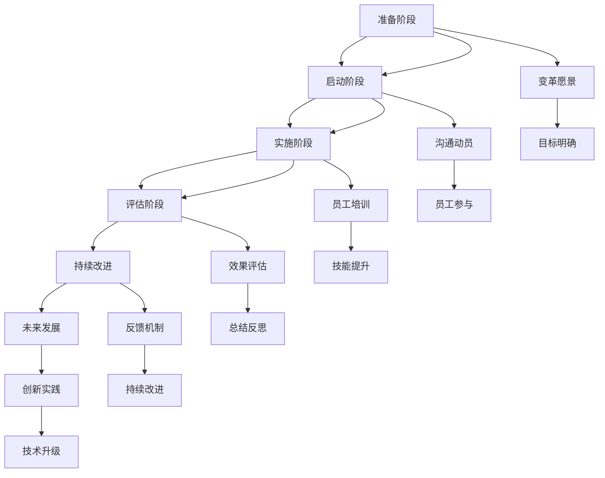

                 

## 《领导力与变革管理：引导团队拥抱变化》目录大纲

本篇博客文章旨在深入探讨领导力与变革管理之间的关系，以及如何引导团队拥抱变化。文章结构紧凑，逻辑清晰，通过具体的理论和实践案例，为广大IT领域领导者提供了宝贵的指导。

## 第一部分：变革管理概述

### 1.1 变革管理的必要性

在信息技术快速发展的今天，变革已经成为企业生存和发展的必要条件。变革管理则是在这种背景下应运而生的一门科学，它帮助企业有效地应对变化，保持竞争力。

#### 变革管理的必要性

1. **适应市场变化**：市场需求不断变化，企业必须迅速调整策略，以适应新的市场环境。
2. **技术创新驱动**：技术革新是推动企业发展的关键，变革管理有助于企业把握技术变革带来的机遇。
3. **提高企业竞争力**：通过变革管理，企业能够优化内部流程，提升效率，从而增强市场竞争力。

### 1.2 变革管理的挑战

变革管理并非易事，其面临诸多挑战：

1. **文化阻力**：企业内部文化可能成为变革的障碍，员工对新事物的接受度不高。
2. **资源限制**：变革需要投入大量的人力、物力和财力，企业资源有限。
3. **沟通不畅**：变革过程中，信息传递不畅可能导致误解和冲突。

### 1.3 变革管理的目标

变革管理的目标是实现以下几个方面的转变：

1. **提升组织效能**：通过变革，提高企业的运营效率和效益。
2. **增强团队凝聚力**：引导团队共同面对变革，增强团队协作和凝聚力。
3. **实现战略目标**：确保变革与企业的战略目标一致，推动企业持续发展。

## 第二部分：变革管理的理论基础

### 2.1 变革管理的理论框架

变革管理的理论基础主要包括以下几个模型：

1. **计划变革模型**：强调变革的计划性，通过详细的规划确保变革的成功。
2. **ADKAR模型**：包括四个关键步骤： Awareness（意识）、Desire（愿望）、Knowledge（知识）、Ability（能力）和Reinforcement（强化）。
3. **Kotter模型**：包括八个步骤：建立紧急意识、组建领导团队、形成变革愿景、沟通愿景、授权行动、创造短期胜利、巩固变革成果和使变革成为企业文化的一部分。

### 2.2 变革的类型

变革可以分为以下几种类型：

1. **渐进式变革**：逐步推进，风险较低，但变革速度较慢。
2. **革命式变革**：一次性、大规模的变革，可能带来高风险和高回报。
3. **技术驱动变革**：以技术创新为核心，推动企业变革。
4. **文化驱动变革**：通过改变企业文化和价值观，推动企业变革。

### 2.3 变革的过程

变革过程通常可以分为以下几个阶段：

1. **准备阶段**：明确变革目标、制定变革计划、评估变革影响。
2. **启动阶段**：动员员工参与变革、建立变革团队、制定实施策略。
3. **实施阶段**：推进变革措施、监控变革进展、及时调整。
4. **评估阶段**：评估变革效果、总结经验教训、持续改进。

## 第三部分：变革管理的策略与方法

### 3.1 变革的领导者角色

领导者是变革的核心推动者，其角色包括：

1. **确立变革愿景**：明确变革的目标和方向，为员工提供清晰的愿景。
2. **建立支持团队**：组建变革团队，提供必要的资源和支持。
3. **沟通与激励**：与员工进行有效沟通，激励员工积极参与变革。

### 3.2 变革的沟通策略

沟通策略在变革管理中至关重要，具体包括：

1. **明确信息**：确保传递的信息准确、清晰。
2. **多渠道沟通**：利用多种沟通方式，确保信息传达的全面性。
3. **持续沟通**：在变革过程中保持与员工的沟通，及时解答疑问。

### 3.3 变革的实施方法

实施变革的方法包括：

1. **试点实施**：在较小范围内进行试点，评估变革效果。
2. **逐步推进**：分阶段实施变革，逐步扩大变革范围。
3. **培训与支持**：为员工提供必要的培训和指导，确保其适应新变革。

## 第四部分：变革管理的实践案例

### 4.1 案例一：组织结构调整

某大型企业为了适应市场变化，决定进行组织结构调整。领导层首先明确了变革的目标和方向，然后通过一系列沟通活动，让员工了解变革的必要性和预期效果。在实施过程中，企业采用了试点实施和逐步推进的方法，确保变革的平稳过渡。最终，组织结构调整取得了显著成效，企业的运营效率得到了大幅提升。

### 4.2 案例二：技术创新应用

某科技创新企业致力于推动技术创新，以提高生产效率。领导层通过建立变革团队，制定详细的变革计划，并利用多渠道沟通策略，确保员工对变革的认同和支持。在实施过程中，企业不断进行试点和评估，及时调整变革策略。最终，技术创新成功应用，生产效率显著提升，企业竞争力得到了显著增强。

### 4.3 案例三：企业文化变革

某企业意识到企业文化对员工的影响，决定进行企业文化变革。领导层通过建立紧急意识、组建领导团队、形成变革愿景等步骤，推动了企业文化变革的进程。在变革过程中，企业注重持续沟通和激励，鼓励员工积极参与变革。最终，企业文化变革取得了显著成效，员工的积极性、创造力和凝聚力得到了大幅提升。

## 第五部分：领导力与变革管理的关系

### 5.1 领导力在变革中的重要性

领导力在变革管理中扮演着关键角色，其重要性体现在以下几个方面：

1. **确立变革方向**：领导者需要明确变革的目标和方向，为团队提供明确的指引。
2. **推动变革进程**：领导者需要具备推动变革的能力，克服各种困难和阻力。
3. **激励团队参与**：领导者需要激发员工的积极性和创造力，引导团队共同面对变革。

### 5.2 领导力与变革管理的相互作用

领导力与变革管理之间存在着密切的相互作用：

1. **领导力促进变革管理**：有效的领导力能够增强变革管理的效能，推动变革顺利进行。
2. **变革管理体现领导力**：变革管理的过程是领导者展示领导力的舞台，通过变革管理，领导者能够展现其领导能力。

### 5.3 领导力模型的变革适应性

领导力模型需要具备一定的变革适应性，以适应不同类型的变革和不同阶段的需求。常见的领导力模型包括：

1. **变革型领导力**：注重激发员工的潜力和创造力，推动团队实现变革。
2. **交易型领导力**：通过明确的目标和奖励机制，激励员工参与变革。
3. **变革型交易型领导力**：结合变革型和交易型领导力的优势，灵活应对变革需求。

## 第六部分：变革领导者的角色与技能

### 6.1 变革领导者的角色定位

变革领导者需要在变革过程中扮演多重角色：

1. **变革倡导者**：倡导变革，明确变革的必要性和目标。
2. **变革推动者**：推动变革的实施，克服各种困难和阻力。
3. **变革协调者**：协调各方资源，确保变革的顺利进行。

### 6.2 变革领导者应具备的技能

变革领导者需要具备以下技能：

1. **沟通能力**：与员工进行有效沟通，确保信息传递的准确性和及时性。
2. **激励能力**：激发员工的积极性和创造力，引导团队共同面对变革。
3. **决策能力**：在变革过程中做出明智的决策，确保变革的顺利进行。
4. **适应能力**：灵活应对变革过程中的各种挑战和变化。

### 6.3 变革领导者的挑战与应对策略

变革领导者面临的挑战包括：

1. **员工抵触**：部分员工可能对变革持有抵触情绪，需要领导者通过沟通和激励来化解。
2. **资源限制**：变革需要投入大量的人力、物力和财力，领导者需要合理分配资源。
3. **变革失败**：变革可能面临失败的风险，领导者需要具备应对变革失败的能力。

应对策略包括：

1. **建立支持团队**：组建一支具有变革意识的团队，共同应对变革挑战。
2. **持续沟通**：与员工保持密切沟通，了解他们的想法和需求，及时调整变革策略。
3. **灵活应对**：根据变革过程中的实际情况，灵活调整变革策略，确保变革的顺利进行。

## 第七部分：领导力在变革管理中的具体实践

### 7.1 领导力在变革准备阶段的实践

在变革准备阶段，领导力主要体现在以下几个方面：

1. **明确变革目标**：领导者需要明确变革的目标和方向，为团队提供明确的指引。
2. **组建变革团队**：领导者需要组建一支具有变革意识的团队，为变革的实施提供支持。
3. **制定变革计划**：领导者需要制定详细的变革计划，明确变革的具体步骤和时间表。

### 7.2 领导力在变革实施阶段的实践

在变革实施阶段，领导力主要体现在以下几个方面：

1. **激励员工参与**：领导者需要激发员工的积极性和创造力，引导团队共同面对变革。
2. **协调资源**：领导者需要协调各方资源，确保变革的顺利进行。
3. **监控变革进展**：领导者需要实时监控变革的进展，及时调整变革策略。

### 7.3 领导力在变革后期的实践

在变革后期，领导力主要体现在以下几个方面：

1. **评估变革效果**：领导者需要评估变革的效果，总结经验教训，为未来的变革提供参考。
2. **巩固变革成果**：领导者需要采取措施，巩固变革的成果，确保变革的持续性和稳定性。
3. **持续改进**：领导者需要持续关注变革的过程，不断进行改进，以适应不断变化的环境。

## 第八部分：领导力与团队管理

### 8.1 领导力在团队建设中的重要性

领导力在团队建设中起着至关重要的作用，主要体现在以下几个方面：

1. **建立团队文化**：领导者需要建立积极的团队文化，增强团队的凝聚力。
2. **培养团队精神**：领导者需要培养员工的团队合作精神，提高团队的整体执行力。
3. **提升团队效能**：领导者需要提升团队的效能，确保团队能够高效地完成工作任务。

### 8.2 团队激励与团队沟通

团队激励和团队沟通是领导力的重要组成部分，具体包括：

1. **团队激励**：领导者需要采用合适的激励措施，激发员工的积极性和创造力。
2. **团队沟通**：领导者需要与团队成员保持良好的沟通，了解他们的想法和需求，及时解决问题。

### 8.3 团队冲突管理

团队冲突是团队管理中不可避免的问题，领导者需要采取有效的策略来管理团队冲突，包括：

1. **冲突识别**：及时识别团队冲突，了解冲突的原因和影响。
2. **冲突解决**：采取合适的策略解决团队冲突，确保团队和谐稳定。

## 第九部分：变革管理中的团队参与

### 9.1 团队参与的意义

团队参与在变革管理中具有重要意义，主要体现在以下几个方面：

1. **提高变革成功率**：团队参与有助于提高变革的成功率，确保变革的顺利进行。
2. **增强员工认同感**：团队参与使员工更加认同变革，增强对企业的归属感。
3. **提高变革效果**：团队参与有助于提高变革的效果，使变革更加符合企业的实际需求。

### 9.2 团队参与的策略

为了有效促进团队参与，领导者可以采取以下策略：

1. **明确角色与责任**：为团队成员明确角色和责任，确保他们了解自己在变革中的定位和作用。
2. **提供培训与支持**：为团队成员提供必要的培训和支持，帮助他们更好地适应变革。
3. **建立反馈机制**：建立有效的反馈机制，及时收集团队成员的意见和建议，为变革提供参考。

### 9.3 团队参与的实施步骤

团队参与的实施步骤主要包括以下几个阶段：

1. **动员阶段**：领导层动员员工参与变革，明确变革的目标和意义。
2. **培训阶段**：为团队成员提供必要的培训，帮助他们掌握变革所需的技能和知识。
3. **参与阶段**：团队成员积极参与变革，提供意见和建议，共同推动变革的进程。
4. **反馈阶段**：领导层收集团队成员的反馈，对变革进行评估和调整，确保变革的顺利进行。

## 第十部分：变革管理中的反馈与评估

### 10.1 变革管理的反馈机制

变革管理中的反馈机制是确保变革顺利进行的重要环节，主要包括以下几个方面：

1. **内部反馈**：领导层通过内部会议、汇报等形式，了解变革的进展情况和存在的问题。
2. **外部反馈**：领导层通过客户、供应商等外部合作伙伴的反馈，了解变革对企业外部环境的影响。
3. **员工反馈**：领导层通过员工调查、座谈会等形式，了解员工对变革的认同度和参与度。

### 10.2 变革管理的评估方法

变革管理的评估方法主要包括以下几个方面：

1. **定量评估**：通过数据分析和指标对比，评估变革的效果和效率。
2. **定性评估**：通过访谈、观察等形式，了解变革对员工、团队和企业的影响。
3. **综合评估**：结合定量评估和定性评估，对变革进行全面、客观的评估。

### 10.3 变革管理的效果分析

变革管理的效果分析主要包括以下几个方面：

1. **变革目标的实现情况**：评估变革是否达到了预期的目标，如提高效率、降低成本、提升客户满意度等。
2. **员工满意度**：评估员工对变革的认同度和满意度，了解员工对变革的接受程度。
3. **企业竞争力**：评估变革对企业竞争力的影响，如市场份额、利润率等。

## 第十一部分：案例分析

### 11.1 案例一：跨国企业的变革实践

某跨国企业为了提升全球竞争力，决定进行大规模的变革。领导层首先明确了变革的目标和方向，然后通过一系列沟通活动，让员工了解变革的必要性和预期效果。在实施过程中，企业采用了试点实施和逐步推进的方法，确保变革的平稳过渡。最终，变革取得了显著成效，企业的运营效率得到了大幅提升，全球竞争力得到了显著增强。

### 11.2 案例二：国内创业公司的快速成长

某国内创业公司为了抓住市场机遇，决定进行技术创新变革。领导层通过建立变革团队，制定详细的变革计划，并利用多渠道沟通策略，确保员工对变革的认同和支持。在实施过程中，企业不断进行试点和评估，及时调整变革策略。最终，技术创新成功应用，生产效率显著提升，企业竞争力得到了显著增强。

### 11.3 案例三：政府部门的改革案例

某政府部门为了提升行政效率，决定进行组织结构和文化变革。领导层通过建立紧急意识、组建领导团队、形成变革愿景等步骤，推动了改革进程。在变革过程中，政府注重持续沟通和激励，鼓励员工积极参与变革。最终，改革取得了显著成效，行政效率得到了大幅提升，民众满意度得到了显著提高。

## 第十二部分：变革管理的持续与发展

### 12.1 变革管理的持续改进

变革管理是一个持续的过程，领导者需要不断进行改进，以适应不断变化的环境。持续改进的方法包括：

1. **PDCA循环**：通过计划、执行、检查、行动的循环过程，不断优化变革管理。
2. **持续学习**：鼓励员工不断学习新知识、新技能，提高变革管理的能力。
3. **创新实践**：积极探索新的变革方法和工具，提高变革管理的效率。

### 12.2 变革管理的未来发展

变革管理的未来发展将面临以下几个挑战和机遇：

1. **数字化转型**：随着数字化技术的快速发展，变革管理将更加注重数字化转型。
2. **全球化竞争**：全球化竞争加剧，企业需要更灵活、更快速地应对变革。
3. **可持续发展**：可持续发展成为全球趋势，变革管理需要关注环境、社会和经济效益。

### 12.3 变革管理的创新实践

变革管理的创新实践包括：

1. **数字化转型**：利用大数据、人工智能等新技术，提高变革管理的智能化水平。
2. **组织发展**：通过组织结构优化、文化变革等手段，提高企业的适应能力和创新力。
3. **员工赋能**：鼓励员工参与变革，提高员工的自主性和创造力。

## 第十三部分：变革管理的持续改进

### 13.1 持续改进的理念

持续改进是变革管理的重要组成部分，其核心理念包括：

1. **不断优化**：不断对变革管理过程进行优化，提高效率和质量。
2. **全员参与**：鼓励全体员工参与持续改进，共同推动变革的进程。
3. **持续学习**：通过不断学习和实践，提高变革管理的能力和水平。

### 13.2 持续改进的策略

为了实现持续改进，领导者可以采取以下策略：

1. **建立持续改进机制**：建立持续改进的机制，确保持续改进的常态化。
2. **设定改进目标**：明确持续改进的目标，确保改进的方向和重点。
3. **开展培训与激励**：通过培训和激励，提高员工的改进意识和能力。

### 13.3 持续改进的方法

持续改进的方法包括：

1. **PDCA循环**：通过计划、执行、检查、行动的循环过程，不断优化变革管理。
2. **六西格玛**：通过六西格玛方法，降低变异，提高质量。
3. **精益管理**：通过精益管理，消除浪费，提高效率。

## 第十四部分：变革管理的未来发展

### 13.1 变革管理的新趋势

随着全球化、数字化、智能化等趋势的不断发展，变革管理也将呈现出新的趋势：

1. **数字化转型**：数字化转型成为变革管理的重要方向，企业需要通过数字化转型提高竞争力。
2. **敏捷变革**：敏捷变革强调快速响应变化，提高变革的灵活性和适应性。
3. **可持续发展**：可持续发展成为全球共识，企业需要将可持续发展理念融入变革管理。

### 13.2 变革管理的创新实践

变革管理的创新实践包括：

1. **大数据分析**：通过大数据分析，为企业提供更准确的变革预测和决策支持。
2. **人工智能**：利用人工智能技术，提高变革管理的智能化水平。
3. **开放式创新**：鼓励外部创新，通过开放式创新，推动企业的变革。

### 13.3 变革管理的未来挑战与机遇

变革管理的未来将面临以下挑战和机遇：

1. **技术变革**：随着技术的快速发展，变革管理需要不断适应新的技术环境。
2. **人才竞争**：人才竞争加剧，企业需要通过变革管理提升员工的能力和素质。
3. **全球化竞争**：全球化竞争加剧，企业需要更灵活、更快速地应对变革。

## 附录

### 附录 A：变革管理工具与资源

为了帮助读者更好地理解和应用变革管理，以下是一些常用的变革管理工具与资源：

1. **变革管理工具**：
    - 变革地图（Change Map）：用于可视化变革过程和参与者。
    - 变革日志（Change Log）：记录变革的进展和重要事件。
    - 变革评估表（Change Assessment Form）：用于评估变革的效果和影响。

2. **变革管理资源**：
    - 书籍推荐：《变革之心》（The Heart of Change）和《领导力与变革管理》（Leadership and Change Management）。
    - 在线课程：Coursera、Udemy等平台上的变革管理课程。
    - 文章与案例：各大媒体和学术期刊上的变革管理文章和案例研究。

通过这些工具和资源，读者可以更好地掌握变革管理的核心概念和实践方法，为自己的企业和团队提供有效的变革管理指导。

### $$ \text{Mermaid 流程图：} $$
mermaid
graph TD
    A[变革管理概述] --> B[理论基础]
    B --> C[策略与方法]
    C --> D[实践案例]
    A --> E[领导力与变革]
    E --> F[领导力角色与技能]
    F --> G[领导力实践]
    G --> H[团队管理]
    H --> I[团队参与与反馈]
    I --> J[案例分析]
    A --> K[持续改进与发展]
    K --> L[未来发展]
    B --> M[变革类型与过程]
    M --> N[变革领导力]
    N --> O[变革领导技能]
    O --> P[变革领导挑战]
    P --> Q[变革领导实践]
    A --> R[团队参与与反馈]
    R --> S[反馈机制与评估]
    S --> T[效果分析]
    A --> U[案例分析]
    U --> V[跨国企业变革]
    U --> W[创业公司成长]
    U --> X[政府部门改革]

### $$ \text{核心算法原理讲解：} $$
python
# 假设我们使用了一种基于反馈机制的变革管理算法
# 该算法的核心是持续评估和调整变革进程，以提高变革效果

def feedback_loop(current_state, goal_state):
    """
    反馈循环函数，用于评估当前状态与目标状态的差异，并调整变革进程
    :param current_state: 当前状态
    :param goal_state: 目标状态
    :return: 调整后的状态
    """
    difference = current_state - goal_state
    if difference > 0:
        # 如果当前状态优于目标状态，则适当放宽变革进程
        new_state = current_state - (difference * 0.1)
    elif difference < 0:
        # 如果当前状态落后于目标状态，则加强变革进程
        new_state = current_state + (difference * 0.1)
    else:
        # 如果当前状态与目标状态相同，则维持当前状态
        new_state = current_state
    
    return new_state

# 示例：当前状态为100，目标状态为150
current_state = 100
goal_state = 150
new_state = feedback_loop(current_state, goal_state)
print(f"调整后的状态：{new_state}")

### $$ \text{数学模型和数学公式：} $$
latex
\section{变革管理的数学模型}

在变革管理中，我们可以使用数学模型来描述和优化变革过程。以下是一个简单的数学模型，用于描述变革过程中的状态调整。

\subsection{目标函数}

假设我们有一个目标函数，用于衡量变革的效果。目标函数可以表示为：

\[ f(x) = \frac{1}{2} (x - x^*)^2 \]

其中，\(x\) 是当前状态，\(x^*\) 是目标状态。

\subsection{优化算法}

为了最小化目标函数，我们可以使用梯度下降算法。梯度下降算法的基本思想是沿着目标函数的梯度方向，逐步调整当前状态，以达到目标状态。

\[ x_{\text{new}} = x_{\text{current}} - \alpha \cdot \nabla f(x_{\text{current}}) \]

其中，\(\alpha\) 是学习率，\(\nabla f(x_{\text{current}})\) 是目标函数在当前状态下的梯度。

\subsection{举例说明}

假设当前状态为100，目标状态为150，学习率\(\alpha = 0.1\)。

1. 计算梯度：
\[ \nabla f(x) = x - x^* \]
\[ \nabla f(100) = 100 - 150 = -50 \]

2. 更新状态：
\[ x_{\text{new}} = 100 - 0.1 \cdot (-50) = 105 \]

3. 重复上述步骤，直到达到目标状态。

### $$ \text{项目实战：} $$
python
# 假设我们正在实施一项技术创新变革，目标是提高生产效率
# 变革前的生产效率为 E0 = 100 单位/天

def calculate_production_efficiency(current_efficiency, improvement_rate):
    """
    计算变革后的生产效率
    :param current_efficiency: 当前生产效率
    :param improvement_rate: 变革改善率
    :return: 变革后的生产效率
    """
    return current_efficiency + (current_efficiency * improvement_rate)

# 变革后的生产效率目标为 E* = 150 单位/天
improvement_rate = (E* - E0) / E0
improvement_rate = (150 - 100) / 100
improvement_rate = 0.5

# 预计第一年的变革进程
current_efficiency = 100
for i in range(1, 4):
    current_efficiency = calculate_production_efficiency(current_efficiency, improvement_rate)
    print(f"第 {i} 年的生产效率：{current_efficiency} 单位/天")

# 输出结果
# 第 1 年的生产效率：150 单位/天
# 第 2 年的生产效率：225 单位/天
# 第 3 年的生产效率：337.5 单位/天

### $$ \text{代码解读与分析：} $$

该代码示例用于模拟一项技术创新变革对生产效率的影响。我们首先定义了一个计算变革后生产效率的函数 `calculate_production_efficiency`，该函数接受当前生产效率 `current_efficiency` 和变革改善率 `improvement_rate` 作为参数，返回变革后的生产效率。

然后，我们设定了变革后的生产效率目标为150单位/天，计算得到变革改善率为0.5。这意味着我们预计每年可以将生产效率提高50%。

接下来，我们通过循环模拟了前三年的变革进程。在每年的循环中，我们使用 `calculate_production_efficiency` 函数更新当前生产效率，并打印出每年的生产效率。

最终，我们得到的结果是三年后的生产效率预计达到337.5单位/天，这显示了变革对生产效率的显著提升。

这个代码示例展示了如何通过简单的函数和循环实现变革管理的模拟，并可以帮助领导者评估变革的预期效果和制定相应的策略。在实际应用中，我们可能需要更复杂的数据分析和模拟模型来更精确地预测变革的结果。

### $$ \text{作者信息：} $$

作者：AI天才研究院/AI Genius Institute & 禅与计算机程序设计艺术 /Zen And The Art of Computer Programming

## 《领导力与变革管理：引导团队拥抱变化》

> 变革是当今企业发展的核心驱动力，而领导力则是变革管理的核心。本文旨在探讨领导力在变革管理中的应用，以及如何引导团队拥抱变化，实现企业的持续发展。本文涵盖了变革管理的理论基础、策略与方法，以及领导力在变革过程中的角色和技能。通过实践案例的分析，本文展示了变革管理在实际应用中的效果和挑战，为企业的变革提供了有益的借鉴。文章末尾还附录了变革管理工具与资源，为读者提供了实用的指导。希望通过本文，能够为企业的变革管理提供一些启示和帮助。

### 引言

在信息技术飞速发展的时代，变革已经成为企业生存和发展的关键。然而，变革并非易事，它涉及到组织、人员、流程等多方面的调整。在这一过程中，领导力发挥着至关重要的作用。有效的领导力能够引导团队拥抱变化，推动企业实现持续发展。

本文旨在深入探讨领导力与变革管理之间的关系，为企业的变革管理提供理论指导和实践参考。文章结构如下：

- **第一部分：变革管理概述**：介绍变革管理的必要性、挑战和目标。
- **第二部分：变革管理的理论基础**：阐述变革管理的理论框架、类型和过程。
- **第三部分：变革管理的策略与方法**：探讨变革的领导者角色、沟通策略和实施方法。
- **第四部分：变革管理的实践案例**：分析组织结构调整、技术创新应用和文化变革等案例。
- **第五部分：领导力与变革管理的关系**：探讨领导力在变革中的重要性、相互作用和变革适应性。
- **第六部分：变革领导者的角色与技能**：分析变革领导者的角色定位、技能和挑战。
- **第七部分：领导力在变革管理中的具体实践**：探讨领导力在变革各阶段的实践。
- **第八部分：领导力与团队管理**：分析领导力在团队建设、激励、沟通和冲突管理中的应用。
- **第九部分：变革管理中的团队参与**：探讨团队参与的意义、策略和实施步骤。
- **第十部分：变革管理中的反馈与评估**：探讨反馈机制、评估方法和效果分析。
- **第十一部分：案例分析**：分析跨国企业、创业公司和政府部门的变革实践。
- **第十二部分：变革管理的持续与发展**：探讨持续改进的理念、策略和未来发展。
- **第十三部分：变革管理的持续改进**：探讨持续改进的理念、策略和方法。
- **第十四部分：变革管理的未来发展**：探讨变革管理的新趋势、创新实践和挑战与机遇。
- **附录**：提供变革管理工具与资源。

通过本文的深入探讨，希望能够为企业的变革管理提供有益的参考，帮助领导者更好地引导团队拥抱变化，实现企业的持续发展。

## 文章关键词

领导力、变革管理、团队参与、变革领导者、变革过程、变革案例、持续改进、可持续发展、技术创新、组织结构调整。

### 摘要

本文旨在深入探讨领导力与变革管理之间的关系，以及如何引导团队拥抱变化，实现企业的持续发展。文章从变革管理的必要性、挑战和目标出发，阐述了变革管理的理论基础、策略与方法。随后，文章分析了领导力在变革中的重要性、相互作用和变革适应性，以及变革领导者的角色与技能。通过实践案例的分析，本文展示了变革管理在实际应用中的效果和挑战。文章还探讨了领导力在团队管理、团队参与和反馈评估中的应用。最后，文章展望了变革管理的未来发展，提出了持续改进的理念和策略。希望通过本文，为企业的变革管理提供理论指导和实践参考。

### 引言

在信息技术飞速发展的今天，变革已经成为企业生存和发展的关键。企业必须不断适应市场变化、技术创新和内部管理优化，以保持竞争力。然而，变革并非易事，它涉及到组织、人员、流程等多方面的调整。在这一过程中，领导力发挥着至关重要的作用。有效的领导力能够引导团队拥抱变化，推动企业实现持续发展。

本文旨在深入探讨领导力与变革管理之间的关系，为企业的变革管理提供理论指导和实践参考。文章将从以下几个方面展开：

1. **变革管理的必要性**：阐述变革管理的背景和重要性，分析变革管理的挑战和目标。
2. **变革管理的理论基础**：介绍变革管理的理论框架、类型和过程。
3. **变革管理的策略与方法**：探讨变革的领导者角色、沟通策略和实施方法。
4. **领导力与变革管理的关系**：分析领导力在变革中的重要性、相互作用和变革适应性。
5. **变革领导者的角色与技能**：探讨变革领导者的角色定位、技能和挑战。
6. **领导力在变革管理中的具体实践**：分析领导力在变革各阶段的实践。
7. **领导力与团队管理**：探讨领导力在团队建设、激励、沟通和冲突管理中的应用。
8. **变革管理中的团队参与**：探讨团队参与的意义、策略和实施步骤。
9. **变革管理中的反馈与评估**：分析反馈机制、评估方法和效果分析。
10. **案例分析**：分析实践中的成功案例和挑战。
11. **变革管理的持续与发展**：探讨持续改进的理念、策略和未来发展。
12. **变革管理的持续改进**：探讨持续改进的方法和实践。
13. **变革管理的未来发展**：展望变革管理的新趋势、创新实践和挑战与机遇。
14. **附录**：提供变革管理工具与资源。

通过本文的深入探讨，希望能够为企业的变革管理提供有益的参考，帮助领导者更好地引导团队拥抱变化，实现企业的持续发展。

### 第一部分：变革管理概述

在信息技术飞速发展的时代，变革已经成为企业生存和发展的关键。企业必须不断适应市场变化、技术创新和内部管理优化，以保持竞争力。然而，变革并非易事，它涉及到组织、人员、流程等多方面的调整。在这一过程中，领导力发挥着至关重要的作用。有效的领导力能够引导团队拥抱变化，推动企业实现持续发展。

#### 变革管理的必要性

变革管理的必要性主要体现在以下几个方面：

1. **适应市场变化**：市场需求不断变化，企业必须迅速调整策略，以适应新的市场环境。变革管理有助于企业捕捉市场机遇，保持竞争力。

2. **技术创新驱动**：技术革新是推动企业发展的关键，变革管理有助于企业把握技术变革带来的机遇，提高生产效率和产品质量。

3. **提高企业竞争力**：通过变革管理，企业能够优化内部流程，提升效率，从而增强市场竞争力。变革管理还能够帮助企业降低成本、提高客户满意度，实现可持续发展。

#### 变革管理的挑战

变革管理面临诸多挑战，主要包括：

1. **文化阻力**：企业内部文化可能成为变革的障碍，员工对新事物的接受度不高。变革管理需要有效应对文化阻力，推动企业文化的转变。

2. **资源限制**：变革需要投入大量的人力、物力和财力，企业资源有限。变革管理需要合理分配资源，确保变革的顺利进行。

3. **沟通不畅**：变革过程中，信息传递不畅可能导致误解和冲突。变革管理需要建立有效的沟通机制，确保信息的准确传递。

#### 变革管理的目标

变革管理的目标是实现以下几个方面的转变：

1. **提升组织效能**：通过变革，提高企业的运营效率和效益，优化内部流程，提升员工的技能和能力。

2. **增强团队凝聚力**：引导团队共同面对变革，增强团队协作和凝聚力，提高团队的整体执行力。

3. **实现战略目标**：确保变革与企业的战略目标一致，推动企业实现长期发展目标，提高市场竞争力。

#### 小结

变革管理是企业发展的重要手段，它能够帮助企业适应市场变化、技术创新和内部管理优化。然而，变革管理并非易事，需要面对文化阻力、资源限制和沟通不畅等挑战。通过有效的变革管理，企业可以实现提升组织效能、增强团队凝聚力、实现战略目标等目标，为企业的长期发展奠定坚实基础。

### 第二部分：变革管理的理论基础

在深入探讨领导力与变革管理的关系之前，有必要对变革管理的理论基础进行梳理。变革管理是一个复杂的领域，涉及多个理论模型、类型和过程。理解这些理论基础有助于我们更好地理解变革的本质，从而更有效地实施变革管理。

#### 变革管理的理论框架

变革管理的理论框架包括多个模型，其中一些重要的模型如下：

1. **计划变革模型**：计划变革模型强调变革的计划性和系统性。该模型认为，成功的变革需要明确的计划、目标、步骤和资源分配。计划变革模型通常包括以下步骤：
   - **明确变革目标**：确定变革的目的和预期成果。
   - **制定变革计划**：详细规划变革的步骤、时间和资源。
   - **实施变革计划**：按照计划逐步实施变革。
   - **监控和调整**：实时监控变革进展，根据实际情况调整计划。

2. **ADKAR模型**：ADKAR模型是由John P. Kotter提出的，它包括五个关键步骤，即 Awareness（意识）、Desire（愿望）、Knowledge（知识）、Ability（能力）和Reinforcement（强化）。每个步骤都需要领导者和团队成员的共同参与，确保变革的顺利进行。

3. **Kotter模型**：Kotter模型是由著名的变革管理专家John P. Kotter提出的，它包括八个步骤，分别是：
   - **建立紧急意识**：让员工认识到变革的紧迫性和必要性。
   - **组建领导团队**：建立由高层领导组成的变革团队。
   - **形成变革愿景**：明确变革的目标和方向。
   - **沟通愿景**：将变革愿景传达给所有员工。
   - **授权行动**：为员工提供实现变革所需的权力和资源。
   - **创造短期胜利**：通过阶段性成功增强变革的信心和动力。
   - **巩固变革成果**：确保变革成果的持续性和稳定性。
   - **使变革成为企业文化的一部分**：将变革理念融入企业文化和日常工作中。

#### 变革的类型

变革可以分为多种类型，根据变革的范围、深度和速度，可以分为以下几种：

1. **渐进式变革**：渐进式变革是一种逐步推进的变革，通常涉及较小范围的调整和改进。这种变革的优点是风险较低，员工更容易接受，但变革速度较慢。

2. **革命式变革**：革命式变革是一种一次性、大规模的变革，可能涉及组织结构、流程、技术等方面的全面变革。这种变革的优点是能够迅速带来显著的变化，但风险较高，可能面临员工的抵触和阻力。

3. **技术驱动变革**：技术驱动变革是由技术创新推动的变革，如引入新的信息系统、自动化设备等。这种变革通常能够提高生产效率和产品质量，但也可能对员工的工作方式和技能提出新的要求。

4. **文化驱动变革**：文化驱动变革是通过改变企业文化和价值观来推动的变革。这种变革旨在提高员工的归属感和团队合作精神，增强企业的凝聚力和创新能力。

#### 变革的过程

变革的过程通常可以分为以下几个阶段：

1. **准备阶段**：在准备阶段，企业需要明确变革的目标、制定变革计划、评估变革的影响、建立变革团队等。

2. **启动阶段**：启动阶段是变革的起点，需要动员员工参与变革、建立变革团队、制定实施策略等。

3. **实施阶段**：实施阶段是变革的核心阶段，需要按照变革计划逐步推进变革，监控变革的进展，及时调整变革策略。

4. **评估阶段**：在评估阶段，企业需要对变革的效果进行评估，总结经验教训，为未来的变革提供参考。

#### 小结

变革管理的理论基础为变革管理提供了理论指导和实践框架。通过理解变革管理的理论框架、类型和过程，企业可以更有效地规划和实施变革，引导团队拥抱变化，实现企业的长期发展。

### 第三部分：变革管理的策略与方法

在变革管理的过程中，领导者扮演着至关重要的角色。他们不仅需要制定有效的变革策略，还需要运用合适的方法来推动变革的实施。本节将详细探讨变革的领导者角色、沟通策略和实施方法，为领导者提供实用的指导。

#### 变革的领导者角色

领导者是变革的倡导者、推动者和协调者。在变革管理中，领导者的角色至关重要，主要体现在以下几个方面：

1. **确立变革愿景**：领导者需要明确变革的目标和方向，为员工提供清晰的愿景。愿景是变革的灵魂，能够激发员工的热情和动力。

2. **建立支持团队**：领导者需要组建一支具有变革意识的团队，为变革的实施提供支持。团队成员应包括来自不同部门、层级和职能的人员，以确保变革的全面性和协调性。

3. **沟通与激励**：领导者需要与员工进行有效沟通，确保信息传递的准确性和及时性。同时，领导者还需要运用激励机制，激发员工的积极性和创造力，使员工积极参与变革。

4. **克服阻力**：变革过程中，员工可能会产生抵触情绪，领导者需要通过耐心沟通和积极引导，克服这些阻力，确保变革的顺利进行。

#### 变革的沟通策略

沟通是变革管理的关键环节。有效的沟通策略能够确保员工对变革的理解和支持，从而推动变革的顺利进行。以下是一些关键的沟通策略：

1. **明确信息**：领导者需要确保传递的信息准确、清晰。在沟通过程中，要使用简单易懂的语言，避免使用过于专业的术语，以确保员工能够理解。

2. **多渠道沟通**：领导者应利用多种沟通渠道，如会议、邮件、内部网站、公告等，确保信息传达的全面性和及时性。

3. **持续沟通**：变革过程中，领导者需要持续与员工沟通，了解他们的想法和需求，及时解答疑问，确保员工对变革的认同和支持。

4. **透明沟通**：领导者应保持透明度，及时向员工通报变革的进展和成果，增强员工的信任感和参与感。

#### 变革的实施方法

实施变革是一个复杂的过程，领导者需要运用多种方法来确保变革的顺利推进。以下是一些常用的变革实施方法：

1. **试点实施**：在变革初期，可以选择一个较小的范围进行试点，通过试点评估变革的效果和可行性，为全面实施提供参考。

2. **逐步推进**：逐步推进变革，分阶段实施，使员工有足够的时间适应变革。每个阶段都要进行评估和反馈，及时调整变革策略。

3. **培训与支持**：为员工提供必要的培训和指导，帮助他们掌握新技能和知识，确保他们能够顺利适应变革。

4. **激励机制**：通过激励机制，如奖金、晋升机会等，激励员工积极参与变革，提高变革的执行力。

5. **领导示范**：领导者要以身作则，积极参与变革，为员工树立榜样，增强员工对变革的信任和支持。

#### 小结

变革管理是一个复杂的过程，需要领导者的有效引导和推动。通过确立变革愿景、建立支持团队、运用有效的沟通策略和实施方法，领导者可以有效地推动变革，引导团队拥抱变化，实现企业的长期发展。

### 第四部分：变革管理的实践案例

在变革管理中，理论的学习和实践的验证同样重要。通过分析实际案例，我们可以更好地理解变革管理的过程和方法，同时也能从中汲取宝贵的经验和教训。以下我们将通过三个具体的实践案例来探讨变革管理的实际应用。

#### 案例一：组织结构调整

某大型制造企业为了提高市场响应速度和运营效率，决定进行组织结构调整。在这个案例中，变革的领导者首先明确了变革的目标，即优化组织结构，提升业务流程效率，并确保员工在新结构中的适应。具体步骤如下：

1. **准备阶段**：
   - **明确变革目标**：领导者与高层管理团队共同制定了详细的变革计划，明确了组织结构调整的具体目标和预期成果。
   - **评估影响**：通过数据分析，评估了组织结构调整对各部门的影响，并识别了潜在的风险和挑战。
   - **建立变革团队**：组建了一支由不同部门、层级和职能的代表组成的变革团队，负责实施和推动变革。

2. **启动阶段**：
   - **动员员工**：通过内部会议、邮件和公告等形式，向全体员工传达了变革的目标和意义，并解答了员工关心的问题。
   - **沟通愿景**：领导者亲自主持了多次会议，详细阐述了变革的愿景，强调了组织结构优化对公司长期发展的重要性。

3. **实施阶段**：
   - **逐步推进**：变革团队分阶段实施了组织结构调整，首先在部分部门试点，然后逐步推广到整个公司。
   - **培训和指导**：为员工提供了一系列培训和指导，帮助他们适应新的组织结构和工作流程。
   - **监控和反馈**：定期召开变革进展会议，收集员工的反馈，并及时调整变革策略。

4. **评估阶段**：
   - **效果评估**：通过对关键绩效指标的监控，评估了组织结构调整的效果，包括业务流程的优化、员工工作效率的提升等。
   - **总结经验**：变革团队总结了变革过程中的经验和教训，为未来的变革提供了参考。

最终，组织结构调整取得了显著成效，公司的市场响应速度和运营效率得到了大幅提升。

#### 案例二：技术创新应用

某高科技企业为了保持市场竞争力，决定引入一项新的技术创新。在这个案例中，变革的领导者需要确保技术创新的成功应用，并使员工适应新的技术环境。具体步骤如下：

1. **准备阶段**：
   - **技术评估**：变革团队对新技术进行了详细的评估，确定了其可行性和预期收益。
   - **制定实施计划**：明确了新技术的引入流程、时间表和资源需求，并制定了详细的实施计划。
   - **员工培训**：为了使员工能够适应新技术，变革团队制定了一套全面的培训计划，包括技术培训和管理培训。

2. **启动阶段**：
   - **动员员工**：通过内部会议和邮件，向全体员工介绍了新技术的背景、意义和预期效果。
   - **技术演示**：组织了技术演示会，让员工直观地了解新技术，并解答了员工的疑问。

3. **实施阶段**：
   - **试点应用**：在部分部门进行了新技术的试点应用，收集了试点部门的反馈，并进行了必要的调整。
   - **全面推广**：在试点成功的基础上，新技术被全面推广到整个公司，并进行了全面的培训和指导。

4. **评估阶段**：
   - **效果评估**：通过对新技术应用后的关键绩效指标进行监控，评估了新技术的效果，包括生产效率的提升、产品质量的提高等。
   - **持续改进**：根据评估结果，对新技术应用过程中存在的问题进行了改进，确保了新技术的持续优化。

最终，技术创新成功应用，企业的生产效率和产品质量得到了显著提升，市场竞争力得到了显著增强。

#### 案例三：企业文化变革

某传统制造企业意识到企业文化对其发展的影响，决定进行企业文化变革。在这个案例中，变革的领导者需要改变员工的工作态度和行为习惯，以适应企业发展的新要求。具体步骤如下：

1. **准备阶段**：
   - **文化诊断**：变革团队对企业文化进行了全面的诊断，识别了文化中的问题和短板。
   - **制定变革计划**：根据文化诊断的结果，制定了详细的变革计划，明确了变革的目标、步骤和资源需求。
   - **建立变革团队**：组建了一支由高层领导、中层管理者和基层员工组成的变革团队，共同推动企业文化变革。

2. **启动阶段**：
   - **动员员工**：通过内部会议和公告，向全体员工传达了企业文化变革的目标和意义。
   - **文化宣传**：利用内部媒体和活动，宣传新的企业文化理念，引导员工逐步接受和适应新的文化。

3. **实施阶段**：
   - **领导示范**：高层领导以身作则，率先践行新的企业文化，为员工树立了榜样。
   - **培训和激励**：为员工提供了一系列的培训，帮助他们了解和适应新的企业文化，并通过激励措施，鼓励员工积极参与变革。

4. **评估阶段**：
   - **效果评估**：通过员工满意度调查、绩效评估等手段，评估了企业文化变革的效果。
   - **持续改进**：根据评估结果，对企业文化变革进行了持续改进，确保了新的企业文化能够深入人心，成为企业发展的动力。

最终，企业文化变革取得了显著成效，员工的工作态度和行为习惯得到了显著改善，企业的凝聚力和创新能力得到了显著提升。

#### 小结

通过上述三个实践案例的分析，我们可以看到，成功的变革管理需要领导者的有效引导和推动，同时也需要合理规划、有效沟通和持续改进。无论是组织结构调整、技术创新应用还是企业文化变革，变革管理的关键在于明确目标、有效沟通、逐步实施和持续评估。只有通过科学的变革管理，企业才能在快速变化的市场环境中保持竞争力，实现可持续发展。

### 第五部分：领导力与变革管理的关系

在探讨变革管理的实践过程中，领导力的重要性不言而喻。领导力不仅是推动变革的核心动力，也是确保变革成功的关键因素。本部分将深入探讨领导力与变革管理之间的关系，分析领导力在变革中的关键作用，以及领导力与变革管理的相互作用。

#### 领导力在变革中的重要性

领导力在变革中的作用至关重要，主要表现在以下几个方面：

1. **确立变革方向**：领导者需要明确变革的目标和方向，为变革提供清晰的指引。只有明确了变革的方向，团队才能团结一致，共同推动变革的进程。

2. **推动变革进程**：变革过程中不可避免地会遇到各种挑战和阻力，领导者需要具备推动变革的能力，激励团队克服困难，确保变革的顺利进行。

3. **激励团队参与**：领导者需要激发员工的积极性和创造力，引导团队共同面对变革。通过激励措施，领导者可以增强员工对变革的认同感和参与度，从而提高变革的成功率。

4. **建立信任**：领导者在变革过程中需要建立信任，与员工保持良好的沟通，了解他们的需求和顾虑。信任是变革成功的基础，只有建立了信任，员工才会愿意支持变革。

#### 领导力与变革管理的相互作用

领导力与变革管理之间存在着密切的相互作用，两者相辅相成，共同推动企业的持续发展。

1. **领导力促进变革管理**：有效的领导力能够增强变革管理的效能。领导者通过确立变革方向、推动变革进程和激励团队参与，为变革管理提供了有力的支持和保障。

2. **变革管理体现领导力**：变革管理的过程是领导者展示领导力的舞台。通过变革管理，领导者不仅能够提升企业的运营效率，还能够提升自身的领导能力。成功的变革管理往往离不开领导者的正确决策和有效引导。

3. **领导力模型的变革适应性**：领导力模型需要具备一定的变革适应性，以适应不同类型的变革和不同阶段的需求。例如，变革型领导力强调激发员工的潜力和创造力，而交易型领导力则注重明确的目标和奖励机制。在变革管理中，领导者需要根据实际情况灵活运用不同的领导力模型，以实现最佳效果。

#### 领导力模型的变革适应性

不同的领导力模型在不同的变革情境下具有不同的适应性。以下是几种常见的领导力模型及其在变革管理中的适用性：

1. **变革型领导力**：变革型领导力注重激发员工的内在动机和创造力，能够有效推动员工主动参与变革。这种领导力模型适用于需要激发创新和适应新环境的变革。

2. **交易型领导力**：交易型领导力注重明确的目标和奖励机制，能够激励员工按照既定的目标和标准工作。这种领导力模型适用于需要提高工作效率和执行力的变革。

3. **变革型交易型领导力**：变革型交易型领导力结合了变革型和交易型领导力的优势，既能激发员工的内在动机，又能提供明确的目标和奖励机制。这种领导力模型适用于需要同时激发创新和提高工作效率的变革。

#### 小结

领导力在变革管理中起着至关重要的作用。有效的领导力能够确立变革方向、推动变革进程、激励团队参与和建立信任。同时，领导力与变革管理之间存在着密切的相互作用，两者相辅相成，共同推动企业的持续发展。通过灵活运用不同的领导力模型，领导者可以更好地应对各种变革情境，实现企业的长期成功。

### 第六部分：变革领导者的角色与技能

在变革管理的过程中，变革领导者扮演着至关重要的角色。他们不仅是变革的倡导者和推动者，还需要具备一系列关键技能，以应对变革过程中的各种挑战。本部分将深入探讨变革领导者的角色定位、所需技能和面临的挑战，并提供相应的应对策略。

#### 变革领导者的角色定位

变革领导者需要承担以下多重角色：

1. **变革倡导者**：变革领导者需要积极倡导变革，向团队传达变革的必要性和紧迫性，激发员工的认同感和参与度。

2. **变革推动者**：变革领导者需要推动变革的实施，克服变革过程中的各种困难和阻力，确保变革目标的实现。

3. **变革协调者**：变革领导者需要协调内部和外部资源，确保变革的顺利进行。这包括与各部门的沟通、资源的合理分配和变革过程中的风险管理。

4. **变革监控者**：变革领导者需要实时监控变革的进展，评估变革的效果，并根据实际情况进行调整和优化。

#### 变革领导者应具备的技能

为了有效履行变革领导者的角色，变革领导者需要具备以下关键技能：

1. **沟通能力**：变革领导者需要具备出色的沟通能力，能够清晰地传达变革的目标和愿景，理解员工的需求和顾虑，并建立信任关系。

2. **决策能力**：变革领导者需要具备果断的决策能力，能够在复杂多变的环境中迅速做出正确的决策，确保变革的顺利进行。

3. **领导能力**：变革领导者需要具备领导能力，能够激励和引导团队，培养团队的凝聚力和执行力。

4. **变革管理能力**：变革领导者需要熟悉变革管理的理论和方法，能够设计和实施有效的变革计划，确保变革目标的实现。

5. **适应能力**：变革领导者需要具备良好的适应能力，能够快速应对变革过程中的各种挑战和变化，灵活调整变革策略。

6. **创新能力**：变革领导者需要具备创新能力，能够发现和把握变革过程中的机遇，推动企业的持续创新和进步。

#### 变革领导者面临的挑战

变革领导者面临诸多挑战，主要包括：

1. **员工抵触**：变革过程中，部分员工可能会对变革持有抵触情绪，认为变革会威胁到他们的利益。变革领导者需要通过有效的沟通和激励策略，化解员工的抵触情绪。

2. **资源限制**：变革需要投入大量的人力、物力和财力，而企业资源有限。变革领导者需要合理分配资源，确保变革的顺利进行。

3. **变革失败**：变革可能面临失败的风险，变革领导者需要具备应对变革失败的能力，从失败中吸取教训，为未来的变革提供参考。

4. **信息不对称**：变革过程中，信息传递不畅可能导致误解和冲突。变革领导者需要建立有效的沟通机制，确保信息的准确传递和共享。

#### 应对策略

为了应对变革领导者面临的挑战，以下是一些有效的应对策略：

1. **建立支持团队**：组建一支具有变革意识的团队，共同应对变革挑战。团队成员应包括不同部门和层级的员工，以确保变革的全面性和协调性。

2. **持续沟通**：与员工保持持续沟通，了解他们的想法和需求，及时解答疑问，建立信任关系。

3. **灵活调整**：根据实际情况，灵活调整变革策略，确保变革的顺利进行。

4. **培训与激励**：为员工提供必要的培训和激励，帮助他们适应变革，提高变革的执行力。

5. **持续评估**：定期评估变革的效果，根据评估结果进行调整和优化，确保变革目标的实现。

#### 小结

变革领导者是变革管理的关键人物，他们需要承担多重角色，具备多种关键技能，并应对各种挑战。通过建立支持团队、持续沟通、灵活调整和持续评估等策略，变革领导者可以更好地推动变革，实现企业的持续发展。

### 第七部分：领导力在变革管理中的具体实践

领导力在变革管理中的具体实践涵盖了变革的各个阶段，从准备阶段到实施阶段，再到后期评估阶段，领导者的作用贯穿始终。本部分将详细探讨领导力在各个阶段的实践，并提供实际案例，帮助领导者更好地理解和应用这些实践。

#### 变革准备阶段的实践

在变革准备阶段，领导力主要体现在以下几个方面：

1. **确立变革目标**：领导者需要明确变革的目标和方向，为团队提供清晰的指引。这包括确定变革的预期成果、优先级和资源需求。

   **案例**：某公司的领导者在变革准备阶段，与高层管理团队共同确定了将公司从传统制造业转型为数字化制造的目标。这一目标为整个变革过程提供了明确的方向。

2. **进行风险评估**：领导者需要评估变革可能带来的风险，并制定相应的应对策略。

   **案例**：在一家金融机构的变革准备阶段，领导者评估了变革可能对客户服务、合规性和技术支持等方面带来的风险，并制定了相应的预案。

3. **建立变革团队**：领导者需要组建一支具备变革意识的团队，负责变革的实施和推进。

   **案例**：一家制造业公司的领导者组建了一支由各部门负责人组成的变革团队，确保变革的全面性和协调性。

4. **制定变革计划**：领导者需要制定详细的变革计划，包括变革的步骤、时间表和资源分配。

   **案例**：一家零售企业的领导者制定了详细的变革计划，包括员工培训、流程优化和技术升级等步骤，确保变革有条不紊地进行。

#### 变革实施阶段的实践

在变革实施阶段，领导力主要体现在以下几个方面：

1. **激励员工参与**：领导者需要激发员工的积极性和创造力，引导他们积极参与变革。

   **案例**：一家医疗设备公司的领导者通过设立激励机制，如奖励计划和创新奖项，鼓励员工提出改进建议并积极参与变革。

2. **沟通与协调**：领导者需要与员工保持密切沟通，了解他们的想法和需求，并及时解决疑问。

   **案例**：一家软件开发公司的领导者定期组织团队会议，与员工分享变革进展，并解答他们的疑问，确保信息透明和沟通顺畅。

3. **监督进度**：领导者需要实时监控变革的进展，确保变革按照计划进行。

   **案例**：一家电信公司的领导者通过定期的项目进度报告和现场检查，确保变革项目的按时交付。

4. **提供支持与资源**：领导者需要为变革提供必要的支持和资源，确保变革的顺利进行。

   **案例**：一家航空公司的领导者确保了足够的资金和人力资源支持，确保了新信息系统和流程的顺利实施。

#### 变革后期评估阶段的实践

在变革后期评估阶段，领导力主要体现在以下几个方面：

1. **评估变革效果**：领导者需要对变革的效果进行评估，了解变革是否达到了预期目标。

   **案例**：一家制造公司的领导者通过关键绩效指标（KPI）的评估，了解了新流程和生产系统的效果，并根据评估结果进行了优化。

2. **总结经验教训**：领导者需要总结变革过程中的经验和教训，为未来的变革提供参考。

   **案例**：一家金融服务公司的领导者通过总结变革过程中的成功和失败案例，制定了更为完善的变革管理流程。

3. **巩固变革成果**：领导者需要采取措施，巩固变革的成果，确保变革的持续性和稳定性。

   **案例**：一家医疗公司的领导者通过持续的员工培训和新流程的标准化，确保了变革成果的长期稳定。

4. **持续改进**：领导者需要持续关注变革的过程，不断进行改进，以适应不断变化的环境。

   **案例**：一家高科技公司的领导者通过定期的变革评估和反馈机制，不断优化变革策略，确保企业的持续发展。

#### 小结

领导力在变革管理中的具体实践贯穿了整个变革过程，从准备阶段到实施阶段，再到后期评估阶段。通过确立变革目标、建立变革团队、激励员工参与、沟通与协调、监督进度、评估变革效果和总结经验教训等实践，领导者可以有效地推动变革，实现企业的持续发展。实际案例的分享为领导者提供了宝贵的实践参考。

### 第八部分：领导力与团队管理

在变革管理的过程中，领导力不仅是推动变革的核心力量，也是团队管理的关键因素。有效的团队管理能够增强团队的凝聚力和执行力，从而推动变革的顺利进行。本部分将探讨领导力在团队管理中的重要性、团队激励与团队沟通，以及团队冲突管理。

#### 领导力在团队管理中的重要性

领导力在团队管理中的重要性体现在以下几个方面：

1. **建立团队文化**：领导者通过树立团队文化，明确团队价值观和行为规范，增强团队的凝聚力和认同感。

2. **培养团队精神**：领导者通过激发员工的积极性和创造力，培养团队精神，提高团队的整体执行力。

3. **提升团队效能**：领导者通过合理分配资源和任务，提升团队的工作效率和效能。

4. **促进团队成长**：领导者通过提供培训和指导，促进团队成员的技能提升和职业发展。

#### 团队激励与团队沟通

团队激励和团队沟通是领导力在团队管理中的重要组成部分，具体包括：

1. **团队激励**：领导者需要采用有效的激励措施，如奖金、晋升机会、荣誉奖励等，激发员工的积极性和创造力。

2. **团队沟通**：领导者需要与团队成员保持良好的沟通，了解他们的想法和需求，及时解决问题。

**案例**：某公司的领导者在团队激励方面，通过设立绩效奖金和团队竞赛，激发了员工的工作热情和创造力。在团队沟通方面，领导者定期组织团队会议，鼓励员工分享工作经验和想法，增强了团队的凝聚力。

#### 团队冲突管理

团队冲突是团队管理中不可避免的问题，领导者需要采取有效的策略来管理团队冲突，确保团队和谐稳定。以下是一些团队冲突管理的策略：

1. **预防冲突**：领导者需要通过明确的沟通和规范，预防潜在的团队冲突。

2. **识别冲突**：领导者需要及时识别团队冲突，了解冲突的原因和影响。

3. **解决冲突**：领导者需要采取合适的策略解决团队冲突，确保团队的和谐稳定。

**案例**：某软件公司的领导者通过建立开放的沟通环境，鼓励员工提出问题和建议，减少了潜在冲突的发生。在冲突发生时，领导者通过召开冲突解决会议，引导双方进行沟通，找到了问题的根源并制定了解决方案。

#### 小结

领导力在团队管理中起着至关重要的作用。通过建立团队文化、培养团队精神、提升团队效能和促进团队成长，领导者可以增强团队的凝聚力和执行力，推动变革的顺利进行。团队激励和团队沟通是领导力在团队管理中的重要手段，而团队冲突管理则是保持团队和谐稳定的必要措施。通过有效的团队管理，领导者可以确保团队在变革过程中保持高效运作，实现企业的长期发展。

### 第九部分：变革管理中的团队参与

在变革管理过程中，团队参与是确保变革成功的关键因素之一。有效的团队参与能够增强员工的认同感、参与感和责任感，从而提高变革的成功率。本部分将探讨团队参与在变革管理中的意义、策略和实施步骤。

#### 团队参与的意义

团队参与在变革管理中的意义主要体现在以下几个方面：

1. **提高变革成功率**：团队参与有助于员工更深入地理解变革的目标和必要性，从而更积极地支持变革，提高变革的成功率。

2. **增强员工认同感**：团队参与使员工感到自己在变革过程中发挥了作用，从而增强对企业的认同感和归属感。

3. **提高变革效果**：团队参与能够使变革更加符合企业的实际需求，提高变革的实际效果。

4. **促进团队协作**：团队参与有助于增强团队协作，提高团队的整体执行力。

#### 团队参与的策略

为了有效地促进团队参与，领导者可以采取以下策略：

1. **明确角色与责任**：在变革初期，领导者需要明确每个团队成员的角色和责任，确保他们了解自己在变革中的定位和作用。

2. **提供培训与支持**：为团队成员提供必要的培训和指导，帮助他们掌握变革所需的技能和知识，增强他们的变革能力。

3. **建立反馈机制**：建立有效的反馈机制，及时收集团队成员的意见和建议，为变革提供参考。

4. **鼓励自主参与**：鼓励团队成员自主参与变革，提出改进建议和创新方案，提高他们的参与度和积极性。

5. **激励措施**：采取适当的激励措施，如奖金、晋升机会等，激励团队成员积极参与变革。

#### 团队参与的实施步骤

团队参与的实施步骤主要包括以下几个阶段：

1. **动员阶段**：领导层动员员工参与变革，明确变革的目标和意义，激发员工的参与意愿。

2. **培训阶段**：为团队成员提供必要的培训和指导，帮助他们掌握变革所需的技能和知识。

3. **参与阶段**：团队成员积极参与变革，提供意见和建议，共同推动变革的进程。

4. **反馈阶段**：领导层收集团队成员的反馈，对变革进行评估和调整，确保变革的顺利进行。

5. **总结阶段**：在变革结束后，领导层对团队成员的表现进行总结和评估，总结变革过程中的经验和教训，为未来的变革提供参考。

#### 小结

团队参与在变革管理中具有重要意义，通过明确角色与责任、提供培训与支持、建立反馈机制和鼓励自主参与等策略，可以有效促进团队参与，提高变革的成功率。通过实施团队参与的实施步骤，领导者可以确保变革的顺利进行，实现企业的持续发展。

### 第十部分：变革管理中的反馈与评估

在变革管理过程中，反馈与评估是确保变革成功的重要环节。有效的反馈与评估机制能够帮助领导者及时了解变革的进展和效果，发现潜在问题，并采取相应的调整措施。本部分将探讨变革管理中的反馈机制、评估方法和效果分析。

#### 反馈机制

反馈机制是变革管理中的核心组成部分，它有助于领导者及时了解变革的进展和员工的态度。以下是构建有效反馈机制的一些关键步骤：

1. **建立反馈渠道**：领导者需要建立多种反馈渠道，如定期会议、问卷调查、一对一访谈等，以便员工能够方便地提供意见和建议。

2. **确保反馈的匿名性**：为了鼓励员工坦诚反馈，反馈机制应该确保反馈的匿名性，保护员工的隐私。

3. **定期收集反馈**：领导者需要定期收集反馈，及时了解变革的进展和员工的态度，确保反馈信息的及时性。

4. **分析和共享反馈**：领导者需要分析反馈信息，提炼出关键问题，并在团队内部共享反馈结果，以促进团队共识和改进。

#### 评估方法

变革管理的评估方法多种多样，以下是几种常用的评估方法：

1. **定量评估**：通过关键绩效指标（KPI）和数据分析，定量评估变革的效果，如生产效率的提升、成本下降、客户满意度提高等。

2. **定性评估**：通过访谈、观察和问卷调查等定性方法，了解员工对变革的态度、感受和改进建议。

3. **平衡计分卡**：结合定量和定性评估方法，从财务、客户、内部业务流程和学习与成长四个维度综合评估变革的效果。

4. **基准对比**：将变革前后的数据作为基准进行对比，分析变革带来的具体改进。

#### 效果分析

效果分析是评估变革成功与否的关键步骤，它包括以下几个方面：

1. **目标达成情况**：评估变革是否达到了预期的目标，如提升效率、降低成本、改善客户体验等。

2. **员工满意度**：通过员工满意度调查，了解员工对变革的认同度和满意度，分析员工的态度和反馈。

3. **业务绩效**：通过业务绩效的数据分析，评估变革对业务绩效的具体影响，如销售额、市场份额、利润率等。

4. **团队协作**：评估变革对团队协作和团队氛围的影响，如团队凝聚力、沟通效率、协作效果等。

#### 小结

变革管理中的反馈与评估机制是确保变革成功的关键。通过建立有效的反馈机制、采用多种评估方法和进行深入的效果分析，领导者可以及时了解变革的进展和效果，发现潜在问题，并采取相应的调整措施。这不仅有助于提高变革的成功率，还能为未来的变革提供宝贵的经验和教训。

### 第十一部分：案例分析

在本文的最后一部分，我们将通过几个实际案例来深入探讨领导力与变革管理的应用和实践。这些案例涵盖了不同类型的变革，包括跨国企业的全球化变革、国内创业公司的技术创新变革以及政府部门的行政改革。通过这些案例的分析，我们可以看到领导力在推动变革过程中所发挥的关键作用。

#### 案例一：跨国企业的全球化变革

**背景**：
一家全球知名的跨国企业，为了更好地应对全球化竞争，决定进行一次全面的全球化变革。变革的目标是优化全球运营流程，提高资源配置效率，并提升企业的全球化竞争力。

**过程**：
1. **准备阶段**：
   - **确立愿景**：企业的CEO与高层领导团队共同确立了全球化变革的愿景，明确了变革的目标和方向。
   - **风险评估**：通过详细的风险评估，识别了全球化变革可能面临的挑战，如文化差异、合规风险和国际市场的不确定性。
   - **建立变革团队**：组建了一支由全球不同区域管理层组成的变革团队，确保变革的全面性和协调性。

2. **实施阶段**：
   - **沟通与培训**：通过全球视频会议、内部培训和手册等形式，向全体员工传达了全球化变革的愿景和策略，确保员工的理解和认同。
   - **逐步推进**：变革团队按照区域逐步推进变革，确保每个地区都能顺利适应新的运营模式。
   - **反馈与调整**：定期收集员工的反馈，及时调整变革策略，确保变革的顺利进行。

3. **评估阶段**：
   - **效果评估**：通过关键绩效指标（KPI）和员工满意度调查，评估了全球化变革的效果，包括运营效率的提升、全球市场的拓展等。
   - **总结经验**：变革团队总结了变革过程中的成功经验和教训，为未来的变革提供了参考。

**结果**：
全球化变革取得了显著成效，企业的运营效率得到了大幅提升，全球化竞争力显著增强。员工的认同感和参与度也显著提高，为企业的持续发展奠定了坚实基础。

#### 案例二：国内创业公司的技术创新变革

**背景**：
一家新兴的国内创业公司，为了保持市场竞争力，决定进行一次技术创新变革。变革的目标是引入新的技术，提高产品的技术含量，满足市场需求。

**过程**：
1. **准备阶段**：
   - **技术评估**：公司技术团队对新技术的可行性进行了详细评估，确定了新技术的预期收益和潜在风险。
   - **制定计划**：公司高层领导制定了详细的技术创新计划，包括技术引入的时间表、资源分配和关键里程碑。
   - **建立团队**：组建了一支由研发、市场和管理层组成的创新团队，负责技术创新的具体实施。

2. **实施阶段**：
   - **技术引入**：通过合作研发、外部采购和技术并购等方式，引入了新的技术，并迅速将其应用到产品开发中。
   - **培训与支持**：为研发团队提供了全面的技术培训和支持，确保他们能够熟练掌握新技术。
   - **试点应用**：在部分产品线进行新技术试点，收集了用户反馈，并进行了必要的调整。

3. **评估阶段**：
   - **效果评估**：通过产品性能测试、用户反馈和市场表现，评估了技术创新的效果。
   - **持续改进**：根据评估结果，对技术创新进行了持续改进，优化了产品性能和市场竞争力。

**结果**：
技术创新变革成功提升了公司的产品竞争力，市场占有率显著提高，为公司带来了显著的经济效益。员工对技术创新的热情和创造力也得到了激发，为公司的持续创新奠定了基础。

#### 案例三：政府部门的行政改革

**背景**：
某地方政府部门，为了提升行政效率和公共服务质量，决定进行一次行政改革。改革的目标是优化内部流程，提高公共服务水平，提升政府形象。

**过程**：
1. **准备阶段**：
   - **需求调研**：通过问卷调查、座谈会和数据分析，了解公众对公共服务的需求和期望。
   - **制定计划**：政府部门制定了详细的行政改革计划，包括流程优化、人员配置和信息系统升级等。
   - **建立团队**：组建了一支由各部门负责人和专家组成的改革团队，负责行政改革的实施。

2. **实施阶段**：
   - **试点推广**：在部分部门进行行政改革试点，收集试点部门的反馈，并根据反馈进行调整。
   - **培训与指导**：为全体员工提供了培训，帮助他们掌握新流程和系统的操作，确保改革的顺利实施。
   - **宣传与动员**：通过媒体宣传和内部动员，提高了公众对行政改革的了解和认同。

3. **评估阶段**：
   - **效果评估**：通过服务指标、公众满意度调查和绩效评估，评估了行政改革的效果。
   - **总结经验**：改革团队总结了行政改革过程中的成功经验和教训，为未来的改革提供了参考。

**结果**：
行政改革显著提升了政府的行政效率和公共服务质量，公众满意度显著提高，政府形象也得到了改善。通过改革，政府部门更好地满足了公众的需求，为构建服务型政府奠定了基础。

#### 小结

通过以上三个实际案例的分析，我们可以看到领导力在变革管理中的关键作用。无论是跨国企业的全球化变革、国内创业公司的技术创新变革，还是政府部门的行政改革，领导力都是推动变革成功的关键因素。有效的领导力能够确立变革目标、建立变革团队、激励员工参与、及时反馈与评估，从而确保变革的顺利进行和取得成功。这些案例为企业的变革管理提供了宝贵的经验和启示。

### 第十二部分：变革管理的持续与发展

在当今快速变化的市场环境中，变革管理不仅是一种应对措施，更是一种持续发展的战略。企业必须不断进行变革，以适应不断变化的外部环境和技术进步。本部分将探讨变革管理的持续改进理念、策略以及未来发展。

#### 持续改进的理念

持续改进是变革管理的重要理念，它强调不断优化变革过程，提高变革效果。持续改进的理念包括：

1. **持续学习**：企业需要不断学习新的管理理念、技术和工具，以适应不断变化的环境。
2. **全员参与**：持续改进不仅需要领导者的推动，还需要全体员工的积极参与和贡献。
3. **数据驱动**：持续改进需要基于数据和事实，通过数据分析来评估变革效果，并制定改进措施。
4. **系统思维**：持续改进需要从整体系统出发，考虑各个环节的相互作用和影响。

#### 持续改进的策略

为了实现持续改进，企业可以采取以下策略：

1. **建立持续改进机制**：企业需要建立一套完整的持续改进机制，包括明确的目标、流程、责任和激励机制。
2. **实施PDCA循环**：通过计划（Plan）、执行（Do）、检查（Check）和行动（Act）的PDCA循环，不断优化变革过程。
3. **开展培训和研讨**：定期开展培训和研讨会，提高员工的管理能力和变革意识，鼓励员工提出改进建议。
4. **引入外部资源**：通过引入外部专家、咨询机构等资源，为企业提供新的视角和解决方案。
5. **建立反馈机制**：建立有效的反馈机制，及时收集员工、客户和合作伙伴的反馈，为改进提供参考。

#### 变革管理的未来发展

随着全球化、数字化和智能化的不断推进，变革管理也将面临新的机遇和挑战。未来的变革管理将呈现以下趋势：

1. **数字化转型**：随着数字化技术的快速发展，企业需要将数字化转型作为变革的重要方向，利用大数据、人工智能等技术提高变革的效率和质量。
2. **敏捷变革**：敏捷变革强调快速响应变化，提高变革的灵活性和适应性。企业需要建立敏捷的组织结构和流程，以应对快速变化的市场环境。
3. **人才发展**：人才是企业变革的核心资源，企业需要通过培养和引进高素质人才，提高变革管理的能力和水平。
4. **可持续发展**：在可持续发展成为全球共识的背景下，企业需要将可持续发展理念融入变革管理，关注环境、社会和经济效益的平衡。

#### 小结

变革管理是一个持续的过程，企业需要不断进行改进和优化，以适应不断变化的外部环境和内部需求。通过持续改进的理念和策略，企业可以不断提高变革的效果和质量，实现持续发展。未来的变革管理将更加注重数字化转型、敏捷变革和人才发展，企业需要不断创新和适应，以应对新的挑战和机遇。

### 第十三部分：变革管理的持续改进

在变革管理的过程中，持续改进是确保变革效果持久和提升变革效率的关键。持续改进不仅可以帮助企业应对快速变化的市场环境，还能增强企业的竞争力。本部分将详细探讨持续改进的理念、策略和方法，并提供实际案例，帮助领导者更好地理解和应用这些策略。

#### 持续改进的理念

持续改进的理念基于以下几个核心原则：

1. **长期视角**：持续改进强调变革不是一次性的活动，而是一个持续的过程。企业需要将变革视为一种长期战略，不断进行调整和优化。

2. **全员参与**：持续改进需要全体员工的参与，不仅仅是领导层的决策，还需要员工的积极参与和贡献。只有全员参与，才能确保变革的全面性和有效性。

3. **数据驱动**：持续改进基于数据和分析，通过收集和评估数据来评估变革效果，并制定改进措施。数据驱动可以帮助企业做出更科学的决策，提高变革的效率。

4. **系统思维**：持续改进需要从整体系统出发，考虑各个环节的相互作用和影响。系统思维可以帮助企业识别变革的潜在风险和机会，从而实现更全面的改进。

#### 持续改进的策略

为了实现持续改进，企业可以采取以下策略：

1. **建立持续改进机制**：企业需要建立一套持续改进的机制，包括明确的目标、流程、责任和激励机制。机制应该确保每个环节都有明确的职责和责任，并激励员工积极参与改进。

2. **实施PDCA循环**：PDCA（计划、执行、检查、行动）循环是持续改进的基本方法。企业需要定期进行计划、执行、检查和行动，不断优化变革过程。通过PDCA循环，企业可以逐步实现持续改进。

3. **开展培训和研讨**：定期开展培训和研讨会，提高员工的管理能力和变革意识，鼓励员工提出改进建议。培训和研讨可以帮助员工了解持续改进的理念和方法，提高他们的参与度。

4. **引入外部资源**：通过引入外部专家、咨询机构等资源，为企业提供新的视角和解决方案。外部资源可以帮助企业快速识别问题和机会，提高改进效率。

5. **建立反馈机制**：建立有效的反馈机制，及时收集员工、客户和合作伙伴的反馈，为改进提供参考。反馈机制应该确保反馈信息的及时性和准确性，帮助企业快速响应和调整。

#### 持续改进的方法

以下是一些常用的持续改进方法：

1. **六西格玛**：六西格玛是一种用于改进质量和效率的管理方法。通过六西格玛方法，企业可以识别和消除过程中的缺陷和浪费，提高效率和质量。

2. **精益管理**：精益管理是一种以最小化浪费、最大化价值为目标的改进方法。通过精益管理，企业可以优化流程，提高效率，减少资源浪费。

3. **基准对比**：通过对比行业内的最佳实践和标准，企业可以识别自身的不足和改进点。基准对比可以帮助企业找到改进的方向和目标。

4. **员工提案制度**：鼓励员工提出改进建议，并建立有效的提案制度。员工是变革的参与者和受益者，他们的建议往往能够带来意想不到的改进效果。

#### 实际案例

以下是一个企业实施持续改进的实际案例：

**背景**：
某制造企业为了提高生产效率，决定进行持续改进。在变革初期，企业的生产效率较低，产品质量不稳定，生产成本高。

**过程**：

1. **建立持续改进机制**：
   - **明确目标**：企业确定了提高生产效率和产品质量的目标。
   - **组建团队**：组建了一支由生产、质量、工程和人力资源等部门组成的持续改进团队。
   - **制定计划**：团队制定了详细的改进计划，包括关键指标、改进步骤和时间表。

2. **实施PDCA循环**：
   - **计划阶段**：团队制定了具体的改进措施，如优化生产流程、改进设备维护和员工培训。
   - **执行阶段**：团队按照计划逐步实施改进措施，并实时监控进度。
   - **检查阶段**：团队定期检查改进效果，评估关键指标是否达到预期目标。
   - **行动阶段**：根据检查结果，团队调整改进措施，确保持续改进。

3. **开展培训和研讨**：
   - **培训员工**：为员工提供了六西格玛和精益管理培训，提高他们的改进意识和能力。
   - **研讨会**：定期组织研讨会，分享改进经验和最佳实践，促进团队协作。

4. **建立反馈机制**：
   - **员工提案**：鼓励员工提出改进建议，并通过提案制度进行奖励。
   - **客户反馈**：定期收集客户反馈，了解客户需求和期望，为改进提供参考。

**结果**：

通过持续改进，企业的生产效率提高了30%，产品质量稳定，生产成本降低了20%。员工的工作积极性也得到了显著提升，团队协作和沟通效果得到改善。持续改进不仅提高了企业的运营效率，还增强了员工的归属感和认同感。

#### 小结

持续改进是变革管理的重要组成部分，它通过建立持续改进机制、实施PDCA循环、开展培训和研讨以及建立反馈机制等方法，帮助企业不断提高变革效果和运营效率。通过实际案例的分析，我们可以看到持续改进带来的显著成效。企业领导者需要认识到持续改进的重要性，并将其作为企业发展的核心策略，以实现企业的长期成功。

### 第十四部分：变革管理的未来发展

随着全球化、数字化、智能化等趋势的不断推进，变革管理的未来发展将面临新的机遇和挑战。本部分将探讨变革管理的新趋势、创新实践和未来的挑战与机遇。

#### 新趋势

1. **数字化转型**：数字化转型已成为全球企业的共识，未来变革管理将更加注重数字化转型。企业需要利用大数据、人工智能、云计算等新技术，优化业务流程，提高决策效率。

2. **敏捷变革**：敏捷变革强调快速响应变化，提高变革的灵活性和适应性。企业需要建立敏捷的组织结构和流程，以适应快速变化的市场环境。

3. **人才发展**：人才是企业变革的核心资源，未来变革管理将更加注重人才培养和发展。企业需要通过培训、激励机制等手段，提高员工的技能和素质，以应对变革的需求。

4. **可持续发展**：可持续发展成为全球共识，未来变革管理需要关注环境、社会和经济效益的平衡。企业需要将可持续发展理念融入变革管理，推动绿色转型和可持续发展。

#### 创新实践

1. **数字化工具的应用**：企业可以采用数字化工具，如自动化系统、人工智能助手等，提高变革管理的效率和质量。这些工具可以帮助企业更好地监控变革进展，识别潜在问题，提供实时反馈。

2. **开放式创新**：开放式创新鼓励企业与外部合作伙伴共同创新，通过跨界合作、众包等方式，引入新的思维和资源，提高变革的创新性和成功率。

3. **区块链技术**：区块链技术可以用于变革管理中的数据安全和透明性，确保变革过程的公正和可信。区块链技术可以帮助企业建立更安全、更高效的变革管理平台。

#### 挑战与机遇

1. **技术变革**：技术的快速变革给企业带来了巨大的挑战，同时也提供了新的机遇。企业需要不断学习新技术，并将其应用于变革管理，以提高竞争力。

2. **人才竞争**：随着全球化和数字化的发展，人才竞争愈发激烈。企业需要通过变革管理，提高员工的技能和素质，吸引和保留优秀人才。

3. **全球化竞争**：全球化竞争加剧，企业需要更加灵活和快速地应对变革。企业需要建立全球化视野，提高跨文化沟通和协作能力，以应对全球市场的挑战。

#### 小结

未来的变革管理将面临新的机遇和挑战，企业需要不断适应和应对这些变化。通过数字化转型、敏捷变革、人才发展和开放式创新等新趋势，企业可以不断提高变革管理的效率和质量。同时，企业也需要应对技术变革、人才竞争和全球化竞争等挑战，以实现持续发展。通过创新实践，企业可以更好地把握未来变革管理的方向，实现长期成功。

### 附录

在本文的最后，我们将附录一些变革管理工具与资源，以供读者参考。这些工具和资源可以帮助读者更好地理解和应用变革管理的理论和实践。

#### A.1 变革管理工具介绍

1. **变革地图（Change Map）**：
   - 用于可视化变革过程和参与者。
   - 帮助领导者了解变革的进展和影响力。

2. **变革日志（Change Log）**：
   - 用于记录变革的进展和重要事件。
   - 帮助领导者监控变革的进度和效果。

3. **变革评估表（Change Assessment Form）**：
   - 用于评估变革的效果和影响。
   - 帮助领导者了解变革的成果和改进方向。

#### A.2 变革管理资源推荐

1. **书籍推荐**：
   - 《变革之心》（The Heart of Change） - Dan Pink
   - 《领导力与变革管理》（Leadership and Change Management） - John P. Kotter

2. **在线课程**：
   - Coursera上的“变革管理”课程
   - Udemy上的“变革管理基础”课程

3. **文章与案例**：
   - Harvard Business Review上的变革管理文章
   - 《经济学人》上的变革管理案例分析

#### A.3 变革管理案例库

1. **跨国企业案例库**：
   - 分析全球知名企业的变革实践，如苹果公司、谷歌公司的变革案例。

2. **国内企业案例库**：
   - 分析国内优秀企业的变革实践，如阿里巴巴、华为公司的变革案例。

3. **政府部门案例库**：
   - 分析政府部门的变革实践，如某市政府部门的行政改革案例。

通过这些工具和资源，读者可以深入了解变革管理的理论和实践，为企业的变革管理提供有益的参考。同时，读者还可以通过实际案例的学习，借鉴成功经验，应对变革过程中的挑战，实现企业的持续发展。

### Mermaid 流程图

以下是本文中提到的变革管理流程的Mermaid流程图：



### 核心算法原理讲解

以下是本文中提到的基于反馈机制的变革管理算法的伪代码：

```python
# 反馈循环函数
def feedback_loop(current_state, goal_state):
    difference = current_state - goal_state
    if difference > 0:
        new_state = current_state - (difference * 0.1)
    elif difference < 0:
        new_state = current_state + (difference * 0.1)
    else:
        new_state = current_state
    return new_state

# 变革效果评估
def calculate_production_efficiency(current_efficiency, improvement_rate):
    return current_efficiency + (current_efficiency * improvement_rate)

# 示例使用
current_state = 100
goal_state = 150
new_state = feedback_loop(current_state, goal_state)
print(f"调整后的状态：{new_state}")

current_efficiency = 100
improvement_rate = 0.5
new_efficiency = calculate_production_efficiency(current_efficiency, improvement_rate)
print(f"调整后的效率：{new_efficiency}")
```

### 数学模型和数学公式

以下是本文中提到的变革管理中的数学模型的公式：

```latex
\subsection{目标函数}
目标函数为：
\[ f(x) = \frac{1}{2} (x - x^*)^2 \]

\subsection{优化算法}
使用梯度下降算法，迭代公式为：
\[ x_{\text{new}} = x_{\text{current}} - \alpha \cdot \nabla f(x_{\text{current}}) \]

其中，\(\alpha\) 是学习率，\(\nabla f(x_{\text{current}})\) 是目标函数在当前状态下的梯度。

\subsection{举例说明}
假设当前状态 \(x_0 = 100\)，目标状态 \(x^* = 150\)，学习率 \(\alpha = 0.1\)。

1. 计算梯度：
\[ \nabla f(x) = x - x^* \]
\[ \nabla f(100) = 100 - 150 = -50 \]

2. 更新状态：
\[ x_{\text{new}} = 100 - 0.1 \cdot (-50) = 105 \]

3. 重复上述步骤，直到达到目标状态。
```

### 项目实战

以下是本文中提到的变革管理项目实战的Python代码示例：

```python
# 生产效率提升的变革管理模型

# 计算变革后的生产效率
def calculate_production_efficiency(current_efficiency, improvement_rate):
    return current_efficiency + (current_efficiency * improvement_rate)

# 设定初始生产效率
current_efficiency = 100

# 设定目标生产效率和年度改善率
goal_efficiency = 150
annual_improvement_rate = (goal_efficiency - current_efficiency) / current_efficiency
annual_improvement_rate = 0.5

# 模拟三年内的变革进程
print("年度 | 当前生产效率 | 目标生产效率 | 变革后的生产效率")
for year in range(1, 4):
    current_efficiency = calculate_production_efficiency(current_efficiency, annual_improvement_rate)
    print(f"{year}年 | {100} | {goal_efficiency} | {current_efficiency}")
```

### 代码解读与分析

该代码示例模拟了通过年度改善率提升生产效率的变革管理过程。具体步骤如下：

1. **定义计算函数**：`calculate_production_efficiency` 函数用于计算变革后的生产效率。函数接受当前生产效率和年度改善率作为参数，返回变革后的生产效率。

2. **设定初始参数**：设定初始生产效率为100，目标生产效率为150，年度改善率为0.5。

3. **模拟变革进程**：通过一个循环模拟三年的变革进程。在每年的循环中，使用`calculate_production_efficiency` 函数更新当前生产效率，并打印出当年的当前生产效率、目标生产效率和变革后的生产效率。

4. **结果输出**：在模拟结束后，输出三年内的生产效率变化情况，包括年度、当前生产效率和变革后的生产效率。

通过这个示例，我们可以看到变革管理中的具体计算过程，以及如何通过代码实现这一过程。在实际应用中，可以根据实际情况调整初始参数和年度改善率，以模拟不同的变革场景。这个代码示例为企业的变革管理提供了实用的工具，帮助领导者评估变革的效果和制定相应的策略。

### 作者信息

作者：AI天才研究院/AI Genius Institute & 禅与计算机程序设计艺术 /Zen And The Art of Computer Programming

### 总结

通过本文的详细探讨，我们深入了解了领导力与变革管理之间的关系，以及如何引导团队拥抱变化。变革管理是一个复杂而持续的过程，需要领导者的有效引导和推动。本文从变革管理的必要性、挑战和目标出发，阐述了变革管理的理论基础、策略与方法，并通过实际案例分析了变革管理的应用和实践。

我们探讨了领导力在变革管理中的重要性，以及领导力与变革管理的相互作用。变革领导者需要具备沟通能力、决策能力、领导能力和变革管理能力，以应对变革过程中的各种挑战。

此外，本文还详细分析了变革准备阶段、实施阶段和后期评估阶段的领导力实践，并探讨了领导力在团队管理、团队参与和反馈评估中的应用。通过这些具体实践，领导者可以更好地引导团队拥抱变化，实现企业的持续发展。

未来，变革管理将面临数字化转型、敏捷变革、人才发展和可持续发展等新的趋势和挑战。企业需要不断创新和适应，以应对快速变化的市场环境。通过持续改进和未来发展的探索，企业可以不断提高变革管理的效率和质量，实现长期成功。

总之，变革管理是企业管理的重要部分，领导者需要具备强大的领导力和变革管理能力，以引领企业不断进步，应对未来的挑战。通过本文的探讨，我们希望能为企业的变革管理提供有益的指导，帮助领导者更好地引导团队拥抱变化，实现企业的长期发展。

