                 

# 《领导力与职业道德：树立正直可靠形象》

## 关键词
领导力、职业道德、正直形象、组织文化、伦理决策

## 摘要
本文深入探讨了领导力与职业道德的关系，以及如何通过树立正直可靠形象来提升个人的职业生涯和组织的整体文化。文章从领导力的基础、职业道德的基本原则、正直可靠形象的塑造三个方面出发，结合案例研究和项目实战，详细阐述了相关核心概念、算法原理、数学模型和实践方法。通过本文的阅读，读者能够更好地理解领导力与职业道德的重要性，并在实际工作中有效地应用这些原则。

## 《领导力与职业道德：树立正直可靠形象》目录大纲

### 第一部分：领导力基础

### 第1章：领导力的定义与重要性
#### 1.1 领导力的定义
#### 1.2 领导力在组织中的作用
#### 1.3 个人领导力的发展

### 第2章：领导力的核心要素
#### 2.1 自我认知与自我管理
#### 2.2 情绪智力
#### 2.3 沟通技巧
#### 2.4 团队领导力

### 第3章：领导风格与领导艺术
#### 3.1 领导风格的类型
#### 3.2 领导艺术的应用
#### 3.3 领导风格与组织绩效的关系

### 第二部分：职业道德

### 第4章：职业道德的基本原则
#### 4.1 职业道德的定义
#### 4.2 职业道德的基本原则
#### 4.3 职业道德的重要性

### 第5章：职业道德的核心价值观
#### 5.1 尊重与诚信
#### 5.2 公平与公正
#### 5.3 责任与忠诚
#### 5.4 尽责与奉献

### 第6章：职业道德在实践中的应用
#### 6.1 领导者如何树立正直形象
#### 6.2 职场道德困境的处理
#### 6.3 职业道德与团队建设

### 第三部分：正直可靠形象的塑造

### 第7章：正直与诚信的重要性
#### 7.1 正直的定义
#### 7.2 诚信在领导力中的作用
#### 7.3 正直与组织文化的关系

### 第8章：如何树立正直可靠形象
#### 8.1 自我反思与自我提升
#### 8.2 建立正直的行为模式
#### 8.3 处理职业道德冲突

### 第9章：正直可靠形象的影响力
#### 9.1 对个人职业生涯的影响
#### 9.2 对组织文化的影响
#### 9.3 对社会的影响

### 第四部分：案例分析

### 第10章：成功树立正直可靠形象的企业案例
#### 10.1 案例一：公司A的道德领导
#### 10.2 案例二：领导者B的道德困境与解决

### 第11章：失败案例与教训
#### 11.1 案例一：公司C的道德危机
#### 11.2 案例二：领导者D的道德失误

### 第五部分：职业道德与领导力的实践

### 第12章：职业道德与领导力的实践路径
#### 12.1 职业道德培训与教育
#### 12.2 领导力发展的实践策略
#### 12.3 职业道德与领导力整合

### 第13章：未来的挑战与机遇
#### 13.1 职业道德与领导力发展的趋势
#### 13.2 面对未来的挑战
#### 13.3 迎接新的机遇

### 附录

### 附录A：职业道德与领导力相关书籍推荐
### 附录B：职业道德与领导力常用资源
### 附录C：职业道德与领导力自测问卷
### 附录D：职业道德与领导力发展计划模板

## 第一部分：领导力基础

### 第1章：领导力的定义与重要性

#### 1.1 领导力的定义

领导力是一个多维度的概念，涵盖了从个体行为到组织文化等多个层面。简而言之，领导力是指一个人在组织中影响他人，引导他们共同实现目标的能力。这种能力不仅包括技术知识和技能，还涉及到情感智力、人际沟通、决策能力等多个方面。

领导力与管理的区别在于，管理主要关注资源的分配、流程的优化和规则的执行，而领导力则侧重于激发团队成员的潜力，塑造共同愿景，推动变革。在领导力的定义中，有几个关键要素需要明确：

1. **影响**：领导力是通过影响他人来实现的，这种影响可以是正式的，如通过职位赋予的权威，也可以是非正式的，如通过个人的魅力和价值观。
2. **愿景**：领导力需要具备明确的愿景，这种愿景能够激励和指引团队成员，使他们愿意为实现共同目标而努力。
3. **变革**：领导力不仅仅是维持现状，更重要的是推动组织变革，适应不断变化的环境。

为了更好地理解领导力的定义，我们可以借助Mermaid流程图来展示其核心概念和联系：

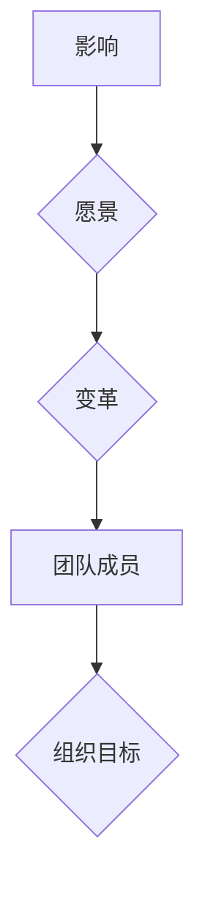

在这个流程图中，领导力通过影响团队成员，共同塑造愿景，推动组织变革，最终实现组织目标。

#### 1.2 领导力在组织中的作用

领导力在组织中的作用是至关重要的，它不仅影响着组织的绩效，还塑造着组织的文化。以下是领导力在组织中的几个关键作用：

1. **塑造文化**：领导力能够塑造组织文化，文化是组织的灵魂，决定了组织的运作方式。一个具有正直和诚信文化的组织能够吸引和留住优秀的人才，提高工作效率。

2. **激励团队**：领导力能够激发团队成员的潜力，提高他们的工作热情和创造力。通过明确的愿景和目标，领导者能够激励团队成员为实现共同目标而努力。

3. **决策制定**：领导力在决策过程中起着关键作用。领导者需要通过合理的决策来应对组织面临的各种挑战，这些决策不仅需要基于数据和分析，还需要考虑组织的长远利益。

4. **促进创新**：领导力能够推动组织的创新，创新是组织持续发展的动力。领导者需要鼓励团队成员提出新的想法和解决方案，并为他们提供支持和资源。

5. **提升绩效**：领导力能够提升组织的整体绩效。通过有效的领导和团队管理，领导者能够确保组织目标的实现，提高组织的竞争力。

为了更直观地展示领导力在组织中的作用，我们可以再次使用Mermaid流程图：

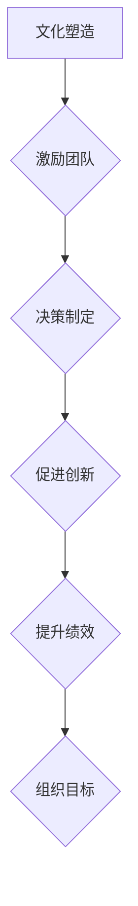

在这个流程图中，领导力通过塑造组织文化、激励团队、制定决策、促进创新和提升绩效，共同推动组织目标的实现。

#### 1.3 个人领导力的发展

个人领导力的发展是每个领导者都需要重视的课题。以下是一些关键步骤，可以帮助个人提升领导力：

1. **自我认知**：了解自己的优势和劣势，明确自己的价值观和目标。这可以通过自我反思和接受反馈来实现。

2. **持续学习**：领导力是一个不断发展的过程，领导者需要不断学习新的知识和技能，以适应不断变化的环境。

3. **培养情感智力**：情感智力是领导力的核心要素之一，它包括自我意识、自我管理、社交意识和关系管理。领导者需要通过实践和训练来提高情感智力。

4. **实践领导力**：领导力是通过实践来提升的，领导者需要在实际工作中不断尝试新的领导风格和方法，通过实践来验证和改进自己的领导能力。

5. **建立人脉**：建立广泛的人脉网络有助于领导者的成长。通过与不同背景和领域的人交流，领导者可以获取新的观点和经验，提高自己的视野。

6. **培养团队领导力**：领导者不仅需要关注个人的发展，还需要关注团队的整体绩效。通过培养团队领导力，领导者可以提升团队的整体能力和绩效。

为了更好地理解个人领导力的发展，我们可以使用以下Mermaid流程图：

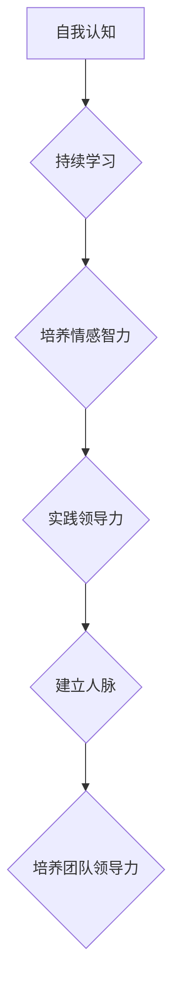

在这个流程图中，个人领导力的发展通过自我认知、持续学习、培养情感智力、实践领导力、建立人脉和培养团队领导力等多个步骤来实现。

### 第2章：领导力的核心要素

#### 2.1 自我认知与自我管理

自我认知和自我管理是领导力的核心要素之一。一个成功的领导者需要深入了解自己的性格、价值观、优势和劣势，并能够有效地管理自己的情绪和行为。

**自我认知**是指对自己有清晰的认识和理解，包括自己的性格特点、情绪状态、行为模式等。领导者需要通过自我反思、接受反馈和进行心理测试等方式来提升自我认知。

**自我管理**是指能够有效地控制自己的情绪和行为，以达到个人和组织的最佳状态。领导者需要培养自我控制的意识，避免情绪化决策，保持冷静和理性。

为了更好地理解自我认知和自我管理，我们可以使用以下Mermaid流程图：

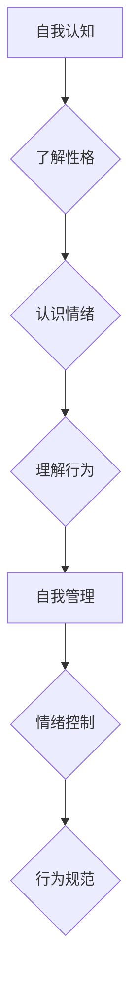

在这个流程图中，自我认知和自我管理通过了解性格、认识情绪、理解行为、情绪控制和行为规范等多个步骤来实现。

#### 2.2 情绪智力

情绪智力是指理解和管理自己及他人情绪的能力。一个成功的领导者需要具备高水平的情绪智力，以便在复杂的工作环境中有效地应对各种挑战。

**情绪智力包括以下四个方面：**

1. **自我意识**：领导者需要了解自己的情绪状态，能够识别和表达自己的情感。
2. **自我管理**：领导者需要能够控制自己的情绪，避免情绪化决策，保持冷静和理性。
3. **社交意识**：领导者需要理解和识别他人的情绪，能够有效地与他人沟通和建立关系。
4. **关系管理**：领导者需要能够处理复杂的人际关系，包括冲突解决和团队建设。

为了更好地理解情绪智力，我们可以使用以下Mermaid流程图：

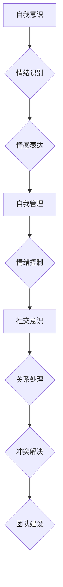

在这个流程图中，情绪智力通过自我意识、自我管理、社交意识、关系管理、冲突解决和团队建设等多个步骤来实现。

#### 2.3 沟通技巧

沟通技巧是领导者必须掌握的重要技能之一。有效的沟通不仅能够提高工作效率，还能够增强团队凝聚力，促进组织的发展。

**沟通技巧包括以下三个方面：**

1. **倾听**：倾听是有效沟通的基础，领导者需要学会倾听他人的意见和需求，以便更好地理解他们的想法和感受。
2. **表达**：表达是指能够清晰、准确地表达自己的观点和想法，领导者需要具备良好的口头和书面表达能力。
3. **反馈**：反馈是沟通的重要组成部分，领导者需要能够给予及时、有效的反馈，以帮助团队成员改进和提高。

为了更好地理解沟通技巧，我们可以使用以下Mermaid流程图：

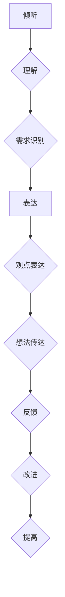

在这个流程图中，沟通技巧通过倾听、理解、需求识别、表达、观点表达、想法传达、反馈、改进和提高等多个步骤来实现。

#### 2.4 团队领导力

团队领导力是指领导者如何带领团队实现共同目标的能力。一个成功的领导者需要具备以下团队领导力要素：

1. **明确目标**：领导者需要为团队设定清晰、明确的目标，确保团队成员理解并致力于实现这些目标。
2. **激励团队**：领导者需要能够激励团队成员，提高他们的工作热情和积极性，通过激励来推动团队前进。
3. **建立信任**：领导者需要建立信任，通过诚信和透明的行为来赢得团队成员的信任和尊重。
4. **培养协作精神**：领导者需要培养团队成员之间的协作精神，通过协作来实现团队的目标。
5. **解决冲突**：领导者需要能够有效地解决团队内部的冲突，确保团队的和谐和高效运作。

为了更好地理解团队领导力，我们可以使用以下Mermaid流程图：

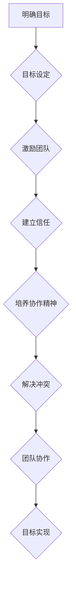

在这个流程图中，团队领导力通过明确目标、激励团队、建立信任、培养协作精神、解决冲突和团队协作等多个步骤来实现。

### 第3章：领导风格与领导艺术

#### 3.1 领导风格的类型

领导风格是指领导者在工作中表现出来的行为模式和态度。不同的领导风格适用于不同的情境和团队，以下是几种常见的领导风格：

1. **权威型领导风格**：权威型领导风格强调领导者的权力和控制，领导者做出决策并要求团队成员执行。这种风格适用于紧急情况和需要迅速行动的情境。

2. **民主型领导风格**：民主型领导风格强调参与和协作，领导者鼓励团队成员参与决策，并尊重他们的意见。这种风格适用于需要创新和团队合作的情境。

3. **参与型领导风格**：参与型领导风格强调领导者与团队成员的互动和合作，领导者鼓励团队成员参与决策和问题解决。这种风格适用于需要高度团队凝聚力和自主性的情境。

4. **变革型领导风格**：变革型领导风格强调领导者的远见和创新，领导者通过激励和启发团队成员来实现组织变革。这种风格适用于需要推动组织变革和应对挑战的情境。

为了更好地理解领导风格的类型，我们可以使用以下Mermaid流程图：

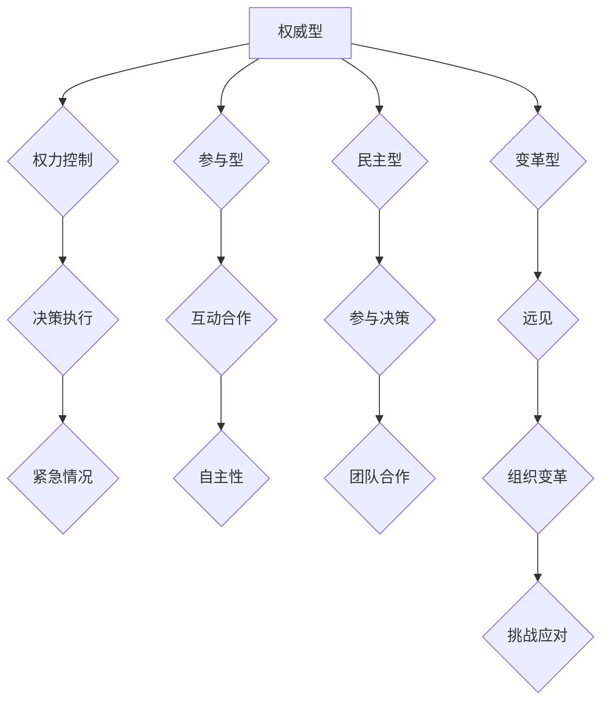

在这个流程图中，不同类型的领导风格通过权力控制、决策执行、互动合作、参与决策、远见、组织变革和挑战应对等多个方面来实现。

#### 3.2 领导艺术的应用

领导艺术是指领导者在实际工作中表现出的智慧和技巧。以下是一些领导艺术的应用场景：

1. **冲突管理**：领导者需要能够有效地管理冲突，确保团队的和谐和高效运作。这可以通过以下步骤实现：
   - **识别冲突**：通过观察和沟通，领导者需要识别出潜在的冲突。
   - **分析冲突**：领导者需要分析冲突的原因和影响，以便找到合适的解决方案。
   - **解决冲突**：领导者需要采取适当的措施来解决冲突，包括调解、妥协和冲突解决。

2. **决策制定**：领导者需要能够在复杂的环境中做出明智的决策。这可以通过以下步骤实现：
   - **定义问题**：领导者需要明确问题并定义决策的目标。
   - **收集信息**：领导者需要收集与决策相关的信息，包括数据、意见和分析。
   - **分析选项**：领导者需要分析不同的决策选项，评估其潜在的影响和风险。
   - **做出决策**：领导者需要基于分析结果做出最终决策。

3. **激励团队**：领导者需要能够激励团队成员，提高他们的工作热情和积极性。这可以通过以下步骤实现：
   - **了解团队成员的需求**：领导者需要了解团队成员的个性和需求，以便制定个性化的激励策略。
   - **设定明确的目标**：领导者需要为团队成员设定清晰、具体的目标，并确保他们了解这些目标的重要性。
   - **提供支持和资源**：领导者需要为团队成员提供实现目标所需的支持和资源。
   - **认可和奖励**：领导者需要及时认可和奖励团队成员的成就，以激励他们继续努力。

为了更好地理解领导艺术的应用，我们可以使用以下Mermaid流程图：

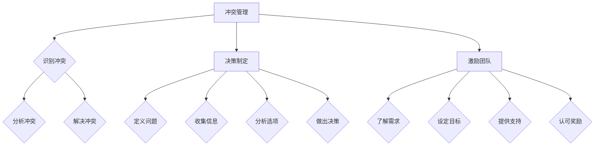

在这个流程图中，领导艺术通过识别冲突、分析冲突、解决冲突、定义问题、收集信息、分析选项、做出决策、了解需求、设定目标、提供支持和认可奖励等多个步骤来实现。

#### 3.3 领导风格与组织绩效的关系

领导风格与组织绩效之间存在密切的关系。不同的领导风格对组织绩效产生不同的影响，以下是几种领导风格与组织绩效的关系：

1. **权威型领导风格**：权威型领导风格在短期内可能提高组织绩效，因为领导者的决策迅速且明确，团队成员无需过多的讨论和协商。然而，长期来看，这种风格可能导致团队成员的积极性下降，创新能力受限。

2. **民主型领导风格**：民主型领导风格有助于提高团队成员的参与度和满意度，从而提高组织绩效。这种风格能够激发团队成员的创造力和创新精神，促进团队的协作和沟通。

3. **参与型领导风格**：参与型领导风格强调领导者与团队成员的互动和合作，有助于建立信任和凝聚力。这种风格能够提高团队成员的积极性和工作效率，从而提高组织绩效。

4. **变革型领导风格**：变革型领导风格能够推动组织的创新和变革，应对外部环境的变化和挑战。这种风格能够提高团队成员的适应能力和创新能力，从而提高组织绩效。

为了更好地理解领导风格与组织绩效的关系，我们可以使用以下Mermaid流程图：

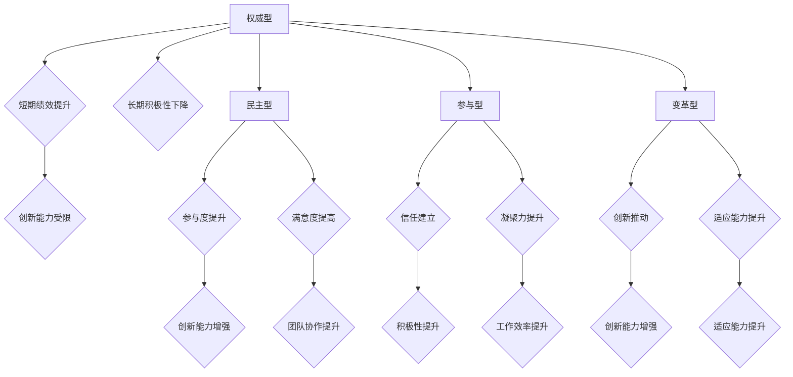

在这个流程图中，不同类型的领导风格通过短期绩效提升、长期积极性下降、创新能力受限、参与度提升、满意度提高、团队协作提升、信任建立、凝聚力提升、创新推动、适应能力提升和创新能力增强等多个方面影响组织绩效。

### 第二部分：职业道德

#### 第4章：职业道德的基本原则

职业道德是指在工作中遵循的一套道德规范和行为准则。它不仅关系到个人的声誉和职业生涯，还影响到组织的形象和可持续发展。以下是职业道德的基本原则：

1. **尊重**：尊重他人是职业道德的基础。这包括尊重他人的权利、隐私和人格。在任何工作环境中，领导者都应该树立尊重他人的榜样，促进一个和谐、包容的工作氛围。

2. **诚信**：诚信是职业道德的核心。领导者应该始终保持真实、诚实，不撒谎、不作假。诚信不仅体现在言语上，还体现在行动上，领导者应该言行一致，以身作则。

3. **公平与公正**：公平与公正是职业道德的重要原则。领导者应该确保团队成员在机会和资源分配上得到公平对待，避免偏见和不公平的行为。此外，领导者应该公正地处理冲突和问题，确保每个人都能在公正的环境中工作。

4. **责任与忠诚**：责任与忠诚是职业道德的关键要素。领导者应该对自己的工作负责，对团队成员负责，对组织负责。忠诚则体现在对组织的忠诚和对团队成员的信任上，领导者应该保护组织的利益，同时关心团队成员的成长和发展。

5. **尽责与奉献**：尽责与奉献是职业道德的体现。领导者应该对工作充满热情，尽职尽责，不断追求卓越。同时，领导者应该愿意为组织付出额外的时间和精力，以实现组织的目标。

为了更好地理解职业道德的基本原则，我们可以使用以下Mermaid流程图：

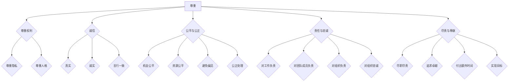

在这个流程图中，职业道德的基本原则通过尊重、诚信、公平与公正、责任与忠诚和尽责与奉献等多个方面来实现。

#### 第5章：职业道德的核心价值观

职业道德的核心价值观是指那些在职业道德体系中具有重要地位的价值观。这些价值观不仅指导个人的行为，还影响组织的文化和氛围。以下是职业道德的几个核心价值观：

1. **尊重与诚信**：尊重与诚信是职业道德的核心。尊重他人意味着尊重他人的权利、隐私和人格，不进行任何侵犯他人尊严的行为。诚信则体现在言行一致，不撒谎、不作假，始终坚守承诺。

2. **公平与公正**：公平与公正是职业道德的重要原则。公平意味着在机会和资源的分配上不偏袒，给予每个人平等的机会。公正则体现在处理冲突和问题时，不偏袒任何一方，确保每个人都能在公正的环境中工作。

3. **责任与忠诚**：责任与忠诚是职业道德的关键要素。责任意味着对工作、对团队、对组织的承诺，尽职尽责，确保工作任务的完成。忠诚则体现在对组织的忠诚，对团队成员的信任，以及保护组织的利益。

4. **尽责与奉献**：尽责与奉献是职业道德的体现。尽责意味着对工作充满热情，尽职尽责，不断追求卓越。奉献则体现在为组织付出额外的时间和精力，以实现组织的目标。

为了更好地理解职业道德的核心价值观，我们可以使用以下Mermaid流程图：

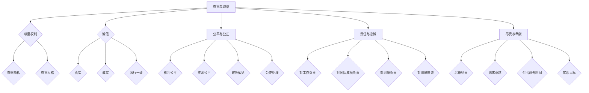

在这个流程图中，职业道德的核心价值观通过尊重与诚信、公平与公正、责任与忠诚和尽责与奉献等多个方面来实现。

#### 第6章：职业道德在实践中的应用

职业道德在实践中的应用是领导者必须面对的挑战。在实际工作中，领导者需要通过一系列具体的行动来树立正直的形象，并处理各种道德困境。以下是几个关键点：

1. **树立正直的形象**：领导者应该通过自己的行为来树立正直的形象。这包括诚实守信、言行一致、遵守公司的道德准则等。领导者的一言一行都会影响团队成员，因此，他们需要成为道德的楷模。

2. **处理道德困境**：在职业生涯中，领导者可能会遇到各种道德困境。处理这些困境的关键是理性分析，权衡各种利弊，并做出符合道德原则的决策。以下是一个处理道德困境的步骤：

   - **识别困境**：首先，领导者需要识别出工作中的道德困境，这可以通过自我反思和团队成员的反馈来实现。
   - **收集信息**：在识别出道德困境后，领导者需要收集相关的信息和数据，以更好地理解问题的本质和影响。
   - **分析选项**：基于收集到的信息，领导者需要分析各种可能的解决方案，评估其潜在的影响和风险。
   - **做出决策**：领导者需要基于分析结果做出最终决策，并确保决策过程是透明和公正的。
   - **执行决策**：在做出决策后，领导者需要确保决策得到有效执行，并跟踪决策的结果。

3. **建立道德氛围**：领导者不仅需要自己遵守职业道德，还需要在组织中建立一种道德氛围。这可以通过以下方式实现：

   - **制定道德准则**：组织可以制定明确的道德准则，明确员工在工作中应遵守的行为规范。
   - **提供培训**：组织可以提供职业道德培训，帮助员工了解职业道德的基本原则和价值观。
   - **建立反馈机制**：组织可以建立反馈机制，鼓励员工提出道德问题和建议，并确保反馈得到认真处理。
   - **树立榜样**：领导者应该成为道德的榜样，通过自己的行为来影响和激励团队成员。

为了更好地理解职业道德在实践中的应用，我们可以使用以下Mermaid流程图：

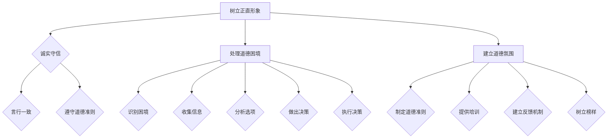

在这个流程图中，职业道德在实践中的应用通过树立正直形象、处理道德困境和建立道德氛围等多个方面来实现。

### 第三部分：正直可靠形象的塑造

#### 第7章：正直与诚信的重要性

正直与诚信是领导力的核心要素，它们不仅影响个人的职业生涯，还决定组织的长期成功。以下将探讨正直与诚信的定义、其在领导力中的作用以及与组织文化的关系。

#### 7.1 正直的定义

正直是指一个人在行为和决策中始终遵循道德原则，无论在何种情况下都不背离诚信。正直不仅仅是一种美德，更是一种行为准则，它要求个人在面对诱惑、压力和困境时，能够坚守道德底线，做出符合伦理规范的选择。

在职场中，正直表现为以下几点：

- **诚实守信**：不撒谎、不作假，对自己的言行负责。
- **言行一致**：行动与承诺相符，不说一套做一套。
- **公正无私**：在处理事务时，不偏袒任何一方，确保公正。
- **勇于承担责任**：对自己的错误和不足勇于承认和改正。

为了更好地理解正直的定义，我们可以使用以下Mermaid流程图：

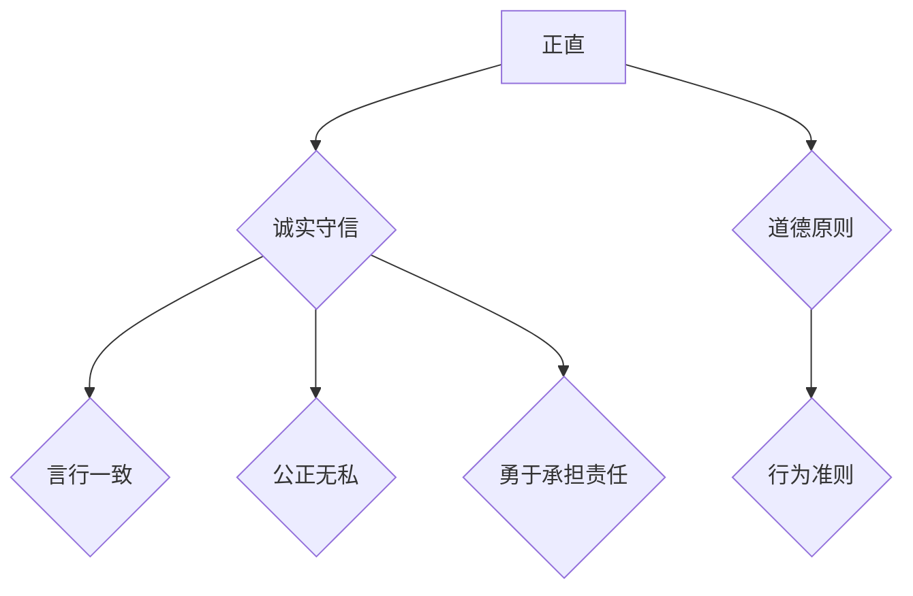

#### 7.2 诚信在领导力中的作用

诚信是领导者必须具备的品质，它对领导力的形成和发挥起着至关重要的作用。以下是诚信在领导力中的几个关键作用：

1. **建立信任**：诚信是建立信任的基础。一个诚信的领导者能够赢得团队成员的信任和尊重，这种信任是团队协作和共同前进的重要保障。

2. **激发积极性**：诚信的领导者能够激发团队成员的积极性和创造力。当团队成员相信领导者的决策是公正和透明的，他们更愿意积极参与和投入工作。

3. **塑造组织文化**：诚信的领导者能够塑造正直、透明和公正的组织文化。这种文化能够吸引和留住优秀的人才，推动组织的长期发展。

4. **提升领导力**：诚信是领导力的核心。一个诚信的领导者不仅能够赢得团队成员的信任，还能够提高自己的领导力和影响力。

为了更好地理解诚信在领导力中的作用，我们可以使用以下Mermaid流程图：

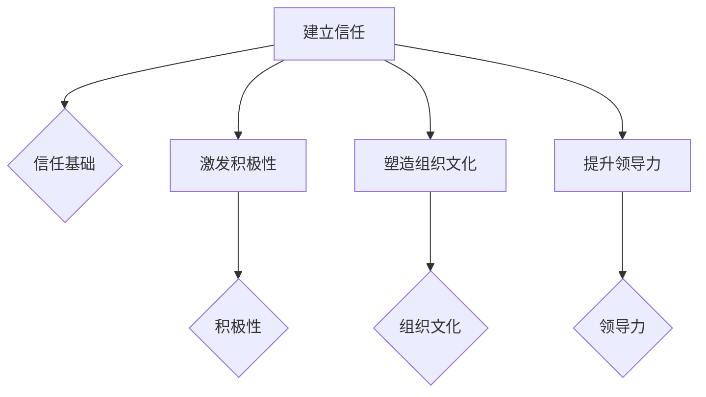

#### 7.3 正直与组织文化的关系

正直不仅仅是个人的品质，它也是组织文化的核心要素。一个正直的组织文化能够促进团队成员的道德行为，提高组织的整体绩效。

1. **促进道德行为**：正直的组织文化能够鼓励团队成员在工作和决策中遵循道德原则，减少道德风险和腐败行为。

2. **增强团队凝聚力**：正直的组织文化能够增强团队成员之间的信任和尊重，提高团队的凝聚力和协作效率。

3. **提高组织绩效**：正直的组织文化能够吸引和留住优秀的人才，提高员工的工作满意度和绩效，从而推动组织的长期发展。

为了更好地理解正直与组织文化的关系，我们可以使用以下Mermaid流程图：

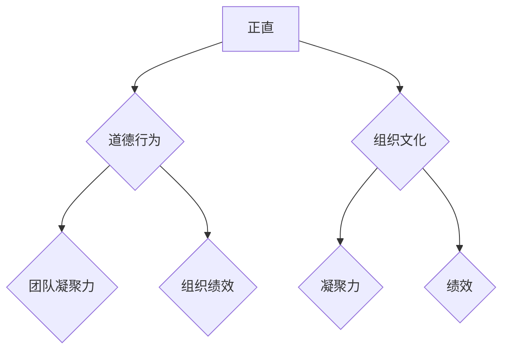

通过以上对正直与诚信的定义、作用和与组织文化的关系的讨论，我们可以看到正直与诚信在领导力和组织文化中的重要性。它们不仅是个人职业生涯的基石，也是组织长期成功的关键。

#### 第8章：如何树立正直可靠形象

树立正直可靠形象是每个领导者的重要任务。一个正直的领导者不仅能够赢得团队成员的信任，还能够塑造积极的组织文化。以下将探讨如何通过自我反思与自我提升、建立正直的行为模式和应对职业道德冲突来树立正直可靠形象。

#### 8.1 自我反思与自我提升

自我反思是树立正直可靠形象的第一步。领导者需要定期反思自己的行为和决策，识别出可能存在的道德风险和不足。以下是一些自我反思的方法：

1. **定期回顾**：领导者可以每月或每季度进行一次工作回顾，分析自己在过去一段时间内的行为和决策。这可以帮助他们识别出需要改进的领域。

2. **寻求反馈**：领导者可以主动向团队成员、同事和上级寻求反馈。通过听取不同的意见和观点，领导者可以更全面地了解自己的行为和影响。

3. **心理测试**：领导者可以参加一些专业的心理测试，如情商测试，以了解自己的性格特点和情感管理能力。这有助于他们更好地认识自己，提升自我意识。

4. **阅读和学习**：领导者可以通过阅读相关的书籍、参加研讨会和课程来提升自己的道德素养和领导力。这不仅可以增加他们的知识储备，还可以帮助他们从不同的角度看待问题。

为了更好地理解自我反思与自我提升，我们可以使用以下Mermaid流程图：

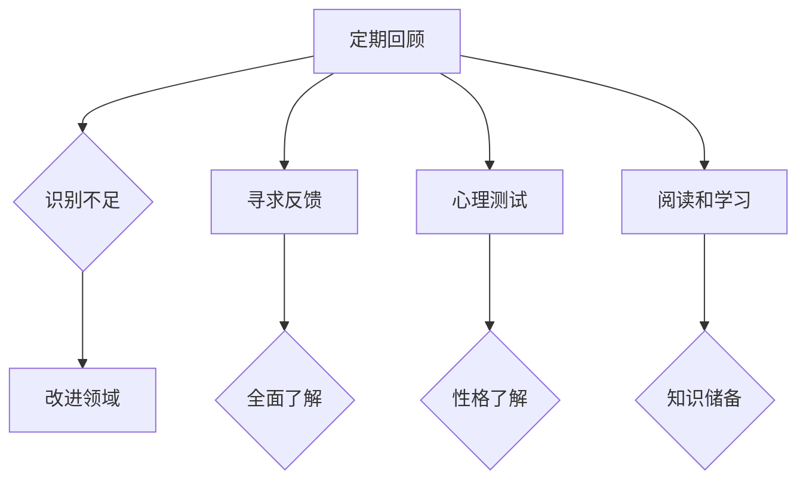

通过自我反思与自我提升，领导者可以不断提升自己的道德素养和领导力，为树立正直可靠形象打下坚实的基础。

#### 8.2 建立正直的行为模式

建立正直的行为模式是树立正直可靠形象的关键。以下是一些有助于建立正直行为模式的方法：

1. **坚持原则**：领导者需要在工作中始终坚持道德原则，无论面临多大的压力和诱惑。这包括在决策过程中保持公正、避免利益冲突、遵守法律法规等。

2. **公开透明**：领导者需要确保自己的行为和决策是公开透明的，避免任何形式的隐瞒和欺骗。这可以通过定期向团队成员报告工作进展、公开决策过程等方式来实现。

3. **以身作则**：领导者应该以身作则，通过自己的行为来树立榜样。他们需要在工作中表现出诚信、正直和责任感，以激励团队成员效仿。

4. **鼓励反馈**：领导者应该鼓励团队成员提出意见和建议，并认真对待他们的反馈。这不仅可以提高团队的工作效率，还可以增强团队成员的参与感和责任感。

为了更好地理解建立正直的行为模式，我们可以使用以下Mermaid流程图：

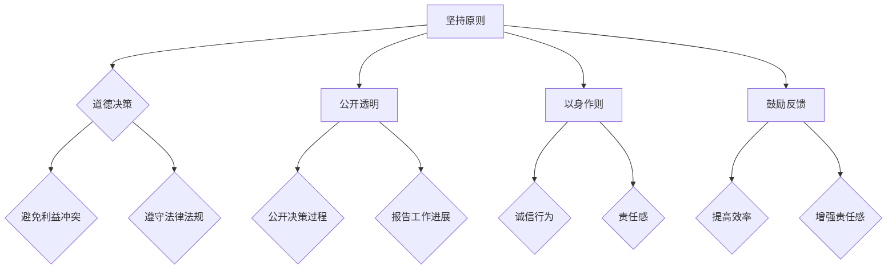

通过建立正直的行为模式，领导者可以在日常工作中树立正直可靠的形象，赢得团队成员的信任和尊重。

#### 8.3 处理职业道德冲突

在职业生涯中，领导者可能会遇到各种职业道德冲突。处理这些冲突的关键是理性分析和合理决策。以下是一些处理职业道德冲突的方法：

1. **识别冲突**：领导者需要首先识别出职业道德冲突。这可以通过自我反思、听取团队成员的反馈和观察组织的氛围来实现。

2. **分析冲突**：在识别出冲突后，领导者需要分析冲突的原因和影响。这包括理解相关方的利益、权衡各种利弊、评估冲突对组织和个人可能的后果。

3. **制定策略**：基于分析结果，领导者需要制定合适的策略来解决冲突。这可能包括调整决策、寻求妥协、提供额外的支持和资源等。

4. **执行决策**：在制定策略后，领导者需要确保决策得到有效执行。这可以通过与相关方沟通、监督执行过程和评估结果来实现。

为了更好地理解处理职业道德冲突，我们可以使用以下Mermaid流程图：

```mermaid
graph TD
A[识别冲突] --> B{自我反思}
A --> C{反馈听取}
A --> D{观察氛围}

A --> E[分析冲突]
E --> F{理解利益}
E --> G{权衡利弊}
E --> H{评估后果}

A --> I[制定策略]
I --> J{调整决策}
I --> K{寻求妥协}
I --> L{提供资源}

A --> M[执行决策]
M --> N{沟通协调}
M --> O{监督执行}
M --> P{评估结果}
```

通过以上方法，领导者可以有效地处理职业道德冲突，维护组织的道德氛围和正直形象。

#### 第9章：正直可靠形象的影响力

正直可靠形象不仅对个人职业生涯有着深远的影响，还对组织文化和社会产生广泛的作用。以下将探讨正直可靠形象对个人职业生涯、组织文化和社会的影响。

#### 9.1 对个人职业生涯的影响

正直可靠形象对个人职业生涯有着显著的正向影响。以下是几个关键方面：

1. **信任与尊重**：一个正直可靠的领导者能够赢得团队成员和上级的信任和尊重。这种信任是团队合作和共同进步的基础，有助于提升个人的职业声誉。

2. **职业发展**：正直可靠的领导者通常更容易获得晋升机会和更高的职位。这是因为他们的行为和决策得到了组织和上级的认可，被认为是一个可信赖的领导者。

3. **人际网络**：正直可靠的形象能够帮助领导者建立强大的人际网络。这不仅可以为个人的职业发展提供支持，还可以为组织带来更多的合作机会。

4. **工作满意度**：正直可靠的领导者能够创造一个积极、公正的工作环境，提高员工的工作满意度和忠诚度。这有助于降低员工流失率，提高工作效率。

为了更好地理解正直可靠形象对个人职业生涯的影响，我们可以使用以下Mermaid流程图：

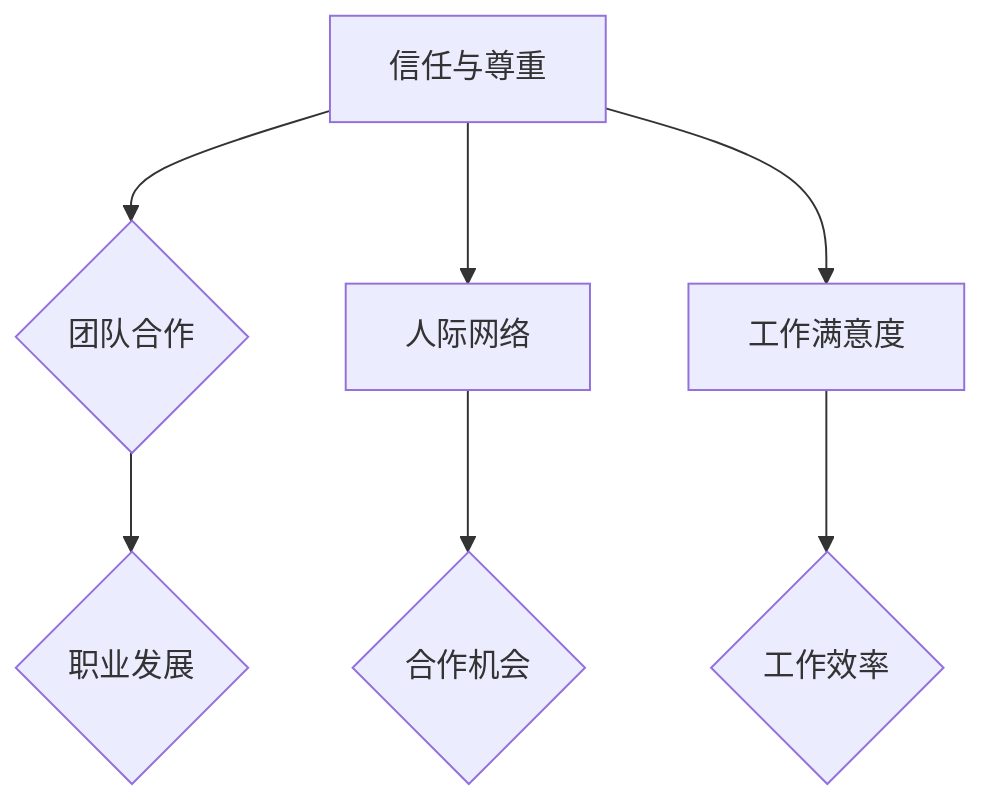

#### 9.2 对组织文化的影响

正直可靠形象对组织文化有着深远的影响。以下是几个关键方面：

1. **道德氛围**：一个正直可靠的领导者能够塑造一个道德氛围浓厚的组织文化。这种文化强调诚信、公正和责任感，有助于减少道德风险和腐败行为。

2. **团队协作**：正直可靠的领导者能够促进团队协作，提高团队的凝聚力和工作效率。团队成员更愿意在一个正直的领导者带领下工作，因为他们相信领导者的决策是公正和透明的。

3. **创新与变革**：正直可靠的领导者鼓励创新和变革，因为他们的行为和决策得到了团队成员的信任和支持。这种文化能够激发团队成员的创造力和创新精神，推动组织的持续发展。

4. **吸引人才**：正直可靠的领导者能够吸引和留住优秀的人才。一个道德氛围浓厚的组织更容易吸引有才华的员工，因为他们相信在这样的组织中能够实现个人价值和职业发展。

为了更好地理解正直可靠形象对组织文化的影响，我们可以使用以下Mermaid流程图：

```mermaid
graph TD
A[道德氛围] --> B{减少风险}
B --> C{促进协作}
A --> D[团队协作]
D --> E{提高效率}
A --> F[创新与变革]
F --> G{创造价值}
A --> H[吸引人才]
H --> I{留住人才}
```

#### 9.3 对社会的影响

正直可靠形象不仅对个人和组织有重要影响，还对社会产生积极的作用。以下是几个关键方面：

1. **企业形象**：一个正直可靠的领导者能够塑造一个良好的企业形象，提高公众对组织的认可度和信任度。这种良好的企业形象有助于组织在社会中获得更多的支持和资源。

2. **社会责任**：正直可靠的领导者更愿意承担社会责任，积极参与公益事业。这种行为不仅有助于提升组织的声誉，还可以为社会做出贡献。

3. **道德规范**：正直可靠的领导者能够推动社会的道德规范，提高公众对道德和伦理的认识。他们的行为和决策成为社会的榜样，激励更多人遵守道德规范。

4. **可持续发展**：正直可靠的领导者关注组织的长期发展，他们通过诚信和透明的行为推动组织的可持续发展。这不仅有助于提高组织的竞争力，还可以为社会创造更多的就业机会和价值。

为了更好地理解正直可靠形象对社会的影响，我们可以使用以下Mermaid流程图：

```mermaid
graph TD
A[企业形象] --> B{公众认可}
A --> C[社会责任]
C --> D{参与公益}
A --> E[道德规范]
E --> F{道德认识}
A --> G[可持续发展]
G --> H{竞争力提升}
G --> I{就业机会}
```

通过以上对正直可靠形象对个人职业生涯、组织文化和社会的影响的讨论，我们可以看到正直可靠形象在各个层面的重要性。它不仅是个人职业生涯的基石，也是组织文化和社会道德的支柱。

### 第四部分：案例分析

#### 第10章：成功树立正直可靠形象的企业案例

在企业管理中，树立正直可靠的形象对于企业的长期发展和成功至关重要。以下将探讨两个成功树立正直可靠形象的企业案例，分析其成功的原因和具体做法。

#### 10.1 案例一：公司A的道德领导

**公司背景**：公司A是一家跨国科技公司，以其创新的产品和正直的经营理念在业内享有盛誉。公司A的创始人李总一直强调道德领导的重要性，并将其作为企业文化的核心。

**成功原因**：

1. **道德领导**：李总以身作则，始终坚持道德原则，不因利益而违背道德。他通过自己的行为树立了正直可靠的榜样，赢得了员工的信任和尊重。

2. **透明管理**：公司A在管理上采用高度透明的制度，所有决策和财务状况都向员工公开。这种透明度增加了员工对公司的信任，减少了信息不对称。

3. **培训与教育**：公司A定期为员工提供职业道德培训，帮助员工理解道德原则和公司的价值观。这些培训不仅提高了员工的道德素养，也增强了公司的凝聚力。

4. **积极反馈**：公司A鼓励员工提出意见和建议，并认真对待每一份反馈。这种开放的态度不仅提高了员工的工作积极性，也促进了公司的持续改进。

**具体做法**：

- **道德准则**：公司A制定了详细的道德准则，明确员工在工作中应遵守的行为规范。这些准则不仅包括遵守法律法规，还包括诚实守信、公平公正等原则。

- **员工培训**：公司A定期组织职业道德培训，邀请外部专家和内部优秀员工分享经验和故事。这些培训不仅提高了员工的道德素养，也增强了员工的职业责任感和归属感。

- **透明决策**：公司A在重大决策过程中，会邀请员工参与讨论和投票。这种做法不仅增加了员工的参与感，也使决策更加民主和公正。

- **积极反馈**：公司A建立了反馈机制，鼓励员工在任何时候提出意见和建议。公司对每一份反馈都认真处理，并及时给予反馈。这种开放的态度使员工感到被尊重和重视。

#### 10.2 案例二：领导者B的道德困境与解决

**公司背景**：领导者B是一家中型制造企业的总经理，公司在市场扩张过程中面临了一系列道德困境。领导者B在面对这些困境时，通过理性的分析和正确的决策，成功地解决了这些难题。

**成功原因**：

1. **理性分析**：领导者B在面对道德困境时，能够冷静分析问题的本质和影响，从多个角度权衡各种利弊。

2. **公正决策**：领导者B在做出决策时，始终坚持公正原则，不偏袒任何一方。这种公正的决策赢得了员工的信任和支持。

3. **积极沟通**：领导者B在解决道德困境时，积极与团队成员沟通，听取他们的意见和建议。这种开放的态度不仅增加了团队成员的参与感，也促进了问题的解决。

4. **长期规划**：领导者B在解决道德困境时，不仅考虑短期利益，还考虑公司的长期发展。这种长远的视角有助于找到更加可持续的解决方案。

**具体做法**：

- **理性分析**：领导者B在面对道德困境时，首先会收集相关的信息和数据，进行分析。他会考虑问题的各个方面，包括道德、法律、经济等，确保决策的全面性。

- **公正决策**：领导者B在做出决策时，会听取不同意见，权衡各种利弊。他会确保决策是公正和合理的，避免因个人偏见而做出错误的决定。

- **积极沟通**：领导者B在解决道德困境时，会与团队成员进行充分的沟通。他会邀请团队成员参与讨论，听取他们的意见和建议。这种开放的态度有助于找到最佳解决方案。

- **长期规划**：领导者B在解决道德困境时，不仅考虑短期利益，还会考虑公司的长期发展。他会制定长期的规划和策略，确保公司的可持续发展。

通过以上两个成功树立正直可靠形象的企业案例，我们可以看到，道德领导和正确的决策对于企业的发展和成功至关重要。领导者需要以身作则，树立道德榜样，同时通过透明管理、培训与教育、积极反馈等方式，建立和维护正直可靠的商业文化。

### 第五部分：职业道德与领导力的实践

#### 第11章：失败案例与教训

在职业道德与领导力实践中，一些失败的案例为我们提供了宝贵的教训。以下将探讨两个失败的案例，分析其失败的原因，并提出改进建议。

#### 11.1 案例一：公司C的道德危机

**公司背景**：公司C是一家大型制造企业，曾因产品质量问题引发了一系列道德危机。公司C的领导者没有妥善处理这些危机，导致公司声誉受损，市场份额大幅下降。

**失败原因**：

1. **领导失误**：公司C的领导者没有及时识别和处理道德风险，缺乏对产品质量问题的关注和监督。

2. **信息不对称**：公司在危机爆发时，未能及时向公众和员工披露真实情况，导致信息不对称，加剧了危机的严重性。

3. **内部腐败**：公司内部存在一定程度的腐败行为，领导者未能有效遏制和纠正，导致道德风险进一步扩大。

**改进建议**：

- **加强监督**：领导者应加强对产品质量的监督和管理，确保产品符合道德和法律标准。

- **透明沟通**：在危机爆发时，领导者应立即公开透明地与公众和员工沟通，减少信息不对称，增强信任。

- **反腐机制**：建立有效的反腐机制，加强内部审计和监督，防止腐败行为的发生。

#### 11.2 案例二：领导者D的道德失误

**公司背景**：领导者D是一家中型科技公司的CEO，因个人道德问题引发了公司的信任危机。领导者D的行为严重违反了公司的道德准则，导致员工士气低落，客户流失。

**失败原因**：

1. **个人行为**：领导者D的个人行为不符合职业道德，包括不当利益输送、道德风险等。

2. **缺乏监督**：公司内部缺乏对领导者行为的有效监督，未能及时发现和纠正其不当行为。

3. **内部文化**：公司内部缺乏正直的文化氛围，员工对道德问题的重视程度不够。

**改进建议**：

- **树立榜样**：领导者应树立良好的道德榜样，以身作则，严格遵守道德准则。

- **加强监督**：建立有效的监督机制，对领导者的行为进行监督，确保其行为符合道德和法律标准。

- **培养文化**：通过培训和宣传，培养员工对道德问题的重视，建立正直的企业文化。

通过以上失败案例的分析，我们可以看到，在职业道德与领导力实践中，领导者必须树立道德榜样，加强监督和培养正直的文化氛围。只有通过这些措施，才能避免道德风险，确保企业的长期发展和成功。

### 第12章：职业道德与领导力的实践路径

在现实世界中，职业道德与领导力的实践需要具体的方法和策略。以下是几个关键步骤，可以帮助个人和组织在实践中更好地应用职业道德与领导力的原则。

#### 12.1 职业道德培训与教育

职业道德培训与教育是提升员工道德素养和领导力的重要途径。以下是一些关键点：

1. **制定培训计划**：根据组织的需求，制定系统的职业道德培训计划。这可以包括新员工入职培训、定期道德课程、领导力发展工作坊等。

2. **多样化培训形式**：采用多种培训形式，如在线课程、研讨会、案例分析、角色扮演等，以增加培训的趣味性和互动性。

3. **强化实践环节**：在培训过程中，加入实践环节，让员工在模拟环境中应用所学知识。这有助于员工更好地理解和掌握职业道德与领导力的实践方法。

4. **持续反馈与改进**：定期评估培训效果，收集员工的反馈，并根据反馈进行调整和改进。这有助于确保培训内容与实际需求相匹配。

#### 12.2 领导力发展的实践策略

领导力发展需要持续的实践和反思。以下是一些实践策略：

1. **设定明确目标**：领导者应设定明确的个人和团队目标，确保目标与组织的愿景和价值观一致。

2. **持续学习**：领导者应不断学习新的知识和技能，以适应不断变化的环境。这可以通过阅读相关书籍、参加研讨会、网络课程等方式实现。

3. **培养情感智力**：领导者应培养自己的情感智力，包括自我意识、自我管理、社交意识和关系管理。这有助于领导者更好地理解和影响团队成员。

4. **建立反馈机制**：领导者应建立有效的反馈机制，鼓励团队成员提供反馈，并认真对待每一份反馈。这有助于领导者了解自己的优点和不足，并不断改进。

5. **实践领导力**：领导者应在实际工作中应用所学的领导力技巧，通过实践来提升自己的领导力。这可以通过参与项目、解决冲突、激励团队等方式实现。

#### 12.3 职业道德与领导力整合

职业道德与领导力的整合是提升组织整体绩效的关键。以下是一些整合策略：

1. **制定明确的行为准则**：组织应制定明确的行为准则，明确员工在工作中应遵守的道德规范和价值观。

2. **建立道德文化**：组织应通过培训和宣传，建立一种道德文化，鼓励员工在工作中遵循道德原则，维护组织的声誉。

3. **强化领导力培训**：组织应将领导力培训与职业道德培训相结合，确保领导者不仅具备领导力技能，还具备高尚的道德素养。

4. **激励道德行为**：组织应制定激励政策，鼓励员工在工作中表现出高尚的道德行为。这可以通过奖金、晋升、表彰等方式实现。

5. **监督与评估**：组织应建立监督与评估机制，定期检查员工的行为是否符合道德准则，并采取必要的措施纠正不当行为。

通过以上职业道德与领导力的实践路径，个人和组织可以不断提升自身的道德素养和领导力水平，实现持续的发展和成功。

### 第13章：未来的挑战与机遇

在未来，职业道德与领导力将面临诸多挑战和机遇。以下是几个关键点：

#### 13.1 职业道德与领导力发展的趋势

1. **数字化时代**：随着数字化技术的发展，职业道德与领导力将面临新的挑战。领导者需要适应数字化工作环境，培养数字素养和创新能力。

2. **全球化的影响**：全球化使组织面临更广泛的道德和文化差异。领导者需要具备跨文化沟通和领导能力，以应对全球化带来的挑战。

3. **伦理问题的复杂性**：随着社会问题的复杂化，职业道德问题也变得更加复杂。领导者需要具备更高的道德判断力和伦理决策能力。

#### 13.2 面对未来的挑战

1. **道德风险**：随着商业环境的复杂化，领导者需要识别和管理道德风险，确保组织在道德和法律框架内运营。

2. **员工期待**：随着员工对工作环境的要求不断提高，领导者需要关注员工的需求，提供更有吸引力的发展机会和工作环境。

3. **持续学习**：在快速变化的环境中，领导者需要具备持续学习的意识，不断更新知识和技能，以适应未来的挑战。

#### 13.3 迎接新的机遇

1. **数字化转型**：数字化转型为组织带来了新的机遇，领导者可以利用数字技术提升工作效率和创新能力。

2. **社会责任**：随着社会对企业的期望不断提高，领导者可以积极承担社会责任，提升组织的品牌形象和公信力。

3. **领导力创新**：领导力创新可以为组织带来新的发展机遇。领导者可以通过探索新的领导模式和方法，推动组织的变革和进步。

通过积极应对挑战和把握机遇，领导者可以为个人和组织的发展创造更广阔的空间。在未来，职业道德与领导力将继续发挥关键作用，成为推动组织和社会进步的重要力量。

### 附录A：职业道德与领导力相关书籍推荐

以下是几本关于职业道德与领导力的经典书籍，这些书籍提供了深入的理论和实践指导，有助于读者提升道德素养和领导能力。

1. **《道德优势：如何成为更道德的人，并在职业生涯中获益》**  
   作者：诺拉·阿诺德  
   内容简介：本书通过案例研究和理论分析，阐述了职业道德如何成为企业的竞争优势。作者提出了一系列实用的道德决策框架，帮助读者在职场中做出更道德的选择。

2. **《领导力：一种实践方法》**  
   作者：约翰·麦克斯韦尔  
   内容简介：约翰·麦克斯韦尔在这本书中分享了他多年的领导经验，提出了领导力的七个层次。这本书不仅适合领导者，也适合那些希望提升领导能力的人。

3. **《道德领导力：如何在不确定的环境中做出正确的决策》**  
   作者：丹尼斯·雷纳  
   内容简介：丹尼斯·雷纳探讨了道德领导力的关键要素和实践方法。本书强调领导者需要在不确定性中保持正直，并通过道德决策塑造组织文化。

4. **《职场伦理：如何在工作中保持道德》**  
   作者：约翰·德格鲁特  
   内容简介：约翰·德格鲁特提供了关于职场伦理的理论和实践指导，帮助读者在职场中做出道德决策。这本书适合职场人士和企业管理者阅读，以提高职业道德水平。

### 附录B：职业道德与领导力常用资源

以下是一些关于职业道德与领导力的常用资源和工具，这些资源可以帮助读者深入了解相关领域的知识，提升自己的道德素养和领导能力。

1. **《职业道德国际标准》**  
   网址：[IES.org](https://www.ies.org/)  
   描述：国际伦理标准委员会提供的职业道德指南和标准，适用于全球范围内的企业。

2. **《领导力与组织行为学期刊》**  
   网址：[Sagepub.com](https://journals.sagepub.com/home/jolos)  
   描述：这是一个学术期刊，提供领导力、组织行为和职业道德领域的最新研究成果。

3. **《麻省理工学院职业道德教育项目》**  
   网址：[Ethics.mit.edu](https://ethics.mit.edu/)  
   描述：麻省理工学院提供的职业道德教育资源，包括课程、研讨会和案例研究。

4. **《哈佛商学院职业道德案例研究》**  
   网址：[Hbswk.hbs.edu](https://hbswk.hbs.edu/item/)  
   描述：哈佛商学院提供的丰富职业道德案例研究，涵盖不同行业和领域的道德挑战。

### 附录C：职业道德与领导力自测问卷

以下问卷旨在帮助您评估自己在职业道德与领导力方面的表现。请根据您的实际情况，对每个问题进行评分。完成后，您可以根据得分了解自己在这些方面的优势和不足。

1. **职业道德意识**
   - 我在工作中始终坚持诚信原则。（1分：从不，2分：偶尔，3分：经常，4分：总是）
   - 我愿意接受职业道德培训，以提升自身的道德水平。（1分：从不，2分：偶尔，3分：经常，4分：总是）
   - 在面临道德困境时，我能够理性分析和做出正确决策。（1分：从不，2分：偶尔，3分：经常，4分：总是）

2. **领导力能力**
   - 我了解并能够应用不同的领导风格。（1分：从不，2分：偶尔，3分：经常，4分：总是）
   - 我能够有效地与团队成员沟通，并促进团队合作。（1分：从不，2分：偶尔，3分：经常，4分：总是）
   - 我能够在领导过程中展现出情感智力，理解并管理团队成员的情绪。（1分：从不，2分：偶尔，3分：经常，4分：总是）

3. **正直形象塑造**
   - 我在工作中始终保持正直，即使面对利益诱惑也不违背道德原则。（1分：从不，2分：偶尔，3分：经常，4分：总是）
   - 我在组织内部树立了正直的榜样，影响着团队成员的行为。（1分：从不，2分：偶尔，3分：经常，4分：总是）
   - 我能够积极地处理职业道德冲突，维护组织的道德氛围。（1分：从不，2分：偶尔，3分：经常，4分：总是）

### 附录D：职业道德与领导力发展计划模板

以下是一个职业道德与领导力发展计划的模板，您可以根据自己的实际情况进行修改和定制，以实现个人和职业发展的目标。

#### 发展计划模板

**目标设定：**
- 明确您希望提升的职业道德和领导力领域。
- 设定具体、可衡量、可实现、相关性强、时限性的目标。

**行动步骤：**
1. **自我反思与自我提升**
   - 每周进行一次自我反思，记录在日记中。
   - 参加职业道德与领导力相关的在线课程或研讨会。
   - 阅读相关书籍，如《道德优势》、《领导力》等。

2. **沟通技巧提升**
   - 参加沟通技巧培训，学习有效沟通的方法。
   - 练习倾听和表达，提高沟通效率。
   - 与同事进行沟通技巧的反馈和交流。

3. **团队领导力培养**
   - 参与团队建设项目，如领导力发展工作坊。
   - 实践领导力技巧，如激励团队成员、解决冲突等。
   - 定期与团队成员进行一对一沟通，了解其需求和期望。

4. **正直形象塑造**
   - 在工作中坚持正直原则，保持高标准的行为。
   - 为团队成员树立正直的榜样，倡导职业道德。
   - 积极参与组织内部的职业道德讨论和活动。

**监测与评估：**
- 定期评估自己的发展进度，对照目标进行自我评估。
- 收集同事和下属的反馈，了解他们在职业道德和领导力方面的看法。
- 根据评估结果调整发展计划，确保目标的实现。

**持续学习：**
- 保持对职业道德和领导力领域的关注，了解最新的理论和实践。
- 参加行业会议、研讨会和网络研讨会，与同行交流经验。
- 保持好奇心和开放心态，不断寻求改进和学习的机会。

通过这个发展计划模板，您可以制定一个系统化的职业发展计划，明确提升职业道德和领导力的目标、行动步骤和监测方法。这将帮助您在职业道德和领导力方面持续进步，为个人和组织的发展做出贡献。

