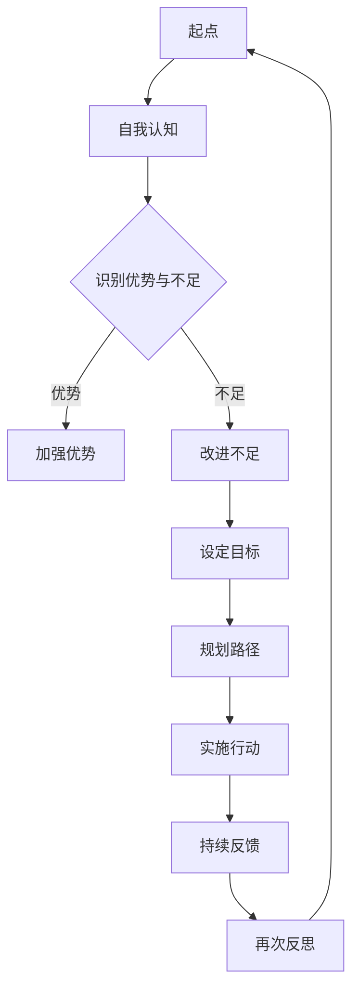

                 

# 领导力与自我反思：持续成长的秘诀

## 概述

在快速变化的技术和商业环境中，持续成长已经成为个人和组织成功的关键。领导力与自我反思在这一过程中扮演着核心角色。本文旨在探讨领导力与自我反思的概念、重要性以及它们在个人和组织持续成长中的应用。通过深入分析领导力的核心要素和发展阶段，以及自我反思的基本概念和方法，本文旨在为读者提供一套实用的策略和实践指南，帮助他们在职业和生活中不断进步。

## 关键词

- **领导力**
- **自我反思**
- **持续成长**
- **影响力**
- **目标设定**
- **团队建设**
- **沟通技巧**
- **职业生涯规划**

## 摘要

本文从领导力和自我反思的角度出发，探讨了持续成长的关键路径。首先，通过定义和解析领导力的核心要素，本文明确了领导力在个人和组织成功中的重要性。接着，文章深入分析了领导力的发展阶段，探讨了不同领导风格的影响。随后，本文介绍了自我反思的基本概念和重要性，以及如何通过自我反思实现个人成长。最后，文章提出了成长目标的设定方法、自我提升的策略与实践，并强调了领导力与自我反思的综合应用。通过本文，读者将能够更好地理解并应用这些概念，以实现自身的持续成长。

## 目录大纲

### 第一部分：领导力核心概念

### 第二部分：自我反思的重要性

### 第三部分：持续成长与自我提升

### 附录：资源与工具推荐

---

现在，让我们深入探讨领导力的核心概念，包括定义、核心要素和发展阶段。

## 第一部分：领导力核心概念

### 第1章：领导力的定义与核心要素

## 第2章：领导力的发展阶段

### 2.1 领导力发展的过程

### 2.2 不同领导风格的影响

## 第3章：自我反思的基本概念

## 第4章：自我反思的方法与技巧

## 第5章：自我成长的目标设定

## 第6章：自我提升的策略与实践

## 第7章：领导力与自我反思的综合应用

---

## 第1章：领导力的定义与核心要素

### 1.1 领导力的定义

领导力（Leadership）是引导和激励他人共同实现目标的能力。它不同于管理（Management），后者侧重于计划、组织、协调和控制资源，以确保任务的有效完成。领导力关注的是人的因素，它强调影响力、愿景和激励，而管理则更注重流程和结构。

在技术领域，领导力尤为重要。技术项目的成功往往依赖于团队成员的合作和创新，而领导力正是促进这种合作和创新的动力。领导力不仅体现在项目经理或CTO等高级职位上，也体现在每一位技术人员的日常工作中。一个优秀的程序员可能不需要直接管理他人，但他的领导力仍然可以通过他的代码质量、技术视野和对团队的影响力来体现。

### 1.2 领导力的核心要素

领导力的核心要素包括但不限于以下几个方面：

1. **影响力**：领导力本质上是一种影响力。一个有效的领导者能够通过激励、示范和沟通等方式，影响他人朝着共同目标前进。影响力不仅来自于职位和权力，更来自于个人的品格、知识和价值观。

2. **目标设定**：目标设定是领导力的关键组成部分。一个明确的愿景和目标能够帮助团队聚焦资源，制定行动计划，并激励团队成员为实现这些目标而努力。

3. **团队建设**：团队建设是领导力的另一个核心要素。一个领导者需要了解团队成员的优势和弱点，建立有效的沟通机制，促进团队合作，并确保每个人都能够在团队中发挥作用。

4. **沟通技巧**：有效的沟通是领导力的基础。领导者需要能够清晰、准确地传达信息，倾听团队成员的意见和建议，并建立互信的关系。

5. **决策能力**：领导者必须在复杂和不确定的情况下做出决策。优秀的决策能力来自于对信息的分析、对风险的评估以及对未来趋势的预判。

### 1.3 领导力的发展历史

领导力的发展可以追溯到古代哲学家和军事家。古希腊的亚里士多德和柏拉图提出了关于领导力的哲学思考，而古罗马的凯撒和亚历山大大帝则通过实际行动展示了领导力的力量。在现代社会，领导力理论得到了进一步的发展。20世纪初，行为科学运动推动了领导力研究，揭示了不同领导风格对团队绩效的影响。此后，变革型领导和情景领导理论等新兴理论不断丰富和完善了领导力理论体系。

### 1.4 领导力的核心要素

#### 1.4.1 影响力

影响力是领导力的核心。一个有效的领导者需要能够影响他人的思想和行为，以实现团队或组织的共同目标。影响力不仅来自于职位和权力，更来自于个人的品格、知识和价值观。

在技术领域，影响力可以通过以下几个方面体现：

- **技术影响力**：技术领导者通过自己的技术知识和创新思维，影响团队的技术方向和决策。
- **个人魅力**：技术领导者通过个人魅力和影响力，吸引和激励团队成员，提升团队的士气和凝聚力。
- **文化影响力**：技术领导者通过建立和推广组织文化，影响团队成员的行为和价值观。

#### 1.4.2 目标设定

目标设定是领导力的关键组成部分。一个明确的愿景和目标能够帮助团队聚焦资源，制定行动计划，并激励团队成员为实现这些目标而努力。

在技术领域，目标设定需要考虑以下几个要点：

- **技术目标**：确保团队在技术方向上保持领先，并实现关键技术的突破。
- **业务目标**：将技术目标与业务目标相结合，确保技术进步能够支持业务发展。
- **个人目标**：为团队成员设定个人目标，激励他们在技术能力和职业发展上取得进步。

#### 1.4.3 团队建设

团队建设是领导力的另一个核心要素。一个领导者需要了解团队成员的优势和弱点，建立有效的沟通机制，促进团队合作，并确保每个人都能够在团队中发挥作用。

在技术领域，团队建设需要注意以下几点：

- **技能组合**：确保团队拥有多样化的技能，以满足项目需求。
- **沟通渠道**：建立有效的沟通渠道，确保团队成员能够及时、准确地交流信息。
- **团队文化**：建立积极的团队文化，鼓励团队成员相互支持、共同成长。

#### 1.4.4 沟通技巧

有效的沟通是领导力的基础。领导者需要能够清晰、准确地传达信息，倾听团队成员的意见和建议，并建立互信的关系。

在技术领域，沟通技巧尤为重要，因为它直接影响项目的进展和质量。以下是几个关键点：

- **技术沟通**：使用清晰、简洁的语言描述技术问题和解决方案。
- **非技术沟通**：确保非技术人员能够理解技术内容，避免误解和冲突。
- **积极倾听**：倾听团队成员的意见和建议，理解他们的需求和问题。

#### 1.4.5 决策能力

领导者必须在复杂和不确定的情况下做出决策。优秀的决策能力来自于对信息的分析、对风险的评估以及对未来趋势的预判。

在技术领域，决策能力主要体现在以下几个方面：

- **技术决策**：选择合适的技术方案，解决项目中的技术难题。
- **项目管理**：分配资源、管理风险、调整计划，确保项目按期完成。
- **团队管理**：激励团队成员、解决冲突、提升团队士气。

### 1.5 领导力的发展阶段

领导力的发展可以划分为不同的阶段。每个阶段都有其特定的特点和挑战。以下是一个典型的领导力发展阶段模型：

1. **孤胆英雄阶段**：在这个阶段，领导者独自承担责任，依赖个人的能力和技术。
2. **互助团队阶段**：领导者开始意识到团队合作的重要性，鼓励团队成员相互支持。
3. **建立组织阶段**：领导者着手建立组织结构，明确角色和职责，提升团队效率。
4. **合作网络阶段**：领导者将团队视为一个整体，通过建立外部合作关系，拓展资源和影响力。
5. **系统领导阶段**：领导者具备系统思维，能够从全局角度审视问题，推动组织的整体发展。

### 1.6 不同领导风格的影响

领导风格对团队的绩效和成员的满意度有显著影响。以下是几种常见的领导风格及其特点：

1. **权威型领导风格**：领导者强调控制，决策权集中在个人手中。这种风格在紧急情况下可能有效，但长期可能导致团队缺乏自主性和创造力。
2. **民主型领导风格**：领导者鼓励团队成员参与决策，尊重团队成员的意见和建议。这种风格能够提高团队士气和工作满意度，但决策过程可能较为耗时。
3. **参与型领导风格**：领导者注重团队成员的参与和决策，鼓励他们提出自己的想法和解决方案。这种风格能够激发团队的创新和创造力，但需要领导者具备较强的沟通和协调能力。
4. **变革型领导风格**：领导者通过激励和启发，推动团队实现变革。这种风格能够带来显著的绩效提升和组织变革，但需要领导者具备强大的影响力和个人魅力。

### 结论

领导力是个人和组织成功的关键。通过明确领导力的核心要素、发展阶段和不同领导风格的影响，领导者可以更好地理解和应用领导力，促进团队的成长和组织的成功。在下一章中，我们将深入探讨自我反思的基本概念和重要性。

## 第2章：领导力的发展阶段

### 2.1 领导力发展的过程

领导力的发展是一个持续的过程，涉及从新手到专家的不同阶段。每个阶段都有其独特的挑战和收获，领导者需要不断学习和成长，以适应不断变化的环境。

#### 2.1.1 从新手到专家的领导力发展

1. **新手阶段**：在这个阶段，领导者刚刚开始承担领导职责，对领导力的理论和实践都有所了解，但缺乏实际经验。他们依赖现有的知识和技能，往往采取传统的领导方式。

2. **初步阶段**：随着经验的积累，领导者开始尝试不同的领导方法，并开始意识到领导力不仅仅是管理任务，还包括激励和引导他人。他们开始理解团队成员的需求，并尝试建立积极的团队氛围。

3. **胜任阶段**：在这个阶段，领导者已经具备一定的领导能力，能够有效地管理团队和实现目标。他们能够应对各种挑战，并保持团队的稳定和发展。

4. **精通阶段**：领导者在这个阶段达到了较高的水平，能够灵活运用各种领导技巧，并具备强大的影响力。他们不仅能够解决具体问题，还能够从全局角度审视组织的发展，推动变革和创新。

5. **专家阶段**：在这个阶段，领导者已经成为了真正的专家，他们的领导力已经达到了高度成熟的水平。他们能够指导其他领导者，并在组织内外发挥影响力。

#### 2.1.2 领导力发展的五个阶段

1. **孤胆英雄阶段**：领导者独自承担大部分责任，依赖个人的能力和技术。这个阶段的特点是领导者的独立性和决策权。

2. **互助团队阶段**：领导者开始意识到团队合作的重要性，鼓励团队成员相互支持。这个阶段的特点是团队成员之间的合作和信任。

3. **建立组织阶段**：领导者着手建立组织结构，明确角色和职责，提升团队效率。这个阶段的特点是组织结构的建立和团队规范的制定。

4. **合作网络阶段**：领导者将团队视为一个整体，通过建立外部合作关系，拓展资源和影响力。这个阶段的特点是团队与外部环境的互动和整合。

5. **系统领导阶段**：领导者具备系统思维，能够从全局角度审视问题，推动组织的整体发展。这个阶段的特点是领导者的战略视野和系统思考能力。

### 2.2 不同领导风格的影响

领导风格直接影响团队的绩效和成员的满意度。以下是几种常见的领导风格及其特点：

1. **权威型领导风格**：领导者强调控制，决策权集中在个人手中。这种风格在紧急情况下可能有效，但长期可能导致团队缺乏自主性和创造力。

2. **民主型领导风格**：领导者鼓励团队成员参与决策，尊重团队成员的意见和建议。这种风格能够提高团队士气和工作满意度，但决策过程可能较为耗时。

3. **参与型领导风格**：领导者注重团队成员的参与和决策，鼓励他们提出自己的想法和解决方案。这种风格能够激发团队的创新和创造力，但需要领导者具备较强的沟通和协调能力。

4. **变革型领导风格**：领导者通过激励和启发，推动团队实现变革。这种风格能够带来显著的绩效提升和组织变革，但需要领导者具备强大的影响力和个人魅力。

### 2.3 权威型领导风格

权威型领导风格的特点是领导者通过职位和权力来指挥和控制团队。以下是其具体表现和影响：

- **特点**：
  - 明确的权力和责任分工。
  - 领导者做出决策，团队成员执行。
  - 强调纪律和规则。

- **影响**：
  - 短期内可能提高工作效率和纪律性。
  - 长期可能导致团队缺乏自主性和创新精神。
  - 成员可能感到被压制，缺乏参与感。

### 2.4 民主型领导风格

民主型领导风格的特点是领导者鼓励团队成员参与决策，尊重团队成员的意见和建议。以下是其具体表现和影响：

- **特点**：
  - 领导者与团队成员共同讨论和决策。
  - 充分听取团队成员的意见和建议。
  - 强调团队合作和沟通。

- **影响**：
  - 提高团队士气和工作满意度。
  - 鼓励创新和创造性思维。
  - 决策过程可能较为耗时。

### 2.5 参与型领导风格

参与型领导风格的特点是领导者注重团队成员的参与和决策，鼓励他们提出自己的想法和解决方案。以下是其具体表现和影响：

- **特点**：
  - 鼓励团队成员参与项目计划和目标设定。
  - 给予团队成员决策权，让他们自主解决问题。
  - 强调团队合作和共同成长。

- **影响**：
  - 激发团队的创新和创造力。
  - 提高团队成员的参与感和责任感。
  - 需要领导者具备较强的沟通和协调能力。

### 2.6 变革型领导风格

变革型领导风格的特点是领导者通过激励和启发，推动团队实现变革。以下是其具体表现和影响：

- **特点**：
  - 激发团队成员的潜力，鼓励他们超越自我。
  - 提供愿景和目标，引导团队向更高目标努力。
  - 强调团队的精神和价值观。

- **影响**：
  - 带来显著的绩效提升和组织变革。
  - 增强团队的凝聚力和战斗力。
  - 需要领导者具备强大的影响力和个人魅力。

### 结论

领导力的发展是一个持续的过程，领导者需要在不同阶段不断学习和成长。通过理解不同领导风格的特点和影响，领导者可以更好地选择适合自己团队的领导方式，以实现团队的持续成长和组织的成功。在下一章中，我们将探讨自我反思的基本概念和重要性。

## 第3章：自我反思的基本概念

### 3.1 自我反思的定义

自我反思是一种深入思考和评估自己行为、思想和情感的过程。它不仅包括对自己外在行为的观察和分析，还涉及对内在心理状态的审视和认知。自我反思是一种重要的心理和认知活动，它帮助个体理解自己的行为模式，识别优点和不足，并制定改进计划。

在技术领域，自我反思尤为重要。技术发展迅速，知识更新频繁，技术领导者需要不断自我提升，以保持竞争力。自我反思可以帮助技术领导者识别自己的知识和技能差距，发现工作中的不足，并制定针对性的改进措施。

### 3.2 自我反思的重要性

自我反思在技术领导者的职业生涯中具有以下几个关键作用：

1. **提升自我意识**：通过自我反思，技术领导者可以更深入地了解自己的优点和不足，认识到自己的行为模式和思维习惯。这种自我意识有助于他们在职业生涯中做出更明智的决策。

2. **促进个人成长**：自我反思是一种持续学习的工具，它帮助技术领导者不断反思和改进自己的工作方式。通过自我反思，他们可以不断学习新的知识和技能，提升自己的专业能力。

3. **改进工作效果**：自我反思使技术领导者能够识别工作中的问题和挑战，并找到有效的解决方案。通过反思和改进，他们可以提高工作效率，提升项目质量和团队绩效。

4. **增强领导力**：自我反思帮助技术领导者更好地理解团队成员的需求和期望，建立有效的沟通和合作关系。这种理解有助于他们在团队中发挥更大的影响力，提升领导力。

### 3.3 自我反思与自我认识的联系

自我反思与自我认识紧密相连。自我认识是指个体对自己的了解和评价，包括个性特点、价值观、兴趣爱好、能力水平等。自我反思是一种提高自我认识的过程，它帮助技术领导者更清晰地了解自己的优势和不足，从而在职业发展中做出更明智的选择。

在技术领域，自我认识的重要性体现在以下几个方面：

1. **明确职业目标**：通过自我反思，技术领导者可以更清晰地了解自己的兴趣和优势，从而确定适合自己的职业方向和目标。

2. **提升技术能力**：自我反思帮助技术领导者识别自己在技术方面的知识和技能差距，从而有针对性地进行学习和提升。

3. **优化工作方法**：自我反思使技术领导者能够审视自己的工作方法，识别效率低下的环节，并采取有效的改进措施。

4. **建立人际关系**：通过自我反思，技术领导者可以更好地理解自己在团队中的角色和影响力，从而建立更有效的人际关系。

### 结论

自我反思是技术领导者持续成长的关键。通过自我反思，技术领导者可以提升自我意识，促进个人成长，改进工作效果，并增强领导力。在下一章中，我们将探讨自我反思的方法与技巧，帮助技术领导者更好地进行自我反思。

## 第4章：自我反思的方法与技巧

### 4.1 自我反思的步骤

自我反思是一个系统性的过程，包括以下几个关键步骤：

#### 4.1.1 自我观察

自我观察是自我反思的第一步，它要求技术领导者仔细观察自己的行为、思维和情感。以下是一些建议：

- **记录日常行为**：通过日记或日志记录每天的行为和反应，以便后续分析。
- **识别触发点**：识别导致特定行为或情绪的触发点，例如工作压力、人际关系问题等。
- **反思自己的行为**：在记录的基础上，反思自己的行为是否合理，是否符合自己的价值观和目标。

#### 4.1.2 自我分析

自我分析是对自我观察结果的深入探讨。以下是一些建议：

- **识别行为模式**：通过分析自我观察记录，识别自己反复出现的行为模式，例如过度工作、缺乏沟通等。
- **反思行为后果**：分析行为模式对工作绩效、团队关系和自我感受的影响，确定是否需要调整。
- **识别优点和不足**：在分析中识别自己的优点和不足，了解自己需要改进的方面。

#### 4.1.3 自我修正

自我修正是自我反思的关键步骤，它要求技术领导者制定并实施改进计划。以下是一些建议：

- **设定改进目标**：根据自我分析的结果，设定具体的改进目标，例如提高沟通技巧、减少工作压力等。
- **制定行动计划**：制定详细的行动计划，包括具体的行为改变和实施时间表。
- **实施和监督**：执行行动计划，并定期监督进度，确保改进措施的有效性。

### 4.2 常见的自我反思技巧

以下是一些常用的自我反思技巧，可以帮助技术领导者更有效地进行自我反思：

#### 4.2.1 日记反思

日记反思是一种简单而有效的自我反思方法。以下是一些建议：

- **定期记录**：每天或每周定期记录自己的行为、思考和感受。
- **详细描述**：在日记中详细描述事件的发生、自己的反应和感受。
- **反思和总结**：定期回顾日记，分析行为模式和影响，并总结反思结果。

#### 4.2.2 提问法

提问法是一种通过提问来引导自我反思的方法。以下是一些建议：

- **开放性问题**：提出开放性问题，如“我在这个情境中做了什么？”或“我为什么会有这样的反应？”。
- **反思问题**：在自我反思时，用这些问题来引导自己的思考，深入了解自己的行为和动机。
- **反思反馈**：将反思问题的答案记录下来，以便后续分析和改进。

#### 4.2.3 反馈法

反馈法是一种通过寻求他人反馈来进行自我反思的方法。以下是一些建议：

- **主动寻求反馈**：定期与同事、上级或导师交流，了解他们对你的工作表现和行为的看法。
- **认真倾听**：在反馈过程中，认真倾听对方的意见，不要急于辩解或反驳。
- **反思和改进**：根据反馈结果，反思自己的行为和表现，制定改进计划。

#### 4.2.4 冥想法

冥想法是一种通过冥想来进行自我反思的方法。以下是一些建议：

- **定期冥想**：每天或每周定期进行冥想，以放松心情，提高专注力。
- **专注呼吸**：在冥想中，专注于呼吸，感受呼吸的节奏和变化。
- **反思内在体验**：在冥想过程中，反思自己的内在体验和感受，了解自己的情绪和心理状态。

### 结论

自我反思是技术领导者持续成长的重要工具。通过自我观察、自我分析、自我修正等步骤，以及日记反思、提问法、反馈法和冥想等技巧，技术领导者可以更有效地进行自我反思，识别自己的优点和不足，并制定改进计划。在下一章中，我们将探讨如何设定自我成长的目标。

## 第5章：自我成长的目标设定

### 5.1 成长目标的设定方法

设定有效的成长目标对于技术领导者的持续发展至关重要。以下是几种常用的目标设定方法：

#### 5.1.1 SMART原则

SMART原则是一种常用的目标设定方法，它要求目标具有以下五个特点：

- **具体（Specific）**：目标需要明确具体，避免模糊和抽象。
- **可衡量（Measurable）**：目标需要具备可衡量的指标，以便评估进度和效果。
- **可实现（Achievable）**：目标需要是可实现的，避免设定过高或不切实际的目标。
- **相关性（Relevant）**：目标需要与个人职业发展目标和组织目标相一致。
- **时限性（Time-bound）**：目标需要设定明确的完成时间，以推动行动和进展。

例如，一个符合SMART原则的成长目标可以是：“在接下来的六个月内，我将通过参加在线课程和阅读专业书籍，提升我的AI技术知识，并在项目中应用至少三个AI算法。”

#### 5.1.2 目标分解

目标分解是将大目标分解为一系列小目标，以便更好地实施和跟踪。以下是目标分解的步骤：

1. **明确大目标**：首先明确你要实现的大目标，例如“提升我的技术领导力”。
2. **分解为大目标**：将大目标分解为若干个小目标，例如“学习项目管理知识”、“提升沟通技巧”、“增强团队管理能力”等。
3. **为每个小目标设定时间表**：为每个小目标设定明确的完成时间，例如“三个月内学习项目管理知识”。
4. **分解为具体行动**：将每个小目标进一步分解为具体的行动步骤，例如“阅读《项目管理知识体系指南》”、“参加项目管理相关的在线课程”等。

#### 5.1.3 适应变化

在设定成长目标时，需要考虑外部环境的变化和内部情况的变化。以下是适应变化的几个建议：

- **灵活调整目标**：定期评估目标，根据实际情况进行调整，以确保目标的可实现性和相关性。
- **设定备选目标**：为每个主要目标设定备选目标，以便在原定目标无法实现时，能够迅速调整并继续前进。
- **持续监控和反馈**：通过定期监控和反馈，了解目标的实现情况，及时发现问题并进行调整。

### 5.2 成长目标的调整与修正

成长目标不是一成不变的，随着时间和环境的变化，目标也需要进行调整和修正。以下是成长目标调整与修正的步骤：

1. **评估当前目标**：定期评估目标的实现情况，分析目标是否达到预期效果，是否存在偏差。
2. **识别问题**：分析目标未能实现的原因，例如时间管理不当、资源不足、外部环境变化等。
3. **制定修正方案**：根据评估结果和问题识别，制定具体的修正方案，例如调整时间表、增加资源投入、重新设定目标等。
4. **实施修正方案**：将修正方案付诸实施，确保目标的持续改进。
5. **监控修正效果**：在实施修正方案后，继续监控目标的实现情况，评估修正效果，并根据需要进一步调整。

### 结论

设定有效的成长目标是技术领导者持续成长的重要步骤。通过SMART原则和目标分解，领导者可以明确具体的成长目标，并通过适应变化和调整修正，确保目标的实现。在下一章中，我们将探讨如何通过学习和实践来提升自我。

## 第6章：自我提升的策略与实践

### 6.1 学习与发展的平衡

在快速变化的技术环境中，持续学习和自我提升是技术领导者不可或缺的能力。然而，如何平衡学习与日常工作，确保两者之间的协调发展，是一个值得探讨的问题。

#### 6.1.1 知识管理

知识管理是提升自我能力的重要手段。以下是几个关键点：

- **系统化学习**：通过制定学习计划，系统化地学习新知识和技能，避免零散学习导致的知识碎片化。
- **知识共享**：积极参与知识共享活动，如内部培训、技术讨论会等，通过与他人交流，拓宽自己的知识视野。
- **个人知识库**：建立个人知识库，记录重要的学习资料、笔记和心得体会，便于日后查阅和复习。

#### 6.1.2 终身学习

终身学习是一种持续学习、不断进步的理念。以下是实现终身学习的一些建议：

- **制定学习计划**：根据职业发展和个人兴趣，制定长期和短期的学习计划，确保学习的连续性和针对性。
- **多样化学习方式**：通过阅读书籍、参加课程、在线学习、实践项目等多种方式，丰富学习渠道和手段。
- **保持好奇心**：保持对新技术和新知识的好奇心，不断探索未知的领域，以激发学习的动力。

### 6.2 职业生涯规划

职业生涯规划是技术领导者实现自我提升的重要步骤。以下是一些关键点：

#### 6.2.1 职业目标

- **明确职业方向**：根据个人兴趣、技能和市场需求，明确自己的职业发展方向，例如技术专家、项目管理、技术领导等。
- **设定短期和长期目标**：将职业目标分解为短期和长期目标，如提升某项技术能力、完成某个项目、晋升到更高职位等。
- **制定行动计划**：为每个职业目标制定具体的行动计划，包括学习、实践和评估等环节，以确保目标的实现。

#### 6.2.2 职业发展路径

- **了解行业趋势**：通过关注行业动态和趋势，了解未来职业发展的大方向，以便及时调整自己的职业规划。
- **建立人脉网络**：积极参与行业活动，结识同行，建立广泛的人脉网络，以获取更多的职业机会和资源。
- **职业转型**：在职业发展的过程中，根据市场需求和个人兴趣，适时进行职业转型，以实现更大的职业发展空间。

### 6.3 自我反思与领导力的综合应用

自我反思不仅有助于个人成长，也是提升领导力的关键途径。以下是自我反思与领导力的综合应用策略：

#### 6.3.1 自我反思在领导实践中的应用

- **反思领导行为**：通过自我反思，审视自己的领导行为，识别成功和失败的原因，从中吸取经验教训。
- **持续改进**：根据反思结果，制定改进计划，并在实践中持续改进，提升领导力。
- **团队反思**：与团队成员一起进行反思，了解团队成员对领导行为的看法，共同改进领导实践。

#### 6.3.2 领导力在自我反思中的作用

- **提升自我认识**：通过领导实践，不断反思和评估自己的领导行为，提升自我认识，明确自己的优势和不足。
- **培养领导风格**：在自我反思中，识别适合自己的领导风格，并通过实践不断培养和强化。
- **增强领导影响力**：通过自我反思，提升领导力，增强在团队和组织中的影响力，为组织的发展贡献力量。

### 结论

自我提升是技术领导者持续成长的核心。通过平衡学习与工作，制定职业生涯规划，以及将自我反思与领导力综合应用，技术领导者可以不断提升自己的能力和影响力，为组织的成功做出更大的贡献。在下一章中，我们将探讨如何将领导力与自我反思综合应用于实际工作中。

## 第7章：领导力与自我反思的综合应用

### 7.1 自我反思在领导实践中的应用

自我反思是领导实践中不可或缺的一部分，它帮助领导者识别自己的优点和不足，从而不断改进领导行为。以下是自我反思在领导实践中的应用策略：

#### 7.1.1 反思领导行为

领导者需要定期反思自己的领导行为，包括决策过程、沟通方式、团队管理等方面。以下是一些建议：

- **记录领导行为**：在日常工作中，记录下自己的领导行为，包括成功和失败的经历。
- **分析领导行为**：分析这些行为的动机、效果和影响，了解哪些行为是有效的，哪些需要改进。
- **学习经验教训**：从成功和失败的经历中学习，提炼出可复制的经验教训，并应用到未来的领导实践中。

#### 7.1.2 建立反馈机制

建立有效的反馈机制是自我反思的重要环节。以下是一些建议：

- **定期进行360度反馈**：通过上级、同事和下属的反馈，了解自己的领导行为在他人眼中的表现。
- **建立反馈会议**：定期组织反馈会议，与团队成员共同讨论和反思领导行为，发现问题和改进方向。
- **倾听和接受反馈**：积极倾听他人的意见，接受建设性的批评，并将其作为改进领导实践的动力。

#### 7.1.3 持续学习和成长

自我反思不仅是为了发现问题，更重要的是通过反思实现持续学习和成长。以下是一些建议：

- **制定学习计划**：根据反思结果，制定个人和团队的学习计划，确保持续提升领导能力。
- **参加培训和学习活动**：积极参与领导力培训、研讨会和在线课程，不断丰富自己的知识和技能。
- **实践和应用**：将学到的知识和技能应用到实际工作中，通过实践不断提升自己的领导力。

### 7.2 领导力在自我反思中的作用

领导力在自我反思中发挥着关键作用，它不仅帮助领导者识别自己的优点和不足，还指导他们如何改进领导行为。以下是领导力在自我反思中的具体应用：

#### 7.2.1 增强自我认识

领导力有助于领导者增强自我认识，了解自己的价值观、信念和行为模式。以下是一些建议：

- **自我评估工具**：使用领导力评估工具，如领导力问卷、360度反馈等，了解自己在领导力方面的优势和不足。
- **反思日记**：定期写反思日记，记录自己的领导行为、思考和感受，深入挖掘自己的内心世界。
- **领导力教练**：寻求领导力教练的帮助，通过一对一的指导和反馈，提升自我认识。

#### 7.2.2 培养反思习惯

领导力强调持续反思和改进，这需要领导者培养反思习惯。以下是一些建议：

- **定期反思**：设定固定的反思时间，如每周或每月，对自己的领导行为进行深入反思。
- **反思会议**：组织定期的反思会议，与团队成员一起分享反思成果，促进团队的共同成长。
- **反思日志**：保持反思日志，记录反思过程和结果，以便后续回顾和总结。

#### 7.2.3 实践和应用

领导力不仅仅是理论，更需要在实践中应用。以下是一些建议：

- **反思和改进**：将反思过程中发现的问题和改进建议应用到实际工作中，通过实践检验和优化。
- **持续学习**：通过参加培训、阅读书籍、参加研讨会等方式，不断学习和更新自己的知识和技能。
- **培养团队反思文化**：推动团队建立反思文化，鼓励团队成员积极参与反思和改进，共同提升领导力。

### 结论

领导力与自我反思的综合应用是实现持续成长的关键。通过自我反思，领导者可以识别自己的优点和不足，并通过领导力指导改进领导行为。通过这种综合应用，领导者不仅可以提升个人能力，还可以促进团队的成长和组织的成功。在下一章中，我们将推荐一些有用的资源与工具，帮助读者在领导力和自我反思方面进一步提升。

## 附录：资源与工具推荐

### 附录 A：自我反思与领导力资源推荐

#### A.1 书籍推荐

1. **《领导力：如何从生活中获得智慧》**
   - 简介：通过生活故事和案例，深入探讨领导力的本质和实际应用。
   - 推荐理由：实用性强，适合不同层次的领导者。

2. **《影响力：说服与改变心理学》**
   - 简介：研究影响他人的心理学原理，适用于提升个人魅力和领导力。
   - 推荐理由：理论基础扎实，案例丰富。

3. **《高效能人士的七个习惯》**
   - 简介：提供了一套实用的自我提升策略，涵盖时间管理、人际关系等多个方面。
   - 推荐理由：经典之作，广泛适用。

#### A.2 在线资源推荐

1. **Coursera（可汗学院）**
   - 简介：提供丰富的在线课程，涵盖领导力、管理、心理学等领域。
   - 推荐理由：课程质量高，学习灵活。

2. **LinkedIn Learning**
   - 简介：提供专业技能和领导力相关的视频课程。
   - 推荐理由：内容实用，更新及时。

3. **TED Talks**
   - 简介：观看有关领导力、创新和个人成长的精彩演讲。
   - 推荐理由：启发思考，激发灵感。

#### A.3 实用工具推荐

1. **Miro**
   - 简介：在线协作工具，用于团队讨论、头脑风暴和项目管理。
   - 推荐理由：功能强大，界面友好。

2. **Asana**
   - 简介：项目管理工具，帮助团队跟踪任务进度和协作。
   - 推荐理由：易于使用，功能全面。

3. **Notion**
   - 简介：多功能的笔记和组织工具，适用于个人和组织。
   - 推荐理由：灵活性强，集成度高。

### 附录 B：领导力发展模型图解

#### B.1 领导力发展模型的Mermaid流程图

#### B.2 领导力发展模型的详细说明

- **自我认知**：领导者首先需要了解自己的优势和不足，这是提升领导力的第一步。
- **识别优势与不足**：通过自我反思和外部反馈，领导者可以更准确地识别自己的优势和不足。
- **加强优势**：通过专注于发展和提升自己的优势，领导者可以更有效地发挥个人魅力和影响力。
- **改进不足**：领导者需要采取积极的措施来改进自己的不足，这可能包括学习新技能、寻求专业指导等。
- **设定目标**：基于自我认知和反思结果，领导者需要设定清晰的个人和职业目标。
- **规划路径**：为实现目标，领导者需要制定详细的行动计划和策略。
- **实施行动**：通过实际行动，领导者将计划和策略付诸实施。
- **持续反馈**：领导者需要定期收集反馈，以评估行动的效果和调整计划。
- **再次反思**：通过持续的反思和改进，领导者可以不断提升自己的领导力。

通过这种模型，领导者可以系统性地提升自己的领导能力，实现持续成长和成功。

## 结语

领导力和自我反思是技术领导者持续成长的关键。通过深入理解领导力的核心概念和不同领导风格的影响，领导者可以更有效地激励和引导团队。自我反思则帮助领导者识别自己的优点和不足，促进个人成长和改进。在快速变化的技术环境中，领导者需要不断学习和适应，以保持竞争力。通过设定有效的成长目标、平衡学习与工作、制定职业生涯规划，以及将领导力与自我反思综合应用于实际工作中，技术领导者可以不断提升自己的能力和影响力，为组织的成功做出更大的贡献。希望本文能够为您的领导力和自我反思之旅提供有价值的启示和指导。

