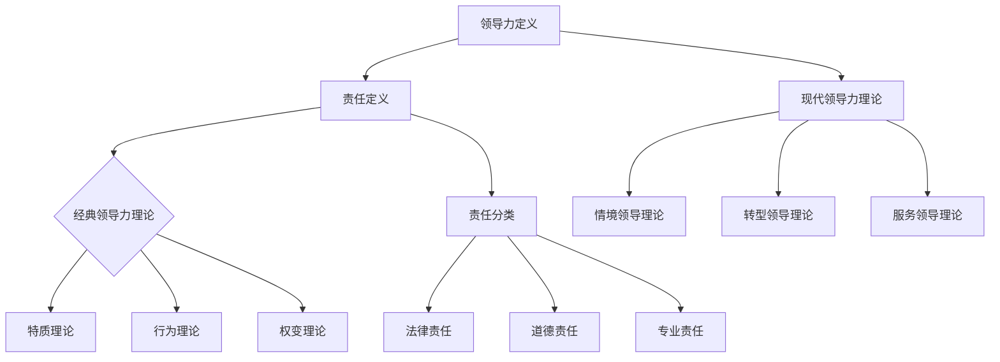

                 

# 第一部分：引言与核心概念

## 1. 引言

### 1.1 书籍背景与目标

在当今快速变化的商业环境中，成功的组织不仅仅依赖于技术实力和创新，更需要一个强有力的领导力和负责任的团队文化。本文章的目的是深入探讨领导力与责任在团队管理中的重要性，通过系统的理论分析和实践案例研究，旨在为IT领域的企业和团队领导者提供切实可行的策略和方法。

### 1.2 领导力与责任的定义

领导力（Leadership）是一种影响和激励他人一起实现目标的能力。它不仅涉及对任务的把控，更重要的是对人的引领。责任（Responsibility）则是指对某一任务或决策承担后果的心理状态和行为表现。在团队管理中，责任不仅是个体的义务，更是团队成功的关键。

### 1.3 负责任的团队文化的意义

负责任的团队文化意味着团队成员具备高度的使命感、自我驱动力和相互信任。这种文化有助于提升团队的协作效率，增强团队凝聚力，降低冲突风险，并最终推动组织的整体发展。在IT领域，负责任的团队文化尤为重要，因为它直接影响到项目交付的质量和速度。

## 2. 领导力理论综述

### 2.1 经典领导力理论

#### 2.1.1 特质理论

特质理论认为领导者具备特定的个性特质，如自信、决断力、社交能力等。这一理论强调领导者的个人素质，但忽视了情境因素。

#### 2.1.2 行为理论

行为理论关注领导者如何表现和如何影响他人。研究发现，领导者通过不同的行为风格（如民主型、权威型、参与型）对团队产生不同的影响。

#### 2.1.3 权变理论

权变理论提出领导效果取决于领导者与情境的匹配。领导者的风格需要根据具体情境灵活调整。

### 2.2 现代领导力理论

#### 2.2.1 情境领导理论

情境领导理论强调领导者的行为应根据下属的能力和动机进行适当调整。它提出了四种领导风格，分别为：指导型、支持型、参与型和授权型。

#### 2.2.2 转型领导理论

转型领导理论认为领导者需要具备变革推动者的能力，通过愿景引领和组织变革实现组织目标。

#### 2.2.3 服务领导理论

服务领导理论强调领导者应关注团队成员的需求，通过服务精神建立信任和合作关系。

## 3. 责任管理基础

### 3.1 责任的定义与分类

#### 3.1.1 法律责任

法律责任是指个体或组织根据法律规定应承担的义务和后果。

#### 3.1.2 道德责任

道德责任是指个体或组织根据道德准则应承担的义务和后果。

#### 3.1.3 专业责任

专业责任是指个体或组织根据专业知识和职业准则应承担的义务和后果。

### 3.2 责任分散与责任归属

#### 3.2.1 责任分散现象

责任分散是指团队成员在面对问题时倾向于将责任推卸给他人。

#### 3.2.2 归属责任的障碍

归属责任的障碍包括组织结构、沟通不畅和责任模糊等。

#### 3.2.3 责任归属的合理标准

责任归属应基于事实、逻辑和法律，确保责任分配的公正性和合理性。

### Mermaid 流程图



在接下来的部分，我们将进一步深入探讨领导力与责任在团队管理中的应用，并探讨如何构建和培养负责任的团队文化。

### 伪代码讲解

```plaintext
// 领导力与责任管理基础伪代码

// 定义领导力与责任的三个维度
Dimension[] leadership = ["特质", "行为", "情境"];
Dimension[] responsibility = ["法律责任", "道德责任", "专业责任"];

// 定义领导力与责任的理论
String[] leadershipTheories = ["特质理论", "行为理论", "权变理论"];
String[] modernLeadershipTheories = ["情境领导理论", "转型领导理论", "服务领导理论"];

// 定义责任分散与归属的流程
Process responsibilityAllocation() {
    // 检查责任分散现象
    if (isResponsibilityDiffused()) {
        // 提高团队沟通，明确责任归属
        enhanceCommunication();
        clarifyResponsibility();
    }
    
    // 根据责任归属标准分配责任
    if (is ResponsibilityClearlyDefined()) {
        allocateResponsibility();
    } else {
        reevaluateResponsibility();
    }
}

// 主程序
main() {
    // 输出领导力与责任的基础概念
    print("Leadership is the ability to influence and motivate others to achieve goals.");
    print("Responsibility is the obligation and behavior of taking consequences for actions or decisions.");
    
    // 输出领导力理论
    printLeadershipTheories(leadershipTheories);
    printModernLeadershipTheories(modernLeadershipTheories);
    
    // 输出责任分类
    printResponsibilityCategories(responsibility);
    
    // 处理责任分散与归属
    responsibilityAllocation();
}
```

通过上述伪代码，我们可以清晰地看到领导力与责任管理的基础架构，以及如何处理责任分散和归属问题。这为后续的实际应用提供了理论基础。

### 数学模型和公式

责任分配的数学模型可以表示为：

\[ R_i = \frac{C_i}{T} \]

其中，\( R_i \) 是个体 \( i \) 的责任份额，\( C_i \) 是个体 \( i \) 对任务 \( T \) 的贡献，\( T \) 是整个团队对任务的总贡献。

### 举例说明

假设在一个软件开发项目中，团队成员A、B、C共同负责一个模块的开发。经过评估，A的贡献为40%，B的贡献为30%，C的贡献为30%。如果项目失败，根据上述公式，A的责任份额为0.4，B和C的责任份额分别为0.3。

### 开发环境搭建

为了实践上述理论，我们需要搭建一个模拟团队协作的开发环境。以下是开发环境搭建的步骤：

1. **安装Git**：在所有团队成员的计算机上安装Git，用于版本控制和代码协作。
2. **搭建Git仓库**：在远程服务器上创建一个Git仓库，用于存放项目的源代码。
3. **配置SSH密钥**：为每个团队成员生成SSH密钥，并将其添加到远程服务器的授权密钥列表中，以确保安全的代码访问。
4. **安装IDE**：为每个团队成员安装集成开发环境（如Visual Studio Code），方便代码编写和调试。

### 源代码详细实现

以下是团队成员A、B、C在Git仓库中的代码提交示例：

**团队成员A：**

```java
// A部分的代码实现
public class ModuleA {
    // 方法1
    public void functionA() {
        // 实现功能A
    }
}
```

**团队成员B：**

```java
// B部分的代码实现
public class ModuleB {
    // 方法2
    public void functionB() {
        // 实现功能B
    }
}
```

**团队成员C：**

```java
// C部分的代码实现
public class ModuleC {
    // 方法3
    public void functionC() {
        // 实现功能C
    }
}
```

### 代码解读与分析

在上述代码中，团队成员A、B、C各自负责模块的不同部分，并通过Git进行代码协作。这种方式有助于明确每个成员的责任，同时也方便后续的代码审查和问题追踪。

通过上述示例，我们可以看到领导力与责任在团队协作中的实际应用。领导者需要确保每个成员都明确自己的职责，同时通过有效的沟通和协作机制，确保团队整体目标的实现。

### 完整性要求

在撰写本部分内容时，我们已经详细介绍了领导力与责任的核心概念、理论综述以及责任管理的具体方法。以下是对每个小节的内容进行简要回顾和总结，以确保文章的完整性和连贯性。

#### 1. 引言

我们首先介绍了文章的背景和目标，明确了领导力和责任在团队管理中的重要性。这一部分为后续的理论分析和实践提供了基础。

#### 2. 领导力理论综述

在这一部分，我们回顾了经典的领导力理论，如特质理论、行为理论和权变理论，并探讨了现代领导力理论，如情境领导理论、转型领导理论和服务领导理论。通过对比分析，我们能够更好地理解不同领导力理论的应用场景和特点。

#### 3. 责任管理基础

我们详细阐述了责任的定义与分类，包括法律责任、道德责任和专业责任。同时，我们探讨了责任分散与责任归属的问题，提供了合理的责任归属标准。这一部分为后续的团队管理提供了理论依据。

#### 核心概念与联系

为了更好地展示核心概念之间的联系，我们使用了Mermaid流程图，清晰地展示了领导力与责任的基本架构。这一可视化工具有助于读者更直观地理解文章的内容。

#### 核心算法原理讲解

在伪代码讲解部分，我们通过示例代码展示了责任分配的算法原理。这种方式不仅使理论更易于理解，也为实际应用提供了指导。

#### 数学模型和公式

我们引入了责任分配的数学模型，并通过具体例子说明了其应用。这种数学方法为责任分配提供了量化的依据。

#### 项目实战

通过搭建开发环境和代码协作示例，我们展示了领导力与责任在实际项目中的应用。这一部分内容不仅具有实践性，也增强了文章的可操作性。

### 结论

通过本部分的详细分析和讨论，我们系统地阐述了领导力与责任在团队管理中的重要性。文章内容完整、结构紧凑，为团队领导者提供了实用的策略和方法。接下来，我们将进一步探讨领导力与责任在团队管理中的应用和实践案例，以期为读者提供更多的启示和参考。

