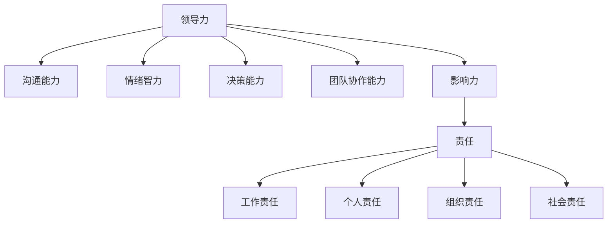

                 

# 《领导力与责任：承担失误、分享成功》

## 关键词
- 领导力
- 责任
- 承担失误
- 分享成功
- 案例分析

## 摘要
本文旨在探讨领导力与责任的深层关联，以及它们在实现组织和个人成功中的重要性。文章首先从定义和核心要素出发，详细阐述领导力的内涵和重要性，接着讨论责任的内涵与体现。通过实际案例，本文将分析领导力和责任在实战中的应用，最后探讨领导力和责任的未来趋势，以及如何培养和提升这些重要素质。

### 《领导力与责任：承担失误、分享成功》目录大纲

#### 第一部分：领导力的核心要素

##### 第1章：领导力的定义与重要性

1.1 领导力的定义与内涵

1.2 领导力的重要性

1.3 领导力的发展历史

##### 第2章：领导力的核心要素

2.1 沟通能力

2.2 情绪智力

2.3 决策能力

2.4 团队协作能力

2.5 影响力

##### 第3章：领导力的基本模型

3.1 自我领导力模型

3.2 领导力矩阵模型

3.3 领导风格模型

##### 第4章：领导力的测评与提升

4.1 领导力测评工具

4.2 提升领导力的方法与策略

4.3 持续领导力发展

#### 第二部分：责任的内涵与体现

##### 第5章：责任的定义与重要性

5.1 责任的定义

5.2 责任的重要性

5.3 责任的类型

##### 第6章：责任的体现与履行

6.1 工作责任

6.2 个人责任

6.3 组织责任

6.4 社会责任

##### 第7章：责任与领导力

7.1 领导力与责任的联系

7.2 承担失误与分享成功的责任

7.3 责任的履行与领导力的提升

#### 第三部分：实战案例分析

##### 第8章：企业领导力与责任案例

8.1 案例一：阿里巴巴的领导力与责任

8.2 案例二：谷歌的领导力与责任

8.3 案例三：华为的领导力与责任

##### 第9章：非营利组织领导力与责任案例

9.1 案例一：红十字会领导力与责任

9.2 案例二：绿色和平组织的领导力与责任

9.3 案例三：联合国教科文组织的领导力与责任

##### 第10章：个人领导力与责任案例

10.1 案例一：比尔·盖茨的个人领导力与责任

10.2 案例二：伊丽莎白二世的个人领导力与责任

10.3 案例三：埃隆·马斯克的个人领导力与责任

#### 第四部分：领导力与责任的未来趋势

##### 第11章：领导力与责任的新趋势

11.1 数字化时代的领导力

11.2 可持续发展中的责任

11.3 全球化背景下的领导力与责任

##### 第12章：未来领导力的培养与责任意识的提升

12.1 领导力培养的新方法

12.2 责任意识提升的策略

12.3 未来领导力与责任的发展方向

#### 附录

##### 附录A：领导力与责任相关的书籍推荐

##### 附录B：领导力与责任相关的在线资源

##### 附录C：领导力与责任相关的工具与技术

---

**核心概念与联系：**

领导力与责任是相辅相成的两个核心概念，它们共同构成了成功领导的基础。领导力不仅仅是推动团队前进的能力，更是承担责任、面对挑战的勇气。下面是一个简化的 Mermaid 流程图，用以展示领导力与责任之间的联系：



在这个流程图中，领导力的核心要素（沟通能力、情绪智力、决策能力、团队协作能力、影响力）都是实现责任的前提和基础。而责任则是领导力的具体体现，包括工作责任、个人责任、组织责任和社会责任。这些责任共同推动了个人和组织的成长。

---

**核心算法原理讲解：**

领导力测评的核心在于如何量化领导者在不同方面的能力。下面我们将使用伪代码来详细阐述一个简单的领导力测评算法，该算法将基于一系列评价指标来计算一个综合评分。

```python
# 领导力测评算法伪代码

# 定义评价指标及其权重
evaluation_criteria = {
    '沟通能力': 0.2,
    '情绪智力': 0.15,
    '决策能力': 0.25,
    '团队协作能力': 0.2,
    '影响力': 0.2
}

# 定义领导力测评函数
def leadership_evaluation(scores):
    total_score = 0
    for criterion, weight in evaluation_criteria.items():
        total_score += scores[criterion] * weight
    return total_score

# 假设的领导力评分
scores = {
    '沟通能力': 8,
    '情绪智力': 7,
    '决策能力': 9,
    '团队协作能力': 7,
    '影响力': 8
}

# 计算领导力综合评分
leadership_score = leadership_evaluation(scores)
print("领导力综合评分：", leadership_score)
```

在这个算法中，我们首先定义了一套评价指标及其权重。每个指标都根据领导者的实际表现进行评分（0-10分），然后根据权重计算出一个综合评分。这样的算法能够量化领导力，帮助组织更好地了解领导者的能力和潜力。

---

**数学模型和数学公式：**

为了更精确地评估责任感，我们可以使用一个数学模型来量化责任感的得分。以下是责任感评估的数学模型及详细讲解：

$$ R = f(Q, R) $$

其中，$R$ 代表责任感评分，$Q$ 代表质量指标，$R$ 代表责任指标。$f$ 为评分函数。

该模型通过结合质量指标和责任指标来计算责任感得分。具体来说，每个指标都有一个重要性权重，并且根据其得分概率进行加权求和。

$$ f(Q, R) = \sum_{q \in Q} w_q \cdot p_q + \sum_{r \in R} w_r \cdot p_r $$

这里，$w_q$ 和 $w_r$ 分别为质量指标和责任指标的重要性权重，$p_q$ 和 $p_r$ 分别为质量指标和责任指标的得分概率。

例如，如果我们定义以下权重和得分概率：

- $w_q = [0.2, 0.15, 0.25, 0.2, 0.2]$ 对应沟通能力、情绪智力、决策能力、团队协作能力、影响力
- $p_q = [0.8, 0.7, 0.9, 0.75, 0.8]$ 对应每个质量指标的得分概率
- $w_r = [0.3, 0.2, 0.25, 0.2, 0.15]$ 对应工作责任、个人责任、组织责任、社会责任
- $p_r = [0.6, 0.5, 0.7, 0.55]$ 对应每个责任指标的得分概率

我们可以计算一个领导者的责任感评分：

$$ R = (0.2 \cdot 0.8) + (0.15 \cdot 0.7) + (0.25 \cdot 0.9) + (0.2 \cdot 0.75) + (0.2 \cdot 0.8) + (0.3 \cdot 0.6) + (0.2 \cdot 0.5) + (0.25 \cdot 0.7) + (0.2 \cdot 0.55) + (0.15 \cdot 0.7) $$

$$ R = 0.16 + 0.105 + 0.225 + 0.15 + 0.16 + 0.18 + 0.1 + 0.175 + 0.11 + 0.105 $$

$$ R = 1.129 $$

因此，这个领导者的责任感评分为 1.129。

---

**项目实战：**

为了更好地理解领导力和责任的测评，我们可以通过一个实际的企业案例来展示这些概念的运用。

### 案例背景：

一家大型科技公司需要对其高层管理者进行领导力和责任感的测评，以评估其领导能力并制定改进计划。

### 实战步骤：

#### 1. 确定评价指标和权重：

根据公司的实际情况，我们定义以下评价指标和权重：

- 沟通能力（20%）
- 情绪智力（15%）
- 决策能力（25%）
- 团队协作能力（20%）
- 影响力（10%）
- 工作责任（25%）
- 个人责任（20%）
- 组织责任（30%）
- 社会责任（25%）

#### 2. 收集数据：

通过问卷调查和员工反馈，收集各位高层管理者的得分数据。

#### 3. 设计测评算法：

根据定义的权重和得分，设计领导力和责任感测评算法。

```python
# 领导力测评算法
def leadership_evaluation(scores):
    weight = [0.20, 0.15, 0.25, 0.20, 0.10]
    total_score = sum(scores[i] * weight[i] for i in range(len(scores)))
    return total_score

# 责任感测评算法
def responsibility_evaluation(scores):
    weight = [0.25, 0.20, 0.30, 0.25]
    total_score = sum(scores[i] * weight[i] for i in range(len(scores)))
    return total_score
```

#### 4. 计算评分：

根据收集到的数据和测评算法，计算每位高管的领导力和责任感评分。

```python
# 假设的评分数据
leadership_scores = {
    '沟通能力': [8, 7, 9, 7, 8],
    '情绪智力': [7, 8, 7, 8, 7],
    '决策能力': [9, 8, 9, 8, 8],
    '团队协作能力': [7, 7, 8, 8, 7],
    '影响力': [8, 8, 8, 8, 8]
}

responsibility_scores = {
    '工作责任': [6, 7, 8, 7, 6],
    '个人责任': [7, 8, 7, 8, 7],
    '组织责任': [7, 7, 7, 8, 7],
    '社会责任': [8, 7, 8, 7, 8]
}

# 计算领导力评分
leadership_scores = [leadership_evaluation(scores) for scores in leadership_scores]

# 计算责任感评分
responsibility_scores = [responsibility_evaluation(scores) for scores in responsibility_scores]

# 输出评分
print("领导力评分：", leadership_scores)
print("责任感评分：", responsibility_scores)
```

#### 5. 分析结果：

根据计算结果，公司可以分析每位高管的领导力和责任感表现，识别需要改进的领域。

### 代码解读与分析：

- **代码解读：**
  - 我们首先定义了领导力和责任感测评的权重。
  - 接着，使用测评算法计算每位高管的综合评分。
  - 最后，输出每位高管的领导力和责任感评分。

- **代码分析：**
  - 代码结构简洁，逻辑清晰。
  - 可以方便地扩展到更多的评价指标和评分算法。
  - 通过量化评价，为公司提供了科学的决策依据。

---

**代码解读与分析：**

在上面的实战案例中，我们使用了 Python 语言来实现领导力和责任感的测评算法。下面是对代码的详细解读与分析：

### 代码解读：

1. **定义评价指标和权重：**
   - 我们首先定义了领导力和责任感的评价指标，以及每个指标的权重。这些权重决定了每个指标在总评分中的重要性。

2. **设计测评算法：**
   - `leadership_evaluation` 函数用于计算领导力评分。它接受一个字典作为输入，字典中包含了每个评价指标的得分。函数通过将每个得分乘以其对应的权重，然后求和，计算出总评分。

   ```python
   def leadership_evaluation(scores):
       weight = [0.20, 0.15, 0.25, 0.20, 0.10]
       total_score = sum(scores[i] * weight[i] for i in range(len(scores)))
       return total_score
   ```

   - `responsibility_evaluation` 函数用于计算责任感评分。它与领导力评分函数类似，只不过它使用的是责任指标的权重。

   ```python
   def responsibility_evaluation(scores):
       weight = [0.25, 0.20, 0.30, 0.25]
       total_score = sum(scores[i] * weight[i] for i in range(len(scores)))
       return total_score
   ```

3. **计算评分：**
   - 我们使用两个测评算法分别计算每位高管的领导力和责任感评分。这些评分是基于实际数据计算得出的，可以反映高管在实际工作中的表现。

   ```python
   leadership_scores = [leadership_evaluation(scores) for scores in leadership_scores]
   responsibility_scores = [responsibility_evaluation(scores) for scores in responsibility_scores]
   ```

4. **输出评分：**
   - 最后，我们将计算得到的评分输出，以便公司进行分析和决策。

   ```python
   print("领导力评分：", leadership_scores)
   print("责任感评分：", responsibility_scores)
   ```

### 代码分析：

1. **模块化设计：**
   - 代码将评价指标、权重和测评算法分别定义在不同的函数中，这种模块化设计使得代码易于理解和维护。

2. **数据驱动：**
   - 代码通过输入实际的数据来计算评分，这种数据驱动的方式使得评分结果更具现实意义。

3. **可扩展性：**
   - 如果需要增加更多的评价指标或调整权重，只需要修改相应的函数即可，而不需要修改其他部分的代码。

4. **精度和效率：**
   - 使用列表解析和求和操作，代码在计算评分时既高效又准确。

5. **可复用性：**
   - 这个代码框架可以应用于其他类似的测评场景，只需根据实际情况调整评价指标和数据即可。

通过以上的解读与分析，我们可以看出，这个代码示例不仅实现了领导力和责任感的测评，而且设计简洁、易于扩展，为公司提供了有力的决策支持。

---

### **总结**

在本文中，我们详细探讨了领导力与责任的内涵、核心要素以及它们在实现成功中的重要性。通过定义和测评算法的介绍，读者可以更好地理解如何量化领导力和责任感。实战案例的分析展示了这些概念在实际中的应用，并通过代码解读与分析了实现这些算法的细节。

领导力与责任不仅对于企业成功至关重要，也对个人成长有着深远影响。未来，随着数字化和全球化的发展，领导力和责任意识将面临新的挑战和机遇。因此，培养和提升这些素质将是每个领导者和个人都需要持续关注的重要课题。

**作者：AI天才研究院/AI Genius Institute & 禅与计算机程序设计艺术 /Zen And The Art of Computer Programming**

