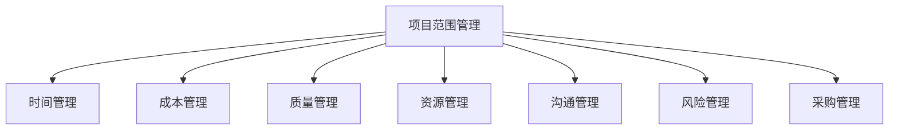
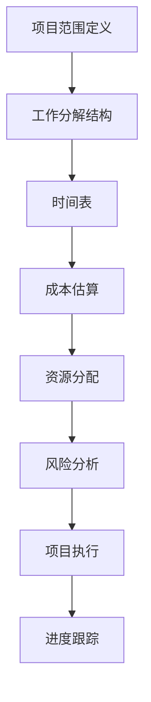
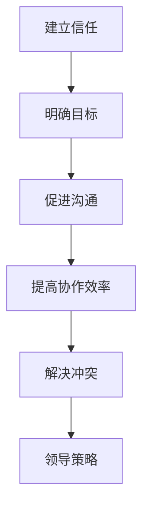
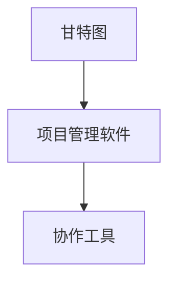
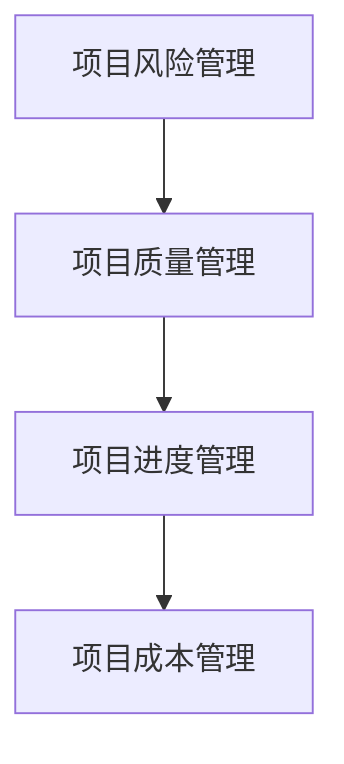

                 

### 第一部分：领导力基础

领导力，作为一种独特的技能和素质，对于任何组织或项目都至关重要。在这一部分，我们将深入探讨领导力的重要性，核心要素，以及其发展与实践，旨在为读者提供一个全面的领导力框架，帮助他们在项目管理中取得成功。

#### 第1章：领导力的重要性

领导力不仅仅是一种职位或头衔的象征，更是一种能力、一种艺术，是一种能够激励、引导和影响他人共同实现目标的特质。在项目管理中，领导力的重要性体现在以下几个方面：

- **激励团队成员**：有效的领导能够激发团队成员的潜能，使其在项目中发挥最佳水平。
- **解决冲突**：领导力可以帮助项目管理团队在面对冲突和问题时，通过有效的沟通和协商找到解决方案。
- **传递愿景**：领导力能够将项目的愿景和目标清晰传递给团队成员，使其明白项目的价值和意义，从而更加积极地投入工作。
- **建立信任**：领导力可以建立团队成员之间的信任，形成良好的团队氛围，提高团队的协作效率。

**核心概念与联系**

#### 第2章：领导力的核心要素

领导力并非一蹴而就，它需要一系列的核心要素的支持。以下是我们认为最重要的几个要素：

- **信任与诚信**：信任是领导力的基石，诚信则是信任的保障。只有建立了信任，领导才能有效地影响他人。
- **沟通与协作**：有效的沟通和协作是领导力的重要组成部分。领导需要具备清晰的表达能力和倾听能力，同时要能够促进团队成员之间的合作。
- **决策与问题解决**：领导力体现在决策和问题解决的能力上。领导需要能够在不确定性和压力下做出明智的决策，并带领团队解决问题。
- **鼓励与激励**：领导需要能够鼓励团队成员，激发其积极性和创造力。
- **自我管理**：领导力也要求领导具备良好的自我管理能力，包括时间管理、情绪管理和自我反思等。

**核心概念与联系**

#### 第3章：领导力发展与实践

领导力的发展是一个持续的过程，它需要不断地学习和实践。以下是一些领导力发展的路径和实践策略：

- **领导力发展路径**：从基础管理技能到高级领导技能，领导力的发展需要系统化的培训和实践。
- **领导力实践策略**：包括角色扮演、模拟训练、实际项目管理等。
- **领导力发展障碍与克服方法**：常见的领导力发展障碍包括缺乏自信、沟通障碍、缺乏管理经验等，可以通过培训、辅导和经验分享等方法克服。

**核心概念与联系**

#### 总结

在这一部分，我们探讨了领导力的重要性，核心要素，以及其发展与实践。领导力不仅是项目管理中不可或缺的一部分，也是任何成功组织的基石。在下一部分，我们将深入探讨项目管理的原理，帮助读者建立全面的项目管理框架。

### 第二部分：项目管理原理

项目管理是一种系统化的方法，用于规划、执行、监控和收尾项目工作，以确保项目目标的实现。在这一部分，我们将详细讨论项目管理的概述、项目计划与执行、以及项目团队管理，帮助读者构建强大的项目管理基础。

#### 第4章：项目管理概述

项目管理的核心是对项目的全面管理，包括范围、时间、成本、质量、资源、沟通、风险和采购等方面。以下是项目管理的基本概述：

- **项目的定义与特征**：项目是一种独特的活动，具有明确的开始和结束时间，特定的目标和范围。
- **项目的生命周期**：项目生命周期包括启动、规划、执行、监控和收尾五个阶段。
- **项目管理的目标**：确保项目在时间、预算和质量范围内实现预定的目标。
- **项目管理的基本原则**：包括项目范围管理、时间管理、成本管理、质量管理、资源管理、沟通管理、风险管理、采购管理。

**核心概念与联系**

#### 第5章：项目计划与执行

项目计划是项目管理的关键环节，它决定了项目能否按预期进行。以下是项目计划的制定流程和执行策略：

- **项目计划的重要性**：项目计划是项目执行的蓝图，它为项目的各个阶段提供了明确的指导。
- **项目计划的制定流程**：包括项目范围定义、工作分解结构（WBS）、时间表、成本估算、资源分配和风险分析等步骤。
- **项目执行策略**：包括任务分配、进度跟踪、资源管理、质量控制、变更控制和沟通管理等。

**核心概念与联系**

#### 第6章：项目团队管理

项目团队是项目成功的关键，有效的团队管理对于项目的顺利推进至关重要。以下是项目团队管理的关键要素：

- **项目团队的角色与职责**：明确团队中每个成员的角色和职责，确保每个成员都清楚自己的任务和目标。
- **团队建设的原则与方法**：包括建立信任、明确目标、促进沟通、提高协作效率和解决冲突等方法。
- **团队沟通与协作**：有效的沟通和协作是团队成功的关键，领导需要确保团队成员之间的信息流通和协作。
- **团队冲突解决与领导**：解决团队冲突是领导的重要职责，领导需要采取适当的策略和方法来化解冲突。

**核心概念与联系**

#### 总结

在这一部分，我们详细介绍了项目管理的原理，包括项目概述、项目计划与执行以及项目团队管理。项目管理是一个系统化的过程，需要领导者和团队成员共同努力，才能确保项目的成功。在下一部分，我们将探讨项目管理工具与技术，帮助读者更好地实施项目管理。

### 第三部分：项目管理工具与技术

项目管理工具和技术是确保项目成功的关键组成部分，它们可以帮助项目管理团队更好地规划、执行和监控项目。在这一部分，我们将深入探讨项目管理工具、项目风险管理、项目质量管理、项目进度管理和项目成本管理。

#### 第7章：项目管理工具

项目管理工具是用于支持项目管理的各种软件和硬件，它们可以帮助团队更高效地完成项目任务。以下是常用的项目管理工具：

- **甘特图**：甘特图是一种直观的时间管理工具，用于显示项目任务的开始和结束时间，以及它们之间的依赖关系。
- **项目管理软件**：如Microsoft Project、Asana、Trello、JIRA等，这些软件提供了丰富的功能，包括任务分配、进度跟踪、资源管理、报告生成等。
- **协作工具**：如Slack、Microsoft Teams、Google Workspace等，这些工具可以帮助团队成员更好地沟通和协作。

**核心概念与联系**

#### 第8章：项目管理技术

项目管理技术是用于管理和控制项目的各种方法和工具，它们可以帮助项目团队更有效地执行项目任务。以下是几个关键的项目管理技术：

- **项目风险管理**：项目风险管理是识别、评估和应对项目风险的过程。它包括风险识别、风险评估、风险应对计划和风险监控等步骤。
- **项目质量管理**：项目质量管理是确保项目成果满足预期质量标准的过程。它包括质量规划、质量保证、质量控制和质量改进等步骤。
- **项目进度管理**：项目进度管理是确保项目按时完成的过程。它包括进度规划、进度监控、进度报告和进度控制等步骤。
- **项目成本管理**：项目成本管理是确保项目在预算范围内完成的过程。它包括成本估算、成本预算、成本控制、成本分析和成本报告等步骤。

**核心概念与联系**

#### 总结

在这一部分，我们探讨了项目管理工具和技术的关键组成部分，包括项目管理工具、项目风险管理、项目质量管理、项目进度管理和项目成本管理。这些工具和技术可以帮助项目团队更高效地执行项目任务，确保项目的成功。在下一部分，我们将通过实际案例来展示领导力与项目管理的实际应用。

### 第四部分：领导力与项目管理实战

在上一部分，我们详细介绍了领导力和项目管理的理论框架。然而，理论知识只有在实践中得到应用和验证，才能真正发挥其价值。在本部分，我们将通过实际案例来展示领导力与项目管理的实际应用，帮助读者理解如何在真实环境中运用这些理论，确保项目成功。

#### 第9章：领导力与项目管理的实际应用

**实际案例介绍**

为了更好地展示领导力与项目管理的实际应用，我们将通过一个实际案例来进行分析。假设我们是一家大型软件公司的项目经理，负责开发一款新的客户关系管理（CRM）系统。该项目具有以下特点：

- 时间敏感：客户要求在三个月内交付一个基本可用的版本。
- 需求复杂：客户提出了许多详细的功能需求，同时期望系统能够具有良好的扩展性和可维护性。
- 团队多样：项目团队由多个不同背景的成员组成，包括开发人员、测试人员、设计师和产品经理。

**领导力与项目管理在实际项目中的应用**

1. **建立信任与明确愿景**

在项目开始时，项目经理需要与团队成员建立信任，并向他们明确项目的愿景和目标。这可以通过定期的团队会议、一对一交流以及透明的沟通渠道来实现。项目经理需要确保团队成员理解项目的价值和意义，以及他们在项目中的角色和责任。

2. **项目计划与执行**

项目经理需要制定详细的项目计划，包括任务分解、时间表、资源分配和风险管理计划。在项目执行过程中，项目经理需要监控项目的进度，确保任务按时完成，并及时调整计划以应对可能的风险。例如，如果某个关键任务延迟，项目经理需要重新评估资源分配和时间表，以最小化对整体项目进度的影响。

3. **团队沟通与协作**

项目团队成员之间的有效沟通和协作对于项目的成功至关重要。项目经理需要确保团队成员之间有畅通的沟通渠道，并鼓励他们分享想法和问题。例如，可以使用协作工具如Slack或Microsoft Teams来促进团队沟通。项目经理还需要定期组织团队会议，确保每个成员都清楚项目的最新进展和任务分配。

4. **冲突解决与领导**

在项目过程中，团队成员可能会出现冲突。项目经理需要采取适当的策略来解决问题，确保团队保持积极和协作的氛围。例如，如果两个团队成员之间存在意见分歧，项目经理可以组织一次调解会议，帮助双方找到共同点并解决问题。

**项目成功的关键因素**

1. **明确的目标和愿景**：项目成功的前提是明确的目标和愿景，这有助于团队成员理解项目的价值和方向。

2. **有效的沟通和协作**：项目成功的另一个关键因素是团队成员之间的有效沟通和协作。这需要项目经理建立一个畅通的沟通渠道和协作机制。

3. **灵活的计划和执行**：在项目执行过程中，可能会出现各种不可预见的情况。项目经理需要具备灵活的计划和执行能力，以应对这些变化。

4. **有效的风险管理**：项目风险管理是确保项目成功的关键。项目经理需要识别潜在的风险，并制定应对计划，以最小化风险对项目的影响。

#### 总结

通过这个实际案例，我们可以看到领导力和项目管理在项目成功中的关键作用。领导力帮助项目经理建立团队信任，明确项目愿景，促进沟通和协作，解决冲突，而项目管理则确保项目在时间、成本和质量范围内实现目标。在下一部分，我们将探讨领导力与项目管理的未来趋势，帮助读者了解这一领域的发展方向。

### 第10章：领导力与项目管理的未来趋势

随着技术的不断进步和全球化的加速，领导力和项目管理领域也在不断演变。在未来，我们可以预见以下几个趋势将对领导力和项目管理产生深远影响。

#### 项目管理的发展方向

1. **数字化转型**：数字化转型正在改变项目的管理和执行方式。利用先进的技术，如人工智能、大数据分析和云计算，项目团队可以更有效地进行需求分析、资源分配和进度跟踪。
2. **敏捷项目管理**：敏捷方法强调快速迭代和客户反馈，更加灵活和适应性。未来，越来越多的项目将采用敏捷方法，以提高项目响应能力和客户满意度。
3. **可持续项目管理**：随着全球对可持续发展的重视，项目管理和执行也将更加注重环保和社会责任。项目团队需要考虑项目的环境影响，并制定可持续的解决方案。

#### 领导力的未来发展

1. **人性化管理**：未来的领导力将更加注重人性化和情感管理。领导需要关注团队成员的情感和心理健康，提供支持和激励，以促进团队的整体表现。
2. **跨文化领导**：随着全球化的深入，领导者需要具备跨文化沟通和合作能力。了解不同文化背景的团队成员，并建立有效的沟通机制，将是一个重要的领导技能。
3. **自我领导**：未来的领导力将更加注重自我领导和发展。领导者需要不断学习和成长，培养自我管理能力和领导力，以应对不断变化的环境和挑战。

#### 领导力与项目管理融合的挑战与机遇

1. **挑战**：
   - **技能需求增加**：随着技术的进步和项目复杂性的增加，领导者需要不断学习和更新技能，以应对新的挑战。
   - **团队多样性**：多样性的团队带来了丰富的知识和观点，但也可能导致沟通和协作的困难。领导者需要学会如何在多样性环境中建立有效的团队。
   - **快速变化的环境**：全球化和数字化带来了快速变化的环境，领导者需要具备快速适应和应对变化的能力。

2. **机遇**：
   - **创新和效率提升**：领导力和项目管理融合可以促进创新和效率提升。通过有效的领导和项目管理，项目团队能够更好地实现项目目标，并提高整体绩效。
   - **跨领域合作**：领导力和项目管理融合可以帮助不同领域的团队更好地合作，实现跨领域的创新和突破。
   - **人才发展**：领导力和项目管理融合有助于培养和发展未来的领导者，为组织提供持续的人才储备。

#### 总结

领导力与项目管理的融合将在未来带来巨大的机遇，同时也伴随着挑战。领导者需要不断学习和适应，以应对快速变化的环境和复杂的项目需求。通过有效的领导和项目管理，项目团队能够实现更高的效率和绩效，为组织的持续成功贡献力量。

### 附录

#### 附录A：项目管理资源与工具推荐

A.1 **常用的项目管理网站与资源**

- **Project Management Institute (PMI)**: https://www.pmi.org/
- **Agile Alliance**: https://www.agilealliance.org/
- **Atlassian**: https://www.atlassian.com/

A.2 **项目管理工具使用指南**

- **Microsoft Project**: https://www.microsoft.com/en-us/microsoft-365/project/project-management-software
- **Asana**: https://asana.com/
- **Trello**: https://trello.com/

A.3 **领导力发展资源与培训课程**

- **Coursera**: https://www.coursera.org/specializations/project-management
- **edX**: https://www.edx.org/course/lean-entrepreneurship-0
- **LinkedIn Learning**: https://www.linkedin.com/learning/topics/project-management

#### 附录B：参考文献

B.1 **相关书籍推荐**

- **《项目管理知识体系指南》（PMBOK指南）**：项目管理协会（PMI）
- **《敏捷项目管理：原则、模式与实践》**：Johann Rost
- **《领导力的五项修炼》**：斯蒂芬·R·罗宾斯

B.2 **学术论文推荐**

- **"The Agile Project Management Framework: A Practical Guide to Implementing Agile Methods for Your Projects"**: T. Latham et al.
- **"Project Management Maturity Model (PMM)"**: R. M. Weitzel et al.

B.3 **网络资源推荐**

- **PMI官方网站**: https://www.pmi.org/
- **Agile Alliance官方网站**: https://www.agilealliance.org/
- **谷歌学术搜索**: https://scholar.google.com/

### 作者信息

**作者：**AI天才研究院/AI Genius Institute & 禅与计算机程序设计艺术/Zen And The Art of Computer Programming

**版权声明：**本文版权归AI天才研究院所有，未经授权禁止转载。如有需要，请联系作者获取授权。

