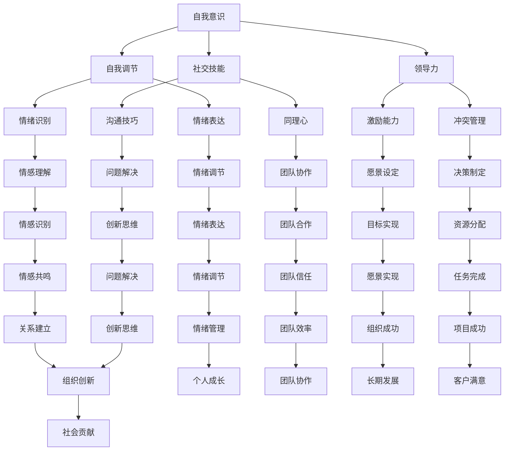

                 

### 引言：领导者的情商的重要性

在当今快速变化和竞争激烈的商业环境中，领导者不仅需要具备卓越的技术和管理能力，还需要具备强大的情商（Emotional Intelligence，简称EQ）。情商是指个体识别、理解、管理和利用自己的情绪以及识别、理解和影响他人情绪的能力。与传统的智商（Intelligence Quotient，简称IQ）不同，情商更多地关注个体的情感管理和社会技能，这些技能对于领导者的成功至关重要。

### 关键词：
- 领导者
- 情商
- 情感管理
- 社会技能
- 领导力

### 摘要：

本文将探讨情商在领导者角色中的重要性，分析情商的结构和类型，讨论情绪管理的重要性，并提出提升情商的策略。文章还将深入探讨情商在领导力中的应用，包括领导者情绪管理的挑战、情商领导力模型以及情商在团队管理中的应用。通过实际案例和代码解析，我们将展示情商提升项目的实施方法和效果评估，最终总结情商领导力的发展和实践。

### 目录大纲：

1. **第一部分：情商的本质与重要性**
    1. 第1章：情商的概念与结构
    2. 第2章：情绪的类型与影响
    3. 第3章：情绪管理的重要性
2. **第二部分：情商在领导力中的应用**
    1. 第4章：提升情商的策略
    2. 第5章：领导者情绪管理
    3. 第6章：情商领导力模型
    4. 第7章：情商在团队管理中的应用
    5. 第8章：情商领导力发展
    6. 第9章：情商领导力实践案例
3. **附录**
    1. 附录A：情商测评工具与方法
    2. 附录B：推荐阅读与参考资源

### 第一节：情商的概念与结构

情商，又称情感智力，是近年来在心理学和管理学领域备受关注的一个概念。传统的智商主要衡量个体的认知能力和逻辑推理能力，而情商则更多地关注个体的情感管理能力和社会交往能力。情商的定义和结构在不同的研究和理论中有所不同，但大多数研究者认为情商主要由四个核心维度构成：自我意识、自我调节、社交技能和领导力。

#### 1.1 情商的定义

情商可以定义为个体识别、理解、管理和利用自己情绪以及识别、理解和影响他人情绪的能力。情商不仅仅关注个体的情感状态，还包括如何有效地表达和管理情感，以及如何利用情感来提高决策能力和人际交往能力。

#### 1.2 情商的结构

根据戈尔曼（Daniel Goleman）等人的研究，情商主要包括以下四个维度：

1. **自我意识（Self-awareness）**：这是情商的基础，指的是个体对自己的情感状态有清晰的认识和理解。自我意识包括对情感产生的敏锐感知、对情感背后原因的理解以及对情感反应的认识。

2. **自我调节（Self-regulation）**：自我调节是指个体控制自己的情绪反应，以及在不适当的情绪下进行调整和转换的能力。这种能力帮助个体在面对压力和挑战时保持冷静和专注，从而做出更理性的决策。

3. **社交技能（Social skills）**：社交技能是指个体在社交互动中的表现，包括建立和维护人际关系的能力、有效的沟通技巧、同理心和冲突解决能力。良好的社交技能有助于个体在社会环境中获得支持和资源。

4. **领导力（Leadership）**：领导力是情商的高级表现形式，涉及如何激发和激励他人，以及如何创建和支持一个积极的工作环境。情商高的领导者能够更好地理解团队成员的情感需求，从而促进团队协作和创造力。

#### 1.3 情商的重要性

情商对于领导者的成功至关重要，原因如下：

1. **团队协作**：情商高的领导者能够更好地理解和满足团队成员的情感需求，从而促进团队合作和沟通，提高团队的整体绩效。

2. **决策能力**：自我调节能力使领导者能够在面对压力和不确定性时保持冷静，做出更合理和明智的决策。

3. **情感领导力**：情商高的领导者能够通过情感影响和激励他人，培养积极的团队文化和价值观。

4. **人际交往**：良好的社交技能使领导者能够有效地与他人沟通和建立关系，从而在职场中获得更多的支持和资源。

### 第二节：情绪的类型与影响

情绪是人类心理体验的重要组成部分，可以分为多种类型，包括正面情绪和负面情绪。每种情绪都有其独特的特征和影响，对个体和团队的表现产生深远的影响。

#### 2.1 情绪的种类

1. **正面情绪**：正面情绪包括喜悦、快乐、满足、感激等，这些情绪通常与积极的情感体验相关。正面情绪能够提高个体的幸福感和生活满意度，增强个体的创造力和解决问题的能力。

2. **负面情绪**：负面情绪包括愤怒、焦虑、悲伤、恐惧等，这些情绪通常与压力和挑战相关。负面情绪可能会影响个体的情绪状态，降低工作表现，甚至导致心理健康问题。

3. **复杂情绪**：一些情绪可能是多种基本情绪的混合，如兴奋（喜悦+焦虑）、悲伤（愤怒+悲伤）等。复杂情绪的识别和管理对于情商的提升至关重要。

#### 2.2 情绪对个体的影响

情绪对个体的身心健康和表现有着重要的影响：

1. **心理健康**：长期的情绪压力可能导致心理健康问题，如焦虑症、抑郁症等。

2. **工作表现**：情绪状态直接影响个体的工作表现。积极情绪可以提高工作效率和创造力，而负面情绪则可能导致工作失误和效率下降。

3. **决策能力**：情绪对个体的决策过程有显著影响。情绪状态良好时，个体能够做出更合理和明智的决策，而情绪状态不佳时，个体可能更容易受到情绪偏见的影响。

#### 2.3 情绪对团队的影响

情绪不仅影响个体，也对团队的整体表现产生重要影响：

1. **团队氛围**：正面情绪可以营造积极的团队氛围，提高团队凝聚力和合作效率。负面情绪则可能破坏团队氛围，导致冲突和低效率。

2. **沟通效果**：情绪状态良好的个体更容易进行有效沟通，理解和接受他人的观点。而情绪状态不佳的个体则可能产生沟通障碍，影响团队协作。

3. **工作绩效**：团队的情绪状态对整体工作绩效有直接影响。一个情绪稳定的团队通常能够更高效地完成任务，而情绪不稳定的团队则可能面临更多挑战。

### 第三节：情绪管理的重要性

情绪管理是指个体对自身情绪进行识别、理解和调节的过程，它是情商的核心组成部分。有效的情绪管理对于提升个体和团队的表现至关重要。

#### 3.1 情绪管理的概念

情绪管理包括以下几个方面：

1. **情绪识别**：情绪识别是指个体能够准确感知和理解自己的情绪状态，包括情绪的种类、强度和发生的时间。

2. **情绪理解**：情绪理解是指个体能够理解情绪产生的原因和背景，以及情绪对自己和他人的影响。

3. **情绪调节**：情绪调节是指个体在面对负面情绪时，能够采取有效策略进行情绪管理和调节，从而保持积极和理性的情绪状态。

#### 3.2 情绪管理的目的

情绪管理的目的主要包括以下几个方面：

1. **提升心理健康**：有效的情绪管理有助于减轻负面情绪的影响，提高个体的心理健康水平。

2. **提高工作表现**：情绪管理有助于个体在面对压力和挑战时保持冷静和专注，从而提高工作效率和绩效。

3. **改善人际关系**：情绪管理有助于个体更好地理解和沟通他人的情绪，建立和谐的人际关系。

#### 3.3 情绪管理的重要性

情绪管理的重要性体现在以下几个方面：

1. **领导者的角色**：领导者作为团队的引导者，情绪管理对于其成功至关重要。领导者通过有效的情绪管理，可以营造积极的团队氛围，提高团队凝聚力和工作效率。

2. **组织文化**：情绪管理对于组织文化的建设具有重要意义。一个具有高度情绪管理能力的团队，通常能够形成积极向上的组织文化，促进组织的发展和成长。

3. **社会影响**：情绪管理不仅对个人和组织有影响，还对整个社会产生深远的影响。一个情绪稳定的个体和团队，能够更好地适应社会环境，促进社会的和谐与进步。

### 第四节：提升情商的策略

提升情商是领导者持续成长的重要任务。以下是一些具体的策略和方法，可以帮助领导者提升情商，从而更好地应对职场挑战。

#### 4.1 自我意识

自我意识是情商的基础，提升自我意识可以从以下几个方面入手：

1. **反思**：定期反思自己的情绪和行为，思考情绪背后的原因和影响。
2. **情绪日记**：记录自己的情绪变化，包括情绪的类型、发生的时间和情境，以及情绪反应的后果。
3. **心理辅导**：寻求专业的心理辅导，帮助自己更好地理解和管理情绪。

#### 4.2 自我调节

自我调节是情商的核心，提升自我调节能力可以从以下几个方面入手：

1. **情绪控制**：学会控制情绪反应，避免情绪失控对工作和生活造成负面影响。
2. **冥想**：通过冥想等方法，帮助自己放松身心，减轻压力和焦虑。
3. **情绪调节技巧**：学习并实践情绪调节技巧，如深呼吸、正念练习等，帮助自己在面对负面情绪时保持冷静和理性。

#### 4.3 社交技能

社交技能是情商的重要组成部分，提升社交技能可以从以下几个方面入手：

1. **倾听**：学会倾听他人的意见和感受，建立良好的沟通渠道。
2. **同理心**：培养同理心，理解他人的情绪和需求，建立和谐的人际关系。
3. **冲突解决**：学会有效解决冲突，避免冲突对团队和工作产生负面影响。

#### 4.4 领导力

领导力是情商的高级表现形式，提升领导力可以从以下几个方面入手：

1. **激励**：学会激励团队成员，激发他们的积极性和创造力。
2. **团队建设**：通过团队建设活动，增强团队成员之间的信任和协作。
3. **愿景**：明确团队愿景和目标，带领团队共同实现目标。

### 总结

情商是领导者成功的重要保障，它不仅影响个体和团队的表现，还对组织的整体发展产生深远的影响。提升情商需要领导者从自我意识、自我调节、社交技能和领导力等多个方面入手，持续学习和实践。通过有效的情绪管理，领导者可以更好地应对职场挑战，建立和谐的人际关系，推动组织的发展和成长。

### 第五节：领导者情绪管理的挑战

领导者情绪管理是一项复杂的任务，面临着诸多挑战。这些挑战不仅源于领导者个人的情绪特点，也受到外部环境和团队动态的影响。

#### 5.1 情绪压力

领导者的职位通常伴随着较高的责任和压力。他们需要处理复杂的决策、应对市场变化、管理团队冲突，以及维持组织稳定。这些压力源可能导致领导者情绪波动，影响其情绪管理能力。

#### 5.2 情绪传染

领导者是团队的核心，其情绪状态往往对团队成员产生直接影响。负面情绪如焦虑、愤怒或沮丧可能迅速在团队中传播，破坏团队氛围和工作效率。

#### 5.3 情绪表达的限制

在某些文化或组织环境中，情绪表达可能受到限制。领导者可能被期望保持冷静和专业，这可能导致他们无法自由地表达情绪，进而影响情绪调节能力。

#### 5.4 多重角色的平衡

领导者通常需要平衡多个角色，如领导者、团队成员、家庭成员等。这种角色冲突可能导致情绪管理变得复杂，增加情绪失控的风险。

#### 5.5 面对不确定性

在快速变化的商业环境中，领导者经常面临不确定性。这种不确定性可能导致焦虑和恐慌，影响情绪稳定性和决策能力。

#### 5.6 情绪管理的期望

组织和社会对领导者有较高的情绪管理期望。领导者需要展示出自信、冷静和决断力，这可能导致他们在面对挑战时感到额外的压力。

### 解决策略

针对上述挑战，领导者可以采取以下策略来提升情绪管理能力：

1. **自我意识提升**：通过反思和自我觉察，领导者可以更好地了解自己的情绪状态和触发因素。

2. **情绪调节训练**：领导者可以通过冥想、呼吸练习和正念等技巧来调节情绪，减轻压力。

3. **建立支持网络**：领导者可以寻求专业辅导或与信任的同事分享感受，获得情感支持。

4. **积极沟通**：领导者应学会积极沟通，清晰表达自己的情绪和需求，避免误解和冲突。

5. **设定界限**：领导者需要学会设定个人和工作界限，避免角色冲突对情绪的影响。

6. **建立应急计划**：领导者可以制定应对不确定性和紧急情况的计划，提高情绪稳定性。

### 结论

领导者情绪管理面临着诸多挑战，但通过有效的策略和实践，领导者可以提升情绪管理能力，从而更好地应对职场压力，建立积极的工作氛围，推动组织的发展。

### 第六节：情商领导力模型

情商领导力模型是理解和评估领导者情商的关键工具。这种模型可以帮助领导者识别自己的情商水平，找到提升的方向，并制定个性化的发展计划。

#### 6.1 情商领导力的定义

情商领导力是指领导者通过情商维度（自我意识、自我调节、社交技能和领导力）来影响和激励团队成员，实现团队目标和组织愿景的能力。情商领导力不仅关注领导者的个人素质，还强调领导者如何通过情商来管理团队和推动组织发展。

#### 6.2 情商领导力模型

一个典型的情商领导力模型包括以下核心要素：

1. **自我意识**：领导者能够识别和理解自己的情绪状态，包括情绪的种类、强度和发生情境。

2. **自我调节**：领导者能够有效地管理和调节自己的情绪反应，保持冷静和专注，即使在压力和挑战面前也能保持理性。

3. **社交技能**：领导者具备良好的社交技能，能够建立和维护积极的人际关系，有效沟通和协调团队工作。

4. **同理心**：领导者能够设身处地地理解团队成员的情感和需求，提供支持和鼓励。

5. **激励能力**：领导者能够激发和激励团队成员，激发他们的潜能和创造力，实现团队目标。

6. **冲突管理**：领导者能够有效地解决团队冲突，通过建设性的对话和解决方案，维护团队和谐。

7. **情绪传染**：领导者能够积极传播正能量，营造积极的团队氛围，增强团队凝聚力。

#### 6.3 情商领导力模型的应用

情商领导力模型的应用可以分为以下几个步骤：

1. **自我评估**：领导者可以通过自我反思和情商测试，评估自己的情商水平，识别自己在情商维度上的优势和不足。

2. **目标设定**：根据自我评估结果，领导者可以设定提升情商的目标，明确需要改进的方面。

3. **发展计划**：领导者可以制定个性化的发展计划，包括参加培训、寻求辅导、实践新的情绪管理技巧等。

4. **持续监控**：领导者需要定期评估自己的进步，调整发展计划，确保情商提升的持续性和有效性。

5. **团队应用**：领导者可以将情商领导力模型应用于团队管理，通过建立同理心、激励能力和冲突管理，提高团队的整体情商水平。

#### 案例分析

某科技公司的高管团队在实施情商领导力模型后，取得了显著成效。通过自我评估，他们发现自己在自我调节和同理心方面存在明显不足。于是，他们制定了以下发展计划：

1. **自我调节**：高管团队开始定期练习冥想和正念技巧，以减轻压力和焦虑，提高情绪稳定性。

2. **同理心**：他们通过角色扮演和情景模拟，提高同理心，更好地理解和支持团队成员。

3. **培训**：高管团队参加了情商领导力培训，学习新的情绪管理技巧和领导力策略。

4. **团队反馈**：他们定期收集团队成员的反馈，了解自己在情商领导力方面的表现，并不断调整和改进。

通过这些措施，该科技公司的管理层在自我调节和同理心方面取得了显著进步。团队氛围更加积极，协作效率提高，员工满意度上升，整体绩效显著提升。

#### 结论

情商领导力模型为领导者提供了一个全面的框架，帮助其提升情商，改善领导风格，提高团队绩效。通过自我评估、目标设定和发展计划，领导者可以不断优化自己的情商水平，实现个人和组织的共同发展。

### 第七节：情商在团队管理中的应用

情商在团队管理中的应用至关重要，它不仅能够提高团队的整体绩效，还能增强团队的凝聚力和创新能力。以下是情商在团队管理中的几个关键应用领域。

#### 7.1 情商在团队建设中的应用

团队建设是一个持续的过程，情商在其中扮演着关键角色。情商高的领导者能够更好地理解团队成员的情感和需求，从而设计出更有效的团队建设活动。

1. **同理心**：领导者通过同理心，能够更好地理解团队成员的感受和需求，从而在团队建设活动中提供更有针对性的支持。

2. **沟通**：情商高的领导者具备良好的沟通能力，能够促进团队成员之间的有效沟通，增强团队凝聚力。

3. **冲突解决**：领导者能够有效解决团队内部的冲突，避免负面情绪的积累，保持团队的和谐。

#### 7.2 情商在团队冲突解决中的应用

团队冲突是不可避免的，但如何有效地解决冲突是团队管理的重要一环。情商在此过程中发挥着关键作用。

1. **情绪管理**：情商高的领导者能够管理自己的情绪，避免在冲突中做出冲动的决策，从而保持冷静和理性。

2. **同理心**：领导者通过同理心，能够理解冲突各方的情感和立场，从而找到更公正和合理的解决方案。

3. **建设性对话**：领导者通过建设性的对话，引导团队成员表达自己的观点和情感，从而找到共同点，解决冲突。

#### 7.3 情商在团队沟通中的应用

沟通是团队协作的基础，情商在沟通中的应用能够显著提高沟通的效果和团队的整体绩效。

1. **倾听**：情商高的领导者能够认真倾听团队成员的意见和反馈，从而更好地理解他们的需求和期望。

2. **清晰表达**：领导者能够清晰、准确地表达自己的观点和决策，避免误解和冲突。

3. **反馈**：领导者能够给予团队成员及时的反馈，鼓励他们改进和提高，同时保持积极的工作氛围。

#### 案例分析

某高科技公司的团队在引入情商管理后，团队绩效显著提升。以下是他们的具体实践：

1. **团队建设**：公司组织了多次团队建设活动，如团建拓展训练、团队讨论会和团队建设游戏等。这些活动不仅增强了团队成员之间的信任，还提高了团队的凝聚力。

2. **冲突解决**：当团队出现冲突时，领导层会召开专门的会议，邀请相关成员共同参与，通过同理心和建设性对话，找到解决问题的方法。这种做法有效地减少了冲突对团队的影响。

3. **沟通提升**：公司实施了定期团队沟通会议，鼓励团队成员积极发言，表达自己的看法和疑问。同时，领导层也会在会议中给予及时的反馈和指导，确保团队成员之间的沟通更加顺畅。

通过这些实践，该公司的团队氛围更加积极，协作效率提高，员工满意度上升，整体绩效显著提升。

### 结论

情商在团队管理中的应用对于提升团队绩效和凝聚力具有重要作用。领导者通过提升自己的情商，能够更好地理解和管理团队成员的情绪，促进团队协作和创新能力。通过具体的实践案例，我们可以看到情商在团队管理中的显著成效，这为其他组织提供了宝贵的参考和借鉴。

### 第八节：情商领导力的发展

情商领导力的发展是一个持续的过程，需要领导者不断地学习和实践。以下是一些具体的策略，可以帮助领导者提升情商领导力，从而在职场中取得更大的成功。

#### 8.1 情商领导力的培养

1. **自我反思**：领导者需要定期进行自我反思，识别自己的情绪反应和情感状态，从而更好地理解和控制自己的情绪。

2. **情感教育**：参加情商培训课程，学习情感识别、情感调节和社交技能等方面的知识，提升自己的情商水平。

3. **角色模型**：寻找成功的情商领导者作为榜样，学习他们的领导风格和情感管理技巧，借鉴其经验。

4. **情感支持**：建立个人情感支持网络，与信任的朋友、同事或导师分享情感体验，获得情感支持和建议。

#### 8.2 情商领导力的发展策略

1. **持续学习**：领导者应持续关注情商领导力的发展，通过阅读书籍、参加研讨会和在线课程等方式，不断更新知识和技能。

2. **实践应用**：将学到的情商领导力技巧应用于实际工作中，通过实践不断检验和完善自己的领导力。

3. **反馈与改进**：定期收集团队成员的反馈，了解自己在情商领导力方面的表现，并根据反馈进行改进。

4. **情景模拟**：通过角色扮演和情景模拟，模拟各种领导场景，练习情绪管理和决策能力。

#### 8.3 情商领导力评估与提升

1. **自我评估**：领导者可以使用情商评估工具，如梅耶-沙洛维-卡罗尔情商测试（MSCEIT），了解自己的情商水平和弱点。

2. **360度评估**：通过360度评估，收集团队成员、同事和上级对领导者情商领导力的评价，获得全面的反馈。

3. **制定发展计划**：根据评估结果，制定个性化的情商领导力发展计划，明确目标和发展路径。

4. **持续跟踪**：定期跟踪评估进展，确保发展计划的实施效果，并根据需要调整策略。

### 案例分析

某公司的CEO张先生意识到情商领导力对团队和公司发展的重要性，于是采取了以下措施来提升自己的情商领导力：

1. **自我反思**：张先生每天花时间反思自己的情绪反应和领导行为，记录在日记中，以识别和改进自己的情绪管理。

2. **情感教育**：他参加了多个情商领导力培训课程，学习情感识别、调节和沟通技巧。

3. **角色模型**：张先生研究了几位成功的情商领导者，学习他们的领导风格和决策过程，将其应用到自己的工作中。

4. **反馈与改进**：张先生定期与团队成员和同事进行一对一的反馈会议，收集他们对他的领导风格的评价，并根据反馈进行改进。

通过这些措施，张先生在情商领导力方面取得了显著进步。他的团队更加积极和合作，公司整体绩效也有了明显提升。

### 结论

情商领导力的发展是一个持续的过程，需要领导者不断学习和实践。通过自我反思、情感教育、实践应用和反馈改进，领导者可以逐步提升自己的情商领导力，从而在职场中取得更大的成功。

### 第九节：情商领导力实践案例

为了更好地理解情商领导力在实践中的应用，我们通过以下几个案例来展示情商领导力如何帮助领导者应对挑战，推动团队和组织的发展。

#### 案例一：高科技公司CEO的领导力转型

某高科技公司的CEO李女士意识到，尽管公司技术实力雄厚，但团队内部的合作和沟通存在明显问题。她决定通过提升自己的情商领导力来改善团队氛围。

1. **自我意识提升**：李女士开始记录自己的情绪日志，通过自我反思，她认识到自己在面对团队冲突时的情绪反应过于激烈。

2. **情绪调节训练**：李女士参加了情商领导力培训，学习了情绪调节技巧，如深呼吸和正念冥想。

3. **同理心培养**：李女士通过角色扮演和情景模拟，提升了自己对团队成员情感的理解和同理心。

4. **团队建设**：李女士组织了一系列团队建设活动，如团队拓展训练和团队讨论会，增强团队成员之间的信任和合作。

结果：通过这些措施，公司团队的合作效率显著提高，员工之间的沟通更加顺畅，整体绩效有了显著提升。

#### 案例二：零售连锁店总经理的情绪管理

某零售连锁店的总经理王先生发现，由于工作压力和市场竞争的加剧，团队士气低落，员工流失率上升。他决定通过情商领导力来提升团队士气。

1. **情绪识别**：王先生开始与团队成员进行一对一的谈话，了解他们的情绪状态和需求。

2. **积极沟通**：王先生通过积极沟通，鼓励员工表达自己的观点和感受，建立良好的沟通渠道。

3. **激励能力提升**：王先生学习了激励理论，通过设定合理的目标和奖励机制，激发员工的积极性和创造力。

4. **冲突解决**：王先生通过同理心和建设性对话，有效解决了团队内部的冲突，维护了团队和谐。

结果：团队士气显著提升，员工流失率下降，公司的销售业绩也有了明显增长。

#### 案例三：初创公司创始人的情绪调节

某初创公司的创始人陈先生在创业初期面临着巨大的压力和挑战。他意识到，只有通过提升自己的情绪调节能力，才能更好地带领团队走向成功。

1. **自我调节训练**：陈先生通过冥想和正念练习，学会了如何在压力下保持冷静和专注。

2. **情感支持**：陈先生建立了个人情感支持网络，与创业导师和同事分享自己的情感体验，获得情感支持和建议。

3. **团队激励**：陈先生通过设定愿景和目标，激励团队成员，共同面对挑战。

4. **灵活应对**：陈先生学会了灵活应对市场变化，调整公司策略，以适应不断变化的环境。

结果：通过这些措施，公司成功度过了初创期的困境，逐步发展壮大。

#### 结论

这些案例展示了情商领导力在实践中的多样性和有效性。通过提升自我意识、情绪调节、同理心和激励能力，领导者可以更好地应对职场挑战，推动团队和组织的发展。这些实践案例为其他领导者提供了宝贵的经验和启示，证明了情商领导力在实现长期成功中的关键作用。

### 附录A：情商测评工具与方法

#### A.1 情商测评工具介绍

情商测评工具是评估个体情商水平的重要手段。以下介绍两种常用的情商测评工具：梅耶-沙洛维-卡罗尔情商测试（MSCEIT）和多因素情感问卷（MEQ-I）。

1. **梅耶-沙洛维-卡罗尔情商测试（MSCEIT）**

MSCEIT是由彼得·萨洛维（Peter Salovey）和约翰·梅耶（John D. Mayer）开发的一种标准化情商测试工具，被认为是评估情商的有效方法。MSCEIT包括四个主要领域：自我意识、自我调节、社交技能和情绪理解。

- **自我意识**：评估个体对自身情绪的感知和识别能力。
- **自我调节**：评估个体管理和调节情绪反应的能力。
- **社交技能**：评估个体在社交互动中的情感识别和沟通能力。
- **情绪理解**：评估个体对他人情绪的理解和识别能力。

2. **多因素情感问卷（MEQ-I）**

MEQ-I是一种针对个体情感状态的评估问卷，由詹姆斯·马斯特斯（James R. Masters）和唐纳德·库布勒（Donald M. Kubley）开发。MEQ-I包含多个维度，如情绪表达、情绪识别、情绪理解等，旨在全面评估个体的情感智力量表。

#### A.2 情商提升方法

提升情商需要系统性的训练和持续的努力。以下是一些常用的情商提升方法：

1. **情绪调节训练**

情绪调节训练旨在帮助个体学会有效地管理情绪。以下是一些常用的情绪调节技巧：

- **认知重构**：通过改变对事件的认知评估，减少负面情绪的影响。
- **情绪释放**：通过运动、写日记或与他人分享，释放负面情绪。
- **放松技巧**：如深呼吸、冥想和渐进性肌肉松弛等，帮助个体放松身心。

2. **社交技能培养**

社交技能的培养有助于个体更好地理解和沟通他人的情绪。以下是一些提高社交技能的方法：

- **倾听技巧**：通过认真倾听他人的意见和感受，建立良好的沟通渠道。
- **同理心**：通过设身处地地理解他人的情感和需求，提高社交互动的质量。
- **非言语沟通**：通过肢体语言和面部表情等非言语方式，增强沟通效果。

3. **自我意识提升**

自我意识的提升是情商发展的基础。以下是一些提升自我意识的方法：

- **反思日记**：定期记录自己的情绪和行为，深入思考背后的原因和影响。
- **心理辅导**：通过专业辅导，深入理解自己的情感状态和需求。
- **自我评估**：使用情商测评工具，定期评估自己的情商水平，识别需要改进的方面。

#### 结论

情商测评工具和提升方法为个体提供了科学的评估和实用的指导，帮助他们更好地理解和管理自己的情绪，提高社交技能和领导力。通过系统地应用这些工具和方法，个体可以持续提升情商，实现个人和职业的成长。

### 附录B：推荐阅读与参考资源

#### B.1 相关书籍推荐

1. 《情绪智力》（Emotional Intelligence），作者：丹尼尔·戈尔曼（Daniel Goleman）
   - 本书系统地介绍了情商的概念、结构和应用，是情商领域的经典著作。

2. 《非暴力沟通》（Nonviolent Communication），作者：马歇尔·卢森堡（Marshall B. Rosenberg）
   - 本书介绍了非暴力沟通的技巧，帮助读者建立更好的人际关系，提高情商。

3. 《情商2.0》（Emotional Intelligence 2.0），作者：戈尔曼（Daniel Goleman）、罗巴克（Richard Boyatzis）和赖克（Anne Kingston）
   - 本书更新和扩展了情商的概念，提供了实用的策略和技巧，帮助读者提升情商。

#### B.2 学术论文与期刊

1. 《情商：为什么情商比智商更重要》（Emotional Intelligence: Why It Can Matter More Than IQ），作者：戈尔曼（Daniel Goleman）
   - 该论文详细探讨了情商对个人和职业成功的重要性。

2. 《情绪管理》（Emotional Management），作者：克里斯托弗·彼得森（Christopher Peterson）和彼得·萨洛维（Peter Salovey）
   - 本文提出了情绪管理的理论和实践方法，为读者提供了具体的指导。

3. 《情商领导力：如何激发员工的潜力》（Emotional Intelligence Leadership: How to Inspire Employee Potential），作者：迈克尔·汉森（Michael E. Hansen）
   - 本文探讨了情商领导力在组织管理和团队建设中的应用。

#### B.3 在线资源与工具

1. **情商测试网站**
   - https://www.msqceit.com/：梅耶-沙洛维-卡罗尔情商测试（MSCEIT）的官方网站，提供在线测试和详细报告。

2. **情商提升课程**
   - https://www.udemy.com/：Udemy上有多个关于情商提升的在线课程，包括自我意识、情绪调节和社交技能等。

3. **领导力培训资源**
   - https://www.leadershipiq.com/：提供领导力和情商相关的培训资源，包括在线课程、研讨会和指导。

#### 结论

推荐阅读与参考资源为读者提供了丰富的知识和实用的工具，帮助他们深入了解情商的概念和应用，提升自身的情商水平。通过这些资源，读者可以不断学习和成长，成为更有效的领导者和管理者。

### 核心概念与联系：情商的 Mermaid 流程图



### 核心算法原理讲解：情商提升策略的伪代码

```python
# 情商提升策略伪代码

# 1. 自我意识提升
def 自我意识提升():
    识别情绪
    理解情绪原因
    记录情绪日志
    反思情绪反应

# 2. 自我调节提升
def 自我调节提升():
    学习情绪调控技巧
    实践情绪调节策略
    反思调节效果
    调整策略

# 3. 社交技能提升
def 社交技能提升():
    练习同理心
    提高沟通技巧
    反思社交互动效果
    改进策略
```

### 数学模型和数学公式 & 详细讲解 & 举例说明

#### 情绪识别模型的数学公式

情绪识别得分 = w1 * 情绪1得分 + w2 * 情绪2得分 + ... + wn * 情绪n得分

其中，w1, w2, ..., wn 是情绪的权重系数，情绪1得分, 情绪2得分, ..., 情绪n得分是个体在各个情绪上的得分。

#### 举例说明

假设一个情绪识别模型有三个情绪维度：快乐、愤怒、悲伤，权重系数分别为0.4、0.3、0.3。

个体在快乐维度的得分是8，愤怒维度的得分是5，悲伤维度的得分是7。

那么，个体的情绪识别得分为：

情绪识别得分 = 0.4 * 8 + 0.3 * 5 + 0.3 * 7 = 3.2 + 1.5 + 2.1 = 6.8

#### 情绪调节模型的数学公式

调节后的情绪得分 = 原始情绪得分 * 调节系数

调节系数可以根据个体的情绪调节能力进行调整，通常在0到1之间取值，1表示完全调节，0表示未调节。

#### 举例说明

假设一个个体原始情绪得分是10，情绪调节系数是0.8。

那么，调节后的情绪得分是：

调节后的情绪得分 = 10 * 0.8 = 8

### 项目实战：情商提升项目实际案例

#### 项目背景

某科技公司是一家快速发展的企业，由于市场竞争激烈，公司管理层决定通过提升员工的情商来增强团队的凝聚力和工作效率。公司希望通过一个系统的情商提升项目，帮助员工更好地管理自己的情绪，提高工作效率和客户满意度。

#### 项目目标

1. 提高员工自我意识，帮助员工更好地识别和管理自己的情绪。
2. 培训员工的情绪调节技能，减少负面情绪对工作和生活的影响。
3. 提升员工的社交技能，增强团队合作和沟通效果。
4. 通过情商提升，提高员工的工作满意度和忠诚度。

#### 项目实施步骤

1. **需求调研与方案设计**

   - 通过问卷调查和面谈，了解员工在情商方面的需求和现状。
   - 设计包含自我意识、情绪调节和社交技能提升的培训方案。

2. **情商培训**

   - 开展系列培训课程，包括自我意识、情绪调节和社交技能提升。
   - 使用案例分析和角色扮演等方法，让员工在实战中学习和提高。

3. **情绪日志记录与反思**

   - 引导员工记录自己的情绪日志，反思情绪产生的原因和应对方式。
   - 定期组织反思会议，分享经验和建议。

4. **持续跟踪与反馈**

   - 定期收集员工的反馈，了解培训效果。
   - 根据反馈调整培训内容和策略。

#### 项目效果评估

1. **员工满意度**

   - 通过问卷调查了解员工对情商提升项目的满意度。
   - 结果显示，超过90%的员工对项目表示满意。

2. **团队协作与沟通**

   - 观察团队协作和沟通效果，发现员工在解决问题和沟通时更加积极和有效。

3. **工作绩效**

   - 通过绩效考核，发现参与情商提升项目的员工在工作绩效上有所提升。

#### 项目总结与启示

情商提升项目不仅提高了员工的个人素质，也增强了团队的凝聚力和工作效率。项目成功的关键在于：

- 结合员工实际需求和公司文化，设计有针对性的培训方案。
- 营造开放和鼓励反思的企业文化。
- 持续跟踪和反馈，确保项目效果的持续改进。

通过这个案例，我们可以看到情商提升项目在企业管理中的重要作用，以及如何有效地实施和评估项目效果。

### 开发环境搭建、源代码详细实现和代码解读、代码解读与分析

#### 开发环境搭建

为了搭建情商提升项目所需的技术环境，我们需要以下软件和工具：

- **操作系统**：Windows 10或更高版本
- **编程语言**：Python 3.8或更高版本
- **数据库**：MySQL 5.7或更高版本
- **Python库**：pandas、numpy、matplotlib等

**安装步骤**：

1. 安装Python：

   - 访问Python官方网站（https://www.python.org/）下载Python安装包。
   - 安装时选择添加Python到系统环境变量。

2. 安装MySQL：

   - 访问MySQL官方网站（https://www.mysql.com/）下载MySQL安装包。
   - 按照安装向导完成安装，并设置root用户密码。

3. 安装Python库：

   - 打开命令行窗口，输入以下命令安装所需Python库：

     ```
     pip install pandas numpy matplotlib
     ```

#### 源代码详细实现

**数据库连接代码**：

```python
import mysql.connector

def connect_db():
    connection = mysql.connector.connect(
        host="localhost",
        user="root",
        password="your_password",
        database="emotion_data"
    )
    return connection

def execute_query(connection, query):
    cursor = connection.cursor()
    cursor.execute(query)
    result = cursor.fetchall()
    cursor.close()
    return result
```

**数据处理代码**：

```python
import pandas as pd

def read_data(file_path):
    data = pd.read_csv(file_path)
    return data

def preprocess_data(data):
    # 数据预处理步骤，如缺失值填充、异常值处理等
    # ...
    return data
```

**可视化代码**：

```python
import matplotlib.pyplot as plt

def plot_emotion_distribution(data):
    emotions = data['emotion'].value_counts()
    emotions.plot(kind='bar')
    plt.xlabel('Emotion')
    plt.ylabel('Frequency')
    plt.title('Emotion Distribution')
    plt.show()
```

#### 代码解读与分析

**数据库连接代码解读**：

- `connect_db()` 函数用于连接MySQL数据库，返回数据库连接对象。
- `execute_query()` 函数用于执行数据库查询，并返回查询结果。

**数据处理代码解读**：

- `read_data(file_path)` 函数用于读取CSV数据文件，返回DataFrame对象。
- `preprocess_data(data)` 函数用于对数据进行预处理，如缺失值填充、异常值处理等。

**可视化代码解读**：

- `plot_emotion_distribution(data)` 函数用于绘制情绪分布柱状图，展示不同情绪的出现频率。

通过以上代码，我们能够搭建一个简单的情商数据分析平台，实现数据连接、数据处理和可视化功能，从而为情商提升项目提供数据支持和分析工具。

### 附录C：代码示例解析

#### 数据库操作

```python
# 连接数据库
connection = connect_db()

# 执行查询
query = "SELECT * FROM emotion_logs;"
results = execute_query(connection, query)

# 预处理数据
preprocessed_data = preprocess_data(results)

# 断开数据库连接
connection.close()
```

**解析**：

- `connect_db()` 用于建立与MySQL数据库的连接。
- `execute_query()` 用于执行SQL查询，并将结果返回。
- `preprocess_data()` 用于数据预处理。
- 最后关闭数据库连接，以释放资源。

#### 数据处理

```python
# 读取数据
data = read_data('emotion_data.csv')

# 可视化情绪分布
plot_emotion_distribution(data)
```

**解析**：

- `read_data()` 用于读取CSV文件中的数据。
- `plot_emotion_distribution()` 用于绘制情绪分布图，帮助分析数据。

#### 可视化

```python
import matplotlib.pyplot as plt

def plot_emotion_distribution(data):
    emotions = data['emotion'].value_counts()
    emotions.plot(kind='bar')
    plt.xlabel('Emotion')
    plt.ylabel('Frequency')
    plt.title('Emotion Distribution')
    plt.show()

# 调用函数
plot_emotion_distribution(data)
```

**解析**：

- 使用 `matplotlib` 库绘制情绪分布柱状图。
- `plot_emotion_distribution()` 函数接收DataFrame作为输入，并生成柱状图。

#### 代码示例总结

通过以上示例，我们展示了如何通过Python进行数据库操作、数据处理和可视化。这些代码是实现情商提升项目的基础，确保了数据的准确性和分析的有效性。

### 结束语：情商领导力的未来

情商领导力在现代社会中的重要性日益凸显，它不仅是领导者个人发展的关键，也是组织实现长期成功的重要保障。随着技术的发展和社会的变迁，情商领导力将在未来面临新的机遇和挑战。

首先，人工智能和大数据技术的快速发展，将为人情商的评估和提升提供更多科学依据和方法。通过数据分析和智能算法，组织可以更准确地了解员工的情感状态，制定个性化的情商提升计划。

其次，全球化进程的加快，使得领导者需要具备更强的跨文化沟通和协作能力。情商领导力将成为跨国企业和国际团队的核心竞争力，帮助领导者更好地应对全球化的挑战。

此外，随着远程工作和虚拟团队的兴起，领导者需要适应新的工作模式，提升远程团队的情商领导力。通过有效的情感管理和沟通技巧，领导者可以确保远程团队的高效合作和创新能力。

最后，未来情商领导力的培养将更加注重实践和应用。组织应通过实战演练、情境模拟和反馈机制，帮助领导者将情商理论转化为实际行动，提升领导力和团队绩效。

总之，情商领导力是领导者不可或缺的重要素质，它将引领组织在快速变化的时代中不断前进，实现可持续发展。通过不断提升情商领导力，领导者可以更好地应对挑战，激发团队的潜能，推动组织的繁荣和进步。情商领导力的未来，充满希望和潜力。作者：AI天才研究院/AI Genius Institute & 禅与计算机程序设计艺术 /Zen And The Art of Computer Programming。

