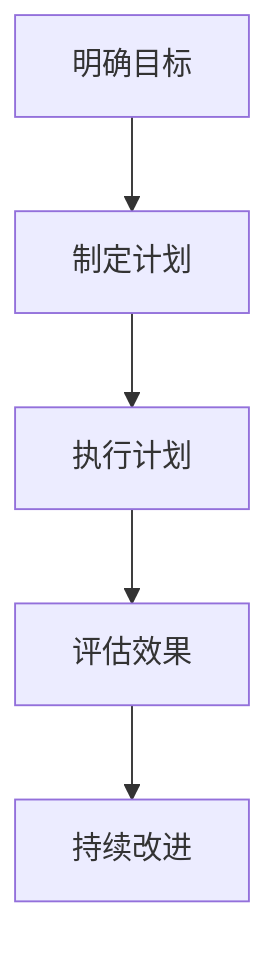
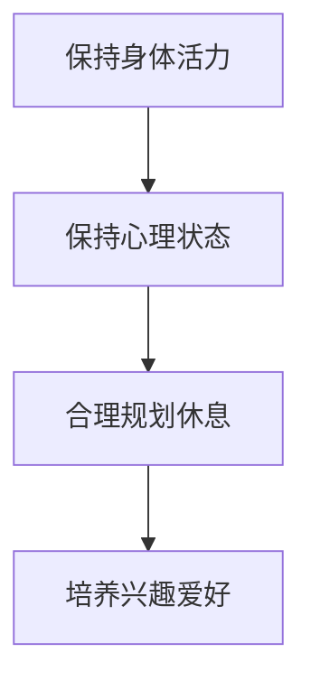

                 

# 《领导者的自我管理：时间与精力的分配》

> 关键词：自我管理、时间管理、精力管理、领导力、效率

> 摘要：本文将深入探讨领导者的自我管理，特别是时间与精力的分配。通过阐述时间管理和精力管理的基本原则、策略和实践，帮助领导者提升自我管理能力，从而提高工作效率、生活质量和个人成长。

## 目录

1. 引言  
2. 第一部分：领导者的自我管理基础  
   2.1 领导者自我管理的概念与意义  
   2.2 时间管理  
   2.3 精力管理  
3. 第二部分：时间与精力分配策略  
   3.1 目标设定与优先级排序  
   3.2 时间分配策略  
   3.3 精力分配策略  
4. 第三部分：领导者的自我管理实践  
   4.1 实践的重要性  
   4.2 实践的步骤与方法  
   4.3 实践中的常见问题与解决  
5. 自我管理工具与资源  
6. 附录

## 引言

在当今快节奏的社会中，领导者面临着越来越多的挑战。如何在繁忙的工作中保持高效，如何在压力下保持良好的精力状态，成为领导者自我管理的重要内容。本文旨在探讨领导者的自我管理，特别是时间与精力的分配，以帮助领导者提高工作效率、生活质量和个人成长。

### 第一部分：领导者的自我管理基础

### 第1章：领导者自我管理的概念与意义

#### 1.1 领导者自我管理的定义

领导者自我管理是指领导者通过对自己的时间、精力和行为进行有效的管理和控制，以提高工作效率、生活质量和个人成长的过程。这个过程涉及多个方面，包括时间管理、精力管理和行为管理。

#### 1.2 自我管理的重要性

自我管理对于领导者的重要性不言而喻。首先，自我管理有助于提高工作效率。通过合理安排时间，领导者可以更好地分配任务和资源，从而提高工作效率。其次，自我管理有助于提升生活质量。领导者通过合理分配工作与生活时间，可以更好地平衡工作和生活，从而提升生活质量。最后，自我管理有助于个人成长。通过自我管理，领导者可以不断学习、提升自我，从而实现个人成长。

#### 1.3 领导者自我管理的挑战

领导者自我管理并非易事，其中面临的主要挑战包括时间管理、精力管理和行为管理。

1. **时间管理：** 领导者常常面临时间不够用的挑战。如何合理安排时间，提高时间利用效率，是领导者需要解决的问题。
2. **精力管理：** 领导者需要保持良好的精力状态，以应对繁重的工作压力。如何管理精力，保持良好的身心状态，是领导者需要面对的挑战。
3. **行为管理：** 领导者的行为管理包括自律、责任感和决策能力等方面。如何培养良好的行为习惯，提高决策能力，是领导者需要思考的问题。

### 第2章：时间管理

#### 2.1 时间管理的基本原则

时间管理的基本原则包括明确目标、优先级排序、高效利用碎片时间等。

1. **明确目标：** 领导者需要明确自己的工作目标，以指导时间分配。
2. **优先级排序：** 领导者需要根据工作目标和重要性对任务进行排序，优先完成重要且紧急的任务。
3. **高效利用碎片时间：** 领导者需要善于利用碎片时间，如等待会议、通勤等时间，进行阅读、思考或处理一些简单的工作。

#### 2.2 时间的认知与评估

时间的认知与评估是时间管理的重要环节。领导者需要正确地认识时间和评估时间价值。

1. **时间的认知：** 领导者需要认识到时间的有限性和宝贵性，珍惜每一刻。
2. **时间的评估：** 领导者需要评估每个任务所需的时间，合理安排时间分配。

#### 2.3 提高时间管理效率的方法

提高时间管理效率的方法包括使用时间管理工具、制定工作计划、避免拖延等。

1. **使用时间管理工具：** 如日历、待办事项列表、时间追踪器等，帮助领导者合理安排时间。
2. **制定工作计划：** 领导者需要制定详细的工作计划，明确每个任务的开始和结束时间。
3. **避免拖延：** 领导者需要克服拖延症，及时完成任务。

### 第3章：精力管理

#### 3.1 精力的概念与分类

精力是指身体和心理上的能量，是完成工作的基础。精力可以分为身体精力、心理精力和情感精力。

1. **身体精力：** 指身体状态和体能，包括睡眠质量、饮食健康等。
2. **心理精力：** 指思维敏捷度、专注力和创造力等。
3. **情感精力：** 指情绪稳定性和心理承受能力。

#### 3.2 精力的消耗与恢复

1. **精力的消耗：** 领导者需要认识到精力是有限的，需要合理消耗。过度消耗精力会导致疲劳和效率下降。
2. **精力的恢复：** 领导者需要找到适合自己的恢复方法，如休息、放松、锻炼等。

#### 3.3 提升精力管理的方法

提升精力管理的方法包括健康的生活方式、充足的休息和有效的放松。

1. **健康的生活方式：** 保持良好的饮食和运动习惯，提高身体和精神健康。
2. **充足的休息：** 确保充足的睡眠时间，提高精力水平。
3. **有效的放松：** 通过冥想、瑜伽等放松技巧，减轻压力和疲劳。

### 第二部分：时间与精力分配策略

### 第4章：目标设定与优先级排序

#### 4.1 目标设定的SMART原则

目标设定是时间与精力管理的重要环节。SMART原则是一种有效的目标设定方法。

1. **Specific（具体）：** 目标要明确具体，避免模糊。
2. **Measurable（可衡量）：** 目标要有明确的衡量标准。
3. **Achievable（可实现）：** 目标要具有可实现性。
4. **Relevant（相关）：** 目标要与工作目标和公司目标相关。
5. **Time-bound（时限）：** 目标要有明确的时限。

#### 4.2 优先级排序的方法与技巧

优先级排序是时间管理的关键。领导者需要学会如何根据目标的重要性、紧急性等因素进行排序。

1. **紧急性排序法：** 根据任务的紧急程度进行排序，先处理紧急任务。
2. **重要性排序法：** 根据任务的重要性进行排序，先处理重要任务。
3. **紧急性-重要性矩阵：** 使用矩阵法，将任务分为四个象限，根据象限进行排序。

#### 4.3 提高任务完成率的策略

提高任务完成率是时间管理的重要目标。以下是一些有效的策略：

1. **分解任务：** 将大任务分解为小任务，逐步完成。
2. **设置截止日期：** 为每个任务设置明确的截止日期，提高任务完成的紧迫感。
3. **避免拖延：** 克服拖延症，及时完成任务。

### 第5章：时间分配策略

#### 5.1 工作与个人时间的平衡

领导者需要在工作时间和个人时间之间找到平衡。以下是一些策略：

1. **制定工作计划：** 制定详细的工作计划，合理安排工作时间。
2. **利用碎片时间：** 善于利用碎片时间，如通勤、等待等时间。
3. **避免加班：** 尽量避免加班，保证充足的休息时间。

#### 5.2 高效的工作安排

高效的工作安排可以提高工作效率，减轻工作压力。以下是一些策略：

1. **集中精力：** 避免分散精力，集中注意力完成一项任务。
2. **消除干扰：** 创造一个安静、专注的工作环境，减少干扰。
3. **设定优先级：** 根据任务的重要性和紧急性进行优先级排序。

#### 5.3 应对突发事件的策略

突发事件是不可避免的。以下是一些应对突发事件的策略：

1. **预判和准备：** 预判可能发生的突发事件，提前做好准备。
2. **灵活调整：** 根据突发事件的情况，灵活调整工作计划。
3. **保持冷静：** 遇到突发事件时，保持冷静，及时应对。

### 第6章：精力分配策略

#### 6.1 工作与生活的平衡

领导者需要在工作和生活之间找到平衡。以下是一些策略：

1. **设定工作界限：** 设定工作时间和个人时间的界限，避免工作侵占个人时间。
2. **合理规划休息：** 合理规划休息时间，确保身心得到充分休息。
3. **培养兴趣爱好：** 培养兴趣爱好，丰富个人生活。

#### 6.2 提升工作效率的精力管理

提升工作效率的精力管理是领导者自我管理的重要方面。以下是一些策略：

1. **保持身体活力：** 通过锻炼、保持良好的饮食习惯，保持身体活力。
2. **保持心理状态：** 通过冥想、放松技巧等，保持良好的心理状态。
3. **合理安排工作时间：** 合理安排工作时间，避免过度疲劳。

#### 6.3 领导者个人成长与提升

领导者个人成长与提升是自我管理的重要组成部分。以下是一些策略：

1. **持续学习：** 通过阅读、培训等方式，持续学习新知识和技能。
2. **反思与总结：** 定期反思自己的工作和管理方法，总结经验教训。
3. **寻求反馈：** 向同事、下属或专业人士寻求反馈，不断提升自我。

### 第三部分：领导者的自我管理实践

### 第7章：领导者的自我管理实践

#### 7.1 实践的重要性

领导者自我管理的实践是理论知识的具体应用，是提升自我管理能力的关键。只有通过实践，领导者才能真正掌握自我管理的技巧和方法。

#### 7.2 实践的步骤与方法

领导者自我管理的实践可以遵循以下步骤：

1. **制定计划：** 制定详细的自我管理计划，明确目标、方法和步骤。
2. **执行计划：** 按照计划执行，不断调整和完善。
3. **评估效果：** 定期评估自我管理效果，总结经验教训。
4. **持续改进：** 根据评估结果，持续改进自我管理方法。

#### 7.3 实践中的常见问题与解决

在领导者自我管理的实践中，常见的问题包括：

1. **拖延症：** 解决方法：制定明确的计划和截止日期，克服拖延症。
2. **时间管理不当：** 解决方法：学会合理分配时间，避免工作侵占个人时间。
3. **精力不足：** 解决方法：保持良好的身体和心理状态，合理规划休息时间。

### 第8章：自我管理工具与资源

#### 8.1 常用的时间管理工具

领导者可以借助以下时间管理工具，提高自我管理能力：

1. **日历应用：** 如Google Calendar、Outlook Calendar等，用于安排和跟踪日程。
2. **待办事项列表：** 如Trello、Asana等，用于管理任务和项目。
3. **时间追踪器：** 如RescueTime、Toggl等，用于记录和分析时间使用情况。

#### 8.2 常用的精力管理工具

领导者可以借助以下精力管理工具，提升精力管理能力：

1. **睡眠追踪器：** 如Apple Health、Sleep Cycle等，用于监测睡眠质量。
2. **健康应用：** 如MyFitnessPal、Fitbit等，用于追踪健康数据和锻炼计划。
3. **冥想应用：** 如Headspace、Calm等，用于进行冥想和放松练习。

#### 8.3 其他辅助资源推荐

领导者可以参考以下资源，进一步学习和提升自我管理能力：

1. **书籍：** 《高效能人士的七个习惯》、《时间管理的艺术》等。
2. **博客和文章：** 相关领域的博客和文章，提供实用的技巧和经验。
3. **课程和研讨会：** 参加时间管理和精力管理的课程和研讨会，学习先进的方法和技巧。

### 附录

#### 附录A：时间管理与精力管理流程图

**时间管理流程图：**

**精力管理流程图：**

#### 附录B：时间管理与精力管理的数学模型与公式

**时间管理公式：**
$$
时间价值 = \frac{工作量}{时间}
$$

**精力管理公式：**
$$
工作效率 = \frac{工作量}{精力消耗}
$$

#### 附录C：领导者的自我管理实战案例分析

**案例1：** 一位领导者通过使用时间管理工具和设定优先级排序，成功提高了工作效率。他每天早上都会制定一份详细的计划，按照任务的紧急性和重要性进行排序，确保优先完成重要且紧急的任务。

**案例2：** 一位领导者通过保持良好的身体和心理状态，成功提升了精力管理能力。他每天都会进行适量的锻炼，保持健康的饮食习惯，并通过冥想和放松技巧来缓解工作压力。

#### 附录D：推荐阅读书目与资源

**推荐阅读书目：**
1. 《高效能人士的七个习惯》
2. 《时间管理的艺术》
3. 《精力管理：如何保持精力充沛，提高工作效率》

**推荐资源：**
1. Trello（https://trello.com/）
2. RescueTime（https://www.rescuetime.com/）
3. Headspace（https://www.headspace.com/）
4. 时间管理相关的博客和文章（https://www.google.com/search?q=时间管理+博客+文章）

## 结论

领导者的自我管理是提高工作效率、生活质量和个人成长的关键。通过合理的时间管理和精力管理，领导者可以更好地平衡工作和生活，实现个人与团队的双重提升。本文从时间管理和精力管理的基本原则、策略和实践出发，为领导者提供了具体的指导和参考。希望本文能够对领导者的自我管理有所帮助。

## 附录

### 附录A：时间管理与精力管理流程图

**时间管理流程图：**

**精力管理流程图：**

### 附录B：时间管理与精力管理的数学模型与公式

**时间管理公式：**
$$
时间价值 = \frac{工作量}{时间}
$$

**精力管理公式：**
$$
工作效率 = \frac{工作量}{精力消耗}
$$

### 附录C：领导者的自我管理实战案例分析

**案例1：** 一位领导者通过使用时间管理工具和设定优先级排序，成功提高了工作效率。他每天早上都会制定一份详细的计划，按照任务的紧急性和重要性进行排序，确保优先完成重要且紧急的任务。

**案例2：** 一位领导者通过保持良好的身体和心理状态，成功提升了精力管理能力。他每天都会进行适量的锻炼，保持健康的饮食习惯，并通过冥想和放松技巧来缓解工作压力。

### 附录D：推荐阅读书目与资源

**推荐阅读书目：**
1. 《高效能人士的七个习惯》
2. 《时间管理的艺术》
3. 《精力管理：如何保持精力充沛，提高工作效率》

**推荐资源：**
1. Trello（https://trello.com/）
2. RescueTime（https://www.rescuetime.com/）
3. Headspace（https://www.headspace.com/）
4. 时间管理相关的博客和文章（https://www.google.com/search?q=时间管理+博客+文章）<|im_end|>## 附录

### 附录A：时间管理与精力管理流程图

**时间管理流程图：**

**精力管理流程图：**

### 附录B：时间管理与精力管理的数学模型与公式

**时间管理公式：**
$$
时间价值 = \frac{工作量}{时间}
$$

**精力管理公式：**
$$
工作效率 = \frac{工作量}{精力消耗}
$$

### 附录C：领导者的自我管理实战案例分析

**案例1：** 一位领导者通过使用时间管理工具和设定优先级排序，成功提高了工作效率。他每天早上都会制定一份详细的计划，按照任务的紧急性和重要性进行排序，确保优先完成重要且紧急的任务。

**案例2：** 一位领导者通过保持良好的身体和心理状态，成功提升了精力管理能力。他每天都会进行适量的锻炼，保持健康的饮食习惯，并通过冥想和放松技巧来缓解工作压力。

### 附录D：推荐阅读书目与资源

**推荐阅读书目：**
1. 《高效能人士的七个习惯》
2. 《时间管理的艺术》
3. 《精力管理：如何保持精力充沛，提高工作效率》
4. 《深度工作：如何有效利用每一点脑力》
5. 《非暴力沟通》

**推荐资源：**
1. Trello（https://trello.com/）
2. RescueTime（https://www.rescuetime.com/）
3. Headspace（https://www.headspace.com/）
4. 专注力训练应用（如Forest、Pomodoro Timer等）
5. 谷歌日历（https://calendar.google.com/）
6. 知乎时间管理话题（https://www.zhihu.com/topic/19646482/questions）
7. Medium上的时间管理和精力管理文章（https://medium.com/topic/time-management）
8. TED Talks关于时间和效率的演讲（https://www.ted.com/topics/time-management）

### 附录E：常用时间管理和精力管理工具

**时间管理工具：**
- Google Calendar（谷歌日历）
- Microsoft Outlook（微软 Outlook）
- Trello（特罗卡）
- Asana（阿萨纳）
- Notion（诺顿）
- Evernote（印象笔记）

**精力管理工具：**
- RescueTime（救援时间）
- Focus@Will（专注@意愿）
- Forest（森林）
- Calm（宁静）
- Headspace（他空间）
- Sleep Cycle（睡眠周期）

### 附录F：领导者的自我管理实践指导

**1. 制定个人发展规划：** 根据自己的职业目标和兴趣，制定明确的个人发展规划，并定期进行回顾和调整。

**2. 设定具体目标：** 使用SMART原则（具体、可衡量、可实现、相关、时限）设定个人和团队的目标。

**3. 优先级排序：** 使用紧急性-重要性矩阵，对任务进行优先级排序，确保先做重要且紧急的任务。

**4. 消除干扰：** 创造一个专注的工作环境，减少干扰，例如关闭不必要的社交媒体通知。

**5. 高效利用碎片时间：** 善于利用碎片时间，如等待会议、通勤等时间，进行阅读、思考或处理一些简单的工作。

**6. 保持身体活力：** 定期进行体育锻炼，保持良好的饮食习惯，确保充足的睡眠。

**7. 心理调适：** 通过冥想、瑜伽等放松技巧，缓解工作压力，保持良好的心理状态。

**8. 反思与总结：** 定期反思自己的工作和管理方法，总结经验教训，持续改进。

**9. 寻求反馈：** 向同事、下属或专业人士寻求反馈，以了解自己的管理风格和工作效果，并不断优化。

### 附录G：领导者的自我管理工具使用指南

**1. Google Calendar：** 
- **功能介绍：** Google Calendar 是一款功能强大的日历应用，可以用于安排日程、设置提醒、共享日历等。
- **使用步骤：**
  1. 打开 Google Calendar 网站（https://calendar.google.com/）。
  2. 登录 Google 账户。
  3. 创建新的日程事件，并设置提醒时间。
  4. 共享日历，与其他人协作。

**2. Trello：**
- **功能介绍：** Trello 是一款流行的项目管理工具，可以用于创建看板、卡片、列表，管理任务和项目。
- **使用步骤：**
  1. 注册 Trello 账户。
  2. 创建一个新的看板。
  3. 添加列表和卡片，分配任务。
  4. 设置提醒和截止日期。

**3. RescueTime：**
- **功能介绍：** RescueTime 是一款时间追踪工具，可以记录您在电脑和手机上的时间使用情况，帮助您了解时间分配。
- **使用步骤：**
  1. 安装 RescueTime 客户端。
  2. 登录您的 RescueTime 账户。
  3. 查看时间使用报告，分析时间分配。
  4. 根据报告调整时间管理策略。

**4. Headspace：**
- **功能介绍：** Headspace 是一款冥想和放松应用，提供各种冥想课程和放松技巧。
- **使用步骤：**
  1. 下载 Headspace 应用。
  2. 创建账户并订阅服务。
  3. 选择适合您的冥想课程。
  4. 按照课程进行冥想练习。

**5. Forest：**
- **功能介绍：** Forest 是一款专注于提高专注力的应用，通过种树游戏激励您保持专注。
- **使用步骤：**
  1. 下载 Forest 应用。
  2. 创建账户并登录。
  3. 开始专注任务，种植虚拟树木。
  4. 完成任务后，虚拟树木成长。

### 附录H：领导者的自我管理案例分析

**案例1：** 一位公司CEO通过使用Google Calendar进行日程管理，确保每天的工作都有明确的计划和目标。同时，他通过Trello进行项目管理和任务分配，提高了团队的协作效率。他还定期使用RescueTime分析自己的时间使用情况，发现并解决了在社交媒体上的时间浪费问题。

**案例2：** 一位项目经理通过Headspace进行日常冥想练习，缓解了工作压力，提高了专注力和工作效率。他还通过Forest应用，在完成任务的过程中保持专注，避免了分散注意力。

### 附录I：领导者的自我管理资源库

**1. 优质博客和文章：**
- [时间管理：The Time Management Guide](https://www.time-management-guide.com/)
- [精力管理：The Energy Project](https://theenergyproject.com/)
- [领导力：Harvard Business Review](https://hbr.org/topics/time-management)

**2. 在线课程和讲座：**
- [Udemy：Time Management Mastery](https://www.udemy.com/course/time-management-mastery/)
- [Coursera：Time Management for Personal & Professional Productivity](https://www.coursera.org/specializations/time-management)

**3. 书籍推荐：**
- 《深度工作：如何有效利用每一点脑力》（Cal Newport）
- 《高效能人士的七个习惯》（Stephen R. Covey）
- 《精力管理：如何保持精力充沛，提高工作效率》（Tony Schwartz）

**4. 专业社区和论坛：**
- [LinkedIn：Time Management Group](https://www.linkedin.com/groups/83793/)
- [Reddit：r/TimeManagement](https://www.reddit.com/r/TimeManagement/)

### 附录J：领导者的自我管理工具对比

**1. Google Calendar：** 优点是集成度高，与Google其他服务紧密连接，界面简洁。缺点是缺乏详细的任务管理功能。

**2. Trello：** 优点是直观易用，适用于各种项目类型。缺点是对于非常复杂的项目可能不够强大。

**3. RescueTime：** 优点是自动记录时间使用情况，提供详细的数据分析。缺点是用户界面可能有些复杂。

**4. Headspace：** 优点是提供专业的冥想课程，易于使用。缺点是订阅费用较高。

**5. Forest：** 优点是趣味性强，有助于提高专注力。缺点是功能相对单一。

### 附录K：领导者的自我管理实用技巧

**1. 设置明确的目标：** 使用SMART原则设定具体、可衡量、可实现、相关、时限的目标。

**2. 保持工作与生活的平衡：** 定期安排个人时间，确保身心健康。

**3. 学会拒绝：** 学会拒绝不重要的任务，专注于重要且紧急的工作。

**4. 善用工具：** 利用时间管理和精力管理工具，提高效率和效果。

**5. 反思与调整：** 定期反思工作和管理方法，根据实际情况进行调整。

### 附录L：领导者的自我管理总结

领导者的自我管理是提升工作效率、生活质量和个人成长的关键。通过合理的时间管理和精力管理，领导者可以更好地平衡工作和生活，实现个人与团队的双重提升。本文从时间管理和精力管理的基本原则、策略和实践出发，为领导者提供了具体的指导和参考。希望本文能够对领导者的自我管理有所帮助，帮助他们在快速变化的环境中保持高效和专注。在自我管理的道路上，持续学习和实践是关键。通过不断调整和优化管理方法，领导者可以不断提升自我管理能力，为个人和团队创造更大的价值。最后，愿每一位领导者都能够掌握自我管理，成为更优秀的领导者。

