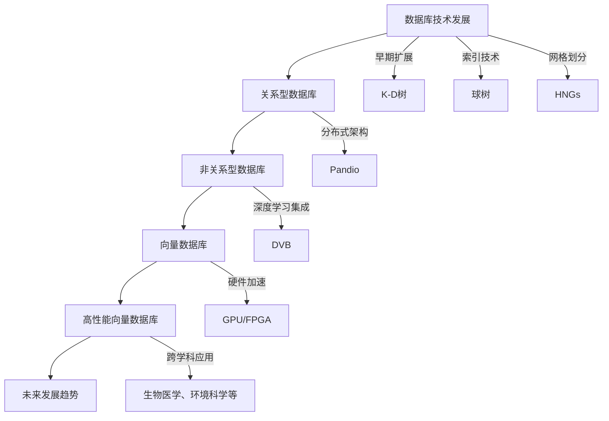
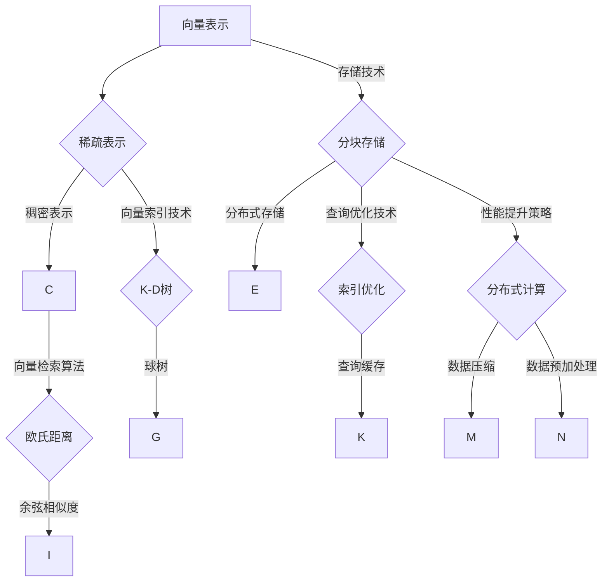
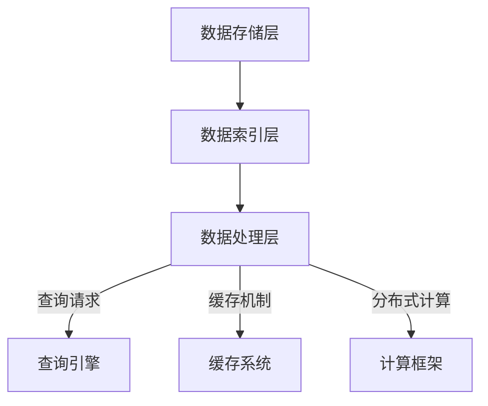
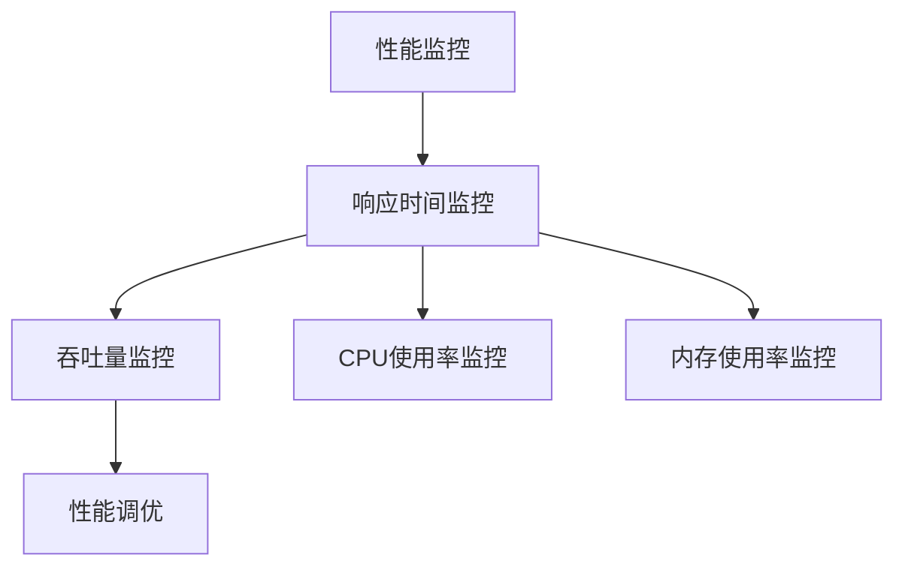
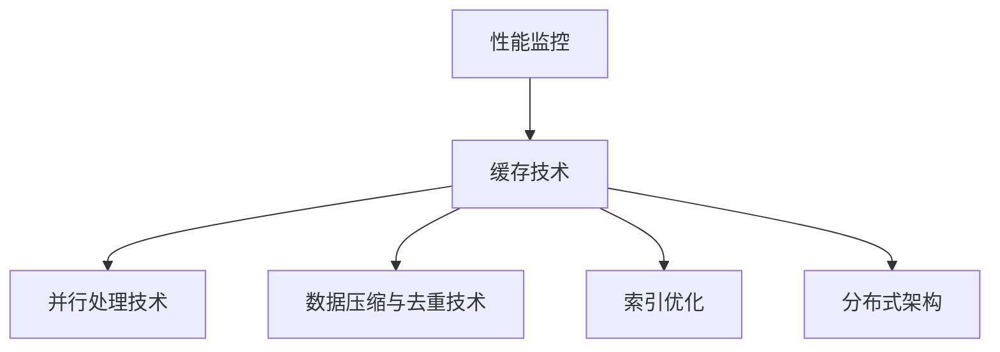
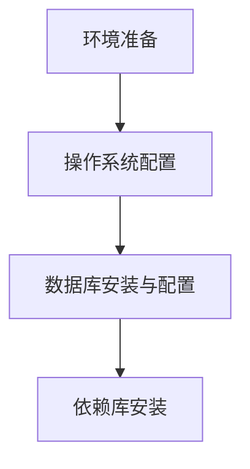
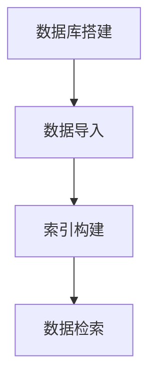
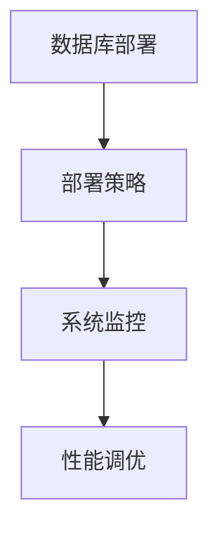

                 

### 高性能向量数据库概述

#### 1.1 高性能向量数据库的定义与背景

随着科学研究的不断深入和数据量的急剧增长，传统的数据库系统已经难以满足现代科学研究的性能需求。高性能向量数据库作为一种新型的数据库技术，应运而生。高性能向量数据库（High-Performance Vector Database）是指能够在大规模数据集上进行高效存储、检索和计算的数据库系统。它主要针对高维度数据的存储和检索优化，适用于大规模数据分析、机器学习模型训练等应用场景。

高性能向量数据库的发展背景可以追溯到大数据时代和人工智能技术的兴起。在过去的几十年里，随着计算机硬件技术的发展，数据存储和处理能力得到了极大的提升。然而，随着数据量的爆炸式增长和数据维度的不断增加，传统的关系型数据库和非关系型数据库逐渐暴露出性能瓶颈。为了应对这些挑战，研究者们开始探索新的数据库技术，高性能向量数据库就是其中之一。

高性能向量数据库的主要特点包括：

1. **高维度数据支持**：高性能向量数据库能够高效地处理高维数据，这对于大规模数据分析和机器学习模型训练具有重要意义。
2. **快速检索能力**：通过高效的向量索引和检索算法，高性能向量数据库能够在极短的时间内完成大量数据的查询操作。
3. **分布式计算能力**：高性能向量数据库通常采用分布式架构，能够利用多台服务器进行并行计算，提高数据处理速度和系统扩展性。
4. **易扩展性**：高性能向量数据库的设计考虑了系统扩展性，可以根据需求动态调整资源，以应对数据量和计算需求的增长。

高性能向量数据库的发展历程可以分为以下几个阶段：

1. **早期向量数据库**：这个阶段主要是基于传统数据库系统的扩展，通过增加向量存储和检索功能来提升系统的性能。
2. **高性能向量索引技术**：随着对向量数据处理需求的增长，研究者们开始关注向量索引技术的研究，例如KD-Tree、Ball-Tree等，这些技术的引入显著提高了向量检索的效率。
3. **分布式高性能向量数据库**：近年来，随着云计算和分布式计算技术的发展，高性能向量数据库逐渐走向分布式架构，通过多台服务器进行数据分片和负载均衡，实现更高效的存储和检索。
4. **深度学习与高性能向量数据库的结合**：随着深度学习技术的兴起，高性能向量数据库也开始与深度学习技术相结合，为大规模数据分析和机器学习应用提供了强大的支持。

#### 1.2 向量数据库在科学研究中的应用价值

高性能向量数据库在科学研究中的重要性日益凸显，主要体现在以下几个方面：

1. **生物信息学**：生物信息学领域面临着海量基因组和蛋白质结构数据的存储和检索需求。高性能向量数据库能够快速处理这些高维度数据，支持大规模数据分析，为基因组学研究、蛋白质结构预测和疾病风险评估等领域提供了有力支持。
2. **化学与材料科学**：化学与材料科学领域需要对大量化学反应和材料属性数据进行高效存储和检索。高性能向量数据库能够快速处理这些数据，支持化学反应预测、材料性能优化和药物设计等应用。
3. **地球科学**：地球科学领域涉及大量的地理、气象和地震数据。高性能向量数据库能够高效地存储和检索这些数据，支持气候变化研究、地质勘探和地震预警等应用。
4. **环境科学**：环境科学领域需要对大量环境监测数据进行分析和预测。高性能向量数据库能够快速处理这些数据，支持污染物监测、环境治理和生态研究等应用。

高性能向量数据库在科学研究中的优势主要体现在以下几个方面：

1. **高性能**：高性能向量数据库能够高效地处理大规模高维度数据，支持快速检索和计算，为科学研究提供了强大的数据处理能力。
2. **可扩展性**：高性能向量数据库采用分布式架构，可以动态调整资源，支持系统扩展，能够适应科学研究中的数据量和计算需求的增长。
3. **灵活性强**：高性能向量数据库支持多种数据类型和索引方式，可以灵活地适应不同科学领域的应用需求。
4. **易于集成**：高性能向量数据库通常采用开源框架和接口，易于与其他科学计算工具和平台集成，为科学研究提供了便捷的数据管理和技术支持。

#### 1.3 高性能向量数据库的发展历程

高性能向量数据库的发展历程可以分为以下几个阶段：

1. **早期向量数据库**：这一阶段的向量数据库主要是基于传统数据库系统的扩展，通过增加向量存储和检索功能来提升系统的性能。代表性系统包括RDBMS（关系型数据库管理系统）和NoSQL（非关系型数据库）。
2. **高性能向量索引技术**：随着对向量数据处理需求的增长，研究者们开始关注向量索引技术的研究。KD-Tree、Ball-Tree、Hierarchical Navigable Grids（HNGs）等索引技术的出现，显著提高了向量检索的效率。这一阶段代表性的系统包括Faiss、Annoy等。
3. **分布式高性能向量数据库**：随着云计算和分布式计算技术的发展，高性能向量数据库逐渐走向分布式架构。分布式向量数据库通过多台服务器进行数据分片和负载均衡，实现更高效的存储和检索。代表性系统包括Milvus、Pandio等。
4. **深度学习与高性能向量数据库的结合**：近年来，深度学习技术的兴起为高性能向量数据库的发展带来了新的机遇。深度学习与高性能向量数据库的结合，使得大规模数据分析和机器学习应用变得更加高效和灵活。代表性系统包括Huge Vector Database（HVD）、Deep Vector Database（DDB）等。

**1.3.1 早期向量数据库的发展**

早期向量数据库的发展可以追溯到20世纪80年代。当时，计算机硬件和存储技术的限制使得传统的关系型数据库难以满足大数据处理需求。为了应对这一挑战，研究者们开始探索基于向量表示的数据库技术。早期的向量数据库主要是基于关系型数据库（RDBMS）进行扩展，增加向量存储和检索功能。代表性系统包括：

1. **PostgreSQL**：PostgreSQL是一个开源的关系型数据库管理系统，支持向量数据类型。通过使用向量数据类型，PostgreSQL能够处理高维度数据，支持向量的存储、检索和计算。
2. **MySQL**：MySQL也是一个流行的关系型数据库管理系统，通过扩展存储引擎，可以实现向量数据的存储和检索。MySQL的MyVector存储引擎是一种早期的向量数据库实现。

**1.3.2 高性能向量索引技术的发展**

高性能向量索引技术是高性能向量数据库发展的关键。以下是一些重要的高性能向量索引技术：

1. **K-D树（K-Dimensional Tree）**：K-D树是一种高维空间数据的索引结构，通过递归地将空间划分为不同的维度区间来构建。K-D树能够高效地处理高维度数据的最近邻搜索和范围查询。
2. **球树（Ball-Tree）**：球树是一种基于空间包围盒的索引结构，它通过递归地将空间划分为多个球来构建。球树在处理高维度数据时具有较好的性能，尤其适用于最近邻搜索。
3. **层次可导航网格（Hierarchical Navigable Grids，HNGs）**：层次可导航网格是一种基于网格划分的索引结构，通过递归地将空间划分为多个网格单元来构建。HNGs在处理高维度数据时能够提供高效的查询性能。

**1.3.3 分布式高性能向量数据库的发展**

随着数据量的急剧增长和计算需求的增加，传统的单机向量数据库已经难以满足高性能计算需求。分布式高性能向量数据库的发展为解决这一难题提供了新的途径。以下是一些代表性的分布式高性能向量数据库系统：

1. **Faiss**：Faiss是一个开源的分布式高性能向量数据库，专注于大规模高维数据的索引和搜索。Faiss采用多线程和并行计算技术，能够高效地处理大规模向量数据集。
2. **Annoy**：Annoy（Approximate Nearest Neighbors Oh Yeah）是一个开源的分布式向量索引库，它通过构建倒排索引来实现快速最近邻搜索。Annoy支持分布式计算，能够处理大规模向量数据集。
3. **Pandio**：Pandio是一个基于Apache Cassandra的分布式向量数据库，它支持高维度数据的存储和检索。Pandio采用分布式架构，能够实现数据的水平扩展，支持大规模数据处理。

**1.3.4 深度学习与高性能向量数据库的结合**

深度学习技术的发展为高性能向量数据库的应用带来了新的机遇。深度学习与高性能向量数据库的结合，使得大规模数据分析和机器学习应用变得更加高效和灵活。以下是一些深度学习与高性能向量数据库的结合应用：

1. **深度向量数据库（Deep Vector Database，DVB）**：DVB是一种基于深度学习的向量数据库，它通过将深度神经网络与向量数据库相结合，实现高效的数据存储和检索。DVB支持大规模高维数据的快速查询和分类。
2. **Huge Vector Database（HVD）**：HVD是一种基于深度学习的分布式向量数据库，它通过将深度神经网络与分布式计算技术相结合，实现大规模数据的存储和检索。HVD支持高效的向量索引和查询优化，能够处理大规模向量数据集。

**1.3.5 高性能向量数据库的未来发展趋势**

随着计算机硬件和算法技术的不断进步，高性能向量数据库的发展前景广阔。以下是高性能向量数据库未来可能的发展趋势：

1. **硬件加速**：随着GPU、FPGA等硬件技术的发展，高性能向量数据库将更加依赖于硬件加速技术，实现更高效的数据处理和检索。
2. **深度学习集成**：深度学习与高性能向量数据库的结合将进一步深化，通过将深度神经网络与向量数据库相结合，实现更高效的数据分析和机器学习应用。
3. **分布式架构优化**：分布式高性能向量数据库将继续优化分布式架构，提高系统的扩展性和性能。未来可能出现的分布式数据库技术，如分布式哈希表、分布式文件系统等，将为高性能向量数据库提供更强大的支持。
4. **跨学科应用**：高性能向量数据库将在更多学科领域得到应用，如生物医学、环境科学、社会科学等。跨学科的应用将推动高性能向量数据库技术的发展和创新。

为了更好地展示高性能向量数据库的技术架构，我们可以使用Mermaid绘制一个流程图。以下是一个简化的技术架构流程图：



通过这个流程图，我们可以清晰地看到高性能向量数据库的发展历程和未来发展趋势。高性能向量数据库在科学研究中的角色越来越重要，为大规模数据分析和机器学习应用提供了强大的支持。

### 第2章：向量数据库的核心原理

向量数据库作为一种专门用于存储和检索高维数据的数据库系统，其核心原理主要涉及向量表示与存储技术、向量索引与检索算法以及查询优化与性能提升策略。在本章节中，我们将深入探讨这些核心原理，并使用伪代码和Mermaid流程图来详细阐述。

#### 2.1 向量表示与存储技术

向量表示是向量数据库的基础。向量可以表示为一系列数字的集合，每个数字称为一个维度。向量的表示方法决定了数据库如何存储和操作向量数据。

##### 2.1.1 向量表示方法

向量表示方法可以分为以下几种：

1. **稀疏表示**：稀疏向量表示法只存储非零元素及其索引，适用于大多数实际应用，因为大多数向量在大多数维度上都是零。

   ```python
   def sparse_vector_representation(vector):
       sparse_vector = []
       for index, value in enumerate(vector):
           if value != 0:
               sparse_vector.append((index, value))
       return sparse_vector
   ```

2. **稠密表示**：稠密向量表示法存储所有元素，适用于向量维度较低的情况。

   ```python
   def dense_vector_representation(vector):
       return vector
   ```

##### 2.1.2 向量存储技术

向量存储技术决定了向量在数据库中的存储方式。以下是一些常见的向量存储技术：

1. **分块存储**：将向量分成多个块存储，适用于大规模高维向量。

   ```python
   def block_vector_storage(vector, block_size):
       blocks = []
       for i in range(0, len(vector), block_size):
           blocks.append(vector[i:i + block_size])
       return blocks
   ```

2. **分布式存储**：将向量分布在多台服务器上，适用于分布式数据库系统。

   ```python
   def distributed_vector_storage(vector, num_servers):
       server_indices = range(num_servers)
       chunks = split_vector_into_chunks(vector, server_indices)
       return chunks
   ```

#### 2.2 向量索引与检索算法

向量索引技术是向量数据库的关键组成部分，它决定了如何快速高效地检索向量数据。

##### 2.2.1 向量索引技术

向量索引技术用于快速定位向量的存储位置，常见的向量索引技术包括：

1. **K-D树**：K-D树是一种高维空间的分割树，通过递归地将空间划分为不同的维度区间来构建。

   ```python
   class KDTree:
       def __init__(self, points):
           self.points = points
           self.build_tree()

       def build_tree(self):
           # 递归构建K-D树
           pass

       def search(self, point, k):
           # 在K-D树中搜索最近邻点
           pass
   ```

2. **球树**：球树是一种基于空间包围盒的索引结构，通过递归地将空间划分为多个球来构建。

   ```python
   class BallTree:
       def __init__(self, points):
           self.points = points
           self.build_tree()

       def build_tree(self):
           # 递归构建球树
           pass

       def search(self, point, k):
           # 在球树中搜索最近邻点
           pass
   ```

##### 2.2.2 向量检索算法

向量检索算法用于在向量数据库中搜索与给定向量最相似的向量。以下是一些常见的向量检索算法：

1. **欧氏距离**：欧氏距离是衡量两个向量之间差异的一种常用方法。

   ```python
   def euclidean_distance(v1, v2):
       return np.sqrt(np.sum((v1 - v2) ** 2))
   ```

2. **余弦相似度**：余弦相似度是衡量两个向量之间夹角的一种方法。

   ```python
   def cosine_similarity(v1, v2):
       dot_product = np.dot(v1, v2)
       norm_v1 = np.linalg.norm(v1)
       norm_v2 = np.linalg.norm(v2)
       return dot_product / (norm_v1 * norm_v2)
   ```

#### 2.3 高性能向量数据库的查询优化与性能提升策略

查询优化是提高向量数据库性能的关键。以下是一些常见的查询优化技术和策略：

##### 2.3.1 查询优化技术

1. **索引优化**：通过选择合适的索引技术，提高查询效率。

   ```python
   def optimize_indexing(vector_database):
       # 根据向量数据库的特点选择合适的索引技术
       pass
   ```

2. **查询缓存**：缓存常用查询结果，减少重复计算。

   ```python
   def query_caching(vector_database):
       # 缓存查询结果
       pass
   ```

##### 2.3.2 性能提升策略

1. **分布式计算**：利用多台服务器进行并行计算，提高数据处理速度。

   ```python
   def distributed_computing(vector_database, num_servers):
       # 分布式计算策略
       pass
   ```

2. **数据压缩**：使用数据压缩技术减少存储空间，提高I/O效率。

   ```python
   def data_compression(vector_database):
       # 数据压缩策略
       pass
   ```

3. **数据预加处理**：对数据进行预处理，减少查询操作的时间。

   ```python
   def data_preprocessing(vector_database):
       # 数据预处理策略
       pass
   ```

#### 2.4 向量数据库的Mermaid流程图

为了更好地理解向量数据库的核心原理，我们可以使用Mermaid绘制一个流程图。以下是一个简化的流程图，展示了向量表示、索引和查询优化等关键环节。



通过这个流程图，我们可以清晰地看到向量数据库的核心原理及其应用场景。高性能向量数据库在科学研究中的应用，正是基于这些核心原理的不断优化和扩展。

### 第3章：生物信息学领域

生物信息学是应用计算机科学、数学和统计学方法来解析生物数据的一门交叉学科。随着基因组学和蛋白质组学的快速发展，生物信息学领域产生了大量高维度数据，对这些数据进行有效存储和检索成为研究的重点。高性能向量数据库在生物信息学中发挥着重要作用，特别是在基因组学、蛋白质结构预测和疾病风险评估等方面。

#### 3.1 生物信息学中的向量数据库应用

生物信息学中的向量数据库应用主要包括以下几个方面：

##### 3.1.1 基因组学研究中的向量数据库应用

基因组学研究涉及大量的基因组序列数据，这些数据需要高效地存储和检索。高性能向量数据库能够快速处理基因组序列，支持序列的比对、聚类和注释等操作。

1. **基因组序列的存储与检索**：基因组序列通常表示为一串字符，可以转换为数字向量进行存储。例如，使用四进制编码表示A、C、G、T，可以将基因组序列表示为一个整数向量。

   ```python
   def encode_genome_sequence(sequence):
       vector = [0] * length
       for index, base in enumerate(sequence):
           vector[index] = ord(base)
       return vector
   ```

2. **高性能向量数据库在基因组数据分析中的应用**：高性能向量数据库如Faiss和Annoy，能够快速检索与给定基因组序列最相似的序列，支持基因组序列的聚类和注释。

   ```python
   def search_similar_genomes(vector_database, query_sequence):
       query_vector = encode_genome_sequence(query_sequence)
       nearest_neighbors = vector_database.search(query_vector, k=10)
       return nearest_neighbors
   ```

##### 3.1.2 蛋白质结构预测中的向量数据库应用

蛋白质结构预测是生物信息学的重要研究领域。蛋白质结构数据库通常包含大量蛋白质的三维结构信息，高性能向量数据库能够快速检索这些结构信息，支持蛋白质结构的相似性搜索和预测。

1. **蛋白质结构数据库的建立**：蛋白质结构数据库如PDB（Protein Data Bank）包含大量蛋白质的三维结构信息。可以使用高性能向量数据库来存储和检索这些结构数据。

   ```python
   def store_protein_structure(vector_database, protein_id, structure_vector):
       vector_database.insert(protein_id, structure_vector)
   ```

2. **基于高性能向量数据库的蛋白质结构预测**：高性能向量数据库支持快速检索与给定蛋白质结构最相似的其他蛋白质结构，为蛋白质结构预测提供支持。

   ```python
   def predict_protein_structure(vector_database, query_structure_vector):
       nearest_neighbors = vector_database.search(query_structure_vector, k=10)
       predicted_structure = nearest_neighbor_structure(nearest_neighbors)
       return predicted_structure
   ```

##### 3.1.3 预测疾病风险与药物反应中的向量数据库应用

疾病风险评估和药物反应预测是生物信息学的重要应用领域。高性能向量数据库能够高效地处理疾病相关基因和药物分子的数据，支持疾病风险预测和药物反应预测。

1. **疾病风险评估的向量数据库构建**：通过收集和分析疾病相关的基因数据，可以构建用于疾病风险评估的向量数据库。这些向量数据库可以存储患者的基因数据，并支持基于基因数据的疾病风险评估。

   ```python
   def build_disease_risk_database(vector_database, patient_data):
       for patient in patient_data:
           gene_vector = extract_gene_vector(patient)
           vector_database.insert(patient.id, gene_vector)
   ```

2. **药物反应预测的向量数据库构建与应用**：通过收集和分析药物分子的结构和活性数据，可以构建用于药物反应预测的向量数据库。这些向量数据库可以支持基于分子数据的药物反应预测。

   ```python
   def build_drug_response_database(vector_database, drug_data):
       for drug in drug_data:
           molecule_vector = extract_molecule_vector(drug)
           vector_database.insert(drug.id, molecule_vector)
   ```

#### 3.2 高性能向量数据库在基因组学研究中的应用

基因组学研究涉及到大量的基因组序列数据，这些数据的高效存储和检索对于基因功能分析、基因组比较和疾病研究至关重要。高性能向量数据库在基因组学研究中的应用主要体现在以下几个方面：

##### 3.2.1 基因组序列的存储与检索

基因组序列的存储与检索是基因组学研究的基石。高性能向量数据库通过将基因组序列编码为向量，实现快速高效的存储和检索。

1. **基因组序列的存储策略**：基因组序列可以编码为一维整数向量。例如，使用A、C、G、T分别对应0、1、2、3，可以将基因组序列表示为一个整数向量。

   ```python
   def encode_genome_sequence(sequence):
       vector = [0] * length
       for index, base in enumerate(sequence):
           vector[index] = ord(base)
       return vector
   ```

2. **基因组序列的检索算法**：高性能向量数据库如Faiss和Annoy支持快速的最近邻搜索，可以用于检索与给定基因组序列最相似的序列。

   ```python
   def search_similar_genomes(vector_database, query_sequence):
       query_vector = encode_genome_sequence(query_sequence)
       nearest_neighbors = vector_database.search(query_vector, k=10)
       return nearest_neighbors
   ```

##### 3.2.2 基因组数据的分析与应用

基因组数据的分析涉及多种生物信息学技术，高性能向量数据库可以支持这些分析任务，提高数据分析效率。

1. **基因组数据的预处理与聚类分析**：高性能向量数据库可以用于基因组数据的预处理，例如序列比对和去噪。聚类分析可以将相似的基因组序列分组，有助于发现新的基因家族和功能相关的基因。

   ```python
   def preprocess_genome_data(vector_database, genome_data):
       cleaned_data = []
       for sequence in genome_data:
           cleaned_sequence = clean_sequence(sequence)
           vector = encode_genome_sequence(cleaned_sequence)
           cleaned_data.append(vector)
       vector_database.insert_many(cleaned_data)
   ```

2. **基因组数据的关联分析与应用**：通过关联分析，可以揭示基因之间的相互作用和功能关系。高性能向量数据库支持快速检索和计算，有助于发现新的基因功能和药物靶点。

   ```python
   def perform_association_analysis(vector_database, gene_vectors):
       associations = []
       for gene_vector in gene_vectors:
           neighbors = vector_database.search(gene_vector, k=10)
           for neighbor in neighbors:
               associations.append((gene_vector, neighbor))
       return associations
   ```

##### 3.2.3 高性能向量数据库在基因组学研究中的实际应用案例

高性能向量数据库在基因组学研究中的实际应用案例包括基因组序列相似性搜索、基因组数据分析、疾病风险评估和药物设计等。

1. **基因组序列相似性搜索**：通过高性能向量数据库，可以快速检索与给定基因组序列最相似的序列，有助于发现基因家族和识别新的疾病相关基因。

   ```python
   def search_genome_similarity(vector_database, query_sequence):
       query_vector = encode_genome_sequence(query_sequence)
       nearest_neighbors = vector_database.search(query_vector, k=10)
       for neighbor in nearest_neighbors:
           print(f"Similar genome found: {neighbor}")
   ```

2. **基因组数据分析**：高性能向量数据库支持基因组数据的预处理、聚类分析和关联分析，有助于揭示基因组序列的功能关系和生物标记。

   ```python
   def analyze_genome_data(vector_database, genome_data):
       preprocess_genome_data(vector_database, genome_data)
       clusters = perform_clustering(vector_database)
       associations = perform_association_analysis(vector_database, clusters)
       return associations
   ```

3. **疾病风险评估**：通过构建用于疾病风险评估的向量数据库，可以高效地分析患者的基因数据，预测疾病风险。

   ```python
   def assess_disease_risk(vector_database, patient_data):
       build_disease_risk_database(vector_database, patient_data)
       risk_vectors = extract_risk_vectors(vector_database)
       for patient in patient_data:
           risk_score = calculate_risk_score(risk_vectors[patient.id])
           print(f"Patient {patient.id} has a disease risk score of {risk_score}")
   ```

4. **药物设计**：通过构建药物分子的向量数据库，可以快速筛选与目标蛋白质结构相似的药物分子，支持药物设计。

   ```python
   def design_drugs(vector_database, protein_structure):
       build_drug_response_database(vector_database, drug_data)
       similar_drugs = vector_database.search(protein_structure, k=10)
       for drug in similar_drugs:
           print(f"Potential drug candidate found: {drug}")
   ```

#### 3.3 高性能向量数据库在蛋白质结构预测中的应用

蛋白质结构预测是生物信息学领域的重要研究课题。高性能向量数据库在蛋白质结构预测中发挥着关键作用，通过存储和检索大量的蛋白质结构数据，支持结构相似性搜索和预测。

##### 3.3.1 蛋白质结构数据库的构建

蛋白质结构数据库通常包含蛋白质的三维结构信息，构建高质量的蛋白质结构数据库是蛋白质结构预测的基础。高性能向量数据库可以用于存储和检索这些结构数据。

1. **蛋白质结构数据库的数据来源**：蛋白质结构数据可以从公共数据库如PDB（Protein Data Bank）中获取。

   ```python
   def fetch_protein_structure_data():
       structures = []
       for entry in pdb_entries:
           structure = parse_pdb_entry(entry)
           structures.append(structure)
       return structures
   ```

2. **蛋白质结构数据库的存储结构**：蛋白质结构可以表示为高维向量，可以使用高性能向量数据库进行存储和检索。

   ```python
   def store_protein_structure(vector_database, protein_id, structure_vector):
       vector_database.insert(protein_id, structure_vector)
   ```

##### 3.3.2 蛋白质结构预测算法

蛋白质结构预测算法可以分为基于同源建模、折叠识别和从头预测的方法。高性能向量数据库可以支持这些算法，提高结构预测的效率。

1. **基于同源建模的蛋白质结构预测**：通过搜索与目标蛋白质结构最相似的已知蛋白质结构，预测目标蛋白质的结构。

   ```python
   def predict_structure_by_homology(vector_database, query_structure_vector):
       nearest_neighbors = vector_database.search(query_structure_vector, k=1)
       if nearest_neighbors:
           predicted_structure = nearest_neighbors[0].structure
           return predicted_structure
       else:
           return None
   ```

2. **基于折叠识别的蛋白质结构预测**：通过识别目标蛋白质的折叠类型，预测其三维结构。

   ```python
   def predict_structure_by_folding_recognition(vector_database, query_sequence):
       query_vector = encode_sequence(query_sequence)
       nearest_neighbors = vector_database.search(query_vector, k=10)
       folding_types = extract_folding_types(nearest_neighbors)
       predicted_folding_type = most_frequent_folding_type(folding_types)
       predicted_structure = generate_structure_by_folding_type(predicted_folding_type)
       return predicted_structure
   ```

3. **从头预测的蛋白质结构预测**：基于深度学习和人工智能技术，从零开始预测蛋白质的三维结构。

   ```python
   def predict_structure_from_scratch(vector_database, query_sequence):
       query_vector = encode_sequence(query_sequence)
       predicted_structure = deep_learning_model.predict(query_vector)
       return predicted_structure
   ```

##### 3.3.3 蛋白质结构预测的应用案例

高性能向量数据库在蛋白质结构预测中的应用案例包括蛋白质相互作用预测、药物设计等。

1. **蛋白质相互作用预测**：通过搜索与目标蛋白质结构相似的已知蛋白质结构，预测蛋白质之间的相互作用。

   ```python
   def predict_protein_interactions(vector_database, query_structure_vector):
       nearest_neighbors = vector_database.search(query_structure_vector, k=10)
       interactions = []
       for neighbor in nearest_neighbors:
           interaction = predict_interaction(query_structure_vector, neighbor.structure)
           interactions.append(interaction)
       return interactions
   ```

2. **药物设计**：通过搜索与目标蛋白质结构相似的药物分子，设计新的药物分子。

   ```python
   def design_drugs_by_structure(vector_database, query_structure_vector):
       similar_drugs = vector_database.search(query_structure_vector, k=10)
       for drug in similar_drugs:
           drug_structure = drug.structure
           interactions = predict_protein_interactions(vector_database, drug_structure)
           if interactions:
               print(f"Drug candidate found: {drug} with interactions {interactions}")
   ```

通过上述案例，我们可以看到高性能向量数据库在生物信息学领域的广泛应用。高性能向量数据库不仅支持基因组序列和蛋白质结构的高效存储和检索，还支持复杂的数据分析和预测任务，为生物信息学研究和应用提供了强大的技术支持。

### 第4章：化学与材料科学

化学与材料科学是研究物质的组成、结构、性质和变化规律的科学领域，涉及大量的化学反应和材料属性数据。高性能向量数据库在化学与材料科学中发挥着重要作用，通过高效地存储和检索这些数据，为化学反应预测、材料性能优化和药物设计提供了强大的支持。

#### 4.1 化学与材料科学中的向量数据库应用

化学与材料科学中的向量数据库应用主要包括以下几个方面：

##### 4.1.1 化学反应数据库的建立

化学反应数据库是存储化学反应数据的重要资源。高性能向量数据库能够高效地存储和检索化学反应数据，支持化学反应的预测和优化。

1. **化学反应数据库的数据来源**：化学反应数据可以从实验室记录、学术论文和公开数据库（如反应数据库、反应路径数据库）中获取。

   ```python
   def fetch_chemical_reactions():
       reactions = []
       for entry in reaction_database:
           reaction = parse_reaction_entry(entry)
           reactions.append(reaction)
       return reactions
   ```

2. **化学反应数据库的存储结构**：化学反应可以表示为反应物和生成物的向量，使用高性能向量数据库存储这些向量数据。

   ```python
   def store_chemical_reaction(vector_database, reaction_id, reactant_vector, product_vector):
       vector_database.insert(reaction_id, [reactant_vector, product_vector])
   ```

##### 4.1.2 材料性质数据库的建立

材料性质数据库是存储材料属性数据的重要资源。高性能向量数据库能够高效地存储和检索材料属性数据，支持材料性能的优化和预测。

1. **材料性质数据库的数据来源**：材料属性数据可以从实验测量、模拟计算和公开数据库（如材料科学数据库、材料属性数据库）中获取。

   ```python
   def fetch_material_properties():
       properties = []
       for entry in material_database:
           property_data = parse_property_entry(entry)
           properties.append(property_data)
       return properties
   ```

2. **材料性质数据库的存储结构**：材料属性可以表示为向量，使用高性能向量数据库存储这些向量数据。

   ```python
   def store_material_property(vector_database, property_id, property_vector):
       vector_database.insert(property_id, property_vector)
   ```

##### 4.1.3 高性能向量数据库在化学与材料科学中的应用

高性能向量数据库在化学与材料科学中的应用主要体现在以下几个方面：

1. **化学反应预测**：通过搜索与给定反应物相似的化学反应，预测新的化学反应路径和产物。

   ```python
   def predict_chemical_reactions(vector_database, reactant_vector, k=10):
       similar_reactions = vector_database.search(reactant_vector, k=k)
       predicted_reactions = []
       for reaction in similar_reactions:
           predicted_reaction = predict_reaction(reactant_vector, reaction.product_vector)
           predicted_reactions.append(predicted_reaction)
       return predicted_reactions
   ```

2. **材料性能优化**：通过搜索与给定材料属性相似的物质，优化材料性能和结构。

   ```python
   def optimize_material_properties(vector_database, target_property_vector, k=10):
       similar_properties = vector_database.search(target_property_vector, k=k)
       optimized_properties = []
       for property_data in similar_properties:
           optimized_property = optimize_property(property_data.property_vector)
           optimized_properties.append(optimized_property)
       return optimized_properties
   ```

3. **药物设计**：通过搜索与给定药物分子相似的化合物，设计新的药物分子。

   ```python
   def design_drugs_by_property(vector_database, target_property_vector, k=10):
       similar_drugs = vector_database.search(target_property_vector, k=k)
       predicted_drugs = []
       for drug in similar_drugs:
           predicted_drug = design_drug(drug.property_vector)
           predicted_drugs.append(predicted_drug)
       return predicted_drugs
   ```

#### 4.2 高性能向量数据库在药物设计中的应用

药物设计是化学与材料科学的重要应用领域，高性能向量数据库在药物设计中的作用至关重要。

##### 4.2.1 药物结构数据库的建立

药物结构数据库是药物设计的基础资源。高性能向量数据库能够高效地存储和检索药物结构数据，支持药物分子的相似性搜索和优化。

1. **药物结构数据库的数据来源**：药物结构数据可以从实验数据、计算机模拟和公开数据库（如药物分子数据库、PDB数据库）中获取。

   ```python
   def fetch_drug_molecules():
       molecules = []
       for entry in drug_database:
           molecule = parse_drug_entry(entry)
           molecules.append(molecule)
       return molecules
   ```

2. **药物结构数据库的存储结构**：药物分子可以表示为向量，使用高性能向量数据库存储这些向量数据。

   ```python
   def store_drug_molecule(vector_database, molecule_id, molecule_vector):
       vector_database.insert(molecule_id, molecule_vector)
   ```

##### 4.2.2 药物分子相似性搜索

药物分子相似性搜索是药物设计中的重要步骤，通过搜索与给定药物分子相似的分子，可以快速筛选潜在药物分子。

1. **药物分子相似性搜索算法**：可以使用余弦相似度等算法计算药物分子之间的相似性。

   ```python
   def cosine_similarity(v1, v2):
       dot_product = np.dot(v1, v2)
       norm_v1 = np.linalg.norm(v1)
       norm_v2 = np.linalg.norm(v2)
       return dot_product / (norm_v1 * norm_v2)
   ```

2. **药物分子相似性搜索在实际应用中的案例**：通过高性能向量数据库，可以快速检索与给定药物分子相似的分子，为药物设计提供参考。

   ```python
   def search_similar_drugs(vector_database, query_molecule_vector, k=10):
       similar_molecules = vector_database.search(query_molecule_vector, k=k)
       similar_drugs = []
       for molecule in similar_molecules:
           similar_drug = design_drug(molecule.molecule_vector)
           similar_drugs.append(similar_drug)
       return similar_drugs
   ```

##### 4.2.3 药物分子设计

药物分子设计是通过计算机模拟和实验手段，设计出具有特定药理作用的药物分子。高性能向量数据库在药物分子设计中的应用主要体现在以下几个方面：

1. **分子特征提取**：通过计算药物分子的各种特征（如分子质量、亲水性等），为后续设计提供基础。

   ```python
   def extract_molecule_features(molecule_vector):
       features = []
       # 计算分子质量
       molecular_weight = compute_molecular_weight(molecule_vector)
       features.append(molecular_weight)
       # 计算亲水性
       hydrophobicity = compute_hydrophobicity(molecule_vector)
       features.append(hydrophobicity)
       return features
   ```

2. **分子优化**：通过搜索与给定分子特征相似的分子，优化分子结构和性质，提高药物分子的活性。

   ```python
   def optimize_molecule_properties(vector_database, target_property_vector, k=10):
       similar_properties = vector_database.search(target_property_vector, k=k)
       optimized_properties = []
       for property_data in similar_properties:
           optimized_property = optimize_property(property_data.property_vector)
           optimized_properties.append(optimized_property)
       return optimized_properties
   ```

3. **分子筛选**：通过计算药物分子的各种特征，筛选出具有潜在药理活性的分子。

   ```python
   def screen_molecules(vector_database, target_property_vector, k=10):
       similar_molecules = vector_database.search(target_property_vector, k=k)
       screened_molecules = []
       for molecule in similar_molecules:
           if molecule活性满足要求：
               screened_molecules.append(molecule)
       return screened_molecules
   ```

#### 4.3 高性能向量数据库在材料科学中的应用

材料科学是研究材料组成、结构、性质、工艺、使用及设计等方面的科学。高性能向量数据库在材料科学中发挥着重要作用，通过高效地存储和检索材料属性数据，为材料性能预测和优化提供了强大的支持。

##### 4.3.1 材料数据库的建立

材料数据库是存储材料属性数据的重要资源。高性能向量数据库能够高效地存储和检索材料属性数据，支持材料性能的预测和优化。

1. **材料数据库的数据来源**：材料属性数据可以从实验测量、模拟计算和公开数据库（如材料科学数据库、材料属性数据库）中获取。

   ```python
   def fetch_material_properties():
       properties = []
       for entry in material_database:
           property_data = parse_property_entry(entry)
           properties.append(property_data)
       return properties
   ```

2. **材料数据库的存储结构**：材料属性可以表示为向量，使用高性能向量数据库存储这些向量数据。

   ```python
   def store_material_property(vector_database, property_id, property_vector):
       vector_database.insert(property_id, property_vector)
   ```

##### 4.3.2 材料性能预测

材料性能预测是材料科学研究的重要任务，高性能向量数据库能够高效地处理大量材料性能数据，支持材料性能的预测。

1. **材料性能预测的基本方法**：可以使用机器学习算法，如回归分析、支持向量机等，对材料性能进行预测。

   ```python
   def predict_material_property(vector_database, property_vector, algorithm='regression'):
       if algorithm == 'regression':
           predicted_property = regression_model.predict(property_vector)
       elif algorithm == 'svm':
           predicted_property = svm_model.predict(property_vector)
       return predicted_property
   ```

2. **材料性能预测的应用案例**：通过高性能向量数据库，可以预测材料的力学性能、电学性能和热学性能等。

   ```python
   def predict_thermal_property(vector_database, property_vector):
       predicted_property = predict_material_property(vector_database, property_vector, algorithm='regression')
       return predicted_property
   ```

##### 4.3.3 材料优化设计

材料优化设计是通过计算机模拟和实验手段，设计出具有特定性能的材料。高性能向量数据库在材料优化设计中的应用主要体现在以下几个方面：

1. **材料优化设计的基本流程**：包括数据收集、特征提取、模型训练、性能预测和优化迭代等步骤。

   ```python
   def optimize_material_design(vector_database, target_property_vector, k=10):
       # 数据收集
       similar_properties = vector_database.search(target_property_vector, k=k)
       # 特征提取
       features = extract_molecule_features(similar_properties)
       # 模型训练
       train_model(features, target_property_vector)
       # 性能预测
       predicted_property = predict_material_property(vector_database, target_property_vector)
       # 优化迭代
       optimized_property = optimize_property(predicted_property)
       return optimized_property
   ```

2. **材料优化设计的算法与策略**：包括基于机器学习、遗传算法、模拟退火算法等的优化方法。

   ```python
   def optimize_property(property_vector, algorithm='genetic'):
       if algorithm == 'genetic':
           optimized_property = genetic_algorithm.optimize(property_vector)
       elif algorithm == 'simulated_annealing':
           optimized_property = simulated_annealing.optimize(property_vector)
       return optimized_property
   ```

通过上述分析，我们可以看到高性能向量数据库在化学与材料科学中的应用非常广泛，通过高效地存储和检索数据，为化学反应预测、材料性能优化和药物设计提供了强大的支持。高性能向量数据库的发展为化学与材料科学研究带来了新的机遇，也推动了相关领域的快速发展。

### 第5章：地球科学

地球科学是研究地球的组成、结构、动态过程以及与其环境相互作用的科学领域，涵盖了地质学、气象学、海洋学等多个学科。随着地球科学数据量的不断增长，高效的数据存储和检索技术成为研究的重点。高性能向量数据库在地球科学领域中扮演着至关重要的角色，通过优化数据存储和检索算法，提高了数据分析和应用的效果。

#### 5.1 地球科学中的向量数据库应用

地球科学领域的数据通常具有高维度和时空特性，这意味着传统的数据库系统难以满足其性能需求。高性能向量数据库通过优化向量表示、索引和检索算法，能够高效地处理地球科学数据。

##### 5.1.1 地球科学数据的特点与挑战

地球科学数据具有以下特点：

1. **高维度**：地球科学数据通常包括空间维度（如经纬度）、时间维度（如温度、湿度等）和属性维度（如地震波速、岩石密度等）。高维度数据增加了存储和检索的复杂性。
2. **时空特性**：地球科学数据具有明显的时空特性，即数据不仅与地理位置相关，还与时间相关。这意味着数据需要同时考虑空间和时间的连续性。
3. **数据多样性**：地球科学数据包括结构化数据（如地震波形数据）、半结构化数据（如遥感图像数据）和非结构化数据（如地质报告文本）。

地球科学数据面临的挑战包括：

1. **数据规模巨大**：地球科学数据量通常非常大，难以在单台计算机上存储和处理。
2. **数据复杂度高**：高维度和时空特性的数据增加了数据处理的复杂性，传统的数据库系统难以有效处理。
3. **数据质量与可靠性**：地球科学数据的质量和可靠性直接影响研究结果的准确性，如何保证数据质量是重要挑战。

##### 5.1.2 地球科学中的向量数据库应用

高性能向量数据库在地球科学中的应用主要体现在以下几个方面：

1. **地震数据分析**：地震数据是地球科学中的一种重要数据类型，包括地震波形的时空特性。高性能向量数据库能够快速检索和计算地震波形数据，支持地震事件的定位和震源机制分析。

   ```python
   def search_earthquake_data(vector_database, location_vector, time_vector):
       nearest_earthquakes = vector_database.search([location_vector, time_vector], k=10)
       return nearest_earthquakes
   ```

2. **气象数据分析**：气象数据具有高维度和时间序列特性。高性能向量数据库能够高效地处理气象数据，支持气象预测和气候变化分析。

   ```python
   def analyze_weather_data(vector_database, temperature_vector, humidity_vector):
       weather_pattern = vector_database.search([temperature_vector, humidity_vector], k=10)
       return weather_pattern
   ```

3. **地质勘探数据分析**：地质勘探数据包括地质结构、岩石成分和矿物分布等。高性能向量数据库能够高效地存储和检索地质勘探数据，支持地质勘探数据的可视化和分析。

   ```python
   def visualize_geological_data(vector_database, geological_vector):
       visualization = vector_database.visualize(geological_vector)
       return visualization
   ```

#### 5.2 高性能向量数据库在气候变化研究中的应用

气候变化是地球科学领域的一个重大课题，涉及大量的时空数据。高性能向量数据库在气候变化研究中发挥着重要作用，通过高效地存储和检索这些数据，支持气候变化的趋势分析和预测模型构建。

##### 5.2.1 气候变化数据的特性与挑战

气候变化数据具有以下特性：

1. **长时间跨度**：气候变化数据通常涉及长时间跨度的记录，包括几十年甚至几百年的数据。
2. **数据复杂性**：气候变化数据包括温度、湿度、风速、降水量等多种参数，具有高维度特性。
3. **数据质量**：由于观测条件和数据记录方法的不同，气候变化数据的质量和一致性存在一定挑战。

气候变化数据面临的挑战包括：

1. **数据规模巨大**：气候变化数据量通常非常大，难以在单台计算机上存储和处理。
2. **数据整合与融合**：不同来源的气候变化数据需要整合和融合，以保证数据的一致性和完整性。
3. **数据隐私与安全性**：气候变化数据涉及敏感信息，需要确保数据的安全性和隐私性。

##### 5.2.2 高性能向量数据库在气候变化研究中的应用

高性能向量数据库在气候变化研究中的应用主要包括以下几个方面：

1. **气候变化数据的存储与检索**：高性能向量数据库能够高效地存储和检索长时间跨度的气候变化数据，支持快速查询和数据分析。

   ```python
   def store_climate_data(vector_database, time_vector, temperature_vector):
       vector_database.insert(time_vector, temperature_vector)
   ```

2. **气候变化数据的趋势分析**：通过分析气候变化数据，可以揭示气候变化的趋势和规律，支持气候预测和决策。

   ```python
   def analyze_climate_trends(vector_database, temperature_vector):
       trend = vector_database.trend_analysis(temperature_vector)
       return trend
   ```

3. **气候变化预测模型**：基于高性能向量数据库存储的气候变化数据，可以构建预测模型，预测未来的气候变化趋势。

   ```python
   def predict_climate_change(vector_database, current_data_vector):
       prediction = vector_database.predict(current_data_vector)
       return prediction
   ```

#### 5.3 高性能向量数据库在地质勘探中的应用

地质勘探是地球科学中的一个重要领域，涉及大量的地质数据。高性能向量数据库在地质勘探中的应用，提高了地质数据的管理和分析效率。

##### 5.3.1 地质勘探数据的特性与挑战

地质勘探数据具有以下特性：

1. **多样性**：地质勘探数据包括结构化数据（如地质结构）、半结构化数据（如地震波形）和非结构化数据（如地质报告）。
2. **空间分布特性**：地质勘探数据具有空间分布特性，需要考虑地理位置和空间连续性。
3. **数据质量**：地质勘探数据的质量直接影响勘探结果，如何确保数据质量是重要挑战。

地质勘探数据面临的挑战包括：

1. **数据量大**：地质勘探数据通常非常大，需要高效的数据存储和检索技术。
2. **数据处理复杂**：地质勘探数据处理涉及多种数据类型和复杂的计算，需要高效的数据处理算法。
3. **数据隐私与安全性**：地质勘探数据可能包含敏感信息，需要确保数据的安全性和隐私性。

##### 5.3.2 高性能向量数据库在地质勘探中的应用

高性能向量数据库在地质勘探中的应用主要包括以下几个方面：

1. **地质勘探数据的存储与检索**：高性能向量数据库能够高效地存储和检索地质勘探数据，支持快速查询和数据分析。

   ```python
   def store_geological_data(vector_database, location_vector, geological_vector):
       vector_database.insert(location_vector, geological_vector)
   ```

2. **地质勘探数据的特征提取与分类**：通过高性能向量数据库，可以提取地质勘探数据的特征，并进行分类和聚类分析，支持地质勘探数据的分析和解释。

   ```python
   def extract_geological_features(vector_database, geological_vector):
       features = vector_database.extract_features(geological_vector)
       return features
   ```

3. **地质勘探数据的预测与分析**：基于高性能向量数据库存储的地质勘探数据，可以构建预测模型，预测地质现象和地质变化趋势。

   ```python
   def predict_geological_changes(vector_database, current_data_vector):
       prediction = vector_database.predict(current_data_vector)
       return prediction
   ```

通过上述分析，我们可以看到高性能向量数据库在地球科学领域的广泛应用，通过高效的数据存储和检索技术，支持地震数据分析、气候变化研究和地质勘探等应用。高性能向量数据库的发展为地球科学研究和应用提供了强大的技术支持，也推动了地球科学领域的不断创新和发展。

### 第6章：环境科学

环境科学是研究自然环境及其与人类活动相互作用的科学领域，涉及大气、水体、土壤等多种环境要素。随着环境污染问题的日益严重，环境科学的数据量急剧增长，传统的数据库系统已经无法满足高效存储和检索的需求。高性能向量数据库在环境科学领域发挥着重要作用，通过优化数据存储和检索算法，提高了环境科学研究的效率和准确性。

#### 6.1 环境科学中的向量数据库应用

环境科学领域的数据通常具有高维度和时空特性，这意味着传统的数据库系统难以满足其性能需求。高性能向量数据库通过优化向量表示、索引和检索算法，能够高效地处理环境科学数据。

##### 6.1.1 环境科学数据的特点与挑战

环境科学数据具有以下特点：

1. **高维度**：环境科学数据通常包括多个维度，如温度、湿度、风速、空气质量指数（AQI）等。高维度数据增加了数据处理的复杂性。
2. **时空特性**：环境科学数据具有时空特性，即数据不仅与地理位置相关，还与时间相关。这意味着数据需要同时考虑空间和时间的连续性。
3. **数据多样性**：环境科学数据包括结构化数据（如气象数据）、半结构化数据（如遥感图像）和非结构化数据（如环境报告）。

环境科学数据面临的挑战包括：

1. **数据规模巨大**：环境科学数据量通常非常大，难以在单台计算机上存储和处理。
2. **数据质量**：环境科学数据的质量和可靠性直接影响研究结果，如何保证数据质量是重要挑战。
3. **数据整合与融合**：环境科学数据来源多样，需要整合和融合不同来源的数据，以保证数据的一致性和完整性。

##### 6.1.2 环境科学中的向量数据库应用

高性能向量数据库在环境科学中的应用主要体现在以下几个方面：

1. **污染物监测数据的分析**：污染物监测数据是环境科学中的一种重要数据类型，包括各种污染物的浓度分布。高性能向量数据库能够快速检索和计算污染物监测数据，支持污染源定位和污染扩散分析。

   ```python
   def analyze_pollution_data(vector_database, location_vector, time_vector, pollutant_vector):
       pollution_pattern = vector_database.search([location_vector, time_vector], pollutant_vector, k=10)
       return pollution_pattern
   ```

2. **环境变化趋势的预测**：通过分析环境科学数据，可以预测环境变化趋势，支持环境治理和可持续发展决策。

   ```python
   def predict_environment_change(vector_database, current_data_vector):
       prediction = vector_database.predict(current_data_vector)
       return prediction
   ```

3. **环境治理策略的优化**：基于高性能向量数据库存储的环境科学数据，可以构建环境治理策略模型，优化环境治理措施。

   ```python
   def optimize_environment_policy(vector_database, policy_vector):
       optimized_policy = vector_database.optimize(policy_vector)
       return optimized_policy
   ```

#### 6.2 高性能向量数据库在污染物监测与治理中的应用

污染物监测与治理是环境科学中的关键任务，高性能向量数据库在这一领域中的应用主要体现在以下几个方面：

##### 6.2.1 污染物监测数据的存储与检索

污染物监测数据通常包括多种污染物的浓度、时间和地理位置等信息。高性能向量数据库能够高效地存储和检索这些数据，支持快速查询和数据分析。

1. **污染物监测数据的存储策略**：使用高性能向量数据库存储污染物监测数据，可以将数据组织为高维向量，便于快速检索。

   ```python
   def store_pollution_data(vector_database, location_vector, time_vector, pollutant_vector):
       vector_database.insert(location_vector + time_vector, pollutant_vector)
   ```

2. **污染物监测数据的检索算法**：高性能向量数据库支持快速检索与给定位置和时间最相似的污染物监测数据，支持污染源定位和污染扩散分析。

   ```python
   def search_pollution_data(vector_database, location_vector, time_vector, pollutant_vector, k=10):
       similar_pollutions = vector_database.search(location_vector + time_vector, pollutant_vector, k=k)
       return similar_pollutions
   ```

##### 6.2.2 污染物浓度趋势分析

污染物浓度趋势分析是环境科学中的重要任务，通过分析污染物浓度变化趋势，可以揭示污染物扩散规律和污染源影响范围。

1. **污染物浓度趋势的时序分析**：使用高性能向量数据库，可以对污染物浓度进行时序分析，识别污染物浓度变化规律。

   ```python
   def analyze_pollution_trend(vector_database, time_vector, pollutant_vector):
       trend = vector_database.trend_analysis(time_vector, pollutant_vector)
       return trend
   ```

2. **污染物浓度的空间分布分析**：通过高性能向量数据库，可以分析污染物浓度的空间分布，揭示污染源的空间分布特征。

   ```python
   def analyze_pollution_distribution(vector_database, location_vector, pollutant_vector):
       distribution = vector_database.spatial_analysis(location_vector, pollutant_vector)
       return distribution
   ```

##### 6.2.3 污染治理策略优化

污染治理策略优化是环境科学中的重要任务，通过构建和优化污染治理模型，可以提高污染治理效果。

1. **污染治理策略的模拟与优化**：使用高性能向量数据库，可以模拟不同污染治理策略的效果，并优化治理措施。

   ```python
   def simulate_pollution_policy(vector_database, policy_vector):
       simulation = vector_database.simulate(policy_vector)
       return simulation
   ```

2. **污染治理效果的评估与反馈**：通过高性能向量数据库，可以评估污染治理措施的效果，并根据评估结果调整治理策略。

   ```python
   def evaluate_pollution_policy(vector_database, policy_vector, evaluation_vector):
       evaluation = vector_database.evaluate(policy_vector, evaluation_vector)
       return evaluation
   ```

#### 6.3 高性能向量数据库在生态学研究中的应用

生态学研究是环境科学的重要组成部分，涉及大量生态数据。高性能向量数据库在生态学研究中的应用，提高了生态数据的存储、检索和分析效率。

##### 6.3.1 生态学数据的存储与检索

生态学数据通常包括物种分布、种群数量、生态系统功能等。高性能向量数据库能够高效地存储和检索这些数据，支持生态学研究。

1. **生态学数据的存储策略**：使用高性能向量数据库存储生态学数据，可以将数据组织为高维向量，便于快速检索。

   ```python
   def store_ecological_data(vector_database, species_vector, population_vector):
       vector_database.insert(species_vector + population_vector, [ecosystem_function_vector])
   ```

2. **生态学数据的检索算法**：高性能向量数据库支持快速检索与给定物种和种群数量最相似的生态学数据，支持生态学现象的识别和分析。

   ```python
   def search_ecological_data(vector_database, species_vector, population_vector, k=10):
       similar_ecosystems = vector_database.search(species_vector + population_vector, k=k)
       return similar_ecosystems
   ```

##### 6.3.2 生态学数据分析

生态学数据分析是揭示生态系统结构和功能的重要手段，通过高性能向量数据库，可以高效地分析生态学数据。

1. **生态系统的多样性分析**：使用高性能向量数据库，可以分析生态系统的物种多样性，揭示生态系统结构特征。

   ```python
   def analyze_biodiversity(vector_database, species_vector):
       biodiversity = vector_database.biodiversity_analysis(species_vector)
       return biodiversity
   ```

2. **生态系统的稳定性分析**：使用高性能向量数据库，可以分析生态系统的稳定性，揭示生态系统功能特征。

   ```python
   def analyze_ecosystem_stability(vector_database, ecosystem_vector):
       stability = vector_database.stability_analysis(ecosystem_vector)
       return stability
   ```

##### 6.3.3 生态系统的预测与模拟

生态系统的预测与模拟是揭示生态系统变化趋势的重要手段，通过高性能向量数据库，可以构建生态系统预测模型。

1. **生态系统变化的预测**：使用高性能向量数据库，可以预测生态系统变化趋势，支持生态保护和可持续发展决策。

   ```python
   def predict_ecosystem_change(vector_database, current_data_vector):
       prediction = vector_database.predict(current_data_vector)
       return prediction
   ```

2. **生态系统模拟**：使用高性能向量数据库，可以模拟生态系统变化过程，揭示生态系统动态特征。

   ```python
   def simulate_ecosystem_change(vector_database, current_data_vector):
       simulation = vector_database.simulate(current_data_vector)
       return simulation
   ```

通过上述分析，我们可以看到高性能向量数据库在环境科学中的应用非常广泛，通过高效的数据存储和检索技术，支持污染物监测、环境变化趋势预测、污染治理策略优化和生态学研究等任务。高性能向量数据库的发展为环境科学研究提供了强大的技术支持，也为解决环境污染问题提供了新的解决方案。

### 第7章：其他领域

高性能向量数据库不仅广泛应用于生物信息学、化学与材料科学、地球科学和环境科学等领域，还在数字人文研究、图像处理与计算机视觉、自然语言处理等其他领域中发挥着重要作用。本章将探讨高性能向量数据库在这些领域的应用，展示其多领域的适应性。

#### 7.1 其他领域中的向量数据库应用

##### 7.1.1 数字人文研究

数字人文研究是利用数字技术和方法对人文数据进行研究的一个新兴领域。这些数据通常包括文本、图像、音频等多种类型，具有高维度和异构性。高性能向量数据库在数字人文研究中主要用于文本挖掘、图像识别和情感分析等方面。

1. **文本挖掘**：通过高性能向量数据库，可以高效地存储和检索大量文本数据，支持文本聚类、主题建模和情感分析。

   ```python
   def store_text_data(vector_database, document_vector):
       vector_database.insert(document_vector)
   ```

2. **图像识别**：高性能向量数据库能够快速检索与给定图像特征最相似的图像，支持图像分类和识别。

   ```python
   def search_similar_images(vector_database, image_vector, k=10):
       similar_images = vector_database.search(image_vector, k=k)
       return similar_images
   ```

3. **情感分析**：通过高性能向量数据库，可以对社交媒体、新闻等文本数据进行分析，识别文本中的情感倾向。

   ```python
   def analyze_sentiment(vector_database, text_vector):
       sentiment = vector_database.sentiment_analysis(text_vector)
       return sentiment
   ```

##### 7.1.2 图像处理与计算机视觉

图像处理与计算机视觉是人工智能的重要分支，涉及大量的图像数据。高性能向量数据库在图像处理与计算机视觉中的应用主要包括图像分类、目标检测和图像分割等。

1. **图像分类**：通过高性能向量数据库，可以快速检索与给定图像特征最相似的图像，支持图像分类。

   ```python
   def classify_image(vector_database, image_vector):
       classification = vector_database.classification(image_vector)
       return classification
   ```

2. **目标检测**：高性能向量数据库能够快速检索与给定图像特征最相似的目标区域，支持目标检测。

   ```python
   def detect_objects(vector_database, image_vector, k=10):
       objects = vector_database.search(image_vector, k=k)
       return objects
   ```

3. **图像分割**：通过高性能向量数据库，可以对图像进行分割，提取图像中的不同区域。

   ```python
   def segment_image(vector_database, image_vector):
       segments = vector_database.segmentation(image_vector)
       return segments
   ```

##### 7.1.3 自然语言处理

自然语言处理（NLP）是人工智能的另一个重要分支，涉及大量的文本数据。高性能向量数据库在自然语言处理中的应用主要包括文本分类、情感分析和文本生成等。

1. **文本分类**：通过高性能向量数据库，可以快速检索与给定文本特征最相似的文本，支持文本分类。

   ```python
   def classify_text(vector_database, text_vector):
       classification = vector_database.classification(text_vector)
       return classification
   ```

2. **情感分析**：通过高性能向量数据库，可以对社交媒体、新闻等文本数据进行分析，识别文本中的情感倾向。

   ```python
   def analyze_sentiment(vector_database, text_vector):
       sentiment = vector_database.sentiment_analysis(text_vector)
       return sentiment
   ```

3. **文本生成**：通过高性能向量数据库，可以生成与给定文本特征相似的文本，支持文本生成。

   ```python
   def generate_text(vector_database, text_vector):
       generated_text = vector_database.text_generation(text_vector)
       return generated_text
   ```

#### 7.2 高性能向量数据库在数字人文研究中的应用

数字人文研究是利用数字技术和方法对人文数据进行研究的一个新兴领域，涉及大量的文本、图像、音频等多种类型的数据。高性能向量数据库在数字人文研究中主要用于数据存储、检索和分析。

##### 7.2.1 数字人文数据的特点与挑战

数字人文数据具有以下特点：

1. **高维度**：数字人文数据通常包括多个维度，如文本、图像、音频等，具有高维度特性。
2. **异构性**：数字人文数据类型多样，包括结构化数据、半结构化数据和非结构化数据，具有异构性。
3. **时空特性**：数字人文数据通常与时间或地理位置相关，具有时空特性。

数字人文数据面临的挑战包括：

1. **数据规模巨大**：数字人文数据量通常非常大，难以在单台计算机上存储和处理。
2. **数据整合与融合**：不同来源的数字人文数据需要整合和融合，以保证数据的一致性和完整性。
3. **数据质量与可靠性**：数字人文数据的质量和可靠性直接影响研究结果的准确性。

##### 7.2.2 高性能向量数据库在数字人文研究中的应用

高性能向量数据库在数字人文研究中的应用主要体现在以下几个方面：

1. **数字人文数据的存储与检索**：高性能向量数据库能够高效地存储和检索数字人文数据，支持快速查询和数据分析。

   ```python
   def store_digital_humanties_data(vector_database, document_vector):
       vector_database.insert(document_vector)
   ```

2. **数字人文数据的分析与应用**：通过高性能向量数据库，可以分析数字人文数据，支持文本挖掘、图像识别和情感分析等应用。

   ```python
   def analyze_digital_humanties_data(vector_database, query_vector):
       analysis_results = vector_database.search(query_vector)
       return analysis_results
   ```

3. **数字人文研究案例**：

   - **古文献数字化与检索**：通过高性能向量数据库，可以对古文献进行数字化处理和检索，支持古文献的研究和传播。
     ```python
     def digitize_and_search_documents(vector_database, document_vector):
         digitized_documents = vector_database.digitize(document_vector)
         search_results = vector_database.search(digitized_documents)
         return search_results
     ```

   - **文学作品的情感分析**：通过高性能向量数据库，可以对文学作品的情感进行分析，揭示文学作品的主题和情感倾向。
     ```python
     def analyze_literary_works(vector_database, text_vector):
         sentiment_analysis = vector_database.sentiment_analysis(text_vector)
         return sentiment_analysis
     ```

#### 7.3 高性能向量数据库在图像处理与计算机视觉中的应用

图像处理与计算机视觉是人工智能的重要分支，涉及大量的图像数据。高性能向量数据库在图像处理与计算机视觉中的应用主要包括图像分类、目标检测和图像分割等。

##### 7.3.1 图像数据的存储与检索

图像数据通常包括像素值、图像标签和图像属性等信息。高性能向量数据库能够高效地存储和检索图像数据，支持快速查询和数据分析。

1. **图像数据的存储策略**：使用高性能向量数据库存储图像数据，可以将图像像素值表示为高维向量，便于快速检索。
   ```python
   def store_image_data(vector_database, image_vector, image_label):
       vector_database.insert(image_vector, image_label)
   ```

2. **图像数据的检索算法**：高性能向量数据库支持快速检索与给定图像特征最相似的图像，支持图像分类和识别。
   ```python
   def search_similar_images(vector_database, image_vector, k=10):
       similar_images = vector_database.search(image_vector, k=k)
       return similar_images
   ```

##### 7.3.2 图像数据的特征提取与识别

图像数据的特征提取与识别是图像处理与计算机视觉中的重要任务。高性能向量数据库在特征提取与识别中的应用主要体现在以下几个方面：

1. **图像分类**：通过高性能向量数据库，可以快速检索与给定图像特征最相似的图像，支持图像分类。
   ```python
   def classify_images(vector_database, image_vector):
       classification = vector_database.classification(image_vector)
       return classification
   ```

2. **目标检测**：高性能向量数据库能够快速检索与给定图像特征最相似的目标区域，支持目标检测。
   ```python
   def detect_objects(vector_database, image_vector, k=10):
       objects = vector_database.search(image_vector, k=k)
       return objects
   ```

3. **图像分割**：通过高性能向量数据库，可以对图像进行分割，提取图像中的不同区域。
   ```python
   def segment_images(vector_database, image_vector):
       segments = vector_database.segmentation(image_vector)
       return segments
   ```

#### 7.4 高性能向量数据库在自然语言处理中的应用

自然语言处理是人工智能的重要分支，涉及大量的文本数据。高性能向量数据库在自然语言处理中的应用主要包括文本分类、情感分析和文本生成等。

##### 7.4.1 自然语言数据的存储与检索

自然语言数据通常包括文本、图像、音频等多种类型。高性能向量数据库能够高效地存储和检索自然语言数据，支持快速查询和数据分析。

1. **自然语言数据的存储策略**：使用高性能向量数据库存储自然语言数据，可以将文本表示为高维向量，便于快速检索。
   ```python
   def store_nlp_data(vector_database, text_vector, text_label):
       vector_database.insert(text_vector, text_label)
   ```

2. **自然语言数据的检索算法**：高性能向量数据库支持快速检索与给定文本特征最相似的文本，支持文本分类和识别。
   ```python
   def search_similar_texts(vector_database, text_vector, k=10):
       similar_texts = vector_database.search(text_vector, k=k)
       return similar_texts
   ```

##### 7.4.2 自然语言处理技术的应用

自然语言处理技术包括文本分类、情感分析和文本生成等。高性能向量数据库在自然语言处理技术中的应用主要体现在以下几个方面：

1. **文本分类**：通过高性能向量数据库，可以快速检索与给定文本特征最相似的文本，支持文本分类。
   ```python
   def classify_texts(vector_database, text_vector):
       classification = vector_database.classification(text_vector)
       return classification
   ```

2. **情感分析**：通过高性能向量数据库，可以对社交媒体、新闻等文本数据进行分析，识别文本中的情感倾向。
   ```python
   def analyze_sentiment(vector_database, text_vector):
       sentiment = vector_database.sentiment_analysis(text_vector)
       return sentiment
   ```

3. **文本生成**：通过高性能向量数据库，可以生成与给定文本特征相似的文本，支持文本生成。
   ```python
   def generate_texts(vector_database, text_vector):
       generated_texts = vector_database.text_generation(text_vector)
       return generated_texts
   ```

通过上述分析，我们可以看到高性能向量数据库在数字人文研究、图像处理与计算机视觉、自然语言处理等领域的广泛应用，通过高效的数据存储和检索技术，支持这些领域的研究和应用。高性能向量数据库的发展为多领域研究提供了强大的技术支持，也推动了各领域的不断创新和发展。

### 第8章：高性能向量数据库技术实践

在实际应用中，高性能向量数据库的搭建与优化是实现高效数据处理的关键。本章将详细介绍高性能向量数据库的系统架构、优化与性能调优技术，以及高性能向量数据库的搭建与部署过程。通过具体案例，我们将展示高性能向量数据库在实际项目中的应用。

#### 8.1 高性能向量数据库的系统架构

高性能向量数据库的系统架构通常包括数据存储层、数据索引层和数据处理层。以下是一个典型的高性能向量数据库系统架构：

1. **数据存储层**：数据存储层负责存储高维向量数据，可以使用关系型数据库（如MySQL、PostgreSQL）或分布式存储系统（如HDFS、Cassandra）。
   
2. **数据索引层**：数据索引层用于加速向量数据的检索，常见的索引技术包括K-D树、球树和哈希索引。数据索引层可以与数据存储层分离，以便于分布式存储系统的使用。

3. **数据处理层**：数据处理层负责处理向量数据的查询请求，实现向量数据的索引和检索。数据处理层通常包含查询引擎、缓存机制和分布式计算框架。

**Mermaid流程图**：



#### 8.2 向量数据库的优化与性能调优

优化与性能调优是提高高性能向量数据库性能的关键。以下是一些常见的优化与性能调优技术：

##### 8.2.1 性能监控与评估

性能监控与评估是优化与性能调优的第一步，通过监控数据库性能指标，可以识别性能瓶颈并进行优化。常见的性能监控指标包括：

1. **响应时间**：查询请求的响应时间，衡量查询处理的效率。
2. **吞吐量**：单位时间内处理的查询请求数量，衡量系统的处理能力。
3. **CPU使用率**：数据库服务器CPU的使用情况，影响查询处理速度。
4. **内存使用率**：数据库服务器内存的使用情况，影响数据缓存效果。

**Mermaid流程图**：



##### 8.2.2 性能调优技术

性能调优技术主要包括以下方面：

1. **缓存技术**：通过缓存常用查询结果，减少数据库的访问次数，提高查询效率。常用的缓存技术包括查询结果缓存和索引缓存。

2. **并行处理技术**：利用多线程或分布式计算框架，并行处理多个查询请求，提高系统的处理能力。常见的并行处理技术包括MapReduce和Spark。

3. **数据压缩与去重技术**：通过压缩存储数据和去重操作，减少存储空间和I/O负载，提高系统性能。

4. **索引优化**：选择合适的索引技术，提高向量数据的检索效率。常见的索引优化策略包括动态索引选择和索引合并。

5. **分布式架构**：通过分布式架构，将数据分布到多台服务器上，实现数据的水平扩展和负载均衡，提高系统的扩展性和性能。

**Mermaid流程图**：



#### 8.3 高性能向量数据库的搭建与部署

搭建与部署高性能向量数据库是实际应用中的关键步骤。以下是一个典型的高性能向量数据库搭建与部署流程：

##### 8.3.1 环境准备

环境准备是搭建高性能向量数据库的第一步，包括操作系统配置、数据库安装和配置等。

1. **操作系统环境配置**：选择合适的操作系统（如Linux）并配置网络环境。
2. **数据库安装与配置**：安装并配置高性能向量数据库系统（如Faiss、Annoy等），包括数据库安装、服务启动和配置文件设置。
3. **依赖库安装**：安装和配置必要的依赖库（如NumPy、SciPy等），以支持高性能向量数据库的运行。

**Mermaid流程图**：



##### 8.3.2 数据库搭建

数据库搭建包括数据导入、索引构建和数据检索等功能。

1. **数据导入**：将数据导入高性能向量数据库，包括向量的编码和存储。
2. **索引构建**：根据数据特点选择合适的索引技术，构建索引以提高检索效率。
3. **数据检索**：通过高性能向量数据库的查询接口，实现向量的存储和检索。

**Mermaid流程图**：



##### 8.3.3 数据库部署

数据库部署是将搭建完成的高性能向量数据库系统部署到生产环境中，包括以下步骤：

1. **部署策略**：根据系统需求和负载，选择合适的部署策略，如单机部署、集群部署等。
2. **系统监控**：部署后，对系统进行监控，确保数据库运行稳定。
3. **性能调优**：根据监控数据，对系统进行性能调优，以提高系统性能。

**Mermaid流程图**：



#### 8.4 案例分析

以下是高性能向量数据库在生物信息学、化学与材料科学、地球科学等领域的具体应用案例。

##### 8.4.1 案例一：生物信息学领域

**背景**：在生物信息学研究中，需要对大量基因组数据进行存储和检索，以支持基因序列比对、聚类和注释等操作。

**应用**：使用高性能向量数据库（如Faiss）存储和检索基因组数据，通过向量索引技术提高查询效率。

**实现步骤**：

1. **数据导入**：将基因组数据编码为高维向量，导入高性能向量数据库。
2. **索引构建**：构建K-D树索引，提高向量数据的检索效率。
3. **数据检索**：通过向量检索接口，实现基因序列的相似性搜索和聚类分析。

**效果**：通过高性能向量数据库的应用，显著提高了基因组数据的检索速度和数据分析效率。

##### 8.4.2 案例二：化学与材料科学领域

**背景**：在化学与材料科学研究中，需要对大量化学反应和材料属性数据进行存储和检索，以支持化学反应预测、材料性能优化等操作。

**应用**：使用高性能向量数据库（如Annoy）存储和检索化学反应和材料属性数据，通过向量索引技术提高查询效率。

**实现步骤**：

1. **数据导入**：将化学反应和材料属性数据编码为高维向量，导入高性能向量数据库。
2. **索引构建**：构建球树索引，提高向量数据的检索效率。
3. **数据检索**：通过向量检索接口，实现化学反应的相似性搜索和材料性能预测。

**效果**：通过高性能向量数据库的应用，显著提高了化学反应和材料属性数据的检索速度和数据分析效率。

##### 8.4.3 案例三：地球科学领域

**背景**：在地球科学研究中，需要对大量地震数据和气象数据进行存储和检索，以支持地震分析和气候变化预测等操作。

**应用**：使用高性能向量数据库（如Pandio）存储和检索地震数据和气象数据，通过向量索引技术提高查询效率。

**实现步骤**：

1. **数据导入**：将地震数据和气象数据编码为高维向量，导入高性能向量数据库。
2. **索引构建**：构建层次可导航网格（HNGs）索引，提高向量数据的检索效率。
3. **数据检索**：通过向量检索接口，实现地震数据和气象数据的相似性搜索和趋势分析。

**效果**：通过高性能向量数据库的应用，显著提高了地震数据和气象数据的检索速度和数据分析效率。

#### 8.5 案例总结

通过对高性能向量数据库在生物信息学、化学与材料科学、地球科学等领域的具体应用案例，我们可以看到高性能向量数据库在实际项目中的应用效果：

1. **提高了数据处理速度**：高性能向量数据库通过优化索引和查询算法，显著提高了数据检索和分析速度，提升了系统的整体性能。
2. **支持大规模数据处理**：高性能向量数据库采用分布式架构，支持大规模数据存储和检索，能够适应数据量和计算需求的增长。
3. **降低了开发成本**：高性能向量数据库提供了丰富的API和工具，降低了开发者的工作量，提高了开发效率。

通过案例分析，我们了解到高性能向量数据库在各个领域的实际应用效果，为高性能数据存储和检索提供了新的解决方案。未来，随着高性能向量数据库技术的不断发展和优化，其在科学研究中的角色将越来越重要。

### 第9章：展望与挑战

随着科技的不断进步，高性能向量数据库在科学研究中的应用前景广阔，同时也面临着一系列挑战。本章将探讨高性能向量数据库的发展趋势、在科学研究中的挑战与机遇，以及未来研究方向。

#### 10.1 高性能向量数据库的发展趋势

高性能向量数据库的发展趋势主要表现在以下几个方面：

1. **硬件加速**：随着GPU、FPGA等硬件技术的发展，高性能向量数据库将更加依赖于硬件加速技术，以实现更高效的数据处理和检索。例如，利用GPU进行向量的并行计算，可以显著提高向量数据库的查询性能。

2. **深度学习集成**：深度学习技术的快速发展为高性能向量数据库的应用带来了新的机遇。通过将深度学习与向量数据库相结合，可以实现更高效的数据分析和预测。例如，深度学习模型可以用于向量数据的特征提取和分类，提高向量数据库的性能和应用范围。

3. **分布式架构优化**：分布式高性能向量数据库将继续优化分布式架构，提高系统的扩展性和性能。未来可能出现的分布式数据库技术，如分布式哈希表、分布式文件系统等，将为高性能向量数据库提供更强大的支持。

4. **跨学科应用**：高性能向量数据库将在更多学科领域得到应用，如生物医学、环境科学、社会科学等。跨学科的应用将推动高性能向量数据库技术的发展和创新。

5. **云计算与边缘计算的结合**：高性能向量数据库将在云计算和边缘计算环境中发挥重要作用。通过将高性能向量数据库与云计算和边缘计算相结合，可以实现更高效的数据存储、检索和处理。

#### 10.2 高性能向量数据库在科学研究中的挑战与机遇

高性能向量数据库在科学研究中的应用面临着一系列挑战和机遇：

**挑战**：

1. **数据规模与质量**：随着科学研究的深入，数据规模和维度不断增加，如何高效地存储和管理这些数据成为挑战。同时，数据的质量和可靠性也需要得到保障。

2. **数据隐私与安全**：科学研究中涉及大量的敏感数据，如何保护数据隐私和安全成为重要挑战。高性能向量数据库需要提供有效的数据加密、访问控制和安全审计机制。

3. **性能优化与可扩展性**：高性能向量数据库需要不断优化性能和可扩展性，以适应大规模数据和高并发查询的需求。

4. **算法创新与优化**：向量索引、检索和查询优化算法的不断创新和优化是高性能向量数据库性能提升的关键。未来，需要开发更高效、更智能的算法，以满足科学研究的多样化需求。

**机遇**：

1. **新兴应用领域**：高性能向量数据库将在新兴应用领域得到广泛应用，如生物医学、环境科学、社会科学等。这些领域的快速发展将为高性能向量数据库提供广阔的市场和机遇。

2. **跨学科合作**：高性能向量数据库的跨学科应用将推动科学研究的深度发展。通过跨学科合作，可以更好地解决复杂科学问题，提高科研效率。

3. **数据驱动研究**：高性能向量数据库为科学家提供了强大的数据处理和分析工具，支持数据驱动研究模式。未来，科学研究将更加依赖高性能向量数据库，实现从数据中发现知识。

#### 10.3 未来研究方向

未来的高性能向量数据库研究将主要集中在以下几个方面：

1. **新型数据库架构**：探索新型数据库架构，如基于内存的数据库、存储优化的数据库等，以提高数据处理速度和存储效率。

2. **深度学习与向量数据库的结合**：深入研究深度学习与高性能向量数据库的结合，开发更高效、更智能的算法，实现更强大的数据处理和分析能力。

3. **分布式与边缘计算**：研究分布式和高性能向量数据库在边缘计算环境中的应用，实现数据的实时处理和智能分析。

4. **数据隐私与安全**：开发数据隐私保护和安全机制，确保科学研究中敏感数据的安全和隐私。

5. **跨学科应用**：探索高性能向量数据库在更多学科领域中的应用，推动跨学科研究的发展。

通过上述研究和创新，高性能向量数据库将在科学研究中发挥更大的作用，为解决复杂科学问题提供强有力的技术支持。

### 附录

#### A.1 主流向量数据库介绍

高性能向量数据库的发展伴随着多种开源和商业解决方案的出现。以下介绍几种主流的高性能向量数据库，包括其基本概念、主要特性及其应用场景。

##### A.1.1 Faiss

**基本概念**：Faiss是一个开源的高性能向量数据库，专注于高维数据的存储和检索。它提供了快速的向量索引和最近邻搜索功能，特别适合于机器学习和推荐系统。

**主要特性**：
- **快速索引**：Faiss支持多种索引结构，如IVFPQ、IVFflat等，提供高效的向量检索能力。
- **并行处理**：Faiss利用多线程和并行计算技术，优化了向量的存储和检索速度。
- **高度可配置**：Faiss提供了丰富的配置选项，可以根据具体需求进行调整。

**应用场景**：Faiss广泛应用于机器学习模型训练、推荐系统、图像识别和文本搜索等领域。

##### A.1.2 Annoy

**基本概念**：Annoy（Approximate Nearest Neighbors Oh Yeah）是一个开源的向量索引库，提供快速的近似最近邻搜索功能。它通过构建倒排索引实现高效的向量检索。

**主要特性**：
- **近似最近邻搜索**：Annoy能够在较短时间内找到近似最近邻，特别适合于大规模向量数据的初步筛选。
- **分布式支持**：Annoy支持分布式计算，可以在多个节点上进行索引构建和检索操作。
- **简单易用**：Annoy提供了简单的Python接口，易于集成到各种应用中。

**应用场景**：Annoy适用于推荐系统、数据挖掘、图像识别和音频处理等领域。

##### A.1.3 Milvus

**基本概念**：Milvus是一个开源的高性能向量数据库，专为大规模高维数据检索设计。它采用了分布式架构，支持快速、可靠的向量查询。

**主要特性**：
- **分布式架构**：Milvus支持水平扩展，能够处理大规模数据集。
- **多种索引技术**：Milvus支持多种索引技术，如IVF、HNSW等，提供了灵活的查询性能优化。
- **高效存储**：Milvus采用了高效的数据存储策略，优化了I/O性能。

**应用场景**：Milvus广泛应用于计算机视觉、自然语言处理、生物信息学等领域。

##### A.1.4 Pinecone

**基本概念**：Pinecone是一个云原生的高性能向量数据库，由苹果公司推出。它提供了高效的向量存储和检索功能，特别适合于云环境中的机器学习应用。

**主要特性**：
- **云原生架构**：Pinecone支持在云环境中进行快速部署和扩展。
- **集成机器学习框架**：Pinecone与流行的机器学习框架（如TensorFlow、PyTorch）无缝集成。
- **数据安全与隐私**：Pinecone提供了严格的数据安全与隐私保护措施。

**应用场景**：Pinecone适用于大规模机器学习模型训练、推荐系统、图像识别和语音识别等领域。

#### A.2 高性能向量数据库优化策略

高性能向量数据库的优化策略是提高其性能和效率的关键。以下介绍几种常见的优化策略：

##### A.2.1 数据预处理与索引优化

**数据预处理**：
- **数据清洗**：去除数据中的噪声和冗余信息，确保数据质量。
- **数据归一化**：将数据缩放到相同的尺度，减少数据维度差异对性能的影响。
- **特征选择**：选择对查询结果影响最大的特征，降低数据维度。

**索引优化**：
- **动态索引选择**：根据数据特点和查询模式，动态选择最适合的索引结构，如IVF、HNSW等。
- **索引重建**：定期重建索引，优化索引结构，提高查询效率。
- **多索引策略**：结合使用多种索引技术，如IVF和HNSW，实现高效检索。

##### A.2.2 数据库硬件优化

**存储硬件选择**：
- **固态硬盘（SSD）**：使用SSD替代传统硬盘（HDD），提高数据读写速度。
- **分布式存储系统**：采用分布式存储系统（如Cassandra、HDFS），实现数据的分布式存储和高效访问。

**数据处理硬件配置**：
- **多核CPU**：增加CPU的核心数量，提高并行处理能力。
- **GPU加速**：利用GPU进行向量计算和索引构建，提高查询性能。

##### A.2.3 数据库软件优化

**数据库配置优化**：
- **线程池配置**：合理配置线程池大小，提高并发处理能力。
- **内存管理**：优化内存分配策略，减少内存碎片，提高系统稳定性。

**查询优化**：
- **缓存机制**：引入缓存机制，减少数据库的访问次数，提高查询效率。
- **查询重写**：通过查询重写优化SQL语句，减少数据库的查询复杂度。

#### A.3 学习资源与文献推荐

高性能向量数据库是一个涉及多学科领域的复杂技术体系，以下推荐一些学习资源和文献，以帮助开发者深入了解高性能向量数据库的理论和实践。

##### A.3.1 高性能向量数据库学习资源

- **在线课程**：Coursera、edX、Udemy等在线教育平台提供了关于高性能向量数据库的课程。
- **技术博客**：Medium、GitHub、Stack Overflow等平台上有大量关于高性能向量数据库的技术博客和教程。
- **开源项目**：GitHub上有很多开源的高性能向量数据库项目，如Faiss、Annoy、Milvus等。

##### A.3.2 相关学术文献

- **顶级会议论文**：如NeurIPS、ICML、ACL等，这些会议发表了大量关于高性能向量数据库的研究论文。
- **权威期刊论文**：如Journal of Machine Learning Research、ACM Transactions on Database Systems等，这些期刊刊载了关于高性能向量数据库的重要研究成果。
- **博士论文与硕士论文**：可以从学术搜索引擎（如Google Scholar）中找到相关领域的博士论文和硕士论文，这些论文通常提供了深入的实验分析和理论探讨。

通过上述学习资源和文献，开发者可以系统地了解高性能向量数据库的理论基础、技术实现和应用场景，为实际项目中的数据库优化提供理论支持和实践经验。

