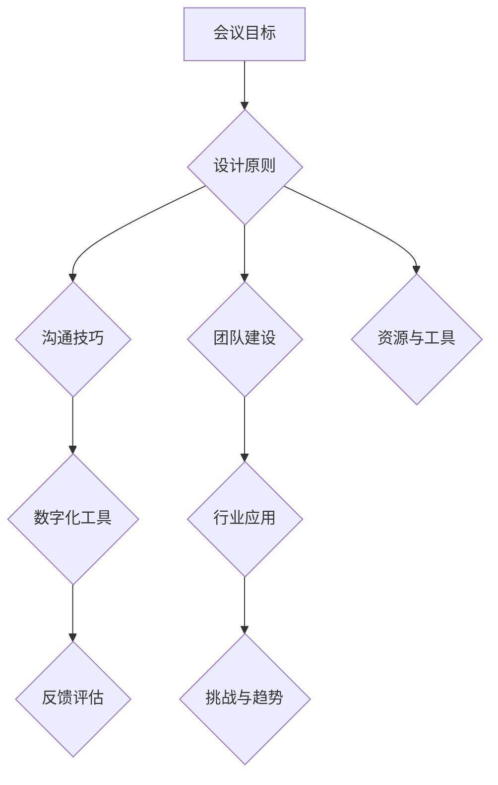

                 

# 高效会议文化：提高团队沟通效率

> **关键词：** 会议文化、团队沟通、效率提升、数字化工具、反馈评估

> **摘要：** 本文旨在探讨高效会议文化的构建及其在团队沟通中的应用，通过分析会议目标、设计原则、沟通技巧、数字化工具和反馈评估等关键要素，为提升团队沟通效率提供实用策略。同时，本文还将分享高效会议文化在不同行业中的应用案例，以及面临的挑战和未来趋势。

### 《高效会议文化：提高团队沟通效率》目录大纲

1. **第一部分：高效会议文化的构建基础**

   1.1 高效会议文化的定义与重要性

   1.2 高效会议的设计原则

   1.3 会议沟通技巧提升

   1.4 高效会议的数字化工具与应用

   1.5 高效会议文化的评估与反馈

2. **第二部分：高效会议文化在团队管理中的应用**

   2.1 高效会议文化在团队建设中的应用

   2.2 高效会议文化在不同行业的应用案例

   2.3 高效会议文化的挑战与未来趋势

3. **附录**

   3.1 高效会议文化相关资源与工具

### 第一部分：高效会议文化的构建基础

#### 第1章：高效会议文化的定义与重要性

**1.1 高效会议文化的概念**

高效会议文化是指一种以高效为目标，注重目标明确、流程优化、沟通技巧、工具应用和反馈评估的会议文化。其核心在于通过系统化的方法，提升会议的效率和质量，确保会议目标的实现。

**1.2 高效会议文化的关键要素**

高效会议文化的关键要素包括：

- **明确会议目标**：确保每个会议都有明确的目标，便于参与者集中精力和资源。
- **优化会议流程**：通过设计合理的会议流程，确保会议顺利进行，提高效率。
- **提升沟通技巧**：通过有效的沟通技巧，增强团队成员之间的信息传递和协作能力。
- **应用数字化工具**：利用现代技术工具，提高会议的效率和互动性。
- **评估与反馈**：通过评估和反馈机制，持续改进会议流程和沟通技巧。

**1.3 高效会议文化的重要性**

高效会议文化的重要性体现在以下几个方面：

- **提高团队沟通效率**：通过优化会议流程和沟通技巧，减少无效沟通，提高团队协作效率。
- **降低会议成本**：通过数字化工具的应用，减少会议时间和资源浪费，降低会议成本。
- **提升决策质量**：通过高效的沟通和讨论，提高决策的质量和准确性。
- **增强团队凝聚力**：通过共同的目标和良好的沟通，增强团队凝聚力和团队精神。

#### 第2章：高效会议的设计原则

**2.1 会议目标明确**

明确会议目标是高效会议设计的基础。会议目标应具体、可量化，并具有明确的优先级。以下是一些设计会议目标的建议：

- **具体化目标**：将目标具体化，明确会议需要达成的具体成果。
- **可量化目标**：确保目标可以量化，便于评估会议成果。
- **优先级排序**：根据目标的紧急程度和重要性进行优先级排序，确保关键目标得到优先讨论。

**2.2 会议流程优化**

优化会议流程是提高会议效率的关键。以下是一些优化会议流程的方法：

- **提前准备**：在会议前准备好所需的资料和设备，确保会议顺利进行。
- **简化流程**：减少不必要的环节，避免冗长和重复的讨论。
- **明确议程**：制定详细的会议议程，明确会议的流程和讨论主题。
- **时间控制**：合理控制会议时间，避免讨论无意义的话题。

**2.3 会议参与者的角色与职责**

明确会议参与者的角色和职责，有助于提高会议的效率。以下是一些角色和职责的设定建议：

- **主持人**：负责主持会议，确保会议按照议程进行，并引导讨论。
- **记录员**：负责记录会议内容和决策结果，确保会议记录的准确性和完整性。
- **参与者**：积极参与讨论，提出意见和建议，并遵守会议规则。
- **观察者**：观察会议过程，提供外部视角和反馈，协助会议改进。

#### 第3章：会议沟通技巧提升

**3.1 沟通技巧的重要性**

沟通技巧是高效会议文化的重要组成部分。有效的沟通技巧能够提高会议的效率和质量，确保信息的准确传递和团队的协作。以下是一些沟通技巧的重要性：

- **提高信息传递效率**：有效的沟通技巧能够减少误解和信息丢失，提高信息传递的效率。
- **增强团队协作**：良好的沟通技巧能够增强团队成员之间的信任和协作，提高团队整体表现。
- **减少沟通成本**：通过有效的沟通技巧，可以避免重复的沟通和无效的讨论，降低沟通成本。
- **提高决策质量**：有效的沟通技巧能够促进团队成员之间的信息共享和讨论，提高决策的质量。

**3.2 沟通技巧的具体方法**

以下是一些提升沟通技巧的具体方法：

- **倾听**：倾听是沟通的基础，通过倾听对方的观点和意见，建立良好的沟通关系。
- **表达清晰**：表达清晰是有效沟通的关键，通过简洁明了的语言和逻辑，确保信息传递的准确性。
- **提问与回应**：通过提问和回应，促进双方的思考和交流，增强沟通的效果。
- **非语言沟通**：非语言沟通包括肢体语言、面部表情和声音等，通过适当的非语言沟通，增强沟通的效果。

**3.3 沟通障碍与解决策略**

在会议沟通中，常见的沟通障碍包括：

- **信息过载**：过多的信息可能导致参与者难以理解或消化，从而降低沟通效果。
- **文化差异**：不同文化背景的参与者可能存在沟通方式和习惯的差异，导致沟通障碍。
- **时间压力**：会议时间有限，可能导致参与者无法充分表达自己的观点，降低沟通效果。

解决策略包括：

- **简化信息**：通过简化信息和突出关键点，减少信息过载。
- **文化敏感**：尊重不同文化的沟通习惯和方式，促进跨文化沟通。
- **合理分配时间**：合理控制会议时间，确保每个参与者都有充分的表达机会。

#### 第4章：高效会议的数字化工具与应用

**4.1 数字化工具的选择**

选择合适的数字化工具是提高会议效率的关键。以下是一些常见数字化工具的选择标准：

- **功能丰富**：工具应具备丰富的功能，满足会议的各种需求，如会议记录、视频会议、文档共享等。
- **易用性**：工具应易于使用，确保参与者能够快速上手，减少学习成本。
- **兼容性**：工具应与其他系统和工具兼容，便于数据整合和协同工作。
- **安全性**：工具应具备良好的安全性，确保会议数据和隐私的安全。

**4.2 数字化工具的使用技巧**

以下是一些数字化工具的使用技巧：

- **会议记录**：使用在线会议记录工具，实时记录会议内容和关键决策，便于后续跟进和回顾。
- **视频会议**：通过视频会议工具，实现远程协作和实时沟通，提高会议的互动性和参与度。
- **文档共享**：利用文档共享工具，方便团队成员实时查看和编辑文档，提高协作效率。

**4.3 数字化工具带来的变革**

数字化工具的应用对会议文化带来了深刻的变革：

- **提高效率**：数字化工具减少了会议前后的准备工作，提高了会议的效率和效果。
- **增强互动**：数字化工具使会议更加互动和参与性，促进了团队成员之间的交流。
- **降低成本**：数字化工具降低了会议的通信和协作成本，提高了团队的整体效能。

#### 第5章：高效会议文化的评估与反馈

**5.1 会议效果的评估指标**

评估会议效果是构建高效会议文化的重要环节。以下是一些常见的评估指标：

- **会议产出**：会议达成的具体成果和任务完成情况。
- **会议时间**：会议的持续时间，包括会议前后的准备工作。
- **参与度**：参与者的参与程度和互动性，可以通过发言次数、提问次数等指标衡量。
- **满意度**：参与者对会议的满意度，可以通过问卷调查、反馈等方式收集。

**5.2 会议反馈的收集与处理**

收集会议反馈是改进会议文化的重要手段。以下是一些收集和处理反馈的方法：

- **问卷调查**：通过问卷调查，收集参与者对会议的反馈和建议，便于发现问题。
- **面对面交流**：与参与者进行面对面交流，深入了解他们的意见和建议。
- **会议记录回顾**：回顾会议记录，总结会议中的优点和不足，提出改进措施。

**5.3 持续改进的策略**

持续改进是构建高效会议文化的关键。以下是一些持续改进的策略：

- **定期评估**：定期对会议效果进行评估，发现问题和不足。
- **反馈机制**：建立反馈机制，确保参与者的意见和建议得到及时反馈和处理。
- **培训与发展**：为参与者提供培训和指导，提高沟通技巧和会议管理能力。
- **创新尝试**：鼓励创新尝试，探索新的会议方式和工具，提高会议的效率和效果。

### 第二部分：高效会议文化在团队管理中的应用

#### 第6章：高效会议文化在团队建设中的应用

**6.1 团队沟通的挑战**

在团队建设中，沟通面临着诸多挑战：

- **信息不对称**：团队成员之间可能存在信息不对称，导致沟通不畅。
- **文化差异**：团队成员来自不同的文化背景，可能存在沟通方式和习惯的差异。
- **时间冲突**：团队成员的时间安排可能存在冲突，导致沟通机会减少。

**6.2 高效会议文化在团队建设中的价值**

高效会议文化在团队建设中具有以下价值：

- **提高沟通效率**：通过明确的会议目标和优化流程，提高团队沟通的效率和质量。
- **增强团队凝聚力**：通过有效的沟通和协作，增强团队的凝聚力。
- **促进知识共享**：通过会议平台，促进团队成员之间的知识共享和交流。
- **提升团队绩效**：通过高效的沟通和协作，提升团队的绩效和成果。

**6.3 团队会议的最佳实践**

以下是一些团队会议的最佳实践：

- **明确会议目标**：确保每个会议都有明确的目标，便于团队成员集中精力和资源。
- **合理分配时间**：合理控制会议时间，确保每个议题都能得到充分讨论。
- **积极参与**：鼓励团队成员积极参与会议，提出意见和建议。
- **记录会议内容**：记录会议内容和关键决策，便于后续跟进和回顾。
- **反馈与改进**：收集会议反馈，持续改进会议流程和沟通技巧。

#### 第7章：高效会议文化在不同行业的应用案例

**7.1 IT行业的高效会议文化实践**

在IT行业，高效会议文化得到了广泛应用。以下是一些高效会议文化的实践案例：

- **敏捷开发**：通过敏捷开发的方法，实现短期迭代和持续交付，提高开发团队的协作效率。
- **Scrum会议**：采用Scrum框架，定期进行站会、迭代计划和回顾会议，确保团队成员的沟通和协作。
- **远程协作**：利用数字化工具，实现远程会议和协作，打破地域限制，提高团队的工作效率。

**7.2 金融行业的高效会议文化实践**

在金融行业，高效会议文化同样具有重要价值。以下是一些高效会议文化的实践案例：

- **投资决策会议**：通过投资决策会议，集中讨论和分析投资项目，提高决策的准确性和效率。
- **风险管理会议**：通过风险管理会议，识别和管理风险，确保金融产品的安全性和合规性。
- **客户沟通会议**：通过客户沟通会议，了解客户需求和市场动态，提供个性化的金融解决方案。

**7.3 教育行业的高效会议文化实践**

在教育行业，高效会议文化有助于提升教学质量和师生沟通。以下是一些高效会议文化的实践案例：

- **教学研讨会**：通过教学研讨会，教师们分享教学经验和创新教学方法，提高教学效果。
- **学生座谈会**：通过学生座谈会，了解学生的学习需求和困难，优化教学计划和教学方法。
- **家校沟通会议**：通过家校沟通会议，促进家长和学校的沟通与合作，共同关注学生的成长和发展。

#### 第8章：高效会议文化的挑战与未来趋势

**8.1 高效会议文化的挑战**

高效会议文化在构建和应用过程中面临以下挑战：

- **时间管理**：会议时间管理不当，可能导致会议冗长和效率低下。
- **参与者参与度**：部分参与者可能存在参与度不高，影响会议的效果。
- **技术挑战**：数字化工具的应用可能面临技术挑战，如稳定性、安全性和兼容性等问题。
- **文化差异**：不同文化背景的团队成员可能存在沟通方式和习惯的差异，影响会议的顺利进行。

**8.2 高效会议文化的未来趋势**

随着技术的发展和团队协作的需求，高效会议文化呈现出以下趋势：

- **数字化工具的普及**：数字化工具将在会议文化中发挥更加重要的作用，提高会议的效率和互动性。
- **远程协作的加强**：远程协作将成为高效会议文化的重要组成部分，适应全球化团队协作的需求。
- **个性化定制**：高效会议文化将更加注重个性化定制，满足不同团队和行业的特定需求。
- **持续改进**：高效会议文化将更加注重持续改进，通过反馈和评估机制，不断提升会议的效率和质量。

### 附录

#### 附录A：高效会议文化相关资源与工具

**A.1 高效会议文化书籍推荐**

- 《高效能人士的七个习惯》
- 《深度工作：如何有效利用每一点脑力》
- 《团队协作工具与技术》

**A.2 高效会议文化培训课程推荐**

- 《敏捷项目管理》
- 《领导力与团队管理》
- 《数字化工具应用与沟通技巧》

**A.3 高效会议文化相关工具介绍**

- **Zoom**：一款功能强大的视频会议工具，支持远程协作和在线会议。
- **Trello**：一款流行的项目管理工具，可以帮助团队规划和跟踪会议议程。
- **Slack**：一款即时通讯工具，便于团队成员之间的实时沟通和协作。

### 核心概念与联系

以下为高效会议文化的核心概念与联系 Mermaid 流程图：



### 核心算法原理讲解

以下是会议流程优化算法的核心原理：

#### 1. 优先级排序算法

伪代码：

```plaintext
function sortPriority(tasks):
    for i from 0 to length(tasks) - 1:
        for j from i + 1 to length(tasks):
            if tasks[j].priority < tasks[i].priority:
                swap(tasks[i], tasks[j])
    return tasks
```

#### 2. 资源分配算法

伪代码：

```plaintext
function allocateResources(tasks, resources):
    sortedTasks = sortPriority(tasks)
    for task in sortedTasks:
        if availableResources >= task.resourceRequirement:
            allocateResourceToTask(task)
            availableResources -= task.resourceRequirement
        else:
            return "Insufficient resources"
    return "All tasks allocated successfully"
```

#### 3. 时间优化算法

伪代码：

```plaintext
function optimizeTime(tasks):
    sortedTasks = sortPriorityByTime(tasks)
    currentTime = 0
    for task in sortedTasks:
        if currentTime + task.duration <= maximumTime:
            scheduleTask(task, currentTime)
            currentTime += task.duration
        else:
            return "Cannot fit all tasks within maximum time"
    return "All tasks scheduled successfully"
```

### 数学模型和数学公式讲解

以下是会议效率评估的数学模型：

$$
\begin{equation}
    E = \frac{P \times T \times C}{M}
\end{equation}
$$

其中，$E$ 为会议效率（Efficiency），$P$ 为会议产出（Production），$T$ 为会议时间（Time），$C$ 为会议成本（Cost），$M$ 为会议目标（Objective）。

#### 举例说明

假设某次会议的产出为 100 单位，会议时间为 2 小时，会议成本为 500 元，会议目标为完成一个项目。根据上述公式，我们可以计算会议效率：

$$
\begin{equation}
    E = \frac{100 \times 2 \times 500}{1} = 100,000
\end{equation}
$$

因此，该次会议的效率为 100,000 单位。

### 项目实战

以下是用 Python 实现会议效率评估的代码示例：

```python
def calculate_meeting_efficiency(production, time, cost, objective):
    efficiency = production * time * cost / objective
    return efficiency

# 示例数据
production = 100  # 产出
time = 2  # 时间（小时）
cost = 500  # 成本（元）
objective = 1  # 目标

# 计算会议效率
efficiency = calculate_meeting_efficiency(production, time, cost, objective)
print(f"会议效率为：{efficiency} 单位")
```

### 代码解读与分析

以上代码定义了一个名为 `calculate_meeting_efficiency` 的函数，用于计算会议效率。该函数接收四个参数：`production`（产出）、`time`（时间）、`cost`（成本）和 `objective`（目标）。根据公式 $E = \frac{P \times T \times C}{M}$，函数返回计算出的会议效率。

在示例数据中，我们设置了产出为 100 单位，时间为 2 小时，成本为 500 元，目标为 1。调用 `calculate_meeting_efficiency` 函数并打印结果，我们可以得到会议效率为 100,000 单位。

这个示例代码简单易懂，可以帮助我们快速实现会议效率的计算。在实际应用中，可以根据具体需求调整函数参数和示例数据，以满足不同的计算场景。此外，我们还可以将此代码集成到现有的会议管理系统中，以实现会议效率的实时评估和监控。

### 作者

**作者：AI天才研究院/AI Genius Institute & 禅与计算机程序设计艺术 /Zen And The Art of Computer Programming**

AI天才研究院致力于探索人工智能的深度研究和技术创新，为全球企业和科研机构提供先进的AI解决方案。同时，我们深耕计算机科学领域，倡导“禅意编程”，追求技术与艺术的完美结合。本文作者通过对高效会议文化的深入研究，结合丰富的实践经验，旨在为团队沟通效率和团队建设提供实用的策略和方法。希望通过本文的分享，能够为读者带来启发和帮助，共同推动团队协作的进步与发展。

