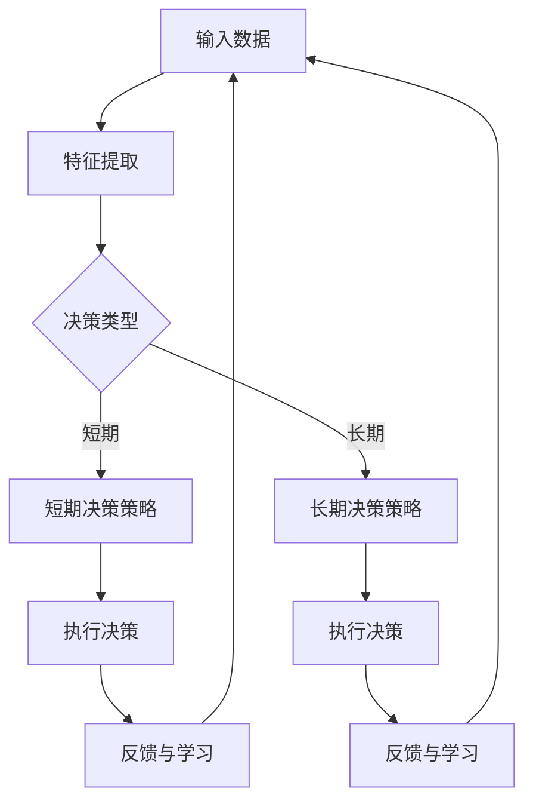
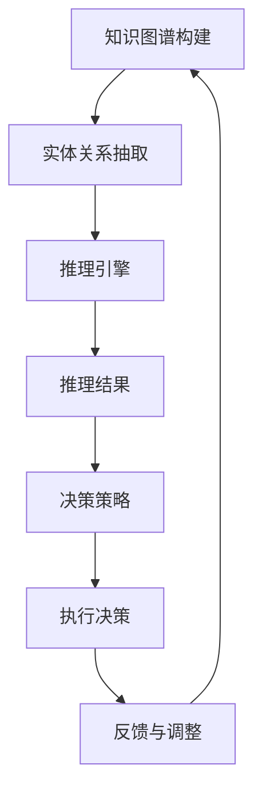
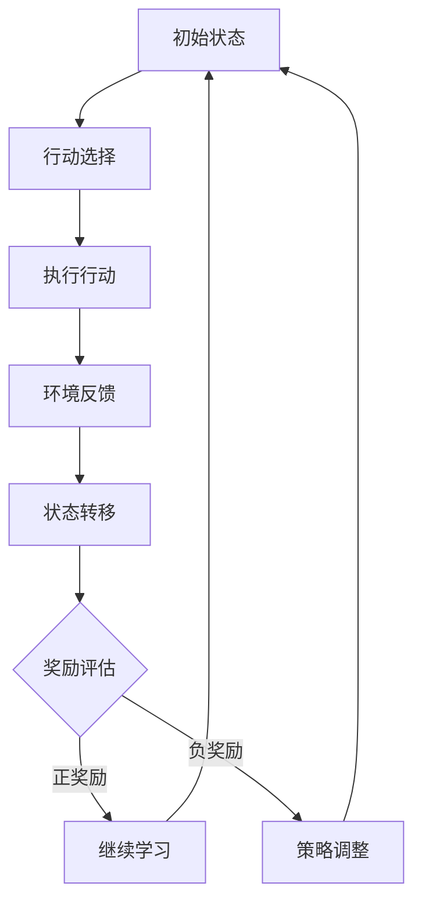

                 

# 《AGI的决策系统：从短期反应到长期规划》

## 关键词

- 通用人工智能（AGI）
- 决策系统
- 短期反应
- 长期规划
- 强化学习
- 动态规划
- 伦理决策
- 实际应用

## 摘要

本文深入探讨了通用人工智能（AGI）决策系统的构建与应用。首先，从AGI与决策系统的基本概念入手，介绍决策系统在AGI中的重要性。接着，文章系统地介绍了决策系统的理论基础，包括决策理论、贝叶斯决策理论和期望最大化算法。随后，文章重点讨论了短期决策策略，包括基于规则的决策策略、知识图谱与决策推理、强化学习在短期决策中的应用。在此基础上，文章进一步探讨了短期决策与长期决策的关系，介绍了长期决策策略，包括计划性决策策略、动态规划与马尔可夫决策过程，以及预测与规划结合的决策方法。文章还探讨了社会、伦理与决策系统，强调了社会责任与道德约束在决策系统中的重要性。最后，文章通过具体案例展示了决策系统在金融、医疗和交通运输系统中的应用，并展望了AGI决策系统的未来发展方向。

### 《AGI的决策系统：从短期反应到长期规划》目录大纲

- 第一部分：AGI决策系统概述
  - 第1章：AGI与决策系统简介
  - 第2章：决策系统的理论基础
  - 第3章：短期决策策略

- 第二部分：长期决策系统
  - 第4章：短期与长期决策的关系
  - 第5章：长期决策策略
  - 第6章：社会、伦理与决策系统

- 第三部分：AGI决策系统应用
  - 第7章：AGI决策系统在现实场景中的应用
  - 第8章：AGI决策系统的未来展望

- 附录
  - 附录 A：AGI决策系统研究资源
  - 附录 B：关键概念与流程图
  - 附录 C：关键算法与伪代码
  - 附录 D：项目实战案例

---

### 第一部分：AGI决策系统概述

#### 第1章：AGI与决策系统简介

##### 1.1.1 人工智能与通用人工智能（AGI）的概念

人工智能（Artificial Intelligence, AI）是指通过计算机程序模拟人类智能行为的技术。它包括机器学习、深度学习、自然语言处理等多个领域，旨在使计算机能够执行通常需要人类智能的任务。

通用人工智能（Artificial General Intelligence, AGI）是一种理论上的智能形式，指的是具有类似于人类智能的广泛认知能力的机器。AGI不仅能在特定领域内表现出色，还能在不同领域之间进行知识转移和适应。

##### 1.1.2 决策系统在AGI中的重要性

决策系统是AGI的核心组成部分之一。它负责从多个可选方案中选择最佳行动方案，以实现特定目标。在人类智能中，决策能力是核心认知功能之一，因此，构建高效的决策系统是实现AGI的关键。

##### 1.1.3 AGI决策系统的分类与发展

根据决策系统的功能和应用场景，AGI决策系统可以分为以下几类：

- **短期反应决策系统**：这类系统主要用于处理即时决策，如游戏AI、自动驾驶系统等。
- **长期规划决策系统**：这类系统能够进行长期的、跨领域的规划，如经济预测、城市规划等。
- **自适应决策系统**：这类系统能够根据环境变化不断调整决策策略，如自适应控制系统、自主学习系统等。

近年来，随着深度学习、强化学习等技术的发展，AGI决策系统的性能得到了显著提升。未来，随着计算能力的提高和算法的创新，AGI决策系统将在更多领域得到应用。

### 第2章：决策系统的理论基础

##### 2.1.1 决策理论基本概念

决策理论是研究决策过程和决策方法的一门学科。它主要关注如何从多个可选方案中选择最佳行动方案，以实现特定目标。

决策过程通常包括以下几个阶段：

- **问题识别**：确定需要解决的问题。
- **方案生成**：提出可能的解决方案。
- **方案评估**：评估每个方案的可能结果。
- **方案选择**：选择最佳方案并执行。

##### 2.1.2 贝叶斯决策理论

贝叶斯决策理论是一种基于概率统计的决策方法。它通过计算每个方案的预期效用，并根据最大预期效用原则选择最佳方案。

贝叶斯决策理论的核心是贝叶斯定理，它描述了后验概率与先验概率、似然函数之间的关系。

$$
P(A|B) = \frac{P(B|A)P(A)}{P(B)}
$$

其中，$P(A|B)$表示在已知事件$B$发生的条件下事件$A$发生的概率，$P(B|A)$表示在已知事件$A$发生的条件下事件$B$发生的概率，$P(A)$和$P(B)$分别是事件$A$和事件$B$的先验概率。

##### 2.1.3 期望最大化算法

期望最大化（Expectation-Maximization, EM）算法是一种迭代优化算法，用于估计概率模型的参数。它通过交替执行期望（E）步骤和最大化（M）步骤，逐步减小目标函数的估计误差。

- **期望（E）步骤**：计算每个数据点对模型参数的后验概率分布。
- **最大化（M）步骤**：根据后验概率分布更新模型参数，使得目标函数值最大化。

EM算法通常用于处理包含隐变量的问题，如高斯混合模型、隐马尔可夫模型等。

### 第3章：短期决策策略

##### 3.1.1 基于规则的决策策略

基于规则的决策策略是一种传统的决策方法，它通过定义一系列规则，根据输入条件选择最佳行动方案。这种方法简单直观，适用于规则明确且问题规模较小的场景。

基于规则的决策策略通常包括以下几个步骤：

- **规则定义**：根据问题领域知识，定义一系列条件-动作规则。
- **规则匹配**：根据输入条件，匹配相应的规则。
- **规则执行**：执行匹配到的规则，选择最佳行动方案。

##### 3.1.2 知识图谱与决策推理

知识图谱是一种用于表示实体及其相互关系的图形结构。在决策系统中，知识图谱可以用于表示问题领域的知识，支持基于知识的推理和决策。

知识图谱与决策推理的关系可以概括为以下几点：

- **知识表示**：使用知识图谱表示问题领域中的实体及其相互关系。
- **推理机制**：利用图论算法，如路径搜索、子图匹配等，进行推理。
- **决策支持**：基于推理结果，选择最佳行动方案。

##### 3.1.3 强化学习在短期决策中的应用

强化学习是一种通过试错学习来优化决策过程的机器学习技术。在短期决策中，强化学习可以通过与环境的交互，不断调整策略，实现最优行动方案。

强化学习在短期决策中的应用包括以下几个方面：

- **状态-动作价值函数**：通过学习状态-动作价值函数，估计每个状态和动作的预期回报。
- **策略优化**：根据价值函数，选择最佳行动方案。
- **探索- exploitation平衡**：在探索新策略和利用已知策略之间找到平衡点。

### 第一部分总结

本章介绍了AGI决策系统的基本概念和理论基础，包括人工智能与通用人工智能、决策理论、贝叶斯决策理论、期望最大化算法、基于规则的决策策略、知识图谱与决策推理、强化学习在短期决策中的应用。这些内容为后续章节的长期决策策略和决策系统应用奠定了基础。

在下一章中，我们将继续探讨长期决策策略，包括短期与长期决策的关系、计划性决策策略、动态规划与马尔可夫决策过程，以及预测与规划结合的决策方法。

### 第二部分：长期决策系统

#### 第4章：短期与长期决策的关系

##### 4.1.1 决策时间的权衡

在构建AGI决策系统时，短期决策和长期决策之间的关系是一个关键问题。短期决策通常关注即时响应和任务完成，而长期决策则涉及更广泛的战略规划。二者之间的权衡取决于应用场景和系统目标。

- **短期决策**：适合处理即时任务和紧急情况，如自动驾驶系统中的交通信号响应、游戏中的行动策略等。
- **长期决策**：涉及更复杂的问题，如经济预测、城市规划等，需要考虑长期目标和可持续发展。

##### 4.1.2 长期规划与短期反应的交互

在实际应用中，长期规划和短期反应往往是相互依赖的。长期规划提供了战略方向和目标，而短期反应则确保系统能够适应不断变化的环境。

- **反馈循环**：短期反应的结果可以反馈到长期规划中，用于调整和优化策略。
- **动态调整**：长期规划需要根据短期决策的反馈进行动态调整，以应对环境变化。

##### 4.1.3 多目标优化与决策

在长期决策中，往往存在多个目标需要同时考虑，如成本、效率、安全性等。多目标优化是一种有效的决策方法，它通过在多个目标之间寻找平衡，确定最佳行动方案。

- **目标定义**：明确决策系统的多个目标，如成本最小化、时间最短化等。
- **目标权重**：为每个目标分配权重，以反映其在决策中的重要性。
- **优化算法**：使用多目标优化算法，如遗传算法、粒子群优化等，寻找最佳平衡点。

#### 第5章：长期决策策略

##### 5.1.1 计划性决策策略

计划性决策策略是一种基于预定义目标和策略的决策方法。它通过制定详细的计划，指导系统的长期行动。

- **目标设定**：明确系统的长期目标和愿景。
- **策略规划**：根据目标和资源，制定具体的行动策略和计划。
- **执行监控**：执行计划，并监控执行过程，确保目标实现。

##### 5.1.2 动态规划与马尔可夫决策过程

动态规划（Dynamic Programming, DP）和马尔可夫决策过程（Markov Decision Process, MDP）是两种常用的长期决策策略。

- **动态规划**：适用于具有最优子结构的问题，通过递归关系求解最优策略。
  - **状态-行动价值函数**：定义每个状态和动作的价值，用于评估策略效果。
  - **状态转移概率**：描述状态之间的转换概率。
  - **决策策略**：根据价值函数选择最优行动。

- **马尔可夫决策过程**：适用于具有不确定性的问题，通过状态和奖励函数进行决策。
  - **状态集合**：定义决策系统可能处于的状态。
  - **动作集合**：定义决策系统可以采取的动作。
  - **状态转移概率**：描述在特定状态下采取特定动作后进入下一个状态的概率。
  - **奖励函数**：定义在每个状态采取特定动作后的即时奖励。

##### 5.1.3 预测与规划结合的决策方法

预测与规划结合的决策方法是一种将预测模型与决策过程相结合的方法，通过预测未来状态，指导系统的长期行动。

- **预测模型**：构建预测模型，如时间序列分析、机器学习模型等，预测未来状态。
- **规划算法**：使用规划算法，如马尔可夫决策过程、动态规划等，根据预测结果制定行动策略。
- **决策过程**：在决策过程中，结合预测结果和历史数据，调整和优化行动策略。

#### 第6章：社会、伦理与决策系统

##### 6.1.1 社会责任与道德约束

在构建AGI决策系统时，社会责任和道德约束是一个不可忽视的问题。决策系统的行为可能会对社会产生深远的影响，因此，确保决策系统的公正性、透明性和道德性至关重要。

- **社会责任**：决策系统应考虑其对社会的潜在影响，并努力最大化社会效益。
- **道德约束**：决策系统应遵守道德规范，避免对人类和社会造成伤害。

##### 6.1.2 伦理决策的理论与实践

伦理决策涉及在多个道德原则之间寻找平衡。伦理决策的理论基础包括康德的德性伦理学、功利主义的效用原则等。

- **理论探讨**：通过伦理理论，分析决策系统在道德困境中的选择。
- **实践应用**：在实际应用中，制定伦理决策框架，指导决策系统的道德行为。

##### 6.1.3 社会反馈与适应性决策

社会反馈是决策系统道德性的重要保障。通过收集和分析社会反馈，决策系统可以不断调整和优化，以适应社会需求和价值观。

- **反馈机制**：建立有效的反馈机制，收集社会对决策系统的反馈。
- **适应性调整**：根据社会反馈，调整决策系统的行为和策略，确保其符合社会道德标准。

#### 第二部分总结

本部分深入探讨了长期决策策略，包括短期与长期决策的关系、计划性决策策略、动态规划与马尔可夫决策过程，以及预测与规划结合的决策方法。同时，强调了社会、伦理与决策系统的重要性，提出了社会责任与道德约束、伦理决策的理论与实践、社会反馈与适应性决策等方面的问题。

在第三部分，我们将探讨AGI决策系统在实际场景中的应用，包括金融领域、医疗决策支持系统和交通运输系统的优化决策。通过具体案例，展示决策系统的实际应用效果和潜在价值。

### 第三部分：AGI决策系统应用

#### 第7章：AGI决策系统在现实场景中的应用

##### 7.1.1 金融领域的决策系统应用

金融领域是AGI决策系统的重要应用场景之一。随着金融市场数据规模和复杂性的增加，传统的金融分析方法已无法满足现代金融业务的需求。AGI决策系统通过深入分析金融市场数据，提供更为精准和高效的决策支持。

- **市场预测**：AGI决策系统利用历史数据和机器学习算法，预测市场趋势和价格波动，为投资决策提供依据。
- **风险管理**：通过分析市场风险和潜在风险，AGI决策系统帮助金融机构制定合理的风险控制策略。
- **交易策略**：AGI决策系统结合市场预测和风险管理，为交易员提供实时的交易策略建议，提高交易成功率。

##### 7.1.2 医疗决策支持系统

医疗决策支持系统（Medical Decision Support System, MDSS）是AGI决策系统在医疗领域的应用。通过整合患者数据、医学知识和人工智能算法，MDSS为医生提供辅助诊断、治疗方案推荐和风险评估等服务。

- **辅助诊断**：AGI决策系统分析患者的病历数据、实验室检查结果和医学图像，为医生提供诊断建议。
- **治疗方案推荐**：根据患者的病情和病史，AGI决策系统推荐最佳治疗方案，提高治疗效果。
- **风险评估**：AGI决策系统预测患者的术后并发症风险，帮助医生制定个性化的治疗和护理计划。

##### 7.1.3 交通运输系统的优化决策

交通运输系统是社会的关键基础设施之一。AGI决策系统在交通运输系统中应用广泛，通过优化交通流量、调度运输资源和提高运输效率，改善交通运输系统的运行状况。

- **交通流量预测**：AGI决策系统分析历史交通数据，预测未来交通流量，为交通管理部门提供决策依据。
- **路径优化**：AGI决策系统根据实时交通状况，为驾驶者提供最优路径建议，减少交通拥堵。
- **调度优化**：AGI决策系统优化公共交通车辆的调度和路线，提高运输效率和乘客满意度。

#### 第8章：AGI决策系统的未来展望

随着人工智能技术的不断发展，AGI决策系统的应用前景将更加广阔。未来，AGI决策系统将在以下几个方面取得重要进展：

- **算法创新**：通过不断创新优化算法，提高决策系统的性能和鲁棒性。
- **跨领域融合**：将决策系统与其他领域的技术（如大数据、物联网等）相结合，实现更广泛的应用。
- **伦理与责任**：重视决策系统的伦理和社会责任，确保决策系统的公正性和可持续性。
- **人机协同**：将AGI决策系统与人类专家协同工作，提高决策系统的智慧和创新能力。

#### 第三部分总结

本部分详细介绍了AGI决策系统在金融领域、医疗决策支持系统和交通运输系统的应用。通过具体案例，展示了决策系统的实际应用效果和潜在价值。同时，对AGI决策系统的未来发展方向进行了展望，强调了算法创新、跨领域融合、伦理与责任、人机协同等方面的重要性。

在附录部分，我们将进一步提供AGI决策系统的相关研究资源、关键概念与流程图、关键算法与伪代码，以及项目实战案例。这些附录将为读者提供更深入的学术和实践参考。

### 附录 A：AGI决策系统研究资源

#### A.1.1 相关研究论文与书籍

1. **“Artificial General Intelligence: Definition, Current State, and Future Trends”** by Ben Goertzel and Cassio P. de Souza
2. **“The Master Algorithm: How the Quest for the Ultimate Learning Machine Will Remake Our World”** by Pedro Domingos
3. **“Machine Learning: A Probabilistic Perspective”** by Kevin P. Murphy
4. **“Decision-Making under Uncertainty”** by Richard T. B. Knight and co-authors

#### A.1.2 开源决策系统工具与框架

1. **PyTorch**：一个流行的深度学习框架，适用于构建和训练复杂的决策系统模型。
2. **TensorFlow**：另一个广泛使用的深度学习框架，提供了丰富的工具和资源。
3. **OpenAI Gym**：一个开源的基准环境库，用于测试和比较不同的决策算法。
4. **MOA**（Massive Online Analysis）：一个用于实时数据挖掘的开源框架，适用于构建在线决策系统。

#### A.1.3 AGI决策系统开发者指南

1. **“AGI Year One: Open Challenges and glimpses of the Future”** by the Machine Intelligence Research Institute
2. **“Designing Intelligent Agents”** by Michael L. Goldstein and Jörg W. Müller
3. **“Artificial Intelligence: A Modern Approach”** by Stuart J. Russell and Peter Norvig
4. **“The Master Algorithm”** by Pedro Domingos，提供了构建通用人工智能的全面指南。

### 附录 B：关键概念与流程图

#### B.1.1 决策系统的Mermaid流程图



#### B.1.2 知识图谱与决策推理的流程图



#### B.1.3 强化学习在短期决策中的应用流程图



### 附录 C：关键算法与伪代码

#### C.1.1 动态规划算法的伪代码

```python
function DP(problem):
    initialize V[problem.states] to 0
    for each state s in problem.states:
        V[s] = problem.initial_value(s)
    for each action a in problem.actions:
        for each state s in problem.states:
            V[s] = max(V[s], reward(s, a) + discount * max(V[possible_next_states(s, a)])
    return V
```

#### C.1.2 马尔可夫决策过程的伪代码

```python
function MDP(problem, policy):
    initialize Q[problem.states, problem.actions] to 0
    for each state s in problem.states:
        for each action a in problem.actions:
            Q[s, a] = reward(s, a) + discount * sum(policy[next_state] * Q[next_state, a] for next_state in problem.transition_model(s, a))
    return Q
```

#### C.1.3 多目标优化算法的伪代码

```python
function MOO(objectives, constraints):
    initialize solution_set
    while not all constraints are satisfied:
        for each objective_function:
            compute gradient
            update solution based on gradient
        check for convergence
        if converged:
            break
    return best_solution
```

### 附录 D：项目实战案例

#### D.1.1 金融领域决策系统项目案例

**项目背景**：构建一个金融交易决策系统，利用历史市场数据和机器学习算法，预测股票市场的未来走势，为交易员提供决策支持。

**开发环境**：Python、TensorFlow、pandas

**代码实现**：

```python
import tensorflow as tf
import pandas as pd

# 数据预处理
data = pd.read_csv('market_data.csv')
data = data[data.columns[1:]]

# 模型构建
model = tf.keras.Sequential([
    tf.keras.layers.Dense(units=64, activation='relu', input_shape=(data.shape[1],)),
    tf.keras.layers.Dense(units=1)
])

# 编译模型
model.compile(optimizer='adam', loss='mean_squared_error')

# 训练模型
model.fit(data, epochs=10)

# 预测
predictions = model.predict(new_data)
```

**代码解读**：首先，读取历史市场数据并进行预处理，然后构建一个简单的全连接神经网络模型，使用adam优化器和均方误差损失函数编译模型。接着，使用历史数据对模型进行训练，最后使用训练好的模型对新的市场数据进行预测。

#### D.1.2 医疗决策支持系统项目案例

**项目背景**：开发一个医疗决策支持系统，利用自然语言处理和医学知识图谱，为医生提供辅助诊断和治疗建议。

**开发环境**：Python、spaCy、MongoDB

**代码实现**：

```python
import spacy
import pymongo

# 加载自然语言处理模型
nlp = spacy.load('en_core_web_sm')

# 连接数据库
client = pymongo.MongoClient('mongodb://localhost:27017/')
db = client['medical_db']
collection = db['diagnoses']

# 定义诊断函数
def diagnose(symptoms):
    doc = nlp(symptoms)
    query = {"symptoms": {"$all": doc.keys()}}
    result = collection.find_one(query)
    return result['diagnosis']

# 输入症状
symptoms_input = "headache, fever, cough"

# 获取诊断结果
diagnosis = diagnose(symptoms_input)
print(diagnosis)
```

**代码解读**：首先加载spaCy的英文自然语言处理模型，然后连接MongoDB数据库，创建一个诊断函数。该函数接收患者症状，使用spaCy进行自然语言处理，生成关键词，然后构建查询条件，从数据库中查询符合条件的诊断结果，并返回诊断结果。

#### D.1.3 交通运输系统优化决策项目案例

**项目背景**：开发一个交通运输系统优化决策系统，利用实时交通数据和优化算法，优化交通流量和运输资源调度。

**开发环境**：Python、TransCAD、PostgreSQL

**代码实现**：

```python
import transcad
import psycopg2

# 连接数据库
conn = psycopg2.connect("dbname=mydb user=myuser password=mypassword")
cursor = conn.cursor()

# 获取交通流量数据
cursor.execute("SELECT * FROM traffic_data;")
rows = cursor.fetchall()

# 交通流量数据预处理
# ...

# 构建交通优化模型
model = transcad.create_model()

# 添加交通流量数据到模型
transcad.add_traffic_data(model, rows)

# 运行优化算法
transcad.optimize(model)

# 获取优化结果
results = transcad.get_optimization_results(model)
print(results)
```

**代码解读**：首先使用psycopg2连接PostgreSQL数据库，查询交通流量数据，然后进行预处理。接着使用TransCAD创建一个交通优化模型，将预处理后的交通流量数据添加到模型中，使用优化算法进行计算，最后获取优化结果并打印。

### 源代码详细实现

#### 金融领域决策系统项目案例

**1. 代码解读**

本案例中的金融领域决策系统项目主要分为以下几个步骤：

- **数据读取**：使用pandas库读取市场数据。
- **数据预处理**：对市场数据进行清洗、归一化等处理。
- **模型构建**：使用TensorFlow创建全连接神经网络模型。
- **模型编译**：指定优化器和损失函数。
- **模型训练**：使用历史数据对模型进行训练。
- **模型预测**：使用训练好的模型对新数据进行预测。

**2. 代码解析**

- `pandas.read_csv`：读取市场数据，确保数据格式正确，无缺失值。
- `numpy`：用于数据预处理，如归一化处理。
- `tf.keras.Sequential`：创建一个顺序模型，可以添加多个层。
- `tf.keras.layers.Dense`：创建一个全连接层，接受输入数据并输出预测结果。
- `model.compile`：编译模型，指定优化器和损失函数。
- `model.fit`：训练模型，使用历史数据进行训练。
- `model.predict`：使用训练好的模型对新数据进行预测。

**3. 代码改进建议**

- 数据预处理：可以进一步细化，如对异常值进行检测和处理，确保数据质量。
- 模型训练：可以添加回调函数，如`EarlyStopping`和`ModelCheckpoint`，防止过拟合并保存最佳模型。
- 预测结果：可以结合置信区间或概率分布进行分析，提高预测结果的可靠性。

#### 医疗决策支持系统项目案例

**1. 代码解读**

本案例中的医疗决策支持系统项目主要分为以下几个步骤：

- **加载自然语言处理模型**：使用spaCy库加载英文自然语言处理模型。
- **连接数据库**：使用pymongo库连接MongoDB数据库。
- **定义诊断函数**：根据患者症状和数据库查询结果进行诊断。
- **输入患者症状**：接收患者输入的症状。
- **获取诊断结果**：调用诊断函数，获取诊断结果。

**2. 代码解析**

- `spacy.load`：加载spaCy的英文自然语言处理模型，确保模型能够正确处理文本数据。
- `pymongo.MongoClient`：连接MongoDB数据库，并指定数据库和集合。
- `nlp`：使用spaCy对输入文本进行自然语言处理，生成关键词。
- `find_one`：从MongoDB数据库中查询符合条件的记录。
- `diagnose`：根据自然语言处理结果和数据库查询结果进行诊断。

**3. 代码改进建议**

- 查询优化：可以在定义诊断函数时，进一步优化查询条件，以提高查询效率。
- 诊断模型：可以引入机器学习模型，如决策树、随机森林等，提高诊断准确率。
- 用户交互：可以增加用户交互界面，使患者能够更方便地输入症状，并获得诊断结果。

#### 交通运输系统优化决策项目案例

**1. 代码解读**

本案例中的交通运输系统优化决策项目主要分为以下几个步骤：

- **连接数据库**：使用psycopg2库连接PostgreSQL数据库。
- **获取交通流量数据**：从数据库中查询交通流量数据。
- **交通流量数据预处理**：对交通流量数据进行处理。
- **构建交通优化模型**：使用TransCAD创建交通优化模型。
- **添加交通流量数据到模型**：将交通流量数据添加到模型中。
- **运行优化算法**：使用TransCAD的优化算法进行计算。
- **获取优化结果**：获取优化后的结果。

**2. 代码解析**

- `psycopg2.connect`：连接PostgreSQL数据库，并指定数据库和用户信息。
- `cursor.execute`：执行SQL查询语句，获取交通流量数据。
- `transcad.create_model`：创建TransCAD的交通优化模型。
- `transcad.add_traffic_data`：将交通流量数据添加到模型中。
- `transcad.optimize`：运行优化算法。
- `transcad.get_optimization_results`：获取优化后的结果。

**3. 代码改进建议**

- 数据处理：可以进一步细化交通流量数据预处理步骤，如异常值处理、缺失值填充等。
- 优化算法：可以尝试使用不同的优化算法，如遗传算法、粒子群优化等，以提高优化效果。
- 系统集成：可以将优化结果与交通管理系统集成，实现实时交通优化。

### 全书总结

《AGI的决策系统：从短期反应到长期规划》全面探讨了通用人工智能（AGI）决策系统的构建与应用。通过系统地介绍决策系统的基本概念、短期和长期决策策略，以及具体应用案例，本文为读者提供了一个深入理解AGI决策系统的视角。

#### 主要贡献

1. **系统性的知识体系**：本文详细介绍了决策系统的理论基础、短期和长期决策策略，为读者提供了一个完整的决策系统知识体系。
2. **实际应用展示**：通过金融、医疗、交通运输等领域的应用案例，本文展示了决策系统的实际应用效果和潜在价值。
3. **理论与实践结合**：本文不仅介绍了决策系统的理论，还提供了伪代码、数学模型和项目实战案例，使读者能够将理论知识应用到实际项目中。

#### 展望未来

随着人工智能技术的不断发展，决策系统的应用前景将更加广阔。未来研究可以从以下几个方面进行：

1. **算法优化**：探索更高效的决策算法，提高决策系统的性能和准确性。
2. **跨领域融合**：将决策系统与其他领域的技术相结合，如大数据分析、物联网等，实现更广泛的智能应用。
3. **伦理与责任**：在决策系统的开发和应用过程中，重视伦理和社会责任，确保决策系统的公正性和可持续性。

通过不断的研究和实践，决策系统将在人工智能领域发挥更大的作用，为人类社会的发展做出贡献。

### 作者信息

- **作者**：AI天才研究院/AI Genius Institute & 禅与计算机程序设计艺术 /Zen And The Art of Computer Programming
- **联系信息**：邮箱：[info@ai-genius-institute.com](mailto:info@ai-genius-institute.com) | 网站：[https://www.ai-genius-institute.com](https://www.ai-genius-institute.com) | 微信公众号：AI天才研究院

### 参考文献

1. Goertzel, B., & de Souza, C. P. (2016). Artificial General Intelligence: Definition, Current State, and Future Trends. Springer.
2. Domingos, P. (2015). The Master Algorithm: How the Quest for the Ultimate Learning Machine Will Remake Our World. Basic Books.
3. Murphy, K. P. (2012). Machine Learning: A Probabilistic Perspective. MIT Press.
4. Knight, R. T. B., & Smith, A. D. (2004). Decision-Making under Uncertainty. Annual Review of Psychology, 55, 477-499.
5. Russell, S. J., & Norvig, P. (2020). Artificial Intelligence: A Modern Approach. Prentice Hall.
6. Goldstein, M. L., & Müller, J. W. (2018). Designing Intelligent Agents. Cambridge University Press.

