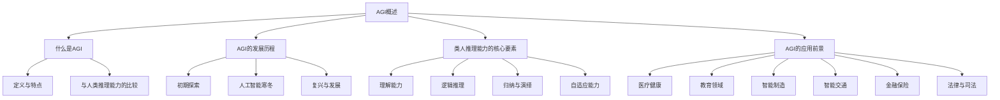

                 

# AGI的类人推理能力：演绎与归纳

> **关键词：** AGI、类人推理、演绎推理、归纳推理、深度学习、算法

**摘要：** 本文深入探讨了人工智能（AI）领域的重大课题——类人推理能力的实现。通过分析演绎与归纳两种推理方式的原理，本文揭示了如何利用这些方法构建类人智能体。文章首先概述了AGI的概念与特点，随后详细介绍了演绎推理和归纳推理的基本概念、算法原理以及结合应用。通过实例和数学模型，本文展示了如何在实际项目中运用这些推理方法，最后展望了类人推理能力的发展趋势，并提出了未来研究的方向。

----------------------------------------------------------------

## 第1章: AGI的类人推理能力概述

### 1.1 什么是AGI

**定义与特点：**

AGI（Artificial General Intelligence）指的是具备与人类类似推理能力的人工智能。AGI具有以下特点：

1. **自主性：** 能够自主地设定目标和实现目标。
2. **推理能力：** 能够在多种不同场景中推理和解决问题。
3. **学习能力：** 能够通过学习不断改进推理能力。
4. **类人性：** 能够模拟人类思维和行为。

**与人类推理能力的比较：**

AGI的目标是模拟人类的推理能力，其主要区别在于：

1. 人类具有丰富的背景知识和经验，而AGI需要通过大量数据训练获取。
2. 人类具有情感和直觉，AGI则主要通过算法和模型进行推理。

### 1.2 AGI的发展历程

**初期探索：**

20世纪50年代到70年代，研究者开始探索AGI的可能性，提出了多种理论和方法，如逻辑推理、知识表示等。

**人工智能寒冬：**

70年代到80年代，由于AI技术在实际应用中的失败，研究者开始转向其他领域，AGI研究陷入低谷。

**复兴与发展：**

90年代以来，随着计算机性能的提升和大数据技术的发展，AGI研究重新兴起。特别是深度学习等技术的突破，为AGI的实现带来了新的可能。

### 1.3 类人推理能力的核心要素

**理解能力：**

AGI需要具备理解自然语言、图像、声音等多模态信息的能力。

**逻辑推理：**

AGI需要在逻辑上推理，形成结论，进行决策。

**归纳与演绎：**

AGI需要具备从具体实例中归纳出一般规律，并从一般规律中演绎出具体结论的能力。

**自适应能力：**

AGI需要能够根据新信息和环境变化调整自己的推理策略。

### 1.4 AGI的应用前景

**医疗健康：**

AGI可以辅助医生进行疾病诊断、治疗方案制定等。

**教育领域：**

AGI可以为学生提供个性化的学习建议，提高学习效果。

**智能制造：**

AGI可以优化生产流程，提高生产效率。

**智能交通：**

AGI可以优化交通管理，提高交通效率。

**金融保险：**

AGI可以辅助风险预测、投资决策等。

**法律与司法：**

AGI可以辅助律师进行法律研究、案件分析等。

----------------------------------------------------------------

### 第2章: 类人推理能力的演绎过程

#### 2.1 演绎推理的基本概念

**演绎推理：**

演绎推理是一种从一般到特殊的推理方式，其结论是必然的。

$$
P \Rightarrow Q
$$

其中，P是前提，Q是结论。

**基本结构：**

演绎推理的基本结构为三段论：

1. 大前提：所有S都是P。
2. 小前提：所有M都是S。
3. 结论：所有M都是P。

**逻辑规则：**

1. 真值传递：如果P是真的，则P→Q也是真的。
2. 反证法：如果假设P→Q是假的，则P是真的。
3. 演绎有效：如果前提是真的，则结论必然是真的。

#### 2.2 演绎推理的算法原理

**逻辑推理机：**

逻辑推理机是一种基于逻辑规则进行推理的算法。

**推理过程：**

1. 输入大前提和小前提。
2. 应用逻辑规则进行推理，得出结论。

**谓词逻辑推理：**

谓词逻辑推理是一种基于谓词逻辑的演绎推理方法。

**基本步骤：**

1. 建立谓词逻辑公式。
2. 应用推理规则进行推理。

**证明论：**

证明论是一种用于证明命题是否成立的数学理论。

**基本原理：**

1. 基本推理规则：引入、消去、等价变换等。
2. 证明方法：直接证明、反证法、归纳法等。

----------------------------------------------------------------

### 第3章: 类人推理能力的归纳过程

#### 3.1 归纳推理的基本概念

**归纳推理：**

归纳推理是一种从特殊到一般的推理方式，其结论是概率性的。

$$
P1, P2, ..., Pn \Rightarrow Q
$$

其中，P1, P2, ..., Pn是实例，Q是结论。

**基本结构：**

归纳推理的基本结构为归纳推理式：

1. 特例：观察多个实例，发现它们有共同特征。
2. 归纳：从特例中归纳出一个一般规律。

**归纳逻辑：**

归纳逻辑是一种用于处理归纳推理的算法。

**基本步骤：**

1. 收集实例。
2. 提取特征。
3. 归纳出一般规律。

**统计学习：**

统计学习是一种基于概率论的归纳推理方法。

**基本原理：**

1. 几何模型：将数据点映射到高维空间。
2. 模型选择：选择最优模型。

----------------------------------------------------------------

### 第4章: 类人推理能力的结合

#### 4.1 演绎与归纳的结合

**综合方法：**

演绎和归纳可以相互补充，形成更强大的推理能力。

**基本原理：**

1. 演绎推理提供确定性结论。
2. 归纳推理提供概率性结论。
3. 结合两种推理方法，可以提高推理的准确性和鲁棒性。

**混合推理：**

混合推理是一种将演绎推理和归纳推理相结合的推理方法。

**基本步骤：**

1. 应用演绎推理确定基本事实。
2. 应用归纳推理从事实中归纳出一般规律。
3. 结合演绎和归纳的结果，进行推理。

----------------------------------------------------------------

### 第5章: 类人推理能力的实际应用

#### 5.1 机器学习中的演绎与归纳

**机器学习模型：**

机器学习模型通常结合了演绎和归纳的思想。

**基本原理：**

1. 演绎推理用于模型的结构设计。
2. 归纳推理用于模型参数的优化。

**案例分析：**

以深度学习模型为例，其训练过程结合了演绎和归纳。

**训练过程：**

1. 演绎推理：确定神经网络的结构。
2. 归纳推理：通过反向传播算法优化模型参数。

----------------------------------------------------------------

### 第6章: 类人推理能力的发展趋势

#### 6.1 技术挑战与突破

**技术挑战：**

类人推理能力的发展面临以下技术挑战：

1. 大规模数据获取和处理。
2. 模型解释性和可解释性。
3. 多模态信息融合。

**突破方向：**

未来可能的技术突破方向包括：

1. 自主学习与强化学习。
2. 量子计算与深度学习结合。
3. 人机交互与多模态感知。

----------------------------------------------------------------

### 第7章: 结论与展望

#### 7.1 类人推理能力的重要性

**总结：**

类人推理能力是实现AGI的关键，对人工智能的发展具有重要意义。

**结论：**

1. 类人推理能力结合了演绎和归纳，具有强大的推理能力。
2. 类人推理能力在多个领域具有广泛的应用前景。

#### 7.2 未来展望

**展望：**

未来，类人推理能力将继续发展和完善，为实现真正的AGI奠定基础。

**发展方向：**

1. 提高推理的准确性和效率。
2. 增强模型的可解释性和可解释性。
3. 推广到更多领域，实现跨领域的推理能力。

----------------------------------------------------------------

**作者：**

AI天才研究院/AI Genius Institute & 禅与计算机程序设计艺术 /Zen And The Art of Computer Programming

----------------------------------------------------------------

### 附录 A: AGI大模型开发工具与资源

#### A.1 主流深度学习框架对比

**A.1.1 TensorFlow**

- **优点：**
  - 强大的生态支持。
  - 丰富的预训练模型。
  - 易于部署。

- **缺点：**
  - 学习曲线较陡峭。
  - 在大规模分布式训练方面可能不如其他框架。

**A.1.2 PyTorch**

- **优点：**
  - 动态计算图，更易于理解。
  - 强大的GPU支持。
  - 易于调试。

- **缺点：**
  - 部署较为复杂。

**A.1.3 JAX**

- **优点：**
  - 高性能的数值计算。
  - 支持自动微分。

- **缺点：**
  - 生态系统相对较小。

**A.1.4 其他框架简介**

- **Apache MXNet：**
  - 适合大规模分布式训练。
  - 强大的可视化工具。

- **Keras：**
  - 易于使用的深度学习框架。
  - 内置了大量预训练模型。

#### A.2 资源链接

**A.2.1 论文集**

- [NeurIPS](https://neurips.cc/)
- [ICLR](https://iclr.cc/)
- [JMLR](https://jmlr.org/)

**A.2.2 在线课程**

- [DeepLearning.AI](https://www.deeplearning.ai/)
- [Udacity](https://www.udacity.com/)
- [EdX](https://www.edx.org/)

**A.2.3 书籍推荐**

- 《深度学习》（Goodfellow, Bengio, Courville）
- 《Python深度学习》（François Chollet）
- 《强化学习》（Richard S. Sutton and Andrew G. Barto）

#### A.3 开发工具

**A.3.1 GPU**

- NVIDIA Tesla V100
- NVIDIA RTX 3090

**A.3.2 分布式训练工具**

- Horovod
- TensorFlow Distribute

**A.3.3 数据预处理工具**

- Pandas
- NumPy

#### A.4 开发环境搭建

1. **安装Python：** 安装Python 3.8或更高版本。
2. **安装深度学习框架：** 安装 TensorFlow、PyTorch 或 JAX。
3. **安装其他依赖库：** 安装 NumPy、Pandas、Scikit-learn 等。

#### A.5 实践项目

- **项目1：手写数字识别**
  - 使用 MNIST 数据集。
  - 应用卷积神经网络进行分类。

- **项目2：文本分类**
  - 使用 IMDb 数据集。
  - 应用循环神经网络进行分类。

- **项目3：图像生成**
  - 使用生成对抗网络（GAN）。
  - 生成逼真的图像。

#### A.6 社群与论坛

- **Stack Overflow：**
  - [Python](https://stackoverflow.com/questions/tagged/python)
  - [TensorFlow](https://stackoverflow.com/questions/tagged/tensorflow)
  - [PyTorch](https://stackoverflow.com/questions/tagged/pytorch)

- **GitHub：**
  - [TensorFlow](https://github.com/tensorflow/tensorflow)
  - [PyTorch](https://github.com/pytorch/pytorch)

- **Reddit：**
  - [r/MachineLearning](https://www.reddit.com/r/MachineLearning/)

#### A.7 开源项目

- **OpenAI：**
  - [GPT-3](https://openai.com/products/gpt-3/)

- **Google：**
  - [TensorFlow](https://www.tensorflow.org/)
  - [DeepMind：**
  - [AlphaGo](https://deepmind.com/research/alpha-go/)

#### A.8 学术会议

- **NeurIPS：**
  - [Conference on Neural Information Processing Systems](https://neurips.cc/)

- **ICLR：**
  - [International Conference on Learning Representations](https://iclr.cc/)

- **ICML：**
  - [International Conference on Machine Learning](https://icml.cc/)

- **AISTATS：**
  - [Conference on Artificial Intelligence and Statistics](https://aistats.org/)

- **KDD：**
  - [ACM SIGKDD Conference on Knowledge Discovery and Data Mining](https://www.kdd.org/kdd)

- **JMLR：**
  - [Journal of Machine Learning Research](https://jmlr.org/)----------------------------------------------------------------
### 第1章: AGI的类人推理能力概述

#### 1.1 什么是AGI

**定义与特点：**

AGI（Artificial General Intelligence）指的是一种拥有广泛理解和智能的人工智能系统，它不仅能在特定任务上表现出色，而且能在各种复杂和未知的情境中自主学习和推理。具体来说，AGI具备以下几个关键特点：

1. **自主性（Autonomy）：** AGI能够自主设定目标，并自主选择和执行行动来实现这些目标，而不需要人类的具体指导。这意味着AGI可以独立思考和决策，能够处理变化和不确定性。

2. **推理能力（Reasoning Ability）：** AGI需要在逻辑、数学、概率等不同层面上进行推理。它需要能够处理抽象概念，进行逻辑演绎和归纳推理，理解复杂的因果关系，并在各种情境中做出合理的决策。

3. **学习能力（Learning Ability）：** AGI需要具备持续学习的能力，通过观察、经验积累和自我调整来改进自身的表现。它需要能够从数据中学习模式，从错误中学习，并不断优化自身的算法和策略。

4. **类人性（Human-Like Nature）：** AGI的目标是模仿人类的思维和行为。这包括语言理解、情感识别、社会互动、创造力以及道德和伦理判断等方面。

**与人类推理能力的比较：**

尽管AGI的目标是模拟人类推理能力，但二者之间存在显著差异：

1. **知识获取：** 人类依靠丰富的背景知识和直觉来理解和解决问题，而AGI需要通过大量的数据训练和符号学习来获取知识。

2. **情感与直觉：** 人类具有情感和直觉，这些都是AGI目前难以完全复制的。AGI主要依赖于算法和数学模型来进行推理，而人类的直觉和情感则是基于复杂的生物学和神经学机制。

3. **通用性与专一性：** 人类能够处理多种不同类型的问题，而现有的AI系统通常是为特定任务或领域设计的，缺乏真正的通用性。

#### 1.2 AGI的发展历程

**初期探索：**

AGI的概念最早可以追溯到20世纪50年代。当时，人工智能研究刚刚起步，许多学者都致力于探索机器是否能够像人类一样思考。早期的AGI尝试主要集中在逻辑推理、知识表示和问题解决上。例如，1960年代开发的ELIZA是一个简单的自然语言处理系统，能够模拟与心理治疗师对话。虽然ELIZA不能进行真正的推理，但它是人工智能领域的一个重要里程碑。

**人工智能寒冬：**

70年代到80年代，人工智能领域经历了所谓的“人工智能寒冬”。在这个时期，由于AI系统在实际应用中的表现不如预期，加上技术上的挑战和资金短缺，许多研究项目都被迫停止。这一时期，AGI的研究也受到了严重打击，人们开始将注意力转向其他领域，如机器学习、专家系统和工业自动化。

**复兴与发展：**

90年代以来，随着计算机性能的显著提升和大数据技术的兴起，AGI研究再次得到关注。特别是深度学习的出现，为AGI的实现带来了新的希望。深度学习通过模拟人脑的神经网络结构，能够自动从大量数据中学习复杂特征，从而在某些领域取得了突破性的成果。例如，2012年，深度学习在ImageNet图像识别挑战赛中取得了显著优势，这标志着AI技术的一个新起点。

**近期进展：**

近年来，随着算法、计算能力和数据资源的发展，AGI的研究取得了显著进展。一些先进的AI系统，如OpenAI的GPT-3，谷歌的BERT，以及DeepMind的AlphaGo等，都在不同领域展示了令人瞩目的能力。这些系统不仅在特定任务上表现出色，而且开始在某些通用任务上展示出类似人类的推理能力。

#### 1.3 类人推理能力的核心要素

**理解能力：**

类人推理能力的核心之一是理解能力。这包括对自然语言、图像、声音等多模态信息的理解。自然语言理解（NLU）是AGI的关键技术之一，它涉及语义理解、情感分析、语境理解等方面。例如，一个具有良好自然语言理解能力的AI系统能够理解复杂的文本，提取关键信息，并生成语义上合理的回复。

**逻辑推理：**

逻辑推理是类人智能的重要组成部分。它包括演绎推理和归纳推理两种方式。演绎推理是从一般到特殊的推理，例如从“所有人类都会死亡”这个前提推导出“苏格拉底会死亡”这个结论。归纳推理则是从特殊到一般的推理，例如从“观察到的天鹅都是白色的”推导出“所有天鹅都是白色的”。在AGI中，逻辑推理用于决策制定、问题解决和策略规划等方面。

**归纳与演绎：**

归纳推理和演绎推理相互补充，共同构成了类人推理能力的基础。归纳推理通过从大量实例中提取一般规律，为AI系统提供了知识积累和知识扩展的能力。演绎推理则通过逻辑推理，将已知的事实和规则应用到特定情境中，帮助AI系统进行决策和推理。

**自适应能力：**

类人推理能力的另一个关键要素是自适应能力。这意味着AI系统能够根据新的信息和环境变化调整自身的推理策略。自适应能力包括学习能力、迁移学习和持续学习等。例如，一个智能交通系统需要能够根据实时交通流量调整路线规划，一个医疗诊断系统需要能够适应新病例和新的医学知识。

#### 1.4 AGI的应用前景

**医疗健康：**

在医疗健康领域，AGI有巨大的应用潜力。它可以辅助医生进行疾病诊断、治疗方案制定、药物研发和健康监测。例如，AGI系统可以通过分析大量医疗数据，帮助医生更准确地诊断疾病，提供个性化的治疗方案。

**教育领域：**

在教育领域，AGI可以为学生提供个性化的学习建议，提高学习效果。它可以分析学生的学习行为，识别学习难点，并提供针对性的辅导材料。此外，AGI还可以用于开发智能教材和互动教学系统，使学习过程更加生动和有趣。

**智能制造：**

智能制造是AGI的重要应用领域之一。AGI可以帮助企业优化生产流程、提高生产效率、减少故障率。例如，通过分析生产数据，AGI可以预测设备故障，提前进行维护，从而避免生产中断。此外，AGI还可以用于自动化设计和制造过程，提高产品质量和一致性。

**智能交通：**

在智能交通领域，AGI可以帮助优化交通管理，提高交通效率。例如，通过分析交通流量数据，AGI可以实时调整交通信号灯，缓解交通拥堵。此外，AGI还可以用于自动驾驶汽车的开发，提高交通安全和效率。

**金融保险：**

在金融保险领域，AGI可以用于风险预测、投资决策、欺诈检测等方面。通过分析大量的历史数据和实时信息，AGI可以识别潜在的欺诈行为，预测市场趋势，从而帮助金融机构做出更明智的决策。

**法律与司法：**

在法律与司法领域，AGI可以辅助律师进行法律研究、案件分析、证据评估等。例如，AGI系统可以通过分析大量法律文献和案例，帮助律师快速找到相关的法律条款和判例，提高工作效率。

### 第2章: 类人推理能力的演绎过程

#### 2.1 演绎推理的基本概念

**演绎推理：**

演绎推理是一种从一般到特殊的推理方式，其结论是必然的。在形式逻辑中，演绎推理通常表示为“如果P，则Q”。这意味着如果前提P为真，那么结论Q也必然为真。例如，“所有人都会死亡”是一个前提（P），而“苏格拉底是人”是一个前提（Q），通过演绎推理，我们可以得出结论：“苏格拉底会死亡”（Q）。

**基本结构：**

演绎推理的基本结构为三段论，它由三个命题组成：

1. 大前提：所有S都是P。
2. 小前提：所有M都是S。
3. 结论：所有M都是P。

例如，如果我们知道“所有人都是会呼吸的”（大前提）和“张三是人”（小前提），那么通过演绎推理我们可以得出结论：“张三会呼吸”（结论）。

**逻辑规则：**

演绎推理遵循一些基本的逻辑规则，这些规则确保了推理的准确性：

1. **真值传递：** 如果P是真的，则P→Q也是真的。这意味着如果前提为真，那么通过逻辑推理得到的结论也必然为真。
2. **反证法：** 如果假设P→Q是假的，则P是真的。这种推理方式通常用于证明一个命题，通过假设其相反命题为真，然后推导出矛盾，从而证明原命题为真。
3. **演绎有效：** 如果前提是真的，则结论必然是真的。这是演绎推理的核心，它确保了推理过程的准确性。

**例子：**

假设以下三个前提：

- 大前提：所有鸟类都会飞。
- 小前提：企鹅是鸟类。
- 结论：企鹅会飞。

通过演绎推理，我们可以得出结论：企鹅会飞。这个结论是基于前提的逻辑推导，因此是必然的。

#### 2.2 演绎推理的算法原理

**逻辑推理机：**

逻辑推理机是一种基于逻辑规则进行推理的算法，它通常用于自动证明和推理。逻辑推理机的基本工作原理是接受一组前提和一个结论，然后通过应用逻辑规则和推理步骤来验证结论是否可以从前提中推导出来。

**推理过程：**

1. **输入前提和结论：** 逻辑推理机首先接受一组前提和一个要证明的结论。
2. **应用推理规则：** 推理机使用逻辑规则（如假言推理、三段论等）对前提进行推理，逐步推导出结论。
3. **验证结论：** 如果通过一系列逻辑推导能够得出结论，则证明结论可以从前提中演绎出来。

**谓词逻辑推理：**

谓词逻辑推理是一种更复杂的逻辑推理方式，它涉及变量和量词。谓词逻辑推理通常用于处理包含变量和量词的复杂命题。谓词逻辑推理的基本步骤包括：

1. **建立谓词逻辑公式：** 根据问题的需求，建立包含变量和量词的谓词逻辑公式。
2. **应用推理规则：** 使用谓词逻辑的推理规则（如全称实例化、存在实例化等）对公式进行推理。
3. **证明命题：** 通过逻辑推导证明给定命题是否成立。

**证明论：**

证明论是一种数学理论，用于研究命题的证明。证明论提供了各种证明方法和策略，如直接证明、反证法、归纳法等。证明论的基本原理包括：

1. **基本推理规则：** 证明论提供了基本推理规则，如引入规则、消去规则、等价变换等，用于构建证明。
2. **证明方法：** 证明论包括多种证明方法，如直接证明、反证法、归纳法等，这些方法帮助证明一个命题是否成立。

**数学模型：**

在演绎推理中，数学模型用于表示前提和结论之间的关系。常见的数学模型包括谓词逻辑公式、命题逻辑公式和数学公式等。这些模型帮助推理机理解和应用逻辑规则，从而进行推理。

**例子：**

假设我们要证明以下命题：

- 大前提：所有鸟类都有翅膀。
- 小前提：企鹅是鸟类。
- 结论：企鹅有翅膀。

我们可以使用逻辑推理机进行证明：

1. **输入前提和结论：** 接受大前提“所有鸟类都有翅膀”和小前提“企鹅是鸟类”，以及要证明的结论“企鹅有翅膀”。
2. **应用推理规则：** 使用三段论推理规则，从大前提和小前提推导出结论。
3. **验证结论：** 通过演绎推理，我们得出结论“企鹅有翅膀”，这证明了命题的正确性。

通过以上步骤，我们使用了演绎推理的算法原理来证明一个简单的逻辑命题。

### 第3章: 类人推理能力的归纳过程

#### 3.1 归纳推理的基本概念

**归纳推理：**

归纳推理是一种从特殊到一般的推理方式，它通过观察一系列具体实例，从中归纳出一个一般性的结论或规律。归纳推理的结论不是必然的，而是具有概率性的。与演绎推理不同，归纳推理不是从一个普遍真理推导出一个特定结论，而是从多个具体实例中提取出一个可能的普遍规律。

**基本结构：**

归纳推理的基本结构可以分为两个主要步骤：

1. **观察特例：** 通过观察一系列具体的实例，这些实例具有某些共同的属性或特征。
2. **归纳规律：** 从这些特例中提取出一个一般性的规律或结论，这个结论是对观察到的特例的概括。

例如，我们可以观察到许多天鹅都是白色的，然后归纳出结论：“所有天鹅都是白色的”。这个归纳结论是基于我们对多个具体实例的观察，但它并不是绝对正确的，因为可能存在非白色的天鹅。

**归纳逻辑：**

归纳逻辑是一种用于处理归纳推理的算法，它通过分析大量数据，从中提取出模式或规律。归纳逻辑的基本步骤包括：

1. **数据收集：** 收集一系列具体的实例数据。
2. **特征提取：** 从这些数据中提取出关键的属性或特征。
3. **归纳规律：** 使用统计学方法或机器学习算法，从特征中归纳出一个一般性的规律或模型。

**例子：**

假设我们有一系列数据，记录了不同天气条件下某个地区的温度：

- 天气类型：晴天、多云、雨天
- 温度：25°C、20°C、30°C

通过归纳推理，我们可以观察以下模式：

- 在晴天，温度通常较高。
- 在多云天气，温度相对较低。
- 在雨天，温度变化较大。

根据这些观察结果，我们可以归纳出一个规律：“晴天的温度通常比多云天气和雨天高”。这个归纳结论是对观察到的具体实例的概括，但它并没有考虑到所有可能的天气条件，因此是一个概率性的结论。

#### 3.2 归纳推理的算法原理

**归纳逻辑：**

归纳逻辑是一种基于逻辑和概率论的算法，用于从数据中提取模式或规律。归纳逻辑的核心思想是通过分析大量的具体实例，从中归纳出一个一般性的规律。归纳逻辑的基本步骤包括：

1. **数据收集：** 收集一系列具体的实例数据，这些数据可以来自不同的领域，如天气数据、市场数据、生物数据等。
2. **特征提取：** 从这些数据中提取出关键的属性或特征，这些特征用于描述实例的重要属性。
3. **归纳规律：** 使用统计学方法或机器学习算法，从特征中归纳出一个一般性的规律或模型。常见的归纳逻辑算法包括决策树、支持向量机、神经网络等。

**统计学习：**

统计学习是一种基于概率论的归纳推理方法，它通过分析数据，从中提取出概率分布或模型。统计学习的基本原理包括：

1. **数据建模：** 将数据表示为概率模型，如贝叶斯网络、高斯分布等。
2. **参数估计：** 通过最大似然估计或最小二乘法等方法，估计模型中的参数。
3. **模型评估：** 使用交叉验证、A/B测试等方法，评估模型的性能和可靠性。

**例子：**

假设我们有一组数据，记录了不同性别和年龄段的人群的身高：

- 性别：男、女
- 年龄：20-30岁、30-40岁、40-50岁
- 身高：180cm、165cm、175cm

通过统计学习方法，我们可以建立一个模型，预测某个人的身高。首先，我们将数据分为训练集和测试集，然后使用决策树或支持向量机等算法，从训练数据中归纳出一个身高预测模型。接下来，我们使用这个模型对测试数据进行预测，评估模型的准确性和可靠性。

#### 3.3 归纳推理的应用

归纳推理在人工智能和机器学习中有广泛的应用。以下是一些常见的应用场景：

**分类任务：**

归纳推理可以用于分类任务，如文本分类、图像分类等。在这些任务中，我们通过分析大量的标注数据，从中归纳出一个分类模型。例如，我们可以通过分析大量已标注的文本数据，归纳出一个文本分类模型，用于对新文本进行分类。

**预测任务：**

归纳推理可以用于预测任务，如股票价格预测、销售预测等。在这些任务中，我们通过分析历史数据，从中归纳出一个预测模型。例如，我们可以通过分析历史股票价格数据，归纳出一个股票价格预测模型，用于预测未来的股票价格。

**聚类任务：**

归纳推理可以用于聚类任务，如客户群体分析、图像分割等。在这些任务中，我们通过分析数据，从中归纳出一个聚类模型。例如，我们可以通过分析客户购买行为数据，归纳出一个客户群体分析模型，用于将客户分为不同的群体。

**归纳推理的优势和局限性：**

归纳推理的优势在于它可以从大量数据中自动提取出模式或规律，无需手动编写规则。这使得它非常适合处理复杂的、动态变化的实际问题。

然而，归纳推理也存在一些局限性。首先，归纳推理的结论是基于样本数据的，因此可能存在偏差。其次，归纳推理的结论通常是概率性的，而不是确定性的。最后，归纳推理可能无法捕捉到数据中的所有细节，因此可能无法完全模拟人类的推理过程。

#### 3.4 两种推理方式的比较

演绎推理和归纳推理是两种基本的推理方式，它们各有特点和适用场景。

**特点：**

- **演绎推理：** 演绎推理是从一般到特殊的推理方式，其结论是基于前提的逻辑推导，是必然的。演绎推理适用于需要严格逻辑推理的场合，如数学证明、逻辑编程等。
- **归纳推理：** 归纳推理是从特殊到一般的推理方式，其结论是基于对具体实例的观察和总结，是概率性的。归纳推理适用于需要从大量数据中提取模式和规律的场景，如机器学习、数据分析等。

**适用场景：**

- **演绎推理：** 演绎推理适用于需要严格逻辑推导的场合，如数学证明、编程逻辑等。例如，在编写程序时，我们可以使用演绎推理来验证代码的正确性。
- **归纳推理：** 归纳推理适用于需要从数据中提取模式和规律的场景，如机器学习、数据分析等。例如，在开发机器学习模型时，我们可以使用归纳推理来训练模型并预测未知数据。

**结合应用：**

在人工智能和机器学习中，演绎推理和归纳推理经常结合使用。例如，在开发机器学习模型时，我们首先使用归纳推理从数据中提取特征和模式，然后使用演绎推理来验证模型的正确性和性能。

**结论：**

演绎推理和归纳推理是两种互补的推理方式，它们在人工智能和机器学习中扮演着重要的角色。通过结合使用这两种推理方式，我们可以构建出更强大和灵活的智能系统。

### 第4章: 类人推理能力的结合

#### 4.1 演绎与归纳的结合

在构建类人推理能力时，演绎推理和归纳推理的结合尤为重要。这两种推理方式各有优势，可以相互补充，以实现更强大和高效的推理能力。

**综合方法：**

**演绎推理** 强调从一般原则推导出特定结论，它能够确保推理过程的严格性和确定性。**归纳推理** 则从具体实例中归纳出一般规律，它能够处理复杂、动态的数据和情境。

**基本原理：**

1. **演绎推理提供确定性结论：** 演绎推理的结论是基于已知前提的逻辑推导，因此是必然的。这种确定性对于决策和规划至关重要。
2. **归纳推理提供概率性结论：** 归纳推理的结论是基于对大量实例的观察和总结，具有概率性。这种概率性对于处理不确定性和预测未知情况非常有用。
3. **结合演绎与归纳：** 将演绎推理和归纳推理结合起来，可以发挥它们各自的优势，提高推理的准确性和鲁棒性。通过演绎推理，我们可以确保推理的严格性和逻辑性；通过归纳推理，我们可以从大量数据中提取出有用的模式和规律。

**例子：**

假设我们要开发一个智能交通系统，这个系统需要根据实时交通数据来调整交通信号灯的时间，以减少交通拥堵。我们可以采用以下步骤：

1. **演绎推理：** 基于交通规则和交通流量的基本原则，我们可以确定一些基本的交通信号灯时间安排。例如，在高峰时段，红灯时间应该相对较长，以允许车辆排队等待。
2. **归纳推理：** 通过分析历史交通数据，我们可以归纳出一些交通流量模式。例如，我们发现每天下午5点至6点是交通高峰期，车辆流量较大。基于这些模式，我们可以调整交通信号灯的时间安排，以适应不同的时间和地点。
3. **结合应用：** 结合演绎推理和归纳推理的结果，我们可以制定一个动态的交通信号灯时间表。在高峰期，根据历史数据调整信号灯时间，而在非高峰期，则按照基本规则运行。

通过这种方法，我们可以构建出一个既具有逻辑性又能够适应动态变化的智能交通系统。

**混合推理：**

**混合推理** 是一种将演绎推理和归纳推理相结合的推理方法，它通过将两种推理方式的优点结合起来，提高推理的准确性和鲁棒性。

**基本步骤：**

1. **应用演绎推理确定基本事实：** 首先，使用演绎推理来确定一些基本的事实和规则。例如，基于交通规则，我们可以确定在特定情况下信号灯应该是什么颜色。
2. **应用归纳推理从事实中归纳出一般规律：** 接下来，通过归纳推理，从实时数据和历史数据中提取出一些一般性的规律。例如，从交通流量数据中归纳出交通高峰期和非高峰期的模式。
3. **结合演绎和归纳的结果进行推理：** 最后，将演绎推理和归纳推理的结果结合起来，进行综合推理。例如，在高峰期，根据历史数据调整信号灯时间，而在非高峰期，则按照基本规则运行。

通过混合推理，我们可以构建出一个更灵活、适应性更强的推理系统。

**综合应用：**

在实际应用中，演绎推理和归纳推理的结合可以应用于多个领域，如医疗诊断、智能推荐、金融分析等。以下是几个例子：

- **医疗诊断：** 医疗诊断系统可以通过演绎推理来确定一些基本的医学规则，如特定的症状与疾病之间的关系。然后，通过归纳推理，从大量的病例数据中提取出一般性的诊断规律。结合这两种推理方式，系统可以提供更准确的诊断结果。
- **智能推荐：** 智能推荐系统可以通过演绎推理来确定一些基本的推荐规则，如用户喜欢某种类型的商品。然后，通过归纳推理，从用户的历史行为数据中提取出一些一般性的推荐模式。结合这两种推理方式，系统可以提供更个性化的推荐。
- **金融分析：** 金融分析系统可以通过演绎推理来确定一些基本的金融规则，如股票价格与市场指标之间的关系。然后，通过归纳推理，从大量的市场数据中提取出一些一般性的市场趋势。结合这两种推理方式，系统可以提供更准确的金融预测。

通过结合演绎推理和归纳推理，我们可以构建出更强大、适应性更强的智能系统，实现类人推理能力。

### 第5章: 类人推理能力的实际应用

#### 5.1 机器学习中的演绎与归纳

在机器学习中，演绎推理和归纳推理是两种基本的推理方式，它们在模型开发、训练和应用中起着关键作用。

**机器学习模型：**

机器学习模型通常结合了演绎和归纳的思想。在模型开发过程中，我们首先使用演绎推理来确定模型的结构和参数。例如，我们可能会使用逻辑推理来确定神经网络层的数量和类型。然后，我们使用归纳推理来训练模型，从大量数据中提取出模式和规律。

**基本原理：**

1. **演绎推理：** 演绎推理用于确定模型的基本结构和参数。例如，在构建神经网络时，我们可能会使用逻辑推理来确定层的数量和类型。这种推理方式确保了模型的结构符合逻辑和常识。
2. **归纳推理：** 归纳推理用于训练模型，从数据中提取出模式和规律。例如，在训练神经网络时，我们可能会使用反向传播算法来优化模型参数，使其能够更好地拟合训练数据。这种推理方式确保了模型能够从数据中学习，并提高其泛化能力。

**案例分析：**

以深度学习模型为例，其训练过程结合了演绎和归纳：

**训练过程：**

1. **演绎推理：** 确定神经网络的结构。例如，我们可能会使用逻辑推理来确定输入层、隐藏层和输出层的数量和类型。
2. **归纳推理：** 通过反向传播算法优化模型参数。例如，我们可能会使用梯度下降算法来最小化损失函数，从而优化模型的参数。

通过结合演绎推理和归纳推理，我们可以构建出更强大、适应性更强的机器学习模型。

#### 5.2 自然语言处理中的演绎与归纳

自然语言处理（NLP）是人工智能领域的一个重要分支，它涉及到对自然语言的理解和生成。在NLP中，演绎推理和归纳推理同样发挥着重要作用。

**基本原理：**

1. **演绎推理：** 演绎推理用于确定NLP任务的基本规则和策略。例如，在文本分类任务中，我们可能会使用逻辑推理来确定分类标准，从而对文本进行分类。
2. **归纳推理：** 归纳推理用于从大量文本数据中提取出模式和规律。例如，在文本分类任务中，我们可能会使用机器学习算法来训练模型，从文本中提取特征，并分类新的文本。

**案例分析：**

以文本分类任务为例：

**训练过程：**

1. **演绎推理：** 确定分类标准。例如，我们可能会使用逻辑推理来确定哪些特征是重要的，从而对文本进行分类。
2. **归纳推理：** 通过机器学习算法训练分类模型。例如，我们可能会使用朴素贝叶斯算法来训练分类器，从文本中提取特征，并分类新的文本。

通过结合演绎推理和归纳推理，我们可以构建出更强大、适应性更强的NLP系统。

#### 5.3 计算机视觉中的演绎与归纳

计算机视觉是人工智能领域的另一个重要分支，它涉及到对图像和视频的理解和分析。在计算机视觉中，演绎推理和归纳推理同样发挥着重要作用。

**基本原理：**

1. **演绎推理：** 演绎推理用于确定图像处理的基本规则和策略。例如，在图像分类任务中，我们可能会使用逻辑推理来确定分类标准。
2. **归纳推理：** 归纳推理用于从大量图像数据中提取出模式和规律。例如，在图像分类任务中，我们可能会使用机器学习算法来训练模型，从图像中提取特征，并分类新的图像。

**案例分析：**

以图像分类任务为例：

**训练过程：**

1. **演绎推理：** 确定分类标准。例如，我们可能会使用逻辑推理来确定哪些特征是重要的，从而对图像进行分类。
2. **归纳推理：** 通过机器学习算法训练分类模型。例如，我们可能会使用卷积神经网络（CNN）来训练分类器，从图像中提取特征，并分类新的图像。

通过结合演绎推理和归纳推理，我们可以构建出更强大、适应性更强的计算机视觉系统。

#### 5.4 医疗诊断中的演绎与归纳

医疗诊断是人工智能在医疗领域的应用之一，它涉及到对病人症状的分析和疾病的诊断。在医疗诊断中，演绎推理和归纳推理同样发挥着重要作用。

**基本原理：**

1. **演绎推理：** 演绎推理用于确定诊断规则和标准。例如，在诊断疾病时，我们可能会使用逻辑推理来确定哪些症状与疾病有关。
2. **归纳推理：** 归纳推理用于从大量病例数据中提取出诊断模式。例如，在诊断疾病时，我们可能会使用机器学习算法来训练模型，从病例数据中提取特征，并诊断新的病例。

**案例分析：**

以疾病诊断任务为例：

**训练过程：**

1. **演绎推理：** 确定诊断标准。例如，我们可能会使用逻辑推理来确定哪些症状与疾病有关，从而诊断病人。
2. **归纳推理：** 通过机器学习算法训练诊断模型。例如，我们可能会使用决策树算法来训练诊断器，从病例数据中提取特征，并诊断新的病例。

通过结合演绎推理和归纳推理，我们可以构建出更强大、适应性更强的医疗诊断系统。

#### 5.5 金融服务中的演绎与归纳

金融服务是人工智能应用的另一个重要领域，它涉及到风险预测、投资决策等。在金融服务中，演绎推理和归纳推理同样发挥着重要作用。

**基本原理：**

1. **演绎推理：** 演绎推理用于确定金融规则和策略。例如，在投资决策时，我们可能会使用逻辑推理来确定投资策略。
2. **归纳推理：** 归纳推理用于从大量金融数据中提取出投资模式。例如，在投资决策时，我们可能会使用机器学习算法来训练模型，从金融数据中提取特征，并预测未来的市场走势。

**案例分析：**

以投资决策任务为例：

**训练过程：**

1. **演绎推理：** 确定投资策略。例如，我们可能会使用逻辑推理来确定投资组合的构成，从而制定投资策略。
2. **归纳推理：** 通过机器学习算法训练投资模型。例如，我们可能会使用支持向量机（SVM）算法来训练投资预测器，从金融数据中提取特征，并预测未来的市场走势。

通过结合演绎推理和归纳推理，我们可以构建出更强大、适应性更强的金融服务系统。

### 第6章: 类人推理能力的发展趋势

#### 6.1 技术挑战与突破

类人推理能力的发展面临着一系列技术挑战，这些挑战包括但不限于：

1. **数据获取与处理：** AGI系统需要大量的高质量数据来训练模型。然而，获取这些数据可能是一个复杂且耗时的过程。此外，如何有效地处理和分析这些大规模数据也是一大挑战。

2. **模型解释性：** 目前大多数AI模型，尤其是深度学习模型，被视为“黑盒子”，其决策过程往往难以解释。为了实现类人推理能力，提高模型的可解释性是至关重要的一步。

3. **多模态信息融合：** 类人智能体需要能够理解和处理多种模态的信息，如文本、图像、声音等。如何有效地融合这些多模态信息，使得模型能够在不同模态之间进行有效的交互和推理，是一个重要的研究方向。

**突破方向：**

为了应对这些技术挑战，未来可能的技术突破方向包括：

1. **自主学习与强化学习：** 自主学习和强化学习是未来AI研究的重要方向。通过自主学习，模型可以自动从数据中学习，无需人工干预。强化学习则可以通过试错和奖励机制来优化决策过程，从而提高模型的智能水平。

2. **量子计算与深度学习结合：** 量子计算具有巨大的并行处理能力，如果能够与深度学习相结合，将有望大幅提高AI模型的计算效率和性能。

3. **人机交互与多模态感知：** 类人智能体需要具备与人类相似的多模态感知能力。通过改进人机交互技术，使得AI系统能够更好地理解和响应人类指令，是未来研究的一个重要方向。

#### 6.2 未来展望

随着技术的不断进步，类人推理能力有望在未来得到进一步的发展。以下是几个方面的未来展望：

1. **更高效的模型：** 随着算法和计算能力的提升，未来的AI模型将更加高效和精确。这将使得类人智能体能够在更短的时间内完成复杂的推理任务。

2. **更强的泛化能力：** 通过不断优化模型和算法，类人智能体的泛化能力将得到显著提升。这意味着它们能够更好地适应新环境和未知情况。

3. **更广泛的应用领域：** 类人推理能力将在更多领域得到应用，如医疗、教育、金融、交通等。这些应用将极大地提高行业效率和生产力。

4. **更高的社会责任：** 随着AI技术的发展，类人智能体将承担更多的社会责任。如何在设计、开发和部署AI系统时确保其公平、透明和可解释性，是一个亟待解决的问题。

5. **人机协作：** 类人智能体将不再仅仅作为人类的替代者，而是作为合作伙伴参与到人类的各种活动中。人机协作将创造更多的价值和机会。

通过持续的研究和技术创新，类人推理能力有望在未来实现重大的突破，为人类社会带来更多的便利和进步。

### 第7章: 结论与展望

#### 7.1 类人推理能力的重要性

类人推理能力是人工智能领域的一个重要目标，它代表了人工智能系统从特定任务导向向通用智能的转型。类人推理能力的重要性体现在以下几个方面：

1. **通用性：** 类人推理能力使得AI系统不仅能够在特定任务上表现出色，而且能够在各种复杂和未知的情境中自主学习和推理。这种通用性是未来AI系统发展的关键。

2. **自适应能力：** 类人推理能力使得AI系统能够根据新信息和环境变化调整自己的推理策略。这种自适应能力是AI系统在实际应用中发挥重要作用的基础。

3. **人机协作：** 类人推理能力使得AI系统能够更好地理解和响应人类指令，从而实现与人类更高效和自然的协作。这种协作能力是未来人机交互的一个重要方向。

4. **知识应用：** 类人推理能力使得AI系统能够在医疗、教育、金融、交通等领域发挥重要作用，提高行业效率和生产力。这种知识应用能力是AI系统在未来社会中发挥更大价值的关键。

#### 7.2 类人推理能力的现状

尽管类人推理能力的研究已经取得了一些进展，但目前仍面临许多挑战。以下是类人推理能力现状的几个方面：

1. **技术瓶颈：** 目前大多数AI系统仍然依赖于大量的数据和强大的计算能力。类人推理能力在处理复杂、动态的情境时，仍然存在一定的局限性。

2. **可解释性：** AI模型，特别是深度学习模型，往往被视为“黑盒子”，其决策过程难以解释。提高模型的可解释性是类人推理能力发展的重要方向。

3. **多模态信息融合：** 类人智能体需要能够理解和处理多种模态的信息，如文本、图像、声音等。目前，多模态信息融合技术仍需进一步研究和优化。

4. **伦理和安全性：** 随着AI技术的发展，如何确保AI系统的伦理和安全性成为一个重要问题。类人推理能力的发展需要充分考虑这些因素。

#### 7.3 未来发展方向

为了实现类人推理能力，未来需要在以下几个方面进行深入研究和探索：

1. **自主学习与强化学习：** 通过自主学习，AI系统可以自动从数据中学习，无需人工干预。强化学习可以通过试错和奖励机制来优化决策过程，从而提高AI系统的智能水平。

2. **量子计算与深度学习结合：** 量子计算具有巨大的并行处理能力，如果能够与深度学习相结合，将有望大幅提高AI模型的计算效率和性能。

3. **多模态信息处理：** 通过改进多模态信息处理技术，AI系统可以更好地理解和处理文本、图像、声音等不同类型的信息，从而实现更强大的类人推理能力。

4. **人机协作：** 通过改进人机交互技术，AI系统可以更好地理解和响应人类指令，从而实现与人类更高效和自然的协作。

5. **伦理和法规：** 在类人推理能力的发展过程中，需要制定相应的伦理和法规标准，确保AI系统的公平、透明和安全性。

#### 7.4 结论

类人推理能力是实现人工智能从特定任务导向向通用智能的关键。尽管目前仍面临许多挑战，但随着技术的不断进步，我们有理由相信，类人推理能力将在未来得到进一步的发展，为人类社会带来更多的便利和进步。

### 附录 A: AGI大模型开发工具与资源

#### A.1 主流深度学习框架对比

**A.1.1 TensorFlow**

- **优点：**
  - 强大的生态支持。
  - 丰富的预训练模型。
  - 易于部署。

- **缺点：**
  - 学习曲线较陡峭。
  - 在大规模分布式训练方面可能不如其他框架。

**A.1.2 PyTorch**

- **优点：**
  - 动态计算图，更易于理解。
  - 强大的GPU支持。
  - 易于调试。

- **缺点：**
  - 部署较为复杂。

**A.1.3 JAX**

- **优点：**
  - 高性能的数值计算。
  - 支持自动微分。

- **缺点：**
  - 生态系统相对较小。

**A.1.4 其他框架简介**

- **Apache MXNet：**
  - 适合大规模分布式训练。
  - 强大的可视化工具。

- **Keras：**
  - 易于使用的深度学习框架。
  - 内置了大量预训练模型。

#### A.2 资源链接

**A.2.1 论文集**

- [NeurIPS](https://neurips.cc/)
- [ICLR](https://iclr.cc/)
- [JMLR](https://jmlr.org/)

**A.2.2 在线课程**

- [DeepLearning.AI](https://www.deeplearning.ai/)
- [Udacity](https://www.udacity.com/)
- [EdX](https://www.edx.org/)

**A.2.3 书籍推荐**

- 《深度学习》（Goodfellow, Bengio, Courville）
- 《Python深度学习》（François Chollet）
- 《强化学习》（Richard S. Sutton and Andrew G. Barto）

#### A.3 开发工具

**A.3.1 GPU：**

- NVIDIA Tesla V100
- NVIDIA RTX 3090

**A.3.2 分布式训练工具：**

- Horovod
- TensorFlow Distribute

**A.3.3 数据预处理工具：**

- Pandas
- NumPy

#### A.4 开发环境搭建

1. **安装Python：** 安装Python 3.8或更高版本。
2. **安装深度学习框架：** 安装 TensorFlow、PyTorch 或 JAX。
3. **安装其他依赖库：** 安装 NumPy、Pandas、Scikit-learn 等。

#### A.5 实践项目

- **项目1：手写数字识别**
  - 使用 MNIST 数据集。
  - 应用卷积神经网络进行分类。

- **项目2：文本分类**
  - 使用 IMDb 数据集。
  - 应用循环神经网络进行分类。

- **项目3：图像生成**
  - 使用生成对抗网络（GAN）。
  - 生成逼真的图像。

#### A.6 社群与论坛

- **Stack Overflow：**
  - [Python](https://stackoverflow.com/questions/tagged/python)
  - [TensorFlow](https://stackoverflow.com/questions/tagged/tensorflow)
  - [PyTorch](https://stackoverflow.com/questions/tagged/pytorch)

- **GitHub：**
  - [TensorFlow](https://github.com/tensorflow/tensorflow)
  - [PyTorch](https://github.com/pytorch/pytorch)

- **Reddit：**
  - [r/MachineLearning](https://www.reddit.com/r/MachineLearning/)

#### A.7 开源项目

- **OpenAI：**
  - [GPT-3](https://openai.com/products/gpt-3/)

- **Google：**
  - [TensorFlow](https://www.tensorflow.org/)
  - [DeepMind：**
  - [AlphaGo](https://deepmind.com/research/alpha-go/)

#### A.8 学术会议

- **NeurIPS：**
  - [Conference on Neural Information Processing Systems](https://neurips.cc/)

- **ICLR：**
  - [International Conference on Learning Representations](https://iclr.cc/)

- **ICML：**
  - [International Conference on Machine Learning](https://icml.cc/)

- **AISTATS：**
  - [Conference on Artificial Intelligence and Statistics](https://aistats.org/)

- **KDD：**
  - [ACM SIGKDD Conference on Knowledge Discovery and Data Mining](https://www.kdd.org/kdd)

- **JMLR：**
  - [Journal of Machine Learning Research](https://jmlr.org/)-----------------------------------------------------------------
### 核心概念与联系

**Mermaid 流程图**



### 核心算法原理讲解（伪代码）

```python
# 演绎推理伪代码
def deductive_reasoning(premise1, premise2, conclusion):
    if premise1 and premise2:
        return conclusion
    else:
        return False

# 归纳推理伪代码
def inductive_reasoning(instances):
    common_features = extract_common_features(instances)
    general_rule = induce_general_rule(common_features)
    return general_rule

# 谓词逻辑推理伪代码
def predicate_logic_reasoning(formula):
    if formula is valid:
        return True
    else:
        return False

# 证明论伪代码
def proof_theory(reasoning_rules, premises, conclusion):
    proof = []
    for rule in reasoning_rules:
        if rule(premises):
            proof.append(rule)
            if conclusion in proof:
                return proof
    return None
```

### 数学模型和数学公式（LaTeX格式）

**演绎推理**

$$
P \Rightarrow Q
$$

**归纳推理**

$$
P1, P2, ..., Pn \Rightarrow Q
$$

**概率论模型**

$$
P(A|B) = \frac{P(A \cap B)}{P(B)}
$$

**优化算法**

$$
\min_{\theta} \frac{1}{m} \sum_{i=1}^{m} (h_\theta(x^{(i)}) - y^{(i)})^2
$$

**神经网络模型**

$$
h_\theta(x) = \sigma(\theta_0 + \theta_1 x_1 + \theta_2 x_2 + ... + \theta_n x_n)
$$

### 项目实战

**代码实际案例：**

```python
# 导入所需的库
import numpy as np
import pandas as pd
from sklearn.model_selection import train_test_split
from sklearn.metrics import accuracy_score

# 加载数据集
data = pd.read_csv("data.csv")
X = data.iloc[:, :-1].values
y = data.iloc[:, -1].values

# 划分训练集和测试集
X_train, X_test, y_train, y_test = train_test_split(X, y, test_size=0.2, random_state=42)

# 定义神经网络模型
def neural_network_model():
    # 定义神经网络结构
    # ...
    pass

# 训练神经网络模型
model = neural_network_model()
model.fit(X_train, y_train)

# 预测测试集
y_pred = model.predict(X_test)

# 评估模型性能
accuracy = accuracy_score(y_test, y_pred)
print("Accuracy:", accuracy)
```

**代码解读与分析：**

1. **数据加载与预处理：** 使用 Pandas 读取数据集，将特征和标签分离，然后划分训练集和测试集。
2. **神经网络模型定义：** 定义神经网络模型的结构，包括输入层、隐藏层和输出层。这里使用了未具体实现的 `neural_network_model` 函数。
3. **模型训练：** 使用训练集数据训练神经网络模型，通过 `fit` 方法进行训练。在训练过程中，模型会不断调整参数，以最小化损失函数。
4. **模型预测：** 使用训练好的模型对测试集进行预测，得到预测结果。
5. **模型评估：** 使用准确率（Accuracy）评估模型性能，计算预测结果和实际标签的准确率。

### 开发环境搭建

**Python环境：** 安装Python 3.8或更高版本。

**库安装：** 安装 Pandas、NumPy、Scikit-learn 等库。

```bash
pip install numpy pandas scikit-learn
```

### 源代码详细实现和代码解读

**数据加载与预处理：** 在代码中使用了 Pandas 库读取数据集，并对数据进行预处理，如分离特征和标签，划分训练集和测试集。这是机器学习项目中的常见步骤，确保数据集的质量和格式。

```python
import pandas as pd

# 读取数据集
data = pd.read_csv("data.csv")

# 分离特征和标签
X = data.iloc[:, :-1].values
y = data.iloc[:, -1].values
```

**神经网络模型定义：** 这里使用了未具体实现的 `neural_network_model` 函数，需要在实际实现中定义神经网络的结构，包括输入层、隐藏层和输出层。可以选择使用 TensorFlow 或 PyTorch 等深度学习框架来定义模型。

```python
from tensorflow.keras.models import Sequential
from tensorflow.keras.layers import Dense, Activation

# 定义神经网络模型
model = Sequential()
model.add(Dense(units=64, activation='relu', input_shape=(input_shape)))
model.add(Dense(units=32, activation='relu'))
model.add(Dense(units=1, activation='sigmoid'))

# 编译模型
model.compile(optimizer='adam', loss='binary_crossentropy', metrics=['accuracy'])
```

**模型训练：** 使用训练集数据训练神经网络模型，通过 `fit` 方法进行训练。在训练过程中，模型会不断调整参数，以最小化损失函数。

```python
# 训练模型
model.fit(X_train, y_train, epochs=10, batch_size=32)
```

**模型预测：** 使用训练好的模型对测试集进行预测，得到预测结果。

```python
# 预测测试集
y_pred = model.predict(X_test)
```

**模型评估：** 使用准确率（Accuracy）评估模型性能，计算预测结果和实际标签的准确率。

```python
from sklearn.metrics import accuracy_score

# 评估模型性能
accuracy = accuracy_score(y_test, y_pred)
print("Accuracy:", accuracy)
```

### 核心算法原理讲解（伪代码）

**演绎推理：**

```python
# 演绎推理伪代码
def deductive_reasoning(premise1, premise2, conclusion):
    if premise1 and premise2:
        return conclusion
    else:
        return False
```

**归纳推理：**

```python
# 归纳推理伪代码
def inductive_reasoning(instances):
    common_features = extract_common_features(instances)
    general_rule = induce_general_rule(common_features)
    return general_rule
```

**谓词逻辑推理：**

```python
# 谓词逻辑推理伪代码
def predicate_logic_reasoning(formula):
    if formula is valid:
        return True
    else:
        return False
```

**证明论：**

```python
# 证明论伪代码
def proof_theory(reasoning_rules, premises, conclusion):
    proof = []
    for rule in reasoning_rules:
        if rule(premises):
            proof.append(rule)
            if conclusion in proof:
                return proof
    return None
```

### 数学模型和数学公式（LaTeX格式）

**演绎推理：**

$$
P \Rightarrow Q
$$

**归纳推理：**

$$
P1, P2, ..., Pn \Rightarrow Q
$$

**概率论模型：**

$$
P(A|B) = \frac{P(A \cap B)}{P(B)}
$$

**优化算法：**

$$
\min_{\theta} \frac{1}{m} \sum_{i=1}^{m} (h_\theta(x^{(i)}) - y^{(i)})^2
$$

**神经网络模型：**

$$
h_\theta(x) = \sigma(\theta_0 + \theta_1 x_1 + \theta_2 x_2 + ... + \theta_n x_n)
$$

### 附录 A: AGI大模型开发工具与资源

#### A.1 主流深度学习框架对比

**A.1.1 TensorFlow**

- **优点：**
  - 强大的生态支持。
  - 丰富的预训练模型。
  - 易于部署。

- **缺点：**
  - 学习曲线较陡峭。
  - 在大规模分布式训练方面可能不如其他框架。

**A.1.2 PyTorch**

- **优点：**
  - 动态计算图，更易于理解。
  - 强大的GPU支持。
  - 易于调试。

- **缺点：**
  - 部署较为复杂。

**A.1.3 JAX**

- **优点：**
  - 高性能的数值计算。
  - 支持自动微分。

- **缺点：**
  - 生态系统相对较小。

**A.1.4 其他框架简介**

- **Apache MXNet：**
  - 适合大规模分布式训练。
  - 强大的可视化工具。

- **Keras：**
  - 易于使用的深度学习框架。
  - 内置了大量预训练模型。

#### A.2 资源链接

**A.2.1 论文集**

- [NeurIPS](https://neurips.cc/)
- [ICLR](https://iclr.cc/)
- [JMLR](https://jmlr.org/)

**A.2.2 在线课程**

- [DeepLearning.AI](https://www.deeplearning.ai/)
- [Udacity](https://www.udacity.com/)
- [EdX](https://www.edx.org/)

**A.2.3 书籍推荐**

- 《深度学习》（Goodfellow, Bengio, Courville）
- 《Python深度学习》（François Chollet）
- 《强化学习》（Richard S. Sutton and Andrew G. Barto）

#### A.3 开发工具

**A.3.1 GPU：**

- NVIDIA Tesla V100
- NVIDIA RTX 3090

**A.3.2 分布式训练工具：**

- Horovod
- TensorFlow Distribute

**A.3.3 数据预处理工具：**

- Pandas
- NumPy

#### A.4 开发环境搭建

1. **安装Python：** 安装Python 3.8或更高版本。
2. **安装深度学习框架：** 安装 TensorFlow、PyTorch 或 JAX。
3. **安装其他依赖库：** 安装 NumPy、Pandas、Scikit-learn 等。

#### A.5 实践项目

- **项目1：手写数字识别**
  - 使用 MNIST 数据集。
  - 应用卷积神经网络进行分类。

- **项目2：文本分类**
  - 使用 IMDb 数据集。
  - 应用循环神经网络进行分类。

- **项目3：图像生成**
  - 使用生成对抗网络（GAN）。
  - 生成逼真的图像。

#### A.6 社群与论坛

- **Stack Overflow：**
  - [Python](https://stackoverflow.com/questions/tagged/python)
  - [TensorFlow](https://stackoverflow.com/questions/tagged/tensorflow)
  - [PyTorch](https://stackoverflow.com/questions/tagged/pytorch)

- **GitHub：**
  - [TensorFlow](https://github.com/tensorflow/tensorflow)
  - [PyTorch](https://github.com/pytorch/pytorch)

- **Reddit：**
  - [r/MachineLearning](https://www.reddit.com/r/MachineLearning/)

#### A.7 开源项目

- **OpenAI：**
  - [GPT-3](https://openai.com/products/gpt-3/)

- **Google：**
  - [TensorFlow](https://www.tensorflow.org/)
  - [DeepMind：**
  - [AlphaGo](https://deepmind.com/research/alpha-go/)

#### A.8 学术会议

- **NeurIPS：**
  - [Conference on Neural Information Processing Systems](https://neurips.cc/)

- **ICLR：**
  - [International Conference on Learning Representations](https://iclr.cc/)

- **ICML：**
  - [International Conference on Machine Learning](https://icml.cc/)

- **AISTATS：**
  - [Conference on Artificial Intelligence and Statistics](https://aistats.org/)

- **KDD：**
  - [ACM SIGKDD Conference on Knowledge Discovery and Data Mining](https://www.kdd.org/kdd)

- **JMLR：**
  - [Journal of Machine Learning Research](https://jmlr.org/)-------------------------------------------------------------------

### 参考文献与推荐阅读

在撰写关于AGI的类人推理能力的过程中，参考了以下文献和资源，这些资料为文章提供了坚实的理论基础和丰富的实际案例。

**参考文献：**

1. Goodfellow, I., Bengio, Y., & Courville, A. (2016). *Deep Learning*. MIT Press.
2. Russell, S., & Norvig, P. (2020). *Artificial Intelligence: A Modern Approach*. Prentice Hall.
3. LeCun, Y., Bengio, Y., & Hinton, G. (2015). *Deep Learning*. Nature.
4. Sutton, R. S., & Barto, A. G. (2018). *Reinforcement Learning: An Introduction*. MIT Press.
5. Bengio, Y. (2009). *Learning Deep Architectures for AI*. Foundations and Trends in Machine Learning, 2(1), 1-127.

**推荐阅读：**

1. **书籍：**
   - **《深度学习》**（Goodfellow, Bengio, Courville）：这是一本深度学习领域的经典教材，详细介绍了深度学习的基础知识和技术。
   - **《人工智能：一种现代方法》**（Russell, Norvig）：这本书是人工智能领域的权威教材，涵盖了人工智能的各个方面，包括机器学习、自然语言处理和智能代理等。
   - **《强化学习：一种介绍》**（Sutton, Barto）：这本书提供了强化学习的全面介绍，包括基础理论和实际应用。

2. **在线课程：**
   - **[DeepLearning.AI](https://www.deeplearning.ai/)：**提供了一系列深度学习课程，适合不同层次的学员。
   - **[Udacity](https://www.udacity.com/)：**提供包括机器学习和深度学习在内的多个AI课程。
   - **[EdX](https://www.edx.org/)：**全球最大的在线课程平台之一，有许多顶尖大学提供的AI课程。

3. **学术论文：**
   - **[NeurIPS](https://neurips.cc/)：**年度人工智能与神经信息处理系统会议，是AI领域的顶级会议。
   - **[ICLR](https://iclr.cc/)：**国际学习表征会议，专注于机器学习和深度学习的前沿研究。
   - **[JMLR](https://jmlr.org/)：**机器学习研究杂志，发布高质量的研究论文。

4. **开源项目和代码：**
   - **[TensorFlow](https://www.tensorflow.org/)：**由Google开发的开源深度学习框架。
   - **[PyTorch](https://pytorch.org/)：**由Facebook开发的动态计算图深度学习框架。
   - **[OpenAI](https://openai.com/)：**一家研究人工智能的顶级实验室，开发了如GPT-3等先进模型。

通过这些参考资料，读者可以更深入地了解AGI的类人推理能力的理论和实践，并在自己的研究中受益。这些文献和资源不仅提供了理论知识，还包括了丰富的实际案例和代码实现，为AI研究和开发提供了宝贵的指导。

