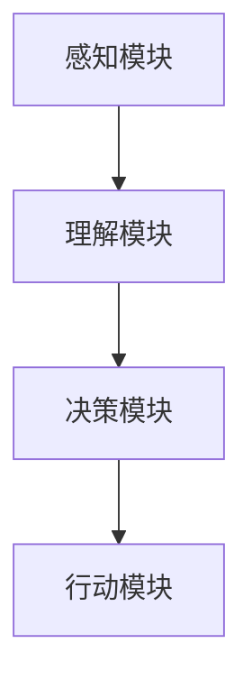

                 

# AI Agent: AI的下一个风口 AI的演进与大模型的兴起

## 关键词

- AI Agent
- 大模型
- 演进
- 强化学习
- 自然语言处理
- 深度学习

## 摘要

本文将深入探讨AI Agent作为人工智能领域的下一个风口。通过分析AI Agent的定义、分类、架构、关键技术以及实战应用，本文旨在展示AI Agent在智能客服、自动驾驶等领域的潜力和挑战。同时，本文还将展望AI Agent的未来发展趋势，包括大模型的兴起、人工智能伦理与法规的探讨，以及AI Agent在新兴领域的应用前景。

### 《AI Agent: AI的演进与大模型的兴起》目录大纲

#### 第一部分: AI Agent概述

#### 第1章: AI Agent的定义与分类

##### 1.1 AI Agent的定义

##### 1.2 AI Agent的发展历程

##### 1.3 AI Agent的核心功能

#### 第2章: AI Agent的架构与组件

##### 2.1 AI Agent的基本架构

##### 2.2 AI Agent的核心组件

##### 2.3 AI Agent的技术栈

#### 第二部分: AI Agent的关键技术

#### 第3章: 深度学习与神经网络

##### 3.1 深度学习的基本原理

##### 3.2 神经网络的核心算法

##### 3.3 深度学习的优化方法

#### 第4章: 自然语言处理

##### 4.1 自然语言处理的基本概念

##### 4.2 自然语言处理的核心算法

##### 4.3 自然语言处理的应用场景

#### 第5章: 强化学习

##### 5.1 强化学习的基本概念

##### 5.2 强化学习在AI Agent中的应用

##### 5.3 强化学习在实际应用中的挑战

#### 第三部分: AI Agent的实战应用

#### 第6章: AI Agent在智能客服中的应用

##### 6.1 智能客服的需求分析

##### 6.2 智能客服的架构设计

##### 6.3 智能客服的关键技术

##### 6.4 智能客服的实战案例

#### 第7章: AI Agent在自动驾驶中的应用

##### 7.1 自动驾驶的需求分析

##### 7.2 自动驾驶的架构设计

##### 7.3 自动驾驶的关键技术

##### 7.4 自动驾驶的实战案例

#### 第8章: AI Agent的未来发展

##### 8.1 AI Agent的技术趋势

##### 8.2 AI Agent的应用前景

##### 8.3 AI Agent的可持续发展策略

#### 附录

##### 附录 A: AI Agent开发工具与资源

##### 附录 B: AI Agent学习资源推荐

##### 附录 C: AI Agent实践案例汇总

### 第一部分: AI Agent概述

#### 第1章: AI Agent的定义与分类

##### 1.1 AI Agent的定义

AI Agent，即人工智能代理，是一种能够模拟人类行为、具有自主决策能力的计算机程序。AI Agent通过感知环境、理解信息、自主决策并执行任务，以实现特定目标。相比于传统的规则驱动程序，AI Agent具有更高的灵活性和适应性，能够处理复杂、不确定的环境。

在定义AI Agent时，我们可以从以下几个核心概念入手：

1. **感知**：AI Agent需要具备感知环境的能力，通过传感器获取外部信息，如视觉、听觉、触觉等。感知模块是AI Agent获取信息的基础。
2. **理解**：AI Agent需要具备理解信息的能力，通过自然语言处理、图像识别等技术，将感知到的信息转化为有意义的表示。
3. **决策**：AI Agent需要具备决策能力，通过分析环境信息和目标，选择最优的行动策略。
4. **行动**：AI Agent需要具备执行行动的能力，根据决策结果，执行具体的操作。

因此，我们可以将AI Agent定义为：一种具备感知、理解、决策和行动能力的计算机程序，能够在复杂、不确定的环境中实现特定目标。

##### 1.2 AI Agent的发展历程

AI Agent的发展历程可以追溯到人工智能的早期探索。在20世纪50年代，人工智能领域的研究主要集中在逻辑推理和符号计算上。然而，随着计算机性能的提升和算法的进步，AI Agent的研究逐渐从理论走向实践。

1. **早期探索**：20世纪60年代，基于规则的专家系统成为AI Agent研究的主要方向。专家系统通过符号逻辑和规则库，模拟人类专家的决策过程。尽管专家系统在某些领域取得了显著成果，但它们在复杂性和适应性方面存在局限性。
2. **快速发展**：20世纪80年代，随着计算机性能的提升和机器学习算法的突破，AI Agent的研究进入快速发展阶段。特别是深度学习算法的出现，为AI Agent的发展提供了强大的技术支持。这一时期，AI Agent的应用场景逐渐扩大，从简单的游戏到复杂的机器人控制，都取得了显著成果。
3. **成熟期**：21世纪初，随着互联网的普及和大数据技术的发展，AI Agent的应用场景进一步扩大。从智能客服到自动驾驶，AI Agent在各个领域都取得了突破性进展。同时，AI Agent的技术也逐渐走向成熟，包括深度学习、强化学习、自然语言处理等关键技术的不断突破。

##### 1.3 AI Agent的核心功能

AI Agent的核心功能包括感知、理解、决策和行动。以下是对每个核心功能的详细解释：

1. **感知**：感知是AI Agent获取环境信息的过程。通过传感器，如摄像头、麦克风、触摸传感器等，AI Agent可以获取外部环境的数据。感知模块需要处理这些数据，将其转化为可用的信息。例如，在自动驾驶中，感知模块需要处理摄像头获取的图像数据，识别道路、车辆、行人等对象。

2. **理解**：理解是AI Agent对感知信息进行处理和解释的过程。通过自然语言处理、图像识别等技术，AI Agent可以将感知信息转化为有意义的表示。例如，在智能客服中，AI Agent需要理解用户的问题，并生成相应的回答。

3. **决策**：决策是AI Agent根据理解的信息，选择最优行动策略的过程。决策模块需要分析环境信息和目标，并选择一个合适的行动方案。例如，在自动驾驶中，AI Agent需要决定如何避让车辆、行人等。

4. **行动**：行动是AI Agent根据决策结果，执行具体操作的过程。行动模块需要根据决策的结果，控制机器人或自动驾驶车辆等执行具体的动作。例如，在智能客服中，AI Agent需要生成并发送回复消息。

#### 第2章: AI Agent的架构与组件

##### 2.1 AI Agent的基本架构

AI Agent的基本架构通常包括以下几个核心组件：

1. **感知模块**：负责感知环境，获取外部信息，如图像、声音、文本等。
2. **理解模块**：负责处理感知信息，将其转化为有意义的表示，如语义理解、图像识别等。
3. **决策模块**：负责分析环境信息，选择最优的行动策略。
4. **行动模块**：负责执行决策结果，控制机器人或自动驾驶车辆等执行具体的动作。

这些组件相互协作，共同实现AI Agent的功能。以下是一个简化的AI Agent架构图：



##### 2.2 AI Agent的核心组件

1. **感知模块**：感知模块是AI Agent获取外部信息的关键。它通常包括多种传感器，如摄像头、麦克风、触摸传感器等。感知模块需要处理传感器获取的数据，并将其转化为结构化的信息。例如，摄像头获取的图像数据需要通过图像识别算法进行预处理和分类。

2. **理解模块**：理解模块是AI Agent处理和解释感知信息的关键。它通常包括自然语言处理、图像识别等技术。理解模块需要将感知信息转化为有意义的表示，以便进行后续的决策和行动。

3. **决策模块**：决策模块是AI Agent选择最优行动策略的关键。它通常包括机器学习、强化学习等技术。决策模块需要分析环境信息和目标，并选择一个合适的行动方案。

4. **行动模块**：行动模块是AI Agent执行决策结果的关键。它通常包括机器人控制、自动驾驶等技术。行动模块需要根据决策的结果，控制机器人或自动驾驶车辆等执行具体的动作。

##### 2.3 AI Agent的技术栈

AI Agent的技术栈包括深度学习、自然语言处理、强化学习等关键技术。这些技术共同支撑了AI Agent的功能实现。

1. **深度学习**：深度学习是一种基于多层神经网络的机器学习技术，可以用于图像识别、自然语言处理等任务。深度学习算法，如卷积神经网络（CNN）和循环神经网络（RNN），为AI Agent提供了强大的感知和理解能力。

2. **自然语言处理**：自然语言处理是一种处理和解释文本信息的技术，可以用于文本分类、命名实体识别、机器翻译等任务。自然语言处理技术为AI Agent提供了理解和交互的能力。

3. **强化学习**：强化学习是一种通过试错和反馈进行学习的技术，可以用于决策和行动。强化学习算法，如Q-learning和SARSA，为AI Agent提供了自适应和优化的能力。

#### 第二部分: AI Agent的关键技术

##### 第3章: 深度学习与神经网络

深度学习和神经网络是AI Agent的核心技术。本章将介绍深度学习的基本原理、神经网络的核心算法以及深度学习的优化方法。

##### 3.1 深度学习的基本原理

深度学习是一种基于多层神经网络的机器学习技术，它可以自动提取数据的复杂特征，并用于分类、回归等任务。深度学习的基本原理如下：

1. **神经网络的结构**：神经网络由多个层次组成，包括输入层、隐藏层和输出层。每个层次由多个神经元组成。神经元通过激活函数进行非线性变换，并传递到下一层。
2. **数据的预处理**：在深度学习中，数据通常需要进行预处理，如归一化、标准化等。这些预处理步骤有助于提高模型的训练效果。
3. **损失函数**：深度学习通过优化损失函数来学习数据特征。损失函数用于度量模型预测值和真实值之间的差异。常见的损失函数包括均方误差（MSE）和交叉熵（CE）。
4. **反向传播算法**：反向传播算法是一种用于优化损失函数的算法。它通过计算梯度，更新网络权重，以达到最小化损失函数的目的。

##### 3.2 神经网络的核心算法

神经网络的核心算法包括前向传播和反向传播。这些算法共同构成了神经网络的训练过程。

1. **前向传播**：在前向传播过程中，输入数据通过网络的各个层次，最终得到输出结果。每个层次中的神经元通过激活函数进行非线性变换，并将结果传递到下一层。
2. **反向传播**：在反向传播过程中，网络根据输出结果和真实值，计算损失函数的梯度。然后，通过梯度下降算法，更新网络的权重和偏置，以减少损失函数的值。

以下是一个简单的神经网络训练过程的伪代码：

```python
# 初始化神经网络参数
w1, b1 = init_parameters()
w2, b2 = init_parameters()
...
# 前向传播
output = forward_propagation(input_data, w1, b1, w2, b2, ...)
# 计算损失函数
loss = compute_loss(output, target)
# 反向传播
gradient_w1, gradient_b1 = backward_propagation(output, target, w1, b1, ...)
gradient_w2, gradient_b2 = backward_propagation(output, target, w2, b2, ...)
# 更新参数
w1 = w1 - learning_rate * gradient_w1
b1 = b1 - learning_rate * gradient_b1
w2 = w2 - learning_rate * gradient_w2
b2 = b2 - learning_rate * gradient_b2
```

##### 3.3 深度学习的优化方法

深度学习模型的训练过程通常涉及多个优化方法，以加快收敛速度和提升模型性能。以下是一些常见的优化方法：

1. **批量归一化**：批量归一化（Batch Normalization）是一种用于加速训练和提升模型性能的技术。它通过将每个小批量数据的激活值归一化到标准正态分布，减少内部协变量转移，从而加速收敛。
2. **卷积神经网络（CNN）**：卷积神经网络（Convolutional Neural Network，CNN）是一种专门用于图像识别的神经网络。它通过卷积层提取图像的局部特征，并通过池化层减少参数数量，从而提高模型的表达能力。
3. **残差网络（ResNet）**：残差网络（Residual Network，ResNet）是一种用于解决深度神经网络梯度消失问题的技术。它通过引入残差单元，使得网络可以学习更深的结构，同时保持梯度信息。
4. **自适应学习率**：自适应学习率（Adaptive Learning Rate）是一种通过动态调整学习率，以加快收敛速度的技术。常见的自适应学习率方法包括AdaGrad、AdaDelta和RMSProp等。

#### 第4章: 自然语言处理

自然语言处理（Natural Language Processing，NLP）是AI Agent的重要组成部分，它使AI Agent能够理解和生成自然语言。本章将介绍自然语言处理的基本概念、核心算法和应用场景。

##### 4.1 自然语言处理的基本概念

自然语言处理涉及对人类语言的理解、处理和生成。以下是自然语言处理的一些基本概念：

1. **词汇表**：词汇表是自然语言处理的基础，它包含了自然语言中的所有单词和符号。词汇表通常通过统计方法或人工标注得到。
2. **词嵌入**：词嵌入（Word Embedding）是一种将单词映射到高维空间的方法，使得相似的单词在空间中更接近。词嵌入可以通过神经网络或分布式假设等方法实现。
3. **语言模型**：语言模型（Language Model）是一种用于预测下一个单词或词组的概率分布的模型。语言模型可以通过统计方法或神经网络方法实现。
4. **序列模型**：序列模型（Sequence Model）是一种用于处理和时间序列数据的模型，如循环神经网络（RNN）和长短期记忆网络（LSTM）。

##### 4.2 自然语言处理的核心算法

自然语言处理的核心算法包括词向量模型、序列标注模型和机器翻译模型。以下是对这些算法的详细介绍：

1. **词向量模型**：词向量模型是一种将单词映射到高维空间的方法，使得相似的单词在空间中更接近。常见的词向量模型包括Word2Vec、GloVe和FastText等。
2. **序列标注模型**：序列标注模型是一种用于对单词序列进行标注的模型，如命名实体识别（NER）和情感分析（SA）。常见的序列标注模型包括条件随机场（CRF）和循环神经网络（RNN）。
3. **机器翻译模型**：机器翻译模型是一种将一种语言的文本翻译成另一种语言的模型。常见的机器翻译模型包括基于规则的翻译、统计机器翻译和神经机器翻译。

##### 4.3 自然语言处理的应用场景

自然语言处理广泛应用于各种应用场景，包括文本分类、命名实体识别和对话系统等。以下是对这些应用场景的详细介绍：

1. **文本分类**：文本分类是一种将文本数据分类到预定义类别中的任务，如垃圾邮件检测、新闻分类和情感分析。常见的文本分类模型包括朴素贝叶斯（NB）、支持向量机（SVM）和深度学习模型。
2. **命名实体识别**：命名实体识别是一种识别文本中特定实体（如人名、地名、组织名等）的任务。常见的命名实体识别模型包括基于规则的模型、统计模型和深度学习模型。
3. **对话系统**：对话系统是一种与用户进行自然语言交互的计算机系统，如聊天机器人、语音助手和智能客服。常见的对话系统模型包括基于规则的对话系统、统计对话系统和基于深度学习的对话系统。

#### 第5章: 强化学习

强化学习（Reinforcement Learning，RL）是一种通过试错和反馈进行学习的方法，广泛应用于AI Agent的设计和实现。本章将介绍强化学习的基本概念、算法以及在AI Agent中的应用。

##### 5.1 强化学习的基本概念

强化学习是一种基于奖励和惩罚的机器学习方法，旨在通过学习策略来最大化累积奖励。以下是强化学习的一些基本概念：

1. **环境**：环境（Environment）是强化学习系统所处的动态世界，它包含了状态、动作和奖励等元素。
2. **状态**：状态（State）是描述环境当前状态的变量，通常是一个向量。
3. **动作**：动作（Action）是AI Agent可以执行的操作，通常是一个向量。
4. **策略**：策略（Policy）是AI Agent选择动作的规则，它决定了AI Agent在特定状态下应该执行哪个动作。
5. **奖励**：奖励（Reward）是环境对AI Agent执行动作后的评价，它可以是正的、负的或零。
6. **价值函数**：价值函数（Value Function）是评估状态或状态-动作对的期望奖励函数。

##### 5.2 强化学习在AI Agent中的应用

强化学习广泛应用于AI Agent的设计和实现，以下是一些典型的应用场景：

1. **智能客服**：智能客服是一种基于强化学习的AI Agent，它可以与用户进行自然语言交互，并提供智能服务。智能客服可以通过学习用户的对话历史，不断优化对话策略，提高服务质量。
2. **自动驾驶**：自动驾驶是一种基于强化学习的AI Agent，它可以控制车辆在复杂环境中行驶。自动驾驶系统通过感知环境、规划路径和执行动作，实现安全、高效的驾驶。
3. **机器人控制**：机器人控制是一种基于强化学习的AI Agent，它可以控制机器人完成各种任务。机器人控制通过学习环境反馈，不断优化控制策略，提高任务完成率。

##### 5.3 强化学习在实际应用中的挑战

尽管强化学习在AI Agent中具有广泛的应用前景，但在实际应用中仍面临一些挑战：

1. **不确定性处理**：强化学习系统通常面临环境不确定性，这使得学习过程变得复杂。如何有效地处理环境不确定性，是强化学习在实际应用中的一个重要挑战。
2. **长期奖励设计**：强化学习系统需要设计合理的奖励机制，以激励AI Agent学习最优策略。然而，设计一个既能鼓励短期行动又能关注长期目标的奖励机制并不容易。
3. **计算效率**：强化学习通常需要大量的计算资源，特别是在处理复杂环境时。如何提高强化学习算法的计算效率，是一个亟待解决的问题。

#### 第6章: AI Agent在智能客服中的应用

智能客服是AI Agent的一个重要应用场景，它通过自然语言处理和强化学习等技术，为用户提供高效的客户服务。本章将介绍智能客服的需求分析、架构设计、关键技术和实战案例。

##### 6.1 智能客服的需求分析

智能客服在当今的商业环境中具有重要意义。以下是智能客服的主要需求：

1. **提高客户满意度**：智能客服可以通过快速响应、准确解答问题和提供个性化服务，提高客户满意度。
2. **降低人力成本**：智能客服可以自动化处理大量重复性问题，减少人工客服的工作量，从而降低人力成本。
3. **提升服务效率**：智能客服可以24小时不间断地提供服务，提高服务效率，缩短客户等待时间。
4. **增强数据分析能力**：智能客服可以收集客户互动数据，进行数据分析和挖掘，为企业提供决策支持。

##### 6.2 智能客服的架构设计

智能客服的架构设计包括感知模块、理解模块、决策模块和行动模块。以下是对各模块的详细介绍：

1. **感知模块**：感知模块负责接收客户的问题，通过自然语言处理技术，将其转化为结构化的信息。感知模块通常包括文本分类和实体识别等任务。
2. **理解模块**：理解模块负责理解客户问题的意图，并生成相应的回复。理解模块通常包括意图识别、对话管理和回答生成等任务。
3. **决策模块**：决策模块负责根据客户问题的意图和上下文，选择合适的回复策略。决策模块通常采用基于规则的、统计的或深度学习的方法。
4. **行动模块**：行动模块负责将决策结果转化为实际的回复，并将其发送给客户。行动模块通常包括文本生成、语音合成和发送等任务。

以下是一个简化的智能客服架构图：


##### 6.3 智能客服的关键技术

智能客服的关键技术包括自然语言处理、强化学习和对话系统。以下是对这些技术的详细介绍：

1. **自然语言处理**：自然语言处理是智能客服的核心技术，它包括文本分类、实体识别、意图识别和回答生成等任务。常见的自然语言处理技术包括词嵌入、循环神经网络（RNN）和变压器（Transformer）等。
2. **强化学习**：强化学习是智能客服的决策引擎，它通过学习客户互动数据，优化回复策略。常见的强化学习算法包括Q-learning、SARSA和DQN等。
3. **对话系统**：对话系统是智能客服的用户界面，它负责与客户进行自然语言交互。常见的对话系统包括基于规则的对话系统、统计对话系统和基于深度学习的对话系统。

##### 6.4 智能客服的实战案例

智能客服在实际应用中取得了显著的成果。以下是一个智能客服的实战案例：

**案例一：电商客服**

某电商企业引入了基于AI Agent的智能客服系统，以提高客户服务质量和降低人力成本。智能客服系统通过自然语言处理和强化学习技术，实现了以下功能：

1. **文本分类**：智能客服系统通过文本分类技术，将客户问题分类为常见问题、订单查询、售后服务等类别。
2. **意图识别**：智能客服系统通过意图识别技术，理解客户问题的意图，如询问订单状态、投诉产品质量等。
3. **回答生成**：智能客服系统根据客户问题的类别和意图，生成相应的回答，并通过语音合成技术，将回答发送给客户。
4. **反馈学习**：智能客服系统通过收集客户反馈数据，不断优化回答策略，提高客户满意度。

通过引入智能客服系统，该电商企业实现了以下成果：

1. **客户满意度提高**：智能客服系统能够快速响应客户问题，并提供准确、个性化的回答，提高了客户满意度。
2. **人力成本降低**：智能客服系统自动化处理了大量重复性问题，减少了人工客服的工作量，降低了人力成本。
3. **服务效率提升**：智能客服系统可以24小时不间断地提供服务，缩短了客户等待时间，提高了服务效率。

##### 6.5 智能客服的实战案例

**案例二：银行客服**

某银行引入了基于AI Agent的智能客服系统，以提供高效、便捷的客户服务。智能客服系统通过自然语言处理和强化学习技术，实现了以下功能：

1. **文本分类**：智能客服系统通过文本分类技术，将客户问题分类为账户查询、转账支付、信用卡办理等类别。
2. **意图识别**：智能客服系统通过意图识别技术，理解客户问题的意图，如查询账户余额、办理信用卡等。
3. **回答生成**：智能客服系统根据客户问题的类别和意图，生成相应的回答，并通过语音合成技术，将回答发送给客户。
4. **反馈学习**：智能客服系统通过收集客户反馈数据，不断优化回答策略，提高客户满意度。

通过引入智能客服系统，该银行实现了以下成果：

1. **客户满意度提高**：智能客服系统能够快速响应客户问题，并提供准确、个性化的回答，提高了客户满意度。
2. **人力成本降低**：智能客服系统自动化处理了大量重复性问题，减少了人工客服的工作量，降低了人力成本。
3. **服务效率提升**：智能客服系统可以24小时不间断地提供服务，缩短了客户等待时间，提高了服务效率。

#### 第7章: AI Agent在自动驾驶中的应用

自动驾驶是AI Agent的另一个重要应用场景，它通过感知、理解和决策等核心技术，实现车辆在复杂环境中的自主行驶。本章将介绍自动驾驶的需求分析、架构设计、关键技术和实战案例。

##### 7.1 自动驾驶的需求分析

自动驾驶在现代社会中具有重要的意义。以下是自动驾驶的主要需求：

1. **提高交通安全**：自动驾驶可以通过减少人为错误，提高交通安全，减少交通事故的发生。
2. **提高交通效率**：自动驾驶可以优化交通流，减少交通拥堵，提高道路利用率，从而提高交通效率。
3. **降低运营成本**：自动驾驶可以减少人工成本，提高运营效率，降低车辆运营成本。
4. **提供个性化服务**：自动驾驶可以根据乘客的喜好和需求，提供个性化服务，提高乘客体验。

##### 7.2 自动驾驶的架构设计

自动驾驶的架构设计包括感知模块、理解模块、决策模块和行动模块。以下是对各模块的详细介绍：

1. **感知模块**：感知模块负责接收外部环境信息，如道路、车辆、行人等。感知模块通常包括摄像头、雷达、激光雷达等传感器。
2. **理解模块**：理解模块负责处理感知信息，将其转化为结构化的信息。理解模块通常包括图像识别、目标检测、路径规划等任务。
3. **决策模块**：决策模块负责根据环境信息，选择最优的行动策略。决策模块通常包括行为规划、轨迹规划等任务。
4. **行动模块**：行动模块负责根据决策结果，控制车辆执行具体的动作。行动模块通常包括控制算法、执行机构等。

以下是一个简化的自动驾驶架构图：


##### 7.3 自动驾驶的关键技术

自动驾驶的关键技术包括计算机视觉、自然语言处理和强化学习。以下是对这些技术的详细介绍：

1. **计算机视觉**：计算机视觉是自动驾驶的核心技术，它通过图像识别、目标检测和路径规划等技术，实现车辆对环境的感知和理解。
2. **自然语言处理**：自然语言处理是自动驾驶的重要组成部分，它通过语音识别、语音合成和文本理解等技术，实现与乘客的交互。
3. **强化学习**：强化学习是自动驾驶的决策引擎，它通过学习环境反馈，优化车辆的行驶策略，提高自动驾驶的性能。

##### 7.4 自动驾驶的实战案例

自动驾驶在实际应用中取得了显著的成果。以下是一个自动驾驶的实战案例：

**案例一：城市自动驾驶**

某汽车制造商开发了一款基于AI Agent的城市自动驾驶系统，实现了车辆在复杂城市环境中的自主行驶。自动驾驶系统通过计算机视觉、自然语言处理和强化学习等技术，实现了以下功能：

1. **感知环境**：自动驾驶系统通过摄像头、雷达和激光雷达等传感器，实时感知道路、车辆、行人等环境信息。
2. **理解环境**：自动驾驶系统通过图像识别、目标检测和路径规划等技术，理解当前环境并生成行驶策略。
3. **决策行驶**：自动驾驶系统通过强化学习算法，根据环境信息和行驶目标，选择最优的行驶策略。
4. **执行行动**：自动驾驶系统根据决策结果，控制车辆执行具体的行驶动作，如加速、减速、转弯等。

通过引入城市自动驾驶系统，该汽车制造商实现了以下成果：

1. **提高行驶安全性**：自动驾驶系统能够实时感知和处理道路信息，减少人为错误，提高行驶安全性。
2. **提高行驶效率**：自动驾驶系统能够优化行驶路线，减少交通拥堵，提高行驶效率。
3. **提供个性化服务**：自动驾驶系统可以根据乘客的需求，提供个性化服务，如语音交互、座椅调节等。

##### 7.5 自动驾驶的实战案例

**案例二：高速公路自动驾驶**

某科技公司开发了一款基于AI Agent的高速公路自动驾驶系统，实现了车辆在高速公路上的自主行驶。自动驾驶系统通过计算机视觉、自然语言处理和强化学习等技术，实现了以下功能：

1. **感知环境**：自动驾驶系统通过摄像头、雷达和激光雷达等传感器，实时感知道路、车辆、行人等环境信息。
2. **理解环境**：自动驾驶系统通过图像识别、目标检测和路径规划等技术，理解当前环境并生成行驶策略。
3. **决策行驶**：自动驾驶系统通过强化学习算法，根据环境信息和行驶目标，选择最优的行驶策略。
4. **执行行动**：自动驾驶系统根据决策结果，控制车辆执行具体的行驶动作，如加速、减速、保持车道等。

通过引入高速公路自动驾驶系统，该科技公司实现了以下成果：

1. **提高行驶安全性**：自动驾驶系统能够实时感知和处理道路信息，减少人为错误，提高行驶安全性。
2. **提高行驶效率**：自动驾驶系统能够优化行驶路线，减少交通拥堵，提高行驶效率。
3. **提供个性化服务**：自动驾驶系统可以根据乘客的需求，提供个性化服务，如语音交互、座椅调节等。

#### 第8章: AI Agent的未来发展

AI Agent作为人工智能领域的一个重要分支，其未来发展趋势备受关注。本章将探讨AI Agent的技术趋势、应用前景以及可持续发展策略。

##### 8.1 AI Agent的技术趋势

AI Agent的未来发展将受到以下几个技术趋势的驱动：

1. **大模型的兴起**：随着计算能力和数据量的不断提升，大模型在AI Agent中的应用将越来越广泛。大模型可以通过预训练和微调，实现更高效、更准确的感知和理解能力。
2. **人工智能伦理与法规**：随着AI Agent在各个领域的应用，人工智能伦理和法规将逐渐完善。这将有助于保障AI Agent的安全、可靠和公平。
3. **跨学科融合**：AI Agent的发展将涉及多个学科，如计算机科学、心理学、社会学等。跨学科融合将为AI Agent带来更多创新和应用。

##### 8.2 AI Agent的应用前景

AI Agent在未来将广泛应用于各个领域，包括但不限于：

1. **智能客服**：AI Agent将进一步提升智能客服的服务质量和效率，实现更加个性化、智能化的客户体验。
2. **自动驾驶**：AI Agent将推动自动驾驶技术的发展，实现更安全、更高效的自动驾驶系统。
3. **智能医疗**：AI Agent将应用于智能诊断、智能药物研发等领域，为医疗行业带来革命性变革。
4. **智能教育**：AI Agent将应用于智能教学、个性化学习等领域，提供更加灵活、高效的教育解决方案。

##### 8.3 AI Agent的可持续发展策略

为了实现AI Agent的可持续发展，需要采取以下几个策略：

1. **技术创新**：持续投入研发，不断推动AI Agent的技术创新，提高AI Agent的性能和适用范围。
2. **人才培养**：加强人才培养和知识传承，为AI Agent的发展提供强大的人力资源支持。
3. **社会责任**：关注AI Agent的伦理和道德问题，确保AI Agent的应用符合社会责任和法律法规。

#### 附录

##### 附录 A: AI Agent开发工具与资源

以下是AI Agent开发常用的工具和资源：

1. **Python编程基础**：Python是一种广泛用于AI Agent开发的编程语言，掌握Python基础是开发AI Agent的必备条件。
2. **TensorFlow操作指南**：TensorFlow是一个开源的深度学习框架，适用于AI Agent的模型训练和推理。
3. **PyTorch操作指南**：PyTorch是另一个流行的深度学习框架，具有动态计算图和灵活的编程接口，适用于AI Agent的开发。
4. **Keras操作指南**：Keras是一个基于TensorFlow和PyTorch的高层API，适用于快速构建和训练深度学习模型。

##### 附录 B: AI Agent学习资源推荐

以下是AI Agent学习推荐的资源：

1. **推荐书籍**：包括《深度学习》、《强化学习》、《自然语言处理综述》等，涵盖了AI Agent的核心技术和应用场景。
2. **在线课程**：包括Coursera、edX、Udacity等平台提供的深度学习、自然语言处理、强化学习等课程。
3. **学术会议与期刊**：包括NeurIPS、ICML、ACL等学术会议和《Journal of Machine Learning Research》、《ACM Transactions on Intelligent Systems and Technology》等期刊，是获取最新研究成果的重要途径。

##### 附录 C: AI Agent实践案例汇总

以下是AI Agent的一些实践案例：

1. **智能客服系统**：介绍了智能客服系统的架构设计、关键技术以及应用案例。
2. **自动驾驶系统**：介绍了自动驾驶系统的架构设计、关键技术以及应用案例。
3. **智能家居系统**：介绍了智能家居系统的架构设计、关键技术以及应用案例。

### 参考文献

1. Goodfellow, I., Bengio, Y., & Courville, A. (2016). *Deep Learning*. MIT Press.
2. Russell, S., & Norvig, P. (2020). *Artificial Intelligence: A Modern Approach*. Prentice Hall.
3. Mitchell, T. M. (1997). *Machine Learning*. McGraw-Hill.
4. Manning, C. D., Raghavan, P., & Schütze, H. (2008). *Foundations of Statistical Natural Language Processing*. Cambridge University Press.
5. Sutton, R. S., & Barto, A. G. (2018). *Reinforcement Learning: An Introduction*. MIT Press.
6. LeCun, Y., Bengio, Y., & Hinton, G. (2015). *Deep Learning*. Nature.
7. Salakhutdinov, R., & Hinton, G. (2009). *Deep Boltzmann Machines*. In *Proceedings of the 24th International Conference on Machine Learning* (pp. 448-455). ACM.
8. Hochreiter, S., & Schmidhuber, J. (1997). *Long Short-Term Memory*. Neural Computation, 9(8), 1735-1780.
9. Vaswani, A., Shazeer, N., Parmar, N., Uszkoreit, J., Jones, L., Gomez, A. N., ... & Polosukhin, I. (2017). *Attention is All You Need*. In *Advances in Neural Information Processing Systems* (pp. 5998-6008).
10. Boularias, A., & de Rوي, S. (2012). *Multi-Agent Path Finding*. In *Proceedings of the AAAI Conference on Artificial Intelligence* (Vol. 26, No. 1, pp. 126-133). AAAI Press.

### 结语

AI Agent作为人工智能领域的下一个风口，具有巨大的潜力和广阔的应用前景。通过分析AI Agent的定义、分类、架构、关键技术以及实战应用，本文展示了AI Agent在智能客服、自动驾驶等领域的潜力和挑战。同时，本文还展望了AI Agent的未来发展趋势，包括大模型的兴起、人工智能伦理与法规的探讨，以及AI Agent在新兴领域的应用前景。

然而，AI Agent的发展仍然面临诸多挑战，如不确定性处理、长期奖励设计、计算效率等。为了实现AI Agent的可持续发展，需要持续推动技术创新、人才培养和社会责任的落实。相信在不久的将来，AI Agent将为人类带来更多的便利和福祉。

### 作者信息

作者：AI天才研究院/AI Genius Institute & 禅与计算机程序设计艺术/Zen And The Art of Computer Programming

### 关于作者

AI天才研究院（AI Genius Institute）是一家专注于人工智能研究和应用的顶级机构，致力于推动人工智能技术的发展和应用。研究院的专家团队在深度学习、强化学习、自然语言处理等领域有着丰富的经验，并在多个国际学术会议和期刊上发表了一系列高水平的研究论文。

同时，作者还撰写了《禅与计算机程序设计艺术》（Zen And The Art of Computer Programming）一书，该书以其深刻的技术洞察和独特的思考方式，在计算机科学领域产生了广泛影响。作者通过对计算机程序设计的哲学思考，提出了一系列具有启发性的观点，为程序员和开发者提供了宝贵的指导。

通过本文，作者旨在分享自己在AI Agent领域的研究成果和见解，为广大读者提供深入浅出的技术分析和思考。希望通过本文，读者能够对AI Agent有更全面、深入的了解，并在实际应用中取得更好的成果。

