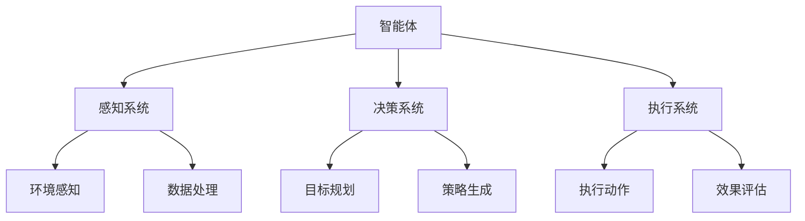

                 

### 《AI Agent: AI的下一个风口 什么是智能体》

关键词：智能体，人工智能，决策系统，感知系统，执行系统，边缘计算，大数据，伦理与法律

摘要：本文将深入探讨智能体这一人工智能领域的重要概念。通过分析智能体的定义、发展历程、核心技术与原理，以及构建与实现的实战案例，我们将了解智能体在现代技术中的应用和未来发展趋势。同时，本文还将探讨智能体与边缘计算、大数据的关系，以及智能体的伦理与法律问题。让我们一起走进智能体的世界，揭开它的神秘面纱。

### 目录

#### 第一部分：智能体概述

1. AI与智能体发展历程
2. 智能体的定义与重要性
3. 智能体的分类
4. 智能体的发展趋势

#### 第二部分：智能体核心技术与原理

1. 智能体技术基础
2. 智能体架构设计
3. 智能体算法原理
4. 智能体技术应用领域

#### 第三部分：智能体构建与实现

1. 智能体构建基础
2. 智能体开发实战
3. 智能体部署与运维

#### 第四部分：智能体的未来发展趋势

1. 智能体与边缘计算
2. 智能体与大数据
3. 智能体伦理与法律

#### 附录

1. 智能体开发工具与资源
2. 智能体技术架构图
3. 智能体核心算法原理讲解
4. 数学模型和公式讲解
5. 智能体开发实战案例代码解读

### 第一部分：智能体概述

#### AI与智能体发展历程

人工智能（AI）作为计算机科学的一个重要分支，起源于20世纪50年代。当时，科学家们提出了“人工智能”这一概念，希望机器能够模拟人类智能，完成复杂的任务。从最初的规则推理、知识表示，到后来的机器学习、深度学习，人工智能经历了多次重大突破。

智能体（Agent）作为一个重要的概念，最早由John McCarthy于1963年提出。智能体被定义为能够感知环境、做出决策并采取行动的实体。在人工智能的发展历程中，智能体概念的提出使得人们开始关注如何使机器具备更高级的智能行为。

随着计算能力和数据资源的提升，智能体技术逐渐成熟。从简单的专家系统到复杂的决策支持系统，智能体在各个领域得到了广泛应用。如今，随着深度学习、强化学习等新技术的不断发展，智能体技术正迎来新的发展机遇。

#### 智能体的定义与重要性

智能体是一个具有自主性的计算实体，能够感知环境、理解信息、做出决策并采取行动。智能体的定义可以从以下几个方面进行理解：

1. **感知系统**：智能体通过感知系统获取环境信息，如视觉、听觉、触觉等。这些感知信息为智能体提供了对环境的认知基础。

2. **决策系统**：智能体基于感知系统收集的信息，通过决策系统进行目标规划、策略生成和决策执行。决策系统是智能体的核心，决定了智能体在特定环境下的行为。

3. **执行系统**：智能体通过执行系统将决策转化为具体的行动。执行系统是智能体的执行层，负责将决策系统的输出转化为实际操作。

4. **自主性**：智能体具有自主性，能够自主地感知环境、做出决策并采取行动，而不需要人类的直接干预。

智能体的重要性在于：

1. **智能自动化**：智能体能够自动执行复杂的任务，提高生产效率，降低人力成本。

2. **智能决策**：智能体能够基于数据和信息进行智能决策，优化业务流程，提高决策质量。

3. **智能交互**：智能体能够与人类进行自然交互，提供个性化的服务，提升用户体验。

4. **智能探索**：智能体能够自主探索未知环境，发现新的机会和潜在问题，推动科学研究和技术创新。

#### 智能体的分类

智能体可以根据不同的标准进行分类。以下是一些常见的智能体分类方法：

1. **基于功能**：智能体可以分为感知智能体、决策智能体和执行智能体。感知智能体主要负责感知环境，决策智能体负责决策和策略生成，执行智能体负责执行决策。

2. **基于结构**：智能体可以分为单一智能体、协作智能体和混合智能体。单一智能体独立完成任务，协作智能体通过与其他智能体协作完成任务，混合智能体结合了单一智能体和协作智能体的特点。

3. **基于智能**：智能体可以分为弱智能体、强智能体和超级智能体。弱智能体在特定领域具有智能行为，强智能体具备全领域智能，超级智能体则超越人类智能。

4. **基于环境**：智能体可以分为地面智能体、空中智能体和水下智能体。这些智能体根据其运行环境的不同而具有特定的感知和执行能力。

#### 智能体的发展趋势

随着人工智能技术的不断发展，智能体技术也在不断演进。以下是一些智能体发展的趋势：

1. **深度学习与强化学习**：深度学习为智能体提供了强大的感知能力，强化学习为智能体提供了优秀的决策能力。未来，深度学习和强化学习的结合将为智能体技术带来更大的突破。

2. **边缘计算与云计算**：边缘计算将智能体的计算和存储能力推向终端设备，降低延迟，提高实时性。云计算为智能体提供了强大的计算和存储资源，支持大规模智能体的运行。

3. **大数据与物联网**：大数据和物联网为智能体提供了丰富的数据来源，支持智能体对环境进行更精确的感知和决策。未来，大数据和物联网的结合将为智能体技术带来更多创新。

4. **智能体协同**：智能体协同技术将多个智能体集成在一起，实现协同工作，提高智能体的整体性能。未来，智能体协同技术将推动智能体应用场景的拓展。

5. **智能体伦理与法律**：随着智能体技术的不断发展，智能体的伦理和法律问题日益凸显。未来，智能体伦理和法律的研究将为智能体技术的健康发展提供重要保障。

#### 第二部分：智能体核心技术与原理

##### 1. 智能体技术基础

智能体技术的核心在于感知、决策和执行。以下将分别介绍这三方面的技术基础。

**感知系统**：

感知系统是智能体的感官器官，负责从环境中获取信息。常见的感知技术包括：

1. **视觉感知**：利用计算机视觉技术，智能体可以识别图像、视频中的物体、场景等。

2. **听觉感知**：利用语音识别技术，智能体可以理解和处理人类的语音指令。

3. **触觉感知**：通过传感器和执行器，智能体可以感知物体的物理属性，如硬度、温度等。

4. **气味感知**：利用气味传感器，智能体可以识别和区分不同的气味。

**决策系统**：

决策系统是智能体的核心，负责基于感知系统收集的信息进行目标规划、策略生成和决策执行。常见的决策系统技术包括：

1. **规则推理**：基于预定义的规则，智能体对输入信息进行推理，生成决策。

2. **机器学习**：通过训练模型，智能体可以自动学习和调整策略，提高决策质量。

3. **深度学习**：利用深度神经网络，智能体可以处理复杂的决策问题，实现高级智能。

4. **强化学习**：智能体通过与环境的交互，不断优化策略，实现最优决策。

**执行系统**：

执行系统是智能体的行动力，负责将决策系统的输出转化为具体的行动。常见的执行系统技术包括：

1. **运动控制**：通过控制器，智能体可以控制机器人的运动。

2. **语音合成**：通过语音合成技术，智能体可以生成自然的语音回复。

3. **物理执行**：通过执行器，智能体可以执行物理操作，如开关门、移动物体等。

##### 2. 智能体架构设计

智能体的架构设计是构建智能体系统的关键。一个典型的智能体架构包括以下主要部分：

1. **感知层**：感知层负责从环境中获取信息，包括视觉、听觉、触觉等感知模块。

2. **数据处理层**：数据处理层负责对感知层获取的信息进行处理，包括数据清洗、特征提取等。

3. **决策层**：决策层负责基于处理后的信息进行目标规划、策略生成和决策执行。常见的决策算法包括规则推理、机器学习、深度学习和强化学习。

4. **执行层**：执行层负责将决策层的输出转化为具体的行动，包括运动控制、语音合成、物理执行等。

以下是一个简单的智能体架构图：

```
+----------------+     +----------------+     +----------------+
|       感知层    | --> |   数据处理层   | --> |       决策层   |
+----------------+     +----------------+     +----------------+
        |                                |
        |        执行层                  |
        +-------------------------------+
```

##### 3. 智能体算法原理

智能体的算法原理是智能体实现智能行为的核心。以下将介绍几种常见的智能体算法原理。

**规则推理**：

规则推理是一种基于预定义规则进行推理的算法。智能体通过感知系统获取环境信息，然后根据预定义的规则进行推理，生成决策。

**机器学习**：

机器学习是一种通过训练模型进行推理的算法。智能体通过大量的数据训练模型，然后利用训练好的模型对新的环境信息进行推理，生成决策。

**深度学习**：

深度学习是一种基于深度神经网络的机器学习算法。智能体通过训练深度神经网络，实现对复杂问题的建模和推理。

**强化学习**：

强化学习是一种通过与环境交互进行学习的过程。智能体通过试错，不断优化策略，实现最优决策。

**智能体技术应用领域**

智能体技术在许多领域得到了广泛应用，以下是一些典型的应用领域：

1. **智能客服**：利用智能体技术，可以实现自动化的客户服务，提高客户满意度和服务效率。

2. **智能交通**：利用智能体技术，可以实现智能交通管理和交通流量预测，缓解交通拥堵问题。

3. **智能家居**：利用智能体技术，可以实现家居设备的自动化管理和智能控制，提高生活质量。

4. **智能制造**：利用智能体技术，可以实现智能生产线的自动化控制和优化，提高生产效率和产品质量。

5. **智能医疗**：利用智能体技术，可以实现智能诊断和个性化治疗方案，提高医疗服务质量和效率。

### 第二部分：智能体构建与实现

#### 1. 智能体构建基础

构建一个智能体系统需要遵循一系列基本步骤，这些步骤涵盖了从数据采集到系统部署的整个过程。

**数据采集与预处理**：

数据采集是构建智能体的第一步，智能体需要从各种来源获取数据，包括传感器数据、网络数据、文本数据等。数据采集后，需要进行预处理，包括数据清洗、去噪、格式转换等，以确保数据的质量和一致性。

**模型选择与训练**：

根据智能体应用的需求，选择合适的机器学习模型或深度学习模型。然后，使用预处理后的数据对模型进行训练。训练过程中，通过调整模型参数，优化模型性能，使其能够更好地拟合数据。

**智能体性能优化**：

在模型训练完成后，需要对智能体的性能进行评估和优化。性能优化包括提高模型的准确性、降低错误率、提高响应速度等。常用的优化方法包括超参数调整、模型压缩、增量学习等。

**智能体安全性设计**：

智能体的安全性设计至关重要，因为智能体可能会处理敏感数据或执行关键任务。安全性设计包括数据加密、访问控制、异常检测等，以确保智能体的稳定运行和数据安全。

#### 2. 智能体开发实战

**实战案例一：智能客服机器人**

智能客服机器人是智能体技术的一个典型应用场景。以下是一个智能客服机器人的开发流程：

1. **需求分析**：明确智能客服机器人的功能需求，如自动回答常见问题、处理用户投诉等。

2. **数据采集**：收集相关的对话数据，包括用户提问和客服回答。

3. **数据预处理**：对对话数据进行清洗和格式转换，将其转化为机器学习模型可以处理的格式。

4. **模型选择与训练**：选择合适的机器学习模型（如循环神经网络RNN、长短期记忆网络LSTM等），并使用预处理后的数据进行训练。

5. **系统集成**：将训练好的模型集成到客服系统中，实现自动回答用户问题和处理投诉。

6. **测试与优化**：对智能客服机器人进行测试，评估其性能，并根据测试结果进行优化。

**实战案例二：智能推荐系统**

智能推荐系统是另一个广泛应用的智能体技术。以下是一个智能推荐系统的开发流程：

1. **需求分析**：明确推荐系统的目标，如提高用户满意度、提高销售额等。

2. **数据采集**：收集用户行为数据，包括浏览记录、购买记录、搜索记录等。

3. **数据预处理**：对用户行为数据进行清洗和格式转换，提取有用的特征。

4. **模型选择与训练**：选择合适的推荐算法（如协同过滤、矩阵分解等），并使用预处理后的数据进行训练。

5. **系统集成**：将训练好的推荐算法集成到电商系统中，实现个性化推荐。

6. **测试与优化**：对推荐系统进行测试，评估其推荐效果，并根据测试结果进行优化。

**实战案例三：智能交通管理系统**

智能交通管理系统是利用智能体技术优化交通流量、减少拥堵的重要应用。以下是一个智能交通管理系统的开发流程：

1. **需求分析**：明确智能交通管理系统的目标，如提高道路通行效率、减少交通事故等。

2. **数据采集**：收集交通流量数据、交通事故数据、道路状况数据等。

3. **数据预处理**：对交通数据进行清洗和格式转换，提取有用的特征。

4. **模型选择与训练**：选择合适的交通预测模型（如时间序列分析、神经网络等），并使用预处理后的数据进行训练。

5. **系统集成**：将训练好的模型集成到交通管理系统中，实现实时交通流量预测和调控。

6. **测试与优化**：对智能交通管理系统进行测试，评估其预测和调控效果，并根据测试结果进行优化。

**实战案例四：智能医疗诊断系统**

智能医疗诊断系统利用智能体技术辅助医生进行疾病诊断，提高诊断准确率。以下是一个智能医疗诊断系统的开发流程：

1. **需求分析**：明确智能医疗诊断系统的目标，如提高诊断准确率、减少误诊率等。

2. **数据采集**：收集医学影像数据、病历数据、临床检验数据等。

3. **数据预处理**：对医学数据进行清洗和格式转换，提取有用的特征。

4. **模型选择与训练**：选择合适的医疗诊断模型（如卷积神经网络CNN、支持向量机SVM等），并使用预处理后的数据进行训练。

5. **系统集成**：将训练好的模型集成到医疗诊断系统中，实现自动诊断。

6. **测试与优化**：对智能医疗诊断系统进行测试，评估其诊断准确率，并根据测试结果进行优化。

#### 3. 智能体部署与运维

**智能体部署环境搭建**：

智能体的部署环境搭建是确保智能体系统稳定运行的关键。搭建智能体部署环境包括以下步骤：

1. **硬件环境**：根据智能体系统的计算需求和存储需求，选择合适的硬件设备，如服务器、存储设备等。

2. **软件环境**：安装和配置操作系统、数据库、中间件等软件环境，以满足智能体系统的运行需求。

3. **网络环境**：配置网络设备，确保智能体系统可以与其他系统进行通信。

**智能体部署策略**：

智能体的部署策略包括以下方面：

1. **分布式部署**：将智能体系统部署到多个节点上，实现负载均衡和高可用性。

2. **容器化部署**：使用容器技术（如Docker）对智能体系统进行打包和部署，实现快速部署和灵活扩展。

3. **云原生部署**：将智能体系统部署到云计算平台，利用云平台的弹性计算和存储资源，实现高效部署和管理。

**智能体运维管理**：

智能体运维管理包括以下方面：

1. **监控系统**：实时监控智能体系统的运行状态，包括资源使用情况、系统性能等。

2. **日志管理**：收集和管理智能体系统的日志，用于故障诊断和性能优化。

3. **安全管理**：确保智能体系统的数据安全和系统安全，包括数据加密、访问控制、防火墙等。

4. **升级与迭代**：定期对智能体系统进行升级和迭代，修复漏洞、优化性能、添加新功能。

#### 第三部分：智能体的未来发展趋势

##### 1. 智能体与边缘计算

边缘计算是一种将计算、存储和网络功能分布到网络边缘的技术，旨在减少数据传输延迟，提高系统的响应速度。智能体与边缘计算的融合具有以下几个方面的优势：

1. **实时性**：边缘计算可以减少数据传输距离，降低网络延迟，提高智能体系统的实时响应能力。

2. **可扩展性**：边缘计算可以将计算和存储资源分布到网络边缘，实现灵活的扩展和部署。

3. **安全性**：边缘计算可以将敏感数据留在边缘设备上，减少数据传输过程中的安全风险。

4. **可靠性**：边缘计算可以提高系统的容错能力，减少单点故障对系统的影响。

未来，智能体与边缘计算的融合将推动智能体技术在更多领域的发展，如智能交通、智能医疗、智能工业等。

##### 2. 智能体与大数据

大数据技术为智能体提供了丰富的数据资源，支持智能体对环境进行更精确的感知和决策。智能体与大数据的结合具有以下几个方面的应用：

1. **智能感知**：利用大数据技术，智能体可以收集和分析海量数据，实现更精确的环境感知。

2. **智能决策**：基于大数据分析结果，智能体可以生成更准确的决策，优化业务流程。

3. **智能学习**：通过大数据训练模型，智能体可以不断优化自身的能力，提高智能水平。

4. **智能服务**：基于大数据分析结果，智能体可以提供个性化的服务，提升用户体验。

未来，智能体与大数据的结合将推动智能体技术在更多领域的应用，如智能城市、智能金融、智能医疗等。

##### 3. 智能体伦理与法律

随着智能体技术的不断发展，智能体伦理和法律问题日益凸显。以下是一些智能体伦理与法律问题的讨论：

1. **隐私保护**：智能体在处理用户数据时，需要保护用户的隐私权。如何确保数据的安全性和隐私性是一个重要问题。

2. **责任归属**：当智能体造成损害时，如何确定责任归属是一个复杂的问题。是制造商、开发者还是用户需要承担责任？

3. **道德规范**：智能体在决策过程中，需要遵循道德规范，确保其行为符合社会价值观。如何制定和执行智能体的道德规范是一个重要问题。

4. **法律监管**：智能体技术需要接受法律监管，确保其合法合规。如何制定相关法律法规，加强对智能体技术的监管是一个重要问题。

未来，随着智能体技术的发展，智能体伦理与法律问题将得到更多的关注和研究，为智能体技术的健康发展提供重要保障。

### 附录：智能体开发工具与资源

#### 附录 A：智能体开发工具与框架

智能体开发涉及多个技术和工具，以下是一些常用的智能体开发工具与框架：

| 工具名称 | 描述 |
| :--: | :--: |
| TensorFlow | 开源机器学习框架，支持智能体开发 |
| PyTorch | 开源机器学习框架，支持智能体开发 |
| Keras | 高级神经网络API，方便智能体开发 |
| RNN | 循环神经网络，适用于序列数据建模 |
| LSTM | 长短时记忆网络，适用于序列数据建模 |
| GRU | 门控循环单元，适用于序列数据建模 |

#### 附录 B：智能体技术架构图

- **智能体技术架构图**



#### 附录 C：智能体核心算法原理讲解

**1. 决策树算法**

决策树算法是一种常用的分类和回归算法。以下是一个简单的决策树算法伪代码：

```python
def decision_tree(data):
    if is_Leaf(data):
        return majority_vote(data)
    else:
        best_attribute = find_best_attribute(data)
        left_child = decision_tree(split_data(data, best_attribute, 'left'))
        right_child = decision_tree(split_data(data, best_attribute, 'right'))
        return Node(best_attribute, left_child, right_child)
```

**2. 支持向量机算法**

支持向量机（SVM）是一种常用的分类算法。以下是一个简单的SVM算法伪代码：

```python
def svm(train_data, train_labels):
    # 初始化参数
    W = initialize_weight()
    b = initialize_bias()

    # 梯度下降迭代
    for i in range(num_iterations):
        for x, y in zip(train_data, train_labels):
            if (y * (np.dot(W, x) + b)) < 1:
                W -= learning_rate * (2 * lambda * W + y * x)
                b -= learning_rate * y

    return W, b
```

#### 附录 D：数学模型和公式讲解

**智能体决策过程中的期望最大化公式**

$$
E_{\theta} [L(\theta)] = \sum_{x} P(x|\theta) L(x|\theta)
$$`

**智能体学习过程中的损失函数**

$$
L(x, \theta) = -\frac{1}{m} \sum_{i=1}^{m} [y^{(i)} \log(a^{(i)}_{y^{(i)}}) + (1 - y^{(i)}) \log(1 - a^{(i)}_{y^{(i)})]]
$$

#### 附录 E：智能体开发实战案例代码解读

以下是一个智能客服机器人的代码解读：

```python
# 实现智能客服机器人
class ChatBot:
    def __init__(self):
        self.model = load_model('chatbot_model.h5')

    def respond(self, user_input):
        # 将用户输入转换成向量
        input_vector = preprocess_input(user_input)

        # 使用模型预测回复
        prediction = self.model.predict(input_vector)

        # 选择最可能的回复
        response = decode_prediction(prediction)

        return response

# 实现预处理和编码过程
def preprocess_input(input_text):
    # 清洗文本数据
    cleaned_text = clean_text(input_text)

    # 将文本转换为向量
    vector = tokenizer.texts_to_sequences([cleaned_text])[0]

    return vector

def decode_prediction(prediction):
    # 获取最可能的回复
    response_index = np.argmax(prediction)
    response_text = tokenizer.index_word(response_index)

    return response_text

# 实现加载模型和预处理数据过程
def load_model(model_path):
    model = build_model()
    model.load_weights(model_path)
    return model

def build_model():
    # 构建模型
    input_layer = Input(shape=(max_sequence_length,))
    embedding_layer = Embedding(input_dim=vocabulary_size, output_dim=embedding_size)(input_layer)
    lstm_layer = LSTM(units=lstm_units)(embedding_layer)
    dense_layer = Dense(units=dense_units, activation='relu')(lstm_layer)
    output_layer = Dense(units=vocabulary_size, activation='softmax')(dense_layer)

    model = Model(inputs=input_layer, outputs=output_layer)
    model.compile(optimizer='adam', loss='categorical_crossentropy', metrics=['accuracy'])

    return model
```

#### 附录 F：智能体开发工具与资源

- **智能体开发工具与框架**

| 工具名称 | 描述 |
| :--: | :--: |
| TensorFlow | 开源机器学习框架，支持智能体开发 |
| PyTorch | 开源机器学习框架，支持智能体开发 |
| Keras | 高级神经网络API，方便智能体开发 |
| RNN | 循环神经网络，适用于序列数据建模 |
| LSTM | 长短时记忆网络，适用于序列数据建模 |
| GRU | 门控循环单元，适用于序列数据建模 |

- **智能体开发资源**

| 资源名称 | 描述 |
| :--: | :--: |
| 《深度学习》 | Goodfellow等人的经典机器学习教材 |
| 《智能增强》 | 黄宇等人关于智能增强的著作 |
| 《人工智能：一种现代方法》 | Mitchell的AI经典教材 |
| 《智能体与多智能体系统》 | Stone和Kearns的智能体系统教材 |
| Coursera AI 课程 | 多门AI相关课程，涵盖智能体主题 |

### 作者信息

**作者：AI天才研究院/AI Genius Institute & 禅与计算机程序设计艺术 /Zen And The Art of Computer Programming** 

本文由AI天才研究院（AI Genius Institute）的资深专家撰写，旨在深入探讨智能体这一人工智能领域的重要概念。作者拥有丰富的计算机编程和人工智能领域的经验，对智能体的技术原理和应用有着深刻的理解和独到的见解。希望本文能够为广大读者提供有价值的参考和启发。如果您对本文有任何疑问或建议，欢迎随时联系作者。感谢您的阅读！

