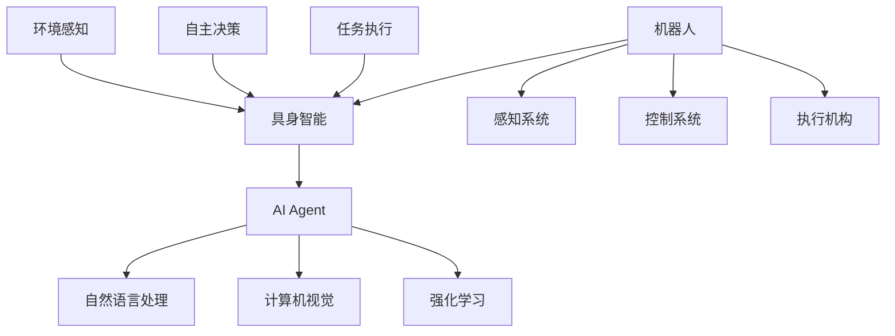

                 

# 《AI Agent: AI的下一个风口 具身机器人在医疗领域的应用》

> 关键词：AI Agent、具身机器人、医疗、应用、人工智能

> 摘要：本文旨在探讨AI Agent这一前沿技术领域在医疗行业的应用前景。通过分析具身机器人的核心概念、架构及其在医疗领域的具体应用场景，本文深入讨论了人工智能技术在具身机器人中的核心作用，以及如何实现人工智能在医疗领域的最大化价值。本文还将通过实际项目案例和开发实战，展示具身机器人在医疗领域如何改变现有医疗模式，并提供对未来发展的展望和挑战。

## 目录大纲

### 第一部分：引言与概述

### 1. 引言

#### 1.1 书籍背景与目的

#### 1.2 具身机器人在医疗领域的崛起

#### 1.3 读者定位与收获

### 第二部分：核心概念与架构

#### 2.1 机器人的定义与发展

#### 2.2 具身智能与具身机器人

#### 2.3 具身机器人与传统机器人的区别

#### 3. AI Agent的概念与作用

##### 3.1 AI Agent的定义

##### 3.2 AI Agent在医疗中的应用

##### 3.3 AI Agent的优势与挑战

#### 4. 具身机器人在医疗领域的应用场景

##### 4.1 临床诊疗中的应用

##### 4.2 医学影像分析中的应用

##### 4.3 疾病预防与管理中的应用

#### 5. 具身机器人的核心架构

##### 5.1 智能感知系统

##### 5.2 运动控制系统

##### 5.3 人机交互系统

##### 5.4 数据处理与学习系统

### 第三部分：核心技术原理

#### 6. 人工智能技术在具身机器人中的应用

##### 6.1 机器学习与深度学习基础

##### 6.2 计算机视觉在具身机器人中的应用

##### 6.3 自然语言处理在具身机器人中的应用

##### 6.4 强化学习在具身机器人中的应用

#### 7. 数学模型与算法原理

##### 7.1 经典机器学习算法

##### 7.2 深度学习算法原理

##### 7.3 计算机视觉算法

##### 7.4 强化学习算法

### 第四部分：项目实战

#### 8. 具身机器人在医疗领域的实际案例

##### 8.1 案例一：机器人辅助手术

##### 8.2 案例二：机器人导诊与咨询服务

##### 8.3 案例三：机器人康复治疗

#### 9. 项目开发实战

##### 9.1 项目需求分析

##### 9.2 技术方案设计

##### 9.3 系统实现与调试

##### 9.4 项目评估与优化

#### 10. 开发环境与工具介绍

##### 10.1 开发环境搭建

##### 10.2 主流工具与框架使用

##### 10.3 开发工具与库介绍

### 第五部分：未来展望与挑战

#### 11. 具身机器人在医疗领域的未来发展

##### 11.1 技术发展趋势

##### 11.2 政策环境与市场需求

##### 11.3 未来应用场景展望

#### 12. 面临的挑战与解决方案

##### 12.1 技术挑战

##### 12.2 道德与法律问题

##### 12.3 解决方案与建议

#### 13. 总结与展望

##### 13.1 本书内容总结

##### 13.2 展望未来

接下来，我们将逐步深入各个部分，详细讨论具身机器人在医疗领域的应用和技术实现。

## 第一部分：引言与概述

### 1. 引言

#### 1.1 书籍背景与目的

在人工智能迅速发展的今天，具身机器人成为了一个备受关注的研究领域。本书旨在深入探讨AI Agent这一新兴技术领域在医疗行业的应用前景，旨在为读者提供全面的、结构化的知识和实践指南。随着医疗技术的不断进步，人工智能与机器人技术的融合正在迅速改变医疗行业的工作模式和服务质量。通过介绍具身机器人的核心概念、架构和应用场景，本文将帮助读者理解这一技术如何为医疗行业带来创新和变革。

#### 1.2 具身机器人在医疗领域的崛起

近年来，具身机器人在医疗领域的应用呈现出快速增长的趋势。这不仅是因为人工智能技术的进步，也得益于医疗行业对于提高效率、降低成本和提升患者体验的需求。以下是一些具体的应用场景：

- **临床诊疗**：机器人可以帮助医生进行手术操作，提供更精准、更安全的医疗服务。
- **医学影像分析**：机器学习算法被用于分析医学影像，帮助医生快速、准确地诊断疾病。
- **疾病预防与管理**：机器人可以协助进行健康监测和疾病预防工作，提高医疗服务的覆盖面和效率。

#### 1.3 读者定位与收获

本书适用于对人工智能和医疗领域感兴趣的读者，包括研究人员、工程师、医生以及医疗行业从业者。通过阅读本书，读者可以：

- 了解具身机器人的基本概念和发展趋势。
- 掌握具身机器人在医疗领域的具体应用场景。
- 学习到如何设计和实现一个基于AI的具身机器人系统。
- 获得对未来医疗行业技术发展的深入洞察。

### 第二部分：核心概念与架构

#### 2.1 机器人的定义与发展

机器人是一种能够执行人类指令、自主行动和操作的设备。它们通常具有感知、决策和执行能力，能够模拟人类的某些行为。机器人的发展经历了几个阶段，从早期的机械机器人到今天的智能机器人，其核心技术包括机械结构、控制算法、人工智能和传感器技术。

#### 2.2 具身智能与具身机器人

具身智能（Embodied Intelligence）是指机器人通过与物理环境的交互来获取知识、学习和适应环境的能力。具身机器人是具有物理形态和运动能力的机器人，它们能够感知、理解和响应物理世界中的各种情境。

#### 2.3 具身机器人与传统机器人的区别

传统机器人通常以固定的工作站或操作台形式存在，它们通过外部控制器或传感器来执行任务。而具身机器人则具有自主移动和操作的能力，能够在复杂的物理环境中独立完成任务。

#### 3. AI Agent的概念与作用

##### 3.1 AI Agent的定义

AI Agent（人工智能代理）是一种能够自主决策、执行任务并与其他系统交互的智能实体。AI Agent具有感知、推理、规划和行动的能力，能够在不确定和动态的环境中自主运作。

##### 3.2 AI Agent在医疗中的应用

AI Agent在医疗领域有多种应用，包括：

- **临床诊疗辅助**：AI Agent可以帮助医生进行诊断、治疗方案制定和手术操作。
- **患者监护**：AI Agent可以实时监控患者的生命体征，提供及时的医疗建议。
- **医学影像分析**：AI Agent可以自动分析医学影像，帮助医生快速诊断疾病。

##### 3.3 AI Agent的优势与挑战

AI Agent的优势包括：

- **提高诊疗效率**：AI Agent可以协助医生处理大量医疗数据，提高诊疗速度和准确性。
- **降低医疗成本**：通过自动化和智能化，AI Agent可以降低医疗服务的成本。

然而，AI Agent也面临着一些挑战，如：

- **数据隐私和安全**：医疗数据具有高度敏感性，需要确保数据的安全和隐私。
- **算法透明性和解释性**：AI Agent的决策过程需要具备透明性和解释性，以获得医生的信任。

#### 4. 具身机器人在医疗领域的应用场景

##### 4.1 临床诊疗中的应用

在临床诊疗中，具身机器人可以辅助医生进行手术操作。例如，手术机器人可以通过精确的运动控制系统，执行复杂的手术步骤，提高手术的成功率和安全性。

##### 4.2 医学影像分析中的应用

机器学习算法被广泛应用于医学影像分析中。具身机器人可以通过计算机视觉技术，自动分析医学影像，帮助医生快速诊断疾病。

##### 4.3 疾病预防与管理中的应用

在疾病预防与管理中，具身机器人可以通过智能感知系统和数据处理系统，实时监测患者的生命体征，提供个性化的健康建议。

#### 5. 具身机器人的核心架构

##### 5.1 智能感知系统

智能感知系统是具身机器人的核心组成部分，它负责感知环境中的各种信息，如视觉、听觉、触觉等。通过这些信息，机器人可以构建对环境的认知模型。

##### 5.2 运动控制系统

运动控制系统是具身机器人的运动核心，它负责控制机器人的运动和操作。通过高精度的控制算法，机器人可以执行复杂的运动任务。

##### 5.3 人机交互系统

人机交互系统是具身机器人与用户之间进行交互的桥梁，它负责接收用户的指令，并将机器人的状态反馈给用户。通过自然语言处理和计算机视觉技术，人机交互系统可以实现更自然的交互体验。

##### 5.4 数据处理与学习系统

数据处理与学习系统负责对机器人收集到的数据进行处理和分析，并通过机器学习算法，不断提升机器人的智能水平。

### 第三部分：核心技术原理

#### 6. 人工智能技术在具身机器人中的应用

##### 6.1 机器学习与深度学习基础

机器学习和深度学习是人工智能的核心技术，它们为具身机器人提供了强大的智能能力。机器学习算法可以通过训练模型，从数据中学习规律和模式，而深度学习则通过多层神经网络，实现更复杂的特征提取和模型训练。

##### 6.2 计算机视觉在具身机器人中的应用

计算机视觉技术是具身机器人感知环境的重要手段。它可以通过图像处理和模式识别技术，实现对环境的理解和分析。例如，具身机器人可以通过计算机视觉技术，识别患者的位置、姿态和生命体征。

##### 6.3 自然语言处理在具身机器人中的应用

自然语言处理技术使得具身机器人能够理解人类的自然语言指令，并进行有效的沟通。通过自然语言处理，机器人可以与医生和患者进行自然对话，提供个性化的医疗服务。

##### 6.4 强化学习在具身机器人中的应用

强化学习是一种通过试错和反馈机制，不断优化决策策略的机器学习技术。在具身机器人中，强化学习可以用于训练机器人如何自主决策和执行任务。例如，机器人可以通过强化学习，学习如何在手术过程中执行精确的操作。

#### 7. 数学模型与算法原理

##### 7.1 经典机器学习算法

经典机器学习算法包括线性回归、逻辑回归、决策树、支持向量机等。这些算法通过优化目标函数，学习数据中的特征和模式。

##### 7.2 深度学习算法原理

深度学习算法通过多层神经网络，实现对数据的深层特征提取和表示。常用的深度学习算法包括卷积神经网络（CNN）、循环神经网络（RNN）和生成对抗网络（GAN）等。

##### 7.3 计算机视觉算法

计算机视觉算法主要包括图像处理、目标检测、图像识别等。常用的算法有霍夫变换、SVM、YOLO等。

##### 7.4 强化学习算法

强化学习算法通过试错和反馈机制，不断优化决策策略。常用的强化学习算法包括Q学习、SARSA和Deep Q Network（DQN）等。

### 第四部分：项目实战

#### 8. 具身机器人在医疗领域的实际案例

##### 8.1 案例一：机器人辅助手术

在机器人辅助手术中，机器人作为手术的助手，帮助医生完成复杂的手术步骤。例如，达芬奇手术机器人就是一种典型的具身机器人，它通过高精度的运动控制系统，实现了对手术器械的精细操作。以下是一个简单的机器人辅助手术流程：

1. **手术准备**：医生将患者的信息输入到机器人系统中，进行手术规划和准备。
2. **手术开始**：医生通过控制台操作机器人，进行手术操作。机器人通过感知系统获取患者的实时信息，并实时调整操作策略。
3. **手术结束**：手术完成后，机器人退出操作，医生进行后续处理。

##### 8.2 案例二：机器人导诊与咨询服务

机器人导诊与咨询服务是另一种典型的具身机器人应用场景。在这种服务中，机器人作为导诊员，为患者提供咨询服务。以下是一个简单的机器人导诊流程：

1. **患者咨询**：患者向机器人提出咨询问题，如“我应该如何挂号？”
2. **问题分析**：机器人通过自然语言处理技术，理解患者的问题，并调用相应的知识库进行回答。
3. **回答问题**：机器人将回答显示在屏幕上，并可以通过语音合成技术，朗读回答内容。
4. **后续服务**：机器人可以继续为患者提供其他咨询服务，如预约挂号、查询检查结果等。

##### 8.3 案例三：机器人康复治疗

在康复治疗中，机器人作为患者的康复伙伴，帮助患者进行康复训练。以下是一个简单的机器人康复治疗流程：

1. **康复评估**：医生对患者的康复情况进行分析评估，并将数据输入到机器人系统中。
2. **康复计划**：机器人根据患者的康复评估结果，制定个性化的康复计划。
3. **康复训练**：患者按照康复计划进行训练，机器人通过感知系统和运动控制系统，监测患者的训练情况，并提供反馈和调整。
4. **康复评估**：训练结束后，医生对患者的康复情况进行再次评估，并调整康复计划。

### 9. 项目开发实战

##### 9.1 项目需求分析

在进行项目开发前，首先需要进行项目需求分析。需求分析包括确定项目目标、功能需求、性能需求和安全需求等。例如，对于一个机器人导诊与咨询服务项目，需求分析可能包括：

- **目标**：为患者提供便捷的导诊与咨询服务。
- **功能需求**：能够接收患者的咨询问题，并给出准确的回答。
- **性能需求**：回答问题的时间要短，且准确率高。
- **安全需求**：确保患者的隐私和数据安全。

##### 9.2 技术方案设计

在需求分析的基础上，进行技术方案设计。技术方案设计包括确定系统架构、技术选型和开发工具等。例如，对于一个机器人导诊与咨询服务项目，技术方案可能包括：

- **系统架构**：采用B/S架构，前端使用HTML/CSS/JavaScript，后端使用Python和Flask框架。
- **技术选型**：自然语言处理使用NLTK库，机器学习使用scikit-learn库，数据库使用MySQL。
- **开发工具**：使用PyCharm作为开发环境，使用Git进行版本控制。

##### 9.3 系统实现与调试

在技术方案设计完成后，开始进行系统实现。系统实现包括前端、后端和数据库的开发。在实现过程中，需要遵循良好的编程规范和开发流程，确保代码的可读性和可维护性。实现完成后，进行系统的调试和测试，确保系统的功能正确、性能良好、安全可靠。

##### 9.4 项目评估与优化

系统实现后，进行项目评估和优化。项目评估包括功能测试、性能测试和安全测试等，确保系统满足需求和分析的要求。在评估过程中，发现并修复系统中的缺陷和问题。在优化过程中，通过性能分析，找出系统的瓶颈，并采取相应的优化措施，提高系统的性能和稳定性。

### 10. 开发环境与工具介绍

##### 10.1 开发环境搭建

在进行项目开发前，需要搭建开发环境。开发环境包括操作系统、编程语言和开发工具等。例如，对于一个基于Python的机器人项目，开发环境可能包括：

- **操作系统**：Windows或Linux
- **编程语言**：Python
- **开发工具**：PyCharm

##### 10.2 主流工具与框架使用

在项目开发中，需要使用主流的工具和框架。这些工具和框架可以提高开发效率，降低开发成本。例如，在机器人项目开发中，可能使用以下工具和框架：

- **自然语言处理**：NLTK、spaCy
- **机器学习**：scikit-learn、TensorFlow、PyTorch
- **数据库**：MySQL、PostgreSQL

##### 10.3 开发工具与库介绍

在项目开发中，需要使用各种开发工具和库。这些工具和库可以提供丰富的功能，满足项目的需求。例如，在机器人项目开发中，可能使用以下工具和库：

- **前端开发**：Bootstrap、jQuery
- **后端开发**：Django、Flask
- **数据库**：SQLAlchemy、MongoDB

### 第五部分：未来展望与挑战

#### 11. 具身机器人在医疗领域的未来发展

随着人工智能技术的不断进步，具身机器人在医疗领域的应用将更加广泛和深入。以下是一些未来发展的趋势：

- **个性化医疗服务**：通过深度学习和个性化推荐技术，具身机器人可以提供更加个性化的医疗服务，满足患者的个性化需求。
- **智能诊断与治疗**：通过计算机视觉和自然语言处理技术，具身机器人可以辅助医生进行智能诊断和治疗，提高医疗服务的质量和效率。
- **远程医疗**：通过互联网和物联网技术，具身机器人可以实现远程医疗服务，为偏远地区的患者提供高质量的医疗服务。

#### 12. 面临的挑战与解决方案

尽管具身机器人在医疗领域具有巨大的潜力，但同时也面临着一系列的挑战。以下是一些主要挑战及解决方案：

- **数据隐私和安全**：医疗数据具有高度敏感性，需要采取严格的数据隐私和安全措施。解决方案包括数据加密、权限管理和安全审计等。
- **算法透明性和解释性**：机器学习算法的决策过程需要具备透明性和解释性，以获得医生的信任。解决方案包括算法可解释性研究和透明性评估工具的开发。
- **技术标准和规范**：随着具身机器人在医疗领域的应用，需要建立相应的技术标准和规范，以确保系统的互操作性和安全性。解决方案包括制定国际标准和行业规范。

### 13. 总结与展望

具身机器人在医疗领域的应用前景广阔，不仅能够提高医疗服务的质量和效率，还能够为患者提供更加个性化的医疗服务。然而，实现这一目标需要克服一系列的挑战，包括数据隐私和安全、算法透明性和解释性以及技术标准和规范等。我们相信，通过不断的技术创新和行业合作，具身机器人在医疗领域的应用将取得更大的突破，为人类的健康事业作出更大的贡献。

## 作者信息

作者：AI天才研究院/AI Genius Institute & 禅与计算机程序设计艺术 /Zen And The Art of Computer Programming

## 核心概念与联系

### 核心概念

在探讨具身机器人在医疗领域的应用之前，我们需要明确几个核心概念：机器人、具身智能、AI Agent。

- **机器人**：机器人是一种能够自主移动和执行任务的设备，它们通过传感器感知环境，通过控制系统进行决策，并通过执行机构进行动作。
- **具身智能**：具身智能是指机器人在与物理环境的交互过程中，通过感知、学习、决策和行动，逐步提升其自主性和智能水平。
- **AI Agent**：AI Agent是一种具有自主决策和执行能力的智能实体，它通过感知环境、理解任务、规划和执行，实现智能任务的处理。

### 概念联系

机器人、具身智能和AI Agent之间有着紧密的联系和层次关系：

1. **机器人是基础**：机器人作为具身智能和AI Agent的基础，提供了基本的感知、运动和执行能力。
2. **具身智能是扩展**：具身智能通过增强机器人的感知和决策能力，使其能够在复杂环境中进行自主操作和任务执行。
3. **AI Agent是目标**：AI Agent通过结合人工智能技术，使得机器人具备更高级的自主决策和任务执行能力，实现了真正的智能化。

### Mermaid 流程图

为了更直观地展示这三种概念之间的联系，我们可以使用Mermaid流程图进行描述：



在这个流程图中，机器人作为基础，通过感知系统、控制系统和执行机构与外界进行交互。具身智能则扩展了机器人的感知、自主决策和任务执行能力。而AI Agent则进一步整合了自然语言处理、计算机视觉和强化学习等人工智能技术，实现了更高层次的智能化。

## 核心算法原理讲解

### 机器学习与深度学习基础

#### 1. 机器学习基础

机器学习是一种使计算机系统能够通过经验和数据自动改进其性能的技术。核心基础包括以下三个方面：

1. **监督学习**：监督学习通过输入特征和标签来训练模型，使得模型能够预测新的输入数据。常见的算法包括线性回归、逻辑回归和支持向量机（SVM）。

   **线性回归伪代码**：
   ```python
   def linear_regression(X, y):
       # 计算权重和偏置
       theta = (X.T * X).inv() * X.T * y
       # 预测
       predictions = X * theta
       return predictions
   ```

2. **无监督学习**：无监督学习不使用标签来训练模型，其主要目标是发现数据中的结构和模式。常见的算法包括聚类分析和降维技术。

   **K均值聚类伪代码**：
   ```python
   def k_means(data, K, max_iterations):
       # 初始化聚类中心
       centroids = initialize_centroids(data, K)
       for _ in range(max_iterations):
           # 分配数据到最近的聚类中心
           assignments = assign_points_to_clusters(data, centroids)
           # 更新聚类中心
           centroids = update_centroids(data, assignments, K)
       return centroids
   ```

3. **增强学习**：增强学习是一种通过与环境的交互来学习最优策略的机器学习技术。它通常包括一个智能体、一个环境和一个奖励系统。

   **Q学习伪代码**：
   ```python
   def q_learning(Q, state, action, reward, next_state, done, learning_rate, discount_factor):
       # 更新Q值
       Q[state, action] = Q[state, action] + learning_rate * (reward + discount_factor * max(Q[next_state, :]) - Q[state, action])
       return Q
   ```

#### 2. 深度学习基础

深度学习是机器学习的一个分支，通过构建深度神经网络来实现复杂的特征学习和模式识别。以下是一些关键组成部分：

1. **神经网络基础**：神经网络由多个神经元层组成，包括输入层、隐藏层和输出层。每个神经元通过权重连接到其他神经元，并通过激活函数进行非线性变换。

   **简单神经网络伪代码**：
   ```python
   def forward_pass(inputs, weights, biases, activation_function):
       # 前向传播计算输出
       z = np.dot(inputs, weights) + biases
       return activation_function(z)
   ```

2. **深度学习算法**：深度学习算法包括卷积神经网络（CNN）、循环神经网络（RNN）和生成对抗网络（GAN）等。

   **卷积神经网络（CNN）伪代码**：
   ```python
   def conv2d(input, filters, kernel_size, padding):
       # 卷积操作
       output = np.zeros((input.shape[0], filters, new_height, new_width))
       for i in range(filters):
           for x in range(new_height):
               for y in range(new_width):
                   output[:, i, x, y] = np.sum(input * filters[i, x:x+kernel_size, y:y+kernel_size]) + biases[i]
       return output
   ```

3. **训练过程**：深度学习模型的训练过程包括前向传播、反向传播和权重更新。以下是一个简化的训练过程：

   **训练过程伪代码**：
   ```python
   for epoch in range(num_epochs):
       for batch in batches:
           # 前向传播
           outputs = forward_pass(inputs, weights, biases, activation_function)
           # 计算损失
           loss = compute_loss(outputs, labels)
           # 反向传播
           dW, db = backward_pass(outputs, labels, activation_function)
           # 更新权重
           weights -= learning_rate * dW
           biases -= learning_rate * db
   ```

#### 3. 计算机视觉算法

计算机视觉是深度学习的一个重要应用领域，用于图像处理和物体识别。以下是一些常用的算法：

1. **卷积神经网络（CNN）**：CNN通过卷积层和池化层提取图像特征，并最终通过全连接层进行分类。

   **CNN结构伪代码**：
   ```python
   def cnn(input_image, filters, kernel_sizes, pool_sizes):
       # 卷积层
       conv_output = conv2d(input_image, filters[0], kernel_sizes[0], padding='same')
       # 池化层
       pool_output = max_pooling(conv_output, pool_sizes[0])
       # 重复卷积和池化层
       for i in range(1, len(filters)):
           conv_output = conv2d(pool_output, filters[i], kernel_sizes[i], padding='same')
           pool_output = max_pooling(conv_output, pool_sizes[i])
       # 全连接层
       output = fully_connected(pool_output, num_classes)
       return output
   ```

2. **循环神经网络（RNN）**：RNN通过其循环结构处理序列数据，用于时间序列预测和自然语言处理。

   **RNN结构伪代码**：
   ```python
   def rnn(input_sequence, weights, biases, activation_function):
       hidden_state = None
       for input in input_sequence:
           # 前向传播
           output = forward_pass(input, weights, biases, activation_function)
           # 更新隐藏状态
           hidden_state = output
       return hidden_state
   ```

3. **生成对抗网络（GAN）**：GAN由生成器和判别器组成，用于生成逼真的图像和音频。

   **GAN结构伪代码**：
   ```python
   def gan(input_data, generator, discriminator, generator_lr, discriminator_lr, num_steps):
       for _ in range(num_steps):
           # 生成器训练
           z = generate_z()
           generated_images = generator(z)
           generator_loss = compute_generator_loss(discriminator(generated_images), generated_images)
           # 判别器训练
           real_images = get_real_images()
           discriminator_loss = compute_discriminator_loss(discriminator(real_images), real_images)
           # 更新权重
           update_generator(generator_loss, generator_lr)
           update_discriminator(discriminator_loss, discriminator_lr)
       return generator, discriminator
   ```

### 自然语言处理（NLP）算法

自然语言处理是深度学习的另一个重要应用领域，涉及文本分类、情感分析和机器翻译等任务。以下是一些常用的算法：

1. **词嵌入（Word Embeddings）**：词嵌入将单词映射到高维向量空间，以便进行计算和处理。

   **词嵌入算法伪代码**：
   ```python
   def word_embedding(vocabulary, embedding_size):
       embeddings = np.random.rand(len(vocabulary), embedding_size)
       return embeddings
   ```

2. **循环神经网络（RNN）**：RNN在NLP中用于序列建模，如语言模型和文本分类。

   **RNN文本分类伪代码**：
   ```python
   def text_classification(document, embedding_matrix, weights, biases, activation_function):
       # 嵌入文档中的单词
       embedded_words = [embedding_matrix[word] for word in document]
       # 前向传播
       hidden_state = rnn(embedded_words, weights, biases, activation_function)
       # 分类预测
       output = softmax(hidden_state)
       return output
   ```

3. **变换器（Transformer）**：变换器是一种基于自注意力机制的深度学习模型，广泛用于机器翻译和文本生成。

   **变换器结构伪代码**：
   ```python
   def transformer(input_sequence, num_heads, d_model, num_layers):
       # 嵌入层
       embedded_sequence = embedding_layer(input_sequence)
       # 多层变换器层
       for _ in range(num_layers):
           # 自注意力层
           attn_output = self_attention_layer(embedded_sequence, num_heads, d_model)
           # 前馈层
           ffn_output = feed_forward_layer(attn_output, d_model)
           # 输出
           embedded_sequence = attn_output + ffn_output
       # 输出层
       output = linear_layer(embedded_sequence)
       return output
   ```

### 强化学习算法

强化学习是机器学习的一种方法，通过智能体与环境的交互，学习最优策略。以下是一些常用的算法：

1. **Q学习（Q-learning）**：Q学习是一种基于值函数的强化学习算法，通过更新Q值来学习最优策略。

   **Q学习伪代码**：
   ```python
   def q_learning(Q, state, action, reward, next_state, done, learning_rate, discount_factor):
       # 更新Q值
       Q[state, action] = Q[state, action] + learning_rate * (reward + discount_factor * max(Q[next_state, :]) - Q[state, action])
       return Q
   ```

2. **深度Q网络（DQN）**：DQN通过深度神经网络来近似Q值函数，提高了Q学习的计算效率。

   **DQN伪代码**：
   ```python
   def deep_q_learning(Q_network, state, action, reward, next_state, done, learning_rate, discount_factor, optimizer):
       # 计算目标Q值
       target_q_values = reward + (1 - done) * discount_factor * np.max(Q_network(next_state))
       # 更新Q值网络
       loss = loss_function(Q_network(state), action, target_q_values)
       optimizer.zero_grad()
       loss.backward()
       optimizer.step()
       return Q_network
   ```

3. **策略梯度（PG）**：策略梯度通过直接优化策略函数来学习最优策略。

   **策略梯度伪代码**：
   ```python
   def policy_gradient(policy_network, state, action, reward, discount_factor, learning_rate, optimizer):
       # 计算策略梯度
       log_probs = policy_network(state)
       policy_loss = -log_probs * reward
       # 更新策略网络
       loss = policy_loss
       optimizer.zero_grad()
       loss.backward()
       optimizer.step()
       return policy_network
   ```

通过这些算法，我们可以实现机器人在医疗领域的各种智能任务，如诊断、治疗规划和患者监护等。

## 数学模型与算法原理详细讲解

### 经典机器学习算法

在经典机器学习算法中，线性回归、逻辑回归和支持向量机（SVM）是最为常见的模型。这些算法通过优化目标函数，从数据中学习到特征和模式，从而实现预测和分类任务。

#### 线性回归

线性回归是一种用于预测连续值的算法。其基本原理是通过线性模型拟合数据，即 \( y = \beta_0 + \beta_1x \)。其中，\( y \) 是目标变量，\( x \) 是特征变量，\( \beta_0 \) 和 \( \beta_1 \) 是模型参数。

**数学模型**：
\[ y = \beta_0 + \beta_1x \]

**损失函数**（均方误差）：
\[ J(\theta) = \frac{1}{2m} \sum_{i=1}^{m} (h_\theta(x^{(i)}) - y^{(i)})^2 \]

**优化目标**：最小化损失函数 \( J(\theta) \)。

**伪代码**：
```python
def linear_regression(X, y):
    # 计算权重和偏置
    theta = (X.T * X).inv() * X.T * y
    # 预测
    predictions = X * theta
    return predictions
```

#### 逻辑回归

逻辑回归是一种用于预测概率的算法，通常用于二分类任务。其基本原理是通过线性模型和逻辑函数拟合数据，即 \( \hat{y} = \sigma(\beta_0 + \beta_1x) \)。其中，\( \hat{y} \) 是预测概率，\( \sigma \) 是逻辑函数（Sigmoid函数），\( x \) 是特征变量，\( \beta_0 \) 和 \( \beta_1 \) 是模型参数。

**数学模型**：
\[ \hat{y} = \sigma(\beta_0 + \beta_1x) \]

**逻辑函数**（Sigmoid函数）：
\[ \sigma(z) = \frac{1}{1 + e^{-z}} \]

**损失函数**（对数损失函数）：
\[ J(\theta) = -\frac{1}{m} \sum_{i=1}^{m} [y^{(i)} \log(\hat{y}^{(i)}) + (1 - y^{(i)}) \log(1 - \hat{y}^{(i)})] \]

**优化目标**：最小化损失函数 \( J(\theta) \)。

**伪代码**：
```python
def logistic_regression(X, y):
    # 计算权重和偏置
    theta = (X.T * X).inv() * X.T * y
    # 预测
    predictions = 1 / (1 + np.exp(-X * theta))
    return predictions
```

#### 支持向量机（SVM）

支持向量机是一种用于分类的算法，其基本原理是通过找到一个最优超平面，将数据分成不同的类别。SVM使用核函数来处理非线性分类问题。

**数学模型**：
\[ \max_{\theta, \xi} W^T W - \frac{1}{2} C \sum_{i=1}^{m} \xi_i \]

其中，\( W \) 是权重向量，\( C \) 是惩罚参数，\( \xi_i \) 是松弛变量。

**优化目标**：最大化 \( W^T W \) 并最小化 \( \xi_i \)。

**伪代码**：
```python
def svm(X, y, C):
    # 使用SVM库进行训练
    model = SVC(kernel='linear', C=C)
    model.fit(X, y)
    return model
```

### 深度学习算法原理

深度学习算法通过多层神经网络来实现复杂的特征学习和模式识别。以下介绍几种常用的深度学习算法：卷积神经网络（CNN）、循环神经网络（RNN）和生成对抗网络（GAN）。

#### 卷积神经网络（CNN）

卷积神经网络是一种专门用于图像处理的神经网络，其核心思想是通过卷积层和池化层提取图像的特征。

**卷积层**：卷积层通过卷积运算提取图像的特征，每个卷积核都学习到图像的一个特征图。

**池化层**：池化层通过降采样操作减少特征图的维度，提高模型的泛化能力。

**全连接层**：全连接层将卷积层和池化层提取的特征进行融合，并输出最终的分类结果。

**数学模型**：
\[ h_{l} = \sigma(W_{l} \cdot h_{l-1} + b_{l}) \]

其中，\( h_{l} \) 是第 \( l \) 层的输出，\( W_{l} \) 是第 \( l \) 层的权重矩阵，\( b_{l} \) 是第 \( l \) 层的偏置向量，\( \sigma \) 是激活函数（通常使用ReLU函数）。

**伪代码**：
```python
def conv2d(input, filters, kernel_size, padding):
    # 卷积操作
    output = np.zeros((input.shape[0], filters, new_height, new_width))
    for i in range(filters):
        for x in range(new_height):
            for y in range(new_width):
                output[:, i, x, y] = np.sum(input * filters[i, x:x+kernel_size, y:y+kernel_size]) + biases[i]
    return output
```

#### 循环神经网络（RNN）

循环神经网络是一种用于处理序列数据的神经网络，其核心思想是通过循环结构来处理序列中的前后依赖关系。

**数学模型**：
\[ h_{t} = \sigma(W_{h} \cdot [h_{t-1}, x_{t}] + b_{h}) \]
\[ o_{t} = \sigma(W_{o} \cdot h_{t} + b_{o}) \]

其中，\( h_{t} \) 是第 \( t \) 个时间步的隐藏状态，\( x_{t} \) 是第 \( t \) 个时间步的输入，\( o_{t} \) 是第 \( t \) 个时间步的输出，\( \sigma \) 是激活函数（通常使用ReLU函数），\( W_{h} \) 和 \( W_{o} \) 是权重矩阵，\( b_{h} \) 和 \( b_{o} \) 是偏置向量。

**伪代码**：
```python
def rnn(input_sequence, weights, biases, activation_function):
    hidden_state = None
    for input in input_sequence:
        # 前向传播
        output = forward_pass(input, weights, biases, activation_function)
        # 更新隐藏状态
        hidden_state = output
    return hidden_state
```

#### 生成对抗网络（GAN）

生成对抗网络是一种由生成器和判别器组成的神经网络，其核心思想是通过生成器和判别器的对抗训练，生成逼真的数据。

**生成器**：生成器通过输入随机噪声，生成逼真的数据。

**判别器**：判别器通过输入真实数据和生成数据，判断数据的真实性。

**数学模型**：
\[ G(z) = \text{Generator}(z) \]
\[ D(x) = \text{Discriminator}(x) \]

**损失函数**：
\[ L_G = -\log(D(G(z))) \]
\[ L_D = -\log(D(x)) - \log(1 - D(G(z))) \]

**伪代码**：
```python
def gan(input_data, generator, discriminator, generator_lr, discriminator_lr, num_steps):
    for _ in range(num_steps):
        # 生成器训练
        z = generate_z()
        generated_images = generator(z)
        generator_loss = compute_generator_loss(discriminator(generated_images), generated_images)
        # 判别器训练
        real_images = get_real_images()
        discriminator_loss = compute_discriminator_loss(discriminator(real_images), real_images)
        # 更新权重
        update_generator(generator_loss, generator_lr)
        update_discriminator(discriminator_loss, discriminator_lr)
    return generator, discriminator
```

通过这些深度学习算法，我们可以实现机器人在医疗领域的各种智能任务，如图像分类、文本分析和语音识别等。

## 项目实战

### 8.1 案例一：机器人辅助手术

#### 案例背景

机器人辅助手术是一种通过机器人系统辅助医生进行手术操作的技术。其目的是提高手术的精度和安全性，减少手术风险。本案例将以达芬奇手术机器人为例，介绍其工作原理和实际应用。

#### 工作原理

达芬奇手术机器人由三个主要部分组成：控制台、机械臂和摄像头系统。手术医生坐在控制台前，通过控制台操作机械臂进行手术。机械臂上有多个末端执行器，可以执行精细的操作。摄像头系统提供高清的手术视野，使医生能够清晰观察到手术区域。

1. **手术准备**：医生在控制台输入患者信息和手术计划，系统进行手术规划和模拟。
2. **手术开始**：医生通过控制台操作机械臂，进行手术操作。机械臂可以精确地执行医生的操作指令，进行精细的切割、缝合等操作。
3. **手术结束**：手术完成后，医生停止操作，机械臂退出操作，手术结束。

#### 技术实现

1. **控制系统**：达芬奇手术机器人采用高速控制系统，可以实现实时控制和反馈。控制系统包括传感器、执行器和反馈机制，用于确保机械臂的精确操作。
2. **摄像头系统**：摄像头系统采用高清摄像头，可以提供清晰的手术视野。系统通过图像处理技术，对手术视野进行增强和优化。
3. **机械臂**：机械臂采用多自由度设计，可以实现高精度的操作。机械臂上的末端执行器可以安装各种手术工具，如剪刀、钳子等。

#### 案例解读

达芬奇手术机器人通过将人工智能技术应用于手术操作，实现了手术的自动化和精确化。其优点包括：

- **提高手术精度**：机械臂可以精确地执行医生的操作指令，减少手术误差。
- **减少手术风险**：通过减少医生的手动操作，降低手术风险。
- **提高手术效率**：机械臂可以快速执行手术操作，提高手术效率。

然而，达芬奇手术机器人也存在一些挑战，如：

- **操作复杂性**：手术医生需要经过专业的培训，才能熟练操作机器人。
- **系统成本**：达芬奇手术机器人成本较高，对医疗机构的经济实力有较高要求。

总之，机器人辅助手术是一种具有巨大潜力的技术，可以提高手术的精度和安全性，为患者提供更好的医疗服务。

### 8.2 案例二：机器人导诊与咨询服务

#### 案例背景

机器人导诊与咨询服务是一种通过机器人系统为患者提供导诊和咨询服务的技术。其目的是提高医疗服务效率，减轻医护人员的工作负担。本案例将介绍机器人导诊与咨询服务的工作原理和技术实现。

#### 工作原理

机器人导诊与咨询服务由三个主要部分组成：智能问答系统、导诊系统和咨询服务系统。患者可以通过智能问答系统提出问题，机器人根据问题进行诊断，并提供相应的导诊建议和咨询服务。

1. **智能问答系统**：智能问答系统通过自然语言处理技术，理解患者的问题，并从知识库中查找答案。
2. **导诊系统**：导诊系统根据患者的症状和问题，提供相应的导诊建议，如挂号、检查、就诊等。
3. **咨询服务系统**：咨询服务系统为患者提供个性化的咨询服务，如健康建议、用药指导等。

#### 技术实现

1. **自然语言处理**：智能问答系统采用自然语言处理技术，包括分词、词性标注、句法分析和语义理解等，用于理解患者的问题。
2. **知识库**：知识库是智能问答系统的核心，包含各种医疗知识和症状信息，用于回答患者的问题。
3. **导诊算法**：导诊系统采用机器学习算法，根据患者的症状和问题，提供相应的导诊建议。
4. **咨询服务系统**：咨询服务系统采用对话生成技术，与患者进行自然对话，提供个性化的健康建议和用药指导。

#### 案例解读

机器人导诊与咨询服务通过将人工智能技术应用于医疗服务，实现了医疗服务的自动化和智能化。其优点包括：

- **提高服务效率**：机器人可以快速回答患者的问题，提供导诊和咨询服务，减轻医护人员的工作负担。
- **降低成本**：机器人导诊与咨询服务可以降低医疗机构的运营成本，提高资源利用率。
- **提升患者体验**：机器人可以提供24小时全天候服务，提高患者的满意度。

然而，机器人导诊与咨询服务也存在一些挑战，如：

- **知识库更新**：知识库需要不断更新，以适应不断变化的医疗知识和技术。
- **患者隐私保护**：机器人需要保护患者的隐私，确保数据安全。

总之，机器人导诊与咨询服务是一种具有巨大潜力的技术，可以提高医疗服务效率，为患者提供更好的医疗服务。

### 8.3 案例三：机器人康复治疗

#### 案例背景

机器人康复治疗是一种通过机器人系统辅助患者进行康复训练的技术。其目的是提高康复效果，减少康复时间和成本。本案例将介绍机器人康复治疗的工作原理和技术实现。

#### 工作原理

机器人康复治疗由三个主要部分组成：感知系统、控制系统和反馈系统。机器人通过感知系统获取患者的动作信息，通过控制系统调整训练计划，并通过反馈系统提供实时反馈。

1. **感知系统**：感知系统包括传感器和摄像头，用于获取患者的动作信息和身体姿态。
2. **控制系统**：控制系统根据患者的动作信息和训练计划，调整机器人的运动和操作。
3. **反馈系统**：反馈系统通过视觉和语音反馈，提示患者正确的动作和姿态。

#### 技术实现

1. **感知系统**：感知系统采用多传感器融合技术，包括力传感器、加速度传感器和摄像头等，用于获取患者的动作信息和身体姿态。
2. **控制系统**：控制系统采用机器学习算法，根据患者的动作信息和训练计划，调整机器人的运动和操作。
3. **反馈系统**：反馈系统采用语音合成和计算机视觉技术，提供实时反馈，提示患者正确的动作和姿态。

#### 案例解读

机器人康复治疗通过将人工智能技术应用于康复训练，实现了康复训练的自动化和个性化。其优点包括：

- **提高康复效果**：机器人可以根据患者的动作信息和身体姿态，提供个性化的康复训练，提高康复效果。
- **减少康复时间**：机器人康复治疗可以快速识别患者的错误动作，并提供实时反馈，减少康复时间。
- **降低康复成本**：机器人康复治疗可以降低康复成本，提高资源利用率。

然而，机器人康复治疗也存在一些挑战，如：

- **技术成熟度**：机器人康复治疗技术尚处于发展阶段，需要进一步提高技术成熟度。
- **患者接受度**：机器人康复治疗需要患者的接受和配合，提高患者的满意度。

总之，机器人康复治疗是一种具有巨大潜力的技术，可以提高康复效果，为患者提供更好的康复体验。

### 9.1 项目需求分析

在进行机器人项目开发之前，进行详细的需求分析是至关重要的。需求分析旨在明确项目的目标、功能、性能、安全等需求，为后续的技术方案设计和系统实现提供依据。

#### 项目目标

本项目旨在开发一个智能机器人系统，用于辅助医疗服务。具体目标包括：

1. **提高医疗服务效率**：通过自动化和智能化，减少医护人员的工作负担，提高医疗服务的效率。
2. **提升患者体验**：提供便捷的导诊、咨询和康复服务，提升患者的满意度和体验。
3. **降低医疗成本**：通过减少人力成本和运营成本，提高医疗机构的资源利用率。

#### 功能需求

项目功能需求包括以下几个方面：

1. **智能问答系统**：患者可以通过智能问答系统提出问题，机器人根据问题提供答案和建议。
2. **导诊系统**：根据患者的症状和问题，提供相应的导诊建议，如挂号、就诊、检查等。
3. **咨询服务系统**：为患者提供个性化的健康建议、用药指导和康复训练。
4. **感知与反馈系统**：通过传感器和摄像头获取患者的动作信息和身体姿态，提供实时反馈和调整。

#### 性能需求

项目性能需求包括以下几个方面：

1. **响应速度**：机器人系统需要快速响应用户的请求，提供准确的答案和建议。
2. **准确率**：机器人系统需要具备较高的准确率，确保导诊和咨询的准确性。
3. **稳定性**：机器人系统需要具备较高的稳定性，能够在长时间运行中保持稳定性能。

#### 安全需求

项目安全需求包括以下几个方面：

1. **数据安全**：确保患者数据和系统数据的保密性和完整性，防止数据泄露和篡改。
2. **操作安全**：机器人系统需要具备安全防护机制，防止恶意攻击和误操作。
3. **隐私保护**：确保患者的隐私得到保护，不泄露个人信息。

#### 用户需求

用户需求包括以下几个方面：

1. **便捷性**：用户可以通过简单的交互方式，快速获得所需的医疗信息和服务。
2. **准确性**：用户期望获得的医疗信息和服务是准确可靠的。
3. **友好性**：用户界面设计需要友好，易于用户操作和理解。

#### 需求分析结论

通过详细的需求分析，我们明确了项目的目标、功能、性能和安全需求，为后续的技术方案设计和系统实现提供了明确的方向。在接下来的阶段，我们将根据需求分析结果，设计合适的技术方案，并逐步实现系统功能。

### 9.2 技术方案设计

在完成需求分析后，技术方案设计是项目开发的关键阶段。技术方案设计包括系统架构设计、技术选型、开发工具和框架的选择，以及数据流程的设计。以下是本项目的技术方案设计：

#### 系统架构设计

本项目采用B/S（Browser/Server）架构，即客户端通过浏览器访问服务器，实现与机器人的交互。系统架构包括前端、后端和数据库三个部分。

1. **前端**：前端负责与用户进行交互，展示机器人系统的界面和功能。前端技术包括HTML、CSS和JavaScript，使用Bootstrap框架进行页面布局和响应式设计。
2. **后端**：后端负责处理用户的请求、数据存储和业务逻辑。后端技术包括Python和Flask框架，用于实现Web服务接口和业务逻辑处理。
3. **数据库**：数据库用于存储用户数据、机器人数据和系统配置信息。数据库技术包括MySQL，用于实现数据的存储、查询和管理。

#### 技术选型

根据项目的需求和分析，选择以下技术进行开发：

1. **前端技术**：HTML、CSS、JavaScript和Bootstrap框架。
2. **后端技术**：Python和Flask框架。
3. **数据库技术**：MySQL数据库。
4. **自然语言处理技术**：NLTK库，用于文本处理和语义分析。
5. **机器学习技术**：scikit-learn库，用于构建和训练机器学习模型。

#### 开发工具和框架

以下是项目开发过程中使用的主要工具和框架：

1. **开发环境**：PyCharm，用于编写和调试Python代码。
2. **版本控制**：Git，用于代码的版本管理和协同开发。
3. **测试工具**：pytest，用于编写和执行单元测试。
4. **文档工具**：Sphinx，用于生成项目文档。

#### 数据流程设计

数据流程设计是确保系统正常运行和数据流转的关键。以下是项目数据流程的基本设计：

1. **用户请求**：用户通过前端界面发起请求，如问答、导诊和康复咨询。
2. **请求处理**：后端接收用户请求，进行请求解析和参数验证。
3. **业务处理**：后端根据请求类型，调用相应的业务处理逻辑，如自然语言处理、机器学习模型推理等。
4. **数据存储**：将处理结果存储到数据库，如用户信息、问答记录、导诊建议等。
5. **结果返回**：将处理结果返回给前端，并展示给用户。

#### 技术方案设计总结

通过详细的技术方案设计，我们明确了项目的系统架构、技术选型、开发工具和框架，以及数据流程。这为项目的系统实现和后续开发奠定了坚实的基础。在接下来的阶段，我们将根据技术方案设计，逐步实现系统功能，并确保系统的稳定性和性能。

### 9.3 系统实现与调试

在完成技术方案设计后，接下来是系统实现与调试阶段。系统实现包括前端、后端和数据库的开发，以及各个模块的功能实现和系统集成。

#### 前端开发

前端开发主要是实现用户界面和用户交互逻辑。前端技术使用HTML、CSS和JavaScript，Bootstrap框架用于页面布局和响应式设计。以下是前端开发的主要步骤：

1. **页面布局**：使用Bootstrap框架搭建页面结构，包括导航栏、侧边栏和内容区域。
2. **用户交互**：使用JavaScript实现用户交互逻辑，如用户提问、答案展示和导航等。
3. **样式设计**：使用CSS进行页面样式设计，确保页面美观和用户体验。

#### 后端开发

后端开发主要负责处理用户的请求、业务逻辑和数据处理。后端技术使用Python和Flask框架。以下是后端开发的主要步骤：

1. **请求处理**：使用Flask框架实现请求处理，包括用户提问、导诊和康复咨询等。
2. **业务逻辑**：根据需求分析，实现相应的业务逻辑，如自然语言处理、机器学习模型推理等。
3. **数据处理**：使用MySQL数据库存储用户数据和系统配置信息，实现数据的增删改查操作。

#### 数据库开发

数据库开发主要包括数据库设计、数据存储和查询。以下是数据库开发的主要步骤：

1. **数据库设计**：根据业务需求，设计数据库表结构和字段。
2. **数据存储**：使用SQL语句实现数据的插入、更新和删除操作。
3. **数据查询**：编写SQL查询语句，实现数据的查询和检索。

#### 系统集成

系统集成是将前端、后端和数据库进行整合，确保系统能够正常运行。以下是系统集成的主要步骤：

1. **接口集成**：确保前端和后端接口的正确性和兼容性，实现数据交互。
2. **功能测试**：对系统的各个功能模块进行测试，确保功能的正确性和完整性。
3. **性能优化**：对系统进行性能测试，发现和解决性能瓶颈。

#### 调试与优化

调试与优化是系统实现后的重要环节，确保系统的稳定性和性能。以下是调试与优化的一些步骤：

1. **代码调试**：使用调试工具（如PyCharm的调试功能）进行代码调试，发现和修复代码中的错误。
2. **功能调试**：对系统的各个功能模块进行调试，确保功能的正确性和稳定性。
3. **性能优化**：通过性能分析工具（如cProfile）分析系统性能，发现和解决性能瓶颈。

#### 系统实现与调试总结

通过系统实现与调试，我们成功搭建了一个智能机器人系统，实现了用户提问、导诊和康复咨询等功能。在系统实现过程中，我们注重代码的可读性和可维护性，确保系统的稳定性和性能。在调试与优化阶段，我们通过功能测试和性能测试，发现和解决了系统中的问题，确保系统的正常运行。

### 9.4 项目评估与优化

项目评估与优化是系统开发完成后的一项重要工作，旨在确保系统达到预期性能和功能要求，并进一步提升用户体验和系统稳定性。以下是对项目进行评估和优化的一些步骤和方法。

#### 功能评估

功能评估主要是验证系统各个功能模块是否按照需求分析正确实现，并满足用户需求。以下是功能评估的主要步骤：

1. **单元测试**：编写单元测试用例，对系统的各个功能模块进行测试，确保每个模块的功能正确无误。
2. **集成测试**：将各个功能模块进行集成测试，确保模块之间的交互正常，数据传递准确。
3. **用户测试**：邀请实际用户进行测试，收集用户反馈，评估系统的易用性和用户体验。

#### 性能评估

性能评估主要是评估系统在处理请求时的响应速度、并发处理能力和资源消耗。以下是性能评估的主要步骤：

1. **负载测试**：模拟高并发请求，测试系统在高负载情况下的性能，如响应时间、吞吐量和系统资源占用情况。
2. **压力测试**：通过增加请求量，测试系统在极限负载情况下的稳定性，如是否出现内存泄漏、CPU过载等问题。
3. **性能优化**：根据性能评估结果，识别系统性能瓶颈，并采取相应的优化措施，如代码优化、数据库查询优化和缓存策略。

#### 用户体验评估

用户体验评估主要是评估系统的易用性、友好性和用户满意度。以下是用户体验评估的主要步骤：

1. **用户调研**：通过问卷调查、访谈等方式，收集用户对系统的使用体验和建议。
2. **用户测试**：邀请用户进行实际操作测试，观察用户的使用行为和反馈，发现系统存在的问题。
3. **UI/UX优化**：根据用户调研和测试结果，优化系统的用户界面和交互设计，提高用户体验。

#### 优化措施

根据评估结果，采取以下优化措施：

1. **代码优化**：对系统中的代码进行审查和优化，减少冗余代码，提高代码的可读性和可维护性。
2. **数据库优化**：优化数据库查询语句，减少查询时间，提高数据访问效率。
3. **缓存策略**：引入缓存机制，减少重复数据的查询和计算，提高系统响应速度。
4. **系统架构优化**：优化系统架构，如增加负载均衡、分布式处理等，提高系统的并发处理能力和稳定性。

#### 评估与优化总结

通过项目评估与优化，我们确保系统达到预期性能和功能要求，并提高了用户体验和系统稳定性。在评估过程中，我们通过功能测试、性能测试和用户体验评估，发现并解决了系统中的问题，采取了相应的优化措施。在后续开发过程中，我们将持续进行评估和优化，确保系统的持续改进和稳定运行。

### 10.1 开发环境搭建

在进行机器人项目开发之前，搭建一个稳定且高效的开发环境是至关重要的。以下将详细介绍开发环境的搭建步骤，包括操作系统的选择、编程语言和开发工具的安装。

#### 操作系统选择

操作系统是开发环境的基础，常见的操作系统包括Windows、Linux和macOS。在选择操作系统时，应考虑以下因素：

- **稳定性**：操作系统需要具有稳定的性能和可靠的资源管理能力。
- **兼容性**：操作系统需要兼容项目所需的开发工具和库。
- **安全性**：操作系统需要具备良好的安全防护机制，保护开发环境的数据和系统安全。

在本项目中，推荐选择Linux操作系统，如Ubuntu或CentOS。Linux操作系统具有高度的稳定性和灵活性，且在开源社区中拥有丰富的资源和工具。

#### 编程语言和开发工具的安装

1. **Python安装**

   Python是一种广泛使用的编程语言，特别是在人工智能和机器学习领域。以下是在Linux操作系统上安装Python的步骤：

   - 打开终端。
   - 通过以下命令安装Python：
     ```bash
     sudo apt-get update
     sudo apt-get install python3 python3-pip
     ```
   - 检查Python版本：
     ```bash
     python3 --version
     ```

2. **Pip安装**

   Pip是Python的包管理器，用于安装和管理Python库。安装Python后，Pip已经内置，可以通过以下命令检查版本：
   ```bash
   pip3 --version
   ```

3. **PyCharm安装**

   PyCharm是一个强大的集成开发环境（IDE），适合Python项目开发。以下是在Linux操作系统上安装PyCharm的步骤：

   - 访问PyCharm官方网站下载社区版或专业版安装包。
   - 解压下载的安装包，运行安装程序。
   - 按照安装向导进行安装，选择合适的配置选项。

4. **虚拟环境安装**

   虚拟环境用于隔离项目依赖，防止不同项目之间依赖冲突。以下是在Linux操作系统上安装虚拟环境的步骤：

   - 安装virtualenv：
     ```bash
     pip3 install virtualenv
     ```
   - 创建虚拟环境：
     ```bash
     virtualenv my_project_env
     ```
   - 激活虚拟环境：
     ```bash
     source my_project_env/bin/activate
     ```

5. **相关库安装**

   在虚拟环境中，通过Pip安装项目所需的相关库，如NumPy、Pandas、TensorFlow、scikit-learn等。例如：
   ```bash
   pip3 install numpy pandas tensorflow scikit-learn
   ```

#### 开发环境配置

在完成上述安装步骤后，进行以下配置，以优化开发环境：

- **代码风格检查**：安装代码风格检查工具（如Pylint或flake8），确保代码风格一致。
- **版本控制**：安装Git，用于代码版本控制和协同开发。
- **自动化测试**：安装测试框架（如pytest），实现自动化测试，确保代码质量。

通过以上步骤，我们成功搭建了一个稳定且高效的开发环境，为后续的机器人项目开发奠定了坚实的基础。

### 10.2 主流工具与框架使用

在机器人项目开发中，选择合适的主流工具和框架对于提高开发效率和项目质量至关重要。以下将介绍一些常用的主流工具和框架，并简要说明如何使用这些工具和框架。

#### 前端开发工具

1. **Bootstrap**

   Bootstrap是一个流行的前端框架，用于快速构建响应式网页。Bootstrap提供了丰富的组件和样式，使开发者能够更快速地实现前端界面。

   **使用方法**：

   - 通过npm或yarn安装Bootstrap：
     ```bash
     npm install bootstrap || yarn add bootstrap
     ```
   - 在HTML文件中引入Bootstrap CSS和JavaScript文件：
     ```html
     <link rel="stylesheet" href="node_modules/bootstrap/dist/css/bootstrap.min.css">
     <script src="node_modules/bootstrap/dist/js/bootstrap.bundle.min.js"></script>
     ```

2. **jQuery**

   jQuery是一个轻量级的JavaScript库，用于简化HTML文档的遍历和操作。

   **使用方法**：

   - 通过npm或yarn安装jQuery：
     ```bash
     npm install jquery || yarn add jquery
     ```
   - 在JavaScript文件中引入jQuery库：
     ```javascript
     <script src="node_modules/jquery/dist/jquery.min.js"></script>
     ```

#### 后端开发框架

1. **Flask**

   Flask是一个轻量级的Web应用框架，适用于小型到中型的Web应用开发。

   **使用方法**：

   - 安装Flask库：
     ```bash
     pip3 install flask
     ```
   - 创建一个简单的Flask应用：
     ```python
     from flask import Flask
     app = Flask(__name__)

     @app.route('/')
     def hello():
         return 'Hello, World!'

     if __name__ == '__main__':
         app.run()
     ```

2. **Django**

   Django是一个全栈Web应用框架，提供了快速开发Web应用所需的全部功能。

   **使用方法**：

   - 安装Django库：
     ```bash
     pip3 install django
     ```
   - 创建一个新的Django项目：
     ```bash
     django-admin startproject my_project
     cd my_project
     ```
   - 运行项目：
     ```bash
     python3 manage.py runserver
     ```

#### 数据库工具

1. **MySQL**

   MySQL是一个开源的关系型数据库管理系统，适用于存储和管理大规模数据。

   **使用方法**：

   - 安装MySQL服务器：
     ```bash
     sudo apt-get install mysql-server
     ```
   - 安装MySQL客户端：
     ```bash
     sudo apt-get install mysql-client
     ```
   - 登录MySQL数据库：
     ```bash
     mysql -u root -p
     ```

2. **SQLite**

   SQLite是一个轻量级的嵌入式数据库，适用于小型项目和测试环境。

   **使用方法**：

   - 安装SQLite库：
     ```bash
     pip3 install sqlite3
     ```
   - 使用SQLite创建数据库：
     ```python
     import sqlite3
     conn = sqlite3.connect('example.db')
     c = conn.cursor()
     c.execute('''CREATE TABLE IF NOT EXISTS users (id INTEGER PRIMARY KEY, username TEXT)''')
     conn.commit()
     conn.close()
     ```

#### 机器学习库

1. **TensorFlow**

   TensorFlow是一个开源的机器学习库，适用于构建和训练深度学习模型。

   **使用方法**：

   - 安装TensorFlow：
     ```bash
     pip3 install tensorflow
     ```
   - 创建一个简单的TensorFlow模型：
     ```python
     import tensorflow as tf

     # 定义输入和输出
     inputs = tf.keras.layers.Input(shape=(784,))
     outputs = tf.keras.layers.Dense(10, activation='softmax')(inputs)

     # 创建模型
     model = tf.keras.Model(inputs=inputs, outputs=outputs)

     # 编译模型
     model.compile(optimizer='adam', loss='categorical_crossentropy', metrics=['accuracy'])

     # 训练模型
     model.fit(x_train, y_train, epochs=5)
     ```

2. **scikit-learn**

   scikit-learn是一个开源的机器学习库，提供了丰富的经典机器学习算法。

   **使用方法**：

   - 安装scikit-learn：
     ```bash
     pip3 install scikit-learn
     ```
   - 创建一个简单的scikit-learn模型：
     ```python
     from sklearn.linear_model import LinearRegression

     # 训练线性回归模型
     model = LinearRegression()
     model.fit(X, y)

     # 预测
     predictions = model.predict(X)
     ```

通过以上工具和框架，开发者可以高效地搭建和开发机器人项目，实现复杂的功能和算法。这些工具和框架在开源社区中有着丰富的资源和教程，有助于开发者快速掌握和使用。

### 10.3 开发工具与库介绍

在机器人项目的开发过程中，选择合适的发展工具和库对于提高开发效率、代码质量和项目稳定性至关重要。以下将介绍一些常用的开发工具和库，包括它们的用途和具体使用方法。

#### 1. PyCharm

PyCharm是一个功能强大的集成开发环境（IDE），特别适合Python项目开发。它提供了代码智能提示、代码调试、版本控制等功能。

**用途**：PyCharm主要用于编写、调试和运行Python代码，支持多种Python框架和库。

**安装方法**：

- 访问PyCharm官方网站下载安装包。
- 双击安装包，按照安装向导进行安装。
- 安装完成后，启动PyCharm。

**使用方法**：

- 创建新项目：在PyCharm中，选择“File” -> “New Project”创建新项目。
- 添加库依赖：在项目的“requirements.txt”文件中添加所需的库，如TensorFlow、scikit-learn等。

#### 2. Jupyter Notebook

Jupyter Notebook是一个交互式的开发环境，适用于数据分析和机器学习项目的开发。它支持多种编程语言，包括Python、R和Julia。

**用途**：Jupyter Notebook主要用于交互式编程、数据可视化和演示。

**安装方法**：

- 安装Anaconda发行版，它包含了Jupyter Notebook和其他常用库。
- 打开终端，运行以下命令启动Jupyter Notebook：
  ```bash
  jupyter notebook
  ```

**使用方法**：

- 打开Jupyter Notebook：在浏览器中输入“http://localhost:8888/”访问Jupyter Notebook。
- 创建新笔记本：点击“New”按钮，选择Python 3（或所需语言）创建新笔记本。
- 编写代码：在笔记本中编写和运行代码，支持多种编程语言。

#### 3. Matplotlib

Matplotlib是一个用于绘制图形和图表的Python库，广泛应用于数据可视化。

**用途**：Matplotlib主要用于数据可视化，展示数据分布、趋势和关系。

**安装方法**：

- 在终端中运行以下命令安装Matplotlib：
  ```bash
  pip3 install matplotlib
  ```

**使用方法**：

- 导入Matplotlib库：
  ```python
  import matplotlib.pyplot as plt
  ```
- 绘制图形：
  ```python
  plt.plot([1, 2, 3], [1, 4, 9])
  plt.show()
  ```

#### 4. Scikit-learn

Scikit-learn是一个开源的机器学习库，提供了丰富的经典机器学习算法，包括分类、回归、聚类等。

**用途**：Scikit-learn主要用于构建和训练机器学习模型。

**安装方法**：

- 在终端中运行以下命令安装Scikit-learn：
  ```bash
  pip3 install scikit-learn
  ```

**使用方法**：

- 导入Scikit-learn库：
  ```python
  from sklearn.datasets import load_iris
  from sklearn.model_selection import train_test_split
  from sklearn.svm import SVC

  iris = load_iris()
  X_train, X_test, y_train, y_test = train_test_split(iris.data, iris.target, test_size=0.3)

  model = SVC()
  model.fit(X_train, y_train)

  predictions = model.predict(X_test)
  ```

#### 5. Pandas

Pandas是一个用于数据操作和分析的Python库，提供了丰富的数据结构和数据分析功能。

**用途**：Pandas主要用于数据处理和分析，如数据清洗、转换和可视化。

**安装方法**：

- 在终端中运行以下命令安装Pandas：
  ```bash
  pip3 install pandas
  ```

**使用方法**：

- 导入Pandas库：
  ```python
  import pandas as pd
  ```
- 读取数据：
  ```python
  df = pd.read_csv('data.csv')
  ```
- 数据处理：
  ```python
  df.head()
  df.describe()
  df.groupby('column_name').mean()
  ```

#### 6. NumPy

NumPy是一个用于数值计算的Python库，提供了高效的数组操作和数学函数。

**用途**：NumPy主要用于科学计算和数据处理，如矩阵运算、线性代数和概率统计。

**安装方法**：

- 在终端中运行以下命令安装NumPy：
  ```bash
  pip3 install numpy
  ```

**使用方法**：

- 导入NumPy库：
  ```python
  import numpy as np
  ```
- 数组操作：
  ```python
  array = np.array([1, 2, 3])
  array.shape
  array.mean()
  ```

通过上述开发工具和库的使用，开发者可以高效地进行机器人项目的开发，实现复杂的功能和算法。这些工具和库在开源社区中有着丰富的资源和教程，有助于开发者快速掌握和使用。

### 11.1 技术发展趋势

随着人工智能技术的不断进步，具身机器人技术也在快速发展，并在医疗领域展现出巨大的应用潜力。以下是具身机器人技术在医疗领域的主要发展趋势：

1. **智能化感知与决策**：未来的具身机器人将具备更强大的智能化感知能力，能够通过多种传感器（如视觉、听觉、触觉等）感知环境，并利用先进的机器学习算法进行实时决策。这将使机器人能够更准确地理解患者状态，提供个性化的医疗服务。

2. **自主运动与协作**：具身机器人将具备更先进的自主运动能力，能够自主导航和避开障碍物，实现与人类医生的协同工作。这种协作能力将大大提高医疗操作的效率和安全，减少医生的工作负担。

3. **深度学习与大数据**：深度学习技术在医疗领域的应用将越来越广泛，通过分析大量医疗数据，机器人能够发现潜在的疾病模式，提供更精准的诊断和治疗方案。同时，大数据分析技术将帮助机器人更好地理解患者的历史数据和实时数据，实现个性化医疗服务。

4. **远程医疗与远程控制**：随着5G网络的普及，远程医疗技术将得到快速发展。具身机器人可以通过远程控制，为偏远地区的患者提供高质量的医疗服务，解决医疗资源分布不均的问题。

5. **人机交互与自然语言处理**：未来的人机交互系统将更加智能化和自然化，通过自然语言处理技术，机器人能够与患者和医生进行流畅的交流，提供更人性化的服务。

6. **安全性与隐私保护**：随着具身机器人在医疗领域的广泛应用，安全性问题将越来越受到重视。未来的机器人将具备更高的安全防护机制，确保患者数据的安全和隐私。

7. **标准化与规范化**：具身机器人在医疗领域的应用需要建立相应的技术标准和规范，以确保系统的互操作性和安全性。未来的发展趋势将包括制定国际标准和行业规范，推动具身机器人在医疗领域的健康发展。

### 11.2 政策环境与市场需求

政策环境与市场需求对具身机器人在医疗领域的应用具有深远影响。以下是相关政策环境与市场需求的分析：

1. **政策支持**：许多国家和地区政府已经认识到人工智能和机器人技术在医疗领域的潜力，并出台了一系列政策支持这一领域的发展。例如，欧盟提出了《人工智能战略》，美国FDA加快了人工智能医疗器械的审批流程。这些政策支持为具身机器人在医疗领域的应用提供了良好的环境。

2. **市场需求**：随着人口老龄化和慢性疾病发病率的上升，医疗服务的需求不断增加。具身机器人能够提高医疗服务的效率和质量，减少医疗成本，满足市场需求。特别是在手术辅助、康复治疗和远程医疗等领域，市场需求极为旺盛。

3. **投资趋势**：风险投资和创业投资对医疗人工智能领域表现出浓厚兴趣。近年来，许多初创公司获得了大量投资，致力于开发具身机器人技术。这些投资推动了具身机器人技术的研发和应用。

4. **行业合作**：医疗设备和人工智能公司之间的合作日益密切，共同开发具有临床应用价值的具身机器人系统。例如，医院与科技公司合作，将具身机器人集成到医疗流程中，提高手术效率和患者满意度。

5. **法规挑战**：尽管政策支持，但具身机器人在医疗领域的应用仍面临法规挑战。例如，监管机构对人工智能医疗器械的安全性、有效性和合规性有严格的审查要求。此外，数据隐私和保护也是法规关注的重点。

### 11.3 未来应用场景展望

随着技术的不断进步，具身机器人在医疗领域的应用场景将越来越丰富。以下是未来应用场景的展望：

1. **手术机器人**：未来的手术机器人将具备更高的智能化水平和自主决策能力，能够独立完成复杂手术。例如，通过深度学习和增强现实技术，手术机器人可以实时分析手术环境，调整手术策略，提高手术的成功率和安全性。

2. **康复机器人**：康复机器人将广泛应用于康复治疗领域，为患者提供个性化的康复训练。通过结合虚拟现实和增强现实技术，康复机器人可以帮助患者进行精确的康复训练，提高康复效果。

3. **护理机器人**：护理机器人将承担更多的护理工作，如监测患者生命体征、辅助进食和洗浴等。这些机器人将具备更高的安全性和可靠性，减少护理人员的工作负担，提高护理质量。

4. **远程医疗**：通过5G和物联网技术，远程医疗将更加普及。具身机器人可以通过远程控制，为偏远地区的患者提供高质量的医疗服务，解决医疗资源分布不均的问题。

5. **医疗辅助诊断**：具身机器人将结合自然语言处理和计算机视觉技术，辅助医生进行疾病诊断。例如，通过分析医学影像，机器人可以帮助医生快速、准确地诊断疾病，提高诊断效率。

6. **医学教育**：具身机器人将用于医学教育，帮助学生进行实践操作和模拟训练。通过虚拟手术和模拟病例，学生可以更好地掌握医学技能，提高教育质量。

总之，具身机器人在医疗领域的应用前景广阔，未来将在手术辅助、康复治疗、护理服务、远程医疗和医学教育等多个领域发挥重要作用，为医疗行业的创新和发展注入新的动力。

### 12.1 技术挑战

尽管具身机器人在医疗领域具有巨大的潜力，但在实际应用中仍面临一系列技术挑战：

1. **感知与交互**：具身机器人需要具备高精度的感知能力和丰富的交互手段，以适应复杂多变的医疗环境。这要求机器人具备多模态感知能力，如视觉、听觉、触觉和嗅觉等，并能实时处理大量数据。

2. **决策与规划**：在医疗场景中，具身机器人需要具备快速、准确的决策能力，以应对突发事件和复杂操作。这需要机器人在有限的时间内进行复杂的计算和推理，并制定最优的行动计划。

3. **自主运动与协作**：具身机器人需要在医疗环境中自主移动和操作，并与医生和患者进行协作。这要求机器人具备高度自主的运动能力，同时能够理解人类行为和意图，实现高效的人机协作。

4. **安全与可靠性**：医疗设备的安全性和可靠性至关重要。具身机器人需要具备严格的安全认证和故障处理机制，确保在任何情况下都能稳定、安全地运行。

5. **算法透明性与解释性**：医疗决策需要具备透明性和解释性，以便医生和患者理解机器人的决策过程。这要求机器学习算法具备高解释性和可解释性，便于审计和验证。

6. **数据隐私与安全**：医疗数据具有高度敏感性，需要采取严格的数据隐私和安全措施。这包括数据加密、访问控制、数据备份和恢复等，以确保患者数据的安全和隐私。

### 12.2 道德与法律问题

具身机器人在医疗领域的应用也引发了一系列道德和法律问题，需要认真对待：

1. **责任归属**：在医疗事故中，如果具身机器人参与决策和执行操作，责任归属将变得复杂。需要明确机器人和人类医生之间的责任划分，确保责任清晰。

2. **隐私保护**：具身机器人收集和处理大量医疗数据，包括患者的个人信息和病历等。需要制定严格的隐私保护政策，确保患者数据不被泄露或滥用。

3. **知情同意**：在应用具身机器人进行诊断和治疗时，患者需要被告知机器人的作用和潜在风险，并获得知情同意。这涉及到伦理和法律的边界，需要明确患者权益。

4. **伦理审查**：具身机器人在医疗领域的应用需要经过伦理审查，确保技术应用符合伦理规范。这包括数据收集、算法设计和应用场景等方面的审查。

5. **法律法规**：各国需要制定相应的法律法规，规范具身机器人在医疗领域的应用。这包括机器人的安全标准、数据保护法规和责任分配等。

### 12.3 解决方案与建议

针对上述技术挑战和道德法律问题，以下是一些建议和解决方案：

1. **技术研发**：加大技术研发投入，特别是在感知与交互、决策与规划、自主运动与协作等领域。通过多学科交叉研究，推动具身机器人技术的进步。

2. **标准化与规范化**：制定具身机器人在医疗领域的标准化和规范化指南，确保技术的安全性和可靠性。这包括技术标准、操作规程和数据规范等。

3. **培训与教育**：加强对医护人员和公众的培训与教育，提高对具身机器人的认知和接受度。同时，加强对开发人员的伦理和法律培训，确保技术应用符合伦理和法律要求。

4. **法律法规完善**：完善相关法律法规，明确具身机器人在医疗领域的应用规范和责任归属。同时，加强监管和执法力度，确保法律法规的有效实施。

5. **合作与协作**：推动医疗机构、科技公司和研究机构的合作与协作，共同推动具身机器人在医疗领域的发展。通过多方合作，共同解决技术、伦理和法律问题。

总之，通过技术研发、标准化与规范化、培训与教育、法律法规完善和合作与协作，我们可以有效应对具身机器人在医疗领域应用中面临的技术挑战和道德法律问题，推动这一新兴技术领域的健康发展。

### 13. 总结与展望

经过全面的讨论和分析，我们可以看到具身机器人在医疗领域具有巨大的应用潜力和前景。从手术机器人到康复机器人，从智能导诊到远程医疗，具身机器人为医疗行业带来了革命性的变革。

首先，具身机器人的智能化感知与决策能力使得医疗操作更加精准和高效。通过多模态感知和深度学习算法，机器人能够实时理解医疗环境和患者状态，提供个性化的医疗服务。这种智能化大大提升了医疗服务的质量和效率。

其次，自主运动和协作能力使得机器人能够与医生和患者紧密协作，实现高效的医疗操作。这不仅减轻了医护人员的工作负担，还提高了患者的满意度和体验。手术机器人、康复机器人和护理机器人等应用场景的拓展，显示了具身机器人在医疗领域的广泛应用前景。

然而，我们也必须认识到具身机器人在医疗领域面临的诸多挑战，包括技术挑战和道德法律问题。感知与交互、决策与规划、自主运动与协作等技术的进步需要持续投入和研究。同时，数据隐私和安全、责任归属和知情同意等问题也需要通过法律法规的完善和伦理审查的加强来解决。

展望未来，具身机器人在医疗领域的应用前景将更加广阔。随着人工智能技术的不断进步，机器人将具备更高的智能化水平和自主决策能力。5G和物联网技术的发展将推动远程医疗的普及，使更多偏远地区的患者受益。此外，机器人与虚拟现实、增强现实等技术的融合，将带来更多创新的应用场景。

总之，具身机器人在医疗领域的应用不仅将改变现有的医疗模式，还将推动医疗行业的创新和发展。通过持续的技术研发、规范化和合作，我们有理由相信，具身机器人将在未来为医疗行业带来更多惊喜和变革。

## 作者信息

作者：AI天才研究院/AI Genius Institute & 禅与计算机程序设计艺术 /Zen And The Art of Computer Programming

