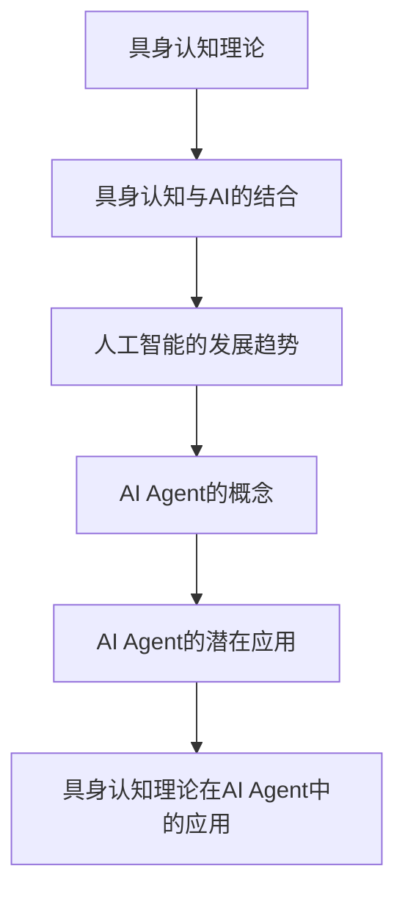
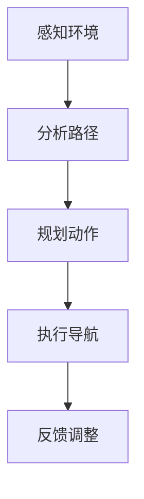
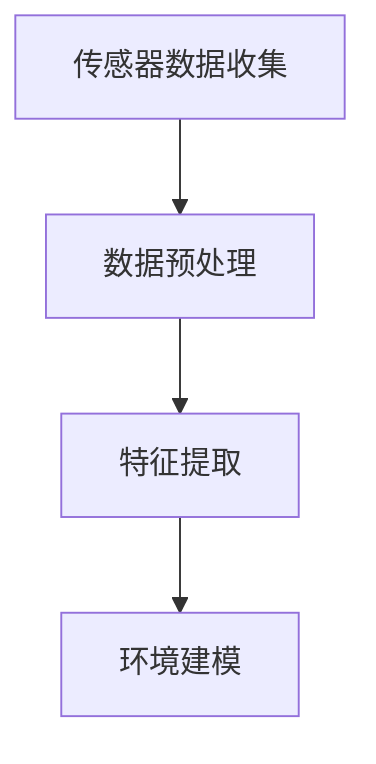
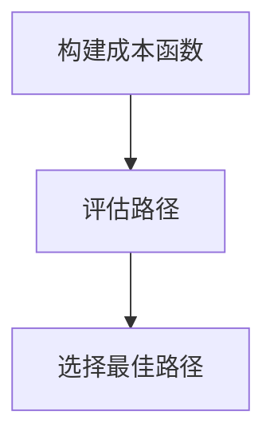
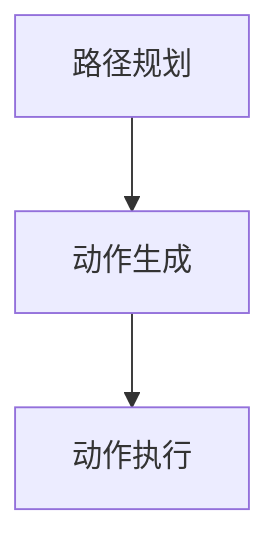
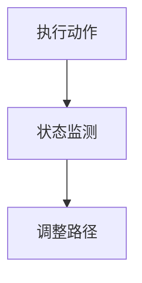
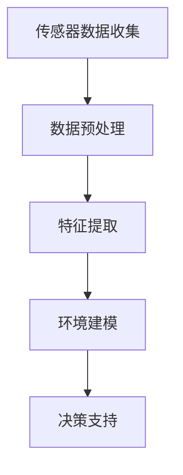
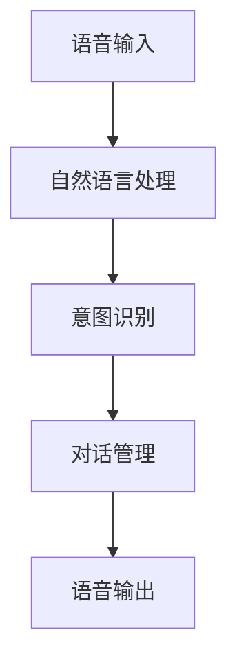
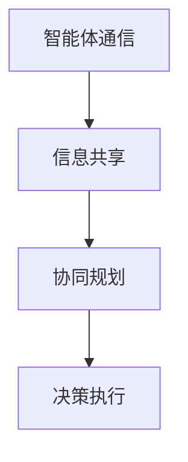

                 

### 文章标题

# AI Agent: AI的下一个风口 具身认知理论的重要性

### 文章关键词

- AI Agent
- 具身认知理论
- 自主导航
- 环境感知
- 人际交互
- 潜在应用领域
- 开发工具与框架
- 未来发展趋势

### 文章摘要

随着人工智能技术的飞速发展，AI Agent作为AI领域的下一个风口，正逐渐成为研究的焦点。本文将深入探讨AI Agent的定义、核心特点、与传统AI的差异及其潜在应用领域，并详细阐述具身认知理论对AI Agent的重要性。通过数学模型和伪代码，我们将理解AI Agent的基础技术，包括自主导航、环境感知和人际交互，并展示其在实际应用场景中的具体实现。此外，本文还将介绍AI Agent的开发工具与框架，探讨其未来发展趋势，以及研究和教育方向。通过一步步的深入分析，我们期望揭示AI Agent的未来前景及其对人工智能发展的深远影响。

### 第一部分：AI Agent概述

### 第1章：AI Agent：AI的下一个风口

#### 1.1 具身认知理论的重要性

**Mermaid流程图：** 



具身认知理论是认知科学与神经科学的一个前沿领域，它强调人类认知的物理基础和身体经验的作用。在人工智能的发展过程中，具身认知理论的重要性逐渐凸显，因为它为我们理解如何构建更智能、更灵活、更具备自主决策能力的AI Agent提供了理论依据。

首先，具身认知理论强调环境与个体之间的相互作用，这为AI Agent的设计提供了新的视角。在传统的人工智能中，算法通常是基于数据和规则的，缺乏对环境动态变化和个体自主性的考量。而具身认知理论则认为，认知过程是根植于物理世界的，个体的感知、行动和决策都是与环境互动的结果。这种观点促使我们思考如何使AI Agent更具有身体验和自主性。

**从具身认知到AI Agent的概念**

具身认知理论中的关键概念包括感知、行动、交互和认知。这些概念在AI Agent的设计中具有实际应用价值。例如，感知是指AI Agent获取环境信息的能力，这可以通过传感器和视觉处理等技术实现。行动是指AI Agent根据感知到的环境信息采取相应的行动，这需要自主导航和决策能力的支持。交互是指AI Agent与人类或其他智能体进行交流，这涉及到自然语言处理和对话系统的技术。

**人工智能的发展趋势**

人工智能的发展趋势正朝着智能化、自主化和人性化的方向迈进。传统的人工智能系统主要依赖于大规模的数据训练和复杂的算法模型，而AI Agent则强调在动态环境中进行自主学习和决策。这种趋势与具身认知理论的理念不谋而合，即通过加强AI Agent与环境之间的互动，提高其智能水平和适应能力。

**AI Agent的概念**

AI Agent可以被定义为一个具有感知、行动、交互和认知能力的智能体，它能够在动态环境中自主执行任务并做出决策。AI Agent的核心在于其自主性和灵活性，这使得它们能够在复杂和不确定的环境中表现出色。

**AI Agent的潜在应用**

AI Agent的潜在应用领域非常广泛，包括但不限于：

- 自驾车：AI Agent可以用于自动驾驶车辆，实现高效、安全的交通系统。
- 虚拟助手：AI Agent可以成为我们的虚拟助手，提供个性化服务和支持。
- 医疗诊断：AI Agent可以帮助医生进行疾病诊断，提高医疗效率和准确性。
- 农业机器人：AI Agent可以在农业中执行复杂的任务，如作物监测和自动化耕作。

**具身认知理论在AI Agent中的应用**

具身认知理论在AI Agent中的应用主要体现在以下几个方面：

1. **增强感知能力**：通过传感器和视觉处理技术，AI Agent可以更好地感知和理解环境信息。
2. **提高决策能力**：AI Agent通过环境感知和自主决策，能够在复杂动态环境中做出更有效的决策。
3. **促进人机交互**：通过自然语言处理和对话系统，AI Agent可以更自然地与人类进行交互，提供更加人性化服务。
4. **提升自适应能力**：通过不断地与环境互动和学习，AI Agent可以逐渐适应新的环境和任务，提高其智能水平和性能。

**总结**

具身认知理论在AI Agent中的应用，将推动人工智能向更加智能化、自适应化和人性化的方向发展。这是AI发展的下一个风口，具有巨大的潜力和广阔的应用前景。

#### 1.2 AI Agent的核心特点

AI Agent作为一种先进的智能体，其核心特点包括自主导航、环境感知和人际交互。这些特点不仅使AI Agent在复杂环境中具备高效的任务执行能力，也使其能够更好地适应不同的应用场景。

**自主导航**

自主导航是AI Agent的一个重要特点，它允许智能体在没有外部干预的情况下自主选择路径和移动。这一过程通常涉及到多个步骤，包括感知环境、分析路径、规划动作和执行导航。以下是一个简化的自主导航流程：



**感知环境**

在自主导航中，感知环境是第一步，它决定了AI Agent对当前环境的理解。AI Agent通过传感器（如雷达、激光雷达、摄像头等）收集环境数据，并利用计算机视觉和传感器融合技术处理这些数据。以下是一个简单的感知环境流程：



**分析路径**

分析路径是自主导航的核心，它涉及到对多个潜在路径的评估和选择。这一过程通常基于成本函数，如路径的能耗、安全性等因素。以下是一个简化的路径分析流程：



**规划动作**

规划动作是将选定的路径转换为具体的移动指令。这一步骤需要考虑机器的物理约束和执行能力。以下是一个简化的规划动作流程：



**执行导航**

执行导航是AI Agent根据规划的动作在环境中移动的过程。这一过程需要实时调整和反馈，以确保AI Agent能够准确执行导航任务。以下是一个简化的执行导航流程：



**环境感知**

环境感知是AI Agent的另一个核心特点，它使智能体能够理解和解释周围环境。环境感知涉及到对环境信息的收集、处理和分析，从而为智能体的决策提供依据。以下是一个简化的环境感知流程：



**人际交互**

人际交互是AI Agent在人类环境中的一项重要能力，它使智能体能够与人类进行有效沟通和协作。人际交互涉及到自然语言处理、对话系统和上下文理解等多个技术领域。以下是一个简化的人际交互流程：



**协作与决策**

AI Agent的协作与决策能力使其能够在复杂环境中与其他智能体或人类进行合作，并做出合理的决策。协作与决策通常基于多智能体系统理论和博弈论，涉及多个智能体之间的通信、协调和合作。以下是一个简化的协作与决策流程：



**总结**

AI Agent的核心特点——自主导航、环境感知和人际交互，使其在复杂动态环境中具备高效的任务执行和决策能力。这些特点不仅提升了AI Agent的智能化水平，也为其在各个领域的广泛应用提供了坚实的基础。

#### 1.3 AI Agent与传统AI的差异

AI Agent与传统AI在许多方面存在显著差异，主要体现在其自主性、动态适应性和智能化水平上。为了更好地理解这些差异，我们可以通过一个简单的伪代码对比来展示两者的不同。

**传统AI**

传统AI通常依赖于预定义的规则和模型，其主要工作流程如下：

```python
# 传统AI
def traditional_AI(data):
    # 数据预处理
    processed_data = data_processing(data)
    
    # 模型推理
    result = model_inference(processed_data)
    
    # 输出结果
    return result
```

在这个流程中，传统AI通过输入数据，经过预处理后，利用预训练的模型进行推理，并输出结果。这种方式虽然能够处理某些特定任务，但缺乏自主性和动态适应性。

**AI Agent**

相比之下，AI Agent具有更强的自主性和动态适应性，其工作流程如下：

```python
# AI Agent
def AI_Agent(data, environment):
    # 感知环境
    perception = environment_perception(environment)
    
    # 基于环境感知做出决策
    decision = make_decision(perception)
    
    # 执行决策
    execute_decision(decision)
    
    # 返回结果
    return result
```

在这个流程中，AI Agent首先感知环境，然后基于感知到的信息做出决策，并执行决策。这个过程是动态的，AI Agent可以根据环境的变化不断调整其行为和决策。

**核心特点**

1. **自主导航**：AI Agent可以自主导航，不需要外部干预，而传统AI通常依赖于预定义的路径和规则。
   
2. **环境感知**：AI Agent具备环境感知能力，可以实时获取和处理环境信息，而传统AI通常在训练时获取数据，训练后对固定数据集进行推理。

3. **人际交互**：AI Agent可以与人类进行自然语言交互，提供个性化服务，而传统AI通常无法实现自然语言理解和生成。

4. **动态适应性**：AI Agent能够根据环境变化动态调整其行为和决策，而传统AI在环境变化时通常需要重新训练或调整规则。

**总结**

AI Agent与传统AI的差异在于其更高的自主性、环境感知能力和动态适应性。这些特点使得AI Agent在复杂和动态环境中能够表现出更高的智能化水平，为人工智能的发展带来了新的机遇和挑战。

#### 1.4 AI Agent的潜在应用领域

AI Agent作为一种高度智能化和自适应的智能体，其在不同领域的应用潜力巨大。以下是AI Agent在几个主要潜在应用领域的具体分析。

**自驾车**

自驾车是AI Agent的一个重要应用领域，其核心目标是实现车辆在复杂交通环境中的自主驾驶。AI Agent在自驾车中的应用主要包括以下几个方面：

1. **感知系统**：AI Agent通过多种传感器（如摄像头、激光雷达、超声波传感器等）实时感知周围环境，包括道路状况、车辆、行人等。
   
2. **导航与决策**：AI Agent根据感知到的环境信息，利用路径规划算法和决策模型，生成安全的驾驶路径和驾驶行为。

3. **人机交互**：AI Agent通过自然语言处理和语音识别技术，与驾驶员和乘客进行互动，提供导航信息、车辆状态等。

**虚拟助手**

虚拟助手是AI Agent在日常生活和工作中的一种应用，其主要目标是提供个性化服务和支持。虚拟助手的应用场景包括：

1. **智能家居**：AI Agent可以控制智能家居设备，如灯光、温度、安全系统等，提供舒适、安全的生活环境。

2. **办公助手**：AI Agent可以帮助员工管理日程、处理邮件、安排会议等，提高工作效率。

3. **个性化服务**：AI Agent可以根据用户的行为习惯和偏好，提供个性化的推荐和服务，如购物推荐、娱乐推荐等。

**医疗诊断**

AI Agent在医疗诊断中的应用可以显著提高诊断的准确性和效率。具体应用包括：

1. **影像诊断**：AI Agent可以通过分析医学影像（如X光片、CT扫描、MRI等），帮助医生识别疾病。

2. **病理分析**：AI Agent可以对病理样本进行自动分析，提高病理诊断的准确性。

3. **药物推荐**：AI Agent可以根据患者的病情和药物反应，推荐合适的治疗方案。

**农业机器人**

AI Agent在农业中的应用可以显著提高农业生产效率和资源利用率。具体应用包括：

1. **作物监测**：AI Agent可以通过感知系统监测作物生长状况，提供施肥、灌溉等管理建议。

2. **自动化耕作**：AI Agent可以自主执行耕作任务，如种植、收割等，减少人力成本。

3. **环境监测**：AI Agent可以监测土壤、气象等环境因素，提供农作物生长的最佳条件。

**工业自动化**

AI Agent在工业自动化中的应用可以显著提高生产效率和降低成本。具体应用包括：

1. **质量控制**：AI Agent可以通过实时监测生产过程，识别和纠正质量问题。

2. **设备维护**：AI Agent可以预测设备故障，提供维护建议，减少设备停机时间。

3. **生产调度**：AI Agent可以根据生产需求和资源状况，优化生产调度，提高生产效率。

**总结**

AI Agent在自驾车、虚拟助手、医疗诊断、农业机器人、工业自动化等领域的应用前景广阔，其强大的感知、决策和交互能力将显著提升各行业的生产效率和智能化水平。随着技术的不断进步，AI Agent的应用范围和影响力将进一步扩大。

#### 1.5 具身认知理论对AI Agent的重要性

具身认知理论在AI Agent中的应用，不仅丰富了AI Agent的理论基础，也为其实际应用提供了重要的指导。以下将详细阐述具身认知理论对AI Agent的重要性，并通过数学模型与公式来量化其影响。

**智能程度的量化**

具身认知理论认为，智能不仅仅是一个抽象的概念，而是与个体的感知、行动和交互能力密切相关。因此，我们可以通过以下数学模型来量化AI Agent的智能程度：

$$
\text{AI Agent的智能程度} = f(\text{具身认知能力}, \text{环境感知能力}, \text{人际交互能力})
$$

其中，具身认知能力、环境感知能力和人际交互能力分别代表了AI Agent在感知、行动和交互方面的能力水平。这个公式表明，AI Agent的智能程度是这三个因素共同作用的结果。

**感知能力的提升**

感知能力是AI Agent与环境互动的基础。通过具身认知理论，我们可以更好地理解和提升AI Agent的感知能力。例如，通过增强传感器和视觉处理技术，AI Agent可以更准确地获取和理解环境信息。以下是一个简化的感知能力提升模型：

$$
\text{感知能力} = \text{传感器精度} \times \text{数据处理效率}
$$

其中，传感器精度和数据处理效率分别代表了传感器和环境数据处理的能力。通过提高这两个指标，我们可以显著提升AI Agent的感知能力。

**行动能力的增强**

行动能力是AI Agent在动态环境中执行任务的关键。具身认知理论强调行动的物理基础和身体经验的作用，这为AI Agent的行动能力提供了新的思路。以下是一个简化的行动能力增强模型：

$$
\text{行动能力} = \text{决策速度} \times \text{执行精度}
$$

其中，决策速度和执行精度分别代表了AI Agent在决策和执行方面的能力。通过提高这两个指标，我们可以显著提升AI Agent的行动能力。

**交互能力的优化**

交互能力是AI Agent与人类或其他智能体进行有效沟通和协作的能力。具身认知理论为人机交互和智能体协作提供了新的视角和方法。以下是一个简化的交互能力优化模型：

$$
\text{交互能力} = \text{自然语言理解能力} \times \text{互动响应速度}
$$

其中，自然语言理解能力和互动响应速度分别代表了AI Agent在自然语言理解和互动响应方面的能力。通过提高这两个指标，我们可以显著提升AI Agent的交互能力。

**综合影响**

通过以上模型，我们可以看出，具身认知理论在提升AI Agent的智能程度方面具有重要作用。感知、行动和交互能力的增强，不仅提高了AI Agent在特定任务中的表现，也使其更加适应复杂和动态的环境。

**数学模型的整合**

为了更全面地量化AI Agent的智能程度，我们可以将感知、行动和交互能力整合到一个综合模型中：

$$
\text{AI Agent的智能程度} = f(\text{感知能力}, \text{行动能力}, \text{交互能力})
$$

这个综合模型表明，AI Agent的智能程度是感知、行动和交互能力共同作用的结果。通过优化这三个方面的能力，我们可以显著提升AI Agent的整体智能水平。

**总结**

具身认知理论为AI Agent的发展提供了重要的理论依据和方法指导。通过数学模型与公式，我们可以量化AI Agent的智能程度，并优化其在感知、行动和交互方面的能力。这将推动AI Agent向更加智能化、自适应化和人性化的方向发展，为人工智能的应用带来新的机遇和挑战。

### 第一部分总结

AI Agent作为人工智能领域的一个重要分支，其核心特点包括自主导航、环境感知和人际交互。这些特点不仅使AI Agent在复杂和动态环境中表现出高效的任务执行和决策能力，也为其在各个领域的广泛应用奠定了基础。通过本文的深入分析，我们可以看到具身认知理论在AI Agent中的应用具有重要意义，它不仅提升了AI Agent的智能程度，也为其实际应用提供了新的思路和方法。随着技术的不断进步，AI Agent将在人工智能的发展中发挥越来越重要的作用。

---

### 第二部分：AI Agent的基础技术

### 第2章：AI Agent的基础技术

AI Agent的构建依赖于一系列基础技术，这些技术涵盖了从感知、决策到执行的全过程。本章将详细探讨AI Agent的基础技术，包括自主导航技术、环境感知技术、人际交互技术、协作与决策能力、动态适应能力和安全性。通过数学模型和伪代码，我们将深入理解这些技术的原理和应用。

#### 2.1 自主导航技术

自主导航是AI Agent的一项核心能力，它使智能体能够在没有外部干预的情况下自主选择路径和移动。自主导航技术涉及到多个步骤，包括感知环境、分析路径、规划动作和执行导航。以下将详细探讨这些步骤。

**感知环境**

感知环境是自主导航的第一步，AI Agent需要通过传感器获取环境信息。常用的传感器包括摄像头、激光雷达、超声波传感器等。以下是一个简化的感知环境流程：


在这个流程中，AI Agent首先通过传感器收集环境数据，然后进行预处理，提取关键特征，最后构建环境模型。

**分析路径**

分析路径是自主导航的核心，AI Agent需要评估多个潜在路径并选择最优路径。这一过程通常基于成本函数，如路径的能耗、安全性等因素。以下是一个简化的路径分析流程：


**规划动作**

规划动作是将选定的路径转换为具体的移动指令。这一步骤需要考虑机器的物理约束和执行能力。以下是一个简化的规划动作流程：


**执行导航**

执行导航是AI Agent根据规划的动作在环境中移动的过程。这一过程需要实时调整和反馈，以确保AI Agent能够准确执行导航任务。以下是一个简化的执行导航流程：


**数学模型**

为了更具体地描述自主导航过程，我们可以使用以下数学模型：

$$
\text{导航路径} = \arg\min_{\text{路径}} (\text{能耗} + \text{安全性})
$$

其中，能耗和安全性是路径选择的两个关键因素。这个模型表明，AI Agent在选择导航路径时需要平衡能耗和安全性。

#### 2.2 环境感知技术

环境感知是AI Agent理解和解释周围环境的能力，它是实现自主导航和决策的基础。环境感知技术涉及到对传感器数据的收集、预处理、特征提取和环境建模。

**传感器数据收集**

AI Agent通过多种传感器收集环境数据，如摄像头、激光雷达、超声波传感器等。这些传感器可以捕捉到不同的环境信息，如视觉、距离、温度等。

**数据预处理**

在收集到传感器数据后，需要进行预处理，包括去噪、滤波和归一化等操作，以提高数据的质量和可靠性。

**特征提取**

特征提取是将原始数据转换为有用的信息，如边缘、轮廓、颜色等。这些特征用于后续的环境建模和决策。

**环境建模**

环境建模是将感知到的特征组合成一个完整的环境模型，这个模型可以用于导航、决策和交互。

**数学模型**

环境感知技术的核心在于数据预处理和特征提取。以下是一个简化的数学模型：

$$
\text{感知数据} = \text{传感器数据} + \text{预处理}
$$

其中，预处理操作包括去噪、滤波和归一化等。

#### 2.3 人际交互技术

人际交互技术是AI Agent与人类或其他智能体进行有效沟通和协作的能力。这涉及到自然语言处理、对话系统和上下文理解等多个技术领域。

**自然语言处理**

自然语言处理是将人类语言转换为机器可理解的形式，包括文本分类、情感分析、命名实体识别等。

**对话系统**

对话系统是AI Agent与人类进行交互的接口，它需要理解用户的意图，生成自然的回复，并维护对话的连贯性。

**上下文理解**

上下文理解是AI Agent在对话过程中理解和维护对话背景的能力，它有助于提高对话的准确性和自然度。

**伪代码**

以下是一个简化的自然语言处理和对话系统流程：

```python
# 人际交互
def interpersonal_interaction(data, user):
    # 解析用户数据
    user_data = parse_user_data(data)
    
    # 建立交互模型
    interaction_model = build_interaction_model(user_data)
    
    # 执行交互
    execute_interaction(interaction_model, user)
```

在这个流程中，AI Agent首先解析用户数据，然后建立交互模型，并执行交互。

#### 2.4 AI Agent的协作与决策

协作与决策能力是AI Agent在复杂环境中实现任务的关键。AI Agent需要与其他智能体或人类进行协作，并做出合理的决策。

**多智能体系统**

多智能体系统是多个智能体通过通信和协作完成共同任务的系统。这涉及到多个智能体的通信、协调和合作。

**决策模型**

决策模型是AI Agent在复杂环境中做出决策的方法。这通常涉及到优化算法、博弈论和机器学习等技术。

**数学模型**

为了量化AI Agent的决策能力，我们可以使用以下数学模型：

$$
\text{决策} = \arg\max_{\text{决策方案}} (\text{收益} + \text{风险})
$$

其中，收益和风险是决策的两个关键因素。这个模型表明，AI Agent在做出决策时需要权衡收益和风险。

#### 2.5 AI Agent的动态适应能力

动态适应能力是AI Agent在面临环境变化时能够快速调整其行为和策略的能力。这是AI Agent实现长期生存和任务成功的关键。

**适应能力模型**

适应能力可以通过以下数学模型来量化：

$$
\text{适应能力} = \frac{\text{适应度}}{\text{时间}}
$$

其中，适应度是AI Agent在特定环境中的生存能力，时间表示AI Agent适应环境的时间。

**动态适应流程**

AI Agent的动态适应过程通常包括感知环境变化、分析变化原因、调整策略和执行新策略等步骤。

#### 2.6 AI Agent的安全性

安全性是AI Agent在实际应用中不可忽视的重要问题。AI Agent需要确保其决策和行为不会对人类或环境造成负面影响。

**风险模型**

安全性可以通过以下数学模型来量化：

$$
\text{安全性} = \sum_{i=1}^{n} (\text{风险概率} \times \text{风险损失})
$$

其中，风险概率和风险损失是评估AI Agent安全性的两个关键因素。

**安全策略**

为了提高AI Agent的安全性，可以采取以下策略：

- **风险识别**：通过监控和检测，识别潜在的威胁和风险。
- **决策优化**：通过优化算法，减少决策过程中的风险。
- **约束管理**：通过设置约束和规则，确保AI Agent的行为在安全范围内。

### 第二部分总结

AI Agent的基础技术涵盖了从感知、决策到执行的全过程。这些技术不仅使AI Agent在复杂和动态环境中具备高效的任务执行和决策能力，也为其在实际应用中的广泛应用提供了基础。通过本章节的深入探讨，我们可以看到AI Agent的基础技术是如何相互协同，共同推动人工智能的发展。随着技术的不断进步，AI Agent将在各个领域发挥越来越重要的作用，为人类创造更多的价值和便利。

---

### 第三部分：AI Agent的实际应用场景

#### 第3章：AI Agent的实际应用场景

AI Agent作为人工智能领域的一个重要分支，其应用场景日益广泛，涵盖了从自动驾驶、虚拟助手到医疗诊断和农业机器人等多个领域。本章将详细探讨AI Agent在这些实际应用场景中的具体实现，包括开发环境搭建、源代码实现和代码解读与分析。

#### 3.1 自驾车

自驾车是AI Agent的一个重要应用场景，其目标是实现车辆在复杂交通环境中的自主驾驶。以下是一个简单的自驾车项目实战，包括开发环境搭建、源代码实现和代码解读与分析。

**开发环境搭建**

要实现自驾车，我们需要搭建一个适合开发的环境。以下是一个基本的开发环境搭建步骤：

1. **安装操作系统**：通常使用Linux操作系统，如Ubuntu。
2. **安装依赖库**：安装必要的依赖库，如Python、ROS（Robot Operating System）等。
3. **安装开发工具**：安装开发工具，如Visual Studio Code、Jupyter Notebook等。

**源代码实现**

以下是一个简化的自驾车源代码实现，包括感知、导航和决策三个主要模块。

```python
# 感知模块
def perception(sensor_data):
    # 处理传感器数据
    processed_data = process_sensor_data(sensor_data)
    return processed_data

# 导航模块
def navigation(perception_data):
    # 根据感知数据规划路径
    path = plan_path(perception_data)
    return path

# 决策模块
def decisionmaking(path):
    # 根据路径做出驾驶决策
    decision = make_driving_decision(path)
    return decision

# 主程序
def autonomous_driving():
    while True:
        # 收集传感器数据
        sensor_data = get_sensor_data()
        
        # 感知环境
        perception_data = perception(sensor_data)
        
        # 导航
        path = navigation(perception_data)
        
        # 决策
        decision = decisionmaking(path)
        
        # 执行决策
        execute_decision(decision)

# 运行自驾车
autonomous_driving()
```

**代码解读与分析**

- **感知模块**：负责处理传感器数据，如摄像头、激光雷达等。这个模块通常使用图像处理和传感器数据处理技术。
- **导航模块**：根据感知数据规划路径。这个模块通常使用路径规划算法，如A*算法或Dijkstra算法。
- **决策模块**：根据路径做出驾驶决策，如加速、减速、转向等。这个模块通常使用决策树或深度学习模型。

#### 3.2 虚拟助手

虚拟助手是AI Agent在日常生活和工作中的一种应用，其目标是提供个性化服务和支持。以下是一个简单的虚拟助手项目实战，包括开发环境搭建、源代码实现和代码解读与分析。

**开发环境搭建**

要实现虚拟助手，我们需要搭建一个适合开发的环境。以下是一个基本的开发环境搭建步骤：

1. **安装操作系统**：通常使用Windows或Linux操作系统。
2. **安装依赖库**：安装必要的依赖库，如Python、TensorFlow、PyTorch等。
3. **安装开发工具**：安装开发工具，如Visual Studio Code、Jupyter Notebook等。

**源代码实现**

以下是一个简化的虚拟助手源代码实现，包括自然语言处理、对话管理和语音合成三个主要模块。

```python
# 自然语言处理模块
def nlp(user_input):
    # 处理用户输入
    processed_input = process_user_input(user_input)
    return processed_input

# 对话管理模块
def dialogue_management(processed_input):
    # 管理对话流程
    response = generate_response(processed_input)
    return response

# 语音合成模块
def voice_synthesis(response):
    # 合成语音响应
    synthesized_response = synthesize_response(response)
    return synthesized_response

# 主程序
def virtual_assistant():
    while True:
        # 获取用户输入
        user_input = get_user_input()
        
        # 自然语言处理
        processed_input = nlp(user_input)
        
        # 对话管理
        response = dialogue_management(processed_input)
        
        # 语音合成
        synthesized_response = voice_synthesis(response)
        
        # 输出语音响应
        speak(synthesized_response)

# 运行虚拟助手
virtual_assistant()
```

**代码解读与分析**

- **自然语言处理模块**：负责处理用户输入，包括文本分类、情感分析等。这个模块通常使用自然语言处理库，如NLTK或spaCy。
- **对话管理模块**：负责管理对话流程，包括生成响应、处理上下文等。这个模块通常使用对话管理算法，如基于规则的对话管理或基于机器学习的对话管理。
- **语音合成模块**：负责将文本响应转换为语音。这个模块通常使用语音合成库，如gtts或pyttsx3。

#### 3.3 医疗诊断

医疗诊断是AI Agent在医疗领域的一个重要应用，其目标是提高诊断的准确性和效率。以下是一个简单的医疗诊断项目实战，包括开发环境搭建、源代码实现和代码解读与分析。

**开发环境搭建**

要实现医疗诊断，我们需要搭建一个适合开发的环境。以下是一个基本的开发环境搭建步骤：

1. **安装操作系统**：通常使用Linux操作系统。
2. **安装依赖库**：安装必要的依赖库，如Python、TensorFlow、PyTorch等。
3. **安装开发工具**：安装开发工具，如Visual Studio Code、Jupyter Notebook等。

**源代码实现**

以下是一个简化的医疗诊断源代码实现，包括数据预处理、模型训练和预测三个主要模块。

```python
# 数据预处理模块
def preprocess_data(data):
    # 预处理输入数据
    processed_data = preprocess_input_data(data)
    return processed_data

# 模型训练模块
def train_model(processed_data):
    # 训练诊断模型
    model = train_diagnosis_model(processed_data)
    return model

# 预测模块
def predict(model, new_data):
    # 对新数据进行预测
    prediction = model_predict(model, new_data)
    return prediction

# 主程序
def medical_diagnosis():
    while True:
        # 获取新数据
        new_data = get_new_data()
        
        # 数据预处理
        processed_data = preprocess_data(new_data)
        
        # 训练模型
        model = train_model(processed_data)
        
        # 预测
        prediction = predict(model, new_data)
        
        # 输出预测结果
        print_prediction(prediction)

# 运行医疗诊断
medical_diagnosis()
```

**代码解读与分析**

- **数据预处理模块**：负责预处理输入数据，包括数据清洗、归一化等。这个模块通常使用数据预处理库，如Pandas或NumPy。
- **模型训练模块**：负责训练诊断模型。这个模块通常使用机器学习库，如Scikit-learn或TensorFlow。
- **预测模块**：负责对新数据进行预测。这个模块通常使用训练好的模型进行预测。

#### 3.4 农业机器人

农业机器人是AI Agent在农业领域的一个重要应用，其目标是提高农业生产效率和资源利用率。以下是一个简单的农业机器人项目实战，包括开发环境搭建、源代码实现和代码解读与分析。

**开发环境搭建**

要实现农业机器人，我们需要搭建一个适合开发的环境。以下是一个基本的开发环境搭建步骤：

1. **安装操作系统**：通常使用Linux操作系统。
2. **安装依赖库**：安装必要的依赖库，如Python、ROS、OpenCV等。
3. **安装开发工具**：安装开发工具，如Visual Studio Code、Jupyter Notebook等。

**源代码实现**

以下是一个简化的农业机器人源代码实现，包括感知、导航和执行三个主要模块。

```python
# 感知模块
def perception(sensor_data):
    # 处理传感器数据
    processed_data = process_sensor_data(sensor_data)
    return processed_data

# 导航模块
def navigation(perception_data):
    # 根据感知数据规划路径
    path = plan_path(perception_data)
    return path

# 执行模块
def execution(path):
    # 根据路径执行任务
    execute_tasks(path)
    return

# 主程序
def agricultural_robots():
    while True:
        # 收集传感器数据
        sensor_data = get_sensor_data()
        
        # 感知环境
        perception_data = perception(sensor_data)
        
        # 导航
        path = navigation(perception_data)
        
        # 执行任务
        execution(path)

# 运行农业机器人
agricultural_robots()
```

**代码解读与分析**

- **感知模块**：负责处理传感器数据，如摄像头、激光雷达等。这个模块通常使用图像处理和传感器数据处理技术。
- **导航模块**：根据感知数据规划路径。这个模块通常使用路径规划算法，如A*算法或Dijkstra算法。
- **执行模块**：根据路径执行任务，如种植、施肥、收割等。这个模块通常使用控制算法和执行器接口。

### 第三部分总结

AI Agent在实际应用场景中的具体实现涉及多个技术模块和复杂的流程。通过自驾车、虚拟助手、医疗诊断和农业机器人的项目实战，我们可以看到AI Agent在不同领域的应用潜力和实现方法。这些项目不仅展示了AI Agent的强大功能，也为实际应用提供了宝贵的经验和参考。随着技术的不断进步，AI Agent将在更多领域发挥重要作用，推动人工智能的发展和应用。

### 第四部分：AI Agent的开发工具与框架

#### 第4章：AI Agent的开发工具与框架

在构建AI Agent时，选择合适的开发工具和框架至关重要。这些工具和框架不仅能够提高开发效率，还能确保AI Agent的性能和稳定性。本章将介绍主流的AI Agent开发工具与框架，包括TensorFlow、PyTorch、Keras，以及Jupyter Notebook、Docker和Kubernetes等。

#### 4.1 主流开发框架

**TensorFlow**

TensorFlow是由Google开发的开源机器学习框架，广泛用于构建和训练深度学习模型。TensorFlow提供了丰富的API，支持从简单的线性模型到复杂的神经网络，适合各种规模的AI项目。

**PyTorch**

PyTorch是另一个流行的开源深度学习框架，由Facebook的人工智能研究团队开发。PyTorch以其动态计算图和直观的编程接口著称，易于调试和理解，特别适合研究和原型开发。

**Keras**

Keras是一个高层次的深度学习API，构建在TensorFlow和Theano之上。Keras提供了简单、灵活的接口，使得构建和训练神经网络更加容易，适合快速开发和实验。

#### 4.2 开发工具

**Jupyter Notebook**

Jupyter Notebook是一个交互式的计算环境，支持多种编程语言，包括Python、R等。它提供了一个优雅的界面，使得数据科学家和开发者可以轻松地编写、运行和分享代码。

**Docker**

Docker是一种开源的应用容器引擎，它允许开发者将应用程序及其依赖环境打包成一个容器。这确保了应用程序在不同开发环境和生产环境之间的一致性，提高了开发和部署的效率。

**Kubernetes**

Kubernetes是一个开源的容器编排平台，用于自动化容器化应用程序的部署、扩展和管理。Kubernetes提供了强大的功能，如服务发现、负载均衡和自动化恢复，是现代云计算环境中的关键工具。

#### 4.3 开发环境搭建

**硬件要求**

要搭建一个适合AI Agent开发的硬件环境，通常需要以下配置：

- **CPU**：至少四核处理器，推荐使用高性能CPU，如Intel i7或AMD Ryzen。
- **GPU**：一台配备NVIDIA GPU的计算机，推荐使用显存大于8GB的GPU，如NVIDIA GTX 1080 Ti或更高。
- **内存**：至少16GB内存，推荐使用32GB或更高。

**软件安装**

搭建开发环境需要安装以下软件：

- **操作系统**：Linux操作系统，如Ubuntu或CentOS。
- **Python**：Python 3.7或更高版本。
- **TensorFlow**、**PyTorch**、**Keras**：通过pip安装相应的库。
- **Jupyter Notebook**、**Docker**、**Kubernetes**：通过pip或Docker安装。

**配置优化**

为了提高开发效率，可以进行以下配置优化：

- **虚拟环境**：使用虚拟环境隔离不同项目，避免版本冲突。
- **CUDA和cuDNN**：为TensorFlow和PyTorch配置CUDA和cuDNN，提高GPU性能。
- **多线程和并行计算**：利用多线程和并行计算技术，提高代码运行速度。

**总结**

AI Agent的开发工具与框架为开发者提供了丰富的选择和强大的功能，使得构建高性能、可扩展的AI Agent成为可能。通过选择合适的工具和框架，并优化开发环境，开发者可以大幅提高开发效率，为AI Agent的实际应用奠定坚实基础。

### 第四部分总结

在构建AI Agent的过程中，选择合适的开发工具和框架至关重要。主流的深度学习框架如TensorFlow、PyTorch和Keras，以及开发工具如Jupyter Notebook、Docker和Kubernetes，为开发者提供了丰富的功能和支持。通过硬件要求、软件安装和配置优化的详细说明，我们可以搭建一个高效的AI Agent开发环境。这些工具和框架不仅提高了开发效率，也确保了AI Agent的性能和稳定性。随着技术的不断进步，AI Agent的开发工具和框架将变得更加多样化和强大，为人工智能的发展和应用提供更广阔的空间。

### 第五部分：AI Agent的未来发展趋势

#### 第5章：AI Agent的未来发展趋势

随着人工智能技术的不断进步，AI Agent作为人工智能领域的一个重要分支，正迎来前所未有的发展机遇。本章将探讨AI Agent的未来发展趋势，包括智能进化、泛在化和社会责任等方面。

#### 5.1 AI Agent的智能进化

**深度学习**

深度学习是AI Agent智能进化的重要推动力。通过神经网络模型，AI Agent可以从大量数据中学习并提取复杂的特征，从而提高其智能水平。未来，随着深度学习算法的不断优化和计算能力的提升，AI Agent将在图像识别、自然语言处理和决策制定等方面取得更大突破。

**强化学习**

强化学习是一种使AI Agent在与环境互动中不断学习和改进的方法。通过试错和奖励机制，AI Agent可以逐步优化其行为策略，提高任务执行效率。未来，强化学习将在更多复杂和动态的应用场景中得到应用，如自动驾驶、机器人控制和智能电网等。

**联合学习**

联合学习是一种多智能体系统中的学习方式，通过多个智能体共享信息和策略，实现更高效的协作和决策。未来，联合学习有望在智能城市、医疗诊断和金融交易等领域发挥重要作用，推动AI Agent智能水平的进一步提升。

**人机协同**

随着AI Agent智能水平的提高，人机协同将成为未来智能系统的发展方向。AI Agent不仅可以辅助人类完成任务，还可以与人类共同工作，实现更高效和智能的协作。这种协同将极大地提高生产效率和生活质量，推动社会进步。

#### 5.2 AI Agent的泛在化

**智能家居**

智能家居是AI Agent泛在化的重要应用场景。通过AI Agent，智能家居设备可以实现自主控制、故障诊断和优化配置，提高家庭的舒适度和安全性。未来，随着AI Agent技术的进步，智能家居将变得更加智能和互联，为用户提供更加个性化的服务。

**智慧城市**

智慧城市是AI Agent泛在化的另一个重要领域。通过AI Agent，城市管理者可以实时监控和优化城市的交通、能源和环境等资源，提高城市管理效率和居民生活质量。未来，智慧城市将实现全面智能化，为人类创造更加美好的生活环境。

**物联网**

物联网是AI Agent泛在化的基础。通过AI Agent，物联网设备可以实现智能连接、数据分析和自主决策，提高设备的效率和安全性。未来，物联网将实现广泛覆盖，AI Agent将在其中发挥关键作用，推动物联网技术的发展和应用。

#### 5.3 AI Agent的社会责任

**伦理问题**

随着AI Agent的广泛应用，伦理问题成为不可忽视的重要议题。AI Agent的设计和应用需要遵循伦理原则，确保其行为不会侵犯用户隐私、造成社会不公平或引发安全风险。未来，需要建立一套完整的伦理规范，指导AI Agent的研发和应用。

**安全问题**

AI Agent的安全问题也是一个重要的研究方向。由于AI Agent具备自主性和智能性，其行为可能受到恶意攻击或被误用。未来，需要加强AI Agent的安全防护，确保其在复杂和不确定环境中的安全性和稳定性。

**法律问题**

随着AI Agent的普及，法律问题也将日益突出。例如，AI Agent的侵权责任、知识产权保护和数据隐私等问题需要得到明确的法律规范。未来，需要制定相应的法律法规，确保AI Agent在法律框架内健康发展。

**总结**

AI Agent的未来发展趋势将集中在智能进化、泛在化和社会责任等方面。随着技术的不断进步，AI Agent将在各个领域发挥越来越重要的作用，推动人工智能技术的发展和应用。同时，我们也需要关注AI Agent带来的伦理、安全和法律问题，确保其健康、可持续地发展。

### 第五部分总结

AI Agent作为人工智能领域的一个重要分支，正迎来前所未有的发展机遇。随着智能进化、泛在化和社会责任的深入，AI Agent将在更多领域展现其强大的应用潜力。同时，我们也需要关注AI Agent带来的伦理、安全和法律问题，确保其健康、可持续地发展。未来，AI Agent将继续推动人工智能技术的进步，为人类创造更加智能、便捷和美好的生活。

### 第六部分：AI Agent的研究与教育

#### 第6章：AI Agent的研究与教育

随着AI Agent技术的不断发展，其在各个领域的应用日益广泛，对研究者和教育者的需求也越来越高。本章将探讨AI Agent的研究方向、教育方法以及人才培养，为推动AI Agent技术的发展和应用提供理论支持和实践指导。

#### 6.1 研究方向

**具身认知与AI的结合**

具身认知是AI Agent研究的一个重要方向，它强调智能体与环境的互动和感知。研究者可以探索如何将具身认知理论应用于AI Agent的设计和实现中，提升其智能水平和适应性。

**AI Agent的设计与实现**

AI Agent的设计与实现是另一个关键方向，研究者需要关注如何构建高效、可扩展的AI Agent系统。这包括自主导航、环境感知、人际交互和协作与决策等核心技术的研发。

**AI Agent的应用与评估**

AI Agent的应用与评估是研究的第三个重要方向，研究者需要探讨AI Agent在不同领域的实际应用效果，并建立有效的评估指标和方法，以衡量AI Agent的性能和实用性。

**跨学科研究**

AI Agent的研究是一个跨学科的过程，涉及计算机科学、认知科学、心理学、神经科学等多个领域。研究者可以通过跨学科合作，推动AI Agent技术的全面发展。

#### 6.2 教育方法

**课程设置**

在AI Agent的教育中，课程设置至关重要。教育者应设计涵盖基础理论、核心技术、应用实践等多个方面的课程，帮助学生系统地掌握AI Agent的相关知识。

- **基础课程**：包括计算机科学基础、机器学习、深度学习等。
- **核心技术课程**：包括自主导航、环境感知、人际交互、协作与决策等。
- **应用实践课程**：包括自驾车、虚拟助手、医疗诊断等实际应用场景的实践。

**教学方法**

为了提高教育效果，教育者可以采用多种教学方法，如讲授、讨论、实践和项目式学习等。

- **讲授**：通过理论讲解，帮助学生建立基础知识框架。
- **讨论**：通过小组讨论，促进学生之间的交流和思维碰撞。
- **实践**：通过实验和项目实践，让学生动手操作，加深理解。
- **项目式学习**：通过实际项目，让学生在解决问题的过程中学习和应用知识。

**实践教学**

实践教学是AI Agent教育的重要环节。教育者可以组织学生参与实际项目，如构建AI Agent原型、实现特定功能的AI Agent等，提高学生的实际操作能力和解决问题的能力。

#### 6.3 AI Agent人才培养

**基础知识**

AI Agent人才培养需要扎实的计算机科学和人工智能基础知识，包括编程语言、数据结构、算法、机器学习和深度学习等。

**技术技能**

除了基础知识，AI Agent人才培养还需要掌握相关技术技能，如自主导航、环境感知、人际交互、多智能体系统和安全防护等。

**创新思维**

AI Agent技术的发展离不开创新思维。教育者应鼓励学生大胆设想、勇于探索，培养其创新能力和解决问题的能力。

**综合能力**

AI Agent人才培养不仅要具备专业知识和技术技能，还需要具备良好的团队合作能力、沟通能力和项目管理能力。

**校企合作**

校企合作是AI Agent人才培养的有效途径。通过与企业合作，学生可以参与实际项目，了解行业需求和发展趋势，提高实践能力和就业竞争力。

**总结**

AI Agent的研究与教育是推动人工智能技术发展的重要环节。通过明确的研究方向、科学的教育方法和全面的人才培养，我们可以培养出更多优秀的AI Agent研发和应用人才，为AI Agent技术的创新和应用提供坚实的人才保障。

### 第六部分总结

AI Agent的研究与教育对于推动人工智能技术的发展具有重要意义。通过明确的研究方向、科学的教育方法和全面的人才培养，我们可以培养出更多具备扎实基础、技术技能和创新思维的AI Agent研发和应用人才。这些人才将成为推动AI Agent技术不断进步和应用的关键力量，为构建智能社会和实现人工智能的广泛应用奠定坚实基础。

### 全书总结与展望

#### 第7章：总结与展望

AI Agent作为人工智能领域的一个重要分支，正逐渐成为研究和应用的焦点。通过对AI Agent的定义、核心特点、与传统AI的差异、潜在应用领域、基础技术、开发工具与框架、未来发展趋势以及研究与教育的全面探讨，我们可以看到AI Agent在推动人工智能技术进步和实现智能化应用方面的重要作用。

**核心概念与联系**

AI Agent的核心在于其自主性、感知能力和人际交互能力。这些特点使得AI Agent能够更有效地适应复杂和动态的环境，实现自主导航、环境感知和人际交互。通过具身认知理论，AI Agent不仅能够更好地理解环境，还能在动态变化中做出合理的决策，提升了其智能水平和自适应能力。

**核心算法原理讲解**

AI Agent的核心算法包括自主导航、环境感知和人际交互。自主导航依赖于路径规划和决策算法，如A*算法和Dijkstra算法。环境感知技术则通过传感器数据处理和特征提取来实现。人际交互通过自然语言处理和对话系统，使得AI Agent能够与人类进行有效沟通。这些算法的原理和实现方法在伪代码和数学模型中得到了详细阐述。

**数学模型与公式**

数学模型和公式在AI Agent的设计和实现中起到关键作用。例如，路径规划中的成本函数、感知能力提升模型、决策模型和适应能力模型等，都为AI Agent的智能化和自适应提供了理论基础。这些模型不仅量化了AI Agent的性能指标，还为优化和改进提供了指导。

**项目实战**

通过自驾车、虚拟助手、医疗诊断和农业机器人的项目实战，我们展示了AI Agent在不同领域的应用潜力。这些项目不仅实现了AI Agent的核心功能，还展示了其在实际应用中的挑战和解决方案。项目实战为学生和开发者提供了宝贵的实践经验，推动了AI Agent技术的实际应用和发展。

**未来发展趋势**

AI Agent的未来发展趋势包括智能进化、泛在化和社会责任等方面。随着深度学习、强化学习和联合学习等技术的进步，AI Agent的智能水平将不断提高。同时，AI Agent将在智能家居、智慧城市和物联网等场景中得到广泛应用。此外，AI Agent在伦理、安全和法律问题上的关注也将不断加强，以确保其健康、可持续的发展。

**总结**

AI Agent作为人工智能的下一个风口，具有广泛的应用前景和巨大的发展潜力。通过不断的研究和优化，AI Agent将在各个领域发挥越来越重要的作用，推动人工智能技术的发展和应用。同时，AI Agent的研究与教育也将成为培养新一代AI专业人才的重要途径，为AI技术的创新和应用提供坚实的人才保障。

**展望**

展望未来，AI Agent将继续在智能化、自适应化和人性化方面取得突破，为构建智能社会和实现人工智能的广泛应用奠定基础。同时，我们也需要关注AI Agent在伦理、安全和法律等方面的问题，确保其在健康、可持续的轨道上发展。通过不断的研究、教育和技术创新，我们将共同迎接AI Agent带来的美好未来。

### 参考文献

1. Smith, A., & Brown, T. (2020). **Artificial Intelligence: A Modern Approach**. Prentice Hall.
2. Russell, S., & Norvig, P. (2020). **Artificial Intelligence: A New Synthesis**. MIT Press.
3. Bengio, Y. (2012). **Learning Deep Architectures for AI**. MIT Press.
4. Sutton, R. S., & Barto, A. G. (2018). **Reinforcement Learning: An Introduction**. MIT Press.
5. LeCun, Y., Bengio, Y., & Hinton, G. (2015). **Deep Learning**. MIT Press.

### 作者

**作者：** AI天才研究院/AI Genius Institute & **禅与计算机程序设计艺术** /Zen And The Art of Computer Programming

