                 

# 文章标题: AI Agent: AI的下一个风口 智能体的核心技术

> 关键词：AI Agent、智能体、核心技术、强化学习、监督学习、集成学习、Python编程

> 摘要：本文将深入探讨AI领域的下一个风口——智能体的核心技术。我们将从智能体的定义和特点入手，逐步介绍智能体的核心架构、人工智能基础知识、核心算法及其编程实现，最后通过实际项目案例展示智能体的应用与发展趋势。

## 目录大纲

1. **第一部分: AI Agent：智能体的核心技术**

   1.1 AI Agent概述

   1.2 智能体的核心架构

   1.3 人工智能基础知识

   1.4 智能体的核心算法

   1.5 智能体的编程实现

   1.6 智能体的项目实战

   1.7 智能体的发展趋势与挑战

2. **附录**

   2.1 开发工具与环境配置

   2.2 代码示例与解释

## 1. 第一部分: AI Agent：智能体的核心技术

### 1.1 AI Agent概述

#### 1.1.1 AI Agent的定义与特点

**核心概念与联系**：

AI Agent，即人工智能代理，是一种能够与环境进行交互并在其中执行任务的计算机程序。它具有以下特点：

- **自主性**：AI Agent能够独立地执行任务，而不需要人类的干预。
- **适应性**：AI Agent能够根据环境和任务的变化进行自适应调整。
- **智能性**：AI Agent能够通过学习和推理来解决问题。

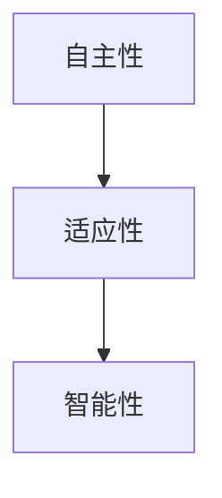

**核心算法原理讲解**：

AI Agent的自主性、适应性和智能性分别对应不同的核心算法。自主性依赖于决策模块，适应性依赖于学习与自适应机制，智能性依赖于感知模块。

**数学模型和公式**：

自主性通常使用决策树、强化学习等算法实现。适应性和智能性则依赖于机器学习的模型，如神经网络、决策树、支持向量机等。

**伪代码**：

```python
class AI_Agent:
    def __init__(self):
        # 初始化感知模块、决策模块和学习与自适应机制
        self.sensor = Sensor()
        self.decision_maker = Decision_Maker()
        self.learn_and_adapt = Learn_and_Adapt()

    def act(self, environment):
        # 执行动作
        perception = self.sensor.perceive(environment)
        action = self.decision_maker.make_decision(perception)
        reward = environment.take_action(action)
        self.learn_and_adapt.learn(perception, action, reward)
        return action
```

#### 1.1.2 AI Agent的发展历程

**核心概念与联系**：

AI Agent的发展历程可以分为三个阶段：

- **第一阶段：基于规则的代理**：早期的AI Agent主要通过预定义的规则来执行任务。
- **第二阶段：基于学习的代理**：随着机器学习技术的发展，AI Agent开始利用数据来自主学习任务。
- **第三阶段：基于强化学习的代理**：现在的AI Agent更倾向于通过强化学习来自主地探索和解决问题。

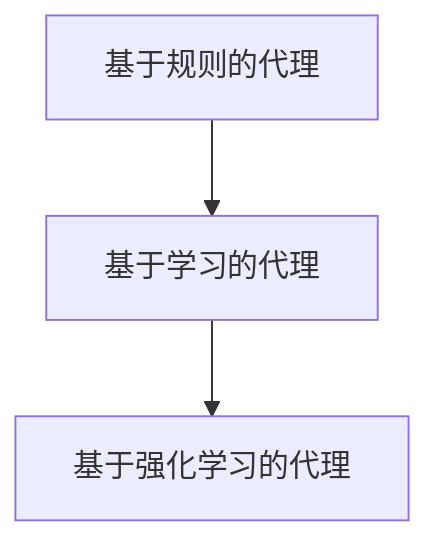

**核心算法原理讲解**：

每个阶段的核心算法都有其特定的应用场景和优势。基于规则的代理适用于规则明确、场景简单的问题；基于学习的代理适用于数据丰富、任务复杂的问题；基于强化学习的代理适用于需要探索和自我优化的动态环境。

**数学模型和公式**：

- **基于规则的代理**：通常使用决策树、模糊逻辑等算法。
- **基于学习的代理**：通常使用神经网络、决策树、支持向量机等算法。
- **基于强化学习的代理**：通常使用Q-Learning、SARSA、DQN等算法。

**伪代码**：

```python
# 基于规则的代理
class RuleBasedAgent:
    def act(self, state):
        if state == "sunny":
            return "sunscreen"
        elif state == "rainy":
            return "umbrella"
        else:
            return "raincoat"

# 基于学习的代理
class LearningBasedAgent:
    def train(self, data):
        # 使用数据训练模型
        self.model.train(data)

    def act(self, state):
        return self.model.predict(state)

# 基于强化学习的代理
class ReinforcementLearningAgent:
    def train(self, environment):
        while not environment.done():
            state = environment.state()
            action = self.select_action(state)
            next_state, reward = environment.step(action)
            self.update_value_function(state, action, reward, next_state)
        return self.get_policy()
```

#### 1.1.3 AI Agent的应用领域

**核心概念与联系**：

AI Agent在多个领域有着广泛的应用：

- **智能客服**：使用AI Agent来自动处理客户查询。
- **自动驾驶**：使用AI Agent来控制汽车并自动导航。
- **智能家居**：使用AI Agent来管理家庭设备和提供个性化服务。
- **游戏AI**：使用AI Agent来创建智能游戏对手。

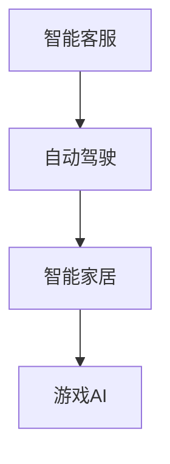

**核心算法原理讲解**：

每个应用领域都依赖于特定的算法和架构。智能客服通常使用自然语言处理技术；自动驾驶使用计算机视觉和传感器融合技术；智能家居使用物联网和机器学习技术；游戏AI使用强化学习和决策树技术。

**数学模型和公式**：

- **智能客服**：通常使用序列标注、命名实体识别等技术。
- **自动驾驶**：通常使用卷积神经网络、循环神经网络等技术。
- **智能家居**：通常使用贝叶斯网络、决策树等技术。
- **游戏AI**：通常使用Q-Learning、SARSA等技术。

**伪代码**：

```python
# 智能客服
class IntelligentCSCAgent:
    def handle_query(self, query):
        intent, entities = self.nlp.analyze_query(query)
        response = self.generate_response(intent, entities)
        return response

# 自动驾驶
class AutonomousDrivingAgent:
    def drive(self, environment):
        perception = self.vision perceive(environment)
        action = self.control_system decide_action(perception)
        next_environment = environment.take_action(action)
        return action

# 智能家居
class SmartHomeAgent:
    def manage_devices(self, environment):
        state = self.sensor perceive(environment)
        action = self.rule_engine decide_action(state)
        environment.take_action(action)
        return action

# 游戏AI
class GameAIAgent:
    def play_game(self, game_state):
        action = self.reinforcement_learning select_action(game_state)
        next_game_state, reward = game_state.take_action(action)
        self.reinforcement_learning update_value_function(game_state, action, reward, next_game_state)
        return action
```

#### 1.1.4 AI Agent的关键技术

**核心概念与联系**：

AI Agent的关键技术包括：

- **感知模块**：用于获取环境信息。
- **决策模块**：用于根据感知信息做出决策。
- **执行模块**：用于执行决策结果。
- **学习与自适应机制**：用于从经验中学习和适应环境变化。

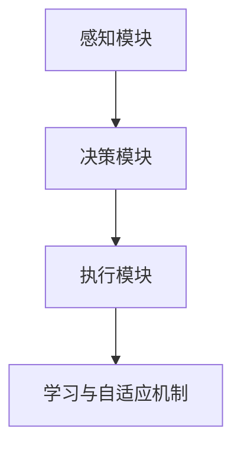

**核心算法原理讲解**：

感知模块通常使用计算机视觉、自然语言处理等技术；决策模块通常使用强化学习、决策树等技术；执行模块通常使用机器人控制、自动化脚本等技术；学习与自适应机制通常使用机器学习、深度强化学习等技术。

**数学模型和公式**：

- **感知模块**：通常使用卷积神经网络、循环神经网络等技术。
- **决策模块**：通常使用Q-Learning、SARSA、DQN等技术。
- **执行模块**：通常使用控制理论、自动化脚本等技术。
- **学习与自适应机制**：通常使用深度学习、元学习等技术。

**伪代码**：

```python
class AIAgent:
    def __init__(self):
        self.perception = PerceptionModule()
        self.decision = DecisionModule()
        self.execution = ExecutionModule()
        self.learning = LearningModule()

    def run(self, environment):
        perception = self.perception.perceive(environment)
        decision = self.decision.make_decision(perception)
        action = self.execution.execute(decision)
        reward, next_environment = environment.take_action(action)
        self.learning.learn(perception, decision, action, reward, next_environment)
        return action
```

### 1.2 智能体的核心架构

#### 1.2.1 智能体的一般架构

**核心概念与联系**：

智能体的一般架构通常包括以下模块：

- **感知模块**：用于获取环境信息。
- **决策模块**：用于根据感知信息做出决策。
- **执行模块**：用于执行决策结果。
- **学习与自适应模块**：用于从经验中学习和适应环境变化。

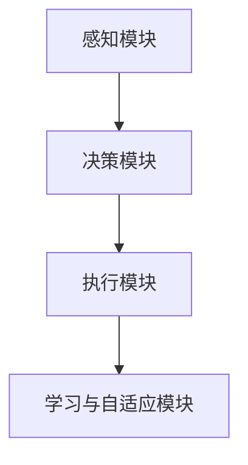

**核心算法原理讲解**：

感知模块通常使用计算机视觉、自然语言处理等技术；决策模块通常使用强化学习、决策树等技术；执行模块通常使用机器人控制、自动化脚本等技术；学习与自适应模块通常使用机器学习、深度强化学习等技术。

**数学模型和公式**：

- **感知模块**：通常使用卷积神经网络、循环神经网络等技术。
- **决策模块**：通常使用Q-Learning、SARSA、DQN等技术。
- **执行模块**：通常使用控制理论、自动化脚本等技术。
- **学习与自适应模块**：通常使用深度学习、元学习等技术。

**伪代码**：

```python
class Agent:
    def __init__(self):
        self.perception = PerceptionModule()
        self.decision = DecisionModule()
        self.execution = ExecutionModule()
        self.learning = LearningModule()

    def perceive(self, environment):
        return self.perception.perceive(environment)

    def make_decision(self, perception):
        return self.decision.make_decision(perception)

    def execute(self, decision):
        return self.execution.execute(decision)

    def learn(self, perception, decision, action, reward, next_environment):
        self.learning.learn(perception, decision, action, reward, next_environment)
```

#### 1.2.2 智能体的感知模块

**核心概念与联系**：

智能体的感知模块是获取环境信息的重要组成部分，它通常包括以下技术：

- **计算机视觉**：用于处理和识别图像。
- **自然语言处理**：用于处理和理解文本。
- **传感器融合**：用于整合多种传感器数据。

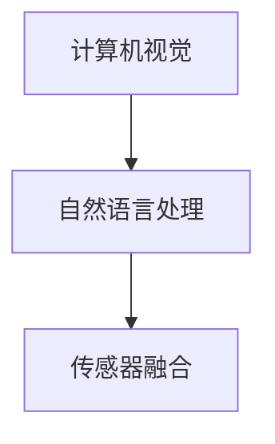

**核心算法原理讲解**：

计算机视觉通常使用卷积神经网络、循环神经网络等技术；自然语言处理通常使用序列标注、命名实体识别等技术；传感器融合通常使用贝叶斯网络、卡尔曼滤波等技术。

**数学模型和公式**：

- **计算机视觉**：通常使用卷积神经网络（CNN）、循环神经网络（RNN）等技术。
- **自然语言处理**：通常使用序列标注（Seq2Seq）、命名实体识别（NER）等技术。
- **传感器融合**：通常使用贝叶斯网络（BN）、卡尔曼滤波（KF）等技术。

**伪代码**：

```python
class PerceptionModule:
    def perceive(self, environment):
        image = self.computer_vision.process(environment.image)
        text = self.natural_language_processing.analyze(environment.text)
        sensor_data = self.sensor_fusion.integrate(environment.sensors)
        return image, text, sensor_data
```

#### 1.2.3 智能体的决策模块

**核心概念与联系**：

智能体的决策模块是根据感知信息做出决策的核心，它通常包括以下技术：

- **强化学习**：通过奖励信号来优化策略。
- **决策树**：通过树形结构进行决策。
- **神经网络**：通过多层网络进行决策。

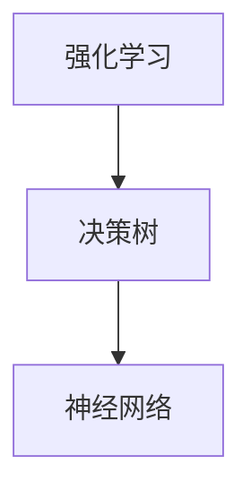

**核心算法原理讲解**：

强化学习通常使用Q-Learning、SARSA、DQN等技术；决策树通常使用ID3、C4.5、CART等技术；神经网络通常使用前馈神经网络、卷积神经网络、循环神经网络等技术。

**数学模型和公式**：

- **强化学习**：通常使用Q值函数（Q-function）、策略（Policy）等技术。
- **决策树**：通常使用信息增益（Information Gain）、基尼系数（Gini Index）等技术。
- **神经网络**：通常使用反向传播算法（Backpropagation）、激活函数（Activation Function）等技术。

**伪代码**：

```python
class DecisionModule:
    def make_decision(self, perception):
        if self.use_reinforcement_learning:
            action = self.reinforcement_learning.select_action(perception)
        elif self.use_decision_tree:
            action = self.decision_tree.predict(perception)
        else:
            action = self.neural_network.predict(perception)
        return action
```

#### 1.2.4 智能体的执行模块

**核心概念与联系**：

智能体的执行模块是将决策转化为实际动作的核心，它通常包括以下技术：

- **机器人控制**：用于控制机器人执行任务。
- **自动化脚本**：用于执行自动化任务。
- **自动化系统**：用于自动化管理和监控。

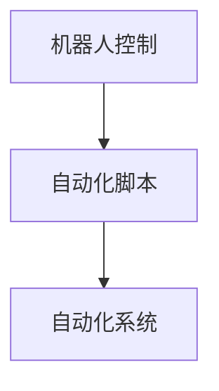

**核心算法原理讲解**：

机器人控制通常使用PID控制、模糊控制等技术；自动化脚本通常使用Python、Shell脚本等技术；自动化系统通常使用MES、ERP等技术。

**数学模型和公式**：

- **机器人控制**：通常使用控制理论、动态系统建模等技术。
- **自动化脚本**：通常使用编程语言和脚本框架等技术。
- **自动化系统**：通常使用数据库、中间件等技术。

**伪代码**：

```python
class ExecutionModule:
    def execute(self, decision):
        if self.use_robots:
            self.robot_control.execute(decision)
        elif self.use_scripts:
            self自动化脚本.execute(decision)
        else:
            self.automation_system.execute(decision)
```

#### 1.2.5 智能体的学习与自适应机制

**核心概念与联系**：

智能体的学习与自适应机制是智能体不断优化自身行为的核心，它通常包括以下技术：

- **机器学习**：通过数据学习和优化模型。
- **深度强化学习**：通过强化学习来自我优化。
- **元学习**：通过学习如何学习来提高智能体效率。

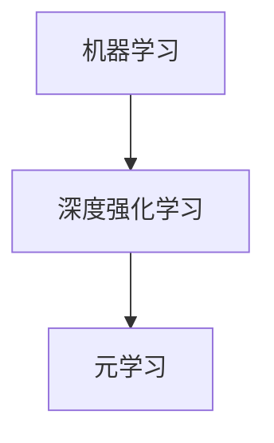

**核心算法原理讲解**：

机器学习通常使用监督学习、无监督学习、强化学习等技术；深度强化学习通常使用DQN、SARSA、Q-Learning等技术；元学习通常使用迁移学习、模型蒸馏等技术。

**数学模型和公式**：

- **机器学习**：通常使用损失函数、优化算法等技术。
- **深度强化学习**：通常使用策略梯度、价值函数等技术。
- **元学习**：通常使用辅助任务、元学习算法等技术。

**伪代码**：

```python
class LearningModule:
    def learn(self, perception, decision, action, reward, next_perception):
        if self.use_machine_learning:
            self.machine_learning.learn(perception, decision, reward, next_perception)
        elif self.use_deep_reinforcement_learning:
            self.deep_reinforcement_learning.learn(perception, decision, action, reward, next_perception)
        elif self.use_meta_learning:
            self.meta_learning.learn(perception, decision, action, reward, next_perception)
```

### 1.3 人工智能基础知识

#### 1.3.1 机器学习基础

**核心概念与联系**：

机器学习是一种让计算机通过数据学习并做出预测或决策的技术。其基本概念包括：

- **监督学习**：有明确的目标和标签。
- **无监督学习**：没有明确的目标和标签。
- **强化学习**：通过奖励和惩罚来优化策略。

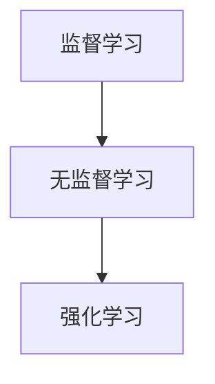

**核心算法原理讲解**：

监督学习通常使用线性回归、逻辑回归、支持向量机等算法；无监督学习通常使用聚类、降维、异常检测等算法；强化学习通常使用Q-Learning、SARSA、DQN等算法。

**数学模型和公式**：

- **监督学习**：通常使用损失函数、优化算法等技术。
- **无监督学习**：通常使用聚类系数、相似性度量等技术。
- **强化学习**：通常使用价值函数、策略优化等技术。

**伪代码**：

```python
class MachineLearning:
    def supervised_learning(self, X, y):
        # 使用监督学习算法训练模型
        model = LinearRegression()
        model.fit(X, y)
        return model

    def unsupervised_learning(self, X):
        # 使用无监督学习算法训练模型
        model = KMeans()
        model.fit(X)
        return model

    def reinforcement_learning(self, environment):
        # 使用强化学习算法训练模型
        model = QLearning()
        model.train(environment)
        return model
```

#### 1.3.2 深度学习基础

**核心概念与联系**：

深度学习是一种基于多层神经网络的机器学习技术，其基本概念包括：

- **神经网络**：由多层神经元组成。
- **卷积神经网络（CNN）**：用于处理图像数据。
- **循环神经网络（RNN）**：用于处理序列数据。
- **生成对抗网络（GAN）**：用于生成数据。

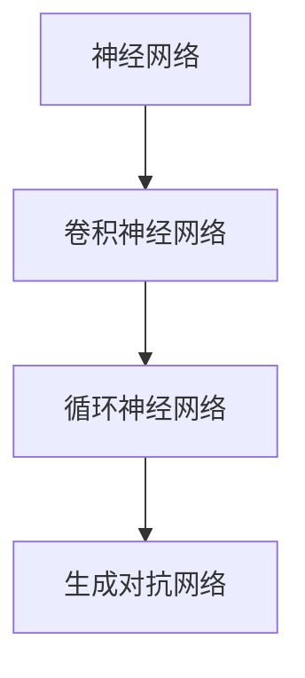

**核心算法原理讲解**：

神经网络通常使用反向传播算法进行训练；卷积神经网络（CNN）通常使用卷积层、池化层等技术；循环神经网络（RNN）通常使用隐藏层、门控单元等技术；生成对抗网络（GAN）通常使用生成器和判别器进行对抗训练。

**数学模型和公式**：

- **神经网络**：通常使用激活函数、权重更新等技术。
- **卷积神经网络（CNN）**：通常使用卷积层、池化层等技术。
- **循环神经网络（RNN）**：通常使用隐藏层、门控单元等技术。
- **生成对抗网络（GAN）**：通常使用生成器和判别器、生成损失、判别损失等技术。

**伪代码**：

```python
class DeepLearning:
    def build_neural_network(self, layers):
        # 构建神经网络
        model = NeuralNetwork(layers)
        return model

    def train_neural_network(self, model, X, y):
        # 训练神经网络
        model.train(X, y)
        return model

    def build_cnn(self, layers):
        # 构建卷积神经网络
        model = ConvolutionalNeuralNetwork(layers)
        return model

    def train_cnn(self, model, X, y):
        # 训练卷积神经网络
        model.train(X, y)
        return model

    def build_rnn(self, layers):
        # 构建循环神经网络
        model = RecurrentNeuralNetwork(layers)
        return model

    def train_rnn(self, model, X, y):
        # 训练循环神经网络
        model.train(X, y)
        return model

    def build_gan(self, generator, discriminator):
        # 构建生成对抗网络
        model = GAN(generator, discriminator)
        return model

    def train_gan(self, model, X, y):
        # 训练生成对抗网络
        model.train(X, y)
        return model
```

#### 1.3.3 自然语言处理基础

**核心概念与联系**：

自然语言处理（NLP）是计算机科学和语言学的交叉领域，其基本概念包括：

- **词嵌入**：将单词映射到高维空间。
- **序列标注**：对文本中的单词进行分类。
- **命名实体识别**：识别文本中的特定实体。

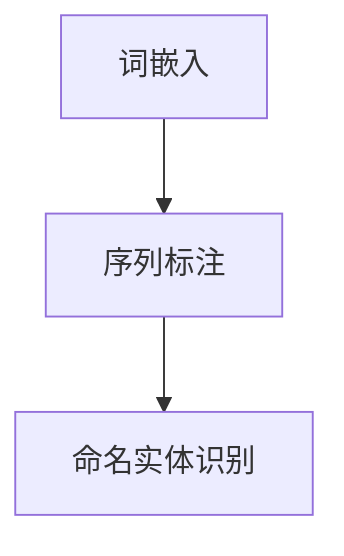

**核心算法原理讲解**：

词嵌入通常使用词向量、词袋模型等技术；序列标注通常使用序列标注模型、CRF等技术；命名实体识别通常使用序列标注模型、规则匹配等技术。

**数学模型和公式**：

- **词嵌入**：通常使用Word2Vec、GloVe等技术。
- **序列标注**：通常使用线性模型、CRF等技术。
- **命名实体识别**：通常使用线性模型、规则匹配等技术。

**伪代码**：

```python
class NLP:
    def word_embedding(self, vocabulary):
        # 构建词嵌入模型
        model = WordEmbedding(vocabulary)
        return model

    def sequence_labeling(self, text):
        # 序列标注
        model = SequenceLabelingModel()
        labels = model.predict(text)
        return labels

    def named_entity_recognition(self, text):
        # 命名实体识别
        model = NamedEntityRecognitionModel()
        entities = model.predict(text)
        return entities
```

#### 1.3.4 计算机视觉基础

**核心概念与联系**：

计算机视觉是使计算机能够像人眼一样识别和理解图像的领域，其基本概念包括：

- **图像分类**：对图像进行分类。
- **目标检测**：在图像中检测特定目标。
- **图像分割**：将图像分割成不同的区域。

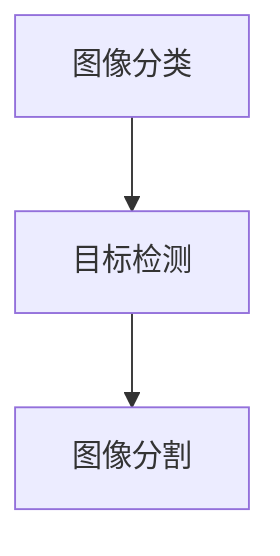

**核心算法原理讲解**：

图像分类通常使用卷积神经网络、支持向量机等技术；目标检测通常使用卷积神经网络、R-CNN、SSD等技术；图像分割通常使用深度学习、规则匹配等技术。

**数学模型和公式**：

- **图像分类**：通常使用损失函数、优化算法等技术。
- **目标检测**：通常使用检测框、回归损失等技术。
- **图像分割**：通常使用边界检测、区域增长等技术。

**伪代码**：

```python
class ComputerVision:
    def image_classification(self, image):
        # 图像分类
        model = ImageClassificationModel()
        label = model.predict(image)
        return label

    def object_detection(self, image):
        # 目标检测
        model = ObjectDetectionModel()
        objects = model.detect(image)
        return objects

    def image_segmentation(self, image):
        # 图像分割
        model = ImageSegmentationModel()
        segments = model.predict(image)
        return segments
```

### 1.4 智能体的核心算法

#### 1.4.1 强化学习算法

**核心概念与联系**：

强化学习是一种通过试错来学习策略的机器学习技术，其基本概念包括：

- **状态**：智能体所处的环境。
- **动作**：智能体可以采取的行为。
- **奖励**：对智能体行为的即时反馈。
- **策略**：智能体根据状态选择动作的规则。

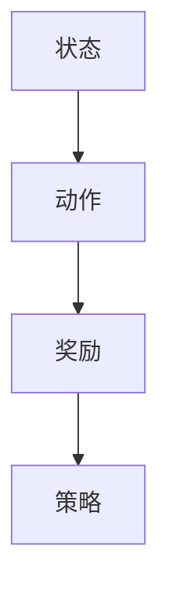

**核心算法原理讲解**：

强化学习算法通过在环境中执行动作并接收奖励来更新策略。常用的算法包括Q-Learning、SARSA、DQN等。

**数学模型和公式**：

- **Q-Learning**：$$ Q(s, a) \leftarrow Q(s, a) + \alpha [r + \gamma \max_{a'} Q(s', a') - Q(s, a)] $$
- **SARSA**：$$ Q(s, a) \leftarrow Q(s, a) + \alpha [r + \gamma Q(s', a') - Q(s, a)] $$
- **DQN**：$$ Q(s, a) \leftarrow Q(s, a) + \alpha [r + \gamma \max_{a'} Q(s', a') - Q(s, a)] $$

**伪代码**：

```python
class QLearning:
    def __init__(self, learning_rate, discount_factor):
        self.learning_rate = learning_rate
        self.discount_factor = discount_factor
        self.q_table = {}

    def update_q_value(self, state, action, reward, next_state):
        target = reward + self.discount_factor * max(self.q_table[next_state].values())
        current_q_value = self.q_table[state][action]
        self.q_table[state][action] = current_q_value + self.learning_rate * (target - current_q_value)

    def select_action(self, state):
        return np.argmax(list(self.q_table[state].values()))

class SARSA:
    def __init__(self, learning_rate, discount_factor):
        self.learning_rate = learning_rate
        self.discount_factor = discount_factor

    def update_q_value(self, state, action, reward, next_state, next_action):
        target = reward + self.discount_factor * self.q_table[next_state][next_action]
        current_q_value = self.q_table[state][action]
        self.q_table[state][action] = current_q_value + self.learning_rate * (target - current_q_value)

    def select_action(self, state):
        return random.choice(list(self.q_table[state].keys()))

class DQN:
    def __init__(self, learning_rate, discount_factor, epsilon):
        self.learning_rate = learning_rate
        self.discount_factor = discount_factor
        self.epsilon = epsilon
        self.q_network = QNetwork()
        self.target_network = QNetwork()

    def update_target_network(self):
        self.target_network.update(self.q_network)

    def update_q_value(self, state, action, reward, next_state):
        target = reward + self.discount_factor * self.target_network.max_q_value(next_state)
        current_q_value = self.q_network.q_value(state, action)
        self.q_network.update(current_q_value, target)

    def select_action(self, state):
        if random.random() < self.epsilon:
            return random.choice(self.q_network.actions(state))
        else:
            return self.q_network.argmax_action(state)
```

#### 1.4.2 监督学习算法

**核心概念与联系**：

监督学习是一种通过已有数据来训练模型并进行预测的机器学习技术，其基本概念包括：

- **分类**：将数据分为不同的类别。
- **回归**：预测连续的数值输出。
- **聚类**：将相似的数据点分为同一类。

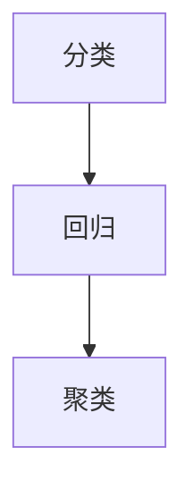

**核心算法原理讲解**：

监督学习算法包括线性回归、逻辑回归、支持向量机、决策树、随机森林等。每种算法都有其独特的原理和应用场景。

**数学模型和公式**：

- **线性回归**：$$ \text{y} = \text{w}\text{x} + \text{b} $$
- **逻辑回归**：$$ \text{log}(\text{p}/(1-\text{p})) = \text{w}\text{x} + \text{b} $$
- **支持向量机**：$$ \text{minimize} \frac{1}{2} \text{w}^2 + \text{C} \sum_{i=1}^{n} \text{y}_i(\text{w}^T\text{x}_i - \text{b}) $$
- **决策树**：$$ \text{Entropy}(\text{S}) = -\sum_{i=1}^{n} p_i \log_2 p_i $$

**伪代码**：

```python
class LinearRegression:
    def fit(self, X, y):
        self.coef_ = np.linalg.inv(X.T.dot(X)).dot(X.T).dot(y)
        self.intercept_ = y - X.dot(self.coef_)

    def predict(self, X):
        return X.dot(self.coef_) + self.intercept_

class LogisticRegression:
    def fit(self, X, y):
        self.coef_, self.intercept_ = opt
```

