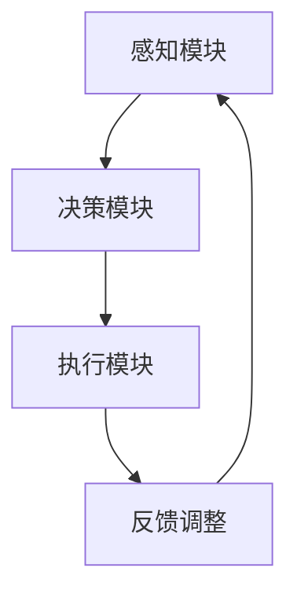

                 

## 文章标题

《AI Agent: AI的下一个风口 模拟真实世界的组织结构与工作流程》

随着人工智能技术的迅猛发展，AI Agent正在成为人工智能领域的下一个风口。AI Agent，作为能够模拟真实世界组织结构与工作流程的人工智能实体，正逐步改变着我们的生活方式和工作模式。本文将深入探讨AI Agent的基本概念、原理、核心算法、现实世界中的应用，以及其未来发展趋势。通过这一步步的分析，我们将揭开AI Agent的神秘面纱，展现其在人工智能领域的广阔前景。

关键词：AI Agent、人工智能、组织结构、工作流程、强化学习、生成对抗网络、家庭自动化、智能客服、自动驾驶

摘要：本文将从AI Agent的定义和分类出发，详细介绍其核心特征、组织结构与工作流程，解析其核心算法——强化学习和生成对抗网络。随后，我们将通过实际案例展示AI Agent在家庭自动化、智能客服和自动驾驶等领域的应用。最后，本文将对AI Agent的未来发展趋势和挑战进行探讨，并提出相应的发展战略与规划。通过本文的阅读，读者将全面了解AI Agent的技术原理和应用前景，为未来的研究和实践提供有力指导。

----------------------------------------------------------------<|assistant|>
# 《AI Agent: AI的下一个风口 模拟真实世界的组织结构与工作流程》目录大纲

## 第一部分：AI Agent概述

### 第1章：AI Agent的基本概念与原理

#### 1.1 AI Agent的定义与分类

AI Agent，即人工智能代理，是能够代表用户或系统自主执行任务、处理问题和与外界交互的软件实体。根据功能和应用场景的不同，AI Agent可以分为以下几类：

1. **搜索代理**：用于在互联网上搜索信息。
2. **决策代理**：用于在复杂环境中做出决策。
3. **交互代理**：用于与人类或系统进行自然语言交互。
4. **学习代理**：用于从数据中学习新知识和技能。

#### 1.2 AI Agent的核心特征

AI Agent具备以下核心特征：

- **自主性**：能够独立地执行任务，不需要人工干预。
- **学习能力**：能够通过学习算法，从数据中提取模式和知识。
- **交互能力**：能够与人类或其他系统进行有效的信息交换。

#### 1.3 AI Agent的应用场景

AI Agent在多个领域有着广泛的应用：

- **家庭自动化**：例如，智能家居系统中的智能灯光、智能安防等。
- **智能客服**：例如，机器人客服、聊天机器人等。
- **自动驾驶**：例如，自动驾驶出租车、自动驾驶卡车等。

### 第2章：AI Agent的组织结构与工作流程

#### 2.1 AI Agent的组织结构

AI Agent通常由三个主要模块组成：

- **感知模块**：负责感知外部环境，获取信息。
- **决策模块**：负责分析感知到的信息，制定行动策略。
- **执行模块**：负责执行决策模块制定的行动。

#### 2.2 AI Agent的工作流程

AI Agent的工作流程可以概括为以下四个步骤：

1. **感知环境**：通过传感器收集外部信息。
2. **决策与规划**：根据收集到的信息，使用算法进行决策和规划。
3. **执行动作**：执行决策模块制定的行动。
4. **反馈调整**：根据执行结果进行反馈调整，优化未来决策。

### 第3章：AI Agent的核心算法

#### 3.1 强化学习算法

强化学习是AI Agent的核心算法之一。它通过奖励机制，使得代理在环境中学习如何做出最优决策。主要算法包括：

- **Q-learning**：通过不断更新Q值，使代理学会在特定状态下选择最优动作。
- **Deep Q Network (DQN)**：使用深度神经网络来近似Q值函数，提高学习效率。

#### 3.2 生成对抗网络

生成对抗网络（GAN）是一种用于生成数据的高效算法。它由生成器和判别器两个神经网络组成，通过对抗训练，生成器不断提高生成数据的质量。

- **生成器**：生成与真实数据相似的伪造数据。
- **判别器**：区分生成数据和真实数据。

## 第二部分：AI Agent在现实世界的应用

### 第4章：家庭自动化中的AI Agent

#### 4.1 家庭自动化中的AI Agent

AI Agent在家庭自动化中的应用，使得家居生活更加智能化和便捷化。例如：

- **智能灯光控制系统**：根据用户习惯和环境光线自动调节灯光亮度。
- **智能安防系统**：通过摄像头和传感器实时监控家庭安全，并及时报警。

#### 4.2 家庭自动化中的AI Agent案例分析

- **智能灯光控制系统**：通过WiFi连接家居设备，实现远程控制和自动化调节。
- **智能安防系统**：结合图像识别和报警功能，提供全方位的家庭安全保障。

### 第5章：智能客服中的AI Agent

#### 5.1 智能客服中的AI Agent

AI Agent在智能客服中的应用，能够大幅提升客户服务效率和用户体验。例如：

- **机器人客服**：用于解答常见问题，提供在线帮助。
- **聊天机器人**：与客户进行实时交流，提供个性化服务。

#### 5.2 智能客服中的AI Agent案例分析

- **机器人客服**：通过自然语言处理和机器学习技术，实现自动化应答。
- **聊天机器人**：结合语音识别和语音合成技术，提供自然流畅的对话体验。

### 第6章：自动驾驶中的AI Agent

#### 6.1 自动驾驶中的AI Agent

AI Agent在自动驾驶中的应用，使得车辆能够自主驾驶，提高交通效率和安全性。例如：

- **自动驾驶出租车**：通过传感器和环境感知，实现自主驾驶。
- **自动驾驶卡车**：提高运输效率，降低事故风险。

#### 6.2 自动驾驶中的AI Agent案例分析

- **自动驾驶出租车**：利用激光雷达和摄像头，实时感知道路状况。
- **自动驾驶卡车**：结合GPS和导航系统，实现路径规划和自动行驶。

## 第三部分：AI Agent的未来发展

### 第7章：AI Agent的未来发展趋势

#### 7.1 AI Agent的未来发展趋势

AI Agent的发展趋势体现在以下几个方面：

- **技术进步**：随着硬件性能的提升和算法的优化，AI Agent的能力将越来越强大。
- **应用拓展**：AI Agent将渗透到更多领域，如医疗、教育、金融等。

#### 7.2 AI Agent的未来挑战与机遇

AI Agent面临的挑战包括：

- **技术挑战**：如算法优化、数据安全等。
- **伦理挑战**：如隐私保护、责任归属等。

而机遇则在于：

- **市场前景**：AI Agent有望成为新一代的人工智能应用热点。
- **产业变革**：AI Agent将推动各行各业的数字化转型。

### 第8章：AI Agent的发展战略与规划

#### 8.1 AI Agent的发展战略

AI Agent的发展战略应包括：

- **技术创新**：持续提升AI Agent的算法和性能。
- **市场拓展**：积极开拓新的应用场景和市场。

#### 8.2 AI Agent的发展规划

AI Agent的发展规划应明确以下目标：

- **技术研发**：持续推动AI Agent技术的创新。
- **市场推广**：制定有效的市场推广策略，提升市场占有率。

## 附录

### 附录 A：AI Agent开发资源与工具

#### A.1 主流AI Agent开发框架

- **OpenAI Gym**：提供一系列预定义的环境，用于测试和训练AI Agent。
- **Keras**：用于构建和训练深度学习模型的简单和模块化的框架。
- **TensorFlow**：由Google开发的开源机器学习框架，广泛用于AI Agent的开发。

#### A.2 AI Agent开发工具

- **Gazebo**：用于仿真和测试机器人系统的开源模拟器。
- **RoboDK**：用于机器人编程和模拟的软件。
- **MATLAB**：用于数值计算和算法开发的集成环境。

### 附录 B：AI Agent项目实战案例

#### B.1 家庭自动化项目实战

- **项目背景与目标**：实现智能家居系统的自动化控制。
- **项目实现与代码解读**：介绍系统的搭建过程和关键代码。

#### B.2 智能客服项目实战

- **项目背景与目标**：构建一个智能客服系统，提升客户服务效率。
- **项目实现与代码解读**：展示系统的架构和关键代码。

#### B.3 自动驾驶项目实战

- **项目背景与目标**：开发一个自动驾驶系统，提高交通安全和效率。
- **项目实现与代码解读**：介绍系统的实现方法和关键代码。

----------------------------------------------------------------<|assistant|>
## 第一部分：AI Agent概述

### 第1章：AI Agent的基本概念与原理

#### 1.1 AI Agent的定义与分类

AI Agent，即人工智能代理，是一种能够模拟人类行为、具备自主决策和行动能力的人工智能实体。在计算机科学和人工智能领域，AI Agent的定义和分类有着不同的理解和解释。通常，AI Agent可以分为以下几类：

1. **搜索代理**：用于在互联网或大型数据库中搜索信息，如搜索引擎。
2. **决策代理**：用于在复杂环境中做出决策，如自动驾驶汽车。
3. **交互代理**：用于与人类或系统进行自然语言交互，如聊天机器人。
4. **学习代理**：用于从数据中学习新知识和技能，如机器学习模型。

AI Agent的定义可以从广义和狭义两个角度理解。广义上，任何具备智能行为和自主决策能力的软件实体都可以被称为AI Agent。狭义上，AI Agent通常指具有明确任务目标和自主决策能力的人工智能系统，这些系统通过感知环境、学习知识和执行行动来实现其目标。

#### 1.2 AI Agent的核心特征

AI Agent具备以下几个核心特征：

1. **自主性**：AI Agent能够独立地执行任务，不需要人工干预。这种自主性使得AI Agent能够在复杂和不确定的环境中运行，适应各种变化。
   
2. **学习能力**：AI Agent能够通过学习算法，从数据中提取模式和知识。这种学习能力使得AI Agent能够不断地优化自己的行为，提高任务完成的效率和准确性。

3. **交互能力**：AI Agent能够与人类或其他系统进行有效的信息交换。这种交互能力使得AI Agent能够提供个性化服务、解决用户问题和执行复杂任务。

#### 1.3 AI Agent的应用场景

AI Agent在多个领域有着广泛的应用，以下是几个典型的应用场景：

1. **家庭自动化**：AI Agent可以用于智能灯光控制、智能安防、智能家电等，提高家庭生活的便利性和安全性。

2. **智能客服**：AI Agent可以用于自动解答用户问题、提供在线帮助和个性化服务，提升客户体验。

3. **自动驾驶**：AI Agent可以用于自动驾驶汽车、自动驾驶卡车和无人机等，提高交通效率和安全性。

4. **医疗健康**：AI Agent可以用于疾病预测、药物推荐和健康咨询等，为医疗健康行业提供智能解决方案。

5. **金融保险**：AI Agent可以用于风险管理、投资分析和客户服务，提高金融行业的效率和准确性。

6. **教育学习**：AI Agent可以用于个性化教学、学习指导和在线辅导，提升教育质量和学习效率。

通过上述内容，我们对AI Agent的基本概念、原理和核心特征有了初步的了解。接下来，我们将进一步探讨AI Agent的组织结构与工作流程，以及其核心算法——强化学习和生成对抗网络。

### 第2章：AI Agent的组织结构与工作流程

#### 2.1 AI Agent的组织结构

AI Agent的组织结构通常包括感知模块、决策模块和执行模块，这三个模块协同工作，使得AI Agent能够自主地执行任务。

1. **感知模块**：感知模块负责收集外部环境的信息，包括视觉、听觉、触觉等多种感官信息。这些信息通过传感器输入到AI Agent，为后续的决策提供数据支持。

2. **决策模块**：决策模块负责分析感知模块收集到的信息，并使用学习算法和策略进行决策。决策模块的核心任务是确定AI Agent在当前环境下应该采取哪些行动，以实现其目标。

3. **执行模块**：执行模块负责将决策模块制定的行动付诸实施。执行模块通过控制执行设备（如电机、机械臂等）来实现AI Agent的行动。

#### 2.2 AI Agent的工作流程

AI Agent的工作流程可以概括为以下四个主要步骤：

1. **感知环境**：AI Agent通过传感器感知外部环境，收集各种数据，如温度、湿度、光线、声音等。

2. **决策与规划**：决策模块分析感知模块收集到的数据，使用学习算法和策略进行决策。例如，通过强化学习算法，AI Agent可以从历史数据中学习如何优化决策。

3. **执行动作**：执行模块根据决策模块制定的行动方案，控制执行设备执行具体的操作，如移动、旋转、施力等。

4. **反馈调整**：执行完动作后，AI Agent收集执行结果，与预期目标进行比较，并根据反馈进行调整。这种反馈调整机制使得AI Agent能够不断地优化其行为，提高任务完成的效率和准确性。

#### 2.3 AI Agent的流程图表示

为了更清晰地描述AI Agent的组织结构和工作流程，可以使用Mermaid流程图来表示。以下是一个简化的AI Agent流程图：



在这个流程图中，感知模块（A）负责收集环境信息，将其传递给决策模块（B）。决策模块（B）根据感知信息进行分析和处理，制定行动方案，并将其传递给执行模块（C）。执行模块（C）负责执行具体的操作，并根据执行结果进行反馈调整（D）。然后，反馈调整（D）的信息再次传递给感知模块（A），形成闭环反馈机制。

通过上述内容，我们对AI Agent的组织结构和工作流程有了更深入的理解。接下来，我们将介绍AI Agent的核心算法——强化学习和生成对抗网络，进一步探讨AI Agent的技术原理。

### 第3章：AI Agent的核心算法

AI Agent的核心算法是实现其自主决策和行动能力的关键。在本章节中，我们将详细介绍两种重要的算法：强化学习和生成对抗网络（GAN）。这些算法不仅为AI Agent提供了强大的决策能力，而且在多个应用领域都取得了显著的成果。

#### 3.1 强化学习算法

强化学习（Reinforcement Learning，RL）是AI Agent中最为核心的算法之一，它通过奖励机制来指导代理学习如何在环境中做出最优决策。强化学习的基本原理是，代理通过与环境的交互，不断学习并优化其策略，以最大化累积奖励。

**强化学习的原理**：

强化学习主要包括四个主要组成部分：代理（Agent）、环境（Environment）、状态（State）和动作（Action）。代理通过感知环境中的状态，选择一个动作，然后环境根据该动作产生新的状态和奖励。代理的目标是学习一个策略（Policy），该策略能够最大化长期累积奖励。

**Q-learning算法**：

Q-learning是一种基于值函数的强化学习算法，它通过学习状态-动作值函数（Q值）来指导代理的决策。在Q-learning中，代理使用一个Q值表来存储每个状态-动作对的预期奖励值。算法的基本步骤如下：

1. 初始化Q值表。
2. 选择一个动作，执行并获取奖励。
3. 根据新的状态更新Q值表。
4. 重复步骤2和3，直到达到目标或停止条件。

以下是一个Q-learning算法的伪代码：

```python
# 初始化Q值表
Q = []

# 选择动作
action = choose_action(state, Q)

# 执行动作
next_state, reward = execute_action(state, action)

# 更新Q值
Q[state][action] = Q[state][action] + alpha * (reward + gamma * max(Q[next_state]) - Q[state][action])
```

其中，`alpha`是学习率，`gamma`是折扣因子，表示未来奖励的重要性。

**Deep Q Network (DQN)算法**：

DQN是Q-learning算法的一个改进版本，它使用深度神经网络来近似Q值函数。DQN通过经验回放（Experience Replay）和目标网络（Target Network）来提高算法的稳定性和效率。

以下是一个DQN算法的伪代码：

```python
# 初始化深度神经网络
Q_network = DQN()

# 初始化目标网络
target_network = DQN()

# 经验回放
experience_replay()

# 选择动作
action = Q_network.predict(state)

# 执行动作
next_state, reward, done = execute_action(state, action)

# 更新经验回放
replay_memory.append((state, action, next_state, reward, done))

# 更新网络参数
Q_network.update_parameters()

# 更新目标网络
if update_target_network():
    target_network.copy_parameters(Q_network)
```

通过上述内容，我们对强化学习算法的原理和实现方法有了初步的了解。接下来，我们将介绍另一种重要的算法——生成对抗网络（GAN）。

#### 3.2 生成对抗网络（GAN）

生成对抗网络（Generative Adversarial Networks，GAN）是由生成器和判别器两个神经网络组成的一种生成模型。GAN的原理是，生成器尝试生成尽可能真实的数据，而判别器则尝试区分生成数据和真实数据。通过这种对抗训练，生成器不断提高生成数据的质量。

**GAN的原理**：

GAN的核心思想是，通过两个神经网络——生成器（Generator）和判别器（Discriminator）之间的对抗训练，生成器学习生成逼真的数据，而判别器学习区分真实数据和生成数据。生成器和判别器的训练过程如下：

1. **生成器训练**：生成器生成一批伪造数据，判别器对其进行评估。生成器的目标是最大化判别器的错误率，即生成尽可能真实的数据。

2. **判别器训练**：判别器使用真实数据和生成数据进行训练，目标是提高对真实数据和生成数据的区分能力。

3. **交替训练**：生成器和判别器交替训练，生成器尝试优化其生成数据的质量，而判别器尝试提高对真实数据和生成数据的区分能力。

**GAN的应用**：

GAN在图像生成、语音合成和自然语言处理等领域有着广泛的应用。以下是一些典型的应用案例：

1. **图像生成**：GAN可以生成高质量的图像，如人脸、动物、风景等。以下是一个使用GAN生成人脸图像的例子：

```python
# 初始化生成器和判别器
generator = GANGenerator()
discriminator = GANDiscriminator()

# 训练生成器和判别器
for epoch in range(num_epochs):
    for batch in data_loader:
        # 生成伪造数据
        fake_images = generator.generate(batch)

        # 训练判别器
        discriminator_loss = discriminator.train(fake_images)

        # 训练生成器
        generator_loss = generator.train(discriminator)

# 生成人脸图像
generated_faces = generator.generate_faces()

# 显示生成的人脸图像
display_faces(generated_faces)
```

2. **语音合成**：GAN可以用于生成逼真的语音，如语音克隆、语音变换等。以下是一个使用GAN生成语音的例子：

```python
# 初始化生成器和判别器
voice_generator = GANVoiceGenerator()
voice_discriminator = GANVoiceDiscriminator()

# 训练生成器和判别器
for epoch in range(num_epochs):
    for audio_batch in voice_loader:
        # 生成伪造语音
        fake_audio = voice_generator.generate(audio_batch)

        # 训练判别器
        discriminator_loss = voice_discriminator.train(fake_audio)

        # 训练生成器
        generator_loss = voice_generator.train(voice_discriminator)

# 生成语音
generated_speech = voice_generator.generate_speech()

# 播放生成的语音
play_speech(generated_speech)
```

通过上述内容，我们对生成对抗网络（GAN）的原理和应用有了更深入的了解。强化学习和生成对抗网络是AI Agent中两种重要的算法，它们为AI Agent提供了强大的决策能力和数据生成能力，使得AI Agent能够在各种复杂环境中高效运行。

## 第二部分：AI Agent在现实世界的应用

### 第4章：家庭自动化中的AI Agent

家庭自动化（Home Automation）是AI Agent最早且最广泛的应用领域之一。随着物联网（Internet of Things，IoT）技术的快速发展，家庭自动化系统变得越来越智能化和便捷化。AI Agent在家庭自动化中的作用不可或缺，它们能够通过感知用户行为和环境变化，自动调整家庭设备的状态，从而提升生活质量。

#### 4.1 家庭自动化中的AI Agent

家庭自动化中的AI Agent可以应用于多个方面，以下是一些常见的应用场景：

1. **智能灯光控制**：AI Agent可以自动调节灯光的亮度、颜色和开关状态，以适应用户的需求和环境的变化。例如，在夜晚，AI Agent可以自动降低灯光亮度，以创造一个舒适的睡眠环境。

2. **智能安防系统**：AI Agent可以通过监控摄像头、门窗传感器等设备，实时监测家庭的安全状况，并在检测到异常时及时报警。例如，当AI Agent检测到有不速之客进入家中时，可以立即发送警报信息给用户。

3. **智能家电控制**：AI Agent可以远程控制家庭中的各种家电设备，如空调、洗衣机、热水器等。用户可以通过手机应用程序或语音助手，随时调整家电的状态，实现远程控制和自动化操作。

4. **智能家居环境监测**：AI Agent可以监测家庭环境中的各种参数，如温度、湿度、空气质量等，并根据监测结果自动调整家庭设备的状态，以创造一个健康舒适的生活环境。

#### 4.2 家庭自动化中的AI Agent案例分析

下面我们通过两个实际案例，详细探讨AI Agent在家庭自动化中的应用。

**案例1：智能灯光控制系统**

**项目背景与目标**：实现一个智能灯光控制系统，能够根据用户的需求和环境的变化自动调节灯光的亮度、颜色和开关状态。

**项目实现与代码解读**：

1. **系统架构**：该系统由感知模块、决策模块和执行模块组成。感知模块通过传感器收集环境信息，如光线强度、用户活动等；决策模块分析感知信息，并根据用户预设的规则和算法，制定灯光调节策略；执行模块控制灯光设备的开关、亮度和颜色。

2. **关键代码**：

```python
# 感知模块：收集环境信息
def sense_environment():
    # 获取当前光线强度
    light_intensity = get_light_intensity()
    # 获取用户活动状态
    user_activity = get_user_activity()

# 决策模块：制定灯光调节策略
def decide_lighting_strategy(light_intensity, user_activity):
    if user_activity == "night":
        # 夜晚模式，降低光线亮度
        lighting_strategy = "dim"
    elif light_intensity < 50:
        # 光线较弱，增加光线亮度
        lighting_strategy = "bright"
    else:
        # 正常模式，保持当前光线亮度
        lighting_strategy = "normal"
    return lighting_strategy

# 执行模块：控制灯光设备
def control_lighting_device(lighting_strategy):
    if lighting_strategy == "dim":
        # 降低光线亮度
        dim_light()
    elif lighting_strategy == "bright":
        # 增加光线亮度
        bright_light()
    elif lighting_strategy == "normal":
        # 保持当前光线亮度
        normal_light()
```

通过上述代码，智能灯光控制系统可以自动根据环境光线强度和用户活动状态，调节灯光的亮度和颜色，从而创造一个舒适的生活环境。

**案例2：智能安防系统**

**项目背景与目标**：构建一个智能安防系统，实时监控家庭的安全状况，并在检测到异常时及时报警。

**项目实现与代码解读**：

1. **系统架构**：该系统由感知模块、决策模块和报警模块组成。感知模块通过监控摄像头和门窗传感器收集家庭安全信息；决策模块分析感知信息，判断是否存在安全隐患；报警模块在检测到异常时向用户发送警报信息。

2. **关键代码**：

```python
# 感知模块：收集家庭安全信息
def sense_home_security():
    # 获取监控摄像头图像
    camera_image = get_camera_image()
    # 获取门窗传感器状态
    door_window_status = get_door_window_status()

# 决策模块：判断是否存在安全隐患
def detect_home_securityRisk(camera_image, door_window_status):
    if is_motion_detected(camera_image) or door_window_status == "unlocked":
        # 检测到异常，存在安全隐患
        security_risk = True
    else:
        # 没有检测到异常，安全
        security_risk = False
    return security_risk

# 报警模块：发送警报信息
def send_alarm_message(security_risk):
    if security_risk:
        # 存在安全隐患，发送警报信息
        send_sms_alarm()
        send_email_alarm()
```

通过上述代码，智能安防系统可以实时监控家庭的安全状况，并在检测到异常时向用户发送警报信息，提高家庭的安全保障。

通过上述案例，我们可以看到AI Agent在家庭自动化中的应用，不仅提高了家庭生活的便利性和安全性，还为用户提供了更加智能和个性化的服务。

### 第5章：智能客服中的AI Agent

智能客服（Intelligent Customer Service）是AI Agent在服务行业中的典型应用，通过模拟人类客服的行为，提供高效、准确的客户服务。随着人工智能技术的不断发展，智能客服系统在用户体验、服务效率和成本控制等方面展现出显著的优势，逐渐成为企业提升客户满意度和竞争力的关键手段。

#### 5.1 智能客服中的AI Agent

智能客服中的AI Agent主要应用于以下场景：

1. **在线客服**：AI Agent可以实时解答客户的常见问题，提供在线咨询和帮助，减轻人工客服的工作负担。通过自然语言处理（Natural Language Processing，NLP）和机器学习技术，AI Agent可以理解客户的意图，提供准确的回答和建议。

2. **聊天机器人**：AI Agent可以嵌入到企业的官方网站、社交媒体平台和移动应用程序中，与客户进行实时聊天。聊天机器人可以处理大量的客户咨询，提高响应速度和服务效率。

3. **语音助手**：AI Agent可以集成到电话客服系统中，通过语音识别和语音合成技术，实现语音交互。语音助手可以识别客户的语音请求，提供语音反馈，提升用户体验。

4. **自动化客户服务流程**：AI Agent可以自动化处理客户服务流程中的多个环节，如客户信息收集、问题分类、解决方案推荐和反馈收集等，降低人工干预的需求。

#### 5.2 智能客服中的AI Agent案例分析

以下是一个智能客服系统的案例分析，展示了AI Agent在智能客服中的应用。

**案例：企业官方网站的在线客服系统**

**项目背景与目标**：提高企业官方网站的用户体验，提供24/7的在线客服服务，快速响应客户的咨询需求。

**项目实现与代码解读**：

1. **系统架构**：该系统由感知模块、决策模块和交互模块组成。感知模块通过网页端和移动端的实时消息功能，收集客户的消息和问题；决策模块分析客户的问题，并提供相应的解决方案；交互模块负责与客户进行自然语言交互，提供实时反馈。

2. **关键代码**：

```python
# 感知模块：收集客户消息
def receive_customer_message():
    # 获取客户发送的消息
    customer_message = get_customer_message()

# 决策模块：分析客户问题，提供解决方案
def analyze_customer_question(customer_message):
    # 使用自然语言处理技术，提取问题关键词
    keywords = extract_keywords(customer_message)
    # 根据关键词，匹配解决方案
    solution = get_solution_for_keywords(keywords)
    return solution

# 交互模块：与客户进行自然语言交互
def interact_with_customer(solution):
    # 发送解决方案给客户
    send_solution_to_customer(solution)
    # 询问客户是否满意
    customer_satisfaction = get_customer_satisfaction()
    if customer_satisfaction == "satisfied":
        # 客户满意，结束对话
        end_conversation()
    else:
        # 客户不满意，继续对话
        continue_conversation()
```

通过上述代码，智能客服系统可以自动接收客户发送的消息，分析客户的问题，并提供相应的解决方案。通过与客户的实时交互，系统可以不断提高服务质量，提升用户满意度。

**案例：社交媒体平台的聊天机器人**

**项目背景与目标**：提高社交媒体平台上的用户互动体验，通过聊天机器人提供快速、准确的客户服务。

**项目实现与代码解读**：

1. **系统架构**：该系统由感知模块、决策模块和交互模块组成。感知模块通过社交媒体平台的API，实时接收用户的聊天请求；决策模块分析用户的聊天内容，并提供相应的回复；交互模块负责与用户进行实时聊天，提供个性化服务。

2. **关键代码**：

```python
# 感知模块：接收用户聊天请求
def receive_user_request():
    # 获取用户发送的聊天请求
    user_request = get_user_request()

# 决策模块：分析用户聊天内容，提供回复
def analyze_user_request(user_request):
    # 使用自然语言处理技术，提取聊天内容
    chat_content = extract_chat_content(user_request)
    # 根据聊天内容，生成回复
    response = generate_response(chat_content)
    return response

# 交互模块：与用户进行实时聊天
def chat_with_user(response):
    # 发送回复给用户
    send_response_to_user(response)
    # 询问用户是否需要进一步帮助
    additional_help_needed = get_additional_help_needed()
    if additional_help_needed:
        # 用户需要进一步帮助，继续聊天
        continue_conversation()
    else:
        # 用户不需要进一步帮助，结束对话
        end_conversation()
```

通过上述代码，聊天机器人可以自动接收用户的聊天请求，分析用户的聊天内容，并生成相应的回复。通过与用户的实时聊天，系统可以提供个性化、高效的客户服务，提升用户满意度。

通过上述案例，我们可以看到AI Agent在智能客服中的应用，不仅提高了服务效率，降低了运营成本，还为用户提供了更加便捷和高效的客户服务体验。

### 第6章：自动驾驶中的AI Agent

自动驾驶（Autonomous Driving）是AI Agent在交通领域的重大突破，通过感知环境、决策规划和执行动作，自动驾驶车辆能够自主导航和行驶。自动驾驶技术的成熟将极大地提高交通安全、效率和便利性，对未来的智能交通系统产生深远影响。

#### 6.1 自动驾驶中的AI Agent

自动驾驶中的AI Agent通常由以下几个核心模块组成：

1. **感知模块**：自动驾驶车辆通过多种传感器（如激光雷达、摄像头、雷达和超声波传感器）感知周围环境，获取道路信息、交通状况、障碍物等信息。

2. **决策模块**：决策模块负责分析感知模块收集到的数据，制定驾驶策略。决策模块包括路径规划、避障、速度控制等功能。

3. **执行模块**：执行模块根据决策模块制定的驾驶策略，控制车辆的制动、转向、加速等动作，实现自动驾驶。

4. **通信模块**：自动驾驶车辆通过车联网（V2X，Vehicle-to-Everything）与其他车辆、道路基础设施和云端进行通信，共享实时信息，提高交通效率和安全性。

#### 6.2 自动驾驶中的AI Agent案例分析

以下是一个自动驾驶汽车的案例分析，展示了AI Agent在自动驾驶中的应用。

**案例：自动驾驶出租车系统**

**项目背景与目标**：开发一个自动驾驶出租车系统，提供安全、高效、便捷的出行服务。

**项目实现与代码解读**：

1. **系统架构**：该系统由感知模块、决策模块、执行模块和通信模块组成。感知模块负责实时感知道路和交通状况；决策模块根据感知数据制定驾驶策略；执行模块控制车辆的运动；通信模块实现车与车、车与基础设施、车与云端的通信。

2. **关键代码**：

```python
# 感知模块：获取道路和交通信息
def perceive_road_and_traffic():
    # 使用激光雷达获取道路和障碍物信息
    laser_data = get_lidar_data()
    # 使用摄像头获取交通信号灯和道路标识信息
    camera_data = get_camera_data()
    # 使用雷达获取车辆和行人信息
    radar_data = get_radar_data()

# 决策模块：制定驾驶策略
def plan_driving_strategy(perception_data):
    # 路径规划
    path = plan_path(perception_data)
    # 避障策略
    obstacle avoidance_strategy = plan_obstacle_avoidance(perception_data)
    # 速度控制
    speed_control_strategy = plan_speed_control(perception_data)
    return path, obstacle avoidance_strategy, speed_control_strategy

# 执行模块：控制车辆运动
def execute_driving_strategy(driving_strategy):
    # 根据路径规划，控制车辆前进
    drive_forward(path)
    # 根据避障策略，控制车辆转向和制动
    apply_obstacle_avoidance_strategy(obstacle avoidance_strategy)
    # 根据速度控制策略，调整车辆速度
    control_vehicle_speed(speed_control_strategy)

# 通信模块：实现车联网通信
def communicate_with_v2x():
    # 与其他车辆共享实时位置和速度信息
    share_vehicle_state_with_others()
    # 从道路基础设施获取实时路况信息
    get_traffic_info_from_infrastructure()
    # 与云端进行通信，获取导航信息和更新
    communicate_with_cloud()
```

通过上述代码，自动驾驶出租车系统可以实时感知道路和交通状况，根据感知数据制定驾驶策略，并控制车辆的运动。同时，通过车联网通信，系统可以与其他车辆、道路基础设施和云端进行信息交换，提高自动驾驶的安全性和效率。

**案例：自动驾驶卡车系统**

**项目背景与目标**：开发一个自动驾驶卡车系统，提高运输效率，降低运输成本。

**项目实现与代码解读**：

1. **系统架构**：该系统由感知模块、决策模块、执行模块和通信模块组成。感知模块负责实时感知道路和交通状况；决策模块根据感知数据制定运输策略；执行模块控制卡车的运动；通信模块实现车与车、车与基础设施、车与云端的通信。

2. **关键代码**：

```python
# 感知模块：获取道路和交通信息
def perceive_road_and_traffic():
    # 使用激光雷达获取道路和障碍物信息
    laser_data = get_lidar_data()
    # 使用摄像头获取交通信号灯和道路标识信息
    camera_data = get_camera_data()
    # 使用雷达获取车辆和行人信息
    radar_data = get_radar_data()

# 决策模块：制定运输策略
def plan_transport_strategy(perception_data):
    # 路径规划
    path = plan_path(perception_data)
    # 避障策略
    obstacle avoidance_strategy = plan_obstacle_avoidance(perception_data)
    # 货物装载和卸载策略
    loading_and_unloading_strategy = plan_loading_and_unloading(perception_data)
    return path, obstacle avoidance_strategy, loading_and_unloading_strategy

# 执行模块：控制卡车运动
def execute_transport_strategy(transport_strategy):
    # 根据路径规划，控制卡车前进
    drive_forward(path)
    # 根据避障策略，控制卡车转向和制动
    apply_obstacle_avoidance_strategy(obstacle avoidance_strategy)
    # 根据货物装载和卸载策略，控制货物装载和卸载
    execute_loading_and_unloading_strategy(loading_and_unloading_strategy)

# 通信模块：实现车联网通信
def communicate_with_v2x():
    # 与其他车辆共享实时位置和速度信息
    share_vehicle_state_with_others()
    # 从道路基础设施获取实时路况信息
    get_traffic_info_from_infrastructure()
    # 与云端进行通信，获取导航信息和更新
    communicate_with_cloud()
```

通过上述代码，自动驾驶卡车系统可以实时感知道路和交通状况，根据感知数据制定运输策略，并控制卡车的运动。同时，通过车联网通信，系统可以与其他车辆、道路基础设施和云端进行信息交换，提高自动驾驶的安全性和效率。

通过上述案例，我们可以看到AI Agent在自动驾驶中的应用，不仅提高了交通安全性和效率，还为未来智能交通系统的发展奠定了坚实基础。

### 第7章：AI Agent的未来发展趋势

随着人工智能技术的不断进步，AI Agent正迎来前所未有的发展机遇。在未来，AI Agent将在技术进步、应用拓展、产业变革等方面展现更为广阔的发展前景。然而，这一过程中也将面临一系列挑战。

#### 7.1 AI Agent的未来发展趋势

**技术进步**：未来，AI Agent将在以下几个方面取得重要突破：

1. **算法优化**：随着深度学习、强化学习等算法的持续发展，AI Agent的决策能力和学习能力将得到显著提升。
2. **硬件支持**：随着高性能计算硬件（如GPU、TPU）的发展，AI Agent的处理速度和计算能力将大幅提高。
3. **跨学科融合**：AI Agent将与生物、物理、心理学等多学科交叉融合，推动新型智能体技术的发展。

**应用拓展**：AI Agent将在更多领域得到广泛应用：

1. **智能医疗**：AI Agent将应用于疾病诊断、个性化治疗、健康管理等方面，提高医疗服务质量和效率。
2. **智能制造**：AI Agent将助力工业自动化、质量检测、智能物流等环节，推动制造业升级转型。
3. **智能交通**：AI Agent将应用于智能交通管理、自动驾驶、共享出行等场景，提升交通系统的效率和安全性。

**产业变革**：AI Agent将引领产业变革，推动社会进步：

1. **生产方式**：AI Agent将重构生产流程，实现个性化定制、大规模定制等新模式。
2. **商业模式**：AI Agent将催生新的商业模式，如基于AI代理的智能推荐、智能客服等。
3. **社会治理**：AI Agent将参与社会治理，提高公共安全、环境监测等领域的智能化水平。

#### 7.2 AI Agent的未来挑战与机遇

**技术挑战**：

1. **算法复杂性**：随着AI Agent功能的增加，算法的复杂性也在不断提升，如何优化算法、提高效率是一个重要挑战。
2. **数据安全**：AI Agent在处理大量数据时，如何确保数据安全和隐私保护是一个重要课题。
3. **鲁棒性**：AI Agent需要具备较强的鲁棒性，能够在复杂、不确定的环境中稳定运行。

**伦理挑战**：

1. **责任归属**：在AI Agent犯错或导致事故时，如何界定责任归属是一个伦理问题。
2. **隐私保护**：如何确保AI Agent在处理个人数据时，尊重用户的隐私权。
3. **公平性**：AI Agent的决策过程中，如何避免歧视和偏见，确保公平性。

**机遇**：

1. **市场前景**：AI Agent有望成为新一代的人工智能应用热点，市场前景广阔。
2. **产业变革**：AI Agent将推动各行各业的数字化转型，带来新的商业机会。
3. **社会进步**：AI Agent将提高社会生产效率，改善生活质量，推动社会进步。

通过上述分析，我们可以看到，AI Agent的未来充满机遇与挑战。在技术进步的推动下，AI Agent将在更多领域得到广泛应用，成为社会发展的新动力。同时，我们也需要关注和解决伦理、法律和社会问题，确保AI Agent的健康发展。

### 第8章：AI Agent的发展战略与规划

为了实现AI Agent的持续发展，制定清晰的发展战略和规划至关重要。以下从技术创新、市场拓展、人才培育和政策支持等方面，提出AI Agent的发展战略与规划。

#### 8.1 AI Agent的发展战略

**技术创新**：

1. **加强基础研究**：支持基础研究，探索新型算法、模型和架构，为AI Agent的发展提供理论支持。
2. **推动跨学科研究**：鼓励计算机科学、生物学、心理学等多学科交叉研究，推动AI Agent技术的创新发展。
3. **提升算法优化能力**：持续优化现有算法，提高AI Agent的决策能力和效率，为实际应用提供强大支持。

**市场拓展**：

1. **挖掘应用场景**：深入研究各行业的需求，挖掘AI Agent的应用场景，推动AI Agent在更多领域的应用。
2. **加强产业链合作**：加强与硬件、软件、服务提供商等产业链上下游企业的合作，形成完整的产业链生态。
3. **推动国际化发展**：积极参与国际竞争，拓展海外市场，提升AI Agent的国际影响力和市场份额。

**人才培育**：

1. **加强人才培养**：建设高水平的人工智能人才培养体系，培养具备创新能力和实践能力的高端人才。
2. **推动产学研合作**：鼓励高校、科研机构和企业的合作，共同培养符合产业需求的人才。
3. **提升专业素养**：加强人工智能伦理、法律等方面的教育，提升从业者的专业素养和责任意识。

**政策支持**：

1. **制定发展规划**：政府应制定全国性的人工智能发展规划，明确发展目标和政策支持措施。
2. **优化创新环境**：营造良好的创新环境，降低创新创业门槛，鼓励企业加大研发投入。
3. **加强国际合作**：推动国际交流与合作，引进国外先进技术和经验，促进AI Agent技术的国际化发展。

#### 8.2 AI Agent的发展规划

**技术研发规划**：

1. **短期目标（1-3年）**：实现关键技术的突破，如深度学习、强化学习、生成对抗网络等，提升AI Agent的性能和应用效果。
2. **中期目标（3-5年）**：构建完整的AI Agent技术体系和标准，推动AI Agent在多个领域的应用，形成产业生态。
3. **长期目标（5-10年）**：实现AI Agent的自主进化能力，使其具备更高层次的智能和自主决策能力，为人类社会带来更多创新和变革。

**市场推广规划**：

1. **短期目标（1-3年）**：重点突破AI Agent在家庭自动化、智能客服、自动驾驶等领域的应用，推广AI Agent产品和服务。
2. **中期目标（3-5年）**：拓展AI Agent在医疗、金融、教育等领域的应用，提高AI Agent的市场渗透率和用户满意度。
3. **长期目标（5-10年）**：实现AI Agent在全社会范围内的普及，推动智能社会的发展，提升人类生活质量。

**人才培养规划**：

1. **短期目标（1-3年）**：建立高水平的人工智能人才培养基地，培养一批具备创新能力和实践能力的高端人才。
2. **中期目标（3-5年）**：形成多层次、多类型的人工智能人才培养体系，满足各行业的人才需求。
3. **长期目标（5-10年）**：培养一支具备国际竞争力的人工智能人才队伍，推动全球人工智能技术的发展。

**政策支持规划**：

1. **短期目标（1-3年）**：制定和完善相关政策法规，营造良好的创新环境，支持AI Agent技术的发展。
2. **中期目标（3-5年）**：加强国际合作，推动全球范围内的AI Agent技术交流和合作。
3. **长期目标（5-10年）**：形成全球领先的AI Agent技术体系和产业生态，提升我国在全球人工智能领域的地位和影响力。

通过上述发展战略与规划，我们将推动AI Agent的持续发展，为人类社会带来更多创新和变革。

### 附录 A：AI Agent开发资源与工具

为了更好地进行AI Agent的开发和研究，掌握一系列主流的开发框架和工具是非常有必要的。以下将介绍一些常用的AI Agent开发框架和工具，包括主流AI Agent开发框架和具体的AI Agent开发工具。

#### A.1 主流AI Agent开发框架

**OpenAI Gym**

OpenAI Gym是一个开源的交互式环境库，提供了多种预定义的虚拟环境，用于测试和训练AI Agent。Gym支持多种类型的任务，如视觉、音频、文本等，使得开发者可以轻松地构建和评估AI Agent的性能。

**Keras**

Keras是一个高级神经网络API，构建在TensorFlow之上，用于快速构建和训练深度学习模型。Keras提供了简洁易用的接口，使得开发者可以专注于模型的设计和训练，而无需关心底层实现细节。

**TensorFlow**

TensorFlow是由Google开发的开源机器学习框架，广泛应用于深度学习、强化学习等领域。TensorFlow提供了丰富的功能和工具，支持多种类型的神经网络和算法，是AI Agent开发的重要工具。

**PyTorch**

PyTorch是由Facebook开发的开源深度学习框架，具有简洁、灵活和高效的优点。PyTorch提供了动态计算图，使得开发者可以更方便地构建和优化模型。

**Recurrent Neural Network Toolkit (RNN-T)**
RNN-T是一个开源框架，专门用于训练和评估语音识别系统中的循环神经网络（RNN）。RNN-T支持端到端的语音识别模型，使得开发者可以高效地进行语音识别任务。

**Proximal Policy Optimization (PPO)**
PPO是一个开源的强化学习算法实现，用于训练具有连续动作空间的AI Agent。PPO算法具有稳定性和效率高，适用于各种连续动作任务。

#### A.2 AI Agent开发工具

**Gazebo**

Gazebo是一个三维仿真平台，用于模拟机器人系统和自动驾驶车辆。Gazebo提供了丰富的传感器模型和模拟环境，使得开发者可以在虚拟环境中测试和优化AI Agent的行为。

**RoboDK**

RoboDK是一个机器人编程和模拟软件，用于自动化机器人的运动规划和仿真。RoboDK支持多种机器人型号和传感器，使得开发者可以高效地进行机器人编程和测试。

**MATLAB**

MATLAB是一个集成计算环境，提供了丰富的工具箱和函数，用于数据分析和算法实现。MATLAB支持深度学习、机器学习和优化算法，是AI Agent开发的有力工具。

**Raspberry Pi**

Raspberry Pi是一款低成本、高性能的单板计算机，适用于嵌入式AI Agent开发。Raspberry Pi配备了多种输入输出接口，可以连接各种传感器和执行器，使得开发者可以轻松实现AI Agent的硬件设计。

**ROS (Robot Operating System)**

ROS是一个开源的机器人操作系统，提供了丰富的库和工具，用于构建和测试机器人系统。ROS支持多种编程语言和通信协议，使得开发者可以方便地集成各种硬件和软件组件。

通过以上开发框架和工具，开发者可以构建和优化AI Agent，实现各种复杂的任务和场景。掌握这些工具和框架，将为AI Agent的开发和研究提供强有力的支持。

### 附录 B：AI Agent项目实战案例

在本附录中，我们将通过三个具体的AI Agent项目实战案例，详细展示AI Agent在实际应用中的开发过程、实现方法和代码解读。这些案例包括家庭自动化项目、智能客服项目和自动驾驶项目，涵盖了AI Agent在多个领域的实际应用。

#### B.1 家庭自动化项目实战

**项目背景与目标**：该项目的目标是实现一个智能家居系统，通过AI Agent自动控制家庭灯光、窗帘和温度调节，提高家庭生活的便利性和舒适度。

**项目实现与代码解读**：

1. **系统架构**：

   - **感知模块**：使用温度传感器、光照传感器和窗帘传感器收集家庭环境信息。
   - **决策模块**：基于感知信息，使用AI算法（如强化学习）制定控制策略。
   - **执行模块**：通过智能家居控制模块（如智能灯泡、智能窗帘和恒温器）执行决策。

2. **关键代码**：

```python
# 感知模块：收集环境信息
def sense_environment():
    temperature = get_temperature()
    light_intensity = get_light_intensity()
    window_status = get_window_status()

# 决策模块：制定控制策略
def decide_control_strategy(temperature, light_intensity, window_status):
    if temperature > 28:
        control_strategy = "cooling"
    elif light_intensity < 30:
        control_strategy = "lighting"
    else:
        control_strategy = "maintain"
    return control_strategy

# 执行模块：执行决策
def execute_control_strategy(control_strategy):
    if control_strategy == "cooling":
        set_thermostat_to_cool()
    elif control_strategy == "lighting":
        set_lights_to_on()
    elif control_strategy == "maintain":
        maintain_current_settings()
```

通过上述代码，AI Agent可以实时感知家庭环境信息，根据环境变化自动调整温度、灯光和窗帘状态，提高家庭生活的舒适度。

#### B.2 智能客服项目实战

**项目背景与目标**：该项目的目标是构建一个智能客服系统，通过AI Agent自动处理用户咨询，提高客户服务效率和满意度。

**项目实现与代码解读**：

1. **系统架构**：

   - **感知模块**：使用自然语言处理技术（如词嵌入、语言模型）解析用户问题。
   - **决策模块**：基于用户问题和知识库，使用AI算法（如文本分类、对话生成）生成回复。
   - **执行模块**：将回复发送给用户，并记录对话历史。

2. **关键代码**：

```python
# 感知模块：解析用户问题
def parse_user_query(user_query):
    question = preprocess_query(user_query)
    intent, entities = extract_intent_and_entities(question)
    return intent, entities

# 决策模块：生成回复
def generate_response(intent, entities):
    response = get_response_from_knowledge_base(intent, entities)
    return response

# 执行模块：发送回复
def send_response_to_user(response):
    send_message_to_user(response)
    record_conversation_history(response)
```

通过上述代码，AI Agent可以自动解析用户问题、生成回复，并回应用户，实现智能客服的功能。

#### B.3 自动驾驶项目实战

**项目背景与目标**：该项目的目标是开发一个自动驾驶系统，通过AI Agent实现车辆的自主导航和行驶，提高交通效率和安全性。

**项目实现与代码解读**：

1. **系统架构**：

   - **感知模块**：使用激光雷达、摄像头和雷达等传感器收集道路和环境信息。
   - **决策模块**：基于感知信息，使用AI算法（如路径规划、障碍物检测、速度控制）制定驾驶策略。
   - **执行模块**：根据驾驶策略，控制车辆的制动、转向和加速。

2. **关键代码**：

```python
# 感知模块：收集道路和环境信息
def perceive_road_and_traffic():
    lidar_data = get_lidar_data()
    camera_data = get_camera_data()
    radar_data = get_radar_data()

# 决策模块：制定驾驶策略
def plan_driving_strategy(perception_data):
    path = plan_path(perception_data)
    speed_control_strategy = plan_speed_control(perception_data)
    obstacle_avoidance_strategy = plan_obstacle_avoidance(perception_data)
    return path, speed_control_strategy, obstacle_avoidance_strategy

# 执行模块：控制车辆运动
def execute_driving_strategy(driving_strategy):
    drive_forward(driving_strategy['path'])
    control_vehicle_speed(driving_strategy['speed_control_strategy'])
    apply_obstacle_avoidance_strategy(driving_strategy['obstacle_avoidance_strategy'])
```

通过上述代码，AI Agent可以自动感知道路和环境信息，根据感知信息制定驾驶策略，并控制车辆运动，实现自动驾驶的功能。

通过以上三个案例，我们可以看到AI Agent在家庭自动化、智能客服和自动驾驶等领域的实际应用。这些案例展示了AI Agent的开发过程、实现方法和代码解读，为开发者提供了宝贵的实践经验和参考。通过不断探索和创新，AI Agent将在更多领域发挥重要作用，推动人工智能技术的发展。

