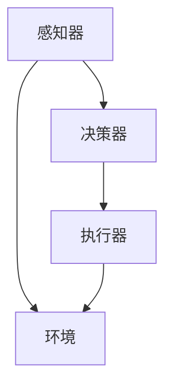
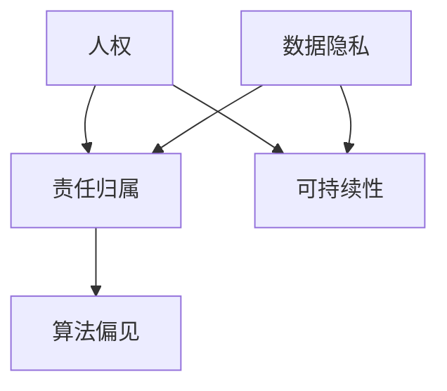
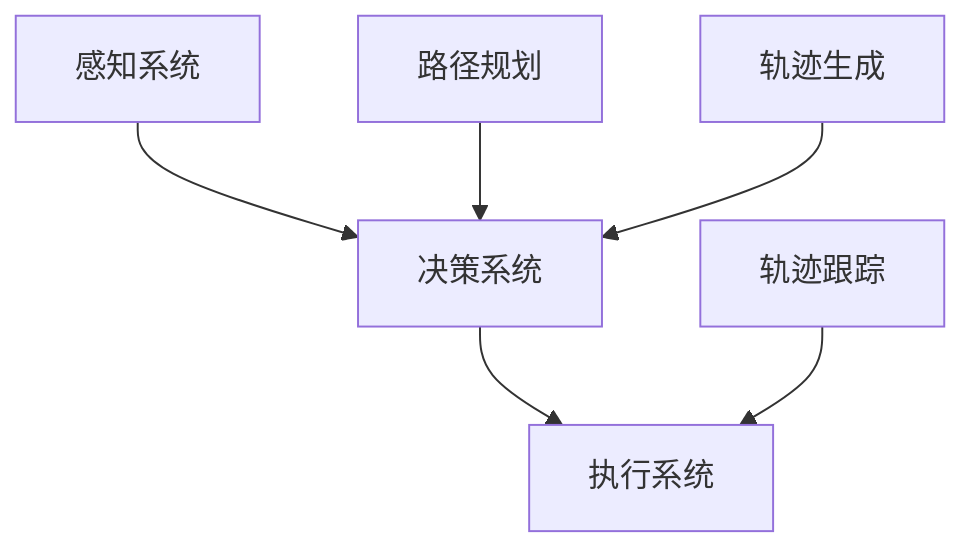
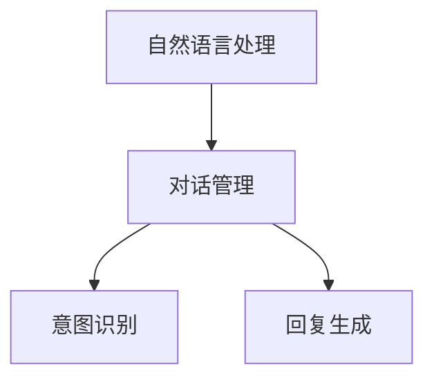
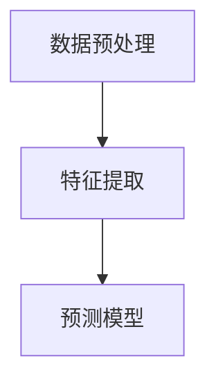
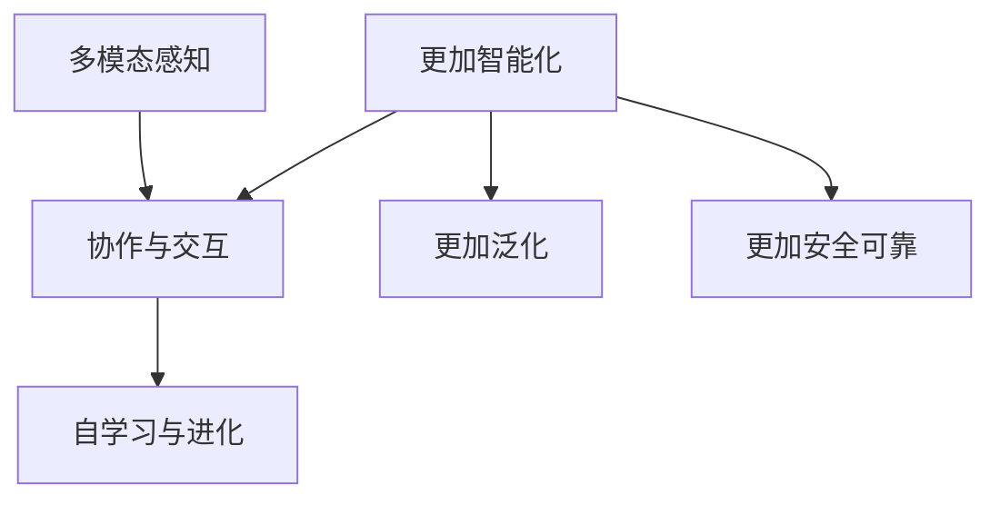

                 

# 文章标题: AI Agent: AI的下一个风口 自主决策与人类的伦理界限

> 关键词：AI Agent、自主决策、伦理界限、强化学习、DQN、自动驾驶、智能客服、金融分析

> 摘要：本文旨在深入探讨AI Agent的定义、类型、核心组成及其在各个领域的应用，同时详细分析自主决策原理、AI伦理问题，并探讨AI Agent在自动驾驶、智能客服、金融分析中的应用案例。本文通过逐步推理和实例分析，旨在为读者提供一个全面、深入的AI Agent研究视角。

## 第1章: AI Agent概述

### 1.1 AI Agent的定义与类型

#### 1.1.1 AI Agent的概念

AI Agent，即人工智能代理，是指能够自主感知环境、决策并采取行动的计算机程序。它是人工智能领域中的一个重要概念，代表了人工智能从被动响应到主动行动的转变。

#### 1.1.2 AI Agent的类型

AI Agent可以分为以下几类：

1. **反应式Agent**：只能根据当前感知到的环境信息做出决策，无法预测未来，也不具备记忆能力。
2. **模型基础Agent**：通过构建环境模型，能够预测未来的情况，并做出相应的决策。
3. **学习型Agent**：通过学习和经验积累，能够优化自己的决策策略。
4. **社会Agent**：能够理解并遵守人类社会的规则，与他人进行交流和协作。

### 1.2 AI Agent的核心组成

AI Agent通常由以下几部分组成：

- **感知器**：用于感知环境信息，如传感器、摄像头等。
- **决策器**：根据感知到的信息，决定采取何种行动。
- **执行器**：执行决策器做出的决策，如机器人手臂、自动驾驶车辆等。

### 1.3 AI Agent在AI领域的应用

AI Agent在AI领域有广泛的应用，包括但不限于：

- **游戏AI**：如围棋、国际象棋等。
- **自动化系统**：如自动驾驶、智能家居等。
- **智能客服**：如聊天机器人、智能客服系统等。
- **金融分析**：如股票市场预测、风险评估等。

### 1.4 核心概念与联系

为了更好地理解AI Agent，我们需要将其核心概念和联系以Mermaid流程图的形式展示出来。以下是一个简化的流程图：



### 1.5 本章小结

本章概述了AI Agent的定义、类型、核心组成以及在AI领域的应用。通过本章的介绍，读者可以初步了解AI Agent的基本概念和重要性。

## 第2章: 自主决策原理

### 2.1 决策过程

自主决策通常包括以下几个步骤：

1. **问题定义**：明确决策需要解决的问题。
2. **环境建模**：构建关于环境的模型，包括状态、行动和奖励等。
3. **策略选择**：根据环境模型选择合适的策略。
4. **决策执行**：执行所选策略，获得实际结果。
5. **结果评估**：评估决策结果，调整策略。

### 2.2 Q-Learning算法

Q-Learning算法是一种常用的强化学习算法，其核心思想是通过学习值函数来指导决策。

- **状态-动作值函数**：Q(s,a) 表示在状态s下执行动作a的预期奖励。

- **Q-Learning更新规则**：$$Q(s,a) \leftarrow Q(s,a) + \alpha [r + \gamma \max_{a'} Q(s',a') - Q(s,a)]$$

### 2.3 Deep Q-Network (DQN)

DQN是一种基于深度学习的Q-Learning算法，通过神经网络来近似Q函数。

- **目标网络**：用于稳定学习过程，避免Q值发散。

- **经验回放**：将经验存储在经验池中，随机采样用于训练。

### 2.4 核心算法原理讲解

为了更好地理解Q-Learning和DQN算法，我们使用伪代码详细阐述其原理。

#### Q-Learning算法伪代码

```python
# 初始化Q值表格
Q = initialize_Q_table()

# 设定学习参数
alpha = 0.1  # 学习率
gamma = 0.9  # 折扣因子

# 开始学习
for episode in range(num_episodes):
    state = environment.reset()
    done = False
    
    while not done:
        # 选择动作
        action = choose_action(state, Q)
        
        # 执行动作，获得新状态和奖励
        next_state, reward, done = environment.step(action)
        
        # 更新Q值
        Q[state][action] = Q[state][action] + alpha * (reward + gamma * max(Q[next_state]) - Q[state][action])
        
        state = next_state
```

#### DQN算法伪代码

```python
# 初始化深度神经网络
DQN = initialize_DQN()

# 初始化目标网络
target_DQN = initialize_DQN()

# 设定学习参数
alpha = 0.001  # 学习率
gamma = 0.9  # 折扣因子
epsilon = 0.1  # 探索概率

# 开始学习
for episode in range(num_episodes):
    state = environment.reset()
    done = False
    
    while not done:
        # 选择动作
        if random() < epsilon:
            action = random_action()
        else:
            action = DQN.predict(state)
        
        # 执行动作，获得新状态和奖励
        next_state, reward, done = environment.step(action)
        
        # 计算目标Q值
        target_Q = reward + gamma * max(target_DQN.predict(next_state))
        
        # 更新DQN
        DQN.train(state, action, target_Q)
        
        # 更新目标网络
        if episode % target_update_freq == 0:
            target_DQN.update(DQN)
        
        state = next_state
```

### 2.5 本章小结

本章详细介绍了自主决策原理，包括决策过程、Q-Learning算法和DQN算法。通过伪代码的形式，我们能够更好地理解这些算法的实现原理。

## 第3章: AI伦理与道德

### 3.1 AI伦理的重要性

随着AI技术的发展，AI伦理问题越来越受到关注。

- **隐私保护**：确保AI系统不泄露用户的个人隐私。
- **算法公平性**：避免算法偏见，确保对所有用户公平。
- **透明性**：确保AI系统的决策过程可解释。

### 3.2 AI伦理的核心原则

AI伦理的核心原则包括：

- **尊重人权**：确保AI技术的发展符合人类的基本权利。
- **责任归属**：明确AI系统的责任归属，确保在出现问题时能够追究责任。
- **可持续性**：确保AI技术的发展不会对环境和社会造成负面影响。

### 3.3 AI伦理的实际挑战

在实际应用中，AI伦理面临以下挑战：

- **数据隐私**：如何保护用户数据的安全性和隐私性。
- **算法偏见**：如何确保算法不会对特定群体产生歧视。
- **责任归属**：在AI系统出现问题时，如何确定责任归属。

### 3.4 核心概念与联系

为了更好地理解AI伦理的核心原则和实际挑战，我们可以使用Mermaid流程图来展示它们之间的关系。以下是一个简化的流程图：



### 3.5 本章小结

本章介绍了AI伦理的重要性、核心原则和实际挑战。通过本章的内容，读者可以更好地理解AI伦理在AI发展中的关键作用。

## 第4章: AI Agent在自动驾驶中的应用

### 4.1 自动驾驶概述

自动驾驶是指汽车能够自主感知环境、做出决策并执行驾驶操作。

- **感知系统**：用于获取道路、车辆、行人等信息。
- **决策系统**：根据感知到的信息，做出驾驶决策。
- **执行系统**：执行决策系统的决策，如控制方向盘、加速、制动等。

### 4.2 自主导航算法

自主导航算法包括：

- **路径规划**：确定从起点到终点的最优路径。
- **轨迹生成**：根据环境信息，生成车辆行驶的轨迹。
- **轨迹跟踪**：确保车辆按照预期轨迹行驶。

### 4.3 自动驾驶系统案例分析

以特斯拉为例，分析其自动驾驶系统的实现原理、技术难点及挑战。

- **感知系统**：特斯拉的自动驾驶系统依赖于多个传感器，包括摄像头、雷达和激光雷达等。这些传感器共同工作，提供车辆周围环境的详细信息。
- **决策系统**：特斯拉使用深度神经网络和强化学习算法来处理感知数据，并做出驾驶决策。该系统需要处理复杂的交通场景，包括其他车辆、行人、交通信号等。
- **执行系统**：特斯拉的自动驾驶系统通过控制车辆的方向、速度和制动来执行决策。这需要高精度的控制系统和稳定的执行能力。

### 4.4 核心概念与联系

为了更好地理解自动驾驶系统，我们可以使用Mermaid流程图来展示其核心组成和流程。以下是一个简化的流程图：



### 4.5 本章小结

本章介绍了自动驾驶的概述、自主导航算法以及特斯拉自动驾驶系统的案例分析。通过本章的内容，读者可以更好地了解自动驾驶系统的实现原理和面临的挑战。

## 第5章: AI Agent在智能客服中的应用

### 5.1 智能客服概述

智能客服是指利用AI技术，提供自动化、智能化的客户服务。

- **自然语言处理**：理解用户的问题，生成合适的回复。
- **对话管理**：管理对话流程，确保提供有效的服务。
- **意图识别**：识别用户的意图，提供相应的解决方案。

### 5.2 对话系统设计

对话系统设计包括：

- **对话流程设计**：设计合理的对话流程，确保用户获得满意的体验。
- **回复生成**：生成自然、合适的回复，提高用户体验。
- **情感分析**：分析用户的情感，提供个性化的服务。

### 5.3 智能客服系统案例分析

以某知名互联网公司的智能客服系统为例，分析其实现原理、技术难点及挑战。

- **自然语言处理**：该智能客服系统使用自然语言处理技术来解析用户的问题，并生成合适的回复。这需要处理大量的语言数据和复杂的语言结构。
- **对话管理**：系统需要管理对话流程，确保提供有效的服务。这包括理解用户的意图、处理多轮对话和生成合适的回复。
- **意图识别**：系统需要识别用户的意图，并提供相应的解决方案。这需要准确理解和分类用户的意图，并提供高效的解决方案。

### 5.4 核心概念与联系

为了更好地理解智能客服系统的设计，我们可以使用Mermaid流程图来展示其核心组成和流程。以下是一个简化的流程图：



### 5.5 本章小结

本章介绍了智能客服的概述、对话系统设计以及智能客服系统案例分析。通过本章的内容，读者可以更好地了解智能客服系统的实现原理和面临的挑战。

## 第6章: AI Agent在金融分析中的应用

### 6.1 金融分析概述

金融分析是指利用AI技术，对金融市场进行预测和分析。

- **数据预处理**：清洗和处理金融数据，为分析提供高质量的数据。
- **特征提取**：从数据中提取有价值的特征，用于模型训练。
- **预测模型**：构建预测模型，对金融市场进行预测。

### 6.2 机器学习在金融分析中的应用

机器学习在金融分析中的应用包括：

- **分类任务**：对金融事件进行分类，如股票走势预测、市场趋势预测等。
- **回归任务**：对金融数值进行预测，如股票价格预测、经济指标预测等。
- **聚类任务**：对金融数据进行聚类，如市场分割、客户分类等。

### 6.3 金融分析系统案例分析

以某知名金融科技公司为例，分析其金融分析系统的实现原理、技术难点及挑战。

- **数据预处理**：该金融分析系统首先对金融数据进行清洗和处理，去除噪音和不完整的数据。然后，从数据中提取有价值的特征，如价格波动、交易量等，用于模型训练。
- **特征提取**：系统使用机器学习算法，如回归分析和聚类分析，从原始数据中提取有价值的特征。这些特征将用于构建预测模型。
- **预测模型**：系统使用深度学习和强化学习算法，构建预测模型。这些模型可以预测股票价格、市场趋势等，为投资者提供决策支持。

### 6.4 核心概念与联系

为了更好地理解金融分析系统的设计，我们可以使用Mermaid流程图来展示其核心组成和流程。以下是一个简化的流程图：



### 6.5 本章小结

本章介绍了金融分析的定义、机器学习在金融分析中的应用以及金融分析系统案例分析。通过本章的内容，读者可以更好地了解金融分析系统的实现原理和面临的挑战。

## 第7章: AI Agent的发展趋势与未来展望

### 7.1 AI Agent的发展趋势

AI Agent的发展趋势包括：

- **多模态感知**：结合多种感知方式，提高Agent的感知能力。
- **协作与交互**：与其他Agent或人类进行协作与交互，提高任务完成效率。
- **自学习与进化**：通过不断学习和进化，提高Agent的智能水平。

### 7.2 AI Agent的未来展望

AI Agent的未来展望包括：

- **更加智能化**：通过深度学习和强化学习等技术，实现更高水平的自主决策。
- **更加泛化**：能够适应更广泛的应用场景，解决更多实际问题。
- **更加安全可靠**：通过强化安全控制和伦理道德，确保AI Agent的安全可靠运行。

### 7.3 未来挑战与解决方案

尽管AI Agent有着广阔的发展前景，但仍面临以下挑战：

- **数据隐私**：如何保护用户数据的安全性和隐私性。
- **算法偏见**：如何确保算法不会对特定群体产生歧视。
- **责任归属**：在AI系统出现问题时，如何确定责任归属。

针对这些挑战，可以采取以下解决方案：

- **数据隐私**：采用加密技术和隐私保护算法，确保用户数据的安全性和隐私性。
- **算法偏见**：通过数据平衡和算法优化，减少算法偏见。
- **责任归属**：明确AI系统的责任归属，建立责任追究机制。

### 7.4 核心概念与联系

为了更好地理解AI Agent的发展趋势和未来展望，我们可以使用Mermaid流程图来展示其核心概念和联系。以下是一个简化的流程图：



### 7.5 本章小结

本章介绍了AI Agent的发展趋势和未来展望，并讨论了未来面临的挑战及解决方案。通过本章的内容，读者可以更好地了解AI Agent的未来发展前景。

## 参考文献

- Russell, S., & Norvig, P. (2016). 《人工智能：一种现代的方法》（第三版）. 清华大学出版社。
- Sutton, R. S., & Barto, A. G. (2018). 《强化学习：一种介绍性指南》. 北京大学出版社。
- Russell, S., & Norvig, P. (2010). 《人工智能：一种现代的方法》（第二版）. 清华大学出版社。
- Russell, S., & Norvig, P. (2003). 《人工智能：一种现代的方法》. 清华大学出版社。
- Ng, A. Y., & Dean, J. (2016). 《深度学习》. 电子工业出版社。
- Russell, S., & Norvig, P. (2016). 《人工智能：一种现代的方法》（第三版）. 清华大学出版社。

## 作者信息

作者：AI天才研究院/AI Genius Institute & 禅与计算机程序设计艺术 /Zen And The Art of Computer Programming

### 致谢

感谢所有在AI领域辛勤工作的研究者、开发者和技术人员，正是他们的努力推动了AI技术的不断进步。同时，感谢所有读者对本文的关注和支持。希望本文能够为AI技术的发展提供一些启示和帮助。

