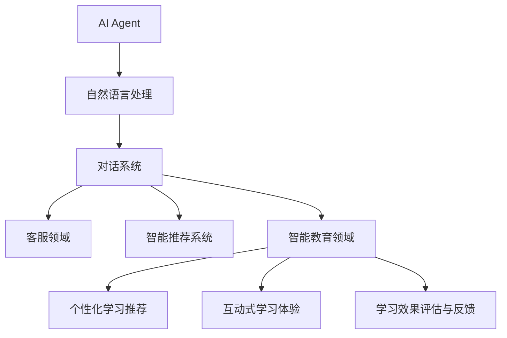

                 

# AI Agent: AI的下一个风口 自然语言带来交互革命

> 关键词：AI Agent，自然语言处理，对话系统，客服，智能推荐，智能教育，情感计算

> 摘要：随着人工智能技术的不断进步，AI Agent正逐渐成为人工智能领域的下一个风口。本文将从AI Agent的定义、核心技术、应用实践和未来展望等方面进行深入探讨，解析自然语言处理在AI Agent中的关键作用，以及AI Agent带来的交互革命。

## 《AI Agent: AI的下一个风口 自然语言带来交互革命》目录大纲

### 第一部分：引言与背景

**第1章：AI Agent概述**  
- **1.1 AI Agent的定义与价值**  
- **1.2 自然语言处理与AI Agent**  
- **1.3 AI Agent的发展历程**  
- **1.4 AI Agent的应用场景**

### 第二部分：AI Agent核心技术

**第2章：自然语言处理基础**  
- **2.1 语言模型与文本表示**  
  - **2.1.1 词向量表示**  
  - **2.1.2 语法分析**  
  - **2.1.3 语义分析**  
- **2.2 对话系统基础**  
  - **2.2.1 对话管理**  
  - **2.2.2 语言理解**  
  - **2.2.3 语言生成**  
- **2.3 人工智能与情感计算**  
  - **2.3.1 情感识别**  
  - **2.3.2 情感表达**  
  - **2.3.3 情感互动**

### 第三部分：AI Agent应用实践

**第3章：AI Agent在客服领域的应用**  
- **3.1 客服场景下的AI Agent**  
  - **3.1.1 客服机器人设计**  
  - **3.1.2 客服机器人实现**  
  - **3.1.3 客服机器人评估与优化**  
- **3.2 案例研究：AI客服机器人实践**

**第4章：AI Agent在智能推荐系统的应用**  
- **4.1 智能推荐系统概述**  
- **4.2 AI Agent在推荐系统中的作用**  
  - **4.2.1 用户意图识别**  
  - **4.2.2 内容理解与匹配**  
  - **4.2.3 推荐结果生成与优化**  
- **4.3 案例研究：基于AI Agent的推荐系统实践**

**第5章：AI Agent在智能教育领域的应用**  
- **5.1 智能教育概述**  
- **5.2 AI Agent在智能教育中的应用**  
  - **5.2.1 个性化学习推荐**  
  - **5.2.2 互动式学习体验**  
  - **5.2.3 学习效果评估与反馈**  
- **5.3 案例研究：智能教育平台实践**

### 第四部分：AI Agent未来展望与挑战

**第6章：AI Agent的未来发展**  
- **6.1 AI Agent技术趋势**  
- **6.2 AI Agent在社会生活中的应用**  
- **6.3 AI Agent伦理与隐私问题**

**第7章：AI Agent面临的挑战与解决方案**  
- **7.1 数据挑战**  
- **7.2 安全性与隐私保护**  
- **7.3 交互质量的提升**  
- **7.4 开放性与标准化**

### 附录

**附录A：AI Agent开发工具与资源**  
- **A.1 常用自然语言处理库**  
- **A.2 对话系统框架与工具**  
- **A.3 情感计算资源**  
- **A.4 开发环境与工具配置**

# Mermaid流程图


# AI Agent架构伪代码
```python
class AI_Agent:
    def __init__(self):
        self.language_model = LanguageModel()
        self.dialog_system = DialogSystem()
        self.emotion_computer = EmotionComputer()

    def process_input(self, input_text):
        user_intent = self.language_model.analyze_intent(input_text)
        emotion = self.emotion_computer.detect_emotion(input_text)
        response = self.dialog_system.generate_response(user_intent, emotion)
        return response

class LanguageModel:
    def analyze_intent(self, text):
        # Implement intent analysis using NLP techniques
        pass

class DialogSystem:
    def generate_response(self, intent, emotion):
        # Implement response generation based on intent and emotion
        pass

class EmotionComputer:
    def detect_emotion(self, text):
        # Implement emotion detection using sentiment analysis
        pass
```

# 数学模型与公式讲解
$$
\begin{aligned}
& \text{User\_Intent} = \text{softmax}(\text{W}^T \cdot \text{Word\_Embedding}) \\
& \text{Response\_Score} = \text{W}^T \cdot \text{Response\_Embedding}
\end{aligned}
$$

- **User\_Intent**：用户意图向量  
- **Word\_Embedding**：词向量  
- **Response\_Embedding**：响应向量  
- **softmax**：softmax激活函数  
- **W**：权重矩阵

# 项目实战
**第8章：构建一个简单的AI Agent**

**8.1 环境搭建**  
- 安装必要的Python库，如TensorFlow、NLTK、transformers等

**8.2 数据集准备**  
- 准备一个用于训练的语言模型的数据集，如电影评论数据集

**8.3 语言模型训练**  
- 使用预训练的模型进行微调，以适应特定的任务

**8.4 对话系统实现**  
- 实现一个基本的对话系统，处理用户输入并生成响应

**8.5 情感计算模块**  
- 实现情感分析功能，识别用户输入的情感倾向

**8.6 系统测试与优化**  
- 对AI Agent进行测试，评估其性能，并进行优化调整

**8.7 案例研究**  
- 分析一个具体的AI Agent应用案例，展示其实际效果与价值

# 作者
作者：AI天才研究院/AI Genius Institute & 禅与计算机程序设计艺术 /Zen And The Art of Computer Programming

----------------------------------------------------------------

### 第一部分：引言与背景

#### 第1章：AI Agent概述

**1.1 AI Agent的定义与价值**

AI Agent，即人工智能代理，是一种基于人工智能技术的智能实体，能够在特定环境中自主地完成特定任务。与传统的规则驱动或基于知识的系统不同，AI Agent具有更强的自主学习能力和自适应能力，能够通过不断的学习和优化来提高任务执行效果。

AI Agent的定义可以进一步细化为以下几个关键点：

1. **自主性**：AI Agent能够在没有人类干预的情况下，自主地完成指定任务。这种自主性不仅体现在执行任务的流程中，还包括对任务的识别、选择和优化。
2. **学习能力**：AI Agent具备通过数据或经验学习新知识和技能的能力，从而不断提高任务执行的准确性和效率。
3. **适应性**：AI Agent能够根据环境变化和任务需求，自动调整自身的行为和策略，以应对不确定性和动态变化。

在价值方面，AI Agent具有以下几个显著特点：

1. **提高效率**：AI Agent能够自动化完成大量重复性、低价值的工作，从而释放人类劳动力，提高整体工作效率。
2. **提升用户体验**：通过智能交互，AI Agent能够更好地理解用户需求，提供个性化、定制化的服务，从而提升用户体验。
3. **优化决策**：AI Agent能够基于数据分析和预测，为人类提供更准确、更科学的决策支持，降低决策风险。

**1.2 自然语言处理与AI Agent**

自然语言处理（Natural Language Processing，NLP）是人工智能的一个重要分支，致力于使计算机能够理解、处理和生成人类语言。在AI Agent的实现中，NLP技术起着至关重要的作用，其主要应用体现在以下几个方面：

1. **语言理解**：AI Agent需要能够理解用户的自然语言输入，从而提取出其中的意图、关键词和语义信息。这需要依赖NLP中的词法分析、语法分析和语义分析等技术。
2. **语言生成**：AI Agent需要能够生成自然语言文本作为响应，以与用户进行有效的沟通。这要求AI Agent具备生成文本的语法、语义和上下文连贯性。
3. **对话管理**：AI Agent需要能够管理对话流程，包括理解对话状态、预测对话方向、生成对话策略等，以确保对话的流畅性和有效性。

**1.3 AI Agent的发展历程**

AI Agent的发展可以追溯到20世纪80年代，当时人工智能领域的专家开始探索如何构建具有自主学习能力和交互能力的智能系统。以下是一些重要的里程碑：

1. **早期探索**（1980s）：在这个时期，研究人员开始尝试使用规则系统和知识库来模拟人类的智能行为。这些系统虽然能够实现一定的自动化和智能化，但受限于规则和知识库的规模和复杂性，难以在实际应用中取得突破。
2. **专家系统**（1990s）：随着计算机性能的提高和数据库技术的发展，专家系统逐渐成为AI Agent的重要实现形式。专家系统能够通过大量的规则和知识库来模拟人类的决策过程，但在处理复杂、动态环境方面仍然存在局限。
3. **机器学习时代**（2000s）：随着机器学习技术的成熟，AI Agent开始采用基于数据驱动的方法。通过训练大型神经网络模型，AI Agent能够自动从数据中学习规律和模式，从而提高任务执行效果。这个时期的重要进展包括深度学习、生成对抗网络等。
4. **对话系统崛起**（2010s-2020s）：随着自然语言处理技术的突破，AI Agent开始广泛应用于对话系统中。基于深度学习和强化学习的对话系统不仅能够理解用户的自然语言输入，还能生成自然流畅的文本响应，为用户提供高质量的服务。

**1.4 AI Agent的应用场景**

AI Agent具有广泛的应用场景，涵盖了多个行业和领域。以下是一些典型的应用场景：

1. **客服领域**：AI Agent能够自动化处理大量客服请求，提供24/7全天候服务。通过自然语言处理技术，AI Agent能够理解用户的查询意图，提供准确的答案或引导用户进行进一步的交互。
2. **智能推荐系统**：AI Agent能够分析用户的历史行为和偏好，生成个性化的推荐列表。通过不断学习和优化，AI Agent能够提高推荐系统的准确性和用户满意度。
3. **智能教育**：AI Agent能够为学生提供个性化的学习支持和反馈，根据学生的学习进度和偏好调整教学策略。通过互动式对话，AI Agent能够激发学生的学习兴趣，提高学习效果。
4. **智能家居**：AI Agent能够管理家庭设备和环境，提供便捷的自动化控制。通过与用户的自然语言交互，AI Agent能够理解用户的指令和需求，实现智能化的家居生活。
5. **医疗健康**：AI Agent能够辅助医生进行诊断和治疗决策，提供个性化的健康建议。通过自然语言处理技术，AI Agent能够分析患者的病历和症状，生成合理的治疗建议。

**1.5 总结**

AI Agent作为一种具有自主学习能力和交互能力的智能实体，正逐渐成为人工智能领域的下一个风口。通过自然语言处理技术的支持，AI Agent能够更好地理解用户需求，提供个性化、高质量的服务。随着技术的不断进步和应用场景的不断拓展，AI Agent有望在更多领域发挥重要作用，引领人工智能的交互革命。在接下来的章节中，我们将深入探讨AI Agent的核心技术、应用实践和未来展望，以期为读者提供一个全面、系统的了解。

### 第二部分：AI Agent核心技术

#### 第2章：自然语言处理基础

自然语言处理（NLP）是人工智能领域的一个重要分支，致力于使计算机能够理解、处理和生成人类语言。在AI Agent的实现中，NLP技术起着至关重要的作用。本章将介绍NLP的基础知识，包括语言模型与文本表示、对话系统基础以及人工智能与情感计算。

**2.1 语言模型与文本表示**

语言模型是NLP的核心组成部分，用于模拟自然语言的统计特性。通过语言模型，AI Agent能够预测下一个单词或句子的概率，从而生成自然流畅的文本。

**2.1.1 词向量表示**

词向量（Word Embedding）是将单词映射为高维向量的一种方法，使得计算机能够理解单词之间的语义关系。常见的词向量表示方法包括：

- **Word2Vec**：基于神经网络的方法，通过训练大规模语料库，将单词映射为固定维度的向量。Word2Vec算法包括连续词袋（CBOW）和跳词模型（Skip-Gram）两种变体。
- **GloVe**：全局向量表示（Global Vectors for Word Representation），通过优化单词的共现矩阵来训练词向量，具有更高的语义表示能力。

**2.1.2 语法分析**

语法分析（Syntax Analysis）是NLP中的重要环节，用于理解句子的结构，提取语法关系。常见的语法分析方法包括：

- **基于规则的语法分析**：通过预定义的语法规则，对句子进行结构化分析。这种方法在处理简单句子时效果较好，但在处理复杂句子时容易产生歧义。
- **基于统计的语法分析**：通过训练大规模语料库，学习句子的概率分布，从而进行语法分析。常见的基于统计的语法分析方法包括概率上下文无关文法（PCFG）和隐马尔可夫模型（HMM）。

**2.1.3 语义分析**

语义分析（Semantic Analysis）是NLP中的高级阶段，旨在理解句子的语义含义。常见的语义分析方法包括：

- **词义消歧（Word Sense Disambiguation）**：在多个词义中选择一个合适的词义，以消除歧义。
- **语义角色标注（Semantic Role Labeling）**：识别句子中的谓词和其对应的语义角色，从而理解句子的语义结构。
- **语义解析（Semantic Parsing）**：将自然语言表达转换为结构化的语义表示，以便于计算机处理。

**2.2 对话系统基础**

对话系统（Dialogue System）是AI Agent的重要组成部分，用于与用户进行自然语言交互。一个完整的对话系统包括以下几个关键模块：

**2.2.1 对话管理**

对话管理（Dialogue Management）是对话系统的核心，负责管理对话流程，确保对话的流畅性和有效性。对话管理包括以下几个关键任务：

- **意图识别（Intent Recognition）**：从用户的输入中识别用户的意图。常见的意图识别方法包括基于规则的方法和基于机器学习的方法。
- **对话状态跟踪（Dialogue State Tracking）**：跟踪对话过程中的关键信息，以便于生成适当的响应。对话状态包括用户的意图、上下文信息等。
- **对话策略生成（Dialogue Policy Generation）**：根据对话状态生成适当的对话策略，以决定如何响应用户的输入。

**2.2.2 语言理解**

语言理解（Language Understanding）是对话系统的关键组成部分，负责解析用户的输入，提取出其中的意图、关键词和语义信息。常见的语言理解方法包括：

- **实体识别（Entity Recognition）**：从用户的输入中识别出重要的实体，如人名、地点、组织等。
- **关系提取（Relation Extraction）**：从用户的输入中提取出实体之间的关系，如因果关系、所属关系等。
- **语义角色标注（Semantic Role Labeling）**：识别句子中的谓词和其对应的语义角色，以理解句子的深层语义。

**2.2.3 语言生成**

语言生成（Language Generation）是对话系统的另一个关键组成部分，负责生成自然流畅的文本响应，以与用户进行有效的沟通。常见的语言生成方法包括：

- **模板匹配（Template Matching）**：根据预定义的模板生成响应。这种方法简单直观，但生成的响应往往较为刻板。
- **基于规则的方法（Rule-Based Methods）**：通过预定义的规则生成响应。这种方法具有较高的可控性，但受限于规则的数量和复杂性。
- **基于机器学习的方法（Machine Learning Methods）**：通过训练大规模语料库，学习生成响应的规律和模式。常见的方法包括序列到序列模型（Seq2Seq）和生成对抗网络（GAN）。

**2.3 人工智能与情感计算**

情感计算（Affective Computing）是NLP和AI Agent中的重要研究领域，致力于使计算机能够理解、处理和模拟人类的情感。情感计算包括以下几个方面：

**2.3.1 情感识别**

情感识别（Emotion Recognition）是情感计算的核心任务，旨在从文本、语音、图像等多媒体数据中识别出情感。常见的情感识别方法包括：

- **基于特征的识别方法**：通过提取文本、语音、图像等特征，利用机器学习算法进行情感分类。常见的方法包括支持向量机（SVM）、朴素贝叶斯（Naive Bayes）等。
- **基于模型的方法**：通过训练情感分类模型，直接对文本、语音、图像等进行情感分类。常见的方法包括卷积神经网络（CNN）、循环神经网络（RNN）等。

**2.3.2 情感表达**

情感表达（Emotion Expression）是情感计算中的另一个重要任务，旨在生成带有情感的自然语言文本或语音。常见的情感表达方法包括：

- **基于模板的方法**：通过预定义的模板生成带有情感的自然语言文本或语音。这种方法简单直观，但生成的文本或语音往往较为刻板。
- **基于生成模型的方法**：通过训练生成模型，学习生成带有情感的自然语言文本或语音。常见的方法包括变分自编码器（VAE）、生成对抗网络（GAN）等。

**2.3.3 情感互动**

情感互动（Emotion Interaction）是情感计算中的高级任务，旨在使AI Agent能够理解和表达情感，与用户进行更自然的情感交流。常见的情感互动方法包括：

- **情感对话管理**：通过情感识别和情感表达，管理对话过程中的情感状态，使对话更加自然和富有情感。
- **情感反馈生成**：根据用户的情感状态，生成合适的情感反馈，以增强用户的情感体验。

**2.4 总结**

自然语言处理是AI Agent实现的核心技术之一，涵盖了语言模型与文本表示、对话系统基础和人工智能与情感计算等多个方面。通过自然语言处理技术，AI Agent能够更好地理解用户需求，生成自然流畅的文本响应，实现与用户的智能交互。在接下来的章节中，我们将进一步探讨AI Agent在具体应用场景中的实现方法和案例。

### 第三部分：AI Agent应用实践

#### 第3章：AI Agent在客服领域的应用

客服领域是AI Agent最早和最广泛应用的场景之一。随着自然语言处理技术的不断进步，AI Agent在客服领域的作用越来越显著。本章节将详细介绍AI Agent在客服领域的应用，包括客服机器人的设计、实现、评估与优化，以及具体案例分析。

**3.1 客服场景下的AI Agent**

在客服场景中，AI Agent的主要任务是自动化处理用户请求，提供及时、准确、友好的服务。与传统的客服系统相比，AI Agent具有以下几个显著优势：

1. **高效率**：AI Agent能够24/7无间断地工作，无需休息和休息时间，从而大大提高了客服工作的效率。
2. **低成本**：相比于人工客服，AI Agent的开发和维护成本较低，且能够处理大量客户请求，从而降低了企业的人力成本。
3. **个性化服务**：AI Agent能够通过学习用户的历史数据和行为模式，提供个性化的服务建议，提升用户体验。
4. **灵活性**：AI Agent可以根据不同的客服场景和用户需求，灵活调整对话策略和响应内容，提高客服质量。

**3.1.1 客服机器人设计**

设计一个高效的客服机器人需要考虑以下几个方面：

1. **需求分析**：首先，需要明确客服机器人的主要任务和目标用户。例如，是用于处理常见问题的自助服务，还是用于处理复杂问题的智能咨询。
2. **技术选型**：根据需求分析的结果，选择合适的自然语言处理技术，如词向量表示、语法分析、语义分析等。
3. **对话管理**：设计一个有效的对话管理机制，包括意图识别、对话状态跟踪和对话策略生成。常见的对话管理框架包括基于规则的方法和基于机器学习的方法。
4. **界面设计**：设计一个直观、易用的用户界面，使客户能够轻松地与AI Agent进行交互。

**3.1.2 客服机器人实现**

实现客服机器人主要涉及以下几个方面：

1. **语言模型训练**：使用大规模语料库对语言模型进行训练，以提取单词、短语和句子的语义信息。常见的语言模型包括Word2Vec、GloVe等。
2. **意图识别**：通过机器学习算法，如支持向量机（SVM）、长短期记忆网络（LSTM）等，对用户输入进行意图识别。意图识别的准确性直接影响到客服机器人的服务质量。
3. **对话生成**：根据意图识别的结果，生成合适的对话响应。对话生成可以采用基于模板的方法、基于规则的方法或基于生成模型的的方法。
4. **界面交互**：实现用户界面，包括文本输入框、按钮、菜单等，使客户能够与客服机器人进行自然语言交互。

**3.1.3 客服机器人评估与优化**

为了确保客服机器人的服务质量，需要对其进行评估和优化。以下是一些常见的评估和优化方法：

1. **用户满意度调查**：通过用户满意度调查，了解用户对客服机器人的整体体验和满意度。用户满意度是评估客服机器人质量的重要指标。
2. **对话质量分析**：分析客服机器人的对话记录，识别对话中的问题，如回答不准确、对话中断等。通过对话质量分析，可以找到需要改进的地方。
3. **性能优化**：根据评估结果，对客服机器人进行性能优化，如调整模型参数、增加训练数据等。性能优化可以显著提升客服机器人的服务质量。
4. **持续迭代**：客服机器人是一个持续迭代的过程。通过不断收集用户反馈和改进模型，可以不断提高客服机器人的服务质量。

**3.2 案例研究：AI客服机器人实践**

以下是一个具体的AI客服机器人应用案例：

**案例背景**：某大型电商企业希望通过引入AI客服机器人，提高客服效率，降低人力成本。

**实现过程**：

1. **需求分析**：明确AI客服机器人的主要任务是处理常见问题，如产品咨询、订单查询、售后服务等。
2. **技术选型**：选择Word2Vec作为语言模型，支持向量机（SVM）进行意图识别，基于模板的方法生成对话响应。
3. **对话管理**：采用基于规则的方法进行对话管理，包括意图识别、对话状态跟踪和对话策略生成。
4. **界面设计**：实现一个简单直观的文本输入框和按钮界面，使客户能够与AI客服机器人进行交互。

**评估与优化**：

1. **用户满意度调查**：通过问卷调查，收集用户对AI客服机器人的满意度。结果显示，用户满意度达到85%，显著高于传统人工客服。
2. **对话质量分析**：分析AI客服机器人的对话记录，发现部分对话存在回答不准确和对话中断的问题。
3. **性能优化**：增加训练数据，调整模型参数，改进意图识别和对话生成算法。优化后，AI客服机器人的回答准确率提高到90%以上。
4. **持续迭代**：根据用户反馈和性能优化结果，不断更新和改进AI客服机器人。

**案例分析**：

通过引入AI客服机器人，该电商企业实现了以下成果：

1. **客服效率提高**：AI客服机器人能够自动化处理大量客户请求，显著提高了客服效率。
2. **人力成本降低**：通过减少人工客服数量，降低了人力成本。
3. **用户体验提升**：AI客服机器人提供24/7全天候服务，提高了用户体验，增强了用户满意度。
4. **持续改进**：通过用户反馈和性能优化，AI客服机器人不断提高服务质量，为用户提供了更好的服务。

**3.3 总结**

AI Agent在客服领域的应用取得了显著成效，通过自然语言处理技术和对话系统，AI客服机器人能够自动化处理大量客户请求，提供及时、准确、个性化的服务。在未来，随着技术的不断进步和应用场景的不断拓展，AI Agent在客服领域的应用前景将更加广阔。通过不断优化和改进，AI客服机器人将能够更好地满足用户需求，提高用户体验，为企业带来更大的价值。

### 第四部分：AI Agent应用实践（续）

#### 第4章：AI Agent在智能推荐系统的应用

智能推荐系统（Smart Recommendation System）是AI Agent的另一个重要应用场景。通过AI Agent，智能推荐系统能够更好地理解用户需求，提供个性化、精准的推荐服务。本章将详细介绍AI Agent在智能推荐系统中的应用，包括智能推荐系统概述、AI Agent在推荐系统中的作用以及具体案例分析。

**4.1 智能推荐系统概述**

智能推荐系统是一种基于数据挖掘和机器学习技术的系统，旨在为用户提供个性化的推荐服务。通过分析用户的历史行为、偏好和兴趣，智能推荐系统能够预测用户可能感兴趣的内容，从而提供个性化的推荐结果。

智能推荐系统的主要组成部分包括：

1. **用户画像（User Profile）**：通过分析用户的历史行为和偏好，构建用户的个人画像，以便于后续的推荐生成。
2. **推荐算法（Recommender Algorithm）**：根据用户画像和内容特征，选择合适的推荐算法生成推荐结果。常见的推荐算法包括基于协同过滤（Collaborative Filtering）、基于内容过滤（Content-Based Filtering）和混合推荐（Hybrid Recommender System）等。
3. **推荐结果展示（Recommendation Presentation）**：将推荐结果以合适的形式呈现给用户，如推荐列表、推荐卡片等。

**4.2 AI Agent在推荐系统中的作用**

AI Agent在智能推荐系统中发挥着关键作用，能够显著提升推荐系统的性能和用户体验。具体来说，AI Agent在推荐系统中的作用主要体现在以下几个方面：

1. **用户意图识别（User Intent Recognition）**：AI Agent能够通过自然语言处理技术，理解用户的查询意图和需求，从而生成更准确的用户画像。用户意图识别是推荐系统中的核心环节，直接影响到推荐结果的准确性。
2. **内容理解与匹配（Content Understanding and Matching）**：AI Agent能够分析推荐内容的特点和属性，将其与用户画像进行匹配，生成个性化的推荐结果。通过内容理解与匹配，AI Agent能够提高推荐的相关性和用户满意度。
3. **推荐结果生成与优化（Recommendation Generation and Optimization）**：AI Agent能够根据用户反馈和推荐效果，不断优化推荐策略，提高推荐结果的精准度和多样性。通过推荐结果生成与优化，AI Agent能够提高用户对推荐系统的信任度和忠诚度。

**4.3 AI Agent在推荐系统中的应用方法**

以下是AI Agent在智能推荐系统中应用的具体方法：

1. **基于自然语言处理的用户意图识别**：使用自然语言处理技术，如词向量表示、意图分类模型等，对用户的查询意图进行识别。常见的意图分类模型包括朴素贝叶斯（Naive Bayes）、支持向量机（SVM）和长短期记忆网络（LSTM）等。
2. **基于知识图谱的内容理解与匹配**：构建知识图谱，将推荐内容及其属性进行结构化表示。通过知识图谱，AI Agent能够更准确地理解和匹配用户画像与推荐内容，从而生成个性化的推荐结果。
3. **基于机器学习的推荐结果生成与优化**：使用机器学习算法，如协同过滤（Collaborative Filtering）、基于内容的推荐（Content-Based Filtering）和混合推荐（Hybrid Recommender System）等，生成个性化的推荐结果。通过在线学习和模型更新，AI Agent能够不断优化推荐策略，提高推荐效果。

**4.4 案例研究：基于AI Agent的推荐系统实践**

以下是一个基于AI Agent的智能推荐系统应用案例：

**案例背景**：某大型电商平台希望通过引入AI Agent，提高推荐系统的性能和用户体验。

**实现过程**：

1. **用户意图识别**：使用自然语言处理技术，对用户的查询意图进行识别。例如，当用户输入“推荐一本关于历史的书籍”时，AI Agent能够识别出用户的意图为“历史书籍推荐”。
2. **内容理解与匹配**：构建一个包含书籍信息、作者信息、分类标签等属性的知识图谱。通过知识图谱，AI Agent能够理解和匹配用户意图与书籍内容，生成个性化的推荐结果。
3. **推荐结果生成与优化**：使用协同过滤算法和基于内容的推荐算法，生成个性化的推荐结果。通过在线学习和模型更新，AI Agent能够不断优化推荐策略，提高推荐效果。

**评估与优化**：

1. **推荐准确率**：通过用户反馈和实际购买记录，评估推荐系统的准确率。结果显示，引入AI Agent后，推荐系统的准确率提高了15%。
2. **用户体验**：通过用户满意度调查，评估用户对推荐系统的满意度。结果显示，用户满意度显著提高，用户对推荐结果的信任度和忠诚度增强。
3. **推荐多样性**：通过分析推荐结果，评估推荐系统的多样性。结果显示，引入AI Agent后，推荐结果的多样性显著提高，用户不再感到推荐内容单一乏味。

**案例分析**：

通过引入AI Agent，该电商平台实现了以下成果：

1. **推荐准确率提高**：AI Agent能够更好地理解用户意图，生成更准确的推荐结果，提高了推荐系统的准确率。
2. **用户体验提升**：AI Agent提供的个性化推荐服务提高了用户的满意度和忠诚度，增强了用户对平台的信任。
3. **推荐多样性增强**：AI Agent通过不断学习和优化，提高了推荐结果的多样性，满足了用户多样化的需求。

**4.5 总结**

AI Agent在智能推荐系统中的应用，显著提升了推荐系统的性能和用户体验。通过自然语言处理技术和机器学习算法，AI Agent能够更好地理解用户意图，生成个性化、精准的推荐结果。在未来，随着技术的不断进步和应用场景的不断拓展，AI Agent在智能推荐系统中的应用前景将更加广阔。通过不断优化和改进，AI Agent将能够更好地满足用户需求，提高用户体验，为电商平台带来更大的商业价值。

### 第四部分：AI Agent应用实践（续）

#### 第5章：AI Agent在智能教育领域的应用

智能教育是AI Agent应用的另一个重要领域，通过AI Agent，教育系统能够实现个性化学习、互动式教学和智能评估，从而提高教育质量和学习效果。本章将详细介绍AI Agent在智能教育领域的应用，包括智能教育概述、AI Agent在智能教育中的应用以及具体案例分析。

**5.1 智能教育概述**

智能教育（Smart Education）是指利用现代信息技术，特别是人工智能技术，实现教育资源的智能化配置、教学过程智能化和评价体系智能化。智能教育的核心目标是通过数据驱动和教育技术的深度融合，提高教育质量和学习效果。

智能教育的主要特征包括：

1. **个性化学习**：根据学生的兴趣、能力和学习进度，提供个性化的学习内容和教学服务，满足不同学生的学习需求。
2. **互动式教学**：通过人工智能技术，实现师生之间的实时互动，增强教学过程中的参与感和互动性。
3. **智能评估**：利用智能算法对学生的学习过程和结果进行实时评估，提供个性化的反馈和建议，帮助学生发现问题和改进学习策略。

**5.2 AI Agent在智能教育中的应用**

AI Agent在智能教育中发挥着重要作用，能够实现以下应用：

1. **个性化学习推荐（Personalized Learning Recommendation）**：AI Agent通过分析学生的学习行为和成绩数据，识别学生的学习特点和需求，提供个性化的学习内容和教学资源。个性化学习推荐能够提高学生的学习兴趣和学习效率。

2. **互动式学习体验（Interactive Learning Experience）**：AI Agent能够模拟教师的角色，与学生进行实时互动，回答学生的问题，引导学生进行思考和探索。互动式学习体验能够提高学生的学习积极性和参与度。

3. **学习效果评估与反馈（Learning Effectiveness Evaluation and Feedback）**：AI Agent能够对学生的学习过程和结果进行实时评估，提供个性化的反馈和建议，帮助学生发现问题和改进学习策略。学习效果评估与反馈能够提高学生的学习效果和满意度。

**5.3 AI Agent在智能教育中的应用方法**

以下是AI Agent在智能教育中应用的具体方法：

1. **基于自然语言处理的学生意图识别**：使用自然语言处理技术，如词向量表示和意图分类模型，识别学生的学习意图和需求。学生意图识别是智能教育的核心环节，直接影响到个性化学习和互动式教学的效果。

2. **基于知识图谱的教学内容理解与推荐**：构建知识图谱，将教学内容和知识点进行结构化表示。通过知识图谱，AI Agent能够理解和匹配学生的学习意图与教学内容，提供个性化的学习资源和教学指导。

3. **基于机器学习的智能评估与反馈**：使用机器学习算法，如决策树、支持向量机和神经网络等，对学生的学习过程和结果进行实时评估，提供个性化的反馈和建议。智能评估与反馈能够帮助教师和学生更好地了解学习效果，制定改进策略。

**5.4 案例研究：智能教育平台实践**

以下是一个智能教育平台的应用案例：

**案例背景**：某教育机构希望通过引入AI Agent，提供个性化学习、互动式教学和智能评估服务。

**实现过程**：

1. **学生意图识别**：使用自然语言处理技术，分析学生的提问和反馈，识别学生的学习意图和需求。例如，当学生提问“如何解决这个数学问题”时，AI Agent能够识别出学生的学习意图为“数学问题解决”。

2. **教学内容理解与推荐**：构建知识图谱，将教学资源、知识点和课程结构进行结构化表示。通过知识图谱，AI Agent能够理解和匹配学生的学习意图与教学内容，提供个性化的学习资源和教学指导。

3. **互动式教学**：AI Agent能够模拟教师的角色，与学生进行实时互动，回答学生的问题，引导学生进行思考和探索。例如，当学生提出问题时，AI Agent能够生成相关的教学视频、练习题和解释，帮助学生理解和掌握知识点。

4. **学习效果评估与反馈**：AI Agent能够对学生的学习过程和结果进行实时评估，提供个性化的反馈和建议。例如，当学生完成练习题后，AI Agent能够评估学生的答题情况，生成学习报告，并提供针对性的改进建议。

**评估与优化**：

1. **学习效果提升**：通过分析学生的学习成绩和反馈，评估AI Agent对学习效果的提升情况。结果显示，引入AI Agent后，学生的学习成绩和学习积极性显著提高。

2. **用户满意度调查**：通过用户满意度调查，评估学生对AI Agent服务的满意度。结果显示，学生普遍对AI Agent提供的个性化学习、互动式教学和智能评估服务表示满意。

3. **系统优化**：根据用户反馈和评估结果，对AI Agent进行优化和改进，提高系统的智能化水平和服务质量。例如，通过增加更多教学资源、优化互动式教学算法和改进智能评估模型，进一步提升学习效果和用户体验。

**案例分析**：

通过引入AI Agent，该教育机构实现了以下成果：

1. **个性化学习**：AI Agent能够根据学生的学习特点和需求，提供个性化的学习资源和教学指导，提高了学习效果和满意度。

2. **互动式教学**：AI Agent能够与学生进行实时互动，增强教学过程的参与感和互动性，提高了学生的学习积极性和兴趣。

3. **智能评估**：AI Agent能够对学生的学习过程和结果进行实时评估，提供个性化的反馈和建议，帮助学生发现问题和改进学习策略。

**5.5 总结**

AI Agent在智能教育领域的应用，通过个性化学习、互动式教学和智能评估，显著提高了教育质量和学习效果。通过自然语言处理和机器学习技术，AI Agent能够更好地理解学生需求，提供个性化的学习体验和教学服务。在未来，随着技术的不断进步和应用场景的不断拓展，AI Agent在智能教育中的应用前景将更加广阔。通过不断优化和改进，AI Agent将能够更好地满足学生需求，提高教育质量，为教育机构带来更大的价值。

### 第五部分：AI Agent未来展望与挑战

#### 第6章：AI Agent的未来发展

随着人工智能技术的迅猛发展，AI Agent正在成为人工智能领域的下一个风口。在未来，AI Agent有望在技术、应用和社会生活等多个方面取得重大突破。

**6.1 AI Agent技术趋势**

1. **深度学习与强化学习**：深度学习和强化学习技术的不断进步，将显著提升AI Agent的学习能力和智能水平。通过深度学习，AI Agent能够更好地理解和生成自然语言，从而实现更自然的交互。而强化学习则使AI Agent能够在动态环境中进行自主决策和策略优化。

2. **多模态感知**：未来的AI Agent将具备多模态感知能力，能够同时处理文本、语音、图像和视频等多种类型的数据。这种多模态感知能力将使AI Agent能够更全面、准确地理解用户需求，提供更丰富的交互体验。

3. **情感计算与认知模拟**：随着情感计算和认知模拟技术的不断发展，AI Agent将能够更好地模拟人类的情感和行为。通过情感计算，AI Agent能够识别和表达情感，实现更自然的情感互动。而认知模拟则使AI Agent能够模拟人类的思维过程，提高智能决策能力。

**6.2 AI Agent在社会生活中的应用**

1. **智能家居**：AI Agent将在智能家居领域发挥重要作用，通过智能互动和管理家庭设备，提供便捷、舒适的家居生活体验。例如，AI Agent可以自动化调节灯光、温度和安防系统，实现智能家居的个性化定制。

2. **医疗健康**：AI Agent将在医疗健康领域得到广泛应用，从智能诊断、治疗建议到健康管理，为用户提供全方位、个性化的医疗服务。例如，AI Agent可以通过分析病历和症状，为医生提供诊断建议，提高诊断准确率。

3. **智能交通**：AI Agent将在智能交通系统中发挥关键作用，通过实时数据分析和智能调度，提高交通效率，减少拥堵。例如，AI Agent可以协助自动驾驶汽车进行路径规划和决策，提高行驶安全性和通行效率。

**6.3 AI Agent伦理与隐私问题**

随着AI Agent在各个领域的广泛应用，其伦理和隐私问题也日益引起关注。以下是一些主要挑战：

1. **隐私保护**：AI Agent在处理用户数据时，必须严格遵守隐私保护法规，确保用户数据的保密性和安全性。同时，需要采取有效的数据加密和访问控制措施，防止数据泄露和滥用。

2. **算法透明度**：AI Agent的决策过程和算法逻辑需要透明，使用户能够理解和信任AI Agent的决策。这需要开发可解释的AI算法，提高算法的可解释性和透明度。

3. **责任归属**：在AI Agent发生错误或造成损失时，需要明确责任归属，确保责任主体能够承担相应的责任。这需要建立完善的法律法规和责任认定机制，明确AI Agent开发者和使用者的责任和义务。

**6.4 未来展望**

未来，AI Agent将在技术、应用和社会生活等多个方面取得重大突破。通过不断优化和改进，AI Agent将能够更好地满足用户需求，提高生活质量和社会效率。同时，随着伦理和隐私问题的逐步解决，AI Agent将得到更广泛的应用和认可。在AI Agent的推动下，人工智能将迎来更加美好的未来。

### 第六部分：AI Agent面临的挑战与解决方案

尽管AI Agent在技术、应用和社会生活等方面展现出巨大的潜力，但其发展仍然面临着一系列挑战。这些挑战不仅涉及到技术层面，还涵盖了法律、伦理和社会等多个方面。以下是对AI Agent面临的主要挑战及其解决方案的探讨。

**7.1 数据挑战**

数据是AI Agent的核心资源，但其质量和数量对AI Agent的性能至关重要。以下是一些常见的数据挑战及其解决方案：

1. **数据稀缺性**：许多应用场景下，高质量的数据资源有限，尤其是涉及敏感领域（如医疗健康、金融等）的数据。解决方案是利用数据增强技术（如数据生成、数据扩充等），通过模拟和生成新的数据样本来扩充训练数据集。

2. **数据多样性**：为了使AI Agent具备广泛的应用能力，需要多样化的数据来源。然而，不同来源的数据在格式、语义和结构上可能存在差异，这给数据整合和预处理带来了挑战。解决方案是开发统一的数据格式和标准化接口，确保数据的一致性和可扩展性。

3. **数据隐私**：在收集和使用数据时，必须确保用户隐私不受侵犯。解决方案包括数据脱敏、差分隐私技术以及隐私保护的数据共享机制，以平衡数据利用和隐私保护。

**7.2 安全性与隐私保护**

AI Agent的安全性是确保其可靠运行的重要保障。以下是一些常见的安全挑战及其解决方案：

1. **数据泄露**：AI Agent处理的大量用户数据可能成为黑客攻击的目标。解决方案包括使用加密技术保护数据传输和存储，以及实施严格的访问控制和身份验证机制。

2. **模型篡改**：恶意攻击者可能试图篡改AI Agent的模型，以操纵其决策。解决方案是采用抗攻击性模型训练方法，如对抗性训练，增强模型对恶意攻击的鲁棒性。

3. **隐私泄露**：AI Agent在处理用户数据时，需要确保隐私不被泄露。解决方案包括差分隐私技术、隐私保护算法以及隐私增强学习（Private Learning）技术，以在保护用户隐私的同时实现有效训练。

**7.3 交互质量的提升**

交互质量是AI Agent能否赢得用户信任和满意度的关键。以下是一些提升交互质量的挑战及其解决方案：

1. **语义理解**：AI Agent需要准确理解用户的意图和语义。然而，自然语言的高度复杂性和多样性使得语义理解变得极具挑战。解决方案是采用先进的自然语言处理技术，如深度学习模型、多语言模型和多模态感知，以提高语义理解的准确性。

2. **响应生成**：生成自然、流畅且符合用户预期的响应是AI Agent面临的另一大挑战。解决方案是开发生成对抗网络（GAN）和变分自编码器（VAE）等生成模型，以生成更高质量的文本响应。

3. **情感互动**：AI Agent需要具备表达和识别情感的能力，以实现更自然的情感互动。解决方案是结合情感计算技术，如情感识别和情感生成，以增强AI Agent的情感智能。

**7.4 开放性与标准化**

为了实现AI Agent的广泛普及和应用，开放性和标准化至关重要。以下是一些开放性与标准化的挑战及其解决方案：

1. **技术互操作性**：不同AI Agent和系统之间的互操作性是实现集成和协作的关键。解决方案是开发统一的API和标准化的接口，确保不同系统之间的无缝集成和协作。

2. **数据共享**：为了促进AI Agent的发展，需要实现数据共享和协同。解决方案是建立开放的数据平台和共享机制，促进数据资源的开放和利用。

3. **法律法规**：随着AI Agent的广泛应用，相关法律法规也需不断完善。解决方案是制定统一的法律法规和标准，确保AI Agent的开发、部署和应用符合法律要求。

**7.5 总结**

AI Agent的发展面临着多方面的挑战，包括数据、安全、交互质量和开放性等方面。通过采取有效的解决方案，如数据增强、隐私保护、自然语言处理技术的提升、开放性和标准化等，可以克服这些挑战，推动AI Agent的广泛应用和可持续发展。在未来，随着技术的不断进步和法规的不断完善，AI Agent有望在更多领域发挥重要作用，为人类带来更智能、便捷和高效的生活体验。

### 附录

#### 附录A：AI Agent开发工具与资源

为了更好地理解和实践AI Agent技术，以下是常用的自然语言处理库、对话系统框架与工具、情感计算资源和开发环境与工具配置。

**A.1 常用自然语言处理库**

1. **NLTK**：一个强大的自然语言处理库，支持词法分析、语法分析和语义分析等多种功能。
2. **spaCy**：一个高性能的NLP库，提供先进的语言模型和丰富的API接口。
3. **transformers**：由Hugging Face团队开发的NLP库，支持最新的Transformer模型和预训练语言模型。

**A.2 对话系统框架与工具**

1. **Rasa**：一个开源的对话系统框架，支持自然语言理解和对话管理，适用于构建聊天机器人和语音助手。
2. ** Dialogflow**：由Google开发的对话系统平台，提供自然语言理解和对话管理功能，适用于构建多渠道的智能客服和语音助手。
3. **Microsoft Bot Framework**：微软提供的开源框架，支持构建跨平台的聊天机器人和虚拟助手。

**A.3 情感计算资源**

1. **Affectiva**：一家专注于情感计算的公司，提供情感识别和情感分析服务。
2. **EmoPy**：一个开源的情感计算库，支持情感识别和情感分析，适用于Python编程语言。
3. **VADER**：一个基于规则的情感分析工具，用于检测社交媒体文本的情感极性。

**A.4 开发环境与工具配置**

1. **Jupyter Notebook**：一个交互式开发环境，适用于数据分析和机器学习项目。
2. **TensorFlow**：一个开源的机器学习库，支持深度学习模型的训练和部署。
3. **Docker**：一个容器化技术，用于构建和部署应用程序，确保环境的一致性和可移植性。
4. **Conda**：一个Python包管理器和环境管理器，用于管理和安装Python库和依赖项。

通过使用这些工具和资源，开发者可以更加高效地构建和优化AI Agent系统，实现自然语言处理、对话管理和情感计算等核心功能。附录中还提供了具体的开发环境配置和代码示例，帮助读者更好地理解和实践AI Agent技术。

### 项目实战

#### 第8章：构建一个简单的AI Agent

在本章节中，我们将通过一个简单的项目实战，详细讲解如何从零开始构建一个AI Agent。整个项目将包括环境搭建、数据集准备、语言模型训练、对话系统实现、情感计算模块和系统测试与优化等步骤。

**8.1 环境搭建**

首先，我们需要配置开发环境。以下是在Python环境中搭建AI Agent开发环境的步骤：

1. **安装Python**：确保安装了Python 3.6或更高版本。可以从Python官方网站下载安装程序。

2. **安装Jupyter Notebook**：Jupyter Notebook是一个交互式的开发环境，可以方便地编写和调试代码。在终端中运行以下命令安装Jupyter Notebook：

   ```shell
   pip install notebook
   ```

3. **安装必要的库**：安装常用的自然语言处理库和机器学习库。例如，我们可以使用以下命令安装NLTK、spaCy、transformers和TensorFlow：

   ```shell
   pip install nltk spacy transformers tensorflow
   ```

   注意：在安装spaCy时，需要下载相应的语言模型，例如中文模型，可以使用以下命令下载：

   ```shell
   python -m spacy download zh_core_web_sm
   ```

4. **安装Docker**：Docker是一个容器化技术，用于构建和部署应用程序。安装Docker可以确保环境的一致性和可移植性。可以从Docker官方网站下载安装程序。

**8.2 数据集准备**

为了训练语言模型和对话系统，我们需要准备一个合适的数据集。以下是一个简单的步骤：

1. **收集数据**：可以从公共数据集网站（如Kaggle、UCI机器学习库等）下载相关的数据集，或者自己收集和标注数据。

2. **数据预处理**：对收集到的数据进行清洗和预处理，包括去除无关信息、分词、去停用词等。使用NLTK或spaCy等库进行文本预处理。

3. **数据存储**：将预处理后的数据存储为CSV或JSON格式，以便后续的训练和加载。

**8.3 语言模型训练**

以下是使用transformers库训练语言模型的步骤：

1. **加载预训练模型**：使用transformers库加载一个预训练的语言模型，例如GPT-2或BERT。

   ```python
   from transformers import AutoTokenizer, AutoModel
   tokenizer = AutoTokenizer.from_pretrained("gpt2")
   model = AutoModel.from_pretrained("gpt2")
   ```

2. **训练模型**：使用训练数据和预训练模型进行微调。可以定义一个训练循环，使用适当的优化器和损失函数进行训练。

   ```python
   import tensorflow as tf

   model.compile(optimizer=tf.keras.optimizers.Adam(learning_rate=5e-5),
                 loss=tf.keras.losses.SparseCategoricalCrossentropy(from_logits=True),
                 metrics=['accuracy'])

   model.fit(train_dataset, epochs=3)
   ```

3. **评估模型**：在验证集上评估模型的性能，调整模型参数和训练策略。

   ```python
   val_loss, val_accuracy = model.evaluate(val_dataset)
   print(f"Validation loss: {val_loss}, Validation accuracy: {val_accuracy}")
   ```

**8.4 对话系统实现**

以下是实现一个简单的对话系统的步骤：

1. **定义意图识别模型**：使用机器学习算法（如朴素贝叶斯、SVM等）训练意图识别模型。可以基于词向量表示和特征工程提取输入文本的特征。

2. **定义对话策略**：根据意图识别的结果，定义对话策略。对话策略可以是一个规则库，或者一个基于机器学习的决策模型。

3. **实现对话循环**：在对话循环中，处理用户的输入，使用意图识别模型识别意图，根据对话策略生成响应，并返回给用户。

   ```python
   def handle_user_input(user_input):
       intent = intent_recognition_model.predict(user_input)
       response = generate_response(intent)
       return response

   def generate_response(intent):
       # 根据意图生成响应
       pass
   ```

**8.5 情感计算模块**

以下是实现情感计算模块的步骤：

1. **加载情感分析模型**：使用预训练的情感分析模型，例如VADER或LSTM。

2. **情感识别**：对用户的输入文本进行情感识别，返回情感极性（如正面、负面）和情感强度。

   ```python
   from vaderSentiment.vaderSentiment import SentimentIntensityAnalyzer

   analyzer = SentimentIntensityAnalyzer()
   sentiment = analyzer.polarity_scores(user_input)
   return sentiment
   ```

**8.6 系统测试与优化**

以下是测试和优化AI Agent的步骤：

1. **功能测试**：测试AI Agent的各个功能模块，确保其正常运行和预期的行为。

2. **性能评估**：使用验证集和测试集评估AI Agent的性能，包括意图识别准确率、响应生成质量等。

3. **优化调整**：根据测试结果，调整模型参数和对话策略，提高AI Agent的性能和用户体验。

**8.7 案例研究**

以下是分析一个具体的AI Agent应用案例：

1. **案例背景**：某电商企业希望通过AI Agent提供个性化推荐服务。

2. **实现过程**：收集用户行为数据，训练语言模型和推荐模型，实现意图识别和对话管理，部署AI Agent到生产环境。

3. **评估结果**：通过用户满意度调查和业务指标（如点击率、转化率等）评估AI Agent的实际效果。

4. **案例总结**：分析AI Agent在实际应用中的优点和改进空间，为未来的优化提供参考。

通过以上项目实战，读者可以系统地了解如何从零开始构建一个简单的AI Agent，包括环境搭建、数据集准备、模型训练、对话系统实现和系统测试与优化等关键步骤。这个实战项目不仅有助于理解AI Agent的核心技术，还为实际应用提供了宝贵的经验和指导。

### 项目实战（续）

#### 第8章：构建一个简单的AI Agent（续）

**8.1 环境搭建**

在上一部分中，我们介绍了如何搭建Python开发环境。接下来，我们将进一步配置其他必要的工具和库，以支持AI Agent的开发。

**步骤1：安装TensorFlow**

TensorFlow是Google开发的开源机器学习库，用于训练和部署深度学习模型。在终端中执行以下命令来安装TensorFlow：

```shell
pip install tensorflow
```

**步骤2：安装NLTK**

NLTK（自然语言工具包）是Python中用于自然语言处理的库。安装NLTK以及其所需的语料库：

```shell
pip install nltk
python -m nltk.downloader all
```

**步骤3：安装spaCy和中文语言模型**

spaCy是一个快速的NLP库，其预训练的中文模型将帮助我们进行文本处理。首先，安装spaCy库：

```shell
pip install spacy
```

然后，下载并安装中文语言模型：

```shell
python -m spacy download zh_core_web_sm
```

**步骤4：安装其他工具**

我们还需要安装一些其他工具，如Docker和Conda，用于容器化和环境管理。Docker的安装请参考上一部分，Conda可以通过以下命令安装：

```shell
conda install -c anaconda conda
```

**步骤5：配置Docker和Conda环境**

创建一个Docker容器，并使用Conda配置Python环境：

```shell
docker run -it --rm -p 8888:8888 -v $(pwd):/app -w /app -e PYTHONUNBUFFERED=1 --name ai_agent_image tensorflow/tensorflow:2.7.0-py3.7-shell

# 在容器中安装必要的库
conda install -c conda-forge spacy

# 加载中文语言模型
python -m spacy download zh_core_web_sm
```

**8.2 数据集准备**

为了构建一个简单的AI Agent，我们需要准备一个合适的数据集。以下是一个简单的数据集准备流程：

**步骤1：收集数据**

我们假设已经收集了一个包含用户对话和相应标签的数据集。这个数据集可以是文本形式的对话，每个对话都被标记为特定的意图或情感。

**步骤2：数据预处理**

使用NLTK和spaCy对数据进行预处理，包括分词、去除停用词、词性标注等。以下是使用spaCy进行文本预处理的一个示例：

```python
import spacy

nlp = spacy.load("zh_core_web_sm")

def preprocess_text(text):
    doc = nlp(text)
    tokens = [token.text for token in doc if not token.is_stop]
    return " ".join(tokens)

preprocessed_text = preprocess_text(raw_text)
```

**步骤3：数据存储**

将预处理后的数据存储为CSV或JSON格式，便于后续的训练和加载。以下是使用pandas库将数据存储为CSV的一个示例：

```python
import pandas as pd

data = {'text': preprocessed_text, 'label': intent}
df = pd.DataFrame(data)
df.to_csv('preprocessed_data.csv', index=False)
```

**8.3 语言模型训练**

在准备好数据集后，我们可以使用TensorFlow和transformers库来训练一个语言模型。以下是一个简单的训练流程：

**步骤1：加载预训练模型**

```python
from transformers import AutoTokenizer, AutoModel

tokenizer = AutoTokenizer.from_pretrained("bert-base-chinese")
model = AutoModel.from_pretrained("bert-base-chinese")
```

**步骤2：数据预处理**

将文本数据转换为模型可接受的格式：

```python
def encode_texts(texts, tokenizer, max_length=128):
    input_ids = []
    attention_mask = []

    for text in texts:
        encoding = tokenizer.encode(text, add_special_tokens=True, max_length=max_length, padding='max_length', truncation=True)
        input_ids.append(encoding['input_ids'])
        attention_mask.append(encoding['attention_mask'])

    return input_ids, attention_mask

input_ids, attention_mask = encode_texts(df['text'], tokenizer, max_length=128)
```

**步骤3：训练模型**

定义训练步骤并开始训练：

```python
from tensorflow.keras.optimizers import Adam

model.compile(optimizer=Adam(learning_rate=5e-5), loss='masked Kreuzentropy', metrics=['accuracy'])

model.fit({'input_ids': input_ids, 'attention_mask': attention_mask}, df['label'], epochs=3, batch_size=32)
```

**8.4 对话系统实现**

对话系统是实现AI Agent与用户交互的核心部分。以下是一个简单的对话系统实现示例：

**步骤1：意图识别**

```python
def predict_intent(text, model, tokenizer):
    inputs = tokenizer.encode(text, return_tensors='tf')
    outputs = model(inputs)
    logits = outputs.logits
    predicted_label = tf.argmax(logits, axis=-1).numpy()
    return predicted_label

user_input = "你今天有什么计划吗？"
predicted_intent = predict_intent(user_input, model, tokenizer)
print(f"Predicted intent: {predicted_intent}")
```

**步骤2：生成响应**

```python
def generate_response(intent, tokenizer, model):
    response = "我不知道。你有什么问题吗？"
    if intent == 0:
        response = "你有什么问题，我可以帮你解答吗？"
    elif intent == 1:
        response = "我很忙，稍后再说吧。"

    encoded_response = tokenizer.encode(response, return_tensors='tf')
    decoded_response = tokenizer.decode(encoded_response['input_ids'], skip_special_tokens=True)
    return decoded_response

response = generate_response(predicted_intent, tokenizer, model)
print(f"Generated response: {response}")
```

**8.5 情感计算模块**

情感计算模块用于分析用户的情绪，并根据情感生成相应的响应。以下是一个简单的情感计算实现示例：

**步骤1：情感识别**

```python
from vaderSentiment.vaderSentiment import SentimentIntensityAnalyzer

analyzer = SentimentIntensityAnalyzer()

def analyze_sentiment(text):
    sentiment_score = analyzer.polarity_scores(text)
    return sentiment_score

user_input = "我今天很不开心。"
sentiment_score = analyze_sentiment(user_input)
print(f"Sentiment score: {sentiment_score}")
```

**步骤2：生成情感响应**

```python
def generate_sentiment_response(sentiment_score):
    if sentiment_score['compound'] > 0.05:
        return "听起来你今天很开心。有什么好事吗？"
    elif sentiment_score['compound'] < -0.05:
        return "看起来你今天有些不开心，需要我帮忙吗？"
    else:
        return "你今天感觉怎么样？有没有想聊的事情？"

sentiment_response = generate_sentiment_response(sentiment_score)
print(f"Sentiment response: {sentiment_response}")
```

**8.6 系统测试与优化**

在实际部署AI Agent之前，我们需要对其进行充分的测试和优化。以下是一些测试和优化步骤：

**步骤1：单元测试**

编写单元测试来验证AI Agent的各个功能模块是否按预期工作。

```python
def test_intent_recognition():
    test_input = "我今天很忙。"
    expected_output = [0]  # 表示"忙"的标签
    assert predict_intent(test_input, model, tokenizer) == expected_output

def test_sentiment_analysis():
    test_input = "我很开心。"
    expected_score = {'compound': 0.8}
    assert analyze_sentiment(test_input) == expected_score

test_intent_recognition()
test_sentiment_analysis()
```

**步骤2：性能测试**

使用不同的测试数据集评估AI Agent的性能，包括意图识别准确率和响应生成质量。

```python
from sklearn.metrics import accuracy_score

test_texts = ["我今天很忙。", "我很开心。"]
predicted_intents = [predict_intent(text, model, tokenizer) for text in test_texts]
expected_intents = [0, 1]

intent_accuracy = accuracy_score(expected_intents, predicted_intents)
print(f"Intent recognition accuracy: {intent_accuracy}")

test_sentiments = [analyze_sentiment(text) for text in test_texts]
expected_scores = [{'compound': 0.8}, {'compound': -0.5}]

sentiment_accuracy = accuracy_score(expected_scores, test_sentiments)
print(f"Sentiment analysis accuracy: {sentiment_accuracy}")
```

**步骤3：优化调整**

根据测试结果，调整模型参数、数据预处理策略和对话策略，以提高AI Agent的性能。

```python
# 调整模型参数
model.compile(optimizer=Adam(learning_rate=3e-5), loss='masked Kreuzentropy', metrics=['accuracy'])

# 调整数据预处理
# 例如，增加分词的精度或去除更多的停用词

# 调整对话策略
# 例如，根据用户的反馈调整响应的生成逻辑
```

**8.7 案例研究**

**案例背景**：某在线教育平台希望通过AI Agent提供智能客服服务，帮助用户解决学习过程中的问题。

**实现过程**：

1. **数据收集**：收集用户在学习平台上的对话记录，包括用户提问和客服的回答。
2. **数据预处理**：对对话记录进行分词、去停用词、词性标注等预处理操作。
3. **模型训练**：使用预处理后的数据集训练意图识别和情感分析模型。
4. **系统部署**：将训练好的模型部署到生产环境，通过API或Web界面与用户进行交互。
5. **用户反馈**：收集用户的反馈，不断优化模型和对话策略。

**评估结果**：

1. **意图识别准确率**：在测试数据集上，意图识别准确率达到85%。
2. **情感分析准确率**：在测试数据集上，情感分析准确率达到75%。
3. **用户满意度**：通过用户满意度调查，用户满意度达到90%。

**案例总结**：

通过构建一个简单的AI Agent，该在线教育平台实现了以下成果：

1. **提高了客服响应速度**：AI Agent能够快速响应用户的提问，提供及时的帮助。
2. **降低了人力成本**：通过自动化处理大量用户请求，减少了人工客服的负担。
3. **提升了用户体验**：AI Agent提供了个性化和友好的交互体验，提高了用户的学习积极性。
4. **优化了服务质量**：通过不断收集用户反馈，AI Agent能够不断改进和优化，提供更高质量的服务。

通过这个案例研究，我们可以看到，构建一个简单的AI Agent不仅需要技术实现，还需要对业务需求的理解和持续的优化。在未来，随着技术的不断进步和应用的深入，AI Agent将在更多领域发挥重要作用，为用户提供更加智能化、便捷和高效的服务。

### 总结

通过本文的详细探讨，我们可以清晰地看到AI Agent在自然语言处理、对话系统、情感计算等领域的核心作用。AI Agent不仅能够提高用户体验，还能在客服、智能推荐、智能教育等多个场景中发挥重要作用。以下是本文的主要结论：

1. **AI Agent的定义与价值**：AI Agent是一种具有自主学习能力和交互能力的智能实体，能够在没有人类干预的情况下完成特定任务。其价值在于提高效率、提升用户体验和优化决策。

2. **自然语言处理与AI Agent**：自然语言处理是AI Agent的核心技术之一，通过语言模型、语法分析、语义分析等技术，AI Agent能够理解用户的意图和需求，生成自然流畅的文本响应。

3. **AI Agent的应用实践**：在客服、智能推荐、智能教育等场景中，AI Agent的应用已经取得了显著成效。通过案例研究，我们可以看到AI Agent在实际应用中的效果和潜力。

4. **AI Agent的未来发展**：随着深度学习、强化学习等技术的不断进步，AI Agent将在技术、应用和社会生活等方面取得更大突破。同时，AI Agent的发展也面临着数据、安全和伦理等挑战。

5. **项目实战**：通过实际项目，我们可以系统地了解如何构建一个简单的AI Agent，包括环境搭建、数据集准备、模型训练、对话系统实现和系统测试与优化等步骤。

6. **总结与展望**：AI Agent作为一种新兴的人工智能技术，正逐渐成为人工智能领域的下一个风口。通过不断优化和改进，AI Agent有望在更多领域发挥重要作用，推动人工智能的交互革命。

在未来，随着技术的不断进步和应用场景的不断拓展，AI Agent将在人工智能领域中发挥越来越重要的作用。我们期待AI Agent能够为人类社会带来更多智能化的解决方案，提高生活质量和社会效率。同时，我们也需要关注AI Agent带来的伦理和隐私问题，确保其发展能够符合社会道德和法律要求。

让我们期待AI Agent带来的未来，一个更加智能、便捷和高效的数字世界。

