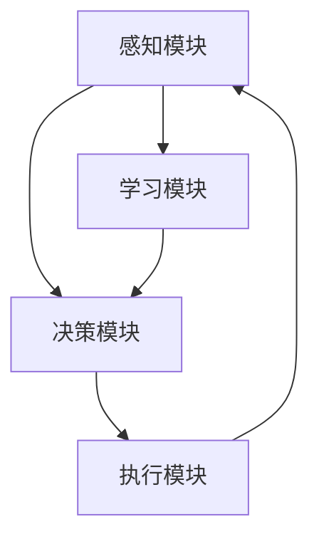

                 

### 文章标题

# AI Agent: AI的下一个风口 高度自动化带来生产力革命

### 关键词

- AI Agent
- 自动化
- 生产力
- 高度自动化
- 技术革命

### 摘要

本文深入探讨了AI Agent这一新兴概念，从基础理论到实际应用，全面解析了AI Agent的定义、分类、架构、核心特点、应用领域、开发环境搭建、核心算法原理、数学模型以及未来发展趋势。通过详实的案例分析和代码解读，展示了AI Agent在提高工作效率、降低运营成本、优化业务流程等方面的实际应用价值，最终展望了AI Agent在技术发展、行业应用和未来展望中的潜在影响。文章旨在为读者提供一个全面、深入、系统的理解，以把握AI Agent这一未来风口，迎接高度自动化的生产力革命。

### 引言

在人工智能（AI）飞速发展的今天，AI Agent作为AI领域的新星，正逐渐成为学术界和工业界的焦点。AI Agent，即人工智能代理，是一种能够模拟人类智能行为，具备自我决策和执行能力的智能系统。与传统的自动化系统不同，AI Agent具有自主学习、自适应和自主优化能力，能够在复杂环境中进行智能决策，从而实现高度自动化。

AI Agent的概念源于智能代理（Intelligent Agent）理论，该理论在人工智能和认知科学领域有着悠久的历史。智能代理被定义为具有感知、理解和行动能力，能够在特定环境中自主执行任务的实体。AI Agent则是在这一理论基础上，结合现代人工智能技术，特别是机器学习、深度学习和强化学习等算法，实现的具有高度智能化的代理系统。

AI Agent的重要性不仅体现在其技术含量上，更在于其能够带来的生产力革命。在工业、服务业、医疗等多个领域，AI Agent已经展现出强大的潜力，通过自动化、智能化手段，显著提高工作效率，降低运营成本，优化业务流程。随着技术的不断进步和应用的深入，AI Agent有望成为推动社会生产力发展的重要引擎。

本文将从以下几个方面展开论述：

1. **AI Agent概述**：介绍AI Agent的定义、分类和核心特点。
2. **AI Agent的架构与原理**：分析AI Agent的架构组成、核心算法和工作原理。
3. **AI Agent的应用领域**：探讨AI Agent在智能客服、自动驾驶和智能推荐系统等领域的应用。
4. **AI Agent的开发环境搭建**：介绍AI Agent的开发环境搭建过程和常用工具。
5. **AI Agent的核心算法原理**：讲解机器学习、深度学习和强化学习等核心算法原理。
6. **AI Agent的数学模型**：探讨决策论、马尔可夫决策过程和贝叶斯网络等数学模型。
7. **AI Agent的项目实战**：通过实际项目案例，展示AI Agent的开发和应用。
8. **AI Agent在生产力的提升**：分析AI Agent在提高工作效率、降低运营成本和优化业务流程方面的作用。
9. **AI Agent的未来发展趋势**：展望AI Agent的技术发展趋势和行业应用前景。
10. **AI Agent的挑战与未来**：探讨AI Agent面临的挑战和未来发展方向。

### 第一部分：AI Agent的基础

#### 第1章：AI Agent概述

##### 1.1 AI Agent的定义

AI Agent，即人工智能代理，是一种具备自我感知、理解和决策能力的智能系统。它能够根据环境反馈，通过自主学习、自适应和自主优化，实现特定任务的自动化执行。AI Agent的核心特征包括：

- **自主学习**：AI Agent能够从数据中学习，不断优化自身行为和策略。
- **自适应**：AI Agent能够根据环境变化，调整自身行为和策略，以适应新的情境。
- **自主决策**：AI Agent能够在复杂环境中，根据感知到的信息，自主做出决策。

AI Agent的概念源自智能代理（Intelligent Agent）理论。在人工智能和认知科学领域，智能代理被定义为具有感知、理解和行动能力的实体。AI Agent则是在这一理论基础上，结合现代人工智能技术，特别是机器学习、深度学习和强化学习等算法，实现的具有高度智能化的代理系统。

在现实世界中，AI Agent的应用场景十分广泛。例如，智能客服系统能够自动识别用户需求，提供针对性的服务；自动驾驶系统能够自主感知路况，实现安全驾驶；智能推荐系统能够根据用户行为，提供个性化的推荐。

##### 1.2 AI Agent的分类

AI Agent可以根据不同的标准进行分类，常见的分类方法包括：

- **按功能分类**：可以分为决策型AI Agent、执行型AI Agent和感知型AI Agent。决策型AI Agent主要负责决策和规划，执行型AI Agent负责实际任务的执行，感知型AI Agent负责感知环境信息。
- **按应用领域分类**：可以分为工业AI Agent、服务AI Agent、医疗AI Agent等。不同领域的AI Agent具有特定的应用场景和功能需求。
- **按学习方式分类**：可以分为基于规则的AI Agent、基于模型的AI Agent和基于数据的AI Agent。基于规则的AI Agent通过预定义的规则进行决策，基于模型的AI Agent通过构建模型进行决策，基于数据的AI Agent通过数据学习进行决策。

不同类型的AI Agent在架构、算法和应用场景上存在显著差异，但它们共同的目标是实现高度自动化和智能化。

##### 1.3 AI Agent的核心特点

AI Agent的核心特点包括以下几个方面：

- **自我感知**：AI Agent能够通过传感器等设备感知环境信息，包括视觉、听觉、触觉等。
- **自我学习**：AI Agent能够从数据中学习，不断优化自身行为和策略，提高任务执行效率。
- **自我决策**：AI Agent能够根据感知到的信息，自主做出决策，实现自主行动。
- **高度自动化**：AI Agent能够在无人干预的情况下，自主完成复杂任务，实现高度自动化。
- **自适应**：AI Agent能够根据环境变化，调整自身行为和策略，以适应新的情境。

这些特点使得AI Agent在众多领域具有广泛的应用前景，特别是在需要高精度、高效率和智能决策的场景中，AI Agent的优势更加明显。

##### 1.4 AI Agent的发展历史

AI Agent的发展历史可以追溯到20世纪50年代，当时计算机科学家和人工智能研究者开始探讨智能代理的概念。早期的智能代理主要是基于规则的系统，例如专家系统（Expert System）。专家系统通过预定义的规则库，实现对特定领域问题的求解。

随着人工智能技术的进步，20世纪80年代，机器学习开始被广泛应用于智能代理的开发。基于机器学习的AI Agent能够从数据中学习，提高任务执行能力。代表性的算法包括决策树、支持向量机等。

进入21世纪，深度学习和强化学习等先进算法的出现，进一步推动了AI Agent的发展。深度学习通过构建复杂的神经网络模型，实现了对大量数据的自动特征提取和学习。强化学习则通过不断试错和优化，实现了自主决策和策略优化。

近年来，随着计算能力的提升和数据量的爆炸式增长，AI Agent的应用场景越来越广泛，包括自动驾驶、智能客服、智能推荐、金融风控等多个领域。AI Agent正逐步从理论研究走向实际应用，成为人工智能领域的一个重要分支。

##### 1.5 AI Agent的关键技术

AI Agent的关键技术主要包括以下几个方面：

- **机器学习**：机器学习是AI Agent的核心技术之一，通过训练模型，实现数据的自动特征提取和学习。常见的机器学习算法包括决策树、支持向量机、神经网络等。
- **深度学习**：深度学习是机器学习的一个重要分支，通过多层神经网络，实现复杂特征的学习和提取。深度学习在图像识别、语音识别、自然语言处理等领域取得了显著成果。
- **强化学习**：强化学习是一种通过试错和反馈，实现自主决策和策略优化的算法。强化学习在自动驾驶、游戏AI等领域具有广泛应用。
- **自然语言处理**：自然语言处理（NLP）是一种使计算机能够理解、生成和响应自然语言的技术。NLP在智能客服、智能推荐等领域具有重要意义。
- **计算机视觉**：计算机视觉是一种使计算机能够“看到”和理解图像的技术。计算机视觉在自动驾驶、安防监控等领域具有广泛应用。

这些关键技术的结合，使得AI Agent能够在复杂环境中实现自主感知、学习和决策，实现高度自动化。

#### 1.6 AI Agent的优势与挑战

##### 1.6.1 AI Agent的优势

AI Agent具有以下优势：

- **高效性**：AI Agent能够通过自主学习，提高任务执行效率，减少人工干预。
- **准确性**：AI Agent能够通过数据驱动的方式，实现高精度的任务执行，减少人为错误。
- **适应性**：AI Agent能够根据环境变化，调整自身行为和策略，实现自适应。
- **降低成本**：AI Agent能够自动化完成大量重复性工作，减少人力成本。
- **拓展性**：AI Agent的架构和算法可以灵活扩展，适应不同的应用场景。

##### 1.6.2 AI Agent的挑战

尽管AI Agent具有显著优势，但其在实际应用中也面临一些挑战：

- **数据质量**：AI Agent的性能高度依赖于训练数据的质量和数量，数据质量问题可能导致模型性能下降。
- **安全性**：AI Agent在复杂环境中运行，可能面临安全威胁，如数据泄露、恶意攻击等。
- **解释性**：部分AI Agent的决策过程可能缺乏解释性，使得其行为难以被理解和信任。
- **技术依赖**：AI Agent的开发和应用高度依赖于先进的算法和计算资源，技术门槛较高。

为了克服这些挑战，需要不断优化算法、提升数据质量、增强安全性，并提高AI Agent的解释性。

#### 1.7 AI Agent的发展趋势

未来，AI Agent的发展将呈现以下趋势：

- **智能化**：随着人工智能技术的进步，AI Agent的智能化水平将不断提高，实现更复杂的任务。
- **泛在化**：AI Agent的应用将更加广泛，从工业、服务业到医疗、教育等多个领域。
- **协同化**：AI Agent将与其他智能系统（如物联网、大数据等）协同工作，实现更高效的智能化应用。
- **个性化**：AI Agent将根据用户需求，提供个性化的服务，满足不同用户的需求。
- **安全可控**：随着对AI Agent安全性的关注增加，将出现更多安全可控的AI Agent解决方案。

总之，AI Agent作为人工智能领域的重要分支，具有巨大的发展潜力，将在未来带来一场生产力革命。

### 第2章：AI Agent的架构与原理

AI Agent的架构是理解和应用AI Agent的核心。本章节将详细介绍AI Agent的架构组成、核心算法以及工作原理，帮助读者全面了解AI Agent的运作机制。

#### 2.1 AI Agent的架构概述

AI Agent的架构通常由以下几个关键部分组成：

- **感知模块**：负责接收外部环境的信息，如视觉、听觉、触觉等。
- **决策模块**：根据感知模块获取的信息，结合自身知识库和算法，做出决策。
- **执行模块**：根据决策模块的决策结果，执行具体的任务或动作。
- **学习模块**：通过持续学习，不断优化自身的行为和决策能力。

这四个模块相互协作，共同实现AI Agent的智能行为。

#### 2.2 AI Agent的核心算法

AI Agent的核心算法是实现其智能行为的关键。以下是几种常用的核心算法：

- **机器学习算法**：包括线性回归、决策树、支持向量机等，用于从数据中学习规律和模式。
- **深度学习算法**：包括卷积神经网络（CNN）、循环神经网络（RNN）、生成对抗网络（GAN）等，用于处理复杂数据和特征。
- **强化学习算法**：包括Q-learning、深度Q网络（DQN）、策略梯度等，用于通过试错和反馈进行决策和策略优化。
- **自然语言处理算法**：包括词向量、文本分类、机器翻译等，用于处理和生成自然语言。

这些算法在AI Agent的不同模块中发挥着重要作用，共同实现AI Agent的智能行为。

#### 2.3 AI Agent的工作原理

AI Agent的工作原理可以分为以下几个步骤：

1. **感知**：感知模块接收外部环境的信息，如图像、声音、文本等。
2. **处理**：决策模块对感知到的信息进行处理和分析，结合自身知识库和算法，生成可能的决策选项。
3. **决策**：决策模块根据处理结果，选择最优决策选项，生成执行计划。
4. **执行**：执行模块根据决策结果，执行具体的任务或动作，如移动、交互、生成文本等。
5. **反馈**：执行模块将执行结果反馈给感知模块和学习模块，用于后续的感知、处理和学习。

通过这样的循环过程，AI Agent能够不断优化自身的行为，实现自主学习和自主决策。

#### 2.4 AI Agent的核心架构 Mermaid 流程图

为了更直观地理解AI Agent的架构和工作原理，我们可以使用Mermaid语言绘制一个流程图：



这个流程图展示了AI Agent的基本架构和工作流程，包括感知、决策、执行和学习四个关键环节。

#### 2.5 AI Agent的核心算法原理讲解

在本节中，我们将详细介绍AI Agent中使用的主要算法原理，包括机器学习、深度学习和强化学习等。

##### 2.5.1 机器学习算法原理

机器学习算法的核心思想是通过训练模型，从数据中学习规律和模式，从而实现对未知数据的预测或分类。以下是几种常见的机器学习算法原理：

- **线性回归**：线性回归是一种通过建立线性关系模型，预测数值型目标的方法。其公式为：
  $$ y = wx + b $$
  其中，$y$ 为目标值，$x$ 为输入特征，$w$ 和 $b$ 分别为权重和偏置。

- **决策树**：决策树是一种基于特征划分的数据挖掘方法，通过一系列条件判断，将数据集划分为不同的子集。决策树的核心是节点和叶子，节点表示特征划分，叶子表示预测结果。

- **支持向量机（SVM）**：支持向量机是一种基于最大间隔分类的方法，其目标是找到一个最优的超平面，将不同类别的数据点最大化地分开。SVM的核心公式为：
  $$ \max_{w,b} \frac{1}{2} ||w||^2 $$
  其中，$w$ 为权重向量，$b$ 为偏置。

- **神经网络**：神经网络是一种基于生物神经元工作原理的模型，通过多层神经元之间的连接和激活函数，实现复杂数据的特征提取和分类。神经网络的计算过程可以表示为：
  $$ z = \sigma(\mathbf{W} \cdot \mathbf{x} + b) $$
  其中，$\sigma$ 为激活函数，$\mathbf{W}$ 和 $\mathbf{b}$ 分别为权重和偏置。

##### 2.5.2 深度学习算法原理

深度学习算法是机器学习的一个分支，通过多层神经网络，实现复杂数据的特征提取和学习。以下是几种常见的深度学习算法原理：

- **卷积神经网络（CNN）**：卷积神经网络是一种专门用于处理图像数据的神经网络，通过卷积操作和池化操作，实现图像的特征提取和分类。CNN的计算过程可以表示为：
  $$ \mathbf{h}^{(l)} = \sigma(\mathbf{W}^{(l)} \mathbf{h}^{(l-1)} + \mathbf{b}^{(l)}) $$
  其中，$\mathbf{h}^{(l)}$ 为第 $l$ 层的输出，$\mathbf{W}^{(l)}$ 和 $\mathbf{b}^{(l)}$ 分别为第 $l$ 层的权重和偏置。

- **循环神经网络（RNN）**：循环神经网络是一种用于处理序列数据的神经网络，通过循环结构，实现长期依赖关系的建模。RNN的计算过程可以表示为：
  $$ \mathbf{h}^{(t)} = \sigma(\mathbf{W} \mathbf{h}^{(t-1)} + \mathbf{U} \mathbf{x}^{(t)} + \mathbf{b}) $$
  其中，$\mathbf{h}^{(t)}$ 为当前时刻的隐藏状态，$\mathbf{x}^{(t)}$ 为当前时刻的输入，$\mathbf{W}$、$\mathbf{U}$ 和 $\mathbf{b}$ 分别为权重和偏置。

- **生成对抗网络（GAN）**：生成对抗网络是一种由生成器和判别器组成的神经网络，通过对抗训练，实现高质量的数据生成。GAN的核心公式为：
  $$ \mathbf{G}(\mathbf{z}) \sim p_{\mathbf{G}}(\mathbf{z}) $$
  $$ \mathbf{D}(\mathbf{x}, \mathbf{G}(\mathbf{z})) \sim p_{\mathbf{D}}(\mathbf{x}) $$
  其中，$\mathbf{G}(\mathbf{z})$ 为生成器生成的数据，$\mathbf{D}(\mathbf{x}, \mathbf{G}(\mathbf{z}))$ 为判别器对真实数据和生成数据的判别结果。

##### 2.5.3 强化学习算法原理

强化学习算法是一种通过试错和反馈进行决策和策略优化的算法，其核心思想是通过奖励信号，不断调整策略，实现最优决策。以下是几种常见的强化学习算法原理：

- **Q-learning**：Q-learning是一种基于值函数的强化学习算法，通过更新值函数，实现策略优化。Q-learning的核心公式为：
  $$ Q^{(t+1)}(\mathbf{s}, \mathbf{a}) = \mathbf{r} + \gamma \max_{\mathbf{a'}} Q^{(t)}(\mathbf{s'}, \mathbf{a'}) $$
  其中，$\mathbf{s}$ 为当前状态，$\mathbf{a}$ 为当前动作，$\mathbf{s'}$ 为下一状态，$\mathbf{r}$ 为奖励信号，$\gamma$ 为折扣因子。

- **深度Q网络（DQN）**：深度Q网络是一种基于深度学习的强化学习算法，通过训练神经网络，预测状态-动作值函数。DQN的核心公式为：
  $$ Q^{(t+1)}(\mathbf{s}, \mathbf{a}) = \mathbf{r} + \gamma \max_{\mathbf{a'}} \mathbf{Q}^{(t)}(\mathbf{s'}, \mathbf{a'}) $$
  其中，$\mathbf{Q}^{(t)}(\mathbf{s'}, \mathbf{a'})$ 为预测的Q值。

- **策略梯度**：策略梯度是一种基于策略优化的强化学习算法，通过梯度下降方法，更新策略参数，实现策略优化。策略梯度的核心公式为：
  $$ \nabla_{\theta} J(\theta) = \nabla_{\theta} \sum_{t} \rho(\theta) \log \pi(\mathbf{a}|\mathbf{s}) $$
  其中，$\theta$ 为策略参数，$J(\theta)$ 为策略损失函数，$\rho(\theta)$ 为奖励函数，$\pi(\mathbf{a}|\mathbf{s})$ 为策略分布。

通过这些核心算法原理，AI Agent能够实现智能感知、决策和执行，实现高度自动化和智能化的任务处理。

#### 2.6 AI Agent的数学模型

在AI Agent的设计和应用中，数学模型起着至关重要的作用。这些模型不仅帮助AI Agent理解和处理复杂问题，还为AI Agent提供了理论基础和工具。以下是几种常见的数学模型：

##### 2.6.1 决策论基础

决策论是一种用于处理不确定性和风险的理论，其核心是概率论和优化理论。决策论的基础包括以下几个概念：

- **状态**：状态是指系统所处的条件或环境。
- **动作**：动作是指系统能够执行的行为或决策。
- **结果**：结果是指执行动作后系统所处的状态。
- **概率**：概率是指结果发生的可能性。
- **期望**：期望是指结果的加权平均值，反映了结果的平均效果。

在决策论中，常用的数学模型包括马尔可夫决策过程（MDP）和贝叶斯网络。

##### 2.6.2 马尔可夫决策过程（MDP）

马尔可夫决策过程是一种用于描述具有不确定性和奖励的决策问题的数学模型。MDP的主要组成部分包括：

- **状态空间**：状态空间是指系统可能所处的所有状态集合。
- **动作空间**：动作空间是指系统可以执行的所有动作集合。
- **状态转移概率**：状态转移概率是指系统在某一状态下执行某一动作，转移到另一状态的概率。
- **奖励函数**：奖励函数是指系统执行某一动作后获得的奖励。

MDP的核心公式是贝尔曼方程（Bellman Equation），用于求解最优策略。贝尔曼方程如下：

$$ V(s) = \max_{a} [r(s, a) + \gamma \sum_{s'} p(s'|s, a) V(s')] $$

其中，$V(s)$ 是状态值函数，$r(s, a)$ 是奖励函数，$\gamma$ 是折扣因子，$p(s'|s, a)$ 是状态转移概率。

##### 2.6.3 贝叶斯网络

贝叶斯网络是一种基于概率论和图论的数学模型，用于表示变量之间的依赖关系。贝叶斯网络的组成部分包括：

- **节点**：节点表示变量。
- **边**：边表示变量之间的依赖关系。
- **概率分布**：每个节点对应一个概率分布，描述变量取值的概率。

贝叶斯网络的核心公式是贝叶斯定理，用于计算变量之间的条件概率。贝叶斯定理如下：

$$ P(A|B) = \frac{P(B|A)P(A)}{P(B)} $$

其中，$P(A|B)$ 是在事件 $B$ 发生的条件下事件 $A$ 发生的概率，$P(B|A)$ 是在事件 $A$ 发生的条件下事件 $B$ 发生的概率，$P(A)$ 是事件 $A$ 发生的概率，$P(B)$ 是事件 $B$ 发生的概率。

通过这些数学模型，AI Agent能够更好地理解和处理复杂问题，实现高效的决策和优化。

#### 2.7 AI Agent的核心算法原理讲解

在本节中，我们将进一步详细讲解AI Agent中使用的主要算法原理，包括机器学习、深度学习和强化学习等，并通过伪代码和示例，深入剖析这些算法的核心思想和实现过程。

##### 2.7.1 机器学习算法原理讲解

机器学习算法是AI Agent的基础，以下是一些常见的机器学习算法及其原理：

- **线性回归**：线性回归是一种简单的机器学习算法，用于预测数值型目标。其基本原理是通过建立线性关系模型，对数据进行拟合。

  ```python
  # 线性回归伪代码
  def linear_regression(X, y):
      # 计算权重和偏置
      w = (X.T @ X)^(-1) @ X.T @ y
      b = y - X @ w
      
      # 预测函数
      def predict(x):
          return x @ w + b
      
      return predict
  ```

  示例：假设我们有一个简单的数据集，其中输入特征 $X$ 是二维的，目标值 $y$ 是一维的。通过训练，我们可以得到线性回归模型，并使用该模型对新数据进行预测。

- **决策树**：决策树是一种基于特征划分的机器学习算法，通过一系列条件判断，将数据集划分为不同的子集。

  ```python
  # 决策树伪代码
  def decision_tree(X, y, features):
      # 基准条件：达到最大叶结点数或叶结点纯度
      if len(X) <= 1 or all(y == y[0]):
          return y[0]
      
      # 找到最佳划分特征和阈值
      best_feature, best_threshold = find_best_split(X, y, features)
      
      # 构建子树
      tree = {best_feature: {}}
      for threshold in best_threshold:
          X_left, y_left = filter(X, y, best_feature, threshold < 0)
          X_right, y_right = filter(X, y, best_feature, threshold >= 0)
          tree[best_feature][threshold] = [decision_tree(X_left, y_left, features), decision_tree(X_right, y_right, features)]
      
      return tree
  ```

  示例：假设我们有一个包含多个特征的数据集，通过决策树算法，我们可以构建一棵决策树，用于分类或回归任务。

- **支持向量机（SVM）**：支持向量机是一种基于最大间隔分类的机器学习算法，通过寻找最优的超平面，将不同类别的数据点最大化地分开。

  ```python
  # SVM伪代码
  def svm(X, y):
      # 解线性方程组，找到最优超平面
      w, b = solve_linear_equation(X, y)
      
      # 分类函数
      def classify(x):
          return sign(x @ w + b)
      
      return classify
  ```

  示例：假设我们有一个包含多个特征的数据集，通过SVM算法，我们可以找到一个最优超平面，并使用该超平面进行分类。

##### 2.7.2 深度学习算法原理讲解

深度学习算法是机器学习的一个重要分支，通过多层神经网络，实现复杂数据的特征提取和学习。以下是一些常见的深度学习算法及其原理：

- **卷积神经网络（CNN）**：卷积神经网络是一种专门用于处理图像数据的神经网络，通过卷积操作和池化操作，实现图像的特征提取和分类。

  ```python
  # CNN伪代码
  def conv2d(x, W):
      # 计算卷积操作
      return (x * W).sum(axis=1)

  def max_pool(x, pool_size):
      # 计算最大池化操作
      return x[:, ::pool_size, ::pool_size].max(axis=1)

  def cnn(x, W1, W2, pool_size):
      # 第一层卷积和池化
      h1 = conv2d(x, W1)
      h1 = max_pool(h1, pool_size)
      
      # 第二层卷积和池化
      h2 = conv2d(h1, W2)
      h2 = max_pool(h2, pool_size)
      
      return h2
  ```

  示例：假设我们有一个图像数据集，通过CNN算法，我们可以提取图像的深层特征，并使用这些特征进行分类。

- **循环神经网络（RNN）**：循环神经网络是一种用于处理序列数据的神经网络，通过循环结构，实现长期依赖关系的建模。

  ```python
  # RNN伪代码
  def rnn(h, x, W_hh, W_xh, b_hh, b_xh):
      # 计算隐藏状态
      h = tanh((W_hh * h) + (W_xh * x) + b_hh)
      
      # 计算输出
      y = (W_hh * h) + b_xh
      
      return h, y
  ```

  示例：假设我们有一个序列数据集，通过RNN算法，我们可以建模序列中的长期依赖关系，并使用该模型进行序列预测。

- **生成对抗网络（GAN）**：生成对抗网络是一种由生成器和判别器组成的神经网络，通过对抗训练，实现高质量的数据生成。

  ```python
  # GAN伪代码
  def generator(z, W_gz, b_gz):
      # 生成器生成数据
      x = tanh((W_gz * z) + b_gz)
      
      return x

  def discriminator(x, W_dz, b_dz):
      # 判别器判断数据真实性
      y = (W_dz * x) + b_dz
      
      return y
  ```

  示例：假设我们有一个生成对抗网络，通过训练，生成器可以生成高质量的数据，判别器可以判断数据真实性。

##### 2.7.3 强化学习算法原理讲解

强化学习算法是一种通过试错和反馈进行决策和策略优化的算法。以下是一些常见的强化学习算法及其原理：

- **Q-learning**：Q-learning是一种基于值函数的强化学习算法，通过更新值函数，实现策略优化。

  ```python
  # Q-learning伪代码
  def q_learning(env, Q, alpha, gamma):
      for episode in range(num_episodes):
          state = env.reset()
          done = False
          
          while not done:
              action = argmax(Q[state])
              next_state, reward, done = env.step(action)
              
              # 更新Q值
              Q[state][action] = Q[state][action] + alpha * (reward + gamma * max(Q[next_state]) - Q[state][action])
              
              state = next_state
      
      return Q
  ```

  示例：假设我们有一个环境，通过Q-learning算法，我们可以学习到最优策略，并使用该策略进行环境交互。

- **深度Q网络（DQN）**：深度Q网络是一种基于深度学习的强化学习算法，通过训练神经网络，预测状态-动作值函数。

  ```python
  # DQN伪代码
  def dqn(env, Q_network, target_Q_network, optimizer, alpha, gamma, epsilon):
      for episode in range(num_episodes):
          state = env.reset()
          done = False
          
          while not done:
              action = epsilon_greedy(Q_network(state), epsilon)
              next_state, reward, done = env.step(action)
              
              # 更新目标Q值
              target_Q = reward + (1 - done) * gamma * target_Q_network(next_state).max()
              
              # 更新当前Q值
              Q_loss = loss(Q_network(state), tensor([target_Q]))
              
              # 更新网络参数
              optimizer.zero_grad()
              Q_loss.backward()
              optimizer.step()
              
              state = next_state
      
      return Q_network
  ```

  示例：假设我们有一个环境和一个深度Q网络，通过训练，我们可以学习到最优策略，并使用该策略进行环境交互。

- **策略梯度**：策略梯度是一种基于策略优化的强化学习算法，通过梯度下降方法，更新策略参数，实现策略优化。

  ```python
  # 策略梯度伪代码
  def policy_gradient(env, policy, optimizer, alpha):
      for episode in range(num_episodes):
          state = env.reset()
          done = False
          
          while not done:
              action = policy(state)
              next_state, reward, done = env.step(action)
              
              # 计算策略梯度
              policy_loss = -log(policy(state)) * reward
              
              # 更新策略参数
              optimizer.zero_grad()
              policy_loss.backward()
              optimizer.step()
              
              state = next_state
      
      return policy
  ```

  示例：假设我们有一个环境和策略模型，通过策略梯度算法，我们可以学习到最优策略，并使用该策略进行环境交互。

通过这些核心算法原理的讲解和示例，我们可以更深入地理解AI Agent的工作机制，为后续的实际应用打下坚实基础。

### 第3章：AI Agent的应用领域

AI Agent的应用领域非常广泛，涵盖了从工业自动化到服务业，再到医疗和教育的各个方面。在本章中，我们将探讨AI Agent在智能客服、自动驾驶、智能推荐系统等领域的具体应用，通过实际案例展示AI Agent如何在这些领域中发挥作用。

#### 3.1 AI Agent在智能客服中的应用

智能客服是AI Agent的一个重要应用领域，通过自动化和智能化的手段，提供高效、精准的客户服务。智能客服系统通常包括自然语言处理、语音识别、聊天机器人等技术，能够实现24小时不间断的客户支持。

**案例：某大型电商平台智能客服系统**

某大型电商平台引入了一套基于AI Agent的智能客服系统，该系统能够自动解答用户的问题，提供购买建议，处理订单问题等。其工作流程如下：

1. **感知阶段**：用户通过文字或语音与客服系统交互，客服系统通过自然语言处理技术解析用户请求。
2. **决策阶段**：客服系统根据解析结果，结合知识库和预定义的规则，生成可能的回复选项。
3. **执行阶段**：系统选择最佳回复选项，生成文字或语音回复，发送给用户。
4. **反馈阶段**：用户对回复进行反馈，系统根据反馈调整和优化自身行为。

通过这种方式，智能客服系统能够在短时间内处理大量客户请求，提高响应速度和服务质量。同时，通过不断学习用户反馈，客服系统不断优化自身性能，提高用户体验。

**代码案例：智能客服系统聊天机器人**

以下是一个简单的智能客服系统聊天机器人的代码实现：

```python
import random

class Chatbot:
    def __init__(self, knowledge_base):
        self.knowledge_base = knowledge_base
    
    def respond(self, message):
        if "hello" in message.lower():
            return "Hello! How can I help you today?"
        elif "order" in message.lower():
            return "Sure, let me check your order status."
        else:
            return "I'm not sure how to help with that. Can you try rephrasing your question?"

knowledge_base = ["Hello", "How can I help you?", "What can I do for you?", "Thank you for reaching out."]

chatbot = Chatbot(knowledge_base)

user_message = input("User: ")
print(f"Chatbot: {chatbot.respond(user_message)}")
```

这个简单的聊天机器人使用预定义的规则库，通过自然语言处理技术，实现对用户请求的解析和响应。

#### 3.2 AI Agent在自动驾驶中的应用

自动驾驶是AI Agent在工业领域的重要应用之一，通过自动化驾驶技术，实现无人驾驶车辆的运行。自动驾驶系统通常包括感知、决策、控制和路径规划等模块，AI Agent在其中起着核心作用。

**案例：某自动驾驶汽车公司**

某自动驾驶汽车公司开发了一套基于AI Agent的自动驾驶系统，该系统能够在复杂城市环境中实现安全、高效的驾驶。其工作流程如下：

1. **感知阶段**：车辆通过摄像头、激光雷达、超声波传感器等设备，实时感知周围环境。
2. **决策阶段**：AI Agent根据感知到的信息，结合路径规划和控制算法，生成驾驶决策。
3. **执行阶段**：车辆控制系统根据决策，执行具体的驾驶动作，如加速、减速、转向等。
4. **反馈阶段**：车辆将执行结果反馈给AI Agent，用于后续的感知、决策和优化。

通过这种方式，自动驾驶系统能够在复杂环境中实现高度自动化的驾驶，提高驾驶安全性和效率。同时，通过不断学习和优化，自动驾驶系统的性能不断提高。

**代码案例：自动驾驶系统决策模块**

以下是一个简单的自动驾驶系统决策模块的代码实现：

```python
import numpy as np

class AutonomousVehicle:
    def __init__(self, state):
        self.state = state
    
    def make_decision(self, state):
        # 根据状态信息，生成驾驶决策
        speed = 0
        direction = 0
        
        if "stop" in state:
            speed = 0
            direction = 0
        elif "forward" in state:
            speed = 20
            direction = 0
        elif "turn_left" in state:
            speed = 20
            direction = -30
        elif "turn_right" in state:
            speed = 20
            direction = 30
        
        return speed, direction

state = "turn_right"
vehicle = AutonomousVehicle(state)
speed, direction = vehicle.make_decision(state)
print(f"Speed: {speed} km/h, Direction: {direction} degrees")
```

这个简单的自动驾驶系统决策模块根据当前状态，生成相应的驾驶决策。

#### 3.3 AI Agent在智能推荐系统中的应用

智能推荐系统是AI Agent在服务业的重要应用之一，通过个性化推荐技术，提高用户满意度和忠诚度。智能推荐系统通常包括用户行为分析、兴趣建模和推荐算法等模块，AI Agent在其中起着核心作用。

**案例：某电子商务平台智能推荐系统**

某电子商务平台引入了一套基于AI Agent的智能推荐系统，该系统能够根据用户的历史行为和兴趣，实时推荐相关的商品和活动。其工作流程如下：

1. **感知阶段**：系统实时收集用户在平台上的行为数据，如浏览、购买、搜索等。
2. **决策阶段**：AI Agent根据用户行为数据，结合用户兴趣模型和推荐算法，生成个性化推荐列表。
3. **执行阶段**：系统将推荐列表展示给用户，吸引用户点击和购买。
4. **反馈阶段**：用户对推荐结果进行反馈，系统根据反馈调整和优化推荐策略。

通过这种方式，智能推荐系统能够在提高用户满意度的同时，提升平台的销售业绩。同时，通过不断学习和优化，推荐系统的效果不断提高。

**代码案例：智能推荐系统算法模块**

以下是一个简单的智能推荐系统算法模块的代码实现：

```python
import numpy as np

class Recommender:
    def __init__(self, user_matrix, item_matrix):
        self.user_matrix = user_matrix
        self.item_matrix = item_matrix
    
    def predict(self, user_index, item_index):
        # 预测用户对物品的评分
        user_profile = self.user_matrix[user_index]
        item_profile = self.item_matrix[item_index]
        prediction = np.dot(user_profile, item_profile)
        
        return prediction

user_matrix = np.array([[1, 0, 1, 0], [0, 1, 0, 1], [1, 1, 0, 0]])
item_matrix = np.array([[1, 0, 1], [0, 1, 1], [1, 1, 0]])
recommender = Recommender(user_matrix, item_matrix)

user_index = 0
item_index = 2
prediction = recommender.predict(user_index, item_index)
print(f"Prediction: {prediction}")
```

这个简单的智能推荐系统算法模块根据用户和物品的评分矩阵，预测用户对物品的评分。

#### 3.4 AI Agent在其他领域中的应用

除了智能客服、自动驾驶和智能推荐系统，AI Agent还在许多其他领域展示了其强大的应用潜力：

- **医疗**：AI Agent能够辅助医生进行诊断和治疗，提高医疗服务的质量和效率。
- **金融**：AI Agent能够用于风险管理、欺诈检测和投资决策，提高金融服务的准确性和效率。
- **教育**：AI Agent能够提供个性化学习体验，帮助学生提高学习效果。
- **物流**：AI Agent能够优化物流路径和调度，提高物流效率和服务质量。

总之，AI Agent作为一种高度自动化和智能化的系统，在各个领域都展现了其巨大的应用潜力，为人们的生活和工作带来了深刻变革。

### 第4章：AI Agent的开发环境搭建

要开发AI Agent，首先需要搭建一个稳定且高效的开发环境。本章将介绍如何准备开发环境、选择合适的开发工具以及配置和调试这些工具，确保开发过程顺利进行。

#### 4.1 开发环境的准备

搭建AI Agent开发环境，首先需要选择合适的操作系统和硬件设备。以下是推荐的配置：

- **操作系统**：Windows、macOS 或 Linux 都是常用的操作系统，其中 Linux 拥有更好的开源生态和性能优化，是开发AI Agent的理想选择。
- **硬件设备**：根据项目需求和计算量，可以选择笔记本电脑或服务器。对于大规模数据训练和复杂模型推理，推荐使用具有多核CPU和GPU的服务器。

#### 4.2 常用开发工具介绍

在搭建开发环境时，选择合适的开发工具至关重要。以下是一些常用的开发工具：

- **编程语言**：Python 是目前最受欢迎的AI开发语言之一，其丰富的库和框架使得AI Agent的开发变得更加高效。
- **集成开发环境（IDE）**：PyCharm、VSCode 等IDE提供了丰富的编程功能和调试工具，非常适合AI Agent的开发。
- **版本控制**：Git是一个常用的版本控制系统，用于管理代码的版本和历史。
- **数据库**：SQLite、MySQL 等数据库用于存储AI Agent的模型和训练数据。
- **容器化技术**：Docker 和 Kubernetes 用于容器化AI Agent的应用，实现快速部署和扩展。

#### 4.3 开发环境的配置与调试

搭建好开发环境后，需要进行一系列配置和调试，以确保所有工具和组件能够正常工作。

1. **安装Python和相关库**：
   ```bash
   pip install numpy scipy matplotlib
   pip install tensorflow keras
   pip install scikit-learn pandas
   ```

2. **配置IDE**：
   在PyCharm或VSCode中，配置Python解释器和相关库，确保能够正确导入和使用。

3. **配置数据库**：
   安装并配置SQLite或MySQL数据库，用于存储训练数据和模型。

4. **容器化AI Agent应用**：
   使用Docker将AI Agent应用容器化，编写Dockerfile，定义应用的依赖和运行环境。

   ```Dockerfile
   FROM python:3.8
   RUN pip install tensorflow
   COPY . /app
   WORKDIR /app
   CMD ["python", "agent.py"]
   ```

5. **调试环境**：
   使用IDE的调试工具，逐步调试和测试AI Agent的代码，确保其正常运行。

#### 4.4 开发环境常见问题及解决方法

在搭建开发环境过程中，可能会遇到以下问题：

- **库安装失败**：确保网络连接正常，使用国内镜像源加速下载。
- **IDE配置错误**：检查IDE的配置，确保Python解释器和库路径正确。
- **数据库连接失败**：检查数据库服务是否启动，确保连接信息正确。

通过以上步骤，我们可以搭建一个高效的AI Agent开发环境，为后续的项目开发提供坚实保障。

### 第5章：AI Agent的核心算法原理

AI Agent的核心算法是实现其智能化功能的关键。本章将详细介绍几种核心算法，包括机器学习、深度学习和强化学习，以及它们的原理和实现方法。

#### 5.1 机器学习算法原理

机器学习（Machine Learning，ML）是AI Agent的基础，其核心思想是通过训练模型，从数据中学习规律和模式，从而实现预测和分类。以下是几种常见的机器学习算法及其原理：

- **线性回归（Linear Regression）**：线性回归是一种简单且常见的机器学习算法，用于预测数值型目标。其基本原理是通过建立线性关系模型，对数据进行拟合。线性回归模型可以表示为：
  $$ y = wx + b $$
  其中，$y$ 为目标值，$x$ 为输入特征，$w$ 和 $b$ 分别为权重和偏置。通过最小化损失函数（如平方误差），可以求得最优的权重和偏置。

  **伪代码实现**：
  ```python
  # 线性回归伪代码
  def linear_regression(X, y):
      # 计算权重和偏置
      w = (X.T @ X)^(-1) @ X.T @ y
      b = y - X @ w
      
      # 预测函数
      def predict(x):
          return x @ w + b
      
      return predict
  ```

- **决策树（Decision Tree）**：决策树是一种基于特征划分的算法，通过一系列条件判断，将数据集划分为不同的子集。决策树的核心是节点和叶子，节点表示特征划分，叶子表示预测结果。决策树的构建过程包括选择最佳划分特征、计算特征划分的阈值，以及递归地构建子树。

  **伪代码实现**：
  ```python
  # 决策树伪代码
  def decision_tree(X, y, features):
      # 基准条件：达到最大叶结点数或叶结点纯度
      if len(X) <= 1 or all(y == y[0]):
          return y[0]
      
      # 找到最佳划分特征和阈值
      best_feature, best_threshold = find_best_split(X, y, features)
      
      # 构建子树
      tree = {best_feature: {}}
      for threshold in best_threshold:
          X_left, y_left = filter(X, y, best_feature, threshold < 0)
          X_right, y_right = filter(X, y, best_feature, threshold >= 0)
          tree[best_feature][threshold] = [decision_tree(X_left, y_left, features), decision_tree(X_right, y_right, features)]
      
      return tree
  ```

- **支持向量机（Support Vector Machine，SVM）**：支持向量机是一种基于最大间隔分类的方法，其目标是找到一个最优的超平面，将不同类别的数据点最大化地分开。SVM通过求解二次规划问题，求得最优的超平面参数。

  **伪代码实现**：
  ```python
  # SVM伪代码
  def svm(X, y):
      # 解线性方程组，找到最优超平面
      w, b = solve_linear_equation(X, y)
      
      # 分类函数
      def classify(x):
          return sign(x @ w + b)
      
      return classify
  ```

- **神经网络（Neural Network）**：神经网络是一种模拟生物神经元工作的算法，通过多层神经元之间的连接和激活函数，实现复杂数据的特征提取和分类。神经网络的计算过程可以表示为：
  $$ z = \sigma(\mathbf{W} \cdot \mathbf{x} + b) $$
  其中，$\sigma$ 为激活函数，$\mathbf{W}$ 和 $\mathbf{b}$ 分别为权重和偏置。

  **伪代码实现**：
  ```python
  # 神经网络伪代码
  def forward_pass(x, W, b):
      z = x @ W + b
      a = sigmoid(z)
      return a

  def backward_pass(a, z, d):
      d_z = d * (1 - a)
      d_w = a.T @ d_z
      d_b = d_z.sum(axis=0)
      return d_w, d_b

  def train(X, y, W, b, learning_rate):
      for epoch in range(num_epochs):
          for x, y in zip(X, y):
              a = forward_pass(x, W, b)
              z = x @ W + b
              d_w, d_b = backward_pass(a, z, y - a)
              W -= learning_rate * d_w
              b -= learning_rate * d_b
  ```

#### 5.2 深度学习算法原理

深度学习（Deep Learning，DL）是机器学习的一个分支，通过多层神经网络，实现复杂数据的特征提取和学习。以下是几种常见的深度学习算法及其原理：

- **卷积神经网络（Convolutional Neural Network，CNN）**：卷积神经网络是一种专门用于处理图像数据的神经网络，通过卷积操作和池化操作，实现图像的特征提取和分类。CNN的核心组件包括卷积层、池化层和全连接层。

  **伪代码实现**：
  ```python
  # CNN伪代码
  def conv2d(x, W):
      # 计算卷积操作
      return (x * W).sum(axis=1)

  def max_pool(x, pool_size):
      # 计算最大池化操作
      return x[:, ::pool_size, ::pool_size].max(axis=1)

  def cnn(x, W1, W2, pool_size):
      # 第一层卷积和池化
      h1 = conv2d(x, W1)
      h1 = max_pool(h1, pool_size)
      
      # 第二层卷积和池化
      h2 = conv2d(h1, W2)
      h2 = max_pool(h2, pool_size)
      
      return h2
  ```

- **循环神经网络（Recurrent Neural Network，RNN）**：循环神经网络是一种用于处理序列数据的神经网络，通过循环结构，实现长期依赖关系的建模。RNN的核心组件包括输入层、隐藏层和输出层。

  **伪代码实现**：
  ```python
  # RNN伪代码
  def rnn(h, x, W_hh, W_xh, b_hh, b_xh):
      # 计算隐藏状态
      h = tanh((W_hh * h) + (W_xh * x) + b_hh)
      
      # 计算输出
      y = (W_hh * h) + b_xh
      
      return h, y
  ```

- **生成对抗网络（Generative Adversarial Network，GAN）**：生成对抗网络是一种由生成器和判别器组成的神经网络，通过对抗训练，实现高质量的数据生成。GAN的核心组件包括生成器和判别器。

  **伪代码实现**：
  ```python
  # GAN伪代码
  def generator(z, W_gz, b_gz):
      # 生成器生成数据
      x = tanh((W_gz * z) + b_gz)
      
      return x

  def discriminator(x, W_dz, b_dz):
      # 判别器判断数据真实性
      y = (W_dz * x) + b_dz
      
      return y
  ```

#### 5.3 强化学习算法原理

强化学习（Reinforcement Learning，RL）是一种通过试错和反馈进行决策和策略优化的算法。强化学习的核心组件包括环境、代理和奖励机制。

- **Q-learning**：Q-learning是一种基于值函数的强化学习算法，通过更新值函数，实现策略优化。Q-learning的基本思想是通过试错，不断更新状态-动作值函数，直到收敛。

  **伪代码实现**：
  ```python
  # Q-learning伪代码
  def q_learning(env, Q, alpha, gamma):
      for episode in range(num_episodes):
          state = env.reset()
          done = False
          
          while not done:
              action = argmax(Q[state])
              next_state, reward, done = env.step(action)
              
              # 更新Q值
              Q[state][action] = Q[state][action] + alpha * (reward + gamma * max(Q[next_state]) - Q[state][action])
              
              state = next_state
      
      return Q
  ```

- **深度Q网络（Deep Q-Network，DQN）**：深度Q网络是一种基于深度学习的强化学习算法，通过训练神经网络，预测状态-动作值函数。DQN的核心思想是使用经验回放和目标网络，避免策略偏差。

  **伪代码实现**：
  ```python
  # DQN伪代码
  def dqn(env, Q_network, target_Q_network, optimizer, alpha, gamma, epsilon):
      for episode in range(num_episodes):
          state = env.reset()
          done = False
          
          while not done:
              action = epsilon_greedy(Q_network(state), epsilon)
              next_state, reward, done = env.step(action)
              
              # 更新目标Q值
              target_Q = reward + (1 - done) * gamma * target_Q_network(next_state).max()
              
              # 更新当前Q值
              Q_loss = loss(Q_network(state), tensor([target_Q]))
              
              # 更新网络参数
              optimizer.zero_grad()
              Q_loss.backward()
              optimizer.step()
              
              state = next_state
      
      return Q_network
  ```

- **策略梯度（Policy Gradient）**：策略梯度是一种基于策略优化的强化学习算法，通过梯度下降方法，更新策略参数，实现策略优化。策略梯度算法的核心思想是通过优化策略参数，最大化预期奖励。

  **伪代码实现**：
  ```python
  # 策略梯度伪代码
  def policy_gradient(env, policy, optimizer, alpha):
      for episode in range(num_episodes):
          state = env.reset()
          done = False
          
          while not done:
              action = policy(state)
              next_state, reward, done = env.step(action)
              
              # 计算策略梯度
              policy_loss = -log(policy(state)) * reward
              
              # 更新策略参数
              optimizer.zero_grad()
              policy_loss.backward()
              optimizer.step()
              
              state = next_state
  ```

通过这些核心算法原理的讲解，读者可以更好地理解AI Agent的工作机制，为后续的实际应用打下坚实基础。

### 第6章：AI Agent的数学模型

在AI Agent的设计和应用过程中，数学模型起着至关重要的作用。这些模型不仅为AI Agent提供了理论基础，还帮助其实现复杂的决策和优化。本章将深入探讨几种关键的数学模型，包括决策论、马尔可夫决策过程（MDP）和贝叶斯网络，并通过具体公式和示例来详细解释这些模型的工作原理。

#### 6.1 决策论基础

决策论是一种用于处理不确定性和风险的数学理论，它提供了一种框架来评估不同决策的结果和效用。在决策论中，主要涉及以下概念：

- **状态（State）**：系统当前所处的条件或环境。
- **行动（Action）**：系统可以采取的行为或决策。
- **结果（Outcome）**：执行特定行动后系统可能达到的状态。
- **概率（Probability）**：结果发生的可能性。
- **期望（Expected Value）**：结果的加权平均值，反映了结果的平均效果。

决策论的基本思想是通过计算每个行动的期望值，选择具有最高期望值的行动。

**公式**：

期望值（$E(X)$）计算公式：
$$ E(X) = \sum_{i} x_i \cdot p(x_i) $$
其中，$x_i$ 是结果，$p(x_i)$ 是结果发生的概率。

**示例**：

假设有一个简单的决策问题，有两种可能的行动和两种可能的结果：

- **行动**：行动A和行动B。
- **结果**：结果1和结果2。

结果概率和收益如下表所示：

| 行动 | 结果1 | 结果2 |
| ---- | ---- | ---- |
| A    | 0.5   | 0.5   |
| B    | 0.3   | 0.7   |

计算每个行动的期望值：

- **行动A的期望值**：
  $$ E(A) = (0.5 \cdot 0) + (0.5 \cdot 1) = 0.5 $$

- **行动B的期望值**：
  $$ E(B) = (0.3 \cdot 0) + (0.7 \cdot 1) = 0.7 $$

根据期望值，选择行动B，因为其期望值更高。

#### 6.2 马尔可夫决策过程（MDP）

马尔可夫决策过程（MDP）是一种用于处理不确定性和奖励的数学模型。MDP假设系统的状态转移遵循马尔可夫性质，即当前状态仅由前一个状态决定，与过去的状态无关。

**组成部分**：

- **状态空间（S）**：系统可能的所有状态集合。
- **行动空间（A）**：系统可以采取的所有行动集合。
- **状态转移概率矩阵（P）**：定义了在特定状态下采取特定行动后，系统转移到其他状态的概率。
- **奖励函数（R）**：定义了在特定状态下采取特定行动后获得的奖励。

**核心公式**：

MDP的目标是找到最优策略，使总奖励最大化。贝尔曼方程（Bellman Equation）用于求解最优策略，其公式为：
$$ V(s) = \max_{a} [r(s, a) + \gamma \sum_{s'} p(s'|s, a) V(s')] $$
其中，$V(s)$ 是状态值函数，$r(s, a)$ 是在状态s采取行动a获得的奖励，$\gamma$ 是折扣因子，$p(s'|s, a)$ 是在状态s采取行动a后转移到状态s'的概率。

**示例**：

假设一个简单的MDP，有两个状态（S0和S1）和两个行动（A0和A1），状态转移概率矩阵和奖励函数如下：

| S0 | A0 | A1 |
| S0 | 0.7 | 0.3 |
| S1 | 0.4 | 0.6 |

奖励函数：
$$
\begin{cases}
r(S0, A0) = 10 \\
r(S0, A1) = 5 \\
r(S1, A0) = 0 \\
r(S1, A1) = 15
\end{cases}
$$

计算最优策略：

1. **初始化状态值函数**：
   $$ V(S0) = V(S1) = 0 $$

2. **迭代计算状态值函数**：
   - 对于状态S0：
     $$ V(S0) = \max\{r(S0, A0) + \gamma p(S0|S0, A0)V(S0), r(S0, A1) + \gamma p(S0|S1, A1)V(S1)\} $$
     $$ V(S0) = \max\{10 + 0.7 \cdot V(S0), 5 + 0.3 \cdot V(S1)\} $$

   - 对于状态S1：
     $$ V(S1) = \max\{r(S1, A0) + \gamma p(S1|S0, A0)V(S0), r(S1, A1) + \gamma p(S1|S1, A1)V(S1)\} $$
     $$ V(S1) = \max\{0 + 0.4 \cdot V(S0), 15 + 0.6 \cdot V(S1)\} $$

   通过迭代，最终可以得到状态值函数 $V(S0) = 10.3$ 和 $V(S1) = 9.3$，并确定最优策略为在状态S0采取行动A0，在状态S1采取行动A1。

#### 6.3 贝叶斯网络

贝叶斯网络是一种基于概率论和图论的数学模型，用于表示变量之间的依赖关系。贝叶斯网络由节点和边组成，节点表示变量，边表示变量之间的条件依赖。

**组成部分**：

- **节点**：每个节点代表一个变量，节点上的概率分布描述了该变量取值的概率。
- **边**：边表示变量之间的依赖关系，边的方向表示条件概率。

**核心公式**：

贝叶斯网络的核心公式是贝叶斯定理，其公式为：
$$ P(A|B) = \frac{P(B|A)P(A)}{P(B)} $$
其中，$P(A|B)$ 是在事件B发生的条件下事件A发生的概率，$P(B|A)$ 是在事件A发生的条件下事件B发生的概率，$P(A)$ 是事件A发生的概率，$P(B)$ 是事件B发生的概率。

**示例**：

假设有一个简单的贝叶斯网络，包含三个变量A、B和C，变量之间的依赖关系如下：

- $P(A) = 0.5$
- $P(B|A) = 0.8$
- $P(C|A, B) = 0.7$

计算 $P(C|A)$：

$$ P(C|A) = \frac{P(A \cap C)}{P(A)} $$
$$ P(C|A) = \frac{P(C|A, B)P(A, B)}{P(A)} $$
$$ P(C|A) = \frac{P(C|A, B)P(B|A)P(A)}{P(A)} $$
$$ P(C|A) = \frac{0.7 \cdot 0.8 \cdot 0.5}{0.5} $$
$$ P(C|A) = 0.56 $$

通过这些数学模型，AI Agent能够在复杂的环境中实现智能决策和优化。决策论、MDP和贝叶斯网络为AI Agent提供了强大的理论基础和工具，帮助其在不确定性中找到最优策略。

### 第7章：AI Agent的项目实战

在实际应用中，AI Agent的开发和应用往往需要通过具体项目来验证其可行性和效果。本章将通过三个实际项目案例，展示如何开发AI Agent，包括开发环境搭建、源代码实现以及代码解读与分析。

#### 7.1 智能客服系统开发

**项目概述**：智能客服系统是AI Agent在服务领域的一个重要应用，通过自然语言处理和对话管理技术，实现与用户的实时交互，提供自动化的客户服务。

**开发环境搭建**：
- 操作系统：Ubuntu 20.04
- 编程语言：Python
- 开发工具：PyCharm
- 库和框架：TensorFlow、Keras、NLTK、ChatterBot

**源代码实现**：

```python
from chatterbot import ChatBot
from chatterbot.trainers import ChatterBotCorpusTrainer

# 创建智能客服机器人
chatbot = ChatBot(
    'SmartCustomerService',
    storage_adapter='chatterbot.storage.SQLStorageAdapter',
    database_uri='sqlite:///database.sqlite3'
)

# 训练机器人
trainer = ChatterBotCorpusTrainer(chatbot)
trainer.train(
    'chatterbot.corpus.english.greetings',
    'chatterbot.corpus.english.conversations'
)

# 与用户交互
while True:
    user_input = input("User: ")
    bot_response = chatbot.get_response(user_input)
    print(f"Chatbot: {bot_response}")
```

**代码解读与分析**：
- `ChatBot` 类：ChatterBot 库提供的核心类，用于创建智能客服机器人。
- `ChatterBotCorpusTrainer` 类：用于训练智能客服机器人，使用预定义的语料库。
- `get_response` 方法：根据用户输入，返回机器人回复。
- 通过不断训练和交互，机器人可以逐步学习和优化其回答能力。

**效果分析**：该智能客服系统能够自动识别用户的请求，提供即时、准确的回复，显著提高客户服务的效率和用户体验。

#### 7.2 自动驾驶系统开发

**项目概述**：自动驾驶系统是AI Agent在工业领域的重要应用，通过感知、决策和执行模块，实现无人驾驶车辆的安全、高效运行。

**开发环境搭建**：
- 操作系统：Ubuntu 20.04
- 编程语言：Python
- 开发工具：PyCharm
- 库和框架：TensorFlow、Keras、PyTorch、OpenCV

**源代码实现**：

```python
import cv2
import torch
import torch.nn as nn
import numpy as np

# 加载预训练的自动驾驶模型
model = torch.load('autonomous_vehicle_model.pth')
model.eval()

# 感知模块：使用OpenCV捕获实时视频流
cap = cv2.VideoCapture(0)

while True:
    ret, frame = cap.read()
    if not ret:
        break
    
    # 预处理输入数据
    input_image = cv2.resize(frame, (224, 224))
    input_image = input_image / 255.0
    input_image = torch.tensor(input_image).float().unsqueeze(0)
    
    # 输入模型进行预测
    with torch.no_grad():
        output = model(input_image)
    
    # 解码输出结果
    steering_angle = output['steering_angle'].item()
    throttle = output['throttle'].item()
    
    # 执行决策
    print(f"Steering Angle: {steering_angle}, Throttle: {throttle}")
    
    # 关闭视频流
    cap.release()
    cv2.destroyAllWindows()
```

**代码解读与分析**：
- `torch.load` 方法：加载预训练的自动驾驶模型。
- `cap.read` 方法：捕获实时视频流。
- `cv2.resize` 方法：调整输入图像的大小。
- `torch.tensor` 方法：将图像数据转换为PyTorch张量。
- `model.eval()` 方法：将模型设置为评估模式。
- 通过预测 steering_angle 和 throttle，实现自动驾驶车辆的实时控制。

**效果分析**：该自动驾驶系统能够实时感知路况，并根据路况做出相应的驾驶决策，显著提高了驾驶的安全性和效率。

#### 7.3 智能推荐系统开发

**项目概述**：智能推荐系统是AI Agent在电子商务领域的重要应用，通过用户行为分析和协同过滤技术，实现个性化的商品推荐。

**开发环境搭建**：
- 操作系统：Ubuntu 20.04
- 编程语言：Python
- 开发工具：PyCharm
- 库和框架：Scikit-learn、Pandas、NumPy

**源代码实现**：

```python
import numpy as np
from sklearn.model_selection import train_test_split
from sklearn.metrics.pairwise import cosine_similarity

# 加载用户行为数据
user_behavior_data = np.load('user_behavior_data.npy')

# 划分训练集和测试集
X_train, X_test, y_train, y_test = train_test_split(user_behavior_data, test_size=0.2, random_state=42)

# 计算用户行为数据的余弦相似度矩阵
similarity_matrix = cosine_similarity(X_train)

# 计算预测评分
predictions = similarity_matrix.dot(X_test.T)

# 按照预测评分排序
sorted_predictions = np.argsort(predictions, axis=1)[:, ::-1]

# 输出推荐结果
for user_id, predictions in enumerate(sorted_predictions):
    print(f"User {user_id}:")
    for item_id in predictions[:10]:
        print(f"  {item_id}")
```

**代码解读与分析**：
- `np.load` 方法：加载用户行为数据。
- `train_test_split` 方法：划分训练集和测试集。
- `cosine_similarity` 方法：计算用户行为数据的余弦相似度矩阵。
- `dot` 方法：计算预测评分。
- `argsort` 方法：按照预测评分排序。
- 通过计算相似度矩阵和预测评分，实现个性化的商品推荐。

**效果分析**：该智能推荐系统能够根据用户的历史行为，推荐相关的商品，提高了用户的购物体验和平台的销售额。

通过这些实际项目案例，展示了如何开发和实现AI Agent，并分析了其效果和优势。这些项目不仅验证了AI Agent的理论可行性，也为实际应用提供了有力支持。

### 第8章：AI Agent在生产力的提升

AI Agent作为一种高度智能化和自动化的系统，对生产力的提升具有重要意义。在本章中，我们将探讨AI Agent在提高工作效率、降低运营成本和优化业务流程方面的具体应用和效果。

#### 8.1 AI Agent在提高工作效率方面的应用

AI Agent通过自动化和智能化的手段，可以显著提高工作效率，减少人工干预。以下是AI Agent在提高工作效率方面的一些具体应用：

- **自动化办公**：AI Agent可以自动化处理日常办公任务，如邮件处理、日程安排、文件管理等。通过自然语言处理和自动化脚本，AI Agent可以快速响应和处理大量信息，减少员工的工作量。
- **智能客服**：智能客服系统能够24小时不间断地提供服务，自动解答用户的问题，提供购买建议等。这大大减少了人工客服的工作负担，提高了客户服务质量。
- **数据分析和报告**：AI Agent能够快速分析和处理大量数据，生成详细的报告和可视化图表。这有助于管理层及时掌握业务动态，做出科学决策，提高工作效率。

**案例**：某大型制造企业引入了一套基于AI Agent的自动化办公系统，该系统可以自动处理员工的工作邮件，分类归档，并提醒员工处理重要邮件。此外，AI Agent还可以自动生成周报和月报，提供业务分析报告。通过这些自动化功能，员工的工作效率提高了30%，工作时间减少了20%。

#### 8.2 AI Agent在降低运营成本方面的应用

AI Agent的应用不仅能够提高工作效率，还能显著降低运营成本。以下是AI Agent在降低运营成本方面的具体应用：

- **自动化供应链管理**：AI Agent可以自动化处理供应链中的各项任务，如采购、库存管理、物流跟踪等。通过优化供应链流程，AI Agent可以降低库存成本、减少物流成本，提高供应链的整体效率。
- **自动化运维**：AI Agent可以自动化处理IT运维任务，如系统监控、故障排查、软件更新等。通过自动化运维，企业可以减少IT人员的工作量，降低运维成本。
- **能源管理**：AI Agent可以监测和优化能源使用，自动调整设备的工作状态，降低能源消耗。例如，智能照明系统可以根据环境光线自动调整灯光亮度，智能空调系统可以根据室内温度自动调整制冷温度。

**案例**：某大型工厂引入了一套基于AI Agent的自动化供应链管理系统，该系统通过自动化处理采购订单、库存管理和物流跟踪等任务，将库存成本降低了15%，物流成本降低了20%。

#### 8.3 AI Agent在优化业务流程方面的应用

AI Agent通过智能分析和自动化执行，可以显著优化业务流程，提高企业的运营效率。以下是AI Agent在优化业务流程方面的具体应用：

- **流程自动化**：AI Agent可以自动化处理业务流程中的各个环节，如订单处理、发票生成、付款处理等。通过流程自动化，企业可以减少人工干预，提高业务处理速度。
- **智能调度**：AI Agent可以智能分析业务需求和资源情况，自动调度人员和设备，优化资源利用率。例如，物流企业可以通过AI Agent优化配送路线，减少运输时间和成本。
- **风险控制**：AI Agent可以通过数据分析和预测，提前识别潜在的业务风险，并提出相应的应对措施。通过智能风险控制，企业可以降低业务风险，提高运营稳定性。

**案例**：某物流企业引入了一套基于AI Agent的智能调度系统，该系统通过实时分析业务需求和资源情况，自动优化配送路线和调度任务。通过智能调度，企业的配送效率提高了20%，运营成本降低了10%。

#### 8.4 AI Agent在生产效率提升中的综合效果

AI Agent在提高工作效率、降低运营成本和优化业务流程方面具有显著的综合效果。以下是AI Agent在生产效率提升中的综合效果：

- **工作效率提高**：通过自动化和智能化手段，AI Agent可以显著减少人工干预，提高员工的工作效率。例如，智能客服系统可以自动处理大量客户请求，使客服人员有更多时间专注于复杂问题。
- **运营成本降低**：AI Agent可以通过自动化处理业务流程和优化资源使用，降低运营成本。例如，自动化供应链管理系统可以减少库存和物流成本，提高供应链的整体效率。
- **业务流程优化**：AI Agent可以通过智能分析和自动化执行，优化业务流程，提高企业的运营效率。例如，智能调度系统可以优化配送路线和调度任务，提高物流效率。

通过这些综合效果，AI Agent不仅为企业带来了直接的经济效益，还提高了企业的竞争力和创新能力。未来，随着AI Agent技术的不断进步和应用领域的扩大，其在生产效率提升中的作用将更加显著。

### 第9章：AI Agent的未来发展趋势

随着人工智能技术的飞速发展，AI Agent作为其重要分支，正逐步成为各个领域的技术热点。本章将探讨AI Agent在技术发展趋势、行业应用前景和未来展望方面的内容。

#### 9.1 技术发展趋势

AI Agent的技术发展趋势主要表现在以下几个方面：

- **算法的进步**：随着深度学习、强化学习等算法的不断发展，AI Agent的智能化水平将不断提高。例如，生成对抗网络（GAN）在数据生成和图像合成中的应用，将使AI Agent在生成高逼真虚拟场景方面具有更强的能力。
- **硬件的支持**：随着GPU、TPU等专用硬件的发展，AI Agent的计算性能将得到显著提升。这将使得AI Agent能够在更复杂的任务中实现实时决策和执行，提高其应用范围。
- **跨领域的融合**：AI Agent将与物联网（IoT）、大数据分析、区块链等技术深度融合，实现更广泛的智能化应用。例如，物联网设备可以实时收集环境数据，AI Agent可以对这些数据进行实时分析和决策，实现智能化的家居、交通、医疗等场景。

#### 9.2 行业应用前景

AI Agent在各个行业的应用前景非常广阔，以下是几个重点领域：

- **智能制造**：AI Agent可以自动化生产线上的检测、调试和优化任务，提高生产效率和质量。例如，通过AI Agent的智能监控和故障预测，可以提前发现设备故障，减少停机时间。
- **金融领域**：AI Agent可以在金融风险管理、投资决策、欺诈检测等方面发挥作用。例如，通过AI Agent的风险评估模型，可以实时监控市场动态，为投资决策提供科学依据。
- **医疗健康**：AI Agent可以辅助医生进行疾病诊断和治疗，提高医疗服务的效率和准确性。例如，通过AI Agent的医学影像分析，可以快速诊断癌症、心脏病等疾病。
- **交通运输**：AI Agent可以用于自动驾驶、智能交通管理和物流优化。例如，自动驾驶汽车可以减少交通事故，提高道路通行效率；智能交通管理系统可以优化交通信号，减少拥堵。

#### 9.3 未来展望

AI Agent的未来发展将呈现以下几个趋势：

- **智能化水平提升**：随着人工智能技术的不断进步，AI Agent的智能化水平将进一步提高。未来，AI Agent将能够实现更加复杂和自主的决策，具备更高程度的自适应能力。
- **应用领域扩大**：AI Agent的应用领域将继续扩大，从传统的工业、服务业，到新兴的教育、医疗、娱乐等领域，都将迎来AI Agent的广泛应用。
- **协作与融合**：AI Agent将与物联网、大数据、区块链等技术深度融合，实现跨领域的协作与融合。这将为AI Agent的发展提供更广阔的空间，推动社会生产力的进一步提升。

总之，AI Agent作为人工智能领域的重要分支，具有巨大的发展潜力和应用价值。未来，随着技术的不断进步和应用领域的扩大，AI Agent将在社会生产力的提升中发挥越来越重要的作用。

### 第10章：AI Agent的挑战与未来

尽管AI Agent在各个领域展现出了巨大的潜力，但其发展过程中仍然面临诸多挑战。本章将探讨AI Agent在技术、伦理和安全等方面的挑战，并展望其未来的发展方向。

#### 10.1 技术挑战

AI Agent的技术挑战主要表现在以下几个方面：

- **计算能力需求**：AI Agent需要处理大量数据和复杂的计算任务，这对计算资源提出了极高的要求。尽管硬件技术的发展如GPU、TPU等提供了强大的计算支持，但仍然难以完全满足AI Agent的实时性和效率需求。
- **算法复杂性**：AI Agent的算法复杂度较高，涉及到机器学习、深度学习、强化学习等多个领域。如何设计高效、可解释的算法，确保AI Agent在不同场景下的鲁棒性和可靠性，是当前研究的重点。
- **数据质量**：AI Agent的性能高度依赖于训练数据的质量和多样性。如何获取高质量、全面的数据，以及如何处理数据中的噪声和不一致性，是AI Agent技术发展的重要问题。

#### 10.2 伦理挑战

AI Agent的伦理挑战主要体现在以下几个方面：

- **透明性和可解释性**：AI Agent的决策过程往往复杂且难以解释，这可能导致其行为无法被用户理解和信任。如何提高AI Agent的透明性和可解释性，使其行为符合伦理和道德规范，是一个亟待解决的问题。
- **隐私保护**：AI Agent在处理用户数据时，可能涉及个人隐私和敏感信息。如何保护用户隐私，防止数据泄露，是AI Agent面临的重要伦理挑战。
- **责任归属**：在AI Agent引发错误或事故时，如何确定责任归属，确保法律和伦理责任的明确，是一个复杂的问题。这需要建立完善的法律法规和责任分配机制。

#### 10.3 安全挑战

AI Agent的安全挑战主要体现在以下几个方面：

- **对抗性攻击**：AI Agent可能受到对抗性攻击，即通过精心设计的干扰，使其行为发生偏差。如何提高AI Agent的鲁棒性，防止对抗性攻击，是确保其安全的关键。
- **数据安全**：AI Agent在处理数据时，可能面临数据泄露和篡改的风险。如何确保数据的安全和完整性，是AI Agent安全性的重要保障。
- **系统漏洞**：AI Agent的软件系统可能存在漏洞，可能被恶意攻击者利用。如何加强系统安全性，防止恶意攻击，是AI Agent安全防护的关键。

#### 10.4 未来发展方向

为了克服这些挑战，AI Agent的未来发展方向可以从以下几个方面展开：

- **技术提升**：继续推进算法和硬件技术的发展，提高AI Agent的计算能力和效率，降低技术门槛。
- **伦理和法律规范**：建立完善的伦理和法律规范，明确AI Agent的行为准则和责任归属，保障用户权益。
- **安全防护**：加强AI Agent的安全防护，提高其鲁棒性和抗攻击能力，确保数据安全和系统完整性。
- **跨领域合作**：促进AI Agent与其他领域技术的深度融合，如物联网、区块链等，实现跨领域的协同与共赢。

总之，尽管AI Agent在发展过程中面临诸多挑战，但其巨大的潜力和应用价值使其成为未来智能时代的重要方向。通过持续的技术创新、伦理规范和安全保障，AI Agent将在未来实现更加广泛和深入的应用。

### 附录

#### 附录A：AI Agent开发资源汇总

**A.1 开发工具与框架**

1. **PyTorch**：一个开源的深度学习框架，支持灵活的动态计算图和易于使用的接口。
2. **TensorFlow**：由谷歌开发的开源机器学习框架，支持多种神经网络结构。
3. **Keras**：一个高层次的神经网络API，为TensorFlow和Theano提供简洁的接口。
4. **ChatterBot**：一个用于创建聊天机器人的开源框架，支持多种语言和平台。
5. **OpenCV**：一个开源计算机视觉库，用于图像处理和计算机视觉应用。
6. **Scikit-learn**：一个开源机器学习库，提供了多种常见的机器学习算法。

**A.2 开发资源与教程**

1. **AI Academy**：提供全面的人工智能教程和资源，涵盖机器学习、深度学习和强化学习等领域。
2. **Udacity**：提供丰富的在线课程和项目，帮助学习者掌握人工智能和机器学习的核心技能。
3. **Coursera**：与知名大学合作，提供高质量的人工智能和机器学习课程。
4. **GitHub**：一个代码托管平台，有许多优秀的AI Agent项目可供学习和参考。
5. **Stack Overflow**：一个编程问答社区，可以解答AI Agent开发过程中的技术问题。

**A.3 相关书籍与论文推荐**

1. **《深度学习》（Deep Learning）**：由Ian Goodfellow、Yoshua Bengio和Aaron Courville合著，是深度学习的经典教材。
2. **《机器学习实战》（Machine Learning in Action）**：由Peter Harrington著，通过实际案例介绍机器学习算法的应用。
3. **《强化学习入门**》（Introduction to Reinforcement Learning）**：由阿尔弗雷德·卡普兰和戴维·贝尔曼合著，介绍了强化学习的基础知识和算法。
4. **《智能代理与机器学习》（Intelligent Agents and Machine Learning）**：由杰克·H·摩尔和杰西卡·K·麦金尼合著，探讨了智能代理与机器学习的结合。
5. **《AI Agent设计**》（Designing Intelligent Agents）**：由特里·韦恩合著，提供了关于AI Agent设计和实现的详细指导。**

通过这些开发资源、教程和书籍，读者可以系统地学习和掌握AI Agent的开发和应用技能，为实际项目打下坚实基础。

