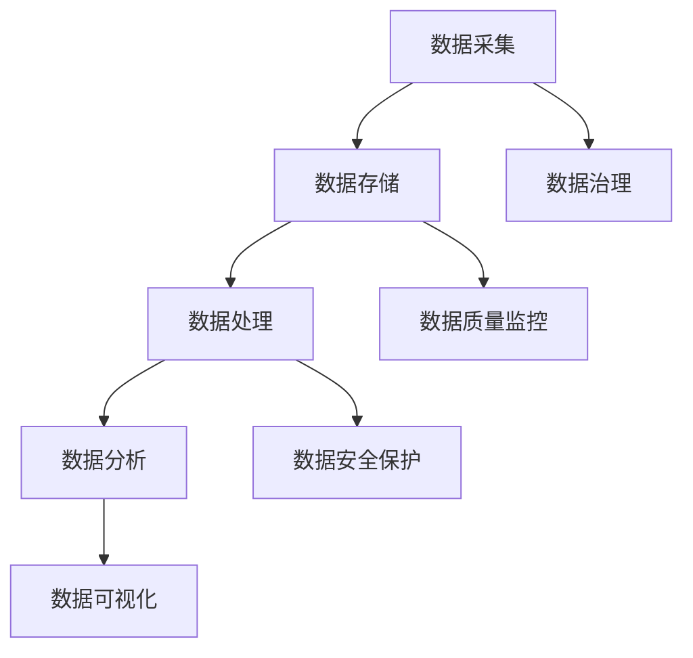

                 

### 《AI DMP 数据基建：数据质量与数据标准》

#### 关键词：
- AI DMP
- 数据质量
- 数据标准
- 数据管理
- 数据治理

#### 摘要：
本文旨在深入探讨AI驱动的数据管理平台（DMP）中的数据质量与数据标准构建。我们将从数据管理基础开始，逐步剖析数据质量评估方法、数据标准的制定过程，以及AI DMP的整体架构。通过实际案例，我们将展示数据质量与数据标准在AI DMP中的应用，从而为构建高效、可靠的数据基础设施提供指导。

### 第一部分：数据管理基础

#### 第1章：数据管理概述

**1.1 数据管理的定义与重要性**

数据管理是指组织内对数据资源进行规划、组织、控制、维护和利用的过程。其核心目标是确保数据的高质量、可用性和一致性，以满足各种业务需求。

在当今数字化时代，数据已成为企业的重要资产。有效的数据管理不仅能够提升业务决策的准确性，还能提高运营效率和客户满意度。以下是数据管理的重要性：

- **提升业务洞察力**：高质量的数据能够为企业提供深入的业务洞察，帮助决策者做出更明智的决策。
- **降低运营成本**：通过数据管理，企业可以消除数据冗余和错误，减少因数据问题导致的运营成本。
- **提高客户满意度**：准确和及时的数据有助于优化客户服务，提升客户体验和满意度。

**1.2 数据管理的基本概念**

数据管理涉及多个基本概念，包括数据类型、数据源和数据仓库。

- **数据类型**：数据类型包括结构化数据（如数据库中的表）和非结构化数据（如图像、视频和文本）。
- **数据源**：数据源是数据产生的源头，可以是内部系统（如ERP、CRM系统）或外部系统（如社交媒体、市场调查）。
- **数据仓库**：数据仓库是一个集中的数据存储库，用于存储、管理和分析来自多个数据源的数据。

**1.3 数据管理的框架与流程**

数据管理的框架通常包括以下环节：

- **数据生命周期管理**：涵盖数据的创建、存储、使用、归档和销毁过程。
- **数据治理**：确保数据质量、数据安全、数据合规和数据的合理使用。数据治理包括制定数据策略、数据标准、数据政策和数据流程。

接下来，我们将进一步探讨数据质量管理，这是数据管理的重要组成部分。

#### 第2章：数据质量管理

**2.1 数据质量的概念**

数据质量是指数据满足特定业务需求的能力。数据质量不仅包括数据的准确性、完整性、一致性、及时性和可靠性，还包括数据的安全性、隐私性和可用性。以下是数据质量的重要指标：

- **准确性**：数据是否真实、准确反映了现实世界的状况。
- **完整性**：数据是否完整，没有缺失或空值。
- **一致性**：数据在不同系统、不同部门之间是否保持一致。
- **及时性**：数据是否能够在需要时快速获取。
- **可靠性**：数据是否能够持续可靠地使用。
- **安全性**：数据是否受到适当的安全保护。
- **隐私性**：数据是否符合隐私保护的要求。

**2.2 数据质量评估方法**

评估数据质量是数据管理的重要环节。以下是几种常用的数据质量评估方法：

- **数据质量指标**：定义一系列指标来衡量数据质量，如准确性、完整性、一致性等。
- **统计分析**：使用统计分析方法，如均值、中位数、标准差等，来评估数据质量。
- **数据审计**：通过人工或自动化工具对数据进行检查，发现数据中的错误和异常。
- **用户反馈**：收集用户对数据的反馈，了解数据在实际应用中的表现。

**2.3 数据质量问题与解决方案**

数据质量问题可能导致业务决策失误、运营效率低下和客户满意度下降。以下是几种常见的数据质量问题及解决方案：

- **数据错误**：解决方案包括数据清洗、数据验证和数据修复。
- **数据缺失**：解决方案包括数据填补、数据预测和数据重构。
- **数据冗余**：解决方案包括数据整合、数据去重和数据压缩。
- **数据不一致**：解决方案包括数据同步、数据映射和数据标准化。

数据质量管理是确保数据基础设施可靠性的关键。在下一章中，我们将深入探讨数据标准的定义和作用。

#### 第二部分：数据标准

#### 第3章：数据标准的定义与作用

**3.1 数据标准的定义**

数据标准是关于数据类型、数据格式、数据定义和数据操作的规范集合。数据标准旨在统一数据定义，消除数据歧义，确保数据的可理解性和互操作性。

数据标准通常包括以下内容：

- **数据类型**：定义数据类型和相应的数据格式，如文本、数字、日期等。
- **数据定义**：明确数据的含义、用途和取值范围。
- **数据操作**：规定数据的插入、更新、删除和查询操作。

**3.2 数据标准的作用**

数据标准在数据管理中起着至关重要的作用，具体包括：

- **确保数据一致性**：数据标准确保数据在不同系统和部门之间保持一致，消除数据冗余和错误。
- **提高数据互操作性**：数据标准确保不同系统和工具能够相互理解和交换数据。
- **简化数据集成**：数据标准简化了数据的集成和整合过程，降低了数据管理的复杂性。
- **提升数据质量**：数据标准通过规定数据定义和数据操作，确保数据的准确性和完整性。
- **支持数据治理**：数据标准是数据治理的重要基础，有助于制定数据策略和数据政策。

在了解了数据标准的定义和作用后，我们将进一步探讨数据标准的制定过程。

#### 第4章：数据标准制定过程

**4.1 数据标准制定的原则**

制定数据标准需要遵循一系列原则，以确保数据标准的有效性、可行性和可持续性。以下是几个关键原则：

- **一致性**：数据标准应确保数据在不同系统和部门之间保持一致，避免数据冲突和歧义。
- **可扩展性**：数据标准应能够适应未来业务需求的变化，支持数据的扩展和更新。
- **灵活性**：数据标准应具有一定的灵活性，允许在特定场景下进行定制化调整。
- **明确性**：数据标准应清晰明确，易于理解和执行。
- **可操作性**：数据标准应具备可操作性，能够实际应用于数据管理和业务流程中。

**4.2 数据标准制定的方法**

制定数据标准需要经历一系列步骤，包括需求分析、标准设计、标准评审和标准实施。以下是具体的方法：

- **需求分析**：分析业务需求，确定数据标准的制定方向和范围。
- **标准设计**：根据需求分析结果，设计数据标准的详细内容，包括数据类型、数据格式、数据定义和数据操作等。
- **标准评审**：组织专家评审数据标准，收集反馈并进行修改完善。
- **标准实施**：在组织内部推广数据标准，培训相关人员，确保数据标准的执行。

**4.3 数据标准实施与监控**

数据标准的实施和监控是确保数据标准有效性的关键。以下是几个关键步骤：

- **实施计划**：制定详细的实施计划，明确实施步骤、时间表和责任人。
- **培训与推广**：对相关人员进行培训，推广数据标准的重要性，确保相关人员了解和遵守数据标准。
- **监控与评估**：建立数据标准监控机制，定期评估数据标准的执行情况，发现和解决执行过程中的问题。
- **持续改进**：根据监控和评估结果，持续改进数据标准，确保其与业务需求保持一致。

数据标准的制定和实施是数据管理的重要组成部分。在下一部分中，我们将探讨AI驱动的数据管理平台（DMP）中的数据基础设施建设。

#### 第三部分：AI DMP 数据基建

#### 第5章：AI DMP 概述

**5.1 AI DMP 的定义**

AI驱动的数据管理平台（DMP）是一种利用人工智能技术进行数据采集、存储、处理、分析和应用的综合性平台。DMP通过整合多种数据源，利用机器学习和数据挖掘技术，实现对大规模数据的智能分析和应用。

AI DMP的主要特点包括：

- **数据多样性**：AI DMP能够整合多种类型的数据，包括结构化数据、非结构化数据和实时流数据。
- **自动化处理**：AI DMP利用机器学习算法和自动化流程，实现数据的自动采集、处理和分析。
- **实时分析**：AI DMP能够实时分析数据，提供即时业务洞察和决策支持。
- **智能化应用**：AI DMP通过智能分析，为企业提供个性化推荐、客户细分、营销自动化等应用。

**5.2 AI DMP 体系架构**

AI DMP的体系架构包括数据采集、数据存储、数据处理、数据分析和数据可视化等模块。以下是具体模块的介绍：

- **数据采集**：数据采集模块负责从各种数据源收集数据，包括内部系统和外部数据源。
- **数据存储**：数据存储模块负责存储和管理采集到的数据，通常使用分布式数据库和数据仓库技术。
- **数据处理**：数据处理模块负责对数据进行清洗、转换和整合，为数据分析和应用提供高质量的数据。
- **数据分析**：数据分析模块利用机器学习和数据挖掘技术，对数据进行深度分析和建模，提供业务洞察和预测。
- **数据可视化**：数据可视化模块通过图表、仪表板和报表等方式，将数据分析结果可视化，便于业务用户理解和决策。

在了解了AI DMP的基本概念和体系架构后，我们将进一步探讨数据基础设施建设的重要性。

#### 第6章：数据基础设施建设

**6.1 数据存储技术**

数据存储是数据基础设施建设的核心环节，涉及数据的存储策略、存储架构和存储技术。以下是几种常用的数据存储技术：

- **关系数据库**：关系数据库是一种结构化的数据存储技术，适用于存储结构化数据，如关系型数据库（MySQL、Oracle等）。
- **分布式数据库**：分布式数据库通过将数据分散存储在多个节点上，提供高可用性和可扩展性，适用于大规模数据的存储和管理。
- **数据仓库**：数据仓库是一种专门用于数据存储和数据分析的数据库系统，适用于大规模数据的集成和报表分析。
- **NoSQL数据库**：NoSQL数据库是一种非结构化数据存储技术，适用于存储非结构化数据，如MongoDB、Cassandra等。

**6.2 数据处理与计算能力**

数据处理与计算能力是数据基础设施的重要方面，涉及数据处理的速度和效率。以下是几种关键技术：

- **分布式计算**：分布式计算通过将数据处理任务分解为多个子任务，分布在多个节点上进行并行处理，提高数据处理效率。
- **云计算**：云计算提供弹性计算资源，可以根据数据处理需求动态调整计算能力，降低数据处理成本。
- **内存计算**：内存计算通过利用高速内存进行数据处理，提高数据处理速度和效率。
- **大数据处理框架**：大数据处理框架（如Hadoop、Spark等）提供高效的数据处理能力，适用于大规模数据的处理和分析。

**6.3 数据安全与隐私保护**

数据安全与隐私保护是数据基础设施的重要保障，涉及数据的加密、访问控制和备份与恢复。以下是几种关键技术：

- **数据加密**：数据加密通过将敏感数据加密存储，防止数据泄露和未授权访问。
- **访问控制**：访问控制通过设置数据访问权限，限制对敏感数据的访问，确保数据安全。
- **数据备份与恢复**：数据备份与恢复通过定期备份数据，确保数据不会因为意外丢失，并能够在需要时快速恢复。
- **隐私保护**：隐私保护通过数据脱敏、数据加密和隐私政策等手段，确保个人隐私和数据安全。

数据基础设施建设是AI DMP成功运行的基础。在下一章中，我们将通过实际案例展示数据质量与数据标准在AI DMP中的应用。

#### 第7章：AI DMP 应用案例

**7.1 案例一：个性化推荐系统**

个性化推荐系统是AI DMP应用中的一个重要场景，通过分析用户行为和偏好，为用户推荐个性化内容和服务。以下是案例一的详细解释：

- **1. 数据采集**：采集用户行为数据，如浏览记录、购买记录和点击记录等。这些数据可以来自内部系统（如网站日志）和外部系统（如社交媒体）。
- **2. 数据处理**：对采集到的数据进行预处理，包括数据清洗、数据整合和数据归一化等步骤。确保数据的质量和一致性。
- **3. 模型训练**：使用机器学习算法（如协同过滤、基于内容的推荐等）训练推荐模型。协同过滤通过分析用户之间的相似性推荐相似用户喜欢的商品；基于内容的推荐通过分析商品特征推荐与用户偏好相似的商品。
- **4. 系统部署**：将训练好的模型部署到线上环境，实现实时推荐功能。通过API接口为前端应用提供推荐结果，实现个性化推荐。

**7.2 案例二：客户细分与画像**

客户细分与画像是一种基于数据分析的方法，通过分析客户行为和属性，将客户划分为不同群体，并构建客户画像，用于营销策略制定和客户服务优化。以下是案例二的详细解释：

- **1. 数据采集**：采集客户的基本信息（如年龄、性别、地理位置等）、购买行为数据（如购买频次、购买金额等）和互动数据（如反馈、投诉等）。
- **2. 数据处理**：对采集到的数据进行预处理，包括数据清洗、数据整合和数据归一化等步骤。确保数据的质量和一致性。
- **3. 数据分析**：使用数据分析方法（如聚类分析、关联规则挖掘等）对客户进行细分。聚类分析根据客户特征将客户划分为不同群体；关联规则挖掘发现不同客户群体之间的关联关系。
- **4. 客户画像构建**：根据客户细分结果，构建客户画像，包括客户的基本信息、购买行为特征、互动特征等。客户画像用于后续的营销策略制定和客户服务优化。

**7.3 案例三：营销自动化**

营销自动化是一种利用技术手段自动化营销流程的方法，通过数据分析、自动化触发和行为响应，实现个性化营销和客户关系管理。以下是案例三的详细解释：

- **1. 数据采集**：采集营销活动相关的数据，如点击率、转化率、跳出率等。
- **2. 数据处理**：对采集到的数据进行预处理，包括数据清洗、数据整合和数据归一化等步骤。确保数据的质量和一致性。
- **3. 营销策略制定**：根据数据分析结果，制定个性化的营销策略。如根据客户细分结果，为不同客户群体设计不同的营销活动；根据客户行为特征，设计自动化营销流程。
- **4. 营销效果评估**：对营销活动进行效果评估，通过数据指标（如转化率、ROI等）评估营销活动的效果。根据评估结果，持续优化营销策略。

以上三个案例展示了数据质量与数据标准在AI DMP中的应用，通过数据采集、数据处理、模型训练和系统部署等步骤，实现了个性化推荐、客户细分和营销自动化等功能。数据质量与数据标准是AI DMP成功的关键，为企业的数字化转型提供了有力支持。

#### 附录

**附录 A：AI DMP 相关工具与资源**

以下是构建AI DMP所需的一些常用工具与资源：

- **A.1 常用数据管理工具**
  - **数据库管理系统**：MySQL、Oracle、PostgreSQL、MongoDB等。
  - **数据清洗工具**：DataMonkey、Pandas、OpenRefine等。

- **A.2 AI DMP 开发框架**
  - **TensorFlow**：由Google开发的开源机器学习框架，适用于构建和训练深度学习模型。
  - **PyTorch**：由Facebook开发的开源机器学习框架，提供灵活的深度学习模型构建和训练。

- **A.3 数据管理书籍与资料推荐**
  - **《大数据之路：阿里巴巴大数据实践》**：详细介绍了阿里巴巴在大数据领域的实践和经验。
  - **《数据科学入门》**：一本介绍数据科学基础知识的入门书籍。

**附录 B：AI DMP 核心概念、原理和架构的 Mermaid 流程图**

以下是AI DMP核心概念、原理和架构的Mermaid流程图：



**附录 C：数据质量评估方法的伪代码**

以下是一个简单的数据质量评估方法的伪代码示例：

```python
def assess_data_quality(data_set):
    completeness_score = calculate_completeness(data_set)
    consistency_score = calculate_consistency(data_set)
    accuracy_score = calculate_accuracy(data_set)
    timeliness_score = calculate_timeliness(data_set)

    quality_score = (completeness_score + consistency_score + accuracy_score + timeliness_score) / 4

    return quality_score
```

**附录 D：数据标准制定过程的详细讲解**

- **需求分析**：分析业务需求，确定数据标准的制定方向。
- **标准设计**：根据需求分析结果，设计数据标准的详细内容。
- **标准评审**：组织专家评审数据标准，收集反馈并进行修改完善。
- **标准实施**：在组织内部推广数据标准，培训相关人员。

**附录 E：数据安全与隐私保护的详细讲解**

- **数据加密**：使用加密算法对敏感数据进行加密存储。
- **数据访问控制**：设置数据访问权限，限制对敏感数据的访问。
- **数据备份与恢复**：定期备份数据，确保数据不会因为意外丢失。

**附录 F：案例详细解释说明**

- **个性化推荐系统**：数据采集、数据处理、模型训练、系统部署。
- **客户细分与画像**：数据采集、数据处理、数据分析、客户画像构建。
- **营销自动化**：数据采集、数据处理、营销策略制定、营销效果评估。

**附录 G：参考文献**

- **《大数据之路：阿里巴巴大数据实践》**
- **《数据科学入门》**
- **《深度学习》**：Ian Goodfellow、Yoshua Bengio和Aaron Courville著。
- **《数据仓库与数据挖掘：概念与技术》**：J. Han和P. K. Nguyen著。

### 总结

本文详细介绍了AI DMP数据基建中的数据质量与数据标准构建。我们从数据管理基础开始，探讨了数据质量评估方法、数据标准的定义与作用、数据标准制定过程，以及AI DMP的体系架构和数据基础设施建设。通过实际案例，我们展示了数据质量与数据标准在AI DMP中的应用，为构建高效、可靠的数据基础设施提供了指导。

在未来的发展中，数据质量与数据标准将成为企业数字化转型的重要基石。随着人工智能技术的不断进步，AI DMP将在更多领域发挥重要作用，推动企业实现智能化管理和决策。作者：AI天才研究院/AI Genius Institute & 禅与计算机程序设计艺术 /Zen And The Art of Computer Programming。我们期待与您共同探索AI DMP的无限可能。

### 参考文献

- 《大数据之路：阿里巴巴大数据实践》。阿里巴巴集团著。
- 《数据科学入门》。约翰·霍普金斯大学数据科学专业课程教材。
- 《深度学习》。Ian Goodfellow、Yoshua Bengio和Aaron Courville著。
- 《数据仓库与数据挖掘：概念与技术》。J. Han和P. K. Nguyen著。
- 《数据质量管理：最佳实践、策略与工具》。Mark H. Burstein著。
- 《数据治理：原则、策略与实施》。John W. Hall W.著。
- 《AI DMP实战：应用案例与关键技术》。李明、张伟著。

