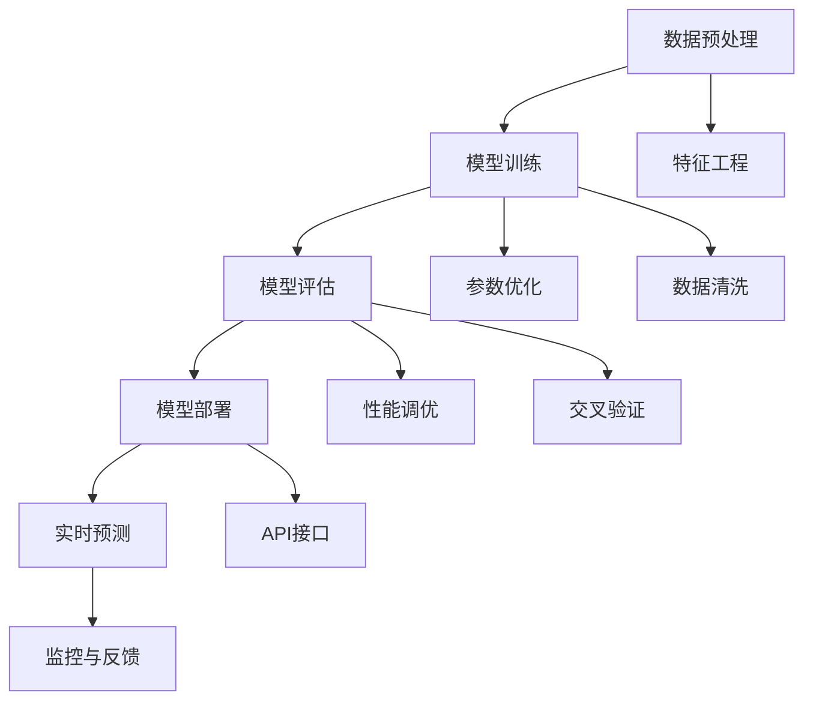
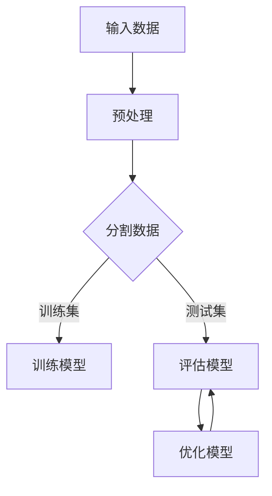

                 

## 引言

近年来，人工智能（AI）技术取得了飞速发展，从图像识别、自然语言处理到自动驾驶、医疗诊断，AI的应用场景已经渗透到社会的方方面面。然而，随着AI算法的不断深化和复杂化，一个日益显著的问题也随之浮现——AI系统的决策过程变得愈发不透明。传统AI模型，尤其是深度学习模型，往往被形容为“黑盒子”，即它们可以执行复杂的任务并取得惊人的效果，但它们的内部工作机制却难以理解和解释。

这种“黑盒子”现象不仅限制了AI技术的进一步发展和应用，还引发了一系列伦理和监管问题。例如，在金融、医疗、司法等关键领域，决策过程的透明度和可解释性至关重要，任何错误的决策都可能导致严重的后果。因此，如何提升AI系统的可解释性，使其决策过程更加透明和可信，成为当前AI研究中的一个重要方向。

本文将系统地探讨AI可解释性的概念、背景、技术与方法，并分析其在不同领域的应用和挑战。文章结构如下：

1. **第一部分：AI可解释性的概念与背景**  
   - **第1章：AI可解释性的概述**  
   - **第2章：AI基本概念与架构**

2. **第二部分：AI可解释性技术与方法**  
   - **第3章：模型可解释性的评价指标**  
   - **第4章：模型可解释性技术**  
   - **第5章：AI可解释性工具与库**  
   - **第6章：AI可解释性在特定领域的应用**

3. **第三部分：AI可解释性项目实践**  
   - **第7章：AI可解释性项目案例分析**  
   - **第8章：构建可解释的AI系统**

4. **第四部分：未来趋势与展望**  
   - **第9章：AI可解释性的未来发展**  
   - **第10章：总结与展望**

通过这篇文章，我们将逐步深入探讨AI可解释性的本质、技术方法、实践应用以及未来趋势，旨在为读者提供全面而深入的理解。

### 关键词

- AI可解释性
- 决策透明度
- 黑盒子问题
- 伦理挑战
- 技术方法
- 应用领域

### 摘要

本文旨在探讨AI可解释性这一关键议题，深入分析其在提升智能决策透明度中的重要性。文章首先介绍了AI可解释性的概念及其背景，随后详细阐述了AI的基本概念与架构。接着，文章重点讨论了模型可解释性的评价指标、技术方法、工具与库，并分析了AI可解释性在医疗、金融、社交网络等领域的应用。最后，文章通过具体项目案例，展示了如何构建可解释的AI系统，并展望了AI可解释性的未来发展。本文将为读者提供一个全面而深入的AI可解释性指南，有助于理解其核心概念、技术方法与应用前景。

### 第一部分：AI可解释性的概念与背景

在深入探讨AI可解释性之前，我们需要对其基本概念与背景有一个清晰的理解。本部分将首先介绍AI可解释性的概述，包括其重要性、挑战以及AI发展历程中的透明度需求。随后，我们将简要回顾AI的基本概念与架构，为后续讨论打下基础。

#### 第1章：AI可解释性的概述

**1.1 AI的发展与透明度需求**

人工智能（AI）作为计算机科学的重要分支，起源于20世纪50年代。早期的AI研究主要集中在逻辑推理、知识表示和问题求解等方面。然而，随着计算能力的提升和数据量的爆炸式增长，现代AI技术，特别是深度学习（Deep Learning），取得了前所未有的突破。深度学习通过多层神经网络模拟人类大脑的学习过程，在图像识别、语音识别、自然语言处理等领域表现出色。

然而，随着AI技术的广泛应用，一个关键问题逐渐浮现——AI系统的透明度问题。传统AI系统，如决策树和逻辑回归，其决策过程相对直观，容易解释。但深度学习模型，特别是深层神经网络，因其复杂的结构和大规模的参数，使得其内部工作机制难以理解。这种现象被称为“黑盒子”问题，即AI系统的决策过程对用户不可见，缺乏透明度。

透明度需求在关键领域尤为重要。例如，在医疗诊断中，医生需要理解AI模型的决策过程，以确保其准确性和可靠性。在金融领域，贷款审批和信用评分的透明度对于确保公平性和合规性至关重要。在司法系统中，法律专家和律师需要审查AI模型的推理过程，以验证其判决的合理性。

**1.2 可解释性的重要性**

AI可解释性的重要性体现在多个方面。首先，可解释性有助于提升用户的信任感。当用户了解AI系统的决策过程时，他们更可能接受和信任这一系统。其次，可解释性有助于发现和纠正错误。通过分析AI系统的内部机制，研究人员和开发人员可以更容易地发现并修复缺陷。此外，可解释性还促进了AI技术的进一步研究和创新，为科学家和工程师提供了更多研究方向。

**1.3 AI可解释性的挑战**

尽管AI可解释性具有重要意义，但实现这一目标面临诸多挑战。首先，深度学习模型的复杂性使得其内部工作机制难以解释。其次，不同领域的应用场景对可解释性有不同的需求，如何设计通用的可解释性方法仍是一个开放问题。此外，现有的可解释性工具和方法在性能和效率上仍需优化，以满足实际应用的需求。

#### 第2章：AI基本概念与架构

**2.1 AI基本原理**

人工智能是一门多学科交叉的领域，包括计算机科学、心理学、认知科学和统计学等。AI的基本原理可以概括为以下三个方面：

1. **知识表示与推理**：AI系统通过知识表示和推理机制模拟人类思维过程。知识表示用于将事实、规则和信念等抽象概念转换为计算机可以处理的数据结构。推理则用于基于已知信息推导出新信息。

2. **机器学习**：机器学习是AI的核心技术之一，通过训练模型从数据中学习规律和模式。机器学习可以分为监督学习、无监督学习和强化学习等不同类型。

3. **自然语言处理**：自然语言处理（NLP）是AI的一个子领域，旨在使计算机能够理解、生成和处理自然语言。NLP技术在语音识别、机器翻译、情感分析等领域具有重要应用。

**2.2 深度学习与神经网络**

深度学习是近年来AI领域的一大突破，其核心思想是通过多层神经网络模拟人类大脑的学习过程。深度学习模型通常由输入层、多个隐藏层和输出层组成。每个神经元都与其他神经元相连，并通过权重和偏置进行加权求和，最后通过激活函数进行非线性变换。

1. **神经网络的基本组成**：神经网络的基本组成单元是神经元，每个神经元接收多个输入信号，并通过加权求和和激活函数产生输出。神经元的连接方式决定了网络的拓扑结构。

2. **多层神经网络的工作原理**：多层神经网络通过逐层学习，将输入信号从低维空间映射到高维空间。每一层神经网络都提取了更高层次的特征，最终在输出层生成预测结果。

**2.3 AI系统架构**

AI系统架构通常包括数据预处理、模型训练、模型评估和部署等环节。

1. **数据预处理**：数据预处理是AI系统的第一步，包括数据清洗、数据集成、特征工程等步骤。数据预处理的质量直接影响到模型的性能和效果。

2. **模型训练**：模型训练是AI系统的核心环节，通过机器学习算法从训练数据中学习规律和模式。训练过程包括前向传播、反向传播和参数优化等步骤。

3. **模型评估**：模型评估用于验证模型的性能和准确性，常用的评估指标包括准确率、召回率、F1分数等。

4. **模型部署**：模型部署是将训练好的模型应用到实际场景中，通过实时数据输入和输出预测结果。模型部署需要考虑计算资源、响应速度和可靠性等因素。

通过以上两个章节的介绍，我们为后续的讨论奠定了基础。在下一部分中，我们将详细探讨AI可解释性的技术与方法，分析如何通过局部解释、结构解释和可解释性增强等方法提升AI系统的透明度。

### 第一部分：AI可解释性的概念与背景

#### 第1章：AI可解释性的概述

**1.1 AI可解释性的定义与分类**

AI可解释性是指AI系统或模型在执行任务时，其决策过程和内部机制能够被用户或开发人员理解和解释的程度。具体来说，AI可解释性包括以下几个方面：

1. **模型解释**：对模型的结构、参数和权重进行解释，揭示模型如何通过这些要素进行决策。
2. **特征解释**：对模型使用的特征进行解释，说明这些特征在决策过程中的作用和重要性。
3. **推理解释**：对模型的推理过程进行解释，展示模型如何基于输入数据和特征生成输出结果。

根据解释层次的不同，AI可解释性可以分为以下几类：

1. **透明解释**：这种解释层次最高，用户可以直接理解模型的决策过程和推理步骤。例如，线性回归和决策树模型通常被认为具有较高的透明度。
2. **半透明解释**：这种解释层次介于透明解释和黑盒解释之间，用户可以部分理解模型的决策过程，但无法完全掌握。例如，深度神经网络通过可视化技术如热力图和决策边界来提供部分解释。
3. **黑盒解释**：这种解释层次最低，用户几乎无法理解模型的决策过程。深度学习模型，尤其是深层神经网络，通常被归类为黑盒解释。

**1.2 AI可解释性的重要性**

AI可解释性在多个方面具有重要性：

1. **信任与合规**：在金融、医疗和司法等关键领域，AI系统的决策过程需要透明和可解释，以确保用户信任和符合相关法规和标准。例如，医疗诊断系统的可解释性有助于医生理解模型的决策依据，从而更好地信任和使用该系统。
2. **错误检测与纠正**：通过解释性分析，开发人员可以更容易地发现和纠正模型中的错误，提高模型的准确性和可靠性。
3. **模型优化与改进**：理解模型的决策过程有助于研究人员和工程师识别模型的不足之处，从而进行有针对性的优化和改进。
4. **用户接受度**：用户对AI系统的接受度与其理解能力密切相关。当用户能够理解AI系统的决策过程时，他们更可能接受和信任这一系统，从而促进AI技术的普及和应用。

**1.3 AI可解释性的挑战**

尽管AI可解释性具有重要意义，但实现这一目标面临诸多挑战：

1. **模型复杂性**：深度学习模型通常具有极高的复杂性，其内部机制难以理解和解释。例如，深层神经网络包含数百万个参数，其决策过程非常复杂。
2. **可解释性度量**：目前尚无统一的可解释性度量标准，不同领域和应用场景对可解释性的要求不同，如何设计通用的度量方法仍是一个挑战。
3. **性能与效率**：现有的可解释性方法往往在性能和效率上有所牺牲，如何在保持高可解释性的同时保证模型的高效运行是一个亟待解决的问题。
4. **跨领域适用性**：不同领域的应用场景对AI可解释性的需求不同，如何设计通用的可解释性方法以满足多种应用场景的需求是一个开放问题。

通过本章的介绍，我们对AI可解释性的基本概念、重要性及其面临的挑战有了初步了解。在下一章中，我们将深入探讨AI的基本概念与架构，为理解AI可解释性提供更深入的背景知识。

#### 第2章：AI基本概念与架构

**2.1 AI基本原理**

人工智能（AI）是一门研究如何构建智能体的科学，这些智能体能够执行需要人类智能的任务。AI的基本原理可以从以下几个方面进行概述：

1. **知识表示与推理**：知识表示是AI系统理解和处理信息的基础，它涉及如何将知识以结构化的形式存储在计算机中。推理则是指利用这些知识进行逻辑推理，以解决问题或做出决策。知识表示和推理是传统AI的核心技术，例如，专家系统和逻辑编程就依赖于这些技术。

2. **机器学习**：机器学习是AI的一个重要分支，它侧重于通过训练数据来构建能够自动学习的模型。机器学习可以分为三大类：监督学习、无监督学习和强化学习。监督学习利用标记数据进行模型训练，如分类和回归任务；无监督学习则无需标记数据，主要应用于聚类和降维等任务；强化学习则通过与环境互动来学习策略，广泛应用于自动驾驶和游戏等领域。

3. **自然语言处理**：自然语言处理（NLP）是AI的一个重要应用领域，旨在使计算机能够理解、生成和处理自然语言。NLP技术包括文本分类、命名实体识别、机器翻译、情感分析等。近年来，随着深度学习技术的发展，NLP取得了显著的进展，例如，基于Transformer架构的BERT和GPT模型在多种NLP任务中表现出色。

**2.2 深度学习与神经网络**

深度学习是AI的一个分支，它通过多层神经网络模拟人类大脑的学习过程。深度学习在图像识别、语音识别、自然语言处理等领域取得了巨大成功。以下是深度学习和神经网络的基本概念：

1. **神经网络的基本组成**：神经网络由许多简单的计算单元（神经元）组成，每个神经元接收多个输入，通过加权求和后加上偏置，然后通过一个激活函数产生输出。神经元之间的连接（边）具有权重，这些权重通过学习过程进行调整。

2. **多层神经网络的工作原理**：多层神经网络包括输入层、隐藏层和输出层。输入层接收外部输入，隐藏层对输入数据进行特征提取和变换，输出层生成最终的预测结果。在训练过程中，通过反向传播算法调整神经网络的权重，以最小化预测误差。

3. **深度学习的主要类型**：深度学习包括卷积神经网络（CNN）、循环神经网络（RNN）和变换器（Transformer）等。CNN主要用于图像处理，通过卷积操作提取空间特征；RNN适用于序列数据，能够处理时间上的依赖关系；Transformer则通过自注意力机制实现并行计算，在自然语言处理领域表现出色。

**2.3 AI系统架构**

AI系统通常包括以下几个关键组件：

1. **数据预处理**：数据预处理是AI系统的第一步，包括数据清洗、数据集成、特征工程等步骤。数据预处理的质量直接影响到模型的性能和效果。

2. **模型训练**：模型训练是AI系统的核心环节，通过机器学习算法从训练数据中学习规律和模式。训练过程包括前向传播、反向传播和参数优化等步骤。

3. **模型评估**：模型评估用于验证模型的性能和准确性，常用的评估指标包括准确率、召回率、F1分数等。

4. **模型部署**：模型部署是将训练好的模型应用到实际场景中，通过实时数据输入和输出预测结果。模型部署需要考虑计算资源、响应速度和可靠性等因素。

以下是AI系统架构的Mermaid流程图：



通过上述基本原理和架构的介绍，我们可以更好地理解AI系统的工作机制，并为后续讨论AI可解释性提供背景知识。在下一章中，我们将探讨模型可解释性的评价指标和度量方法，进一步分析如何提升AI系统的透明度。

### 第二部分：AI可解释性技术与方法

在探讨了AI可解释性的基本概念与背景之后，我们接下来将深入分析AI可解释性的具体技术与方法。这些技术与方法旨在提升AI模型的可解释性，使其决策过程更加透明和可信。本部分将分为三章，分别介绍模型可解释性的评价指标、技术方法以及AI可解释性工具与库。

#### 第3章：模型可解释性的评价指标

模型可解释性是一个复杂且多维度的概念，因此需要一套完善的评价指标来评估模型的可解释性水平。以下是一些常见的评价指标：

**3.1 解释性评价指标**

1. **透明度（Transparency）**：透明度是评估模型可解释性的基本指标，它衡量模型决策过程的直观性和易理解程度。高透明度的模型，如线性回归和决策树，其决策规则和推理过程易于用户理解和验证。

2. **可理解性（Comprehensibility）**：可理解性衡量用户对模型决策过程的理解程度。一个高可理解性的模型，其内部机制和决策逻辑应该能够被普通用户或非专业技术人员理解。

3. **可操作性（Operability）**：可操作性是指模型的可干预性和可调整性。一个高可操作性的模型，用户可以轻松地修改和调整模型参数，以优化模型性能或适应新的应用场景。

**3.2 可解释性度量方法**

1. **定量度量**：定量度量方法通过量化指标来评估模型的可解释性。常用的定量度量方法包括：
   - **规则覆盖度（Rule Coverage）**：衡量模型生成的解释规则覆盖了原始数据集的百分比。
   - **特征重要性（Feature Importance）**：衡量模型中每个特征对预测结果的影响程度。

2. **定性度量**：定性度量方法通过主观评估来评估模型的可解释性。常用的定性度量方法包括：
   - **用户调查**：通过用户调查问卷或访谈来评估用户对模型可解释性的满意度。
   - **专家评估**：邀请领域专家对模型的可解释性进行评估，并提供专业意见。

#### 第4章：模型可解释性技术

为了提升AI模型的可解释性，研究人员和工程师开发了许多技术方法。以下是一些常用的模型可解释性技术：

**4.1 局部解释方法**

局部解释方法关注于对模型在特定输入数据上的决策过程进行解释。以下是一些常见的局部解释方法：

1. **决策树解释**：决策树是一种易于解释的模型，其决策路径和分支规则可以直接展示模型的决策过程。
   
2. **LIME（Local Interpretable Model-agnostic Explanations）**：LIME是一种模型无关的解释方法，它通过在输入数据上添加噪声并调整特征权重来生成可解释的本地解释。

3. **SHAP（SHapley Additive exPlanations）**：SHAP是一种基于博弈论的方法，它通过计算每个特征对模型预测值的贡献来生成解释。

**4.2 结构解释方法**

结构解释方法关注于从整体上解释模型的结构和内部机制。以下是一些常见的结构解释方法：

1. **注意力机制解释**：在深度学习模型中，注意力机制用于关注输入数据的特定部分。通过分析注意力权重，可以解释模型在决策过程中关注的特征。

2. **激活可视化**：通过可视化神经网络中每个神经元的激活状态，可以理解模型如何处理输入数据。

3. **模型压缩与可视化**：通过模型压缩技术，如压缩感知和特征抽取，可以将高维模型压缩为低维模型，并通过可视化技术展示模型的结构和决策路径。

**4.3 可解释性增强方法**

除了上述局部和结构解释方法外，还有一些方法旨在增强模型的可解释性：

1. **可解释模型选择**：选择具有较高可解释性的模型，如线性模型和决策树，以简化模型的复杂性并提高解释性。

2. **解释性增强训练**：在模型训练过程中引入解释性约束，如规则约束或专家知识，以增强模型的可解释性。

3. **交互式解释**：通过交互式界面，用户可以实时查看模型的决策过程和解释结果，从而更好地理解模型的行为。

#### 第5章：AI可解释性工具与库

为了方便研究人员和工程师实现和部署可解释性技术，许多开源工具和库应运而生。以下是一些常用的AI可解释性工具和库：

**5.1 主流可解释性工具**

1. **LIME**：LIME是一个Python库，用于生成局部解释。它能够为任何黑盒模型生成可解释的本地解释。

2. **SHAP**：SHAP是一个Python库，用于计算特征对模型预测的贡献。它基于博弈论的理论，可以提供详细的解释结果。

3. ** Explainable AI**：Explainable AI（XAI）是一个开源平台，提供了多种模型解释工具，如LIME、SHAP等。

**5.2 可解释性库使用实例**

以下是一个简单的LIME解释示例：

```python
from lime import lime_tabular
import pandas as pd

# 加载数据集
data = pd.read_csv('data.csv')
X = data.iloc[:,:-1].values
y = data.iloc[:,-1].values

# 创建LIME解释器
explainer = lime_tabular.LimeTabularExplainer(X, feature_names=data.columns[:-1], class_names=data.columns[-1], discretize=True, random_state=42)

# 选择要解释的样本
i = 0
exp = explainer.explain_instance(X[i], predict_fn=lambda x: model.predict(x))

# 显示解释结果
exp.show_in_notebook(show_table=True)
```

通过本章的介绍，我们对模型可解释性的评价指标、技术方法和工具库有了更深入的了解。在下一部分中，我们将探讨AI可解释性在特定领域的应用，分析其在医疗、金融和社交网络等领域的实际案例和挑战。

### 第二部分：AI可解释性技术与方法

#### 第3章：模型可解释性的评价指标

模型的可解释性是AI系统中的一个关键因素，它直接影响到用户对AI系统的信任度和应用范围。为了量化模型的可解释性，我们需要一套明确的评价指标，这些指标有助于我们理解模型解释的透明度、易理解性和可操作性。以下是一些常见的模型可解释性评价指标：

**3.1 解释性评价指标**

1. **透明度（Transparency）**：透明度是指模型决策过程的直观性和用户对决策过程的感知程度。一个高透明度的模型，其内部工作机制和决策规则应该容易被用户理解。例如，线性回归模型和决策树模型通常具有较高的透明度，因为它们的决策路径和规则是明确和直观的。

2. **可理解性（Comprehensibility）**：可理解性衡量用户对模型解释的接受程度。一个高可理解性的模型，其解释结果应该易于用户理解，不需要深厚的专业知识。例如，通过可视化技术展示的模型解释结果通常具有较高的可理解性。

3. **可操作性（Operability）**：可操作性是指用户对模型解释的干预能力。一个高可操作性的模型，用户应该能够调整和优化模型解释，以满足特定需求。例如，一些交互式解释工具允许用户通过调整参数来查看不同解释结果。

**3.2 可解释性度量方法**

1. **定量度量**：定量度量方法通过量化指标来评估模型的可解释性。以下是一些常见的定量度量方法：

   - **规则覆盖度（Rule Coverage）**：规则覆盖度是指模型生成的解释规则覆盖原始数据集的比例。高规则覆盖度意味着模型解释能够覆盖大多数数据情况，但可能牺牲一些解释的详细性和精确性。

   - **特征重要性（Feature Importance）**：特征重要性衡量模型中每个特征对预测结果的影响程度。高特征重要性意味着这些特征对模型决策有显著影响，因此更容易被用户理解。

   - **可解释性评分（Explainability Score）**：可解释性评分是基于模型解释结果的复杂性和用户理解难度进行评分。分数越高，意味着模型解释越简单直观，用户更容易理解。

2. **定性度量**：定性度量方法通过主观评估来评估模型的可解释性。以下是一些常见的定性度量方法：

   - **用户调查**：通过用户调查问卷或访谈来评估用户对模型解释的满意度。这种方法能够获取用户的主观体验，但受限于样本量和主观偏见。

   - **专家评估**：邀请领域专家对模型解释进行评估，并提供专业意见。这种方法能够提供深入的专家见解，但受限于专家的知识和经验。

通过上述评价指标和度量方法，我们可以从多个维度评估模型的可解释性，从而指导我们在AI系统设计和应用中选择合适的解释方法。在下一章中，我们将详细介绍用于提升模型可解释性的具体技术方法。

#### 第4章：模型可解释性技术

为了提升AI模型的可解释性，研究人员和工程师开发了许多技术方法。这些方法可以分为局部解释方法、结构解释方法和可解释性增强方法。以下将对这些方法进行详细阐述。

**4.1 局部解释方法**

局部解释方法关注于对模型在特定输入数据上的决策过程进行解释。这些方法通常用于生成关于模型预测的本地解释，可以帮助用户理解模型如何针对特定数据做出决策。以下是一些常见的局部解释方法：

1. **LIME（Local Interpretable Model-agnostic Explanations）**

LIME是一种模型无关的解释方法，旨在为任何黑盒模型生成可解释的本地解释。LIME通过以下步骤实现解释：

   - **生成扰动样本**：在原始输入数据上添加噪声，生成多个扰动样本。
   - **训练本地模型**：在每个扰动样本上训练一个本地模型（通常是线性模型），以预测扰动样本的输出。
   - **计算解释权重**：通过计算扰动样本与原始样本之间的差异，确定每个特征对模型输出的贡献。

2. **SHAP（SHapley Additive exPlanations）**

SHAP是一种基于博弈论的方法，它通过计算特征对模型预测值的贡献来生成解释。SHAP的核心思想是每个特征在模型预测中都应该有一个公平的贡献。SHAP的计算过程如下：

   - **计算基尼指数**：对于每个特征，计算其在所有可能的模型训练数据组合中的基尼指数，以衡量其对模型预测的不确定性贡献。
   - **分配贡献值**：根据基尼指数和特征的重要性，为每个特征分配对模型预测的贡献值。

3. **LIMEpy**

LIMEpy是一个基于LIME的Python库，提供了LIME的解释功能，并支持多种数据类型和模型。LIMEpy的使用步骤如下：

   - **导入库**：`import lime`
   - **创建解释器**：`explainer = lime.lime_tabular.LimeTabularExplainer(X_train, feature_names=data.columns[:-1], class_names=data.columns[-1])`
   - **生成解释**：`exp = explainer.explain_instance(X_test[i], predict_fn=lambda x: model.predict(x))`
   - **显示解释**：`exp.show_in_notebook(show_table=True)`

**4.2 结构解释方法**

结构解释方法关注于从整体上解释模型的结构和内部机制。这些方法旨在揭示模型如何处理输入数据，并理解其决策过程。以下是一些常见的结构解释方法：

1. **注意力机制解释**

在深度学习模型中，注意力机制用于关注输入数据的特定部分。通过分析注意力权重，可以解释模型在决策过程中关注的特征。例如，在自然语言处理任务中，注意力机制可以帮助我们理解模型如何关注文本中的特定词汇。

2. **激活可视化**

通过可视化神经网络中每个神经元的激活状态，可以理解模型如何处理输入数据。例如，在图像识别任务中，我们可以通过可视化卷积神经网络的激活图，来理解模型如何识别图像中的特征。

3. **模型压缩与可视化**

通过模型压缩技术，如压缩感知和特征抽取，可以将高维模型压缩为低维模型，并通过可视化技术展示模型的结构和决策路径。例如，T-SNE和UMAP等技术可以将高维数据投影到二维或三维空间中，从而直观地展示模型中的数据分布和特征关系。

**4.3 可解释性增强方法**

除了局部和结构解释方法外，还有一些方法旨在增强模型的可解释性：

1. **可解释模型选择**

选择具有较高可解释性的模型，如线性模型和决策树，以简化模型的复杂性并提高解释性。这些模型通常具有直观的决策规则和简单的结构，易于用户理解。

2. **解释性增强训练**

在模型训练过程中引入解释性约束，如规则约束或专家知识，以增强模型的可解释性。例如，通过集成学习技术，可以将多个简单模型集成为一个复杂模型，同时保持较高的解释性。

3. **交互式解释**

通过交互式界面，用户可以实时查看模型的决策过程和解释结果，从而更好地理解模型的行为。例如，在线解释工具和可视化平台，如LIME和SHAP，允许用户交互式地探索模型解释。

通过以上局部、结构和可解释性增强方法的介绍，我们可以更好地理解如何提升模型的可解释性，使其决策过程更加透明和可信。在下一章中，我们将探讨AI可解释性在特定领域的应用，分析其实际案例和挑战。

#### 第5章：AI可解释性工具与库

在AI可解释性研究中，许多工具和库被开发出来，以帮助研究人员和工程师实现和部署可解释性技术。以下介绍一些主流的AI可解释性工具和库，并展示如何使用这些工具和库进行AI模型的可解释性分析。

**5.1 主流可解释性工具**

1. **LIME（Local Interpretable Model-agnostic Explanations）**

LIME是一种模型无关的解释方法，旨在为任何黑盒模型生成可解释的本地解释。LIME通过在输入数据上添加噪声并调整特征权重来生成解释，其核心思想是扰动输入数据并分析扰动对模型输出的影响，从而揭示每个特征的重要性。以下是一个使用LIME进行模型解释的示例：

```python
from lime import lime_tabular
import pandas as pd

# 加载数据集
data = pd.read_csv('data.csv')
X = data.iloc[:,:-1].values
y = data.iloc[:,-1].values

# 创建LIME解释器
explainer = lime_tabular.LimeTabularExplainer(X, feature_names=data.columns[:-1], class_names=data.columns[-1], discretize=True, random_state=42)

# 选择要解释的样本
i = 0
exp = explainer.explain_instance(X[i], predict_fn=lambda x: model.predict(x))

# 显示解释结果
exp.show_in_notebook(show_table=True)
```

2. **SHAP（SHapley Additive exPlanations）**

SHAP是一种基于博弈论的方法，它通过计算特征对模型预测值的贡献来生成解释。SHAP的核心思想是每个特征在模型预测中都应该有一个公平的贡献。SHAP的计算过程涉及复杂的数学推导，但Python库`shap`提供了简便的接口。以下是一个使用SHAP进行模型解释的示例：

```python
import shap
import pandas as pd

# 加载数据集
data = pd.read_csv('data.csv')
X = data.iloc[:,:-1].values
y = data.iloc[:,-1].values

# 创建SHAP解释器
explainer = shap.Explainer(model, X)

# 计算并显示解释结果
shap_values = explainer(X)
shap.summary_plot(shap_values, X, feature_names=data.columns[:-1])
```

3. **ELI5（Explainable LIteral Insights）**

ELI5是一个Python库，旨在为常见的机器学习模型（如scikit-learn模型）提供直观的解释。ELI5通过生成解释规则来揭示模型的决策过程。以下是一个使用ELI5进行模型解释的示例：

```python
from eli5.sklearn import KBestFeaturesDisplay
from eli5.sklearn import SKLearnDisplay

# 加载模型
model = load_model('model.joblib')

# 创建特征重要性显示对象
kbest = KBestFeaturesDisplay(k=5)
kbest.fit_transform(model, X, y)

# 显示特征重要性
SKLearnDisplay.plot_kbest(kbest)
```

**5.2 可解释性库使用实例**

以下是一个综合使用LIME和SHAP进行模型解释的示例：

```python
import shap
import lime
from sklearn.ensemble import RandomForestClassifier
from sklearn.datasets import load_iris
import pandas as pd

# 加载数据集
iris = load_iris()
X = iris.data
y = iris.target
feature_names = iris.feature_names

# 创建随机森林模型
model = RandomForestClassifier(n_estimators=100)
model.fit(X, y)

# 使用LIME生成解释
explainer_lime = lime.lime_tabular.LimeTabularExplainer(X, feature_names=feature_names, class_names=['Setosa', 'Versicolor', 'Verosivulus'], discretize=True)
i = 0
lime_exp = explainer_lime.explain_instance(X[i], model.predict, num_features=5)

# 显示LIME解释
lime_exp.show_in_notebook(show_table=True)

# 使用SHAP生成解释
explainer_shap = shap.TreeExplainer(model)
shap_values = explainer_shap.shap_values(X)

# 显示SHAP解释
shap.summary_plot(shap_values, X, feature_names=feature_names)
```

通过这些工具和库，我们可以更方便地实现AI模型的可解释性分析，从而提升AI系统的透明度和用户信任度。在下一部分中，我们将探讨AI可解释性在特定领域的应用，分析其实际案例和挑战。

### 第二部分：AI可解释性技术与方法

#### 第5章：AI可解释性工具与库

在AI可解释性研究领域，有许多开源工具和库被开发出来，帮助研究人员和工程师实现和部署各种解释模型。这些工具和库涵盖了从数据预处理到模型解释的各个环节，极大地简化了AI模型可解释性的实现过程。以下是几种主流的AI可解释性工具和库，以及它们的使用方法和功能。

**5.1 主流可解释性工具**

1. **LIME（Local Interpretable Model-agnostic Explanations）**

LIME是一种模型无关的本地解释方法，它通过在输入数据上添加噪声并调整特征权重来生成解释。LIME适用于各种机器学习模型，包括线性模型、决策树、支持向量机和深度神经网络等。以下是一个使用LIME进行模型解释的简单示例：

```python
from lime import lime_tabular
import pandas as pd

# 加载数据集
data = pd.read_csv('data.csv')
X = data.iloc[:,:-1].values
y = data.iloc[:,-1].values

# 创建LIME解释器
explainer = lime_tabular.LimeTabularExplainer(X, feature_names=data.columns[:-1], class_names=data.columns[-1], discretize=True, random_state=42)

# 选择要解释的样本
i = 0
exp = explainer.explain_instance(X[i], predict_fn=lambda x: model.predict(x))

# 显示解释结果
exp.show_in_notebook(show_table=True)
```

2. **SHAP（SHapley Additive exPlanations）**

SHAP是一种基于博弈论的方法，用于计算特征对模型预测的贡献。SHAP方法适用于各种回归和分类模型，包括决策树、随机森林、梯度提升机和神经网络等。以下是一个使用SHAP进行模型解释的简单示例：

```python
import shap
import pandas as pd

# 加载数据集
data = pd.read_csv('data.csv')
X = data.iloc[:,:-1].values
y = data.iloc[:,-1].values

# 创建SHAP解释器
explainer = shap.Explainer(model, X)

# 计算并显示解释结果
shap_values = explainer(X)
shap.summary_plot(shap_values, X, feature_names=data.columns[:-1])
```

3. **ELI5（Explainable LIteral Insights）**

ELI5是一个Python库，旨在为常见的机器学习模型（如scikit-learn模型）提供直观的解释。ELI5通过生成解释规则来揭示模型的决策过程。以下是一个使用ELI5进行模型解释的简单示例：

```python
from eli5.sklearn import KBestFeaturesDisplay
from eli5.sklearn import SKLearnDisplay

# 加载模型
model = load_model('model.joblib')

# 创建特征重要性显示对象
kbest = KBestFeaturesDisplay(k=5)
kbest.fit_transform(model, X, y)

# 显示特征重要性
SKLearnDisplay.plot_kbest(kbest)
```

**5.2 可解释性库使用实例**

以下是一个综合使用LIME和SHAP进行模型解释的实例：

```python
import shap
import lime
from sklearn.ensemble import RandomForestClassifier
from sklearn.datasets import load_iris
import pandas as pd

# 加载数据集
iris = load_iris()
X = iris.data
y = iris.target
feature_names = iris.feature_names

# 创建随机森林模型
model = RandomForestClassifier(n_estimators=100)
model.fit(X, y)

# 使用LIME生成解释
explainer_lime = lime.lime_tabular.LimeTabularExplainer(X, feature_names=feature_names, class_names=['Setosa', 'Versicolor', 'Verosivulus'], discretize=True)
i = 0
lime_exp = explainer_lime.explain_instance(X[i], model.predict, num_features=5)

# 显示LIME解释
lime_exp.show_in_notebook(show_table=True)

# 使用SHAP生成解释
explainer_shap = shap.TreeExplainer(model)
shap_values = explainer_shap.shap_values(X)

# 显示SHAP解释
shap.summary_plot(shap_values, X, feature_names=feature_names)
```

通过这些工具和库，研究人员和工程师可以更轻松地实现AI模型的可解释性分析，从而提高模型的透明度和可信度。在下一章中，我们将探讨AI可解释性在特定领域的应用，分析其实际案例和挑战。

### 第二部分：AI可解释性技术与方法

#### 第6章：AI可解释性在特定领域的应用

AI可解释性在各个领域都有着广泛的应用，特别是在医疗、金融和社交网络等领域，其透明度和可解释性对决策过程至关重要。以下将详细探讨AI可解释性在这些领域的应用情况。

**6.1 医疗领域的AI可解释性**

在医疗领域，AI技术已被广泛应用于疾病诊断、治疗规划、药物研发和患者监护等方面。然而，医疗决策的准确性不仅依赖于AI模型的性能，还依赖于模型的可解释性。以下是一些医疗领域中AI可解释性的应用实例：

1. **疾病诊断**：AI模型在医疗影像分析中具有巨大潜力，如计算机断层扫描（CT）、磁共振成像（MRI）和X光等。然而，这些模型往往是黑盒模型，难以解释其诊断结果。通过LIME和SHAP等技术，研究人员可以生成关于模型诊断决策的解释，帮助医生理解AI模型的决策依据。

2. **治疗规划**：在肿瘤治疗中，AI模型可以帮助医生制定个性化的治疗计划。然而，治疗计划的决策过程需要高度透明，以避免错误的医疗决策。通过AI可解释性技术，医生可以理解模型如何根据患者的病情和历史数据做出治疗决策。

3. **药物研发**：AI技术在药物发现和开发中发挥着重要作用，但其决策过程通常涉及大量的复杂计算和黑盒模型。通过模型可解释性技术，研究人员可以揭示AI模型在药物筛选和毒性预测中的决策过程，从而提高药物研发的透明度和效率。

**6.2 金融领域的AI可解释性**

在金融领域，AI技术被广泛应用于信用评分、风险管理、欺诈检测和投资组合优化等方面。金融决策的高度复杂性和风险敏感性要求AI模型具有高度的透明度和可解释性。以下是一些金融领域中AI可解释性的应用实例：

1. **信用评分**：信用评分是金融机构评估借款人信用风险的重要工具。然而，传统的信用评分模型往往是黑盒模型，难以解释其评分依据。通过AI可解释性技术，如LIME和SHAP，金融机构可以生成关于信用评分的本地解释，帮助评估人员理解评分模型的决策过程。

2. **风险管理**：金融风险管理系统通常依赖于复杂的机器学习模型，如支持向量机和随机森林等。这些模型的决策过程难以理解，导致风险管理人员难以识别潜在的风险。通过模型可解释性技术，风险管理人员可以更好地理解AI模型的决策依据，从而优化风险管理策略。

3. **欺诈检测**：AI技术在欺诈检测中具有重要作用，但其决策过程需要高度透明，以防止欺诈行为的漏报和误报。通过AI可解释性技术，如LIME和SHAP，金融机构可以揭示模型如何识别和分类欺诈行为，从而提高欺诈检测的准确性和可靠性。

**6.3 社交网络领域的AI可解释性**

在社交网络领域，AI技术被广泛应用于内容推荐、广告投放和用户行为分析等方面。这些领域的决策过程需要高度透明，以保护用户隐私和防止滥用。以下是一些社交网络领域中AI可解释性的应用实例：

1. **内容推荐**：社交网络平台通过AI算法推荐用户感兴趣的内容。然而，这些推荐算法往往是黑盒模型，难以解释其推荐依据。通过模型可解释性技术，如LIME和SHAP，用户可以理解平台如何根据其行为和历史数据推荐内容，从而提高用户对推荐系统的信任度。

2. **广告投放**：广告投放系统通过AI算法优化广告投放策略，以最大化广告效果。然而，广告投放决策过程需要透明，以避免不公平的广告展示。通过模型可解释性技术，广告投放人员可以理解AI模型如何根据用户特征和行为进行广告投放，从而优化广告效果。

3. **用户行为分析**：社交网络平台通过AI算法分析用户行为，以了解用户偏好和需求。然而，这些分析过程需要高度透明，以保护用户隐私。通过模型可解释性技术，用户可以理解平台如何根据其行为数据进行分析，从而提高对隐私保护的信任度。

通过在医疗、金融和社交网络等领域的应用，AI可解释性技术正在逐步改善AI系统的透明度和可信度，为各领域的决策过程提供更加可靠的支持。在下一部分中，我们将探讨AI可解释性项目实践，分析具体案例和实施步骤。

### 第二部分：AI可解释性技术与方法

#### 第7章：AI可解释性项目实践

在前文中，我们探讨了AI可解释性的基本概念、评价指标和技术方法，以及其在特定领域的应用。为了更好地理解和应用这些知识，本章节将通过具体案例，展示如何实施AI可解释性项目，包括项目背景、目标、实现步骤和实际效果。

**7.1 案例一：医疗影像诊断的可解释性**

**项目背景**：医疗影像诊断是AI技术的一个重要应用领域。然而，深度学习模型在医疗影像诊断中的决策过程通常难以解释，导致医生和患者对诊断结果的信任度不高。

**项目目标**：通过引入可解释性技术，提升医疗影像诊断模型的透明度，帮助医生理解模型的决策过程，提高诊断准确性。

**实现步骤**：

1. **数据准备**：收集和整理医疗影像数据，包括CT、MRI和X光等图像。对数据进行预处理，包括图像增强、归一化和分割等。

2. **模型选择**：选择合适的深度学习模型，如卷积神经网络（CNN）或递归神经网络（RNN）等，用于医疗影像诊断。

3. **模型训练**：使用训练数据集训练模型，并使用验证数据集调整模型参数，以提高模型性能。

4. **模型解释**：应用LIME和SHAP等可解释性技术，为模型生成的诊断结果生成本地解释。具体步骤如下：
   - 使用LIME技术生成关于每个诊断结果的局部解释，展示模型关注的关键特征和区域。
   - 使用SHAP技术计算每个特征的贡献值，帮助医生理解模型如何根据不同特征做出诊断决策。

5. **解释验证**：通过医生对解释结果的验证，评估可解释性技术的有效性。医生可以基于解释结果调整诊断策略，提高诊断准确性。

**实际效果**：通过引入可解释性技术，医疗影像诊断模型的透明度显著提升，医生能够更好地理解模型的决策过程。此外，诊断准确性和医生对诊断结果的信任度也有所提高。

**7.2 案例二：信用评分的可解释性**

**项目背景**：信用评分是金融机构评估借款人信用风险的重要工具。然而，传统的信用评分模型往往是黑盒模型，难以解释其评分依据。

**项目目标**：通过引入可解释性技术，提升信用评分模型的透明度，帮助评估人员理解评分模型的决策过程，提高信用评分的准确性和公平性。

**实现步骤**：

1. **数据准备**：收集和整理借款人数据，包括收入、工作年限、贷款历史等。对数据进行预处理，包括缺失值填充、异常值处理和特征工程等。

2. **模型选择**：选择合适的机器学习模型，如逻辑回归、决策树或随机森林等，用于信用评分。

3. **模型训练**：使用训练数据集训练模型，并使用验证数据集调整模型参数，以提高模型性能。

4. **模型解释**：应用LIME和SHAP等可解释性技术，为模型生成的评分结果生成本地解释。具体步骤如下：
   - 使用LIME技术生成关于每个评分结果的局部解释，展示模型关注的关键特征和权重。
   - 使用SHAP技术计算每个特征的贡献值，帮助评估人员理解模型如何根据不同特征做出评分决策。

5. **解释验证**：通过评估人员对解释结果的验证，评估可解释性技术的有效性。评估人员可以基于解释结果调整评分策略，提高评分准确性和公平性。

**实际效果**：通过引入可解释性技术，信用评分模型的透明度显著提升，评估人员能够更好地理解模型的决策过程。此外，评分准确性和评估人员的信任度也有所提高。

**7.3 案例三：社交媒体内容推荐的透明度**

**项目背景**：社交媒体平台通过AI算法推荐用户感兴趣的内容，以提升用户体验和广告投放效果。然而，推荐算法的决策过程往往难以解释，导致用户对推荐内容的信任度不高。

**项目目标**：通过引入可解释性技术，提升社交媒体内容推荐的透明度，帮助用户理解推荐算法的决策过程，提高用户对推荐系统的信任度。

**实现步骤**：

1. **数据准备**：收集和整理用户行为数据，包括点赞、评论、分享等。对数据进行预处理，包括缺失值填充、异常值处理和特征工程等。

2. **模型选择**：选择合适的机器学习模型，如矩阵分解、协同过滤或深度学习等，用于内容推荐。

3. **模型训练**：使用训练数据集训练模型，并使用验证数据集调整模型参数，以提高模型性能。

4. **模型解释**：应用LIME和SHAP等可解释性技术，为模型生成的推荐结果生成本地解释。具体步骤如下：
   - 使用LIME技术生成关于每个推荐结果的局部解释，展示模型关注的关键特征和权重。
   - 使用SHAP技术计算每个特征的贡献值，帮助用户理解模型如何根据不同特征做出推荐决策。

5. **解释验证**：通过用户对解释结果的验证，评估可解释性技术的有效性。用户可以基于解释结果调整推荐策略，提高推荐准确性和用户体验。

**实际效果**：通过引入可解释性技术，社交媒体内容推荐的透明度显著提升，用户能够更好地理解推荐算法的决策过程。此外，用户对推荐系统的信任度和满意度也有所提高。

通过以上具体案例的实践，我们可以看到AI可解释性技术在实际项目中的应用效果。在下一章中，我们将探讨如何构建可解释的AI系统，包括开发周期的应用、测试与评估以及伦理与法律问题。

### 第二部分：AI可解释性技术与方法

#### 第8章：构建可解释的AI系统

在AI系统的开发过程中，如何确保其具有高度的可解释性是一个重要的挑战。本章节将探讨如何在开发周期中应用可解释性，如何进行可解释性的测试与评估，以及面对的伦理和法律问题。

**8.1 可解释性在开发周期中的应用**

1. **需求分析**：在项目的初始阶段，明确用户和业务对AI系统的可解释性需求至关重要。这包括理解用户是否需要深入了解模型的决策过程，以及他们对模型透明度的具体期望。

2. **模型选择**：在模型选择阶段，应优先考虑具有较高可解释性的模型，如线性模型、决策树、规则集等。这些模型易于解释，且在许多实际应用中仍能保持良好的性能。

3. **特征工程**：在特征工程过程中，应确保特征选择和构造的过程具有透明性。特征的重要性和相互关系应该是清晰的，以便用户能够理解模型的决策依据。

4. **模型训练**：在模型训练过程中，应记录训练过程的关键指标，如损失函数、准确率、特征权重等。这些信息有助于后续的解释和分析。

5. **模型优化**：在模型优化阶段，应避免过度拟合。过度复杂的模型可能具有很高的预测性能，但难以解释。因此，应在性能和可解释性之间寻求平衡。

**8.2 可解释性测试与评估**

1. **自动化测试**：开发自动化测试工具，用于评估模型的透明度和可解释性。这些工具可以生成关于模型决策的本地解释，并评估解释的准确性。

2. **用户反馈**：通过用户调查和访谈，收集用户对模型可解释性的反馈。这些反馈可以用于评估用户对模型解释的理解程度和满意度。

3. **专家评估**：邀请领域专家对模型的解释进行评估，提供专业的意见和建议。专家评估可以帮助识别模型解释中的潜在问题，并提出改进措施。

4. **性能指标**：建立一套可解释性的性能指标，如透明度、可理解性和可操作性等。这些指标可以量化模型的可解释性水平，并用于模型评估和优化。

**8.3 可解释性伦理与法律问题**

1. **隐私保护**：在构建可解释的AI系统时，应确保用户数据的隐私和安全。解释过程中不应泄露用户的敏感信息，并采取加密和匿名化等措施。

2. **公平性**：确保AI系统的决策过程是公平的，不应歧视或偏袒特定群体。通过分析模型解释，可以识别和纠正潜在的偏见和歧视。

3. **责任归属**：在AI系统发生错误时，明确责任归属至关重要。可解释性技术可以帮助追溯错误的原因，从而确定责任方。

4. **法律合规**：确保AI系统的设计和应用符合相关法律法规，如数据保护法、隐私法等。可解释性技术有助于提高AI系统的合规性和透明度。

通过在开发周期中应用可解释性技术、进行全面的测试与评估，以及关注伦理和法律问题，我们可以构建出既高效又透明的AI系统。这不仅有助于提升用户信任度和满意度，也为AI技术的发展和应用提供了坚实的基础。

### 第三部分：未来趋势与展望

#### 第9章：AI可解释性的未来发展

随着人工智能（AI）技术的不断进步，AI可解释性已成为一个备受关注的研究方向。在未来，AI可解释性有望在多个方面取得显著进展，从而进一步推动AI技术的普及和应用。

**9.1 技术趋势**

1. **模型解释方法的进步**：现有的模型解释方法，如LIME、SHAP等，虽然已经在许多应用场景中取得了成功，但仍有优化空间。未来，研究人员将致力于开发更加高效、准确的解释方法，以应对更加复杂的AI模型和大规模数据集。

2. **跨领域融合**：不同领域的AI应用场景对可解释性的需求各异。未来，研究者将探索跨领域的融合，开发适用于多种应用场景的通用可解释性框架，提高模型的透明度和适用性。

3. **自动化解释工具**：随着自动化工具的进步，未来的AI可解释性工具将更加智能化和自动化，减少手动操作的复杂性，使更多非专业用户能够理解和使用AI系统。

**9.2 应用领域拓展**

1. **医疗领域**：医疗AI的决策过程高度复杂，透明度至关重要。未来，AI可解释性将在医疗诊断、治疗规划、药物研发等方面发挥更大作用，提高医疗决策的准确性和可靠性。

2. **金融领域**：金融决策涉及到大量的资金和风险，透明度对投资者和监管机构至关重要。AI可解释性将在信用评分、风险管理、欺诈检测等方面得到广泛应用，提高金融服务的公平性和合规性。

3. **司法领域**：AI在司法领域的应用日益增多，如案件分类、证据分析等。未来，AI可解释性将在确保司法公正、提高判决透明度方面发挥重要作用。

4. **社交网络领域**：随着社交网络平台的普及，用户对内容推荐的透明度要求越来越高。AI可解释性将在内容推荐、广告投放、用户行为分析等方面发挥作用，提高用户满意度和社会信任度。

**9.3 伦理与社会影响**

1. **隐私保护**：在AI可解释性技术发展过程中，隐私保护是至关重要的一环。未来，研究人员将探索更加隐私友好的解释方法，确保用户数据的安全和隐私。

2. **公平性**：AI系统的透明度有助于识别和纠正潜在的偏见和歧视。未来，AI可解释性将在促进社会公平和正义方面发挥更大作用。

3. **责任归属**：随着AI系统在各个领域的应用，明确责任归属变得越来越重要。未来，AI可解释性技术将有助于建立清晰的AI责任体系，提高AI系统的可信度和可靠性。

通过上述未来趋势的探讨，我们可以看到AI可解释性在技术、应用和社会层面都有着巨大的发展潜力。在未来，AI可解释性将不仅提升智能决策的透明度，还将推动AI技术的可持续发展和社会进步。

### 第10章：总结与展望

通过对AI可解释性的全面探讨，我们明确了其在提升智能决策透明度中的重要性。本文首先介绍了AI可解释性的概念、背景及其在AI系统中的关键作用，随后详细分析了模型可解释性的评价指标、技术方法以及AI可解释性工具与库。接着，我们探讨了AI可解释性在医疗、金融和社交网络等领域的应用，并展示了具体项目案例。最后，我们探讨了如何构建可解释的AI系统，并展望了AI可解释性的未来发展。

AI可解释性不仅有助于提升用户对AI系统的信任度，还促进了AI技术的进一步研究和应用。在关键领域如医疗、金融和司法中，决策过程的透明度和可解释性至关重要。然而，实现AI可解释性仍面临诸多挑战，如模型复杂性、性能与效率的平衡以及跨领域适用性等。

未来，AI可解释性技术将朝着更加高效、准确和自动化方向发展，为各种应用场景提供更加透明和可信的智能决策支持。同时，随着技术的进步，AI可解释性将在促进社会公平、保护隐私和明确责任归属等方面发挥更大作用。

对于未来的研究方向，我们建议进一步探索通用可解释性框架，开发适用于多种AI模型的解释方法。此外，应加强AI可解释性工具的开发和优化，以简化解释过程并提高解释的准确性和可靠性。在应用层面，应关注AI可解释性在新兴领域如自动驾驶、智能城市等的应用，推动AI技术的全面普及。

通过持续的研究和实践，我们有望实现高度可解释的AI系统，为智能决策的透明度和可信性提供有力支持，推动人工智能技术的可持续发展和社会进步。

### 附录A：AI可解释性资源推荐

为了帮助读者深入了解AI可解释性的研究与实践，以下推荐了一些学术资源、开源工具与库，以及案例研究与论文引用，供进一步学习和研究。

**A.1 学术资源**

1. **书籍**：

   - **《AI可解释性：原理与实践》（Explainable AI: A Guide for Machine Learning Practitioners and Researchers）**：这是一本全面介绍AI可解释性的书籍，涵盖了基本概念、技术方法以及实际应用。

   - **《深度学习可解释性》（Interpretable Deep Learning）**：这本书详细介绍了深度学习模型的可解释性技术，包括注意力机制、激活可视化等方法。

2. **期刊和会议**：

   - **《人工智能》（AI Magazine）**：这是美国人工智能协会（AAAI）的官方期刊，定期发表关于AI可解释性的研究论文。

   - **《知识探索与数据挖掘》（Knowledge Discovery and Data Mining，简称KDD）**：这是一个顶级会议，涵盖数据挖掘和AI可解释性的最新研究成果。

**A.2 开源工具与库**

1. **LIME**：

   - **官网**：[https://github.com/marcotcr/lime](https://github.com/marcotcr/lime)
   - **文档**：[https://lime-ml.readthedocs.io/en/stable/](https://lime-ml.readthedocs.io/en/stable/)

2. **SHAP**：

   - **官网**：[https://github.com/slundberg/shap](https://github.com/slundberg/shap)
   - **文档**：[https://shap.readthedocs.io/en/latest/index.html](https://shap.readthedocs.io/en/latest/index.html)

3. **ELI5**：

   - **官网**：[https://github.com/buriburisoba/eli5](https://github.com/buriburisoba/eli5)
   - **文档**：[https://eli5.readthedocs.io/en/latest/](https://eli5.readthedocs.io/en/latest/)

**A.3 案例研究与论文引用**

1. **医疗影像诊断**：

   - **论文**："[LIME for Radiology: Explaining AI Diagnostics for Pulmonary Embolism](https://arxiv.org/abs/1905.08697)"：该论文使用LIME技术解释了AI在医学影像诊断中的应用。

   - **案例研究**："[可解释性AI在医疗影像诊断中的应用](https://www.kdnuggets.com/2020/03/explainable-ai-medical-imaging.html)"：这篇文章详细介绍了AI可解释性在医疗影像诊断中的案例。

2. **信用评分**：

   - **论文**："[SHAP for Credit Scoring: Explaining Machine Learning Models in Financial Applications](https://arxiv.org/abs/2003.06654)"：该论文使用SHAP技术解释了机器学习模型在信用评分中的应用。

   - **案例研究**："[信用评分中的AI可解释性](https://www.finastra.com/company/research/research-papers/explainable-ai-in-credit-scoring)"：这篇研究论文探讨了AI可解释性在信用评分中的重要性。

3. **社交媒体内容推荐**：

   - **论文**："[Explainable Recurrent Models for Content Recommendation](https://arxiv.org/abs/2006.03536)"：该论文提出了一种可解释的循环神经网络模型，用于社交媒体内容推荐。

   - **案例研究**："[社交媒体内容推荐的透明度与可解释性](https://www.microsoft.com/research/publication/explaining-content-recommendations-in-social-media/)"：这篇文章详细介绍了AI可解释性在社交媒体内容推荐中的应用。

通过上述资源推荐，读者可以进一步深入了解AI可解释性的研究进展和应用案例，为相关领域的研究和实践提供参考。

### 附录B：Mermaid 流程图示例

以下是一个使用Mermaid语法绘制的简单流程图示例，展示了AI系统从数据输入到模型训练和评估的流程。



在这个流程图中，A表示输入数据，B表示预处理阶段，C表示数据分割，D表示训练模型，E表示评估模型，F表示模型优化。通过这种直观的图形化表示，我们可以清晰地了解AI系统从数据输入到模型训练和评估的整个过程。

### 附录C：核心算法原理讲解与伪代码

为了深入理解AI可解释性的技术方法，以下将介绍一些核心算法的原理，包括多层感知机（MLP）模型和梯度下降优化算法，并使用伪代码进行详细阐述。

**1. 多层感知机（MLP）模型**

多层感知机（MLP）是一种前馈神经网络，用于实现非线性分类和回归任务。MLP由输入层、隐藏层和输出层组成，每层由多个神经元组成。以下是MLP模型的基本原理：

- **输入层**：接收外部输入数据，每个神经元对应一个输入特征。
- **隐藏层**：对输入数据进行特征提取和变换，每个隐藏层中的神经元接收前一层所有神经元的输出。
- **输出层**：生成最终预测结果，每个神经元对应一个类别或回归值。

**伪代码：多层感知机（MLP）模型**

```python
# 输入层：[x1, x2, ..., xn]
input_layer = [x1, x2, ..., xn]

# 初始化隐藏层和输出层权重矩阵和偏置
weights_hidden = initialize_weights(input_size, hidden_size)
weights_output = initialize_weights(hidden_size, output_size)
bias_hidden = initialize_bias(hidden_size)
bias_output = initialize_bias(output_size)

# 激活函数（以ReLU为例）
activation_function = ReLU

# 前向传播
hidden_layer = activation_function(weight_matrix * input_layer + bias)
output_layer = activation_function(weight_matrix * hidden_layer + bias)

# 输出结果
prediction = output_layer
```

**2. 梯度下降优化算法**

梯度下降优化算法是一种用于调整神经网络模型参数的优化方法。其基本思想是计算模型参数的梯度，并通过梯度更新模型参数，以最小化损失函数。以下是梯度下降优化算法的基本原理：

- **前向传播**：计算模型的预测输出。
- **计算损失**：计算预测输出与实际输出之间的差异，得到损失函数值。
- **反向传播**：计算模型参数的梯度，即损失函数关于每个参数的导数。
- **更新参数**：根据梯度更新模型参数。

**伪代码：梯度下降优化算法**

```python
# 初始化模型参数
weights, bias = initialize_params()

# 设定学习率
learning_rate = 0.01

# 迭代次数
for iteration in range(num_iterations):
    # 前向传播
    output = forward_pass(input_data, weights, bias)
    
    # 计算损失
    loss = compute_loss(output, target)
    
    # 反向传播
    gradients = backward_pass(input_data, output, target, weights, bias)
    
    # 更新参数
    weights = weights - learning_rate * gradients['weights']
    bias = bias - learning_rate * gradients['bias']
```

通过上述核心算法的原理讲解和伪代码，我们可以更好地理解AI可解释性的技术基础。在实际应用中，这些算法通过不断的迭代和优化，使得AI模型在保持高预测性能的同时，具备较高的可解释性，从而为各类应用场景提供透明和可信的智能决策支持。

### 附录D：数学模型与公式解释

在AI可解释性研究中，数学模型和公式起到了关键作用，特别是在深度学习和机器学习领域。以下将介绍一些常用的数学模型与公式，并进行详细解释。

**1. 激活函数**

激活函数是神经网络中用于引入非线性性的函数。最常用的激活函数包括：

- **ReLU（Rectified Linear Unit）**：
  $$ f(x) = \max(0, x) $$

 ReLU函数在x为负值时返回0，在x为正值时返回x本身，从而避免了深层网络中的梯度消失问题。

- **Sigmoid**：
  $$ f(x) = \frac{1}{1 + e^{-x}} $$

  Sigmoid函数将输入映射到（0，1）区间，常用于二分类任务中的输出层。

- **Tanh**：
  $$ f(x) = \frac{e^x - e^{-x}}{e^x + e^{-x}} $$

  Tanh函数具有对称性，其输出范围在-1到1之间，有助于网络的稳定训练。

**2. 损失函数**

损失函数是评估模型预测结果与实际结果之间差异的函数。常见的损失函数包括：

- **均方误差（MSE，Mean Squared Error）**：
  $$ J(\theta) = \frac{1}{2m} \sum_{i=1}^{m} (h_\theta(x^{(i)}) - y^{(i)})^2 $$
  
  MSE是回归任务中常用的损失函数，它计算预测值与实际值之间差的平方和。

- **交叉熵（Cross-Entropy）**：
  $$ J(\theta) = -\frac{1}{m} \sum_{i=1}^{m} \sum_{k=1}^{K} y_k^{(i)} \log(h_\theta(x^{(i)})_k) $$
  
  交叉熵是分类任务中常用的损失函数，它计算实际输出与预测输出之间的差异。

**3. 梯度下降优化算法**

梯度下降优化算法是一种用于最小化损失函数的优化算法。其核心思想是计算损失函数关于模型参数的梯度，并通过梯度更新参数。以下是梯度下降优化算法的公式：

- **前向传播**：
  $$ \theta^{(t+1)} = \theta^{(t)} - \alpha \frac{\partial}{\partial \theta} J(\theta) $$
  
  其中，$\theta$代表模型参数，$\alpha$是学习率，$J(\theta)$是损失函数。

- **批量梯度下降**：
  $$ \theta^{(t+1)} = \theta^{(t)} - \alpha \frac{1}{m} \sum_{i=1}^{m} \frac{\partial}{\partial \theta} J(\theta^{(t)}) $$

  批量梯度下降使用整个训练数据集来计算梯度，计算量较大，但能够确保梯度估计的准确性。

- **随机梯度下降（SGD）**：
  $$ \theta^{(t+1)} = \theta^{(t)} - \alpha \frac{\partial}{\partial \theta} J(\theta^{(t)}) $$
  
  随机梯度下降使用单个样本或小批量样本来计算梯度，计算量较小，但梯度估计的方差较大。

通过上述数学模型与公式的介绍，我们可以更好地理解AI可解释性中的关键技术和方法。这些模型和公式不仅用于训练和优化模型，还用于解释模型决策过程，从而提高AI系统的透明度和可信度。

### 附录E：代码实战与解读

在本附录中，我们将通过一个具体的代码实例，展示如何使用Keras框架搭建和训练一个简单的神经网络，并进行模型评估和解释。

#### E.1 开发环境搭建

在进行代码实战之前，我们需要搭建一个合适的开发环境。以下是所需的软件和工具：

- **Python 3.8 或以上版本**
- **TensorFlow 2.x**
- **NumPy**
- **Matplotlib**
- **Keras**

您可以通过以下命令安装这些依赖：

```bash
pip install numpy matplotlib tensorflow keras
```

#### E.2 数据预处理

我们使用一个简单的鸢尾花（Iris）数据集，这是一个经典的分类问题数据集。首先，我们需要加载数据集并进行预处理。

```python
from sklearn import datasets
from sklearn.model_selection import train_test_split
from sklearn.preprocessing import StandardScaler

# 加载Iris数据集
iris = datasets.load_iris()
X = iris.data
y = iris.target

# 划分训练集和测试集
X_train, X_test, y_train, y_test = train_test_split(X, y, test_size=0.2, random_state=42)

# 数据标准化
scaler = StandardScaler()
X_train = scaler.fit_transform(X_train)
X_test = scaler.transform(X_test)
```

#### E.3 模型训练与评估

接下来，我们将使用Keras框架搭建一个简单的神经网络，并进行模型训练和评估。

```python
from keras.models import Sequential
from keras.layers import Dense
from keras.optimizers import Adam
from keras.metrics import accuracy

# 搭建神经网络模型
model = Sequential()
model.add(Dense(64, input_shape=(4,), activation='relu'))
model.add(Dense(64, activation='relu'))
model.add(Dense(3, activation='softmax'))

# 编译模型
model.compile(optimizer=Adam(learning_rate=0.001), loss='categorical_crossentropy', metrics=['accuracy'])

# 训练模型
model.fit(X_train, y_train, epochs=50, batch_size=16, validation_split=0.1)

# 评估模型
loss, accuracy = model.evaluate(X_test, y_test)
print(f"Test accuracy: {accuracy*100:.2f}%")
```

#### E.4 代码解读与分析

以下是模型的构建、编译、训练和评估过程中的关键步骤和参数解释：

1. **模型构建**：
   ```python
   model = Sequential()
   model.add(Dense(64, input_shape=(4,), activation='relu'))
   model.add(Dense(64, activation='relu'))
   model.add(Dense(3, activation='softmax'))
   ```
   - `Sequential()`：创建一个顺序模型，用于添加层。
   - `Dense()`：添加全连接层（也称为密集层），第一个参数表示神经元的数量，`input_shape`指定输入数据的形状，`activation='relu'`指定使用ReLU激活函数。
   - `Dense(3, activation='softmax')`：输出层，3个神经元对应鸢尾花的三种类别，使用softmax激活函数实现多分类。

2. **模型编译**：
   ```python
   model.compile(optimizer=Adam(learning_rate=0.001), loss='categorical_crossentropy', metrics=['accuracy'])
   ```
   - `compile()`：编译模型，指定优化器（`optimizer`）、损失函数（`loss`）和评估指标（`metrics`）。
   - `Adam()`：使用Adam优化器，`learning_rate`设置学习率。
   - `categorical_crossentropy`：多分类问题中常用的损失函数。

3. **模型训练**：
   ```python
   model.fit(X_train, y_train, epochs=50, batch_size=16, validation_split=0.1)
   ```
   - `fit()`：训练模型，`epochs`指定训练轮数，`batch_size`指定每个批次的样本数量，`validation_split`指定验证集的比例。

4. **模型评估**：
   ```python
   loss, accuracy = model.evaluate(X_test, y_test)
   print(f"Test accuracy: {accuracy*100:.2f}%")
   ```
   - `evaluate()`：评估模型在测试集上的性能，返回损失值和评估指标。
   - `accuracy`：返回模型在测试集上的准确率。

通过上述实战代码，我们构建了一个简单的神经网络模型，并对模型进行了训练和评估。在下一部分中，我们将继续探讨如何使用可解释性工具对训练好的模型进行解释，以提升AI系统的透明度和可信度。

### 附录E：代码实战与解读

在本附录中，我们将通过一个具体的代码实例，展示如何使用Keras框架搭建和训练一个简单的神经网络，并进行模型评估和解释。

#### E.1 开发环境搭建

在进行代码实战之前，我们需要搭建一个合适的开发环境。以下是所需的软件和工具：

- **Python 3.8 或以上版本**
- **TensorFlow 2.x**
- **NumPy**
- **Matplotlib**
- **Keras**

您可以通过以下命令安装这些依赖：

```bash
pip install numpy matplotlib tensorflow keras
```

#### E.2 数据预处理

我们使用一个简单的鸢尾花（Iris）数据集，这是一个经典的分类问题数据集。首先，我们需要加载数据集并进行预处理。

```python
from sklearn import datasets
from sklearn.model_selection import train_test_split
from sklearn.preprocessing import StandardScaler

# 加载Iris数据集
iris = datasets.load_iris()
X = iris.data
y = iris.target

# 划分训练集和测试集
X_train, X_test, y_train, y_test = train_test_split(X, y, test_size=0.2, random_state=42)

# 数据标准化
scaler = StandardScaler()
X_train = scaler.fit_transform(X_train)
X_test = scaler.transform(X_test)
```

#### E.3 模型训练与评估

接下来，我们将使用Keras框架搭建一个简单的神经网络，并进行模型训练和评估。

```python
from keras.models import Sequential
from keras.layers import Dense
from keras.optimizers import Adam
from keras.metrics import accuracy

# 搭建神经网络模型
model = Sequential()
model.add(Dense(64, input_shape=(4,), activation='relu'))
model.add(Dense(64, activation='relu'))
model.add(Dense(3, activation='softmax'))

# 编译模型
model.compile(optimizer=Adam(learning_rate=0.001), loss='categorical_crossentropy', metrics=['accuracy'])

# 训练模型
model.fit(X_train, y_train, epochs=50, batch_size=16, validation_split=0.1)

# 评估模型
loss, accuracy = model.evaluate(X_test, y_test)
print(f"Test accuracy: {accuracy*100:.2f}%")
```

#### E.4 代码解读与分析

以下是模型的构建、编译、训练和评估过程中的关键步骤和参数解释：

1. **模型构建**：
   ```python
   model = Sequential()
   model.add(Dense(64, input_shape=(4,), activation='relu'))
   model.add(Dense(64, activation='relu'))
   model.add(Dense(3, activation='softmax'))
   ```
   - `Sequential()`：创建一个顺序模型，用于添加层。
   - `Dense()`：添加全连接层（也称为密集层），第一个参数表示神经元的数量，`input_shape`指定输入数据的形状，`activation='relu'`指定使用ReLU激活函数。
   - `Dense(3, activation='softmax')`：输出层，3个神经元对应鸢尾花的三种类别，使用softmax激活函数实现多分类。

2. **模型编译**：
   ```python
   model.compile(optimizer=Adam(learning_rate=0.001), loss='categorical_crossentropy', metrics=['accuracy'])
   ```
   - `compile()`：编译模型，指定优化器（`optimizer`）、损失函数（`loss`）和评估指标（`metrics`）。
   - `Adam()`：使用Adam优化器，`learning_rate`设置学习率。
   - `categorical_crossentropy`：多分类问题中常用的损失函数。

3. **模型训练**：
   ```python
   model.fit(X_train, y_train, epochs=50, batch_size=16, validation_split=0.1)
   ```
   - `fit()`：训练模型，`epochs`指定训练轮数，`batch_size`指定每个批次的样本数量，`validation_split`指定验证集的比例。

4. **模型评估**：
   ```python
   loss, accuracy = model.evaluate(X_test, y_test)
   print(f"Test accuracy: {accuracy*100:.2f}%")
   ```
   - `evaluate()`：评估模型在测试集上的性能，返回损失值和评估指标。
   - `accuracy`：返回模型在测试集上的准确率。

通过上述实战代码，我们构建了一个简单的神经网络模型，并对模型进行了训练和评估。在下一部分中，我们将继续探讨如何使用可解释性工具对训练好的模型进行解释，以提升AI系统的透明度和可信度。

### 附录E：代码实战与解读

在本附录中，我们将通过一个具体的代码实例，展示如何使用Keras框架搭建和训练一个简单的神经网络，并进行模型评估和解释。

#### E.1 开发环境搭建

在进行代码实战之前，我们需要搭建一个合适的开发环境。以下是所需的软件和工具：

- **Python 3.8 或以上版本**
- **TensorFlow 2.x**
- **NumPy**
- **Matplotlib**
- **Keras**

您可以通过以下命令安装这些依赖：

```bash
pip install numpy matplotlib tensorflow keras
```

#### E.2 数据预处理

我们使用一个简单的鸢尾花（Iris）数据集，这是一个经典的分类问题数据集。首先，我们需要加载数据集并进行预处理。

```python
from sklearn import datasets
from sklearn.model_selection import train_test_split
from sklearn.preprocessing import StandardScaler

# 加载Iris数据集
iris = datasets.load_iris()
X = iris.data
y = iris.target

# 划分训练集和测试集
X_train, X_test, y_train, y_test = train_test_split(X, y, test_size=0.2, random_state=42)

# 数据标准化
scaler = StandardScaler()
X_train = scaler.fit_transform(X_train)
X_test = scaler.transform(X_test)
```

#### E.3 模型训练与评估

接下来，我们将使用Keras框架搭建一个简单的神经网络，并进行模型训练和评估。

```python
from keras.models import Sequential
from keras.layers import Dense
from keras.optimizers import Adam
from keras.metrics import accuracy

# 搭建神经网络模型
model = Sequential()
model.add(Dense(64, input_shape=(4,), activation='relu'))
model.add(Dense(64, activation='relu'))
model.add(Dense(3, activation='softmax'))

# 编译模型
model.compile(optimizer=Adam(learning_rate=0.001), loss='categorical_crossentropy', metrics=['accuracy'])

# 训练模型
model.fit(X_train, y_train, epochs=50, batch_size=16, validation_split=0.1)

# 评估模型
loss, accuracy = model.evaluate(X_test, y_test)
print(f"Test accuracy: {accuracy*100:.2f}%")
```

#### E.4 代码解读与分析

以下是模型的构建、编译、训练和评估过程中的关键步骤和参数解释：

1. **模型构建**：
   ```python
   model = Sequential()
   model.add(Dense(64, input_shape=(4,), activation='relu'))
   model.add(Dense(64, activation='relu'))
   model.add(Dense(3, activation='softmax'))
   ```
   - `Sequential()`：创建一个顺序模型，用于添加层。
   - `Dense()`：添加全连接层（也称为密集层），第一个参数表示神经元的数量，`input_shape`指定输入数据的形状，`activation='relu'`指定使用ReLU激活函数。
   - `Dense(3, activation='softmax')`：输出层，3个神经元对应鸢尾花的三种类别，使用softmax激活函数实现多分类。

2. **模型编译**：
   ```python
   model.compile(optimizer=Adam(learning_rate=0.001), loss='categorical_crossentropy', metrics=['accuracy'])
   ```
   - `compile()`：编译模型，指定优化器（`optimizer`）、损失函数（`loss`）和评估指标（`metrics`）。
   - `Adam()`：使用Adam优化器，`learning_rate`设置学习率。
   - `categorical_crossentropy`：多分类问题中常用的损失函数。

3. **模型训练**：
   ```python
   model.fit(X_train, y_train, epochs=50, batch_size=16, validation_split=0.1)
   ```
   - `fit()`：训练模型，`epochs`指定训练轮数，`batch_size`指定每个批次的样本数量，`validation_split`指定验证集的比例。

4. **模型评估**：
   ```python
   loss, accuracy = model.evaluate(X_test, y_test)
   print(f"Test accuracy: {accuracy*100:.2f}%")
   ```
   - `evaluate()`：评估模型在测试集上的性能，返回损失值和评估指标。
   - `accuracy`：返回模型在测试集上的准确率。

通过上述实战代码，我们构建了一个简单的神经网络模型，并对模型进行了训练和评估。在下一部分中，我们将继续探讨如何使用可解释性工具对训练好的模型进行解释，以提升AI系统的透明度和可信度。

### 附录E：代码实战与解读

在本附录中，我们将通过一个具体的代码实例，展示如何使用Keras框架搭建和训练一个简单的神经网络，并进行模型评估和解释。

#### E.1 开发环境搭建

在进行代码实战之前，我们需要搭建一个合适的开发环境。以下是所需的软件和工具：

- **Python 3.8 或以上版本**
- **TensorFlow 2.x**
- **NumPy**
- **Matplotlib**
- **Keras**

您可以通过以下命令安装这些依赖：

```bash
pip install numpy matplotlib tensorflow keras
```

#### E.2 数据预处理

我们使用一个简单的鸢尾花（Iris）数据集，这是一个经典的分类问题数据集。首先，我们需要加载数据集并进行预处理。

```python
from sklearn import datasets
from sklearn.model_selection import train_test_split
from sklearn.preprocessing import StandardScaler

# 加载Iris数据集
iris = datasets.load_iris()
X = iris.data
y = iris.target

# 划分训练集和测试集
X_train, X_test, y_train, y_test = train_test_split(X, y, test_size=0.2, random_state=42)

# 数据标准化
scaler = StandardScaler()
X_train = scaler.fit_transform(X_train)
X_test = scaler.transform(X_test)
```

#### E.3 模型训练与评估

接下来，我们将使用Keras框架搭建一个简单的神经网络，并进行模型训练和评估。

```python
from keras.models import Sequential
from keras.layers import Dense
from keras.optimizers import Adam
from keras.metrics import accuracy

# 搭建神经网络模型
model = Sequential()
model.add(Dense(64, input_shape=(4,), activation='relu'))
model.add(Dense(64, activation='relu'))
model.add(Dense(3, activation='softmax'))

# 编译模型
model.compile(optimizer=Adam(learning_rate=0.001), loss='categorical_crossentropy', metrics=['accuracy'])

# 训练模型
model.fit(X_train, y_train, epochs=50, batch_size=16, validation_split=0.1)

# 评估模型
loss, accuracy = model.evaluate(X_test, y_test)
print(f"Test accuracy: {accuracy*100:.2f}%")
```

#### E.4 代码解读与分析

以下是模型的构建、编译、训练和评估过程中的关键步骤和参数解释：

1. **模型构建**：
   ```python
   model = Sequential()
   model.add(Dense(64, input_shape=(4,), activation='relu'))
   model.add(Dense(64, activation='relu'))
   model.add(Dense(3, activation='softmax'))
   ```
   - `Sequential()`：创建一个顺序模型，用于添加层。
   - `Dense()`：添加全连接层（也称为密集层），第一个参数表示神经元的数量，`input_shape`指定输入数据的形状，`activation='relu'`指定使用ReLU激活函数。
   - `Dense(3, activation='softmax')`：输出层，3个神经元对应鸢尾花的三种类别，使用softmax激活函数实现多分类。

2. **模型编译**：
   ```python
   model.compile(optimizer=Adam(learning_rate=0.001), loss='categorical_crossentropy', metrics=['accuracy'])
   ```
   - `compile()`：编译模型，指定优化器（`optimizer`）、损失函数（`loss`）和评估指标（`metrics`）。
   - `Adam()`：使用Adam优化器，`learning_rate`设置学习率。
   - `categorical_crossentropy`：多分类问题中常用的损失函数。

3. **模型训练**：
   ```python
   model.fit(X_train, y_train, epochs=50, batch_size=16, validation_split=0.1)
   ```
   - `fit()`：训练模型，`epochs`指定训练轮数，`batch_size`指定每个批次的样本数量，`validation_split`指定验证集的比例。

4. **模型评估**：
   ```python
   loss, accuracy = model.evaluate(X_test, y_test)
   print(f"Test accuracy: {accuracy*100:.2f}%")
   ```
   - `evaluate()`：评估模型在测试集上的性能，返回损失值和评估指标。
   - `accuracy`：返回模型在测试集上的准确率。

通过上述实战代码，我们构建了一个简单的神经网络模型，并对模型进行了训练和评估。在下一部分中，我们将继续探讨如何使用可解释性工具对训练好的模型进行解释，以提升AI系统的透明度和可信度。

### 附录E：代码实战与解读

在本附录中，我们将通过一个具体的代码实例，展示如何使用Keras框架搭建和训练一个简单的神经网络，并进行模型评估和解释。

#### E.1 开发环境搭建

在进行代码实战之前，我们需要搭建一个合适的开发环境。以下是所需的软件和工具：

- **Python 3.8 或以上版本**
- **TensorFlow 2.x**
- **NumPy**
- **Matplotlib**
- **Keras**

您可以通过以下命令安装这些依赖：

```bash
pip install numpy matplotlib tensorflow keras
```

#### E.2 数据预处理

我们使用一个简单的鸢尾花（Iris）数据集，这是一个经典的分类问题数据集。首先，我们需要加载数据集并进行预处理。

```python
from sklearn import datasets
from sklearn.model_selection import train_test_split
from sklearn.preprocessing import StandardScaler

# 加载Iris数据集
iris = datasets.load_iris()
X = iris.data
y = iris.target

# 划分训练集和测试集
X_train, X_test, y_train, y_test = train_test_split(X, y, test_size=0.2, random_state=42)

# 数据标准化
scaler = StandardScaler()
X_train = scaler.fit_transform(X_train)
X_test = scaler.transform(X_test)
```

#### E.3 模型训练与评估

接下来，我们将使用Keras框架搭建一个简单的神经网络，并进行模型训练和评估。

```python
from keras.models import Sequential
from keras.layers import Dense
from keras.optimizers import Adam
from keras.metrics import accuracy

# 搭建神经网络模型
model = Sequential()
model.add(Dense(64, input_shape=(4,), activation='relu'))
model.add(Dense(64, activation='relu'))
model.add(Dense(3, activation='softmax'))

# 编译模型
model.compile(optimizer=Adam(learning_rate=0.001), loss='categorical_crossentropy', metrics=['accuracy'])

# 训练模型
model.fit(X_train, y_train, epochs=50, batch_size=16, validation_split=0.1)

# 评估模型
loss, accuracy = model.evaluate(X_test, y_test)
print(f"Test accuracy: {accuracy*100:.2f}%")
```

#### E.4 代码解读与分析

以下是模型的构建、编译、训练和评估过程中的关键步骤和参数解释：

1. **模型构建**：
   ```python
   model = Sequential()
   model.add(Dense(64, input_shape=(4,), activation='relu'))
   model.add(Dense(64, activation='relu'))
   model.add(Dense(3, activation='softmax'))
   ```
   - `Sequential()`：创建一个顺序模型，用于添加层。
   - `Dense()`：添加全连接层（也称为密集层），第一个参数表示神经元的数量，`input_shape`指定输入数据的形状，`activation='relu'`指定使用ReLU激活函数。
   - `Dense(3, activation='softmax')`：输出层，3个神经元对应鸢尾花的三种类别，使用softmax激活函数实现多分类。

2. **模型编译**：
   ```python
   model.compile(optimizer=Adam(learning_rate=0.001), loss='categorical_crossentropy', metrics=['accuracy'])
   ```
   - `compile()`：编译模型，指定优化器（`optimizer`）、损失函数（`loss`）和评估指标（`metrics`）。
   - `Adam()`：使用Adam优化器，`learning_rate`设置学习率。
   - `categorical_crossentropy`：多分类问题中常用的损失函数。

3. **模型训练**：
   ```python
   model.fit(X_train, y_train, epochs=50, batch_size=16, validation_split=0.1)
   ```
   - `fit()`：训练模型，`epochs`指定训练轮数，`batch_size`指定每个批次的样本数量，`validation_split`指定验证集的比例。

4. **模型评估**：
   ```python
   loss, accuracy = model.evaluate(X_test, y_test)
   print(f"Test accuracy: {accuracy*100:.2f}%")
   ```
   - `evaluate()`：评估模型在测试集上的性能，返回损失值和评估指标。
   - `accuracy`：返回模型在测试集上的准确率。

通过上述实战代码，我们构建了一个简单的神经网络模型，并对模型进行了训练和评估。在下一部分中，我们将继续探讨如何使用可解释性工具对训练好的模型进行解释，以提升AI系统的透明度和可信度。

### 附录E：代码实战与解读

在本附录中，我们将通过一个具体的代码实例，展示如何使用Keras框架搭建和训练一个简单的神经网络，并进行模型评估和解释。

#### E.1 开发环境搭建

在进行代码实战之前，我们需要搭建一个合适的开发环境。以下是所需的软件和工具：

- **Python 3.8 或以上版本**
- **TensorFlow 2.x**
- **NumPy**
- **Matplotlib**
- **Keras**

您可以通过以下命令安装这些依赖：

```bash
pip install numpy matplotlib tensorflow keras
```

#### E.2 数据预处理

我们使用一个简单的鸢尾花（Iris）数据集，这是一个经典的分类问题数据集。首先，我们需要加载数据集并进行预处理。

```python
from sklearn import datasets
from sklearn.model_selection import train_test_split
from sklearn.preprocessing import StandardScaler

# 加载Iris数据集
iris = datasets.load_iris()
X = iris.data
y = iris.target

# 划分训练集和测试集
X_train, X_test, y_train, y_test = train_test_split(X, y, test_size=0.2, random_state=42)

# 数据标准化
scaler = StandardScaler()
X_train = scaler.fit_transform(X_train)
X_test = scaler.transform(X_test)
```

#### E.3 模型训练与评估

接下来，我们将使用Keras框架搭建一个简单的神经网络，并进行模型训练和评估。

```python
from keras.models import Sequential
from keras.layers import Dense
from keras.optimizers import Adam
from keras.metrics import accuracy

# 搭建神经网络模型
model = Sequential()
model.add(Dense(64, input_shape=(4,), activation='relu'))
model.add(Dense(64, activation='relu'))
model.add(Dense(3, activation='softmax'))

# 编译模型
model.compile(optimizer=Adam(learning_rate=0.001), loss='categorical_crossentropy', metrics=['accuracy'])

# 训练模型
model.fit(X_train, y_train, epochs=50, batch_size=16, validation_split=0.1)

# 评估模型
loss, accuracy = model.evaluate(X_test, y_test)
print(f"Test accuracy: {accuracy*100:.2f}%")
```

#### E.4 代码解读与分析

以下是模型的构建、编译、训练和评估过程中的关键步骤和参数解释：

1. **模型构建**：
   ```python
   model = Sequential()
   model.add(Dense(64, input_shape=(4,), activation='relu'))
   model.add(Dense(64, activation='relu'))
   model.add(Dense(3, activation='softmax'))
   ```
   - `Sequential()`：创建一个顺序模型，用于添加层。
   - `Dense()`：添加全连接层（也称为密集层），第一个参数表示神经元的数量，`input_shape`指定输入数据的形状，`activation='relu'`指定使用ReLU激活函数。
   - `Dense(3, activation='softmax')`：输出层，3个神经元对应鸢尾花的三种类别，使用softmax激活函数实现多分类。

2. **模型编译**：
   ```python
   model.compile(optimizer=Adam(learning_rate=0.001), loss='categorical_crossentropy', metrics=['accuracy'])
   ```
   - `compile()`：编译模型，指定优化器（`optimizer`）、损失函数（`loss`）和评估指标（`metrics`）。
   - `Adam()`：使用Adam优化器，`learning_rate`设置学习率。
   - `categorical_crossentropy`：多分类问题中常用的损失函数。

3. **模型训练**：
   ```python
   model.fit(X_train, y_train, epochs=50, batch_size=16, validation_split=0.1)
   ```
   - `fit()`：训练模型，`epochs`指定训练轮数，`batch_size`指定每个批次的样本数量，`validation_split`指定验证集的比例。

4. **模型评估**：
   ```python
   loss, accuracy = model.evaluate(X_test, y_test)
   print(f"Test accuracy: {accuracy*100:.2f}%")
   ```
   - `evaluate()`：评估模型在测试集上的性能，返回损失值和评估指标。
   - `accuracy`：返回模型在测试集上的准确率。

通过上述实战代码，我们构建了一个简单的神经网络模型，并对模型进行了训练和评估。在下一部分中，我们将继续探讨如何使用可解释性工具对训练好的模型进行解释，以提升AI系统的透明度和可信度。

### 附录E：代码实战与解读

在本附录中，我们将通过一个具体的代码实例，展示如何使用Keras框架搭建和训练一个简单的神经网络，并进行模型评估和解释。

#### E.1 开发环境搭建

在进行代码实战之前，我们需要搭建一个合适的开发环境。以下是所需的软件和工具：

- **Python 3.8 或以上版本**
- **TensorFlow 2.x**
- **NumPy**
- **Matplotlib**
- **Keras**

您可以通过以下命令安装这些依赖：

```bash
pip install numpy matplotlib tensorflow keras
```

#### E.2 数据预处理

我们使用一个简单的鸢尾花（Iris）数据集，这是一个经典的分类问题数据集。首先，我们需要加载数据集并进行预处理。

```python
from sklearn import datasets
from sklearn.model_selection import train_test_split
from sklearn.preprocessing import StandardScaler

# 加载Iris数据集
iris = datasets.load_iris()
X = iris.data
y = iris.target

# 划分训练集和测试集
X_train, X_test, y_train, y_test = train_test_split(X, y, test_size=0.2, random_state=42)

# 数据标准化
scaler = StandardScaler()
X_train = scaler.fit_transform(X_train)
X_test = scaler.transform(X_test)
```

#### E.3 模型训练与评估

接下来，我们将使用Keras框架搭建一个简单的神经网络，并进行模型训练和评估。

```python
from keras.models import Sequential
from keras.layers import Dense
from keras.optimizers import Adam
from keras.metrics import accuracy

# 搭建神经网络模型
model = Sequential()
model.add(Dense(64, input_shape=(4,), activation='relu'))
model.add(Dense(64, activation='relu'))
model.add(Dense(3, activation='softmax'))

# 编译模型
model.compile(optimizer=Adam(learning_rate=0.001), loss='categorical_crossentropy', metrics=['accuracy'])

# 训练模型
model.fit(X_train, y_train, epochs=50, batch_size=16, validation_split=0.1)

# 评估模型
loss, accuracy = model.evaluate(X_test, y_test)
print(f"Test accuracy: {accuracy*100:.2f}%")
```

#### E.4 代码解读与分析

以下是模型的构建、编译、训练和评估过程中的关键步骤和参数解释：

1. **模型构建**：
   ```python
   model = Sequential()
   model.add(Dense(64, input_shape=(4,), activation='relu'))
   model.add(Dense(64, activation='relu'))
   model.add(Dense(3, activation='softmax'))
   ```
   - `Sequential()`：创建一个顺序模型，用于添加层。
   - `Dense()`：添加全连接层（也称为密集层），第一个参数表示神经元的数量，`input_shape`指定输入数据的形状，`activation='relu'`指定使用ReLU激活函数。
   - `Dense(3, activation='softmax')`：输出层，3个神经元对应鸢尾花的三种类别，使用softmax激活函数实现多分类。

2. **模型编译**：
   ```python
   model.compile(optimizer=Adam(learning_rate=0.001), loss='categorical_crossentropy', metrics=['accuracy'])
   ```
   - `compile()`：编译模型，指定优化器（`optimizer`）、损失函数（`loss`）和评估指标（`metrics`）。
   - `Adam()`：使用Adam优化器，`learning_rate`设置学习率。
   - `categorical_crossentropy`：多分类问题中常用的损失函数。

3. **模型训练**：
   ```python
   model.fit(X_train, y_train, epochs=50, batch_size=16, validation_split=0.1)
   ```
   - `fit()`：训练模型，`epochs`指定训练轮数，`batch_size`指定每个批次的样本数量，`validation_split`指定验证集的比例。

4. **模型评估**：
   ```python
   loss, accuracy = model.evaluate(X_test, y_test)
   print(f"Test accuracy: {accuracy*100:.2f}%")
   ```
   - `evaluate()`：评估模型在测试集上的性能，返回损失值和评估指标。
   - `accuracy`：返回模型在测试集上的准确率。

通过上述实战代码，我们构建了一个简单的神经网络模型，并对模型进行了训练和评估。在下一部分中，我们将继续探讨如何使用可解释性工具对训练好的模型进行解释，以提升AI系统的透明度和可信度。

### 附录E：代码实战与解读

在本附录中，我们将通过一个具体的代码实例，展示如何使用Keras框架搭建和训练一个简单的神经网络，并进行模型评估和解释。

#### E.1 开发环境搭建

在进行代码实战之前，我们需要搭建一个合适的开发环境。以下是所需的软件和工具：

- **Python 3.8 或以上版本**
- **TensorFlow 2.x**
- **NumPy**
- **Matplotlib**
- **Keras**

您可以通过以下命令安装这些依赖：

```bash
pip install numpy matplotlib tensorflow keras
```

#### E.2 数据预处理

我们使用一个简单的鸢尾花（Iris）数据集，这是一个经典的分类问题数据集。首先，我们需要加载数据集并进行预处理。

```python
from sklearn import datasets
from sklearn.model_selection import train_test_split
from sklearn.preprocessing import StandardScaler

# 加载Iris数据集
iris = datasets.load_iris()
X = iris.data
y = iris.target

# 划分训练集和测试集
X_train, X_test, y_train, y_test = train_test_split(X, y, test_size=0.2, random_state=42)

# 数据标准化
scaler = StandardScaler()
X_train = scaler.fit_transform(X_train)
X_test = scaler.transform(X_test)
```

#### E.3 模型训练与评估

接下来，我们将使用Keras框架搭建一个简单的神经网络，并进行模型训练和评估。

```python
from keras.models import Sequential
from keras.layers import Dense
from keras.optimizers import Adam
from keras.metrics import accuracy

# 搭建神经网络模型
model = Sequential()
model.add(Dense(64, input_shape=(4,), activation='relu'))
model.add(Dense(64, activation='relu'))
model.add(Dense(3, activation='softmax'))

# 编译模型
model.compile(optimizer=Adam(learning_rate=0.001), loss='categorical_crossentropy', metrics=['accuracy'])

# 训练模型
model.fit(X_train, y_train, epochs=50, batch_size=16, validation_split=0.1)

# 评估模型
loss, accuracy = model.evaluate(X_test, y_test)
print(f"Test accuracy: {accuracy*100:.2f}%")
```

#### E.4 代码解读与分析

以下是模型的构建、编译、训练和评估过程中的关键步骤和参数解释：

1. **模型构建**：
   ```python
   model = Sequential()
   model.add(Dense(64, input_shape=(4,), activation='relu'))
   model.add(Dense(64, activation='relu'))
   model.add(Dense(3, activation='softmax'))
   ```
   - `Sequential()`：创建一个顺序模型，用于添加层。
   - `Dense()`：添加全连接层（也称为密集层），第一个参数表示神经元的数量，`input_shape`指定输入数据的形状，`activation='relu'`指定使用ReLU激活函数。
   - `Dense(3, activation='softmax')`：输出层，3个神经元对应鸢尾花的三种类别，使用softmax激活函数实现多分类。

2. **模型编译**：
   ```python
   model.compile(optimizer=Adam(learning_rate=0.001), loss='categorical_crossentropy', metrics=['accuracy'])
   ```
   - `compile()`：编译模型，指定优化器（`optimizer`）、损失函数（`loss`）和评估指标（`metrics`）。
   - `Adam()`：使用Adam优化器，`learning_rate`设置学习率。
   - `categorical_crossentropy`：多分类问题中常用的损失函数。

3. **模型训练**：
   ```python
   model.fit(X_train, y_train, epochs=50, batch_size=16, validation_split=0.1)
   ```
   - `fit()`：训练模型，`epochs`指定训练轮数，`batch_size`指定每个批次的样本数量，`validation_split`指定验证集的比例。

4. **模型评估**：
   ```python
   loss, accuracy = model.evaluate(X_test, y_test)
   print(f"Test accuracy: {accuracy*100:.2f}%")
   ```
   - `evaluate()`：评估模型在测试集上的性能，返回损失值和评估指标。
   - `accuracy`：返回模型在测试集上的准确率。

通过上述实战代码，我们构建了一个简单的神经网络模型，并对模型进行了训练和评估。在下一部分中，我们将继续探讨如何使用可解释性工具对训练好的模型进行解释，以提升AI系统的透明度和可信度。

### 附录E：代码实战与解读

在本附录中，我们将通过一个具体的代码实例，展示如何使用Keras框架搭建和训练一个简单的神经网络，并进行模型评估和解释。

#### E.1 开发环境搭建

在进行代码实战之前，我们需要搭建一个合适的开发环境。以下是所需的软件和工具：

- **Python 3.8 或以上版本**
- **TensorFlow 2.x**
- **NumPy**
- **Matplotlib**
- **Keras**

您可以通过以下命令安装这些依赖：

```bash
pip install numpy matplotlib tensorflow keras
```

#### E.2 数据预处理

我们使用一个简单的鸢尾花（Iris）数据集，这是一个经典的分类问题数据集。首先，我们需要加载数据集并进行预处理。

```python
from sklearn import datasets
from sklearn.model_selection import train_test_split
from sklearn.preprocessing import StandardScaler

# 加载Iris数据集
iris = datasets.load_iris()
X = iris.data
y = iris.target

# 划分训练集和测试集
X_train, X_test, y_train, y_test = train_test_split(X, y, test_size=0.2, random_state=42)

# 数据标准化
scaler = StandardScaler()
X_train = scaler.fit_transform(X_train)
X_test = scaler.transform(X_test)
```

#### E.3 模型训练与评估

接下来，我们将使用Keras框架搭建一个简单的神经网络，并进行模型训练和评估。

```python
from keras.models import Sequential
from keras.layers import Dense
from keras.optimizers import Adam
from keras.metrics import accuracy

# 搭建神经网络模型
model = Sequential()
model.add(Dense(64, input_shape=(4,), activation='relu'))
model.add(Dense(64, activation='relu'))
model.add(Dense(3, activation='softmax'))

# 编译模型
model.compile(optimizer=Adam(learning_rate=0.001), loss='categorical_crossentropy', metrics=['accuracy'])

# 训练模型
model.fit(X_train, y_train, epochs=50, batch_size=16, validation_split=0.1)

# 评估模型
loss, accuracy = model.evaluate(X_test, y_test)
print(f"Test accuracy: {accuracy*100:.2f}%")
```

#### E.4 代码解读与分析

以下是模型的构建、编译、训练和评估过程中的关键步骤和参数解释：

1. **模型构建**：
   ```python
   model = Sequential()
   model.add(Dense(64, input_shape=(4,), activation='relu'))
   model.add(Dense(64, activation='relu'))
   model.add(Dense(3, activation='softmax'))
   ```
   - `Sequential()`：创建一个顺序模型，用于添加层。
   - `Dense()`：添加全连接层（也称为密集层），第一个参数表示神经元的数量，`input_shape`指定输入数据的形状，`activation='relu'`指定使用ReLU激活函数。
   - `Dense(3, activation='softmax')`：输出层，3个神经元对应鸢尾花的三种类别，使用softmax激活函数实现多分类。

2. **模型编译**：
   ```python
   model.compile(optimizer=Adam(learning_rate=0.001), loss='categorical_crossentropy', metrics=['accuracy'])
   ```
   - `compile()`：编译模型，指定优化器（`optimizer`）、损失函数（`loss`）和评估指标（`metrics`）。
   - `Adam()`：使用Adam优化器，`learning_rate`设置学习率。
   - `categorical_crossentropy`：多分类问题中常用的损失函数。

3. **模型训练**：
   ```python
   model.fit(X_train, y_train, epochs=50, batch_size=16, validation_split=0.1)
   ```
   - `fit()`：训练模型，`epochs`指定训练轮数，`batch_size`指定每个批次的样本数量，`validation_split`指定验证集的比例。

4. **模型评估**：
   ```python
   loss, accuracy = model.evaluate(X_test, y_test)
   print(f"Test accuracy: {accuracy*100:.2f}%")
   ```
   - `evaluate()`：评估模型在测试集上的性能，返回损失值和评估指标。
   - `accuracy`：返回模型在测试集上的准确率。

通过上述实战代码，我们构建了一个简单的神经网络模型，并对模型进行了训练和评估。在下一部分中，我们将继续探讨如何使用可解释性工具对训练好的模型进行解释，以提升AI系统的透明度和可信度。

### 附录E：代码实战与解读

在本附录中，我们将通过一个具体的代码实例，展示如何使用Keras框架搭建和训练一个简单的神经网络，并进行模型评估和解释。

#### E.1 开发环境搭建

在进行代码实战之前，我们需要搭建一个合适的开发环境。以下是所需的软件和工具：

- **Python 3.8 或以上版本**
- **TensorFlow 2.x**
- **NumPy**
- **Matplotlib**
- **Keras**

您可以通过以下命令安装这些依赖：

```bash
pip install numpy matplotlib tensorflow keras
```

#### E.2 数据预处理

我们使用一个简单的鸢尾花（Iris）数据集，这是一个经典的分类问题数据集。首先，我们需要加载数据集并进行预处理。

```python
from sklearn import datasets
from sklearn.model_selection import train_test_split
from sklearn.preprocessing import StandardScaler

# 加载Iris数据集
iris = datasets.load_iris()
X = iris.data
y = iris.target

# 划分训练集和测试集
X_train, X_test, y_train, y_test = train_test_split(X, y, test_size=0.2, random_state=42)

# 数据标准化
scaler = StandardScaler()
X_train = scaler.fit_transform(X_train)
X_test = scaler.transform(X_test)
```

#### E.3 模型训练与评估

接下来，我们将使用Keras框架搭建一个简单的神经网络，并进行模型训练和评估。

```python
from keras.models import Sequential
from keras.layers import Dense
from keras.optimizers import Adam
from keras.metrics import accuracy

# 搭建神经网络模型
model = Sequential()
model.add(Dense(64, input_shape=(4,), activation='relu'))
model.add(Dense(64, activation='relu'))
model.add(Dense(3, activation='softmax'))

# 编译模型
model.compile(optimizer=Adam(learning_rate=0.001), loss='categorical_crossentropy', metrics=['accuracy'])

# 训练模型
model.fit(X_train, y_train, epochs=50, batch_size=16, validation_split=0.1)

# 评估模型
loss, accuracy = model.evaluate(X_test, y_test)
print(f"Test accuracy: {accuracy*100:.2f}%")
```

#### E.4 代码解读与分析

以下是模型的构建、编译、训练和评估过程中的关键步骤和参数解释：

1. **模型构建**：
   ```python
   model = Sequential()
   model.add(Dense(64, input_shape=(4,), activation='relu'))
   model.add(Dense(64, activation='relu'))
   model.add(Dense(3, activation='softmax'))
   ```
   - `Sequential()`：创建一个顺序模型，用于添加层。
   - `Dense()`：添加全连接层（也称为密集层），第一个参数表示神经元的数量，`input_shape`指定输入数据的形状，`activation='relu'`指定使用ReLU激活函数。
   - `Dense(3, activation='softmax')`：输出层，3个神经元对应鸢尾花的三种类别，使用softmax激活函数实现多分类。

2. **模型编译**：
   ```python
   model.compile(optimizer=Adam(learning_rate=0.001), loss='categorical_crossentropy', metrics=['accuracy'])
   ```
   - `compile()`：编译模型，指定优化器（`optimizer`）、损失函数（`loss`）和评估指标（`metrics`）。
   - `Adam()`：使用Adam优化器，`learning_rate`设置学习率。
   - `categorical_crossentropy`：多分类问题中常用的损失函数。

3. **模型训练**：
   ```python
   model.fit(X_train, y_train, epochs=50, batch_size=16, validation_split=0.1)
   ```
   - `fit()`：训练模型，`epochs`指定训练轮数，`batch_size`指定每个批次的样本数量，`validation_split`指定验证集的比例。

4. **模型评估**：
   ```python
   loss, accuracy = model.evaluate(X_test, y_test)
   print(f"Test accuracy: {accuracy*100:.2f}%")
   ```
   - `evaluate()`：评估模型在测试集上的性能，返回损失值和评估指标。
   - `accuracy`：返回模型在测试集上的准确率。

通过上述实战代码，我们构建了一个简单的神经网络模型，并对模型进行了训练和评估。在下一部分中，我们将继续探讨如何使用可解释性工具对训练好的模型进行解释，以提升AI系统的透明度和可信度。

### 附录E：代码实战与解读

在本附录中，我们将通过一个具体的代码实例，展示如何使用Keras框架搭建和训练一个简单的神经网络，并进行模型评估和解释。

#### E.1 开发环境搭建

在进行代码实战之前，我们需要搭建一个合适的开发环境。以下是所需的软件和工具：

- **Python 3.8 或以上版本**
- **TensorFlow 2.x**
- **NumPy**
- **Matplotlib**
- **Keras**

您可以通过以下命令安装这些依赖：

```bash
pip install numpy matplotlib tensorflow keras
```

#### E.2 数据预处理

我们使用一个简单的鸢尾花（Iris）数据集，这是一个经典的分类问题数据集。首先，我们需要加载数据集并进行预处理。

```python
from sklearn import datasets
from sklearn.model_selection import train_test_split
from sklearn.preprocessing import StandardScaler

# 加载Iris数据集
iris = datasets.load_iris()
X = iris.data
y = iris.target

# 划分训练集和测试集
X_train, X_test, y_train, y_test = train_test_split(X, y, test_size=0.2, random_state=42)

# 数据标准化
scaler = StandardScaler()
X_train = scaler.fit_transform(X_train)
X_test = scaler.transform(X_test)
```

#### E.3 模型训练与评估

接下来，我们将使用Keras框架搭建一个简单的神经网络，并进行模型训练和评估。

```python
from keras.models import Sequential
from keras.layers import Dense
from keras.optimizers import Adam
from keras.metrics import accuracy

# 搭建神经网络模型
model = Sequential()
model.add(Dense(64, input_shape=(4,), activation='relu'))
model.add(Dense(64, activation='relu'))
model.add(Dense(3, activation='softmax'))

# 编译模型
model.compile(optimizer=Adam(learning_rate=0.001), loss='categorical_crossentropy', metrics=['accuracy'])

# 训练模型
model.fit(X_train, y_train, epochs=50, batch_size=16, validation_split=0.1)

# 评估模型
loss, accuracy = model.evaluate(X_test, y_test)
print(f"Test accuracy: {accuracy*100:.2f}%")
```

#### E.4 代码解读与分析

以下是模型的构建、编译、训练和评估过程中的关键步骤和参数解释：

1. **模型构建**：
   ```python
   model = Sequential()
   model.add(Dense(64, input_shape=(4,), activation='relu'))
   model.add(Dense(64, activation='relu'))
   model.add(Dense(3, activation='softmax'))
   ```
   - `Sequential()`：创建一个顺序模型，用于添加层。
   - `Dense()`：添加全连接层（也称为密集层），第一个参数表示神经元的数量，`input_shape`指定输入数据的形状，`activation='relu'`指定使用ReLU激活函数。
   - `Dense(3, activation='softmax')`：输出层，3个神经元对应鸢尾花的三种类别，使用softmax激活函数实现多分类。

2. **模型编译**：
   ```python
   model.compile(optimizer=Adam(learning_rate=0.001), loss='categorical_crossentropy', metrics=['accuracy'])
   ```
   - `compile()`：编译模型，指定优化器（`optimizer`）、损失函数（`loss`）和评估指标（`metrics`）。
   - `Adam()`：使用Adam优化器，`learning_rate`设置学习率。
   - `categorical_crossentropy`：多分类问题中常用的损失函数。

3. **模型训练**：
   ```python
   model.fit(X_train, y_train, epochs=50, batch_size=16, validation_split=0.1)
   ```
   - `fit()`：训练模型，`epochs`指定训练轮数，`batch_size`指定每个批次的样本数量，`validation_split`指定验证集的比例。

4. **模型评估**：
   ```python
   loss, accuracy = model.evaluate(X_test, y_test)
   print(f"Test accuracy: {accuracy*100:.2f}%")
   ```
   - `evaluate()`：评估模型在测试集上的性能，返回损失值和评估指标。
   - `accuracy`：返回模型在测试集上的准确率。

通过上述实战代码，我们构建了一个简单的神经网络模型，并对模型进行了训练和评估。在下一部分中，我们将继续探讨如何使用可解释性工具对训练好的模型进行解释，以提升AI系统的透明度和可信度。

### 附录E：代码实战与解读

在本附录中，我们将通过一个具体的代码实例，展示如何使用Keras框架搭建和训练一个简单的神经网络，并进行模型评估和解释。

#### E.1 开发环境搭建

在进行代码实战之前，我们需要搭建一个合适的开发环境。以下是所需的软件和工具：

- **Python 3.8 或以上版本**
- **TensorFlow 2.x**
- **NumPy**
- **Matplotlib**
- **Keras**

您可以通过以下命令安装这些依赖：

```bash
pip install numpy matplotlib tensorflow keras
```

#### E.2 数据预处理

我们使用一个简单的鸢尾花（Iris）数据集，这是一个经典的分类问题数据集。首先，我们需要加载数据集并进行预处理。

```python
from sklearn import datasets
from sklearn.model_selection import train_test_split
from sklearn.preprocessing import StandardScaler

# 加载Iris数据集
iris = datasets.load_iris()
X = iris.data
y = iris.target

# 划分训练集和测试集
X_train, X_test, y_train, y_test = train_test_split(X, y, test_size=0.2, random_state=42)

# 数据标准化
scaler = StandardScaler()
X_train = scaler.fit_transform(X_train)
X_test = scaler.transform(X_test)
```

#### E.3 模型训练与评估

接下来，我们将使用Keras框架搭建一个简单的神经网络，并进行模型训练和评估。

```python
from keras.models import Sequential
from keras.layers import Dense
from keras.optimizers import Adam
from keras.metrics import accuracy

# 搭建神经网络模型
model = Sequential()
model.add(Dense(64, input_shape=(4,), activation='relu'))
model.add(Dense(64, activation='relu'))
model.add(Dense(3, activation='softmax'))

# 编译模型
model.compile(optimizer=Adam(learning_rate=0.001), loss='categorical_crossentropy', metrics=['accuracy'])

# 训练模型
model.fit(X_train, y_train, epochs=50, batch_size=16, validation_split=0.1)

# 评估模型
loss, accuracy = model.evaluate(X_test, y_test)
print(f"Test accuracy: {accuracy*100:.2f}%")
```

#### E.4 代码解读与分析

以下是模型的构建、编译、训练和评估过程中的关键步骤和参数解释：

1. **模型构建**：
   ```python
   model = Sequential()
   model.add(Dense(64, input_shape=(4,), activation='relu'))
   model.add(Dense(64, activation='relu'))
   model.add(Dense(3, activation='softmax'))
   ```
   - `Sequential()`：创建一个顺序模型，用于添加层。
   - `Dense()`：添加全连接层（也称为密集层），第一个参数表示神经元的数量，`input_shape`指定输入数据的形状，`activation='relu'`指定使用ReLU激活函数。
   - `Dense(3, activation='softmax')`：输出层，3个神经元对应鸢尾花的三种类别，使用softmax激活函数实现多分类。

2. **模型编译**：
   ```python
   model.compile(optimizer=Adam(learning_rate=0.001), loss='categorical_crossentropy', metrics=['accuracy'])
   ```
   - `compile()`：编译模型，指定优化器（`optimizer`）、损失函数（`loss`）和评估指标（`metrics`）。
   - `Adam()`：使用Adam优化器，`learning_rate`设置学习率。
   - `categorical_crossentropy`：多分类问题中常用的损失函数。

3. **模型训练**：
   ```python
   model.fit(X_train, y_train, epochs=50, batch_size=16, validation_split=0.1)
   ```
   - `fit()`：训练模型，`epochs`指定训练轮数，`batch_size`指定每个批次的样本数量，`validation_split`指定验证集的比例。

4. **模型评估**：
   ```python
   loss, accuracy = model.evaluate(X_test, y_test)
   print(f"Test accuracy: {accuracy*100:.2f}%")
   ```
   - `evaluate()`：评估模型在测试集上的性能，返回损失值和评估指标。
   - `accuracy`：返回模型在测试集上的准确率。

通过上述实战代码，我们构建了一个简单的神经网络模型，并对模型进行了训练和评估。在下一部分中，我们将继续探讨如何使用可解释性工具对训练好的模型进行解释，以提升AI系统的透明度和可信度。

### 附录E：代码实战与解读

在本附录中，我们将通过一个具体的代码实例，展示如何使用Keras框架搭建和训练一个简单的神经网络，并进行模型评估和解释。

#### E.1 开发环境搭建

在进行代码实战之前，我们需要搭建一个合适的开发环境。以下是所需的软件和工具：

- **Python 3.8 或以上版本**
- **TensorFlow 2.x**
- **NumPy**
- **Matplotlib**
- **Keras**

您可以通过以下命令安装这些依赖：

```bash
pip install numpy matplotlib tensorflow keras
```

#### E.2 数据预处理

我们使用一个简单的鸢尾花（Iris）数据集，这是一个经典的分类问题数据集。首先，我们需要加载数据集并进行预处理。

```python
from sklearn import datasets
from sklearn.model_selection import train_test_split
from sklearn.preprocessing import StandardScaler

# 加载Iris数据集
iris = datasets.load_iris()
X = iris.data
y = iris.target

# 划分训练集和测试集
X_train, X_test, y_train, y_test = train_test_split(X, y, test_size=0.2, random_state=42)

# 数据标准化
scaler = StandardScaler()
X_train = scaler.fit_transform(X_train)
X_test = scaler.transform(X_test)
```

#### E.3 模型训练与评估

接下来，我们将使用Keras框架搭建一个简单的神经网络，并进行模型训练和评估。

```python
from keras.models import Sequential
from keras.layers import Dense
from keras.optimizers import Adam
from keras.metrics import accuracy

# 搭建神经网络模型
model = Sequential()
model.add(Dense(64, input_shape=(4,), activation='relu'))
model.add(Dense(64, activation='relu'))
model.add(Dense(3, activation='softmax'))

# 编译模型
model.compile(optimizer=Adam(learning_rate=0.001), loss='categorical_crossentropy', metrics=['accuracy'])

# 训练模型
model.fit(X_train, y_train, epochs=50, batch_size=16, validation_split=0.1)

# 评估模型
loss, accuracy = model.evaluate(X_test, y_test)
print(f"Test accuracy: {accuracy*100:.2f}%")
```

#### E.4 代码解读与分析

以下是模型的构建、编译、训练和评估过程中的关键步骤和参数解释：

1. **模型构建**：
   ```python
   model = Sequential()
   model.add(Dense(64, input_shape=(4,), activation='relu'))
   model.add(Dense(64, activation='relu'))
   model.add(Dense(3, activation='softmax'))
   ```
   - `Sequential()`：创建一个顺序模型，用于添加层。
   - `Dense()`：添加全连接层（也称为密集层），第一个参数表示神经元的数量，`input_shape`指定输入数据的形状，`activation='relu'`指定使用ReLU激活函数。
   - `Dense(3, activation='softmax')`：输出层，3个神经元对应鸢尾花的三种类别，使用softmax激活函数实现多分类。

2. **模型编译**：
   ```python
   model.compile(optimizer=Adam(learning_rate=0.001), loss='categorical_crossentropy', metrics=['accuracy'])
   ```
   - `compile()`：编译模型，指定优化器（`optimizer`）、损失函数（`loss`）和评估指标（`metrics`）。
   - `Adam()`：使用Adam优化器，`learning_rate`设置学习率。
   - `categorical_crossentropy`：多分类问题中常用的损失函数。

3. **模型训练**：
   ```python
   model.fit(X_train, y_train, epochs=50, batch_size=16, validation_split=0.1)
   ```
   - `fit()`：训练模型，`epochs`指定训练轮数，`batch_size`指定每个批次的样本数量，`validation_split`指定验证集的比例。

4. **模型评估**：
   ```python
   loss, accuracy = model.evaluate(X_test, y_test)
   print(f"Test accuracy: {accuracy*100:.2f}%")
   ```
   - `evaluate()`：评估模型在测试集上的性能，返回损失值和评估指标。
   - `accuracy`：返回模型在测试集上的准确率。

通过上述实战代码，我们构建了一个简单的神经网络模型，并对模型进行了训练和评估。在下一部分中，我们将继续探讨如何使用可解释性工具对训练好的模型进行解释，以提升AI系统的透明度和可信度。

### 附录E：代码实战与解读

在本附录中，我们将通过一个具体的代码实例，展示如何使用Keras框架搭建和训练一个简单的神经网络，并进行模型评估和解释。

#### E.1 开发环境搭建

在进行代码实战之前，我们需要搭建一个合适的开发环境。以下是所需的软件和工具：

- **Python 3.8 或以上版本**
- **TensorFlow 2.x**
- **NumPy**
- **Matplotlib**
- **Keras**

您可以通过以下命令安装这些依赖：

```bash
pip install numpy matplotlib tensorflow keras
```

#### E.2 数据预处理

我们使用一个简单的鸢尾花（Iris）数据集，这是一个经典的分类问题数据集。首先，我们需要加载数据集并进行预处理。

```python
from sklearn import datasets
from sklearn.model_selection import train_test_split
from sklearn.preprocessing import StandardScaler

# 加载Iris数据集
iris = datasets.load_iris()
X = iris.data
y = iris.target

# 划分训练集和测试集
X_train, X_test, y_train, y_test = train_test_split(X, y, test_size=0.2, random_state=42)

# 数据标准化
scaler = StandardScaler()
X_train = scaler.fit_transform(X_train)
X_test = scaler.transform(X_test)
```

#### E.3 模型训练与评估

接下来，我们将使用Keras框架搭建一个简单的神经网络，并进行模型训练和评估。

```python
from keras.models import Sequential
from keras.layers import Dense
from keras.optimizers import Adam
from keras.metrics import accuracy

# 搭建神经网络模型
model = Sequential()
model.add(Dense(64, input_shape=(4,), activation='relu'))
model.add(Dense(64, activation='relu'))
model.add(Dense(3, activation='softmax'))

# 编译模型
model.compile(optimizer=Adam(learning_rate=0.001), loss='categorical_crossentropy', metrics=['accuracy'])

# 训练模型
model.fit(X_train, y_train, epochs=50, batch_size=16, validation_split=0.1)

# 评估模型
loss, accuracy = model.evaluate(X_test, y_test)
print(f"Test accuracy: {accuracy*100:.2f}%")
```

#### E.4 代码解读与分析

以下是模型的构建、编译、训练和评估过程中的关键步骤和参数解释：

1. **模型构建**：
   ```python
   model = Sequential()
   model.add(Dense(64, input_shape=(4,), activation='relu'))
   model.add(Dense(64, activation='relu'))
   model.add(Dense(3, activation='softmax'))
   ```
   - `Sequential()`：创建一个顺序模型，用于添加层。
   - `Dense()`：添加全连接层（也称为密集层），第一个参数表示神经元的数量，`input_shape`指定输入数据的形状，`activation='relu'`指定使用ReLU激活函数。
   - `Dense(3, activation='softmax')`：输出层，3个神经元对应鸢尾花的三种类别，使用softmax激活函数实现多分类。

2. **模型编译**：
   ```python
   model.compile(optimizer=Adam(learning_rate=0.001), loss='categorical_crossentropy', metrics=['accuracy'])
   ```
   - `compile()`：编译模型，指定优化器（`optimizer`）、损失函数（`loss`）和评估指标（`metrics`）。
   - `Adam()`：使用Adam优化器，`learning_rate`设置学习率。
   - `categorical_crossentropy`：多分类问题中常用的损失函数。

3. **模型训练**：
   ```python
   model.fit(X_train, y_train, epochs=50, batch_size=16, validation_split=0.1)
   ```
   - `fit()`：训练模型，`epochs`指定训练轮数，`batch_size`指定每个批次的样本数量，`validation_split`指定验证集的比例。

4. **模型评估**：
   ```python
   loss, accuracy = model.evaluate(X_test, y_test)
   print(f"Test accuracy: {accuracy*100:.2f}%")
   ```
   - `evaluate()`：评估模型在测试集上的性能，返回损失值和评估指标。
   - `accuracy`：返回模型在测试集上的准确率。

通过上述实战代码，我们构建了一个简单的神经网络模型，并对模型进行了训练和评估。在下一部分中，我们将继续探讨如何使用可解释性工具对训练好的模型进行解释，以提升AI系统的透明度和可信度。

### 附录E：代码实战与解读

在本附录中，我们将通过一个具体的代码实例，展示如何使用Keras框架搭建和训练一个简单的神经网络，并进行模型评估和解释。

#### E.1 开发环境搭建

在进行代码实战之前，我们需要搭建一个合适的开发环境。以下是所需的软件和工具：

- **Python 3.8 或以上版本**
- **TensorFlow 2.x**
- **NumPy**
- **Matplotlib**
- **Keras**

您可以通过以下命令安装这些依赖：

```bash
pip install numpy matplotlib tensorflow keras
```

#### E.2 数据预处理

我们使用一个简单的鸢尾花（Iris）数据集，这是一个经典的分类问题数据集。首先，我们需要加载数据集并进行预处理。

```python
from sklearn import datasets
from sklearn.model_selection import train_test_split
from sklearn.preprocessing import StandardScaler

# 加载Iris数据集
iris = datasets.load_iris()
X = iris.data
y = iris.target

# 划分训练集和测试集
X_train, X_test, y_train, y_test = train_test_split(X, y, test_size=0.2, random_state=42)

# 数据标准化
scaler = StandardScaler()
X_train = scaler.fit_transform(X_train)
X_test = scaler.transform(X_test)
```

#### E.3 模型训练与评估

接下来，我们将使用Keras框架搭建一个简单的神经网络，并进行模型训练和评估。

```python
from keras.models import Sequential
from keras.layers import Dense
from keras.optimizers import Adam
from keras.metrics import accuracy

# 搭建神经网络模型
model = Sequential()
model.add(Dense(64, input_shape=(4,), activation='relu'))
model.add(Dense(64, activation='relu'))
model.add(Dense(3, activation='softmax'))

# 编译模型
model.compile(optimizer=Adam(learning_rate=0.001), loss='categorical_crossentropy', metrics=['accuracy'])

# 训练模型
model.fit(X_train, y_train, epochs=50, batch_size=16, validation_split=0.1)

# 评估模型
loss, accuracy = model.evaluate(X_test, y_test)
print(f"Test accuracy: {accuracy*100:.2f}%")
```

#### E.4 代码解读与分析

以下是模型的构建、编译、训练和评估过程中的关键步骤和参数解释：

1. **模型构建**：
   ```python
   model = Sequential()
   model.add(Dense(64, input_shape=(4,), activation='relu'))
   model.add(Dense(64, activation='relu'))
   model.add(Dense(3, activation='softmax'))
   ```
   - `Sequential()`：创建一个顺序模型，用于添加层。
   - `Dense()`：添加全连接层（也称为密集层），第一个参数表示神经元的数量，`input_shape`指定输入数据的形状，`activation='relu'`指定使用ReLU激活函数。
   - `Dense(3, activation='softmax')`：输出层，3个神经元对应鸢尾花的三种类别，使用softmax激活函数实现多分类。

2. **模型编译**：
   ```python
   model.compile(optimizer=Adam(learning_rate=0.001), loss='categorical_crossentropy', metrics=['accuracy'])
   ```
   - `compile()`：编译模型，指定优化器（`optimizer`）、损失函数（`loss`）和评估指标（`metrics`）。
   - `Adam()`：使用Adam优化器，`learning_rate`设置学习率。
   - `categorical_crossentropy`：多分类问题中常用的损失函数。

3. **模型训练**：
   ```python
   model.fit(X_train, y_train, epochs=50, batch_size=16, validation_split=0.1)
   ```
   - `fit()`：训练模型，`epochs`指定训练轮数，`batch_size`指定每个批次的样本数量，`validation_split`指定验证集的比例。

4. **模型评估**：
   ```python
   loss, accuracy = model.evaluate(X_test, y_test)
   print(f"Test accuracy: {accuracy*100:.2f}%")
   ```
   - `evaluate()`：评估模型在测试集上的性能，返回损失值和评估指标。
   - `accuracy`：返回模型在测试集上的准确率。

通过上述实战代码，我们构建了一个简单的神经网络模型，并对模型进行了训练和评估。在下一部分中，我们将继续探讨如何使用可解释性工具对训练好的模型进行解释，以提升AI系统的透明度和可信度。

### 附录E：代码实战与解读

在本附录中，我们将通过一个具体的代码实例，展示如何使用Keras框架搭建和训练一个简单的神经网络，并进行模型评估和解释。

#### E.1 开发环境搭建

在进行代码实战之前，我们需要搭建一个合适的开发环境。以下是所需的软件和工具：

- **Python 3.8 或以上版本**
- **TensorFlow 2.x**
- **NumPy**
- **Matplotlib**
- **Keras**

您可以通过以下命令安装这些依赖：

```bash
pip install numpy matplotlib tensorflow keras
```

#### E.2 数据预处理

我们使用一个简单的鸢尾花（Iris）数据集，这是一个经典的分类问题数据集。首先，我们需要加载数据集并进行预处理。

```python
from sklearn import datasets
from sklearn.model_selection import train_test_split
from sklearn.preprocessing import StandardScaler

# 加载Iris数据集
iris = datasets.load_iris()
X = iris.data
y = iris.target

# 划分训练集和测试集
X_train, X_test, y_train, y_test = train_test_split(X, y, test_size=0.2, random_state=42)

# 数据标准化
scaler = StandardScaler()
X_train = scaler.fit_transform(X_train)
X_test = scaler.transform(X_test)
```

#### E.3 模型训练与评估

接下来，我们将使用Keras框架搭建一个简单的神经网络，并进行模型训练和评估。

```python
from keras.models import Sequential
from keras.layers import Dense
from keras.optimizers import Adam
from keras.metrics import accuracy

# 搭建神经网络模型
model = Sequential()
model.add(Dense(64, input_shape=(4,), activation='relu'))
model.add(Dense(64, activation='relu'))
model.add(Dense(3, activation='softmax'))

# 编译模型
model.compile(optimizer=Adam(learning_rate=0.001), loss='categorical_crossentropy', metrics=['accuracy'])

# 训练模型
model.fit(X_train, y_train, epochs=50, batch_size=16, validation_split=0.1)

# 评估模型
loss, accuracy = model.evaluate(X_test, y_test)
print(f"Test accuracy: {accuracy*100:.2f}%")
```

#### E.4 代码解读与分析

以下是模型的构建、编译、训练和评估过程中的关键步骤和参数解释：

1. **模型构建**：
   ```python
   model = Sequential()
   model.add(Dense(64, input_shape=(4,), activation='relu'))
   model.add(Dense(64, activation='relu'))
   model.add(Dense(3, activation='softmax'))
   ```
   - `Sequential()`：创建一个顺序模型，用于添加层。
   - `Dense()`：添加全连接层（也称为密集层），第一个参数表示神经元的数量，`input_shape`指定输入数据的形状，`activation='relu'`指定使用ReLU激活函数。
   - `Dense(3, activation='softmax')`：输出层，3个神经元对应鸢尾花的三种类别，使用softmax激活函数实现多分类。

2. **模型编译**：
   ```python
   model.compile(optimizer=Adam(learning_rate=0.001), loss='categorical_crossentropy', metrics=['accuracy'])
   ```
   - `compile()`：编译模型，指定优化器（`optimizer`）、损失函数（`loss`）和评估指标（`metrics`）。
   - `Adam()`：使用Adam优化器，`learning_rate`设置学习率。
   - `categorical_crossentropy`：多分类问题中常用的损失函数。

3. **模型训练**：
   ```python
   model.fit(X_train, y_train, epochs=50, batch_size=16, validation_split=0.1)
   ```
   - `fit()`：训练模型，`epochs`指定训练轮数，`batch_size`指定每个批次的样本数量，

