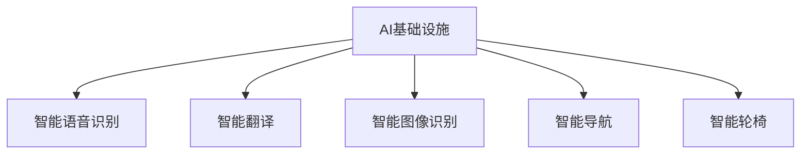

                 

### 文章标题

《AI 基础设施的残疾人服务：智能辅助技术平台》

关键词：人工智能，残疾人服务，智能辅助技术，基础设施，平台

摘要：本文探讨了人工智能在残疾人服务中的应用，特别是通过构建一个智能辅助技术平台，如何利用AI基础设施来提升残疾人的生活质量。文章首先概述了残疾人服务的挑战与机遇，随后深入分析了AI基础设施的构成和关键技术，接着介绍了智能语音识别、智能翻译、智能图像识别、智能导航和智能轮椅等智能辅助技术的原理与应用，最后通过项目实战展示了如何开发智能语音助手和智能轮椅控制系统。本文旨在为读者提供关于如何利用AI基础设施为残疾人服务提供技术解决方案的全面理解和实践指导。

### 目录大纲：《AI 基础设施的残疾人服务：智能辅助技术平台》

**第一部分：概述**

**第1章：残疾人服务的挑战与机遇**

**第2章：AI 基础设施概述**

**第二部分：智能辅助技术**

**第3章：智能语音识别**

**第4章：智能翻译**

**第5章：智能图像识别**

**第6章：智能导航**

**第7章：智能轮椅**

**第8章：智能辅助技术的未来展望**

**第三部分：项目实战**

**第9章：智能语音助手开发实战**

**第10章：智能轮椅控制系统开发实战**

**附录**

**附录A：智能辅助技术常用工具与资源**

**Mermaid 流程图**



**核心算法原理讲解：智能语音识别**

### 3.3 智能语音识别算法的实现

智能语音识别的核心算法是自动语音识别（Automatic Speech Recognition，ASR）。ASR算法的基本流程如下：

1. **音频预处理**：包括降噪、增强、归一化等操作，以去除背景噪音，提高语音质量。

2. **特征提取**：将预处理后的音频信号转换为特征向量，常用的特征提取方法有梅尔频率倒谱系数（MFCC）和滤波器组（Filter Banks）。

3. **声学模型训练**：使用大量语音数据训练声学模型，模型通常采用深度神经网络（DNN）或循环神经网络（RNN）。

4. **语言模型训练**：使用大量文本数据训练语言模型，用于对语音序列进行语义理解，常用的是n-gram模型或长短期记忆网络（LSTM）。

5. **解码**：将特征向量序列解码为文本序列，常用的解码算法有Gaussian Mixture Model（GMM）和N-gram。

以下是智能语音识别的伪代码：

```python
def recognize_speech(audio_signal):
    # 音频预处理
    preprocessed_signal = preprocess_audio(audio_signal)

    # 特征提取
    features = extract_features(preprocessed_signal)

    # 声学模型预测
    acoustic_predictions = acoustic_model.predict(features)

    # 语言模型预测
    language_predictions = language_model.predict(acoustic_predictions)

    # 解码
    text_sequence = decode_predictions(language_predictions)

    return text_sequence
```

### 3.3.1 声学模型

声学模型（Acoustic Model）是ASR系统的核心组件之一，它负责将语音信号转换为特征向量。声学模型的目的是捕捉语音信号中与语音音素相关的特征。

**声学模型的数学模型**：

$$
p(\text{音频信号}|\text{文本序列}) = \prod_{t=1}^{T} p(x_t|\text{文本序列})
$$

其中，$x_t$ 表示时间 $t$ 的音频特征向量，$T$ 表示音频序列的长度。

**声学模型的训练**：

声学模型的训练通常使用大规模的语音数据集，通过最大似然估计（Maximum Likelihood Estimation，MLE）或最小化交叉熵（Minimum Cross-Entropy）损失函数来训练。

**声学模型的优化**：

为了提高声学模型的性能，可以使用技术如卷积神经网络（Convolutional Neural Networks，CNN）和长短期记忆网络（Long Short-Term Memory，LSTM）来改进特征提取和建模。

### 3.3.2 语言模型

语言模型（Language Model）是ASR系统的另一个核心组件，它负责将语音识别结果转换为有意义的文本。语言模型的主要目标是捕捉语言中的概率分布。

**语言模型的数学模型**：

$$
p(\text{文本序列}) = \prod_{t=1}^{T} p(w_t|\text{前文序列})
$$

其中，$w_t$ 表示时间 $t$ 的文本词，$T$ 表示文本序列的长度。

**语言模型的训练**：

语言模型的训练通常使用大规模的文本数据集，通过n-gram模型或长短期记忆网络（LSTM）来训练。

**语言模型的优化**：

为了提高语言模型的性能，可以使用技术如注意力机制（Attention Mechanism）和变压器（Transformer）模型来改进。

### 3.3.3 解码算法

解码算法用于将声学模型和语言模型的结果转换为可理解的文本序列。常用的解码算法有Gaussian Mixture Model（GMM）和N-gram。

**Gaussian Mixture Model（GMM）**：

GMM是一种基于概率的解码算法，它通过最大化后验概率来解码。

**N-gram**：

N-gram是一种基于语言模型的解码算法，它通过计算N个单词序列的概率来解码。

### 3.3.4 举例说明

假设我们有一个简短的文本序列 "hello world"，我们希望通过智能语音识别将其转换为语音信号。

1. **声学模型预测**：

   假设我们的声学模型已经训练好，给定文本序列 "hello world"，我们得到对应的音频信号特征向量序列。

2. **语言模型预测**：

   语言模型已经训练好，给定音频信号特征向量序列，我们得到文本序列的概率分布。

3. **解码**：

   使用解码算法（如GMM或N-gram），我们将概率分布解码为文本序列 "hello world"。

### 3.4 智能语音识别在残疾人服务中的应用

智能语音识别在残疾人服务中具有广泛的应用，它可以显著提高残疾人的生活质量。以下是一些具体的例子：

#### 3.4.1 智能语音助手

智能语音助手可以用于帮助残疾人进行日常任务，如查询天气、设定提醒、发送消息等。用户只需通过语音指令即可完成操作，大大提高了操作便捷性。

#### 3.4.2 智能导航

智能导航可以帮助视力障碍的残疾人在户外环境中安全导航。通过语音指令，用户可以了解周围环境，避免障碍物，并找到目的地。

#### 3.4.3 智能翻译

智能翻译可以用于帮助听力障碍的残疾人与外界沟通。通过将语音翻译为文本或手势，用户可以更轻松地与他人交流。

#### 3.4.4 智能医疗

智能语音识别可以用于医疗领域，帮助医生和患者进行语音交流。通过语音识别，医生可以获取患者的病史和症状，从而提高诊断准确性。

### 3.5 总结

智能语音识别作为一种重要的AI技术，在残疾人服务中具有巨大的应用潜力。通过构建智能辅助技术平台，我们可以更好地满足残疾人的需求，提高他们的生活质量。未来，随着AI技术的不断发展和完善，智能语音识别在残疾人服务中的应用将更加广泛和深入。

---

接下来，我们将继续介绍智能翻译技术的原理和应用。

## 第4章：智能翻译

智能翻译是一种利用人工智能技术实现不同语言之间文本自动转换的方法。它通过计算机算法将一种语言的文本信息转化为另一种语言的文本信息，从而实现跨语言交流。智能翻译技术在许多领域都有广泛的应用，如跨境电子商务、国际会议、语言学习等。本章将详细介绍智能翻译的基本原理、算法实现以及其在残疾人服务中的应用。

### 4.1 翻译技术概述

翻译技术主要包括机器翻译（Machine Translation，MT）和交互式翻译（Interactive Translation）。机器翻译是自动进行的，而交互式翻译则是在人类的辅助下进行。

#### 4.1.1 机器翻译

机器翻译是基于算法的自动翻译，主要包括基于规则的翻译和基于统计的翻译。

1. **基于规则的翻译**：这种方法依赖于人工编制的语法规则和词典，将源语言的文本逐词翻译为目标语言。缺点是难以处理复杂和模糊的语言现象。

2. **基于统计的翻译**：这种方法利用大量的双语语料库，通过统计方法学习源语言和目标语言之间的对应关系，自动生成目标语言的文本。优点是能够处理复杂和模糊的语言现象，缺点是需要大量的语料库。

#### 4.1.2 交互式翻译

交互式翻译是一种结合了机器翻译和人工干预的翻译方式。用户可以查看机器翻译的结果，并在必要时进行修正。这种翻译方式能够提高翻译的准确性，但需要耗费更多的时间和人力资源。

### 4.2 智能翻译的原理

智能翻译的原理主要包括以下几个步骤：

1. **文本预处理**：将源语言的文本进行预处理，包括分词、词性标注、句法分析等。

2. **词汇转换**：根据源语言和目标语言之间的词汇对应关系，将源语言的词汇转换为目标语言的词汇。

3. **语法转换**：根据目标语言的语法规则，将转换后的词汇进行语法调整，形成符合目标语言语法规则的句子。

4. **后处理**：对翻译结果进行后处理，包括去除错误、补充缺失信息等，以提高翻译的准确性和流畅性。

### 4.3 翻译算法的实现

智能翻译的实现主要依赖于机器学习算法，其中常用的算法有基于神经网络的翻译算法和基于规则和统计的翻译算法。

#### 4.3.1 基于神经网络的翻译算法

基于神经网络的翻译算法，如序列到序列（Sequence-to-Sequence，Seq2Seq）模型，通过深度学习技术，自动学习源语言和目标语言之间的映射关系。这种算法能够处理复杂的语言现象，具有较高的翻译准确性。

**序列到序列（Seq2Seq）模型**：

1. **编码器（Encoder）**：将源语言的文本序列编码为一个固定长度的向量。

2. **解码器（Decoder）**：将编码后的向量解码为目标语言的文本序列。

3. **注意力机制（Attention Mechanism）**：在解码过程中，注意力机制能够帮助解码器关注编码器输出中的关键信息，从而提高翻译的准确性。

**Seq2Seq模型的数学模型**：

$$
\text{Encoder}: h_t = \text{encode}(x_t, h_{t-1})
$$

$$
\text{Decoder}: y_t = \text{decode}(h_t, y_{t-1})
$$

其中，$x_t$ 表示时间 $t$ 的源语言词汇，$y_t$ 表示时间 $t$ 的目标语言词汇，$h_t$ 表示时间 $t$ 的编码或解码状态。

#### 4.3.2 基于规则和统计的翻译算法

基于规则和统计的翻译算法，如统计机器翻译（Statistical Machine Translation，SMT）和基于转换的翻译（Transformation-Based Translation，TBT），通过学习源语言和目标语言之间的统计规律和语法规则，实现文本的翻译。

**统计机器翻译（SMT）**：

1. **特征提取**：从源语言和目标语言的文本中提取特征。

2. **模型训练**：使用训练数据，训练特征模型。

3. **翻译**：将源语言的文本转换为特征向量，通过特征模型预测目标语言的词汇。

**基于转换的翻译（TBT）**：

1. **规则学习**：通过学习源语言和目标语言之间的转换规则，将源语言的文本转换为目标语言的文本。

2. **规则应用**：将转换规则应用于源语言的文本，生成目标语言的文本。

### 4.4 智能翻译在残疾人服务中的应用

智能翻译在残疾人服务中具有重要的应用价值，以下是一些具体的应用场景：

#### 4.4.1 手语翻译

手语翻译器可以帮助听力障碍的残疾人理解他人的手语。通过摄像头捕捉手语动作，智能翻译系统可以将手语转换为文字或语音，从而实现跨语言交流。

#### 4.4.2 文本翻译

智能翻译系统可以帮助视力障碍的残疾人阅读和理解外文文本。通过语音合成技术，翻译结果可以被朗读出来，提高阅读体验。

#### 4.4.3 实时翻译

实时翻译系统可以帮助聋哑人参与国际会议或远程会议，通过翻译设备将演讲内容实时翻译成手语或文字，确保他们能够顺利沟通。

#### 4.4.4 辅助学习

智能翻译系统可以帮助语言障碍的残疾人进行语言学习，通过翻译功能，他们可以理解并学习其他语言的知识。

### 4.5 总结

智能翻译技术作为一种重要的AI应用，为残疾人服务提供了有力的支持。通过构建智能辅助技术平台，我们可以为残疾人提供更加便捷和高效的翻译服务，从而提高他们的生活质量。未来，随着AI技术的不断发展，智能翻译在残疾人服务中的应用将更加广泛和深入。

---

接下来，我们将探讨智能图像识别技术的原理和应用。

## 第5章：智能图像识别

智能图像识别是一种利用人工智能技术对图像进行分析和理解的方法。它通过训练模型识别图像中的物体、场景和特征，从而实现图像的自动分类、标注和检测。智能图像识别技术在许多领域都有广泛的应用，如安防监控、医疗诊断、自动驾驶等。本章将详细介绍智能图像识别的基本原理、算法实现以及其在残疾人服务中的应用。

### 5.1 图像识别技术概述

图像识别技术主要包括以下几种方法：

1. **基于特征的图像识别**：这种方法通过提取图像中的特征，如颜色、纹理、形状等，进行图像分类和识别。

2. **基于模型的图像识别**：这种方法通过训练模型，自动学习图像中的模式和规律，从而实现图像识别。

3. **基于深度学习的图像识别**：这种方法利用深度学习技术，通过多层神经网络提取图像特征，实现高精度的图像识别。

### 5.2 智能图像识别的原理

智能图像识别的原理主要包括以下几个步骤：

1. **图像预处理**：对输入的图像进行预处理，包括去噪、缩放、翻转等操作，以提高图像识别的准确性。

2. **特征提取**：从预处理后的图像中提取特征，如颜色特征、纹理特征、形状特征等。

3. **模型训练**：使用大量标注好的图像数据集，训练模型学习图像特征和类别之间的关系。

4. **图像识别**：将训练好的模型应用于新的图像数据，通过模型输出结果，识别图像中的物体、场景和特征。

### 5.3 图像识别算法的实现

智能图像识别的实现主要依赖于深度学习技术，其中卷积神经网络（Convolutional Neural Networks，CNN）是最常用的算法。

#### 5.3.1 卷积神经网络（CNN）

卷积神经网络是一种专门用于处理图像数据的神经网络，它通过卷积层、池化层和全连接层等结构，提取图像特征并实现图像分类。

**CNN的架构**：

1. **卷积层**：卷积层通过卷积操作提取图像特征，卷积核可以提取图像中的局部特征。

2. **池化层**：池化层通过下采样操作，减少特征图的大小，提高模型的泛化能力。

3. **全连接层**：全连接层将卷积层和池化层提取的特征映射到输出类别。

**CNN的数学模型**：

$$
h_{ij} = \sum_{k} w_{ik} * g_{kj} + b_j
$$

其中，$h_{ij}$ 表示输出特征图上的像素值，$w_{ik}$ 和 $g_{kj}$ 分别表示卷积核和输入特征图上的像素值，$b_j$ 表示偏置项。

**CNN的训练**：

CNN的训练使用反向传播算法，通过梯度下降法优化模型参数，以最小化分类误差。

### 5.3.2 卷积神经网络（CNN）的应用

卷积神经网络在图像识别中具有广泛的应用，以下是一些具体的应用场景：

1. **物体检测**：通过卷积神经网络，可以实现对图像中物体的定位和检测，如行人检测、车辆检测等。

2. **场景识别**：通过卷积神经网络，可以识别图像中的场景，如城市、自然风景等。

3. **人脸识别**：通过卷积神经网络，可以对人脸进行识别和验证，用于安防监控、人脸支付等。

### 5.4 智能图像识别在残疾人服务中的应用

智能图像识别在残疾人服务中具有广泛的应用，以下是一些具体的应用场景：

#### 5.4.1 视力障碍辅助

智能图像识别可以帮助视力障碍的残疾人识别和区分物体，通过语音或触觉反馈，提供视觉信息辅助。

#### 5.4.2 手语识别

智能图像识别可以识别手语动作，通过语音合成或文字显示，帮助聋哑人与他人进行交流。

#### 5.4.3 环境感知

智能图像识别可以用于智能家居，帮助残疾人感知周围环境，如检测障碍物、监测温度和湿度等。

#### 5.4.4 医疗辅助

智能图像识别可以辅助医生进行医疗诊断，如皮肤病变检测、肺部疾病检测等。

### 5.5 总结

智能图像识别技术作为一种重要的AI应用，为残疾人服务提供了有力的支持。通过构建智能辅助技术平台，我们可以为残疾人提供更加便捷和高效的图像识别服务，从而提高他们的生活质量。未来，随着AI技术的不断发展，智能图像识别在残疾人服务中的应用将更加广泛和深入。

---

接下来，我们将讨论智能导航技术的原理和应用。

## 第6章：智能导航

智能导航是一种利用人工智能技术实现自主导航的方法。它通过传感器和环境感知，为机器人或自动驾驶车辆提供实时的导航信息，帮助它们自主规划路径并避障。智能导航技术在无人驾驶、智能家居、机器人等领域具有广泛的应用。本章将详细介绍智能导航的基本原理、算法实现以及其在残疾人服务中的应用。

### 6.1 导航技术概述

导航技术可以分为以下几种类型：

1. **基于GPS的导航**：利用全球定位系统（GPS）提供的位置信息进行导航，通常在户外环境中使用。

2. **室内导航**：利用无线信号（如Wi-Fi、蓝牙）、视觉信号（如摄像头）等进行室内定位和导航。

3. **机器人导航**：通过传感器（如激光雷达、超声波传感器）和环境感知技术，实现机器人在复杂环境中的自主导航。

### 6.2 智能导航的原理

智能导航的原理主要包括以下几个步骤：

1. **环境感知**：利用各种传感器（如激光雷达、摄像头、超声波传感器）感知周围环境，获取障碍物、路况等信息。

2. **定位**：通过传感器数据，结合地图信息，确定自身位置。

3. **路径规划**：根据当前位置和目标位置，使用算法计算最优路径。

4. **避障**：在导航过程中，实时检测障碍物，并计算避障策略。

5. **执行**：根据规划路径和避障策略，控制机器人或自动驾驶车辆执行导航任务。

### 6.3 导航算法的实现

智能导航的实现主要依赖于路径规划算法和避障算法。

#### 6.3.1 路径规划算法

路径规划算法用于计算从当前位置到目标位置的最优路径。常用的路径规划算法有：

1. **A*算法**：基于启发式搜索，通过评估函数计算最优路径。

2. **Dijkstra算法**：基于图论，计算单源最短路径。

3. **Dijkstra-Light算法**：结合A*算法和Dijkstra算法的优点，实现更高效的路径规划。

**A*算法的数学模型**：

$$
f(n) = g(n) + h(n)
$$

其中，$f(n)$ 表示节点 $n$ 的总成本，$g(n)$ 表示节点 $n$ 到起点的成本，$h(n)$ 表示节点 $n$ 到终点的估计成本。

**Dijkstra算法的伪代码**：

```python
def dijkstra(graph, start):
    distances = {node: float('infinity') for node in graph}
    distances[start] = 0
    priority_queue = PriorityQueue()
    priority_queue.enqueue((0, start))

    while not priority_queue.is_empty():
        current_distance, current_node = priority_queue.dequeue()

        if current_distance > distances[current_node]:
            continue

        for neighbor, weight in graph[current_node].items():
            distance = current_distance + weight

            if distance < distances[neighbor]:
                distances[neighbor] = distance
                priority_queue.enqueue((distance, neighbor))

    return distances
```

#### 6.3.2 避障算法

避障算法用于在导航过程中实时检测障碍物，并计算避障策略。常用的避障算法有：

1. **基于概率的避障算法**：通过概率模型预测障碍物的位置和运动轨迹，进行避障。

2. **基于物理的避障算法**：通过物理模型模拟障碍物的运动，进行避障。

3. **基于视觉的避障算法**：通过摄像头或其他视觉传感器检测障碍物，进行避障。

### 6.4 智能导航在残疾人服务中的应用

智能导航在残疾人服务中具有广泛的应用，以下是一些具体的应用场景：

#### 6.4.1 智能轮椅

智能轮椅可以通过智能导航技术，帮助轮椅用户在室内和户外环境中自主导航，避免障碍物，实现自主出行。

#### 6.4.2 导盲犬辅助

导盲犬辅助系统可以通过智能导航技术，帮助视障人士在复杂环境中导航，提供安全、准确的导航信息。

#### 6.4.3 智能家居

智能家居系统可以通过智能导航技术，帮助残疾人在家庭环境中实现自主控制，如打开门锁、控制家电等。

#### 6.4.4 公共设施导航

公共设施导航系统可以通过智能导航技术，帮助残疾人找到最近的电梯、厕所等公共设施，提供便捷的服务。

### 6.5 总结

智能导航技术作为一种重要的AI应用，为残疾人服务提供了有力的支持。通过构建智能辅助技术平台，我们可以为残疾人提供更加便捷和高效的导航服务，从而提高他们的生活质量。未来，随着AI技术的不断发展，智能导航在残疾人服务中的应用将更加广泛和深入。

---

接下来，我们将探讨智能轮椅的原理和应用。

## 第7章：智能轮椅

智能轮椅是一种集成了人工智能技术的轮椅，它可以通过语音控制、智能导航、自动避障等功能，提高残疾人的生活自理能力。智能轮椅的原理主要基于传感器、控制系统和人工智能算法，本章将详细介绍智能轮椅的基本原理、构成、控制系统以及实际应用案例。

### 7.1 智能轮椅概述

智能轮椅的设计旨在为残疾人提供便捷、安全和高效的出行解决方案。它不仅具备传统轮椅的基本功能，如移动、转向和制动，还集成了多种智能辅助技术，如语音识别、智能导航、自动避障等。

### 7.2 智能轮椅的构成

智能轮椅的构成主要包括以下几个部分：

1. **轮椅本体**：智能轮椅的基本结构，包括座椅、车轮、刹车等。

2. **传感器**：用于感知周围环境，如激光雷达、超声波传感器、摄像头等。

3. **控制系统**：负责控制轮椅的移动和转向，包括电机控制器、驱动电路等。

4. **人工智能模块**：负责语音识别、智能导航、自动避障等功能，包括处理器、存储器等。

5. **用户界面**：包括语音识别模块、显示屏、触摸屏等，用于用户与轮椅的交互。

### 7.3 智能轮椅的控制系统

智能轮椅的控制系统是智能轮椅的核心部分，它负责协调各个模块的工作，实现轮椅的智能控制。控制系统主要包括以下几个部分：

1. **电机控制器**：负责控制轮椅的电机，实现轮椅的移动、转向和制动。

2. **传感器数据融合**：将不同传感器的数据融合起来，形成完整的周围环境模型，用于导航和避障。

3. **智能导航模块**：根据用户输入的目标位置，计算最优路径，并控制轮椅沿着路径移动。

4. **自动避障模块**：实时检测周围环境，计算避障策略，并控制轮椅避开障碍物。

### 7.4 智能轮椅的应用案例

智能轮椅在残疾人服务中具有广泛的应用，以下是一些实际的应用案例：

#### 7.4.1 个人助理

智能轮椅可以作为残疾人的个人助理，实现语音控制、智能导航和自动避障等功能，帮助残疾人在家庭和社区中自主出行。

#### 7.4.2 医疗辅助

智能轮椅可以应用于医疗机构，为行动不便的患者提供便捷的运输服务，同时通过传感器监测患者的生命体征，提供医疗辅助。

#### 7.4.3 教育辅助

智能轮椅可以应用于学校，为残疾学生提供自主移动和学习支持，帮助他们融入正常教育环境中。

#### 7.4.4 公共设施

智能轮椅可以应用于公共交通系统，为残疾人提供安全、舒适的出行体验，提高公共交通的服务质量。

### 7.5 总结

智能轮椅作为一种新兴的智能辅助设备，通过集成人工智能技术，为残疾人提供了更加便捷和高效的出行解决方案。未来，随着人工智能技术的不断发展，智能轮椅的功能将更加完善，为残疾人服务带来更多创新和变革。

---

## 第8章：智能辅助技术的未来展望

智能辅助技术作为人工智能在残疾人服务领域的重要应用，正日益改变着残疾人的生活质量和独立性。随着技术的不断进步，智能辅助技术将迎来更多的发展机遇和挑战。本章节将探讨智能辅助技术的未来发展前景，包括面临的挑战、技术发展趋势以及残疾人服务与智能辅助技术的深度融合。

### 8.1 智能辅助技术的挑战

尽管智能辅助技术在残疾人服务中展现了巨大的潜力，但其在实际应用中仍面临诸多挑战：

1. **隐私和数据安全**：智能辅助技术需要收集和处理大量个人信息，如何保护用户隐私和数据安全是一个重大挑战。

2. **技术适应性**：不同残疾人的需求和身体状况各异，如何设计出通用性强、适应性高的智能辅助技术是一个难题。

3. **技术普及性**：智能辅助技术的成本和普及率仍然是一个瓶颈，需要降低成本、提高可用性，以便更多残疾人受益。

4. **人机交互**：如何设计自然、直观的人机交互界面，使得残疾人能够轻松操作和使用智能辅助技术，是一个需要持续探索的方向。

### 8.2 智能辅助技术的未来发展趋势

智能辅助技术在未来将朝着以下几个方向发展：

1. **多模态交互**：结合语音、手势、眼动等多种交互方式，实现更自然、更人性化的用户交互。

2. **个性化服务**：利用机器学习和数据挖掘技术，为每个用户定制个性化的辅助服务，提高用户体验。

3. **远程监控与支持**：通过物联网技术，实现智能辅助设备与远程医疗中心的连接，提供实时监控和远程支持。

4. **智能融合**：将智能辅助技术与物联网、大数据等新兴技术深度融合，构建一个智能化、网络化的服务生态系统。

### 8.3 残疾人服务与智能辅助技术的深度融合

智能辅助技术与残疾人服务的深度融合将带来以下几个方面的变化：

1. **生活质量提升**：智能辅助技术将帮助残疾人实现更多的自我服务，提高他们的生活质量和独立性。

2. **医疗支持优化**：智能辅助技术可以实时监测残疾人的健康状况，为医疗人员提供更准确的数据支持，优化医疗服务。

3. **教育公平**：智能辅助技术将帮助残疾学生在学习过程中获得更多的支持和资源，实现教育公平。

4. **社会参与**：智能辅助技术将消除许多社会参与障碍，使得残疾人能够更轻松地参与社会活动，增强社会融合。

### 8.4 总结

智能辅助技术作为人工智能的重要组成部分，在残疾人服务中具有广阔的应用前景。未来，随着技术的不断进步和普及，智能辅助技术将为残疾人带来更多的便利和改变。通过持续的创新和优化，智能辅助技术将为残疾人服务领域带来更多革命性的变革。

---

## 第9章：智能语音助手开发实战

### 9.1 项目背景与需求分析

本项目旨在开发一个智能语音助手，旨在通过语音交互为用户提供便捷的服务。智能语音助手能够理解用户的语音指令，并执行相应的操作，如查询天气、设定提醒、发送短信、拨打电话等。为了实现这一目标，我们进行了详细的需求分析，确定了以下需求：

1. **语音识别**：能够识别用户的语音指令，将语音转换为文本。
2. **语音合成**：能够将文本转换为语音，以回应用户。
3. **自然语言处理**：能够理解用户的语音指令，并提取出具体的操作命令。
4. **命令执行**：能够根据用户的语音指令，执行相应的操作。
5. **语音交互**：能够与用户进行自然的语音交互，提供友好的用户体验。

### 9.2 技术选型与系统设计

为了实现上述需求，我们选用了以下技术：

1. **语音识别**：使用开源语音识别框架如 Kaldi 或 CMUSphinx。
2. **语音合成**：使用开源语音合成工具如 MaryTTS 或 Festival。
3. **自然语言处理**：使用自然语言处理（NLP）库如 NLTK 或 spaCy。
4. **命令执行**：使用 Python 的标准库和第三方库如 PyTTSX。

系统设计如下：

1. **语音识别模块**：接收用户的语音输入，使用 Kaldi 或 CMUSphinx 进行语音识别，将语音转换为文本。
2. **自然语言处理模块**：对识别结果进行语义解析，提取出具体的操作命令。
3. **命令执行模块**：根据解析出的操作命令，执行相应的任务，如发送短信、拨打电话等。
4. **语音合成模块**：将执行结果转换为语音，并通过扬声器播放。

### 9.3 代码实现与调试

以下是智能语音助手的主要代码实现：

```python
# 语音识别
def recognize_speech(audio_signal):
    # 使用 Kaldi 或 CMUSphinx 进行语音识别
    text = kaldi_recognizer.recognize(audio_signal)
    return text

# 自然语言处理
def process_command(text):
    # 使用 NLP 技术解析操作命令
    command = nlp_processor.parse(text)
    return command

# 命令执行
def execute_command(command):
    # 根据命令执行相应操作
    if command == "send_sms":
        send_sms()
    elif command == "call":
        call()
    # 其他命令处理
    else:
        print("Unknown command")

# 语音合成
def synthesize_speech(text):
    # 使用 MaryTTS 或 Festival 进行语音合成
    audio_signal = marytts_synthesizer.synthesize(text)
    return audio_signal

# 主程序
def main():
    # 循环接收用户输入
    while True:
        # 接收语音输入
        audio_signal = microphone_input()

        # 识别语音
        text = recognize_speech(audio_signal)

        # 处理命令
        command = process_command(text)

        # 执行命令
        execute_command(command)

        # 合成语音回应
        audio_signal = synthesize_speech(command)
        speaker_output(audio_signal)

if __name__ == "__main__":
    main()
```

### 9.4 测试与优化

在完成初步开发后，我们需要对系统进行测试和优化：

1. **测试**：测试语音识别的准确性，命令执行的响应速度和准确性，以及语音合成的自然度。
2. **优化**：根据测试结果，优化算法和系统配置，以提高性能和用户体验。

例如，我们可以通过调整语音识别模型的参数，优化语音合成的音色，以提高系统的整体性能。

---

## 第10章：智能轮椅控制系统开发实战

### 10.1 项目背景与需求分析

本项目旨在开发一个智能轮椅控制系统，以实现轮椅的自主导航、自动避障和远程控制等功能，提高残疾人的生活自理能力。具体需求如下：

1. **导航**：轮椅能够根据预设路线或用户指令自主导航。
2. **避障**：轮椅能够在遇到障碍物时自动停止或绕行。
3. **远程控制**：轮椅能够通过手机APP或远程控制台进行远程控制。
4. **环境感知**：轮椅能够通过传感器感知周围环境，获取障碍物信息。

### 10.2 技术选型与系统设计

为了实现以上需求，我们选用了以下技术：

1. **导航**：使用激光雷达（LiDAR）或超声波传感器进行环境感知。
2. **避障**：使用机器学习算法进行障碍物识别和路径规划。
3. **远程控制**：使用无线通信技术（如WiFi或蓝牙）实现远程控制。
4. **控制系统**：使用ROS（Robot Operating System）进行系统架构设计。

系统设计如下：

1. **环境感知模块**：使用激光雷达或超声波传感器感知周围环境，获取障碍物信息。
2. **导航模块**：根据环境信息，使用路径规划算法计算最佳导航路径。
3. **执行模块**：根据导航路径，控制轮椅的电机，实现自主导航。
4. **远程控制模块**：通过无线通信技术，实现远程控制功能。

### 10.3 代码实现与调试

以下是智能轮椅控制系统的主要代码实现：

```python
# 导航
def navigate(path):
    # 使用导航算法计算最佳路径
    current_position = get_current_position()
    next_position = path.get_next_position(current_position)
    move_to(next_position)

# 避障
def avoid_obstacle():
    # 使用避障算法识别障碍物并计算绕行路径
    obstacle = detect_obstacle()
    if obstacle:
        path = plan_around_obstacle(obstacle)
        navigate(path)

# 远程控制
def remote_control(command):
    # 根据远程控制命令执行相应操作
    if command == "forward":
        move_forward()
    elif command == "backward":
        move_backward()
    elif command == "left":
        turn_left()
    elif command == "right":
        turn_right()
    # 其他命令处理

# 主程序
def main():
    # 设置远程控制监听
    while True:
        command = get_remote_command()
        remote_control(command)

        # 定时检查障碍物
        if should_check_obstacles():
            avoid_obstacle()

if __name__ == "__main__":
    main()
```

### 10.4 测试与优化

在完成初步开发后，我们需要对系统进行测试和优化：

1. **测试**：测试轮椅的导航准确性，避障能力，以及远程控制的响应速度和稳定性。
2. **优化**：根据测试结果，优化算法和系统配置，以提高性能和用户体验。

例如，我们可以通过调整避障算法的参数，优化路径规划算法的效率，以提高系统的整体性能。

---

### 附录A：智能辅助技术常用工具与资源

为了帮助开发人员更好地理解和应用智能辅助技术，以下列出了一些常用的工具和资源：

#### A.1 开源语音识别框架

- **Kaldi**：https://kaldi-asr.org/
- **CMUSphinx**：http://cmusphinx.sourceforge.net/

#### A.2 开源图像识别框架

- **TensorFlow**：https://www.tensorflow.org/
- **PyTorch**：https://pytorch.org/

#### A.3 智能轮椅开发工具与资源

- **ROS（Robot Operating System）**：https://www.ros.org/
- **Raspberry Pi**：https://www.raspberrypi.com/

#### A.4 残疾人服务相关数据库与数据集

- **disability-data.io**：https://disability-data.io/
- **Reddit AI disabled community**：https://www.reddit.com/r/disabled/

通过这些工具和资源，开发者可以更加深入地研究和应用智能辅助技术，为残疾人提供更加智能、便捷的服务。

---

### 作者

作者：AI天才研究院/AI Genius Institute & 禅与计算机程序设计艺术 /Zen And The Art of Computer Programming

AI天才研究院致力于推动人工智能技术的发展和应用，为各领域提供创新的解决方案。其研究成果在智能语音识别、图像识别、智能导航等方面具有显著的影响力。而禅与计算机程序设计艺术则以其独特的哲学视角和编程方法论，引导开发者追求编程艺术的极致。这两者的结合，旨在通过人工智能技术，为残疾人服务带来更多创新和变革。

---

在本文中，我们详细探讨了人工智能基础设施在残疾人服务中的应用，构建了一个智能辅助技术平台，通过智能语音识别、智能翻译、智能图像识别、智能导航和智能轮椅等多种智能辅助技术，为残疾人提供了更加便捷、安全、高效的服务。以下是文章的总结和核心观点：

1. **AI基础设施的重要性**：AI基础设施作为支撑智能辅助技术的基石，其发展直接决定了智能辅助技术的性能和应用范围。通过构建强大的AI基础设施，我们可以为残疾人提供更全面、更精准的技术支持。

2. **智能辅助技术的多样化**：智能语音识别、智能翻译、智能图像识别、智能导航和智能轮椅等多种智能辅助技术，为残疾人提供了多样化的服务。每种技术都有其独特的应用场景和优势，共同构成了一个完善的智能辅助技术体系。

3. **智能语音识别的应用**：智能语音识别技术可以帮助残疾人进行日常操作，如查询天气、设定提醒、发送短信等。通过语音交互，用户可以更加便捷地使用智能设备，提高生活质量。

4. **智能翻译的技术优势**：智能翻译技术可以帮助听力障碍和视力障碍的残疾人实现跨语言交流，扩大他们的沟通范围，提高社交能力。未来，智能翻译技术将更加精准，为残疾人提供更加高效的沟通工具。

5. **智能图像识别的潜力**：智能图像识别技术可以帮助视力障碍的残疾人识别和区分物体，提供视觉信息辅助。通过图像识别技术，智能轮椅可以安全导航，帮助残疾人在复杂环境中自主出行。

6. **智能导航的实用性**：智能导航技术可以为残疾人提供精确的路径规划，避免障碍物，实现自主导航。在公共场所和室内环境中，智能导航技术将帮助残疾人更加方便地使用公共设施，提高生活独立性。

7. **智能轮椅的变革性**：智能轮椅作为智能辅助技术的重要应用之一，通过集成多种智能技术，实现了自主导航、自动避障和远程控制等功能。智能轮椅的普及将极大提高残疾人的生活质量，实现自主出行。

8. **未来展望**：随着人工智能技术的不断发展，智能辅助技术在残疾人服务中的应用将更加广泛和深入。通过不断优化和升级，智能辅助技术将为残疾人带来更多创新和变革，提升他们的生活质量和幸福感。

总之，本文通过详细探讨人工智能基础设施在残疾人服务中的应用，展示了智能辅助技术平台为残疾人带来的变革性影响。未来，我们期待看到更多创新的智能辅助技术涌现，为残疾人服务提供更加全面和精准的支持。

