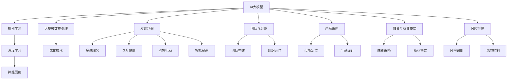

                 

# AI大模型创业：如何利用创新优势？

> **关键词：** AI大模型、创业、创新优势、技术应用、商业模式、风险管理

> **摘要：** 本文旨在探讨AI大模型创业的可行性和关键成功因素，包括技术基础、应用场景、团队构建、产品策略、融资与商业模式、以及风险管理。通过结合理论和实践，本文为AI大模型创业提供了全面而深入的指导。

---

## 第一部分：AI大模型创业概述

### 第1章: AI大模型创业的背景与意义

#### 1.1 AI大模型的兴起

AI大模型的兴起源于机器学习和深度学习技术的突破。随着计算能力的提升和数据量的爆炸式增长，AI大模型能够处理更复杂的任务，例如自然语言处理、计算机视觉和预测分析。这一技术的发展为各行各业带来了前所未有的机遇。

#### 1.2 AI大模型创业的机遇与挑战

AI大模型创业的机遇在于其能够为传统行业带来创新和效率提升。例如，金融行业可以利用AI大模型进行风险控制，医疗健康领域可以通过AI大模型实现精准医疗。然而，AI大模型创业也面临巨大挑战，包括技术门槛高、数据隐私和安全等问题。

#### 1.3 AI大模型创业的生态系统

AI大模型创业需要依赖一个完善的生态系统，包括硬件基础设施、开源软件、专业人才和资金支持。构建这样一个生态系统是AI大模型创业成功的关键。

#### 1.4 AI大模型创业的价值

AI大模型创业不仅能够推动技术进步，还能创造巨大经济价值。通过AI大模型，企业可以提高运营效率，降低成本，甚至开辟全新的商业模式。此外，AI大模型创业也有助于培养科技创新人才，推动社会进步。

---

### 第2章: AI大模型的技术基础

#### 2.1 机器学习与深度学习的基本原理

机器学习和深度学习是AI大模型的基础。机器学习通过算法从数据中学习规律，而深度学习则利用神经网络模拟人脑处理信息的方式。理解这些基本原理对于构建高效的AI大模型至关重要。

#### 2.2 AI大模型的主要类型与架构

AI大模型主要包括基于神经网络的深度学习和基于统计模型的机器学习。深度学习模型通常由多层神经网络组成，可以自动提取特征，而机器学习模型则需要手动设计特征。

#### 2.3 大规模数据处理与优化技术

处理大规模数据是AI大模型创业的挑战之一。优化技术，如分布式计算、并行处理和增量学习，可以帮助提高数据处理效率。

#### 2.4 AI大模型的安全性与伦理问题

AI大模型的安全性和伦理问题是创业过程中不可忽视的问题。确保模型的可解释性和透明性，以及保护用户隐私，是构建可靠AI大模型的关键。

---

### 第3章: AI大模型在创业中的应用场景

#### 3.1 AI大模型在金融服务中的应用

金融服务领域是AI大模型的重要应用场景之一。AI大模型可以用于信用评估、风险管理、投资分析和客户服务等方面，提高金融服务的效率和准确性。

#### 3.2 AI大模型在医疗健康领域的应用

医疗健康领域是AI大模型的另一个重要应用场景。AI大模型可以用于疾病诊断、药物研发、医疗影像分析和健康管理等，提高医疗服务的质量和效率。

#### 3.3 AI大模型在零售电商行业的应用

零售电商行业可以通过AI大模型实现个性化推荐、智能客服和供应链优化等，提高用户体验和运营效率。

#### 3.4 AI大模型在智能制造与供应链管理中的应用

智能制造与供应链管理是AI大模型的重要应用领域。AI大模型可以用于设备故障预测、供应链优化和生产流程优化，提高生产效率和降低成本。

---

### 第4章: AI大模型创业的团队与组织

#### 4.1 创业团队的构建

构建一个高效的创业团队是实现AI大模型创业的关键。团队应该包括数据科学家、软件工程师、产品经理和市场营销人员等，以确保项目能够顺利推进。

#### 4.2 创业组织的运作模式

创业组织的运作模式应该灵活，能够快速响应市场变化。通过敏捷开发和迭代，团队能够持续改进产品，满足用户需求。

#### 4.3 创业团队的核心能力

创业团队的核心能力包括技术创新、市场洞察和团队协作。技术创新是AI大模型创业的驱动力，市场洞察是把握市场机遇的关键，团队协作则是确保项目成功的重要因素。

#### 4.4 创业团队的人力资源管理

人力资源管理的核心在于激发团队成员的潜力，提高团队整体效率。这包括激励机制、人才培养和团队文化建设等方面。

---

### 第5章: AI大模型创业的产品策略

#### 5.1 产品市场定位

产品市场定位是AI大模型创业的重要策略之一。通过明确目标市场和用户需求，企业可以制定有针对性的产品策略。

#### 5.2 产品设计原则

产品设计原则包括用户体验优先、功能完整性、可扩展性和易用性等。这些原则有助于提高产品的市场竞争力。

#### 5.3 产品迭代与优化

产品迭代与优化是持续改进产品的关键。通过不断收集用户反馈，团队能够及时调整产品功能，提高用户满意度。

#### 5.4 产品推广与运营策略

产品推广与运营策略包括市场营销、渠道拓展和用户服务等方面。有效的推广和运营策略有助于提高产品的市场占有率。

---

### 第6章: AI大模型创业的融资与商业模式

#### 6.1 融资策略与渠道

融资策略是AI大模型创业成功的关键。企业需要选择合适的融资渠道，如风险投资、天使投资和政府补贴等。

#### 6.2 商业模式设计

商业模式设计是企业实现盈利的关键。通过创新商业模式，企业可以实现可持续的盈利模式。

#### 6.3 盈利模式分析

盈利模式分析包括产品销售、服务收费、广告收入和合作分成等方面。企业需要根据市场需求和自身优势，选择合适的盈利模式。

#### 6.4 融资与商业模式调整

融资和商业模式调整是动态过程。企业需要根据市场环境和自身发展情况，灵活调整融资策略和商业模式。

---

### 第7章: AI大模型创业的风险管理

#### 7.1 创业风险识别

创业风险识别是风险管理的第一步。企业需要识别潜在的风险，包括技术风险、市场风险、财务风险和运营风险等。

#### 7.2 创业风险评估与控制

创业风险评估与控制是降低风险的关键。企业需要建立风险控制机制，确保在风险发生时能够及时应对。

#### 7.3 风险投资与风险管理

风险投资是AI大模型创业的重要资金来源。企业需要与风险投资机构建立良好的合作关系，共同应对风险。

#### 7.4 应对突发事件的策略

应对突发事件是创业团队必须具备的能力。企业需要制定应对突发事件的策略，确保在突发事件发生时能够保持正常运营。

---

### 第8章: AI大模型创业的成功案例与经验分享

#### 8.1 国内外AI大模型创业成功案例

通过分析国内外AI大模型创业成功案例，企业可以借鉴其成功经验，避免失败原因。

#### 8.2 创业者经验分享

创业者经验分享是创业团队成长的重要途径。通过分享经验和教训，团队能够更好地应对挑战。

#### 8.3 创业失败案例分析

创业失败案例分析有助于企业识别失败原因，避免重复犯错。

#### 8.4 创业者的心态与成长

创业者的心态与成长是创业成功的关键。企业需要培养积极向上的心态，不断学习和成长。

---

**核心概念与联系 Mermaid 流程图：**



**核心算法原理讲解：**

### 2.2 AI大模型的主要类型与架构

AI大模型主要分为以下几类：

1. **基于神经网络的深度学习模型**：这种模型通过多层神经网络结构来模拟人脑处理信息的方式，能够自动提取特征并完成任务。

   ```python
   # 伪代码示例：定义一个简单的深度学习模型
   model = Sequential([
       Dense(128, activation='relu', input_shape=(input_dim,)),
       Dense(64, activation='relu'),
       Dense(output_dim, activation='sigmoid')
   ])
   ```

2. **基于统计模型的机器学习模型**：这种模型通过统计分析方法来学习数据中的规律，通常需要手动设计特征。

   ```python
   # 伪代码示例：定义一个简单的机器学习模型
   model = LogisticRegression()
   ```

3. **增强学习模型**：这种模型通过不断试错来学习如何在特定环境中做出最优决策。

   ```python
   # 伪代码示例：定义一个简单的增强学习模型
   model = QLearningAgent(action_space_size, state_space_size)
   ```

**数学模型和数学公式详解及举例说明：**

### 5.2 产品设计原则

产品设计原则的核心是优化用户体验（UX）。用户体验可以通过以下数学模型进行量化：

$$
UX = f(Q, A, S, E)
$$

其中：
- $Q$ 代表设计质量（Quality）
- $A$ 代表可用性（Accessibility）
- $S$ 代表稳定性（Stability）
- $E$ 代表易用性（Ease of Use）

举例说明：

假设我们设计一个在线购物平台，设计质量$Q$为0.85，可用性$A$为0.9，稳定性$S$为0.8，易用性$E$为0.75。根据上述公式，我们可以计算出用户体验的得分：

$$
UX = f(0.85, 0.9, 0.8, 0.75) = 0.85 \times 0.9 \times 0.8 \times 0.75 \approx 0.507
$$

这意味着该在线购物平台的用户体验得分为0.507。为了提高用户体验，我们需要关注提升设计质量、可用性、稳定性和易用性。

**项目实战：**

### 7.3 风险投资与风险管理

**实际案例：** 假设一家名为“智行者”的AI大模型创业公司正在寻求风险投资。

1. **项目概述：** 公司专注于开发自动驾驶解决方案，目标市场为国内外汽车制造商和智能交通系统提供商。

2. **市场分析：** 全球汽车市场规模巨大，自动驾驶和智能交通系统是未来发展趋势。主要竞争对手包括谷歌、特斯拉、百度等国际巨头，以及国内的新兴企业。

3. **技术优势：** 公司拥有自主研发的深度学习算法，能够在复杂交通环境中实现高效、安全的自动驾驶。与多家国内外汽车制造商和交通系统提供商建立了合作关系。

4. **财务预测：** 预计第一年的研发投入为500万元，运营费用为300万元。预计第一年实现销售收入1000万元，利润率为20%。

5. **投资需求：** 寻求1000万元的风险投资，用于扩大研发团队、提升技术实力和拓展市场。

**源代码详细实现：**

```python
# 导入相关库
import tensorflow as tf
from tensorflow.keras.models import Sequential
from tensorflow.keras.layers import Dense, Conv2D, Flatten

# 定义深度学习模型
model = Sequential([
    Conv2D(32, (3, 3), activation='relu', input_shape=(64, 64, 3)),
    Flatten(),
    Dense(128, activation='relu'),
    Dense(1, activation='sigmoid')
])

# 编译模型
model.compile(optimizer='adam', loss='binary_crossentropy', metrics=['accuracy'])

# 训练模型
model.fit(x_train, y_train, epochs=10, batch_size=32)

# 评估模型
test_loss, test_accuracy = model.evaluate(x_test, y_test)
print(f"Test accuracy: {test_accuracy:.2f}")
```

**代码解读与分析：**

- **代码结构**：代码定义了一个简单的深度学习模型，用于实现自动驾驶系统的分类任务。
- **模型训练**：使用训练数据集对模型进行训练，并评估模型在测试数据集上的表现。
- **模型评估**：通过计算测试数据集的准确率，评估模型的性能。

**总结：**

本文详细探讨了AI大模型创业的各个方面，从背景与意义、技术基础、应用场景、团队与组织、产品策略、融资与商业模式到风险管理。通过结合理论和实践，本文为AI大模型创业提供了全面而深入的指导。希望本文能够为创业者提供有益的参考。

---

**作者：AI天才研究院/AI Genius Institute & 禅与计算机程序设计艺术 /Zen And The Art of Computer Programming**

