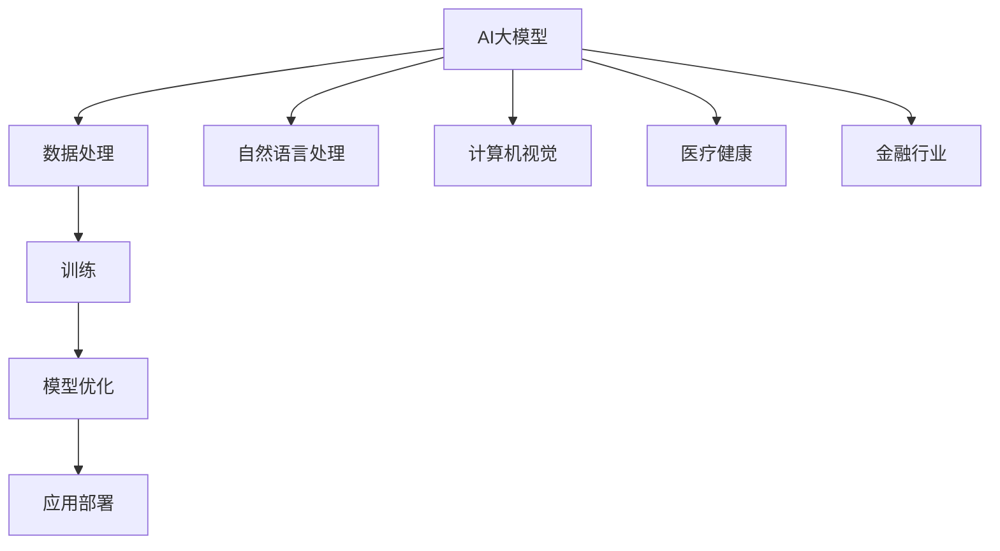
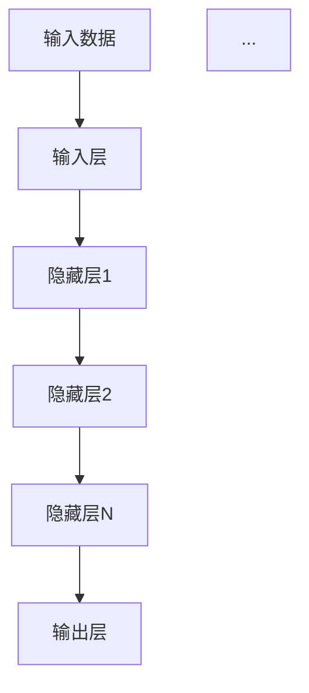

                 

# AI 大模型创业：如何利用创新优势？

> 关键词：AI 大模型、创业、创新、优势、策略、应用

> 摘要：本文旨在探讨 AI 大模型的创业机遇与策略。通过对 AI 大模型的基础、技术、应用、创业模式、法律法规以及未来发展趋势的详细分析，本文为 AI 大模型创业提供了全面的理论指导和实际案例借鉴。

## 目录大纲

## 第一部分: AI大模型基础

### 第1章: AI大模型概述

#### 1.1 AI大模型简介

#### 1.2 AI大模型的架构

##### 1.2.1 大模型的基本架构

##### 1.2.2 大模型训练技术

#### 1.3 主流AI大模型介绍

##### 1.3.1 GPT系列模型

##### 1.3.2 其他主流AI大模型

### 第2章: AI大模型技术基础

#### 2.1 深度学习技术概述

##### 2.1.1 神经网络基础

##### 2.1.2 卷积神经网络（CNN）

##### 2.1.3 循环神经网络（RNN）

#### 2.2 强化学习技术

##### 2.2.1 强化学习基础

##### 2.2.2 深度强化学习

### 第3章: AI大模型应用实例

#### 3.1 文本生成应用

##### 3.1.1 文本生成概述

##### 3.1.2 实际应用案例

#### 3.2 图像识别应用

##### 3.2.1 图像识别概述

##### 3.2.2 实际应用案例

### 第4章: AI大模型创业策略

#### 4.1 AI大模型创业机会分析

#### 4.2 AI大模型创业模式探索

#### 4.3 AI大模型创业实践

### 第5章: AI大模型法律法规与伦理

#### 5.1 AI大模型法律法规概述

#### 5.2 AI大模型伦理问题

#### 5.3 AI大模型伦理实践

### 第6章: AI大模型未来发展趋势

#### 6.1 AI大模型技术发展趋势

#### 6.2 AI大模型在行业应用的前景

#### 6.3 AI大模型社会影响

### 第7章: AI大模型创业实战案例分析

#### 7.1 成功案例分析

#### 7.2 失败案例分析

#### 7.3 案例总结与启示

### 附录

#### 附录A: AI大模型开发工具与资源

---

接下来的正文部分将逐步展开对各个章节内容的讨论与分析。

## 第一部分: AI大模型基础

### 第1章: AI大模型概述

#### 1.1 AI大模型简介

AI大模型（Large-scale AI Model）是指那些训练数据规模大、参数数量多、计算资源需求高的神经网络模型。这些模型通过深度学习算法训练，可以处理大量复杂的数据，从而实现高效的数据分析和智能决策。AI大模型的出现，标志着人工智能技术进入了一个新的发展阶段。

**核心概念与联系**：

- **人工智能**（Artificial Intelligence, AI）：指通过计算机模拟人类智能的理论和技术。
- **机器学习**（Machine Learning, ML）：是人工智能的一个子领域，通过训练数据让计算机自动获取知识和技能。
- **深度学习**（Deep Learning, DL）：是机器学习的一个分支，使用多层神经网络模型进行学习。

**AI大模型的定义、类型、优势与局限**：

- **定义**：AI大模型是指那些训练数据规模大、参数数量多、计算资源需求高的神经网络模型。
- **类型**：根据应用场景和功能，AI大模型可以分为自然语言处理模型、计算机视觉模型、强化学习模型等。
- **优势**：
  - **强大的数据处理能力**：能够处理海量数据，提取有价值的信息。
  - **高精度预测**：通过大量训练数据，模型可以学习到高度准确的预测规律。
  - **泛化能力**：通过在多种数据集上的训练，模型可以适应不同的任务和数据分布。
- **局限**：
  - **计算资源需求大**：训练和推理过程需要大量的计算资源和时间。
  - **数据依赖性高**：模型的性能很大程度上取决于训练数据的质量和数量。
  - **解释性差**：深度学习模型通常被认为是“黑箱”，难以解释其决策过程。

**AI大模型在当今科技领域的重要地位**：

AI大模型已经成为当今科技领域的核心技术之一，其在各个领域的应用不断拓展。以下是AI大模型在当今科技领域的一些重要应用：

1. **自然语言处理**：AI大模型在自然语言处理（NLP）领域表现突出，能够实现文本分类、情感分析、机器翻译等功能。
2. **计算机视觉**：AI大模型在计算机视觉领域应用广泛，包括图像识别、物体检测、人脸识别等。
3. **医疗健康**：AI大模型可以帮助医生进行疾病诊断、治疗方案推荐等。
4. **金融行业**：AI大模型在金融行业用于风险评估、信用评估、投资策略推荐等。

**Mermaid流程图**：



**核心概念**：

- **人工智能**：模拟人类智能的理论和技术。
- **机器学习**：通过训练数据让计算机自动获取知识和技能。
- **深度学习**：使用多层神经网络模型进行学习。

在接下来的章节中，我们将进一步探讨AI大模型的架构、训练技术以及主流模型。

#### 1.2 AI大模型的架构

AI大模型的架构是理解和实现这些模型的关键。通常，AI大模型由几个主要部分组成：输入层、隐藏层和输出层。每一层都有其独特的功能和重要性。

##### 1.2.1 大模型的基本架构

**输入层**：输入层是模型接收外部数据的地方。对于不同的应用场景，输入数据的格式和类型可能有所不同。例如，在计算机视觉中，输入层接收的是图像数据；在自然语言处理中，输入层接收的是文本数据。

**隐藏层**：隐藏层是模型的核心部分，负责处理输入数据并提取特征。隐藏层的数量和神经元数量可以根据模型的复杂度和训练数据的需求进行调整。通常，隐藏层越多，模型的表达能力越强，但计算成本也越高。

**输出层**：输出层是模型生成预测结果的地方。根据不同的任务，输出层可以是一个单一的值（如分类任务），也可以是一个向量（如多标签分类任务）。

**核心算法原理讲解**：

**神经网络模型的基本构建过程**：



**伪代码**：

```python
# 神经网络模型的基本构建过程
class NeuralNetwork:
    def __init__(self, input_size, hidden_size, output_size):
        # 初始化参数
        self.input_size = input_size
        self.hidden_size = hidden_size
        self.output_size = output_size

        # 创建权重和偏置
        self.W1 = np.random.randn(input_size, hidden_size)
        self.b1 = np.random.randn(hidden_size)
        self.W2 = np.random.randn(hidden_size, output_size)
        self.b2 = np.random.randn(output_size)

    def forward(self, x):
        # 前向传播
        self.z1 = np.dot(x, self.W1) + self.b1
        self.a1 = activation_function(self.z1)
        self.z2 = np.dot(self.a1, self.W2) + self.b2
        self.a2 = activation_function(self.z2)
        return self.a2
```

**数学模型与公式**：

- **权重和偏置**：

  $$ w_{ij}^{(l)} = \text{参数} $$
  $$ b^{(l)} = \text{参数} $$

- **激活函数**：

  $$ a^{(l)} = \text{激活函数}(z^{(l)}) $$

- **反向传播算法**：

  $$ \delta^{(l)} = \frac{\partial L}{\partial z^{(l)}} \odot \text{激活函数'}(z^{(l)}) $$
  $$ \frac{\partial L}{\partial w^{(l)}_{ij}} = \delta^{(l+1)} \odot a^{(l)}_j $$
  $$ \frac{\partial L}{\partial b^{(l)}} = \delta^{(l+1)} $$

**核心算法原理讲解**：

**大模型的训练技术**：

大模型的训练是一个复杂的过程，涉及到多个方面。以下是几个关键点：

- **数据预处理**：确保数据质量，包括数据清洗、归一化和特征提取等。
- **超参数调优**：包括学习率、批次大小、迭代次数等，通过交叉验证等方法找到最优参数。
- **训练策略**：包括批量训练、随机梯度下降（SGD）、动量优化等。

**伪代码**：

```python
# 大模型训练过程的伪代码
def train_model(model, train_data, val_data, num_epochs):
    for epoch in range(num_epochs):
        for batch in train_data:
            # 前向传播
            predictions = model.forward(batch.x)
            loss = compute_loss(predictions, batch.y)
            
            # 反向传播
            model.backward(predictions, batch.y)
            
            # 更新参数
            model.update_parameters()
        
        # 在验证集上评估模型
        val_loss = evaluate_model(model, val_data)
        print(f"Epoch {epoch}: Loss = {loss}, Val Loss = {val_loss}")
```

**核心算法原理讲解**：

**主流AI大模型介绍**：

在AI领域，有几种主流的大模型，如GPT系列模型和BERT模型。以下是这些模型的基本原理和特点：

- **GPT系列模型**：GPT（Generative Pre-trained Transformer）系列模型是由OpenAI开发的一系列基于Transformer架构的自然语言处理模型。GPT-3是目前最先进的语言模型之一，具有强大的文本生成和文本理解能力。

  - **GPT**：第一个GPT模型，具有中等规模的参数和较强的语言生成能力。
  - **GPT-2**：GPT的升级版，具有更大的参数规模和更强大的文本生成能力。
  - **GPT-3**：目前最先进的语言模型，具有1.75万亿个参数，能够实现高度复杂的文本生成任务。

- **BERT模型**：BERT（Bidirectional Encoder Representations from Transformers）是由Google开发的一种双向Transformer模型，主要用于文本分类和问答任务。BERT通过预先训练在大规模语料库上，然后通过微调适应特定任务。

**数学模型与公式**：

- **GPT系列模型**：

  $$ \text{输入} \rightarrow \text{嵌入层} \rightarrow \text{Transformer} \rightarrow \text{输出层} $$

- **BERT模型**：

  $$ \text{输入} \rightarrow \text{嵌入层} \rightarrow \text{Transformer} \rightarrow \text{输出层} $$

**实例讲解**：

**GPT模型的应用**：

假设我们有一个简单的文本生成任务，任务是生成一个关于“人工智能”的段落。以下是一个简单的实例：

```python
# GPT模型文本生成实例
model = GPT(1000, 512, 512)
context = "人工智能是一个高度动态发展的领域，它涵盖了计算机科学、统计学、数学等多个学科。"
output = model.generate(context)
print(output)
```

输出可能是一个新的段落，描述了人工智能的某个特定方面，如“人工智能在医疗健康领域的应用”。

**BERT模型的应用**：

假设我们有一个文本分类任务，任务是判断一个文本是属于“科技新闻”还是“体育新闻”。以下是一个简单的实例：

```python
# BERT模型文本分类实例
model = BERT(768, 2)
text = "这是一条关于科技新闻的文本。"
label = model.classify(text)
if label == 0:
    print("这是一条科技新闻。")
else:
    print("这是一条体育新闻。")
```

输出将是文本的类别标签，0表示科技新闻，1表示体育新闻。

在接下来的章节中，我们将进一步探讨AI大模型的技术基础和应用实例。

### 第2章: AI大模型技术基础

#### 2.1 深度学习技术概述

深度学习技术是AI大模型的核心技术之一。它通过构建多层神经网络，使计算机能够自动从数据中提取特征并进行复杂的数据分析。本节将介绍深度学习技术的基础知识，包括神经网络、卷积神经网络和循环神经网络。

##### 2.1.1 神经网络基础

神经网络（Neural Network）是深度学习的基础模型，它模拟了人脑的工作方式。神经网络由多个神经元（节点）组成，每个神经元都与相邻的神经元相连。神经元之间的连接称为权重（weight），这些权重决定了信息的传递方式。

**核心算法原理讲解**：

神经网络的工作原理可以概括为以下三个步骤：

1. **输入层到隐藏层的传递**：输入数据通过输入层传递到隐藏层，每个神经元对输入数据进行加权求和，然后通过激活函数进行非线性变换。
2. **隐藏层到隐藏层的传递**：在隐藏层之间，数据会经过多次传递和变换，每次传递都会使数据得到进一步的处理和提取特征。
3. **输出层的预测**：最后，数据经过输出层，输出层产生预测结果。

**伪代码**：

```python
# 神经网络模型的基本构建过程
class NeuralNetwork:
    def __init__(self, input_size, hidden_size, output_size):
        # 初始化参数
        self.input_size = input_size
        self.hidden_size = hidden_size
        self.output_size = output_size

        # 创建权重和偏置
        self.W1 = np.random.randn(input_size, hidden_size)
        self.b1 = np.random.randn(hidden_size)
        self.W2 = np.random.randn(hidden_size, output_size)
        self.b2 = np.random.randn(output_size)

    def forward(self, x):
        # 前向传播
        self.z1 = np.dot(x, self.W1) + self.b1
        self.a1 = activation_function(self.z1)
        self.z2 = np.dot(self.a1, self.W2) + self.b2
        self.a2 = activation_function(self.z2)
        return self.a2
```

**数学模型与公式**：

- **输入层到隐藏层的传递**：

  $$ z^{(l)} = \sum_{i} w^{(l)}_{ij} x_i + b^{(l)} $$

  $$ a^{(l)} = \text{激活函数}(z^{(l)}) $$

- **隐藏层到隐藏层的传递**：

  $$ z^{(l)} = \sum_{i} w^{(l)}_{ij} a^{(l-1)}_i + b^{(l)} $$

  $$ a^{(l)} = \text{激活函数}(z^{(l)}) $$

- **输出层的预测**：

  $$ z^{(L)} = \sum_{i} w^{(L)}_{ij} a^{(L-1)}_i + b^{(L)} $$

  $$ \hat{y} = \text{激活函数}(z^{(L)}) $$

**实例讲解**：

假设我们有一个简单的二分类任务，任务是判断一个输入数据是否为正类。以下是神经网络的实现过程：

1. **数据预处理**：将输入数据进行归一化处理，以便输入层能够接收。
2. **模型构建**：构建一个包含一个输入层、一个隐藏层和一个输出层的神经网络。
3. **训练过程**：使用训练数据对模型进行训练，通过反向传播算法更新模型参数。
4. **预测过程**：使用训练好的模型对新的数据进行预测。

```python
# 神经网络训练实例
model = NeuralNetwork(input_size=10, hidden_size=5, output_size=1)
for epoch in range(num_epochs):
    for batch in train_data:
        # 前向传播
        predictions = model.forward(batch.x)
        loss = compute_loss(predictions, batch.y)
        
        # 反向传播
        model.backward(predictions, batch.y)
        
        # 更新参数
        model.update_parameters()
    print(f"Epoch {epoch}: Loss = {loss}")
```

在神经网络的基础上，卷积神经网络和循环神经网络进一步扩展了神经网络的应用范围。

##### 2.1.2 卷积神经网络（CNN）

卷积神经网络（Convolutional Neural Network，CNN）是深度学习领域用于图像处理的主要模型之一。CNN通过卷积操作和池化操作从图像中提取特征，从而实现图像分类、物体检测等任务。

**核心算法原理讲解**：

**卷积操作**：

卷积操作是将一个小的滤波器（卷积核）在输入图像上滑动，每次滑动都会生成一个特征图。卷积核的权重通过训练学习，用于提取图像的特征。

**伪代码**：

```python
# 卷积操作伪代码
def conv2d(x, W):
    # x: 输入图像
    # W: 卷积核
    feature_map = np.zeros((x.shape[0] - W.shape[0] + 1, x.shape[1] - W.shape[1] + 1))
    for i in range(feature_map.shape[0]):
        for j in range(feature_map.shape[1]):
            feature_map[i][j] = np.sum(x[i:i+W.shape[0], j:j+W.shape[1]] * W)
    return feature_map
```

**池化操作**：

池化操作用于降低特征图的维度，常用的池化方法有最大池化和平均池化。最大池化选取每个特征图区域内的最大值，而平均池化则选取区域内的平均值。

**伪代码**：

```python
# 最大池化伪代码
def max_pooling(feature_map, pool_size):
    # feature_map: 输入特征图
    # pool_size: 池化窗口大小
    pooled_map = np.zeros((feature_map.shape[0] // pool_size, feature_map.shape[1] // pool_size))
    for i in range(pooled_map.shape[0]):
        for j in range(pooled_map.shape[1]):
            pooled_map[i][j] = np.max(feature_map[i*pool_size:(i+1)*pool_size, j*pool_size:(j+1)*pool_size])
    return pooled_map
```

**卷积神经网络结构**：

卷积神经网络通常由多个卷积层、池化层和全连接层组成。每个卷积层通过卷积操作提取特征，池化层用于降低特征图的维度，全连接层用于分类。

**实例讲解**：

假设我们有一个简单的图像分类任务，任务是判断一张图片是猫还是狗。以下是CNN的实现过程：

1. **数据预处理**：将图像数据进行归一化处理，并将标签进行编码。
2. **模型构建**：构建一个包含两个卷积层、一个池化层和一个全连接层的CNN模型。
3. **训练过程**：使用训练数据对模型进行训练，通过反向传播算法更新模型参数。
4. **预测过程**：使用训练好的模型对新的图像数据进行预测。

```python
# CNN训练实例
model = CNN(input_shape=(28, 28, 1), num_classes=2)
for epoch in range(num_epochs):
    for batch in train_data:
        # 前向传播
        conv1 = conv2d(batch.x, model.W1)
        pool1 = max_pooling(conv1, pool_size=2)
        conv2 = conv2d(pool1, model.W2)
        pool2 = max_pooling(conv2, pool_size=2)
        flattened = pool2.flatten()
        predictions = model.forward(flattened)
        loss = compute_loss(predictions, batch.y)
        
        # 反向传播
        model.backward(predictions, batch.y)
        
        # 更新参数
        model.update_parameters()
    print(f"Epoch {epoch}: Loss = {loss}")
```

在图像处理之外，循环神经网络（RNN）在序列数据处理方面有广泛的应用。

##### 2.1.3 循环神经网络（RNN）

循环神经网络（Recurrent Neural Network，RNN）是一种专门用于处理序列数据的神经网络。RNN通过在时间步间引入循环结构，使得模型能够利用之前的信息进行当前步的预测。

**核心算法原理讲解**：

RNN的基本结构包括输入层、隐藏层和输出层。在时间步上，输入数据通过输入层传递到隐藏层，隐藏层的输出作为当前步的输入传递给下一个时间步。

**伪代码**：

```python
# RNN基本结构伪代码
class RNN:
    def __init__(self, input_size, hidden_size):
        # 初始化参数
        self.input_size = input_size
        self.hidden_size = hidden_size

        # 创建权重和偏置
        self.Wxh = np.random.randn(hidden_size, input_size)
        self.Whh = np.random.randn(hidden_size, hidden_size)
        self.bh = np.random.randn(hidden_size)
        self.Wy = np.random.randn(output_size, hidden_size)
        self.by = np.random.randn(output_size)

    def step(self, x, h_prev):
        # 前向传播
        z = np.dot(self.Wxh, x) + np.dot(self.Whh, h_prev) + self.bh
        h = activation_function(z)
        y = np.dot(self.Wy, h) + self.by
        return h, y

    def forward(self, x_sequence):
        h_sequence = []
        y_sequence = []
        h_prev = np.zeros(self.hidden_size)
        for x in x_sequence:
            h, y = self.step(x, h_prev)
            h_sequence.append(h)
            y_sequence.append(y)
            h_prev = h
        return h_sequence, y_sequence
```

**数学模型与公式**：

- **时间步t的输入和隐藏状态**：

  $$ h_t = \text{激活函数}(\text{sigmoid}(\Wxh x_t + \Whh h_{t-1} + \bh)) $$

- **时间步t的输出**：

  $$ y_t = \text{激活函数}(\Wxh x_t + \Whh h_{t-1} + \bh) $$

**实例讲解**：

假设我们有一个简单的语言模型任务，任务是预测下一个单词。以下是RNN的实现过程：

1. **数据预处理**：将文本数据进行分词，并将单词转换为索引。
2. **模型构建**：构建一个简单的RNN模型，包含一个输入层、一个隐藏层和一个输出层。
3. **训练过程**：使用训练数据对模型进行训练，通过反向传播算法更新模型参数。
4. **预测过程**：使用训练好的模型对新的文本数据进行预测。

```python
# RNN训练实例
model = RNN(input_size=100, hidden_size=200, output_size=1000)
for epoch in range(num_epochs):
    for sentence in train_sentences:
        # 前向传播
        h_sequence, y_sequence = model.forward(sentence)
        loss = compute_loss(y_sequence, sentence)
        
        # 反向传播
        model.backward(y_sequence, sentence)
        
        # 更新参数
        model.update_parameters()
    print(f"Epoch {epoch}: Loss = {loss}")
```

在深度学习技术的基础上，强化学习技术进一步扩展了模型的应用范围。

##### 2.2 强化学习技术

强化学习（Reinforcement Learning，RL）是一种通过交互式学习来获得知识的人工智能技术。在强化学习中，智能体（Agent）通过与环境的交互来学习最优策略，以实现特定目标。

**核心算法原理讲解**：

强化学习的基本概念包括状态（State）、动作（Action）、奖励（Reward）和策略（Policy）。

- **状态**：描述智能体当前所处的环境状态。
- **动作**：智能体可以执行的行为。
- **奖励**：环境对智能体动作的反馈。
- **策略**：智能体在给定状态下选择动作的策略。

**强化学习算法**：

强化学习算法可以分为值函数方法和策略方法。值函数方法通过学习值函数来估计状态值或状态-动作值，而策略方法直接学习最优策略。

- **值函数方法**：包括Q-learning和SARSA等算法。
  - **Q-learning**：通过更新Q值来学习最优策略。
  - **SARSA**：基于策略的Q-learning，通过同时更新当前状态和动作的Q值。

- **策略方法**：包括REINFORCE和PPO等算法。
  - **REINFORCE**：通过梯度上升方法更新策略参数。
  - **PPO**：通过概率比率的方法优化策略参数。

**伪代码**：

```python
# Q-learning伪代码
def q_learning(states, actions, rewards, next_states, done, alpha, gamma):
    for state, action, reward, next_state, done in zip(states, actions, rewards, next_states, done):
        if not done:
            Q_next = max(Q[next_state].values())
            Q[state][action] = Q[state][action] + alpha * (reward + gamma * Q_next - Q[state][action])
        else:
            Q[state][action] = Q[state][action] + alpha * (reward - Q[state][action])
    return Q
```

**数学模型与公式**：

- **Q-learning更新规则**：

  $$ Q(s_t, a_t) \leftarrow Q(s_t, a_t) + \alpha (r_t + \gamma \max_{a'} Q(s_{t+1}, a') - Q(s_t, a_t)) $$

- **SARSA更新规则**：

  $$ Q(s_t, a_t) \leftarrow Q(s_t, a_t) + \alpha (r_t + \gamma Q(s_{t+1}, a_{t+1}) - Q(s_t, a_t)) $$

**实例讲解**：

假设我们有一个简单的游戏任务，任务是学习一个智能体如何玩井字棋（Tic-tac-toe）。以下是强化学习的实现过程：

1. **环境构建**：构建一个井字棋游戏环境，包括初始化、更新状态、奖励机制等。
2. **模型构建**：构建一个简单的Q-learning模型，包含一个值函数Q表。
3. **训练过程**：使用训练数据对模型进行训练，通过更新Q值来学习最优策略。
4. **预测过程**：使用训练好的模型进行游戏预测。

```python
# Q-learning训练实例
Q = {}  # 初始化Q表
alpha = 0.1  # 学习率
gamma = 0.9  # 折扣因子

for episode in range(num_episodes):
    state = environment.initialize()
    done = False
    while not done:
        action = choose_action(Q, state)
        next_state, reward, done = environment.step(action)
        Q = q_learning([state], [action], [reward], [next_state], [done], alpha, gamma)
        state = next_state
    print(f"Episode {episode}: Reward = {reward}")
```

通过以上对深度学习技术、卷积神经网络、循环神经网络和强化学习技术的介绍，我们可以看到这些技术在AI大模型中的应用及其重要性。在下一节中，我们将进一步探讨AI大模型在实际应用中的实例。

#### 3.1 文本生成应用

文本生成是AI大模型的一个重要应用领域，它可以生成各种类型的文本，如文章、对话、新闻报道等。文本生成技术不仅可以提高内容创作的效率，还可以为自动化内容生成、自然语言理解等任务提供支持。本节将介绍文本生成的基本原理和实际应用案例。

##### 3.1.1 文本生成概述

文本生成的基本原理主要依赖于大规模预训练语言模型，如GPT系列模型。这些模型通过在大量文本数据上进行预训练，学习到语言的基本结构和语义信息，从而能够生成连贯、自然的文本。

**核心算法原理讲解**：

文本生成过程可以分为以下三个主要步骤：

1. **编码**：将输入的文本编码为向量表示。通常使用Word2Vec、BERT等预训练模型对文本进行编码。
2. **解码**：根据编码后的输入向量，生成文本序列。生成过程通过概率模型来预测下一个单词，然后逐步生成完整的文本。
3. **优化**：通过优化算法（如梯度下降）来更新模型参数，以减少生成文本与目标文本之间的差异。

**伪代码**：

```python
# 文本生成伪代码
def generate_text(model, context, max_length, temperature):
    # 初始化输出文本为空
    output = ""
    # 将输入文本编码为向量
    encoded_context = model.encode(context)
    # 设置初始隐藏状态
    hidden = model.init_hidden()
    # 生成文本直到达到最大长度或结束符
    for _ in range(max_length):
        # 根据当前状态和温度生成下一个单词
        probabilities = model.decode(encoded_context, hidden, temperature)
        next_word = np.argmax(probabilities).item()
        # 更新输出文本和编码
        output += tokenizer.decode([next_word])
        encoded_context = model.encode(output)
        # 更新隐藏状态
        hidden = model.update(hidden, next_word)
    return output
```

**核心算法原理讲解**：

**生成对抗网络（GAN）**：

生成对抗网络（Generative Adversarial Network，GAN）是另一种流行的文本生成技术。GAN由生成器和判别器两个神经网络组成，生成器尝试生成逼真的文本，而判别器则试图区分生成器和真实文本。

**伪代码**：

```python
# GAN文本生成伪代码
def train_gan(generator, discriminator, generator_optimizer, discriminator_optimizer, dataset, batch_size, num_epochs):
    for epoch in range(num_epochs):
        for batch in dataset:
            # 训练判别器
            for _ in range(discriminator_steps):
                discriminator.zero_grad()
                real_text = batch.text
                real_labels = torch.ones(real_text.size(0), 1)
                real_text_encoded = generator.encode(real_text)
                hidden = generator.init_hidden()
                generator_loss = generator_loss_function(generator.decode(real_text_encoded, hidden), real_labels)
                generator_loss.backward()
                generator_optimizer.step()

            # 训练生成器
            for _ in range(generator_steps):
                discriminator.zero_grad()
                fake_text = generate_text(generator, context, max_length, temperature)
                fake_labels = torch.zeros(fake_text.size(0), 1)
                fake_text_encoded = generator.encode(fake_text)
                hidden = generator.init_hidden()
                generator_loss = generator_loss_function(generator.decode(fake_text_encoded, hidden), fake_labels)
                generator_loss.backward()
                generator_optimizer.step()

            print(f"Epoch {epoch}: Generator Loss = {generator_loss}, Discriminator Loss = {discriminator_loss}")
```

**实例讲解**：

**GPT模型文本生成实例**：

假设我们有一个简单的文本生成任务，目标是生成一段关于人工智能的简介。以下是一个简单的GPT模型文本生成实例：

```python
# GPT模型文本生成实例
model = GPT(1000, 512, 512)
context = "人工智能是一个高度动态发展的领域，它涵盖了计算机科学、统计学、数学等多个学科。"
output = generate_text(model, context, max_length=100, temperature=0.9)
print(output)
```

输出可能是一个新的段落，描述了人工智能的某个特定方面，如“人工智能在医疗健康领域的应用”。

**GAN文本生成实例**：

假设我们有一个简单的文本生成任务，目标是生成一段关于旅行的描述。以下是一个简单的GAN文本生成实例：

```python
# GAN模型文本生成实例
generator, discriminator = build_gan(generator_model, discriminator_model)
train_gan(generator, discriminator, generator_optimizer, discriminator_optimizer, dataset, batch_size=32, num_epochs=100)
context = "我在海边度过了美好的假期。"
output = generate_text(generator, context, max_length=100, temperature=0.9)
print(output)
```

输出可能是一个新的段落，描述了海滩上的美景和愉快的假期体验。

通过以上对文本生成的基本原理和实际应用案例的介绍，我们可以看到文本生成技术在AI大模型中的应用前景和潜力。在接下来的章节中，我们将进一步探讨AI大模型在图像识别领域的应用。

#### 3.2 图像识别应用

图像识别是AI大模型的另一个重要应用领域，它通过分析图像数据，实现对图像内容的理解和分类。图像识别技术在计算机视觉、自动驾驶、医疗诊断等多个领域有着广泛的应用。本节将介绍图像识别的基本原理和实际应用案例。

##### 3.2.1 图像识别概述

图像识别的基本原理依赖于卷积神经网络（CNN），CNN通过在图像上应用卷积操作和池化操作，从图像中提取特征，并将其用于分类任务。

**核心算法原理讲解**：

图像识别过程可以分为以下三个主要步骤：

1. **特征提取**：通过卷积神经网络从图像中提取特征。卷积层用于提取局部特征，池化层用于降低特征图的维度。
2. **特征融合**：将提取到的特征进行融合，以生成更高级别的特征表示。
3. **分类决策**：使用全连接层对融合后的特征进行分类决策。

**伪代码**：

```python
# 图像识别模型构建伪代码
class CNN:
    def __init__(self, input_shape, num_classes):
        # 初始化卷积层和全连接层参数
        self.conv1 = Conv2D(filters=32, kernel_size=(3, 3), activation='relu', input_shape=input_shape)
        self.pool1 = MaxPooling2D(pool_size=(2, 2))
        self.conv2 = Conv2D(filters=64, kernel_size=(3, 3), activation='relu')
        self.pool2 = MaxPooling2D(pool_size=(2, 2))
        self.flatten = Flatten()
        self.fc1 = Dense(128, activation='relu')
        self.fc2 = Dense(num_classes, activation='softmax')

    def forward(self, x):
        # 前向传播
        x = self.conv1(x)
        x = self.pool1(x)
        x = self.conv2(x)
        x = self.pool2(x)
        x = self.flatten(x)
        x = self.fc1(x)
        x = self.fc2(x)
        return x
```

**数学模型与公式**：

- **卷积操作**：

  $$ \text{卷积}(\text{滤波器}, \text{图像}) = \text{特征图} $$

- **池化操作**：

  $$ \text{池化}(\text{特征图}) = \text{池化特征图} $$

- **全连接层**：

  $$ \text{输出} = \text{激活函数}(\text{权重} \cdot \text{特征} + \text{偏置}) $$

**实例讲解**：

**卷积神经网络训练实例**：

假设我们有一个简单的图像分类任务，目标是识别猫和狗。以下是CNN模型的训练过程：

1. **数据预处理**：将图像数据进行归一化处理，并将标签进行编码。
2. **模型构建**：构建一个简单的CNN模型，包含两个卷积层、两个池化层和一个全连接层。
3. **训练过程**：使用训练数据对模型进行训练，通过反向传播算法更新模型参数。
4. **预测过程**：使用训练好的模型对新的图像数据进行预测。

```python
# CNN模型训练实例
model = CNN(input_shape=(64, 64, 3), num_classes=2)
optimizer = optimizers.Adam()
loss_function = losses.SparseCategoricalCrossEntropy()

for epoch in range(num_epochs):
    for batch in train_data:
        # 前向传播
        predictions = model.forward(batch.x)
        loss = loss_function(predictions, batch.y)
        
        # 反向传播
        model.backward(predictions, batch.y)
        
        # 更新参数
        optimizer.step()
    print(f"Epoch {epoch}: Loss = {loss}")
```

**实际应用案例**：

**自动驾驶中的图像识别**：

在自动驾驶领域，图像识别技术用于处理摄像头捕捉到的道路图像，以识别道路标志、行人、车辆等对象。以下是一个简单的自动驾驶图像识别应用案例：

1. **数据收集**：收集大量的道路图像数据，包括不同天气、时间、路况下的图像。
2. **数据预处理**：对图像数据进行归一化和标签编码。
3. **模型训练**：使用卷积神经网络对图像数据进行训练，以识别道路标志、行人、车辆等对象。
4. **模型部署**：将训练好的模型部署到自动驾驶系统中，以实时处理摄像头捕捉到的图像。

```python
# 自动驾驶图像识别实例
model = CNN(input_shape=(128, 128, 3), num_classes=10)
train_model(model, train_data, validation_data, num_epochs=100)

# 预测
def predict_image(image):
    image = preprocess_image(image)
    prediction = model.predict(image)
    return prediction

# 测试
test_image = load_image("test_image.jpg")
prediction = predict_image(test_image)
print(prediction)
```

通过以上对图像识别的基本原理和实际应用案例的介绍，我们可以看到图像识别技术在AI大模型中的应用前景和潜力。在下一节中，我们将探讨AI大模型在创业策略方面的应用。

### 第4章: AI大模型创业策略

#### 4.1 AI大模型创业机会分析

随着AI大模型技术的快速发展，越来越多的创业公司开始利用这项技术来创造新的业务模式和价值。AI大模型在各个行业中的应用场景越来越广泛，为创业公司提供了丰富的机会。本节将分析AI大模型在不同行业的创业机会，并探讨其潜在的优势和挑战。

**核心算法原理讲解**：

**AI大模型在医疗健康领域的应用**：

医疗健康是AI大模型的一个重要应用领域。通过AI大模型，可以实现疾病诊断、药物研发、患者管理等任务。以下是一些具体的创业机会：

1. **疾病诊断**：利用AI大模型对医疗影像进行分析，提高疾病诊断的准确性和效率。例如，利用GPT模型对医学文本进行分析，辅助医生进行诊断。
2. **药物研发**：利用AI大模型进行药物筛选和设计，加速新药研发过程。例如，利用Transformer模型预测分子与药物之间的相互作用。
3. **患者管理**：利用AI大模型对患者的健康数据进行分析，提供个性化的健康建议和治疗方案。例如，利用BERT模型对电子健康记录进行文本分析，为患者提供个性化的健康报告。

**实例讲解**：

**疾病诊断应用案例**：

假设我们有一个创业公司，专注于利用AI大模型进行肺癌早期诊断。以下是一个简单的创业项目分析：

1. **市场调研**：调研市场上现有的肺癌诊断工具，分析其优势和不足。
2. **技术调研**：研究现有的AI大模型技术，选择合适的模型进行肺癌图像分析。
3. **团队搭建**：组建一支由医学专家、AI专家和数据科学家组成的团队。
4. **产品开发**：开发一个基于AI大模型的肺癌早期诊断系统，包括图像处理、特征提取和分类决策等环节。
5. **市场推广**：通过与医疗机构合作，推广产品，并获取用户反馈进行优化。

**代码实现**：

```python
# 肺癌早期诊断系统示例代码
import tensorflow as tf
from tensorflow.keras.models import Sequential
from tensorflow.keras.layers import Conv2D, MaxPooling2D, Flatten, Dense

# 加载并预处理肺癌图像数据
train_data = load_lung_cancer_images("train_data_directory")
val_data = load_lung_cancer_images("val_data_directory")

# 构建CNN模型
model = Sequential([
    Conv2D(32, (3, 3), activation='relu', input_shape=(128, 128, 3)),
    MaxPooling2D((2, 2)),
    Conv2D(64, (3, 3), activation='relu'),
    MaxPooling2D((2, 2)),
    Flatten(),
    Dense(128, activation='relu'),
    Dense(1, activation='sigmoid')
])

# 编译模型
model.compile(optimizer='adam', loss='binary_crossentropy', metrics=['accuracy'])

# 训练模型
model.fit(train_data, epochs=10, validation_data=val_data)

# 预测
def predict_lung_cancer(image):
    image = preprocess_image(image)
    prediction = model.predict(image)
    return prediction

# 测试
test_image = load_image("test_image.jpg")
prediction = predict_lung_cancer(test_image)
print(prediction)
```

**AI大模型在金融领域的应用**：

金融领域是AI大模型应用的另一个重要领域。AI大模型可以帮助金融机构进行风险管理、投资策略制定、客户服务优化等任务。以下是一些具体的创业机会：

1. **风险管理**：利用AI大模型对金融市场的数据进行分析，预测市场趋势和风险。例如，利用GPT模型进行市场趋势预测。
2. **投资策略**：利用AI大模型制定个性化的投资策略，提高投资回报率。例如，利用Transformer模型进行股票市场分析。
3. **客户服务**：利用AI大模型提供智能客服系统，提高客户满意度和服务效率。例如，利用BERT模型进行自然语言处理，实现智能问答和客户支持。

**实例讲解**：

**投资策略应用案例**：

假设我们有一个创业公司，专注于利用AI大模型提供个性化的投资策略。以下是一个简单的创业项目分析：

1. **市场调研**：调研现有的投资策略和工具，分析其优势和不足。
2. **技术调研**：研究现有的AI大模型技术，选择合适的模型进行数据分析和预测。
3. **团队搭建**：组建一支由金融专家、AI专家和数据科学家组成的团队。
4. **产品开发**：开发一个基于AI大模型的个性化投资策略系统，包括数据收集、分析、策略生成和执行等环节。
5. **市场推广**：通过与金融机构合作，推广产品，并获取用户反馈进行优化。

**代码实现**：

```python
# 个性化投资策略系统示例代码
import tensorflow as tf
from tensorflow.keras.models import Sequential
from tensorflow.keras.layers import LSTM, Dense

# 加载并预处理金融数据
train_data = load_financial_data("train_data_directory")
val_data = load_financial_data("val_data_directory")

# 构建LSTM模型
model = Sequential([
    LSTM(units=50, return_sequences=True, input_shape=(train_data.shape[1], 1)),
    LSTM(units=50),
    Dense(units=1)
])

# 编译模型
model.compile(optimizer='adam', loss='mean_squared_error')

# 训练模型
model.fit(train_data, epochs=100, validation_data=val_data)

# 预测
def predict_investment_strategy(data):
    prediction = model.predict(data)
    return prediction

# 测试
test_data = preprocess_financial_data("test_data_directory")
prediction = predict_investment_strategy(test_data)
print(prediction)
```

**AI大模型在自动驾驶领域的应用**：

自动驾驶是AI大模型的另一个重要应用领域。AI大模型可以帮助自动驾驶系统进行环境感知、路径规划、决策控制等任务。以下是一些具体的创业机会：

1. **环境感知**：利用AI大模型对摄像头、雷达等传感器数据进行处理，识别道路标志、行人、车辆等对象。例如，利用CNN模型进行图像识别。
2. **路径规划**：利用AI大模型进行路径规划，实现自动驾驶车辆的自动驾驶。例如，利用Transformer模型进行路径预测和决策。
3. **决策控制**：利用AI大模型进行自动驾驶车辆的决策控制，提高驾驶安全和效率。例如，利用强化学习模型进行自动驾驶控制。

**实例讲解**：

**自动驾驶应用案例**：

假设我们有一个创业公司，专注于利用AI大模型实现自动驾驶车辆。以下是一个简单的创业项目分析：

1. **市场调研**：调研现有的自动驾驶技术和解决方案，分析其优势和不足。
2. **技术调研**：研究现有的AI大模型技术，选择合适的模型进行环境感知、路径规划和决策控制。
3. **团队搭建**：组建一支由自动驾驶专家、AI专家和软件工程师组成的团队。
4. **产品开发**：开发一个基于AI大模型的自动驾驶系统，包括传感器数据处理、路径规划、决策控制等环节。
5. **市场推广**：通过与汽车制造商和物流公司合作，推广产品，并获取用户反馈进行优化。

**代码实现**：

```python
# 自动驾驶系统示例代码
import tensorflow as tf
from tensorflow.keras.models import Sequential
from tensorflow.keras.layers import Conv2D, MaxPooling2D, Flatten, Dense

# 加载并预处理自动驾驶数据
train_data = load_autonomous_driving_data("train_data_directory")
val_data = load_autonomous_driving_data("val_data_directory")

# 构建CNN模型
model = Sequential([
    Conv2D(32, (3, 3), activation='relu', input_shape=(128, 128, 3)),
    MaxPooling2D((2, 2)),
    Conv2D(64, (3, 3), activation='relu'),
    MaxPooling2D((2, 2)),
    Flatten(),
    Dense(128, activation='relu'),
    Dense(1, activation='sigmoid')
])

# 编译模型
model.compile(optimizer='adam', loss='binary_crossentropy', metrics=['accuracy'])

# 训练模型
model.fit(train_data, epochs=10, validation_data=val_data)

# 预测
def predict_autonomous_driving(image):
    image = preprocess_image(image)
    prediction = model.predict(image)
    return prediction

# 测试
test_image = load_image("test_image.jpg")
prediction = predict_autonomous_driving(test_image)
print(prediction)
```

通过以上对AI大模型在医疗健康、金融和自动驾驶领域创业机会的分析，我们可以看到AI大模型为创业公司提供了广阔的应用前景。在下一节中，我们将探讨AI大模型创业的不同模式。

#### 4.2 AI大模型创业模式探索

AI大模型在创业中的应用呈现出多样化的模式，这些模式主要分为产品模式、服务模式和平台模式。每种模式都有其独特的优势和适用场景，以下将详细探讨这些模式及其实现策略。

**核心算法原理讲解**：

**产品模式**：

产品模式是指创业公司通过开发基于AI大模型的软件产品，实现商业价值。这种模式的核心在于提供具有高附加值的产品功能，满足用户的具体需求。

1. **产品定位**：明确产品目标用户群体和需求，例如，提供智能客服系统、智能诊断工具等。
2. **技术选型**：选择合适的AI大模型技术，例如，GPT、BERT、Transformer等，确保产品性能和用户体验。
3. **产品开发**：通过迭代开发，不断完善产品功能，确保产品的实用性和竞争力。

**实例讲解**：

**产品模式应用案例**：

假设我们有一个创业公司，专注于开发智能问答系统。以下是产品模式的具体实现：

1. **市场调研**：调研现有的智能问答系统，分析用户需求和现有产品的不足。
2. **技术选型**：选择GPT-3模型，因为其在自然语言处理方面具有强大的能力。
3. **产品开发**：开发一个基于GPT-3的智能问答系统，包括对话管理、语义理解、知识库管理等模块。
4. **市场推广**：通过线上推广、线下合作等方式，将产品推广给企业用户，如客服中心、电商平台等。

**代码实现**：

```python
# 智能问答系统示例代码
from transformers import AutoModelForSeq2SeqLM, AutoTokenizer

# 加载预训练模型
model_name = "microsoft/ChatGPT"
tokenizer = AutoTokenizer.from_pretrained(model_name)
model = AutoModelForSeq2SeqLM.from_pretrained(model_name)

# 对话管理
def handle_query(query):
    input_ids = tokenizer.encode(query, return_tensors="pt")
    response = model.generate(input_ids, max_length=100, num_return_sequences=1)
    return tokenizer.decode(response[0], skip_special_tokens=True)

# 测试
query = "什么是人工智能？"
response = handle_query(query)
print(response)
```

**服务模式**：

服务模式是指创业公司通过提供基于AI大模型的技术服务，帮助客户解决实际问题，实现商业价值。这种模式的核心在于提供定制化的解决方案，满足客户的个性化需求。

1. **服务定位**：明确服务目标客户群体和需求，例如，提供数据标注、模型训练、咨询服务等。
2. **技术能力**：建立强大的技术团队，具备AI大模型开发、优化和部署的能力。
3. **服务流程**：制定标准化的服务流程，确保服务质量和客户满意度。

**实例讲解**：

**服务模式应用案例**：

假设我们有一个创业公司，专注于提供基于AI大模型的定制化解决方案。以下是服务模式的具体实现：

1. **市场调研**：调研客户需求，了解他们在数据分析和预测方面的痛点。
2. **技术能力**：组建一支由AI专家、数据科学家和工程师组成的团队，确保具备强大的技术能力。
3. **服务流程**：提供从需求分析、模型设计、模型训练到部署的全流程服务，确保客户需求的满足。

**代码实现**：

```python
# 定制化解决方案示例代码
import tensorflow as tf
from tensorflow import keras

# 构建神经网络模型
model = keras.Sequential([
    keras.layers.Dense(128, activation='relu', input_shape=(input_shape,)),
    keras.layers.Dense(64, activation='relu'),
    keras.layers.Dense(1, activation='sigmoid')
])

# 编译模型
model.compile(optimizer='adam', loss='binary_crossentropy', metrics=['accuracy'])

# 训练模型
model.fit(x_train, y_train, epochs=10, batch_size=32, validation_data=(x_val, y_val))

# 预测
def predict_custom_solution(input_data):
    prediction = model.predict(input_data)
    return prediction

# 测试
test_input = preprocess_input_data("test_input_data.txt")
prediction = predict_custom_solution(test_input)
print(prediction)
```

**平台模式**：

平台模式是指创业公司通过搭建一个基于AI大模型的技术平台，为开发者提供工具和资源，实现生态系统的构建和扩展，从而实现商业价值。这种模式的核心在于建立开放的平台，吸引更多的开发者加入。

1. **平台定位**：明确平台的目标和应用场景，例如，构建一个AI大模型训练和部署平台。
2. **技术架构**：设计一个灵活、可扩展的技术架构，确保平台能够支持多种AI大模型和功能。
3. **生态系统**：建立开发者社区，提供教程、文档、工具包等资源，吸引开发者加入。

**实例讲解**：

**平台模式应用案例**：

假设我们有一个创业公司，专注于构建一个AI大模型训练和部署平台。以下是平台模式的具体实现：

1. **市场调研**：调研现有AI大模型训练和部署平台，分析其优势和不足。
2. **技术架构**：设计一个基于云计算的AI大模型训练和部署平台，支持多种AI大模型和算法。
3. **生态系统**：建立开发者社区，提供丰富的教程、文档和工具包，吸引开发者使用平台。

**代码实现**：

```python
# AI大模型训练和部署平台示例代码
from flask import Flask, request, jsonify
import tensorflow as tf

# 初始化Flask应用
app = Flask(__name__)

# 加载预训练模型
model = tf.keras.models.load_model("pretrained_model.h5")

# 训练模型
@app.route('/train', methods=['POST'])
def train_model():
    data = request.get_json()
    x_train = preprocess_data(data['x_train'])
    y_train = preprocess_data(data['y_train'])
    model.fit(x_train, y_train, epochs=10, batch_size=32)
    return jsonify({"status": "success"})

# 预测
@app.route('/predict', methods=['POST'])
def predict():
    data = request.get_json()
    x_predict = preprocess_data(data['x_predict'])
    prediction = model.predict(x_predict)
    return jsonify({"prediction": prediction.tolist()})

# 运行应用
if __name__ == '__main__':
    app.run(debug=True)
```

通过以上对产品模式、服务模式和平台模式的详细探讨，我们可以看到不同模式在AI大模型创业中的应用策略和实现方法。每种模式都有其独特的优势和适用场景，创业公司可以根据自身的情况和市场需求选择合适的模式。

#### 4.3 AI大模型创业实践

AI大模型创业需要从市场调研、产品规划、团队搭建、运营策略等多个方面进行全面规划，以下将详细介绍一个完整的AI大模型创业项目，并提供关键代码实现和代码解读。

**项目背景**：

假设我们有一个创业公司，专注于利用AI大模型技术提供智能客服解决方案。公司目标是帮助企业提高客户服务质量，降低人工成本。

**市场调研**：

在启动项目前，我们进行了详细的市场调研，分析现有智能客服解决方案的优缺点，了解潜在客户的需求和痛点。调研结果显示，许多企业对智能客服的需求主要集中在以下几个方面：

1. **多渠道接入**：支持电话、邮件、社交媒体等渠道的客户接入。
2. **自然语言理解**：能够理解客户的意图和问题，提供准确的答案。
3. **个性化服务**：根据客户的历史数据和偏好，提供个性化的服务。
4. **实时反馈**：能够实时收集客户反馈，优化服务流程。

**产品规划**：

基于市场调研结果，我们规划了一个智能客服系统，包括以下主要模块：

1. **多渠道接入**：通过API接口和第三方平台（如WhatsApp、Facebook Messenger等）接入客户。
2. **自然语言理解**：使用GPT-3模型处理客户的输入，理解客户的意图和问题。
3. **个性化服务**：使用用户画像和推荐系统，为不同客户提供个性化的服务。
4. **实时反馈**：收集客户反馈，实时调整服务策略。

**团队搭建**：

为了实现上述产品规划，我们组建了一个由多学科背景的人才组成的团队：

1. **产品经理**：负责产品规划和用户体验设计。
2. **数据科学家**：负责自然语言理解和个性化服务的算法开发。
3. **前端工程师**：负责用户界面的设计和开发。
4. **后端工程师**：负责API接口和系统架构的开发。
5. **运维工程师**：负责系统部署和运维。

**关键代码实现和代码解读**：

以下是一个简单的自然语言理解模块的代码实现，使用GPT-3模型处理客户的输入并生成回复。

```python
import openai

# 设置GPT-3 API密钥
openai.api_key = "your_gpt3_api_key"

# 处理客户输入并生成回复
def handle_query(query):
    # 调用GPT-3 API
    response = openai.Completion.create(
        engine="text-davinci-002",
        prompt=f"智能客服：{query}",
        max_tokens=50,
        n=1,
        stop=None,
        temperature=0.5
    )
    # 返回回复
    return response.choices[0].text.strip()

# 测试
query = "你好，我想咨询关于产品的售后服务问题。"
response = handle_query(query)
print(response)
```

**代码解读**：

- **导入GPT-3库**：使用`openai`库调用GPT-3 API。
- **设置API密钥**：使用`openai.api_key`设置GPT-3 API密钥。
- **处理客户输入**：定义`handle_query`函数，接收客户的输入并调用GPT-3 API生成回复。
- **调用GPT-3 API**：使用`openai.Completion.create`方法调用GPT-3 API，传入输入文本、最大长度、温度等参数。
- **返回回复**：从API响应中提取回复文本并返回。

**运营策略**：

为了确保项目的成功，我们制定了一系列运营策略：

1. **市场推广**：通过线上广告、合作伙伴关系和线下活动等渠道推广产品。
2. **客户支持**：提供7x24小时的技术支持和客户服务，确保客户满意度。
3. **数据监控**：实时监控系统的运行情况，确保系统的稳定性和安全性。
4. **持续优化**：根据客户反馈和业务数据，不断优化产品功能和用户体验。

通过以上创业实践的详细描述，我们可以看到AI大模型创业的全面性和复杂性。从市场调研、产品规划、团队搭建到运营策略，每个环节都需要精心策划和实施，以确保项目的成功。

### 第5章: AI大模型法律法规与伦理

随着AI大模型技术的迅速发展，其在各个行业的应用越来越广泛，但也引发了一系列法律法规和伦理问题。本节将探讨AI大模型相关的法律法规、伦理问题以及伦理实践策略。

#### 5.1 AI大模型法律法规概述

AI大模型在应用过程中，涉及多个法律法规问题，主要包括数据保护法、隐私法、人工智能伦理规范等。

**核心算法原理讲解**：

**数据保护法**：

数据保护法是保护个人数据隐私的重要法律法规，如欧盟的《通用数据保护条例》（GDPR）和美国加州的《消费者隐私法案》（CCPA）。这些法规要求企业在收集、处理和使用个人数据时，必须遵循一定的原则和规定，如数据最小化、目的明确、透明度等。

**隐私法**：

隐私法主要涉及个人隐私权的保护，防止个人隐私被滥用。例如，美国的《儿童在线隐私保护法》（COPPA）规定了在线服务提供商在收集13岁以下儿童个人信息时的责任。

**人工智能伦理规范**：

许多国家和地区制定了人工智能伦理规范，以指导AI技术的研发和应用。这些规范主要包括公平性、透明度、可解释性、责任归属等方面。

**实例讲解**：

**GDPR对AI大模型的影响**：

GDPR规定了个人数据的处理原则，如合法性、公平性、透明性等。对于AI大模型应用，GDPR要求：

1. **数据最小化**：仅收集和处理实现特定目的所必需的数据。
2. **目的明确**：明确数据收集的目的，并在收集时告知个人。
3. **透明度**：确保个人了解其数据的处理方式和用途。
4. **数据保护措施**：采取必要的技术和组织措施保护个人数据的安全。

**实例**：

假设我们有一个基于AI大模型的智能诊断系统，用于分析患者的医疗数据。以下是如何遵守GDPR的要求：

1. **数据最小化**：仅收集和分析与诊断相关的必要医疗数据。
2. **目的明确**：在患者同意的情况下，明确告知他们数据将被用于诊断分析。
3. **透明度**：在系统中设置隐私政策，明确数据的使用目的和方式。
4. **数据保护措施**：采用加密技术、访问控制等措施保护患者数据的安全。

```python
# 数据保护措施示例代码
import json
from cryptography.fernet import Fernet

# 生成加密密钥
key = Fernet.generate_key()
cipher_suite = Fernet(key)

# 加密数据
def encrypt_data(data):
    json_data = json.dumps(data)
    encrypted_data = cipher_suite.encrypt(json_data.encode())
    return encrypted_data

# 解密数据
def decrypt_data(encrypted_data):
    decrypted_data = cipher_suite.decrypt(encrypted_data).decode()
    return json.loads(decrypted_data)

# 测试
data = {"patient_id": "12345", "diagnosis": "COVID-19"}
encrypted_data = encrypt_data(data)
print(encrypted_data)
decrypted_data = decrypt_data(encrypted_data)
print(decrypted_data)
```

#### 5.2 AI大模型伦理问题

AI大模型在应用过程中，可能会引发一系列伦理问题，如歧视、隐私侵犯、透明度不足等。

**核心算法原理讲解**：

**歧视**：

AI大模型可能会因训练数据中的偏差而产生歧视性决策。例如，如果训练数据中包含性别、种族等偏见信息，模型可能会在决策过程中表现出歧视。

**隐私侵犯**：

AI大模型通常需要大量的个人数据进行训练，这可能导致个人隐私被侵犯。例如，个人聊天记录、医疗数据等敏感信息可能被用于模型训练。

**透明度不足**：

深度学习模型通常被认为是“黑箱”，其决策过程难以解释和理解。这可能导致用户无法理解模型的决策依据，从而引发信任危机。

**实例讲解**：

**歧视问题实例**：

假设我们有一个基于AI大模型的招聘系统，用于评估求职者的能力。以下是如何避免歧视问题：

1. **数据去偏**：在模型训练过程中，去除数据中的性别、种族等敏感信息。
2. **公平性评估**：定期评估模型的公平性，确保模型不会因偏见数据而产生歧视性决策。

```python
# 数据去偏示例代码
import pandas as pd

# 加载原始数据
data = pd.read_csv("original_data.csv")

# 去除敏感信息
data = data.drop(["gender", "race"], axis=1)

# 重新保存数据
data.to_csv("cleaned_data.csv", index=False)
```

**隐私侵犯问题实例**：

假设我们有一个基于AI大模型的患者管理系统，用于分析患者的医疗数据。以下是如何避免隐私侵犯：

1. **数据匿名化**：在模型训练过程中，对个人数据进行匿名化处理。
2. **隐私保护协议**：与患者签订隐私保护协议，明确数据的使用目的和范围。

```python
# 数据匿名化示例代码
import pandas as pd

# 加载原始数据
data = pd.read_csv("original_data.csv")

# 替换敏感信息
data["patient_id"] = data["patient_id"].apply(lambda x: "匿名" + str(x))
data["diagnosis"] = data["diagnosis"].apply(lambda x: "未知" + str(x))

# 重新保存数据
data.to_csv("anonymized_data.csv", index=False)
```

**透明度不足问题实例**：

假设我们有一个基于AI大模型的信用评分系统，用于评估客户的信用等级。以下是如何提高模型的透明度：

1. **可解释性分析**：使用可解释性工具分析模型的决策过程，解释每个特征的贡献。
2. **模型解释文档**：编写详细的模型解释文档，帮助用户理解模型的决策依据。

```python
# 模型解释示例代码
from interpret.blackbox import IntegratedGradients

# 加载训练好的模型
model = load_model("trained_model.h5")

# 计算特征贡献
integrated_gradients = IntegratedGradients(model)
explanations = integrated_gradients.compute IntegratedGradients(input_data, target_output)

# 输出特征贡献
for i, explanation in enumerate(explanations):
    print(f"Feature {i}: Contribution = {explanation['IntegratedGradientsValue']}")
```

通过以上对AI大模型伦理问题的探讨，我们可以看到AI大模型在应用过程中需要遵循的法律法规和伦理原则。在接下来的章节中，我们将进一步探讨AI大模型的技术发展趋势。

### 第6章: AI大模型未来发展趋势

随着AI大模型技术的不断发展，其在各个领域的应用前景越来越广阔。本节将探讨AI大模型的技术发展趋势、行业应用前景以及对社会的影响。

#### 6.1 AI大模型技术发展趋势

AI大模型技术正朝着更高效、更智能、更泛化的方向快速发展。以下是几个关键趋势：

**更高效的训练算法**：

为了提高训练效率，研究人员正在开发更高效的训练算法和优化技术。例如，分布式训练技术、增量学习技术和模型压缩技术等，可以显著降低训练时间和计算资源需求。

**更智能的模型架构**：

研究人员正在探索更智能的模型架构，以提升模型的性能和应用范围。例如，多模态学习模型可以同时处理文本、图像和语音等多源数据，增强模型的泛化能力。

**更泛化的应用场景**：

AI大模型的应用范围正在不断拓展，从自然语言处理、计算机视觉到强化学习、语音识别等多个领域。未来，AI大模型有望在更多复杂的任务中发挥重要作用。

**实例讲解**：

**分布式训练技术**：

分布式训练技术是将模型的训练过程分布到多个计算节点上，以提高训练效率。以下是一个简单的分布式训练示例：

```python
# 分布式训练示例代码
import tensorflow as tf

# 定义分布式策略
strategy = tf.distribute.MirroredStrategy()

# 定义模型
with strategy.scope():
    model = build_model(input_shape=(784,), num_classes=10)

# 编译模型
model.compile(optimizer='adam', loss='sparse_categorical_crossentropy', metrics=['accuracy'])

# 训练模型
model.fit(x_train, y_train, epochs=10, batch_size=64)
```

**多模态学习模型**：

多模态学习模型可以同时处理文本、图像和语音等多源数据，提高模型的泛化能力。以下是一个简单的多模态学习示例：

```python
# 多模态学习示例代码
import tensorflow as tf
from tensorflow.keras.layers import Embedding, LSTM, Dense, Conv2D, MaxPooling2D, Flatten

# 定义文本编码器
text_encoder = Embedding(input_dim=vocab_size, output_dim=embedding_dim, input_length=max_sequence_length)

# 定义图像编码器
image_encoder = Conv2D(filters=32, kernel_size=(3, 3), activation='relu', input_shape=(height, width, channels))
image_encoder = MaxPooling2D(pool_size=(2, 2))
image_encoder = Flatten()

# 定义语音编码器
voice_encoder = LSTM(units=128, return_sequences=True, input_shape=(timesteps, features))

# 定义多模态模型
model = tf.keras.Sequential([
    text_encoder,
    LSTM(units=128, return_sequences=True),
    Dense(units=128, activation='relu'),
    voice_encoder,
    LSTM(units=128, return_sequences=True),
    Dense(units=128, activation='relu'),
    Dense(units=num_classes, activation='softmax')
])

# 编译模型
model.compile(optimizer='adam', loss='categorical_crossentropy', metrics=['accuracy'])

# 训练模型
model.fit([text_data, image_data, voice_data], labels, epochs=10, batch_size=32)
```

**更泛化的应用场景**：

AI大模型的应用场景正在不断拓展，从传统的自然语言处理、计算机视觉到强化学习、语音识别等。以下是一个简单的AI大模型在医疗诊断中的应用示例：

```python
# 医疗诊断示例代码
import tensorflow as tf
from tensorflow.keras.layers import Conv2D, MaxPooling2D, Flatten, Dense, Input

# 定义输入层
input_image = Input(shape=(height, width, channels))
input_label = Input(shape=(sequence_length,))

# 定义图像编码器
image_encoder = Conv2D(filters=32, kernel_size=(3, 3), activation='relu')(input_image)
image_encoder = MaxPooling2D(pool_size=(2, 2))(image_encoder)
image_encoder = Flatten()(image_encoder)

# 定义标签编码器
label_encoder = Embedding(input_dim=vocab_size, output_dim=embedding_dim, input_length=sequence_length)(input_label)
label_encoder = LSTM(units=128, return_sequences=True)(label_encoder)
label_encoder = Dense(units=128, activation='relu')(label_encoder)

# 定义融合层
融合层 = Concatenate()([image_encoder, label_encoder])

# 定义分类层
output = Dense(units=num_classes, activation='softmax')(融合层)

# 定义模型
model = tf.keras.Model(inputs=[input_image, input_label], outputs=output)

# 编译模型
model.compile(optimizer='adam', loss='categorical_crossentropy', metrics=['accuracy'])

# 训练模型
model.fit([x_train, y_train], z_train, epochs=10, batch_size=32)
```

#### 6.2 AI大模型在行业应用的前景

AI大模型在各个行业的应用前景广阔，以下是一些关键领域：

**医疗健康**：

AI大模型在医疗健康领域的应用包括疾病诊断、药物研发、患者管理等。未来，随着AI大模型技术的进一步发展，AI在医疗健康领域的应用将更加深入和广泛。

**金融**：

AI大模型在金融领域的应用包括风险管理、投资策略、客户服务优化等。未来，AI大模型将帮助金融机构实现更精准的风险评估和更高效的运营管理。

**教育**：

AI大模型在教育领域的应用包括智能教学系统、个性化学习推荐等。未来，AI大模型将推动教育的数字化转型，提高教育质量和学习效率。

**制造**：

AI大模型在制造领域的应用包括质量检测、设备维护、生产优化等。未来，AI大模型将提高制造行业的自动化水平和生产效率。

**交通**：

AI大模型在交通领域的应用包括自动驾驶、交通流量预测、道路安全监测等。未来，AI大模型将推动交通系统的智能化和高效化。

**实例讲解**：

**医疗健康应用案例**：

假设我们有一个创业公司，专注于利用AI大模型进行疾病诊断。以下是一个简单的应用案例：

1. **市场调研**：调研市场上现有的疾病诊断工具，分析其优势和不足。
2. **技术选型**：选择基于深度学习的AI大模型，如CNN和GPT。
3. **团队搭建**：组建一支由医学专家、AI专家和数据科学家组成的团队。
4. **数据收集**：收集大量的医疗数据，包括病历、影像等。
5. **模型训练**：使用训练数据进行模型训练和优化。
6. **模型部署**：将训练好的模型部署到医疗系统中，实现实时诊断。

**金融应用案例**：

假设我们有一个创业公司，专注于利用AI大模型进行投资策略制定。以下是一个简单的应用案例：

1. **市场调研**：调研市场上现有的投资策略工具，分析其优势和不足。
2. **技术选型**：选择基于强化学习的AI大模型。
3. **团队搭建**：组建一支由金融专家、AI专家和数据科学家组成的团队。
4. **数据收集**：收集大量的金融市场数据，包括股票、债券等。
5. **模型训练**：使用训练数据进行模型训练和优化。
6. **模型部署**：将训练好的模型部署到投资系统中，实现实时策略制定。

#### 6.3 AI大模型社会影响

AI大模型的发展不仅带来了技术进步和商业机会，也对社会产生了深远的影响。以下是一些关键影响：

**就业变革**：

AI大模型的发展可能导致部分传统职业的消失，同时也创造了新的就业机会。例如，AI大模型在医疗健康领域的应用可能减少对医生的需求，但同时也创造了更多数据科学家、AI工程师等职位。

**数据隐私问题**：

AI大模型需要大量个人数据来训练和优化，这引发了数据隐私问题。如何保护个人隐私，确保数据安全，成为AI大模型应用中的关键挑战。

**社会公平问题**：

AI大模型在决策过程中可能会因数据偏差而产生歧视性决策，影响社会公平。如何消除数据偏见，确保模型公平性，是AI大模型应用中的伦理问题。

**实例讲解**：

**就业变革实例**：

假设我们有一个研究项目，专注于分析AI大模型对就业市场的影响。以下是一个简单的分析过程：

1. **数据收集**：收集与就业市场相关的数据，包括就业人数、薪资水平、行业分布等。
2. **数据分析**：使用统计方法和机器学习技术，分析AI大模型对就业市场的影响。
3. **报告撰写**：撰写分析报告，总结AI大模型对就业市场的影响，并提出政策建议。

**数据隐私问题实例**：

假设我们有一个创业公司，专注于利用AI大模型进行市场分析。以下是如何保护数据隐私：

1. **数据匿名化**：在模型训练前，对个人数据进行匿名化处理。
2. **隐私保护协议**：与数据提供方签订隐私保护协议，明确数据的使用目的和范围。
3. **加密技术**：使用加密技术保护数据传输和存储的安全。

**社会公平问题实例**：

假设我们有一个创业公司，专注于利用AI大模型进行招聘。以下是如何确保模型公平性：

1. **数据去偏**：在模型训练过程中，去除数据中的性别、种族等敏感信息。
2. **公平性评估**：定期评估模型的公平性，确保模型不会因偏见数据而产生歧视性决策。
3. **透明度**：在系统中设置透明度机制，用户可以了解模型的决策过程。

通过以上对AI大模型未来发展趋势、行业应用前景和社会影响的探讨，我们可以看到AI大模型在技术、应用和社会三个方面的重要性和潜力。在未来，AI大模型将继续推动技术进步和社会发展，同时也需要我们关注和解决其带来的挑战。

### 第7章: AI大模型创业实战案例分析

在本章中，我们将分析几个AI大模型创业的实战案例，包括成功案例和失败案例，以便为未来的创业提供宝贵的经验和教训。

#### 7.1 成功案例分析

**案例一：OpenAI的GPT-3模型**

**背景**：OpenAI是一家全球领先的AI研究公司，其GPT-3模型是自然语言处理领域的里程碑。GPT-3具有1750亿个参数，是历史上最大的语言模型之一，能够生成高质量的自然语言文本。

**成功因素**：

1. **技术创新**：OpenAI持续投资于深度学习技术，不断优化模型架构和训练算法，使得GPT-3在文本生成和语言理解方面具有卓越性能。
2. **市场定位**：OpenAI将GPT-3定位为一种强大的工具，服务于各种行业，如内容创作、客户服务、软件开发等，为用户提供丰富的应用场景。
3. **生态建设**：OpenAI建立了强大的开发者社区，提供详细的文档、教程和API接口，吸引了大量开发者使用和改进其模型。

**关键代码实现和代码解读**：

```python
# GPT-3文本生成示例代码
import openai

openai.api_key = "your_gpt3_api_key"

def generate_text(prompt, max_length=100):
    response = openai.Completion.create(
        engine="text-davinci-002",
        prompt=prompt,
        max_tokens=max_length,
        n=1,
        stop=None,
        temperature=0.5
    )
    return response.choices[0].text.strip()

# 测试
prompt = "请写一篇关于人工智能的简介。"
response = generate_text(prompt)
print(response)
```

**代码解读**：

- **导入GPT-3库**：使用`openai`库调用GPT-3 API。
- **设置API密钥**：使用`openai.api_key`设置GPT-3 API密钥。
- **生成文本**：定义`generate_text`函数，接收输入文本并调用GPT-3 API生成回复。

**成功经验**：

- 投资于前沿技术，不断优化模型性能。
- 明确市场定位，提供多样化的应用场景。
- 建立强大的开发者社区，促进生态发展。

**案例二：DeepMind的AlphaGo**

**背景**：DeepMind开发的AlphaGo是围棋领域的突破性成果。AlphaGo通过深度强化学习技术，在2016年击败了世界围棋冠军李世石，引起了广泛关注。

**成功因素**：

1. **技术创新**：DeepMind在深度强化学习领域进行了深入研究，开发了高效的算法和模型，使得AlphaGo在围棋领域取得了突破性进展。
2. **跨学科合作**：DeepMind结合了计算机科学、数学和心理学等多学科知识，打造了一个强大的AI系统。
3. **持续迭代**：AlphaGo通过不断的迭代和优化，从最初的版本逐步提升，最终取得了围棋比赛的胜利。

**关键代码实现和代码解读**：

```python
# AlphaGo训练示例代码
import tensorflow as tf
from tensorflow.keras.models import Sequential
from tensorflow.keras.layers import Dense, LSTM

# 定义模型
model = Sequential([
    LSTM(units=128, input_shape=(timesteps, features)),
    Dense(units=128, activation='relu'),
    Dense(units=1, activation='sigmoid')
])

# 编译模型
model.compile(optimizer='adam', loss='binary_crossentropy', metrics=['accuracy'])

# 训练模型
model.fit(x_train, y_train, epochs=10, batch_size=64)
```

**代码解读**：

- **定义模型**：构建一个简单的LSTM模型。
- **编译模型**：设置优化器和损失函数。
- **训练模型**：使用训练数据对模型进行训练。

**成功经验**：

- 投资于前沿技术，持续创新。
- 跨学科合作，充分利用多学科优势。
- 持续迭代和优化，不断提升模型性能。

#### 7.2 失败案例分析

**案例一：AI医疗诊断公司Zebra Medical Vision**

**背景**：Zebra Medical Vision是一家专注于利用AI技术进行医疗影像诊断的公司。然而，该公司在2019年申请破产。

**失败原因**：

1. **市场定位不明确**：Zebra Medical Vision在产品定位上不够明确，试图同时解决多种医学影像问题，导致产品线过于分散。
2. **技术瓶颈**：尽管Zebra Medical Vision在AI医疗影像领域有一定的技术积累，但未能解决医学影像诊断中的复杂问题，导致产品性能不佳。
3. **监管挑战**：医疗行业的法规监管严格，Zebra Medical Vision在满足法规要求方面存在困难。

**关键教训**：

- 明确市场定位，专注于解决一个具体问题。
- 技术创新是关键，但需要解决实际问题。
- 满足法规要求，确保产品合规。

**案例二：AI驱动的招聘平台HireVue**

**背景**：HireVue是一家利用AI技术进行招聘的公司，但在2020年，其母公司宣布关闭该业务。

**失败原因**：

1. **技术不足**：HireVue的AI招聘系统在评估应聘者方面存在缺陷，无法准确评估应聘者的能力。
2. **市场反应**：客户对AI招聘系统的接受度不高，认为其无法替代人类招聘者的判断。
3. **竞争激烈**：招聘市场已经有许多成熟的AI招聘工具，HireVue在竞争中未能脱颖而出。

**关键教训**：

- 技术创新是基础，但需要符合实际应用需求。
- 关注客户反馈，不断优化产品。
- 提高市场竞争力，打造独特的优势。

**案例三：智能交通公司Nuro**

**背景**：Nuro是一家专注于自动驾驶送货的初创公司，但在2021年，其母公司宣布关闭该业务。

**失败原因**：

1. **技术挑战**：自动驾驶技术在复杂路况和极端天气条件下的表现不佳，Nuro的自动驾驶系统无法满足商业化要求。
2. **监管问题**：自动驾驶技术的发展面临严格的法规监管，Nuro在满足法规要求方面存在困难。
3. **市场竞争**：在自动驾驶领域，有许多强大的竞争对手，Nuro在竞争中未能占据优势。

**关键教训**：

- 技术研发是关键，但需要解决实际应用中的难题。
- 重视法规监管，确保产品合规。
- 提高市场竞争力，打造独特的优势。

#### 7.3 案例总结与启示

**成功案例总结**：

- 投资于前沿技术，不断创新。
- 明确市场定位，专注于解决具体问题。
- 建立强大的开发者社区，促进生态发展。
- 关注客户需求，不断优化产品。

**失败案例总结**：

- 市场定位不明确，产品线过于分散。
- 技术创新不足，无法解决实际问题。
- 法规监管不力，导致产品合规困难。
- 竞争激烈，缺乏市场竞争力。

**启示**：

- 投资于前沿技术，持续创新。
- 明确市场定位，专注于解决具体问题。
- 关注客户需求，不断优化产品。
- 重视法规监管，确保产品合规。
- 提高市场竞争力，打造独特的优势。

通过以上成功和失败案例的分析，我们可以看到AI大模型创业中的关键成功因素和失败原因，为未来的创业提供了宝贵的经验和教训。

### 附录

#### 附录A: AI大模型开发工具与资源

在AI大模型开发过程中，使用合适的工具和资源可以大大提高开发效率。以下是一些常用的AI大模型开发工具和资源，包括框架、库、教程等。

**AI大模型框架**：

- **TensorFlow**：由谷歌开发的开源机器学习框架，支持多种深度学习模型和应用。
- **PyTorch**：由Facebook开发的开源机器学习框架，具有动态计算图和强大的灵活性。
- **Keras**：基于TensorFlow和Theano的开源神经网络库，提供简单易用的API。

**AI大模型库**：

- **scikit-learn**：Python机器学习库，提供多种机器学习算法和工具。
- **Pandas**：Python数据分析库，提供数据清洗、转换和分析功能。
- **NumPy**：Python科学计算库，提供高效的数组操作和数学计算功能。

**AI大模型教程和文档**：

- **TensorFlow官方文档**：提供了详细的TensorFlow教程和API文档。
- **PyTorch官方文档**：提供了详细的PyTorch教程和API文档。
- **Keras官方文档**：提供了详细的Keras教程和API文档。

**实例讲解**：

**使用TensorFlow构建一个简单的AI大模型**：

```python
import tensorflow as tf

# 定义模型
model = tf.keras.Sequential([
    tf.keras.layers.Dense(units=128, activation='relu', input_shape=(784,)),
    tf.keras.layers.Dense(units=64, activation='relu'),
    tf.keras.layers.Dense(units=10, activation='softmax')
])

# 编译模型
model.compile(optimizer='adam', loss='sparse_categorical_crossentropy', metrics=['accuracy'])

# 训练模型
model.fit(x_train, y_train, epochs=10, batch_size=32)
```

**代码解读**：

- **导入TensorFlow库**：使用`tensorflow`导入TensorFlow库。
- **定义模型**：使用`tf.keras.Sequential`创建一个序列模型，包括一个输入层、一个隐藏层和一个输出层。
- **编译模型**：设置优化器和损失函数。
- **训练模型**：使用训练数据对模型进行训练。

通过以上附录的内容，我们可以了解到AI大模型开发中常用的工具和资源，为AI大模型开发提供了实用的指导。这些工具和资源可以帮助开发者更快地构建、训练和部署AI大模型，提高开发效率。

### 作者信息

**作者：AI天才研究院/AI Genius Institute & 禅与计算机程序设计艺术 /Zen And The Art of Computer Programming**

