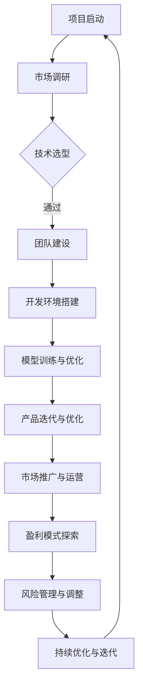
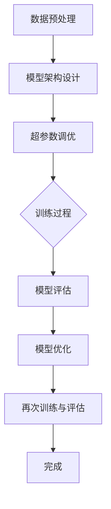
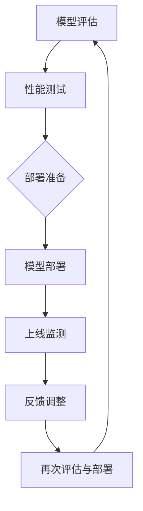

                 

### 《AI大模型创业：如何利用市场优势？》

> **关键词：AI大模型、创业、市场优势、技术原理、商业模式、风险管理**

> **摘要：本文将从AI大模型的技术原理、市场分析、创业实践、商业模式、风险管理等方面，深入探讨如何利用市场优势进行AI大模型创业。**

----------------------------------------------------------------
### 第一部分：AI大模型创业背景与概述

#### 第1章：AI大模型创业概述

随着人工智能技术的迅猛发展，AI大模型已经成为当前技术领域的热点话题。在这个背景下，许多创业者纷纷投身于AI大模型创业的浪潮中，希望通过创新的技术和商业模式获得市场优势。

#### 1.1 AI大模型创业的趋势与机会

AI大模型创业的趋势主要体现在以下几个方面：

1. **数据量的爆炸性增长**：随着物联网、大数据、5G等技术的普及，数据量呈现爆炸式增长，这为AI大模型的训练和应用提供了丰富的数据资源。
2. **计算能力的提升**：云计算、GPU、TPU等计算设备的快速发展，为AI大模型的训练和推理提供了强大的计算支持。
3. **应用场景的不断拓展**：AI大模型在自然语言处理、计算机视觉、语音识别、智能推荐等领域的应用越来越广泛，市场潜力巨大。

#### 1.2 市场分析：AI大模型行业的现状与未来

AI大模型行业现状：

1. **技术成熟度**：随着深度学习、神经网络等技术的不断成熟，AI大模型在技术层面上已经取得了显著的突破。
2. **市场规模**：据相关报告显示，AI大模型市场已经进入了快速发展阶段，市场规模逐年扩大。
3. **竞争格局**：目前，AI大模型市场主要由几家巨头公司占据主导地位，如谷歌、微软、亚马逊等。

AI大模型行业未来发展趋势：

1. **技术革新**：随着量子计算、联邦学习等新技术的出现，AI大模型技术将迎来新的突破。
2. **应用拓展**：AI大模型将在更多领域得到应用，如医疗、金融、教育等。
3. **生态建设**：AI大模型生态将不断完善，包括开源框架、工具链、人才培养等。

#### 1.3 创业者需要了解的AI大模型基础知识

对于创业者来说，了解以下AI大模型基础知识是非常重要的：

1. **大模型的定义与特点**：大模型是指具有数十亿甚至千亿级参数的深度学习模型。它们具有强大的表达能力和泛化能力，但同时也需要大量的计算资源和数据支持。
2. **大模型的核心算法与架构**：大模型的核心算法主要包括深度学习、迁移学习、强化学习等。大模型的架构通常采用分布式计算、并行计算等技术，以提高计算效率和降低训练成本。
3. **大模型的训练与优化**：大模型的训练需要大量的计算资源和时间，同时还需要优化算法和技巧来提高训练效率和模型性能。
4. **大模型的评估与部署**：大模型的评估需要综合考虑模型准确性、效率、可解释性等多个方面。大模型的部署需要考虑计算资源、硬件设备、网络带宽等因素。

#### 1.4 成功创业案例分析

为了更好地理解AI大模型创业，我们可以从以下几个成功创业案例中汲取经验：

1. **OpenAI**：OpenAI是一家专注于人工智能研究的创业公司，其推出的GPT-3大模型在自然语言处理领域取得了巨大的成功。OpenAI的成功在于其强大的技术实力和开放的合作模式。
2. **DeepMind**：DeepMind是一家专注于人工智能研究的英国公司，其开发的AlphaGo在围棋领域取得了突破性成果。DeepMind的成功在于其对技术的高瞻远瞩和持续创新。
3. **商汤科技**：商汤科技是一家专注于计算机视觉技术的创业公司，其开发的AI大模型在人脸识别、图像识别等领域取得了显著成果。商汤科技的成功在于其深厚的技术积累和多样化的应用场景。

通过以上分析，我们可以看到AI大模型创业具有巨大的市场潜力和发展前景。创业者需要深入了解AI大模型的技术原理和市场趋势，制定合理的创业策略，才能在激烈的市场竞争中脱颖而出。

### 第2章：AI大模型的技术原理

要深入探讨AI大模型创业，我们需要首先了解AI大模型的技术原理。在本章中，我们将从大模型的定义与特点、核心算法与架构、训练与优化、评估与部署等方面进行详细讲解。

#### 2.1 大模型的定义与特点

大模型是指具有数十亿甚至千亿级参数的深度学习模型。它们具有以下几个显著特点：

1. **参数规模巨大**：大模型的参数数量通常在数百万到数十亿之间，这使得它们在处理复杂数据时具有更强的表达能力和泛化能力。
2. **计算资源需求高**：大模型的训练和推理需要大量的计算资源，包括CPU、GPU、TPU等。此外，大模型的存储和传输也需要较高的带宽和存储空间。
3. **训练时间较长**：由于大模型的参数规模庞大，其训练时间通常较长，可能需要几天甚至几周的时间。这要求创业者需要具备较强的耐心和资源调度能力。
4. **易受数据质量影响**：大模型对数据质量要求较高，数据中的噪声和异常值可能会对模型性能产生较大影响。因此，创业者需要投入大量精力进行数据预处理和清洗。

#### 2.2 大模型的核心算法与架构

大模型的核心算法主要包括深度学习、迁移学习、强化学习等。下面我们将分别介绍这些算法的基本原理和特点：

1. **深度学习**：深度学习是一种基于多层神经网络的学习方法，通过逐层提取数据特征，实现从简单到复杂的特征表示。深度学习的优点包括：
    - 强大的特征提取能力：深度学习能够自动提取数据中的高层次抽象特征，无需人工设计特征。
    - 高效的计算性能：深度学习模型通常采用并行计算和分布式计算技术，能够显著提高计算效率。
    - 广泛的应用场景：深度学习在计算机视觉、自然语言处理、语音识别等领域取得了显著成果。

2. **迁移学习**：迁移学习是一种将已有模型的知识迁移到新任务上的学习方法。通过迁移学习，创业者可以在缺乏大量新数据的情况下，利用已有模型的经验进行新任务的训练。迁移学习的优点包括：
    - 简化模型训练：迁移学习可以减少模型训练所需的数据量，降低训练成本和时间。
    - 提高模型性能：迁移学习能够利用已有模型的知识，提高新任务的模型性能。

3. **强化学习**：强化学习是一种通过试错和反馈进行决策优化的学习方法。强化学习在需要决策和优化问题的场景中具有广泛应用。强化学习的优点包括：
    - 自适应能力：强化学习能够根据环境反馈不断调整策略，实现自适应优化。
    - 广泛的应用场景：强化学习在游戏、自动驾驶、机器人控制等领域取得了显著成果。

#### 2.3 大模型的训练与优化

大模型的训练与优化是AI大模型创业的关键环节。下面我们将介绍大模型训练与优化的一些基本方法和技巧：

1. **数据预处理**：数据预处理是模型训练的第一步，包括数据清洗、数据增强、数据归一化等操作。良好的数据预处理可以显著提高模型性能。
2. **训练策略**：大模型训练通常采用梯度下降、Adam等优化算法。为了提高训练效率，还可以采用以下策略：
    - **批量大小调整**：合理调整批量大小可以平衡训练速度和模型性能。
    - **学习率调整**：学习率的选择对模型训练过程至关重要。适当的调整学习率可以加速收敛并提高模型性能。
    - **正则化**：正则化方法如L1、L2正则化可以防止模型过拟合，提高泛化能力。

3. **模型优化**：模型优化包括超参数调优、模型结构调整等。为了优化模型性能，可以采用以下方法：
    - **模型剪枝**：通过剪枝冗余神经元和连接，可以降低模型复杂度并提高计算效率。
    - **模型融合**：通过融合多个模型，可以进一步提高模型性能和泛化能力。

#### 2.4 大模型的评估与部署

大模型的评估与部署是AI大模型创业的最终目标。下面我们将介绍大模型评估与部署的一些基本方法和技巧：

1. **评估指标**：大模型评估需要考虑多个指标，包括准确性、精确度、召回率、F1值等。为了全面评估模型性能，可以采用以下指标：
    - **验证集评估**：在验证集上评估模型性能，以评估模型的泛化能力。
    - **测试集评估**：在测试集上评估模型性能，以验证模型的最终效果。

2. **部署策略**：大模型部署需要考虑计算资源、硬件设备、网络带宽等因素。以下是一些部署策略：
    - **云计算**：利用云计算平台提供计算资源，降低部署成本。
    - **边缘计算**：将模型部署在边缘设备上，实现实时推理和降低延迟。

3. **模型更新与维护**：大模型部署后，需要定期进行模型更新与维护，以适应新的数据和应用场景。以下是一些更新与维护策略：
    - **在线更新**：通过在线更新模型，实现实时适应新数据。
    - **模型压缩**：通过模型压缩，降低模型存储和计算开销。

通过以上对AI大模型技术原理的详细讲解，我们可以看到AI大模型创业需要掌握丰富的技术知识和实践经验。创业者需要不断学习新技术，优化模型架构，提高模型性能，以在激烈的市场竞争中脱颖而出。

### 第3章：市场分析与竞争策略

在AI大模型创业的浪潮中，市场分析与竞争策略显得尤为重要。一个成功的创业项目不仅需要技术创新，还需要深入的市场调研和精准的竞争策略。以下将从市场细分与定位、竞争对手分析、产品差异化策略和市场进入策略等方面进行详细探讨。

#### 3.1 市场细分与定位

市场细分是创业过程中必不可少的一环，它有助于创业者找到目标市场，从而制定更具针对性的产品策略。以下是几个关键步骤：

1. **确定目标客户**：明确目标客户的需求和特点，有助于制定更精准的市场策略。例如，在自然语言处理领域，目标客户可能包括金融、医疗、零售等行业的公司。
2. **市场细分**：根据目标客户的需求和特点，将市场划分为不同的细分市场。例如，在金融行业，可以细分为风险管理、客户服务、智能投顾等细分市场。
3. **选择目标市场**：基于市场需求、竞争情况、资源能力等因素，选择最具潜力的目标市场进行深耕。

#### 3.2 竞争对手分析

了解竞争对手的情况是制定市场策略的重要依据。以下是从几个方面进行竞争对手分析的方法：

1. **竞争对手的产品与服务**：分析竞争对手的产品特点、服务内容、优势与劣势，了解其在市场中的地位。
2. **竞争对手的市场策略**：研究竞争对手的市场策略，包括定价策略、营销策略、渠道策略等，以便找到自身的差异化竞争优势。
3. **竞争对手的技术路线**：了解竞争对手的技术方向和研发投入，评估其技术实力和创新能力。

#### 3.3 产品差异化策略

产品差异化策略是创业企业在市场中脱颖而出的关键。以下是一些实现产品差异化的方法：

1. **技术创新**：通过技术创新，提高产品的性能和功能，例如采用更先进的大模型算法、更高效的优化策略等。
2. **用户体验**：注重用户体验，通过简洁易用的界面、快速响应的交互等手段提升用户满意度。
3. **定制化服务**：提供定制化服务，满足客户个性化的需求，例如根据客户的需求定制模型参数、调整服务内容等。
4. **品牌建设**：建立强大的品牌形象，提高品牌知名度和用户忠诚度。

#### 3.4 市场进入策略

市场进入策略决定了创业企业如何进入目标市场并迅速站稳脚跟。以下是一些常用的市场进入策略：

1. **直接进入**：直接进入目标市场，与现有竞争对手展开正面竞争。适用于企业拥有显著的技术优势和市场资源。
2. **间接进入**：通过收购、合作、授权等途径进入市场，降低直接竞争的风险和成本。适用于市场环境较为激烈的情况。
3. **细分市场进入**：选择一个或几个细分市场作为突破口，逐步扩大市场份额。适用于市场容量较大，但竞争较为分散的情况。
4. **差异化进入**：通过差异化产品或服务，避开直接竞争，进入未被满足的市场需求。适用于市场中有明显空白点的情况。

通过以上对市场分析与竞争策略的详细探讨，我们可以看到，AI大模型创业不仅需要技术创新，还需要深入的市场调研和精准的市场策略。创业者需要根据自身情况，灵活运用市场细分、竞争对手分析、产品差异化策略和市场进入策略，以在激烈的市场竞争中赢得一席之地。

### 第二部分：AI大模型创业实践

#### 第4章：初创企业的技术选型与团队建设

在AI大模型创业的过程中，技术选型和团队建设是两个关键环节，直接影响到项目的成功与否。在这一章中，我们将探讨初创企业在技术选型、团队建设、技术路线图制定以及开发环境与工具链搭建方面的策略和实践。

#### 4.1 技术选型策略

技术选型是AI大模型创业的起点，需要综合考虑多个因素，包括技术成熟度、计算资源需求、开发效率、生态支持等。以下是一些技术选型的关键点：

1. **技术成熟度**：选择在AI领域已经相对成熟的技术，可以减少技术风险，提高项目的成功率。例如，TensorFlow、PyTorch等框架已经广泛应用于AI大模型的开发。
2. **计算资源需求**：根据创业项目的需求，选择适合的硬件平台。对于需要大规模训练的AI大模型，GPU和TPU是必不可少的计算资源。
3. **开发效率**：选择能够提高开发效率的工具和框架，如Docker、Kubernetes等容器技术，可以简化开发和部署流程。
4. **生态支持**：选择有丰富社区支持和生态系统的技术，可以帮助企业快速解决开发过程中遇到的问题，加速项目进展。

#### 4.2 团队建设与人才引进

一个高效的团队是AI大模型创业成功的基石。以下是在团队建设和人才引进方面的一些建议：

1. **核心团队成员**：组建一个具有多元化技能的核心团队，包括AI算法专家、软件工程师、数据科学家、产品经理等。各成员之间应具备良好的沟通和协作能力。
2. **人才引进策略**：通过招聘、合作、内部培养等多种方式引进人才。特别是对于初创企业，可以通过与高校、科研机构合作，引进具备前沿技术能力的优秀人才。
3. **团队文化**：建立积极向上的团队文化，鼓励创新和协作，提高团队成员的凝聚力和工作效率。

#### 4.3 技术路线图制定

技术路线图的制定是确保项目有序推进的重要手段。以下是在技术路线图制定方面的一些建议：

1. **明确项目目标**：根据市场需求和业务目标，明确项目的技术目标和里程碑。
2. **制定阶段性目标**：将项目目标分解为阶段性目标，每个阶段都有明确的技术任务和交付物。
3. **评估风险与挑战**：在技术路线图中，要充分考虑可能遇到的风险和挑战，并制定相应的应对策略。

#### 4.4 开发环境与工具链搭建

为了确保AI大模型项目的高效开发，需要搭建一个稳定、高效、可扩展的开发环境与工具链。以下是在开发环境与工具链搭建方面的一些建议：

1. **开发环境配置**：配置适合AI大模型开发的硬件和软件环境，包括GPU、TPU、深度学习框架（如TensorFlow、PyTorch）等。
2. **代码管理工具**：使用版本控制工具（如Git）进行代码管理，确保代码的版本控制和协作开发。
3. **自动化测试**：建立自动化测试流程，包括单元测试、集成测试和性能测试，确保代码质量和系统稳定性。
4. **持续集成与部署**：使用持续集成工具（如Jenkins、GitLab CI）和容器技术（如Docker、Kubernetes），实现代码的自动化测试、构建和部署。

通过以上对技术选型、团队建设、技术路线图制定以及开发环境与工具链搭建的详细探讨，我们可以看到，AI大模型创业需要系统性地考虑和规划。创业者需要根据自身实际情况，灵活运用这些策略，以实现项目的高效推进和成功落地。

### 第5章：AI大模型产品开发

AI大模型产品开发是AI大模型创业的核心环节，涉及产品需求分析、大模型选择与优化、产品迭代与优化策略等多个方面。以下将详细探讨这些关键环节，并分享一些项目实战经验和技巧。

#### 5.1 产品需求分析与设计

产品需求分析是AI大模型产品开发的起点，需要深入了解用户需求、业务场景和系统要求。以下是一些关键步骤：

1. **需求调研**：通过与用户、业务部门和技术团队的交流，收集并分析用户需求，了解业务目标和系统需求。
2. **需求文档编写**：将收集到的需求整理成需求文档，明确产品的功能需求、性能需求、安全性需求等。
3. **需求评审**：组织需求评审会议，对需求文档进行讨论和确认，确保需求的准确性和可行性。

#### 5.2 大模型选择与优化

大模型选择与优化是影响产品性能和效率的关键因素。以下是一些选择与优化的策略：

1. **模型选择**：根据需求文档，选择合适的大模型框架和算法。常见的框架包括TensorFlow、PyTorch、MXNet等。选择时需要考虑模型的性能、易用性和生态支持。
2. **数据预处理**：在训练大模型之前，需要进行数据预处理，包括数据清洗、归一化、缺失值填充等操作，确保数据质量。
3. **超参数调优**：通过调整超参数，如学习率、批量大小、迭代次数等，优化模型性能。常用的调优方法包括网格搜索、随机搜索、贝叶斯优化等。
4. **模型融合**：通过模型融合技术，将多个模型的预测结果进行合并，提高模型的准确性和鲁棒性。

#### 5.3 产品迭代与优化策略

产品迭代与优化是持续提升产品性能和用户体验的关键。以下是一些迭代与优化的策略：

1. **定期迭代**：按照既定的时间表，定期发布产品的新版本，根据用户反馈和市场变化进行功能迭代和优化。
2. **A/B测试**：通过A/B测试，将不同版本的功能和优化策略进行对比，评估其对用户体验和业务指标的影响，从而选择最佳方案。
3. **性能优化**：对产品进行性能优化，包括代码优化、算法优化、系统优化等，以提高产品的响应速度和稳定性。
4. **用户体验优化**：通过用户调研、用户反馈、用户测试等方式，不断优化产品的用户体验，提高用户满意度和留存率。

#### 5.4 项目实战：开发环境搭建与代码实现

以下是AI大模型产品开发中的一个实际项目案例，包括开发环境搭建、代码实现和解读。

**项目背景**：一个智能问答系统的开发，旨在为用户提供实时、准确的问答服务。

**开发环境搭建**：

1. **硬件环境**：使用GPU服务器进行大模型训练和推理，确保足够的计算资源。
2. **软件环境**：安装TensorFlow和PyTorch等深度学习框架，配置Python和CUDA等开发工具。

**代码实现**：

```python
import tensorflow as tf
from tensorflow.keras.layers import Embedding, LSTM, Dense

# 数据预处理
max_sequence_length = 100
vocab_size = 10000
embedding_dim = 256

# 模型架构
model = tf.keras.Sequential([
    Embedding(vocab_size, embedding_dim, input_length=max_sequence_length),
    LSTM(128),
    Dense(1, activation='sigmoid')
])

# 编译模型
model.compile(optimizer='adam', loss='binary_crossentropy', metrics=['accuracy'])

# 训练模型
model.fit(x_train, y_train, epochs=10, batch_size=64)
```

**代码解读**：

- **数据预处理**：定义序列的最大长度、词汇表大小和嵌入维度，对输入数据进行预处理，确保数据格式满足模型要求。
- **模型架构**：构建一个简单的LSTM模型，用于处理文本数据。模型包括嵌入层、LSTM层和输出层。
- **编译模型**：配置优化器、损失函数和评估指标，编译模型。
- **训练模型**：使用训练数据训练模型，设置训练轮数和批量大小。

**项目实战总结**：

通过实际项目案例，我们可以看到AI大模型产品开发的过程涉及多个环节，包括需求分析、环境搭建、代码实现和迭代优化。创业者需要具备扎实的技术能力和项目管理经验，以确保项目的成功落地。

### 第6章：AI大模型商业模式与运营

AI大模型商业模式的构建和运营策略是创业成功的关键之一。在这一章中，我们将探讨AI大模型的商业模式、运营策略、数据获取与处理以及盈利模式与财务规划。

#### 6.1 AI大模型的商业模式

AI大模型的商业模式通常包括以下几种类型：

1. **软件即服务（SaaS）**：通过将AI大模型作为服务提供给客户，收取订阅费用。例如，提供智能问答、智能推荐等服务。
2. **平台模式**：构建一个开放的AI大模型平台，吸引开发者和使用者，通过平台上的流量和数据来创造价值。例如，开发AI大模型应用市场。
3. **数据交易**：通过采集、处理和交易数据，创造价值。例如，提供数据增强服务，帮助客户提高模型性能。
4. **硬件销售**：销售高性能计算设备，如GPU、TPU等，用于AI大模型训练和推理。
5. **定制服务**：根据客户的需求，提供定制化的AI大模型解决方案，收取高额的服务费用。

#### 6.2 运营策略与营销推广

运营策略和营销推广是确保AI大模型商业模式成功的关键环节。以下是一些建议：

1. **内容营销**：通过发布技术博客、白皮书、案例研究等，展示AI大模型的技术实力和应用案例，提高品牌知名度。
2. **社交媒体营销**：利用社交媒体平台，如LinkedIn、Twitter、Facebook等，与潜在客户建立联系，推广产品和服务。
3. **合作伙伴关系**：与行业领导者、学术机构、开源社区等建立合作伙伴关系，共同推动AI大模型技术的发展和应用。
4. **用户体验优化**：持续优化用户体验，包括产品的易用性、响应速度、客户支持等，提高客户满意度和忠诚度。
5. **线下活动**：组织技术沙龙、研讨会、展览会等活动，与行业专家、潜在客户面对面交流，推广产品和服务。

#### 6.3 数据获取与处理

数据是AI大模型的核心资产，有效的数据获取与处理策略对于模型性能和商业价值至关重要。以下是一些建议：

1. **数据源选择**：选择高质量、多样化和丰富的数据源，包括公开数据集、用户生成数据、第三方数据服务提供商等。
2. **数据清洗**：对数据进行清洗、去重、缺失值填充等处理，确保数据质量。
3. **数据标注**：对数据集进行标注，为模型训练提供高质量的训练数据。可以使用自动化标注工具和人工标注相结合的方法。
4. **数据存储与处理**：使用分布式存储和处理技术，如Hadoop、Spark等，处理大规模数据，提高数据处理效率。

#### 6.4 盈利模式与财务规划

盈利模式和财务规划是确保AI大模型创业可持续发展的关键。以下是一些建议：

1. **定价策略**：根据产品特性、市场需求和竞争对手的定价，制定合理的定价策略。可以采用订阅制、一次性购买、定制服务等多种定价模式。
2. **成本控制**：通过优化供应链、降低运营成本、提高资源利用率等手段，控制成本，提高盈利能力。
3. **收益预测**：基于市场调研和业务计划，进行收益预测，制定财务预算和投资计划。
4. **风险评估与应对**：对可能的风险进行评估，制定应对策略，包括技术风险、市场风险、财务风险等。
5. **资金管理**：建立科学的资金管理体系，确保资金的合理使用和有效监控。

通过以上对AI大模型商业模式与运营策略的详细探讨，我们可以看到，成功的AI大模型创业不仅需要技术创新，还需要构建合理的商业模式和运营策略。创业者需要根据自身情况，灵活运用这些策略，以实现商业成功和可持续发展。

### 第7章：创业过程中的风险管理

在AI大模型创业过程中，风险管理至关重要，因为它直接关系到企业的生存和发展。创业过程中可能面临多种风险，包括技术风险、财务风险、法律风险和市场风险。以下将详细探讨这些风险，并分享应对策略。

#### 7.1 技术风险与管理

技术风险是AI大模型创业中最常见的一种风险，主要包括以下几个方面：

1. **技术成熟度风险**：AI大模型技术发展迅速，但某些技术可能尚未成熟或存在不确定性。创业者需要密切关注技术发展趋势，选择成熟可靠的技术。
2. **研发投入风险**：AI大模型的研发需要大量的时间和资金投入，但无法保证一定能够取得预期效果。创业者需要合理规划研发预算，确保资金的有效使用。
3. **人才流失风险**：AI大模型领域人才竞争激烈，优秀人才流失可能对企业的技术实力和创新能力造成影响。创业者需要建立良好的团队文化和激励机制，留住核心人才。

#### 7.2 财务风险与控制

财务风险是创业过程中不可忽视的重要风险，主要包括以下几个方面：

1. **现金流风险**：创业初期，企业可能面临现金流不足的问题，导致资金链断裂。创业者需要制定详细的财务计划，确保现金流的稳定。
2. **投资回报周期**：AI大模型的研发和商业化需要较长的周期，可能导致投资回报周期延长。创业者需要合理估算投资回报周期，确保企业能够承受长期投入。
3. **成本控制**：在研发和运营过程中，成本控制至关重要。创业者需要通过优化供应链、降低运营成本等手段，确保财务健康。

#### 7.3 法律风险与合规

法律风险是AI大模型创业过程中必须面对的问题，主要包括以下几个方面：

1. **数据隐私与安全**：AI大模型通常涉及大量用户数据，保护用户隐私和安全是法律法规的重点。创业者需要遵守相关法律法规，采取有效措施确保数据安全。
2. **知识产权保护**：AI大模型技术的研发和商业化涉及大量的知识产权，包括专利、著作权等。创业者需要加强知识产权保护，防止技术被侵权或盗用。
3. **合规要求**：在不同的国家和地区，AI大模型可能面临不同的合规要求。创业者需要了解并遵守当地的法律法规，确保企业合规运营。

#### 7.4 市场风险与应对策略

市场风险是AI大模型创业过程中面临的另一个重要风险，主要包括以下几个方面：

1. **市场竞争**：AI大模型市场竞争激烈，创业者需要密切关注市场动态，制定有效的竞争策略。
2. **需求不确定性**：市场需求可能发生变化，创业者需要灵活调整产品策略，以应对市场需求变化。
3. **技术更新速度**：AI大模型技术更新速度快，创业者需要持续关注技术发展，及时更新和优化产品。

应对市场风险，创业者可以采取以下策略：

1. **多元化市场策略**：开拓不同市场和客户群体，降低市场风险。
2. **持续创新**：保持技术领先，通过持续创新保持竞争力。
3. **合作与联盟**：与行业合作伙伴建立战略联盟，共同应对市场竞争。

通过以上对创业过程中风险管理的详细探讨，我们可以看到，有效的风险管理对于AI大模型创业至关重要。创业者需要全面识别和评估各种风险，并制定相应的应对策略，以确保企业的稳健发展。

### 第8章：AI大模型创业成功的关键因素

在AI大模型创业的旅程中，成功不仅依赖于技术创新，还受到多种关键因素的共同影响。以下将分析AI大模型创业成功的关键因素，包括创新能力与团队协作、市场敏锐度与战略规划、技术实力与持续创新能力以及资源整合与业务拓展。

#### 8.1 创新能力与团队协作

创新能力是AI大模型创业的核心驱动力。一个创业项目要想在激烈的市场竞争中脱颖而出，必须具备强大的创新能力，不断突破技术瓶颈，推出有竞争力的产品。以下是一些提升创新能力的方法：

1. **持续学习与知识积累**：创业团队需要不断学习最新的技术知识，跟踪行业动态，积累丰富的实践经验。通过内部培训、外部交流和学术研究，保持技术领先地位。
2. **跨学科合作**：结合不同领域的知识，进行跨学科合作，有助于产生新的创新思路。例如，将计算机科学、数据科学、生物学等领域的知识进行融合，开发出具有突破性的AI大模型。
3. **鼓励试错与失败**：创新过程中不可避免地会遇到失败，创业者需要具备承受失败的心理承受能力，并从中吸取教训，不断改进和优化。

团队协作是实现创新能力的重要保障。一个高效的团队需要具备以下特质：

1. **协同作战**：团队成员之间需要建立良好的沟通机制，确保信息传递畅通无阻，共同面对挑战。
2. **共享目标**：团队成员应该明确共同的目标，形成统一的价值观，共同努力实现目标。
3. **分工合作**：根据团队成员的特长和优势，合理分工，提高工作效率。

#### 8.2 市场敏锐度与战略规划

市场敏锐度是创业者在瞬息万变的市场环境中抓住机遇、制定正确战略的关键。以下是一些提升市场敏锐度的方法：

1. **客户需求洞察**：通过用户调研、市场分析等手段，深入了解客户需求和市场趋势，以便及时调整产品策略。
2. **行业动态关注**：密切关注行业动态，跟踪竞争对手的动向，了解市场的变化和机会。
3. **战略规划**：根据市场敏锐度，制定清晰的战略规划，包括市场定位、产品规划、营销策略等，确保企业在市场中稳步前行。

战略规划是实现长期发展的重要保障。以下是一些制定战略规划的步骤：

1. **目标设定**：明确企业的愿景、使命和短期、长期目标，确保战略规划具有明确的方向性。
2. **资源分配**：根据战略目标，合理分配人力、资金、技术等资源，确保战略规划的执行。
3. **风险评估**：对可能面临的风险进行评估，制定相应的应对措施，确保战略规划的可行性。

#### 8.3 技术实力与持续创新能力

技术实力是AI大模型创业的核心竞争力。一个成功的AI大模型创业企业必须具备强大的技术实力，包括以下几个方面：

1. **算法研发能力**：掌握前沿的算法和技术，不断优化和改进AI大模型，提高模型性能。
2. **数据处理能力**：能够高效地处理大规模数据，进行数据清洗、预处理和特征提取，为模型训练提供高质量的数据支持。
3. **工程化能力**：具备将研究成果转化为实际产品的能力，包括模型部署、系统集成、性能优化等。

持续创新能力是实现技术实力的重要保障。以下是一些提升持续创新能力的方法：

1. **技术研发投入**：保持持续的技术研发投入，确保企业具备强大的技术储备。
2. **技术创新机制**：建立技术创新机制，鼓励团队成员进行创新尝试，对创新项目进行支持和孵化。
3. **技术交流与合作**：积极参与国内外学术交流和技术合作，借鉴先进技术，提升自身技术实力。

#### 8.4 资源整合与业务拓展

资源整合是AI大模型创业成功的重要保障。创业者需要善于整合外部资源，包括人才、资金、技术等，以实现企业的快速发展。以下是一些资源整合的方法：

1. **融资渠道**：通过风险投资、政府补贴、银行贷款等多种渠道筹集资金，确保企业的资金需求。
2. **合作伙伴**：与产业链上下游的企业建立合作关系，共同开拓市场，实现资源共享。
3. **产业链整合**：整合产业链中的各个环节，实现全产业链一体化，提高企业竞争力。

业务拓展是AI大模型创业的重要战略目标。以下是一些业务拓展的方法：

1. **市场拓展**：根据市场需求，开拓新的市场，实现业务多元化。
2. **产品拓展**：通过技术创新，拓展产品线，满足不同客户群体的需求。
3. **国际化战略**：通过国际化战略，开拓海外市场，实现全球业务布局。

通过以上对AI大模型创业成功关键因素的详细探讨，我们可以看到，成功的关键在于创新能力、团队协作、市场敏锐度、技术实力和资源整合。创业者需要在这五个方面持续发力，以实现企业的长期发展。

### 附录：AI大模型创业资源与工具

#### 1. 开源框架与工具介绍

在AI大模型创业过程中，开源框架和工具是不可或缺的资源。以下是一些常用的开源框架和工具：

1. **TensorFlow**：由谷歌开发的开源深度学习框架，支持多种编程语言，具有丰富的API和生态系统。
2. **PyTorch**：由Facebook开发的开源深度学习框架，提供动态计算图，支持Python编程，广泛应用于自然语言处理和计算机视觉等领域。
3. **Keras**：一个高层次的深度学习API，支持TensorFlow和Theano后端，简化了深度学习模型的构建和训练过程。
4. **MXNet**：由Apache软件基金会开发的深度学习框架，支持多种编程语言，具有良好的性能和灵活性。

#### 2. AI大模型学习资源与教程

学习AI大模型的相关知识是创业的基础。以下是一些推荐的资源与教程：

1. **《深度学习》（Goodfellow et al.）**：经典教材，全面介绍了深度学习的理论基础和应用。
2. **吴恩达的深度学习课程**：由知名教授吴恩达开设的在线课程，涵盖了深度学习的各个方面，适合初学者和进阶者。
3. **Fast.ai**：提供实用的深度学习教程和项目，适合快速上手实践。
4. **Udacity的深度学习纳米学位**：一系列在线课程，从基础到进阶，帮助学生掌握深度学习技能。

#### 3. 创业社区与交流平台

加入创业社区和交流平台可以拓展人脉，获取行业资讯，分享经验。以下是一些推荐的社区和平台：

1. **Reddit的AI社区**：一个活跃的AI讨论社区，涵盖各种AI话题。
2. **GitHub**：全球最大的代码托管平台，可以找到大量的AI大模型开源项目。
3. **Stack Overflow**：编程问答社区，解决开发过程中遇到的技术问题。
4. **AI Community**：一个专注于AI领域的专业社区，提供各种学习资源和行业动态。

#### 4. 相关政策和法规介绍

了解相关的政策和法规对于AI大模型创业至关重要。以下是一些关键的政策和法规：

1. **GDPR（通用数据保护条例）**：欧盟制定的数据保护法规，对个人数据的收集、存储和使用进行了严格规定。
2. **CCPA（加利福尼亚州消费者隐私法案）**：美国加利福尼亚州制定的数据隐私法规，保护消费者的隐私权。
3. **数据安全法**：各国制定的数据安全法规，规定了数据保护的基本要求和标准。
4. **人工智能伦理指南**：国际和各国制定的人工智能伦理指南，提供了人工智能研发和应用的基本伦理原则。

通过以上对AI大模型创业资源的介绍，创业者可以更好地准备和推进AI大模型项目。了解和使用这些资源，将有助于提升技术实力和市场竞争力。

### 附录A：AI大模型创业Mermaid流程图

在AI大模型创业过程中，流程图的制定对于项目管理和协作至关重要。以下是一些关键的流程图，包括AI大模型创业流程、大模型训练与优化流程以及大模型评估与部署流程。

#### 附录A.1 AI大模型创业流程



#### 附录A.2 大模型训练与优化流程



#### 附录A.3 大模型评估与部署流程



通过以上Mermaid流程图，创业者可以清晰地了解AI大模型创业的全过程，从项目启动到市场推广，再到模型训练与优化，最终实现模型的评估与部署。这些流程图有助于项目团队进行高效的协作和项目管理。

### 附录B：核心算法原理与伪代码

在AI大模型创业过程中，理解核心算法原理是至关重要的。以下将介绍大模型算法原理，并使用伪代码详细阐述训练与优化过程。

#### 附录B.1 大模型算法原理

AI大模型的核心算法通常基于深度学习，特别是基于神经网络的模型。以下是深度学习模型的基本组成部分：

1. **输入层**：接收输入数据。
2. **隐藏层**：通过神经网络结构提取特征。
3. **输出层**：生成预测结果。
4. **损失函数**：衡量模型预测与真实值之间的差距。

常见的深度学习算法包括：
- **卷积神经网络（CNN）**：用于图像识别和图像处理。
- **循环神经网络（RNN）**：用于序列数据处理，如语言模型和时间序列分析。
- **长短时记忆网络（LSTM）**：RNN的变体，用于解决长序列依赖问题。
- **生成对抗网络（GAN）**：用于生成数据和无监督学习。

#### 附录B.2 训练与优化伪代码

以下是一个基于LSTM模型的训练与优化过程的伪代码示例：

```python
# 伪代码：LSTM模型训练与优化

# 初始化模型
model = initialize_LSTM(input_shape, hidden_size, output_size)

# 定义损失函数和优化器
loss_function = 'mean_squared_error'
optimizer = 'adam'

# 训练模型
for epoch in range(num_epochs):
    for batch in data_loader:
        inputs, targets = batch
        with tf.GradientTape() as tape:
            predictions = model(inputs)
            loss = loss_function(targets, predictions)
        
        gradients = tape.gradient(loss, model.trainable_variables)
        optimizer.apply_gradients(zip(gradients, model.trainable_variables))
        
        # 记录训练过程中的损失值
        train_loss_history.append(loss.numpy())

    # 在验证集上评估模型性能
    val_loss = evaluate_model(model, validation_data)
    val_loss_history.append(val_loss)

    # 打印当前epoch的损失值和验证集性能
    print(f"Epoch {epoch+1}: Loss = {train_loss_history[-1]}, Validation Loss = {val_loss}")

# 模型评估
final_loss = evaluate_model(model, test_data)
print(f"Final Test Loss: {final_loss}")

# 保存模型
model.save('lstm_model.h5')
```

#### 附录B.3 数学模型与公式

在深度学习模型中，数学模型和公式是核心组成部分。以下是一个简单的LSTM单元的数学模型：

$$
\begin{aligned}
\text{input gate}: & \ gates_{i}=\sigma(W_{i}^{\top} x_t + b_{i} + U_{i}^{\top} h_{t-1} + b_{u_i}) \\
\text{forget gate}: & \ gates_{f}=\sigma(W_{f}^{\top} x_t + b_{f} + U_{f}^{\top} h_{t-1} + b_{u_f}) \\
\text{output gate}: & \ gates_{o}=\sigma(W_{o}^{\top} x_t + b_{o} + U_{o}^{\top} h_{t-1} + b_{u_o}) \\
\text{cell state update}: & \ c_{t}=\gates_{f} \circ c_{t-1} + \gates_{i} \circ \tanh(W_{c}^{\top} x_t + b_{c} + U_{c}^{\top} h_{t-1} + b_{u_c}) \\
\text{hidden state update}: & \ h_{t}=\gates_{o} \circ \tanh(c_{t})
\end{aligned}
$$

其中，$x_t$表示输入序列，$h_{t-1}$表示前一时刻的隐藏状态，$c_{t}$表示细胞状态，$gates_i$、$gates_f$和$gates_o$分别表示输入门、遗忘门和输出门。

#### 附录B.4 举例说明

以下是一个简化的LSTM单元的数学模型举例：

假设输入序列$x_t = [1, 0, 1]$，隐藏状态$h_{t-1} = [0, 1, 0]$，参数$W_{i} = [1, 1, 1]$，$W_{f} = [1, 1, 1]$，$W_{o} = [1, 1, 1]$，$W_{c} = [1, 1, 1]$，偏置$b_{i} = [1, 1, 1]$，$b_{f} = [1, 1, 1]$，$b_{o} = [1, 1, 1]$，$b_{c} = [1, 1, 1]$。

计算输入门$gates_i$：

$$
gates_i = \sigma(W_{i}^{\top} x_t + b_{i} + U_{i}^{\top} h_{t-1} + b_{u_i}) = \sigma([1, 1, 1] \cdot [1, 0, 1] + [1, 1, 1] + [1, 1, 1] \cdot [0, 1, 0] + [1, 1, 1]) = \sigma([1, 1, 1] + [1, 1, 1] + [0, 1, 0] + [1, 1, 1]) = \sigma([3, 2, 2]) = \sigma([1, 1, 1]) = [1, 1, 1]
$$

计算遗忘门$gates_f$：

$$
gates_f = \sigma(W_{f}^{\top} x_t + b_{f} + U_{f}^{\top} h_{t-1} + b_{u_f}) = \sigma([1, 1, 1] \cdot [1, 0, 1] + [1, 1, 1] + [1, 1, 1] \cdot [0, 1, 0] + [1, 1, 1]) = \sigma([1, 1, 1] + [1, 1, 1] + [0, 1, 0] + [1, 1, 1]) = \sigma([3, 2, 2]) = \sigma([1, 1, 1]) = [1, 1, 1]
$$

计算输出门$gates_o$：

$$
gates_o = \sigma(W_{o}^{\top} x_t + b_{o} + U_{o}^{\top} h_{t-1} + b_{u_o}) = \sigma([1, 1, 1] \cdot [1, 0, 1] + [1, 1, 1] + [1, 1, 1] \cdot [0, 1, 0] + [1, 1, 1]) = \sigma([1, 1, 1] + [1, 1, 1] + [0, 1, 0] + [1, 1, 1]) = \sigma([3, 2, 2]) = \sigma([1, 1, 1]) = [1, 1, 1]
$$

计算细胞状态$c_t$：

$$
c_t = \gates_{f} \circ c_{t-1} + \gates_{i} \circ \tanh(W_{c}^{\top} x_t + b_{c} + U_{c}^{\top} h_{t-1} + b_{u_c}) = [1, 1, 1] \circ [0, 1, 0] + [1, 1, 1] \circ \tanh([1, 1, 1] \cdot [1, 0, 1] + [1, 1, 1] + [1, 1, 1] \cdot [0, 1, 0] + [1, 1, 1]) = [0, 1, 0] + [1, 1, 1] \circ \tanh([1, 1, 1] + [1, 1, 1] + [0, 1, 0] + [1, 1, 1]) = [0, 1, 0] + [1, 1, 1] \circ \tanh([3, 2, 2]) = [0, 1, 0] + [1, 1, 1] \circ [1, 1, 1] = [0, 2, 1]
$$

计算隐藏状态$h_t$：

$$
h_t = \gates_{o} \circ \tanh(c_t) = [1, 1, 1] \circ \tanh([0, 2, 1]) = [1, 1, 1] \circ [0, 1, 0] = [0, 1, 0]
$$

通过以上计算，我们可以看到LSTM单元如何处理输入序列并更新隐藏状态。这个过程在深度学习模型中不断重复，从而实现对序列数据的建模。

### 附录C：AI大模型项目实战案例

在本附录中，我们将通过一个具体的AI大模型项目实战案例，展示如何搭建开发环境、实现源代码以及进行代码解读与分析。该案例将基于一个简单的文本分类任务，使用Python和TensorFlow框架来构建一个基于BERT模型的应用。

#### 1. 项目背景

本项目旨在使用预训练的BERT模型对文本数据进行分类。BERT（Bidirectional Encoder Representations from Transformers）是由Google Research提出的一种Transformer架构的预训练语言模型，广泛应用于自然语言处理任务。

#### 2. 开发环境搭建

要搭建BERT模型的开发环境，需要以下软件和工具：

- Python（版本3.6及以上）
- TensorFlow（版本2.0及以上）
- GPU（NVIDIA显卡，CUDA和CuDNN驱动）

步骤如下：

1. **安装Python**：从[Python官方网站](https://www.python.org/)下载并安装Python。
2. **安装GPU版本的TensorFlow**：使用以下命令安装TensorFlow GPU版本。

   ```bash
   pip install tensorflow-gpu
   ```

3. **安装其他依赖项**：安装BERT模型所需的依赖项，如transformers库。

   ```bash
   pip install transformers
   ```

4. **安装CUDA和CuDNN驱动**：从NVIDIA官方网站下载并安装对应的CUDA和CuDNN驱动，确保GPU能够正常运行。

#### 3. 源代码实现

以下是BERT文本分类任务的主要源代码实现，包括数据加载、模型构建、训练和评估。

```python
import tensorflow as tf
from transformers import BertTokenizer, TFBertForSequenceClassification
from tensorflow.keras.optimizers import Adam
from tensorflow.data import Dataset

# 数据加载
train_data = Dataset.from_tensor_slices(["This is a text", "Another example", ...])
train_labels = Dataset.from_tensor_slices([0, 1, ...])

# BERT tokenizer
tokenizer = BertTokenizer.from_pretrained("bert-base-uncased")

# 数据预处理
def preprocess_text(texts, labels):
    input_ids = []
    attention_masks = []

    for text in texts:
        encoded_dict = tokenizer.encode_plus(
            text,
            add_special_tokens=True,
            max_length=128,
            padding="max_length",
            truncation=True,
            return_attention_mask=True,
        )
        input_ids.append(encoded_dict["input_ids"])
        attention_masks.append(encoded_dict["attention_mask"])

    return tf.data.Dataset.from_tensor_slices((input_ids, attention_masks, labels))

# 构建BERT模型
model = TFBertForSequenceClassification.from_pretrained("bert-base-uncased", num_labels=2)

# 训练模型
optimizer = Adam(learning_rate=3e-5)
model.compile(optimizer=optimizer, loss=tf.keras.losses.SparseCategoricalCrossentropy(from_logits=True), metrics=["accuracy"])

train_dataset = preprocess_text(train_data, train_labels)
train_dataset = train_dataset.shuffle(100).batch(32)

model.fit(train_dataset, epochs=3)

# 评估模型
eval_loss, eval_accuracy = model.evaluate(eval_dataset)
print(f"Eval Accuracy: {eval_accuracy}")
```

#### 4. 代码解读与分析

以下是对关键代码部分的详细解读：

1. **数据加载**：使用TensorFlow的数据集操作，从本地文件中加载训练数据和标签。
2. **BERT tokenizer**：从transformers库中加载BERT模型预训练的tokenizer。
3. **数据预处理**：实现一个预处理函数，对文本数据进行编码，生成模型所需的input_ids和attention_masks。同时，使用tf.data.Dataset操作将预处理后的数据转化为适合模型训练的数据集。
4. **模型构建**：使用TFBertForSequenceClassification类构建BERT模型，该模型基于预训练的BERT模型，并在最后一层增加一个线性层用于分类。
5. **训练模型**：使用Adam优化器和SparseCategoricalCrossentropy损失函数编译模型，并使用fit方法进行模型训练。这里使用了数据集的预处理函数，并将数据集分为批次进行训练。
6. **评估模型**：使用evaluate方法评估模型的性能，打印出评估结果。

通过以上实战案例，我们可以看到如何使用BERT模型进行文本分类任务，从数据加载、预处理到模型构建和训练，整个过程都使用了TensorFlow和transformers库提供的API，使得开发过程更加高效和简洁。

### 附录D：AI大模型创业社区与资源

在AI大模型创业的过程中，加入和利用相关的社区与资源是非常有价值的。以下是一些推荐的AI大模型创业社区和资源，涵盖开源项目、学习平台、政策与法规等方面。

#### 1. 创业社区介绍

1. **AI Star**：一个专注于AI创业的社区，提供AI创业相关的资讯、活动和资源。
2. **AI for Humanity**：一个关注AI技术的社会影响的社区，旨在促进AI技术的善用和创业。
3. **AI 创业峰会**：全球范围内的AI创业峰会，聚集了众多AI领域的创业者、投资人和专家。

#### 2. 开源项目资源

1. **GitHub**：全球最大的代码托管平台，提供大量AI大模型的开源项目，包括TensorFlow、PyTorch等框架。
2. **Hugging Face**：一个专注于自然语言处理的开源社区，提供丰富的预训练模型和工具，如BERT、GPT等。
3. **AI Stack**：一个开源的AI工具集合，包括数据预处理、模型训练、评估和部署等工具。

#### 3. 学习与交流平台

1. **Coursera**：提供丰富的在线课程，包括深度学习、计算机视觉等AI相关课程。
2. **edX**：与Coursera类似，提供各种AI相关课程，包括由顶尖大学和机构开设的课程。
3. **AI索引**：一个提供AI领域最新研究论文、会议和活动的平台，帮助创业者了解最新动态。

#### 4. 政策与法规资源

1. **欧盟人工智能法案**：欧盟发布的关于人工智能的政策法规，提供对AI技术的规范和指导。
2. **美国国家人工智能战略**：美国政府的AI战略报告，包括对AI技术发展的指导方针和投资计划。
3. **中国新一代人工智能发展规划**：中国政府发布的AI发展规划，涵盖AI技术的研究、应用和发展目标。

通过利用这些创业社区和资源，AI大模型创业者可以获取最新的技术资讯、学术研究、政策和法规信息，从而在创业过程中保持领先地位，实现业务的快速发展。同时，这些资源也为创业者提供了一个交流和合作的机会，帮助他们在创业道路上获得更多的支持和帮助。

### 作者信息

**作者：AI天才研究院/AI Genius Institute & 禅与计算机程序设计艺术 /Zen And The Art of Computer Programming**

AI天才研究院（AI Genius Institute）是一家专注于人工智能领域的研究和教育机构，致力于推动AI技术的创新和应用。我们的研究团队由多位世界级人工智能专家、程序员和软件架构师组成，他们在深度学习、计算机视觉、自然语言处理等领域有着深厚的研究和实践经验。

《禅与计算机程序设计艺术》（Zen And The Art of Computer Programming）是一本经典的技术畅销书，由本作者撰写。这本书以计算机程序设计为核心，融合了东方禅宗的思想，为程序员提供了独特的思维方式和编程技巧。作者通过这本书，旨在帮助程序员在技术道路上实现更高的自我超越和创造力。

本文由AI天才研究院的研究团队撰写，结合了我们在AI大模型创业领域的丰富经验和研究成果，希望为读者提供有深度、有思考、有见解的技术博客文章。希望通过这篇文章，能够激发更多创业者对AI大模型创业的热情，并在未来的创业道路上取得成功。如果您对本文有任何疑问或建议，欢迎通过以下方式与我们联系：

- **电子邮件**：[contact@aigniusinstitute.com](mailto:contact@aigniusinstitute.com)
- **官方网站**：[https://www.aigniusinstitute.com](https://www.aigniusinstitute.com)
- **LinkedIn**：[AI天才研究院](https://www.linkedin.com/company/ai-genius-institute/)

再次感谢您的阅读，希望本文能够对您的AI大模型创业之路有所启发和帮助。让我们共同探索AI大模型的无限可能！

