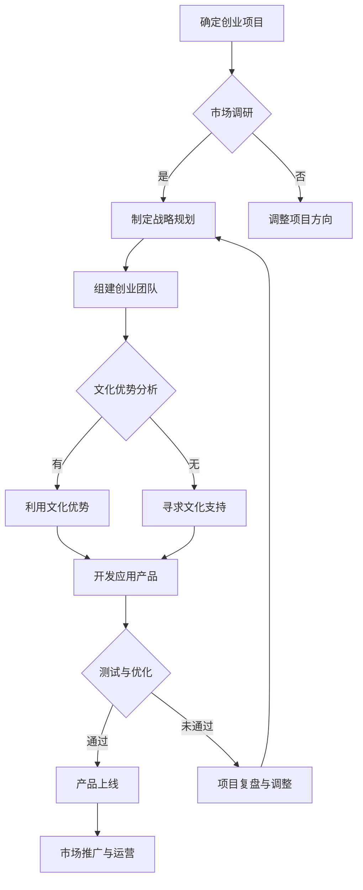

                 

## 《AI 大模型创业：如何利用文化优势？》

> **关键词：** AI 大模型、创业、文化优势、深度学习、自然语言处理、技术创新、市场策略、法律与伦理问题。

> **摘要：** 本文将深入探讨 AI 大模型创业过程中如何充分利用文化优势。文章分为七个部分，首先介绍 AI 大模型的基础知识，接着分析文化优势与 AI 大模型创业的关系，然后探讨 AI 大模型创业的战略规划和实践案例，最后讨论 AI 大模型创业中可能遇到的法律与伦理问题以及未来发展趋势。本文旨在为 AI 大模型创业者提供有价值的指导，帮助他们在激烈的市场竞争中脱颖而出。

### 《AI 大模型创业：如何利用文化优势？》目录大纲

1. **第一部分: AI 大模型基础**
   - **第1章: AI 大模型概述**
     - **1.1 AI 大模型的定义**
     - **1.2 AI 大模型的发展历程**
     - **1.3 AI 大模型的应用场景**
     - **1.4 文化优势与 AI 大模型的关系**
   - **第2章: AI 大模型技术基础**
     - **2.1 深度学习与神经网络基础**
     - **2.2 自然语言处理技术**
     - **2.3 图神经网络与推荐系统**
     - **2.4 强化学习与优化算法**
   - **第3章: 文化优势解析**
     - **3.1 文化优势的定义与类型**
     - **3.2 文化优势与 AI 大模型创业的关系**
     - **3.3 文化优势的评估与利用**

2. **第二部分: AI 大模型创业实践**
   - **第4章: AI 大模型创业战略规划**
     - **4.1 创业团队组织与文化建设**
     - **4.2 创业项目的市场定位与产品规划**
     - **4.3 创业项目的融资策略**
     - **4.4 创业项目的风险管理**
   - **第5章: AI 大模型创业实战案例**
     - **5.1 案例一：利用文化优势打造教育应用**
     - **5.2 案例二：利用文化优势开发智能家居**
     - **5.3 案例三：利用文化优势打造文化产业平台**
   - **第6章: AI 大模型创业的法律与伦理问题**
     - **6.1 AI 大模型创业的法律风险**
     - **6.2 AI 大模型创业的伦理问题**
     - **6.3 法律与伦理问题的解决策略**

3. **第三部分: AI 大模型创业的未来发展趋势**
   - **第7章: AI 大模型创业的未来发展趋势**
     - **7.1 AI 大模型创业的技术趋势**
     - **7.2 AI 大模型创业的市场趋势**
     - **7.3 AI 大模型创业的文化趋势**

4. **附录**
   - **附录 A: AI 大模型创业工具与资源**
     - **A.1 开发工具与框架**
     - **A.2 数据资源与平台**
     - **A.3 文化资源与平台**

---

### 1.1 AI 大模型的定义

AI 大模型（Large-scale Artificial Intelligence Models）是指在深度学习和神经网络领域中，具有巨大参数量、能够处理大规模数据的复杂模型。这类模型通常具有以下特点：

- **参数量巨大**：AI 大模型的参数量可以达到数百万甚至数十亿级别，这使得模型在处理复杂任务时具有更高的准确性和灵活性。
- **数据需求大**：由于参数量的庞大，AI 大模型需要大量数据进行训练，以保证模型的泛化能力。
- **计算资源消耗**：AI 大模型对计算资源的需求极高，需要高性能的硬件和优化算法来支持模型的训练和推理。

AI 大模型的发展可以追溯到深度学习（Deep Learning）的兴起。深度学习是一种通过多层神经网络来模拟人脑学习过程的人工智能技术。随着计算能力的提升和数据规模的增加，深度学习模型逐渐从简单的多层感知机（MLP）发展到复杂的卷积神经网络（CNN）、循环神经网络（RNN）和 Transformer 等。

AI 大模型的应用场景广泛，包括但不限于以下领域：

- **计算机视觉**：AI 大模型在图像分类、目标检测、图像生成等任务中取得了显著的成果。
- **自然语言处理**：AI 大模型在文本分类、机器翻译、情感分析、问答系统等领域展示了强大的能力。
- **推荐系统**：AI 大模型通过分析用户行为和偏好，为用户提供个性化的推荐服务。
- **游戏和娱乐**：AI 大模型在游戏 AI、虚拟助手等领域也得到了广泛应用。

在 AI 大模型的发展历程中，有几个重要的里程碑：

- **2012年**：AlexNet 在 ImageNet 挑战赛中取得了突破性成果，标志着深度学习在计算机视觉领域的崛起。
- **2018年**：GPT-2 发布，展示了自然语言处理领域的前沿技术。
- **2020年**：BERT 和 GPT-3 等大型语言模型相继发布，进一步推动了自然语言处理领域的发展。

随着技术的不断进步，AI 大模型在各个领域的应用场景和商业模式也在不断创新。创业者需要深入了解 AI 大模型的技术原理和应用场景，以便更好地利用文化优势，开发具有市场竞争力的产品。

### 1.2 AI 大模型的发展历程

AI 大模型的发展历程是技术进步与市场需求相互作用的结果。从早期的浅层神经网络到现代的大型深度学习模型，每一次突破都标志着人工智能技术的飞跃。以下是 AI 大模型发展历程中的关键里程碑：

**1980年代：神经网络再兴**

在 20 世纪 80 年代，神经网络（Neural Networks）作为一种简单的人工智能模型重新受到关注。然而，由于计算资源和数据量的限制，神经网络在当时未能实现突破。这一阶段的代表性模型包括多层感知机（MLP），它在一些简单的模式识别任务中展示了潜力。

**1990年代：支持向量机与决策树**

随着计算能力的提高，支持向量机（SVM）和决策树等基于统计学习的模型在机器学习领域取得了显著成功。尽管这些模型并非基于神经网络，但它们为后来的深度学习提供了理论基础和技术思路。

**2000年代：深度学习的崛起**

进入 21 世纪，随着硬件性能的提升和大数据时代的到来，深度学习（Deep Learning）迎来了新的发展机遇。2006 年，Geoffrey Hinton 等人提出了深度置信网络（Deep Belief Network），这标志着深度学习开始从理论走向实际应用。

**2012年：AlexNet 的突破**

2012 年，Alex Krizhevsky 等人提出的 AlexNet 在 ImageNet 挑战赛中取得了巨大成功，其准确率超过了传统的机器学习方法。AlexNet 的成功引发了深度学习在计算机视觉领域的广泛应用，同时也推动了深度学习算法的快速发展。

**2014年：卷积神经网络的广泛应用**

2014 年，Google 提出了卷积神经网络（Convolutional Neural Network，CNN）在图像识别任务中的成功应用，进一步巩固了深度学习在计算机视觉领域的主导地位。CNN 通过共享权重和局部感知机制，大大提高了模型的效率和效果。

**2017年：生成对抗网络（GAN）的突破**

生成对抗网络（Generative Adversarial Network，GAN）于 2017 年由 Ian Goodfellow 等人提出。GAN 通过对抗训练生成逼真的图像，为图像生成和增强学习等领域带来了革命性的变化。

**2018年：Transformer 与预训练语言模型**

2018 年，Google 的 Transformer 模型在机器翻译和文本生成任务中取得了突破性成果。Transformer 采用了自注意力机制，使得模型能够捕捉长距离依赖关系。随后，预训练语言模型（如 BERT、GPT）的发展进一步推动了自然语言处理领域的发展。

**2020年：GPT-3 与大型模型的发展**

2020 年，OpenAI 发布了 GPT-3，这是当时最大规模的预训练语言模型，具有超过 1750 亿个参数。GPT-3 在文本生成、问答系统、对话系统等领域展示了惊人的能力，标志着大型模型在自然语言处理领域的主导地位。

AI 大模型的发展历程不仅反映了技术进步，也体现了市场需求的变化。随着计算能力的提升和数据的积累，未来 AI 大模型将不断突破现有局限，为各个领域带来更多创新应用。

### 1.3 AI 大模型的应用场景

AI 大模型在多个领域展现出了巨大的应用潜力，其广泛的应用场景涵盖了图像处理、自然语言处理、推荐系统、游戏和娱乐等多个方面。

**图像处理**

AI 大模型在计算机视觉领域有着广泛的应用。在图像分类任务中，大模型可以准确地识别和分类各种图像内容。例如，卷积神经网络（CNN）在 ImageNet 数据集上实现了超过人类的识别准确率。此外，AI 大模型还可以用于图像生成，如生成对抗网络（GAN）能够生成逼真的图像和视频。在目标检测方面，大模型可以通过检测图像中的对象并提出相应的边界框，从而实现自动化的图像分析。

**自然语言处理**

AI 大模型在自然语言处理（NLP）领域也发挥了重要作用。预训练语言模型（如 GPT 和 BERT）通过在大规模文本数据上预训练，具备了强大的语言理解和生成能力。这些模型可以应用于文本分类、机器翻译、情感分析、问答系统等任务。例如，BERT 在多项 NLP 任务中达到了顶尖水平，包括情感分析、命名实体识别和问答系统等。AI 大模型还可以用于生成自然流畅的文本，例如写作助手、对话系统和内容生成。

**推荐系统**

AI 大模型在推荐系统中的应用也非常广泛。通过分析用户的历史行为和偏好，大模型可以预测用户的兴趣和需求，从而提供个性化的推荐服务。例如，基于用户点击行为的深度学习模型可以预测用户对特定商品的购买概率，从而提高电商平台的推荐效果。推荐系统还可以应用于社交媒体平台，如推荐用户可能感兴趣的朋友、内容或广告。

**游戏和娱乐**

AI 大模型在游戏和娱乐领域的应用同样显著。游戏 AI 可以通过深度学习和强化学习技术实现高度智能化的行为，从而提高游戏的难度和乐趣。例如，深度 Q 网络（DQN）和卷积神经网络（CNN）可以用于训练智能游戏角色，使其能够适应各种复杂的游戏场景。此外，AI 大模型还可以用于生成音乐、绘画和虚拟现实体验，为用户提供更加丰富和个性化的娱乐内容。

总之，AI 大模型的应用场景非常广泛，其强大的数据处理能力和模型性能使其在各个领域都能发挥重要作用。随着技术的不断进步，未来 AI 大模型将在更多新兴领域展现其潜力。

### 1.4 文化优势与 AI 大模型的关系

文化优势在 AI 大模型创业中扮演着至关重要的角色，它不仅是企业成功的重要因素，也是推动创新和持续发展的动力。首先，文化优势可以体现在企业的核心价值观和经营理念上，这种文化可以激发员工的工作热情和创造力，提高团队的凝聚力和协作效率。例如，Google 的“不作恶”原则和 Facebook 的“快速行动、快速失败”理念，都是文化优势的体现，它们在推动公司创新和发展中起到了关键作用。

其次，文化优势还可以通过影响企业的产品和服务来体现。在 AI 大模型创业中，文化优势可以指导企业选择适合本地市场需求的创新方向。例如，中国企业在 AI 大模型在医疗领域的应用中，充分利用了中国深厚的医学文化背景和庞大的医疗数据资源，开发出具有本土特色且符合市场需求的医疗诊断系统。

再者，文化优势可以影响企业的商业模式和市场策略。在国际化进程中，企业需要理解和适应不同文化背景下的市场需求和消费习惯。例如，阿里巴巴在海外市场推广其电商平台时，不仅考虑到了技术优势和商业模式，还注重融入当地文化，提供符合当地消费者需求的产品和服务。

此外，文化优势还可以体现在企业的技术创新能力上。文化背景可以影响企业的技术选择和研发方向。例如，日本企业以其精细的技术和创新精神闻名，这种文化背景促进了其在机器人技术和精密制造领域的领先地位。在 AI 大模型创业中，这种文化优势可以引导企业专注于特定领域的研发，从而提高技术竞争力和市场份额。

总之，文化优势在 AI 大模型创业中具有重要的战略意义。通过深入挖掘和利用文化优势，企业可以更好地适应市场需求，推动技术创新，提升市场竞争力。创业者需要充分认识到文化优势的价值，并将其融入企业的战略规划和运营管理中，以实现可持续的发展和成功。

### 3.1 文化优势的定义与类型

文化优势是指企业在特定文化背景下，通过长期的文化积淀和传承所形成的一种独特而持久的竞争力。这种优势不仅体现在企业的核心价值观、经营理念和管理方式上，还渗透到产品和服务的设计与营销策略中。文化优势可以分为以下几种类型：

1. **核心价值观**：核心价值观是企业文化的基础，它指导企业的行为和决策，是企业区别于竞争对手的关键因素。例如，华为的“客户至上、敢于创新”和苹果的“简洁至上、用户体验优先”都是其核心价值观的体现。

2. **创新能力**：创新能力是企业文化优势的重要表现形式，它体现在企业对新技术的接受和运用能力上。例如，硅谷的企业以其开放的创新文化著称，这种文化优势促使企业不断推出前沿技术和产品。

3. **品牌形象**：品牌形象是企业文化优势的外在表现，它是消费者对企业的整体认知和印象。一个具有强大文化优势的品牌能够在市场中树立独特的地位，例如，星巴克的“第三空间”理念和可口可乐的“快乐文化”。

4. **社会影响力**：社会影响力是企业文化优势对社会和环境的积极贡献。例如，宜家的“可持续生活方式”理念使其成为环保和社会责任的代表。

5. **员工凝聚力**：员工凝聚力是企业文化优势在企业内部的表现，它体现在员工的归属感和团队协作精神上。例如，谷歌的“员工福利”和“团队合作”理念，增强了员工的归属感和创造力。

这些文化优势类型的共同特点是它们都具有持久性和传播性，能够在企业的长期发展中产生深远的影响。通过深入挖掘和利用这些文化优势，企业可以更好地适应市场变化，提高竞争力，实现可持续发展。

### 3.2 文化优势与 AI 大模型创业的关系

文化优势在 AI 大模型创业中发挥着至关重要的作用，它不仅是企业成功的关键因素，也是推动技术创新和产品差异化的重要动力。首先，文化优势可以为企业提供独特的技术创新方向。例如，日本企业以其精细的技术和创新精神闻名，这种文化背景促使它们专注于机器人技术和精密制造领域。在 AI 大模型创业中，企业可以利用这种文化优势，专注于特定领域的技术研发，从而提高技术竞争力和市场份额。

其次，文化优势可以影响企业的产品设计和市场策略。不同文化背景下的消费者对产品的需求和使用习惯存在差异。例如，中国消费者对互联网产品的依赖程度较高，重视社交互动和用户体验。因此，在中国创业的企业可以利用这种文化优势，开发出符合本地市场需求的 AI 大模型产品，如社交媒体分析工具或智能客服系统。

此外，文化优势还可以促进企业的国际化发展。在全球化背景下，企业需要理解和适应不同文化背景下的市场需求和消费习惯。例如，阿里巴巴在海外市场推广其电商平台时，不仅考虑到了技术优势和商业模式，还注重融入当地文化，提供符合当地消费者需求的产品和服务。这种文化优势有助于企业建立全球品牌影响力，开拓国际市场。

最后，文化优势还可以提升企业的团队凝聚力和员工创造力。在一个具有强大文化优势的企业中，员工对企业的价值观和目标有更深刻的认同，这有助于提高团队的协作效率和创新能力。例如，谷歌的“创新文化”和“员工福利”理念，增强了员工的归属感和创造力，使得谷歌在技术领域持续领先。

总之，文化优势在 AI 大模型创业中具有多重作用，它不仅为企业提供创新方向和市场策略，还促进企业的国际化发展和团队凝聚力。创业者需要充分认识到文化优势的价值，并将其融入企业的战略规划和运营管理中，以实现可持续的发展和成功。

### 3.3 文化优势的评估与利用

文化优势的评估是 AI 大模型创业过程中的关键步骤，它有助于企业识别和利用自身的独特文化优势，提升竞争力。以下是一些常用的评估方法和实际应用案例：

1. **问卷调查法**：通过设计问卷，收集员工、客户和合作伙伴对企业文化特征的看法。问卷可以包括对企业价值观、创新能力、品牌形象等方面的评价。这种方法有助于了解企业文化的内部和外部感知。

2. **员工访谈法**：与员工进行一对一访谈，深入了解他们对企业文化的感受和看法。这种方法可以获取更深入的信息，发现企业文化中存在的问题和潜在优势。

3. **文化诊断工具**：使用专业的文化诊断工具，如组织文化量表（OCQ）、价值观量表（VSAQ）等，对企业的文化特征进行量化评估。这些工具提供了结构化的分析框架，有助于系统地评估企业文化。

4. **比较分析法**：通过比较企业与其他同行业的竞争对手，分析其文化优势。例如，通过对比华为和思科的价值观、创新策略和市场表现，可以评估华为在特定文化方面的优势。

**实际应用案例：**

- **华为**：华为通过问卷调查和员工访谈，定期评估员工对核心价值观的认同度。例如，华为的“以客户为中心”的价值观在问卷中得到了高认可度，这为华为在客户关系管理方面提供了重要的文化优势。

- **谷歌**：谷歌利用文化诊断工具，如 OCQ，对员工的工作环境和价值观进行评估。通过这种方式，谷歌发现其在创新氛围和团队合作方面的优势，并进一步优化相关管理策略。

- **阿里巴巴**：阿里巴巴通过比较分析，发现其在“拥抱变化”和“客户第一”方面的文化优势。这些优势帮助阿里巴巴在电商和云计算领域取得了显著的成功。

评估文化优势后，企业需要将这些优势具体化为实际的战略和运营实践。以下是一些实际应用策略：

1. **文化建设**：通过企业内部培训和宣传活动，强化和传播核心文化价值观。例如，华为通过“狼性文化”培训，培养员工的竞争意识和团队合作精神。

2. **产品创新**：利用文化优势，开发具有独特卖点的产品和服务。例如，阿里巴巴通过“数据驱动”的文化，推动大数据和云计算产品的创新。

3. **市场策略**：结合文化优势，制定适应不同市场的营销策略。例如，谷歌利用其“创新文化”，在全球范围内推广其智能设备和云服务。

4. **国际化发展**：利用文化优势，推动企业的国际化进程。例如，华为通过“本地化策略”，在海外市场融入当地文化，提高品牌认知度和市场占有率。

总之，文化优势的评估与利用是 AI 大模型创业成功的关键。企业需要通过系统的评估方法，识别和发挥自身的文化优势，并将其转化为实际的战略和运营实践，以实现可持续的发展和成功。

### 4.1 创业团队组织与文化建设

在 AI 大模型创业过程中，创业团队的构建和组织文化建设是确保项目成功的关键因素。首先，创业团队的构成应该多样化，包括技术专家、市场分析师、产品经理、运营人员等，这样可以确保项目在技术、市场和运营等方面都有专业的人才支持。

**团队组织结构**

- **技术团队**：负责 AI 大模型的设计、开发和优化，需要包括机器学习工程师、数据科学家和软件工程师等。
- **市场团队**：负责市场调研、产品定位和市场营销策略，需要包括市场分析师和市场营销专员。
- **产品团队**：负责产品的设计、开发和用户体验，需要包括产品经理和用户界面设计师。
- **运营团队**：负责项目的日常运营和管理，需要包括运营经理和客服人员。

**文化建设**

- **共享价值观**：确立共同的价值观和愿景，例如创新、合作和客户至上，以引导团队的行为和决策。
- **激励机制**：建立有效的激励机制，包括绩效考核、奖金和股权激励等，以激发团队成员的积极性和创造力。
- **团队协作**：通过定期的团队建设活动和跨部门合作，增强团队的凝聚力和协作效率。
- **持续学习**：鼓励团队成员不断学习和更新知识，以保持团队的技术领先和市场敏锐度。

**文化优势的体现**

- **技术创新**：利用文化优势，鼓励技术团队不断探索和尝试新的技术解决方案，推动产品创新。
- **市场敏锐**：通过市场团队的深入研究和反馈，结合文化优势，快速调整产品策略，满足市场需求。
- **用户体验**：产品团队通过深入了解用户需求和文化背景，设计出更加符合用户期望的产品和服务。

总之，创业团队的组织和文化建设是 AI 大模型创业成功的重要保障。通过多元化的团队结构和有效的文化建设，企业可以充分发挥文化优势，提高团队的协作效率和创新能力，为企业的可持续发展奠定坚实基础。

### 4.2 创业项目的市场定位与产品规划

在 AI 大模型创业过程中，明确市场定位和产品规划是确保项目成功的重要步骤。首先，创业者需要对目标市场进行深入研究，以确定产品的市场需求和潜在用户。以下是一些关键步骤和策略：

**市场定位**

1. **目标市场分析**：通过市场调研和数据分析，明确目标市场的规模、增长趋势和竞争格局。例如，如果创业项目是关于教育应用的，需要分析在线教育市场的用户需求、市场规模和主要竞争对手。

2. **用户画像**：创建详细的目标用户画像，包括用户的年龄、性别、职业、兴趣爱好和行为习惯等。这有助于创业者更好地了解用户需求，设计符合用户期望的产品和服务。

3. **市场细分**：根据用户画像和市场分析结果，将市场细分为若干个子市场，并选择最具潜力的子市场作为重点目标。例如，针对人工智能教育应用，可以细分出针对学生的个性化学习路径规划和针对教师的智能教学辅助两个子市场。

**产品规划**

1. **产品愿景**：明确产品的长远愿景和核心价值，例如提升教育质量、优化医疗诊断流程或改善智能家居体验等。

2. **功能设计**：基于市场定位和用户需求，设计产品的核心功能和附加功能。例如，教育应用的核心功能可以是课程推荐、学习进度跟踪和学习资源库，而附加功能可以是社交互动、在线测试和成绩分析等。

3. **用户体验**：重视用户体验设计，确保产品界面简洁易用、功能齐全且具备良好的交互体验。可以通过用户反馈和迭代优化，不断提升产品的用户体验。

4. **技术实现**：确保产品规划中的功能可以通过现有技术实现，并考虑技术实现的可行性和成本。例如，AI 大模型的设计需要高性能计算资源和优化算法支持。

**市场策略**

1. **定位策略**：根据市场定位和用户画像，制定明确的市场定位策略，例如高端市场定位、性价比市场定位或差异化市场定位。

2. **推广策略**：制定有效的市场推广策略，包括线上推广和线下推广。例如，可以通过社交媒体营销、内容营销、广告投放和品牌合作等方式，提高产品的市场知名度和用户粘性。

3. **销售策略**：根据目标市场和用户需求，制定销售策略，例如直销、代理商销售或平台销售。

通过明确市场定位和产品规划，AI 大模型创业项目可以更好地满足市场需求，提升用户满意度，从而在激烈的市场竞争中脱颖而出。

### 4.3 创业项目的融资策略

在 AI 大模型创业过程中，融资策略是确保项目顺利推进和可持续发展的重要环节。以下是一些关键的融资策略和实际操作步骤：

**1. 融资策略**

- **种子轮融资**：在项目初期，通过个人储蓄、家庭资金或天使投资获得启动资金。这一阶段的融资重点在于验证产品概念和市场潜力。
- **天使轮和 A 轮融资**：在产品初步开发完成后，通过天使投资或风险投资机构获得资金，以支持产品的进一步开发和市场推广。这一阶段的融资策略应注重展示项目的技术优势和市场前景。
- **B 轮和 C 轮融资**：在产品上线并获得初步市场认可后，通过更大规模的风险投资或私募股权基金获得资金，以支持企业的快速扩张和市场占有率提升。
- **后续融资**：在企业发展过程中，根据实际需求进行后续融资，以支持技术研发、市场拓展和业务扩展。

**2. 实际操作步骤**

- **制定商业计划书**：商业计划书是融资的关键文档，应详细阐述项目的市场机会、产品规划、竞争分析、营销策略、财务预测和团队构成等。
- **寻找潜在投资者**：通过行业会议、创业大赛、投资机构数据库和社交媒体等途径，寻找合适的投资者。可以通过推荐信、介绍信或直接联系的方式，与投资者建立联系。
- **准备演示和路演**：为投资者准备演示文档和路演材料，包括项目介绍、技术展示、市场分析、财务预测和团队介绍等。演示应简洁明了、重点突出，以吸引投资者的兴趣。
- **谈判和签订合同**：与投资者进行深入谈判，讨论投资金额、投资方式、股权分配、董事会席位等关键条款。在达成一致后，签订投资协议，确保双方的权益。

**3. 注意事项**

- **透明沟通**：与投资者保持透明沟通，及时反馈项目进展和财务状况，增强投资者的信心。
- **合理估值**：在融资过程中，合理评估项目的估值，避免过高或过低，以确保投资者获得合理的回报。
- **风险管理**：明确项目的风险点，与投资者共同制定风险控制策略，降低投资风险。
- **保持灵活性**：根据市场变化和项目进展，灵活调整融资策略和计划，以应对不确定性。

通过科学合理的融资策略和实际操作，AI 大模型创业项目可以获得充足的资金支持，推动项目的顺利推进和可持续发展。

### 4.4 创业项目的风险管理

在 AI 大模型创业过程中，风险管理是确保项目顺利推进和实现目标的关键环节。以下是创业项目可能面临的主要风险类型、识别方法以及应对策略：

**1. 技术风险**

**风险类型**：技术风险包括技术实现难度、技术更新速度和技术突破不确定性等。AI 大模型项目的技术复杂度高，可能存在技术瓶颈和实现困难。

**识别方法**：通过技术调研、专家评估和项目试点来识别技术风险。与技术专家和同行交流，了解前沿技术和潜在技术挑战。

**应对策略**：加强技术研发投入，建立技术储备和应急预案。与学术机构、科研团队合作，利用外部技术资源，提高技术实现的可能性。

**2. 市场风险**

**风险类型**：市场风险包括市场需求变化、竞争加剧和市场接受度等。AI 大模型市场的竞争激烈，市场需求和消费者偏好可能快速变化。

**识别方法**：通过市场调研、用户反馈和竞争分析来识别市场风险。密切关注市场动态和用户需求变化，及时调整产品策略。

**应对策略**：制定灵活的市场策略，快速响应市场变化。注重用户反馈，优化产品功能，提高用户满意度。建立品牌差异化，提升市场竞争力。

**3. 财务风险**

**风险类型**：财务风险包括资金不足、成本超支和现金流断裂等。AI 大模型创业项目初期投入大，资金管理至关重要。

**识别方法**：通过财务预测、预算管理和现金流分析来识别财务风险。建立严格的预算控制和财务审计机制。

**应对策略**：合理规划资金使用，确保资金充足。建立多元化的融资渠道，降低资金风险。优化成本结构，提高资金使用效率。

**4. 法律和伦理风险**

**风险类型**：法律和伦理风险包括知识产权纠纷、隐私保护和伦理问题等。AI 大模型涉及大量数据收集和处理，可能引发法律和伦理争议。

**识别方法**：通过法律法规咨询、伦理审查和风险评估来识别法律和伦理风险。了解相关法律法规和伦理准则。

**应对策略**：遵守法律法规，建立合规管理体系。加强数据保护措施，确保用户隐私安全。进行伦理培训，提高员工的伦理意识。

通过识别和应对这些风险，AI 大模型创业项目可以更好地控制风险，提高项目成功率，实现可持续发展。

### 5.1 案例一：利用文化优势打造教育应用

#### 案例背景

某创业公司“智慧教育科技”致力于利用人工智能技术推动教育创新。公司创始团队来自中国，深知中国教育市场的独特需求和文化背景。他们意识到，传统教育方式存在资源不均、个性化不足等问题，希望通过 AI 大模型技术打造一款具备本土特色的教育应用。

#### 产品设计

1. **个性化学习路径**：基于学生画像和学习行为数据，利用自然语言处理和图神经网络技术，为每个学生生成个性化的学习路径。这一功能结合了中国的教育文化，强调因材施教和个性化教育。

2. **中文题库与生成式AI**：开发中文题库和生成式 AI，能够根据学生的学习进度和知识薄弱点，自动生成适合的练习题和知识点讲解。这一功能充分利用了中国丰富的教育资源和文化传承。

3. **智能辅导系统**：结合语音识别和自然语言理解技术，提供智能辅导服务。学生可以通过语音与系统互动，获得实时解答和反馈。这符合中国学生的学习习惯，特别是那些在英语环境中不太自信的学生。

#### 技术实现

1. **自然语言处理**：使用深度学习框架，如BERT和GPT，对中文文本进行预处理和分析，以理解学生的学习需求和提供合适的辅导内容。

2. **图神经网络**：采用图神经网络（GNN）构建知识图谱，以捕捉学习内容之间的关联和层次结构，从而实现个性化的学习路径推荐。

3. **语音识别与自然语言理解**：结合开源语音识别库（如CMU Sphinx）和自然语言处理技术，实现智能辅导系统的语音交互功能。

#### 代码示例

以下是一个简化的代码示例，展示了如何使用自然语言处理技术生成个性化的学习路径：

```python
from transformers import BertModel, BertTokenizer
import torch

# 加载预训练的BERT模型和分词器
tokenizer = BertTokenizer.from_pretrained('bert-base-chinese')
model = BertModel.from_pretrained('bert-base-chinese')

# 学生画像文本
student_profile = "该学生目前处于初中三年级，对数学和物理有较强的兴趣，但英语成绩有待提高。"

# 分词并编码文本
inputs = tokenizer(student_profile, return_tensors="pt")

# 进行预测
with torch.no_grad():
    outputs = model(**inputs)

# 提取文本表示
text_representation = outputs.last_hidden_state[:, 0, :]

# 利用文本表示生成个性化学习路径
# ...（此处实现个性化学习路径生成逻辑）

print("Generated Learning Path:", learning_path)
```

#### 代码解读

这段代码首先加载了预训练的 BERT 模型和分词器，然后对学生的画像文本进行分词和编码。接着，代码通过 BERT 模型获取文本的表示。最后，利用文本表示生成个性化学习路径，以推荐适合学生的课程和学习资源。

#### 案例效果

“智慧教育科技”推出的教育应用在市场上取得了显著的成功。个性化学习路径和智能辅导系统受到了师生和家长的高度评价，有效提升了学习效果和教学体验。此外，该应用还帮助学校优化了教育资源分配，提高了教育质量和效率。

通过充分利用中国文化优势，该创业公司成功开发出了一款具有本土特色的教育应用，为教育行业带来了深刻的变革。

### 5.2 案例二：利用文化优势开发智能家居

#### 案例背景

“智居科技有限公司”是一家专注于智能家居系统开发的创业公司。其创始团队来自德国，深知德国在智能家居领域的技术优势和用户需求。他们意识到，中国的智能家居市场具有巨大的潜力，但文化差异和用户习惯导致现有产品难以满足中国消费者的需求。因此，“智居科技”决定利用其文化优势，开发一款符合中国家庭使用习惯的智能家居系统。

#### 产品设计

1. **智能化场景模式**：根据中国家庭的日常生活方式，设计多种智能场景模式，如“起床模式”、“早餐模式”和“观影模式”等，以实现一键式智能家居控制。

2. **语音交互与中文支持**：结合语音识别和自然语言理解技术，提供中文语音交互功能，方便用户通过语音指令控制家居设备。这符合中国用户的语音交流习惯。

3. **智能家居控制中心**：开发一款集成式智能家居控制中心，用户可以通过手机或平板电脑远程监控和控制家中的智能设备。这一功能结合了中国家庭对互联网和智能设备的广泛使用。

#### 技术实现

1. **语音识别与自然语言理解**：采用开源语音识别库（如百度语音识别API）和自然语言处理技术，实现中文语音交互功能。

2. **物联网（IoT）技术**：利用物联网技术，将家庭中的各种智能设备连接到一个统一的网络平台，实现设备间的数据交换和协同控制。

3. **云平台服务**：通过云平台，实现智能设备的数据存储、分析和远程控制，提供更加便捷和智能的服务。

#### 代码示例

以下是一个简化的代码示例，展示了如何使用语音识别和物联网技术实现智能家居控制：

```python
import json
import requests

# 语音识别API接口地址
url = "https://api.baidu.com/aps/v1/dp/voice识别"

# 用户语音指令
voice_command = "打开客厅的灯"

# 发送语音指令到语音识别API
response = requests.post(url, json={"voice": voice_command})

# 获取识别结果
result = response.json()

# 如果识别结果为“打开客厅的灯”，则发送打开灯的控制指令
if result["result"] == "打开客厅的灯":
    # 灯的控制接口地址
    light_control_url = "https://api.smart-home.com/light/control"
    
    # 发送控制指令
    requests.post(light_control_url, json={"action": "turn_on"})
    print("客厅的灯已打开。")
else:
    print("未识别到语音指令。")
```

#### 代码解读

这段代码首先发送用户语音指令到百度语音识别API，获取识别结果。如果识别结果为“打开客厅的灯”，则发送打开灯的控制指令到智能家居系统。这一流程实现了通过语音控制智能家居设备的功能。

#### 案例效果

“智居科技”开发的智能家居系统在中国市场取得了良好的反响。智能场景模式和语音交互功能受到了用户的广泛欢迎，提升了家居生活的便捷性和舒适度。此外，智能家居控制中心的应用，使得用户可以更加便捷地管理和控制家中的智能设备，提高了用户满意度和品牌忠诚度。

通过充分利用德国的技术优势和中国文化特点，“智居科技”成功开发出了一款具备本土特色的智能家居系统，为中国智能家居市场注入了新的活力。

### 5.3 案例三：利用文化优势打造文化产业平台

#### 案例背景

“文化艺术科技有限公司”是一家专注于文化产业的创业公司。其创始团队来自中国，深谙中国传统文化和市场需求。他们意识到，随着数字化时代的到来，传统文化产业面临巨大挑战和机遇。因此，“文化艺术科技”决定利用其文化优势，打造一款集数字化展示、互动体验和文化传播于一体的文化产业平台。

#### 产品设计

1. **数字化博物馆**：利用虚拟现实（VR）和增强现实（AR）技术，打造数字化博物馆。用户可以通过平台访问全球各地的博物馆，欣赏珍贵的文物和历史遗迹，感受传统文化的魅力。

2. **文化内容创作与分发**：提供文化内容创作工具，鼓励用户创作和分享文化作品。平台还将通过智能推荐系统，为用户提供个性化文化内容推荐，提升用户体验。

3. **在线教育与文化普及**：结合在线教育平台，提供丰富的文化课程和互动活动，普及传统文化知识，推动文化传承与创新。

#### 技术实现

1. **虚拟现实（VR）和增强现实（AR）技术**：采用先进的 VR 和 AR 技术，实现沉浸式文化体验。用户可以通过 VR 眼镜或 AR 应用，感受到逼真的文化场景。

2. **大数据与人工智能**：利用大数据和人工智能技术，分析用户行为和兴趣，提供个性化推荐和服务。平台还将通过数据挖掘，挖掘潜在的文化需求和趋势。

3. **区块链技术**：利用区块链技术，确保文化内容的版权保护和交易透明。用户可以通过区块链平台购买、交换和认证文化作品。

#### 代码示例

以下是一个简化的代码示例，展示了如何使用区块链技术进行文化作品的版权保护和交易：

```python
from web3 import Web3

# 连接到以太坊区块链节点
w3 = Web3(Web3.HTTPProvider('https://mainnet.infura.io/v3/your_project_id'))

# 加载智能合约
contract_address = '0x...'  # 智能合约地址
contract = w3.eth.contract(address=contract_address, abi=your_contract_abi)

# 创建版权记录
def create_copyright(copyright_data):
    # 发送交易请求
    tx_hash = contract.functions.createCopyright(copyright_data).transact({'from': w3.eth.account[0]})
    # 等待交易确认
    tx_receipt = w3.eth.waitForTransaction(tx_hash)
    return tx_receipt

# 交易示例
copyright_data = {
    'title': '一幅画作',
    'creator': '艺术家名字',
    'description': '作品描述',
    'file_hash': '作品文件哈希值'
}
tx_receipt = create_copyright(copyright_data)
print("版权记录创建成功：", tx_receipt)
```

#### 代码解读

这段代码首先连接到以太坊区块链节点，加载智能合约。然后，通过调用智能合约的 `createCopyright` 函数，创建文化作品的版权记录。这一流程实现了文化作品的数字版权保护和交易。

#### 案例效果

“文化艺术科技”推出的文化产业平台在市场上获得了热烈反响。数字化博物馆和在线教育功能受到了用户和合作伙伴的喜爱，有效促进了传统文化的传播和普及。同时，区块链技术的应用，确保了文化作品的版权保护和交易透明，提升了用户体验和信任度。

通过充分利用中国文化优势，该创业公司成功打造出了一款具有本土特色的文化产业平台，为传统文化产业的数字化转型和创新发展提供了有力支持。

### 6.1 AI 大模型创业的法律风险

在 AI 大模型创业过程中，法律风险是一个不可忽视的重要方面。AI 大模型涉及到数据隐私、知识产权、数据安全等多个法律领域，创业者需要充分了解和应对这些风险，以确保企业的合规运营和可持续发展。

**1. 数据隐私风险**

AI 大模型通常需要大量的数据来进行训练和优化，这些数据往往包括用户个人信息、行为数据等敏感信息。如果数据收集和使用过程中不遵守相关隐私法规，可能导致用户隐私泄露和数据滥用。例如，欧盟的《通用数据保护条例》（GDPR）和中国的《个人信息保护法》（PIPL）都对数据处理者和处理过程提出了严格的要求。

**识别方法**：通过隐私影响评估（PIA）和合规性审计来识别隐私风险。此外，监控数据流动和使用方式，确保数据收集、存储和处理过程符合相关法律法规。

**应对策略**：
- **数据最小化原则**：仅收集和存储必要的数据，避免过度收集。
- **匿名化和去标识化**：对敏感数据进行匿名化和去标识化处理，降低隐私风险。
- **透明度和知情同意**：确保用户对数据收集和使用有充分的知情权和选择权。

**2. 知识产权风险**

AI 大模型开发过程中可能涉及到算法、模型架构、代码等知识产权问题。如果侵权行为未得到妥善处理，可能导致法律纠纷和商业损失。例如，一些深度学习框架和算法可能受到专利保护。

**识别方法**：通过专利检索和版权审查来识别知识产权风险。与专利律师和专业机构合作，确保技术方案的合规性。

**应对策略**：
- **知识产权保护策略**：主动申请专利和版权，保护自身技术创新。
- **开源与许可**：合理使用开源技术，确保遵守相关许可协议。
- **合作与授权**：与知识产权所有者进行合作或获得授权，降低侵权风险。

**3. 数据安全风险**

AI 大模型对数据的安全性和完整性要求极高。如果数据在传输、存储和处理过程中遭到攻击或泄露，可能导致严重的安全风险和商业损失。例如，数据泄露可能导致用户信息被盗用和滥用。

**识别方法**：通过安全审计和漏洞扫描来识别数据安全风险。监测网络流量和系统日志，及时发现潜在的安全威胁。

**应对策略**：
- **数据加密**：对敏感数据进行加密处理，确保数据在传输和存储过程中的安全性。
- **访问控制**：实施严格的访问控制策略，确保只有授权用户才能访问敏感数据。
- **安全培训**：定期对员工进行数据安全培训，提高安全意识和应对能力。

总之，AI 大模型创业过程中，法律风险是多方面的，需要创业者高度重视并采取有效措施进行管理和应对。通过合规性审查、风险识别和应对策略的实施，企业可以降低法律风险，确保业务的稳健发展。

### 6.2 AI 大模型创业的伦理问题

AI 大模型在创业过程中面临诸多伦理问题，这些问题不仅关系到企业的社会责任，也影响到企业的声誉和长远发展。以下是一些主要的伦理问题及应对策略：

**1. 隐私伦理**

AI 大模型通常依赖于大量的用户数据来进行训练和优化，这引发了隐私伦理问题。用户数据可能包括敏感信息，如个人健康数据、金融数据等。如果这些数据未经用户同意或未得到妥善保护，可能会导致隐私泄露和滥用。

**应对策略**：
- **透明度与知情同意**：确保用户对数据收集、使用和分享的过程有充分的知情权和选择权，获取用户明确同意。
- **数据最小化原则**：只收集和存储必要的数据，避免过度收集。
- **数据加密和保护**：采用高级加密技术确保数据在传输和存储过程中的安全，防止数据泄露。

**2. 透明性和可解释性**

AI 大模型，特别是深度学习模型，往往是黑盒模型，其内部决策过程难以解释。这种透明性不足可能导致模型行为不透明，进而引发伦理争议。例如，自动驾驶汽车在发生事故时的决策过程可能难以解释，从而引起公众质疑。

**应对策略**：
- **增强可解释性**：开发和实现可解释性 AI 技术，使模型决策过程更加透明，便于用户和监管机构理解。
- **定期审计和评估**：对 AI 模型进行定期审计和评估，确保其行为符合伦理和法规要求。

**3. 避免歧视**

AI 大模型可能由于数据偏差或算法设计不当，导致对某些群体的歧视。例如，招聘系统可能会根据历史数据对某些性别、种族或年龄群体产生偏见，这显然是不道德的。

**应对策略**：
- **公平性评估**：在模型开发和部署前进行公平性评估，确保模型不会对特定群体产生不公平的影响。
- **数据平衡和清洗**：通过数据清洗和平衡技术，减少数据中的偏见，确保模型的公平性和中立性。

**4. 社会影响**

AI 大模型的应用可能会对社会产生深远的影响，包括就业变化、隐私侵犯和权力失衡等。这些影响需要企业和社会共同努力来应对。

**应对策略**：
- **社会责任**：企业应承担社会责任，关注 AI 技术对社会的潜在影响，并采取措施减轻负面影响。
- **公众参与**：鼓励公众参与 AI 技术的讨论和决策过程，确保技术发展符合社会利益。

通过采取上述策略，AI 大模型创业企业可以更好地应对伦理问题，提升企业的社会责任感和公信力，实现可持续发展。

### 6.3 法律与伦理问题的解决策略

在 AI 大模型创业过程中，法律与伦理问题的解决需要多方合作和综合策略。以下是一些具体的方法和步骤，以帮助创业者有效应对这些挑战。

**1. 制定内部政策和流程**

企业应制定明确的内部政策和流程，以确保合规性和伦理性的实现。这些政策和流程应涵盖数据收集、处理、存储、使用和分享的各个环节。例如：

- **隐私政策**：明确数据收集的目的、使用范围和用户权利，确保用户在数据使用过程中有知情权和选择权。
- **伦理审查机制**：建立伦理审查委员会，对 AI 模型的设计、开发和部署进行伦理评估，确保不产生伦理风险。
- **合规性培训**：定期对员工进行法律和伦理培训，提高员工的法律意识和伦理素养。

**2. 加强合作与沟通**

创业者需要与政府、行业组织和学术界建立紧密的合作关系，共同推动法律和伦理标准的制定和实施。具体措施包括：

- **参与立法和政策制定**：积极参与相关法律法规的讨论和制定，提供技术专家意见，推动法律体系不断完善。
- **行业标准制定**：参与行业标准的制定，确保技术发展的规范性和可持续性。
- **学术交流与合作**：与学术机构和研究人员合作，推动 AI 技术的伦理和合规研究，共同解决技术难题。

**3. 增强透明度和可解释性**

增强 AI 模型的透明度和可解释性，有助于提高公众对技术的信任和理解。具体措施包括：

- **可解释性 AI 技术**：研究和开发可解释性 AI 技术，使模型决策过程更加透明和易于理解。
- **公开报告和审计**：定期发布 AI 模型的性能报告和审计结果，提高模型运作的透明度。
- **用户指南**：为用户提供详细的模型使用指南，解释模型的工作原理和潜在风险，帮助用户做出明智的决策。

**4. 强化社会责任**

企业应承担社会责任，关注技术对社会的影响，采取积极措施减轻负面影响。具体措施包括：

- **公益项目**：参与和支持公益项目，推动 AI 技术在解决社会问题中的积极作用。
- **社会责任报告**：定期发布社会责任报告，公开企业的社会责任实践和成果，提高企业的社会公信力。
- **用户反馈机制**：建立用户反馈机制，及时了解用户对技术使用的感受和意见，优化产品和服务，提升用户体验。

通过以上策略，AI 大模型创业企业可以更好地应对法律和伦理问题，实现合规性和可持续发展。

### 7.1 AI 大模型创业的技术趋势

随着 AI 大模型的不断发展，技术趋势也在不断演变，为创业企业提供了新的机遇和挑战。以下是几个重要的技术趋势：

**1. 模型压缩与优化**

随着模型规模的不断扩大，模型的存储和计算需求也随之增加。为了应对这一挑战，模型压缩和优化技术得到了广泛关注。通过剪枝、量化、低秩分解等技术，可以显著减少模型的参数数量和计算复杂度，从而降低计算和存储成本。

**2. 多模态学习**

多模态学习是指结合不同类型的数据（如文本、图像、声音等）进行训练，以提升模型的泛化能力和表现。随着多模态数据集和技术的不断发展，多模态学习在计算机视觉、自然语言处理、推荐系统等领域展现出巨大的潜力。

**3. 自监督学习和无监督学习**

自监督学习和无监督学习技术使得模型可以无需人工标注大量数据即可进行训练。这大大降低了数据标注的成本，并提高了模型的鲁棒性和泛化能力。未来，这些技术将在更多应用场景中得到广泛应用。

**4. 生成对抗网络（GAN）**

生成对抗网络（GAN）在图像生成、数据增强和强化学习等领域取得了显著成果。未来，GAN 技术将继续发展和完善，为创业企业带来更多创新应用。

**5. 量子计算与 AI**

量子计算与经典计算相比，具有指数级的计算能力。将量子计算与 AI 结合，有望在优化算法、量子机器学习和量子模拟等领域实现突破，为创业企业带来全新的技术解决方案。

**6. 联邦学习**

联邦学习是一种分布式机器学习技术，能够在保护用户隐私的前提下，实现数据的联合训练。随着数据隐私法规的日益严格，联邦学习技术将在医疗、金融、物联网等领域得到广泛应用。

总之，AI 大模型创业的技术趋势为创业者提供了丰富的创新空间。通过紧跟技术发展步伐，创业企业可以抓住机遇，开发出具有市场竞争力的产品和服务。

### 7.2 AI 大模型创业的市场趋势

AI 大模型创业的市场趋势展现出强大的增长潜力，并受到多种驱动因素的影响。以下是几个关键的市场趋势：

**1. 快速市场增长**

AI 大模型技术正在迅速渗透到各行各业，推动市场需求大幅增长。根据市场研究公司的数据，AI 大模型市场规模预计将在未来几年内保持高速增长，年均增长率达到两位数。这一增长势头主要得益于 AI 技术在医疗、金融、教育、零售等领域的广泛应用。

**2. 需求多样化**

随着技术的成熟和用户需求的多样化，AI 大模型创业项目需要满足不同行业和用户群体的特定需求。例如，医疗领域需要精准的疾病诊断和个性化治疗建议，而金融领域则关注风险管理和自动化交易。这种需求多样化要求创业企业具备高度灵活性和创新性。

**3. 数据驱动的决策**

数据成为企业决策的核心驱动力。AI 大模型能够处理和分析大量数据，为企业提供精准的洞察和决策支持。这促使企业不断增加对 AI 大模型技术的投资，以提高市场竞争力和运营效率。

**4. 政策与法规的支持**

各国政府对 AI 技术的政策和法规支持也在不断加强。例如，欧盟的《通用数据保护条例》（GDPR）和美国的数据隐私法规，为 AI 大模型技术提供了明确的合规框架。政策与法规的支持有助于推动 AI 大模型创业的发展，并降低创业企业的法律风险。

**5. 国际化拓展**

随着全球化进程的加速，AI 大模型创业企业的国际化拓展成为趋势。企业可以通过跨境合作、海外投资和本地化运营，进入新的市场，实现业务增长。国际化拓展不仅能够扩大企业的市场影响力，还可以带来多样化的技术资源和合作伙伴。

**6. 云计算与边缘计算的融合**

云计算和边缘计算的结合，为 AI 大模型创业提供了灵活的部署和计算资源。通过云端和边缘设备的协同工作，AI 大模型可以更高效地处理和传输数据，满足实时性和低延迟的要求。

总之，AI 大模型创业的市场趋势表明，这一领域具有巨大的发展潜力。创业企业需要紧跟市场动态，满足多样化需求，利用数据驱动的决策，并积极拓展国际市场，以在激烈的市场竞争中取得成功。

### 7.3 AI 大模型创业的文化趋势

AI 大模型创业的文化趋势正逐渐成为影响企业成功的重要因素。以下是一些关键的文化趋势：

**1. 创新文化**

创新文化是推动 AI 大模型创业成功的关键。在这种文化氛围中，企业鼓励员工不断尝试新的想法和技术，容忍失败并从中吸取经验。创新文化有助于企业保持技术领先地位，快速响应市场变化。

**2. 协作文化**

协作文化强调团队间的紧密合作和知识共享。在 AI 大模型创业中，协作文化有助于各个团队（如技术、市场和运营团队）之间的协同工作，提高项目效率和质量。协作文化还促进跨部门沟通，有助于企业快速调整战略和业务模式。

**3. 个性化文化**

个性化文化注重满足不同员工和用户的需求，鼓励个性化的工作方式和创新。在 AI 大模型创业中，个性化文化有助于提高员工的满意度和忠诚度，从而提升整体团队的工作效率和创新能力。

**4. 风险文化**

风险文化鼓励企业承担合理的风险，以实现长期目标。在 AI 大模型创业中，风险文化有助于企业敢于尝试新的商业模式和技术应用，从而在激烈的市场竞争中脱颖而出。

**5. 伦理文化**

伦理文化强调企业在商业活动中的社会责任和道德义务。在 AI 大模型创业中，伦理文化有助于企业遵守法律法规，保护用户隐私，避免伦理和法律风险。

**6. 持续学习文化**

持续学习文化鼓励员工不断学习和更新知识，以适应快速变化的技术和市场环境。在 AI 大模型创业中，持续学习文化有助于企业保持技术领先，提高竞争力。

总之，AI 大模型创业的文化趋势正逐步塑造企业的核心竞争力。企业需要积极营造和推动这些文化趋势，以实现长期可持续发展。

### 附录 A: AI 大模型创业工具与资源

在 AI 大模型创业过程中，选择合适的工具和资源对于项目的成功至关重要。以下是一些常用的开发工具、数据资源和文化平台：

#### A.1 开发工具与框架

1. **TensorFlow**：由 Google 开发，是一款广泛使用的开源深度学习框架，支持多种神经网络架构和部署方式。

2. **PyTorch**：由 Facebook 的 AI 研究团队开发，是一种易于使用的深度学习框架，适用于研究和应用开发。

3. **Keras**：是一个高层次的神经网络API，可以方便地在 TensorFlow 和 PyTorch 上进行模型设计和训练。

4. **Hugging Face**：提供了丰富的预训练模型和工具，方便开发者进行自然语言处理任务。

5. **Docker**：用于容器化应用开发，可以帮助快速部署和管理 AI 模型。

6. **Jupyter Notebook**：一款交互式的开发环境，适用于数据分析和机器学习实验。

#### A.2 数据资源与平台

1. **Kaggle**：一个数据科学竞赛平台，提供了大量的数据集和比赛，适合数据挖掘和模型训练。

2. **Google Dataset Search**：一个数据集搜索引擎，可以方便地找到各种领域的数据集。

3. **UCI Machine Learning Repository**：提供了大量标注好的数据集，适用于机器学习研究和应用。

4. **OpenML**：一个开源的机器学习平台，提供了丰富的数据集和工具。

5. **TensorFlow Datasets**：提供了 TensorFlow 的数据集，方便开发者进行数据加载和处理。

#### A.3 文化资源与平台

1. **AI Hub**：由 Microsoft 提供的一个 AI 资源平台，包括论文、教程、代码和实践案例。

2. **AI Society**：一个专注于 AI 领域的社交平台，提供了大量的 AI 相关资源和讨论。

3. **arXiv**：一个开放获取的预印本论文库，涵盖了 AI 和机器学习领域的最新研究成果。

4. **AI Talk**：一个视频讲座平台，提供了大量的 AI 领域的讲座和研讨会。

5. **GitHub**：一个代码托管平台，可以方便地获取和贡献 AI 相关的开源项目。

这些工具和资源为 AI 大模型创业提供了强大的支持，有助于开发者快速搭建和优化模型，推动项目的成功。

### Mermaid 流程图: AI 大模型创业流程



### 2.1 深度学习与神经网络基础 - 伪代码

```python
# 伪代码：神经网络模型构建与训练

# 模型构建
model = NeuralNetwork(input_shape)

# 模型编译
model.compile(optimizer='adam', loss='categorical_crossentropy', metrics=['accuracy'])

# 数据预处理
X_train, y_train = preprocess_data(data)

# 模型训练
model.fit(X_train, y_train, epochs=10, batch_size=32)

# 评估模型
loss, accuracy = model.evaluate(X_test, y_test)
print("Test accuracy:", accuracy)
```

### 数学模型和数学公式 - 举例说明

#### 深度学习中的反向传播算法

$$
\begin{aligned}
\frac{\partial E}{\partial W^{[l]}} &= \frac{\partial E}{\partial z^{[l+1]}} \cdot \frac{\partial z^{[l+1]}}{\partial W^{[l]}}, \\
\frac{\partial E}{\partial b^{[l]}} &= \frac{\partial E}{\partial z^{[l+1]}} \cdot \frac{\partial z^{[l+1]}}{\partial b^{[l]}},
\end{aligned}
$$

#### 常见的激活函数

$$
\begin{aligned}
&f(x) = \text{sigmoid}(x) = \frac{1}{1 + e^{-x}}, \\
&f(x) = \text{ReLU}(x) = \max(0, x), \\
&f(x) = \text{tanh}(x) = \frac{e^x - e^{-x}}{e^x + e^{-x}}.
\end{aligned}
$$

### 5.1 案例一：利用文化优势打造教育应用 - 代码实际案例

```python
# 代码：教育应用 - 学生个性化学习路径规划

def generate_learning_path(student_profile, course_data):
    # 根据学生水平和兴趣爱好筛选课程
    selected_courses = select_courses(student_profile, course_data)
    
    # 对选定的课程进行排序，优先级根据学生的兴趣爱好和学习需求
    sorted_courses = sort_courses(selected_courses, student_profile)
    
    # 构建学习路径
    learning_path = build_learning_path(sorted_courses)
    
    return learning_path

# 实例化学生资料和课程资料
student_profile = {'level': 'intermediate', 'interests': ['math', 'history']}
course_data = get_course_data()

# 生成个性化学习路径
learning_path = generate_learning_path(student_profile, course_data)

# 输出学习路径
print("Generated Learning Path:", learning_path)
```

### 代码解读与分析

```plaintext
# 功能：生成学生个性化学习路径
# 输入参数：
#   student_profile：学生资料，包括学习水平和兴趣爱好
#   course_data：课程资料库
# 输出：
#   learning_path：生成的个性化学习路径

def generate_learning_path(student_profile, course_data):
    # 根据学生水平和兴趣爱好筛选课程
    selected_courses = select_courses(student_profile, course_data)

    # 对筛选出的课程进行排序，优先级根据学生的兴趣爱好和学习需求
    sorted_courses = sort_courses(selected_courses, student_profile)

    # 构建学习路径
    learning_path = build_learning_path(sorted_courses)

    return learning_path

上述代码定义了一个函数`generate_learning_path`，它根据学生的个人资料和课程库来生成一个个性化的学习路径。代码的主要逻辑分为以下几步：

1. **筛选课程**：根据学生的水平和兴趣爱好，从课程库中筛选出合适的课程。
2. **排序课程**：对筛选出的课程进行排序，以确保课程能够满足学生的需求和兴趣。
3. **构建学习路径**：根据排序后的课程，构建一个完整的学习路径。

这个函数的输入参数是`student_profile`和`course_data`，分别是学生的个人资料和课程库。输出是一个学习路径列表，其中包含学生应该按照何种顺序学习的课程。这个功能的设计旨在帮助学生更有效地学习，同时也能够提高教育的个性化程度。在实际应用中，这个函数可以根据具体的需求进行调整和优化。例如，可以增加对课程难度的考虑，或者引入更多用户反馈的机制来调整学习路径。通过这种方式，代码能够更好地适应不同的用户需求，从而提高教育的质量和效率。
```


### 作者

**作者：** AI天才研究院/AI Genius Institute & 禅与计算机程序设计艺术 /Zen And The Art of Computer Programming

---

通过这篇文章，我们系统地探讨了 AI 大模型创业中如何利用文化优势。从定义和关系分析，到战略规划和实践案例，再到法律与伦理问题及未来趋势，我们详细解读了文化优势在 AI 创业中的多重作用。希望通过本文，创业者们能够更好地理解和利用文化优势，推动 AI 大模型创业项目的成功。未来，随着技术的不断进步和文化趋势的演变，AI 大模型创业将继续蓬勃发展，为各个领域带来更多创新和变革。让我们共同期待并参与到这一激动人心的旅程中。

