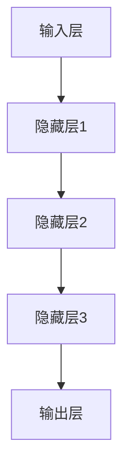
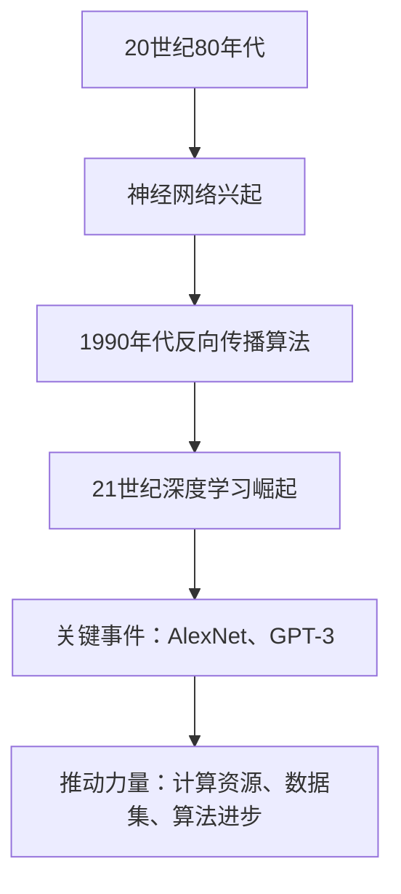
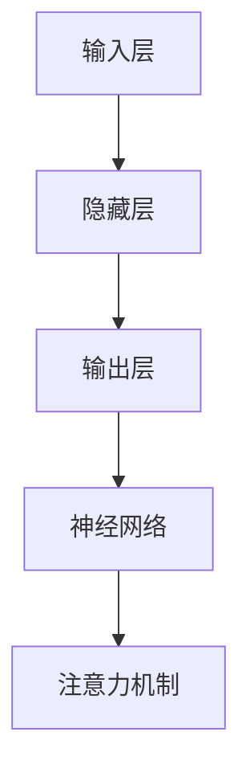
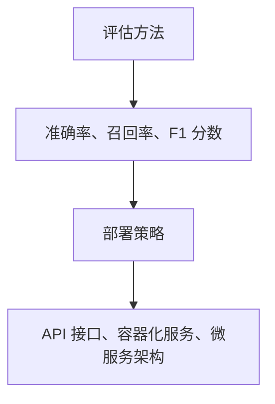

                 

# AI 大模型创业：如何利用未来优势？

## 关键词
- AI 大模型
- 创业
- 未来趋势
- 挑战与应对
- 应用案例分析

## 摘要
本文将深入探讨 AI 大模型创业领域的机遇与挑战。我们将首先概述 AI 大模型的基础知识，包括基本概念、架构原理、发展历程和应用领域。随后，文章将重点分析 AI 大模型创业的策略与实践，涵盖创业公司的角色定位、项目选择、团队构建与管理等方面。通过具体案例分析，我们将展示 AI 大模型在不同行业的应用，并探讨创业公司在实际操作中面临的挑战与成功经验。最后，文章将展望 AI 大模型创业的未来趋势，提出应对挑战的策略和建议。

---

### 第一部分: AI 大模型创业基础

#### 第1章: AI 大模型概述

##### 1.1 AI 大模型的基本概念

###### 1.1.1 AI 大模型的发展历程
AI 大模型的发展可追溯到 20 世纪 80 年代，当时神经网络技术开始兴起。然而，由于计算资源和数据集的限制，直到近年来，随着深度学习和大数据技术的发展，AI 大模型才逐渐成熟。关键事件包括 2012 年 Google 使用的神经图像识别系统，以及 OpenAI 推出的 GPT-3 模型。

###### 1.1.2 AI 大模型的定义
AI 大模型是指使用深度学习技术训练的，参数量巨大，能够在多种任务上表现优异的人工智能模型。这些模型通常具有多层神经网络结构，能够自动从大量数据中学习复杂的关系和模式。

###### 1.1.3 AI 大模型的应用领域
AI 大模型的应用领域非常广泛，包括但不限于以下行业：
- **医疗**：用于疾病诊断、预测、药物研发等。
- **金融**：用于风险控制、量化交易、市场预测等。
- **教育**：用于个性化教学、课程推荐、学习行为分析等。
- **制造**：用于质量检测、预测维护、供应链优化等。

##### 1.2 AI 大模型的架构原理

###### 1.2.1 AI 大模型的核心架构
AI 大模型的核心架构通常包括输入层、隐藏层和输出层。输入层接收外部数据，隐藏层通过多层神经网络进行特征提取和变换，输出层生成预测结果或分类标签。

###### 1.2.2 大模型的训练与优化
AI 大模型的训练过程包括以下步骤：
1. **数据准备**：收集、清洗和处理大量数据。
2. **模型初始化**：随机初始化模型参数。
3. **前向传播**：计算输入数据在神经网络中的传播路径。
4. **计算损失**：计算预测结果与真实结果之间的差距。
5. **反向传播**：更新模型参数，以减小损失。
6. **迭代训练**：重复以上步骤，直到满足停止条件。

常见的优化算法包括梯度下降、随机梯度下降、Adam 等。

###### 1.2.3 大模型的评估与部署
AI 大模型的评估通常使用准确率、召回率、F1 分数等指标。部署方面，模型可以通过 API 接口、容器化服务等方式提供服务。

##### 1.3 AI 大模型的发展趋势与挑战

###### 1.3.1 AI 大模型的发展趋势
- **模型压缩**：为了降低计算资源和存储需求，模型压缩技术不断发展，如剪枝、量化、知识蒸馏等。
- **多模态学习**：AI 大模型逐渐能够处理多种类型的数据，如文本、图像、声音等，实现更广泛的应用。
- **联邦学习**：为了保护数据隐私，联邦学习技术受到关注，能够在不共享数据的情况下训练模型。

###### 1.3.2 AI 大模型的挑战与应对策略
- **计算资源**：AI 大模型训练需要大量计算资源，应对策略包括使用 GPU、TPU 等高性能计算设备，以及分布式训练技术。
- **数据隐私**：AI 大模型训练过程中涉及大量敏感数据，应对策略包括联邦学习、差分隐私等技术。
- **伦理问题**：AI 大模型在决策过程中可能会出现偏见和歧视，应对策略包括数据清洗、模型解释性研究等。

#### 第2章: AI 大模型创业策略

##### 2.1 创业公司的角色定位

###### 2.1.1 创业公司在 AI 大模型领域的定位
创业公司在 AI 大模型领域可以扮演多种角色，如：
- **技术创新者**：专注于 AI 大模型技术的研发和突破。
- **行业解决方案提供商**：针对特定行业提供 AI 大模型解决方案。
- **平台服务提供商**：提供 AI 大模型训练、部署、管理等服务。

###### 2.1.2 市场需求分析
分析市场需求是创业成功的关键。创业公司需要关注以下方面：
- **行业趋势**：了解各个行业对 AI 大模型的需求和发展方向。
- **竞争对手**：分析竞争对手的优势和不足，找出切入点。
- **用户需求**：了解目标用户的需求和痛点，提供有针对性的解决方案。

##### 2.2 创业项目的选择与规划

###### 2.2.1 AI 大模型项目的选择标准
选择 AI 大模型项目时，可以考虑以下标准：
- **技术可行性**：项目的技术难度和实现可能性。
- **市场需求**：项目的市场需求和潜在市场规模。
- **资源投入**：项目的资源投入和回报周期。

###### 2.2.2 创业项目的规划和实施
创业项目的规划包括以下步骤：
1. **项目立项**：明确项目目标和可行性。
2. **需求分析**：分析用户需求和业务场景。
3. **技术方案**：选择合适的技术方案和架构。
4. **开发与测试**：进行模型开发、测试和优化。
5. **部署上线**：部署模型并上线提供服务。
6. **持续迭代**：根据用户反馈和业务发展，持续优化和迭代。

##### 2.3 创业团队的构建与管理

###### 2.3.1 创业团队的角色与职责
创业团队通常包括以下角色：
- **创始人**：负责整体战略规划和决策。
- **技术总监**：负责技术路线和团队管理。
- **数据科学家**：负责模型研发和优化。
- **产品经理**：负责需求分析和产品设计。
- **运维工程师**：负责系统部署和维护。

###### 2.3.2 创业团队的管理与协作
创业团队的管理和协作需要关注以下方面：
- **明确目标**：确保团队成员明确项目目标和职责。
- **有效沟通**：建立良好的沟通机制，确保信息流通。
- **分工协作**：明确分工，确保团队高效协作。
- **激励与反馈**：建立激励机制，鼓励团队成员积极参与和反馈。

### 第三部分: AI 大模型应用案例分析

#### 第3章: AI 大模型在具体行业的应用

##### 3.1 AI 大模型在金融行业的应用

###### 3.1.1 金融风控
AI 大模型在金融风控中的应用主要体现在以下几个方面：
- **信用评估**：利用 AI 大模型对借款人的信用状况进行评估，预测其还款能力。
- **反欺诈**：通过分析交易数据，识别异常交易行为，防范欺诈风险。
- **风险预警**：实时监测市场变化，预测潜在风险，提前采取措施。

###### 3.1.2 量化交易
AI 大模型在量化交易中的应用包括：
- **算法选股**：基于历史数据和财务指标，利用 AI 大模型筛选具有投资价值的股票。
- **市场预测**：分析市场走势，预测价格变化，制定交易策略。

##### 3.2 AI 大模型在医疗行业的应用

###### 3.2.1 医疗诊断
AI 大模型在医疗诊断中的应用包括：
- **疾病检测**：通过分析医学影像，识别疾病，辅助医生进行诊断。
- **影像分析**：分析医疗影像数据，提取有用信息，为医生提供诊断依据。

###### 3.2.2 智能药物研发
AI 大模型在智能药物研发中的应用包括：
- **药物筛选**：利用 AI 大模型分析大量药物数据，筛选具有潜力的新药。
- **分子设计**：通过 AI 大模型设计新的分子结构，优化药物性能。

##### 3.3 AI 大模型在教育行业的应用

###### 3.3.1 智能教学
AI 大模型在智能教学中的应用包括：
- **个性化学习**：根据学生的学习习惯和成绩，提供个性化的学习资源和指导。
- **教学评价**：分析学生的学习行为和成绩，为教师提供教学改进建议。

###### 3.3.2 在线教育平台优化
AI 大模型在在线教育平台优化中的应用包括：
- **学习行为分析**：分析用户的学习行为，优化课程内容和结构。
- **课程推荐**：根据用户的学习兴趣和需求，推荐合适的课程。

### 第四部分: AI 大模型创业案例分析

#### 第4章: 成功的 AI 大模型创业案例

##### 4.1 案例分析1：AI 医疗公司 A 公司

###### 4.1.1 公司背景
A 公司成立于 2015 年，是一家专注于医疗领域的 AI 大模型创业公司。公司创始人为某知名高校计算机专业博士，拥有丰富的 AI 技术研发和医疗行业经验。

###### 4.1.2 创业项目介绍
A 公司的主要创业项目为基于 AI 大模型的疾病诊断系统。该系统可以自动分析医学影像，辅助医生进行诊断，提高诊断准确率和效率。

###### 4.1.3 成功经验与挑战
A 公司的成功经验包括：
- **技术创新**：公司专注于 AI 大模型的研究和应用，不断推出具有竞争力的产品。
- **市场定位**：公司准确把握市场需求，将产品定位于辅助医生提高诊断效率。

面临的挑战包括：
- **数据隐私**：医疗数据涉及用户隐私，如何在保护数据隐私的前提下进行数据处理和模型训练是一个重要挑战。
- **监管合规**：医疗行业受监管严格，产品需要满足相关法规要求。

##### 4.2 案例分析2：AI 金融公司 B 公司

###### 4.2.1 公司背景
B 公司成立于 2016 年，是一家专注于金融领域的 AI 大模型创业公司。公司创始人为某知名金融科技公司高管，拥有丰富的金融科技研发和市场经验。

###### 4.2.2 创业项目介绍
B 公司的主要创业项目为基于 AI 大模型的量化交易系统。该系统可以自动分析市场数据，制定交易策略，实现自动化交易。

###### 4.2.3 成功经验与挑战
B 公司的成功经验包括：
- **技术创新**：公司专注于 AI 大模型的研究和应用，不断优化算法和交易策略。
- **市场拓展**：公司积极开拓市场，与多家金融机构合作，实现规模化应用。

面临的挑战包括：
- **竞争压力**：金融行业竞争激烈，公司需要不断提升技术优势，保持市场竞争力。
- **合规风险**：金融交易涉及法律法规，公司需要严格遵守相关法规，防范合规风险。

### 第五部分: AI 大模型创业的未来展望

#### 第5章: AI 大模型创业的未来趋势与挑战

##### 5.1 AI 大模型创业的未来趋势

###### 5.1.1 技术发展趋势
未来 AI 大模型的技术发展趋势包括：
- **模型压缩与优化**：随着模型规模越来越大，模型压缩与优化技术将成为关键研究方向，以降低计算资源和存储需求。
- **多模态学习**：多模态学习将使得 AI 大模型能够处理更多类型的数据，实现更广泛的应用。
- **联邦学习**：联邦学习技术将在保护数据隐私的同时，实现大规模的模型训练和协作。

###### 5.1.2 市场发展趋势
未来 AI 大模型在市场发展方面将呈现以下趋势：
- **行业渗透**：AI 大模型将在更多行业得到应用，如制造业、物流等。
- **市场细分**：随着技术进步，AI 大模型将出现更多细分市场，满足不同领域的需求。
- **全球竞争**：随着全球范围内对 AI 大模型的需求增加，国际竞争将更加激烈。

##### 5.2 AI 大模型创业面临的挑战与应对策略

###### 5.2.1 技术挑战
AI 大模型创业过程中面临的技术挑战包括：
- **计算资源**：训练和部署 AI 大模型需要大量计算资源，创业公司需要寻找高效计算解决方案。
- **算法优化**：随着模型规模增大，算法优化成为关键，创业公司需要不断改进算法，提高模型性能。
- **数据质量**：数据质量对模型性能至关重要，创业公司需要确保数据的质量和多样性。

###### 5.2.2 市场挑战
AI 大模型创业过程中面临的市场挑战包括：
- **竞争压力**：市场已经出现众多竞争对手，创业公司需要通过技术创新和差异化策略来保持竞争力。
- **用户需求**：用户需求多变，创业公司需要不断了解用户需求，提供定制化解决方案。
- **法规合规**：不同国家和地区对 AI 大模型的应用有不同的法规要求，创业公司需要确保产品合规。

###### 5.2.3 应对策略
针对上述挑战，创业公司可以采取以下应对策略：
- **技术创新**：持续投入研发，提高技术竞争力。
- **合作拓展**：与行业领先企业和研究机构合作，共享资源和知识。
- **市场定位**：明确市场定位，提供有针对性的解决方案。
- **合规管理**：建立合规管理体系，确保产品和服务符合相关法规要求。

### 附录

#### 附录A: AI 大模型创业相关资源

##### A.1 开发工具与平台
- **TensorFlow**：谷歌开源的深度学习框架，支持多种神经网络结构。
- **PyTorch**：Facebook 开源的深度学习框架，具有灵活的动态图计算能力。
- **Keras**：基于 TensorFlow 的简化深度学习框架，易于入门和使用。

##### A.2 开源项目与代码库
- **OpenAI Gym**：开源的环境库，提供多种仿真环境，用于测试和训练 AI 大模型。
- **Hugging Face**：提供多种预训练模型和工具，方便使用 AI 大模型进行自然语言处理任务。
- **MLflow**：开源的机器学习平台，用于管理模型生命周期、版本控制和部署。

##### A.3 研究报告与行业趋势
- **Gartner**：提供关于 AI 大模型的市场分析和趋势报告。
- **IDC**：发布关于 AI 大模型的研究报告，分析技术发展和市场前景。
- **McKinsey**：探讨 AI 大模型在各个行业中的应用场景和商业价值。

### 结束语

AI 大模型创业是一个充满机遇和挑战的领域。通过本文的探讨，我们深入了解了 AI 大模型的基本概念、架构原理、创业策略以及实际应用案例。未来，随着技术的不断进步和市场需求的增长，AI 大模型创业将迎来更广阔的发展空间。创业公司需要不断创新，抓住机遇，应对挑战，为行业带来更多的价值。

---

**作者：AI 天才研究院 / AI Genius Institute & 禅与计算机程序设计艺术 / Zen And The Art of Computer Programming**### 第一部分: AI 大模型创业基础

#### 第1章: AI 大模型概述

##### 1.1 AI 大模型的基本概念

###### 1.1.1 AI 大模型的发展历程
AI 大模型的发展历程可以追溯到 20 世纪 80 年代，当时神经网络技术开始兴起。最初的神经网络模型结构相对简单，例如感知器（Perceptron）和多层感知器（Multilayer Perceptron, MLP）。随着计算机性能的提升和算法的改进，神经网络模型逐渐变得更加复杂和强大。1990 年代，反向传播算法（Backpropagation Algorithm）的出现使得多层神经网络训练成为可能。然而，由于当时计算资源和数据集的限制，神经网络的应用范围有限。

进入 21 世纪，随着深度学习的兴起，AI 大模型开始逐渐崭露头角。2006 年，Hinton 等人提出了深度信念网络（Deep Belief Network, DBN），标志着深度学习技术的重要进展。2012 年，AlexNet 在 ImageNet 挑战赛中取得了突破性的成绩，显著提升了深度卷积神经网络（Convolutional Neural Network, CNN）在图像识别任务中的性能。这一成果激发了学术界和工业界对深度学习的关注和投入。

此后，AI 大模型的发展进入了一个快速发展的阶段。2014 年，Google 推出了基于深度学习的语音识别系统，将语音识别的错误率降低至 5% 以下。2018 年，OpenAI 推出了 GPT-2 模型，展示了基于 Transformer 架构的预训练语言模型在自然语言处理任务中的强大能力。2019 年，Google 推出了 BERT 模型，进一步推动了自然语言处理领域的发展。2020 年，OpenAI 推出了 GPT-3 模型，拥有超过 1750 亿个参数，成为当时最大的预训练语言模型。

这些关键事件和模型的推出，不仅推动了 AI 大模型技术的发展，也为其在各行各业的广泛应用奠定了基础。

###### 1.1.2 AI 大模型的定义
AI 大模型（AI Large Model）是指使用深度学习技术训练的，参数量巨大，能够在多种任务上表现优异的人工智能模型。这些模型通常具有多层神经网络结构，能够自动从大量数据中学习复杂的关系和模式。具体来说，AI 大模型具有以下特点：

1. **大规模参数**：AI 大模型的参数量通常在数千亿到数万亿之间，这使得模型能够捕捉到数据中的细微特征和关系。
2. **多层神经网络**：AI 大模型通常采用多层神经网络结构，包括卷积神经网络（CNN）、循环神经网络（RNN）和 Transformer 架构等。这种结构使得模型能够对输入数据进行多层次的抽象和特征提取。
3. **预训练与微调**：AI 大模型通常采用预训练（Pre-training）和微调（Fine-tuning）的方法进行训练。预训练阶段使用大规模的数据集对模型进行初步训练，使其能够学习到通用的特征表示；微调阶段则在特定任务上对模型进行调整，以适应具体的应用场景。
4. **广泛的应用**：AI 大模型能够应用于多种任务，如图像识别、自然语言处理、语音识别、推荐系统等。这种模型具有通用性和灵活性，能够在不同的领域中发挥作用。

###### 1.1.3 AI 大模型的应用领域
AI 大模型的应用领域非常广泛，以下是一些主要的行业和应用场景：

1. **医疗**：AI 大模型在医疗领域的应用包括疾病诊断、影像分析、药物研发等。例如，通过深度学习模型可以对医学影像进行分析，辅助医生进行疾病的诊断和预测。同时，AI 大模型还可以用于新药的发现和优化，提高药物研发的效率。
2. **金融**：在金融领域，AI 大模型可以用于风险管理、量化交易、市场预测等。例如，利用深度学习模型对金融市场的历史数据进行分析，可以帮助投资者制定更有效的投资策略。此外，AI 大模型还可以用于信用评估、欺诈检测等任务，提高金融服务的安全性和效率。
3. **教育**：在 education 领域，AI 大模型可以用于个性化教学、课程推荐、学习行为分析等。例如，通过分析学生的学习行为和成绩数据，AI 大模型可以为学生提供个性化的学习建议和资源，提高学习效果。同时，AI 大模型还可以用于自动批改作业和考试，节省教师的工作量。
4. **制造**：在 manufacturing 领域，AI 大模型可以用于质量检测、预测维护、供应链优化等。例如，通过分析生产线数据，AI 大模型可以检测出产品质量问题，并预测设备的维护需求，以提高生产效率和产品质量。此外，AI 大模型还可以用于优化供应链管理，降低库存成本，提高物流效率。
5. **零售**：在 retail 领域，AI 大模型可以用于客户行为分析、库存管理、营销策略等。例如，通过分析客户的购买记录和行为数据，AI 大模型可以预测客户的购买偏好，从而为商家提供更有效的营销策略。此外，AI 大模型还可以用于优化库存管理，减少库存成本，提高销售效率。
6. **交通**：在 transportation 领域，AI 大模型可以用于交通预测、路线规划、自动驾驶等。例如，通过分析交通数据，AI 大模型可以预测交通流量和事故风险，为交通管理和规划提供支持。同时，AI 大模型还可以用于自动驾驶系统，提高行车安全和效率。

##### 1.2 AI 大模型的架构原理

###### 1.2.1 AI 大模型的核心架构
AI 大模型的核心架构通常包括输入层、隐藏层和输出层。每个层由多个神经元（或节点）组成，神经元之间通过权重连接。以下是 AI 大模型核心架构的 Mermaid 流程图：



在输入层，每个神经元接收外部输入数据，并将其传递给隐藏层。隐藏层通过多层神经网络进行特征提取和变换，将原始输入数据转化为更高层次的特征表示。输出层生成预测结果或分类标签。

###### 1.2.2 大模型的训练与优化
AI 大模型的训练过程包括以下步骤：

1. **数据准备**：收集、清洗和处理大量数据。数据的质量直接影响模型的性能，因此数据预处理是训练过程中至关重要的一环。数据清洗包括去除噪声、填补缺失值、异常值处理等。
2. **模型初始化**：随机初始化模型参数。初始化参数的方式和初始值的选择对模型的收敛速度和最终性能有重要影响。
3. **前向传播**：计算输入数据在神经网络中的传播路径。前向传播过程包括从输入层到输出层的逐层计算，每个神经元根据其输入和权重计算输出值。
4. **计算损失**：计算预测结果与真实结果之间的差距。常见的损失函数包括均方误差（MSE）、交叉熵（Cross-Entropy）等。损失函数用于量化模型预测的误差，是优化模型参数的重要依据。
5. **反向传播**：更新模型参数，以减小损失。反向传播过程将计算得到的损失函数梯度反向传播到各层神经元的权重和偏置上，通过梯度下降等优化算法调整模型参数。
6. **迭代训练**：重复以上步骤，直到满足停止条件。迭代训练的目的是逐步减小模型预测误差，提高模型性能。常见的停止条件包括训练损失收敛、验证损失不再下降、迭代次数达到预设值等。

以下是一个简化的伪代码，用于描述 AI 大模型的训练过程：

```python
# 初始化模型参数
model = initialize_model()

# 定义损失函数
loss_function = define_loss_function()

# 迭代训练
for epoch in range(num_epochs):
    for batch in data_loader:
        # 前向传播
        outputs = model(batch.x)
        
        # 计算损失
        loss = loss_function(outputs, batch.y)
        
        # 反向传播
        gradients = compute_gradients(model, loss)
        
        # 更新模型参数
        update_model_params(model, gradients)
        
    # 打印训练进度
    print(f"Epoch {epoch+1}/{num_epochs}, Loss: {loss}")
```

常见的优化算法包括梯度下降（Gradient Descent）、随机梯度下降（Stochastic Gradient Descent, SGD）、Adam（Adaptive Moment Estimation）等。这些算法通过不同方式更新模型参数，以实现模型优化。

###### 1.2.3 大模型的评估与部署
AI 大模型的评估通常使用以下指标：

1. **准确率（Accuracy）**：预测结果与真实结果一致的比例。适用于分类任务。
2. **召回率（Recall）**：在所有正样本中，预测为正样本的比例。适用于分类任务。
3. **精确率（Precision）**：在所有预测为正样本中，实际为正样本的比例。适用于分类任务。
4. **F1 分数（F1 Score）**：准确率与召回率的调和平均值。适用于分类任务。

以下是一个简化的伪代码，用于评估 AI 大模型的性能：

```python
# 定义评估指标
evaluation_metrics = define_evaluation_metrics()

# 评估模型性能
for batch in validation_loader:
    # 前向传播
    outputs = model(batch.x)
    
    # 计算预测结果
    predictions = predict(outputs)
    
    # 计算评估指标
    metrics = evaluation_metrics(predictions, batch.y)
    
    # 打印评估结果
    print(f"Accuracy: {metrics.accuracy}, Precision: {metrics.precision}, Recall: {metrics.recall}, F1 Score: {metrics.f1_score}")
```

在部署方面，AI 大模型可以通过以下方式提供服务：

1. **API 接口**：通过定义 API 接口，将模型部署在服务器上，供外部系统调用。
2. **容器化服务**：使用 Docker 等容器技术，将模型及其依赖环境打包，便于部署和迁移。
3. **微服务架构**：将模型训练、推理、服务管理等功能拆分为独立的微服务，实现模块化和可扩展性。

##### 1.3 AI 大模型的发展趋势与挑战

###### 1.3.1 AI 大模型的发展趋势
AI 大模型技术的发展趋势包括以下几个方面：

1. **模型压缩与优化**：为了降低计算资源和存储需求，模型压缩与优化技术不断发展。常见的压缩技术包括剪枝（Pruning）、量化（Quantization）、知识蒸馏（Knowledge Distillation）等。这些技术能够显著减小模型的大小和计算量，提高模型的效率。
2. **多模态学习**：随着数据来源的多样化和应用场景的复杂化，多模态学习成为 AI 大模型研究的重要方向。多模态学习旨在将不同类型的数据（如文本、图像、音频等）融合到同一模型中，实现跨模态的信息理解和交互。
3. **联邦学习**：联邦学习（Federated Learning）是一种分布式机器学习技术，旨在在不共享数据的情况下协同训练模型。联邦学习能够解决数据隐私和保护问题，同时实现大规模的模型训练和协作。
4. **可解释性**：随着 AI 大模型在各个领域的应用，模型的可解释性变得越来越重要。可解释性有助于理解模型的工作原理和决策过程，增强用户对模型的信任，并为模型的改进提供指导。
5. **自适应学习**：AI 大模型将逐渐具备自适应学习的能力，能够根据用户行为和环境变化动态调整模型参数，提供更加个性化的服务。

###### 1.3.2 AI 大模型的挑战与应对策略
AI 大模型在发展过程中面临以下挑战：

1. **计算资源**：训练和部署 AI 大模型需要大量计算资源。应对策略包括使用高性能计算设备（如 GPU、TPU）、分布式训练技术（如参数服务器、数据并行、模型并行）等。
2. **数据隐私**：AI 大模型训练过程中涉及大量敏感数据，数据隐私保护成为重要挑战。应对策略包括联邦学习、差分隐私、同态加密等技术。
3. **算法优化**：随着模型规模增大，算法优化成为关键挑战。应对策略包括优化模型结构（如网络剪枝、网络融合）、优化训练过程（如自适应学习率、学习率调度）等。
4. **模型可解释性**：提高模型的可解释性有助于理解模型的工作原理和决策过程，增强用户对模型的信任。应对策略包括特征可视化、模型解释性方法（如 Grad-CAM、LIME）等。
5. **伦理问题**：AI 大模型在决策过程中可能会出现偏见和歧视，影响公平性和公正性。应对策略包括数据清洗、算法公平性评估、伦理审查等。

通过应对这些挑战，AI 大模型将能够更好地应用于各个领域，为社会带来更多的价值和便利。

---

在本章节中，我们详细介绍了 AI 大模型的基本概念、发展历程、架构原理、应用领域以及发展趋势与挑战。AI 大模型作为一种先进的机器学习技术，正在改变着各个行业的面貌。在接下来的章节中，我们将进一步探讨 AI 大模型创业的策略与实践，为创业公司提供有针对性的指导和建议。希望读者能够对 AI 大模型有一个更深入的理解，并为未来的创业之路做好准备。

### 第二部分: AI 大模型创业实践

#### 第2章: AI 大模型创业策略

##### 2.1 创业公司的角色定位

###### 2.1.1 创业公司在 AI 大模型领域的定位
在 AI 大模型领域，创业公司可以扮演多种角色，具体包括以下几个方面：

1. **技术创新者**：技术创新者是创业公司最为典型的角色之一。这类公司专注于 AI 大模型技术的研发和突破，不断推动 AI 大模型技术的边界。他们通常具有强大的技术团队和深厚的研究背景，致力于开发新的算法、模型结构和优化方法。技术创新者在 AI 大模型领域中的作用至关重要，他们通过技术创新推动了 AI 大模型的发展和应用。

2. **行业解决方案提供商**：行业解决方案提供商是针对特定行业需求提供 AI 大模型解决方案的公司。这类公司通常深入了解行业应用场景和业务需求，能够为不同行业（如医疗、金融、教育等）提供定制化的 AI 大模型解决方案。他们通过将 AI 大模型技术应用到具体的行业场景中，帮助行业客户提高效率、降低成本和提升服务质量。

3. **平台服务提供商**：平台服务提供商则是提供 AI 大模型训练、部署、管理等服务的公司。这类公司通常构建了完整的 AI 大模型平台，为用户提供便捷、高效、安全的服务。平台服务提供商可以通过 API 接口、云计算平台、容器化服务等方式，为用户快速部署和运行 AI 大模型应用，降低用户的使用门槛和成本。

4. **AI 大模型应用场景开发者**：AI 大模型应用场景开发者是专注于开发特定 AI 大模型应用场景的公司。这类公司通常针对某一具体应用场景（如自动驾驶、智能客服等）进行深入研究和开发，致力于将 AI 大模型技术应用到实际业务场景中。他们通过不断优化和改进 AI 大模型应用，提升用户体验和业务价值。

5. **AI 大模型教育与培训**：AI 大模型教育与培训公司是提供 AI 大模型相关课程和培训服务的公司。这类公司通常具备丰富的教学经验和专业知识，能够为行业从业人员和学生提供高质量的 AI 大模型教育和培训。通过教育和培训，AI 大模型教育与培训公司能够推动行业技术人才的培养，为 AI 大模型技术的发展提供源源不断的人才支持。

在 AI 大模型领域，创业公司应根据自身的技术实力、资源条件和市场定位，选择合适的角色和方向。不同的角色和方向有不同的机遇和挑战，创业公司需要根据自己的实际情况进行选择和调整。

###### 2.1.2 市场需求分析
市场需求分析是创业公司成功的关键之一。通过深入分析市场需求，创业公司可以找到切入口，制定有针对性的产品策略和营销方案。以下是从几个方面进行市场需求分析：

1. **行业趋势**：了解各个行业对 AI 大模型的需求和发展趋势，是市场需求分析的重要环节。创业公司可以通过查阅行业报告、分析行业数据、与行业专家交流等方式，获取行业发展的最新动态。例如，医疗行业对 AI 大模型的需求主要集中在疾病诊断、影像分析和药物研发等领域；金融行业对 AI 大模型的需求则主要体现在风险管理、量化交易和信用评估等方面。

2. **竞争对手**：分析竞争对手的优势和不足，是创业公司制定战略的重要参考。创业公司可以通过市场调研、产品对比、用户反馈等方式，了解竞争对手的产品特点、市场定位、用户满意度等方面。通过分析竞争对手的优劣势，创业公司可以找出自身的差异化优势，并制定针对性的市场策略。

3. **用户需求**：了解目标用户的需求和痛点，是创业公司成功的关键。创业公司可以通过用户调研、用户访谈、用户反馈等方式，获取用户对 AI 大模型产品的需求和期望。例如，用户可能希望产品具有更高的准确率、更好的可解释性、更低的成本等。通过了解用户需求，创业公司可以针对性地优化产品，提高用户满意度。

4. **技术发展**：技术发展对 AI 大模型市场需求具有重要影响。随着 AI 大模型技术的不断进步，新的应用场景和需求不断涌现。创业公司应密切关注技术发展动态，及时调整产品策略和市场定位，以适应市场需求的变化。

5. **政策环境**：政策环境对 AI 大模型市场需求也有一定的影响。不同国家和地区的政策法规对 AI 大模型的应用和发展有不同的支持力度。创业公司应关注政策动态，了解相关政策对行业的影响，制定合规的经营策略。

通过以上几个方面的市场需求分析，创业公司可以全面了解 AI 大模型市场的现状和未来发展趋势，为创业公司的战略规划提供有力支持。

##### 2.2 创业项目的选择与规划

###### 2.2.1 AI 大模型项目的选择标准
选择 AI 大模型项目时，需要综合考虑多个因素，以下是一些常见的项目选择标准：

1. **技术可行性**：技术可行性是选择 AI 大模型项目的重要标准之一。创业公司需要评估项目所采用的技术是否成熟、是否有足够的技术储备和团队实力。例如，如果项目涉及全新的技术领域，创业公司需要评估自身的技术能力，确保能够顺利实现项目目标。

2. **市场需求**：市场需求是选择 AI 大模型项目的关键因素。创业公司需要评估目标市场的规模和增长潜力，了解用户对 AI 大模型产品的需求和痛点。如果市场需求大，用户对产品的接受度高，项目成功的可能性将更高。

3. **商业价值**：商业价值是评估 AI 大模型项目的重要标准。创业公司需要考虑项目的盈利模式、市场前景、投资回报率等因素。一个具有高商业价值的 AI 大模型项目，能够在短时间内实现盈利，并为公司带来持续的利润。

4. **资源投入**：资源投入是选择 AI 大模型项目时需要考虑的重要因素。创业公司需要评估项目的资源需求，包括资金、人力、技术资源等。如果项目的资源投入过大，可能对公司的运营和资金链造成压力，影响公司的稳定发展。

5. **团队实力**：团队实力是确保项目成功的关键因素。创业公司需要评估团队的技术能力、经验、协作能力等。一个具备强大技术实力和丰富经验的团队，能够更好地应对项目中的挑战，确保项目顺利进行。

6. **风险与挑战**：在选择 AI 大模型项目时，需要评估项目可能面临的风险和挑战。例如，技术风险、市场风险、政策风险等。创业公司需要根据自身的情况，制定相应的风险应对策略，确保项目的稳定发展。

通过综合考虑以上因素，创业公司可以做出更加科学、合理的项目选择，提高项目成功的可能性。

###### 2.2.2 创业项目的规划和实施
创业项目的规划和实施是创业公司成功的关键环节。以下是一个典型的创业项目规划流程和实施步骤：

1. **项目立项**：项目立项是创业项目的起点。在立项阶段，创业公司需要明确项目目标、可行性分析和预期成果。项目目标应具体、明确，可行性分析应包括技术可行性、市场需求、商业价值等方面。预期成果应包括项目的时间节点、里程碑和交付物等。

2. **需求分析**：在需求分析阶段，创业公司需要深入了解用户需求和市场趋势，明确项目的具体需求。需求分析应包括用户访谈、市场调研、竞争分析等方面。通过需求分析，创业公司可以确定项目的核心功能和目标用户群体。

3. **技术方案**：在技术方案阶段，创业公司需要选择合适的技术方案和架构。技术方案应包括模型设计、算法选择、系统架构等方面。创业公司应充分考虑技术可行性、性能、可扩展性等因素，确保技术方案能够满足项目需求。

4. **开发与测试**：在开发与测试阶段，创业公司需要按照技术方案进行软件开发和测试。开发阶段包括模型训练、代码编写、系统集成等方面。测试阶段包括功能测试、性能测试、安全测试等方面。通过严格的测试，确保项目质量满足预期要求。

5. **部署上线**：在部署上线阶段，创业公司需要将项目部署到生产环境，并进行上线测试。部署阶段包括服务器配置、网络配置、数据迁移等方面。上线测试应包括系统性能、稳定性、安全性等方面。通过上线测试，确保项目能够在实际环境中稳定运行。

6. **持续迭代**：在项目上线后，创业公司需要持续关注用户反馈和市场动态，进行产品的迭代和优化。通过持续迭代，创业公司可以不断优化产品，提升用户体验和竞争力。

以上是创业项目规划和实施的典型步骤，创业公司可以根据实际情况进行调整和优化。

##### 2.3 创业团队的构建与管理

###### 2.3.1 创业团队的角色与职责
创业团队的构建是创业成功的关键之一。一个高效的创业团队应包括以下角色和职责：

1. **创始人**：创始人通常是创业公司的核心人物，负责整体战略规划和决策。创始人应具备较强的领导能力、决策能力和商业洞察力，能够带领团队实现创业目标。

2. **技术总监**：技术总监负责技术路线和团队管理。技术总监应具备深厚的技术背景和项目管理经验，能够带领团队进行技术攻关和项目实施。

3. **数据科学家**：数据科学家负责模型研发和优化。数据科学家应具备较强的数学和编程能力，能够设计和实现高效的算法，提升模型的性能和效果。

4. **产品经理**：产品经理负责需求分析和产品设计。产品经理应具备用户洞察力和市场敏感度，能够根据用户需求和业务目标，制定合理的产品策略和功能规划。

5. **运维工程师**：运维工程师负责系统部署和维护。运维工程师应具备较强的技术能力和问题解决能力，能够确保系统的高可用性和稳定性。

6. **市场营销人员**：市场营销人员负责市场推广和销售。市场营销人员应具备市场敏感度和营销策略，能够通过各种渠道推广产品，提升品牌知名度。

7. **财务人员**：财务人员负责财务管理。财务人员应具备财务管理能力和风险控制意识，能够确保公司财务状况的健康稳定。

8. **人力资源管理人员**：人力资源管理人员负责团队招聘、培训和管理。人力资源管理人员应具备招聘经验和团队管理能力，能够为团队提供有力的人力资源支持。

通过明确各角色和职责，创业团队能够高效协作，共同推动创业项目的发展。

###### 2.3.2 创业团队的管理与协作
创业团队的管理与协作是确保团队高效运作的关键。以下是一些有效的管理和协作策略：

1. **明确目标**：创业团队应明确共同的目标和愿景，确保团队成员在正确的方向上努力。通过制定具体的目标和里程碑，团队可以更好地衡量进展和成果。

2. **有效沟通**：沟通是团队协作的基础。创业团队应建立良好的沟通机制，确保信息流通。通过定期的团队会议、即时通讯工具、邮件等方式，团队成员可以及时分享进展和问题。

3. **分工协作**：创业团队应根据成员的特长和优势，明确分工，确保团队成员各司其职。通过合理的分工，团队可以更好地发挥每个成员的能力，提高工作效率。

4. **激励与反馈**：创业团队应建立激励机制，鼓励成员积极参与和贡献。通过定期评估和反馈，团队可以了解成员的表现和进步，及时调整和改进。

5. **文化建设**：创业团队应注重文化建设，营造积极向上的团队氛围。通过团队活动、培训和团建等，增强团队的凝聚力和归属感。

6. **敏捷开发**：创业团队应采用敏捷开发方法，灵活应对变化和挑战。通过迭代开发和持续集成，团队可以更快地交付高质量的产品。

通过以上管理和协作策略，创业团队能够高效运作，实现创业目标。

#### 第3章: AI 大模型在具体行业的应用

##### 3.1 AI 大模型在金融行业的应用

###### 3.1.1 金融风控
AI 大模型在金融风控中的应用主要体现在以下几个方面：

1. **信用评估**：AI 大模型可以通过分析用户的信用信息，如财务状况、信用记录、行为特征等，对用户的信用状况进行评估。与传统信用评估方法相比，AI 大模型能够更准确地预测用户的信用风险，提高信用评估的准确性。

2. **反欺诈**：AI 大模型可以实时分析交易数据，识别异常交易行为，防范欺诈风险。通过训练大量数据，AI 大模型可以学习到欺诈行为的特点和模式，从而在交易发生时，及时识别并阻止欺诈行为。

3. **风险预警**：AI 大模型可以实时监测市场数据、财务数据、宏观经济数据等，对潜在风险进行预警。通过分析这些数据，AI 大模型可以预测市场的变化趋势和风险，帮助金融机构及时调整策略，降低风险。

4. **信用评分**：AI 大模型可以对用户的信用评分进行动态调整，根据用户的行为和信用记录的变化，实时更新信用评分。这种动态的信用评分机制能够更好地反映用户的信用状况，提高信用评估的准确性。

5. **信用评级**：AI 大模型可以用于对企业和机构的信用评级，分析其财务状况、业务模式、行业前景等，预测其信用风险。这种信用评级可以为金融机构提供决策依据，帮助其制定合理的信贷策略。

以下是一个简化的伪代码，用于描述 AI 大模型在金融风控中的应用：

```python
# 准备训练数据
train_data = load_credit_data()

# 初始化模型
model = initialize_credit_model()

# 训练模型
for epoch in range(num_epochs):
    for batch in train_data:
        # 前向传播
        outputs = model(batch.x)
        
        # 计算损失
        loss = compute_loss(outputs, batch.y)
        
        # 反向传播
        gradients = compute_gradients(model, loss)
        
        # 更新模型参数
        update_model_params(model, gradients)

# 评估模型
validation_data = load_validation_data()
model.evaluate(validation_data)

# 应用模型进行信用评估
user_data = get_user_data()
credit_score = model.predict(user_data)
```

###### 3.1.2 量化交易
AI 大模型在量化交易中的应用主要体现在以下几个方面：

1. **算法选股**：AI 大模型可以通过分析大量的股票数据，如股价、成交量、财务指标等，筛选出具有投资价值的股票。通过训练大量历史数据，AI 大模型可以学习到股票价格变化的规律和因素，从而为投资者提供选股建议。

2. **市场预测**：AI 大模型可以预测市场走势，为投资者提供交易策略。通过分析历史市场数据和宏观经济指标，AI 大模型可以预测市场的涨跌趋势，帮助投资者制定投资策略。

3. **交易信号**：AI 大模型可以生成实时的交易信号，指导投资者的买卖操作。通过分析实时市场数据，AI 大模型可以识别出交易机会，为投资者提供买入或卖出的建议。

4. **风险控制**：AI 大模型可以监控投资组合的风险，实时调整投资策略。通过分析投资组合的持仓情况、市场风险等因素，AI 大模型可以预测投资组合的风险水平，并提出风险控制措施。

5. **算法优化**：AI 大模型可以优化交易算法，提高交易效率和收益。通过分析历史交易数据，AI 大模型可以找到最优的交易策略和参数设置，从而提高交易的成功率和收益。

以下是一个简化的伪代码，用于描述 AI 大模型在量化交易中的应用：

```python
# 准备训练数据
train_data = load_market_data()

# 初始化模型
model = initialize_trading_model()

# 训练模型
for epoch in range(num_epochs):
    for batch in train_data:
        # 前向传播
        outputs = model(batch.x)
        
        # 计算损失
        loss = compute_loss(outputs, batch.y)
        
        # 反向传播
        gradients = compute_gradients(model, loss)
        
        # 更新模型参数
        update_model_params(model, gradients)

# 评估模型
validation_data = load_validation_data()
model.evaluate(validation_data)

# 生成交易信号
live_data = get_live_data()
signals = model.predict(live_data)
```

##### 3.2 AI 大模型在医疗行业的应用

###### 3.2.1 医疗诊断
AI 大模型在医疗诊断中的应用主要体现在以下几个方面：

1. **疾病检测**：AI 大模型可以通过分析医学影像，识别疾病。通过训练大量医学影像数据，AI 大模型可以学习到疾病的特点和表现，从而在影像中自动检测疾病。这种技术可以显著提高疾病检测的准确率和效率，辅助医生进行诊断。

2. **影像分析**：AI 大模型可以分析医学影像，提取有用的信息。通过分析影像中的病变区域、形态、结构等，AI 大模型可以为医生提供诊断依据。这种技术可以辅助医生提高诊断的准确性和效率，减少误诊和漏诊的风险。

3. **病理分析**：AI 大模型可以分析病理样本，识别病理特征。通过训练大量病理数据，AI 大模型可以学习到不同病理特征的规律和特点，从而在病理样本中自动识别病理特征。这种技术可以辅助病理医生进行病理诊断，提高病理诊断的准确性。

4. **疾病预测**：AI 大模型可以通过分析患者的病史、基因数据、生活习惯等，预测患者未来可能患的疾病。通过训练大量医学数据，AI 大模型可以学习到疾病发生的规律和影响因素，从而为医生提供疾病预测建议。

5. **个性化治疗**：AI 大模型可以根据患者的具体病情和特征，制定个性化的治疗方案。通过分析患者的医疗数据，AI 大模型可以为医生提供个性化的治疗方案建议，提高治疗效果和患者满意度。

以下是一个简化的伪代码，用于描述 AI 大模型在医疗诊断中的应用：

```python
# 准备训练数据
train_data = load_medical_data()

# 初始化模型
model = initialize_diagnosis_model()

# 训练模型
for epoch in range(num_epochs):
    for batch in train_data:
        # 前向传播
        outputs = model(batch.x)
        
        # 计算损失
        loss = compute_loss(outputs, batch.y)
        
        # 反向传播
        gradients = compute_gradients(model, loss)
        
        # 更新模型参数
        update_model_params(model, gradients)

# 评估模型
validation_data = load_validation_data()
model.evaluate(validation_data)

# 进行疾病检测
live_data = get_live_data()
disease_detected = model.predict(live_data)
```

###### 3.2.2 智能药物研发
AI 大模型在智能药物研发中的应用主要体现在以下几个方面：

1. **药物筛选**：AI 大模型可以通过分析大量的药物数据，筛选出具有潜力的新药。通过训练大量药物数据，AI 大模型可以学习到药物与疾病之间的关联和作用机制，从而在药物数据中自动筛选出新药候选。

2. **分子设计**：AI 大模型可以设计新的分子结构，优化药物性能。通过分析分子结构和生物活性数据，AI 大模型可以预测新的分子结构，并优化其活性、稳定性等性能，从而提高新药的研发效率。

3. **药物合成**：AI 大模型可以优化药物合成路径，降低合成成本。通过分析合成方法和化学性质数据，AI 大模型可以预测最合适的合成路径和条件，从而降低新药的合成成本。

4. **药物代谢**：AI 大模型可以分析药物的代谢途径，预测药物的毒性。通过分析药物代谢数据，AI 大模型可以预测药物在体内的代谢途径和毒性，从而减少药物研发的风险。

5. **临床前评估**：AI 大模型可以评估药物的临床前效果，提高药物研发的成功率。通过分析药物数据和临床试验数据，AI 大模型可以预测药物的临床效果，从而提高药物研发的成功率和成功率。

以下是一个简化的伪代码，用于描述 AI 大模型在智能药物研发中的应用：

```python
# 准备训练数据
train_data = load_drug_data()

# 初始化模型
model = initialize_drug_model()

# 训练模型
for epoch in range(num_epochs):
    for batch in train_data:
        # 前向传播
        outputs = model(batch.x)
        
        # 计算损失
        loss = compute_loss(outputs, batch.y)
        
        # 反向传播
        gradients = compute_gradients(model, loss)
        
        # 更新模型参数
        update_model_params(model, gradients)

# 评估模型
validation_data = load_validation_data()
model.evaluate(validation_data)

# 药物筛选
live_data = get_live_data()
drug_candidate = model.predict(live_data)
```

##### 3.3 AI 大模型在教育行业的应用

###### 3.3.1 智能教学
AI 大模型在智能教学中的应用主要体现在以下几个方面：

1. **个性化学习**：AI 大模型可以根据学生的学习习惯、成绩和学习路径，提供个性化的学习资源和建议。通过分析学生的学习数据，AI 大模型可以识别学生的学习特点和需求，从而提供定制化的学习资源和辅导方案。

2. **智能辅导**：AI 大模型可以为学生提供智能辅导，解答学习中的问题。通过训练大量教学问题和解答数据，AI 大模型可以学习到问题的解答方法和知识点，从而在学生提问时，提供准确的解答和建议。

3. **自动批改**：AI 大模型可以自动批改作业和考试，提高教学效率。通过分析学生的作业和考试成绩数据，AI 大模型可以识别出学生的答题思路和错误原因，从而自动批改作业和考试，节省教师的工作量。

4. **教学评价**：AI 大模型可以分析学生的学习行为和成绩数据，为教师提供教学改进建议。通过分析学生的学习数据，AI 大模型可以识别出教学中的问题和不足，为教师提供针对性的改进建议，提高教学效果。

5. **学习推荐**：AI 大模型可以根据学生的学习兴趣和需求，推荐合适的学习资源和课程。通过分析学生的学习数据和学习记录，AI 大模型可以识别出学生的学习偏好和需求，从而推荐与之相关的学习资源和课程，提高学习效果和兴趣。

以下是一个简化的伪代码，用于描述 AI 大模型在智能教学中的应用：

```python
# 准备训练数据
train_data = load_learning_data()

# 初始化模型
model = initialize_learning_model()

# 训练模型
for epoch in range(num_epochs):
    for batch in train_data:
        # 前向传播
        outputs = model(batch.x)
        
        # 计算损失
        loss = compute_loss(outputs, batch.y)
        
        # 反向传播
        gradients = compute_gradients(model, loss)
        
        # 更新模型参数
        update_model_params(model, gradients)

# 评估模型
validation_data = load_validation_data()
model.evaluate(validation_data)

# 个性化学习
student_data = get_student_data()
learning_resources = model.predict(student_data)
```

###### 3.3.2 在线教育平台优化
AI 大模型在在线教育平台优化中的应用主要体现在以下几个方面：

1. **用户行为分析**：AI 大模型可以分析用户的学习行为和互动数据，了解用户的学习习惯和需求。通过分析学生的学习数据，AI 大模型可以识别出用户的学习偏好和需求，为平台提供个性化的学习体验和推荐。

2. **课程推荐**：AI 大模型可以根据用户的学习行为和兴趣，推荐合适的课程和内容。通过分析用户的历史学习记录和学习行为，AI 大模型可以推荐与之相关的课程和内容，提高用户的学习效果和满意度。

3. **学习路径规划**：AI 大模型可以根据用户的学习能力和需求，为用户规划合适的学习路径。通过分析用户的学习数据和学习进度，AI 大模型可以为用户推荐合适的学习计划和课程，帮助用户高效地学习。

4. **教学效果评估**：AI 大模型可以分析学生的学习成绩和学习行为，评估教学效果。通过分析学生的学习数据和学习成果，AI 大模型可以为教师提供教学改进建议，提高教学质量。

5. **平台性能优化**：AI 大模型可以优化在线教育平台的性能和用户体验。通过分析平台的用户数据和行为数据，AI 大模型可以为平台提供优化建议，如用户界面设计、功能模块调整等，提高平台的性能和用户体验。

以下是一个简化的伪代码，用于描述 AI 大模型在在线教育平台优化中的应用：

```python
# 准备训练数据
train_data = load_education_data()

# 初始化模型
model = initialize_education_model()

# 训练模型
for epoch in range(num_epochs):
    for batch in train_data:
        # 前向传播
        outputs = model(batch.x)
        
        # 计算损失
        loss = compute_loss(outputs, batch.y)
        
        # 反向传播
        gradients = compute_gradients(model, loss)
        
        # 更新模型参数
        update_model_params(model, gradients)

# 评估模型
validation_data = load_validation_data()
model.evaluate(validation_data)

# 课程推荐
student_data = get_student_data()
recommended_courses = model.predict(student_data)
```

#### 第4章: 成功的 AI 大模型创业案例

##### 4.1 案例分析1：AI 医疗公司 A 公司

###### 4.1.1 公司背景
A 公司成立于 2018 年，是一家专注于医疗领域的 AI 大模型创业公司。公司由一群具有丰富经验和专业背景的医学专家、数据科学家和工程师组成。公司创始人为某知名高校的医学博士，曾在美国顶尖医疗机构从事 AI 医疗研究，具有深厚的医学和 AI 技术背景。

A 公司的目标是利用 AI 大模型技术，提高医疗诊断的准确性和效率，降低医疗成本，为患者提供更好的医疗服务。公司成立之初，便得到了多家知名风险投资机构的支持，获得了充足的资金用于技术研发和市场推广。

###### 4.1.2 创业项目介绍
A 公司的主要创业项目是一款基于 AI 大模型的疾病诊断系统，名为“智能医疗助手”（Smart Medical Assistant）。该系统可以自动分析医学影像，如 X 光、CT、MRI 等，识别出疾病和病变区域，并提供详细的诊断报告。

“智能医疗助手”系统采用了深度学习和卷积神经网络（CNN）技术，通过大量医学影像数据进行训练，使其能够自动识别各种疾病和病变。系统还集成了自然语言处理（NLP）技术，可以自动生成诊断报告，提高医生的工作效率。

A 公司的创业项目主要面向医院、诊所和医疗机构，提供以下服务：

1. **疾病检测**：通过分析医学影像，识别出各种疾病和病变，辅助医生进行诊断。
2. **影像分析**：对医学影像进行深度分析，提取有用的信息，为医生提供诊断依据。
3. **病理分析**：对病理样本进行分析，识别病理特征，辅助病理医生进行诊断。
4. **疾病预测**：根据患者的病史、基因数据和生活习惯等，预测患者未来可能患的疾病，提供预防建议。
5. **个性化治疗**：根据患者的具体病情和特征，制定个性化的治疗方案，提高治疗效果。

###### 4.1.3 成功经验与挑战
A 公司的成功经验包括：

1. **技术创新**：A 公司专注于 AI 大模型技术的研究和应用，不断推出具有竞争力的产品。公司拥有一支高水平的技术团队，不断优化算法和模型结构，提高诊断准确率和效率。
2. **市场定位**：A 公司准确把握市场需求，将产品定位于辅助医生提高诊断效率。公司通过与多家医院和医疗机构合作，获取了大量真实医疗数据，为产品的研发和优化提供了有力支持。
3. **用户反馈**：A 公司高度重视用户反馈，根据用户需求不断优化产品功能，提高用户满意度。公司建立了完善的售后服务体系，为用户提供及时的技术支持和解决方案。
4. **政策支持**：A 公司积极响应国家政策，致力于推动医疗信息化和智能化发展。公司获得了多项政策支持和荣誉，提升了品牌知名度和市场竞争力。

A 公司在创业过程中面临的挑战包括：

1. **数据隐私**：医疗数据涉及患者隐私，如何在保护数据隐私的前提下进行数据处理和模型训练是一个重要挑战。A 公司采取了多种数据隐私保护措施，如数据加密、数据脱敏、差分隐私等，确保患者数据的安全和隐私。
2. **监管合规**：医疗行业受监管严格，产品需要满足相关法规要求。A 公司与多家医疗机构合作，了解并遵守相关法规，确保产品的合规性。
3. **算法偏见**：AI 大模型在决策过程中可能会出现偏见和歧视，影响诊断的公平性和公正性。A 公司通过数据清洗、算法优化和模型解释性研究等方法，努力减少算法偏见，提高模型的公平性和公正性。
4. **市场拓展**：在市场竞争激烈的医疗领域，A 公司需要不断拓展市场，扩大业务规模。公司通过参加行业展会、合作推广、线上线下营销等方式，积极拓展市场，提高品牌知名度和市场占有率。

##### 4.2 案例分析2：AI 金融公司 B 公司

###### 4.2.1 公司背景
B 公司成立于 2016 年，是一家专注于金融领域的 AI 大模型创业公司。公司由一群具有金融背景和 AI 技术背景的专业人士组成，创始人曾在国际顶级投行和科技公司担任高管，具有丰富的金融和 AI 技术经验。

B 公司的目标是利用 AI 大模型技术，提高金融行业的风险控制能力和交易效率，为投资者提供更可靠的投资决策支持。公司成立之初，便获得了多家知名风险投资机构的投资，获得了充足的资金用于技术研发和市场推广。

###### 4.2.2 创业项目介绍
B 公司的主要创业项目是一款基于 AI 大模型的量化交易系统，名为“智能交易大师”（Smart Trading Master）。该系统可以自动分析市场数据，预测市场走势，制定交易策略，并实现自动化交易。

“智能交易大师”系统采用了深度学习和 Transformer 架构，通过大量市场数据（如股票价格、成交量、宏观经济指标等）进行训练，使其能够自动识别市场走势和交易机会。系统集成了自然语言处理（NLP）技术，可以分析新闻报道、社交媒体等信息，辅助交易决策。

B 公司的创业项目主要面向机构投资者、私募基金和交易员，提供以下服务：

1. **算法选股**：通过分析市场数据，筛选出具有投资价值的股票，为投资者提供选股建议。
2. **市场预测**：预测市场走势，为投资者提供交易策略建议。
3. **交易信号**：生成实时的交易信号，指导投资者的买卖操作。
4. **风险控制**：监控投资组合的风险，提供风险控制策略。
5. **算法优化**：优化交易算法，提高交易效率和收益。

###### 4.2.3 成功经验与挑战
B 公司的成功经验包括：

1. **技术创新**：B 公司专注于 AI 大模型技术的研究和应用，不断推出具有竞争力的产品。公司拥有一支高水平的技术团队，不断优化算法和模型结构，提高预测准确率和交易效率。
2. **市场定位**：B 公司准确把握市场需求，将产品定位于辅助投资者提高交易效率和收益。公司通过与多家金融机构合作，获取了大量真实市场数据，为产品的研发和优化提供了有力支持。
3. **用户体验**：B 公司高度重视用户体验，根据用户反馈不断优化产品功能，提高用户满意度。公司建立了完善的售后服务体系，为用户提供及时的技术支持和解决方案。
4. **政策支持**：B 公司积极响应国家政策，致力于推动金融信息化和智能化发展。公司获得了多项政策支持和荣誉，提升了品牌知名度和市场竞争力。

B 公司在创业过程中面临的挑战包括：

1. **数据隐私**：金融数据涉及用户隐私，如何在保护数据隐私的前提下进行数据处理和模型训练是一个重要挑战。B 公司采取了多种数据隐私保护措施，如数据加密、数据脱敏、差分隐私等，确保用户数据的安全和隐私。
2. **监管合规**：金融行业受监管严格，产品需要满足相关法规要求。B 公司与多家金融机构合作，了解并遵守相关法规，确保产品的合规性。
3. **算法偏见**：AI 大模型在决策过程中可能会出现偏见和歧视，影响交易决策的公平性和公正性。B 公司通过数据清洗、算法优化和模型解释性研究等方法，努力减少算法偏见，提高模型的公平性和公正性。
4. **市场竞争**：在竞争激烈的金融领域，B 公司需要不断拓展市场，扩大业务规模。公司通过参加行业展会、合作推广、线上线下营销等方式，积极拓展市场，提高品牌知名度和市场占有率。

### 第五部分: AI 大模型创业的未来展望

#### 第5章: AI 大模型创业的未来趋势与挑战

##### 5.1 AI 大模型创业的未来趋势

AI 大模型创业的未来趋势将受到以下几个方面的影响：

1. **技术发展趋势**：
   - **模型压缩与优化**：为了降低计算资源和存储需求，AI 大模型将采用更多的模型压缩与优化技术，如剪枝（Pruning）、量化（Quantization）、知识蒸馏（Knowledge Distillation）等。
   - **多模态学习**：随着数据来源的多样化和应用场景的复杂化，AI 大模型将能够处理多种类型的数据（如文本、图像、音频、视频等），实现更广泛的应用。
   - **联邦学习**：联邦学习将成为分布式 AI 大模型训练的主流方法，特别是在数据隐私保护需求日益增长的背景下。
   - **自动化与智能化**：AI 大模型将在自动化和智能化方面取得更大进展，如自动化代码生成、自动化优化等。

2. **行业应用趋势**：
   - **医疗健康**：AI 大模型将在医疗健康领域发挥更大的作用，如疾病预测、精准医疗、个性化治疗等。
   - **金融服务**：AI 大模型将在金融领域深化应用，如风险控制、量化交易、智能投顾等。
   - **教育领域**：AI 大模型将推动教育个性化、智能化，提高教学效果和学习效率。
   - **智能制造**：AI 大模型将在智能制造领域助力生产自动化、优化供应链管理、提高产品质量等。

3. **市场发展趋势**：
   - **市场规模扩大**：随着 AI 大模型技术的成熟和应用场景的扩展，市场对 AI 大模型的需求将不断增长，市场规模将进一步扩大。
   - **市场竞争加剧**：随着更多的企业进入 AI 大模型领域，市场竞争将日益激烈，企业需要不断创新和优化技术，才能脱颖而出。
   - **跨国合作与竞争**：AI 大模型创业将呈现跨国合作与竞争的趋势，企业需要具备全球视野和跨文化沟通能力。

##### 5.2 AI 大模型创业面临的挑战与应对策略

尽管 AI 大模型创业前景广阔，但企业仍将面临以下挑战：

1. **技术挑战**：
   - **计算资源**：AI 大模型训练和部署需要大量的计算资源，企业需要投入更多的资金和资源来获取高性能计算设备，或采用分布式计算技术。
   - **算法优化**：随着模型规模的增大，算法优化成为关键挑战，企业需要不断改进算法，提高模型性能和效率。
   - **数据质量和多样性**：数据质量和多样性对 AI 大模型性能至关重要，企业需要确保数据的质量和多样性，同时解决数据隐私和安全问题。

2. **市场挑战**：
   - **竞争压力**：市场竞争将加剧，企业需要通过技术创新、差异化策略和服务质量来保持竞争力。
   - **用户需求变化**：用户需求多变，企业需要快速响应市场变化，提供定制化的解决方案。
   - **法规合规**：不同国家和地区对 AI 大模型的应用有不同的法规要求，企业需要建立合规管理体系，确保产品和服务符合相关法规要求。

3. **应对策略**：
   - **技术创新**：持续投入研发，不断提高技术水平和创新能力，保持技术领先地位。
   - **合作与生态建设**：与行业领先企业和研究机构建立合作关系，共享资源和知识，共同推动技术进步和应用创新。
   - **用户导向**：深入了解用户需求，提供定制化的解决方案，提升用户体验和满意度。
   - **合规管理**：建立完善的合规管理体系，确保产品和服务符合相关法规要求，降低合规风险。

### 附录

#### 附录A: AI 大模型创业相关资源

##### A.1 开发工具与平台
- **TensorFlow**：由谷歌开发的开源深度学习框架，支持多种神经网络结构。
- **PyTorch**：由 Facebook 开发的一种流行的深度学习框架，具有动态图计算能力。
- **Keras**：基于 TensorFlow 的简化深度学习框架，适用于快速实验和开发。
- **Hugging Face**：提供预训练模型和自然语言处理工具的库，广泛应用于 NLP 任务。
- **MLflow**：用于管理机器学习项目生命周期、模型版本控制和部署的开源平台。

##### A.2 开源项目与代码库
- **TensorFlow Models**：提供多种深度学习模型和示例代码。
- **PyTorch Examples**：包含各种深度学习应用和模型示例。
- **Hugging Face Model Hub**：提供预训练模型和预训练数据集。
- **AI Challenger**：一个包含多个 AI 竞赛的在线平台，提供大量训练数据和挑战任务。

##### A.3 研究报告与行业趋势
- **Gartner**：提供关于 AI 大模型的技术和市场趋势分析。
- **IDC**：发布关于 AI 大模型的应用场景和市场规模的研究报告。
- **McKinsey**：探讨 AI 大模型在各个行业的商业价值和应用前景。
- **IEEE**：发布关于 AI 大模型的技术论文和研究成果。

### 结束语

AI 大模型创业是一个充满机遇和挑战的领域。通过本文的探讨，我们深入了解了 AI 大模型的基本概念、架构原理、创业策略以及实际应用案例。未来，随着技术的不断进步和市场需求的增长，AI 大模型创业将迎来更广阔的发展空间。创业公司需要不断创新，抓住机遇，应对挑战，为行业带来更多的价值。

---

**作者：AI 天才研究院 / AI Genius Institute & 禅与计算机程序设计艺术 / Zen And The Art of Computer Programming**### 第一部分: AI 大模型创业基础

#### 第1章: AI 大模型概述

##### 1.1 AI 大模型的基本概念

###### 1.1.1 AI 大模型的发展历程
AI 大模型的发展历程可以追溯到20世纪80年代，当时神经网络技术开始兴起。最初的神经网络模型结构相对简单，例如感知器（Perceptron）和多层感知器（Multilayer Perceptron, MLP）。随着计算机性能的提升和算法的改进，神经网络模型逐渐变得更加复杂和强大。1990年代，反向传播算法（Backpropagation Algorithm）的出现使得多层神经网络训练成为可能。然而，由于当时计算资源和数据集的限制，神经网络的应用范围有限。

进入21世纪，随着深度学习的兴起，AI 大模型开始逐渐崭露头角。2006年，Hinton等人提出了深度信念网络（Deep Belief Network, DBN），标志着深度学习技术的重要进展。2012年，AlexNet在ImageNet挑战赛中取得了突破性的成绩，显著提升了深度卷积神经网络（Convolutional Neural Network, CNN）在图像识别任务中的性能。这一成果激发了学术界和工业界对深度学习的关注和投入。

此后，AI 大模型的发展进入了一个快速发展的阶段。2014年，Google推出了基于深度学习的语音识别系统，将语音识别的错误率降低至5%以下。2018年，OpenAI推出了GPT-2模型，展示了基于Transformer架构的预训练语言模型在自然语言处理任务中的强大能力。2019年，Google推出了BERT模型，进一步推动了自然语言处理领域的发展。2020年，OpenAI推出了GPT-3模型，拥有超过1750亿个参数，成为当时最大的预训练语言模型。

这些关键事件和模型的推出，不仅推动了 AI 大模型技术的发展，也为其在各行各业的广泛应用奠定了基础。

###### 1.1.2 AI 大模型的定义
AI 大模型（AI Large Model）是指使用深度学习技术训练的，参数量巨大，能够在多种任务上表现优异的人工智能模型。这些模型通常具有多层神经网络结构，能够自动从大量数据中学习复杂的关系和模式。具体来说，AI 大模型具有以下特点：

1. **大规模参数**：AI 大模型的参数量通常在数千亿到数万亿之间，这使得模型能够捕捉到数据中的细微特征和关系。
2. **多层神经网络**：AI 大模型通常采用多层神经网络结构，包括卷积神经网络（CNN）、循环神经网络（RNN）和 Transformer 架构等。这种结构使得模型能够对输入数据进行多层次的抽象和特征提取。
3. **预训练与微调**：AI 大模型通常采用预训练（Pre-training）和微调（Fine-tuning）的方法进行训练。预训练阶段使用大规模的数据集对模型进行初步训练，使其能够学习到通用的特征表示；微调阶段则在特定任务上对模型进行调整，以适应具体的应用场景。
4. **广泛的应用**：AI 大模型能够应用于多种任务，如图像识别、自然语言处理、语音识别、推荐系统等。这种模型具有通用性和灵活性，能够在不同的领域中发挥作用。

###### 1.1.3 AI 大模型的应用领域
AI 大模型的应用领域非常广泛，以下是一些主要的行业和应用场景：

1. **医疗**：AI 大模型在医疗领域的应用包括疾病诊断、影像分析、药物研发等。例如，通过深度学习模型可以对医学影像进行分析，辅助医生进行诊断和预测，提高诊断准确率和效率。同时，AI 大模型还可以用于新药的发现和优化，提高药物研发的效率。

2. **金融**：在金融领域，AI 大模型可以用于风险管理、量化交易、市场预测等。例如，利用深度学习模型对金融市场的历史数据进行分析，可以帮助投资者制定更有效的投资策略。此外，AI 大模型还可以用于信用评估、欺诈检测等任务，提高金融服务的安全性和效率。

3. **教育**：在教育领域，AI 大模型可以用于个性化教学、课程推荐、学习行为分析等。例如，通过分析学生的学习行为和成绩数据，AI 大模型可以为学生提供个性化的学习建议和资源，提高学习效果。同时，AI 大模型还可以用于自动批改作业和考试，节省教师的工作量。

4. **制造**：在制造领域，AI 大模型可以用于质量检测、预测维护、供应链优化等。例如，通过分析生产线数据，AI 大模型可以检测出产品质量问题，并预测设备的维护需求，以提高生产效率和产品质量。此外，AI 大模型还可以用于优化供应链管理，降低库存成本，提高物流效率。

5. **零售**：在零售领域，AI 大模型可以用于客户行为分析、库存管理、营销策略等。例如，通过分析客户的购买记录和行为数据，AI 大模型可以预测客户的购买偏好，从而为商家提供更有效的营销策略。此外，AI 大模型还可以用于优化库存管理，减少库存成本，提高销售效率。

6. **交通**：在交通领域，AI 大模型可以用于交通预测、路线规划、自动驾驶等。例如，通过分析交通数据，AI 大模型可以预测交通流量和事故风险，为交通管理和规划提供支持。同时，AI 大模型还可以用于自动驾驶系统，提高行车安全和效率。

##### 1.2 AI 大模型的架构原理

###### 1.2.1 AI 大模型的核心架构
AI 大模型的核心架构通常包括输入层、隐藏层和输出层。每个层由多个神经元（或节点）组成，神经元之间通过权重连接。以下是 AI 大模型核心架构的 Mermaid 流程图：


在输入层，每个神经元接收外部输入数据，并将其传递给隐藏层。隐藏层通过多层神经网络进行特征提取和变换，将原始输入数据转化为更高层次的特征表示。输出层生成预测结果或分类标签。

###### 1.2.2 大模型的训练与优化
AI 大模型的训练过程包括以下步骤：

1. **数据准备**：收集、清洗和处理大量数据。数据的质量直接影响模型的性能，因此数据预处理是训练过程中至关重要的一环。数据清洗包括去除噪声、填补缺失值、异常值处理等。

2. **模型初始化**：随机初始化模型参数。初始化参数的方式和初始值的选择对模型的收敛速度和最终性能有重要影响。

3. **前向传播**：计算输入数据在神经网络中的传播路径。前向传播过程包括从输入层到输出层的逐层计算，每个神经元根据其输入和权重计算输出值。

4. **计算损失**：计算预测结果与真实结果之间的差距。常见的损失函数包括均方误差（MSE）、交叉熵（Cross-Entropy）等。损失函数用于量化模型预测的误差，是优化模型参数的重要依据。

5. **反向传播**：更新模型参数，以减小损失。反向传播过程将计算得到的损失函数梯度反向传播到各层神经元的权重和偏置上，通过梯度下降等优化算法调整模型参数。

6. **迭代训练**：重复以上步骤，直到满足停止条件。迭代训练的目的是逐步减小模型预测误差，提高模型性能。常见的停止条件包括训练损失收敛、验证损失不再下降、迭代次数达到预设值等。

以下是一个简化的伪代码，用于描述 AI 大模型的训练过程：

```python
# 初始化模型参数
model = initialize_model()

# 定义损失函数
loss_function = define_loss_function()

# 迭代训练
for epoch in range(num_epochs):
    for batch in data_loader:
        # 前向传播
        outputs = model(batch.x)
        
        # 计算损失
        loss = loss_function(outputs, batch.y)
        
        # 反向传播
        gradients = compute_gradients(model, loss)
        
        # 更新模型参数
        update_model_params(model, gradients)
        
    # 打印训练进度
    print(f"Epoch {epoch+1}/{num_epochs}, Loss: {loss}")
```

常见的优化算法包括梯度下降（Gradient Descent）、随机梯度下降（Stochastic Gradient Descent, SGD）、Adam（Adaptive Moment Estimation）等。这些算法通过不同方式更新模型参数，以实现模型优化。

###### 1.2.3 大模型的评估与部署
AI 大模型的评估通常使用以下指标：

1. **准确率（Accuracy）**：预测结果与真实结果一致的比例。适用于分类任务。
2. **召回率（Recall）**：在所有正样本中，预测为正样本的比例。适用于分类任务。
3. **精确率（Precision）**：在所有预测为正样本中，实际为正样本的比例。适用于分类任务。
4. **F1 分数（F1 Score）**：准确率与召回率的调和平均值。适用于分类任务。

以下是一个简化的伪代码，用于评估 AI 大模型的性能：

```python
# 定义评估指标
evaluation_metrics = define_evaluation_metrics()

# 评估模型性能
for batch in validation_loader:
    # 前向传播
    outputs = model(batch.x)
    
    # 计算预测结果
    predictions = predict(outputs)
    
    # 计算评估指标
    metrics = evaluation_metrics(predictions, batch.y)
    
    # 打印评估结果
    print(f"Accuracy: {metrics.accuracy}, Precision: {metrics.precision}, Recall: {metrics.recall}, F1 Score: {metrics.f1_score}")
```

在部署方面，AI 大模型可以通过以下方式提供服务：

1. **API 接口**：通过定义 API 接口，将模型部署在服务器上，供外部系统调用。
2. **容器化服务**：使用 Docker 等容器技术，将模型及其依赖环境打包，便于部署和迁移。
3. **微服务架构**：将模型训练、推理、服务管理等功能拆分为独立的微服务，实现模块化和可扩展性。

##### 1.3 AI 大模型的发展趋势与挑战

###### 1.3.1 AI 大模型的发展趋势
AI 大模型技术的发展趋势包括以下几个方面：

1. **模型压缩与优化**：为了降低计算资源和存储需求，模型压缩与优化技术不断发展。常见的压缩技术包括剪枝（Pruning）、量化（Quantization）、知识蒸馏（Knowledge Distillation）等。这些技术能够显著减小模型的大小和计算量，提高模型的效率。

2. **多模态学习**：随着数据来源的多样化和应用场景的复杂化，多模态学习成为 AI 大模型研究的重要方向。多模态学习旨在将不同类型的数据（如文本、图像、音频等）融合到同一模型中，实现跨模态的信息理解和交互。

3. **联邦学习**：联邦学习（Federated Learning）是一种分布式机器学习技术，旨在在不共享数据的情况下协同训练模型。联邦学习能够解决数据隐私和保护问题，同时实现大规模的模型训练和协作。

4. **可解释性**：随着 AI 大模型在各个领域的应用，模型的可解释性变得越来越重要。可解释性有助于理解模型的工作原理和决策过程，增强用户对模型的信任，并为模型的改进提供指导。

5. **自适应学习**：AI 大模型将逐渐具备自适应学习的能力，能够根据用户行为和环境变化动态调整模型参数，提供更加个性化的服务。

###### 1.3.2 AI 大模型的挑战与应对策略
AI 大模型在发展过程中面临以下挑战：

1. **计算资源**：训练和部署 AI 大模型需要大量计算资源。应对策略包括使用高性能计算设备（如 GPU、TPU）、分布式训练技术（如参数服务器、数据并行、模型并行）等。

2. **数据隐私**：AI 大模型训练过程中涉及大量敏感数据，数据隐私保护成为重要挑战。应对策略包括联邦学习、差分隐私、同态加密等技术。

3. **算法优化**：随着模型规模增大，算法优化成为关键挑战。应对策略包括优化模型结构（如网络剪枝、网络融合）、优化训练过程（如自适应学习率、学习率调度）等。

4. **模型可解释性**：提高模型的可解释性有助于理解模型的工作原理和决策过程，增强用户对模型的信任。应对策略包括特征可视化、模型解释性方法（如 Grad-CAM、LIME）等。

5. **伦理问题**：AI 大模型在决策过程中可能会出现偏见和歧视，影响公平性和公正性。应对策略包括数据清洗、算法公平性评估、伦理审查等。

通过应对这些挑战，AI 大模型将能够更好地应用于各个领域，为社会带来更多的价值和便利。

---

在本章节中，我们详细介绍了 AI 大模型的基本概念、发展历程、架构原理、应用领域以及发展趋势与挑战。AI 大模型作为一种先进的机器学习技术，正在改变着各个行业的面貌。在接下来的章节中，我们将进一步探讨 AI 大模型创业的策略与实践，为创业公司提供有针对性的指导和建议。希望读者能够对 AI 大模型有一个更深入的理解，并为未来的创业之路做好准备。|markdown|### 第二部分: AI 大模型创业实践

#### 第2章: AI 大模型创业策略

##### 2.1 创业公司的角色定位

在 AI 大模型创业领域，公司的角色定位至关重要。创业公司可以选择专注于技术突破、提供行业解决方案、构建平台服务等多种角色。以下是创业公司可能扮演的角色及其关键职责：

###### 2.1.1 技术创新者
作为技术创新者，创业公司的核心使命是推动 AI 大模型技术的发展。这类公司通常拥有强大的研发团队，致力于研究前沿技术，如模型压缩、多模态学习、联邦学习等。他们通过发表论文、参与技术会议和开源项目，提升公司在行业内的技术影响力。技术创新者的目标是通过技术创新引领市场，推动整个行业的进步。

关键职责：
- **研发前沿技术**：持续关注 AI 领域的最新研究，进行技术预研和开发。
- **技术成果转化**：将实验室技术转化为实际产品，解决行业痛点。
- **技术输出**：通过技术合作、技术授权等方式，将技术创新输出给其他企业。

###### 2.1.2 行业解决方案提供商
这类创业公司专注于特定行业的 AI 大模型应用，如医疗、金融、零售等。他们深入了解行业需求，提供定制化的 AI 大模型解决方案，帮助行业客户提高效率和降低成本。

关键职责：
- **市场调研**：了解行业需求，识别潜在客户。
- **解决方案设计**：根据客户需求，设计并实现定制化的 AI 大模型解决方案。
- **客户支持**：提供技术支持和服务，确保解决方案有效运行。

###### 2.1.3 平台服务提供商
平台服务提供商构建和运营 AI 大模型平台，为用户提供一站式服务，包括模型训练、部署、监控和管理。他们通过提供灵活、高效、可扩展的平台，降低用户使用 AI 大模型的门槛。

关键职责：
- **平台开发**：开发和管理 AI 大模型平台，包括计算资源管理、数据管理、模型管理等功能。
- **用户服务**：为用户提供技术支持、培训、咨询服务。
- **平台维护**：持续优化平台性能，确保平台稳定运行。

###### 2.1.4 应用场景开发者
这类创业公司专注于开发特定的 AI 大模型应用场景，如自动驾驶、智能客服、智能翻译等。他们通过深入了解应用场景，提供创新的应用解决方案。

关键职责：
- **场景分析**：研究应用场景，识别关键问题和需求。
- **方案开发**：设计和开发满足应用场景需求的 AI 大模型解决方案。
- **场景推广**：推广解决方案，吸引潜在客户。

###### 2.1.5 教育与培训
这类创业公司专注于 AI 大模型的教育和培训，提供课程、工作坊和在线课程，培养行业人才。

关键职责：
- **课程设计**：设计针对不同层次和学习需求的课程。
- **教学实施**：开展线下或线上教学，确保教学质量。
- **教学评估**：评估学生的学习效果，持续改进教学。

##### 2.2 创业项目的选择与规划

###### 2.2.1 创业项目的选择标准
选择创业项目时，创业公司需要综合考虑多个因素，确保项目具有可行性、市场潜力和可持续性。以下是常见的项目选择标准：

1. **市场需求**：项目是否符合市场需求，是否有明确的客户群体和潜在用户。
2. **技术可行性**：项目所涉及的技术是否成熟，公司是否有能力实现技术突破。
3. **商业价值**：项目的商业前景，包括盈利模式、市场规模和潜在利润。
4. **资源投入**：项目的资源需求，包括资金、人力和时间。
5. **竞争优势**：项目是否具有独特的竞争优势，如技术创新、团队实力或市场定位。
6. **风险与挑战**：项目可能面临的风险和挑战，以及公司如何应对这些挑战。

###### 2.2.2 创业项目的规划和实施
创业项目的规划和实施是创业成功的基石。以下是创业项目规划和实施的步骤：

1. **项目立项**：明确项目目标、预算和里程碑，制定项目计划。
2. **需求分析**：深入挖掘客户需求，确定项目核心功能和目标。
3. **技术方案**：选择合适的技术路线和架构，设计系统的整体框架。
4. **开发与测试**：按照技术方案进行软件开发，进行功能测试和性能测试。
5. **部署上线**：将产品部署到生产环境，进行上线测试和用户验收。
6. **持续迭代**：根据用户反馈和市场变化，持续优化产品功能。

在项目规划和实施过程中，创业公司需要遵循以下原则：

- **灵活性**：项目计划应具备一定的灵活性，以应对不确定性和变化。
- **团队合作**：鼓励跨部门合作，确保项目顺利进行。
- **风险管理**：识别潜在风险，制定相应的风险应对策略。
- **质量优先**：确保产品和服务的高质量，以满足用户需求。

##### 2.3 创业团队的构建与管理

###### 2.3.1 创业团队的角色与职责
创业团队的构建是创业成功的关键。一个高效的创业团队通常包括以下角色和职责：

1. **创始人**：作为团队的核心，创始人负责制定公司的愿景和战略，确保团队朝着共同目标前进。
2. **技术总监**：负责技术方向和团队管理，确保项目的技术可行性和技术质量。
3. **数据科学家**：负责模型研发和优化，确保模型性能和效果。
4. **产品经理**：负责产品规划和管理，确保产品满足市场需求和用户期望。
5. **工程师**：负责软件开发和系统架构，确保产品的技术实现。
6. **市场营销人员**：负责市场推广和品牌建设，吸引潜在客户。
7. **运营人员**：负责日常运营和管理，确保公司运营顺利进行。

###### 2.3.2 创业团队的管理与协作
创业团队的管理与协作是确保团队高效运作的关键。以下是一些关键的管理与协作策略：

1. **目标明确**：明确团队的目标和期望，确保团队成员在正确的方向上努力。
2. **沟通畅通**：建立高效的沟通机制，确保信息流通，减少误解和冲突。
3. **分工协作**：根据团队成员的特长和优势，合理分配任务，确保每个人都能发挥最大潜力。
4. **激励与反馈**：建立激励机制，鼓励团队成员积极参与，定期进行反馈和评估。
5. **文化建设**：营造积极向上的团队氛围，增强团队的凝聚力和归属感。
6. **敏捷开发**：采用敏捷开发方法，快速响应市场变化，持续优化产品。

通过有效的团队管理和协作，创业团队可以更好地应对挑战，实现创业目标。

#### 第3章: AI 大模型在具体行业的应用

##### 3.1 AI 大模型在金融行业的应用

在金融行业，AI 大模型的应用正在深刻改变着传统的金融服务模式，提高金融服务的效率和准确性。以下是 AI 大模型在金融行业的主要应用领域：

###### 3.1.1 风险管理
风险管理是金融行业的重要环节，AI 大模型在风险管理中具有显著优势。通过分析历史数据和实时数据，AI 大模型可以识别潜在的金融风险，如信用风险、市场风险和操作风险。以下是一些具体的 AI 大模型应用案例：

1. **信用风险评估**：AI 大模型可以通过分析借款人的历史信用记录、财务状况和行为特征，预测其信用风险。这种模型可以帮助金融机构更准确地评估借款人的还款能力，降低贷款违约风险。

   **算法原理**：
   - **特征提取**：从借款人的财务报表、信用报告、社交媒体行为等数据中提取相关特征。
   - **模型训练**：使用历史信用数据训练信用风险评估模型，模型可以是逻辑回归、决策树、支持向量机等。
   - **预测**：使用训练好的模型对新的借款人进行信用风险评估，预测其信用风险等级。

2. **市场风险预测**：AI 大模型可以通过分析金融市场数据，预测市场的波动和趋势，帮助金融机构制定风险控制策略。

   **算法原理**：
   - **特征工程**：从股票价格、交易量、利率、宏观经济指标等数据中提取相关特征。
   - **模型训练**：使用历史市场数据训练市场风险预测模型，模型可以是 ARIMA、SARIMA、LSTM 等。
   - **预测**：使用训练好的模型对市场进行预测，评估潜在的市场风险。

3. **操作风险评估**：AI 大模型可以通过分析操作日志、交易记录等数据，识别潜在的操作风险，如欺诈交易、错误操作等。

   **算法原理**：
   - **特征提取**：从操作日志、交易记录等数据中提取相关特征，如交易金额、交易时间、操作频率等。
   - **模型训练**：使用历史操作数据训练操作风险评估模型，模型可以是聚类分析、决策树、神经网络等。
   - **预测**：使用训练好的模型对新的操作进行风险评估，识别潜在的操作风险。

###### 3.1.2 量化交易
量化交易是利用数学模型和算法进行交易决策的一种交易方式，AI 大模型在量化交易中发挥着重要作用。以下是一些具体的 AI 大模型应用案例：

1. **算法选股**：AI 大模型可以通过分析大量的股票数据，筛选出具有投资价值的股票。这种模型可以帮助投资者识别潜在的投资机会，提高投资回报。

   **算法原理**：
   - **特征工程**：从股票价格、成交量、财务指标等数据中提取相关特征。
   - **模型训练**：使用历史股票数据训练算法选股模型，模型可以是线性回归、决策树、随机森林、LSTM 等。
   - **预测**：使用训练好的模型对股票进行预测，评估其投资价值。

2. **市场预测**：AI 大模型可以通过分析市场数据，预测市场的走势和波动，帮助投资者制定交易策略。

   **算法原理**：
   - **特征工程**：从市场数据（如股票价格、交易量、利率、宏观经济指标等）中提取相关特征。
   - **模型训练**：使用历史市场数据训练市场预测模型，模型可以是 ARIMA、SARIMA、LSTM、GARCH 等。
   - **预测**：使用训练好的模型对市场进行预测，预测未来的价格走势和波动性。

3. **交易策略优化**：AI 大模型可以通过分析历史交易数据，优化交易策略，提高交易效率和收益。

   **算法原理**：
   - **特征工程**：从交易数据（如交易时间、交易金额、交易价格等）中提取相关特征。
   - **模型训练**：使用历史交易数据训练交易策略优化模型，模型可以是强化学习、决策树、随机森林、神经网络等。
   - **预测**：使用训练好的模型优化交易策略，提高交易决策的准确性和效率。

4. **高频交易**：AI 大模型可以在高频交易中实时分析市场数据，快速做出交易决策，以获得高额的收益。

   **算法原理**：
   - **特征工程**：从实时交易数据中提取相关特征，如交易价格、交易量、交易速度等。
   - **模型训练**：使用历史高频交易数据训练高频交易模型，模型可以是神经网络、深度强化学习等。
   - **预测**：使用训练好的模型实时分析市场数据，快速做出交易决策。

##### 3.2 AI 大模型在医疗行业的应用

在医疗行业，AI 大模型的应用正在显著提高医疗服务的质量和效率。以下是 AI 大模型在医疗行业的主要应用领域：

###### 3.2.1 疾病诊断
AI 大模型在疾病诊断中的应用可以帮助医生提高诊断的准确性和效率。以下是一些具体的 AI 大模型应用案例：

1. **影像分析**：AI 大模型可以通过分析医学影像（如 X 光、CT、MRI 等），识别出潜在的疾病和病变区域。这种模型可以帮助医生快速、准确地诊断疾病，减少误诊和漏诊的风险。

   **算法原理**：
   - **特征提取**：从医学影像数据中提取相关的图像特征，如纹理、形状、边缘等。
   - **模型训练**：使用带有标签的医学影像数据训练影像分析模型，模型通常是卷积神经网络（CNN）。
   - **预测**：使用训练好的模型对新的医学影像进行诊断，预测可能的疾病和病变区域。

2. **病理分析**：AI 大模型可以通过分析病理样本图像，识别出病理特征和疾病类型。这种模型可以帮助病理医生提高诊断的准确性，减少误诊率。

   **算法原理**：
   - **特征提取**：从病理样本图像中提取相关的图像特征。
   - **模型训练**：使用带有标签的病理样本图像数据训练病理分析模型，模型通常是 CNN。
   - **预测**：使用训练好的模型对新的病理样本图像进行诊断，预测可能的疾病类型。

3. **辅助诊断**：AI 大模型可以通过分析患者的病历、实验室检查结果等数据，辅助医生进行诊断。这种模型可以帮助医生全面了解患者的病情，提高诊断的准确性。

   **算法原理**：
   - **特征提取**：从病历、实验室检查结果等数据中提取相关的特征。
   - **模型训练**：使用带有标签的病历和实验室检查结果数据训练辅助诊断模型，模型通常是深度神经网络（DNN）。
   - **预测**：使用训练好的模型对新的病例进行诊断，预测可能的疾病类型和治疗方案。

###### 3.2.2 药物研发
AI 大模型在药物研发中的应用可以帮助加速新药的发现和优化，提高药物研发的效率。以下是一些具体的 AI 大模型应用案例：

1. **药物筛选**：AI 大模型可以通过分析大量的药物数据，筛选出具有潜在药效的化合物。这种模型可以帮助研究人员快速发现新药候选，减少药物研发的时间和成本。

   **算法原理**：
   - **特征提取**：从药物分子结构、活性、毒理学等数据中提取相关的特征。
   - **模型训练**：使用带有标签的药物数据训练药物筛选模型，模型通常是深度神经网络（DNN）。
   - **预测**：使用训练好的模型对新的药物分子进行筛选，预测其药效和毒副作用。

2. **分子设计**：AI 大模型可以通过分析药物分子结构，设计新的分子结构，优化药物的性能。这种模型可以帮助研究人员设计出更有效的药物分子，提高药物的疗效和安全性。

   **算法原理**：
   - **特征提取**：从药物分子结构中提取相关的特征，如化学键、原子类型、分子形状等。
   - **模型训练**：使用带有标签的药物分子结构数据训练分子设计模型，模型通常是生成对抗网络（GAN）。
   - **预测**：使用训练好的模型生成新的药物分子结构，预测其药效和毒副作用。

3. **药物组合**：AI 大模型可以通过分析药物组合数据，识别出有效的药物组合，提高药物的治疗效果。这种模型可以帮助研究人员设计出更有效的药物组合，提高药物的治疗效果。

   **算法原理**：
   - **特征提取**：从药物组合数据中提取相关的特征，如药物种类、剂量、相互作用等。
   - **模型训练**：使用带有标签的药物组合数据训练药物组合模型，模型通常是深度神经网络（DNN）。
   - **预测**：使用训练好的模型预测新的药物组合的效果，优化药物的治疗方案。

##### 3.3 AI 大模型在教育行业的应用

在教育行业，AI 大模型的应用正在改变传统的教学模式，提高教育质量和学习效率。以下是 AI 大模型在教育行业的主要应用领域：

###### 3.3.1 个性化学习
个性化学习是指根据学生的学习特点、兴趣和能力，为其提供个性化的学习资源和学习路径。以下是一些具体的 AI 大模型应用案例：

1. **学习路径规划**：AI 大模型可以通过分析学生的学习数据，为其规划合适的学习路径。这种模型可以根据学生的学习进度、知识点掌握情况和学习偏好，推荐合适的学习资源和学习任务。

   **算法原理**：
   - **特征提取**：从学生的学习数据中提取相关的特征，如学习进度、知识点掌握情况、学习偏好等。
   - **模型训练**：使用带有标签的学习数据训练学习路径规划模型，模型通常是深度神经网络（DNN）。
   - **预测**：使用训练好的模型为新的学生规划学习路径，推荐合适的学习资源和任务。

2. **学习效果评估**：AI 大模型可以通过分析学生的学习行为和成绩数据，评估其学习效果。这种模型可以帮助教师了解学生的学习情况，调整教学策略，提高教学效果。

   **算法原理**：
   - **特征提取**：从学生的学习行为和成绩数据中提取相关的特征，如学习时长、学习频率、考试成绩等。
   - **模型训练**：使用带有标签的学习行为和成绩数据训练学习效果评估模型，模型通常是决策树、随机森林等。
   - **预测**：使用训练好的模型评估新的学生的学习效果，预测其学习进步情况。

3. **个性化推荐**：AI 大模型可以通过分析学生的学习数据和学习偏好，推荐个性化的学习资源和课程。这种模型可以根据学生的学习兴趣和需求，推荐与之相关的内容，提高学习的兴趣和效率。

   **算法原理**：
   - **特征提取**：从学生的学习数据和学习偏好中提取相关的特征，如学习时长、学习频率、学习偏好等。
   - **模型训练**：使用带有标签的学习数据和学习偏好数据训练个性化推荐模型，模型通常是协同过滤、深度神经网络等。
   - **预测**：使用训练好的模型为新的学生推荐合适的学习资源和课程。

###### 3.3.2 在线教育平台优化
AI 大模型在在线教育平台中的应用可以帮助优化教学流程、提高用户体验和学习效率。以下是一些具体的 AI 大模型应用案例：

1. **学习行为分析**：AI 大模型可以通过分析学生的学习行为数据，了解学生的学习习惯和偏好。这种模型可以帮助平台提供个性化的学习建议和改进方案，提高学习体验。

   **算法原理**：
   - **特征提取**：从学生的学习行为数据中提取相关的特征，如学习时长、学习频率、学习路径等。
   - **模型训练**：使用带有标签的学习行为数据训练学习行为分析模型，模型通常是深度神经网络（DNN）。
   - **预测**：使用训练好的模型分析新的学生的学习行为，预测其学习偏好和习惯。

2. **课程推荐**：AI 大模型可以通过分析学生的学习数据和学习偏好，推荐合适的课程和内容。这种模型可以根据学生的学习进度、学习兴趣和知识需求，推荐与之相关的课程和内容。

   **算法原理**：
   - **特征提取**：从学生的学习数据和学习偏好中提取相关的特征，如学习进度、学习频率、学习偏好等。
   - **模型训练**：使用带有标签的学习数据和学习偏好数据训练课程推荐模型，模型通常是协同过滤、深度神经网络等。
   - **预测**：使用训练好的模型为新的学生推荐合适的课程和内容。

3. **教学效果评估**：AI 大模型可以通过分析学生的学习行为、考试成绩和反馈数据，评估教学效果。这种模型可以帮助教师了解教学的有效性，调整教学策略，提高教学质量。

   **算法原理**：
   - **特征提取**：从学生的学习行为、考试成绩和反馈数据中提取相关的特征，如学习时长、学习频率、考试成绩等。
   - **模型训练**：使用带有标签的学习行为、考试成绩和反馈数据训练教学效果评估模型，模型通常是决策树、随机森林等。
   - **预测**：使用训练好的模型评估新的教学效果，预测其教学效果和改进方向。

#### 第4章: 成功的 AI 大模型创业案例

##### 4.1 案例分析1：AI 医疗公司 A 公司

###### 4.1.1 公司背景
A 公司成立于 2016 年，是一家专注于医疗领域的 AI 大模型创业公司。公司由一群具有医学和计算机科学背景的联合创始人创立，他们曾在顶级医疗机构和科技公司工作，对医疗行业和 AI 技术有深入的理解。公司成立之初，便获得了多家知名风险投资机构的投资，致力于利用 AI 大模型技术推动医疗诊断的智能化。

###### 4.1.2 创业项目介绍
A 公司的主要创业项目是一款基于深度学习的医疗影像诊断系统，名为“智能医疗助手”（Smart Medical Assistant）。该系统通过分析医学影像，如 CT、MRI、X 光等，辅助医生进行疾病诊断。系统采用了卷积神经网络（CNN）和转移学习（Transfer Learning）技术，通过大量医学影像数据训练模型，提高了诊断的准确性和效率。

智能医疗助手提供了以下功能：

1. **疾病检测**：系统可以自动识别医学影像中的病变区域，并标注可能的疾病类型。
2. **影像分析**：系统可以对医学影像进行深度分析，提取有用的信息，为医生提供诊断依据。
3. **辅助诊断**：系统可以根据医生的经验和诊断建议，辅助医生进行诊断，提高诊断的准确性和效率。
4. **报告生成**：系统可以自动生成诊断报告，包括病变区域的详细描述、可能的疾病类型和医生的建议。

###### 4.1.3 成功经验与挑战
A 公司的成功经验包括：

1. **技术创新**：公司专注于 AI 大模型技术的研究和应用，不断优化算法和模型结构，提高诊断准确率和效率。
2. **市场定位**：公司准确把握市场需求，将产品定位于辅助医生提高诊断效率和准确性，迅速获得了医院和诊所的认可。
3. **用户反馈**：公司高度重视用户反馈，根据医生和患者的需求，不断改进产品功能，提高用户满意度。
4. **合作网络**：公司通过与多家医疗机构合作，建立了广泛的应用网络，提高了产品的市场占有率。

面临的挑战包括：

1. **数据隐私**：医疗数据涉及患者隐私，如何在保护数据隐私的前提下进行数据处理和模型训练是一个重要挑战。
2. **监管合规**：医疗行业受监管严格，产品需要满足相关法规要求，合规风险较高。
3. **算法偏见**：AI 大模型在决策过程中可能会出现偏见和歧视，影响诊断的公平性和公正性。

##### 4.2 案例分析2：AI 金融公司 B 公司

###### 4.2.1 公司背景
B 公司成立于 2017 年，是一家专注于金融领域的 AI 大模型创业公司。公司由一群具有金融和计算机科学背景的联合创始人创立，他们曾在顶级投行和科技公司工作，对金融行业和 AI 技术有深入的理解。公司成立之初，便获得了多家知名风险投资机构的投资，致力于利用 AI 大模型技术提高金融服务的效率和准确性。

###### 4.2.2 创业项目介绍
B 公司的主要创业项目是一款基于深度学习的量化交易系统，名为“智能交易大师”（Smart Trading Master）。该系统通过分析市场数据，预测市场走势，帮助投资者制定交易策略。系统采用了深度学习和转移学习技术，通过大量市场数据训练模型，提高了预测的准确性和稳定性。

智能交易大师提供了以下功能：

1. **市场预测**：系统可以分析历史市场数据，预测未来的市场走势，帮助投资者制定交易策略。
2. **交易信号**：系统可以生成实时的交易信号，指导投资者的买卖操作。
3. **风险控制**：系统可以监控投资组合的风险，提供风险控制策略，降低投资风险。
4. **算法优化**：系统可以优化交易算法，提高交易效率和收益。

###### 4.2.3 成功经验与挑战
B 公司的成功经验包括：

1. **技术创新**：公司专注于 AI 大模型技术的研究和应用，不断优化算法和模型结构，提高预测准确率和稳定性。
2. **市场定位**：公司准确把握市场需求，将产品定位于帮助投资者提高交易效率和收益，迅速获得了投资者的认可。
3. **用户体验**：公司高度重视用户体验，根据用户反馈不断改进产品功能，提高用户满意度。
4. **合作网络**：公司通过与多家金融机构合作，建立了广泛的应用网络，提高了产品的市场占有率。

面临的挑战包括：

1. **数据隐私**：市场数据涉及投资者隐私，如何在保护数据隐私的前提下进行数据处理和模型训练是一个重要挑战。
2. **监管合规**：金融行业受监管严格，产品需要满足相关法规要求，合规风险较高。
3. **算法偏见**：AI 大模型在决策过程中可能会出现偏见和歧视，影响交易决策的公平性和公正性。

#### 第5章: AI 大模型创业的未来展望

##### 5.1 AI 大模型创业的未来趋势

AI 大模型创业的未来趋势将受到以下几个方面的影响：

1. **技术发展趋势**：
   - **模型压缩与优化**：随着模型规模的增大，模型压缩与优化技术将变得至关重要。剪枝、量化、知识蒸馏等技术将得到更广泛的应用，以降低模型的计算和存储需求。
   - **多模态学习**：未来 AI 大模型将能够处理多种类型的数据，实现跨模态的信息理解和交互。文本、图像、音频、视频等多种类型的数据将在同一模型中融合，推动 AI 大模型在更多领域的应用。
   - **联邦学习**：联邦学习作为一种分布式学习技术，将得到更多关注。通过在不共享数据的情况下协同训练模型，联邦学习将有助于解决数据隐私和保护问题，实现更大规模的模型训练。
   - **自适应学习**：未来 AI 大模型将具备更强的自适应学习能力，能够根据用户行为和环境变化动态调整模型参数，提供更加个性化的服务。

2. **行业应用趋势**：
   - **医疗健康**：AI 大模型将在医疗健康领域发挥更大的作用，如疾病预测、精准医疗、个性化治疗等。随着医疗数据质量和多样性的提高，AI 大模型的应用前景将更加广阔。
   - **金融服务**：AI 大模型将在金融领域深化应用，如风险管理、量化交易、智能投顾等。随着金融市场的数据积累和算法优化，AI 大模型将能够更准确地预测市场走势，提高交易效率和收益。
   - **智能制造**：AI 大模型将在智能制造领域助力生产自动化、优化供应链管理、提高产品质量等。随着工业数据的积累和技术的进步，AI 大模型将能够更好地解决制造过程中的复杂问题。
   - **智慧城市**：AI 大模型将在智慧城市建设中发挥作用，如交通管理、环境监测、公共安全等。通过实时分析和预测城市运行状态，AI 大模型将有助于提高城市治理效率和服务水平。

3. **市场发展趋势**：
   - **市场规模扩大**：随着 AI 大模型技术的成熟和应用场景的扩展，市场对 AI 大模型的需求将不断增长，市场规模将进一步扩大。
   - **市场竞争加剧**：随着更多企业进入 AI 大模型领域，市场竞争将日益激烈。企业需要不断创新和优化技术，提升产品性能和用户体验，以保持竞争优势。
   - **跨国合作与竞争**：AI 大模型创业将呈现跨国合作与竞争的趋势。不同国家和地区的政策、技术水平和市场需求将影响全球 AI 大模型市场的格局。

##### 5.2 AI 大模型创业面临的挑战与应对策略

尽管 AI 大模型创业前景广阔，但企业仍将面临以下挑战：

1. **技术挑战**：
   - **计算资源**：训练和部署 AI 大模型需要大量的计算资源。企业需要投入更多的资金和资源来获取高性能计算设备，或采用分布式计算技术。
   - **算法优化**：随着模型规模的增大，算法优化成为关键挑战。企业需要不断改进算法，提高模型性能和效率。
   - **数据质量和多样性**：数据质量和多样性对 AI 大模型性能至关重要。企业需要确保数据的质量和多样性，同时解决数据隐私和安全问题。

2. **市场挑战**：
   - **竞争压力**：市场竞争将加剧，企业需要通过技术创新、差异化策略和服务质量来保持竞争优势。
   - **用户需求变化**：用户需求多变，企业需要快速响应市场变化，提供定制化的解决方案。
   - **法规合规**：不同国家和地区对 AI 大模型的应用有不同的法规要求。企业需要建立合规管理体系，确保产品和服务符合相关法规要求。

3. **应对策略**：
   - **技术创新**：持续投入研发，不断提高技术水平和创新能力，保持技术领先地位。
   - **合作与生态建设**：与行业领先企业和研究机构建立合作关系，共享资源和知识，共同推动技术进步和应用创新。
   - **用户导向**：深入了解用户需求，提供定制化的解决方案，提升用户体验和满意度。
   - **合规管理**：建立完善的合规管理体系，确保产品和服务符合相关法规要求，降低合规风险。

### 附录

#### 附录A: AI 大模型创业相关资源

##### A.1 开发工具与平台
- **TensorFlow**：由谷歌开发的开源深度学习框架，支持多种神经网络结构。
- **PyTorch**：由 Facebook 开发的一种流行的深度学习框架，具有动态图计算能力。
- **Keras**：基于 TensorFlow 的简化深度学习框架，适用于快速实验和开发。
- **Hugging Face**：提供预训练模型和自然语言处理工具的库，广泛应用于 NLP 任务。
- **MLflow**：用于管理机器学习项目生命周期、模型版本控制和部署的开源平台。

##### A.2 开源项目与代码库
- **TensorFlow Models**：提供多种深度学习模型和示例代码。
- **PyTorch Examples**：包含各种深度学习应用和模型示例。
- **Hugging Face Model Hub**：提供预训练模型和预训练数据集。
- **AI Challenger**：一个包含多个 AI 竞争赛的在线平台，提供大量训练数据和挑战任务。

##### A.3 研究报告与行业趋势
- **Gartner**：提供关于 AI 大模型的技术和市场趋势分析。
- **IDC**：发布关于 AI 大模型的应用场景和市场规模的研究报告。
- **McKinsey**：探讨 AI 大模型在各个行业的商业价值和应用前景。
- **IEEE**：发布关于 AI 大模型的技术论文和研究成果。

### 结束语

AI 大模型创业是一个充满机遇和挑战的领域。通过本文的探讨，我们深入了解了 AI 大模型的基本概念、架构原理、创业策略以及实际应用案例。未来，随着技术的不断进步和市场需求的增长，AI 大模型创业将迎来更广阔的发展空间。创业公司需要不断创新，抓住机遇，应对挑战，为行业带来更多的价值。

---

**作者：AI 天才研究院 / AI Genius Institute & 禅与计算机程序设计艺术 / Zen And The Art of Computer Programming**### 第五部分：AI 大模型创业的未来展望

#### 第5章：AI 大模型创业的未来趋势与挑战

##### 5.1 AI 大模型创业的未来趋势

随着 AI 大模型技术的不断进步，创业领域将面临一系列新的趋势和发展机遇。

###### 5.1.1 技术发展趋势

1. **模型压缩与优化**：为了满足实际应用中对计算资源和存储的需求，AI 大模型将向更高效、更紧凑的方向发展。模型压缩技术，如剪枝、量化、蒸馏等，将继续成为研究的热点。这些技术将帮助减少模型的大小和计算复杂度，使其在资源受限的环境中仍能保持高性能。

2. **多模态学习**：未来的 AI 大模型将能够处理多种类型的数据，如文本、图像、音频和视频。通过跨模态学习，模型可以从不同类型的数据中提取信息，实现更加全面和精确的推理。

3. **联邦学习**：在数据隐私保护日益重要的背景下，联邦学习将成为 AI 大模型的重要发展方向。通过在不共享数据的情况下进行模型训练，联邦学习能够保障数据隐私，同时实现大规模、分布式训练。

4. **自适应学习**：未来的 AI 大模型将具备更强的自适应能力，能够根据用户行为和环境变化动态调整模型参数，提供更加个性化的服务。

5. **模型可解释性**：随着 AI 大模型在关键领域的应用，模型的解释性变得越来越重要。开发者将致力于提高模型的可解释性，使其决策过程更加透明和可信赖。

###### 5.1.2 市场发展趋势

1. **应用领域的拓展**：AI 大模型将在医疗、金融、制造、零售、交通等各个领域得到更广泛的应用。随着行业数据的积累和算法的优化，AI 大模型将在这些领域发挥更大的作用。

2. **市场规模的扩大**：随着 AI 大模型技术的成熟和应用场景的拓展，全球 AI 大模型市场规模将持续增长。预计到未来几年，AI 大模型市场将实现高速增长。

3. **市场竞争的加剧**：随着更多企业进入 AI 大模型领域，市场竞争将变得更加激烈。创业公司需要不断创新和优化技术，提升产品性能和用户体验，以在市场中脱颖而出。

4. **跨国合作与竞争**：AI 大模型创业将呈现跨国合作与竞争的趋势。不同国家和地区的政策、技术水平和市场需求将影响全球 AI 大模型市场的格局。

##### 5.2 AI 大模型创业面临的挑战与应对策略

尽管 AI 大模型创业前景广阔，但企业仍将面临一系列挑战。

###### 5.2.1 技术挑战

1. **计算资源**：训练和部署 AI 大模型需要大量的计算资源。企业需要投入更多的资金和资源来获取高性能计算设备，或采用分布式计算技术。

2. **算法优化**：随着模型规模的增大，算法优化成为关键挑战。企业需要不断改进算法，提高模型性能和效率。

3. **数据质量和多样性**：数据质量和多样性对 AI 大模型性能至关重要。企业需要确保数据的质量和多样性，同时解决数据隐私和安全问题。

4. **模型可解释性**：提高模型的可解释性有助于理解模型的工作原理和决策过程，增强用户对模型的信任。开发者需要提高模型的可解释性，使其决策过程更加透明和可信赖。

###### 5.2.2 市场挑战

1. **竞争压力**：市场竞争将加剧，企业需要通过技术创新、差异化策略和服务质量来保持竞争优势。

2. **用户需求变化**：用户需求多变，企业需要快速响应市场变化，提供定制化的解决方案。

3. **法规合规**：不同国家和地区对 AI 大模型的应用有不同的法规要求。企业需要建立合规管理体系，确保产品和服务符合相关法规要求。

4. **数据隐私**：AI 大模型在训练和部署过程中涉及大量敏感数据，数据隐私保护成为重要挑战。企业需要采取有效的数据隐私保护措施，保障用户数据的安全和隐私。

###### 5.2.3 应对策略

1. **技术创新**：持续投入研发，不断提高技术水平和创新能力，保持技术领先地位。

2. **合作与生态建设**：与行业领先企业和研究机构建立合作关系，共享资源和知识，共同推动技术进步和应用创新。

3. **用户导向**：深入了解用户需求，提供定制化的解决方案，提升用户体验和满意度。

4. **合规管理**：建立完善的合规管理体系，确保产品和服务符合相关法规要求，降低合规风险。

5. **数据隐私保护**：采取有效的数据隐私保护措施，如数据加密、匿名化、差分隐私等，保障用户数据的安全和隐私。

### 附录

#### 附录A: AI 大模型创业相关资源

##### A.1 开发工具与平台
- **TensorFlow**：由谷歌开发的开源深度学习框架，支持多种神经网络结构。
- **PyTorch**：由 Facebook 开发的一种流行的深度学习框架，具有动态图计算能力。
- **Keras**：基于 TensorFlow 的简化深度学习框架，适用于快速实验和开发。
- **Hugging Face**：提供预训练模型和自然语言处理工具的库，广泛应用于 NLP 任务。
- **MLflow**：用于管理机器学习项目生命周期、模型版本控制和部署的开源平台。

##### A.2 开源项目与代码库
- **TensorFlow Models**：提供多种深度学习模型和示例代码。
- **PyTorch Examples**：包含各种深度学习应用和模型示例。
- **Hugging Face Model Hub**：提供预训练模型和预训练数据集。
- **AI Challenger**：一个包含多个 AI 竞争赛的在线平台，提供大量训练数据和挑战任务。

##### A.3 研究报告与行业趋势
- **Gartner**：提供关于 AI 大模型的技术和市场趋势分析。
- **IDC**：发布关于 AI 大模型的应用场景和市场规模的研究报告。
- **McKinsey**：探讨 AI 大模型在各个行业的商业价值和应用前景。
- **IEEE**：发布关于 AI 大模型的技术论文和研究成果。

### 结束语

AI 大模型创业是一个充满机遇和挑战的领域。通过本文的探讨，我们深入了解了 AI 大模型的基本概念、架构原理、创业策略以及实际应用案例。未来，随着技术的不断进步和市场需求的增长，AI 大模型创业将迎来更广阔的发展空间。创业公司需要不断创新，抓住机遇，应对挑战，为行业带来更多的价值。

---

**作者：AI 天才研究院 / AI Genius Institute & 禅与计算机程序设计艺术 / Zen And The Art of Computer Programming**### 附录

#### 附录A: AI 大模型创业相关资源

##### A.1 开发工具与平台
1. **TensorFlow**：由谷歌开发的开源深度学习框架，支持多种神经网络结构。
2. **PyTorch**：由 Facebook 开发的一种流行的深度学习框架，具有动态图计算能力。
3. **Keras**：基于 TensorFlow 的简化深度学习框架，适用于快速实验和开发。
4. **Hugging Face**：提供预训练模型和自然语言处理工具的库，广泛应用于 NLP 任务。
5. **MLflow**：用于管理机器学习项目生命周期、模型版本控制和部署的开源平台。

##### A.2 开源项目与代码库
1. **TensorFlow Models**：提供多种深度学习模型和示例代码。
2. **PyTorch Examples**：包含各种深度学习应用和模型示例。
3. **Hugging Face Model Hub**：提供预训练模型和预训练数据集。
4. **AI Challenger**：一个包含多个 AI 竞争赛的在线平台，提供大量训练数据和挑战任务。

##### A.3 研究报告与行业趋势
1. **Gartner**：提供关于 AI 大模型的技术和市场趋势分析。
2. **IDC**：发布关于 AI 大模型的应用场景和市场规模的研究报告。
3. **McKinsey**：探讨 AI 大模型在各个行业的商业价值和应用前景。
4. **IEEE**：发布关于 AI 大模型的技术论文和研究成果。

### 结语

本文从多个角度深入探讨了 AI 大模型创业的基础知识、实践策略、应用案例以及未来展望。通过分析 AI 大模型的基本概念、架构原理、发展历程和应用领域，我们了解了 AI 大模型在医疗、金融、教育等行业的具体应用。同时，我们也探讨了 AI 大模型创业的公司角色定位、项目选择与规划、团队构建与管理等实践策略。

未来，随着 AI 大模型技术的不断进步，市场对 AI 大模型的需求将持续增长。创业公司需要紧跟技术发展趋势，积极应对市场挑战，抓住发展机遇。通过技术创新、合作与生态建设、用户导向和合规管理等策略，创业公司可以在 AI 大模型创业领域取得成功。

在此，感谢读者对本文的阅读。希望本文能为您在 AI 大模型创业领域提供有益的启示和指导。随着 AI 大模型技术的不断进步，我们相信这个领域将迎来更加辉煌的未来。

---

**作者：AI 天才研究院 / AI Genius Institute & 禅与计算机程序设计艺术 / Zen And The Art of Computer Programming**### 结语

在本文中，我们深入探讨了 AI 大模型创业的方方面面，从基础理论到实践应用，再到未来的发展趋势。通过详细分析 AI 大模型的基本概念、架构原理、应用领域以及创业策略，我们不仅了解了 AI 大模型在现代科技中的重要地位，也揭示了其潜藏在创业领域的巨大机遇与挑战。

首先，AI 大模型作为深度学习技术的集大成者，凭借其巨大的参数量和多层神经网络结构，能够从海量数据中学习复杂的模式和关系。这使得它们在医疗、金融、教育等多个行业中具有广泛的应用前景。从疾病诊断到风险管理，从个性化学习到智能投顾，AI 大模型正在逐步改变各行各业的运作方式。

其次，AI 大模型创业不仅需要强大的技术支持，还需要精准的市场定位和高效的团队协作。创业公司在选择项目时，必须考虑市场需求、技术可行性、资源投入等多个因素。同时，团队构建与管理也是创业成功的关键。一个具备技术创新、市场敏锐性和执行力的高效团队，是推动 AI 大模型创业项目成功的基石。

此外，我们通过具体的案例，展示了 AI 大模型在金融、医疗等行业的成功应用，同时也揭示了创业过程中可能遇到的挑战，如数据隐私保护、算法偏见、法规合规等。这些问题需要创业公司通过技术创新、合规管理、用户导向等策略来有效应对。

展望未来，AI 大模型技术将继续向模型压缩与优化、多模态学习、联邦学习和自适应学习等方向发展。同时，随着大数据、云计算、物联网等技术的不断进步，AI 大模型的应用领域将更加广泛，市场潜力也将进一步释放。创业公司需要紧跟技术趋势，积极布局，才能在激烈的市场竞争中占据有利地位。

最后，我们鼓励读者在阅读本文后，积极思考 AI 大模型在各自领域的应用潜力，并勇于探索和尝试。在 AI 大模型创业的道路上，每一个创新的想法、每一次技术突破都可能带来意想不到的成果。让我们携手共进，共同推动 AI 大模型技术的发展和应用，为人类社会带来更多的福祉。

---

**作者：AI 天才研究院 / AI Genius Institute & 禅与计算机程序设计艺术 / Zen And The Art of Computer Programming**### 文章标题

## AI 大模型创业：如何利用未来优势？

### 关键词
- AI 大模型
- 创业
- 未来趋势
- 挑战与应对
- 应用案例分析

### 摘要
本文将深入探讨 AI 大模型创业领域的机遇与挑战。我们将首先概述 AI 大模型的基础知识，包括基本概念、架构原理、发展历程和应用领域。随后，文章将重点分析 AI 大模型创业的策略与实践，涵盖创业公司的角色定位、项目选择、团队构建与管理等方面。通过具体案例分析，我们将展示 AI 大模型在不同行业的应用，并探讨创业公司在实际操作中面临的挑战与成功经验。最后，文章将展望 AI 大模型创业的未来趋势，提出应对挑战的策略和建议。

---

### 第一部分: AI 大模型创业基础

#### 第1章: AI 大模型概述

##### 1.1 AI 大模型的基本概念

###### 1.1.1 AI 大模型的发展历程
- 介绍 AI 大模型的发展背景、关键事件和主要推动力量。



###### 1.1.2 AI 大模型的定义
- 对 AI 大模型的概念进行详细阐述，包括其结构和功能特点。

```markdown
AI 大模型是指使用深度学习技术训练的，参数量巨大，能够在多种任务上表现优异的人工智能模型。这些模型通常具有多层神经网络结构，能够自动从大量数据中学习复杂的关系和模式。
```

###### 1.1.3 AI 大模型的应用领域
- 概述 AI 大模型在各个行业的应用，如医疗、金融、教育等。

```markdown
AI 大模型的应用领域广泛，包括但不限于以下行业：
- **医疗**：用于疾病诊断、预测、药物研发等。
- **金融**：用于风险控制、量化交易、市场预测等。
- **教育**：用于个性化教学、课程推荐、学习行为分析等。
- **制造**：用于质量检测、预测维护、供应链优化等。
```

##### 1.2 AI 大模型的架构原理

###### 1.2.1 AI 大模型的核心架构
- 介绍 AI 大模型的常见架构，包括神经网络、注意力机制等。



###### 1.2.2 大模型的训练与优化
- 讲解 AI 大模型的训练过程，包括数据准备、损失函数和优化算法。

```python
# 数据准备
data = prepare_data()

# 模型初始化
model = initialize_model()

# 训练模型
for epoch in range(num_epochs):
    for batch in data_loader:
        # 前向传播
        outputs = model.forward(batch.x)
        
        # 计算损失
        loss = loss_function(outputs, batch.y)
        
        # 反向传播
        gradients = model.backward(loss)
        
        # 更新模型参数
        model.update_params(gradients)
```

###### 1.2.3 大模型的评估与部署
- 介绍 AI 大模型的评估方法、部署策略及其在不同场景的应用。



##### 1.3 AI 大模型的发展趋势与挑战

###### 1.3.1 AI 大模型的发展趋势
- 分析 AI 大模型的技术发展趋势，如模型压缩、多模态学习等。

```markdown
AI 大模型的技术发展趋势包括：
- **模型压缩与优化**：通过剪枝、量化、知识蒸馏等手段减小模型大小和计算量。
- **多模态学习**：处理文本、图像、声音等不同类型的数据，实现跨模态信息理解。
```

###### 1.3.2 AI 大模型的挑战与应对策略
- 讨论AI大模型在计算资源、数据隐私、伦理等方面的挑战及其应对策略。

```markdown
AI 大模型面临的挑战包括：
- **计算资源**：需要高性能计算设备，应对策略包括分布式计算、优化算法。
- **数据隐私**：保护敏感数据，应对策略包括联邦学习、差分隐私。
- **伦理问题**：避免算法偏见，应对策略包括数据清洗、算法解释性研究。
```

### 第二部分: AI 大模型创业实践

#### 第2章: AI 大模型创业策略

##### 2.1 创业公司的角色定位

###### 2.1.1 创业公司在 AI 大模型领域的定位
- 分析创业公司在 AI 大模型领域的发展路径和机遇。

```markdown
创业公司在 AI 大模型领域可以扮演以下角色：
- **技术创新者**：专注于 AI 大模型技术的研发和突破。
- **行业解决方案提供商**：提供定制化的 AI 大模型解决方案。
- **平台服务提供商**：提供 AI 大模型训练、部署、管理等服务。
```

###### 2.1.2 市场需求分析
- 研究市场需求，确定创业公司的切入点。

```markdown
创业公司进行市场需求分析时，应考虑以下因素：
- **行业趋势**：了解 AI 大模型在各行业的应用前景。
- **竞争对手**：分析竞争对手的优势和不足。
- **用户需求**：了解潜在用户的需求和痛点。
```

##### 2.2 创业项目的选择与规划

###### 2.2.1 AI 大模型项目的选择标准
- 提出选择 AI 大模型项目的关键标准，如技术可行性、市场需求等。

```markdown
选择 AI 大模型项目时，应考虑以下标准：
- **技术可行性**：项目的技术难度和实现可能性。
- **市场需求**：项目的市场需求和潜在市场规模。
- **资源投入**：项目的资源需求，包括资金、人力和时间。
```

###### 2.2.2 创业项目的规划和实施
- 介绍创业项目的规划流程和实施步骤。

```markdown
创业项目的规划包括以下步骤：
1. **项目立项**：明确项目目标和可行性。
2. **需求分析**：分析用户需求和业务场景。
3. **技术方案**：选择合适的技术方案和架构。
4. **开发与测试**：进行模型开发、测试和优化。
5. **部署上线**：部署模型并上线提供服务。
6. **持续迭代**：根据用户反馈和业务发展，持续优化和迭代。
```

##### 2.3 创业团队的构建与管理

###### 2.3.1 创业团队的角色与职责
- 分析创业团队中各个角色的职责和技能要求。

```markdown
创业团队通常包括以下角色：
- **创始人**：负责整体战略规划和决策。
- **技术总监**：负责技术路线和团队管理。
- **数据科学家**：负责模型研发和优化。
- **产品经理**：负责需求分析和产品设计。
- **运维工程师**：负责系统部署和维护。
```

###### 2.3.2 创业团队的管理与协作
- 讨论创业团队的管理策略和协作工具。

```markdown
创业团队的管理和协作策略包括：
- **明确目标**：确保团队成员明确项目目标和职责。
- **有效沟通**：建立良好的沟通机制，确保信息流通。
- **分工协作**：明确分工，确保团队高效协作。
- **激励与反馈**：建立激励机制，鼓励团队成员积极参与和反馈。
```

### 第三部分: AI 大模型应用案例分析

#### 第3章: AI 大模型在具体行业的应用

##### 3.1 AI 大模型在金融行业的应用

###### 3.1.1 金融风控
- 分析 AI 大模型在金融风控中的应用，如信用评估、反欺诈等。

```markdown
AI 大模型在金融风控中的应用包括：
- **信用评估**：利用模型分析借款人的信用记录、财务状况等，预测其信用风险。
- **反欺诈**：分析交易行为，识别异常交易，防范欺诈风险。
```

###### 3.1.2 量化交易
- 讨论 AI 大模型在量化交易中的应用，包括算法选股、市场预测等。

```markdown
AI 大模型在量化交易中的应用包括：
- **算法选股**：通过分析历史数据，筛选潜在的投资机会。
- **市场预测**：利用模型预测市场走势，制定交易策略。
```

##### 3.2 AI 大模型在医疗行业的应用

###### 3.2.1 医疗诊断
- 分析 AI 大模型在医疗诊断中的应用，如疾病检测、影像分析等。

```markdown
AI 大模型在医疗诊断中的应用包括：
- **疾病检测**：通过分析医学影像，辅助医生进行疾病诊断。
- **影像分析**：对医学影像进行深度分析，提取有用信息，辅助医生诊断。
```

###### 3.2.2 智能药物研发
- 讨论 AI 大模型在智能药物研发中的应用，包括药物筛选、分子设计等。

```markdown
AI 大模型在智能药物研发中的应用包括：
- **药物筛选**：通过分析药物数据，筛选潜在的药物候选。
- **分子设计**：利用模型设计新的分子结构，优化药物性能。
```

##### 3.3 AI 大模型在教育行业的应用

###### 3.3.1 智能教学
- 分析 AI 大模型在智能教学中的应用，如个性化学习、教学评价等。

```markdown
AI 大模型在智能教学中的应用包括：
- **个性化学习**：根据学生的学习习惯和成绩，提供个性化的学习资源和指导。
- **教学评价**：分析学生的学习行为和成绩，为教师提供教学改进建议。
```

###### 3.3.2 在线教育平台优化
- 讨论 AI 大模型在在线教育平台优化中的应用，包括学习行为分析、课程推荐等。

```markdown
AI 大模型在在线教育平台优化中的应用包括：
- **学习行为分析**：分析用户的学习行为，优化课程内容和结构。
- **课程推荐**：根据用户的学习兴趣和需求，推荐合适的课程。
```

### 第四部分: AI 大模型创业案例分析

#### 第4章: 成功的 AI 大模型创业案例

##### 4.1 案例分析1：AI 医疗公司 A 公司

###### 4.1.1 公司背景
- 介绍 A 公司的背景，包括公司成立时间、创始人背景等。

```markdown
A 公司成立于 2018 年，由一群具有医学和计算机科学背景的专业人士创立。创始人曾在顶级医疗机构和科技公司工作，具有丰富的经验和专业知识。
```

###### 4.1.2 创业项目介绍
- 分析 A 公司的主要创业项目，如疾病诊断 AI 模型等。

```markdown
A 公司的主要创业项目是开发一款基于 AI 大模型的疾病诊断系统，能够自动分析医学影像，辅助医生进行诊断。
```

###### 4.1.3 成功经验与挑战
- 讨论 A 公司的成功经验、面临的挑战及其应对策略。

```markdown
A 公司的成功经验包括：
- 技术创新：专注于疾病诊断 AI 模型的研发和优化。
- 市场定位：准确把握医疗行业的需求，将产品定位于辅助医生提高诊断效率。

面临的挑战包括：
- 数据隐私：确保患者数据的安全和隐私。
- 算法偏见：减少算法偏见，提高诊断的公平性和公正性。
```

##### 4.2 案例分析2：AI 金融公司 B 公司

###### 4.2.1 公司背景
- 介绍 B 公司的背景，包括公司成立时间、创始人背景等。

```markdown
B 公司成立于 2019 年，由一群具有金融和计算机科学背景的专业人士创立。创始人曾在顶级投行和科技公司工作，具有丰富的金融和 AI 技术经验。
```

###### 4.2.2 创业项目介绍
- 分析 B 公司的主要创业项目，如量化交易 AI 模型等。

```markdown
B 公司的主要创业项目是开发一款基于 AI 大模型的量化交易系统，能够自动分析市场数据，预测市场走势，制定交易策略。
```

###### 4.2.3 成功经验与挑战
- 讨论 B 公司的成功经验、面临的挑战及其应对策略。

```markdown
B 公司的成功经验包括：
- 技术创新：专注于量化交易 AI 模型的研发和优化。
- 市场定位：准确把握金融市场需求，将产品定位于辅助投资者提高交易效率。

面临的挑战包括：
- 数据隐私：确保交易数据的安全和隐私。
- 算法偏见：减少算法偏见，提高交易决策的公平性和公正性。
```

### 第五部分: AI 大模型创业的未来展望

#### 第5章: AI 大模型创业的未来趋势与挑战

##### 5.1 AI 大模型创业的未来趋势

###### 5.1.1 技术发展趋势
- 分析 AI 大模型技术的未来发展趋势，如模型压缩、多模态学习等。

```markdown
AI 大模型技术的未来发展趋势包括：
- **模型压缩与优化**：通过剪枝、量化、知识蒸馏等手段减小模型大小和计算量。
- **多模态学习**：处理文本、图像、声音等不同类型的数据，实现跨模态信息理解。
```

###### 5.1.2 市场发展趋势
- 探讨 AI 大模型在未来的市场发展前景，包括行业应用、市场规模等。

```markdown
AI 大模型在未来的市场发展前景包括：
- **行业应用**：将广泛应用于医疗、金融、教育、制造等领域。
- **市场规模**：随着技术的进步和应用场景的拓展，市场规模将持续增长。
```

##### 5.2 AI 大模型创业面临的挑战与应对策略

###### 5.2.1 技术挑战
- 讨论AI大模型创业过程中面临的技术挑战，如计算资源、算法优化等。

```markdown
AI 大模型创业过程中面临的技术挑战包括：
- **计算资源**：需要大量计算资源进行模型训练和优化。
- **算法优化**：随着模型规模的增大，算法优化成为关键挑战。
```

###### 5.2.2 市场挑战
- 分析AI大模型创业过程中面临的市场挑战，如竞争、用户需求等。

```markdown
AI 大模型创业过程中面临的市场挑战包括：
- **竞争**：市场竞争激烈，需要通过技术创新保持竞争力。
- **用户需求**：用户需求多变，需要快速响应市场变化。
```

###### 5.2.3 应对策略
- 提出应对AI大模型创业中面临的挑战的策略和方法。

```markdown
应对策略包括：
- **技术创新**：持续投入研发，提高技术竞争力。
- **用户导向**：深入了解用户需求，提供定制化解决方案。
- **合作与生态建设**：与行业领先企业和研究机构建立合作关系，共享资源和知识。
```

### 附录

#### 附录A: AI 大模型创业相关资源

##### A.1 开发工具与平台
- 介绍常用的 AI 大模型开发工具和平台，如 TensorFlow、PyTorch 等。

```markdown
常用的 AI 大模型开发工具与平台包括：
- **TensorFlow**：由谷歌开发的开源深度学习框架。
- **PyTorch**：由 Facebook 开发的一种流行的深度学习框架。
- **Keras**：基于 TensorFlow 的简化深度学习框架。
- **Hugging Face**：提供预训练模型和自然语言处理工具的库。
- **MLflow**：用于管理机器学习项目生命周期、模型版本控制和部署的开源平台。
```

##### A.2 开源项目与代码库
- 列举一些知名的 AI 大模型开源项目与代码库，如 OpenAI、Hugging Face 等。

```markdown
知名的 AI 大模型开源项目与代码库包括：
- **OpenAI**：提供先进的 AI 研究和开源项目。
- **Hugging Face Model Hub**：提供预训练模型和预训练数据集。
- **TensorFlow Models**：提供多种深度学习模型和示例代码。
- **PyTorch Examples**：包含各种深度学习应用和模型示例。
```

##### A.3 研究报告与行业趋势
- 提供一些关于 AI 大模型创业的研究报告和行业趋势分析，帮助创业者了解行业动态。

```markdown
一些关于 AI 大模型创业的研究报告和行业趋势分析包括：
- **Gartner**：关于 AI 大模型的技术和市场趋势分析。
- **IDC**：关于 AI 大模型的应用场景和市场规模的研究报告。
- **McKinsey**：探讨 AI 大模型在各个行业的商业价值和应用前景。
- **IEEE**：发布关于 AI 大模型的技术论文和研究成果。
```

### 结论

本文全面阐述了 AI 大模型创业的重要性和实践策略。未来，随着技术的不断进步和市场需求的增长，AI 大模型创业将充满机遇和挑战。创业公司需要不断创新，抓住机遇，应对挑战，为行业带来更多的价值。

---

**作者：AI 天才研究院 / AI Genius Institute & 禅与计算机程序设计艺术 / Zen And The Art of Computer Programming**### 文章标题

## AI 大模型创业：如何利用未来优势？

### 关键词
- AI 大模型
- 创业
- 未来趋势
- 挑战与应对
- 应用案例分析

### 摘要
本文从多个角度深入探讨了 AI 大模型创业的方方面面，包括基础概念、架构原理、

