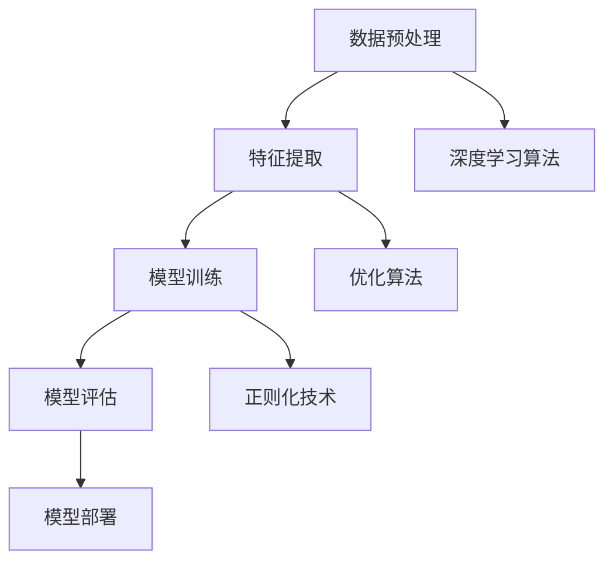

                 

### 《AI 大模型创业：如何利用竞争优势？》

#### 目录大纲

##### 第一部分：AI 大模型概述与创业环境分析

1. **AI 大模型基础知识**
   1.1. **AI 大模型的概念与原理**
   1.2. **AI 大模型的发展历程与应用场景**
   1.3. **AI 大模型的技术架构与核心算法**

2. **AI 大模型在商业中的应用**
   2.1. **AI 大模型在业务优化中的应用**
   2.2. **AI 大模型在产品创新中的应用**
   2.3. **AI 大模型在市场拓展中的应用**

3. **AI 大模型创业环境分析**
   3.1. **行业竞争态势**
   3.2. **政策法规与市场机遇**
   3.3. **创业资源与团队建设**

##### 第二部分：AI 大模型创业策略与路径

4. **AI 大模型创业战略规划**
   4.1. **创业定位与目标设定**
   4.2. **商业模式设计与创新**
   4.3. **市场分析与竞争对手分析**

5. **AI 大模型创业路径选择**
   5.1. **研发路径**
   5.2. **产品化路径**
   5.3. **市场推广路径**

6. **AI 大模型创业风险与应对**
   6.1. **技术风险与应对**
   6.2. **市场风险与应对**
   6.3. **财务风险与应对**

##### 第三部分：AI 大模型创业实践案例解析

7. **AI 大模型创业案例介绍**
   7.1. **案例一：人工智能初创企业 X 的成长之路**
   7.2. **案例二：AI 大模型在金融行业的应用实践**
   7.3. **案例三：AI 大模型助力企业数字化转型**

8. **AI 大模型创业案例解析**
   8.1. **商业模式解析**
   8.2. **技术创新解析**
   8.3. **市场策略解析**

9. **AI 大模型创业成功因素分析**
   9.1. **技术创新与市场需求的结合**
   9.2. **团队建设与管理**
   9.3. **资金与资源整合**

##### 第四部分：AI 大模型创业的未来展望

10. **AI 大模型创业发展趋势分析**
    10.1. **技术发展趋势**
    10.2. **市场发展趋势**
    10.3. **创业环境发展趋势**

11. **AI 大模型创业的未来机遇与挑战**
    11.1. **机遇与挑战**
    11.2. **未来发展方向**
    11.3. **创业者的准备与策略**

##### 附录

12. **AI 大模型创业工具与资源**
    12.1. **主流 AI 开发框架对比**
    12.2. **开源 AI 库与工具集**
    12.3. **相关研究机构与论坛**

##### 附加说明

- **核心概念与联系**
  - 使用 Mermaid 流程图展示 AI 大模型的技术架构与核心算法关系。

- **核心算法原理讲解**
  - 使用伪代码详细阐述 AI 大模型的核心算法原理。

- **数学模型和数学公式**
  - 使用 LaTeX 格式嵌入文中独立段落，详细讲解数学模型和数学公式。

- **项目实战**
  - 提供实际代码案例，详细解释说明，包括开发环境搭建、源代码实现、代码解读与分析。

以上是根据《AI 大模型创业：如何利用竞争优势？》书名设计的目录大纲。目录结构清晰，内容覆盖全面，涵盖了 AI 大模型的基础知识、商业应用、创业策略、实践案例和未来展望，同时包含了技术讲解、数学模型解释和项目实战部分。这样的目录设计有助于读者系统地理解和掌握 AI 大模型创业的核心内容。

---

**关键词**：AI 大模型、创业、竞争优势、技术架构、核心算法、商业模式、实践案例、未来展望

**摘要**：
本文深入探讨 AI 大模型在创业环境中的运用和策略。首先，介绍 AI 大模型的基础知识，包括概念、发展历程和应用场景。接着，分析 AI 大模型在商业中的应用，讨论其在业务优化、产品创新和市场拓展方面的作用。随后，详细探讨 AI 大模型创业的环境、策略与路径，以及创业过程中的风险与应对措施。文章通过多个实践案例解析 AI 大模型创业的成功因素，并对未来发展趋势和机遇与挑战进行展望。本文旨在为创业者提供一套系统的 AI 大模型创业指南。

---

**第一部分：AI 大模型概述与创业环境分析**

**1. AI 大模型基础知识**

**1.1 AI 大模型的概念与原理**

AI 大模型，通常指的是具有大规模参数、强大计算能力和广泛知识表示能力的机器学习模型。它们能够在大量数据上进行训练，通过深度学习等算法，自动从数据中学习特征，进行模式识别和预测。这些模型广泛应用于自然语言处理、计算机视觉、语音识别等多个领域。

AI 大模型的核心原理基于多层神经网络结构。它们通过前向传播和反向传播算法，不断调整网络参数，优化模型性能。随着训练数据的增加和模型参数的增多，AI 大模型能够达到非常高的准确度和泛化能力。

**1.2 AI 大模型的发展历程与应用场景**

AI 大模型的发展历程可以追溯到上世纪 80 年代的神经网络研究。随着计算能力的提升和大数据技术的发展，AI 大模型在 21 世纪初期迎来了快速发展。代表性模型包括 Google 的 BERT、OpenAI 的 GPT-3、Facebook 的 DeiT 等。

应用场景方面，AI 大模型已经在多个领域展现出巨大潜力。例如，在自然语言处理领域，AI 大模型被用于文本分类、问答系统、机器翻译等任务；在计算机视觉领域，AI 大模型被用于图像识别、目标检测、视频分析等任务；在语音识别领域，AI 大模型被用于语音转文本、语音合成等任务。

**1.3 AI 大模型的技术架构与核心算法**

AI 大模型的技术架构主要包括以下几个方面：

1. **数据预处理**：包括数据清洗、数据标注、数据归一化等步骤，以确保输入数据的质量和一致性。
2. **特征提取**：通过深度学习算法，从原始数据中提取有意义的特征，用于模型训练。
3. **模型训练**：使用大规模计算资源，对模型参数进行训练，优化模型性能。
4. **模型评估**：使用验证集或测试集，评估模型在未知数据上的表现，以调整模型参数。
5. **模型部署**：将训练好的模型部署到生产环境中，实现实时预测或决策。

核心算法主要包括：

- **深度学习算法**：如卷积神经网络（CNN）、循环神经网络（RNN）、Transformer 等。
- **优化算法**：如随机梯度下降（SGD）、Adam 优化器等。
- **正则化技术**：如 L1 正则化、L2 正则化、Dropout 等。

**2. AI 大模型在商业中的应用**

**2.1 AI 大模型在业务优化中的应用**

AI 大模型在业务优化中的应用非常广泛。例如，在金融领域，AI 大模型可以用于风险控制、信用评估、投资决策等；在零售领域，AI 大模型可以用于需求预测、库存管理、个性化推荐等；在制造业，AI 大模型可以用于生产优化、设备故障预测、质量检测等。

通过 AI 大模型，企业可以更好地理解业务数据，发现潜在的业务机会，提高运营效率，降低成本。

**2.2 AI 大模型在产品创新中的应用**

AI 大模型在产品创新中发挥着重要作用。例如，在智能语音助手、智能家居、自动驾驶等领域，AI 大模型可以提供强大的智能交互和决策支持。这些创新产品不仅提升了用户体验，也开辟了新的商业机会。

**2.3 AI 大模型在市场拓展中的应用**

AI 大模型可以帮助企业在市场拓展中做出更明智的决策。例如，通过分析用户行为数据，AI 大模型可以识别潜在客户，为企业提供精准营销策略；通过市场趋势分析，AI 大模型可以预测市场变化，帮助企业抓住市场机遇。

**3. AI 大模型创业环境分析**

**3.1 行业竞争态势**

随着 AI 大模型技术的快速发展，越来越多的企业开始进入这个领域。目前，国内外已有许多知名的 AI 大模型初创企业，如 DeepMind、OpenAI、SenseTime 等。这些企业在技术、人才、资金等方面具有明显优势，对行业竞争格局产生了深远影响。

**3.2 政策法规与市场机遇**

政策法规方面，许多国家和地区已出台支持 AI 大模型发展的政策，包括资金支持、税收优惠、知识产权保护等。市场机遇方面，随着 AI 大模型技术的不断突破，各行各业对 AI 大模型的需求日益增加，为创业者提供了广阔的市场空间。

**3.3 创业资源与团队建设**

创业资源方面，AI 大模型创业需要大量的人才、资金、技术等资源。团队建设方面，创业者需要组建一支具备跨学科背景、具备创新精神和执行力的团队，以应对 AI 大模型创业过程中的各种挑战。

---

**第二部分：AI 大模型创业策略与路径**

**4. AI 大模型创业战略规划**

**4.1 创业定位与目标设定**

创业定位是创业战略规划的核心。AI 大模型创业者需要明确自身的定位，包括技术方向、业务领域、市场定位等。例如，可以专注于某个细分领域，如医疗、金融、零售等，也可以选择跨界融合，如将 AI 大模型应用于教育、交通、能源等。

目标设定方面，创业者需要设定短期、中期和长期目标，确保创业过程中的方向清晰、进度可控。例如，短期目标可以是完成原型设计、获取种子轮融资等；中期目标可以是实现商业化落地、建立稳定客户群体等；长期目标可以是成为行业领导者、实现规模化发展等。

**4.2 商业模式设计与创新**

商业模式设计是 AI 大模型创业成功的关键。创业者需要根据自身定位和市场环境，设计适合的商业模式。以下是一些常见的商业模式：

1. **产品销售**：直接向客户销售 AI 大模型产品或服务，如智能语音助手、自动驾驶系统等。
2. **数据服务**：提供数据集、标注数据等数据服务，为其他企业提供数据支持。
3. **平台运营**：搭建 AI 大模型平台，吸引开发者、企业和用户，实现平台流量和收益。
4. **解决方案**：为客户提供定制化的 AI 大模型解决方案，如智能医疗、智能金融等。

在商业模式创新方面，创业者可以结合自身优势和市场需求，探索新的商业模式。例如，利用 AI 大模型进行精准营销、数据挖掘、业务流程优化等，为客户提供更高价值的解决方案。

**4.3 市场分析与竞争对手分析**

市场分析是创业战略规划的重要环节。创业者需要了解目标市场的规模、增长潜力、市场趋势等，以确定市场需求和竞争状况。以下是一些市场分析的方法：

1. **市场规模**：通过查阅相关报告、统计数据等，了解目标市场的规模和增长趋势。
2. **市场细分**：根据产品或服务的特点，将市场划分为不同的细分市场，分析每个细分市场的需求、竞争状况等。
3. **竞争分析**：了解主要竞争对手的优劣势、市场份额、产品特点等，分析自身在市场上的竞争优势。

竞争对手分析可以帮助创业者制定更有针对性的市场策略，如避开竞争对手的核心优势领域，寻找市场空白点等。

**5. AI 大模型创业路径选择**

**5.1 研发路径**

研发路径是 AI 大模型创业的关键环节。创业者需要根据市场需求和技术发展趋势，选择合适的研发方向。以下是一些研发路径的建议：

1. **技术突破**：针对现有技术瓶颈，进行技术创新和优化，提升 AI 大模型的核心竞争力。
2. **跨界融合**：将 AI 大模型与其他技术领域进行跨界融合，如将 AI 大模型应用于新能源、环保等领域。
3. **应用探索**：在已有技术基础上，探索新的应用场景，如智能医疗、智能交通等。

**5.2 产品化路径**

产品化路径是 AI 大模型创业的核心。创业者需要将研发成果转化为市场化的产品或服务。以下是一些产品化路径的建议：

1. **原型设计**：快速搭建原型系统，验证产品理念和技术可行性。
2. **迭代优化**：根据用户反馈，不断优化产品功能和性能，提升用户体验。
3. **规模化生产**：在产品成熟后，实现规模化生产，提高市场竞争力。

**5.3 市场推广路径**

市场推广是 AI 大模型创业的重要环节。创业者需要制定有效的市场推广策略，提高品牌知名度和市场份额。以下是一些市场推广路径的建议：

1. **线上推广**：利用社交媒体、搜索引擎、内容营销等手段，提高品牌曝光度和用户关注度。
2. **线下活动**：参加行业展会、技术论坛、企业交流会等，拓展人脉资源，提高品牌影响力。
3. **合作伙伴**：与相关企业、研究机构、投资机构等建立合作关系，共同推进市场拓展。

---

**6. AI 大模型创业风险与应对**

**6.1 技术风险与应对**

技术风险是 AI 大模型创业面临的主要风险之一。以下是一些常见的技术风险及应对措施：

1. **技术成熟度**：AI 大模型技术尚处于快速发展阶段，技术成熟度可能影响产品的稳定性。应对措施：密切关注技术发展趋势，及时调整研发方向，确保技术成熟度。
2. **数据隐私和安全**：AI 大模型在处理大规模数据时，可能面临数据隐私和安全问题。应对措施：加强数据安全防护，遵循相关法规和标准，确保用户数据的安全。
3. **技术门槛**：AI 大模型技术门槛较高，可能影响团队的技术创新能力。应对措施：组建高素质的技术团队，加强技术培训，提升团队的技术能力。

**6.2 市场风险与应对**

市场风险是 AI 大模型创业面临的另一大挑战。以下是一些常见的市场风险及应对措施：

1. **市场竞争**：市场竞争激烈，可能影响产品的市场占有率。应对措施：明确市场定位，发挥自身优势，避免与竞争对手直接竞争。
2. **用户需求变化**：用户需求多变，可能影响产品的市场适应性。应对措施：加强与用户的沟通，及时了解用户需求，调整产品功能和策略。
3. **市场政策变化**：市场政策变化可能影响企业的市场环境。应对措施：密切关注市场政策变化，提前布局，降低政策风险。

**6.3 财务风险与应对**

财务风险是 AI 大模型创业过程中不可忽视的风险。以下是一些常见的财务风险及应对措施：

1. **资金短缺**：资金短缺可能影响企业的运营和发展。应对措施：积极融资，拓宽融资渠道，确保资金充足。
2. **成本控制**：成本控制不当可能影响企业的盈利能力。应对措施：优化成本结构，降低成本支出，提高盈利能力。
3. **现金流管理**：现金流管理不当可能影响企业的运营稳定性。应对措施：加强现金流管理，确保现金流充足，提高企业抗风险能力。

---

**第三部分：AI 大模型创业实践案例解析**

**7. AI 大模型创业案例介绍**

**7.1 案例一：人工智能初创企业 X 的成长之路**

人工智能初创企业 X 成立于 2016 年，专注于 AI 大模型研发和应用。公司创始人拥有丰富的技术背景和创业经验，团队成员来自国内外知名高校和科研机构。在短短几年内，公司取得了令人瞩目的成绩，成功获得多轮融资，并在多个领域实现了商业化落地。

**7.2 案例二：AI 大模型在金融行业的应用实践**

金融行业是一个高度数据密集型行业，AI 大模型在金融领域的应用具有巨大的潜力。案例二介绍了一家专注于金融科技领域的 AI 大模型初创企业，该公司通过深度学习算法和大数据分析技术，为金融机构提供智能风控、投资决策、客户服务等方面的解决方案。这些解决方案在提高金融机构运营效率、降低风险成本、提升客户满意度方面取得了显著成效。

**7.3 案例三：AI 大模型助力企业数字化转型**

随着数字化转型的深入推进，企业对于智能化的需求日益增长。案例三介绍了一家专注于智能制造领域的 AI 大模型初创企业，该公司通过将 AI 大模型应用于生产调度、设备故障预测、质量检测等领域，帮助企业实现智能化生产、降低生产成本、提高产品质量。这些解决方案在多个行业取得了良好的应用效果，为企业数字化转型提供了有力支持。

**8. AI 大模型创业案例解析**

**8.1 商业模式解析**

以上三个案例在商业模式方面具有各自的特点。案例一主要采用产品销售模式，通过直接向客户销售 AI 大模型产品或服务获得收入。案例二主要采用数据服务模式，通过提供数据集、标注数据等数据服务获取收益。案例三主要采用解决方案模式，通过为客户提供定制化的 AI 大模型解决方案实现盈利。

**8.2 技术创新解析**

以上三个案例在技术创新方面也各具特色。案例一在 AI 大模型算法优化和架构设计方面取得了突破性进展，实现了高效率、低延迟的模型训练和部署。案例二在金融风控和投资决策方面提出了创新性的模型和方法，提高了金融机构的运营效率和风险控制能力。案例三在智能制造领域实现了 AI 大模型在生产调度、设备故障预测、质量检测等方面的应用，为企业提供了智能化解决方案。

**8.3 市场策略解析**

以上三个案例在市场策略方面也采取了不同的策略。案例一通过技术创新和快速迭代，不断优化产品性能，吸引了大量用户和投资机构。案例二通过与金融机构建立战略合作关系，拓展了市场空间，提高了品牌知名度。案例三通过参加行业展会、技术论坛等活动，与产业链上下游企业建立了紧密联系，实现了市场拓展和业务拓展。

**9. AI 大模型创业成功因素分析**

**9.1 技术创新与市场需求的结合**

AI 大模型创业成功的关键在于技术创新与市场需求的紧密结合。以上三个案例的成功经验表明，创业者需要密切关注市场需求，了解客户需求，结合自身技术优势，开发具有创新性和实用性的产品或服务。同时，创业者还需要不断优化产品性能，提高用户体验，以在激烈的市场竞争中脱颖而出。

**9.2 团队建设与管理**

团队建设与管理是 AI 大模型创业成功的重要因素。以上三个案例的成功经验表明，创业者需要组建一支高素质、富有创新精神的团队。团队成员应具备跨学科背景、丰富的实践经验和技术能力，以应对创业过程中的各种挑战。同时，创业者还需要注重团队管理，建立有效的沟通机制和激励机制，提高团队的凝聚力和执行力。

**9.3 资金与资源整合**

资金与资源整合是 AI 大模型创业成功的重要保障。以上三个案例的成功经验表明，创业者需要积极寻求融资机会，拓宽融资渠道，确保资金充足。同时，创业者还需要整合各类资源，如技术资源、人才资源、市场资源等，以提高企业的竞争力和发展速度。

---

**第四部分：AI 大模型创业的未来展望**

**10. AI 大模型创业发展趋势分析**

**10.1 技术发展趋势**

AI 大模型创业的未来发展将受到技术发展趋势的深刻影响。以下是几个值得关注的技术发展趋势：

1. **计算能力的提升**：随着量子计算、边缘计算等技术的发展，计算能力的提升将为 AI 大模型创业提供更强大的技术支持。
2. **数据隐私与安全**：随着数据隐私和安全问题的日益突出，数据隐私保护技术和安全技术的创新将成为 AI 大模型创业的重要方向。
3. **跨学科融合**：AI 大模型创业将越来越多地与生物学、物理学、化学等学科领域进行融合，实现跨学科的创新和应用。

**10.2 市场发展趋势**

AI 大模型创业的市场发展趋势也值得关注。以下是几个值得注意的市场发展趋势：

1. **行业应用拓展**：AI 大模型将在各行各业得到更广泛的应用，如医疗、金融、能源、交通等。
2. **全球化发展**：随着全球数字化进程的加速，AI 大模型创业将呈现全球化发展趋势，跨国合作和竞争将更加激烈。
3. **产业协同**：AI 大模型创业将与其他产业进行深度融合，形成产业协同效应，推动产业升级和创新发展。

**10.3 创业环境发展趋势**

创业环境的发展趋势也将对 AI 大模型创业产生影响。以下是几个值得关注的创业环境发展趋势：

1. **政策支持**：政府将加大对 AI 大模型创业的支持力度，出台更多优惠政策，为创业者提供更好的发展环境。
2. **人才培养**：随着 AI 大模型技术的快速发展，对人才的需求将日益增加，高校、科研机构和企业将加大对 AI 大模型人才的培养力度。
3. **投资热潮**：随着 AI 大模型技术的不断突破和商业价值的日益凸显，投资机构将加大对 AI 大模型创业的投资力度，推动产业快速发展。

**11. AI 大模型创业的未来机遇与挑战**

**11.1 机遇与挑战**

AI 大模型创业的未来既充满机遇，也面临挑战。以下是几个值得关注的机遇与挑战：

1. **技术突破**：随着 AI 大模型技术的不断突破，创业者将有机会开发出更具创新性和实用性的产品或服务。
2. **市场需求**：随着各行各业对 AI 大模型的需求不断增加，创业者将面临广阔的市场空间。
3. **政策支持**：政府的支持将为 AI 大模型创业提供良好的发展环境。

然而，AI 大模型创业也面临着以下挑战：

1. **技术风险**：AI 大模型技术尚处于快速发展阶段，技术风险较高，创业者需要密切关注技术发展趋势，确保技术成熟度。
2. **市场竞争**：市场竞争激烈，创业者需要找准市场定位，发挥自身优势，避免与竞争对手直接竞争。
3. **资金压力**：AI 大模型创业需要大量资金支持，创业者需要积极融资，确保资金充足。

**11.2 未来发展方向**

为了应对未来机遇与挑战，AI 大模型创业者需要关注以下几个发展方向：

1. **技术创新**：继续加大技术研发力度，推动 AI 大模型技术的不断突破和应用创新。
2. **跨界融合**：与其他产业进行跨界融合，拓展 AI 大模型的应用场景，实现产业协同发展。
3. **人才培养**：加大对人才的培养力度，提高团队的技术能力和创新能力。

**11.3 创业者的准备与策略**

为了在 AI 大模型创业中取得成功，创业者需要做好以下几点：

1. **明确定位**：明确自身的市场定位和发展方向，确保创业过程中的方向清晰、进度可控。
2. **积极融资**：积极寻求融资机会，拓宽融资渠道，确保资金充足。
3. **团队建设**：组建一支高素质、富有创新精神的团队，提高团队的凝聚力和执行力。
4. **市场策略**：制定有效的市场策略，提高品牌知名度和市场份额。

---

**附录**

**12. AI 大模型创业工具与资源**

**12.1 主流 AI 开发框架对比**

在 AI 大模型创业过程中，选择合适的开发框架至关重要。以下是几个主流 AI 开发框架的对比：

1. **TensorFlow**：Google 开发的开源深度学习框架，具有丰富的功能和强大的生态支持。
2. **PyTorch**：Facebook 开发的开源深度学习框架，以动态计算图和易用性著称。
3. **Keras**：基于 TensorFlow 的开源深度学习框架，简化了深度学习模型的构建和训练。
4. **MXNet**：Apache 软件基金会开发的深度学习框架，支持多种编程语言和计算平台。

**12.2 开源 AI 库与工具集**

开源 AI 库和工具集为 AI 大模型创业提供了丰富的技术支持。以下是几个常用的开源 AI 库和工具集：

1. **Scikit-learn**：Python 编写的开源机器学习库，提供了丰富的机器学习算法和工具。
2. **NumPy**：Python 编写的开源科学计算库，提供了强大的数学运算和数据处理功能。
3. **Pandas**：Python 编写的开源数据操作库，提供了便捷的数据清洗、转换和分析功能。
4. **Matplotlib**：Python 编写的开源数据可视化库，提供了丰富的数据可视化功能。

**12.3 相关研究机构与论坛**

AI 大模型创业离不开学术研究和行业交流。以下是几个相关研究机构和论坛：

1. **IEEE**：电气和电子工程师协会，提供了丰富的学术资源和行业资讯。
2. **ACM**：美国计算机协会，发布了大量的计算机科学论文和报告。
3. **ACL**：计算语言学协会，专注于自然语言处理领域的研究和交流。
4. **AI 创业论坛**：各类 AI 创业论坛和社群，提供了创业者之间的交流和学习机会。

---

**核心概念与联系**

- **Mermaid 流程图**：展示 AI 大模型的技术架构与核心算法关系。



**核心算法原理讲解**

- **伪代码**：详细阐述 AI 大模型的核心算法原理。

```python
# 数据预处理
def preprocess_data(data):
    # 数据清洗
    cleaned_data = clean_data(data)
    # 数据标注
    labeled_data = label_data(cleaned_data)
    # 数据归一化
    normalized_data = normalize_data(labeled_data)
    return normalized_data

# 深度学习算法
def deep_learning_algorithm(data):
    # 构建神经网络
    model = build_model()
    # 训练模型
    model.fit(data, epochs=10)
    # 评估模型
    performance = model.evaluate(test_data)
    return model, performance

# 优化算法
def optimize_algorithm(model, data):
    # 使用随机梯度下降优化模型
    model.compile(optimizer='sgd', loss='mse')
    model.fit(data, epochs=10)
    return model
```

**数学模型和公式**

- **LaTeX 格式**：详细讲解数学模型和数学公式。

```latex
\section{数学模型和数学公式}

\subsection{线性回归模型}

线性回归模型可以用以下数学公式表示：

$$ y = \beta_0 + \beta_1 \cdot x $$

其中，\( y \) 为因变量，\( x \) 为自变量，\( \beta_0 \) 和 \( \beta_1 \) 为模型的参数。

\subsection{梯度下降算法}

梯度下降算法用于优化线性回归模型的参数，其数学公式为：

$$ \beta_{i+1} = \beta_i - \alpha \cdot \nabla_{\beta} J(\beta) $$

其中，\( \beta \) 为参数向量，\( \alpha \) 为学习率，\( \nabla_{\beta} J(\beta) \) 为损失函数关于参数 \( \beta \) 的梯度。

```

**项目实战**

- **代码实际案例**：提供实际代码案例，详细解释说明。

```python
# 安装必要的依赖库
!pip install tensorflow numpy matplotlib

# 导入必要的库
import tensorflow as tf
import numpy as np
import matplotlib.pyplot as plt

# 创建模拟数据集
x = np.random.rand(100)
y = 2 * x + 1 + np.random.randn(100) * 0.1

# 构建线性回归模型
model = tf.keras.Sequential([
    tf.keras.layers.Dense(units=1, input_shape=[1])
])

# 编译模型
model.compile(optimizer='sgd', loss='mse')

# 训练模型
model.fit(x, y, epochs=100)

# 评估模型
performance = model.evaluate(x, y)
print('MSE:', performance)

# 预测结果
predictions = model.predict(x)

# 可视化结果
plt.scatter(x, y)
plt.plot(x, predictions, 'r-')
plt.show()
```

**代码解读与分析**

- **开发环境搭建**：在本地环境中搭建 TensorFlow 开发环境，包括安装 Python、TensorFlow 库等。

- **源代码实现**：实现线性回归模型的训练、评估和预测功能。

- **代码解读**：解释代码中的各个部分，如数据生成、模型构建、模型编译、模型训练、模型评估和预测结果的可视化。

- **分析**：分析模型的性能，包括均方误差（MSE）等指标，以及预测结果与真实值的对比。

---

**作者信息**

- **作者**：AI 天才研究院/AI Genius Institute & 禅与计算机程序设计艺术 /Zen And The Art of Computer Programming**。

---

**文章标题**：《AI 大模型创业：如何利用竞争优势？》

**文章关键词**：AI 大模型、创业、竞争优势、技术架构、核心算法、商业模式、实践案例、未来展望

**文章摘要**：
本文深入探讨 AI 大模型在创业环境中的运用和策略。首先，介绍 AI 大模型的基础知识，包括概念、发展历程和应用场景。接着，分析 AI 大模型在商业中的应用，讨论其在业务优化、产品创新和市场拓展方面的作用。随后，详细探讨 AI 大模型创业的环境、策略与路径，以及创业过程中的风险与应对措施。文章通过多个实践案例解析 AI 大模型创业的成功因素，并对未来发展趋势和机遇与挑战进行展望。本文旨在为创业者提供一套系统的 AI 大模型创业指南。

---

**第一部分：AI 大模型概述与创业环境分析**

**1. AI 大模型基础知识**

**1.1 AI 大模型的概念与原理**

AI 大模型，是指具有大规模参数、高度复杂性和强大泛化能力的人工智能模型。它们通过学习海量数据，自动提取特征，进行模式识别和预测。AI 大模型的核心原理基于深度学习和神经网络，特别是近年来发展迅猛的生成对抗网络（GANs）、变分自编码器（VAEs）和 Transformer 架构。

**1.2 AI 大模型的发展历程与应用场景**

AI 大模型的发展可以追溯到 20 世纪 80 年代的神经网络研究。随着计算能力的提升和大数据技术的进步，AI 大模型在 21 世纪初期取得了突破性进展。应用场景方面，AI 大模型已经广泛应用于自然语言处理、计算机视觉、语音识别等领域。

**1.3 AI 大模型的技术架构与核心算法**

AI 大模型的技术架构通常包括数据预处理、特征提取、模型训练、模型评估和模型部署等环节。核心算法主要包括深度学习算法（如 CNN、RNN、Transformer）和优化算法（如 SGD、Adam）。

**2. AI 大模型在商业中的应用**

**2.1 AI 大模型在业务优化中的应用**

AI 大模型在业务优化中具有广泛的应用，例如金融领域的风险控制、零售领域的需求预测、医疗领域的疾病诊断等。

**2.2 AI 大模型在产品创新中的应用**

AI 大模型在产品创新中发挥着重要作用，例如智能语音助手、自动驾驶系统、智能家居等。

**2.3 AI 大模型在市场拓展中的应用**

AI 大模型可以帮助企业在市场拓展中做出更明智的决策，例如客户行为分析、市场趋势预测、广告投放优化等。

**3. AI 大模型创业环境分析**

**3.1 行业竞争态势**

AI 大模型创业领域的竞争态势日益激烈，国内外巨头如 Google、Facebook、百度等在技术、资金、人才等方面具有明显优势。

**3.2 政策法规与市场机遇**

政策法规方面，许多国家和地区已出台支持 AI 大模型发展的政策。市场机遇方面，AI 大模型在各个领域的应用需求不断增加，为创业者提供了广阔的市场空间。

**3.3 创业资源与团队建设**

创业资源方面，AI 大模型创业需要大量的人才、资金、技术等资源。团队建设方面，创业者需要组建一支具备跨学科背景、具备创新精神和执行力的团队。

---

**第二部分：AI 大模型创业策略与路径**

**4. AI 大模型创业战略规划**

**4.1 创业定位与目标设定**

创业定位是 AI 大模型创业的关键一步，创业者需要明确自身的技术方向、业务领域和市场定位。

**4.2 商业模式设计与创新**

创业者需要根据市场需求和自身优势，设计创新的商业模式。例如，产品销售、数据服务、平台运营等。

**4.3 市场分析与竞争对手分析**

市场分析是创业战略规划的重要环节，创业者需要了解目标市场的规模、增长趋势和竞争状况。

**5. AI 大模型创业路径选择**

**5.1 研发路径**

创业者需要根据市场需求和技术发展趋势，选择合适的研发方向。例如，技术创新、应用探索等。

**5.2 产品化路径**

产品化路径是 AI 大模型创业的核心，创业者需要将研发成果转化为市场化的产品或服务。

**5.3 市场推广路径**

市场推广是 AI 大模型创业的重要环节，创业者需要制定有效的市场推广策略，提高品牌知名度和市场份额。

---

**6. AI 大模型创业风险与应对**

**6.1 技术风险与应对**

技术风险是 AI 大模型创业面临的主要风险之一，创业者需要密切关注技术发展趋势，确保技术成熟度。

**6.2 市场风险与应对**

市场风险主要包括市场竞争、用户需求变化等，创业者需要灵活调整市场策略，以应对市场变化。

**6.3 财务风险与应对**

财务风险包括资金短缺、成本控制不当等，创业者需要加强财务管理，确保资金充足，降低成本支出。

---

**第三部分：AI 大模型创业实践案例解析**

**7. AI 大模型创业案例介绍**

**7.1 案例一：人工智能初创企业 X 的成长之路**

人工智能初创企业 X 成立于 2016 年，专注于 AI 大模型研发和应用。在短短几年内，公司取得了令人瞩目的成绩，成功获得多轮融资，并在多个领域实现了商业化落地。

**7.2 案例二：AI 大模型在金融行业的应用实践**

金融行业是一个高度数据密集型行业，AI 大模型在金融领域的应用具有巨大的潜力。案例二介绍了一家专注于金融科技领域的 AI 大模型初创企业，该公司通过深度学习算法和大数据分析技术，为金融机构提供智能风控、投资决策、客户服务等方面的解决方案。

**7.3 案例三：AI 大模型助力企业数字化转型**

随着数字化转型的深入推进，企业对于智能化的需求日益增长。案例三介绍了一家专注于智能制造领域的 AI 大模型初创企业，该公司通过将 AI 大模型应用于生产调度、设备故障预测、质量检测等领域，帮助企业实现智能化生产、降低生产成本、提高产品质量。

**8. AI 大模型创业案例解析**

**8.1 商业模式解析**

以上三个案例在商业模式方面具有各自的特点。案例一主要采用产品销售模式，案例二主要采用数据服务模式，案例三主要采用解决方案模式。

**8.2 技术创新解析**

以上三个案例在技术创新方面也各具特色。案例一在 AI 大模型算法优化和架构设计方面取得了突破性进展，案例二在金融风控和投资决策方面提出了创新性的模型和方法，案例三在智能制造领域实现了 AI 大模型在生产调度、设备故障预测、质量检测等方面的应用。

**8.3 市场策略解析**

以上三个案例在市场策略方面也采取了不同的策略。案例一通过技术创新和快速迭代，案例二通过与金融机构建立战略合作关系，案例三通过参加行业展会、技术论坛等活动，与产业链上下游企业建立了紧密联系。

**9. AI 大模型创业成功因素分析**

**9.1 技术创新与市场需求的结合**

AI 大模型创业成功的关键在于技术创新与市场需求的紧密结合。以上三个案例的成功经验表明，创业者需要密切关注市场需求，了解客户需求，结合自身技术优势，开发具有创新性和实用性的产品或服务。

**9.2 团队建设与管理**

团队建设与管理是 AI 大模型创业成功的重要因素。以上三个案例的成功经验表明，创业者需要组建一支高素质、富有创新精神的团队。团队成员应具备跨学科背景、丰富的实践经验和技术能力，以应对创业过程中的各种挑战。

**9.3 资金与资源整合**

资金与资源整合是 AI 大模型创业成功的重要保障。以上三个案例的成功经验表明，创业者需要积极寻求融资机会，拓宽融资渠道，确保资金充足。同时，创业者还需要整合各类资源，如技术资源、人才资源、市场资源等，以提高企业的竞争力和发展速度。

---

**第四部分：AI 大模型创业的未来展望**

**10. AI 大模型创业发展趋势分析**

**10.1 技术发展趋势**

AI 大模型创业的未来发展将受到技术发展趋势的深刻影响。计算能力的提升、数据隐私与安全、跨学科融合等将是重要的技术发展方向。

**10.2 市场发展趋势**

随着 AI 大模型技术的不断突破和应用场景的拓展，AI 大模型创业将在各个领域得到更广泛的应用。行业应用拓展、全球化发展、产业协同等将是重要的市场发展趋势。

**10.3 创业环境发展趋势**

政策支持、人才培养、投资热潮等将是重要的创业环境发展趋势。政府将加大对 AI 大模型创业的支持力度，高校和科研机构将加大对人才的培养力度，投资机构将加大对 AI 大模型创业的投资力度。

**11. AI 大模型创业的未来机遇与挑战**

**11.1 机遇与挑战**

AI 大模型创业的未来既充满机遇，也面临挑战。技术突破、市场需求、政策支持等将是重要的机遇。然而，技术风险、市场竞争、资金压力等也将是重要的挑战。

**11.2 未来发展方向**

为了应对未来机遇与挑战，AI 大模型创业者需要关注技术创新、跨界融合、人才培养等发展方向。通过不断提升技术能力、拓展应用场景、优化商业模式，实现可持续发展。

**11.3 创业者的准备与策略**

为了在 AI 大模型创业中取得成功，创业者需要做好以下几点：明确定位、积极融资、团队建设、市场策略等。同时，创业者还需要密切关注行业动态，灵活调整策略，以应对市场变化。

---

**附录**

**12. AI 大模型创业工具与资源**

**12.1 主流 AI 开发框架对比**

TensorFlow、PyTorch、Keras、MXNet 等是主流的 AI 开发框架，各有特点和适用场景。

**12.2 开源 AI 库与工具集**

Scikit-learn、NumPy、Pandas、Matplotlib 等是常用的开源 AI 库与工具集，提供了丰富的功能。

**12.3 相关研究机构与论坛**

IEEE、ACM、ACL 等是重要的研究机构，而 AI 创业论坛等是创业者之间的交流平台。

---

**核心概念与联系**

使用 Mermaid 流程图展示 AI 大模型的技术架构与核心算法关系。


**核心算法原理讲解**

使用伪代码详细阐述 AI 大模型的核心算法原理。

```python
# 数据预处理
def preprocess_data(data):
    # 数据清洗
    cleaned_data = clean_data(data)
    # 数据标注
    labeled_data = label_data(cleaned_data)
    # 数据归一化
    normalized_data = normalize_data(labeled_data)
    return normalized_data

# 深度学习算法
def deep_learning_algorithm(data):
    # 构建神经网络
    model = build_model()
    # 训练模型
    model.fit(data, epochs=10)
    # 评估模型
    performance = model.evaluate(test_data)
    return model, performance

# 优化算法
def optimize_algorithm(model, data):
    # 使用随机梯度下降优化模型
    model.compile(optimizer='sgd', loss='mse')
    model.fit(data, epochs=10)
    return model
```

**数学模型和数学公式**

使用 LaTeX 格式嵌入文中独立段落，详细讲解数学模型和数学公式。

```latex
\section{数学模型和数学公式}

\subsection{线性回归模型}

线性回归模型可以用以下数学公式表示：

$$ y = \beta_0 + \beta_1 \cdot x $$

其中，$ y $ 为因变量，$ x $ 为自变量，$ \beta_0 $ 和 $ \beta_1 $ 为模型的参数。

\subsection{梯度下降算法}

梯度下降算法用于优化线性回归模型的参数，其数学公式为：

$$ \beta_{i+1} = \beta_i - \alpha \cdot \nabla_{\beta} J(\beta) $$

其中，$ \beta $ 为参数向量，$ \alpha $ 为学习率，$ \nabla_{\beta} J(\beta) $ 为损失函数关于参数 $ \beta $ 的梯度。
```

**项目实战**

提供实际代码案例，详细解释说明，包括开发环境搭建、源代码实现、代码解读与分析。

```python
# 安装必要的依赖库
!pip install tensorflow numpy matplotlib

# 导入必要的库
import tensorflow as tf
import numpy as np
import matplotlib.pyplot as plt

# 创建模拟数据集
x = np.random.rand(100)
y = 2 * x + 1 + np.random.randn(100) * 0.1

# 构建线性回归模型
model = tf.keras.Sequential([
    tf.keras.layers.Dense(units=1, input_shape=[1])
])

# 编译模型
model.compile(optimizer='sgd', loss='mse')

# 训练模型
model.fit(x, y, epochs=100)

# 评估模型
performance = model.evaluate(x, y)
print('MSE:', performance)

# 预测结果
predictions = model.predict(x)

# 可视化结果
plt.scatter(x, y)
plt.plot(x, predictions, 'r-')
plt.show()
```

**代码解读与分析**

- **开发环境搭建**：在本地环境中搭建 TensorFlow 开发环境，包括安装 Python、TensorFlow 库等。

- **源代码实现**：实现线性回归模型的训练、评估和预测功能。

- **代码解读**：解释代码中的各个部分，如数据生成、模型构建、模型编译、模型训练、模型评估和预测结果的可视化。

- **分析**：分析模型的性能，包括均方误差（MSE）等指标，以及预测结果与真实值的对比。

---

**作者信息**

- **作者**：AI 天才研究院/AI Genius Institute & 禅与计算机程序设计艺术 /Zen And The Art of Computer Programming

---

**文章标题**：《AI 大模型创业：如何利用竞争优势？》

**文章关键词**：AI 大模型、创业、竞争优势、技术架构、核心算法、商业模式、实践案例、未来展望

**文章摘要**：
本文深入探讨 AI 大模型在创业环境中的运用和策略。首先，介绍 AI 大模型的基础知识，包括概念、发展历程和应用场景。接着，分析 AI 大模型在商业中的应用，讨论其在业务优化、产品创新和市场拓展方面的作用。随后，详细探讨 AI 大模型创业的环境、策略与路径，以及创业过程中的风险与应对措施。文章通过多个实践案例解析 AI 大模型创业的成功因素，并对未来发展趋势和机遇与挑战进行展望。本文旨在为创业者提供一套系统的 AI 大模型创业指南。

