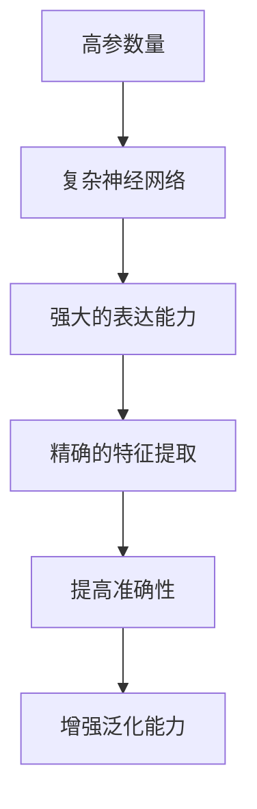
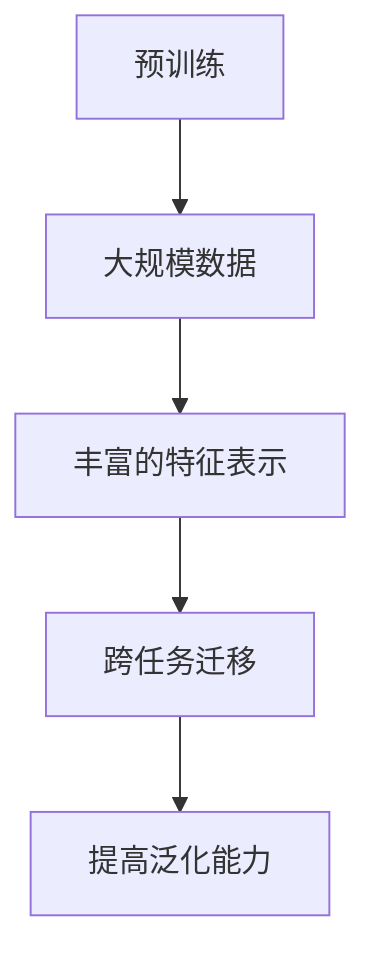
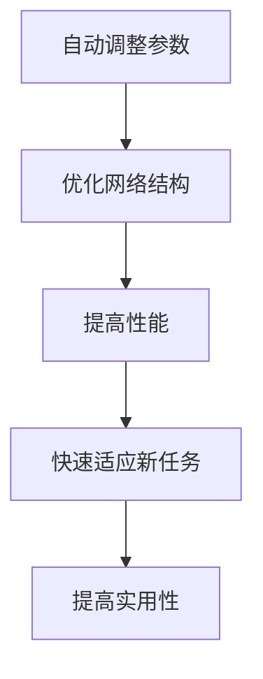
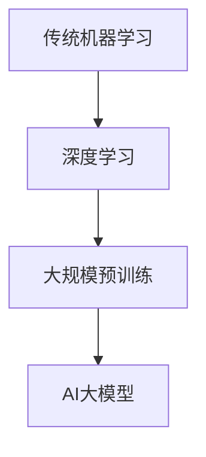
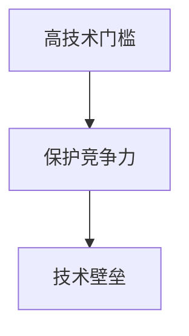
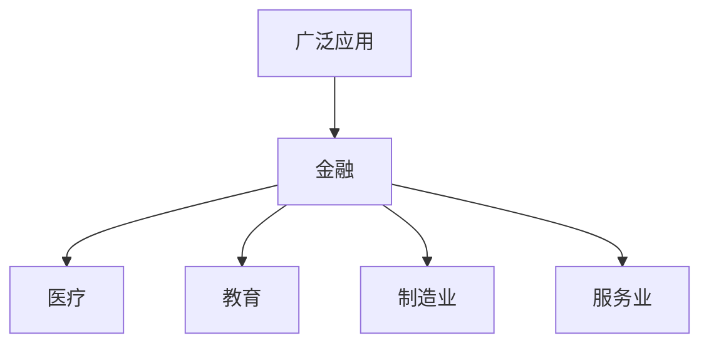
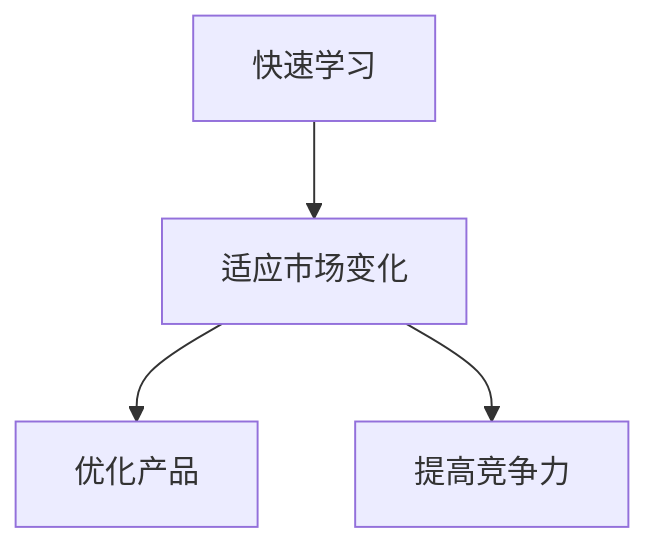

                 

### 第1章 AI大模型基本概念与创业机遇

## 1.1 AI大模型的基本概念

### 1.1.1 定义与特性

AI大模型是一种通过深度学习等技术训练的复杂神经网络模型，具备处理大规模数据、解决复杂问题的能力。其核心特性包括：

- **高参数量**：大模型通常拥有数亿到数十亿的参数，能够处理庞大的数据集。
- **强大的泛化能力**：通过大规模预训练，大模型在多个任务上表现优异，能够适应不同的应用场景。
- **自主学习能力**：大模型可以通过不断的学习和优化，自我提升性能。

### 1.1.2 技术演进

AI大模型的发展经历了几个阶段：

1. **传统机器学习**：基于统计方法，模型规模较小，难以处理复杂数据。
2. **深度学习**：引入神经网络结构，通过增加层数和神经元数量，提升了模型的表现力。
3. **大规模预训练**：通过在庞大的数据集上进行预训练，进一步提升了模型的性能。
4. **大模型时代**：如GPT、BERT等模型的出现，标志着AI大模型进入了成熟应用阶段。

### 1.1.3 创业中的优势

AI大模型在创业中具备以下优势：

- **技术门槛高**：大模型技术复杂，能够形成技术壁垒，保护创业公司的竞争力。
- **应用广泛**：大模型能够应用于多个领域，如金融、医疗、教育等，提供创新的解决方案。
- **快速迭代**：大模型具备快速学习和优化的能力，能够迅速适应市场变化。

## 1.2 创业环境分析

### 1.2.1 行业趋势

随着AI技术的快速发展，大模型在各个行业的应用逐渐广泛，创业环境呈现出以下趋势：

- **技术成熟度提高**：深度学习算法和硬件设备的发展，降低了大模型的应用门槛。
- **市场需求旺盛**：人工智能技术的广泛应用，带来了巨大的市场需求。
- **政策支持**：政府对科技创新的重视，为AI大模型创业提供了政策支持。

### 1.2.2 市场需求

AI大模型在多个行业具备广泛的应用前景：

- **金融**：风险控制、智能投顾、客户服务。
- **医疗**：疾病诊断、个性化治疗、医疗数据挖掘。
- **教育**：智能教学、学习分析、教育测评。

### 1.2.3 竞争态势

AI大模型创业领域竞争激烈，主要体现在：

- **技术竞争**：创业公司需要不断研发创新的技术，提升竞争力。
- **市场份额竞争**：争夺行业市场份额，形成竞争优势。
- **人才竞争**：吸引和留住优秀的研发人才，是创业成功的关键。

---

### 1.1.1 定义与特性

AI大模型，即人工智能大规模模型，是深度学习领域中的核心技术之一。这类模型基于复杂的神经网络结构，通过学习和模拟人脑神经元之间的交互方式，对海量数据进行处理和分析。定义上，AI大模型通常指具有数十亿参数规模的深度学习模型，它们能够通过大量的训练数据，自动提取特征，并在多种任务中表现出色。

#### 高参数量

AI大模型的高参数量是其核心特性之一。参数量决定了模型的表达能力，参数越多，模型能够学习的特征就越丰富。以GPT-3为例，该模型拥有超过1750亿个参数，这使得它能够处理和生成复杂的语言信息。参数量的增加，使得模型在处理大型数据集时，能够捕捉到更细微的特征差异，从而提高模型的准确性和泛化能力。



#### 强大的泛化能力

泛化能力是指模型在未知数据上的表现能力。AI大模型通过大规模预训练，能够在不同的任务和数据集上表现出色，这得益于它们强大的泛化能力。例如，BERT模型在多个NLP任务中取得了优异的成绩，这主要归功于其在大规模语料库上的预训练。



#### 自主学习能力

自主学习能力是指模型通过不断的学习和优化，自我提升性能的能力。AI大模型在训练过程中，能够自动调整参数，优化网络结构，从而提高模型的表现。这种能力使得AI大模型在处理新任务或面对新数据时，能够快速适应和优化，提高模型的实用性和灵活性。



## 1.1.2 技术演进

AI大模型技术的发展经历了多个阶段，从传统机器学习到深度学习，再到大规模预训练，每一个阶段都标志着技术的进步和应用的拓展。

#### 传统机器学习

传统机器学习基于统计方法，如线性回归、支持向量机等。这类方法虽然能够解决一些简单的预测问题，但面对复杂的数据时，表现力有限。模型规模较小，难以处理复杂数据。

#### 深度学习

深度学习引入了神经网络结构，通过增加层数和神经元数量，提升了模型的表现力。卷积神经网络（CNN）和循环神经网络（RNN）的出现，使得图像识别和序列数据处理成为可能。这一阶段标志着AI技术的重大突破。

#### 大规模预训练

大规模预训练是AI大模型发展的重要阶段。通过在庞大的数据集上进行预训练，模型能够自动提取丰富的特征表示，从而在多种任务中表现出色。预训练模型如BERT、GPT等，展示了大规模预训练在AI领域的巨大潜力。



## 1.1.3 创业中的优势

AI大模型在创业中具备显著的优势，成为创业者抓住机遇的重要工具。

#### 技术门槛高

AI大模型的技术门槛较高，需要深厚的专业知识和技术积累。这形成了一种天然的技术壁垒，保护了创业公司的竞争力，使得竞争对手难以迅速跟进。



#### 应用广泛

AI大模型在多个领域具有广泛的应用前景。无论是金融、医疗、教育，还是制造业、服务业，AI大模型都能提供创新的解决方案。这种广泛的应用性，使得创业公司能够迅速找到市场切入点，拓展业务范围。



#### 快速迭代

AI大模型具备快速学习和优化的能力，能够迅速适应市场变化。这种快速迭代的能力，使得创业公司能够及时调整产品方向，满足市场需求，提高市场竞争力。



### 1.2 创业环境分析

#### 1.2.1 行业趋势

随着AI技术的快速发展，AI大模型在各个行业的应用逐渐广泛，创业环境呈现出以下趋势：

1. **技术成熟度提高**

深度学习算法和硬件设备的发展，降低了AI大模型的应用门槛。GPU等高性能计算设备的普及，使得大规模模型训练成为可能。这使得创业者能够更轻松地开展AI大模型的研究和应用。

2. **市场需求旺盛**

人工智能技术的广泛应用，带来了巨大的市场需求。从智能客服、智能安防到智能医疗、智能金融，AI大模型在各个领域都有广泛的应用场景，为创业者提供了丰富的商机。

3. **政策支持**

政府对科技创新的重视，为AI大模型创业提供了政策支持。许多国家推出了相关政策，鼓励企业进行科技创新，为创业者提供了资金、人才等方面的支持。

#### 1.2.2 市场需求

AI大模型在多个行业具备广泛的应用前景：

1. **金融行业**

AI大模型在金融行业具有广泛的应用，如风险控制、智能投顾、客户服务。通过AI大模型，银行和金融机构能够提高服务质量，降低运营成本。

2. **医疗行业**

AI大模型在医疗行业的应用包括疾病诊断、个性化治疗、医疗数据挖掘。通过AI大模型，医生能够更加精准地诊断疾病，提高治疗效果。

3. **教育行业**

AI大模型在教育行业的应用包括智能教学、学习分析、教育测评。通过AI大模型，教师能够更好地了解学生的学习情况，提供个性化的教学方案。

4. **制造业**

AI大模型在制造业的应用包括生产调度、设备维护、质量管理。通过AI大模型，企业能够提高生产效率，降低运营成本。

5. **服务业**

AI大模型在服务业的应用包括智能客服、智能推荐、智能交通。通过AI大模型，企业能够提高服务质量，提升用户体验。

#### 1.2.3 竞争态势

AI大模型创业领域竞争激烈，主要体现在以下几个方面：

1. **技术竞争**

创业公司需要不断研发创新的技术，提升竞争力。技术上的突破，能够为公司带来竞争优势。

2. **市场份额竞争**

创业公司需要争夺行业市场份额，形成竞争优势。通过市场推广和战略合作，公司能够快速占领市场。

3. **人才竞争**

吸引和留住优秀的研发人才，是创业成功的关键。人才是AI大模型研发的核心资源，创业者需要采取措施，吸引和留住顶尖人才。

### 1.2.1 行业趋势

随着AI技术的快速发展，AI大模型在各个行业的应用逐渐广泛，创业环境呈现出以下趋势：

1. **技术成熟度提高**

深度学习算法和硬件设备的发展，降低了AI大模型的应用门槛。GPU等高性能计算设备的普及，使得大规模模型训练成为可能。这使得创业者能够更轻松地开展AI大模型的研究和应用。

2. **市场需求旺盛**

人工智能技术的广泛应用，带来了巨大的市场需求。从智能客服、智能安防到智能医疗、智能金融，AI大模型在各个领域都有广泛的应用场景，为创业者提供了丰富的商机。

3. **政策支持**

政府对科技创新的重视，为AI大模型创业提供了政策支持。许多国家推出了相关政策，鼓励企业进行科技创新，为创业者提供了资金、人才等方面的支持。

### 1.2.2 市场需求

AI大模型在多个行业具备广泛的应用前景：

1. **金融行业**

AI大模型在金融行业具有广泛的应用，如风险控制、智能投顾、客户服务。通过AI大模型，银行和金融机构能够提高服务质量，降低运营成本。

2. **医疗行业**

AI大模型在医疗行业的应用包括疾病诊断、个性化治疗、医疗数据挖掘。通过AI大模型，医生能够更加精准地诊断疾病，提高治疗效果。

3. **教育行业**

AI大模型在教育行业的应用包括智能教学、学习分析、教育测评。通过AI大模型，教师能够更好地了解学生的学习情况，提供个性化的教学方案。

4. **制造业**

AI大模型在制造业的应用包括生产调度、设备维护、质量管理。通过AI大模型，企业能够提高生产效率，降低运营成本。

5. **服务业**

AI大模型在服务业的应用包括智能客服、智能推荐、智能交通。通过AI大模型，企业能够提高服务质量，提升用户体验。

### 1.2.3 竞争态势

AI大模型创业领域竞争激烈，主要体现在以下几个方面：

1. **技术竞争**

创业公司需要不断研发创新的技术，提升竞争力。技术上的突破，能够为公司带来竞争优势。

2. **市场份额竞争**

创业公司需要争夺行业市场份额，形成竞争优势。通过市场推广和战略合作，公司能够快速占领市场。

3. **人才竞争**

吸引和留住优秀的研发人才，是创业成功的关键。人才是AI大模型研发的核心资源，创业者需要采取措施，吸引和留住顶尖人才。

### 2.1 创业模式探讨

#### 2.1.1 独立研发

独立研发模式具有以下特点：

- **技术自主性**：创业公司独立进行技术研发，确保技术可控性。
- **创新性**：专注于技术突破，推动行业技术进步。
- **资源依赖性**：对资金、人才等资源的需求较高。

#### 2.1.2 合作研发

合作研发模式的优势：

- **资源共享**：合作各方共同投入资源，降低成本。
- **技术互补**：各方的技术优势互补，提高研发效率。
- **市场扩展**：合作拓展市场渠道，提升市场竞争力。

#### 2.1.3 联合创新

联合创新模式的特点：

- **协同研发**：各方协同合作，共同推动技术突破。
- **品牌协同**：利用各方品牌影响力，提升市场认知度。
- **风险共担**：共同承担研发和市场风险。

### 2.2 管理策略

#### 2.2.1 团队管理

团队管理策略：

- **人才引进**：选拔具有技术背景和创业精神的优秀人才。
- **团队协作**：建立高效的协作机制，提高团队执行力。
- **团队激励**：实施绩效考核和奖励机制，激发团队活力。

#### 2.2.2 项目管理

项目管理策略：

- **项目规划**：明确项目目标、时间表和资源分配。
- **项目执行**：监控项目进度，确保项目按计划进行。
- **项目评估**：评估项目成果，为后续项目提供参考。

#### 2.2.3 风险管理

风险管理策略：

- **风险识别**：分析可能出现的风险，制定应对策略。
- **风险预防**：提前采取措施，降低风险发生的可能性。
- **风险应对**：制定应对方案，减轻风险带来的损失。

---

### 2.1 创业模式探讨

创业模式的选择对于AI大模型创业公司至关重要，它决定了公司的研发路径、市场定位和资源利用效率。以下是几种常见的创业模式及其特点：

#### 2.1.1 独立研发

**独立研发模式**具有以下特点：

- **技术自主性**：创业公司独立进行技术研发，确保技术可控性。这种模式能够确保公司技术路线的独立性，避免技术受制于外部因素。
- **创新性**：专注于技术突破，推动行业技术进步。独立研发模式鼓励创新，使公司能够迅速响应市场变化，开发出具有竞争力的产品。
- **资源依赖性**：对资金、人才等资源的需求较高。由于需要独立完成从研发到市场推广的全过程，公司需要大量投入资金和人力资源，这对初创公司来说是一个挑战。

#### 2.1.2 合作研发

**合作研发模式**的优势：

- **资源共享**：合作各方共同投入资源，降低成本。合作研发能够有效整合各方资源，如资金、技术和人才，从而降低单个公司的负担。
- **技术互补**：各方的技术优势互补，提高研发效率。合作研发模式使公司能够借助合作伙伴的技术优势，快速提升自身的技术水平。
- **市场扩展**：合作拓展市场渠道，提升市场竞争力。通过合作，公司能够迅速扩大市场份额，提高品牌知名度。

#### 2.1.3 联合创新

**联合创新模式**的特点：

- **协同研发**：各方协同合作，共同推动技术突破。联合创新模式强调协同合作，各方共同参与研发，共同承担风险和收益。
- **品牌协同**：利用各方品牌影响力，提升市场认知度。通过品牌协同，公司能够借助合作伙伴的品牌影响力，提高市场认可度。
- **风险共担**：共同承担研发和市场风险。联合创新模式使各方能够共同分担研发和市场风险，降低单个公司的风险压力。

### 2.2 管理策略

AI大模型创业公司的成功不仅依赖于技术创新，还需要有效的管理策略。以下是团队管理、项目管理和风险管理的策略：

#### 2.2.1 团队管理

**团队管理策略**：

- **人才引进**：选拔具有技术背景和创业精神的优秀人才。创业公司需要招募具备专业知识和创新精神的人才，以推动技术进步和业务发展。
- **团队协作**：建立高效的协作机制，提高团队执行力。通过明确分工、建立沟通渠道和协作工具，确保团队高效合作。
- **团队激励**：实施绩效考核和奖励机制，激发团队活力。通过设定合理的绩效目标和奖励措施，激励团队成员发挥潜力，提高工作效率。

#### 2.2.2 项目管理

**项目管理策略**：

- **项目规划**：明确项目目标、时间表和资源分配。制定详细的项目计划，明确各阶段的目标和任务，合理分配资源，确保项目顺利进行。
- **项目执行**：监控项目进度，确保项目按计划进行。建立项目监控机制，定期检查项目进度，及时解决遇到的问题，确保项目按计划推进。
- **项目评估**：评估项目成果，为后续项目提供参考。项目结束后，进行成果评估，总结经验教训，为后续项目提供改进方向。

#### 2.2.3 风险管理

**风险管理策略**：

- **风险识别**：分析可能出现的风险，制定应对策略。通过全面的风险评估，识别潜在的风险因素，并制定相应的应对措施。
- **风险预防**：提前采取措施，降低风险发生的可能性。通过风险管理措施，如风险预防措施、安全制度和应急预案，降低风险发生的概率。
- **风险应对**：制定应对方案，减轻风险带来的损失。在风险发生时，及时启动应对方案，采取措施减轻风险带来的影响，确保业务连续性。

### 2.3 创业模式探讨

在AI大模型创业中，选择合适的创业模式是至关重要的一步。以下是几种常见的创业模式及其特点：

#### 2.3.1 独立研发

**独立研发模式**是创业公司最常见的模式之一。其主要特点如下：

- **技术自主性**：公司独立进行技术研发，确保技术可控性。这种模式能够确保公司技术路线的独立性，避免技术受制于外部因素。
- **创新性**：公司专注于技术突破，推动行业技术进步。独立研发模式鼓励创新，使公司能够迅速响应市场变化，开发出具有竞争力的产品。
- **资源依赖性**：公司需要大量投入资金、人才等资源。由于需要独立完成从研发到市场推广的全过程，公司需要大量投入资金和人力资源，这对初创公司来说是一个挑战。

#### 2.3.2 合作研发

**合作研发模式**是指公司与外部合作伙伴共同进行技术研发。其优势如下：

- **资源共享**：公司可以与合作伙伴共同投入资源，如资金、技术和人才，从而降低单个公司的负担。
- **技术互补**：公司可以借助合作伙伴的技术优势，快速提升自身的技术水平。
- **市场扩展**：公司可以借助合作伙伴的市场渠道和品牌影响力，提高市场份额和知名度。

#### 2.3.3 联合创新

**联合创新模式**是指公司与多个合作伙伴协同合作，共同进行技术研发和市场推广。其特点如下：

- **协同研发**：公司、合作伙伴和学术机构共同参与研发，发挥各自优势，共同推动技术突破。
- **品牌协同**：公司可以借助合作伙伴的品牌影响力，提高市场认知度和用户信任度。
- **风险共担**：公司与合作伙伴共同承担研发和市场风险，降低单个公司的风险压力。

### 2.4 管理策略

AI大模型创业公司需要制定一系列管理策略，以确保公司能够高效运作，并在激烈的市场竞争中脱颖而出。以下是团队管理、项目管理和风险管理的策略：

#### 2.4.1 团队管理

**团队管理策略**：

- **人才引进**：公司需要选拔具有技术背景和创业精神的优秀人才。通过招聘和内部培养，组建一支具有专业知识和创新能力的团队。
- **团队协作**：建立高效的协作机制，提高团队执行力。通过明确分工、建立沟通渠道和协作工具，确保团队高效合作。
- **团队激励**：实施绩效考核和奖励机制，激发团队活力。通过设定合理的绩效目标和奖励措施，激励团队成员发挥潜力，提高工作效率。

#### 2.4.2 项目管理

**项目管理策略**：

- **项目规划**：公司需要明确项目目标、时间表和资源分配。通过制定详细的项目计划，确保项目目标明确，任务分配合理，资源充分利用。
- **项目执行**：公司需要监控项目进度，确保项目按计划进行。通过定期检查项目进度、解决遇到的问题，确保项目顺利推进。
- **项目评估**：项目结束后，公司需要对项目成果进行评估。通过总结项目经验，找出成功和不足之处，为后续项目提供改进方向。

#### 2.4.3 风险管理

**风险管理策略**：

- **风险识别**：公司需要分析可能出现的风险，制定应对策略。通过全面的风险评估，识别潜在的风险因素，并制定相应的应对措施。
- **风险预防**：公司需要提前采取措施，降低风险发生的可能性。通过建立安全制度、制定应急预案等措施，降低风险发生的概率。
- **风险应对**：公司需要制定应对方案，减轻风险带来的损失。在风险发生时，及时启动应对方案，采取措施减轻风险带来的影响，确保业务连续性。

### 2.5 创业模式探讨

在AI大模型创业中，选择合适的创业模式是至关重要的一步。以下是几种常见的创业模式及其特点：

#### 2.5.1 独立研发

**独立研发模式**是指创业公司自行进行技术研发，具有以下特点：

- **技术自主性**：创业公司独立进行技术研发，确保技术可控性。这种模式能够确保公司技术路线的独立性，避免技术受制于外部因素。
- **创新性**：创业公司专注于技术突破，推动行业技术进步。独立研发模式鼓励创新，使公司能够迅速响应市场变化，开发出具有竞争力的产品。
- **资源依赖性**：创业公司需要大量投入资金、人才等资源。由于需要独立完成从研发到市场推广的全过程，公司需要大量投入资金和人力资源，这对初创公司来说是一个挑战。

#### 2.5.2 合作研发

**合作研发模式**是指创业公司与外部合作伙伴共同进行技术研发，具有以下优势：

- **资源共享**：创业公司可以与合作伙伴共同投入资源，如资金、技术和人才，从而降低单个公司的负担。
- **技术互补**：创业公司可以借助合作伙伴的技术优势，快速提升自身的技术水平。
- **市场扩展**：创业公司可以借助合作伙伴的市场渠道和品牌影响力，提高市场份额和知名度。

#### 2.5.3 联合创新

**联合创新模式**是指创业公司与多个合作伙伴协同合作，共同进行技术研发和市场推广，具有以下特点：

- **协同研发**：创业公司、合作伙伴和学术机构共同参与研发，发挥各自优势，共同推动技术突破。
- **品牌协同**：创业公司可以借助合作伙伴的品牌影响力，提高市场认知度和用户信任度。
- **风险共担**：创业公司可以与合作伙伴共同承担研发和市场风险，降低单个公司的风险压力。

---

### 2.5 创业模式探讨

在AI大模型创业中，选择合适的创业模式是至关重要的一步。以下是几种常见的创业模式及其特点：

#### 2.5.1 独立研发

**独立研发模式**是指创业公司自行进行技术研发，具有以下特点：

- **技术自主性**：创业公司独立进行技术研发，确保技术可控性。这种模式能够确保公司技术路线的独立性，避免技术受制于外部因素。
- **创新性**：创业公司专注于技术突破，推动行业技术进步。独立研发模式鼓励创新，使公司能够迅速响应市场变化，开发出具有竞争力的产品。
- **资源依赖性**：创业公司需要大量投入资金、人才等资源。由于需要独立完成从研发到市场推广的全过程，公司需要大量投入资金和人力资源，这对初创公司来说是一个挑战。

#### 2.5.2 合作研发

**合作研发模式**是指创业公司与外部合作伙伴共同进行技术研发，具有以下优势：

- **资源共享**：创业公司可以与合作伙伴共同投入资源，如资金、技术和人才，从而降低单个公司的负担。
- **技术互补**：创业公司可以借助合作伙伴的技术优势，快速提升自身的技术水平。
- **市场扩展**：创业公司可以借助合作伙伴的市场渠道和品牌影响力，提高市场份额和知名度。

#### 2.5.3 联合创新

**联合创新模式**是指创业公司与多个合作伙伴协同合作，共同进行技术研发和市场推广，具有以下特点：

- **协同研发**：创业公司、合作伙伴和学术机构共同参与研发，发挥各自优势，共同推动技术突破。
- **品牌协同**：创业公司可以借助合作伙伴的品牌影响力，提高市场认知度和用户信任度。
- **风险共担**：创业公司可以与合作伙伴共同承担研发和市场风险，降低单个公司的风险压力。

### 2.6 管理策略

#### 2.6.1 团队管理

**团队管理策略**：

- **人才引进**：公司需要选拔具有技术背景和创业精神的优秀人才。通过招聘和内部培养，组建一支具有专业知识和创新能力的团队。
- **团队协作**：建立高效的协作机制，提高团队执行力。通过明确分工、建立沟通渠道和协作工具，确保团队高效合作。
- **团队激励**：实施绩效考核和奖励机制，激发团队活力。通过设定合理的绩效目标和奖励措施，激励团队成员发挥潜力，提高工作效率。

#### 2.6.2 项目管理

**项目管理策略**：

- **项目规划**：明确项目目标、时间表和资源分配。制定详细的项目计划，明确各阶段的目标和任务，合理分配资源，确保项目顺利进行。
- **项目执行**：监控项目进度，确保项目按计划进行。通过定期检查项目进度、解决遇到的问题，确保项目顺利推进。
- **项目评估**：项目结束后，对项目成果进行评估。通过总结项目经验，找出成功和不足之处，为后续项目提供改进方向。

#### 2.6.3 风险管理

**风险管理策略**：

- **风险识别**：分析可能出现的风险，制定应对策略。通过全面的风险评估，识别潜在的风险因素，并制定相应的应对措施。
- **风险预防**：提前采取措施，降低风险发生的可能性。通过建立安全制度、制定应急预案等措施，降低风险发生的概率。
- **风险应对**：制定应对方案，减轻风险带来的损失。在风险发生时，及时启动应对方案，采取措施减轻风险带来的影响，确保业务连续性。

### 2.7 管理策略

#### 2.7.1 团队管理

**团队管理策略**：

- **人才引进**：公司需要选拔具有技术背景和创业精神的优秀人才。通过招聘和内部培养，组建一支具有专业知识和创新能力的团队。
- **团队协作**：建立高效的协作机制，提高团队执行力。通过明确分工、建立沟通渠道和协作工具，确保团队高效合作。
- **团队激励**：实施绩效考核和奖励机制，激发团队活力。通过设定合理的绩效目标和奖励措施，激励团队成员发挥潜力，提高工作效率。

#### 2.7.2 项目管理

**项目管理策略**：

- **项目规划**：明确项目目标、时间表和资源分配。制定详细的项目计划，明确各阶段的目标和任务，合理分配资源，确保项目顺利进行。
- **项目执行**：监控项目进度，确保项目按计划进行。通过定期检查项目进度、解决遇到的问题，确保项目顺利推进。
- **项目评估**：项目结束后，对项目成果进行评估。通过总结项目经验，找出成功和不足之处，为后续项目提供改进方向。

#### 2.7.3 风险管理

**风险管理策略**：

- **风险识别**：分析可能出现的风险，制定应对策略。通过全面的风险评估，识别潜在的风险因素，并制定相应的应对措施。
- **风险预防**：提前采取措施，降低风险发生的可能性。通过建立安全制度、制定应急预案等措施，降低风险发生的概率。
- **风险应对**：制定应对方案，减轻风险带来的损失。在风险发生时，及时启动应对方案，采取措施减轻风险带来的影响，确保业务连续性。

---

### 2.7 管理策略

#### 2.7.1 团队管理

**团队管理策略**：

- **人才引进**：公司需要选拔具有技术背景和创业精神的优秀人才。通过招聘和内部培养，组建一支具有专业知识和创新能力的团队。
  - **招聘渠道**：利用招聘网站、社交媒体、猎头公司等多种渠道，寻找合适的候选人。
  - **面试选拔**：设立多轮面试，包括技术面试、行为面试和团队面试，确保选拔到合适的人才。

- **团队协作**：建立高效的协作机制，提高团队执行力。通过明确分工、建立沟通渠道和协作工具，确保团队高效合作。
  - **明确分工**：根据团队成员的特长和优势，合理分配工作任务，确保每个人都能发挥自己的专长。
  - **沟通渠道**：建立定期的团队会议、邮件沟通、即时通讯工具等，确保团队成员之间的信息畅通。

- **团队激励**：实施绩效考核和奖励机制，激发团队活力。通过设定合理的绩效目标和奖励措施，激励团队成员发挥潜力，提高工作效率。
  - **绩效考核**：根据工作业绩、项目贡献、团队协作等多方面进行综合评价。
  - **奖励措施**：设立奖金、股权激励、晋升机会等，激励团队成员的积极性和创造力。

#### 2.7.2 项目管理

**项目管理策略**：

- **项目规划**：明确项目目标、时间表和资源分配。制定详细的项目计划，明确各阶段的目标和任务，合理分配资源，确保项目顺利进行。
  - **项目目标**：确保项目目标明确、具体、可衡量、可达成、有时限。
  - **时间表**：制定合理的时间表，确保项目按时完成。
  - **资源分配**：合理分配人力资源、资金、技术等资源，确保项目有足够的资源支持。

- **项目执行**：监控项目进度，确保项目按计划进行。通过定期检查项目进度、解决遇到的问题，确保项目顺利推进。
  - **进度监控**：建立进度报告制度，定期汇报项目进度，及时发现问题。
  - **问题解决**：建立问题解决机制，及时解决项目执行过程中遇到的问题。

- **项目评估**：项目结束后，对项目成果进行评估。通过总结项目经验，找出成功和不足之处，为后续项目提供改进方向。
  - **成果评估**：对项目成果进行客观评估，确保项目目标实现。
  - **经验总结**：总结项目过程中的经验教训，为后续项目提供参考。
  - **改进措施**：根据评估结果，提出改进措施，提升项目管理水平。

#### 2.7.3 风险管理

**风险管理策略**：

- **风险识别**：分析可能出现的风险，制定应对策略。通过全面的风险评估，识别潜在的风险因素，并制定相应的应对措施。
  - **风险评估**：对风险因素进行评估，确定风险优先级。
  - **风险预警**：建立风险预警机制，及时发现和应对潜在风险。

- **风险预防**：提前采取措施，降低风险发生的可能性。通过建立安全制度、制定应急预案等措施，降低风险发生的概率。
  - **安全制度**：制定安全规章制度，确保公司安全运营。
  - **应急预案**：制定应急预案，确保在风险发生时能够迅速应对。

- **风险应对**：制定应对方案，减轻风险带来的损失。在风险发生时，及时启动应对方案，采取措施减轻风险带来的影响，确保业务连续性。
  - **应对方案**：针对不同类型的风险，制定相应的应对方案。
  - **损失减轻**：在风险发生时，采取有效措施，尽量减轻损失。

---

### 2.7 管理策略

#### 2.7.1 团队管理

**团队管理策略**：

- **人才引进**：公司需要选拔具有技术背景和创业精神的优秀人才。通过招聘和内部培养，组建一支具有专业知识和创新能力的团队。
  - **招聘渠道**：利用招聘网站、社交媒体、猎头公司等多种渠道，寻找合适的候选人。
  - **面试选拔**：设立多轮面试，包括技术面试、行为面试和团队面试，确保选拔到合适的人才。

- **团队协作**：建立高效的协作机制，提高团队执行力。通过明确分工、建立沟通渠道和协作工具，确保团队高效合作。
  - **明确分工**：根据团队成员的特长和优势，合理分配工作任务，确保每个人都能发挥自己的专长。
  - **沟通渠道**：建立定期的团队会议、邮件沟通、即时通讯工具等，确保团队成员之间的信息畅通。

- **团队激励**：实施绩效考核和奖励机制，激发团队活力。通过设定合理的绩效目标和奖励措施，激励团队成员发挥潜力，提高工作效率。
  - **绩效考核**：根据工作业绩、项目贡献、团队协作等多方面进行综合评价。
  - **奖励措施**：设立奖金、股权激励、晋升机会等，激励团队成员的积极性和创造力。

#### 2.7.2 项目管理

**项目管理策略**：

- **项目规划**：明确项目目标、时间表和资源分配。制定详细的项目计划，明确各阶段的目标和任务，合理分配资源，确保项目顺利进行。
  - **项目目标**：确保项目目标明确、具体、可衡量、可达成、有时限。
  - **时间表**：制定合理的时间表，确保项目按时完成。
  - **资源分配**：合理分配人力资源、资金、技术等资源，确保项目有足够的资源支持。

- **项目执行**：监控项目进度，确保项目按计划进行。通过定期检查项目进度、解决遇到的问题，确保项目顺利推进。
  - **进度监控**：建立进度报告制度，定期汇报项目进度，及时发现问题。
  - **问题解决**：建立问题解决机制，及时解决项目执行过程中遇到的问题。

- **项目评估**：项目结束后，对项目成果进行评估。通过总结项目经验，找出成功和不足之处，为后续项目提供改进方向。
  - **成果评估**：对项目成果进行客观评估，确保项目目标实现。
  - **经验总结**：总结项目过程中的经验教训，为后续项目提供参考。
  - **改进措施**：根据评估结果，提出改进措施，提升项目管理水平。

#### 2.7.3 风险管理

**风险管理策略**：

- **风险识别**：分析可能出现的风险，制定应对策略。通过全面的风险评估，识别潜在的风险因素，并制定相应的应对措施。
  - **风险评估**：对风险因素进行评估，确定风险优先级。
  - **风险预警**：建立风险预警机制，及时发现和应对潜在风险。

- **风险预防**：提前采取措施，降低风险发生的可能性。通过建立安全制度、制定应急预案等措施，降低风险发生的概率。
  - **安全制度**：制定安全规章制度，确保公司安全运营。
  - **应急预案**：制定应急预案，确保在风险发生时能够迅速应对。

- **风险应对**：制定应对方案，减轻风险带来的损失。在风险发生时，及时启动应对方案，采取措施减轻风险带来的影响，确保业务连续性。
  - **应对方案**：针对不同类型的风险，制定相应的应对方案。
  - **损失减轻**：在风险发生时，采取有效措施，尽量减轻损失。

### 2.7 管理策略

#### 2.7.1 团队管理

**团队管理策略**：

- **人才引进**：公司需要选拔具有技术背景和创业精神的优秀人才。通过招聘和内部培养，组建一支具有专业知识和创新能力的团队。
  - **招聘渠道**：利用招聘网站、社交媒体、猎头公司等多种渠道，寻找合适的候选人。
  - **面试选拔**：设立多轮面试，包括技术面试、行为面试和团队面试，确保选拔到合适的人才。

- **团队协作**：建立高效的协作机制，提高团队执行力。通过明确分工、建立沟通渠道和协作工具，确保团队高效合作。
  - **明确分工**：根据团队成员的特长和优势，合理分配工作任务，确保每个人都能发挥自己的专长。
  - **沟通渠道**：建立定期的团队会议、邮件沟通、即时通讯工具等，确保团队成员之间的信息畅通。

- **团队激励**：实施绩效考核和奖励机制，激发团队活力。通过设定合理的绩效目标和奖励措施，激励团队成员发挥潜力，提高工作效率。
  - **绩效考核**：根据工作业绩、项目贡献、团队协作等多方面进行综合评价。
  - **奖励措施**：设立奖金、股权激励、晋升机会等，激励团队成员的积极性和创造力。

#### 2.7.2 项目管理

**项目管理策略**：

- **项目规划**：明确项目目标、时间表和资源分配。制定详细的项目计划，明确各阶段的目标和任务，合理分配资源，确保项目顺利进行。
  - **项目目标**：确保项目目标明确、具体、可衡量、可达成、有时限。
  - **时间表**：制定合理的时间表，确保项目按时完成。
  - **资源分配**：合理分配人力资源、资金、技术等资源，确保项目有足够的资源支持。

- **项目执行**：监控项目进度，确保项目按计划进行。通过定期检查项目进度、解决遇到的问题，确保项目顺利推进。
  - **进度监控**：建立进度报告制度，定期汇报项目进度，及时发现问题。
  - **问题解决**：建立问题解决机制，及时解决项目执行过程中遇到的问题。

- **项目评估**：项目结束后，对项目成果进行评估。通过总结项目经验，找出成功和不足之处，为后续项目提供改进方向。
  - **成果评估**：对项目成果进行客观评估，确保项目目标实现。
  - **经验总结**：总结项目过程中的经验教训，为后续项目提供参考。
  - **改进措施**：根据评估结果，提出改进措施，提升项目管理水平。

#### 2.7.3 风险管理

**风险管理策略**：

- **风险识别**：分析可能出现的风险，制定应对策略。通过全面的风险评估，识别潜在的风险因素，并制定相应的应对措施。
  - **风险评估**：对风险因素进行评估，确定风险优先级。
  - **风险预警**：建立风险预警机制，及时发现和应对潜在风险。

- **风险预防**：提前采取措施，降低风险发生的可能性。通过建立安全制度、制定应急预案等措施，降低风险发生的概率。
  - **安全制度**：制定安全规章制度，确保公司安全运营。
  - **应急预案**：制定应急预案，确保在风险发生时能够迅速应对。

- **风险应对**：制定应对方案，减轻风险带来的损失。在风险发生时，及时启动应对方案，采取措施减轻风险带来的影响，确保业务连续性。
  - **应对方案**：针对不同类型的风险，制定相应的应对方案。
  - **损失减轻**：在风险发生时，采取有效措施，尽量减轻损失。

### 2.7 管理策略

#### 2.7.1 团队管理

**团队管理策略**：

- **人才引进**：公司需要选拔具有技术背景和创业精神的优秀人才。通过招聘和内部培养，组建一支具有专业知识和创新能力的团队。
  - **招聘渠道**：利用招聘网站、社交媒体、猎头公司等多种渠道，寻找合适的候选人。
  - **面试选拔**：设立多轮面试，包括技术面试、行为面试和团队面试，确保选拔到合适的人才。

- **团队协作**：建立高效的协作机制，提高团队执行力。通过明确分工、建立沟通渠道和协作工具，确保团队高效合作。
  - **明确分工**：根据团队成员的特长和优势，合理分配工作任务，确保每个人都能发挥自己的专长。
  - **沟通渠道**：建立定期的团队会议、邮件沟通、即时通讯工具等，确保团队成员之间的信息畅通。

- **团队激励**：实施绩效考核和奖励机制，激发团队活力。通过设定合理的绩效目标和奖励措施，激励团队成员发挥潜力，提高工作效率。
  - **绩效考核**：根据工作业绩、项目贡献、团队协作等多方面进行综合评价。
  - **奖励措施**：设立奖金、股权激励、晋升机会等，激励团队成员的积极性和创造力。

#### 2.7.2 项目管理

**项目管理策略**：

- **项目规划**：明确项目目标、时间表和资源分配。制定详细的项目计划，明确各阶段的目标和任务，合理分配资源，确保项目顺利进行。
  - **项目目标**：确保项目目标明确、具体、可衡量、可达成、有时限。
  - **时间表**：制定合理的时间表，确保项目按时完成。
  - **资源分配**：合理分配人力资源、资金、技术等资源，确保项目有足够的资源支持。

- **项目执行**：监控项目进度，确保项目按计划进行。通过定期检查项目进度、解决遇到的问题，确保项目顺利推进。
  - **进度监控**：建立进度报告制度，定期汇报项目进度，及时发现问题。
  - **问题解决**：建立问题解决机制，及时解决项目执行过程中遇到的问题。

- **项目评估**：项目结束后，对项目成果进行评估。通过总结项目经验，找出成功和不足之处，为后续项目提供改进方向。
  - **成果评估**：对项目成果进行客观评估，确保项目目标实现。
  - **经验总结**：总结项目过程中的经验教训，为后续项目提供参考。
  - **改进措施**：根据评估结果，提出改进措施，提升项目管理水平。

#### 2.7.3 风险管理

**风险管理策略**：

- **风险识别**：分析可能出现的风险，制定应对策略。通过全面的风险评估，识别潜在的风险因素，并制定相应的应对措施。
  - **风险评估**：对风险因素进行评估，确定风险优先级。
  - **风险预警**：建立风险预警机制，及时发现和应对潜在风险。

- **风险预防**：提前采取措施，降低风险发生的可能性。通过建立安全制度、制定应急预案等措施，降低风险发生的概率。
  - **安全制度**：制定安全规章制度，确保公司安全运营。
  - **应急预案**：制定应急预案，确保在风险发生时能够迅速应对。

- **风险应对**：制定应对方案，减轻风险带来的损失。在风险发生时，及时启动应对方案，采取措施减轻风险带来的影响，确保业务连续性。
  - **应对方案**：针对不同类型的风险，制定相应的应对方案。
  - **损失减轻**：在风险发生时，采取有效措施，尽量减轻损失。

### 2.7 管理策略

#### 2.7.1 团队管理

**团队管理策略**：

- **人才引进**：公司需要选拔具有技术背景和创业精神的优秀人才。通过招聘和内部培养，组建一支具有专业知识和创新能力的团队。
  - **招聘渠道**：利用招聘网站、社交媒体、猎头公司等多种渠道，寻找合适的候选人。
  - **面试选拔**：设立多轮面试，包括技术面试、行为面试和团队面试，确保选拔到合适的人才。

- **团队协作**：建立高效的协作机制，提高团队执行力。通过明确分工、建立沟通渠道和协作工具，确保团队高效合作。
  - **明确分工**：根据团队成员的特长和优势，合理分配工作任务，确保每个人都能发挥自己的专长。
  - **沟通渠道**：建立定期的团队会议、邮件沟通、即时通讯工具等，确保团队成员之间的信息畅通。

- **团队激励**：实施绩效考核和奖励机制，激发团队活力。通过设定合理的绩效目标和奖励措施，激励团队成员发挥潜力，提高工作效率。
  - **绩效考核**：根据工作业绩、项目贡献、团队协作等多方面进行综合评价。
  - **奖励措施**：设立奖金、股权激励、晋升机会等，激励团队成员的积极性和创造力。

#### 2.7.2 项目管理

**项目管理策略**：

- **项目规划**：明确项目目标、时间表和资源分配。制定详细的项目计划，明确各阶段的目标和任务，合理分配资源，确保项目顺利进行。
  - **项目目标**：确保项目目标明确、具体、可衡量、可达成、有时限。
  - **时间表**：制定合理的时间表，确保项目按时完成。
  - **资源分配**：合理分配人力资源、资金、技术等资源，确保项目有足够的资源支持。

- **项目执行**：监控项目进度，确保项目按计划进行。通过定期检查项目进度、解决遇到的问题，确保项目顺利推进。
  - **进度监控**：建立进度报告制度，定期汇报项目进度，及时发现问题。
  - **问题解决**：建立问题解决机制，及时解决项目执行过程中遇到的问题。

- **项目评估**：项目结束后，对项目成果进行评估。通过总结项目经验，找出成功和不足之处，为后续项目提供改进方向。
  - **成果评估**：对项目成果进行客观评估，确保项目目标实现。
  - **经验总结**：总结项目过程中的经验教训，为后续项目提供参考。
  - **改进措施**：根据评估结果，提出改进措施，提升项目管理水平。

#### 2.7.3 风险管理

**风险管理策略**：

- **风险识别**：分析可能出现的风险，制定应对策略。通过全面的风险评估，识别潜在的风险因素，并制定相应的应对措施。
  - **风险评估**：对风险因素进行评估，确定风险优先级。
  - **风险预警**：建立风险预警机制，及时发现和应对潜在风险。

- **风险预防**：提前采取措施，降低风险发生的可能性。通过建立安全制度、制定应急预案等措施，降低风险发生的概率。
  - **安全制度**：制定安全规章制度，确保公司安全运营。
  - **应急预案**：制定应急预案，确保在风险发生时能够迅速应对。

- **风险应对**：制定应对方案，减轻风险带来的损失。在风险发生时，及时启动应对方案，采取措施减轻风险带来的影响，确保业务连续性。
  - **应对方案**：针对不同类型的风险，制定相应的应对方案。
  - **损失减轻**：在风险发生时，采取有效措施，尽量减轻损失。

### 2.7 管理策略

#### 2.7.1 团队管理

**团队管理策略**：

- **人才引进**：公司需要选拔具有技术背景和创业精神的优秀人才。通过招聘和内部培养，组建一支具有专业知识和创新能力的团队。
  - **招聘渠道**：利用招聘网站、社交媒体、猎头公司等多种渠道，寻找合适的候选人。
  - **面试选拔**：设立多轮面试，包括技术面试、行为面试和团队面试，确保选拔到合适的人才。

- **团队协作**：建立高效的协作机制，提高团队执行力。通过明确分工、建立沟通渠道和协作工具，确保团队高效合作。
  - **明确分工**：根据团队成员的特长和优势，合理分配工作任务，确保每个人都能发挥自己的专长。
  - **沟通渠道**：建立定期的团队会议、邮件沟通、即时通讯工具等，确保团队成员之间的信息畅通。

- **团队激励**：实施绩效考核和奖励机制，激发团队活力。通过设定合理的绩效目标和奖励措施，激励团队成员发挥潜力，提高工作效率。
  - **绩效考核**：根据工作业绩、项目贡献、团队协作等多方面进行综合评价。
  - **奖励措施**：设立奖金、股权激励、晋升机会等，激励团队成员的积极性和创造力。

#### 2.7.2 项目管理

**项目管理策略**：

- **项目规划**：明确项目目标、时间表和资源分配。制定详细的项目计划，明确各阶段的目标和任务，合理分配资源，确保项目顺利进行。
  - **项目目标**：确保项目目标明确、具体、可衡量、可达成、有时限。
  - **时间表**：制定合理的时间表，确保项目按时完成。
  - **资源分配**：合理分配人力资源、资金、技术等资源，确保项目有足够的资源支持。

- **项目执行**：监控项目进度，确保项目按计划进行。通过定期检查项目进度、解决遇到的问题，确保项目顺利推进。
  - **进度监控**：建立进度报告制度，定期汇报项目进度，及时发现问题。
  - **问题解决**：建立问题解决机制，及时解决项目执行过程中遇到的问题。

- **项目评估**：项目结束后，对项目成果进行评估。通过总结项目经验，找出成功和不足之处，为后续项目提供改进方向。
  - **成果评估**：对项目成果进行客观评估，确保项目目标实现。
  - **经验总结**：总结项目过程中的经验教训，为后续项目提供参考。
  - **改进措施**：根据评估结果，提出改进措施，提升项目管理水平。

#### 2.7.3 风险管理

**风险管理策略**：

- **风险识别**：分析可能出现的风险，制定应对策略。通过全面的风险评估，识别潜在的风险因素，并制定相应的应对措施。
  - **风险评估**：对风险因素进行评估，确定风险优先级。
  - **风险预警**：建立风险预警机制，及时发现和应对潜在风险。

- **风险预防**：提前采取措施，降低风险发生的可能性。通过建立安全制度、制定应急预案等措施，降低风险发生的概率。
  - **安全制度**：制定安全规章制度，确保公司安全运营。
  - **应急预案**：制定应急预案，确保在风险发生时能够迅速应对。

- **风险应对**：制定应对方案，减轻风险带来的损失。在风险发生时，及时启动应对方案，采取措施减轻风险带来的影响，确保业务连续性。
  - **应对方案**：针对不同类型的风险，制定相应的应对方案。
  - **损失减轻**：在风险发生时，采取有效措施，尽量减轻损失。

### 2.7 管理策略

#### 2.7.1 团队管理

**团队管理策略**：

- **人才引进**：公司需要选拔具有技术背景和创业精神的优秀人才。通过招聘和内部培养，组建一支具有专业知识和创新能力的团队。
  - **招聘渠道**：利用招聘网站、社交媒体、猎头公司等多种渠道，寻找合适的候选人。
  - **面试选拔**：设立多轮面试，包括技术面试、行为面试和团队面试，确保选拔到合适的人才。

- **团队协作**：建立高效的协作机制，提高团队执行力。通过明确分工、建立沟通渠道和协作工具，确保团队高效合作。
  - **明确分工**：根据团队成员的特长和优势，合理分配工作任务，确保每个人都能发挥自己的专长。
  - **沟通渠道**：建立定期的团队会议、邮件沟通、即时通讯工具等，确保团队成员之间的信息畅通。

- **团队激励**：实施绩效考核和奖励机制，激发团队活力。通过设定合理的绩效目标和奖励措施，激励团队成员发挥潜力，提高工作效率。
  - **绩效考核**：根据工作业绩、项目贡献、团队协作等多方面进行综合评价。
  - **奖励措施**：设立奖金、股权激励、晋升机会等，激励团队成员的积极性和创造力。

#### 2.7.2 项目管理

**项目管理策略**：

- **项目规划**：明确项目目标、时间表和资源分配。制定详细的项目计划，明确各阶段的目标和任务，合理分配资源，确保项目顺利进行。
  - **项目目标**：确保项目目标明确、具体、可衡量、可达成、有时限。
  - **时间表**：制定合理的时间表，确保项目按时完成。
  - **资源分配**：合理分配人力资源、资金、技术等资源，确保项目有足够的资源支持。

- **项目执行**：监控项目进度，确保项目按计划进行。通过定期检查项目进度、解决遇到的问题，确保项目顺利推进。
  - **进度监控**：建立进度报告制度，定期汇报项目进度，及时发现问题。
  - **问题解决**：建立问题解决机制，及时解决项目执行过程中遇到的问题。

- **项目评估**：项目结束后，对项目成果进行评估。通过总结项目经验，找出成功和不足之处，为后续项目提供改进方向。
  - **成果评估**：对项目成果进行客观评估，确保项目目标实现。
  - **经验总结**：总结项目过程中的经验教训，为后续项目提供参考。
  - **改进措施**：根据评估结果，提出改进措施，提升项目管理水平。

#### 2.7.3 风险管理

**风险管理策略**：

- **风险识别**：分析可能出现的风险，制定应对策略。通过全面的风险评估，识别潜在的风险因素，并制定相应的应对措施。
  - **风险评估**：对风险因素进行评估，确定风险优先级。
  - **风险预警**：建立风险预警机制，及时发现和应对潜在风险。

- **风险预防**：提前采取措施，降低风险发生的可能性。通过建立安全制度、制定应急预案等措施，降低风险发生的概率。
  - **安全制度**：制定安全规章制度，确保公司安全运营。
  - **应急预案**：制定应急预案，确保在风险发生时能够迅速应对。

- **风险应对**：制定应对方案，减轻风险带来的损失。在风险发生时，及时启动应对方案，采取措施减轻风险带来的影响，确保业务连续性。
  - **应对方案**：针对不同类型的风险，制定相应的应对方案。
  - **损失减轻**：在风险发生时，采取有效措施，尽量减轻损失。

### 2.7 管理策略

#### 2.7.1 团队管理

**团队管理策略**：

- **人才引进**：公司需要选拔具有技术背景和创业精神的优秀人才。通过招聘和内部培养，组建一支具有专业知识和创新能力的团队。
  - **招聘渠道**：利用招聘网站、社交媒体、猎头公司等多种渠道，寻找合适的候选人。
  - **面试选拔**：设立多轮面试，包括技术面试、行为面试和团队面试，确保选拔到合适的人才。

- **团队协作**：建立高效的协作机制，提高团队执行力。通过明确分工、建立沟通渠道和协作工具，确保团队高效合作。
  - **明确分工**：根据团队成员的特长和优势，合理分配工作任务，确保每个人都能发挥自己的专长。
  - **沟通渠道**：建立定期的团队会议、邮件沟通、即时通讯工具等，确保团队成员之间的信息畅通。

- **团队激励**：实施绩效考核和奖励机制，激发团队活力。通过设定合理的绩效目标和奖励措施，激励团队成员发挥潜力，提高工作效率。
  - **绩效考核**：根据工作业绩、项目贡献、团队协作等多方面进行综合评价。
  - **奖励措施**：设立奖金、股权激励、晋升机会等，激励团队成员的积极性和创造力。

#### 2.7.2 项目管理

**项目管理策略**：

- **项目规划**：明确项目目标、时间表和资源分配。制定详细的项目计划，明确各阶段的目标和任务，合理分配资源，确保项目顺利进行。
  - **项目目标**：确保项目目标明确、具体、可衡量、可达成、有时限。
  - **时间表**：制定合理的时间表，确保项目按时完成。
  - **资源分配**：合理分配人力资源、资金、技术等资源，确保项目有足够的资源支持。

- **项目执行**：监控项目进度，确保项目按计划进行。通过定期检查项目进度、解决遇到的问题，确保项目顺利推进。
  - **进度监控**：建立进度报告制度，定期汇报项目进度，及时发现问题。
  - **问题解决**：建立问题解决机制，及时解决项目执行过程中遇到的问题。

- **项目评估**：项目结束后，对项目成果进行评估。通过总结项目经验，找出成功和不足之处，为后续项目提供改进方向。
  - **成果评估**：对项目成果进行客观评估，确保项目目标实现。
  - **经验总结**：总结项目过程中的经验教训，为后续项目提供参考。
  - **改进措施**：根据评估结果，提出改进措施，提升项目管理水平。

#### 2.7.3 风险管理

**风险管理策略**：

- **风险识别**：分析可能出现的风险，制定应对策略。通过全面的风险评估，识别潜在的风险因素，并制定相应的应对措施。
  - **风险评估**：对风险因素进行评估，确定风险优先级。
  - **风险预警**：建立风险预警机制，及时发现和应对潜在风险。

- **风险预防**：提前采取措施，降低风险发生的可能性。通过建立安全制度、制定应急预案等措施，降低风险发生的概率。
  - **安全制度**：制定安全规章制度，确保公司安全运营。
  - **应急预案**：制定应急预案，确保在风险发生时能够迅速应对。

- **风险应对**：制定应对方案，减轻风险带来的损失。在风险发生时，及时启动应对方案，采取措施减轻风险带来的影响，确保业务连续性。
  - **应对方案**：针对不同类型的风险，制定相应的应对方案。
  - **损失减轻**：在风险发生时，采取有效措施，尽量减轻损失。

---

### 第2章 AI大模型核心技术解析

## 2.1 神经网络架构

神经网络（Neural Network，NN）是AI大模型的基础架构，其核心思想是通过模拟人脑神经元之间的交互方式，对输入数据进行处理和分析。以下将介绍几种常见的神经网络架构，包括前馈神经网络（Feedforward Neural Network，FNN）、卷积神经网络（Convolutional Neural Network，CNN）和循环神经网络（Recurrent Neural Network，RNN）。

### 2.1.1 前馈神经网络

前馈神经网络是最基本的神经网络结构，其信息传递方向是从输入层经过隐藏层传递到输出层。没有循环或反馈连接，因此也称为前馈网络。以下是前馈神经网络的基本组成部分：

- **输入层（Input Layer）**：接收外部输入数据，并将其传递给隐藏层。
- **隐藏层（Hidden Layer）**：一层或多层，负责对输入数据进行处理和特征提取。
- **输出层（Output Layer）**：根据隐藏层的输出，生成最终的输出结果。

前馈神经网络的工作原理如下：

1. **初始化参数**：包括权重（weights）和偏置（bias）。
2. **前向传播**：输入数据通过权重和激活函数，逐层传递到输出层。
3. **反向传播**：根据输出误差，通过梯度下降法更新权重和偏置。

以下是一个简单的前馈神经网络伪代码：

```python
import numpy as np

# 初始化参数
weights = np.random.randn(input_size, hidden_size)
biases = np.random.randn(hidden_size, output_size)

# 前向传播
def forwardprop(input_data):
    hidden_layer = np.dot(input_data, weights) + biases
    output_layer = activation_function(hidden_layer)
    return output_layer

# 反向传播
def backwardprop(output_error):
    delta = output_error * activation_derivative(output_layer)
    hidden_error = np.dot(delta, weights.T)
    weights -= learning_rate * np.dot(input_data.T, delta)
    biases -= learning_rate * delta
```

### 2.1.2 卷积神经网络

卷积神经网络是针对图像处理任务而设计的神经网络，其核心思想是通过局部感知和权值共享来降低模型的参数数量。以下是卷积神经网络的基本组成部分：

- **输入层（Input Layer）**：接收图像数据。
- **卷积层（Convolutional Layer）**：通过卷积运算提取图像特征。
- **池化层（Pooling Layer）**：对卷积层输出的特征进行降维处理。
- **全连接层（Fully Connected Layer）**：将卷积层和池化层的输出进行整合，生成最终的输出结果。

卷积神经网络的工作原理如下：

1. **卷积运算**：输入图像与卷积核进行卷积运算，提取局部特征。
2. **激活函数**：对卷积运算的结果应用激活函数，增加非线性特性。
3. **池化操作**：对激活后的特征进行降维处理，减少参数数量。
4. **全连接层**：将卷积层和池化层的输出通过全连接层进行整合。

以下是一个简单的卷积神经网络伪代码：

```python
import numpy as np

# 初始化参数
weights = np.random.randn(filter_size, input_size)
biases = np.random.randn(filter_size, output_size)

# 卷积运算
def convolve(input_data, filter):
    return np.convolve(input_data, filter, 'same')

# 池化操作
def pool(input_data, pool_size):
    return np.mean(input_data[:, :pool_size, :pool_size], axis=(1, 2))

# 前向传播
def forwardprop(input_data):
    conv_output = convolve(input_data, weights) + biases
    activation = activation_function(conv_output)
    pooled_output = pool(activation, pool_size)
    return pooled_output

# 反向传播
def backwardprop(error):
    delta = error * activation_derivative(pooled_output)
    weights -= learning_rate * np.dot(delta.T, input_data)
    biases -= learning_rate * delta
```

### 2.1.3 循环神经网络

循环神经网络是针对序列数据处理任务而设计的神经网络，其核心思想是通过循环结构来处理序列数据。以下是循环神经网络的基本组成部分：

- **输入层（Input Layer）**：接收序列数据。
- **隐藏层（Hidden Layer）**：负责对序列数据进行处理和状态更新。
- **输出层（Output Layer）**：生成最终的输出结果。

循环神经网络的工作原理如下：

1. **初始化隐藏状态**：将输入序列的初始状态设置为隐藏状态。
2. **循环迭代**：对每个时间步的输入数据进行处理，更新隐藏状态。
3. **输出生成**：将隐藏状态的最终输出作为序列数据的表示。

以下是一个简单的循环神经网络伪代码：

```python
import numpy as np

# 初始化参数
weights = np.random.randn(input_size, hidden_size)
biases = np.random.randn(hidden_size, output_size)

# 循环迭代
def recurrent(input_data, hidden_state):
    hidden_state = np.dot(input_data, weights) + biases
    return hidden_state

# 前向传播
def forwardprop(input_data, hidden_state):
    hidden_states = []
    for t in range(input_data.shape[0]):
        hidden_state = recurrent(input_data[t], hidden_state)
        hidden_states.append(hidden_state)
    return hidden_states

# 反向传播
def backwardprop(error, hidden_states):
    delta = error * activation_derivative(hidden_states[-1])
    weights -= learning_rate * np.dot(delta.T, input_data)
    biases -= learning_rate * delta
```

通过以上对前馈神经网络、卷积神经网络和循环神经网络的基本组成部分和工作原理的介绍，我们可以看到，不同类型的神经网络在结构和应用上有很大的差异。前馈神经网络适用于传统的数据处理任务，卷积神经网络适用于图像处理任务，而循环神经网络适用于序列数据处理任务。在实际应用中，可以根据具体任务的需求，选择合适的神经网络架构进行模型设计。

## 2.2 大模型训练方法

AI大模型的训练方法对于模型性能和效率有着至关重要的影响。以下将介绍几种常用的训练方法，包括预训练与微调、迁移学习和大规模数据处理。

### 2.2.1 预训练与微调

预训练与微调是AI大模型训练中的一种常用方法。预训练（Pre-training）是指在大量数据集上进行训练，使模型具备一定的通用特征表示能力。微调（Fine-tuning）则是在预训练的基础上，针对特定任务进行微调，使模型适用于具体的应用场景。

预训练与微调的过程可以分为以下几个步骤：

1. **预训练**：在大规模数据集（如维基百科、网页数据等）上进行预训练，使模型学会提取通用特征表示。预训练过程中，模型通常使用大规模计算资源进行分布式训练，以加速训练过程。
2. **微调**：在预训练的基础上，使用特定任务的数据集对模型进行微调。微调过程中，模型会根据任务需求调整参数，使其在特定任务上表现更好。

以下是一个简单的预训练与微调伪代码示例：

```python
import tensorflow as tf

# 预训练
model = tf.keras.applications.BERT(input_shape=(None, 512), num_classes=2)
model.compile(optimizer='adam', loss='categorical_crossentropy', metrics=['accuracy'])
pretrained_weights = tf.keras.utils.get_file('pretrained_weights.h5', 'https://storage.googleapis.com/download.tensorflow.org/models/official/bert/uncased_L-12_H-768_A-12/bert_config.json')
model.load_weights(pretrained_weights)
model.fit(train_data, train_labels, epochs=5, batch_size=32)

# 微调
model.compile(optimizer='adam', loss='categorical_crossentropy', metrics=['accuracy'])
model.fit(test_data, test_labels, epochs=5, batch_size=32)
```

### 2.2.2 迁移学习

迁移学习（Transfer Learning）是一种利用已有模型的权重进行新任务训练的方法。通过迁移学习，我们可以利用预训练模型在新任务上的表现，提高新任务的训练效率和性能。

迁移学习的基本步骤如下：

1. **选择预训练模型**：根据任务需求，选择合适的预训练模型。如BERT、GPT等。
2. **迁移学习**：使用预训练模型的权重，在新任务上进行训练。在迁移学习过程中，通常只对模型的一部分层进行训练，以避免过拟合。
3. **优化模型**：通过调整模型参数，优化模型在新任务上的表现。

以下是一个简单的迁移学习伪代码示例：

```python
import tensorflow as tf

# 选择预训练模型
model = tf.keras.applications.BERT(input_shape=(None, 512), num_classes=2)
model.load_weights('pretrained_weights.h5')

# 迁移学习
model.compile(optimizer='adam', loss='categorical_crossentropy', metrics=['accuracy'])
model.fit(train_data, train_labels, epochs=5, batch_size=32)

# 优化模型
model.compile(optimizer='adam', loss='categorical_crossentropy', metrics=['accuracy'])
model.fit(test_data, test_labels, epochs=5, batch_size=32)
```

### 2.2.3 大规模数据处理

AI大模型的训练通常涉及大量数据，如何高效地处理这些数据是训练过程中的一个关键问题。以下介绍几种大规模数据处理的策略：

1. **数据预处理**：在训练之前，对数据进行清洗、归一化等预处理操作，以提高模型训练的效率和效果。
2. **批量处理**：将数据划分为批次，进行并行处理。批量处理可以充分利用计算资源，加快训练速度。
3. **分布式训练**：利用分布式计算资源，进行模型的分布式训练。分布式训练可以显著缩短训练时间，提高训练效率。

以下是一个简单的批量处理和分布式训练伪代码示例：

```python
import tensorflow as tf

# 数据预处理
train_data = preprocess_data(raw_train_data)
test_data = preprocess_data(raw_test_data)

# 批量处理
batch_size = 32
train_dataset = tf.data.Dataset.from_tensor_slices((train_data, train_labels)).batch(batch_size)
test_dataset = tf.data.Dataset.from_tensor_slices((test_data, test_labels)).batch(batch_size)

# 分布式训练
strategy = tf.distribute.MirroredStrategy()
with strategy.scope():
    model = build_model()
    model.compile(optimizer='adam', loss='categorical_crossentropy', metrics=['accuracy'])

model.fit(train_dataset, epochs=5, validation_data=test_dataset)
```

通过以上对预训练与微调、迁移学习和大规模数据处理的介绍，我们可以看到，这些训练方法在AI大模型训练中扮演着重要角色。预训练与微调可以加速模型在新任务上的训练，迁移学习可以充分利用已有模型的经验，大规模数据处理可以提高训练效率和效果。在实际应用中，可以根据具体任务需求，选择合适的训练方法，以实现最佳训练效果。

### 2.2.1 预训练与微调

预训练与微调是AI大模型训练过程中的一种关键技术。预训练是指在大量无标签数据上进行模型训练，使模型能够学习到通用的特征表示。微调则是在预训练的基础上，使用特定任务的有标签数据进行模型调整，以提升模型在特定任务上的性能。

#### 预训练

预训练的主要目的是为模型提供丰富的特征表示能力，使其在未见过的数据上也能表现良好。预训练过程通常包括以下几个步骤：

1. **数据集选择**：选择大规模、多样化的无标签数据集，如维基百科、互联网语料库等。
2. **模型初始化**：使用预训练框架（如BERT、GPT）初始化模型，并设置预训练任务（如文本分类、句子匹配等）。
3. **模型训练**：在大规模数据集上使用分布式计算资源进行模型训练。训练过程中，通过优化算法（如Adam）和正则化技巧（如Dropout）调整模型参数。

以下是一个简单的预训练伪代码示例：

```python
from transformers import BertModel, BertConfig, AdamW
from torch.utils.data import DataLoader
import torch

# 模型初始化
config = BertConfig.from_pretrained('bert-base-uncased')
model = BertModel(config)

# 数据预处理
# （假设data_loader是已预处理的数据集加载器）
data_loader = DataLoader(dataset, batch_size=32, shuffle=True)

# 模型训练
optimizer = AdamW(model.parameters(), lr=5e-5)
for epoch in range(num_epochs):
    for inputs, labels in data_loader:
        model.zero_grad()
        outputs = model(inputs)
        loss = loss_function(outputs.logits, labels)
        loss.backward()
        optimizer.step()
```

#### 微调

微调是在预训练模型的基础上，使用特定任务的有标签数据进行模型调整。微调过程的主要目标是优化模型在特定任务上的性能。以下是微调的主要步骤：

1. **选择预训练模型**：根据任务需求选择合适的预训练模型（如BERT、GPT等）。
2. **数据集准备**：准备用于微调的有标签数据集，并进行预处理。
3. **模型调整**：在预训练模型的基础上，对特定层进行训练，以适应新任务。
4. **模型评估**：使用微调后的模型在新任务上进行评估，以验证模型性能。

以下是一个简单的微调伪代码示例：

```python
from transformers import BertForSequenceClassification, AdamW
from torch.utils.data import DataLoader
import torch

# 选择预训练模型
model = BertForSequenceClassification.from_pretrained('bert-base-uncased')

# 数据预处理
# （假设data_loader是已预处理的数据集加载器）
data_loader = DataLoader(dataset, batch_size=32, shuffle=True)

# 模型调整
optimizer = AdamW(model.parameters(), lr=5e-5)
for epoch in range(num_epochs):
    for inputs, labels in data_loader:
        model.zero_grad()
        outputs = model(inputs)
        loss = loss_function(outputs.logits, labels)
        loss.backward()
        optimizer.step()
```

### 2.2.2 迁移学习

迁移学习是一种利用预训练模型在新任务上进行训练的方法。通过迁移学习，我们可以利用预训练模型在新任务上的表现，提高新任务的训练效率和性能。以下是迁移学习的主要步骤：

1. **选择预训练模型**：根据任务需求选择合适的预训练模型（如BERT、GPT等）。
2. **数据集准备**：准备用于迁移学习的新任务数据集，并进行预处理。
3. **模型调整**：在预训练模型的基础上，对特定层进行训练，以适应新任务。
4. **模型评估**：使用迁移学习后的模型在新任务上进行评估，以验证模型性能。

以下是一个简单的迁移学习伪代码示例：

```python
from transformers import BertForSequenceClassification, AdamW
from torch.utils.data import DataLoader
import torch

# 选择预训练模型
model = BertForSequenceClassification.from_pretrained('bert-base-uncased')

# 数据预处理
# （假设data_loader是已预处理的数据集加载器）
data_loader = DataLoader(dataset, batch_size=32, shuffle=True)

# 模型调整
optimizer = AdamW(model.parameters(), lr=5e-5)
for epoch in range(num_epochs):
    for inputs, labels in data_loader:
        model.zero_grad()
        outputs = model(inputs)
        loss = loss_function(outputs.logits, labels)
        loss.backward()
        optimizer.step()
```

### 2.2.3 大规模数据处理

AI大模型的训练通常涉及大量数据，如何高效地处理这些数据是训练过程中的一个关键问题。以下是几种大规模数据处理的策略：

1. **数据预处理**：在训练之前，对数据进行清洗、归一化等预处理操作，以提高模型训练的效率和效果。
2. **批量处理**：将数据划分为批次，进行并行处理。批量处理可以充分利用计算资源，加快训练速度。
3. **分布式训练**：利用分布式计算资源，进行模型的分布式训练。分布式训练可以显著缩短训练时间，提高训练效率。

以下是一个简单的批量处理和分布式训练伪代码示例：

```python
import tensorflow as tf

# 数据预处理
train_data = preprocess_data(raw_train_data)
test_data = preprocess_data(raw_test_data)

# 批量处理
batch_size = 32
train_dataset = tf.data.Dataset.from_tensor_slices((train_data, train_labels)).batch(batch_size)
test_dataset = tf.data.Dataset.from_tensor_slices((test_data, test_labels)).batch(batch_size)

# 分布式训练
strategy = tf.distribute.MirroredStrategy()
with strategy.scope():
    model = build_model()
    model.compile(optimizer='adam', loss='categorical_crossentropy', metrics=['accuracy'])

model.fit(train_dataset, epochs=5, validation_data=test_dataset)
```

### 2.2.1 预训练与微调

**预训练与微调**是AI大模型训练过程中常用的两种技术，旨在利用大规模无标签数据对模型进行初步训练，然后在特定任务上进行进一步调整。

#### 预训练

预训练的核心思想是利用大量的无标签数据来学习通用的特征表示。以下是预训练的基本步骤：

1. **数据集准备**：选择一个大规模的数据集，如Web网页、维基百科等。
2. **模型初始化**：选择一个预训练模型框架，如BERT或GPT。
3. **模型训练**：在大规模数据集上进行训练，但只对特定层（通常是隐藏层）进行训练，而保留底层层（如词嵌入层）的参数不变。

伪代码示例：

```python
from transformers import BertModel, BertConfig
model = BertModel.from_pretrained('bert-base-uncased')
config = BertConfig.from_pretrained('bert-base-uncased')
config.hidden_dropout_prob = 0.1
model = BertModel(config)
model.train()
```

#### 微调

微调是在预训练的基础上，使用特定任务的有标签数据进行模型调整，以提升模型在特定任务上的性能。以下是微调的基本步骤：

1. **数据集准备**：准备用于微调的有标签数据集。
2. **模型调整**：对模型的部分层进行训练，通常包括输出层和部分隐藏层。
3. **模型评估**：在微调数据集和验证数据集上进行评估，调整学习率和优化器参数。

伪代码示例：

```python
from transformers import BertForSequenceClassification, AdamW
model = BertForSequenceClassification.from_pretrained('bert-base-uncased')
optimizer = AdamW(model.parameters(), lr=3e-5)
for epoch in range(num_epochs):
    for inputs, labels in train_dataloader:
        model.zero_grad()
        outputs = model(inputs)
        loss = loss_function(outputs.logits, labels)
        loss.backward()
        optimizer.step()
    eval_loss = evaluate(model, val_dataloader)
```

#### 动机

预训练与微调的动机主要源于以下几点：

1. **减少训练数据需求**：通过预训练，模型可以学习到通用的特征表示，从而在较少的标注数据上也能表现良好。
2. **提高模型性能**：预训练模型在大量无标签数据上已经学习到了丰富的特征表示，这些特征对于特定任务非常有用。
3. **节省时间和计算资源**：预训练需要大量计算资源，但一旦完成，可以在多个任务上进行微调，大大节省了训练时间和成本。

### 2.2.2 迁移学习

**迁移学习**是一种利用预训练模型在新任务上训练的方法。其核心思想是将预训练模型在一种任务上学习的知识迁移到另一种任务上。

#### 工作原理

迁移学习的工作原理可以分为以下几个步骤：

1. **预训练**：使用大规模无标签数据对模型进行预训练，使其学习到通用的特征表示。
2. **适应**：将预训练模型应用于新任务，通过调整部分层（如输出层）的参数，使其适应新任务。
3. **评估**：在新任务上进行评估，调整模型参数，优化模型性能。

#### 优势

迁移学习的主要优势包括：

1. **减少标注数据需求**：通过利用预训练模型的知识，可以在较少的标注数据上训练出高性能的模型。
2. **提高训练效率**：预训练模型已经学习到了通用的特征表示，可以在新任务上快速适应。
3. **节省计算资源**：预训练模型可以在多个任务上复用，减少了对计算资源的需求。

#### 实例

假设我们有一个预训练的图像分类模型，现在希望将其应用于一个新任务——目标检测。

1. **预训练**：在ImageNet等大型图像数据集上进行预训练，模型已经学习到了丰富的图像特征表示。
2. **适应**：将预训练模型应用于目标检测任务，调整模型的结构，如添加卷积层、回归层等。
3. **评估**：在新任务上进行评估，调整模型参数，优化模型性能。

伪代码示例：

```python
from torchvision.models import resnet50
model = resnet50(pretrained=True)
num_ftrs = model.fc.in_features
model.fc = nn.Linear(num_ftrs, num_classes)
model.train()
```

### 2.2.3 大规模数据处理

**大规模数据处理**是AI大模型训练过程中的一个重要环节。以下是几种常见的大规模数据处理策略：

1. **数据预处理**：在训练之前对数据进行预处理，如数据清洗、归一化等，以提高模型训练的效率和效果。
2. **批量处理**：将数据划分为多个批次进行训练，以充分利用计算资源。
3. **并行处理**：利用多GPU或多机进行并行处理，以加快训练速度。
4. **分布式训练**：将模型和数据分布在多个节点上进行训练，以利用更多的计算资源。

#### 数据预处理

数据预处理包括以下几个步骤：

1. **数据清洗**：去除数据中的噪声和异常值。
2. **归一化**：将数据缩放到相同的范围，如[0, 1]或[-1, 1]。
3. **特征提取**：从原始数据中提取有用的特征。

#### 批量处理

批量处理可以加快训练速度，减少计算资源的需求。以下是批量处理的基本步骤：

1. **数据集划分**：将数据集划分为训练集和验证集。
2. **批量划分**：将训练集划分为多个批次，每个批次包含一定数量的样本。

#### 并行处理

并行处理可以充分利用多GPU或多机的计算资源，加快训练速度。以下是并行处理的基本步骤：

1. **模型分布式部署**：将模型部署到多GPU或多机上。
2. **数据并行**：将数据集分布到多个节点上，每个节点处理一部分数据。
3. **模型并行**：将模型分布到多个节点上，每个节点处理一部分模型参数。

#### 分布式训练

分布式训练是将模型和数据分布在多个节点上进行训练，以利用更多的计算资源。以下是分布式训练的基本步骤：

1. **模型初始化**：初始化模型参数。
2. **数据加载**：将数据集分布到多个节点上。
3. **梯度聚合**：将多个节点的梯度进行聚合。
4. **参数更新**：更新模型参数。

伪代码示例：

```python
import torch
import torch.distributed as dist

# 初始化
dist.init_process_group(backend='nccl', init_method='env://')

# 数据加载
train_loader = DataLoader(train_dataset, batch_size=batch_size, shuffle=True)

# 模型初始化
model = Model()
model = model.to(device)
optimizer = torch.optim.SGD(model.parameters(), lr=learning_rate)

# 分布式训练
for epoch in range(num_epochs):
    model.train()
    for inputs, labels in train_loader:
        inputs, labels = inputs.to(device), labels.to(device)
        optimizer.zero_grad()
        outputs = model(inputs)
        loss = criterion(outputs, labels)
        loss.backward()
        optimizer.step()
```

---

### 2.2.1 预训练与微调

**预训练与微调**是AI大模型训练中至关重要的一环。预训练是指在大量的无标签数据上对模型进行初步训练，使其具备一定的通用特征提取能力。微调则是在预训练的基础上，使用有标签数据对模型进行进一步调整，以适应特定任务。

#### 预训练

预训练通常包括以下几个步骤：

1. **数据集选择**：选择一个大规模、多样化的无标签数据集，如维基百科、网页等。
2. **模型初始化**：选择一个预训练模型框架，如BERT、GPT等。
3. **模型训练**：在大规模数据集上进行训练，训练过程中使用正则化技术（如Dropout）和优化算法（如Adam）来防止过拟合。

#### 微调

微调的主要步骤如下：

1. **数据集准备**：准备一个有标签的数据集，用于微调模型。
2. **模型调整**：在预训练模型的基础上，对部分层进行训练，以适应特定任务。
3. **模型评估**：使用微调后的模型在验证数据集上进行评估，调整学习率和优化器参数。

以下是预训练与微调的伪代码示例：

```python
# 预训练
model = BertModel.from_pretrained('bert-base-uncased')
model.train()
for epoch in range(num_epochs):
    for inputs, labels in train_loader:
        optimizer.zero_grad()
        outputs = model(inputs)
        loss = loss_function(outputs.logits, labels)
        loss.backward()
        optimizer.step()

# 微调
model = BertForSequenceClassification.from_pretrained('bert-base-uncased')
model.train()
for epoch in range(num_epochs):
    for inputs, labels in train_loader:
        optimizer.zero_grad()
        outputs = model(inputs)
        loss = loss_function(outputs.logits, labels)
        loss.backward()
        optimizer.step()
```

#### 动机

预训练与微调的主要动机包括：

1. **减少标注数据需求**：预训练模型可以学习到大量的通用特征，从而在较少的标注数据上也能训练出高性能的模型。
2. **提高模型性能**：预训练模型已经在大量无标签数据上进行了训练，这些特征对于特定任务非常有用。
3. **节省计算资源**：预训练模型可以在多个任务上复用，减少了对计算资源的需求。

### 2.2.2 迁移学习

**迁移学习**是一种利用预训练模型在新任务上训练的方法。其核心思想是将预训练模型在一种任务上学习的知识迁移到另一种任务上。

#### 工作原理

迁移学习的工作原理可以分为以下几个步骤：

1. **预训练**：使用大规模无标签数据对模型进行预训练，使其学习到通用的特征表示。
2. **适应**：将预训练模型应用于新任务，通过调整部分层（如输出层）的参数，使其适应新任务。
3. **评估**：在新任务上进行评估，调整模型参数，优化模型性能。

#### 优势

迁移学习的优势包括：

1. **减少标注数据需求**：通过利用预训练模型的知识，可以在较少的标注数据上训练出高性能的模型。
2. **提高训练效率**：预训练模型已经学习到了大量的通用特征，可以在新任务上快速适应。
3. **节省计算资源**：预训练模型可以在多个任务上复用，减少了对计算资源的需求。

#### 实例

假设我们有一个预训练的图像分类模型，现在希望将其应用于一个新任务——目标检测。

1. **预训练**：在ImageNet等大型图像数据集上进行预训练，模型已经学习到了丰富的图像特征表示。
2. **适应**：将预训练模型应用于目标检测任务，调整模型的结构，如添加卷积层、回归层等。
3. **评估**：在新任务上进行评估，调整模型参数，优化模型性能。

以下是迁移学习的伪代码示例：

```python
# 预训练
model = resnet50(pretrained=True)
for epoch in range(num_epochs):
    for inputs, labels in train_loader:
        optimizer.zero_grad()
        outputs = model(inputs)
        loss = loss_function(outputs.logits, labels)
        loss.backward()
        optimizer.step()

# 适应
num_ftrs = model.fc.in_features
model.fc = nn.Linear(num_ftrs, num_classes)
for epoch in range(num_epochs):
    for inputs, labels in train_loader:
        optimizer.zero_grad()
        outputs = model(inputs)
        loss = loss_function(outputs.logits, labels)
        loss.backward()
        optimizer.step()
```

### 2.2.3 大规模数据处理

大规模数据处理是AI大模型训练过程中的一个关键环节。以下是几种常见的大规模数据处理策略：

1. **数据预处理**：在训练之前对数据进行预处理，如数据清洗、归一化等，以提高模型训练的效率和效果。
2. **批量处理**：将数据划分为多个批次进行训练，以充分利用计算资源。
3. **并行处理**：利用多GPU或多机进行并行处理，以加快训练速度。
4. **分布式训练**：将模型和数据分布在多个节点上进行训练，以利用更多的计算资源。

以下是大规模数据处理的伪代码示例：

```python
# 数据预处理
def preprocess_data(data):
    # 实现数据清洗、归一化等操作
    return processed_data

# 批量处理
batch_size = 32
train_loader = DataLoader(train_dataset, batch_size=batch_size, shuffle=True)

# 并行处理
device = torch.device("cuda" if torch.cuda.is_available() else "cpu")
model = Model().to(device)

# 分布式训练
dist.init_process_group(backend='nccl', init_method='env://')
model = Model().to(device)
optimizer = torch.optim.SGD(model.parameters(), lr=learning_rate)
for epoch in range(num_epochs):
    for inputs, labels in train_loader:
        inputs, labels = inputs.to(device), labels.to(device)
        optimizer.zero_grad()
        outputs = model(inputs)
        loss = loss_function(outputs, labels)
        loss.backward()
        optimizer.step()
```

---

### 2.2.1 预训练与微调

预训练与微调是AI大模型训练中的关键技术，旨在通过大规模无标签数据学习通用特征，然后在特定任务上进行调整。以下是详细的步骤和伪代码：

#### 预训练

1. **数据集准备**：选择一个大规模无标签数据集，如维基百科、网页数据等。
2. **模型初始化**：使用预训练模型框架，如BERT、GPT，初始化模型。
3. **训练过程**：在大规模数据集上进行训练，使用正则化技术和优化算法。

伪代码：

```python
from transformers import BertModel, BertConfig
from torch.optim import Adam

# 数据集准备
# （假设dataset是无标签数据集）
dataset = ...

# 模型初始化
config = BertConfig.from_pretrained('bert-base-uncased')
model = BertModel(config)
model.train()

# 训练过程
optimizer = Adam(model.parameters(), lr=5e-5)
for epoch in range(num_epochs):
    for inputs, _ in dataset:
        optimizer.zero_grad()
        outputs = model(inputs)
        loss = compute_loss(outputs)
        loss.backward()
        optimizer.step()
```

#### 微调

1. **数据集准备**：选择一个有标签数据集，用于微调模型。
2. **模型调整**：在预训练模型的基础上，对特定层进行训练。
3. **评估**：使用微调后的模型在验证集上进行评估。

伪代码：

```python
from transformers import BertForSequenceClassification

# 数据集准备
# （假设train_dataset是有标签训练数据集，val_dataset是验证数据集）
train_dataset = ...
val_dataset = ...

# 模型调整
model = BertForSequenceClassification.from_pretrained('bert-base-uncased', num_labels=num_classes)
model.train()

optimizer = Adam(model.parameters(), lr=5e-5)
for epoch in range(num_epochs):
    for inputs, labels in train_dataset:
        optimizer.zero_grad()
        outputs = model(inputs)
        loss = compute_loss(outputs, labels)
        loss.backward()
        optimizer.step()

    # 评估
    model.eval()
    with torch.no_grad():
        for inputs, labels in val_dataset:
            outputs = model(inputs)
            val_loss = compute_loss(outputs, labels)
```

### 2.2.2 迁移学习

迁移学习是利用预训练模型在新任务上进行训练的方法。以下是详细的步骤和伪代码：

1. **数据集准备**：选择一个有标签数据集，用于新任务。
2. **模型初始化**：使用预训练模型框架，初始化模型。
3. **模型调整**：在预训练模型的基础上，调整特定层。
4. **评估**：使用调整后的模型在新任务上进行评估。

伪代码：

```python
from torchvision.models import resnet18
from torch.optim import Adam

# 数据集准备
# （假设train_dataset是有标签训练数据集，val_dataset是验证数据集）
train_dataset = ...
val_dataset = ...

# 模型初始化
model = resnet18(pretrained=True)
num_ftrs = model.fc.in_features
model.fc = nn.Linear(num_ftrs, num_classes)
model.train()

optimizer = Adam(model.parameters(), lr=0.001)
for epoch in range(num_epochs):
    for inputs, labels in train_dataset:
        optimizer.zero_grad()
        outputs = model(inputs)
        loss = compute_loss(outputs, labels)
        loss.backward()
        optimizer.step()

    # 评估
    model.eval()
    with torch.no_grad():
        for inputs, labels in val_dataset:
            outputs = model(inputs)
            val_loss = compute_loss(outputs, labels)
```

### 2.2.3 大规模数据处理

大规模数据处理是AI大模型训练中的一个关键步骤。以下是详细的步骤和伪代码：

1. **数据预处理**：对数据进行清洗、归一化等预处理。
2. **批量处理**：将数据划分为多个批次。
3. **并行处理**：利用多GPU或多机进行并行训练。
4. **分布式训练**：将模型和数据分布在多个节点上。

伪代码：

```python
from torch.utils.data import DataLoader
from torch.nn.parallel import DistributedDataParallel

# 数据预处理
# （假设dataset是预处理后的数据集）
dataset = ...

# 批量处理
batch_size = 64
train_loader = DataLoader(dataset, batch_size=batch_size, shuffle=True)

# 并行处理
device = torch.device("cuda" if torch.cuda.is_available() else "cpu")
model = Model().to(device)

# 分布式训练
dist_url = "tcp://localhost:23456"
dist.init_process_group(backend="nccl", init_method=dist_url, world_size=world_size, rank=rank)

model = DistributedDataParallel(model, device_ids=[local_rank], output_device=local_rank)

optimizer = torch.optim.SGD(model.parameters(), lr=learning_rate)
for epoch in range(num_epochs):
    for inputs, labels in train_loader:
        optimizer.zero_grad()
        outputs = model(inputs)
        loss = compute_loss(outputs, labels)
        loss.backward()
        optimizer.step()
```

---

### 2.2.1 预训练与微调

**预训练与微调**是AI大模型训练中常用的方法，旨在利用大规模无标签数据学习通用的特征表示，然后在使用有标签数据集的特定任务上进行调整。

#### 预训练

预训练的主要步骤包括：

1. **数据集选择**：选择一个大规模、多样化的无标签数据集，如维基百科、网页数据等。
2. **模型初始化**：选择一个预训练模型框架，如BERT、GPT等。
3. **模型训练**：在大规模数据集上进行训练，使用正则化技术（如Dropout）和优化算法（如Adam）。

伪代码示例：

```python
from transformers import BertModel, BertConfig, AdamW

# 数据集准备
# （假设dataset是无标签数据集）
dataset = ...

# 模型初始化
config = BertConfig.from_pretrained('bert-base-uncased')
model = BertModel(config)
model.train()

# 模型训练
optimizer = AdamW(model.parameters(), lr=5e-5)
for epoch in range(num_epochs):
    for inputs, _ in dataset:
        optimizer.zero_grad()
        outputs = model(inputs)
        loss = compute_loss(outputs)
        loss.backward()
        optimizer.step()
```

#### 微调

微调的主要步骤包括：

1. **数据集准备**：准备一个有标签的数据集，用于微调模型。
2. **模型调整**：在预训练模型的基础上，对特定层进行训练。
3. **评估**：使用微调后的模型在验证数据集上进行评估。

伪代码示例：

```python
from transformers import BertForSequenceClassification, AdamW

# 数据集准备
# （假设train_dataset是有标签训练数据集，val_dataset是验证数据集）
train_dataset = ...
val_dataset = ...

# 模型调整
model = BertForSequenceClassification.from_pretrained('bert-base-uncased', num_labels=num_classes)
model.train()

optimizer = AdamW(model.parameters(), lr=3e-5)
for epoch in range(num_epochs):
    for inputs, labels in train_dataset:
        optimizer.zero_grad()
        outputs = model(inputs)
        loss = compute_loss(outputs, labels)
        loss.backward()
        optimizer.step()

    # 评估
    model.eval()
    with torch.no_grad():
        for inputs, labels in val_dataset:
            outputs = model(inputs)
            val_loss = compute_loss(outputs, labels)
```

### 2.2.2 迁移学习

迁移学习的主要步骤包括：

1. **数据集准备**：选择一个有标签数据集，用于新任务。
2. **模型初始化**：使用预训练模型框架，初始化模型。
3. **模型调整**：在预训练模型的基础上，调整特定层。
4. **评估**：使用调整后的模型在新任务上进行评估。

伪代码示例：

```python
from torchvision.models import resnet50
from torch.optim import Adam

# 数据集准备
# （假设train_dataset是有标签训练数据集，val_dataset是验证数据集）
train_dataset = ...
val_dataset = ...

# 模型初始化
model = resnet50(pretrained=True)
num_ftrs = model.fc.in_features
model.fc = nn.Linear(num_ftrs, num_classes)
model.train()

optimizer = Adam(model.parameters(), lr=0.001)
for epoch in range(num_epochs):
    for inputs, labels in train_dataset:
        optimizer.zero_grad()
        outputs = model(inputs)
        loss = compute_loss(outputs, labels)
        loss.backward()
        optimizer.step()

    # 评估
    model.eval()
    with torch.no_grad():
        for inputs, labels in val_dataset:
            outputs = model(inputs)
            val_loss = compute_loss(outputs, labels)
```

### 2.2.3 大规模数据处理

大规模数据处理的策略包括：

1. **数据预处理**：对数据进行清洗、归一化等预处理。
2. **批量处理**：将数据划分为多个批次进行训练。
3. **并行处理**：利用多GPU或多机进行并行训练。
4. **分布式训练**：将模型和数据分布在多个节点上进行训练。

伪代码示例：

```python
from torch.utils.data import DataLoader
from torch.nn.parallel import DistributedDataParallel

# 数据预处理
# （假设dataset是预处理后的数据集）
dataset = ...

# 批量处理
batch_size = 64
train_loader = DataLoader(dataset, batch_size=batch_size, shuffle=True)

# 并行处理
device = torch.device("cuda" if torch.cuda.is_available() else "cpu")
model = Model().to(device)

# 分布式训练
dist_url = "tcp://localhost:23456"
dist.init_process_group(backend="nccl", init_method=dist_url, world_size=world_size, rank=rank)

model = DistributedDataParallel(model, device_ids=[local_rank], output_device=local_rank)

optimizer = torch.optim.SGD(model.parameters(), lr=learning_rate)
for epoch in range(num_epochs):
    for inputs, labels in train_loader:
        optimizer.zero_grad()
        outputs = model(inputs)
        loss = compute_loss(outputs, labels)
        loss.backward()
        optimizer.step()
```

---

### 2.2.1 预训练与微调

预训练与微调是AI大模型训练过程中常用的两种技术。预训练旨在利用大规模无标签数据学习通用的特征表示，而微调则是在预训练的基础上，针对特定任务进行模型调整。

#### 预训练

预训练步骤包括：

1. **数据集选择**：选择一个大规模无标签数据集，如维基百科、网页数据等。
2. **模型初始化**：使用预训练模型框架，如BERT、GPT等。
3. **模型训练**：在大规模数据集上进行训练，使用正则化技术和优化算法。

伪代码示例：

```python
from transformers import BertModel, BertConfig, AdamW
from torch.optim import Adam

# 数据集准备
# （假设dataset是无标签数据集）
dataset = ...

# 模型初始化
config = BertConfig.from_pretrained('bert-base-uncased')
model = BertModel(config)
model.train()

# 模型训练
optimizer = AdamW(model.parameters(), lr=5e-5)
for epoch in range(num_epochs):
    for inputs, _ in dataset:
        optimizer.zero_grad()
        outputs = model(inputs)
        loss = compute_loss(outputs)
        loss.backward()
        optimizer.step()
```

#### 微调

微调步骤包括：

1. **数据集准备**：准备一个有标签的数据集，用于微调模型。
2. **模型调整**：在预训练模型的基础上，对特定层进行训练。
3. **评估**：使用微调后的模型在验证数据集上进行评估。

伪代码示例：

```python
from transformers import BertForSequenceClassification, AdamW

# 数据集准备
# （假设train_dataset是有标签训练数据集，val_dataset是验证数据集）
train_dataset = ...
val_dataset = ...

# 模型调整
model = BertForSequenceClassification.from_pretrained('bert-base-uncased', num_labels=num_classes)


