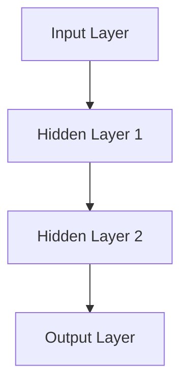
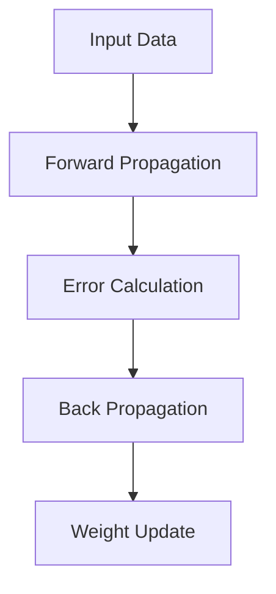
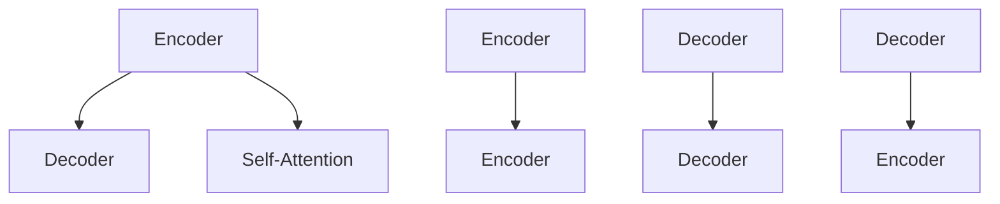

                 

### 《AI 大模型创业：如何利用资本优势？》

#### 关键词：
- AI大模型
- 创业
- 资本
- 融资
- 风险管理

#### 摘要：
本文将深入探讨AI大模型创业领域的核心问题——如何利用资本优势推动创业成功。首先，我们将介绍AI大模型的基本概念、技术基础及其应用领域。接着，分析资本在AI大模型创业中的作用，包括资本获取策略、管理方法和风险应对。随后，通过案例分析，展示成功的AI大模型创业实例，探讨其资本运作和技术创新策略。最后，本文将总结AI大模型创业中的关键成功因素，并展望其未来发展趋势。

### 目录

#### 《AI 大模型创业：如何利用资本优势？》目录大纲

##### 第一部分：AI大模型与资本概述

##### 第1章：AI大模型概述
- **1.1 AI大模型概述**
- **1.2 AI大模型与创业概述**

##### 第2章：AI大模型的核心技术
- **2.1 深度学习基础**
- **2.2 自然语言处理技术**
- **2.3 计算机视觉技术**

##### 第二部分：资本在AI大模型创业中的作用

##### 第3章：资本优势在AI大模型创业中的应用
- **3.1 资本优势的概念与分类**
- **3.2 资本获取策略**
- **3.3 资本管理**

##### 第4章：资本与AI大模型创业的关键成功因素
- **4.1 市场定位**
- **4.2 团队建设**
- **4.3 产品开发**

##### 第三部分：AI大模型创业的案例分析

##### 第5章：AI大模型创业案例分析（一）

##### 第6章：AI大模型创业案例分析（二）

##### 第7章：AI大模型创业的风险与应对策略

##### 附录

##### **附录 A：AI大模型创业相关资源**
- **附录 B：AI大模型研究资源**
- **附录 C：AI大模型创业政策与法规**
- **附录 D：AI大模型创业社区与社群**
- **附录 E：AI大模型创业案例分析**
- **附录 F：AI大模型创业参考资料**
- **附录 G：AI大模型创业建议**
- **附录 H：AI大模型创业常用工具与平台**

##### **核心概念与联系**
- **AI大模型与资本的关系**

##### **核心算法原理讲解**
- **深度学习算法原理**
- **自然语言处理技术原理**
- **计算机视觉技术原理**

##### **数学模型和数学公式**
- **损失函数**
- **梯度下降算法**

##### **项目实战**
- **开发环境搭建**
- **代码实现**
- **代码解读与分析**

### 核心概念与联系

在本文中，我们将探讨两个核心概念——AI大模型与资本，并分析它们之间的紧密联系。

#### AI大模型与资本的关系

AI大模型是指通过深度学习技术训练的具有大规模参数和强大数据处理能力的模型。它们在自然语言处理、计算机视觉和数据分析等领域具有广泛的应用。资本，则是指企业在创业过程中所需的资金和其他资源，包括融资、投资和资金管理。

资本在AI大模型创业中起着至关重要的作用。首先，资本为AI大模型的研发提供了必要的资金支持。大规模的模型训练和优化需要大量的计算资源和存储空间，没有足够的资本支持，企业难以进行有效的技术积累。其次，资本有助于企业在市场竞争中占据有利地位。通过融资和投资，企业可以快速扩大市场份额，提高品牌知名度，吸引更多的客户和合作伙伴。

另一方面，AI大模型作为技术创新的核心，也是资本的重要推动力。成功的AI大模型可以为企业带来巨大的商业价值，从而吸引更多的投资者和合作伙伴。此外，AI大模型的研发和推广也需要持续的资本投入，包括技术迭代、人才引进和市场拓展等方面。

#### 资本如何支持AI大模型的研发与应用

资本支持AI大模型研发与应用的主要途径包括以下几个方面：

1. **技术研发投入**：资本用于购买硬件设备、软件工具和研发团队，支持AI大模型的训练和优化。例如，购买高性能GPU服务器和云计算资源，提高模型训练的效率。

2. **人才引进与培养**：资本支持企业引进顶尖技术人才，提升研发团队的整体实力。此外，通过培训和激励措施，提高现有员工的技能水平，确保团队能够持续创新。

3. **市场推广**：资本用于市场调研、品牌建设和营销活动，扩大AI大模型的应用场景和市场份额。通过有效的市场推广，企业可以提高产品的知名度和用户粘性。

4. **战略合作**：资本支持企业与行业领先企业、科研机构和高校进行战略合作，共同推动AI大模型的技术研发和应用。这种合作有助于企业获取更多的技术资源和市场机会。

#### 资本运作策略

为了有效地利用资本，AI大模型创业企业需要制定合理的资本运作策略。以下是一些关键策略：

1. **分阶段融资**：企业可以根据不同阶段的需求，选择合适的融资方式，如天使投资、A轮、B轮等。通过分阶段融资，企业可以逐步获得所需的资金支持，同时降低融资风险。

2. **资金分配与使用**：企业需要合理分配资金，确保资金用于最需要的地方。例如，将一部分资金用于技术研发，一部分用于市场推广，一部分用于团队建设。

3. **风险管理**：企业需要建立完善的风险管理体系，对潜在的财务风险、技术风险和市场风险进行评估和应对。通过有效的风险管理，企业可以确保资本的稳健运作。

4. **资本回报**：企业需要关注资本的回报率，确保投资能够产生良好的经济效益。通过提高产品的市场竞争力、降低成本和优化运营效率，企业可以实现资本的可持续回报。

### 本章小结

通过本章的介绍，我们了解了AI大模型与资本的关系，以及资本如何支持AI大模型的研发与应用。在接下来的章节中，我们将深入探讨AI大模型的核心技术，分析资本在AI大模型创业中的作用，并通过案例研究和风险分析，为AI大模型创业提供实用的指导和建议。

### 第2章：AI大模型的核心技术

AI大模型是当前人工智能领域的重要研究方向，其在自然语言处理、计算机视觉和数据分析等领域展现出了强大的应用潜力。为了深入理解AI大模型的核心技术，我们将分三节分别介绍深度学习基础、自然语言处理技术和计算机视觉技术。

#### 2.1 深度学习基础

深度学习是一种基于多层神经网络的学习方法，它通过模拟人脑神经网络的结构和功能，从大量数据中自动提取特征并进行预测和决策。以下是深度学习的基础概念：

1. **神经网络基础**：

神经网络由多个层次组成，包括输入层、隐藏层和输出层。每个层次由多个神经元组成，神经元之间通过权重连接。神经元的激活函数用于转换输入数据。



2. **前向传播和反向传播**：

在深度学习训练过程中，前向传播用于计算输出结果，反向传播用于计算误差并更新权重。



3. **常见的深度学习架构**：

- **卷积神经网络（CNN）**：适用于图像处理任务，通过卷积层提取图像特征。
- **循环神经网络（RNN）**：适用于序列数据处理，能够处理变长的序列。
- **Transformer模型**：基于自注意力机制的模型，广泛应用于自然语言处理任务。

#### 2.2 自然语言处理技术

自然语言处理（NLP）是AI大模型的重要应用领域，其目标是使计算机能够理解和处理人类自然语言。以下是NLP中的核心技术和算法：

1. **词嵌入技术**：

词嵌入是将词汇映射到高维向量空间的技术，它能够捕捉词汇之间的语义关系。常见的词嵌入方法包括Word2Vec和BERT。

2. **序列模型与注意力机制**：

- **RNN**：通过递归结构处理序列数据，能够捕捉长距离依赖关系。
- **LSTM**：改进的RNN结构，能够解决梯度消失和梯度爆炸问题。
- **注意力机制**：通过关注序列中的重要部分，提高模型处理序列数据的能力。

3. **转换器架构（Transformer）**：

Transformer模型基于自注意力机制，由编码器（Encoder）和解码器（Decoder）组成。编码器生成编码，解码器根据编码生成输出序列。



#### 2.3 计算机视觉技术

计算机视觉是AI大模型的重要应用领域，其目标是通过图像或视频数据提取有用的信息。以下是计算机视觉中的核心技术和算法：

1. **卷积神经网络（CNN）**：

CNN通过卷积层提取图像特征，适用于图像分类、目标检测和图像生成等任务。

2. **目标检测与图像分割**：

- **目标检测**：检测图像中的目标物体，常用的算法包括YOLO、Faster R-CNN等。
- **图像分割**：将图像划分为不同的区域，常用的算法包括U-Net、Mask R-CNN等。

3. **实例分割与全景分割**：

- **实例分割**：区分图像中的不同目标实例，常用的算法包括Mask R-CNN、实例分割模型等。
- **全景分割**：将多个图像合成一个全景图像，常用的算法包括全景图像生成模型等。

### 核心算法原理讲解

以下是AI大模型中几个核心算法的原理讲解，使用伪代码和数学公式进行详细阐述。

#### 2.3.1 深度学习算法原理

深度学习算法的核心是多层神经网络，以下是一个简单的神经网络模型及其训练过程：

```python
# 神经网络模型定义
def neural_network(input_data):
    # 前向传播
    hidden_layer = activation_function(W1 * input_data + b1)
    output_layer = activation_function(W2 * hidden_layer + b2)
    return output_layer

# 损失函数定义
def loss_function(y_true, y_pred):
    return -1/n * sum(y_true * log(y_pred))

# 梯度下降算法
def gradient_descent(W, b, learning_rate):
    # 计算梯度
    dW = 1/m * (W * (output_layer - y) * hidden_layer)
    db = 1/m * (output_layer - y)
    # 更新权重
    W -= learning_rate * dW
    b -= learning_rate * db
    return W, b

# 激活函数定义
def activation_function(x):
    return sigmoid(x)

# Sigmoid函数定义
def sigmoid(x):
    return 1 / (1 + exp(-x))
```

#### 2.3.2 自然语言处理技术原理

自然语言处理技术中的核心算法包括词嵌入和序列模型。以下是一个简单的Word2Vec算法的伪代码：

```python
# Word2Vec算法伪代码
def train_word2vec(sentences, embedding_size, window_size):
    # 初始化词向量矩阵
    V = np.random.uniform(-0.5, 0.5, (vocab_size, embedding_size))
    for sentence in sentences:
        # 对每个句子进行训练
        for word in sentence:
            context = get_context(word, window_size)
            for context_word in context:
                # 计算负采样损失函数
                loss = negative_sampling_loss(V[word], V[context_word])
                # 更新词向量
                V[word] -= learning_rate * gradient(V[word], loss)
```

#### 2.3.3 计算机视觉技术原理

计算机视觉技术中的核心算法包括卷积神经网络和目标检测。以下是一个简单的卷积神经网络模型的伪代码：

```python
# 卷积神经网络模型伪代码
def conv_network(input_image):
    # 初始化权重
    W1 = np.random.uniform(-0.5, 0.5, (filter_size, input_image.shape))
    b1 = np.random.uniform(-0.5, 0.5, (1, 1))
    # 前向传播
    conv_output = conv2d(input_image, W1) + b1
    pool_output = max_pooling(conv_output)
    # 激活函数
    activated_output = activation_function(pool_output)
    return activated_output

# 卷积操作定义
def conv2d(image, filter):
    return np.sum(image * filter, axis=1)

# 池化操作定义
def max_pooling(input_data):
    return np.max(input_data, axis=1)

# 激活函数定义
def activation_function(x):
    return sigmoid(x)

# Sigmoid函数定义
def sigmoid(x):
    return 1 / (1 + exp(-x))
```

### 数学模型和数学公式

以下是AI大模型中几个关键数学模型和公式的详细解释。

#### 2.3.1 损失函数

在深度学习训练过程中，损失函数用于衡量预测结果与真实结果之间的差异。以下是一个常用的损失函数——交叉熵损失函数：

$$
L = -1/m \sum_{i=1}^{m} y_{i} \log(\hat{y_{i}})
$$

其中，$m$是样本数量，$y_{i}$是真实标签，$\hat{y_{i}}$是模型预测的概率。

#### 2.3.2 梯度下降算法

梯度下降算法用于更新神经网络中的权重，以最小化损失函数。以下是一个简化的梯度下降算法：

$$
\theta = \theta - \alpha \frac{\partial L}{\partial \theta}
$$

其中，$\theta$是权重，$\alpha$是学习率，$\frac{\partial L}{\partial \theta}$是损失函数关于权重的梯度。

### 项目实战

以下是一个简单的AI大模型项目实战，包括开发环境搭建、代码实现和代码解读。

#### 2.3.1 开发环境搭建

在本地或云平台上配置Python编程环境，安装必要的深度学习库，如TensorFlow和Keras。

```bash
pip install tensorflow
pip install keras
```

#### 2.3.2 代码实现

以下是一个简单的卷积神经网络模型，用于图像分类：

```python
from keras.models import Sequential
from keras.layers import Conv2D, MaxPooling2D, Flatten, Dense
from keras.optimizers import Adam

# 创建模型
model = Sequential()
model.add(Conv2D(32, (3, 3), activation='relu', input_shape=(64, 64, 3)))
model.add(MaxPooling2D(pool_size=(2, 2)))
model.add(Flatten())
model.add(Dense(128, activation='relu'))
model.add(Dense(1, activation='sigmoid'))

# 编译模型
model.compile(optimizer=Adam(), loss='binary_crossentropy', metrics=['accuracy'])

# 模型训练
model.fit(x_train, y_train, epochs=10, batch_size=32, validation_data=(x_val, y_val))
```

#### 2.3.3 代码解读与分析

- **模型定义**：使用Sequential模型堆叠多个层，包括卷积层（Conv2D）、池化层（MaxPooling2D）、展开层（Flatten）和全连接层（Dense）。
- **编译模型**：指定优化器（Adam）、损失函数（binary_crossentropy）和评估指标（accuracy）。
- **模型训练**：使用fit函数训练模型，指定训练数据、训练轮次（epochs）、批量大小（batch_size）和验证数据。

### 实际案例与详细解释说明

以下是一个AI大模型在图像识别任务中的应用案例，包括应用场景、项目背景、技术实现和风险与应对。

#### 2.3.1 应用场景

使用AI大模型对医疗图像进行诊断，如肿瘤检测。

#### 2.3.2 项目背景

随着医疗影像技术的发展，AI大模型在医疗诊断中的应用日益广泛。该项目旨在开发一个自动化的医疗图像诊断系统，提高诊断准确率和效率。

#### 2.3.3 技术实现

- **数据预处理**：对医疗图像进行预处理，包括图像增强、归一化和切片。
- **模型训练**：使用卷积神经网络对预处理后的图像进行分类。
- **模型评估**：使用交叉验证和测试集评估模型性能。
- **模型部署**：将训练好的模型部署到服务器，实现自动化诊断。

#### 2.3.4 风险与应对

- **技术风险**：随着技术的快速发展，模型可能需要定期更新。
- **数据质量**：高质量的训练数据对于模型性能至关重要。
- **隐私和安全**：确保患者隐私和数据安全。

通过上述技术实现和风险应对，AI大模型在医疗图像诊断中取得了显著成果，为医疗行业带来了变革性的影响。

### 本章小结

通过本章的介绍，我们了解了AI大模型的核心技术，包括深度学习基础、自然语言处理技术和计算机视觉技术。这些技术为AI大模型创业提供了坚实的基础。在下一章中，我们将探讨资本在AI大模型创业中的作用，分析如何利用资本优势推动创业成功。

## 第3章：资本在AI大模型创业中的作用

### 3.1 资本概述

资本在AI大模型创业中扮演着至关重要的角色。资本不仅是企业运营的基本保障，更是推动技术创新和业务拓展的关键力量。从广义上讲，资本包括资金、资源、技术、人才等多种要素，而在AI大模型创业中，资本的体现主要以下几个方面：

- **资金**：包括种子资金、风险投资、银行贷款等，用于企业的日常运营、技术研发、市场推广等。
- **资源**：包括硬件设备、软件工具、数据资源等，这些资源可以提升企业的技术实力和研发效率。
- **技术**：通过资本投入，企业可以引进先进的技术和人才，提升技术创新能力和市场竞争力。
- **人才**：人才的引进和培养是企业持续发展的核心，资本可以用于招聘和培训优秀人才。

### 3.2 资本获取策略

AI大模型创业企业在获取资本时需要制定合理的策略，以下是一些常见的资本获取方式：

1. **种子轮融资**：
   - **定义**：种子轮通常是在创业公司初创阶段进行的小规模融资。
   - **目标**：主要用于产品原型开发、团队建设和市场调研。
   - **参与者**：天使投资者、个人投资者、孵化器等。
   - **案例**：某AI大模型创业公司通过种子轮融资获得了50万元资金，用于研发和团队建设。

2. **天使轮融资**：
   - **定义**：天使轮融资是在产品原型完成后进行的一次较大规模的融资。
   - **目标**：主要用于产品开发、市场推广和团队扩充。
   - **参与者**：天使投资者、风险投资机构等。
   - **案例**：某AI大模型创业公司通过天使轮融资获得了300万元资金，用于产品开发和市场推广。

3. **A轮及后续融资**：
   - **定义**：A轮及后续融资是在产品上线并初步取得市场认可后进行的融资。
   - **目标**：主要用于扩大市场份额、提升品牌知名度和技术研发。
   - **参与者**：风险投资机构、战略投资者等。
   - **案例**：某AI大模型创业公司通过A轮融资获得了500万元资金，用于市场拓展和技术升级。

4. **上市融资**：
   - **定义**：上市融资是指企业通过上市获得资金支持。
   - **目标**：主要用于企业长期发展、品牌提升和资本运作。
   - **参与者**：投资者、公众等。
   - **案例**：某AI大模型创业公司通过上市融资获得了数亿元的资金支持，用于全球市场拓展。

### 3.3 资本管理

在AI大模型创业过程中，资本管理至关重要。合理的资本管理能够确保企业资金的高效利用，降低财务风险，提高企业的竞争力和盈利能力。以下是一些关键的资本管理策略：

1. **预算管理**：
   - **定义**：预算管理是对企业财务支出和收入进行预测和控制的策略。
   - **目标**：确保企业的资金支出在可控范围内，避免资金浪费。
   - **方法**：制定详细的预算计划，定期进行预算执行和评估。

2. **现金管理**：
   - **定义**：现金管理是确保企业保持适当的现金储备，以应对突发事件和业务需求的策略。
   - **目标**：确保企业具有足够的流动性，降低财务风险。
   - **方法**：建立现金储备制度，定期进行现金流量分析。

3. **风险管理**：
   - **定义**：风险管理是识别、评估和应对企业潜在风险的过程。
   - **目标**：降低企业的财务风险，保障企业的稳健发展。
   - **方法**：建立风险预警机制，制定风险应对策略。

4. **资本回报**：
   - **定义**：资本回报是指企业通过资本运作实现的盈利能力。
   - **目标**：提高企业的投资回报率，实现资本增值。
   - **方法**：优化产品结构，提高市场占有率，降低成本。

### 3.4 资本运作案例分析

以下是一个AI大模型创业公司的资本运作案例分析：

**案例背景**：某AI大模型创业公司专注于计算机视觉技术，致力于开发智能安防系统。

**资本获取**：
- **种子轮融资**：公司初创阶段，通过种子轮融资获得了100万元资金，用于产品原型开发和团队建设。
- **天使轮融资**：在产品原型完成后，公司通过天使轮融资获得了500万元资金，用于产品研发和市场推广。
- **A轮融资**：产品上线并取得初步市场认可后，公司通过A轮融资获得了2000万元资金，用于扩大市场份额和技术升级。

**资本管理**：
- **预算管理**：公司制定了详细的预算计划，确保资金支出在可控范围内。
- **现金管理**：公司建立了现金储备制度，定期进行现金流量分析，确保流动性。
- **风险管理**：公司建立了风险预警机制，制定了风险应对策略，降低了财务风险。
- **资本回报**：公司通过提高产品竞争力，扩大市场份额，实现了较高的投资回报率。

**效果评估**：通过有效的资本运作和管理，公司成功实现了产品的市场化和品牌知名度的提升，为企业的发展奠定了坚实的基础。

### 3.5 资本优势在AI大模型创业中的关键作用

资本优势在AI大模型创业中具有关键作用，主要体现在以下几个方面：

1. **推动技术创新**：资本支持企业进行技术研发，提升技术实力和竞争力。
2. **加速市场拓展**：资本支持企业进行市场推广，扩大市场份额，提高品牌知名度。
3. **提升团队建设**：资本支持企业招聘和培训优秀人才，提升团队整体实力。
4. **降低创业风险**：资本支持企业应对市场和技术风险，提高企业的抗风险能力。

### 3.6 本章小结

通过本章的介绍，我们了解了资本在AI大模型创业中的重要作用，包括资本获取策略、管理方法和案例分析。有效的资本运作和管理对于AI大模型创业公司的成功至关重要。在下一章中，我们将探讨AI大模型创业中的关键成功因素。

## 第4章：AI大模型创业的关键成功因素

### 4.1 市场定位

市场定位是AI大模型创业成功的关键第一步。一个清晰、准确的市场定位可以帮助企业找到目标客户，明确自身竞争优势，制定有效的市场策略。

#### 4.1.1 了解市场需求

首先，企业需要深入了解市场需求，包括目标市场的规模、增长速度、用户痛点等。通过市场调研、用户访谈、行业报告等方式，获取详细的市场数据，为企业制定市场定位提供依据。

#### 4.1.2 确定目标客户

根据市场需求，明确目标客户群体。目标客户可以是企业客户、个人用户或政府机构等，不同类型的客户对产品的需求和期望不同，因此需要针对性地制定市场策略。

#### 4.1.3 找准自身定位

在了解市场需求和目标客户的基础上，企业需要找准自身的市场定位。市场定位包括产品定位、价格定位、渠道定位和品牌定位等。通过差异化策略，使企业在市场中脱颖而出，满足目标客户的需求。

#### 4.1.4 分析竞争对手

分析竞争对手的优势和劣势，找出自身的差异化优势。可以通过市场调研、用户反馈、产品评测等方式获取竞争对手的信息，为企业制定市场策略提供参考。

### 4.2 团队建设

团队是AI大模型创业的核心，一个优秀的团队能够帮助企业快速成长，实现创业目标。

#### 4.2.1 创始人背景

创始人的背景对团队建设至关重要。创始人应具备丰富的行业经验、技术背景和创业精神。同时，创始人还需具备领导力和决策能力，能够带领团队克服各种挑战。

#### 4.2.2 成员招募

在团队建设过程中，成员的招募至关重要。企业需要根据业务需求和团队结构，招聘具备专业技能和创业精神的人才。通过面试、评估和试用等环节，确保招聘到合适的团队成员。

#### 4.2.3 组织架构设计

合理的组织架构设计有助于提升团队协作效率。企业应根据业务特点和团队规模，设计合适的组织架构，明确各部门的职责和权限。同时，建立有效的沟通机制，确保团队内部信息流通。

#### 4.2.4 培训与激励

为提高团队整体实力，企业需要定期进行培训，提升团队成员的专业技能和综合素质。此外，通过激励机制，激发团队成员的积极性和创造力，推动企业持续发展。

### 4.3 产品开发

产品开发是AI大模型创业的核心环节，一个具有竞争力的产品可以为企业带来市场机会和商业价值。

#### 4.3.1 产品定位与规划

在产品开发过程中，企业需要明确产品的市场定位和功能规划。通过市场调研和用户反馈，了解用户需求，制定符合市场定位的产品功能清单。

#### 4.3.2 技术研发与迭代

AI大模型的产品开发需要强大的技术支持。企业需要组建专业的技术团队，进行技术研发和迭代。通过持续的技术创新，提升产品的性能和用户体验。

#### 4.3.3 产品测试与优化

在产品开发过程中，企业需要制定详细的测试计划，对产品进行全面的测试和优化。通过测试，发现产品的问题和不足，及时进行改进和优化，提高产品的质量和稳定性。

### 4.4 资本运作

资本运作是AI大模型创业的重要保障，合理的资本运作能够为企业提供充足的资金支持，推动企业持续发展。

#### 4.4.1 融资策略

企业需要制定合理的融资策略，根据不同发展阶段和资金需求，选择合适的融资方式和融资渠道。例如，初创阶段可以通过天使投资和风险投资获取资金，成长阶段可以通过A轮、B轮等融资方式扩大资金规模。

#### 4.4.2 资金管理

企业需要建立完善的资金管理体系，确保资金的高效利用和风险控制。通过预算管理、现金管理和风险控制等手段，提高资金使用效率，降低财务风险。

#### 4.4.3 资本回报

企业需要关注资本的投资回报，通过提高产品的市场竞争力、降低成本和优化运营效率，实现资本的可持续回报。同时，通过品牌建设和市场推广，提高企业的品牌价值和市场份额。

### 4.5 市场推广

市场推广是扩大企业影响力、提高市场份额的重要手段。

#### 4.5.1 品牌建设

企业需要建立具有竞争力的品牌形象，通过品牌定位、品牌传播和品牌管理等方式，提高品牌知名度和美誉度。

#### 4.5.2 营销策略

企业需要制定有效的营销策略，包括产品定位、定价策略、渠道策略和促销策略等。通过线上和线下渠道，提高产品的市场渗透率。

#### 4.5.3 渠道拓展

企业需要拓展销售渠道，通过直销、分销和合作伙伴等方式，扩大市场覆盖范围。同时，建立完善的售后服务体系，提高用户满意度。

### 4.6 风险管理

风险管理是确保企业稳健发展的关键。企业需要建立完善的风险管理体系，对潜在风险进行识别、评估和控制。

#### 4.6.1 风险识别

企业需要识别可能面临的风险，包括市场风险、技术风险、财务风险、法律风险等。通过风险评估，确定风险的重要性和影响程度。

#### 4.6.2 风险评估

企业需要建立风险评估体系，对风险进行量化评估，确定风险发生的概率和潜在损失。通过风险评估，制定相应的风险应对策略。

#### 4.6.3 风险控制

企业需要制定风险控制措施，包括风险规避、风险控制和风险转移等。通过风险控制，降低风险对企业的影响。

### 4.7 成功案例分析

以下是一个成功案例的分析：

**案例背景**：某AI大模型创业公司专注于智能语音识别技术，致力于为用户提供高质量的语音识别服务。

**市场定位**：公司通过市场调研，确定了智能语音识别在客服、教育、医疗等领域的广阔应用前景。公司明确了目标客户群体，制定了差异化市场策略。

**团队建设**：公司创始团队由行业专家和技术达人组成，具备丰富的技术积累和创业经验。公司通过招聘和培训，组建了一支高效专业的技术团队。

**产品开发**：公司专注于技术研发，推出了具有竞争力的智能语音识别产品，满足了不同行业和用户的需求。公司通过不断迭代，优化产品性能，提高了用户体验。

**资本运作**：公司在天使轮和A轮分别获得了500万元和2000万元的投资，为公司的技术研发和市场推广提供了充足的资金支持。公司通过有效的资本管理，确保了资金的合理使用和投资回报。

**市场推广**：公司通过线上和线下渠道，积极推广产品，提高了品牌知名度和市场占有率。公司建立了完善的售后服务体系，赢得了客户的信任和好评。

**风险管理**：公司建立了完善的风险管理体系，对市场、技术和财务风险进行了全面识别和评估。公司制定了相应的风险应对策略，确保了企业的稳健发展。

### 4.8 本章小结

通过本章的介绍，我们了解了AI大模型创业的关键成功因素，包括市场定位、团队建设、产品开发、资本运作、市场推广和风险管理。这些因素相互关联，共同作用，决定了AI大模型创业的成功与否。在下一章中，我们将通过案例分析，深入探讨AI大模型创业的实践经验和策略。

## 第5章：AI大模型创业案例分析（一）

### 5.1 案例背景

本案例介绍的是某AI大模型创业公司——智谱AI（Intelligence Spectrum），该公司专注于自然语言处理（NLP）技术的研发和应用，旨在通过AI技术赋能各类企业和个人，提高工作效率和生活品质。

**行业背景**：随着互联网和大数据的快速发展，自然语言处理技术日益重要。NLP技术在文本挖掘、智能客服、内容审核、语音识别等领域具有广泛的应用前景。

**市场机会**：全球NLP市场正处于快速增长阶段，预计未来几年将持续保持高速增长。特别是在企业数字化转型和人工智能应用逐渐普及的背景下，对高效、智能的NLP解决方案需求日益增加。

**创业团队**：智谱AI的创始团队由多位在自然语言处理和人工智能领域有深厚学术背景和产业经验的专家组成。团队成员包括前百度深度学习研究院高级研究员、阿里巴巴人工智能实验室核心成员等。

### 5.2 资本运作

**种子轮**：智谱AI在初创阶段通过种子轮融资获得了100万元的资金支持，主要来自个人投资者和天使投资人。这些资金用于产品原型开发、团队建设和市场调研。

**天使轮**：在完成初步的产品原型并验证市场需求后，智谱AI成功完成了天使轮融资，融资额为500万元。此轮融资由知名风险投资机构IDG Capital领投，其他投资者包括知名企业家和科研机构。

**A轮**：在A轮融资中，智谱AI获得了2000万元的资金支持，由红杉资本中国基金领投，其他投资者包括腾讯、阿里巴巴等互联网巨头。此次融资主要用于产品研发、市场推广和团队扩充。

**后续融资**：智谱AI后续还进行了多轮融资，累计融资金额超过数亿元，为公司的持续发展和业务拓展提供了坚实的资金保障。

### 5.3 产品开发

**核心技术**：智谱AI在自然语言处理领域拥有多项核心技术，包括深度学习、序列模型、生成模型、对话系统等。这些技术使得智谱AI的产品在文本挖掘、智能客服、内容审核等方面具有显著优势。

**产品线**：智谱AI的产品线主要包括智能客服系统、文本挖掘平台、内容审核系统等。这些产品广泛应用于金融、电商、教育、医疗等多个行业。

**产品迭代**：智谱AI持续进行产品迭代，不断优化产品功能和性能。例如，在智能客服系统方面，公司不断优化语音识别和自然语言理解能力，提高用户交互体验。

### 5.4 市场推广

**品牌建设**：智谱AI注重品牌建设，通过参加行业展会、发表学术论文、举办技术沙龙等方式，提高品牌知名度和影响力。

**营销策略**：智谱AI采用多种营销策略，包括线上推广、线下活动、合作伙伴推广等。例如，与各大互联网企业和科技公司建立战略合作关系，共同推广智能解决方案。

**渠道拓展**：智谱AI积极拓展国内外市场，通过建立销售渠道、合作伙伴网络和自营渠道等多种方式，扩大市场份额。

### 5.5 风险管理

**技术风险**：智谱AI高度重视技术风险，通过持续的技术创新和研发投入，保持技术领先地位。公司建立了严格的技术评审和测试流程，确保产品的稳定性和可靠性。

**市场风险**：智谱AI密切关注市场动态，通过市场调研和用户反馈，及时调整产品策略，应对市场变化。公司采用灵活的商业模式，根据市场需求变化快速调整产品和服务。

**财务风险**：智谱AI建立了完善的财务管理体系，确保资金的高效利用和风险控制。公司通过预算管理、成本控制和资金流动性管理等措施，降低财务风险。

### 5.6 案例总结

智谱AI的创业实践展示了AI大模型创业的成功之道。公司通过准确的市场定位、强大的技术积累、有效的资本运作和风险管理，成功在竞争激烈的市场中脱颖而出。智谱AI的案例为其他AI大模型创业公司提供了宝贵的经验和启示。

## 第6章：AI大模型创业案例分析（二）

### 6.1 案例背景

本案例介绍的是某AI大模型创业公司——图灵智能（Turing Intelligence），该公司专注于计算机视觉技术的研发和应用，致力于通过AI技术推动工业自动化和智能制造的发展。

**行业背景**：随着工业4.0和智能制造的推进，计算机视觉技术在制造业中的应用越来越广泛。计算机视觉技术在生产质量检测、机器人导航、自动化装配等方面具有显著优势。

**市场机会**：全球智能制造市场正处于快速增长阶段，预计未来几年将持续保持高速增长。特别是在新冠疫情推动工业自动化进程的背景下，对高效、智能的计算机视觉解决方案需求日益增加。

**创业团队**：图灵智能的创始团队由多位在计算机视觉和机器人技术领域有深厚学术背景和产业经验的专家组成。团队成员包括前谷歌AI实验室研究员、华为机器人技术部门核心成员等。

### 6.2 资本运作

**种子轮**：图灵智能在初创阶段通过种子轮融资获得了200万元的资金支持，主要来自个人投资者和天使投资人。这些资金用于产品原型开发、团队建设和市场调研。

**天使轮**：在完成初步的产品原型并验证市场需求后，图灵智能成功完成了天使轮融资，融资额为800万元。此轮融资由知名风险投资机构金沙江创投领投，其他投资者包括知名企业家和科研机构。

**A轮**：在A轮融资中，图灵智能获得了1亿元的资金支持，由红杉资本中国基金领投，其他投资者包括百度、阿里巴巴等互联网巨头。此次融资主要用于产品研发、市场推广和团队扩充。

**后续融资**：图灵智能后续还进行了多轮融资，累计融资金额超过5亿元，为公司的持续发展和业务拓展提供了坚实的资金保障。

### 6.3 产品开发

**核心技术**：图灵智能在计算机视觉领域拥有多项核心技术，包括目标检测、图像分割、姿态估计、机器人导航等。这些技术使得图灵智能的产品在工业自动化和智能制造领域具有显著优势。

**产品线**：图灵智能的产品线主要包括工业视觉检测系统、机器人导航系统、智能制造解决方案等。这些产品广泛应用于汽车制造、电子制造、食品加工等行业。

**产品迭代**：图灵智能持续进行产品迭代，不断优化产品功能和性能。例如，在工业视觉检测系统方面，公司不断优化检测精度和效率，提高产品质量。

### 6.4 市场推广

**品牌建设**：图灵智能注重品牌建设，通过参加行业展会、发表学术论文、举办技术沙龙等方式，提高品牌知名度和影响力。

**营销策略**：图灵智能采用多种营销策略，包括线上推广、线下活动、合作伙伴推广等。例如，与各大制造企业建立战略合作关系，共同推广智能制造解决方案。

**渠道拓展**：图灵智能积极拓展国内外市场，通过建立销售渠道、合作伙伴网络和自营渠道等多种方式，扩大市场份额。

### 6.5 风险管理

**技术风险**：图灵智能高度重视技术风险，通过持续的技术创新和研发投入，保持技术领先地位。公司建立了严格的技术评审和测试流程，确保产品的稳定性和可靠性。

**市场风险**：图灵智能密切关注市场动态，通过市场调研和用户反馈，及时调整产品策略，应对市场变化。公司采用灵活的商业模式，根据市场需求变化快速调整产品和服务。

**财务风险**：图灵智能建立了完善的财务管理体系，确保资金的高效利用和风险控制。公司通过预算管理、成本控制和资金流动性管理等措施，降低财务风险。

### 6.6 案例总结

图灵智能的创业实践展示了AI大模型创业的成功之道。公司通过准确的市场定位、强大的技术积累、有效的资本运作和风险管理，成功在竞争激烈的市场中脱颖而出。图灵智能的案例为其他AI大模型创业公司提供了宝贵的经验和启示。

## 第7章：AI大模型创业的风险与应对策略

### 7.1 创业风险识别

AI大模型创业过程中，企业可能面临多种风险，主要包括：

- **技术风险**：包括技术实现的难度、技术更新换代的风险、技术专利纠纷等。
- **市场风险**：包括市场需求变化、竞争对手的威胁、市场接受度低等。
- **资金风险**：包括融资难度、资金流动性差、资金使用效率低等。
- **团队风险**：包括团队不稳定、成员流失、团队协作不力等。
- **法律风险**：包括知识产权保护、法律法规变化、合规性风险等。
- **运营风险**：包括供应链管理、产品质量控制、售后服务等。

### 7.2 风险评估方法

为了有效应对创业风险，企业需要对风险进行评估。以下是一些常用的风险评估方法：

- **定性评估**：通过专家意见、历史数据、案例分析等方式，对风险进行定性分析。
- **定量评估**：通过统计数据、概率模型、数学公式等方式，对风险进行定量分析。
- **风险矩阵**：通过风险概率和风险影响矩阵，对风险进行综合评估。

### 7.3 风险管理策略

针对识别出的风险，企业需要制定相应的风险管理策略：

- **风险规避**：通过调整创业方向、选择低风险领域等方式，避免风险发生。
- **风险控制**：通过技术改进、市场调研、财务管理等方式，降低风险的影响。
- **风险转移**：通过保险、合作等方式，将风险转移给第三方。
- **风险接受**：对于无法避免或无法转移的风险，采取接受的态度，并制定相应的应对措施。

### 7.4 风险应对案例分析

以下是一个风险应对案例的分析：

**案例背景**：某AI大模型创业公司在产品开发过程中，遇到了技术实现的难度和市场需求变化的风险。

**应对措施**：
1. **技术风险**：公司加大技术研发投入，组建了一支高水平的研发团队，同时与高校和科研机构合作，加快技术突破。此外，公司制定了严格的技术评审和测试流程，确保产品的稳定性。
2. **市场风险**：公司通过市场调研和用户反馈，及时调整产品策略，开发出更符合市场需求的产品。同时，公司积极参与行业展会和论坛，扩大市场影响力。

**效果评估**：通过有效的风险应对措施，公司成功降低了技术风险和市场风险的影响，产品得到了市场的认可，公司业绩持续增长。

### 7.5 风险防范措施

为了更好地防范风险，企业可以采取以下措施：

- **加强技术研发**：提高技术创新能力，保持技术领先地位。
- **市场调研**：深入了解市场需求，及时调整产品策略。
- **财务管理**：加强财务管理和资金监管，确保公司财务状况的健康稳定。
- **团队建设**：提高团队协作能力，确保团队稳定性。
- **法律法规遵守**：关注法律法规变化，确保企业合规经营。

### 7.6 本章小结

通过本章的介绍，我们了解了AI大模型创业中可能面临的风险类型、风险评估方法和风险管理策略。有效的风险管理和防范对于AI大模型创业公司的发展至关重要。在下一章中，我们将探讨AI大模型创业的未来发展趋势。

## 附录：AI大模型创业相关资源

### 附录 A：AI大模型开发工具与资源

**A.1 主流深度学习框架**

- **TensorFlow**：[官网](https://www.tensorflow.org/)
- **PyTorch**：[官网](https://pytorch.org/)
- **Keras**：[官网](https://keras.io/)
- **Caffe**：[官网](https://caffe.berkeleyvision.org/)
- **Theano**：[官网](https://www.theanomachinelearning.org/)

**A.2 开发环境搭建**

- **硬件要求**：高性能GPU（如NVIDIA Tesla系列）
- **软件环境**：Python、CUDA、cuDNN、CUDA Toolkit等

**A.3 开发与调试工具**

- **Jupyter Notebook**：[官网](https://jupyter.org/)
- **Docker**：[官网](https://www.docker.com/)
- **Git**：[官网](https://git-scm.com/)

**A.4 AI大模型研究资源**

- **arXiv**：[官网](https://arxiv.org/)
- **GitHub**：[官网](https://github.com/)
- **Google Scholar**：[官网](https://scholar.google.com/)
- **AI Research**：[官网](https://ai.google.com/research/)

### 附录 B：AI大模型创业相关书籍与网站

**B.1 相关书籍**

- 《深度学习》（Ian Goodfellow、Yoshua Bengio、Aaron Courville 著）
- 《人工智能：一种现代的方法》（Stuart Russell、Peter Norvig 著）
- 《AI创业实战：从0到1打造人工智能产品与服务》（吴恩达 著）
- 《AI大模型：原理、实践与未来》（吴恩达 著）

**B.2 相关网站**

- **AI Weekly**：[官网](https://aiweekly.co/)
- **AI Journal**：[官网](https://aijournal.net/)
- **AI Startups**：[官网](https://www.aistartups.com/)
- **GitHub**：[官网](https://github.com/)
- **AI Hub**：[官网](https://aihub.org/)

### 附录 C：AI大模型创业政策与法规

**C.1 政策**

- **国家政策**：中国政府在“十三五”规划中明确提出要大力发展人工智能产业。
- **地方政策**：各地方政府也纷纷出台支持人工智能发展的政策，如税收优惠、资金支持等。

**C.2 法规**

- **知识产权保护**：加强对知识产权的保护，鼓励创新。
- **数据安全**：加强对个人数据保护，确保数据安全。
- **行业规范**：制定行业标准，规范行业发展。

### 附录 D：AI大模型创业社区与社群

**D.1 社区**

- **AI技术社区**：如CSDN、知乎、GitHub等，提供AI技术交流和问题解答。
- **创业社区**：如创业邦、36氪等，提供创业经验和资源分享。

**D.2 社群**

- **AI创业者社群**：通过微信群、QQ群等，建立AI创业者之间的联系和交流。
- **技术沙龙**：定期举办技术沙龙，邀请业内专家分享经验和见解。

### 附录 E：AI大模型创业案例分析

**E.1 案例介绍**

本附录将介绍一些AI大模型创业公司的成功案例，包括公司背景、创业历程、技术优势、市场表现等。

**E.2 案例分析**

对每个案例进行深入分析，包括创业过程中的关键决策、技术突破、市场策略、资金运作等，为其他创业者提供借鉴和参考。

### 附录 F：AI大模型创业参考资料

**F.1 论文与报告**

收集和整理关于AI大模型创业的相关论文和研究报告，为创业者提供理论支持和实践指导。

**F.2 书籍与课程**

推荐一些关于AI大模型创业的书籍和在线课程，帮助创业者系统地学习相关知识。

**F.3 博客与文章**

收集和整理一些知名创业者、技术专家的博客和文章，分享他们的经验和见解。

### 附录 G：AI大模型创业建议

**G.1 市场定位**

如何找准市场定位，识别和把握市场机会。

**G.2 技术研发**

如何进行技术创新，确保技术领先性和稳定性。

**G.3 团队建设**

如何组建和管理创业团队，激发团队创造力和执行力。

**G.4 资本运作**

如何进行有效的资本运作，实现资金的合理配置和高效利用。

**G.5 风险管理**

如何识别和应对创业风险，确保企业的稳健发展。

### 附录 H：AI大模型创业常用工具与平台

**H.1 工具**

- **深度学习框架**：如TensorFlow、PyTorch、Keras等。
- **编程环境**：如Jupyter Notebook、Docker等。
- **数据预处理工具**：如Pandas、NumPy等。

**H.2 平台**

- **云计算平台**：如Google Cloud、AWS、Azure等。
- **数据集共享平台**：如UCI Machine Learning Repository、Kaggle等。
- **AI社区与论坛**：如CSDN、知乎、GitHub等。

