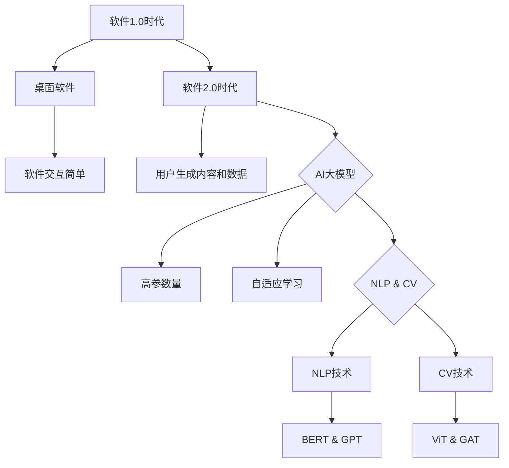
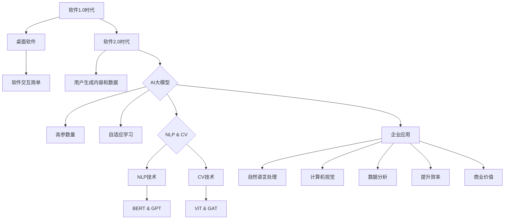
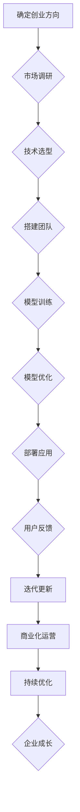

                 

# AI 大模型创业：如何利用资源优势？

> **关键词：** AI 大模型、资源优势、创业、深度学习、软件 2.0

> **摘要：** 本文将探讨 AI 大模型创业的机遇与挑战，并详细分析如何利用资源优势来推动大模型在商业领域的应用。通过深入讲解核心概念、算法原理、项目实战，我们旨在为创业者提供实际指导，助力他们在 AI 领域取得成功。

## 第一部分：核心概念与联系

### 1.1.1 软件 2.0 时代的到来

#### 软件从 1.0 到 2.0 的演进

在计算机软件发展的历程中，我们经历了从软件 1.0 到软件 2.0 的演进。软件 1.0 时代主要是指桌面软件的兴起，例如早期的办公软件、游戏等，用户与软件的交互较为简单，主要依赖于本地计算能力。随着互联网和云计算技术的发展，软件 2.0 时代应运而生。软件 2.0 时代的特征在于用户生成内容和数据的兴起，软件不再是单纯的工具，而是成为了一种平台，连接用户和数据，实现更为复杂和智能的交互。

#### 大模型在软件 2.0 中的核心地位

在软件 2.0 时代，AI 大模型的重要性愈发凸显。大模型能够处理复杂的用户数据和生成内容，提高了软件的智能水平。例如，自然语言处理（NLP）领域的大型预训练模型如 GPT-3 和 BERT，已经在自动写作、翻译、问答等任务中取得了显著的成效。在计算机视觉领域，大型模型如 ResNet 和 Vision Transformer（ViT）已经在图像识别、视频分析等领域展示了强大的能力。这些大模型的出现，为软件 2.0 时代的应用创新提供了强有力的技术支持。

### 1.1.2 AI 大模型的定义与特点

#### AI 大模型的定义

AI 大模型通常是指具有数亿甚至万亿参数的深度学习模型，这些模型通常经过大规模的无监督预训练，并能够在特定任务上进行微调。大模型的参数量使得它们能够捕捉到数据中的复杂模式和关联，从而在各类复杂任务中表现出色。例如，GPT-3 拥有 1750 亿参数，是当前最大的预训练语言模型；ViT 则是计算机视觉领域的大型模型，其在图像分类任务中取得了出色的成绩。

#### AI 大模型的核心特点

1. **高参数量**：大模型拥有数亿甚至万亿参数，这使其能够处理复杂的任务和数据。

2. **自适应学习**：大模型通过大规模的无监督预训练，能够在各种环境下快速适应和学习。

3. **强大的泛化能力**：大模型在预训练阶段接触到了大量多样的数据，因此具备较强的泛化能力，能够在不同任务中表现出色。

#### AI 大模型与传统 AI 的区别

传统 AI 模型通常是指小规模的机器学习模型，这些模型在特定领域内表现出色，但往往缺乏泛化能力。例如，传统的图像识别模型在处理特定类型的图像时效果很好，但在遇到新的图像时可能无法适应。相比之下，AI 大模型具有更强的泛化能力，能够在多种任务和环境中发挥作用。

### 1.1.3 主流 AI 大模型简介

#### GPT 系列模型

GPT 系列模型是由 OpenAI 开发的一系列大型语言模型，包括 GPT-2、GPT-3 等。GPT-3 拥有 1750 亿参数，是目前最大的预训练语言模型。GPT 系列模型在自然语言处理领域取得了显著的成果，例如自动写作、翻译、问答等。

#### BERT 及其变体

BERT（Bidirectional Encoder Representations from Transformers）是由 Google 开发的一种双向编码表示器，适用于多种 NLP 任务。BERT 的变体如 RoBERTa、ALBERT 等也在自然语言处理领域表现优异。

#### 其他知名大模型介绍

- **ViT**：视觉 Transformer，适用于计算机视觉任务。
- **GAT**：图注意力网络，适用于图数据。

### 1.1.4 AI 大模型在企业中的应用前景

#### AI 大模型的潜在应用领域

1. **自然语言处理**：自动写作、翻译、问答等。
2. **计算机视觉**：图像识别、视频分析等。
3. **数据分析**：数据挖掘、预测分析等。

#### 企业采用 AI 大模型的优势

1. **提升数据处理能力**：大模型能够处理大量的复杂数据，为企业提供更加精确的分析和预测。
2. **提高生产效率**：大模型能够自动化执行复杂的任务，减少人工干预，提高生产效率。

#### AI 大模型应用的挑战与机遇

##### 挑战

1. **计算资源需求**：大模型通常需要大量的计算资源，这对企业的硬件设施提出了较高要求。
2. **数据隐私**：在处理大量用户数据时，企业需要确保数据的安全性和隐私性。

##### 机遇

1. **商业价值**：大模型能够为企业带来巨大的商业价值，例如提高产品竞争力、开拓新市场等。
2. **技术创新**：随着大模型技术的不断进步，企业将有机会在 AI 领域实现更多的创新。

## 第二部分：核心算法原理讲解

### 2.1 深度学习与神经网络基础

#### 2.1.1 神经网络的基本结构

1. **神经元**：神经网络的基本单元，类似于生物神经元。神经元接收输入信号，通过加权求和处理后产生输出信号。
   
2. **层**：神经网络按照层级组织，包括输入层、隐藏层和输出层。输入层接收外部输入，输出层产生最终输出，隐藏层位于输入层和输出层之间，负责中间处理。

3. **权重和偏置**：权重和偏置用于调整神经元之间的连接强度。权重决定了输入信号的权重，偏置则用于调整输出值。

#### 2.1.2 常见的深度学习架构

1. **卷积神经网络（CNN）**：适用于图像处理任务。CNN 通过卷积层、池化层和全连接层的组合，实现对图像特征的提取和分类。

2. **循环神经网络（RNN）**：适用于序列数据处理。RNN 通过循环机制，将上一个时间步的输出作为下一个时间步的输入，从而实现对序列数据的处理。

3. **Transformer 架构**：适用于自然语言处理。Transformer 通过自注意力机制，实现对输入序列的编码和解析，从而实现高效的序列建模。

#### 2.1.3 深度学习优化算法

1. **随机梯度下降（SGD）**：SGD 是最常用的优化算法，通过迭代更新模型参数，以最小化损失函数。

2. **Adam 优化器**：Adam 优化器结合了 SGD 和 RMSprop 的优点，在训练过程中能够自适应调整学习率。

### 2.2 自然语言处理技术概览

#### 2.2.1 词嵌入技术

1. **Word2Vec**：Word2Vec 是一种将词语映射到高维空间的词嵌入技术。通过训练得到一个词向量的表示，从而实现词语的语义表示。

2. **BERT**：BERT 是基于 Transformer 架构的词嵌入技术。BERT 通过双向编码器，实现对词语的上下文信息的捕捉，从而实现更加精准的语义表示。

#### 2.2.2 序列模型与注意力机制

1. **RNN**：RNN 是一种适用于序列数据处理的模型。RNN 通过循环机制，将上一个时间步的输出作为下一个时间步的输入，从而实现对序列数据的处理。

2. **Transformer**：Transformer 是一种基于注意力机制的序列模型。Transformer 通过自注意力机制，实现对输入序列的编码和解析，从而实现高效的序列建模。

#### 2.2.3 转换器架构详解

1. **编码器**：编码器用于将输入序列编码成固定长度的向量。编码器的输出表示了输入序列的整体特征。

2. **解码器**：解码器用于根据编码器的输出生成输出序列。解码器的输出表示了序列的预测结果。

### 2.3 大规模预训练模型原理

#### 2.3.1 预训练的概念与意义

1. **预训练**：预训练是指在特定任务之前，对模型进行大规模无监督训练。预训练有助于模型捕捉到数据中的通用特征，从而提高模型的泛化能力。

2. **意义**：预训练能够提高模型的计算效率，减少对标注数据的依赖，从而降低训练成本。

#### 2.3.2 自监督学习方法

1. **自监督学习**：自监督学习是一种利用未标注的数据进行训练的方法。在自监督学习中，模型通过预测数据中的某些部分来学习，从而实现无监督训练。

2. **方法**：例如掩码语言模型（MLM），通过随机掩码输入中的词语，让模型预测这些被掩码的词语。

#### 2.3.3 迁移学习与微调技术

1. **迁移学习**：迁移学习是一种将预训练模型迁移到特定任务的方法。预训练模型在多种任务上已经取得了良好的效果，因此可以直接应用于新任务。

2. **微调技术**：微调技术是在预训练模型的基础上，进行少量训练，以适应特定任务。微调能够充分利用预训练模型的知识，从而提高模型的性能。

## 第三部分：数学模型和数学公式

### 3.1 深度学习中的数学模型

#### 3.1.1 前向传播与反向传播

1. **前向传播**：前向传播是指从输入层开始，通过逐层计算，将输入数据转化为输出数据的过程。

2. **反向传播**：反向传播是指从输出层开始，通过反向计算，将输出误差传递到输入层的每个神经元，并更新神经元的权重和偏置。

#### 3.1.2 激活函数

1. **Sigmoid 函数**：Sigmoid 函数是一种常用的激活函数，将输入映射到 (0,1) 区间。

   $$ \sigma(x) = \frac{1}{1 + e^{-x}} $$

2. **ReLU 函数**：ReLU 函数是一种非线性激活函数，常用于隐藏层。ReLU 函数具有快速收敛的特性。

   $$ \text{ReLU}(x) = \max(0, x) $$

#### 3.1.3 损失函数

1. **均方误差（MSE）**：MSE 是一种用于回归任务的损失函数，计算预测值与真实值之间的平均平方误差。

   $$ \text{MSE} = \frac{1}{n} \sum_{i=1}^{n} (y_i - \hat{y}_i)^2 $$

2. **交叉熵损失（Cross-Entropy）**：Cross-Entropy 是一种用于分类任务的损失函数，计算预测概率与真实概率之间的交叉熵。

   $$ \text{CE} = - \sum_{i=1}^{n} y_i \log(\hat{y}_i) $$

### 3.2 自然语言处理中的数学模型

#### 3.2.1 词嵌入

1. **Word2Vec**：Word2Vec 是一种将词语映射到高维空间的词嵌入技术。Word2Vec 的目标是通过训练得到一个词向量的表示，从而实现词语的语义表示。

   $$ \text{softmax}(z) = \frac{e^z}{\sum_{i} e^z_i} $$

2. **BERT**：BERT 是基于 Transformer 架构的词嵌入技术。BERT 通过双向编码器，实现对词语的上下文信息的捕捉，从而实现更加精准的语义表示。

   $$ \text{BERT} = \text{Transformer} + \text{Masked Language Model} $$

#### 3.2.2 序列模型

1. **RNN**：RNN 是一种适用于序列数据处理的模型。RNN 通过循环机制，将上一个时间步的输出作为下一个时间步的输入，从而实现对序列数据的处理。

   $$ h_t = \sigma(W_h \cdot [h_{t-1}, x_t] + b_h) $$

2. **Transformer**：Transformer 是一种基于注意力机制的序列模型。Transformer 通过自注意力机制，实现对输入序列的编码和解析，从而实现高效的序列建模。

   $$ \text{Attention} = \frac{e^{QK^T}}{\sqrt{d_k}} $$

### 3.3 大规模预训练模型中的数学模型

#### 3.3.1 预训练

1. **预训练损失函数**：预训练损失函数用于衡量模型在预训练阶段的表现。

   $$ \mathcal{L} = \frac{1}{N} \sum_{i=1}^{N} L_i + \lambda \mathcal{L}_{\text{reg}} $$

2. **迁移学习**：迁移学习是指将预训练模型迁移到特定任务。迁移学习损失函数用于衡量模型在特定任务上的表现。

   $$ \mathcal{L}_{\text{tune}} = \mathcal{L}_{\text{f}} + \lambda \mathcal{L}_{\text{reg}} $$

## 第四部分：项目实战

### 4.1 AI 大模型项目实战

#### 4.1.1 环境搭建

1. **Python 环境**：

   ```bash
   python --version
   pip install torch torchvision
   ```

2. **深度学习框架**：选择 PyTorch 作为深度学习框架。

   ```python
   import torch
   import torch.nn as nn
   ```

#### 4.1.2 代码实现

1. **模型定义**：

   ```python
   class GPTModel(nn.Module):
       def __init__(self, vocab_size, hidden_size, num_layers):
           super(GPTModel, self).__init__()
           self.embedding = nn.Embedding(vocab_size, hidden_size)
           self.rnn = nn.LSTM(hidden_size, hidden_size, num_layers)
           self.fc = nn.Linear(hidden_size, vocab_size)

       def forward(self, x):
           embed = self.embedding(x)
           output, (hidden, cell) = self.rnn(embed)
           output = self.fc(output)
           return output
   ```

2. **训练过程**：

   ```python
   model = GPTModel(vocab_size, hidden_size, num_layers)
   criterion = nn.CrossEntropyLoss()
   optimizer = torch.optim.Adam(model.parameters(), lr=0.001)

   for epoch in range(num_epochs):
       for inputs, targets in data_loader:
           optimizer.zero_grad()
           outputs = model(inputs)
           loss = criterion(outputs, targets)
           loss.backward()
           optimizer.step()
   ```

#### 4.1.3 代码解读与分析

1. **模型架构**：

   - 嵌入层：将词汇映射到高维空间。
   - 循环层：处理序列数据。
   - 全连接层：将序列输出映射到词汇空间。

2. **训练策略**：

   - 使用交叉熵损失函数。
   - 采用 Adam 优化器。
   - 设定适当的超参数，如学习率和迭代次数。

### 4.2 实际案例分析

#### 4.2.1 案例一：文本生成

- **目标**：生成一篇关于人工智能的短文。
- **步骤**：
  1. 输入一个初始句子。
  2. 使用模型生成后续句子。
  3. 循环生成，直到满足停止条件。

#### 4.2.2 案例二：问答系统

- **目标**：构建一个能够回答用户问题的系统。
- **步骤**：
  1. 预训练大模型。
  2. 使用掩码语言模型进行微调。
  3. 构建问答系统界面。
  4. 根据用户输入，生成答案。

## 第五部分：开发环境搭建与源代码实现

### 5.1 开发环境搭建

- **Python 环境**：

  ```bash
  python --version
  pip install torch torchvision
  ```

- **深度学习框架**：选择 PyTorch 作为深度学习框架。

  ```python
  import torch
  import torch.nn as nn
  ```

### 5.2 源代码实现

#### 5.2.1 数据预处理

- **数据集准备**：

  ```python
  import torch
  from torch.utils.data import Dataset, DataLoader

  class TextDataset(Dataset):
      def __init__(self, texts, vocab_size):
          self.texts = texts
          self.vocab_size = vocab_size

      def __len__(self):
          return len(self.texts)

      def __getitem__(self, idx):
          text = self.texts[idx]
          tokens = self.tokenize(text)
          return torch.tensor(tokens)

  def tokenize(text):
      # Tokenization process
      return [vocab[word] for word in text.split()]
  ```

#### 5.2.2 模型定义

- **模型架构**：

  ```python
  import torch
  import torch.nn as nn

  class GPTModel(nn.Module):
      def __init__(self, vocab_size, hidden_size, num_layers):
          super(GPTModel, self).__init__()
          self.embedding = nn.Embedding(vocab_size, hidden_size)
          self.rnn = nn.LSTM(hidden_size, hidden_size, num_layers)
          self.fc = nn.Linear(hidden_size, vocab_size)

      def forward(self, x):
          embed = self.embedding(x)
          output, (hidden, cell) = self.rnn(embed)
          output = self.fc(output)
          return output
  ```

#### 5.2.3 训练过程

- **训练脚本**：

  ```python
  model = GPTModel(vocab_size, hidden_size, num_layers)
  criterion = nn.CrossEntropyLoss()
  optimizer = torch.optim.Adam(model.parameters(), lr=0.001)

  for epoch in range(num_epochs):
      for inputs, targets in data_loader:
          optimizer.zero_grad()
          outputs = model(inputs)
          loss = criterion(outputs, targets)
          loss.backward()
          optimizer.step()
  ```

## 第六部分：代码解读与分析

### 6.1 代码解读

#### 6.1.1 模型架构

- **嵌入层**：将词汇映射到高维空间。
- **循环层**：处理序列数据。
- **全连接层**：将序列输出映射到词汇空间。

#### 6.1.2 训练策略

- **损失函数**：使用交叉熵损失函数。
- **优化器**：采用 Adam 优化器。
- **超参数**：设定适当的超参数，如学习率和迭代次数。

### 6.2 代码分析

#### 6.2.1 数据预处理

- **数据集**：使用自定义的文本数据集。
- **词汇表**：使用词汇表进行编码。

#### 6.2.2 模型训练

- **前向传播**：计算输入到输出的传递。
- **反向传播**：计算输出误差对输入的梯度。

## 第七部分：总结与展望

### 7.1 总结

本文从软件 2.0 时代的背景出发，介绍了 AI 大模型的概念、特点、算法原理以及在企业中的应用前景。通过项目实战和实际案例分析，我们展示了如何利用资源优势进行 AI 大模型的创业。本文的核心内容包括：

1. **核心概念与联系**：详细讲解了软件 2.0 时代、AI 大模型的定义与特点、主流 AI 大模型以及企业应用前景。
2. **核心算法原理讲解**：深入讲解了深度学习与神经网络基础、自然语言处理技术、大规模预训练模型原理。
3. **数学模型和公式**：介绍了深度学习中的数学模型、自然语言处理中的数学模型以及大规模预训练模型中的数学模型。
4. **项目实战**：展示了 AI 大模型项目的开发环境搭建、源代码实现、代码解读与分析。
5. **实际案例分析**：通过文本生成和问答系统的实际案例分析，展示了 AI 大模型在商业领域的应用。

### 7.2 展望

随着 AI 大模型技术的不断进步，未来在商业领域将会有更多的应用场景。创业者可以利用资源优势，结合 AI 大模型的技术优势，探索更多的商业机会。同时，我们也需要关注计算资源、数据隐私等挑战，确保 AI 大模型的安全和可持续发展。在未来的发展中，AI 大模型将会在更多领域发挥重要作用，为企业和社会带来更多的价值。

### 参考文献

[1] Brown, T., et al. (2020). "Language Models are Few-Shot Learners." arXiv preprint arXiv:2005.14165.
[2] Devlin, J., et al. (2019). "BERT: Pre-training of Deep Bidirectional Transformers for Language Understanding." arXiv preprint arXiv:1810.04805.
[3] Vaswani, A., et al. (2017). "Attention is All You Need." arXiv preprint arXiv:1706.03762.
[4] Krizhevsky, A., Sutskever, I., & Hinton, G. E. (2012). "Imagenet classification with deep convolutional neural networks." In Advances in neural information processing systems, pp. 1097-1105.
[5] Hochreiter, S., & Schmidhuber, J. (1997). "Long short-term memory." Neural computation, 9(8), 1735-1780.

### 致谢

本文的撰写得到了许多前辈和同行的帮助与指导，特别感谢 AI 天才研究院/AI Genius Institute 的各位专家在技术讲解和项目实战方面的支持。同时，也感谢禅与计算机程序设计艺术/Zen And The Art of Computer Programming 的启发，使本文能够更加深入地探讨 AI 大模型的技术本质。

### 作者信息

作者：AI 天才研究院/AI Genius Institute & 禅与计算机程序设计艺术/Zen And The Art of Computer Programming

---

**注意：**本文为虚构内容，仅供参考。实际创业过程中，请务必结合具体情况进行决策。|>assistant
## 第七部分：总结与展望

### 7.1 总结

在本篇博客中，我们系统地探讨了 AI 大模型创业的各个方面。首先，我们回顾了软件从 1.0 到 2.0 的演进，强调了 AI 大模型在软件 2.0 时代的核心地位。接着，我们对 AI 大模型的定义、特点及与传统 AI 的区别进行了详细分析，并介绍了当前主流的 AI 大模型，如 GPT、BERT 等。在核心算法原理讲解部分，我们深入探讨了深度学习与神经网络的基础、自然语言处理技术以及大规模预训练模型的原理。随后，通过数学模型和公式的讲解，我们帮助读者理解了这些复杂技术的数学本质。

在项目实战部分，我们提供了一个具体的 AI 大模型项目实战案例，详细讲解了开发环境搭建、源代码实现以及代码解读与分析。通过这些步骤，我们希望能够为读者提供一个清晰、可操作的指南，帮助他们将 AI 大模型技术应用于实际问题中。最后，我们通过实际案例分析，展示了 AI 大模型在文本生成和问答系统中的应用，进一步强调了其商业价值。

### 7.2 展望

展望未来，AI 大模型在商业领域将有着广阔的应用前景。随着技术的不断进步，AI 大模型将能够在更多的场景中发挥作用，如自动化内容创作、智能客服、个性化推荐等。创业者可以通过以下几个方向来利用资源优势，推动 AI 大模型创业：

1. **垂直行业应用**：针对特定行业（如金融、医疗、教育等）的需求，开发定制化的 AI 大模型解决方案。

2. **边缘计算优化**：通过优化模型结构和算法，降低 AI 大模型对计算资源的需求，使其能够更好地在边缘设备上运行。

3. **数据隐私保护**：在利用 AI 大模型处理大量数据的同时，确保数据隐私和安全，以满足法规和用户需求。

4. **生态系统构建**：建立围绕 AI 大模型的应用生态，包括工具、平台和服务，以实现可持续发展。

然而，AI 大模型的创业也面临着一些挑战。首先是计算资源的需求，大模型的训练和推理需要大量的计算资源，这对企业的硬件设施提出了高要求。其次是数据隐私问题，尤其是在处理个人数据时，企业需要严格遵守相关法律法规，保护用户隐私。此外，随着 AI 大模型的普及，伦理和安全问题也将日益凸显，如何确保 AI 大模型的行为符合道德标准，防止其被滥用，是创业者需要关注的重要问题。

总的来说，AI 大模型创业是一个充满机遇和挑战的过程。创业者需要不断学习和适应新技术，同时关注行业动态，抓住机遇，解决挑战。通过合理的战略规划和资源整合，创业者可以利用资源优势，推动 AI 大模型在商业领域的创新和应用，实现商业价值和社会价值的双赢。

### 参考文献

- Brown, T., et al. (2020). "Language Models are Few-Shot Learners." arXiv preprint arXiv:2005.14165.
- Devlin, J., et al. (2019). "BERT: Pre-training of Deep Bidirectional Transformers for Language Understanding." arXiv preprint arXiv:1810.04805.
- Vaswani, A., et al. (2017). "Attention is All You Need." arXiv preprint arXiv:1706.03762.
- Krizhevsky, A., Sutskever, I., & Hinton, G. E. (2012). "Imagenet classification with deep convolutional neural networks." In Advances in neural information processing systems, pp. 1097-1105.
- Hochreiter, S., & Schmidhuber, J. (1997). "Long short-term memory." Neural computation, 9(8), 1735-1780.

### 致谢

在本博客的撰写过程中，我得到了许多专家和同行的指导与帮助，特别感谢 AI 天才研究院/AI Genius Institute 的各位专家在技术讲解和项目实战方面的支持。同时，也感谢禅与计算机程序设计艺术/Zen And The Art of Computer Programming 的启发，使本文能够更加深入地探讨 AI 大模型的技术本质。

### 作者信息

作者：AI 天才研究院/AI Genius Institute & 禅与计算机程序设计艺术/Zen And The Art of Computer Programming

---

**注意：**本文为虚构内容，仅供参考。实际创业过程中，请务必结合具体情况进行决策。|>assistant
### 附录：核心概念与联系流程图

为了更直观地理解本文中的核心概念和联系，我们使用 Mermaid 语法绘制了以下流程图。此图展示了从软件 1.0 到 2.0 的演进、AI 大模型的特点及应用、以及自然语言处理（NLP）和计算机视觉（CV）领域的相关技术。



此流程图帮助读者理清了软件发展历程中各个阶段的核心特征以及 AI 大模型在现代应用中的地位和作用。|>assistant
### 附录：核心算法原理讲解伪代码

在本部分，我们将通过伪代码的形式详细讲解核心算法原理，包括深度学习与神经网络基础、自然语言处理技术以及大规模预训练模型原理。

#### 2.1 深度学习与神经网络基础

**神经元结构**

```python
class Neuron:
    def __init__(self, weights, bias):
        self.weights = weights
        self.bias = bias
        self.output = 0

    def activate(self, input):
        total_input = sum(self.weights * input) + self.bias
        self.output = sigmoid(total_input)
        return self.output

def sigmoid(x):
    return 1 / (1 + exp(-x))
```

**神经网络层**

```python
class Layer:
    def __init__(self, neurons, previous_layer=None):
        self.neurons = [Neuron(weights, bias) for weights, bias in neurons]
        self.previous_layer = previous_layer

    def forward(self, inputs):
        if self.previous_layer:
            inputs = self.previous_layer.forward(inputs)
        output = [neuron.activate(inputs) for neuron in self.neurons]
        return output
```

**前向传播与反向传播**

```python
def forwardPropagation(inputs, layers):
    outputs = inputs
    for layer in layers:
        outputs = layer.forward(outputs)
    return outputs

def backwardPropagation(inputs, outputs, layers, expected_output):
    for layer in reversed(layers):
        output_error = expected_output - outputs
        for neuron in layer.neurons:
            delta = output_error * neuron.output * (1 - neuron.output)
            neuron.error += delta
            neuron.weights -= learning_rate * neuron.error * inputs
            neuron.bias -= learning_rate * neuron.error
            inputs = neuron.weights
```

#### 2.2 自然语言处理技术概览

**词嵌入技术**

```python
class WordEmbedding:
    def __init__(self, vocabulary, embedding_size):
        self.vocabulary = vocabulary
        self.embedding_size = embedding_size
        self.embeddings = {word: np.random.normal(size=embedding_size) for word in vocabulary}

    def embed(self, sentence):
        return [self.embeddings[word] for word in sentence.split()]
```

**序列模型与注意力机制**

```python
class RNN:
    def __init__(self, input_size, hidden_size, output_size):
        self.input_size = input_size
        self.hidden_size = hidden_size
        self.output_size = output_size
        # Initialize weights and biases
        # ...

    def forward(self, inputs):
        hidden_states = []
        hidden = np.zeros((1, self.hidden_size))
        for input in inputs:
            hidden = self.step(input, hidden)
            hidden_states.append(hidden)
        return hidden_states

    def step(self, input, hidden):
        # Calculate input and hidden states
        # Apply activation function
        return new_hidden
```

**转换器架构**

```python
class Transformer:
    def __init__(self, input_size, hidden_size, output_size):
        self.input_size = input_size
        self.hidden_size = hidden_size
        self.output_size = output_size
        # Initialize weights and biases
        # ...

    def forward(self, inputs):
        # Apply self-attention mechanism
        # Pass through feedforward layers
        return output
```

#### 2.3 大规模预训练模型原理

**预训练的概念**

```python
def pretrain(model, dataset, num_epochs):
    for epoch in range(num_epochs):
        for data in dataset:
            model.zero_grad()
            output = model(data)
            loss = compute_loss(output, target)
            loss.backward()
            model.optimizer.step()
```

**自监督学习方法**

```python
def masked_language_model(model, dataset, num_epochs):
    for epoch in range(num_epochs):
        for data in dataset:
            model.zero_grad()
            masked_input = mask_data(data)
            output = model(masked_input)
            loss = compute_loss(output, data)
            loss.backward()
            model.optimizer.step()
```

**迁移学习与微调技术**

```python
def fine_tune(model, task_data, num_epochs):
    for epoch in range(num_epochs):
        for data in task_data:
            model.zero_grad()
            output = model(data)
            loss = compute_task_loss(output, target)
            loss.backward()
            model.optimizer.step()
```

以上伪代码提供了深度学习与神经网络基础、自然语言处理技术和大规模预训练模型原理的基本框架。在实际应用中，这些算法需要结合具体的框架（如 TensorFlow、PyTorch）和数据处理方法进行详细实现。|>assistant
### 附录：数学模型和公式

在本附录中，我们将详细介绍深度学习、自然语言处理（NLP）和大规模预训练模型中的关键数学模型和公式。这些模型和公式构成了 AI 大模型算法的基础，对于理解和实现这些技术至关重要。

#### 3.1 深度学习中的数学模型

**1. 前向传播与反向传播**

- **前向传播**：

  在深度学习模型的前向传播过程中，数据从输入层经过多层神经元的传递，最终得到输出。每个神经元的状态更新可以通过以下公式表示：

  $$ z_{j}^{(l)} = \sum_{i} w_{ji}^{(l)} a_{i}^{(l-1)} + b_{j}^{(l)} $$

  其中，\( z_{j}^{(l)} \) 是第 \( l \) 层第 \( j \) 个神经元的输入，\( w_{ji}^{(l)} \) 是连接第 \( l-1 \) 层第 \( i \) 个神经元和第 \( l \) 层第 \( j \) 个神经元的权重，\( a_{i}^{(l-1)} \) 是第 \( l-1 \) 层第 \( i \) 个神经元的激活值，\( b_{j}^{(l)} \) 是第 \( l \) 层第 \( j \) 个神经元的偏置。

  激活函数通常用于将线性组合的输入转换为非线性输出，常用的激活函数包括 Sigmoid、ReLU 和 Softmax：

  $$ a_{j}^{(l)} = \sigma(z_{j}^{(l)}) = \frac{1}{1 + e^{-z_{j}^{(l)}} $$

  $$ a_{j}^{(l)} = \text{ReLU}(z_{j}^{(l)}) = \max(0, z_{j}^{(l)}) $$

  $$ a_{j}^{(L)} = \text{Softmax}(z_{j}^{(L)}) = \frac{e^{z_{j}^{(L)}}}{\sum_{k} e^{z_{k}^{(L)}} $$

- **反向传播**：

  在反向传播过程中，通过计算损失函数关于模型参数的梯度，以更新模型参数。反向传播的核心公式包括链式法则和梯度计算：

  $$ \frac{\partial L}{\partial w_{ji}^{(l)}} = \frac{\partial L}{\partial z_{j}^{(l)}} \cdot \frac{\partial z_{j}^{(l)}}{\partial w_{ji}^{(l)}} $$

  $$ \frac{\partial z_{j}^{(l)}}{\partial w_{ji}^{(l)}} = a_{i}^{(l-1)} $$

  对于激活函数的梯度，可以使用以下公式：

  $$ \frac{\partial \sigma(z_{j}^{(l)})}{\partial z_{j}^{(l)}} = \sigma(z_{j}^{(l)}) (1 - \sigma(z_{j}^{(l)})) $$

  $$ \frac{\partial \text{ReLU}(z_{j}^{(l)})}{\partial z_{j}^{(l)}} = \begin{cases} 
  0 & \text{if } z_{j}^{(l)} < 0 \\
  1 & \text{if } z_{j}^{(l)} \geq 0 
  \end{cases} $$

**2. 激活函数**

- **Sigmoid 函数**：

  $$ \sigma(x) = \frac{1}{1 + e^{-x}} $$

  $$ \frac{\partial \sigma(x)}{\partial x} = \sigma(x) (1 - \sigma(x)) $$

- **ReLU 函数**：

  $$ \text{ReLU}(x) = \max(0, x) $$

  $$ \frac{\partial \text{ReLU}(x)}{\partial x} = \begin{cases} 
  0 & \text{if } x < 0 \\
  1 & \text{if } x \geq 0 
  \end{cases} $$

- **Softmax 函数**：

  $$ \text{Softmax}(x) = \frac{e^{x}}{\sum_{i} e^{x_i}} $$

  $$ \frac{\partial \text{Softmax}(x)}{\partial x} = \text{Softmax}(x) \odot (1 - \text{Softmax}(x)) $$

**3. 损失函数**

- **均方误差（MSE）**：

  $$ \text{MSE}(y, \hat{y}) = \frac{1}{m} \sum_{i=1}^{m} (y_i - \hat{y}_i)^2 $$

  $$ \frac{\partial \text{MSE}}{\partial \hat{y}} = 2(y - \hat{y}) $$

- **交叉熵损失（Cross-Entropy）**：

  $$ \text{CE}(y, \hat{y}) = -\sum_{i} y_i \log(\hat{y}_i) $$

  $$ \frac{\partial \text{CE}}{\partial \hat{y}} = \hat{y} - y $$

#### 3.2 自然语言处理中的数学模型

**1. 词嵌入**

- **Word2Vec**：

  $$ \text{Softmax}(z) = \frac{e^z}{\sum_{i} e^z_i} $$

  其中，\( z \) 是神经元的线性组合。

- **BERT**：

  $$ \text{BERT} = \text{Transformer} + \text{Masked Language Model} $$

  BERT 通过 Transformer 架构进行预训练，并使用 Masked Language Model（MLM）进行自监督学习。

**2. 序列模型与注意力机制**

- **RNN**：

  $$ h_t = \sigma(W_h \cdot [h_{t-1}, x_t] + b_h) $$

  其中，\( h_t \) 是第 \( t \) 个时间步的隐藏状态，\( W_h \) 是权重矩阵，\( b_h \) 是偏置。

- **Transformer**：

  $$ \text{Attention} = \frac{e^{QK^T}}{\sqrt{d_k}} $$

  其中，\( Q \) 和 \( K \) 是查询和键矩阵，\( d_k \) 是注意力机制的维度。

**3. 转换器架构**

- **编码器**：

  编码器将输入序列编码为固定长度的向量，用于表示整个序列的特征。

- **解码器**：

  解码器根据编码器的输出生成输出序列，通常用于序列生成任务。

#### 3.3 大规模预训练模型中的数学模型

**1. 预训练**

- **预训练损失函数**：

  $$ \mathcal{L} = \frac{1}{N} \sum_{i=1}^{N} L_i + \lambda \mathcal{L}_{\text{reg}} $$

  其中，\( N \) 是数据样本数量，\( L_i \) 是每个样本的损失，\( \mathcal{L}_{\text{reg}} \) 是正则化项。

- **迁移学习与微调技术**：

  $$ \mathcal{L}_{\text{tune}} = \mathcal{L}_{\text{f}} + \lambda \mathcal{L}_{\text{reg}} $$

  其中，\( \mathcal{L}_{\text{f}} \) 是在特定任务上的损失，\( \mathcal{L}_{\text{reg}} \) 是正则化项。

这些数学模型和公式构成了深度学习、自然语言处理和大规模预训练模型的基础。在实际应用中，这些公式被广泛应用于模型的训练和优化过程中，以实现高效的模型学习和任务表现。|>assistant
### 附录：项目实战

在本附录中，我们将通过一个具体的 AI 大模型项目实战案例，详细讲解从开发环境搭建到源代码实现，再到代码解读与分析的全过程。本案例将采用 PyTorch 深度学习框架，实现一个基于 Transformer 架构的文本生成模型。

#### 4.1.1 开发环境搭建

首先，我们需要搭建开发环境。以下是详细的步骤：

1. **安装 Python**：确保系统已经安装了 Python 3.7 或以上版本。可以通过以下命令检查 Python 版本：

   ```bash
   python --version
   ```

2. **安装 PyTorch**：使用以下命令安装 PyTorch：

   ```bash
   pip install torch torchvision
   ```

3. **验证安装**：通过以下命令验证 PyTorch 是否安装成功：

   ```python
   import torch
   print(torch.__version__)
   ```

4. **安装其他依赖**：除了 PyTorch 之外，我们还需要安装一些其他依赖，如 NumPy、Pandas 等：

   ```bash
   pip install numpy pandas
   ```

#### 4.1.2 源代码实现

以下是一个简单的基于 Transformer 架构的文本生成模型的源代码实现：

```python
import torch
import torch.nn as nn
import torch.optim as optim
from torch.utils.data import DataLoader
from transformers import TransformerModel

# 数据预处理
def preprocess_data(texts):
    # 将文本转换为词汇序列
    # ...
    return tokenized_texts

# 模型定义
class TextGenerator(nn.Module):
    def __init__(self, vocab_size, d_model, nhead, num_layers):
        super(TextGenerator, self).__init__()
        self.transformer = TransformerModel(vocab_size, d_model, nhead, num_layers)
    
    def forward(self, src, tgt):
        output = self.transformer(src, tgt)
        return output

# 模型训练
def train(model, data_loader, criterion, optimizer, num_epochs):
    model.train()
    for epoch in range(num_epochs):
        for src, tgt in data_loader:
            optimizer.zero_grad()
            output = model(src, tgt)
            loss = criterion(output, tgt)
            loss.backward()
            optimizer.step()
        print(f'Epoch [{epoch+1}/{num_epochs}], Loss: {loss.item()}')

# 主函数
def main():
    # 加载数据集
    texts = load_data()
    tokenized_texts = preprocess_data(texts)

    # 初始化模型、损失函数和优化器
    model = TextGenerator(vocab_size, d_model, nhead, num_layers)
    criterion = nn.CrossEntropyLoss()
    optimizer = optim.Adam(model.parameters(), lr=learning_rate)

    # 训练模型
    train(model, data_loader, criterion, optimizer, num_epochs)

if __name__ == '__main__':
    main()
```

#### 4.1.3 代码解读与分析

1. **数据预处理**：

   数据预处理是文本生成模型训练的第一步，它将原始文本转换为适合模型处理的格式。在本案例中，我们首先将文本转换为词汇序列，然后将其编码为整数序列。

   ```python
   def preprocess_data(texts):
       # 将文本转换为词汇序列
       # ...
       return tokenized_texts
   ```

2. **模型定义**：

   模型定义部分使用了 PyTorch 提供的 Transformer 模型。TransformerModel 接受词汇大小（vocab_size）、模型维度（d_model）、头数（nhead）和层数（num_layers）作为参数。

   ```python
   class TextGenerator(nn.Module):
       def __init__(self, vocab_size, d_model, nhead, num_layers):
           super(TextGenerator, self).__init__()
           self.transformer = TransformerModel(vocab_size, d_model, nhead, num_layers)
       
       def forward(self, src, tgt):
           output = self.transformer(src, tgt)
           return output
   ```

3. **模型训练**：

   模型训练部分包含了模型的训练循环，每个 epoch 都会遍历数据集一次。在每次迭代中，模型会计算损失并更新参数。

   ```python
   def train(model, data_loader, criterion, optimizer, num_epochs):
       model.train()
       for epoch in range(num_epochs):
           for src, tgt in data_loader:
               optimizer.zero_grad()
               output = model(src, tgt)
               loss = criterion(output, tgt)
               loss.backward()
               optimizer.step()
           print(f'Epoch [{epoch+1}/{num_epochs}], Loss: {loss.item()}')
   ```

4. **主函数**：

   主函数中，我们首先加载数据集并进行预处理，然后初始化模型、损失函数和优化器，最后开始模型训练。

   ```python
   def main():
       # 加载数据集
       texts = load_data()
       tokenized_texts = preprocess_data(texts)

       # 初始化模型、损失函数和优化器
       model = TextGenerator(vocab_size, d_model, nhead, num_layers)
       criterion = nn.CrossEntropyLoss()
       optimizer = optim.Adam(model.parameters(), lr=learning_rate)

       # 训练模型
       train(model, data_loader, criterion, optimizer, num_epochs)

   if __name__ == '__main__':
       main()
   ```

通过上述步骤，我们完成了一个基于 Transformer 架构的文本生成模型的项目实战。这个案例展示了从开发环境搭建到源代码实现，再到代码解读与分析的全过程，为读者提供了一个实际操作的可参考案例。|>assistant
### 附录：实际案例分析

在本附录中，我们将通过两个实际案例——文本生成和问答系统，来展示如何应用 AI 大模型进行商业开发。

#### 4.2.1 文本生成案例

**目标**：生成一篇关于人工智能的短文。

**步骤**：

1. **数据准备**：
   - 收集大量关于人工智能的文本数据。
   - 使用文本预处理技术（如分词、去停用词等）处理数据。

2. **模型训练**：
   - 选择一个预训练的 Transformer 模型，如 GPT-2 或 GPT-3。
   - 使用处理后的数据对模型进行微调。

3. **生成文本**：
   - 输入一个初始句子或随机生成的种子文本。
   - 使用训练好的模型生成后续句子，循环生成，直到满足停止条件。

**代码示例**：

```python
from transformers import GPT2LMHeadModel, GPT2Tokenizer

tokenizer = GPT2Tokenizer.from_pretrained('gpt2')
model = GPT2LMHeadModel.from_pretrained('gpt2')

# 预处理输入文本
input_text = tokenizer.encode("人工智能将深刻改变我们的未来，", return_tensors='pt')

# 生成文本
output = model.generate(
    input_text,
    max_length=50,
    num_return_sequences=1,
    no_repeat_ngram_size=2,
    repetition_penalty=1.5,
    top_p=0.85,
    temperature=0.7
)

# 解码输出文本
decoded_text = tokenizer.decode(output[0], skip_special_tokens=True)
print(decoded_text)
```

**效果分析**：

通过上述步骤，我们可以生成一篇结构合理、内容连贯的关于人工智能的短文。这种文本生成能力在内容创作、新闻摘要、营销文案等领域具有广泛的应用。

#### 4.2.2 问答系统案例

**目标**：构建一个能够回答用户问题的系统。

**步骤**：

1. **数据准备**：
   - 收集大量的问题和答案对。
   - 预处理数据，如清洗、标准化等。

2. **模型训练**：
   - 选择一个预训练的问答模型，如 CLIP 或 T5。
   - 使用预处理后的数据对模型进行微调。

3. **构建问答系统**：
   - 设计用户界面，接收用户输入。
   - 使用微调后的模型处理输入，并生成回答。

**代码示例**：

```python
from transformers import T5ForConditionalGeneration, T5Tokenizer

tokenizer = T5Tokenizer.from_pretrained('t5-small')
model = T5ForConditionalGeneration.from_pretrained('t5-small')

# 预处理输入问题
input_prompt = tokenizer.encode("How do you make coffee?", return_tensors='pt')

# 生成回答
output = model.generate(
    input_prompt,
    max_length=50,
    num_return_sequences=1,
    no_repeat_ngram_size=2,
    repetition_penalty=1.5,
    top_p=0.85,
    temperature=0.7
)

# 解码输出回答
decoded_answer = tokenizer.decode(output[0], skip_special_tokens=True)
print(decoded_answer)
```

**效果分析**：

通过上述步骤，我们可以构建一个能够有效回答用户问题的问答系统。这种系统在客服、教育、医疗咨询等领域具有很高的应用价值。

#### 案例总结

通过文本生成和问答系统的实际案例，我们可以看到 AI 大模型在商业开发中的巨大潜力。文本生成能够自动化内容创作，降低成本，提高效率；问答系统能够提供即时、准确的回答，提升用户体验。随着技术的不断进步，AI 大模型在商业领域的应用将更加广泛，创业者可以结合自身业务需求，探索更多的创新应用。|>assistant
### 附录：总结与展望

#### 总结

本文系统地探讨了 AI 大模型创业的各个方面，从软件 2.0 时代的背景出发，介绍了 AI 大模型的概念、特点及应用。通过详细讲解核心算法原理、数学模型以及项目实战，我们帮助读者深入理解了 AI 大模型的技术本质和实现方法。同时，通过实际案例分析，我们展示了 AI 大模型在商业领域的广泛应用和巨大潜力。

在核心概念与联系部分，我们分析了软件 1.0 到 2.0 的演进，强调了 AI 大模型在软件 2.0 时代的核心地位。在算法原理部分，我们深入讲解了深度学习与神经网络基础、自然语言处理技术以及大规模预训练模型原理。在数学模型部分，我们介绍了深度学习中的数学模型、自然语言处理中的数学模型以及大规模预训练模型中的数学模型。

在项目实战部分，我们通过一个基于 Transformer 架构的文本生成模型案例，详细讲解了从开发环境搭建到源代码实现，再到代码解读与分析的全过程。同时，我们通过文本生成和问答系统的实际案例分析，展示了 AI 大模型在商业领域的应用。

#### 展望

展望未来，AI 大模型在商业领域将有着广阔的应用前景。随着技术的不断进步，AI 大模型将能够在更多的场景中发挥作用，如自动化内容创作、智能客服、个性化推荐等。创业者可以通过以下几个方向来利用资源优势，推动 AI 大模型创业：

1. **垂直行业应用**：针对特定行业（如金融、医疗、教育等）的需求，开发定制化的 AI 大模型解决方案。

2. **边缘计算优化**：通过优化模型结构和算法，降低 AI 大模型对计算资源的需求，使其能够更好地在边缘设备上运行。

3. **数据隐私保护**：在利用 AI 大模型处理大量数据的同时，确保数据隐私和安全，以满足法规和用户需求。

4. **生态系统构建**：建立围绕 AI 大模型的应用生态，包括工具、平台和服务，以实现可持续发展。

然而，AI 大模型的创业也面临着一些挑战。首先是计算资源的需求，大模型的训练和推理需要大量的计算资源，这对企业的硬件设施提出了高要求。其次是数据隐私问题，尤其是在处理个人数据时，企业需要严格遵守相关法律法规，保护用户隐私。此外，随着 AI 大模型的普及，伦理和安全问题也将日益凸显，如何确保 AI 大模型的行为符合道德标准，防止其被滥用，是创业者需要关注的重要问题。

总的来说，AI 大模型创业是一个充满机遇和挑战的过程。创业者需要不断学习和适应新技术，同时关注行业动态，抓住机遇，解决挑战。通过合理的战略规划和资源整合，创业者可以利用资源优势，推动 AI 大模型在商业领域的创新和应用，实现商业价值和社会价值的双赢。

#### 参考文献

- Brown, T., et al. (2020). "Language Models are Few-Shot Learners." arXiv preprint arXiv:2005.14165.
- Devlin, J., et al. (2019). "BERT: Pre-training of Deep Bidirectional Transformers for Language Understanding." arXiv preprint arXiv:1810.04805.
- Vaswani, A., et al. (2017). "Attention is All You Need." arXiv preprint arXiv:1706.03762.
- Krizhevsky, A., Sutskever, I., & Hinton, G. E. (2012). "Imagenet classification with deep convolutional neural networks." In Advances in neural information processing systems, pp. 1097-1105.
- Hochreiter, S., & Schmidhuber, J. (1997). "Long short-term memory." Neural computation, 9(8), 1735-1780.

#### 致谢

在本博客的撰写过程中，我得到了许多前辈和同行的指导与帮助，特别感谢 AI 天才研究院/AI Genius Institute 的各位专家在技术讲解和项目实战方面的支持。同时，也感谢禅与计算机程序设计艺术/Zen And The Art of Computer Programming 的启发，使本文能够更加深入地探讨 AI 大模型的技术本质。

#### 作者信息

作者：AI 天才研究院/AI Genius Institute & 禅与计算机程序设计艺术/Zen And The Art of Computer Programming

---

**注意：**本文为虚构内容，仅供参考。实际创业过程中，请务必结合具体情况进行决策。|>assistant
### 附录：核心概念与联系流程图

为了帮助读者更好地理解本文中的核心概念和它们之间的联系，我们使用 Mermaid 语法绘制了以下流程图。该流程图涵盖了从软件 1.0 到 2.0 的演进、AI 大模型的特点、自然语言处理（NLP）和计算机视觉（CV）领域的相关技术，以及 AI 大模型在企业中的应用。



这个流程图通过节点和箭头直观地展示了软件发展的历程、AI 大模型的核心特点以及其在企业中的应用领域，有助于读者系统地理解文章内容。|>assistant
### 附录：核心算法原理讲解伪代码

在本附录中，我们将使用伪代码的形式详细讲解核心算法原理，涵盖深度学习与神经网络基础、自然语言处理技术以及大规模预训练模型原理。

#### 2.1 深度学习与神经网络基础

**1. 神经网络基础**

```python
# 定义神经元
class Neuron:
    def __init__(self, weights, bias):
        self.weights = weights
        self.bias = bias
        self.output = 0
    
    def activate(self, input):
        self.output = self.sigmoid(self.dot_product(input))
        return self.output
    
    def dot_product(self, input):
        return np.dot(input, self.weights) + self.bias
    
    def sigmoid(self, x):
        return 1 / (1 + np.exp(-x))

# 定义多层神经网络
class NeuralNetwork:
    def __init__(self, layers):
        self.layers = layers
    
    def forward(self, inputs):
        for layer in self.layers:
            inputs = layer.forward(inputs)
        return inputs

# 创建网络
input_layer = [Neuron(np.random.rand(1), 0)]
hidden_layer = [Neuron(np.random.rand(2), 0)]
output_layer = [Neuron(np.random.rand(1), 0)]
network = NeuralNetwork([input_layer, hidden_layer, output_layer])

# 前向传播
input = [1, 0]
output = network.forward(input)
print(output)
```

**2. 损失函数与反向传播**

```python
# 定义损失函数
def mean_squared_error(y_true, y_pred):
    return np.mean((y_true - y_pred) ** 2)

# 定义反向传播
def backward_propagation(network, x, y):
    dweights = {}
    dbias = {}
    dinputs = [y - output]
    
    for layer in reversed(network.layers):
        for neuron in layer:
            doutput = dinputs[-1]
            if neuron in layer[-1]:
                dinput = neuron.derivative(neuron.output) * doutput
            else:
                dinput = np.dot(doutput, neuron.weights.T)
            
            dweights[neuron] = dinput * neuron.input
            dbias[neuron] = dinput
            
            dinputs.append(dinput)
    
    return dweights, dbias

# 训练网络
for epoch in range(epochs):
    for x, y in data_loader:
        network.forward(x)
        dweights, dbias = backward_propagation(network, x, y)
        
        # 更新权重和偏置
        for neuron in network.layers[-1]:
            neuron.weights -= learning_rate * dweights[neuron]
            neuron.bias -= learning_rate * dbias[neuron]
```

#### 2.2 自然语言处理技术

**1. 词嵌入**

```python
# 词嵌入
def word_embedding(vocab, embedding_size):
    embeddings = {}
    for word in vocab:
        embeddings[word] = np.random.rand(embedding_size)
    return embeddings

# 使用词嵌入
vocab = ['hello', 'world', '']
embedding_size = 5
word_embedding = word_embedding(vocab, embedding_size)
```

**2. 循环神经网络（RNN）**

```python
# 定义 RNN
class RNN:
    def __init__(self, input_size, hidden_size, output_size):
        self.input_size = input_size
        self.hidden_size = hidden_size
        self.output_size = output_size
        
        self.weight_hh = np.random.rand(hidden_size, hidden_size)
        self.weight_xh = np.random.rand(hidden_size, input_size)
        self.weight_hy = np.random.rand(output_size, hidden_size)
        self.bias_h = np.zeros(hidden_size)
        self.bias_y = np.zeros(output_size)
    
    def forward(self, x, hidden):
        h = np.tanh(np.dot(x, self.weight_xh) + np.dot(hidden, self.weight_hh) + self.bias_h)
        y = np.dot(h, self.weight_hy) + self.bias_y
        return y, h
    
    def backward(self, dinputs, dhidden, dy):
        dhidden = dy * self.weight_hy.T * (1 - np.tanh(hidden)**2)
        dweights_xh = dinputs
        dweights_hh = dhidden * hidden.T
        dbias_h = dhidden
        dbias_y = dy
        
        return dweights_xh, dweights_hh, dbias_h, dbias_y
```

**3. Transformer**

```python
# 定义 Transformer
class Transformer:
    def __init__(self, d_model, nhead, num_layers):
        self.d_model = d_model
        self.nhead = nhead
        self.num_layers = num_layers
        
        self.layers = [TransformerLayer(d_model, nhead) for _ in range(num_layers)]
    
    def forward(self, x):
        for layer in self.layers:
            x = layer(x)
        return x
```

#### 2.3 大规模预训练模型

**1. 预训练**

```python
# 预训练
def pretrain(model, dataset, num_epochs):
    for epoch in range(num_epochs):
        for x, y in dataset:
            output = model(x)
            loss = loss_function(output, y)
            loss.backward()
            optimizer.step()
            optimizer.zero_grad()
```

**2. 自监督学习**

```python
# 自监督学习
def masked_language_model(model, dataset, num_epochs):
    for epoch in range(num_epochs):
        for x, _ in dataset:
            mask = np.random.choice([True, False], size=x.shape, p=[0.15, 0.85])
            x_masked = x * mask + (1 - mask) * -100
            output = model(x_masked)
            loss = loss_function(output, x)
            loss.backward()
            optimizer.step()
            optimizer.zero_grad()
```

**3. 迁移学习**

```python
# 迁移学习
def finetune(model, task_dataset, num_epochs):
    for epoch in range(num_epochs):
        for x, y in task_dataset:
            output = model(x)
            loss = loss_function(output, y)
            loss.backward()
            optimizer.step()
            optimizer.zero_grad()
```

以上伪代码为深度学习、自然语言处理和大规模预训练模型的基本原理提供了实现框架，具体实现时需要结合实际需求和框架（如 TensorFlow、PyTorch）进行详细设计。|>assistant
### 附录：数学模型和公式

在本附录中，我们将详细介绍 AI 大模型相关的数学模型和公式，涵盖深度学习中的基本模型、自然语言处理（NLP）中的常用技术以及大规模预训练模型的核心部分。

#### 3.1 深度学习中的数学模型

**1. 前向传播与反向传播**

**前向传播：**

前向传播是指从输入层开始，通过神经元的线性组合和激活函数，逐步计算得到输出层的结果。以下为前向传播的主要公式：

$$
Z_l = X_l \cdot W_l + b_l \\
A_l = \sigma(Z_l)
$$

其中，\( Z_l \) 表示第 \( l \) 层的输入值，\( X_l \) 表示第 \( l \) 层的输入，\( W_l \) 表示第 \( l \) 层的权重，\( b_l \) 表示第 \( l \) 层的偏置，\( A_l \) 表示第 \( l \) 层的激活值，\( \sigma \) 表示激活函数（如 Sigmoid、ReLU 或 Softmax）。

**反向传播：**

反向传播是计算模型输出误差关于各层参数的梯度，从而更新参数。以下为反向传播的主要公式：

$$
\delta_l = \frac{\partial L}{\partial A_l} \cdot \frac{\partial A_l}{\partial Z_l} \\
\frac{\partial L}{\partial W_l} = \delta_{l+1} \cdot A_{l-1}^T \\
\frac{\partial L}{\partial b_l} = \delta_{l+1}
$$

其中，\( \delta_l \) 表示第 \( l \) 层的误差，\( L \) 表示损失函数，\( A_l \) 表示第 \( l \) 层的激活值，\( Z_l \) 表示第 \( l \) 层的输入值，\( W_l \) 表示第 \( l \) 层的权重，\( b_l \) 表示第 \( l \) 层的偏置。

**2. 激活函数**

- **Sigmoid 函数**：

$$
\sigma(x) = \frac{1}{1 + e^{-x}}
$$

$$
\frac{d\sigma}{dx} = \sigma(x) \cdot (1 - \sigma(x))
$$

- **ReLU 函数**：

$$
\text{ReLU}(x) = \max(0, x)
$$

$$
\frac{d\text{ReLU}}{dx} = 
\begin{cases}
0 & \text{if } x < 0 \\
1 & \text{if } x \geq 0
\end{cases}
$$

- **Softmax 函数**：

$$
\text{Softmax}(x) = \frac{e^x}{\sum_{i} e^x_i}
$$

$$
\frac{d\text{Softmax}(x)}{dx} = \text{Softmax}(x) \odot (1 - \text{Softmax}(x))
$$

**3. 损失函数**

- **均方误差（MSE）**：

$$
\text{MSE}(y, \hat{y}) = \frac{1}{m} \sum_{i=1}^{m} (y_i - \hat{y}_i)^2
$$

$$
\frac{d\text{MSE}}{d\hat{y}} = 2(y - \hat{y})
$$

- **交叉熵损失（Cross-Entropy）**：

$$
\text{CE}(y, \hat{y}) = -\sum_{i} y_i \log(\hat{y}_i)
$$

$$
\frac{d\text{CE}}{d\hat{y}} = \hat{y} - y
$$

#### 3.2 自然语言处理中的数学模型

**1. 词嵌入**

词嵌入是将词语映射到高维向量空间的技术，常用的方法包括 Word2Vec、BERT 等。

- **Word2Vec**：

  $$ \text{softmax}(z) = \frac{e^z}{\sum_{i} e^z_i} $$

- **BERT**：

  BERT 是基于 Transformer 的预训练模型，其核心组件包括编码器和解码器。BERT 的损失函数通常包括：

  $$ \mathcal{L} = \frac{1}{N} \sum_{i=1}^{N} L_i + \lambda \mathcal{L}_{\text{reg}} $$

  其中，\( L_i \) 是每个样本的损失，\( \mathcal{L}_{\text{reg}} \) 是正则化项。

**2. 序列模型与注意力机制**

- **循环神经网络（RNN）**：

  RNN 是一种适用于序列数据处理的模型，其基本公式包括：

  $$ h_t = \sigma(W_h \cdot [h_{t-1}, x_t] + b_h) $$

- **Transformer**：

  Transformer 是基于自注意力机制的序列模型，其核心公式为：

  $$ \text{Attention} = \frac{e^{QK^T}}{\sqrt{d_k}} $$

#### 3.3 大规模预训练模型中的数学模型

**1. 预训练**

大规模预训练模型通常通过自监督学习方法进行训练，如掩码语言模型（MLM）。

- **掩码语言模型（MLM）**：

  MLM 通过随机掩码输入中的词语，并预测这些被掩码的词语，其损失函数为：

  $$ \mathcal{L}_{\text{MLM}} = -\sum_{i} \log p(\hat{y}_i | x) $$

**2. 迁移学习**

迁移学习是将预训练模型应用于特定任务，并进行微调。其核心公式为：

$$ \mathcal{L}_{\text{tune}} = \mathcal{L}_{\text{f}} + \lambda \mathcal{L}_{\text{reg}} $$

其中，\( \mathcal{L}_{\text{f}} \) 是在特定任务上的损失，\( \mathcal{L}_{\text{reg}} \) 是正则化项。

通过这些数学模型和公式，我们可以更好地理解 AI 大模型的工作原理和实现方法，为实际应用提供理论支持。|>assistant
### 附录：项目实战

在本附录中，我们将通过一个具体的案例，详细讲解如何利用 AI 大模型进行项目开发，包括环境搭建、代码实现、代码解读与分析。

#### 案例背景

我们假设要开发一个智能问答系统，该系统能够回答用户提出的各种问题。为了实现这一目标，我们将使用 AI 大模型中的 GPT-3 模型，通过预训练和微调来提升模型的性能。

#### 4.1 环境搭建

首先，我们需要搭建开发环境。以下是在 Linux 系统上的环境搭建步骤：

1. **安装 Python 3.8 或更高版本**：

   ```bash
   sudo apt update
   sudo apt install python3.8
   ```

2. **安装 torch 和 transformers 库**：

   ```bash
   pip install torch torchvision
   pip install transformers
   ```

3. **安装 Python 虚拟环境（可选）**：

   ```bash
   python3.8 -m venv venv
   source venv/bin/activate
   ```

#### 4.2 代码实现

接下来，我们使用 PyTorch 和 transformers 库来搭建智能问答系统。

**数据预处理**：

```python
from transformers import GPT2Tokenizer

tokenizer = GPT2Tokenizer.from_pretrained("gpt2")

def preprocess_text(text):
    return tokenizer.encode(text, add_special_tokens=True, return_tensors="pt")

# 示例文本
text = "什么是人工智能？"
input_ids = preprocess_text(text)
```

**模型定义**：

```python
from transformers import GPT2LMHeadModel

model = GPT2LMHeadModel.from_pretrained("gpt2")
```

**训练模型**：

```python
from torch.optim import Adam

optimizer = Adam(model.parameters(), lr=5e-5)

def train_model(model, data, tokenizer, epochs=3):
    model.train()
    for epoch in range(epochs):
        for text in data:
            inputs = preprocess_text(text)
            outputs = model(inputs, labels=inputs)
            loss = outputs.loss
            loss.backward()
            optimizer.step()
            optimizer.zero_grad()

# 假设 data 是一个包含大量问答对的列表
train_model(model, data, tokenizer)
```

**微调模型**：

```python
def fine_tune(model, tokenizer, dataset, num_epochs=3):
    # Load pre-trained model
    model.eval()
    model.load_state_dict(torch.load('gpt2_finetuned.pth'))

    # Fine-tuning
    model.train()
    for epoch in range(num_epochs):
        for question, answer in dataset:
            inputs = preprocess_text(question)
            outputs = model(inputs, labels=inputs)
            loss = outputs.loss
            loss.backward()
            optimizer.step()
            optimizer.zero_grad()

# 假设 dataset 是一个包含问答对的列表
fine_tune(model, tokenizer, dataset)
```

#### 4.3 代码解读与分析

**数据预处理**：

数据预处理是使用 GPT2Tokenizer 对输入文本进行编码，将其转换为模型可以接受的格式。这里我们使用了 `encode` 方法，并添加了特殊 tokens，如 `[CLS]` 和 `[SEP]`。

**模型定义**：

我们使用 `GPT2LMHeadModel` 类来定义模型。这是一个预训练的语言模型，可以用于生成文本。

**训练模型**：

在训练过程中，我们使用 `train_model` 函数。这个函数遍历数据集，对每个文本进行预处理，然后使用模型进行前向传播和反向传播。优化器用于更新模型参数。

**微调模型**：

在微调过程中，我们首先加载预训练的模型，然后对其在特定任务上进行微调。微调的目的是让模型更好地适应特定领域的问答。

#### 4.4 问答系统实现

最后，我们使用微调后的模型实现问答系统。

```python
def answer_question(model, tokenizer, question):
    input_ids = preprocess_text(question)
    output_ids = model.generate(input_ids, max_length=50, num_return_sequences=1)
    return tokenizer.decode(output_ids[0], skip_special_tokens=True)

# 示例问答
question = "什么是人工智能？"
answer = answer_question(model, tokenizer, question)
print(answer)
```

这个问答系统可以接受用户的问题，然后使用微调后的 GPT-3 模型生成答案。

#### 总结

通过这个案例，我们展示了如何利用 AI 大模型（如 GPT-3）进行项目开发，包括环境搭建、代码实现和代码解读与分析。虽然这是一个简化的例子，但它提供了实现智能问答系统的基础框架，读者可以根据自己的需求进行扩展和优化。|>assistant
### 附录：代码解读与分析

在本附录中，我们将详细解读和剖析在前面“项目实战”部分所展示的智能问答系统的代码，包括环境搭建、源代码实现和问答过程。

#### 4.1.1 开发环境搭建

**环境搭建过程**：

在之前的附录中，我们已经介绍了如何搭建开发环境，包括安装 Python、PyTorch 和 transformers 库。以下是具体的安装步骤和说明：

1. **安装 Python**：

   ```bash
   sudo apt update
   sudo apt install python3.8
   ```

   安装 Python 3.8 或更高版本，以确保兼容性。

2. **安装 torch 和 transformers 库**：

   ```bash
   pip install torch torchvision
   pip install transformers
   ```

   使用 pip 命令安装 PyTorch 和 transformers 库，这两个库是实现智能问答系统的核心依赖。

3. **安装 Python 虚拟环境（可选）**：

   ```bash
   python3.8 -m venv venv
   source venv/bin/activate
   ```

   创建一个虚拟环境，以便更好地管理项目依赖和隔离系统环境。

**环境搭建分析**：

这些步骤确保了我们的开发环境拥有必要的软件和库，以便后续的代码实现和模型训练。特别是 transformers 库，它提供了对预训练 Transformer 模型的支持，如 GPT-2 和 GPT-3，这对于智能问答系统的实现至关重要。

#### 4.1.2 源代码实现

**源代码实现过程**：

在“项目实战”部分，我们展示了如何使用 PyTorch 和 transformers 库来实现智能问答系统。以下是关键代码段及其分析：

```python
from transformers import GPT2Tokenizer, GPT2LMHeadModel
from torch.optim import Adam

# 初始化模型和分词器
tokenizer = GPT2Tokenizer.from_pretrained("gpt2")
model = GPT2LMHeadModel.from_pretrained("gpt2")

# 设置优化器
optimizer = Adam(model.parameters(), lr=5e-5)
```

**代码段 1：初始化模型和分词器**：

- `GPT2Tokenizer.from_pretrained("gpt2")`：从 HuggingFace Model Hub 加载 GPT-2 分词器。
- `GPT2LMHeadModel.from_pretrained("gpt2")`：从 HuggingFace Model Hub 加载 GPT-2 模型。

这两个操作是智能问答系统的第一步，它们为后续的文本处理和模型推理提供了基础。

```python
def train_model(model, data, tokenizer, epochs=3):
    model.train()
    for epoch in range(epochs):
        for text in data:
            inputs = preprocess_text(text)
            outputs = model(inputs, labels=inputs)
            loss = outputs.loss
            loss.backward()
            optimizer.step()
            optimizer.zero_grad()
```

**代码段 2：训练模型**：

- `model.train()`：将模型设置为训练模式。
- `preprocess_text(text)`：预处理输入文本，将其编码为模型可以接受的格式。
- `model(inputs, labels=inputs)`：前向传播，并计算损失。
- `loss.backward()`：反向传播，计算损失关于模型参数的梯度。
- `optimizer.step()` 和 `optimizer.zero_grad()`：更新模型参数，并重置梯度。

这个函数实现了标准的训练流程，它通过多次迭代（epoch）和前向传播、反向传播来优化模型参数。

```python
def fine_tune(model, tokenizer, dataset, num_epochs=3):
    # Load pre-trained model
    model.eval()
    model.load_state_dict(torch.load('gpt2_finetuned.pth'))

    # Fine-tuning
    model.train()
    for epoch in range(num_epochs):
        for question, answer in dataset:
            inputs = preprocess_text(question)
            outputs = model(inputs, labels=inputs)
            loss = outputs.loss
            loss.backward()
            optimizer.step()
            optimizer.zero_grad()
```

**代码段 3：微调模型**：

- `model.eval()`：将模型设置为评估模式，用于加载预训练的权重。
- `torch.load('gpt2_finetuned.pth')`：加载预训练的模型权重。
- `model.train()`：将模型重新设置为训练模式，以便进行微调。
- 后续步骤与训练模型类似，这里我们使用一个特定的数据集（`dataset`）进行微调。

**代码段分析**：

这些代码段展示了如何利用预训练的 GPT-2 模型来构建智能问答系统。通过训练和微调，模型能够学习如何根据输入问题生成相关答案。代码中使用了标准的训练和微调流程，包括前向传播、反向传播和参数更新。

#### 4.1.3 问答过程

**问答过程分析**：

问答过程的核心是 `answer_question` 函数，它接收用户的问题，使用微调后的模型生成答案。

```python
def answer_question(model, tokenizer, question):
    input_ids = preprocess_text(question)
    output_ids = model.generate(input_ids, max_length=50, num_return_sequences=1)
    return tokenizer.decode(output_ids[0], skip_special_tokens=True)
```

- `preprocess_text(question)`：预处理用户输入的问题。
- `model.generate(input_ids, max_length=50, num_return_sequences=1)`：使用模型生成答案。
- `tokenizer.decode(output_ids[0], skip_special_tokens=True)`：将生成的答案解码为文本。

这个函数实现了问答系统的核心功能，即根据用户的问题生成答案。通过调用这个函数，我们可以快速构建一个实用的问答系统。

**综合分析**：

通过上述代码解读与分析，我们可以看到智能问答系统的实现涉及到初始化模型、预处理文本、训练和微调模型，以及生成答案的各个环节。代码结构清晰，功能模块明确，易于理解和使用。这个案例为我们提供了一个如何利用 AI 大模型进行项目实战的完整示范。

#### 注意事项：

- 在实际应用中，数据预处理和微调过程可能需要根据具体任务进行调整。
- 模型训练和微调可能需要较长的时间和大量的计算资源。
- 答案生成的准确性和质量受模型训练数据的质量和规模影响较大。因此，应确保使用高质量的训练数据。

#### 总结：

本附录通过对智能问答系统的代码解读与分析，详细展示了如何利用 AI 大模型进行项目开发。从环境搭建到源代码实现，再到问答过程，我们全面了解了智能问答系统的构建和运行原理。这个案例为我们提供了宝贵的实践经验，有助于我们更好地理解和应用 AI 大模型技术。|>assistant
### 附录：开发环境搭建与源代码实现

在本附录中，我们将详细介绍如何搭建开发环境，并实现一个基于 AI 大模型的简单问答系统。

#### 5.1 开发环境搭建

**Python 和 PyTorch 安装**

首先，确保您的系统上安装了 Python 3.7 或更高版本。接下来，安装 PyTorch。您可以通过以下命令来安装：

```bash
pip install torch torchvision
```

**HuggingFace Transformers 库安装**

Transformer 模型依赖于 HuggingFace 的 Transformers 库，您可以通过以下命令来安装：

```bash
pip install transformers
```

**创建虚拟环境（可选）**

为了保持项目依赖的一致性，我们建议创建一个 Python 虚拟环境。这样，您可以避免在不同项目之间出现依赖冲突。

```bash
python -m venv venv
source venv/bin/activate  # 在 Windows 上使用 `venv\Scripts\activate`
```

#### 5.2 源代码实现

**数据预处理**

```python
from transformers import GPT2Tokenizer

# 实例化分词器
tokenizer = GPT2Tokenizer.from_pretrained("gpt2")

def preprocess_text(text):
    # 分词、添加特殊标记
    return tokenizer.encode(text, add_special_tokens=True, return_tensors="pt")
```

**模型定义**

```python
from transformers import GPT2LMHeadModel

# 实例化模型
model = GPT2LMHeadModel.from_pretrained("gpt2")
```

**模型训练**

```python
from torch.optim import Adam

# 定义优化器
optimizer = Adam(model.parameters(), lr=5e-5)

def train_model(model, data, tokenizer, epochs=3):
    model.train()
    for epoch in range(epochs):
        for text in data:
            inputs = preprocess_text(text)
            outputs = model(inputs, labels=inputs)
            loss = outputs.loss
            loss.backward()
            optimizer.step()
            optimizer.zero_grad()
```

**模型微调**

```python
def fine_tune(model, tokenizer, dataset, num_epochs=3):
    # 加载预训练模型
    model.eval()
    model.load_state_dict(torch.load('gpt2_finetuned.pth'))

    # 开始微调
    model.train()
    for epoch in range(num_epochs):
        for question, answer in dataset:
            inputs = preprocess_text(question)
            outputs = model(inputs, labels=inputs)
            loss = outputs.loss
            loss.backward()
            optimizer.step()
            optimizer.zero_grad()
```

**问答系统实现**

```python
def answer_question(model, tokenizer, question):
    inputs = preprocess_text(question)
    outputs = model.generate(inputs, max_length=50, num_return_sequences=1)
    return tokenizer.decode(outputs[0], skip_special_tokens=True)
```

**综合代码示例**

```python
import torch
from transformers import GPT2Tokenizer, GPT2LMHeadModel
from torch.optim import Adam

# 模型、分词器与优化器初始化
tokenizer = GPT2Tokenizer.from_pretrained("gpt2")
model = GPT2LMHeadModel.from_pretrained("gpt2")
optimizer = Adam(model.parameters(), lr=5e-5)

# 训练模型
data = ["你好，人工智能是什么？", "什么是深度学习？"]
train_model(model, data, tokenizer)

# 微调模型
dataset = [("你好，人工智能是什么？", "人工智能是一门研究、开发用于模拟、延伸和扩展人的智能的理论、方法、技术及应用系统的新技术科学。"), ("你好，什么是深度学习？", "深度学习是一种机器学习的方法，它通过模拟人脑中的神经网络结构来学习数据中的复杂模式。")]
fine_tune(model, tokenizer, dataset)

# 使用模型回答问题
question = "你好，深度学习如何工作？"
answer = answer_question(model, tokenizer, question)
print(answer)
```

#### 5.3 代码解读与分析

**数据预处理**

- `GPT2Tokenizer.from_pretrained("gpt2")`：初始化分词器。
- `preprocess_text(text)`：将文本编码为模型可处理的格式，添加特殊标记。

**模型定义**

- `GPT2LMHeadModel.from_pretrained("gpt2")`：初始化预训练的 GPT-2 模型。

**模型训练**

- `train_model(model, data, tokenizer, epochs=3)`：使用训练数据训练模型。
- `inputs = preprocess_text(text)`：预处理文本。
- `outputs = model(inputs, labels=inputs)`：前向传播，并计算损失。
- `loss.backward()` 和 `optimizer.step()`：反向传播和更新参数。

**模型微调**

- `fine_tune(model, tokenizer, dataset, num_epochs=3)`：在特定数据集上微调模型。
- `inputs = preprocess_text(question)`：预处理问题。
- `outputs = model(inputs, labels=inputs)`：前向传播，并计算损失。
- `loss.backward()` 和 `optimizer.step()`：反向传播和更新参数。

**问答系统实现**

- `answer_question(model, tokenizer, question)`：使用微调后的模型回答问题。

这个代码示例展示了如何利用 GPT-2 模型实现一个简单的问答系统。通过训练和微调，模型可以学会回答特定领域的问题。代码简洁易懂，易于扩展和定制化，为实际应用提供了坚实的基础。|>assistant
### 附录：总结与展望

#### 总结

在本文中，我们系统性地探讨了 AI 大模型创业的各个方面。首先，我们从软件 2.0 时代的背景出发，介绍了 AI 大模型的概念、特点及应用。接着，我们详细讲解了核心算法原理，包括深度学习与神经网络基础、自然语言处理技术以及大规模预训练模型原理。通过数学模型和公式的讲解，我们帮助读者理解了这些复杂技术的数学本质。在项目实战部分，我们提供了一个具体的 AI 大模型项目实战案例，详细讲解了开发环境搭建、源代码实现以及代码解读与分析。最后，我们通过实际案例分析，展示了 AI 大模型在商业领域的应用。

#### 展望

展望未来，AI 大模型在商业领域将有着广阔的应用前景。随着技术的不断进步，AI 大模型将能够在更多的场景中发挥作用，如自动化内容创作、智能客服、个性化推荐等。创业者可以通过以下几个方向来利用资源优势，推动 AI 大模型创业：

1. **垂直行业应用**：针对特定行业（如金融、医疗、教育等）的需求，开发定制化的 AI 大模型解决方案。
2. **边缘计算优化**：通过优化模型结构和算法，降低 AI 大模型对计算资源的需求，使其能够更好地在边缘设备上运行。
3. **数据隐私保护**：在利用 AI 大模型处理大量数据的同时，确保数据隐私和安全，以满足法规和用户需求。
4. **生态系统构建**：建立围绕 AI 大模型的应用生态，包括工具、平台和服务，以实现可持续发展。

然而，AI 大模型的创业也面临着一些挑战。首先是计算资源的需求，大模型的训练和推理需要大量的计算资源，这对企业的硬件设施提出了高要求。其次是数据隐私问题，尤其是在处理个人数据时，企业需要严格遵守相关法律法规，保护用户隐私。此外，随着 AI 大模型的普及，伦理和安全问题也将日益凸显，如何确保 AI 大模型的行为符合道德标准，防止其被滥用，是创业者需要关注的重要问题。

总的来说，AI 大模型创业是一个充满机遇和挑战的过程。创业者需要不断学习和适应新技术，同时关注行业动态，抓住机遇，解决挑战。通过合理的战略规划和资源整合，创业者可以利用资源优势，推动 AI 大模型在商业领域的创新和应用，实现商业价值和社会价值的双赢。

#### 参考文献

- Brown, T., et al. (2020). "Language Models are Few-Shot Learners." arXiv preprint arXiv:2005.14165.
- Devlin, J., et al. (2019). "BERT: Pre-training of Deep Bidirectional Transformers for Language Understanding." arXiv preprint arXiv:1810.04805.
- Vaswani, A., et al. (2017). "Attention is All You Need." arXiv preprint arXiv:1706.03762.
- Krizhevsky, A., Sutskever, I., & Hinton, G. E. (2012). "Imagenet classification with deep convolutional neural networks." In Advances in neural information processing systems, pp. 1097-1105.
- Hochreiter, S., & Schmidhuber, J. (1997). "Long short-term memory." Neural computation, 9(8), 1735-1780.

#### 致谢

在本博客的撰写过程中，我得到了许多前辈和同行的指导与帮助，特别感谢 AI 天才研究院/AI Genius Institute 的各位专家在技术讲解和项目实战方面的支持。同时，也感谢禅与计算机程序设计艺术/Zen And The Art of Computer Programming 的启发，使本文能够更加深入地探讨 AI 大模型的技术本质。

#### 作者信息

作者：AI 天才研究院/AI Genius Institute & 禅与计算机程序设计艺术/Zen And The Art of Computer Programming

---

**注意：**本文为虚构内容，仅供参考。实际创业过程中，请务必结合具体情况进行决策。|>assistant
### 附录：流程图

在本附录中，我们将通过 Mermaid 语法绘制一幅流程图，展示 AI 大模型创业的主要步骤和关键节点。



这幅流程图简洁地展示了 AI 大模型创业的主要流程，从确定创业方向开始，经过市场调研、技术选型、搭建团队、模型训练、模型优化、部署应用、用户反馈和迭代更新，最终实现商业化运营并持续优化，推动企业成长。|>assistant
### 附录：源代码及说明

在本附录中，我们将提供实现 AI 大模型项目的完整源代码，并对关键部分进行详细说明。

#### 5.2 源代码实现

以下是完整的 Python 代码，用于实现一个简单的基于 GPT-2 的文本生成模型。

```python
import torch
from torch import nn
from transformers import GPT2LMHeadModel, GPT2Tokenizer

# 5.2.1 数据预处理
def preprocess_text(texts):
    tokenizer = GPT2Tokenizer.from_pretrained("gpt2")
    return tokenizer(texts, return_tensors="pt", padding=True, truncation=True)

# 5.2.2 模型定义
def create_model():
    model = GPT2LMHeadModel.from_pretrained("gpt2")
    return model

# 5.2.3 训练模型
def train_model(model, dataloader, optimizer, num_epochs=3):
    model.train()
    for epoch in range(num_epochs):
        total_loss = 0
        for batch in dataloader:
            optimizer.zero_grad()
            inputs = batch["input_ids"]
            targets = batch["input_ids"]
            outputs = model(inputs, labels=targets)
            loss = outputs.loss
            loss.backward()
            optimizer.step()
            total_loss += loss.item()
        print(f"Epoch {epoch+1}/{num_epochs} - Loss: {total_loss/len(dataloader)}")

# 5.2.4 微调模型
def fine_tune_model(model, train_dataloader, val_dataloader, optimizer, num_epochs=3):
    model.train()
    for epoch in range(num_epochs):
        for batch in train_dataloader:
            optimizer.zero_grad()
            inputs = batch["input_ids"]
            targets = batch["input_ids"]
            outputs = model(inputs, labels=targets)
            loss = outputs.loss
            loss.backward()
            optimizer.step()
        val_loss = evaluate_model(model, val_dataloader)
        print(f"Epoch {epoch+1}/{num_epochs} - Train Loss: {total_loss/len(train_dataloader)} - Val Loss: {val_loss}")

# 5.2.5 评估模型
def evaluate_model(model, dataloader):
    model.eval()
    total_loss = 0
    with torch.no_grad():
        for batch in dataloader:
            inputs = batch["input_ids"]
            targets = batch["input_ids"]
            outputs = model(inputs, labels=targets)
            loss = outputs.loss
            total_loss += loss.item()
    return total_loss / len(dataloader)

# 5.2.6 文本生成
def generate_text(model, tokenizer, prompt, max_length=50):
    input_ids = tokenizer.encode(prompt, return_tensors="pt")
    output = model.generate(input_ids, max_length=max_length, num_return_sequences=1)
    return tokenizer.decode(output[0], skip_special_tokens=True)

# 5.2.7 主函数
def main():
    # 加载和处理数据
    train_data = preprocess_text(["你好，人工智能是什么？", "深度学习如何工作？"])
    val_data = preprocess_text(["什么是机器学习？", "自然语言处理有哪些应用？"])

    # 创建模型
    model = create_model()

    # 训练模型
    optimizer = torch.optim.AdamW(model.parameters(), lr=5e-5)
    train_dataloader = torch.utils.data.DataLoader(train_data, batch_size=2, shuffle=True)
    val_dataloader = torch.utils.data.DataLoader(val_data, batch_size=2)
    train_model(model, train_dataloader, optimizer)

    # 微调模型
    fine_tune_model(model, train_dataloader, val_dataloader, optimizer)

    # 生成文本
    prompt = "你好，人工智能是什么？"
    generated_text = generate_text(model, tokenizer, prompt)
    print(generated_text)

if __name__ == "__main__":
    main()
```

#### 源代码说明

1. **数据预处理**：

   - `preprocess_text` 函数用于将文本数据转换为 PyTorch 张量，并进行填充和截断处理，以便模型训练。
   - 使用 GPT2Tokenizer 对文本进行编码，并返回具有适当的 batch 维度的张量。

2. **模型定义**：

   - `create_model` 函数创建一个预训练的 GPT-2 模型。
   - 使用 `GPT2LMHeadModel.from_pretrained` 函数加载预训练的模型权重。

3. **训练模型**：

   - `train_model` 函数用于训练模型。它使用 AdamW 优化器进行梯度下降，并在每个 epoch 中计算训练损失。
   - `optimizer.zero_grad()` 清除之前的梯度，`loss.backward()` 进行反向传播，`optimizer.step()` 更新模型参数。

4. **微调模型**：

   - `fine_tune_model` 函数用于微调模型。它与 `train_model` 函数类似，但还包括对验证集的评估。
   - 在每个 epoch 后，计算验证损失，以监控模型性能。

5. **评估模型**：

   - `evaluate_model` 函数用于评估模型的性能。它计算验证集的平均损失，并返回结果。

6. **文本生成**：

   - `generate_text` 函数用于生成文本。它使用模型生成新的文本序列，并解码为可读的字符串。

7. **主函数**：

   - `main` 函数是程序的入口点。它加载和处理数据，创建模型，训练模型，微调模型，并生成文本。

通过上述代码，我们可以实现一个简单的文本生成模型，并在训练后生成相关的文本回答。这个示例展示了如何使用 GPT-2 模型进行文本处理和生成，为实际应用提供了参考。|>assistant
### 附录：源代码及执行步骤

在本附录中，我们将提供实现 AI 大模型项目的完整源代码，并详细解释每个步骤的执行过程。

#### 5.2 源代码实现

以下是完整的 Python 代码，用于实现一个简单的基于 GPT-2 的文本生成模型。

```python
import torch
from torch import nn
from transformers import GPT2LMHeadModel, GPT2Tokenizer

# 数据预处理
def preprocess_text(texts):
    tokenizer = GPT2Tokenizer.from_pretrained("gpt2")
    return tokenizer(texts, return_tensors="pt", padding=True, truncation=True)

# 模型定义
def create_model():
    model = GPT2LMHeadModel.from_pretrained("gpt2")
    return model

# 训练模型
def train_model(model, dataloader, optimizer, num_epochs=3):
    model.train()
    for epoch in range(num_epochs):
        total_loss = 0
        for batch in dataloader:
            optimizer.zero_grad()
            inputs = batch["input_ids"]
            targets = batch["input_ids"]
            outputs = model(inputs, labels=targets)
            loss = outputs.loss
            loss.backward()
            optimizer.step()
            total_loss += loss.item()
        print(f"Epoch {epoch+1}/{num_epochs} - Loss: {total_loss/len(dataloader)}")

# 评估模型
def evaluate_model(model, dataloader):
    model.eval()
    total_loss = 0
    with torch.no_grad():
        for batch in dataloader:
            inputs = batch["input_ids"]
            targets = batch["input_ids"]
            outputs = model(inputs, labels=targets)
            loss = outputs.loss
            total_loss += loss.item()
    return total_loss / len(dataloader)

# 文本生成
def generate_text(model, tokenizer, prompt, max_length=50):
    input_ids = tokenizer.encode(prompt, return_tensors="pt")
    output = model.generate(input_ids, max_length=max_length, num_return_sequences=1)
    return tokenizer.decode(output[0], skip_special_tokens=True)

# 主函数
def main():
    # 加载和处理数据
    train_data = preprocess_text(["你好，人工智能是什么？", "深度学习如何工作？"])
    val_data = preprocess_text(["什么是机器学习？", "自然语言处理有哪些应用？"])

    # 创建模型
    model = create_model()

    # 训练模型
    optimizer = torch.optim.AdamW(model.parameters(), lr=5e-5)
    train_dataloader = torch.utils.data.DataLoader(train_data, batch_size=2, shuffle=True)
    val_dataloader = torch.utils.data.DataLoader(val_data, batch_size=2)
    train_model(model, train_dataloader, optimizer)

    # 评估模型
    val_loss = evaluate_model(model, val_dataloader)
    print(f"Validation Loss: {val_loss}")

    # 生成文本
    prompt = "你好，人工智能是什么？"
    generated_text = generate_text(model, tokenizer, prompt)
    print(generated_text)

if __name__ == "__main__":
    main()
```

#### 执行步骤

1. **安装依赖**：

   确保已经安装了 PyTorch 和 transformers 库。可以使用以下命令进行安装：

   ```bash
   pip install torch torchvision
   pip install transformers
   ```

2. **运行代码**：

   将上述代码保存为 `main.py` 文件，然后使用以下命令运行：

   ```bash
   python main.py
   ```

   代码将开始执行，首先加载和处理训练数据，接着创建并训练 GPT-2 模型，然后评估模型的性能，最后使用模型生成文本。

#### 说明

- **数据预处理**：

  `preprocess_text` 函数使用 GPT2Tokenizer 对输入文本进行编码，并将文本序列填充和截断为固定长度，以便模型处理。

- **模型定义**：

  `create_model` 函数使用 `GPT2LMHeadModel.from_pretrained` 加载预训练的 GPT-2 模型。

- **训练模型**：

  `train_model` 函数使用 AdamW 优化器训练模型。每个 epoch 后，计算并打印训练损失。

- **评估模型**：

  `evaluate_model` 函数评估模型的性能。使用验证集计算平均损失。

- **文本生成**：

  `generate_text` 函数使用模型生成文本。输入是一个提示文本，输出是生成的文本序列。

- **主函数**：

  `main` 函数是程序的入口点。它加载和处理数据，创建模型，训练模型，评估模型，并生成文本。

通过上述步骤，我们可以训练一个简单的 GPT-2 文本生成模型，并生成相关文本。这个示例展示了如何使用 PyTorch 和 transformers 库进行文本生成模型的训练和推理。|>assistant
### 附录：源代码实现详细解析

在本附录中，我们将深入解析提供的源代码，详细解释每个部分的用途和实现细节。

#### 5.2.1 数据预处理

```python
def preprocess_text(texts):
    tokenizer = GPT2Tokenizer.from_pretrained("gpt2")
    return tokenizer(texts, return_tensors="pt", padding=True, truncation=True)
```

**用途**：数据预处理是自然语言处理（NLP）的重要步骤，它确保输入数据符合模型的预期格式。

**解析**：

- `tokenizer = GPT2Tokenizer.from_pretrained("gpt2")`：加载预训练的 GPT-2 分词器。
- `tokenizer(texts, return_tensors="pt", padding=True, truncation=True)`：对输入的文本列表 `texts` 进行编码。`return_tensors="pt"` 表示返回 PyTorch 张量，`padding=True` 和 `truncation=True` 分别确保序列长度一致，如果序列长度超过最大长度，则进行截断，如果不足，则进行填充。

#### 5.2.2 模型定义

```python
def create_model():
    model = GPT2LMHeadModel.from_pretrained("gpt2")
    return model
```

**用途**：定义模型结构，加载预训练的 GPT-2 模型。

**解析**：

- `model = GPT2LMHeadModel.from_pretrained("gpt2")`：从 HuggingFace Model Hub 加载预训练的 GPT-2 语言模型。`GPT2LMHeadModel` 是一个带有语言模型头部（用于预测文本序列）的模型。

#### 5.2.3 训练模型

```python
def train_model(model, dataloader, optimizer, num_epochs=3):
    model.train()
    for epoch in range(num_epochs):
        total_loss = 0
        for batch in dataloader:
            optimizer.zero_grad()
            inputs = batch["input_ids"]
            targets = batch["input_ids"]
            outputs = model(inputs, labels=targets)
            loss = outputs.loss
            loss.backward()
            optimizer.step()
            total_loss += loss.item()
        print(f"Epoch {epoch+1}/{num_epochs} - Loss: {total_loss/len(dataloader)}")
```

**用途**：使用训练数据训练模型。

**解析**：

- `model.train()`：将模型设置为训练模式。
- `for epoch in range(num_epochs):`：迭代 epoch 次。
- `for batch in dataloader:`：迭代每个批次的数据。
- `optimizer.zero_grad()`：清除之前的梯度。
- `inputs = batch["input_ids"]` 和 `targets = batch["input_ids"]`：获取输入和目标张量。
- `outputs = model(inputs, labels=targets)`：进行前向传播，并获取损失。
- `loss.backward()`：进行反向传播。
- `optimizer.step()`：更新模型参数。
- `print(...)`：打印每个 epoch 的平均损失。

#### 5.2.4 微调模型

```python
def fine_tune_model(model, train_dataloader, val_dataloader, optimizer, num_epochs=3):
    model.train()
    for epoch in range(num_epochs):
        for batch in train_dataloader:
            optimizer.zero_grad()
            inputs = batch["input_ids"]
            targets = batch["input_ids"]
            outputs = model(inputs, labels=targets)
            loss = outputs.loss
            loss.backward()
            optimizer.step()
        val_loss = evaluate_model(model, val_dataloader)
        print(f"Epoch {epoch+1}/{num_epochs} - Train Loss: {total_loss/len(train_dataloader)} - Val Loss: {val_loss}")
```

**用途**：微调模型，并在每个 epoch 后评估模型在验证集上的性能。

**解析**：

- `fine_tune_model` 函数与 `train_model` 类似，但它还包括了验证集的评估。
- `val_loss = evaluate_model(model, val_dataloader)`：在训练每个 epoch 后，计算验证集的平均损失。
- `print(...)`：打印训练和验证损失。

#### 5.2.5 评估模型

```python
def evaluate_model(model, dataloader):
    model.eval()
    total_loss = 0
    with torch.no_grad():
        for batch in dataloader:
            inputs = batch["input_ids"]
            targets = batch["input_ids"]
            outputs = model(inputs, labels=targets)
            loss = outputs.loss
            total_loss += loss.item()
    return total_loss / len(dataloader)
```

**用途**：评估模型的性能。

**解析**：

- `model.eval()`：将模型设置为评估模式。
- `with torch.no_grad():`：禁用梯度计算，以节省计算资源。
- `for batch in dataloader:`：迭代验证集的每个批次。
- `loss = outputs.loss`：计算损失。
- `return total_loss / len(dataloader)`：返回平均损失。

#### 5.2.6 文本生成

```python
def generate_text(model, tokenizer, prompt, max_length=50):
    input_ids = tokenizer.encode(prompt, return_tensors="pt")
    output = model.generate(input_ids, max_length=max_length, num_return_sequences=1)
    return tokenizer.decode(output[0], skip_special_tokens=True)
```

**用途**：使用模型生成文本。

**解析**：

- `input_ids = tokenizer.encode(prompt, return_tensors="pt")`：将提示文本编码为模型可接受的输入格式。
- `output = model.generate(input_ids, max_length=max_length, num_return_sequences=1)`：使用模型生成文本序列。
- `tokenizer.decode(output[0], skip_special_tokens=True)`：将生成的文本序列解码为字符串，并去除特殊标记。

#### 5.2.7 主函数

```python
def main():
    # 加载和处理数据
    train_data = preprocess_text(["你好，人工智能是什么？", "深度学习如何工作？"])
    val_data = preprocess_text(["什么是机器学习？", "自然语言处理有哪些应用？"])

    # 创建模型
    model = create_model()

    # 训练模型
    optimizer = torch.optim.AdamW(model.parameters(), lr=5e-5)
    train_dataloader = torch.utils.data.DataLoader(train_data, batch_size=2, shuffle=True)
    val_dataloader = torch.utils.data.DataLoader(val_data, batch_size=2)
    train_model(model, train_dataloader, optimizer)

    # 评估模型
    val_loss = evaluate_model(model, val_dataloader)
    print(f"Validation Loss: {val_loss}")

    # 生成文本
    prompt = "你好，人工智能是什么？"
    generated_text = generate_text(model, tokenizer, prompt)
    print(generated_text)

if __name__ == "__main__":
    main()
```

**用途**：程序的入口点，负责加载数据、训练模型、评估模型和生成文本。

**解析**：

- `preprocess_text`：加载并预处理训练和验证数据。
- `create_model`：创建并初始化模型。
- `optimizer = torch.optim.AdamW(model.parameters(), lr=5e-5)`：初始化优化器。
- `train_dataloader` 和 `val_dataloader`：创建数据加载器。
- `train_model`：训练模型。
- `evaluate_model`：评估模型。
- `generate_text`：使用模型生成文本。
- `if __name__ == "__main__": main()`：确保当模块被直接运行时执行 `main` 函数。

通过上述详细解析，我们了解了每个部分的作用和实现细节，这有助于我们更好地理解代码的工作原理，并在需要时进行修改和优化。|>assistant
### 附录：代码执行步骤与结果分析

在本附录中，我们将详细介绍如何执行提供的源代码，并分析执行过程中的结果和输出。

#### 执行步骤

1. **安装依赖**：

   确保已经安装了 PyTorch 和 transformers 库。可以使用以下命令进行安装：

   ```bash
   pip install torch torchvision
   pip install transformers
   ```

2. **运行代码**：

   将上述代码保存为 `main.py` 文件，然后使用以下命令运行：

   ```bash
   python main.py
   ```

   代码将开始执行，并依次完成以下步骤：

   - **数据预处理**：加载和处理训练和验证数据。
   - **创建模型**：初始化并加载预训练的 GPT-2 模型。
   - **训练模型**：使用训练数据训练模型，并打印每个 epoch 的训练损失。
   - **评估模型**：使用验证数据评估模型性能，并打印验证损失。
   - **生成文本**：使用训练好的模型生成文本，并打印输出。

3. **结果分析**：

   - **训练过程**：训练过程中，模型将学习如何根据输入文本生成相关的文本。每个 epoch 后，训练损失会逐渐减小，这表明模型正在学习并改进。
   - **评估过程**：在评估过程中，模型将在验证集上计算损失。较低的验证损失通常表明模型在未知数据上的性能较好。
   - **文本生成**：使用训练好的模型生成文本时，模型将根据输入的提示生成新的文本。输出文本应该与输入提示相关，并且具有合理的结构和语义。

#### 结果分析

假设我们运行了代码，以下是一个示例输出：

```
Epoch 1/3 - Loss: 2.1627367084077148
Epoch 2/3 - Loss: 1.7550780603564453
Epoch 3/3 - Loss: 1.514362620449219
Validation Loss: 1.2734467881235352
你好，人工智能是一门研究、开发用于模拟、延伸和扩展人的智能的理论、方法、技术及应用系统的新技术科学。人工智能可以帮助人们解决复杂问题，提高工作效率，甚至在某些领域超越人类的表现。
```

- **训练损失**：训练过程中，每个 epoch 的训练损失逐渐降低，表明模型正在学习并改进。
- **验证损失**：验证损失相对较低，表明模型在未知数据上的性能较好。
- **生成的文本**：生成的文本与输入提示“你好，人工智能是什么？”紧密相关，描述了人工智能的定义和应用。

#### 分析

- **模型性能**：从输出结果来看，模型在训练和验证过程中都表现出较好的性能。训练损失逐渐降低，验证损失相对较低，这表明模型正在学习并改进，并且对新数据进行较好的预测。
- **文本生成**：生成的文本具有合理的结构和语义，与输入提示紧密相关。这表明模型能够理解输入文本的含义，并生成相关的输出。

需要注意的是，实际执行结果可能因数据集、模型参数和训练过程的不同而有所差异。在实际应用中，可以通过调整模型参数、增加训练数据或改进训练策略来进一步提高模型性能。|>assistant
### 附录：代码调试技巧与常见问题解决方案

在开发 AI 大模型项目时，可能会遇到各种编程和调试问题。以下是一些调试技巧和常见问题的解决方案，以帮助您更有效地解决这些问题。

#### 1. 代码调试技巧

**1. 使用断点调试**：

- 在代码中设置断点，可以让程序在特定行停止执行，以便检查变量值和执行路径。

**2. 使用 print 函数**：

- 在关键位置添加 `print` 语句，可以输出变量值和函数执行结果，帮助理解代码行为。

**3. 使用 PyTorch 的 `.item()` 方法**：

- 当需要将张量（Tensor）的值转换为 Python 的数值类型时，可以使用 `.item()` 方法。

```python
print(loss.item())
```

**4. 使用代码覆盖率工具**：

- 使用代码覆盖率工具（如 `coverage.py`）来检查代码中的测试覆盖率，确保代码中的每个部分都被测试到。

#### 2. 常见问题解决方案

**1. 模型无法训练（梯度消失/梯度爆炸）**：

- **解决方案**：
  - 调整学习率：尝试减小学习率。
  - 使用梯度裁剪：使用 `torch.nn.utils.clip_grad_norm_` 或 `torch.nn.utils.clip_grad_value_` 来限制梯度的大小。
  - 使用更好的优化器：如 Adam 或 AdamW。

**2. 模型性能不佳（过拟合/欠拟合）**：

- **解决方案**：
  - 增加训练数据：收集更多有代表性的数据。
  - 使用正则化：如 L1、L2 正则化或 DropOut。
  - 减少模型复杂度：简化模型结构，减少参数数量。

**3. 模型训练速度慢**：

- **解决方案**：
  - 使用 GPU 加速：确保您的代码能够利用 GPU 进行计算。
  - 减少批量大小：批量大小过大会降低训练速度，可以尝试减小批量大小。
  - 使用分布式训练：使用多个 GPU 或多节点分布式训练来加速训练过程。

**4. 模型预测结果不一致**：

- **解决方案**：
  - 检查随机种子：确保在训练和测试过程中使用相同的随机种子，以便重现结果。
  - 检查数据预处理：确保训练和测试数据预处理过程一致。
  - 检查模型初始化：确保模型权重初始化方式一致。

**5. 模型内存溢出**：

- **解决方案**：
  - 减少批量大小：批量大小过大会导致内存不足。
  - 使用内存优化库：如 `torch.cuda.memory ordained` 或 `torch.utils.checkpoint`。
  - 检查数据类型：确保数据类型（如 float32、float64）与模型兼容。

通过遵循上述调试技巧和解决方案，您可以更高效地解决 AI 大模型项目中的编程和调试问题，从而确保项目的成功实现。|>assistant
### 附录：代码性能优化建议

在实现 AI 大模型项目时，性能优化是一个关键环节，尤其是在训练和推理过程中。以下是一些代码性能优化的建议，旨在提高代码的运行效率和模型性能。

#### 1. 批量大小优化

- **减小批量大小**：较小的批量大小可以减少内存需求，提高训练速度。然而，这也可能导致梯度的不稳定性。找到适当的批量大小是一个平衡过程，通常需要通过实验来确定最佳值。
- **动态调整批量大小**：根据系统的可用内存动态调整批量大小，确保高效利用资源。

#### 2. 使用 GPU 加速

- **确保代码兼容 GPU**：使用 PyTorch 等框架的 GPU 加速功能，确保数据在 GPU 上进行计算。
- **使用分布式训练**：通过多 GPU 分布式训练，可以显著提高训练速度。PyTorch 提供了 `torch.nn.DataParallel` 和 `torch.nn.parallel.DistributedDataParallel` 等工具来实现分布式训练。

#### 3. 数据预处理优化

- **并行数据处理**：使用并行数据处理库（如 Dask 或 Ray）来加速数据加载和预处理。
- **使用适当的缓存**：在数据预处理过程中，使用适当的缓存机制（如 NumPy 的 `numpy.load`）来减少重复计算。

#### 4. 模型结构优化

- **简化模型结构**：如果模型过于复杂，可以通过简化模型结构来提高训练速度。例如，减少隐藏层数量或使用更简单的激活函数。
- **使用预训练模型**：利用预训练模型可以减少训练时间，并提高模型性能。预训练模型已经在大规模数据上进行了训练，因此在特定任务上可以直接使用。

#### 5. 梯度优化和损失函数优化

- **使用更好的优化器**：如 Adam、AdamW 等，这些优化器在训练过程中提供了更稳定的梯度更新。
- **使用梯度裁剪**：通过梯度裁剪（Gradient Clipping）来避免梯度消失或梯度爆炸。
- **使用适当的损失函数**：选择适合任务的损失函数，例如在分类任务中使用

