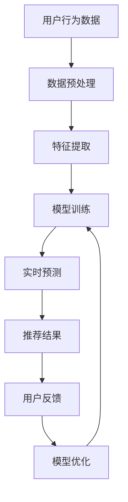

                 

# 《AI大模型在电商搜索推荐中的实时推荐策略：抓住用户需求的瞬息变化》

## 关键词：
- AI大模型
- 电商搜索推荐
- 实时推荐
- 用户需求预测
- 深度学习

## 摘要：
本文详细探讨了AI大模型在电商搜索推荐中的应用，特别是实时推荐策略。通过分析用户需求的瞬息变化，本文提出了基于AI大模型的实时推荐框架，包括数据处理、模型构建、实时预测和响应机制。此外，本文还通过实际案例展示了如何利用深度学习技术实现高效、精准的电商搜索推荐系统。

---

### 《AI大模型在电商搜索推荐中的实时推荐策略：抓住用户需求的瞬息变化》目录大纲

----------------------------------------------------------------

# 第一部分：AI大模型与电商搜索推荐基础

## 第1章：AI大模型简介
### 1.1 AI大模型概述
### 1.2 AI大模型的技术基础
### 1.3 AI大模型的应用场景
### 1.4 AI大模型应用中的挑战与机遇
### 1.5 总结

## 第2章：电商搜索推荐系统基础
### 2.1 电商搜索推荐系统概述
### 2.2 用户行为数据收集与处理
### 2.3 电商搜索推荐算法基础
### 2.4 电商搜索推荐系统的实现
### 2.5 电商搜索推荐系统的挑战与机遇
### 2.6 总结

# 第二部分：AI大模型在电商搜索推荐中的应用

## 第3章：AI大模型在电商搜索推荐中的实时推荐策略
### 3.1 实时推荐策略概述
### 3.2 AI大模型在实时推荐中的应用
### 3.3 实时推荐策略的实现
### 3.4 用户需求的瞬息变化
### 3.5 基于AI的大模型需求预测
### 3.6 用户需求变化的实时响应
### 3.7 实时推荐策略的案例分析
### 3.8 总结

## 第4章：用户需求的瞬息变化
### 4.1 用户需求的特征分析
### 4.2 基于AI的大模型需求预测
### 4.3 用户需求变化的实时响应
### 4.4 用户需求变化的影响因素分析
### 4.5 用户需求变化的案例分析
### 4.6 总结

# 第三部分：项目实战与代码实现

## 第5章：电商搜索推荐系统的开发与优化
### 5.1 电商搜索推荐系统的搭建
### 5.2 实时推荐策略的代码实现
### 5.3 用户需求预测的代码实现
### 5.4 实时推荐策略的调优
### 5.5 用户需求预测的调优
### 5.6 电商搜索推荐系统的性能优化
### 5.7 总结

## 第6章：性能优化与调优
### 6.1 系统性能优化
### 6.2 实时推荐策略的调优
### 6.3 用户需求预测的调优
### 6.4 案例分析
### 6.5 总结

## 附录：相关资源与工具
### 附录 A：AI大模型开发工具
### 附录 B：电商搜索推荐系统开源项目

### 第1章: AI大模型简介

## 1.1 AI大模型概述

AI大模型，即具有千亿甚至万亿参数的深度学习模型，是近年来人工智能领域的重大突破。这类模型通过在大规模数据集上进行预训练，能够自动提取复杂的特征，实现出色的表现。

### 1.1.1 AI大模型的定义

AI大模型通常指的是基于深度学习技术的神经网络模型，具有以下特点：

- **大规模参数**：模型的参数数量达到亿级甚至千亿级。
- **预训练**：模型在大规模数据集上进行预训练，以获取丰富的知识。
- **多任务能力**：大模型能够处理多种类型的任务，如文本生成、图像识别等。

### 1.1.2 AI大模型的发展历程

AI大模型的发展历程可以分为以下几个阶段：

- **初期**：以单层感知机和简单的神经网络为主，无法处理复杂任务。
- **发展期**：以多层感知机（MLP）和卷积神经网络（CNN）为代表，神经网络开始应用于图像识别和语音识别等领域。
- **突破期**：以GPT、BERT等为代表的大模型出现，模型参数数量达到千亿级，实现了在多种任务上的突破。

## 1.2 AI大模型的技术基础

AI大模型的技术基础主要包括神经网络、深度学习、自然语言处理等领域。

### 1.2.1 神经网络与深度学习基础

神经网络是AI大模型的核心，其基本结构包括：

- **输入层**：接收外部输入数据。
- **隐藏层**：对输入数据进行特征提取和变换。
- **输出层**：输出最终结果。

深度学习是基于神经网络的更复杂的学习方法，其核心思想是多层神经网络可以自动提取数据的特征。

### 1.2.2 自然语言处理技术

自然语言处理（NLP）是AI大模型的重要应用领域。NLP技术包括：

- **词嵌入**：将文本数据转换为数值表示，为深度学习模型处理提供输入。
- **序列模型**：如循环神经网络（RNN）和变换器模型（Transformer），用于处理序列数据。
- **注意力机制**：在序列模型中用于计算序列中各个元素之间的依赖关系。

## 1.3 AI大模型的应用场景

AI大模型在多个领域具有广泛的应用，其中在电商搜索推荐中，其作用尤为重要。

### 1.3.1 AI大模型在电商搜索推荐中的应用

AI大模型在电商搜索推荐中的应用主要包括：

- **用户行为数据理解**：通过深度学习模型，从用户的历史行为数据中提取出有价值的特征，帮助推荐系统更好地理解用户需求。
- **商品特征提取**：利用深度学习模型，从商品数据中提取出关键特征，如商品的标签、描述、属性等，为推荐算法提供支持。
- **用户需求预测**：通过深度学习模型，预测用户未来的购买行为和需求，从而实现更精准的实时推荐。

### 1.3.2 用户需求的瞬息变化

用户需求具有瞬息变化的特点，例如：

- **短期趋势**：用户在短时间内对某些商品的需求量可能会突然增加或减少，如节假日对礼品类商品的需求。
- **长期趋势**：用户对某些商品的需求可能会随着时间的推移发生变化，如随着健康意识的提高，对健康食品的需求增加。
- **季节性趋势**：用户在某些特定时间对某些商品的需求会有明显的季节性变化，如夏季对防晒用品的需求增加。

### 1.3.3 AI大模型在其他电商应用场景

AI大模型在其他电商应用场景中也有广泛的应用，如：

- **搜索引擎优化**：通过AI大模型优化搜索结果，提高用户满意度。
- **客户服务**：利用AI大模型提供智能客服，提高服务质量。
- **供应链优化**：通过AI大模型优化库存管理，降低成本。

## 1.4 AI大模型应用中的挑战与机遇

### 1.4.1 挑战

AI大模型在应用过程中面临以下挑战：

- **计算资源需求**：训练和部署AI大模型需要大量的计算资源。
- **数据隐私与安全**：大量用户数据的收集和处理可能引发隐私和安全问题。
- **模型解释性**：AI大模型的黑箱特性使得结果难以解释和理解。

### 1.4.2 机遇

AI大模型在应用过程中也带来了以下机遇：

- **提高推荐准确性**：AI大模型能够更好地理解用户需求，提高推荐效果。
- **拓展应用领域**：AI大模型可以应用于更多领域，如医疗、金融等。
- **促进产业升级**：AI大模型的应用可以推动传统产业的升级和转型。

## 1.5 总结

AI大模型在电商搜索推荐中的实时推荐策略具有巨大潜力。通过深入研究和实践，我们可以更好地利用AI大模型的优势，为用户提供更加精准和个性化的推荐服务。

## 1.6 Mermaid 流程图

下面是AI大模型在电商搜索推荐中的应用流程的Mermaid流程图：



## 1.7 伪代码

下面是用户行为数据处理和模型训练的伪代码：

```python
# 伪代码：用户行为数据处理
def preprocess_data(user_data):
    # 清洗数据
    cleaned_data = clean_data(user_data)
    
    # 特征提取
    features = extract_features(cleaned_data)
    
    return features

# 伪代码：模型训练
def train_model(features, labels):
    # 构建模型
    model = build_model()
    
    # 训练模型
    model.fit(features, labels)
    
    return model
```

## 1.8 数学模型和公式详解

在AI大模型的应用中，数学模型和公式起到了至关重要的作用。以下是一些核心的数学模型和公式：

### 1.8.1 深度学习模型

深度学习模型的核心是多层感知机（MLP），其数学模型如下：

$$
y = \sigma(W \cdot x + b)
$$

其中，$y$ 是输出，$x$ 是输入，$W$ 是权重，$b$ 是偏置，$\sigma$ 是激活函数，通常使用 Sigmoid 或ReLU 函数。

### 1.8.2 自然语言处理

在自然语言处理中，词嵌入是一个重要的步骤。常用的词嵌入模型有 Word2Vec 和 GloVe，其公式如下：

- **Word2Vec**：

$$
\vec{v}_i = \frac{1}{\| \vec{v}_i \|} \sum_{j \in C(i)} \vec{v}_j e^{f(j) / t}
$$

其中，$\vec{v}_i$ 是词 $i$ 的向量表示，$C(i)$ 是与词 $i$ 相关的词集合，$f(j)$ 是词 $j$ 的频率，$t$ 是滑动窗口大小。

- **GloVe**：

$$
\vec{v}_i = \frac{\vec{r}_i}{1 + \frac{1}{z_i}}
$$

其中，$\vec{r}_i$ 是词 $i$ 的稀疏向量表示，$z_i$ 是词 $i$ 的上下文词频率。

### 1.8.3 用户需求预测

用户需求预测通常使用时间序列模型，如 ARIMA 或 LSTM。以下是一个简单的 LSTM 模型的公式：

$$
h_t = \sigma(W_h \cdot [h_{t-1}, x_t] + b_h)
$$

$$
o_t = \sigma(W_o \cdot h_t + b_o)
$$

其中，$h_t$ 是隐藏状态，$x_t$ 是输入数据，$o_t$ 是输出预测，$W_h$ 和 $W_o$ 是权重矩阵，$b_h$ 和 $b_o$ 是偏置项，$\sigma$ 是激活函数。

## 1.9 代码实际案例和详细解释说明

在本节中，我们将通过一个实际案例来介绍如何使用深度学习框架（如 TensorFlow 或 PyTorch）来实现一个简单的电商搜索推荐系统。

### 1.9.1 开发环境搭建

首先，我们需要安装深度学习框架和相关库。以下是使用 TensorFlow 的安装步骤：

```bash
pip install tensorflow
```

### 1.9.2 源代码详细实现

以下是一个简单的电商搜索推荐系统的实现，包括数据预处理、模型构建和训练。

```python
import tensorflow as tf
from tensorflow.keras.models import Sequential
from tensorflow.keras.layers import Dense, LSTM, Embedding
from tensorflow.keras.optimizers import Adam

# 数据预处理
# 假设 data 是用户行为数据的 DataFrame，包括用户 ID、商品 ID、事件类型和时间戳
user_ids = data['user_id'].unique()
product_ids = data['product_id'].unique()

# 构建词汇表
vocab_size = len(user_ids) + len(product_ids) + 1
user_embedding = Embedding(vocab_size, 32)
product_embedding = Embedding(vocab_size, 32)

# 构建

