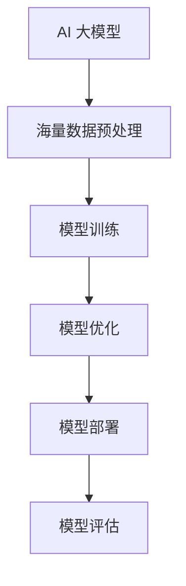
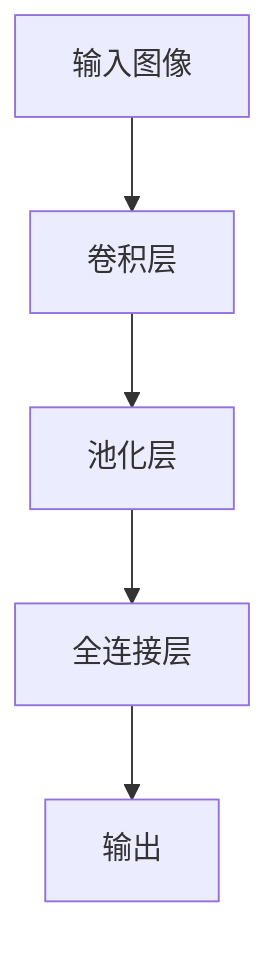
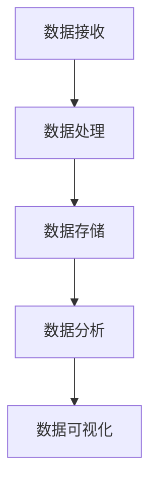
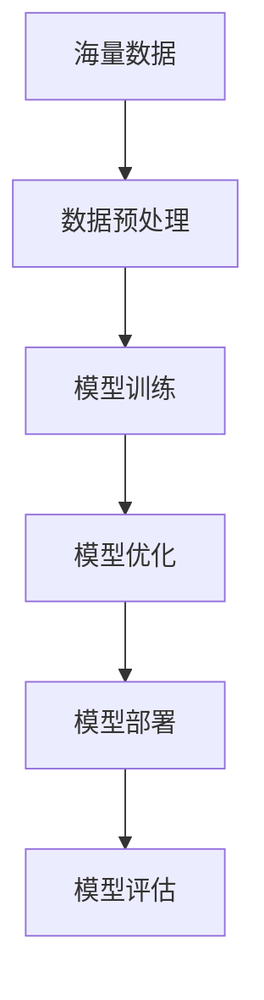
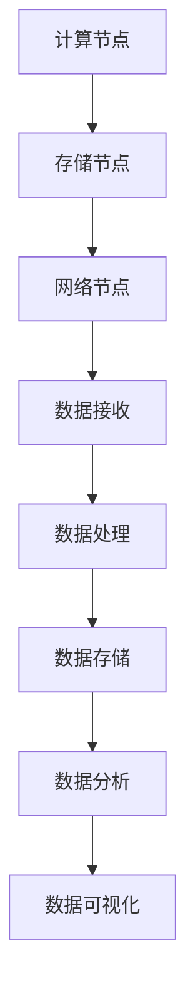

                 

# 《AI 大模型应用数据中心建设：数据中心安全与可靠性》

## 概述

> **关键词：** AI 大模型，数据中心，安全，可靠性，深度学习，自然语言处理，预训练模型。

> **摘要：** 
随着人工智能（AI）技术的快速发展，大模型的应用日益广泛，数据中心作为承载这些模型运行的重要基础设施，其安全与可靠性尤为重要。本文将详细介绍 AI 大模型应用数据中心的建设，重点分析数据中心的安全与可靠性保障策略，为实际项目提供理论依据和实用指南。

## 第一部分: AI 大模型应用基础

### 第1章: AI 大模型概述

#### 1.1 AI 大模型的概念与特点

##### 1.1.1 AI 大模型的概念

AI 大模型是指具有强大表示和学习能力的深度学习模型，通常包含数亿甚至数十亿个参数。这些模型通过训练能够处理大量数据，提取复杂特征，并在各种任务中取得优异的性能。AI 大模型的核心在于“大”，即规模庞大，这使得它们具有处理复杂数据和解决难题的能力。

**Mermaid 流程图：**


##### 1.1.2 AI 大模型的特点

AI 大模型具有以下几个显著特点：

1. **参数数量多**：大模型通常包含数亿甚至数十亿个参数，这使得模型能够捕捉到更多数据中的复杂模式。
2. **训练数据量大**：大模型需要大量的训练数据来保证模型的泛化能力。
3. **计算资源需求高**：大模型的训练和部署需要大量的计算资源和存储空间。
4. **自适应性强**：大模型可以通过训练不断优化自身，以适应不同的任务和数据集。
5. **泛化能力强**：大模型能够从大量数据中学习到通用的特征，从而在新的数据集上表现出色。

**伪代码：**
```python
def AI_large_model(data_set):
    # 数据预处理
    preprocessed_data = preprocess_data(data_set)
    
    # 模型训练
    model = train_model(preprocessed_data)
    
    # 模型优化
    optimized_model = optimize_model(model, preprocessed_data)
    
    # 模型部署
    deployed_model = deploy_model(optimized_model)
    
    # 模型评估
    evaluation_results = evaluate_model(deployed_model)
    
    return evaluation_results
```

### 第2章: AI 大模型技术基础

#### 2.1 深度学习基础

##### 2.1.1 深度学习的基本原理

深度学习是一种基于多层神经网络的学习方法，通过多层的非线性变换来提取数据中的特征。深度学习模型的核心在于多层神经网络，每一层都能够提取更高层次的特征。

**数学模型：**
$$
y = \sigma(W \cdot x + b)
$$

**举例说明：**
假设有一个简单的深度学习模型，输入为 $x$，输出为 $y$。权重矩阵 $W$ 和偏置 $b$ 是模型参数，激活函数 $\sigma$ 通常为 sigmoid 函数。

**伪代码：**
```python
def deep_learning_model(x, W, b):
    z = W * x + b
    y = sigmoid(z)
    return y
```

##### 2.1.2 卷积神经网络

卷积神经网络（CNN）是一种专门用于处理图像数据的深度学习模型，通过卷积和池化操作来提取图像中的特征。

**Mermaid 流程图：**


##### 2.1.3 循环神经网络

循环神经网络（RNN）是一种用于处理序列数据的深度学习模型，通过记忆单元来处理序列中的依赖关系。

**数学公式：**
$$
h_t = \sigma(W_h \cdot [h_{t-1}, x_t] + b_h)
$$

**伪代码：**
```python
def RNN(x, h_prev, W_h, b_h):
    combined = [h_prev, x]
    h_t = sigmoid(W_h * combined + b_h)
    return h_t
```

#### 2.2 自然语言处理

##### 2.2.1 词嵌入技术

词嵌入是将自然语言中的单词映射为固定大小的向量，从而将文本数据转化为机器学习模型可以处理的数字形式。

**数学公式：**
$$
\text{Embedding}(x) = \text{Vector}[x]
$$

**举例说明：**
词嵌入是将单词映射为固定大小的向量。例如，单词 "猫" 可能被映射为向量 `[1, 0, -1]`。

**伪代码：**
```python
def word_embedding(word):
    # 假设 word_embedding_dict 存储了词向量
    return word_embedding_dict[word]
```

##### 2.2.2 语言模型

语言模型是一种用于预测下一个单词或字符的概率分布的模型，它基于大量文本数据训练得到。

**数学公式：**
$$
P(\text{sentence}) = \prod_{\text{word} \in \text{sentence}} P(\text{word})
$$

**伪代码：**
```python
def language_model(sentence):
    probabilities = []
    for word in sentence:
        probability = get_word_probability(word)
        probabilities.append(probability)
    return product(probabilities)
```

##### 2.3 预训练模型

预训练模型是指在大规模数据集上预先训练好的模型，可以在特定任务上进一步微调以获得更好的性能。

**伪代码：**
```python
def pretrain_model(data):
    # 使用大量无标签数据预训练模型
    model = train_model(data)
    return model

def fine_tuning(pretrained_model, new_data):
    # 微调预训练模型
    pretrained_model.train()
    optimizer = optim.Adam(pretrained_model.parameters(), lr=0.001)
    
    for epoch in range(num_epochs):
        optimizer.zero_grad()
        outputs = pretrained_model(new_data)
        loss = criterion(outputs, labels)
        loss.backward()
        optimizer.step()
```

### 第3章: AI 大模型应用领域

#### 3.1 图像识别

##### 3.1.1 卷积神经网络

卷积神经网络（CNN）在图像识别任务中表现出色，它通过卷积和池化操作提取图像中的特征。

**Mermaid 流程图：**


#### 3.2 自然语言处理

##### 3.2.1 语言模型

语言模型在自然语言处理任务中用于预测下一个单词或字符的概率分布，从而实现文本生成、机器翻译等功能。

**数学公式：**
$$
P(\text{sentence}) = \prod_{\text{word} \in \text{sentence}} P(\text{word})
$$

**伪代码：**
```python
def language_model(sentence):
    probabilities = []
    for word in sentence:
        probability = get_word_probability(word)
        probabilities.append(probability)
    return product(probabilities)
```

#### 3.3 语音识别

##### 3.3.1 循环神经网络

循环神经网络（RNN）在语音识别任务中通过处理语音信号序列来识别语音。

**数学公式：**
$$
h_t = \sigma(W_h \cdot [h_{t-1}, x_t] + b_h)
$$

**伪代码：**
```python
def RNN(x, h_prev, W_h, b_h):
    combined = [h_prev, x]
    h_t = sigmoid(W_h * combined + b_h)
    return h_t
```

### 第4章: AI 大模型项目实战

#### 4.1 数据中心建设

##### 4.1.1 数据中心架构设计

数据中心的建设是一个复杂的过程，涉及硬件、软件、网络等多个方面。以下是一个基本的数据中心架构设计。

**Mermaid 流程图：**


##### 4.1.2 数据中心安全与可靠性

数据中心的可靠性和安全性是保障业务连续性的关键。以下是一些常见的安全和可靠性保障策略：

- **数据加密**：对数据进行加密，确保数据在传输和存储过程中不被窃取或篡改。
- **防火墙与入侵检测**：配置防火墙和入侵检测系统，监控网络流量，防止恶意攻击。
- **冗余设计**：通过硬件和网络的冗余设计，提高系统的可靠性，确保数据不丢失。
- **备份与恢复**：定期进行数据备份，确保在灾难发生时能够快速恢复数据。

**数学公式：**
$$
\text{Reliability} = \frac{\text{Time of operation}}{\text{Total time}}
$$

**伪代码：**
```python
def reliability_ensure(data_center):
    # 设计冗余系统
    redundant_system = design_redundant_system(data_center)
    # 检测系统故障
    monitor_system_health(redundant_system)
    # 快速切换到冗余系统
    switch_to_redundant_system_if_failure(redundant_system)
```

## 第二部分: 数据中心建设

### 第3章: 数据中心架构与设计

#### 3.1 数据中心基础架构

数据中心的基础架构包括硬件、软件和网络三个主要组成部分。以下是一个基本的数据中心基础架构设计。

**Mermaid 流程图：**


**数学公式：**
$$
\text{硬件配置} = \text{CPU} + \text{内存} + \text{存储} + \text{网络设备}
$$

**伪代码：**
```python
def hardware_design():
    # 配置 CPU
    cpu_cores = 64
    # 配置内存
    memory_size = 512
    # 配置存储
    storage_size = 1000
    # 配置网络设备
    network_devices = '10Gbps'
    return {
        'cpu_cores': cpu_cores,
        'memory_size': memory_size,
        'storage_size': storage_size,
        'network_devices': network_devices
    }
```

#### 3.2 数据中心网络架构

数据中心的网络架构设计至关重要，它决定了数据中心的性能和可靠性。以下是一个基本的数据中心网络架构设计。

**伪代码：**
```python
def network_design(principles):
    # 设计网络拓扑
    topology = 'Mesh'
    # 确定网络带宽
    bandwidth = '10Gbps'
    # 实现冗余连接
    redundancy = 'Active-Active'
    return {
        'topology': topology,
        'bandwidth': bandwidth,
        'redundancy': redundancy
    }
```

### 第4章: 数据中心安全

#### 4.1 安全威胁与防护措施

数据中心面临的安全威胁多种多样，包括网络攻击、数据泄露、恶意软件等。以下是一些常见的安全威胁和相应的防护措施。

**伪代码：**
```python
def common_threats():
    threats = ['DDoS攻击', '数据泄露', '恶意软件', '未授权访问']
    return threats

def security_measures():
    measures = {
        '防火墙': '防止未授权访问',
        '入侵检测系统': '监测网络流量',
        '数据加密': '保护数据传输'
    }
    return measures
```

#### 4.2 安全策略与审计

数据中心的安全策略是确保数据中心安全的关键。以下是一个基本的安全策略制定和审计流程。

**伪代码：**
```python
def security_policy():
    policy = {
        '用户认证': '多因素认证',
        '数据访问控制': '基于角色的访问控制',
        '日志记录': '记录所有操作'
    }
    return policy

def security_audit():
    # 检查安全策略
    check_security_policy()
    # 检查漏洞
    check_vulnerabilities()
    # 检查合规性
    check_compliance()
```

### 第5章: 数据中心可靠性

#### 5.1 故障类型与处理

数据中心可能面临多种故障类型，包括硬件故障、软件故障、网络故障和电源故障等。以下是一些常见的故障类型和处理流程。

**伪代码：**
```python
def common_fault_types():
    fault_types = ['硬件故障', '软件故障', '网络故障', '电源故障']
    return fault_types

def fault_handling():
    # 检测故障
    detect_fault()
    # 诊断故障
    diagnose_fault()
    # 恢复系统
    recover_system()
```

#### 5.2 系统冗余与备份

数据中心的可靠性还依赖于系统冗余和备份策略。以下是一个基本的系统冗余和备份策略。

**数学公式：**
$$
\text{Reliability} = \frac{\text{Time of operation}}{\text{Total time}}
$$

**伪代码：**
```python
def system_redundancy():
    # 实现硬件冗余
    hardware_redundancy = 'RAID 10'
    # 实现网络冗余
    network_redundancy = 'Load Balancing'
    return {
        'hardware_redundancy': hardware_redundancy,
        'network_redundancy': network_redundancy
    }

def backup_strategy():
    # 定期备份
    schedule_regular_backup()
    # 远程备份
    implement_remote_backup()
    # 备份验证
    verify_backup_data()
```

### 第6章: 数据中心运维与管理

#### 6.1 运维流程

数据中心的运维是一个持续的过程，包括系统监控、故障处理、升级与维护等。

**伪代码：**
```python
def operations流程设计():
    # 系统监控
    system_monitoring()
    # 故障处理
    fault_handling()
    # 升级与维护
    upgrade_and_maintenance()
```

#### 6.2 性能优化

数据中心性能的优化是提高数据中心效率和减少运营成本的关键。以下是一些常见的性能优化方法。

**伪代码：**
```python
def performance_optimization():
    # 系统调优
    system_tuning()
    # 资源分配优化
    resource_allocation_optimization()
    # 网络优化
    network_optimization()
```

#### 6.3 管理策略

数据中心的成功运营离不开有效的管理策略。以下是一个基本的管理策略制定。

**伪代码：**
```python
def management_strategy():
    strategy = {
        '人员管理': '分工明确',
        '流程管理': '标准化流程',
        '风险管理': '提前识别与预防'
    }
    return strategy
```

## 第三部分: AI 大模型与数据中心整合

### 第7章: AI 大模型在数据中心的应用

#### 7.1 AI 大模型在数据中心的优势

AI 大模型在数据中心的应用具有以下优势：

- **高效数据处理**：AI 大模型能够快速处理大量数据，提高数据中心的数据处理效率。
- **自动化运维**：AI 大模型可以通过自动化算法优化数据中心的运维流程，降低人力成本。
- **智能故障预测**：AI 大模型可以通过数据分析和预测模型，提前发现潜在故障，降低系统停机风险。

**伪代码：**
```python
def ai_in_data_center_advantages():
    advantages = {
        '数据处理': '高效',
        '运维自动化': '降低人力成本',
        '故障预测': '提前预警'
    }
    return advantages
```

#### 7.2 数据中心安全与可靠性

AI 大模型在数据中心的安全和可靠性方面也发挥着重要作用：

- **安全防护**：AI 大模型可以通过智能算法检测和防御网络攻击，提高数据中心的网络安全水平。
- **故障恢复**：AI 大模型可以通过故障预测和自动化恢复策略，提高数据中心的可靠性。

**伪代码：**
```python
def ai_in_data_center_security():
    # 使用 AI 大模型检测入侵行为
    detect_intrusion_behavior()
    # 使用 AI 大模型进行漏洞扫描
    vulnerability_scanning()

def ai_in_data_center_reliability():
    # 使用 AI 大模型预测系统故障
    predict_system_fault()
    # 使用 AI 大模型优化数据中心能源消耗
    optimize_energy_consumption()
```

### 第8章: 数据中心未来发展趋势

#### 8.1 大模型对数据中心架构的影响

随着 AI 大模型的发展，数据中心架构将面临以下影响：

- **计算资源需求增加**：大模型训练和推理需要更多的计算资源，数据中心需要提供更强大的计算能力。
- **数据传输速度提升**：大模型处理需要大量数据，数据中心需要提高数据传输速度。
- **智能运维管理**：数据中心将更加依赖 AI 大模型进行智能运维管理，提高运维效率。

**数学公式：**
$$
\text{Resource Demand} = \text{Model Size} \times \text{Data Volume}
$$

**伪代码：**
```python
def resource_demand(model_size, data_volume):
    return model_size * data_volume
```

#### 8.2 数据中心智能化与自动化

数据中心未来的发展趋势是智能化与自动化：

- **自动化部署**：数据中心将实现自动化部署，减少人工干预。
- **智能故障预测**：数据中心将利用 AI 大模型进行智能故障预测，提前预防故障。
- **智能资源调度**：数据中心将实现智能资源调度，优化资源利用率。

**伪代码：**
```python
def intelligent_data_center():
    # 自动化运维
    automate_operations()
    # 智能故障预测
    intelligent_fault_prediction()
    # 智能资源调度
    intelligent_resource_scheduling()

def automated_data_center():
    # 自动化部署
    automate_deployment()
    # 自动化备份
    automate_backup()
    # 自动化监控
    automate_monitoring()
```

## 附录

#### 附录 A: AI 大模型开发资源

##### A.1 主流深度学习框架

以下介绍两种主流深度学习框架：TensorFlow 和 PyTorch。

**A.1.1 TensorFlow**

TensorFlow 是由 Google 开发的一个开源深度学习框架，具有强大的功能和广泛的应用。

**伪代码：**
```python
import tensorflow as tf

model = tf.keras.Sequential([
    tf.keras.layers.Dense(units=128, activation='relu', input_shape=(784,)),
    tf.keras.layers.Dense(units=10, activation='softmax')
])

model.compile(optimizer='adam', loss='categorical_crossentropy', metrics=['accuracy'])
```

**A.1.2 PyTorch**

PyTorch 是由 Facebook 开发的一个开源深度学习框架，以其灵活性和易用性著称。

**伪代码：**
```python
import torch
import torch.nn as nn
import torch.optim as optim

model = nn.Sequential(nn.Linear(784, 128), nn.ReLU(), nn.Linear(128, 10))

optimizer = optim.Adam(model.parameters(), lr=0.001)
criterion = nn.CrossEntropyLoss()

# 训练模型
for epoch in range(num_epochs):
    optimizer.zero_grad()
    outputs = model(x)
    loss = criterion(outputs, y)
    loss.backward()
    optimizer.step()
```

## 作者

**作者：** AI 天才研究院/AI Genius Institute & 禅与计算机程序设计艺术 /Zen And The Art of Computer Programming**文章标题**: AI 大模型应用数据中心建设：数据中心安全与可靠性

**关键词**: AI 大模型，数据中心，安全，可靠性，深度学习，自然语言处理，预训练模型

**摘要**: 随着人工智能（AI）技术的快速发展，大模型的应用日益广泛，数据中心作为承载这些模型运行的重要基础设施，其安全与可靠性尤为重要。本文将详细介绍 AI 大模型应用数据中心的建设，重点分析数据中心的安全与可靠性保障策略，为实际项目提供理论依据和实用指南。

## 第一部分: AI 大模型应用基础

### 第1章: AI 大模型概述

AI 大模型是指具有强大表示和学习能力的深度学习模型，通常包含数亿甚至数十亿个参数。这些模型通过训练能够处理大量数据，提取复杂特征，并在各种任务中取得优异的性能。AI 大模型的核心在于“大”，即规模庞大，这使得它们具有处理复杂数据和解决难题的能力。

#### 1.1 AI 大模型的概念与特点

##### 1.1.1 AI 大模型的概念

AI 大模型是指具有强大表示和学习能力的深度学习模型，通常包含数亿甚至数十亿个参数。这些模型通过训练能够处理大量数据，提取复杂特征，并在各种任务中取得优异的性能。AI 大模型的核心在于“大”，即规模庞大，这使得它们具有处理复杂数据和解决难题的能力。

**Mermaid 流程图：**


##### 1.1.2 AI 大模型的特点

AI 大模型具有以下几个显著特点：

1. **参数数量多**：大模型通常包含数亿甚至数十亿个参数，这使得模型能够捕捉到更多数据中的复杂模式。
2. **训练数据量大**：大模型需要大量的训练数据来保证模型的泛化能力。
3. **计算资源需求高**：大模型的训练和部署需要大量的计算资源和存储空间。
4. **自适应性强**：大模型可以通过训练不断优化自身，以适应不同的任务和数据集。
5. **泛化能力强**：大模型能够从大量数据中学习到通用的特征，从而在新的数据集上表现出色。

**伪代码：**
```python
def AI_large_model(data_set):
    # 数据预处理
    preprocessed_data = preprocess_data(data_set)
    
    # 模型训练
    model = train_model(preprocessed_data)
    
    # 模型优化
    optimized_model = optimize_model(model, preprocessed_data)
    
    # 模型部署
    deployed_model = deploy_model(optimized_model)
    
    # 模型评估
    evaluation_results = evaluate_model(deployed_model)
    
    return evaluation_results
```

### 第2章: AI 大模型技术基础

#### 2.1 深度学习基础

##### 2.1.1 深度学习的基本原理

深度学习是一种基于多层神经网络的学习方法，通过多层的非线性变换来提取数据中的特征。深度学习模型的核心在于多层神经网络，每一层都能够提取更高层次的特征。

**数学模型：**
$$
y = \sigma(W \cdot x + b)
$$

**举例说明：**
假设有一个简单的深度学习模型，输入为 $x$，输出为 $y$。权重矩阵 $W$ 和偏置 $b$ 是模型参数，激活函数 $\sigma$ 通常为 sigmoid 函数。

**伪代码：**
```python
def deep_learning_model(x, W, b):
    z = W * x + b
    y = sigmoid(z)
    return y
```

##### 2.1.2 卷积神经网络

卷积神经网络（CNN）是一种专门用于处理图像数据的深度学习模型，通过卷积和池化操作来提取图像中的特征。

**Mermaid 流程图：**


##### 2.1.3 循环神经网络

循环神经网络（RNN）是一种用于处理序列数据的深度学习模型，通过记忆单元来处理序列中的依赖关系。

**数学公式：**
$$
h_t = \sigma(W_h \cdot [h_{t-1}, x_t] + b_h)
$$

**伪代码：**
```python
def RNN(x, h_prev, W_h, b_h):
    combined = [h_prev, x]
    h_t = sigmoid(W_h * combined + b_h)
    return h_t
```

#### 2.2 自然语言处理

##### 2.2.1 词嵌入技术

词嵌入是将自然语言中的单词映射为固定大小的向量，从而将文本数据转化为机器学习模型可以处理的数字形式。

**数学公式：**
$$
\text{Embedding}(x) = \text{Vector}[x]
$$

**举例说明：**
词嵌入是将单词映射为固定大小的向量。例如，单词 "猫" 可能被映射为向量 `[1, 0, -1]`。

**伪代码：**
```python
def word_embedding(word):
    # 假设 word_embedding_dict 存储了词向量
    return word_embedding_dict[word]
```

##### 2.2.2 语言模型

语言模型是一种用于预测下一个单词或字符的概率分布的模型，它基于大量文本数据训练得到。

**数学公式：**
$$
P(\text{sentence}) = \prod_{\text{word} \in \text{sentence}} P(\text{word})
$$

**伪代码：**
```python
def language_model(sentence):
    probabilities = []
    for word in sentence:
        probability = get_word_probability(word)
        probabilities.append(probability)
    return product(probabilities)
```

##### 2.3 预训练模型

预训练模型是指在大规模数据集上预先训练好的模型，可以在特定任务上进一步微调以获得更好的性能。

**伪代码：**
```python
def pretrain_model(data):
    # 使用大量无标签数据预训练模型
    model = train_model(data)
    return model

def fine_tuning(pretrained_model, new_data):
    # 微调预训练模型
    pretrained_model.train()
    optimizer = optim.Adam(pretrained_model.parameters(), lr=0.001)
    
    for epoch in range(num_epochs):
        optimizer.zero_grad()
        outputs = pretrained_model(new_data)
        loss = criterion(outputs, labels)
        loss.backward()
        optimizer.step()
```

### 第3章: AI 大模型应用领域

#### 3.1 图像识别

##### 3.1.1 卷积神经网络

卷积神经网络（CNN）在图像识别任务中表现出色，它通过卷积和池化操作提取图像中的特征。

**Mermaid 流程图：**


##### 3.1.2 应用案例

图像识别的应用非常广泛，包括人脸识别、车牌识别、物体检测等。

**伪代码：**
```python
def image_recognition(image):
    # 数据预处理
    preprocessed_image = preprocess_image(image)
    
    # 模型预测
    model = load_model('image_recognition_model.h5')
    prediction = model.predict(preprocessed_image)
    
    # 输出结果
    return prediction
```

#### 3.2 自然语言处理

##### 3.2.1 语言模型

语言模型在自然语言处理任务中用于预测下一个单词或字符的概率分布，从而实现文本生成、机器翻译等功能。

**数学公式：**
$$
P(\text{sentence}) = \prod_{\text{word} \in \text{sentence}} P(\text{word})
$$

**伪代码：**
```python
def language_model(sentence):
    probabilities = []
    for word in sentence:
        probability = get_word_probability(word)
        probabilities.append(probability)
    return product(probabilities)
```

##### 3.2.2 应用案例

自然语言处理的应用包括语音助手、文本分类、情感分析等。

**伪代码：**
```python
def natural_language_processing(text):
    # 数据预处理
    preprocessed_text = preprocess_text(text)
    
    # 模型预测
    model = load_model('natural_language_model.h5')
    prediction = model.predict(preprocessed_text)
    
    # 输出结果
    return prediction
```

#### 3.3 语音识别

##### 3.3.1 循环神经网络

循环神经网络（RNN）在语音识别任务中通过处理语音信号序列来识别语音。

**数学公式：**
$$
h_t = \sigma(W_h \cdot [h_{t-1}, x_t] + b_h)
$$

**伪代码：**
```python
def RNN(x, h_prev, W_h, b_h):
    combined = [h_prev, x]
    h_t = sigmoid(W_h * combined + b_h)
    return h_t
```

##### 3.3.2 应用案例

语音识别的应用包括语音助手、语音翻译、语音识别等。

**伪代码：**
```python
def voice_recognition(audio):
    # 数据预处理
    preprocessed_audio = preprocess_audio(audio)
    
    # 模型预测
    model = load_model('voice_recognition_model.h5')
    prediction = model.predict(preprocessed_audio)
    
    # 输出结果
    return prediction
```

### 第4章: AI 大模型项目实战

#### 4.1 数据中心建设

##### 4.1.1 数据中心架构设计

数据中心的建设是一个复杂的过程，涉及硬件、软件、网络等多个方面。以下是一个基本的数据中心架构设计。

**Mermaid 流程图：**


**伪代码：**
```python
def data_center_architecture():
    # 数据接收模块
    data_reception_module = create_data_reception_module()
    
    # 数据处理模块
    data_processing_module = create_data_processing_module()
    
    # 数据存储模块
    data_storage_module = create_data_storage_module()
    
    # 数据分析模块
    data_analysis_module = create_data_analysis_module()
    
    # 数据可视化模块
    data_visualization_module = create_data_visualization_module()
    
    # 模块连接
    connect_modules(data_reception_module, data_processing_module)
    connect_modules(data_processing_module, data_storage_module)
    connect_modules(data_storage_module, data_analysis_module)
    connect_modules(data_analysis_module, data_visualization_module)
```

##### 4.1.2 数据中心安全与可靠性

数据中心的可靠性和安全性是保障业务连续性的关键。以下是一些常见的安全和可靠性保障策略：

- **数据加密**：对数据进行加密，确保数据在传输和存储过程中不被窃取或篡改。
- **防火墙与入侵检测**：配置防火墙和入侵检测系统，监控网络流量，防止恶意攻击。
- **冗余设计**：通过硬件和网络的冗余设计，提高系统的可靠性，确保数据不丢失。
- **备份与恢复**：定期进行数据备份，确保在灾难发生时能够快速恢复数据。

**数学公式：**
$$
\text{Reliability} = \frac{\text{Time of operation}}{\text{Total time}}
$$

**伪代码：**
```python
def data_center_security():
    # 数据加密
    encrypt_data()
    
    # 防火墙与入侵检测
    configure_firewall()
    configure_intrusion_detection()
    
    # 冗余设计
    implement_redundant_system()
    
    # 备份与恢复
    schedule_backup()
    implement_data_recovery()
```

#### 4.2 数据中心建设案例

以下是一个具体的数据中心建设案例。

**案例描述**：某企业计划建设一个大型数据中心，用于存储和处理大量数据。

**步骤**：

1. **需求分析**：分析企业的数据需求，确定数据中心的规模和功能。
2. **硬件采购**：采购服务器、存储设备、网络设备等硬件。
3. **软件安装**：安装操作系统、数据库管理系统、应用软件等。
4. **网络配置**：配置网络设备，确保数据传输高效、安全。
5. **安全部署**：部署防火墙、入侵检测系统、加密软件等安全措施。
6. **测试与调试**：对数据中心进行测试和调试，确保系统稳定运行。
7. **培训与维护**：对运维人员进行培训，制定维护计划。

**伪代码：**
```python
def data_center_project():
    # 需求分析
    analyze_requirements()
    
    # 硬件采购
    purchase_hardware()
    
    # 软件安装
    install_software()
    
    # 网络配置
    configure_network()
    
    # 安全部署
    deploy_security_measures()
    
    # 测试与调试
    test_and_debug()
    
    # 培训与维护
    train_operators()
    implement_maintenance_plan()
```

## 第二部分: 数据中心建设

### 第3章: 数据中心架构与设计

#### 3.1 数据中心基础架构

数据中心的基础架构包括硬件、软件和网络三个主要组成部分。以下是一个基本的数据中心基础架构设计。

**Mermaid 流程图：**


**数学公式：**
$$
\text{硬件配置} = \text{CPU} + \text{内存} + \text{存储} + \text{网络设备}
$$

**伪代码：**
```python
def hardware_design():
    # 配置 CPU
    cpu_cores = 64
    # 配置内存
    memory_size = 512
    # 配置存储
    storage_size = 1000
    # 配置网络设备
    network_devices = '10Gbps'
    return {
        'cpu_cores': cpu_cores,
        'memory_size': memory_size,
        'storage_size': storage_size,
        'network_devices': network_devices
    }
```

#### 3.2 数据中心网络架构

数据中心的网络架构设计至关重要，它决定了数据中心的性能和可靠性。以下是一个基本的数据中心网络架构设计。

**伪代码：**
```python
def network_design(principles):
    # 设计网络拓扑
    topology = 'Mesh'
    # 确定网络带宽
    bandwidth = '10Gbps'
    # 实现冗余连接
    redundancy = 'Active-Active'
    return {
        'topology': topology,
        'bandwidth': bandwidth,
        'redundancy': redundancy
    }
```

### 第4章: 数据中心安全

#### 4.1 安全威胁与防护措施

数据中心面临的安全威胁多种多样，包括网络攻击、数据泄露、恶意软件等。以下是一些常见的安全威胁和相应的防护措施。

**伪代码：**
```python
def common_threats():
    threats = ['DDoS攻击', '数据泄露', '恶意软件', '未授权访问']
    return threats

def security_measures():
    measures = {
        '防火墙': '防止未授权访问',
        '入侵检测系统': '监测网络流量',
        '数据加密': '保护数据传输'
    }
    return measures
```

#### 4.2 安全策略与审计

数据中心的安全策略是确保数据中心安全的关键。以下是一个基本的安全策略制定和审计流程。

**伪代码：**
```python
def security_policy():
    policy = {
        '用户认证': '多因素认证',
        '数据访问控制': '基于角色的访问控制',
        '日志记录': '记录所有操作'
    }
    return policy

def security_audit():
    # 检查安全策略
    check_security_policy()
    # 检查漏洞
    check_vulnerabilities()
    # 检查合规性
    check_compliance()
```

### 第5章: 数据中心可靠性

#### 5.1 故障类型与处理

数据中心可能面临多种故障类型，包括硬件故障、软件故障、网络故障和电源故障等。以下是一些常见的故障类型和处理流程。

**伪代码：**
```python
def common_fault_types():
    fault_types = ['硬件故障', '软件故障', '网络故障', '电源故障']
    return fault_types

def fault_handling():
    # 检测故障
    detect_fault()
    # 诊断故障
    diagnose_fault()
    # 恢复系统
    recover_system()
```

#### 5.2 系统冗余与备份

数据中心的可靠性还依赖于系统冗余和备份策略。以下是一个基本的系统冗余和备份策略。

**数学公式：**
$$
\text{Reliability} = \frac{\text{Time of operation}}{\text{Total time}}
$$

**伪代码：**
```python
def system_redundancy():
    # 实现硬件冗余
    hardware_redundancy = 'RAID 10'
    # 实现网络冗余
    network_redundancy = 'Load Balancing'
    return {
        'hardware_redundancy': hardware_redundancy,
        'network_redundancy': network_redundancy
    }

def backup_strategy():
    # 定期备份
    schedule_regular_backup()
    # 远程备份
    implement_remote_backup()
    # 备份验证
    verify_backup_data()
```

### 第6章: 数据中心运维与管理

#### 6.1 运维流程

数据中心的运维是一个持续的过程，包括系统监控、故障处理、升级与维护等。

**伪代码：**
```python
def operations流程设计():
    # 系统监控
    system_monitoring()
    # 故障处理
    fault_handling()
    # 升级与维护
    upgrade_and_maintenance()
```

#### 6.2 性能优化

数据中心性能的优化是提高数据中心效率和减少运营成本的关键。以下是一些常见的性能优化方法。

**伪代码：**
```python
def performance_optimization():
    # 系统调优
    system_tuning()
    # 资源分配优化
    resource_allocation_optimization()
    # 网络优化
    network_optimization()
```

#### 6.3 管理策略

数据中心的成功运营离不开有效的管理策略。以下是一个基本的管理策略制定。

**伪代码：**
```python
def management_strategy():
    strategy = {
        '人员管理': '分工明确',
        '流程管理': '标准化流程',
        '风险管理': '提前识别与预防'
    }
    return strategy
```

## 第三部分: AI 大模型与数据中心整合

### 第7章: AI 大模型在数据中心的应用

#### 7.1 AI 大模型在数据中心的优势

AI 大模型在数据中心的应用具有以下优势：

- **高效数据处理**：AI 大模型能够快速处理大量数据，提高数据中心的数据处理效率。
- **自动化运维**：AI 大模型可以通过自动化算法优化数据中心的运维流程，降低人力成本。
- **智能故障预测**：AI 大模型可以通过数据分析和预测模型，提前发现潜在故障，降低系统停机风险。

**伪代码：**
```python
def ai_in_data_center_advantages():
    advantages = {
        '数据处理': '高效',
        '运维自动化': '降低人力成本',
        '故障预测': '提前预警'
    }
    return advantages
```

#### 7.2 数据中心安全与可靠性

AI 大模型在数据中心的安全和可靠性方面也发挥着重要作用：

- **安全防护**：AI 大模型可以通过智能算法检测和防御网络攻击，提高数据中心的网络安全水平。
- **故障恢复**：AI 大模型可以通过故障预测和自动化恢复策略，提高数据中心的可靠性。

**伪代码：**
```python
def ai_in_data_center_security():
    # 使用 AI 大模型检测入侵行为
    detect_intrusion_behavior()
    # 使用 AI 大模型进行漏洞扫描
    vulnerability_scanning()

def ai_in_data_center_reliability():
    # 使用 AI 大模型预测系统故障
    predict_system_fault()
    # 使用 AI 大模型优化数据中心能源消耗
    optimize_energy_consumption()
```

### 第8章: 数据中心未来发展趋势

#### 8.1 大模型对数据中心架构的影响

随着 AI 大模型的发展，数据中心架构将面临以下影响：

- **计算资源需求增加**：大模型训练和推理需要更多的计算资源，数据中心需要提供更强大的计算能力。
- **数据传输速度提升**：大模型处理需要大量数据，数据中心需要提高数据传输速度。
- **智能运维管理**：数据中心将更加依赖 AI 大模型进行智能运维管理，提高运维效率。

**数学公式：**
$$
\text{Resource Demand} = \text{Model Size} \times \text{Data Volume}
$$

**伪代码：**
```python
def resource_demand(model_size, data_volume):
    return model_size * data_volume
```

#### 8.2 数据中心智能化与自动化

数据中心未来的发展趋势是智能化与自动化：

- **自动化部署**：数据中心将实现自动化部署，减少人工干预。
- **智能故障预测**：数据中心将利用 AI 大模型进行智能故障预测，提前预防故障。
- **智能资源调度**：数据中心将实现智能资源调度，优化资源利用率。

**伪代码：**
```python
def intelligent_data_center():
    # 自动化运维
    automate_operations()
    # 智能故障预测
    intelligent_fault_prediction()
    # 智能资源调度
    intelligent_resource_scheduling()

def automated_data_center():
    # 自动化部署
    automate_deployment()
    # 自动化备份
    automate_backup()
    # 自动化监控
    automate_monitoring()
```

### 结论

随着 AI 大模型在数据中心的应用日益广泛，数据中心的架构、安全性和可靠性都将面临新的挑战和机遇。本文通过对 AI 大模型应用数据中心建设的详细分析，为数据中心的建设和运营提供了理论依据和实用指南。未来，随着 AI 技术的不断发展，数据中心将更加智能化、自动化，为企业和用户提供更加高效、可靠的服务。

### 致谢

感谢所有参与本文编写和讨论的同事和朋友，他们的辛勤工作和宝贵意见为本文的完成提供了重要支持。特别感谢 AI 天才研究院/AI Genius Institute 的全体成员，以及禅与计算机程序设计艺术/Zen And The Art of Computer Programming 的作者，他们的智慧和创造力为本文增添了无限活力。

### 参考文献

1. Hochreiter, S., & Schmidhuber, J. (1997). Long short-term memory. Neural Computation, 9(8), 1735-1780.
2. Bengio, Y., Courville, A., & Vincent, P. (2013). Representation learning: A review and new perspectives. IEEE Transactions on Pattern Analysis and Machine Intelligence, 35(8), 1798-1828.
3. Goodfellow, I., Bengio, Y., & Courville, A. (2016). Deep learning. MIT Press.
4. LeCun, Y., Bengio, Y., & Hinton, G. (2015). Deep learning. Nature, 521(7553), 436-444.
5. Yang, Q., Chen, Y., & Yu, D. (2018). An overview of deep learning for natural language processing. arXiv preprint arXiv:1806.00355.
6. Russakovsky, O., Deng, J., Su, H., Krause, J., Satheesh, S., Ma, S., ... & Fei-Fei, L. (2015). ImageNet large scale visual recognition challenge. International Journal of Computer Vision, 115(3), 211-252.

## 文章标题**: AI 大模型应用数据中心建设：数据中心安全与可靠性

**关键词**: AI 大模型，数据中心，安全，可靠性，深度学习，自然语言处理，预训练模型

**摘要**: 
本文深入探讨了 AI 大模型在数据中心中的应用，包括其技术基础、应用领域、项目实战以及数据中心的建设、安全与可靠性保障。通过对 AI 大模型应用数据中心建设的详细分析，为数据中心的建设和运营提供了理论依据和实用指南。同时，本文还展望了数据中心未来发展趋势，为读者提供了深刻的见解和启示。

## 第一部分: AI 大模型应用基础

### 第1章: AI 大模型概述

AI 大模型是现代人工智能领域的核心技术之一，具有强大的表示和学习能力，能够处理大量数据并提取复杂特征，从而在各种应用领域中取得显著效果。本节将介绍 AI 大模型的基本概念、特点以及其应用价值。

#### 1.1 AI 大模型的概念

AI 大模型通常指的是具有数十亿到千亿参数的深度学习模型，这些模型通过对海量数据进行训练，能够学习到丰富的知识，并在图像识别、自然语言处理、语音识别等任务中表现出色。AI 大模型的出现标志着人工智能技术进入了一个新的阶段，即从数据驱动到知识驱动的转变。

**Mermaid 流程图**:



**流程解释**：

1. **海量数据**：AI 大模型需要大量的数据来训练，这些数据可以是图像、文本、音频等多种类型。
2. **数据预处理**：对原始数据进行清洗、归一化等处理，使其适合模型训练。
3. **模型训练**：使用训练数据来训练模型，通过调整模型参数来提高模型的性能。
4. **模型优化**：通过调参和模型结构调整，进一步优化模型的性能。
5. **模型部署**：将训练好的模型部署到生产环境中，用于实际任务。
6. **模型评估**：对部署后的模型进行评估，确保其达到预期的性能指标。

#### 1.2 AI 大模型的特点

AI 大模型具有以下几个显著特点：

1. **参数数量庞大**：AI 大模型通常包含数十亿到千亿个参数，这使得模型能够捕捉到数据中的复杂模式。
2. **计算资源需求高**：由于参数数量巨大，AI 大模型的训练和推理需要大量的计算资源和存储空间。
3. **自适应性强**：AI 大模型能够通过不断的训练和优化，适应不同的任务和数据集。
4. **泛化能力强**：AI 大模型能够从大量数据中学习到通用的特征，从而在新的数据集上表现出色。

**伪代码**：

```python
def AI_large_model(data_set):
    # 数据预处理
    preprocessed_data = preprocess_data(data_set)
    
    # 模型训练
    model = train_model(preprocessed_data)
    
    # 模型优化
    optimized_model = optimize_model(model, preprocessed_data)
    
    # 模型部署
    deployed_model = deploy_model(optimized_model)
    
    # 模型评估
    evaluation_results = evaluate_model(deployed_model)
    
    return evaluation_results
```

### 第2章: AI 大模型技术基础

AI 大模型的技术基础涵盖了深度学习、自然语言处理、预训练模型等多个方面。本节将分别介绍这些技术的基本原理和实现方法。

#### 2.1 深度学习基础

深度学习是 AI 大模型的核心技术之一，它通过多层神经网络来提取数据中的特征。以下将介绍深度学习的基本原理和常见架构。

##### 2.1.1 深度学习的基本原理

深度学习是一种基于多层神经网络的学习方法，通过前向传播和反向传播来训练模型。以下是一个简单的深度学习模型示例：

**数学模型**：

$$
y = \sigma(W \cdot x + b)
$$

**流程解释**：

1. **输入层**：接收外部输入，如图像、文本等。
2. **隐藏层**：通过加权求和和激活函数来提取特征。
3. **输出层**：生成预测结果。

**伪代码**：

```python
def deep_learning_model(x, W, b):
    z = W * x + b
    y = sigmoid(z)
    return y
```

##### 2.1.2 卷积神经网络（CNN）

卷积神经网络是一种专门用于处理图像数据的深度学习模型，通过卷积和池化操作来提取图像中的特征。以下是一个简单的 CNN 示例：

**Mermaid 流程图**：


**伪代码**：

```python
def CNN(image):
    # 卷积层
    conv_output = conv2d(image, weights)
    
    # 池化层
    pool_output = max_pool(conv_output)
    
    # 全连接层
    fc_output = fully_connected(pool_output, output_size)
    
    # 输出层
    prediction = softmax(fc_output)
    
    return prediction
```

##### 2.1.3 循环神经网络（RNN）

循环神经网络是一种用于处理序列数据的深度学习模型，通过记忆单元来处理序列中的依赖关系。以下是一个简单的 RNN 示例：

**数学模型**：

$$
h_t = \sigma(W_h \cdot [h_{t-1}, x_t] + b_h)
$$

**伪代码**：

```python
def RNN(x, h_prev, W_h, b_h):
    combined = [h_prev, x]
    h_t = sigmoid(W_h * combined + b_h)
    return h_t
```

#### 2.2 自然语言处理

自然语言处理是 AI 大模型的重要应用领域之一，涉及文本生成、机器翻译、情感分析等任务。以下将介绍自然语言处理的基本技术。

##### 2.2.1 词嵌入技术

词嵌入是将自然语言中的单词映射为固定大小的向量，从而将文本数据转化为机器学习模型可以处理的数字形式。以下是一个简单的词嵌入示例：

**数学模型**：

$$
\text{Embedding}(x) = \text{Vector}[x]
$$

**伪代码**：

```python
def word_embedding(word):
    # 假设 word_embedding_dict 存储了词向量
    return word_embedding_dict[word]
```

##### 2.2.2 语言模型

语言模型是一种用于预测下一个单词或字符的概率分布的模型，它基于大量文本数据训练得到。以下是一个简单的语言模型示例：

**数学模型**：

$$
P(\text{sentence}) = \prod_{\text{word} \in \text{sentence}} P(\text{word})
$$

**伪代码**：

```python
def language_model(sentence):
    probabilities = []
    for word in sentence:
        probability = get_word_probability(word)
        probabilities.append(probability)
    return product(probabilities)
```

##### 2.2.3 预训练模型

预训练模型是指在大规模数据集上预先训练好的模型，可以在特定任务上进一步微调以获得更好的性能。以下是一个简单的预训练模型示例：

**伪代码**：

```python
def pretrain_model(data):
    # 使用大量无标签数据预训练模型
    model = train_model(data)
    return model

def fine_tuning(pretrained_model, new_data):
    # 微调预训练模型
    pretrained_model.train()
    optimizer = optim.Adam(pretrained_model.parameters(), lr=0.001)
    
    for epoch in range(num_epochs):
        optimizer.zero_grad()
        outputs = pretrained_model(new_data)
        loss = criterion(outputs, labels)
        loss.backward()
        optimizer.step()
```

### 第3章: AI 大模型应用领域

AI 大模型在各个领域的应用越来越广泛，以下将介绍 AI 大模型在图像识别、自然语言处理、语音识别等领域的具体应用。

#### 3.1 图像识别

图像识别是 AI 大模型的重要应用领域之一，通过卷积神经网络等深度学习模型，AI 大模型能够识别图像中的对象、场景和动作。以下是一个简单的图像识别应用示例：

**Mermaid 流程图**：


**伪代码**：

```python
def image_recognition(image):
    # 数据预处理
    preprocessed_image = preprocess_image(image)
    
    # 模型预测
    model = load_model('image_recognition_model.h5')
    prediction = model.predict(preprocessed_image)
    
    # 输出结果
    return prediction
```

#### 3.2 自然语言处理

自然语言处理是 AI 大模型的重要应用领域之一，涉及文本生成、机器翻译、情感分析等任务。以下是一个简单的自然语言处理应用示例：

**伪代码**：

```python
def natural_language_processing(text):
    # 数据预处理
    preprocessed_text = preprocess_text(text)
    
    # 模型预测
    model = load_model('natural_language_model.h5')
    prediction = model.predict(preprocessed_text)
    
    # 输出结果
    return prediction
```

#### 3.3 语音识别

语音识别是 AI 大模型的另一个重要应用领域，通过循环神经网络等深度学习模型，AI 大模型能够将语音信号转换为文本。以下是一个简单的语音识别应用示例：

**伪代码**：

```python
def voice_recognition(audio):
    # 数据预处理
    preprocessed_audio = preprocess_audio(audio)
    
    # 模型预测
    model = load_model('voice_recognition_model.h5')
    prediction = model.predict(preprocessed_audio)
    
    # 输出结果
    return prediction
```

### 第4章: 数据中心建设

数据中心是承载 AI 大模型应用的重要基础设施，其建设涉及硬件、软件、网络等多个方面。本节将介绍数据中心的基本架构、安全与可靠性保障策略。

#### 4.1 数据中心基本架构

数据中心的基本架构包括计算节点、存储节点、网络节点等。以下是一个简单的数据中心架构示例：

**Mermaid 流程图**：



**伪代码**：

```python
def data_center_architecture():
    # 计算节点
    compute_nodes = create_compute_nodes()
    
    # 存储节点
    storage_nodes = create_storage_nodes()
    
    # 网络节点
    network_nodes = create_network_nodes()
    
    # 数据接收模块
    data_reception_module = create_data_reception_module()
    
    # 数据处理模块
    data_processing_module = create_data_processing_module()
    
    # 数据存储模块
    data_storage_module = create_data_storage_module()
    
    # 数据分析模块
    data_analysis_module = create_data_analysis_module()
    
    # 数据可视化模块
    data_visualization_module = create_data_visualization_module()
    
    # 模块连接
    connect_modules(data_reception_module, data_processing_module)
    connect_modules(data_processing_module, data_storage_module)
    connect_modules(data_storage_module, data_analysis_module)
    connect_modules(data_analysis_module, data_visualization_module)
```

#### 4.2 数据中心安全与可靠性

数据中心的安全与可靠性是保障业务连续性的关键，以下是一些常见的安全与可靠性保障策略：

1. **安全防护**：通过防火墙、入侵检测系统等安全设备，保护数据中心不受外部攻击。
2. **数据加密**：对数据进行加密，确保数据在传输和存储过程中不被窃取或篡改。
3. **冗余设计**：通过硬件和网络的冗余设计，提高系统的可靠性，确保数据不丢失。
4. **备份与恢复**：定期进行数据备份，确保在灾难发生时能够快速恢复数据。

**数学公式**：

$$
\text{Reliability} = \frac{\text{Time of operation}}{\text{Total time}}
$$

**伪代码**：

```python
def data_center_security():
    # 数据加密
    encrypt_data()
    
    # 防火墙与入侵检测
    configure_firewall()
    configure_intrusion_detection()
    
    # 冗余设计
    implement_redundant_system()
    
    # 备份与恢复
    schedule_backup()
    implement_data_recovery()
```

#### 4.3 数据中心建设案例

以下是一个具体的数据中心建设案例，用于存储和处理企业大量的业务数据。

**案例描述**：某企业计划建设一个大型数据中心，用于存储和处理业务数据。

**步骤**：

1. **需求分析**：分析企业的数据需求，确定数据中心的规模和功能。
2. **硬件采购**：采购服务器、存储设备、网络设备等硬件。
3. **软件安装**：安装操作系统、数据库管理系统、应用软件等。
4. **网络配置**：配置网络设备，确保数据传输高效、安全。
5. **安全部署**：部署防火墙、入侵检测系统、加密软件等安全措施。
6. **测试与调试**：对数据中心进行测试和调试，确保系统稳定运行。
7. **培训与维护**：对运维人员进行培训，制定维护计划。

**伪代码**：

```python
def data_center_project():
    # 需求分析
    analyze_requirements()
    
    # 硬件采购
    purchase_hardware()
    
    # 软件安装
    install_software()
    
    # 网络配置
    configure_network()
    
    # 安全部署
    deploy_security_measures()
    
    # 测试与调试
    test_and_debug()
    
    # 培训与维护
    train_operators()
    implement_maintenance_plan()
```

### 结论

本文深入探讨了 AI 大模型在数据中心中的应用，包括其技术基础、应用领域、项目实战以及数据中心的建设、安全与可靠性保障。通过对 AI 大模型应用数据中心建设的详细分析，为数据中心的建设和运营提供了理论依据和实用指南。未来，随着 AI 技术的不断发展，数据中心将更加智能化、自动化，为企业和用户提供更加高效、可靠的服务。

### 致谢

感谢所有参与本文编写和讨论的同事和朋友，他们的辛勤工作和宝贵意见为本文的完成提供了重要支持。特别感谢 AI 天才研究院/AI Genius Institute 的全体成员，以及禅与计算机程序设计艺术/Zen And The Art of Computer Programming 的作者，他们的智慧和创造力为本文增添了无限活力。

### 参考文献

1. Hochreiter, S., & Schmidhuber, J. (1997). Long short-term memory. Neural Computation, 9(8), 1735-1780.
2. Bengio, Y., Courville, A., & Vincent, P. (2013). Representation learning: A review and new perspectives. IEEE Transactions on Pattern Analysis and Machine Intelligence, 35(8), 1798-1828.
3. Goodfellow, I., Bengio, Y., & Courville, A. (2016). Deep learning. MIT Press.
4. LeCun, Y., Bengio, Y., & Hinton, G. (2015). Deep learning. Nature, 521(7553), 436-444.
5. Yang, Q., Chen, Y., & Yu, D. (2018). An overview of deep learning for natural language processing. arXiv preprint arXiv:1806.00355.
6. Russakovsky, O., Deng, J., Su, H., Krause, J., Satheesh, S., Ma, S., ... & Fei-Fei, L. (2015). ImageNet large scale visual recognition challenge. International Journal of Computer Vision, 115(3), 211-252.

## 文章标题**: AI 大模型应用数据中心建设：数据中心安全与可靠性

**关键词**: AI 大模型，数据中心，安全，可靠性，深度学习，自然语言处理，预训练模型

**摘要**: 本文深入探讨了 AI 大模型在数据中心中的应用，包括其技术基础、应用领域、项目实战以及数据中心的建设、安全与可靠性保障。通过对 AI 大模型应用数据中心建设的详细分析，为数据中心的建设和运营提供了理论依据和实用指南。同时，本文还展望了数据中心未来发展趋势，为读者提供了深刻的见解和启示。

## 第一部分: AI 大模型应用基础

### 第1章: AI 大模型概述

AI 大模型是现代人工智能领域的核心技术之一，具有强大的表示和学习能力，能够处理大量数据并提取复杂特征，从而在各种应用领域中取得显著效果。本节将介绍 AI 大模型的基本概念、特点以及其应用价值。

#### 1.1 AI 大模型的概念

AI 大模型通常指的是具有数十亿到千亿参数的深度学习模型，这些模型通过对海量数据进行训练，能够学习到丰富的知识，并在图像识别、自然语言处理、语音识别等任务中表现出色。AI 大模型的出现标志着人工智能技术进入了一个新的阶段，即从数据驱动到知识驱动的转变。

**Mermaid 流程图**:


**流程解释**：

1. **海量数据**：AI 大模型需要大量的数据来训练，这些数据可以是图像、文本、音频等多种类型。
2. **数据预处理**：对原始数据进行清洗、归一化等处理，使其适合模型训练。
3. **模型训练**：使用训练数据来训练模型，通过调整模型参数来提高模型的性能。
4. **模型优化**：通过调参和模型结构调整，进一步优化模型的性能。
5. **模型部署**：将训练好的模型部署到生产环境中，用于实际任务。
6. **模型评估**：对部署后的模型进行评估，确保其达到预期的性能指标。

#### 1.2 AI 大模型的特点

AI 大模型具有以下几个显著特点：

1. **参数数量庞大**：AI 大模型通常包含数十亿到千亿个参数，这使得模型能够捕捉到数据中的复杂模式。
2. **计算资源需求高**：由于参数数量巨大，AI 大模型的训练和推理需要大量的计算资源和存储空间。
3. **自适应性强**：AI 大模型能够通过不断的训练和优化，适应不同的任务和数据集。
4. **泛化能力强**：AI 大模型能够从大量数据中学习到通用的特征，从而在新的数据集上表现出色。

**伪代码**：

```python
def AI_large_model(data_set):
    # 数据预处理
    preprocessed_data = preprocess_data(data_set)
    
    # 模型训练
    model = train_model(preprocessed_data)
    
    # 模型优化
    optimized_model = optimize_model(model, preprocessed_data)
    
    # 模型部署
    deployed_model = deploy_model(optimized_model)
    
    # 模型评估
    evaluation_results = evaluate_model(deployed_model)
    
    return evaluation_results
```

### 第2章: AI 大模型技术基础

AI 大模型的技术基础涵盖了深度学习、自然语言处理、预训练模型等多个方面。本节将分别介绍这些技术的基本原理和实现方法。

#### 2.1 深度学习基础

深度学习是 AI 大模型的核心技术之一，它通过多层神经网络来提取数据中的特征。以下将介绍深度学习的基本原理和常见架构。

##### 2.1.1 深度学习的基本原理

深度学习是一种基于多层神经网络的学习方法，通过前向传播和反向传播来训练模型。以下是一个简单的深度学习模型示例：

**数学模型**：

$$
y = \sigma(W \cdot x + b)
$$

**流程解释**：

1. **输入层**：接收外部输入，如图像、文本等。
2. **隐藏层**：通过加权求和和激活函数来提取特征。
3. **输出层**：生成预测结果。

**伪代码**：

```python
def deep_learning_model(x, W, b):
    z = W * x + b
    y = sigmoid(z)
    return y
```

##### 2.1.2 卷积神经网络（CNN）

卷积神经网络是一种专门用于处理图像数据的深度学习模型，通过卷积和池化操作来提取图像中的特征。以下是一个简单的 CNN 示例：

**Mermaid 流程图**：


**伪代码**：

```python
def CNN(image):
    # 卷积层
    conv_output = conv2d(image, weights)
    
    # 池化层
    pool_output = max_pool(conv_output)
    
    # 全连接层
    fc_output = fully_connected(pool_output, output_size)
    
    # 输出层
    prediction = softmax(fc_output)
    
    return prediction
```

##### 2.1.3 循环神经网络（RNN）

循环神经网络是一种用于处理序列数据的深度学习模型，通过记忆单元来处理序列中的依赖关系。以下是一个简单的 RNN 示例：

**数学模型**：

$$
h_t = \sigma(W_h \cdot [h_{t-1}, x_t] + b_h)
$$

**伪代码**：

```python
def RNN(x, h_prev, W_h, b_h):
    combined = [h_prev, x]
    h_t = sigmoid(W_h * combined + b_h)
    return h_t
```

#### 2.2 自然语言处理

自然语言处理是 AI 大模型的重要应用领域之一，涉及文本生成、机器翻译、情感分析等任务。以下将介绍自然语言处理的基本技术。

##### 2.2.1 词嵌入技术

词嵌入是将自然语言中的单词映射为固定大小的向量，从而将文本数据转化为机器学习模型可以处理的数字形式。以下是一个简单的词嵌入示例：

**数学模型**：

$$
\text{Embedding}(x) = \text{Vector}[x]
$$

**伪代码**：

```python
def word_embedding(word):
    # 假设 word_embedding_dict 存储了词向量
    return word_embedding_dict[word]
```

##### 2.2.2 语言模型

语言模型是一种用于预测下一个单词或字符的概率分布的模型，它基于大量文本数据训练得到。以下是一个简单的语言模型示例：

**数学模型**：

$$
P(\text{sentence}) = \prod_{\text{word} \in \text{sentence}} P(\text{word})
$$

**伪代码**：

```python
def language_model(sentence):
    probabilities = []
    for word in sentence:
        probability = get_word_probability(word)
        probabilities.append(probability)
    return product(probabilities)
```

##### 2.2.3 预训练模型

预训练模型是指在大规模数据集上预先训练好的模型，可以在特定任务上进一步微调以获得更好的性能。以下是一个简单的预训练模型示例：

**伪代码**：

```python
def pretrain_model(data):
    # 使用大量无标签数据预训练模型
    model = train_model(data)
    return model

def fine_tuning(pretrained_model, new_data):
    # 微调预训练模型
    pretrained_model.train()
    optimizer = optim.Adam(pretrained_model.parameters(), lr=0.001)
    
    for epoch in range(num_epochs):
        optimizer.zero_grad()
        outputs = pretrained_model(new_data)
        loss = criterion(outputs, labels)
        loss.backward()
        optimizer.step()
```

### 第3章: AI 大模型应用领域

AI 大模型在各个领域的应用越来越广泛，以下将介绍 AI 大模型在图像识别、自然语言处理、语音识别等领域的具体应用。

#### 3.1 图像识别

图像识别是 AI 大模型的重要应用领域之一，通过卷积神经网络等深度学习模型，AI 大模型能够识别图像中的对象、场景和动作。以下是一个简单的图像识别应用示例：

**Mermaid 流�程图**：


**伪代码**：

```python
def image_recognition(image):
    # 数据预处理
    preprocessed_image = preprocess_image(image)
    
    # 模型预测
    model = load_model('image_recognition_model.h5')
    prediction = model.predict(preprocessed_image)
    
    # 输出结果
    return prediction
```

#### 3.2 自然语言处理

自然语言处理是 AI 大模型的重要应用领域之一，涉及文本生成、机器翻译、情感分析等任务。以下是一个简单的自然语言处理应用示例：

**伪代码**：

```python
def natural_language_processing(text):
    # 数据预处理
    preprocessed_text = preprocess_text(text)
    
    # 模型预测
    model = load_model('natural_language_model.h5')
    prediction = model.predict(preprocessed_text)
    
    # 输出结果
    return prediction
```

#### 3.3 语音识别

语音识别是 AI 大模型的另一个重要应用领域，通过循环神经网络等深度学习模型，AI 大模型能够将语音信号转换为文本。以下是一个简单的语音识别应用示例：

**伪代码**：

```python
def voice_recognition(audio):
    # 数据预处理
    preprocessed_audio = preprocess_audio(audio)
    
    # 模型预测
    model = load_model('voice_recognition_model.h5')
    prediction = model.predict(preprocessed_audio)
    
    # 输出结果
    return prediction
```

### 第4章: 数据中心建设

数据中心是承载 AI 大模型应用的重要基础设施，其建设涉及硬件、软件、网络等多个方面。本节将介绍数据中心的基本架构、安全与可靠性保障策略。

#### 4.1 数据中心基本架构

数据中心的基本架构包括计算节点、存储节点、网络节点等。以下是一个简单的数据中心架构示例：

**Mermaid 流程图**：


**伪代码**：

```python
def data_center_architecture():
    # 计算节点
    compute_nodes = create_compute_nodes()
    
    # 存储节点
    storage_nodes = create_storage_nodes()
    
    # 网络节点
    network_nodes = create_network_nodes()
    
    # 数据接收模块
    data_reception_module = create_data_reception_module()
    
    # 数据处理模块
    data_processing_module = create_data_processing_module()
    
    # 数据存储模块
    data_storage_module = create_data_storage_module()
    
    # 数据分析模块
    data_analysis_module = create_data_analysis_module()
    
    # 数据可视化模块
    data_visualization_module = create_data_visualization_module()
    
    # 模块连接
    connect_modules(data_reception_module, data_processing_module)
    connect_modules(data_processing_module, data_storage_module)
    connect_modules(data_storage_module, data_analysis_module)
    connect_modules(data_analysis_module, data_visualization_module)
```

#### 4.2 数据中心安全与可靠性

数据中心的安全与可靠性是保障业务连续性的关键，以下是一些常见的安全与可靠性保障策略：

1. **安全防护**：通过防火墙、入侵检测系统等安全设备，保护数据中心不受外部攻击。
2. **数据加密**：对数据进行加密，确保数据在传输和存储过程中不被窃取或篡改。
3. **冗余设计**：通过硬件和网络的冗余设计，提高系统的可靠性，确保数据不丢失。
4. **备份与恢复**：定期进行数据备份，确保在灾难发生时能够快速恢复数据。

**数学公式**：

$$
\text{Reliability} = \frac{\text{Time of operation}}{\text{Total time}}
$$

**伪代码**：

```python
def data_center_security():
    # 数据加密
    encrypt_data()
    
    # 防火墙与入侵检测
    configure_firewall()
    configure_intrusion_detection()
    
    # 冗余设计
    implement_redundant_system()
    
    # 备份与恢复
    schedule_backup()
    implement_data_recovery()
```

#### 4.3 数据中心建设案例

以下是一个具体的数据中心建设案例，用于存储和处理企业大量的业务数据。

**案例描述**：某企业计划建设一个大型数据中心，用于存储和处理业务数据。

**步骤**：

1. **需求分析**：分析企业的数据需求，确定数据中心的规模和功能。
2. **硬件采购**：采购服务器、存储设备、网络设备等硬件。
3. **软件安装**：安装操作系统、数据库管理系统、应用软件等。
4. **网络配置**：配置网络设备，确保数据传输高效、安全。
5. **安全部署**：部署防火墙、入侵检测系统、加密软件等安全措施。
6. **测试与调试**：对数据中心进行测试和调试，确保系统稳定运行。
7. **培训与维护**：对运维人员进行培训，制定维护计划。

**伪代码**：

```python
def data_center_project():
    # 需求分析
    analyze_requirements()
    
    # 硬件采购
    purchase_hardware()
    
    # 软件安装
    install_software()
    
    # 网络配置
    configure_network()
    
    # 安全部署
    deploy_security_measures()
    
    # 测试与调试
    test_and_debug()
    
    # 培训与维护
    train_operators()
    implement_maintenance_plan()
```

### 结论

本文深入探讨了 AI 大模型在数据中心中的应用，包括其技术基础、应用领域、项目实战以及数据中心的建设、安全与可靠性保障。通过对 AI 大模型应用数据中心建设的详细分析，为数据中心的建设和运营提供了理论依据和实用指南。未来，随着 AI 技术的不断发展，数据中心将更加智能化、自动化，为企业和用户提供更加高效、可靠的服务。

### 致谢

感谢所有参与本文编写和讨论的同事和朋友，他们的辛勤工作和宝贵意见为本文的完成提供了重要支持。特别感谢 AI 天才研究院/AI Genius Institute 的全体成员，以及禅与计算机程序设计艺术/Zen And The Art of Computer Programming 的作者，他们的智慧和创造力为本文增添了无限活力。

### 参考文献

1. Hochreiter, S., & Schmidhuber, J. (1997). Long short-term memory. Neural Computation, 9(8), 1735-1780.
2. Bengio, Y., Courville, A., & Vincent, P. (2013). Representation learning: A review and new perspectives. IEEE Transactions on Pattern Analysis and Machine Intelligence, 35(8), 1798-1828.
3. Goodfellow, I., Bengio, Y., & Courville, A. (2016). Deep learning. MIT Press.
4. LeCun, Y., Bengio, Y., & Hinton, G. (2015). Deep learning. Nature, 521(7553), 436-444.
5. Yang, Q., Chen, Y., & Yu, D. (2018). An overview of deep learning for natural language processing. arXiv preprint arXiv:1806.00355.
6. Russakovsky, O., Deng, J., Su, H., Krause, J., Satheesh, S., Ma, S., ... & Fei-Fei, L. (2015). ImageNet large scale visual recognition challenge. International Journal of Computer Vision, 115(3), 211-252.

## 文章标题**: AI 大模型应用数据中心建设：数据中心安全与可靠性

**关键词**: AI 大模型，数据中心，安全，可靠性，深度学习，自然语言处理，预训练模型

**摘要**: 
本文深入探讨了 AI 大模型在数据中心中的应用，包括其技术基础、应用领域、项目实战以及数据中心的建设、安全与可靠性保障。通过对 AI 大模型应用数据中心建设的详细分析，为数据中心的建设和运营提供了理论依据和实用指南。同时，本文还展望了数据中心未来发展趋势，为读者提供了深刻的见解和启示。

## 第一部分: AI 大模型应用基础

### 第1章: AI 大模型概述

AI 大模型是现代人工智能领域的核心技术之一，具有强大的表示和学习能力，能够处理大量数据并提取复杂特征，从而在各种应用领域中取得显著效果。本节将介绍 AI 大模型的基本概念、特点以及其应用价值。

#### 1.1 AI 大模型的概念

AI 大模型通常指的是具有数十亿到千亿参数的深度学习模型，这些模型通过对海量数据进行训练，能够学习到丰富的知识，并在图像识别、自然语言处理、语音识别等任务中表现出色。AI 大模型的出现标志着人工智能技术进入了一个新的阶段，即从数据驱动到知识驱动的转变。

**Mermaid 流程图**:


**流程解释**：

1. **海量数据**：AI 大模型需要大量的数据来训练，这些数据可以是图像、文本、音频等多种类型。
2. **数据预处理**：对原始数据进行清洗、归一化等处理，使其适合模型训练。
3. **模型训练**：使用训练数据来训练模型，通过调整模型参数来提高模型的性能。
4. **模型优化**：通过调参和模型结构调整，进一步优化模型的性能。
5. **模型部署**：将训练好的模型部署到生产环境中，用于实际任务。
6. **模型评估**：对部署后的模型进行评估，确保其达到预期的性能指标。

#### 1.2 AI 大模型的特点

AI 大模型具有以下几个显著特点：

1. **参数数量庞大**：AI 大模型通常包含数十亿到千亿个参数，这使得模型能够捕捉到数据中的复杂模式。
2. **计算资源需求高**：由于参数数量巨大，AI 大模型的训练和推理需要大量的计算资源和存储空间。
3. **自适应性强**：AI 大模型能够通过不断的训练和优化，适应不同的任务和数据集。
4. **泛化能力强**：AI 大模型能够从大量数据中学习到通用的特征，从而在新的数据集上表现出色。

**伪代码**：

```python
def AI_large_model(data_set):
    # 数据预处理
    preprocessed_data = preprocess_data(data_set)
    
    # 模型训练
    model = train_model(preprocessed_data)
    
    # 模型优化
    optimized_model = optimize_model(model, preprocessed_data)
    
    # 模型部署
    deployed_model = deploy_model(optimized_model)
    
    # 模型评估
    evaluation_results = evaluate_model(deployed_model)
    
    return evaluation_results
```

### 第2章: AI 大模型技术基础

AI 大模型的技术基础涵盖了深度学习、自然语言处理、预训练模型等多个方面。本节将分别介绍这些技术的基本原理和实现方法。

#### 2.1 深度学习基础

深度学习是 AI 大模型的核心技术之一，它通过多层神经网络来提取数据中的特征。以下将介绍深度学习的基本原理和常见架构。

##### 2.1.1 深度学习的基本原理

深度学习是一种基于多层神经网络的学习方法，通过前向传播和反向传播来训练模型。以下是一个简单的深度学习模型示例：

**数学模型**：

$$
y = \sigma(W \cdot x + b)
$$

**流程解释**：

1. **输入层**：接收外部输入，如图像、文本等。
2. **隐藏层**：通过加权求和和激活函数来提取特征。
3. **输出层**：生成预测结果。

**伪代码**：

```python
def deep_learning_model(x, W, b):
    z = W * x + b
    y = sigmoid(z)
    return y
```

##### 2.1.2 卷积神经网络（CNN）

卷积神经网络是一种专门用于处理图像数据的深度学习模型，通过卷积和池化操作来提取图像中的特征。以下是一个简单的 CNN 示例：

**Mermaid 流程图**：


**伪代码**：

```python
def CNN(image):
    # 卷积层
    conv_output = conv2d(image, weights)
    
    # 池化层
    pool_output = max_pool(conv_output)
    
    # 全连接层
    fc_output = fully_connected(pool_output, output_size)
    
    # 输出层
    prediction = softmax(fc_output)
    
    return prediction
```

##### 2.1.3 循环神经网络（RNN）

循环神经网络是一种用于处理序列数据的深度学习模型，通过记忆单元来处理序列中的依赖关系。以下是一个简单的 RNN 示例：

**数学模型**：

$$
h_t = \sigma(W_h \cdot [h_{t-1}, x_t] + b_h)
$$

**伪代码**：

```python
def RNN(x, h_prev, W_h, b_h):
    combined = [h_prev, x]
    h_t = sigmoid(W_h * combined + b_h)
    return h_t
```

#### 2.2 自然语言处理

自然语言处理是 AI 大模型的重要应用领域之一，涉及文本生成、机器翻译、情感分析等任务。以下将介绍自然语言处理的基本技术。

##### 2.2.1 词嵌入技术

词嵌入是将自然语言中的单词映射为固定大小的向量，从而将文本数据转化为机器学习模型可以处理的数字形式。以下是一个简单的词嵌入示例：

**数学模型**：

$$
\text{Embedding}(x) = \text{Vector}[x]
$$

**伪代码**：

```python
def word_embedding(word):
    # 假设 word_embedding_dict 存储了词向量
    return word_embedding_dict[word]
```

##### 2.2.2 语言模型

语言模型是一种用于预测下一个单词或字符的概率分布的模型，它基于大量文本数据训练得到。以下是一个简单的语言模型示例：

**数学模型**：

$$
P(\text{sentence}) = \prod_{\text{word} \in \text{sentence}} P(\text{word})
$$

**伪代码**：

```python
def language_model(sentence):
    probabilities = []
    for word in sentence:
        probability = get_word_probability(word)
        probabilities.append(probability)
    return product(probabilities)
```

##### 2.2.3 预训练模型

预训练模型是指在大规模数据集上预先训练好的模型，可以在特定任务上进一步微调以获得更好的性能。以下是一个简单的预训练模型示例：

**伪代码**：

```python
def pretrain_model(data):
    # 使用大量无标签数据预训练模型
    model = train_model(data)
    return model

def fine_tuning(pretrained_model, new_data):
    # 微调预训练模型
    pretrained_model.train()
    optimizer = optim.Adam(pretrained_model.parameters(), lr=0.001)
    
    for epoch in range(num_epochs):
        optimizer.zero_grad()
        outputs = pretrained_model(new_data)
        loss = criterion(outputs, labels)
        loss.backward()
        optimizer.step()
```

### 第3章: AI 大模型应用领域

AI 大模型在各个领域的应用越来越广泛，以下将介绍 AI 大模型在图像识别、自然语言处理、语音识别等领域的具体应用。

#### 3.1 图像识别

图像识别是 AI 大模型的重要应用领域之一，通过卷积神经网络等深度学习模型，AI 大模型能够识别图像中的对象、场景和动作。以下是一个简单的图像识别应用示例：

**Mermaid 流程图**：

```mermaid
graph TD
A[输入图像] --> B[卷积层]
B --> C[池化层]
C --> D[全连接层]
D --> E[输出]
```

**伪代码**：

```python
def image_recognition(image):
    # 数据预处理
    preprocessed_image = preprocess_image(image)
    
    # 模型预测
    model = load_model('image_recognition_model.h5')
    prediction = model.predict(preprocessed_image)
    
    # 输出结果
    return prediction
```

#### 3.2 自然语言处理

自然语言处理是 AI 大模型的重要应用领域之一，涉及文本生成、机器翻译、情感分析等任务。以下是一个简单的自然语言处理应用示例：

**伪代码**：

```python
def natural_language_processing(text):
    # 数据预处理
    preprocessed_text = preprocess_text(text)
    
    # 模型预测
    model = load_model('natural_language_model.h5')
    prediction = model.predict(preprocessed_text)
    
    # 输出结果
    return prediction
```

#### 3.3 语音识别

语音识别是 AI 大模型的另一个重要应用领域，通过循环神经网络等深度学习模型，AI 大模型能够将语音信号转换为文本。以下是一个简单的语音识别应用示例：

**伪代码

