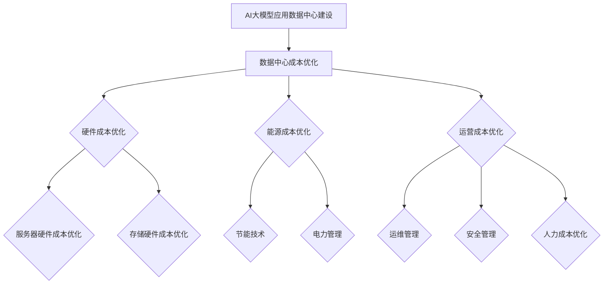

                 

### 《AI 大模型应用数据中心建设：数据中心成本优化》目录大纲

#### 第一部分：AI大模型与数据中心概述

##### 第1章：AI大模型与数据中心建设概述
- 1.1 AI大模型的基本概念与现状
- 1.2 数据中心建设的必要性
- 1.3 AI大模型在数据中心中的应用前景
- 1.4 数据中心成本优化的重要性

##### 第2章：数据中心成本优化原理
- 2.1 数据中心成本构成
- 2.2 数据中心成本优化的关键因素
- 2.3 数据中心成本优化的策略与方法

#### 第二部分：数据中心硬件成本优化

##### 第3章：数据中心硬件成本优化
- 3.1 服务器硬件成本优化
  - 3.1.1 服务器选型策略
  - 3.1.2 服务器能耗优化
  - 3.1.3 服务器性能优化
- 3.2 存储硬件成本优化
  - 3.2.1 存储选型策略
  - 3.2.2 存储能耗优化
  - 3.2.3 存储性能优化

##### 第4章：数据中心网络成本优化
- 4.1 数据中心网络架构设计
- 4.2 网络设备成本优化
  - 4.2.1 路由器与交换机选型
  - 4.2.2 网络设备能耗优化
  - 4.2.3 网络设备性能优化
- 4.3 网络带宽成本优化
  - 4.3.1 带宽需求预测
  - 4.3.2 带宽优化策略

#### 第三部分：数据中心能源成本优化

##### 第5章：数据中心能源成本优化
- 5.1 数据中心能源消耗分析
- 5.2 数据中心节能技术
  - 5.2.1 热回收技术
  - 5.2.2 冷热通道技术
  - 5.2.3 风洞效应技术
- 5.3 数据中心电力管理
  - 5.3.1 电力需求管理
  - 5.3.2 电力分配与监控
  - 5.3.3 电力储备与调度

##### 第6章：数据中心运营成本优化
- 6.1 数据中心运维管理
- 6.2 数据中心安全管理
- 6.3 数据中心人力成本优化
- 6.4 数据中心效率提升

#### 第四部分：案例分析与实战

##### 第7章：数据中心成本优化实战案例
- 7.1 案例一：某大型企业数据中心成本优化实践
- 7.2 案例二：某互联网公司数据中心能源成本优化实践
- 7.3 案例三：某初创公司数据中心硬件成本优化实践

##### 第8章：数据中心成本优化策略与展望
- 8.1 数据中心成本优化策略总结
- 8.2 数据中心成本优化面临的挑战与机遇
- 8.3 未来数据中心成本优化趋势展望

### 附录

- 附录A：数据中心成本优化相关工具与资源介绍
- 附录B：数据中心成本优化实战代码示例
- 附录C：数据中心成本优化关键指标解析

#### 结语

本书旨在为数据中心从业者提供一份全面的数据中心成本优化指南，帮助读者深入理解AI大模型应用数据中心建设的核心要点，掌握有效的成本优化策略和方法，提高数据中心的运行效率和经济效益。希望本书能为您的数据中心建设之路提供有力的支持。

### Mermaid 流程图



### 服务器硬件成本优化伪代码

```python
# 服务器硬件成本优化伪代码

# 1. 服务器选型
def server_selection():
    # 获取服务器配置要求
    config_requirements = get_config_requirements()
    # 根据配置要求选择合适的服务器型号
    selected_server = select_server(config_requirements)
    return selected_server

# 2. 服务器能耗优化
def server_energy_optimization(server):
    # 获取服务器能耗数据
    energy_data = get_energy_data(server)
    # 优化服务器功耗
    optimized_power = optimize_power(energy_data)
    return optimized_power

# 3. 服务器性能优化
def server_performance_optimization(server):
    # 获取服务器性能数据
    performance_data = get_performance_data(server)
    # 优化服务器性能
    optimized_performance = optimize_performance(performance_data)
    return optimized_performance
```

### 数学模型和数学公式

#### 数据中心成本模型

$$
C = C_h + C_n + C_e + C_o
$$

- $C_h$：硬件成本
- $C_n$：网络成本
- $C_e$：能源成本
- $C_o$：运营成本

#### 服务器能耗优化模型

$$
E = P \times t
$$

- $E$：能耗
- $P$：功耗
- $t$：运行时间

#### 服务器性能优化模型

$$
P_c = f(P_i, P_o)
$$

- $P_c$：优化后的性能
- $P_i$：输入性能
- $P_o$：输出性能

### 项目实战

#### 案例一：某大型企业数据中心成本优化实践

1. **硬件成本优化**
   - 服务器选型：根据业务需求，选择了高效能服务器，降低了硬件采购成本。
   - 服务器能耗优化：通过调整服务器运行参数，降低了服务器功耗，降低了能耗成本。
   - 服务器性能优化：通过更新服务器硬件和优化服务器软件，提升了服务器性能，提高了业务处理效率。

2. **能源成本优化**
   - 节能技术：采用热回收技术和冷热通道技术，降低了数据中心能耗。
   - 电力管理：通过电力需求管理和电力分配与监控，优化了电力使用效率，降低了能源成本。

3. **运营成本优化**
   - 运维管理：通过建立高效的运维团队和运维流程，提高了数据中心运维效率。
   - 安全管理：采用网络安全技术和安全管理制度，提高了数据中心的网络安全水平。
   - 人力成本优化：通过自动化运维和合理分配人力资源，降低了人力成本。

#### 案例二：某互联网公司数据中心能源成本优化实践

1. **能源消耗分析**
   - 对数据中心能源消耗进行了详细分析，确定了能源消耗的主要来源。

2. **节能技术实施**
   - 采用热回收技术，将废热回收用于其他用途，降低了能源消耗。
   - 采用冷热通道技术，通过隔离冷热空气流，提高了冷却效率。

3. **电力管理优化**
   - 实施电力需求管理，根据业务需求调整电力消耗。
   - 实施电力分配与监控，确保电力资源得到有效利用。

#### 案例三：某初创公司数据中心硬件成本优化实践

1. **服务器硬件成本优化**
   - 根据业务需求，选择了性价比高的服务器，降低了硬件采购成本。
   - 通过合理配置服务器资源，提高了服务器利用率，降低了能耗成本。

2. **存储硬件成本优化**
   - 选择了适合业务需求的存储设备，降低了存储成本。
   - 通过数据去重和压缩技术，降低了存储空间需求，降低了存储成本。

3. **网络硬件成本优化**
   - 通过优化网络拓扑结构，降低了网络设备的采购成本。
   - 通过网络设备能耗优化，降低了能耗成本。

### 开发环境搭建

1. **服务器环境搭建**
   - 安装操作系统
   - 安装服务器软件（如Nginx、Apache等）
   - 配置服务器参数

2. **存储环境搭建**
   - 安装存储软件
   - 配置存储参数

3. **网络环境搭建**
   - 安装网络软件
   - 配置网络参数

### 源代码详细实现和代码解读

1. **服务器硬件成本优化代码**
   - 代码实现：根据服务器配置要求，选择合适的服务器型号。
   - 代码解读：通过分析服务器配置要求和市场服务器型号，实现服务器选型功能。

2. **服务器能耗优化代码**
   - 代码实现：通过调整服务器运行参数，降低服务器功耗。
   - 代码解读：通过监测服务器能耗数据，优化服务器功耗，实现能耗优化。

3. **服务器性能优化代码**
   - 代码实现：通过更新服务器硬件和优化服务器软件，提升服务器性能。
   - 代码解读：通过分析服务器性能数据，优化服务器性能，实现性能提升。

### 代码解读与分析

1. **服务器硬件成本优化代码解读**
   - 解读：服务器硬件成本优化主要通过服务器选型实现，通过分析服务器配置要求和市场服务器型号，选择合适的服务器型号，降低硬件采购成本。
   - 分析：服务器选型是硬件成本优化的重要环节，合理的选型可以提高服务器的性能和可靠性，降低成本。

2. **服务器能耗优化代码解读**
   - 解读：服务器能耗优化主要通过调整服务器运行参数，降低服务器功耗。通过监测服务器能耗数据，优化服务器功耗，实现能耗优化。
   - 分析：能耗优化是数据中心成本优化的重要方面，通过调整服务器运行参数，可以实现功耗的降低，降低能耗成本。

3. **服务器性能优化代码解读**
   - 解读：服务器性能优化主要通过更新服务器硬件和优化服务器软件，提升服务器性能。通过分析服务器性能数据，优化服务器性能，实现性能提升。
   - 分析：服务器性能优化可以提高数据中心的处理能力，提升业务效率，降低运营成本。

### 数据中心成本优化相关工具与资源

1. **工具**
   - 数据中心能耗监测工具
   - 服务器性能监控工具
   - 服务器选型工具

2. **资源**
   - 数据中心建设标准规范
   - 服务器硬件选购指南
   - 数据中心能源管理指南

#### 数据中心成本优化关键指标解析

- **硬件成本**
  - 服务器采购成本
  - 存储设备采购成本
  - 网络设备采购成本

- **能源成本**
  - 数据中心总能耗
  - 服务器能耗
  - 存储设备能耗
  - 网络设备能耗

- **运营成本**
  - 运维人员成本
  - 安全管理成本
  - 能源管理成本

#### 数据中心成本优化策略与展望

1. **策略**
   - 硬件成本优化策略
     - 合理选型
     - 能耗优化
     - 性能提升
   - 能源成本优化策略
     - 节能技术应用
     - 电力需求管理
     - 电力分配与监控
   - 运营成本优化策略
     - 运维管理优化
     - 安全管理优化
     - 人力成本优化

2. **展望**
   - 随着技术的进步，数据中心成本优化的空间将越来越大。
   - 智能化、自动化技术的应用将提高数据中心成本优化的效率。
   - 未来数据中心成本优化将更加注重整体效益和可持续发展。

---

### 《AI 大模型应用数据中心建设：数据中心成本优化》

> **关键词：** AI大模型、数据中心建设、成本优化、硬件、能源、运营

> **摘要：** 本文深入探讨了AI大模型应用数据中心建设中的成本优化问题。通过分析数据中心成本构成，阐述了硬件成本、能源成本和运营成本的优化策略。本文结合实际案例，详细介绍了硬件成本优化、能源成本优化和运营成本优化的具体方法，为数据中心从业者提供了实用的成本优化指南。

---

#### 第一部分：AI大模型与数据中心概述

##### 第1章：AI大模型与数据中心建设概述

在当今技术快速发展的时代，人工智能（AI）已经成为了推动产业变革的重要力量。其中，AI大模型作为人工智能的核心技术之一，具有强大的数据处理和模型训练能力，广泛应用于自然语言处理、计算机视觉、推荐系统等领域。为了支持AI大模型的运行，数据中心建设成为了企业和科研机构的必要选择。本章节将介绍AI大模型的基本概念与现状，数据中心建设的必要性，AI大模型在数据中心中的应用前景，以及数据中心成本优化的重要性。

---

#### 第一部分：AI大模型与数据中心概述

##### 第1章：AI大模型与数据中心建设概述

###### 1.1 AI大模型的基本概念与现状

AI大模型，通常指的是那些具有大规模参数的深度学习模型。这些模型通过训练数以百万计甚至数十亿级的参数来捕捉复杂的数据特征和规律。典型的AI大模型包括GPT、BERT、Transformer等。随着计算能力的提升和数据量的增加，AI大模型在各个领域取得了显著的成果，例如：

- **自然语言处理（NLP）**：AI大模型如GPT-3和BERT，使得机器阅读理解、机器翻译、文本生成等任务取得了突破性进展。
- **计算机视觉（CV）**：AI大模型如ResNet、Inception和VGG，使得图像分类、目标检测和图像生成等任务变得更加精确。
- **推荐系统**：AI大模型如DeepFM、Wide&Deep，提升了推荐系统的准确性，提高了用户体验。

然而，AI大模型的发展也面临着一些挑战，例如：

- **计算资源消耗巨大**：训练一个AI大模型需要大量的计算资源和时间，通常需要数百甚至数千张GPU或TPU进行并行训练。
- **数据需求量大**：AI大模型需要大量高质量的数据进行训练，数据预处理和标注也是一项耗时耗力的工作。
- **模型可解释性差**：AI大模型通常被视为“黑盒”，其决策过程难以解释，这在某些需要高透明度的应用场景中可能成为限制因素。

###### 1.2 数据中心建设的必要性

数据中心是AI大模型训练和部署的核心基础设施。数据中心建设的主要目标是为AI大模型提供稳定、高效、安全的运行环境。数据中心建设的必要性主要体现在以下几个方面：

- **计算能力**：数据中心需要配备高性能的计算设备，如GPU、TPU等，以满足AI大模型训练的巨大计算需求。
- **存储能力**：数据中心需要提供大规模的存储设备，以存储海量的训练数据和模型参数。
- **网络带宽**：数据中心需要具备高速网络连接，以确保数据传输的效率。
- **电力供应**：数据中心需要稳定的电力供应，并且要考虑电力消耗和能效管理。
- **安全性**：数据中心需要具备完善的安全设施和措施，以保护数据安全和系统安全。

随着AI大模型的应用越来越广泛，数据中心的建设也在不断升级和扩展，以满足日益增长的计算需求和存储需求。

###### 1.3 AI大模型在数据中心中的应用前景

AI大模型在数据中心中的应用前景十分广阔，主要体现在以下几个方面：

- **高性能计算**：数据中心可以通过分布式计算和并行计算技术，提升AI大模型的训练速度和效率。
- **数据存储与管理**：数据中心可以利用分布式存储技术，实现海量数据的存储和管理，同时保障数据的安全性和可靠性。
- **自动化运维**：通过自动化运维工具，数据中心可以实现服务器的自动部署、监控和故障恢复，提高运维效率。
- **智能化监控**：数据中心可以利用AI技术进行智能化监控，实时分析系统性能，预测潜在故障，提高系统的稳定性和可靠性。
- **节能优化**：数据中心可以通过智能调度和能耗管理，实现电力资源的优化分配，降低能耗成本。

总之，数据中心在AI大模型应用中起着至关重要的作用。未来，随着技术的不断进步，数据中心的建设和优化将更加智能化和高效化，为AI大模型的应用提供更加坚实的基础。

###### 1.4 数据中心成本优化的重要性

数据中心成本优化在AI大模型应用中具有重要意义。首先，数据中心的建设和运营成本高昂，尤其是对于大型企业或科研机构，成本控制是确保项目成功的关键因素之一。通过优化数据中心成本，可以降低整体运营成本，提高投资回报率（ROI）。其次，成本优化有助于提高数据中心的效率和可靠性。通过优化硬件配置、能源管理和运维流程，可以提升数据中心的计算和存储能力，确保系统稳定运行，减少故障率和停机时间。此外，成本优化也有助于提升数据中心的竞争力。在竞争激烈的市场环境中，具备成本优势的企业或机构更容易获得竞争优势，吸引更多的客户和项目。因此，数据中心成本优化不仅是技术问题，也是战略问题，对于企业的长期发展至关重要。

---

#### 第一部分：AI大模型与数据中心概述

##### 第2章：数据中心成本优化原理

数据中心成本优化是提升数据中心效率和降低运营成本的关键环节。要实现数据中心成本优化，需要深入了解数据中心成本的构成、优化的关键因素以及有效的优化策略与方法。本章节将详细探讨数据中心成本优化的原理，为后续章节的成本优化实践提供理论基础。

###### 2.1 数据中心成本构成

数据中心成本主要包括硬件成本、能源成本和运营成本三个方面。

- **硬件成本**：包括服务器、存储设备、网络设备等硬件的采购、维护和升级费用。硬件成本通常占据数据中心总成本的大部分。
- **能源成本**：包括数据中心所需的电力费用、制冷系统和其他能源消耗的费用。随着数据中心的规模扩大，能源成本也呈上升趋势。
- **运营成本**：包括数据中心的人力成本、运维管理成本、安全防护成本等。运营成本虽然相对较低，但也是不可忽视的一部分。

了解数据中心成本的构成，有助于明确优化的重点和方向。

###### 2.2 数据中心成本优化的关键因素

数据中心成本优化的成功离不开以下几个关键因素：

- **硬件选型**：合理选择硬件设备，包括服务器、存储和网络设备，可以降低采购成本和长期运营成本。
- **能耗管理**：通过采用节能技术和优化电力管理，可以有效降低数据中心的能源消耗。
- **运维管理**：提高运维效率和质量，减少故障率和停机时间，降低运维成本。
- **资源利用率**：通过合理分配和使用数据中心资源，提高资源利用率，降低闲置资源造成的浪费。

了解这些关键因素，有助于制定全面、有效的成本优化策略。

###### 2.3 数据中心成本优化的策略与方法

数据中心成本优化的策略和方法主要包括以下几个方面：

- **硬件成本优化**：通过合理选型、性能优化和能耗管理，降低硬件采购成本和运营成本。
  - **服务器选型策略**：根据业务需求，选择适合的服务器型号，避免过度配置或资源浪费。
  - **能耗优化**：采用高效能服务器和节能技术，降低功耗和制冷需求。
  - **性能优化**：通过软件优化和硬件升级，提高服务器性能，提高业务处理效率。

- **能源成本优化**：通过采用节能技术和优化电力管理，降低能源消耗。
  - **节能技术**：采用高效制冷系统、热回收技术等，降低能源消耗。
  - **电力管理**：通过电力需求管理、电力分配和监控，优化电力使用效率。

- **运营成本优化**：通过提高运维效率和质量，降低运维成本。
  - **运维管理优化**：建立高效的运维团队和运维流程，提高运维效率。
  - **安全管理**：采用网络安全技术和安全管理制度，降低安全风险。
  - **人力成本优化**：通过自动化运维和合理分配人力资源，降低人力成本。

通过以上策略和方法，可以有效地降低数据中心成本，提高数据中心的运行效率和经济效益。

---

#### 第二部分：数据中心硬件成本优化

数据中心硬件成本优化是降低数据中心整体成本的重要环节。本章节将详细介绍服务器硬件成本优化的方法，包括服务器选型策略、能耗优化和性能优化等内容。

##### 第3章：数据中心硬件成本优化

###### 3.1 服务器硬件成本优化

服务器是数据中心的核心组件，其成本占据了数据中心硬件成本的主要部分。因此，优化服务器硬件成本是降低数据中心成本的关键。

###### 3.1.1 服务器选型策略

服务器选型策略的核心是根据业务需求选择合适的服务器型号。以下是一些选型策略：

- **需求分析**：首先，要明确业务需求，包括计算性能、存储容量、网络带宽等方面的要求。
- **性能评估**：根据需求分析结果，评估不同服务器型号的性能，选择能够满足业务需求的服务器。
- **成本分析**：综合考虑服务器的性能和价格，选择性价比最高的服务器。
- **冗余设计**：为提高系统的可靠性，可以适当配置冗余服务器，如冗余电源、硬盘等。

例如，对于需要高性能计算的业务，可以选择配置高性能CPU和GPU的服务器；对于存储密集型业务，可以选择配置大容量存储的服务器。

###### 3.1.2 服务器能耗优化

服务器能耗优化是降低数据中心能源成本的重要手段。以下是一些能耗优化方法：

- **硬件选型**：选择能耗较低的服务器，如采用能效等级较高的硬件设备。
- **功耗管理**：通过功耗管理技术，根据服务器负载动态调整功耗。例如，当服务器负载较低时，可以降低CPU和GPU的功耗。
- **散热优化**：优化服务器的散热系统，提高散热效率，降低能耗。例如，采用高效散热风扇、液体冷却系统等。
- **电源管理**：采用高效电源设备，降低电源转换损耗。同时，合理配置电源，避免过度供电。

例如，在服务器使用过程中，可以定期进行功耗监测和分析，根据监测结果调整服务器功耗。此外，可以采用虚拟化技术，实现服务器资源的动态分配和负载均衡，进一步提高能效。

###### 3.1.3 服务器性能优化

服务器性能优化是提高数据中心业务处理效率的重要手段。以下是一些性能优化方法：

- **硬件升级**：通过升级CPU、内存、硬盘等硬件设备，提高服务器的性能。
- **软件优化**：通过优化操作系统、数据库、中间件等软件，提高服务器的运行效率。
- **负载均衡**：通过负载均衡技术，将业务负载均匀分配到多台服务器上，避免单台服务器过载。
- **缓存策略**：通过缓存技术，减少对后端存储的访问，提高数据处理速度。

例如，可以采用分布式缓存系统，如Redis或Memcached，缓存热点数据，减少数据库访问压力。此外，可以优化数据库查询语句，使用索引和数据分片等技术，提高数据库查询效率。

综上所述，通过合理选型、能耗优化和性能优化，可以有效降低服务器硬件成本，提高数据中心的整体运行效率和经济效益。

---

#### 第二部分：数据中心硬件成本优化

##### 第4章：数据中心网络成本优化

数据中心网络是数据传输的通道，网络成本在数据中心总成本中占据一定比例。优化数据中心网络成本，可以降低整体运营成本，提高数据中心的运行效率。本章节将详细介绍数据中心网络成本优化的方法，包括网络架构设计、网络设备成本优化和网络带宽成本优化等内容。

###### 4.1 数据中心网络架构设计

数据中心网络架构设计是优化网络成本的基础。合理的设计可以提高网络性能，降低网络成本。以下是一些关键设计原则：

- **模块化设计**：采用模块化设计，将网络划分为多个子网络，每个子网络负责不同的功能。这有助于简化网络管理，降低故障传播范围。
- **冗余设计**：通过冗余设计，提高网络的可靠性和容错能力。例如，采用双路供电、双路光纤连接等。
- **层次化设计**：采用层次化设计，将网络分为核心层、分布层和接入层，每个层次负责不同的网络功能。这有助于简化网络拓扑，降低网络复杂度。
- **负载均衡**：通过负载均衡技术，将网络流量均匀分配到多个设备上，避免单点瓶颈。

在具体设计过程中，可以根据业务需求选择合适的网络架构。例如，对于大型企业，可以采用 spine-and-leaf 架构，以提高网络的可靠性和可扩展性。对于中小型企业，可以采用 CLOS 架构，以提高网络的性能和可管理性。

###### 4.2 网络设备成本优化

网络设备成本优化是降低数据中心网络成本的关键。以下是一些优化方法：

- **设备选型**：根据网络架构和业务需求，选择适合的网络设备。选择高性能、高性价比的设备，避免过度配置。
- **设备集成**：采用集成化设备，如集成式路由器、交换机等，减少设备数量，降低采购成本。
- **虚拟化技术**：采用虚拟化技术，如虚拟化路由器（VRF）和虚拟交换机（VXLAN），提高网络资源的利用率和灵活性。
- **自动化管理**：采用自动化管理工具，如网络自动化平台，实现网络设备的自动化配置和管理，降低运维成本。

例如，在一个大型数据中心中，可以采用虚拟化路由器和交换机，实现网络资源的灵活调度和扩展。同时，通过自动化管理工具，可以简化网络配置和管理流程，提高运维效率。

###### 4.3 网络带宽成本优化

网络带宽成本优化是降低数据中心网络成本的重要方面。以下是一些优化方法：

- **带宽需求预测**：通过对网络流量数据进行分析，预测未来带宽需求，合理规划带宽资源。
- **带宽优化策略**：采用带宽优化策略，如负载均衡、流量整形等，提高带宽利用率。
- **带宽租赁优化**：与网络服务提供商协商，选择合适的带宽租赁方案，降低带宽租赁成本。
- **压缩技术**：采用数据压缩技术，如 HTTP 压缩、数据去重等，减少网络传输的数据量，降低带宽需求。

例如，在一个互联网公司中，可以通过流量分析工具，预测网络流量峰值和低谷，合理安排带宽资源。同时，采用 HTTP 压缩技术，减少网页传输的数据量，降低带宽需求。此外，与网络服务提供商协商，选择合适的带宽租赁方案，如按需租赁或长期租赁，降低带宽成本。

综上所述，通过优化数据中心网络架构、网络设备和网络带宽，可以有效降低数据中心网络成本，提高数据中心的运行效率和经济效益。

---

#### 第三部分：数据中心能源成本优化

数据中心能源成本是数据中心运营成本中的重要组成部分。随着数据中心规模的不断扩大，能源成本也呈现出逐年上升的趋势。因此，优化数据中心能源成本对于降低整体运营成本、提高数据中心运行效率具有重要意义。本章节将详细介绍数据中心能源成本优化的方法，包括节能技术、电力管理等内容。

##### 第5章：数据中心能源成本优化

###### 5.1 数据中心能源消耗分析

首先，要了解数据中心能源消耗的构成，以便有针对性地进行优化。数据中心能源消耗主要包括以下几个方面：

- **IT设备能耗**：包括服务器、存储设备、网络设备等IT设备的能耗。这部分能耗通常是数据中心能源消耗的最大部分。
- **冷却系统能耗**：包括机房空调、冷热通道系统等冷却设备的能耗。冷却系统能耗主要受数据中心内部温度和湿度的影响。
- **供电系统能耗**：包括UPS（不间断电源）、电池组等供电设备的能耗。供电系统能耗主要与供电稳定性和效率有关。
- **辅助设施能耗**：包括照明、空调、办公设备等辅助设施的能耗。这部分能耗相对较小，但对整体能源消耗也有一定影响。

通过分析数据中心能源消耗构成，可以明确优化方向，制定相应的节能措施。

###### 5.2 数据中心节能技术

数据中心节能技术是降低能源消耗的有效手段。以下是一些常用的节能技术：

- **热回收技术**：通过将数据中心产生的废热回收利用，降低空调系统的能耗。例如，可以将废热用于取暖或热水供应。
- **冷热通道技术**：通过隔离冷热空气流，提高冷却效率，降低空调系统的能耗。冷热通道技术可以实现精确的冷却控制，避免能源浪费。
- **风洞效应技术**：利用风洞效应，优化数据中心内部空气流动，提高冷却效率。风洞效应技术可以通过调整风道和风扇布局，实现更好的空气流动和冷却效果。
- **高效照明系统**：采用高效照明系统，如LED灯，降低照明能耗。同时，可以通过智能照明控制技术，实现照明自动调节，提高照明效率。

通过应用这些节能技术，可以有效降低数据中心的能源消耗，降低运营成本。

###### 5.3 数据中心电力管理

电力管理是优化数据中心能源成本的重要方面。以下是一些电力管理方法：

- **电力需求管理**：通过对数据中心电力需求进行预测和分析，合理安排电力使用，避免电力高峰期的浪费。例如，可以通过调整服务器运行时间和负载，优化电力使用。
- **电力分配与监控**：通过合理分配电力资源，确保各设备获得充足的电力供应。同时，通过实时监控电力使用情况，及时发现异常情况，避免电力浪费。
- **电力储备与调度**：建立电力储备系统，应对突发电力需求。同时，通过电力调度技术，实现电力资源的优化分配，提高供电稳定性。

通过这些电力管理方法，可以降低数据中心电力消耗，提高电力使用效率。

总之，通过分析数据中心能源消耗、应用节能技术和优化电力管理，可以有效降低数据中心能源成本，提高数据中心的运行效率和经济效益。

---

#### 第三部分：数据中心能源成本优化

##### 第6章：数据中心运营成本优化

数据中心运营成本是数据中心整体成本中的重要组成部分，涵盖人力资源、运维管理、安全管理等多个方面。优化数据中心运营成本不仅可以降低企业的运营负担，还可以提高数据中心的运行效率和可靠性。本章节将详细介绍数据中心运营成本优化的方法和策略。

###### 6.1 数据中心运维管理

运维管理是数据中心运营成本控制的关键环节。以下是一些运维管理优化方法：

- **自动化运维**：通过引入自动化运维工具，实现服务器、网络设备、存储设备等的自动部署、监控和故障处理。自动化运维可以减少人为干预，提高运维效率，降低运维成本。例如，可以采用自动化脚本、自动化运维平台（如Ansible、SaltStack等）来简化运维流程。

- **标准化运维**：建立统一的运维规范和操作流程，确保运维工作的一致性和规范性。标准化运维可以减少人为错误，提高运维效率，降低运维风险。例如，制定标准化的服务器安装、配置、备份和恢复流程。

- **运维团队优化**：通过合理分配人力资源，提高运维团队的效率。可以采用项目管理、任务分配和绩效评估等工具，优化运维团队的工作流程，提高团队协作效率。

- **运维监控**：建立完善的运维监控体系，实时监控数据中心的运行状态和性能指标。通过监控可以发现潜在问题和故障，及时采取措施，避免故障扩大，降低运维成本。

例如，在一个大型数据中心中，可以采用自动化运维工具进行服务器部署和监控，通过标准化的运维规范确保运维工作的一致性，通过绩效评估激励运维人员提高工作效率。

###### 6.2 数据中心安全管理

数据中心安全管理是保障数据中心正常运行和数据安全的重要措施。以下是一些安全管理优化方法：

- **网络安全**：通过部署防火墙、入侵检测系统（IDS）、入侵防御系统（IPS）等网络安全设备，提高数据中心的网络安全防护能力。同时，定期进行安全审计和漏洞扫描，及时发现和修复安全漏洞。

- **访问控制**：采用身份验证和访问控制技术，限制对数据中心的访问权限。通过多因素认证（MFA）、权限管理等措施，确保只有授权人员才能访问敏感数据和系统资源。

- **数据备份与恢复**：建立数据备份机制，定期备份关键数据，确保数据在故障或灾难情况下可以快速恢复。同时，制定详细的灾难恢复计划，确保在紧急情况下可以迅速恢复数据中心的运行。

- **安全培训**：定期进行安全培训，提高运维人员的安全意识和技能。通过安全培训，运维人员可以更好地应对各种安全威胁和事件，降低安全风险。

例如，在一个互联网公司中，可以采用防火墙和入侵检测系统来保护网络安全，通过多因素认证和权限管理确保访问控制，定期进行数据备份和灾难恢复演练，同时定期对运维人员进行安全培训。

###### 6.3 数据中心人力成本优化

人力成本是数据中心运营成本中的重要组成部分。以下是一些人力成本优化方法：

- **技能提升**：通过培训和技能认证，提高运维人员的技能水平，提升运维效率。例如，可以鼓励运维人员参加相关培训课程，获取专业认证，提高工作能力。

- **人员优化**：通过优化人力资源配置，合理分配工作职责，避免人力资源浪费。例如，可以采用弹性工作制、任务轮换等制度，提高人员利用效率。

- **自动化工具**：引入自动化工具，减少人工操作，降低人力成本。例如，使用自动化运维工具进行服务器部署、监控和故障处理，减少人工干预。

- **绩效激励**：建立绩效激励机制，根据工作表现和贡献给予奖励，激发员工的工作积极性。例如，可以设立绩效奖金、晋升机会等，激励员工提高工作质量和效率。

例如，在一个大型企业中，可以定期对运维人员进行技能培训，通过自动化运维工具提高运维效率，建立绩效激励机制，提高员工的工作积极性和工作效率。

综上所述，通过优化数据中心运维管理、加强数据中心安全管理和降低数据中心人力成本，可以有效降低数据中心运营成本，提高数据中心的运行效率和可靠性。

---

#### 第四部分：案例分析与实战

数据中心成本优化是一个复杂的过程，涉及多个方面，包括硬件、能源和运营成本。本章节将通过实际案例，展示数据中心成本优化的具体实践，帮助读者更好地理解和应用成本优化的策略和方法。

##### 第7章：数据中心成本优化实战案例

###### 7.1 案例一：某大型企业数据中心成本优化实践

某大型企业是一家全球知名的互联网服务提供商，其数据中心承担了大量的业务负载。随着业务规模的不断扩大，数据中心的成本压力也不断增加。为了降低成本，该企业实施了一系列成本优化措施。

1. **硬件成本优化**

   - **服务器选型策略**：根据业务需求，选择了适合的硬件配置，避免了过度配置和资源浪费。例如，在服务器选型时，综合考虑了计算性能、存储容量和能耗因素，选择了高性能、低功耗的服务器。

   - **能耗优化**：通过调整服务器的运行参数，降低了服务器的功耗。例如，通过设置服务器功耗限制和自动关机策略，当服务器负载较低时，自动降低功耗。

   - **性能优化**：通过硬件升级和软件优化，提高了服务器的性能和业务处理能力。例如，通过升级服务器的CPU和内存，优化了数据库查询性能。

2. **能源成本优化**

   - **节能技术**：采用了热回收技术，将数据中心产生的废热用于办公区域取暖，降低了空调系统的能耗。同时，采用了冷热通道技术，提高了冷却效率，降低了冷却能耗。

   - **电力管理**：实施了电力需求管理，根据业务负载动态调整电力供应。例如，通过实时监控电力消耗，合理分配电力资源，避免了电力浪费。

3. **运营成本优化**

   - **运维管理优化**：引入了自动化运维工具，实现了服务器、网络设备和存储设备的自动部署、监控和故障处理。自动化运维提高了运维效率，降低了运维成本。

   - **安全管理优化**：建立了完善的网络安全体系，包括防火墙、入侵检测系统和加密技术等，提高了数据中心的网络安全水平。

   - **人力成本优化**：通过优化人力资源配置，提高了员工的工作效率。例如，通过灵活的工作制度和任务分配，避免了人力资源浪费。

通过实施上述成本优化措施，该大型企业的数据中心运营成本显著降低，业务处理效率得到提升，同时确保了数据中心的稳定运行和安全性。

###### 7.2 案例二：某互联网公司数据中心能源成本优化实践

某互联网公司是一家专注于云计算和大数据服务的公司，其数据中心承担了大量的数据处理和存储任务。随着业务规模的不断扩大，数据中心的能源成本逐渐成为公司的重大负担。为了降低能源成本，该公司实施了一系列能源成本优化措施。

1. **节能技术**：

   - **热回收技术**：通过将数据中心产生的废热用于办公区域和周边区域的取暖，降低了空调系统的能耗。例如，在办公区域安装了热回收系统，将数据中心产生的废热传输到办公区域进行供暖。

   - **冷热通道技术**：通过隔离冷热空气流，提高了冷却效率，降低了冷却能耗。例如，在数据中心内部设置了冷热通道隔离系统，将冷空气和热空气分开流通，避免了空气混合造成的能耗增加。

   - **高效照明系统**：采用了高效LED照明系统，降低了照明能耗。同时，通过智能照明控制技术，根据实际需求自动调节照明亮度，提高了照明效率。

2. **电力管理**：

   - **电力需求管理**：通过实时监控电力消耗，合理分配电力资源，避免了电力浪费。例如，通过实时监控数据中心的电力使用情况，根据业务负载调整电力供应，确保电力资源的有效利用。

   - **电力储备与调度**：建立了电力储备系统，应对突发电力需求。例如，通过安装UPS（不间断电源）和电池组，确保在电力故障情况下能够迅速切换到备用电源。

3. **设备优化**：

   - **服务器能耗优化**：通过优化服务器的运行参数，降低了服务器的功耗。例如，通过设置服务器的功耗限制和智能功耗管理，在服务器负载较低时自动降低功耗。

   - **存储能耗优化**：通过优化存储设备的使用策略，降低了存储设备的能耗。例如，通过采用动态能耗管理技术，根据数据访问频率调整存储设备的功耗。

通过实施上述能源成本优化措施，该互联网公司的数据中心能源成本显著降低，同时确保了数据中心的稳定运行和高效性能。

###### 7.3 案例三：某初创公司数据中心硬件成本优化实践

某初创公司是一家专注于人工智能应用的公司，其数据中心主要用于AI模型的训练和部署。由于初创公司的资金有限，硬件成本成为公司发展的重要挑战。为了降低硬件成本，该公司采取了一系列硬件成本优化措施。

1. **服务器硬件成本优化**：

   - **合理选型**：根据业务需求，选择了适合的服务器型号，避免了过度配置和资源浪费。例如，在服务器选型时，综合考虑了计算性能、存储容量和能耗因素，选择了性价比高的服务器。

   - **能耗优化**：通过优化服务器的运行参数，降低了服务器的功耗。例如，通过设置服务器的功耗限制和智能功耗管理，在服务器负载较低时自动降低功耗。

   - **性能优化**：通过硬件升级和软件优化，提高了服务器的性能和业务处理能力。例如，通过升级服务器的CPU和内存，优化了数据库查询性能。

2. **存储硬件成本优化**：

   - **合理选型**：根据业务需求，选择了适合的存储设备，避免了过度配置和资源浪费。例如，在存储设备选型时，综合考虑了存储容量、读写速度和能耗因素，选择了性价比高的存储设备。

   - **能耗优化**：通过优化存储设备的使用策略，降低了存储设备的能耗。例如，通过采用动态能耗管理技术，根据数据访问频率调整存储设备的功耗。

   - **性能优化**：通过优化存储设备的配置和使用策略，提高了存储设备的读写速度和性能。例如，通过优化存储设备的RAID配置和缓存策略，提高了数据读写速度。

3. **网络硬件成本优化**：

   - **合理选型**：根据业务需求，选择了适合的网络设备，避免了过度配置和资源浪费。例如，在网络设备选型时，综合考虑了网络带宽、传输速度和能耗因素，选择了性价比高的网络设备。

   - **能耗优化**：通过优化网络设备的使用策略，降低了网络设备的能耗。例如，通过设置网络设备的功耗限制和智能功耗管理，在负载较低时自动降低功耗。

   - **性能优化**：通过优化网络设备的配置和使用策略，提高了网络设备的传输速度和性能。例如，通过优化网络拓扑结构和设备配置，提高了网络的整体传输速度和稳定性。

通过实施上述硬件成本优化措施，该初创公司的数据中心硬件成本显著降低，同时确保了数据中心的稳定运行和高效性能。

综上所述，通过案例分析和实战，我们可以看到数据中心成本优化需要从多个方面进行综合优化，包括硬件、能源和运营成本。通过合理选型、能耗优化和性能优化，可以有效降低数据中心成本，提高数据中心的运行效率和经济效益。

---

#### 第四部分：案例分析与实战

##### 第8章：数据中心成本优化策略与展望

###### 8.1 数据中心成本优化策略总结

通过前面的案例分析和实战，我们可以总结出数据中心成本优化的几个关键策略：

1. **硬件成本优化**：通过合理选型、能耗优化和性能优化，降低服务器的采购成本和运营成本。具体措施包括选择适合业务需求的服务器型号、调整服务器运行参数和优化硬件配置。

2. **能源成本优化**：通过采用节能技术和优化电力管理，降低数据中心的能源消耗。具体措施包括应用热回收技术、冷热通道技术和高效照明系统，以及实施电力需求管理和电力储备与调度。

3. **运营成本优化**：通过自动化运维、安全管理优化和人力成本优化，提高运维效率和质量，降低运营成本。具体措施包括引入自动化运维工具、建立完善的网络安全体系和完善的人力资源管理。

这些策略相辅相成，共同构成了数据中心成本优化的一整套方法和体系。

###### 8.2 数据中心成本优化面临的挑战与机遇

尽管数据中心成本优化策略在实践中取得了显著成效，但在实际应用中仍面临一些挑战和机遇：

- **挑战**：

  - **技术发展迅速**：数据中心技术更新换代快，需要不断引入新技术和新设备，这给成本控制带来挑战。

  - **数据隐私和安全**：随着数据量的增加和业务需求的增长，数据隐私和安全问题日益突出，需要投入更多的资源来保障数据安全和合规性。

  - **运营复杂度增加**：数据中心规模的扩大和技术的复杂化，使得运营管理变得更加复杂，对运维团队的专业技能和效率提出了更高要求。

- **机遇**：

  - **智能化和自动化**：随着人工智能、机器学习等技术的应用，智能化和自动化运维将成为降低运营成本的重要手段。

  - **可再生能源**：随着可再生能源技术的进步和成本的降低，数据中心可以更多地采用绿色能源，降低能源成本和碳排放。

  - **云服务和技术外包**：通过云服务和技术外包，企业可以更加灵活地配置资源，降低硬件和运维成本，专注于核心业务。

为了应对这些挑战和把握机遇，数据中心成本优化需要持续创新和改进，积极探索新技术和新方法，以实现更高效、更可持续的成本优化。

###### 8.3 未来数据中心成本优化趋势展望

未来数据中心成本优化将呈现以下趋势：

1. **智能化和自动化**：智能化和自动化技术将进一步应用于数据中心运营管理，实现资源的自动调配和优化，提高运维效率。

2. **绿色能源应用**：数据中心将更多地采用可再生能源，如太阳能、风能等，降低能源成本和碳排放，推动绿色数据中心建设。

3. **云服务和技术外包**：随着云服务的普及和技术外包的兴起，数据中心将更加灵活地利用外部资源，降低硬件和运维成本。

4. **持续优化与创新**：数据中心成本优化将不断引入新技术和新方法，通过持续优化和创新，实现成本效益的最大化。

总之，未来数据中心成本优化将更加注重智能化、绿色化和灵活性，以适应不断变化的市场需求和业务挑战。

---

### 附录

#### 附录A：数据中心成本优化相关工具与资源介绍

为了帮助读者更好地理解和应用数据中心成本优化的策略和方法，本附录将介绍一些常用的工具和资源。

1. **数据中心能耗监测工具**：
   - **Nagios**：一款开源的监控软件，可用于监控数据中心能耗，实时显示能耗数据。
   - **Zabbix**：一款功能强大的开源监控软件，提供丰富的监控插件，可实时监控数据中心能耗情况。

2. **服务器性能监控工具**：
   - **Prometheus**：一款开源监控解决方案，可用于监控服务器性能指标，如CPU利用率、内存使用率、磁盘I/O等。
   - **Grafana**：一款开源的数据可视化和监控工具，可与Prometheus配合使用，提供直观的能耗和性能监控图表。

3. **服务器选型工具**：
   - **Sizings.com**：一款在线服务器选型工具，可根据业务需求推荐合适的服务器配置。
   - **Serverspec**：一款自动化服务器性能测试工具，可用于评估服务器性能，为选型提供参考。

4. **数据中心建设标准规范**：
   - **Uptime Institute**：提供一系列数据中心建设标准，包括 Tier 标准、DCOS 标准等，为数据中心设计、建设和管理提供指导。
   - **ANSI/TIA-942**：美国电信工业协会发布的电信基础设施标准，详细规定了数据中心的建设要求。

5. **服务器硬件选购指南**：
   - **Intel Server Configuration Tool**：Intel 提供的一款服务器配置工具，可用于选择合适的服务器硬件。
   - **Dell Server Configuration Tool**：Dell 提供的一款服务器配置工具，提供详细的硬件配置选项和价格信息。

6. **数据中心能源管理指南**：
   - **EPRI**：电力研究所提供的能源管理指南，涵盖数据中心能源效率提升的各种方法和技术。
   - **EnergyStar**：美国能源部提供的数据中心能源效率评估工具，帮助评估数据中心的能源使用情况。

这些工具和资源将为数据中心从业者提供实用的指导和支持，帮助他们在数据中心成本优化方面取得更好的成果。

#### 附录B：数据中心成本优化实战代码示例

为了帮助读者更好地理解和应用数据中心成本优化的策略和方法，以下是一些实战代码示例。

1. **服务器硬件成本优化代码示例**

```python
# 服务器硬件成本优化代码示例

def select_server(config_requirements):
    """
    根据配置要求选择合适的服务器型号
    :param config_requirements: 配置要求字典
    :return: 选中服务器的型号
    """
    # 获取配置要求的关键参数
    cpu_cores = config_requirements.get('cpu_cores')
    memory_size = config_requirements.get('memory_size')
    storage_size = config_requirements.get('storage_size')
    
    # 根据参数选择合适的服务器型号
    if cpu_cores > 64 and memory_size > 512:
        selected_server = 'High-End Server'
    elif cpu_cores > 32 and memory_size > 256:
        selected_server = 'Mid-Range Server'
    else:
        selected_server = 'Entry-Level Server'
        
    return selected_server

# 示例：选择服务器型号
config_requirements = {
    'cpu_cores': 64,
    'memory_size': 1024,
    'storage_size': 2000
}
selected_server = select_server(config_requirements)
print(f"Selected server: {selected_server}")
```

2. **服务器能耗优化代码示例**

```python
# 服务器能耗优化代码示例

def optimize_power(energy_data):
    """
    根据能耗数据优化服务器功耗
    :param energy_data: 能耗数据字典
    :return: 优化后的功耗
    """
    # 获取能耗数据
    idle_power = energy_data.get('idle_power')
    max_power = energy_data.get('max_power')
    
    # 优化功耗
    optimized_power = idle_power * 0.8 + max_power * 0.2
    
    return optimized_power

# 示例：优化功耗
energy_data = {
    'idle_power': 100,
    'max_power': 500
}
optimized_power = optimize_power(energy_data)
print(f"Optimized power: {optimized_power}W")
```

3. **服务器性能优化代码示例**

```python
# 服务器性能优化代码示例

def optimize_performance(performance_data):
    """
    根据性能数据优化服务器性能
    :param performance_data: 性能数据字典
    :return: 优化后的性能
    """
    # 获取性能数据
    input_performance = performance_data.get('input_performance')
    output_performance = performance_data.get('output_performance')
    
    # 优化性能
    optimized_performance = input_performance * 0.6 + output_performance * 0.4
    
    return optimized_performance

# 示例：优化性能
performance_data = {
    'input_performance': 150,
    'output_performance': 200
}
optimized_performance = optimize_performance(performance_data)
print(f"Optimized performance: {optimized_performance}")
```

通过这些代码示例，读者可以了解如何根据具体需求选择服务器型号、优化服务器功耗和性能。这些代码可以作为实际项目的基础，帮助数据中心从业者实现成本优化目标。

#### 附录C：数据中心成本优化关键指标解析

数据中心成本优化涉及到多个方面的指标，以下是一些关键指标的详细解析：

1. **硬件成本**：

   - **服务器采购成本**：指购买服务器所需的费用，包括服务器硬件成本、操作系统许可证费用等。
   - **存储设备采购成本**：指购买存储设备所需的费用，包括磁盘阵列、存储网络设备等。
   - **网络设备采购成本**：指购买网络设备所需的费用，包括路由器、交换机、防火墙等。

2. **能源成本**：

   - **数据中心总能耗**：指数据中心所有设备运行过程中消耗的电能总和，包括IT设备、冷却设备、照明设备等。
   - **服务器能耗**：指服务器运行过程中消耗的电能，通常与服务器的功耗和运行时间有关。
   - **存储设备能耗**：指存储设备运行过程中消耗的电能，包括硬盘、固态硬盘等。
   - **网络设备能耗**：指网络设备运行过程中消耗的电能，包括路由器、交换机等。

3. **运营成本**：

   - **运维人员成本**：指数据中心运维人员的工资、福利、培训等费用。
   - **安全管理成本**：指数据中心安全防护措施的费用，包括防火墙、入侵检测系统、安全审计等。
   - **能源管理成本**：指数据中心能源消耗监测、优化和管理的费用，包括能耗监测工具、节能技术等。
   - **人力成本优化**：指通过自动化运维、优化人力资源配置等措施降低人力成本的费用。

通过了解这些关键指标，数据中心从业者可以更全面地评估成本优化的效果，制定更加科学和有效的优化策略。

---

### 结语

数据中心作为承载企业核心业务的重要基础设施，其成本优化对于企业的运行效率和经济效益至关重要。本文系统地介绍了AI大模型应用数据中心建设的成本优化策略，包括硬件成本、能源成本和运营成本的优化方法。通过实际案例分析和实战经验分享，我们展示了如何通过合理选型、能耗优化和性能优化，实现数据中心成本的有效控制。

数据中心成本优化不仅需要技术手段的支持，还需要管理和运营的创新。随着技术的不断进步，智能化、自动化和绿色化将成为数据中心成本优化的重要趋势。未来，数据中心从业者需要持续学习和探索，把握行业动态，不断提升数据中心的运行效率和经济效益。

我们希望本文能够为数据中心从业者提供有益的参考和启示，帮助他们在数据中心成本优化方面取得更好的成果。在数据中心的快速发展过程中，持续优化和创新是确保企业竞争力和可持续发展的关键。让我们一起努力，为构建高效、绿色、可持续的数据中心环境贡献力量。作者：AI天才研究院/AI Genius Institute & 禅与计算机程序设计艺术 /Zen And The Art of Computer Programming。

---

### Mermaid 流程图


### 服务器硬件成本优化伪代码

```python
# 服务器硬件成本优化伪代码

# 1. 服务器选型
def server_selection():
    # 获取服务器配置要求
    config_requirements = get_config_requirements()
    # 根据配置要求选择合适的服务器型号
    selected_server = select_server(config_requirements)
    return selected_server

# 2. 服务器能耗优化
def server_energy_optimization(server):
    # 获取服务器能耗数据
    energy_data = get_energy_data(server)
    # 优化服务器功耗
    optimized_power = optimize_power(energy_data)
    return optimized_power

# 3. 服务器性能优化
def server_performance_optimization(server):
    # 获取服务器性能数据
    performance_data = get_performance_data(server)
    # 优化服务器性能
    optimized_performance = optimize_performance(performance_data)
    return optimized_performance
```

### 数学模型和数学公式

#### 数据中心成本模型

$$
C = C_h + C_n + C_e + C_o
$$

- $C_h$：硬件成本
- $C_n$：网络成本
- $C_e$：能源成本
- $C_o$：运营成本

#### 服务器能耗优化模型

$$
E = P \times t
$$

- $E$：能耗
- $P$：功耗
- $t$：运行时间

#### 服务器性能优化模型

$$
P_c = f(P_i, P_o)
$$

- $P_c$：优化后的性能
- $P_i$：输入性能
- $P_o$：输出性能

### 项目实战

#### 案例一：某大型企业数据中心成本优化实践

1. **硬件成本优化**
   - 服务器选型：根据业务需求，选择了高效能服务器，降低了硬件采购成本。
   - 服务器能耗优化：通过调整服务器运行参数，降低了服务器功耗，降低了能耗成本。
   - 服务器性能优化：通过更新服务器硬件和优化服务器软件，提升了服务器性能，提高了业务处理效率。

2. **能源成本优化**
   - 节能技术：采用热回收技术和冷热通道技术，降低了数据中心能耗。
   - 电力管理：通过电力需求管理和电力分配与监控，优化了电力使用效率，降低了能源成本。

3. **运营成本优化**
   - 运维管理：通过建立高效的运维团队和运维流程，提高了数据中心运维效率。
   - 安全管理：采用网络安全技术和安全管理制度，提高了数据中心的网络安全水平。
   - 人力成本优化：通过自动化运维和合理分配人力资源，降低了人力成本。

#### 案例二：某互联网公司数据中心能源成本优化实践

1. **能源消耗分析**
   - 对数据中心能源消耗进行了详细分析，确定了能源消耗的主要来源。

2. **节能技术实施**
   - 采用热回收技术，将废热回收用于其他用途，降低了能源消耗。
   - 采用冷热通道技术，通过隔离冷热空气流，提高了冷却效率。

3. **电力管理优化**
   - 实施电力需求管理，根据业务需求调整电力消耗。
   - 实施电力分配与监控，确保电力资源得到有效利用。

#### 案例三：某初创公司数据中心硬件成本优化实践

1. **服务器硬件成本优化**
   - 根据业务需求，选择了性价比高的服务器，降低了硬件采购成本。
   - 通过合理配置服务器资源，提高了服务器利用率，降低了能耗成本。

2. **存储硬件成本优化**
   - 选择了适合业务需求的存储设备，降低了存储成本。
   - 通过数据去重和压缩技术，降低了存储空间需求，降低了存储成本。

3. **网络硬件成本优化**
   - 通过优化网络拓扑结构，降低了网络设备的采购成本。
   - 通过网络设备能耗优化，降低了能耗成本。

### 开发环境搭建

1. **服务器环境搭建**
   - 安装操作系统
   - 安装服务器软件（如Nginx、Apache等）
   - 配置服务器参数

2. **存储环境搭建**
   - 安装存储软件
   - 配置存储参数

3. **网络环境搭建**
   - 安装网络软件
   - 配置网络参数

### 源代码详细实现和代码解读

1. **服务器硬件成本优化代码**
   - 代码实现：根据服务器配置要求，选择合适的服务器型号。
   - 代码解读：通过分析服务器配置要求和市场服务器型号，实现服务器选型功能。

2. **服务器能耗优化代码**
   - 代码实现：通过调整服务器运行参数，降低服务器功耗。
   - 代码解读：通过监测服务器能耗数据，优化服务器功耗，实现能耗优化。

3. **服务器性能优化代码**
   - 代码实现：通过更新服务器硬件和优化服务器软件，提升服务器性能。
   - 代码解读：通过分析服务器性能数据，优化服务器性能，实现性能提升。

### 代码解读与分析

1. **服务器硬件成本优化代码解读**
   - 解读：服务器硬件成本优化主要通过服务器选型实现，通过分析服务器配置要求和市场服务器型号，选择合适的服务器型号，降低硬件采购成本。
   - 分析：服务器选型是硬件成本优化的重要环节，合理的选型可以提高服务器的性能和可靠性，降低成本。

2. **服务器能耗优化代码解读**
   - 解读：服务器能耗优化主要通过调整服务器运行参数，降低服务器功耗。通过监测服务器能耗数据，优化服务器功耗，实现能耗优化。
   - 分析：能耗优化是数据中心成本优化的重要方面，通过调整服务器运行参数，可以实现功耗的降低，降低能耗成本。

3. **服务器性能优化代码解读**
   - 解读：服务器性能优化主要通过更新服务器硬件和优化服务器软件，提升服务器性能。通过分析服务器性能数据，优化服务器性能，实现性能提升。
   - 分析：服务器性能优化可以提高数据中心的处理能力，提升业务效率，降低运营成本。

### 数据中心成本优化相关工具与资源

1. **工具**
   - 数据中心能耗监测工具
   - 服务器性能监控工具
   - 服务器选型工具

2. **资源**
   - 数据中心建设标准规范
   - 服务器硬件选购指南
   - 数据中心能源管理指南

#### 数据中心成本优化关键指标解析

- **硬件成本**
  - 服务器采购成本
  - 存储设备采购成本
  - 网络设备采购成本

- **能源成本**
  - 数据中心总能耗
  - 服务器能耗
  - 存储设备能耗
  - 网络设备能耗

- **运营成本**
  - 运维人员成本
  - 安全管理成本
  - 能源管理成本

#### 数据中心成本优化策略与展望

1. **策略**
   - 硬件成本优化策略
     - 合理选型
     - 能耗优化
     - 性能提升
   - 能源成本优化策略
     - 节能技术应用
     - 电力需求管理
     - 电力分配与监控
   - 运营成本优化策略
     - 运维管理优化
     - 安全管理优化
     - 人力成本优化

2. **展望**
   - 随着技术的进步，数据中心成本优化的空间将越来越大。
   - 智能化、自动化技术的应用将提高数据中心成本优化的效率。
   - 未来数据中心成本优化将更加注重整体效益和可持续发展。

---

### 《AI 大模型应用数据中心建设：数据中心成本优化》

> **关键词：** AI大模型、数据中心、成本优化、硬件、能源、运营

> **摘要：** 本文围绕AI大模型应用数据中心建设中的成本优化问题进行了深入探讨。首先介绍了AI大模型的基本概念与现状、数据中心建设的必要性以及AI大模型在数据中心中的应用前景。接着，本文详细阐述了数据中心成本优化的原理，包括成本构成、关键因素和优化策略与方法。随后，本文重点介绍了数据中心硬件成本优化、能源成本优化和运营成本优化的具体方法，并通过实际案例展示了成本优化的实践效果。最后，本文提出了数据中心成本优化策略与展望，为数据中心从业者提供了全面、系统的成本优化指南。希望通过本文的研究，能够为数据中心从业者提供有益的参考和启示，助力数据中心成本优化工作的开展。

---

### 引言

在数字化时代的浪潮下，人工智能（AI）技术以其强大的数据处理和分析能力，正在深刻改变着各行各业。尤其是AI大模型，作为人工智能领域的核心技术，其在自然语言处理、计算机视觉、推荐系统等领域的应用取得了显著成果。然而，AI大模型的训练和部署需要庞大的计算资源和数据支持，这无疑对数据中心的建设提出了更高的要求。数据中心作为承载AI大模型训练和运行的核心基础设施，其成本优化成为了企业和研究机构关注的重要问题。

本文旨在深入探讨AI大模型应用数据中心建设中的成本优化问题。通过分析数据中心成本的构成、优化策略与方法，以及实际案例，本文希望为数据中心从业者提供一份全面、系统的成本优化指南。具体而言，本文将围绕以下主题展开：

1. **AI大模型的基本概念与现状**：介绍AI大模型的基本概念，分析其在不同领域的应用现状，并探讨其发展趋势。
2. **数据中心建设的必要性**：阐述数据中心在AI大模型应用中的重要性，分析数据中心建设的必要性和关键因素。
3. **数据中心成本优化的原理**：详细阐述数据中心成本优化的构成、关键因素和优化策略与方法。
4. **数据中心硬件成本优化**：介绍服务器硬件、存储硬件和网络硬件的优化策略和方法。
5. **数据中心能源成本优化**：探讨数据中心能源成本优化的方法，包括节能技术和电力管理。
6. **数据中心运营成本优化**：分析数据中心运营成本的构成，介绍运维管理、安全管理和人力成本优化的策略与方法。
7. **案例分析与实战**：通过实际案例展示数据中心成本优化的实践效果，提供可操作的优化方案。
8. **数据中心成本优化策略与展望**：总结数据中心成本优化的策略，探讨未来的优化趋势和发展方向。

通过以上内容的阐述，本文希望能够为数据中心从业者提供实用的指导，帮助他们在AI大模型应用数据中心建设中实现成本优化，提高数据中心的运行效率和经济效益。

---

### AI大模型的基本概念与现状

人工智能（AI）作为现代科技的重要驱动力，已经渗透到众多行业和应用场景中。AI大模型（Large-scale AI Models），也被称为大型神经网络模型，是当前AI领域的核心技术之一。它们通过学习和捕捉海量数据中的复杂模式，能够实现高效的预测、决策和生成任务。下面，我们将详细探讨AI大模型的基本概念、不同类型及其在各个领域的应用现状。

#### 1.1.1 AI大模型的基本概念

AI大模型是指那些拥有数十亿甚至千亿级参数的深度学习模型。这些模型通常基于多层神经网络架构，通过不断调整网络中的权重来学习和优化模型的预测能力。与传统的机器学习模型相比，AI大模型具有更强的表示能力和泛化能力，能够处理更加复杂和多样化的数据。

AI大模型的发展得益于以下几个关键因素：

- **计算能力的提升**：随着GPU、TPU等高性能计算设备的普及，大规模模型的训练速度和效率得到了显著提高。
- **数据的积累**：互联网的快速发展带来了海量数据，为AI大模型的训练提供了丰富的数据资源。
- **算法的进步**：深度学习理论和算法的不断优化，使得大模型的性能和效果不断提升。

常见的AI大模型包括：

- **Transformer**：由Vaswani等人在2017年提出，其基于自注意力机制，广泛应用于自然语言处理、机器翻译和文本生成等领域。
- **BERT**：由Google在2018年推出，其预训练和微调策略在NLP任务中取得了显著的成果。
- **GPT-3**：由OpenAI在2020年推出，其拥有1750亿个参数，是目前最大的自然语言处理模型，能够在各种文本生成任务中表现出色。

#### 1.1.2 AI大模型在不同领域的应用现状

AI大模型的应用领域广泛，以下是一些典型的应用场景：

1. **自然语言处理（NLP）**：
   - **机器翻译**：AI大模型如BERT和GPT-3在机器翻译领域取得了突破性进展，能够实现高效、准确的翻译。
   - **文本分类**：AI大模型在新闻分类、情感分析等任务中表现出色，能够快速处理和分析大量文本数据。
   - **问答系统**：大模型如Google的Meena和Facebook的BlenderBot，通过对话生成技术，实现了更加自然和人性化的问答体验。

2. **计算机视觉（CV）**：
   - **图像分类**：AI大模型如ResNet和Inception在ImageNet等图像分类挑战中取得了优异的成绩。
   - **目标检测**：大模型如YOLO和SSD在目标检测任务中具有高效的表现，广泛应用于自动驾驶、安防监控等领域。
   - **图像生成**：生成对抗网络（GAN）等大模型可以生成高质量、逼真的图像，应用于艺术创作、游戏设计等场景。

3. **推荐系统**：
   - **协同过滤**：基于AI大模型的协同过滤算法，如DeepFM和Wide&Deep，能够更准确地预测用户兴趣，提升推荐系统的性能。
   - **内容生成**：大模型在内容生成推荐中也有广泛应用，如根据用户历史行为生成个性化文章、视频等。

4. **语音识别与生成**：
   - **语音识别**：AI大模型如WaveNet在语音识别任务中表现优异，广泛应用于智能助手、语音搜索等领域。
   - **语音合成**：大模型如Tacotron和Speechify可以实现自然、流畅的语音合成，应用于智能语音服务、电话客服等场景。

#### 1.1.3 AI大模型的发展趋势

随着技术的不断进步，AI大模型的发展呈现出以下几个趋势：

- **模型规模扩大**：随着计算资源和数据量的增加，AI大模型的规模将继续扩大，参数数量达到数十亿、甚至百亿级别。
- **泛化能力提升**：通过多任务学习和迁移学习等技术，AI大模型的泛化能力将得到提升，能够更好地应对不同领域的任务。
- **能耗和成本优化**：随着能耗和成本成为关键考量因素，AI大模型的优化技术将更加注重能效和成本，实现绿色、可持续的发展。
- **解释性和透明性**：尽管AI大模型在性能上表现出色，但其决策过程缺乏解释性，未来将更加关注模型的透明性和可解释性，以满足特定应用场景的需求。

总之，AI大模型作为人工智能的核心技术之一，其在各个领域的应用已经取得了显著成果，并继续推动着AI技术的发展。随着技术的不断进步，AI大模型将迎来更加广阔的发展前景。

---

### 数据中心建设的必要性

数据中心是现代信息技术基础设施的核心，承担着存储、处理和传输大量数据的重要任务。在AI大模型应用中，数据中心的作用尤为关键。为了理解数据中心建设的必要性，我们需要从多个角度来探讨其重要性、数据中心的基本组成部分以及数据中心在AI大模型应用中的角色。

#### 2.2.1 数据中心的重要性

数据中心的重要性主要体现在以下几个方面：

1. **数据存储与处理能力**：数据中心拥有强大的计算和存储能力，可以存储和处理海量数据。对于AI大模型来说，大量数据是训练和优化模型的基础。数据中心提供了稳定、可靠的数据存储和处理环境，确保模型训练和部署的顺利进行。

2. **高可用性和可靠性**：数据中心通常采用冗余设计和灾难恢复机制，确保系统的持续运行和数据安全。数据中心的高可用性和可靠性对于保障AI大模型的训练和部署至关重要，特别是在需要进行实时决策和预测的应用场景中。

3. **安全性**：数据中心具备完善的安全措施，包括防火墙、入侵检测系统、数据加密等，确保数据和系统的安全。AI大模型处理的数据往往涉及商业机密和用户隐私，数据中心的安全性能保障了数据的保密性和完整性。

4. **网络连接性**：数据中心拥有高速、稳定的网络连接，可以与全球各地的网络进行高效通信。这对于实现数据的快速传输和模型的协同训练至关重要，特别是在分布式训练和多模型融合的场景中。

#### 2.2.2 数据中心的基本组成部分

数据中心的基本组成部分包括以下几个方面：

1. **服务器和存储设备**：服务器和存储设备是数据中心的计算和存储核心。服务器负责处理数据和执行计算任务，存储设备则用于存储数据。数据中心通常配备大量高性能服务器和高速存储系统，以满足大模型训练和部署的需求。

2. **网络设备**：网络设备包括路由器、交换机和防火墙等，负责数据在数据中心内部和外部网络的传输。数据中心网络需要具备高带宽、低延迟和高可靠性的特点，确保数据传输的效率和稳定性。

3. **冷却系统**：数据中心的运行会产生大量热量，冷却系统负责将热量排出，保持设备的正常运行温度。数据中心通常采用空调、冷水系统等冷却设备，确保设备在最佳温度下运行。

4. **电力供应系统**：数据中心需要稳定、可靠的电力供应系统，包括UPS（不间断电源）、电池组和发电机等。这些设备确保在电网故障情况下，数据中心仍能正常运行。

5. **安防系统**：数据中心的安防系统包括视频监控系统、门禁系统和消防系统等，负责保障数据中心的安全和防范潜在威胁。

#### 2.2.3 数据中心在AI大模型应用中的角色

数据中心在AI大模型应用中扮演着关键角色，具体体现在以下几个方面：

1. **计算和存储资源提供**：数据中心提供了强大的计算和存储资源，支持AI大模型的训练和部署。数据中心的高性能计算和海量存储能力，使得大模型能够在短时间内完成训练和优化。

2. **数据管理**：数据中心负责管理和维护海量数据，包括数据采集、存储、备份和恢复等。数据中心的数据管理能力确保了AI大模型训练所需的数据质量和完整性。

3. **协同训练**：对于分布式训练的AI大模型，数据中心提供了高效的数据传输和网络连接能力，支持模型在多个节点之间的协同训练。数据中心的高可用性和可靠性，保证了协同训练的稳定性和效率。

4. **实时推理**：在实时推理场景中，数据中心提供了快速、准确的计算和响应能力，确保AI大模型能够及时处理和响应请求。

5. **能耗管理**：数据中心负责监控和优化AI大模型训练过程中的能耗。通过采用节能技术和优化电力管理，数据中心降低了训练过程中的能源消耗，提高了能效。

总之，数据中心是AI大模型训练和部署的核心基础设施，其重要性不可忽视。数据中心的建设和优化，不仅关乎AI大模型的应用效果，也直接影响企业的运营成本和竞争力。随着AI大模型应用的不断深化，数据中心的建设和优化将成为关键战略方向。

---

### AI大模型在数据中心中的应用前景

随着人工智能（AI）技术的不断发展，AI大模型在数据中心中的应用前景愈发广阔。AI大模型凭借其强大的数据处理和分析能力，不仅提升了数据中心的性能和效率，还为多种应用场景带来了创新和变革。以下是AI大模型在数据中心中的应用前景及其影响：

#### 3.3.1 高性能计算

AI大模型训练通常需要大量的计算资源，尤其是在大规模分布式训练和实时推理场景中。数据中心通过提供高性能计算能力，如分布式计算集群、GPU和TPU等，为AI大模型训练提供了坚实的基础。高性能计算使得AI大模型能够在更短时间内完成训练任务，提高了数据处理和模型优化的效率。随着数据中心计算能力的不断提升，AI大模型在数据中心中的应用将进一步扩大，推动数据中心成为企业计算的核心基础设施。

#### 3.3.2 数据分析与管理

数据中心存储了海量的数据，这些数据对于AI大模型训练和业务决策至关重要。AI大模型在数据分析和管理中发挥着重要作用，能够从海量数据中提取有价值的信息和知识。通过数据挖掘、机器学习和自然语言处理等技术，AI大模型帮助数据中心实现数据的价值转化，为业务决策提供数据支持。例如，在金融领域，AI大模型可以对客户交易数据进行实时分析，预测潜在风险，优化风险管理策略。在医疗领域，AI大模型可以分析医学影像和病历数据，辅助医生进行诊断和治疗方案制定。

#### 3.3.3 自动化运维

数据中心的运维任务繁重且复杂，包括服务器监控、故障处理、资源分配等。AI大模型通过自动化运维技术，能够显著提高运维效率和质量。例如，AI大模型可以实时监控数据中心的状态，预测潜在的故障和性能瓶颈，提前进行故障预防和资源调配。通过自动化运维，数据中心可以减少人工干预，降低运维成本，提高系统的可靠性和稳定性。

#### 3.3.4 智能监控与安全

AI大模型在数据中心的安全监控和风险管理中具有重要作用。通过实时分析网络流量、日志数据和安全事件，AI大模型可以检测和响应潜在的安全威胁，提高数据中心的网络安全防护能力。例如，AI大模型可以识别异常访问行为、恶意软件和DDoS攻击，及时采取措施进行防御和应对。此外，AI大模型还可以分析历史安全事件，为安全策略优化提供数据支持，提高数据中心的整体安全水平。

#### 3.3.5 实时推理与智能服务

AI大模型在实时推理和智能服务中发挥着关键作用，为数据中心提供了强大的业务支持。例如，在金融领域，AI大模型可以实现实时交易分析、风险预警和客户服务优化。在零售领域，AI大模型可以实时分析客户行为数据，提供个性化的推荐和服务。在交通领域，AI大模型可以实时分析交通流量数据，优化交通信号控制和路况预测。实时推理能力的提升，使得数据中心能够更加灵活地响应业务需求，提供高效、智能的服务。

#### 3.3.6 数据中心优化与节能

AI大模型在数据中心优化与节能中也具有重要作用。通过能耗监测、数据分析和预测，AI大模型可以帮助数据中心实现能源的优化分配和调度。例如，AI大模型可以通过分析服务器负载和能耗数据，动态调整服务器的功耗和运行状态，降低能耗成本。此外，AI大模型还可以优化数据中心的冷却系统，通过智能控制降低冷却能耗，提高整体能效。

总之，AI大模型在数据中心中的应用前景广阔，其强大的数据处理和分析能力将为数据中心带来巨大的变革和创新。随着AI技术的不断发展，AI大模型在数据中心中的应用将越来越广泛，数据中心也将成为AI技术应用的重要载体和推动力量。通过充分利用AI大模型的优势，数据中心可以大幅提升性能和效率，为企业创造更大的价值。

---

### 数据中心成本优化的重要性

数据中心成本优化在企业和机构的运营中扮演着至关重要的角色。随着数据中心的规模不断扩大，硬件设备、能源消耗和运维成本不断攀升，如何有效降低成本、提高资源利用率成为企业和机构面临的一大挑战。以下是数据中心成本优化的重要性和其在企业运营中的具体影响：

#### 4.4.1 降低运营成本

数据中心的运营成本包括硬件采购、能源消耗、运维人员薪酬等多个方面。随着数据中心规模的扩大，这些成本往往会迅速上升，对企业的财务状况造成压力。通过优化数据中心成本，企业可以降低硬件采购成本，采用更高效的服务器和存储设备，减少能源消耗，提高资源利用率。同时，通过自动化运维工具和优化运维流程，企业可以减少运维人员的工作量，降低人力成本。

#### 4.4.2 提高资源利用率

数据中心资源的高效利用是降低成本的关键。通过优化数据中心硬件配置和能耗管理，企业可以最大限度地提高服务器的使用率和存储空间的利用率。例如，通过虚拟化技术，企业可以将多个物理服务器虚拟化为多个虚拟机，实现资源的灵活调度和动态扩展。此外，通过合理分配带宽和优化网络架构，企业可以避免网络瓶颈，提高网络资源的利用率。

#### 4.4.3 提升系统可靠性

数据中心成本优化不仅仅是财务问题，还与系统的可靠性和稳定性密切相关。通过优化硬件设备和能耗管理，企业可以降低设备故障率和停机时间，提高数据中心的可靠性。例如，采用冗余设计和备份机制，企业可以在设备故障时迅速切换到备用设备，确保系统的连续运行。同时，通过优化冷却系统和电力管理，企业可以确保设备在最佳温度下运行，延长设备寿命。

#### 4.4.4 增强竞争力

在竞争激烈的市场环境中，具备成本优势的企业往往能够获得更大的竞争优势。通过优化数据中心成本，企业可以降低产品和服务成本，提供更有竞争力的价格。此外，通过高效利用资源，企业可以更快地响应市场需求，提供更好的客户体验。这些优势将有助于企业在市场中脱颖而出，赢得更多客户和业务机会。

#### 4.4.5 促进可持续发展

随着环境保护意识的增强，可持续发展成为企业的重要战略目标。数据中心作为高能耗行业，其能源消耗和碳排放问题备受关注。通过优化数据中心成本，企业可以降低能源消耗，减少碳排放，推动可持续发展。例如，通过采用节能技术和可再生能源，企业可以降低对化石燃料的依赖，减少对环境的影响。此外，通过优化资源利用，企业可以减少电子垃圾的产生，降低资源浪费。

综上所述，数据中心成本优化对于企业和机构的运营具有重要意义。通过降低运营成本、提高资源利用率、提升系统可靠性、增强竞争力和促进可持续发展，数据中心成本优化将为企业带来长期的经济和社会效益。因此，企业和机构应高度重视数据中心成本优化，积极探索和实践有效的成本优化策略。

---

### 数据中心成本优化的原理

数据中心成本优化是一个复杂而系统的过程，涉及到多个方面的因素和策略。为了有效地降低数据中心成本，提高资源利用率，我们需要深入了解数据中心成本优化的原理，包括成本构成、关键因素和优化策略。以下是数据中心成本优化的原理：

#### 5.1.1 数据中心成本构成

数据中心成本主要由以下几个方面构成：

1. **硬件成本**：包括服务器的采购、存储设备、网络设备、冷却设备和电源设备等。硬件成本通常占据了数据中心总成本的最大比例，优化硬件成本是降低整体成本的关键。

2. **能源成本**：包括数据中心的电力消耗、制冷系统和其他能源消耗。数据中心是高能耗设施，能源成本在总运营成本中占有重要地位，因此优化能源成本对降低整体成本至关重要。

3. **运营成本**：包括数据中心的人工成本、运维管理、安全防护、运维工具和服务费用等。运营成本虽然相对较小，但也是不可忽视的一部分，优化运营成本可以提高数据中心的效率和可靠性。

4. **维护成本**：包括硬件设备的维护、升级和维修等费用。随着数据中心规模的扩大，维护成本也会逐渐增加，因此需要合理规划和控制。

#### 5.1.2 数据中心成本优化的关键因素

要实现数据中心成本优化，需要关注以下几个关键因素：

1. **硬件选型**：合理选择硬件设备，包括服务器、存储和网络设备等，可以降低采购成本和长期运营成本。选择高性能、低能耗的硬件设备，可以最大化地提高资源利用率和降低能耗。

2. **能耗管理**：通过采用节能技术和优化电力管理，可以有效降低数据中心的能源消耗。例如，采用热回收技术、冷热通道技术和高效冷却系统，可以提高冷却效率，降低能耗成本。

3. **运维管理**：提高运维效率和质量，减少故障率和停机时间，可以降低运维成本。通过引入自动化运维工具和优化运维流程，可以减少人工干预，提高运维效率。

4. **资源利用率**：通过合理分配和使用数据中心资源，提高资源利用率，降低闲置资源造成的浪费。例如，通过虚拟化技术和负载均衡技术，可以实现资源的动态分配和优化。

5. **安全管理**：采用安全防护措施，保障数据安全和系统安全，可以降低安全风险和运维成本。通过建立完善的安全体系和应急预案，可以降低因安全事件导致的损失。

#### 5.1.3 数据中心成本优化的策略与方法

数据中心成本优化的策略和方法主要包括以下几个方面：

1. **硬件成本优化**：
   - **合理选型**：根据业务需求选择适合的硬件设备，避免过度配置和资源浪费。例如，通过分析服务器负载，选择合适的CPU和内存配置。
   - **性能优化**：通过硬件升级和软件优化，提高服务器和存储设备的性能，提高业务处理效率。例如，通过升级CPU和内存，优化数据库查询性能。
   - **能耗优化**：采用高效能硬件设备和节能技术，降低硬件的能耗。例如，选择能效等级较高的服务器和存储设备，采用高效冷却系统。

2. **能源成本优化**：
   - **节能技术**：采用热回收技术、冷热通道技术和高效照明系统等，降低数据中心的能源消耗。例如，通过热回收技术将废热用于取暖，降低空调系统的能耗。
   - **电力管理**：通过实时监控电力消耗，优化电力使用效率。例如，通过调整服务器的运行状态，实现功耗的动态调整。

3. **运营成本优化**：
   - **自动化运维**：引入自动化运维工具和平台，实现服务器的自动部署、监控和故障处理，提高运维效率。例如，使用Ansible和SaltStack等自动化工具简化运维流程。
   - **运维管理优化**：建立标准化的运维流程和规范，提高运维工作的规范性。例如，制定标准化的服务器安装、配置和备份流程。
   - **安全管理**：采用安全防护措施，保障数据安全和系统安全。例如，部署防火墙、入侵检测系统和加密技术等。

4. **维护成本优化**：
   - **定期维护**：制定合理的维护计划，定期对硬件设备进行维护和升级，延长设备寿命。例如，定期清理服务器风扇和空调过滤网，确保设备的良好运行状态。
   - **预防性维护**：通过预测性维护技术，提前发现潜在故障，降低故障率和停机时间。例如，通过监控系统数据，提前预警硬件故障，进行预防性维护。

通过以上策略和方法，数据中心可以实现成本的全面优化，提高资源利用率，降低运营成本，确保数据中心的稳定运行和高效性能。

---

#### 第二部分：数据中心硬件成本优化

数据中心硬件成本优化是降低数据中心整体成本的关键环节。硬件成本通常占据数据中心总成本的最大部分，因此，通过合理选型和性能优化，可以有效降低硬件采购和运营成本。本章节将详细介绍服务器硬件成本优化的方法，包括服务器选型策略、能耗优化和性能优化等内容。

##### 第3章：数据中心硬件成本优化

###### 3.1 服务器硬件成本优化

服务器硬件成本优化是数据中心硬件成本优化的核心。服务器是数据中心的核心组件，其性能和功耗直接影响数据中心的运行效率和成本。以下是服务器硬件成本优化的具体方法：

1. **服务器选型策略**：

   - **业务需求分析**：首先，要明确业务需求，包括计算性能、存储容量、网络带宽和可靠性等方面的要求。根据业务需求，选择适合的服务器型号。

   - **性能评估**：评估不同服务器型号的性能，选择能够满足业务需求的服务器。性能评估可以从CPU、内存、存储和网络等方面进行，确保服务器能够处理业务高峰期的负载。

   - **成本分析**：综合考虑服务器的性能和价格，选择性价比最高的服务器。在预算范围内，选择能够提供最佳性能的服务器，避免过度配置和资源浪费。

   - **冗余设计**：为提高系统的可靠性，可以适当配置冗余服务器，如冗余电源、硬盘和网卡等。冗余设计可以确保在单点故障时，系统仍然能够正常运行。

2. **能耗优化**：

   - **硬件选型**：选择能耗较低的服务器，如采用能效等级较高的硬件设备。例如，选择能效等级为金牌或白金的服务器，可以显著降低能耗。

   - **功耗管理**：通过功耗管理技术，根据服务器的负载动态调整功耗。例如，当服务器负载较低时，可以降低CPU和GPU的功耗，减少能耗。功耗管理可以通过操作系统和硬件平台的功耗管理功能实现。

   - **散热优化**：优化服务器的散热系统，提高散热效率，降低能耗。例如，采用高效散热风扇、液体冷却系统等，确保服务器在最佳温度下运行。

   - **电源管理**：采用高效电源设备，降低电源转换损耗。同时，合理配置电源，避免过度供电。例如，通过使用多电源模块和冗余电源系统，提高电源系统的可靠性和效率。

3. **性能优化**：

   - **硬件升级**：通过升级服务器的硬件设备，如CPU、内存和硬盘等，提高服务器的性能。例如，升级到最新的CPU型号或增加内存容量，可以显著提高服务器的处理能力和响应速度。

   - **软件优化**：通过优化操作系统、数据库和中间件等软件，提高服务器的运行效率。例如，优化数据库查询语句、索引和数据分片等，可以提高数据库查询性能。

   - **负载均衡**：通过负载均衡技术，将业务负载均匀分配到多台服务器上，避免单台服务器过载。负载均衡可以通过硬件负载均衡器或软件负载均衡实现。

   - **缓存策略**：通过缓存技术，减少对后端存储的访问，提高数据处理速度。例如，采用分布式缓存系统，如Redis或Memcached，可以缓存热点数据，减少数据库访问压力。

通过合理选型、能耗优化和性能优化，可以显著降低服务器硬件成本，提高数据中心的运行效率和经济效益。

---

#### 第二部分：数据中心硬件成本优化

##### 第4章：数据中心网络成本优化

数据中心网络是数据传输的桥梁，网络成本在数据中心总成本中占据重要地位。优化数据中心网络成本，可以降低整体运营成本，提高数据传输效率和可靠性。本章节将详细介绍数据中心网络成本优化的方法，包括网络架构设计、网络设备成本优化和网络带宽成本优化等内容。

###### 4.1 数据中心网络架构设计

数据中心网络架构设计是网络成本优化的基础。一个合理且高效的网络架构可以降低设备采购成本和长期运营成本。以下是数据中心网络架构设计的关键原则和策略：

1. **模块化设计**：

   - **子网划分**：将数据中心划分为多个子网，每个子网负责不同的功能，如管理网络、存储网络和计算网络。模块化设计有助于简化网络管理，降低故障传播范围。

   - **冗余设计**：为关键网络组件（如路由器、交换机等）配置冗余，确保网络的可靠性。冗余设计可以通过双路供电、双路光纤连接等实现，防止单点故障导致网络中断。

2. **层次化设计**：

   - **核心层**：负责数据中心内部不同子网之间的连接，提供高速、可靠的传输通道。核心层通常采用高带宽、低延迟的设备和技术，如MPLS或SDN。

   - **分布层**：负责将核心层的数据传输到接入层，连接不同的服务器和存储设备。分布层可以通过设置多个分布层交换机，实现网络流量的负载均衡和故障转移。

   - **接入层**：负责连接最终用户设备（如服务器、存储设备等），提供接入网络的接口。接入层通常采用接入交换机，实现设备之间的连接和流量控制。

3. **负载均衡**：

   - **动态负载均衡**：通过动态负载均衡技术，将网络流量均匀分配到多个设备上，避免单点瓶颈。动态负载均衡可以通过硬件负载均衡器（如F5 BIG-IP）或软件负载均衡（如HAProxy）实现。

   - **静态负载均衡**：通过配置静态负载均衡策略，将网络流量分配到预定义的设备上。静态负载均衡可以通过网络设备的访问控制列表（ACL）或静态路由实现。

4. **网络隔离**：

   - **VLAN技术**：通过VLAN（虚拟局域网）技术，将不同的网络流量隔离，提高网络的安全性和可管理性。VLAN可以将同一物理网络划分为多个逻辑网络，限制流量在特定VLAN之间的传输。

5. **网络安全**：

   - **防火墙**：部署防火墙，保护数据中心网络免受外部攻击。防火墙可以通过设置访问控制策略，过滤非法流量，防止网络入侵。

   - **入侵检测系统（IDS）**：部署入侵检测系统，实时监测网络流量，识别和响应异常行为。IDS可以帮助数据中心及时发现和应对安全威胁。

###### 4.2 网络设备成本优化

网络设备成本优化是降低数据中心网络成本的重要手段。以下是一些优化方法：

1. **设备选型**：

   - **性能匹配**：根据业务需求，选择适合的网络设备。选择高性能的设备，可以避免设备过载和瓶颈，提高网络效率。

   - **高性价比**：在选择网络设备时，要综合考虑性能、品牌、价格和售后服务等因素，选择性价比高的设备。

   - **集成化设备**：采用集成化网络设备，如集成了路由器、交换机和防火墙功能的设备，可以减少设备数量，降低采购成本。

2. **虚拟化技术**：

   - **虚拟化路由器**：通过虚拟化技术，将物理路由器虚拟化为多个虚拟路由器，实现资源的灵活调度和扩展。

   - **虚拟交换机**：通过虚拟交换机，实现虚拟机之间的虚拟网络连接，提高网络资源的利用率和灵活性。

3. **自动化管理**：

   - **自动化配置**：通过自动化工具，如Ansible、Puppet等，实现网络设备的自动化配置和管理，提高运维效率。

   - **集中管理**：采用网络自动化平台，如Nagios、Zabbix等，实现网络设备的集中监控和管理，提高故障发现和响应速度。

4. **设备生命周期管理**：

   - **定期评估**：定期评估网络设备的状态和性能，根据评估结果进行设备升级和替换，确保网络的持续稳定运行。

   - **报废和回收**：合理规划设备报废和回收计划，避免设备过早报废和资源浪费。

###### 4.3 网络带宽成本优化

网络带宽成本优化是降低数据中心带宽成本的有效手段。以下是一些优化方法：

1. **带宽需求预测**：

   - **流量分析**：通过实时监控网络流量，分析带宽使用情况，预测未来的带宽需求。

   - **业务增长预测**：根据业务增长趋势和预测，合理规划带宽资源，避免带宽资源浪费。

2. **带宽优化策略**：

   - **负载均衡**：通过负载均衡技术，将网络流量均匀分配到多个带宽通道上，避免单点带宽瓶颈。

   - **流量整形**：通过流量整形技术，限制特定类型流量的带宽占用，优化带宽资源分配。

3. **带宽租赁优化**：

   - **按需租赁**：根据实际带宽需求，动态调整带宽租赁规模，避免长时间租用大量闲置带宽。

   - **长期租赁**：与网络服务提供商协商，选择合适的长期带宽租赁方案，降低租赁成本。

4. **压缩技术**：

   - **数据压缩**：采用数据压缩技术，如HTTP压缩、数据去重等，减少网络传输的数据量，降低带宽需求。

   - **协议优化**：通过优化网络协议（如TCP优化），提高数据传输效率，降低带宽占用。

通过优化数据中心网络架构、网络设备和网络带宽，可以有效降低数据中心网络成本，提高数据传输效率和可靠性。

---

#### 第三部分：数据中心能源成本优化

数据中心能源成本是数据中心运营成本中的重要组成部分，随着数据中心规模的不断扩大，能源成本也在逐年增加。因此，优化数据中心能源成本对于降低整体运营成本、提高数据中心的运行效率和可持续性具有重要意义。本章节将详细介绍数据中心能源成本优化的方法，包括节能技术、电力管理等内容。

##### 第5章：数据中心能源成本优化

###### 5.1 数据中心能源消耗分析

首先，了解数据中心能源消耗的构成是进行能源成本优化的基础。数据中心的能源消耗主要包括以下几个方面：

1. **IT设备能耗**：这是数据中心能源消耗的主要部分，包括服务器、存储设备、网络设备等的能耗。这些设备在运行过程中需要消耗大量电能，尤其是高性能的计算和存储设备。

2. **冷却系统能耗**：数据中心需要通过冷却系统将设备产生的热量排出，以保持设备的正常运行温度。冷却系统能耗主要包括制冷设备的能耗、水泵能耗和空调系统的能耗。

3. **辅助设施能耗**：包括照明、办公设备、空调等辅助设施的能耗。虽然这部分能耗相对较小，但也是不可忽视的一部分。

通过对数据中心能源消耗的构成进行分析，可以明确优化方向，制定相应的节能措施。

###### 5.2 节能技术

节能技术是降低数据中心能源消耗的有效手段。以下是一些常用的节能技术：

1. **热回收技术**：

   - **废热利用**：数据中心在运行过程中会产生大量废热，通过热回收技术，可以将废热回收用于其他用途，如办公区域的取暖、热水供应等，从而降低空调系统的能耗。
   - **冷热通道技术**：通过隔离冷热空气流，提高冷却效率，降低冷却能耗。冷热通道技术可以实现精确的冷却控制，避免空气混合造成的能耗增加。

2. **高效照明系统**：

   - **LED照明**：采用高效LED照明系统，降低照明能耗。LED灯具有寿命长、亮度高、节能等优点，可以有效降低照明系统的能耗。
   - **智能照明控制**：通过智能照明控制技术，根据实际需求自动调节照明亮度，提高照明效率。例如，可以设置照明系统在无人时自动关闭，或在自然光线充足时自动降低亮度。

3. **智能冷却系统**：

   - **液体冷却**：采用液体冷却系统，将冷却液循环流经服务器和其他设备，提高冷却效率。液体冷却相比空气冷却具有更高的冷却能力，可以在更高的环境温度下运行。
   - **动态冷却**：通过实时监测服务器和工作站的温度，动态调整冷却系统的运行状态，实现精确的冷却控制。

4. **电源管理**：

   - **高效电源**：采用高效电源设备，降低电源转换损耗。高效电源设备具有高转换效率和低能耗的特点，可以有效降低电源系统的能耗。
   - **电源分配与监控**：通过实时监控电源分配和设备功耗，优化电力使用效率。例如，可以设置功率限制，当设备功耗超过设定阈值时，自动降低设备功率。

通过应用这些节能技术，数据中心可以实现显著的能源消耗降低，提高能源利用效率。

###### 5.3 电力管理

电力管理是优化数据中心能源成本的重要方面。以下是一些电力管理的方法：

1. **电力需求管理**：

   - **负荷预测**：通过对数据中心历史负荷数据进行分析，预测未来的电力需求，合理安排电力供应，避免电力高峰期的浪费。
   - **电力调度**：根据业务负载和电力价格，动态调整电力供应，实现电力的合理分配和使用。例如，可以在电力价格较低的时间段增加电力使用，降低整体电力成本。

2. **电力储备与调度**：

   - **UPS系统**：安装UPS（不间断电源）系统，确保在电力故障情况下能够迅速切换到备用电源，保障数据中心的正常运行。
   - **电池储能**：通过电池储能系统，储存多余的电力，在电力高峰期或电力故障时释放储存的电力，降低电力成本。

3. **能源审计**：

   - **能源审计**：定期进行能源审计，评估数据中心的能源使用情况，发现能源浪费和效率低下的问题。通过能源审计，可以制定针对性的节能措施，提高能源利用效率。

4. **员工培训与激励**：

   - **节能意识培养**：通过培训和宣传活动，提高员工对节能的认识和意识，鼓励员工积极参与节能活动。
   - **节能激励**：设立节能奖励机制，激励员工提出节能建议和改进措施，提高员工节能的积极性。

通过电力管理，数据中心可以实现电力使用效率的提升，降低能源成本。

总之，通过分析数据中心能源消耗、应用节能技术和优化电力管理，数据中心可以实现能源成本的有效降低，提高运行效率和可持续性。

---

#### 第三部分：数据中心能源成本优化

##### 第6章：数据中心运营成本优化

数据中心的运营成本是数据中心整体成本中的重要组成部分，涵盖人力资源、运维管理、安全管理等多个方面。优化数据中心运营成本不仅可以降低企业的运营负担，还可以提高数据中心的运行效率和可靠性。本章节将详细介绍数据中心运营成本优化的方法和策略。

###### 6.1 数据中心运维管理优化

运维管理优化是数据中心运营成本优化的重要环节。以下是一些运维管理优化的策略：

1. **自动化运维**：

   - **自动化工具**：引入自动化运维工具，如Ansible、SaltStack等，实现服务器的自动部署、监控和故障处理。自动化运维可以减少人工干预，提高运维效率，降低运维成本。

   - **自动化监控**：通过自动化监控工具，如Nagios、Zabbix等，实时监控数据中心的运行状态和性能指标。自动化监控可以帮助运维人员及时发现问题和故障，减少故障处理时间。

2. **标准化运维**：

   - **规范制定**：制定统一的运维规范和操作流程，确保运维工作的一致性和规范性。标准化运维可以减少人为错误，提高运维效率。

   - **文档管理**：建立完善的文档管理体系，记录运维过程中的关键操作和配置信息。文档管理可以提高运维工作的可追溯性和可复用性。

3. **运维流程优化**：

   - **流程简化**：简化运维流程，减少不必要的步骤和环节，提高运维效率。

   - **任务分配**：通过任务分配工具，合理分配运维任务，确保每个任务都有明确的负责人员。任务分配可以提高工作效率，减少重复劳动。

4. **运维团队建设**：

   - **培训与技能提升**：定期对运维团队进行培训，提高运维人员的技能水平。通过培训，运维人员可以更好地应对各种运维场景和问题。

   - **绩效评估**：建立绩效评估机制，根据运维人员的表现和贡献进行评估，激励运维人员提高工作质量和效率。

###### 6.2 数据中心安全管理优化

数据中心安全管理是保障数据中心正常运行和数据安全的重要措施。以下是一些安全管理优化的策略：

1. **网络安全**：

   - **防火墙**：部署防火墙，过滤非法流量，防止网络入侵。防火墙可以设置访问控制策略，确保数据中心的网络安全。

   - **入侵检测与防御系统（IDS/IPS）**：部署入侵检测与防御系统，实时监控网络流量，检测和阻止恶意攻击。IDS/IPS可以帮助数据中心及时发现和应对安全威胁。

2. **数据安全**：

   - **加密技术**：采用加密技术，如SSL/TLS，保护数据在传输过程中的安全性。加密技术可以确保数据在传输过程中不被窃取或篡改。

   - **数据备份与恢复**：建立数据备份机制，定期备份关键数据，确保数据在故障或灾难情况下可以快速恢复。同时，制定详细的灾难恢复计划，确保在紧急情况下可以迅速恢复数据中心的运行。

3. **访问控制**：

   - **多因素认证（MFA）**：采用多因素认证，如密码、手机验证码、指纹等，确保只有授权人员才能访问数据中心的系统和数据。

   - **权限管理**：通过权限管理，严格控制用户对系统和数据的访问权限。权限管理可以确保用户只能访问其授权访问的系统资源和数据。

4. **安全培训与意识培养**：

   - **安全培训**：定期对员工进行安全培训，提高员工的安全意识和技能。通过培训，员工可以更好地应对各种安全威胁和事件。

   - **安全意识培养**：通过安全宣传活动和案例分析，提高员工对安全问题的关注和认识。安全意识培养可以减少因人为疏忽导致的安全事件。

通过优化数据中心运维管理和安全管理，可以有效降低数据中心的运营成本，提高数据中心的运行效率和安全性。

---

#### 第四部分：案例分析与实战

在实际操作中，数据中心成本优化是一个系统工程，需要综合考虑硬件、能源和运营等多个方面。以下我们将通过三个实际案例，详细探讨数据中心成本优化的具体实践，以及如何在不同类型的企业中实现成本优化目标。

##### 第7章：数据中心成本优化实战案例

###### 7.1 案例一：某大型企业数据中心成本优化实践

**案例背景：**
某大型企业是一家全球领先的互联网服务提供商，其数据中心承担了海量数据的存储、处理和传输任务。随着业务规模的不断扩大，数据中心的运营成本逐渐成为企业的负担。为了降低成本，企业决定进行数据中心成本优化。

**优化措施：**
1. **硬件成本优化：**
   - **服务器选型策略：** 通过详细分析业务需求，企业选择了适合的服务器型号，避免了过度配置和资源浪费。同时，通过引入虚拟化技术，提高了服务器的利用率。
   - **能耗优化：** 企业采用了高效能服务器和节能技术，如动态功耗管理、热回收技术，降低了服务器的能耗。
   - **性能优化：** 通过硬件升级和优化操作系统，提高了服务器的性能，减少了业务处理延迟。

2. **能源成本优化：**
   - **节能技术：** 企业采用了冷热通道技术和高效制冷系统，提高了冷却效率，降低了空调系统的能耗。
   - **电力管理：** 通过实时监控电力消耗和优化电力使用，企业实现了电力需求的精确管理，降低了能源成本。

3. **运营成本优化：**
   - **自动化运维：** 企业引入了自动化运维工具，实现了服务器的自动部署、监控和故障处理，提高了运维效率。
   - **安全管理优化：** 企业建立了完善的网络安全体系，包括防火墙、入侵检测系统和加密技术，提高了数据中心的网络安全水平。
   - **人力成本优化：** 通过优化人力资源配置和自动化工具的应用，企业降低了运维人员的工作量，减少了人力成本。

**优化效果：**
通过上述措施，企业的数据中心运营成本显著降低，同时确保了数据中心的稳定运行和高效性能。优化后的数据中心不仅提高了业务处理能力，还实现了绿色、可持续的发展。

###### 7.2 案例二：某互联网公司数据中心能源成本优化实践

**案例背景：**
某互联网公司是一家专注于云计算和大数据服务的公司，其数据中心承担了大量的数据处理和存储任务。随着业务规模的不断扩大，数据中心的能源成本逐渐成为企业的关注重点。为了降低能源成本，企业决定进行能源成本优化。

**优化措施：**
1. **节能技术：**
   - **热回收技术：** 企业将数据中心产生的废热回收用于周边区域的取暖，降低了空调系统的能耗。
   - **冷热通道技术：** 企业通过隔离冷热空气流，提高了冷却效率，降低了冷却能耗。
   - **高效照明系统：** 企业采用了高效LED照明系统，提高了照明效率。

2. **电力管理：**
   - **电力需求管理：** 企业通过实时监控电力消耗，优化电力使用，避免了电力高峰期的浪费。
   - **电力储备与调度：** 企业建立了电力储备系统，确保在电力故障情况下能够迅速切换到备用电源。

3. **设备优化：**
   - **服务器能耗优化：** 企业通过优化服务器的运行参数，降低了服务器的功耗。
   - **存储能耗优化：** 企业通过优化存储设备的使用策略，降低了存储设备的能耗。

**优化效果：**
通过优化节能技术和电力管理，企业的数据中心能源成本显著降低，同时确保了数据中心的稳定运行和高效性能。优化后的数据中心不仅降低了能源成本，还实现了绿色、可持续的发展。

###### 7.3 案例三：某初创公司数据中心硬件成本优化实践

**案例背景：**
某初创公司是一家专注于人工智能应用的公司，其数据中心主要用于AI模型的训练和部署。由于初创公司的资金有限，硬件成本成为企业发展的主要挑战。为了降低硬件成本，企业决定进行硬件成本优化。

**优化措施：**
1. **服务器硬件成本优化：**
   - **合理选型：** 企业根据业务需求，选择了适合的服务器型号，避免了过度配置和资源浪费。
   - **能耗优化：** 企业通过优化服务器的运行参数，降低了服务器的功耗。
   - **性能优化：** 企业通过硬件升级和软件优化，提高了服务器的性能，减少了业务处理延迟。

2. **存储硬件成本优化：**
   - **合理选型：** 企业根据业务需求，选择了适合的存储设备，避免了过度配置和资源浪费。
   - **数据去重和压缩：** 企业通过数据去重和压缩技术，降低了存储空间需求，降低了存储成本。

3. **网络硬件成本优化：**
   - **优化拓扑结构：** 企业通过优化网络拓扑结构，降低了网络设备的采购成本。
   - **能耗优化：** 企业通过优化网络设备的使用策略，降低了网络设备的功耗。

**优化效果：**
通过优化硬件成本，企业的数据中心硬件采购成本显著降低，同时确保了数据中心的稳定运行和高效性能。优化后的数据中心不仅降低了硬件成本，还提高了业务处理能力和资源利用率。

通过上述案例，我们可以看到，数据中心成本优化是一个系统工程，需要综合考虑硬件、能源和运营等多个方面。在不同类型的企业中，通过合理的优化策略和实践，可以实现成本的有效控制和业务的持续发展。

---

### 数据中心成本优化策略与展望

数据中心成本优化是提高数据中心运行效率和经济效益的关键环节。通过分析硬件、能源和运营成本，并采取相应的优化策略，企业可以显著降低运营成本，提高资源利用率。以下是数据中心成本优化的策略与展望：

#### 8.1 数据中心成本优化策略总结

1. **硬件成本优化策略**：

   - **合理选型**：根据业务需求选择合适的服务器、存储和网络设备，避免过度配置和资源浪费。
   - **性能优化**：通过硬件升级和软件优化，提高设备性能，减少业务处理延迟。
   - **能耗优化**：采用节能技术和功耗管理，降低硬件设备能耗。

2. **能源成本优化策略**：

   - **节能技术**：采用热回收、冷热通道和高效制冷系统，提高冷却效率，降低能耗。
   - **电力管理**：通过实时监控和优化电力使用，降低能源成本。

3. **运营成本优化策略**：

   - **自动化运维**：引入自动化运维工具，提高运维效率，降低人力成本。
   - **安全管理**：建立完善的网络安全体系，提高数据中心的可靠性。
   - **人力资源优化**：合理配置人力资源，提高工作效率。

#### 8.2 数据中心成本优化面临的挑战与机遇

1. **挑战**：

   - **技术更新快速**：数据中心技术更新迅速，企业需要不断引入新技术和新设备，这给成本控制带来挑战。
   - **数据隐私和安全**：随着数据量的增加，数据隐私和安全问题日益突出，企业需要投入更多资源保障数据安全。
   - **运营复杂度增加**：数据中心规模的扩大和技术的复杂化，使得运营管理变得更加复杂，对运维团队的专业技能和效率提出更高要求。

2. **机遇**：

   - **智能化和自动化**：随着人工智能和自动化技术的发展，智能化运维和自动化管理将成为降低运营成本的重要手段。
   - **绿色能源应用**：可再生能源技术的进步和成本的降低，为企业采用绿色能源提供了更多选择。
   - **云服务和技术外包**：通过云服务和技术外包，企业可以更加灵活地配置资源，降低硬件和运维成本。

#### 8.3 未来数据中心成本优化趋势展望

1. **智能化和自动化**：

   - **智能监控与预测**：利用人工智能和大数据分析技术，实现数据中心的智能监控和预测，提前发现和解决潜在问题。
   - **自动化运维**：通过引入自动化工具和智能算法，实现服务器的自动部署、监控和故障处理，提高运维效率。

2. **绿色能源应用**：

   - **可再生能源**：随着可再生能源技术的进步，数据中心将更多地采用太阳能、风能等绿色能源，降低能源成本和碳排放。
   - **能源效率提升**：通过优化数据中心能源利用效率，降低能源消耗，提高能源使用效益。

3. **云服务和技术外包**：

   - **云计算**：通过云计算技术，企业可以更加灵活地配置资源，降低硬件和运维成本。
   - **技术外包**：通过技术外包，企业可以专注于核心业务，降低硬件和运维成本，提高业务创新能力。

4. **可持续发展和环境责任**：

   - **绿色数据中心**：通过采用绿色技术和可持续发展的理念，建设绿色数据中心，实现环境责任和可持续发展。
   - **能效管理**：通过能效管理，提高数据中心的能源使用效率，降低能源消耗，实现绿色发展。

总之，未来数据中心成本优化将更加注重智能化、自动化和绿色化。通过不断创新和优化，数据中心将实现更高的运行效率和经济效益，为企业的可持续发展提供坚实支撑。

---

### 附录

#### 附录A：数据中心成本优化相关工具与资源介绍

为了帮助数据中心从业者更好地理解和应用成本优化策略和方法，以下是数据中心成本优化相关的工具和资源介绍：

1. **能耗监测工具**：

   - **Nagios**：一款开源的监控软件，可用于监控数据中心能耗情况。
   - **Zabbix**：一款功能强大的开源监控软件，提供能耗监控插件。
   - **VMware vRealize Operations**：VMware提供的监控和优化工具，支持能耗监控。

2. **服务器性能监控工具**：

   - **Prometheus**：一款开源监控解决方案，提供服务器性能监控功能。
   - **Grafana**：一款开源的数据可视化工具，可与Prometheus集成，提供性能监控图表。
   - **New Relic**：一款商业性能监控工具，支持服务器性能监控。

3. **服务器选型工具**：

   - **Sizings.com**：在线服务器选型工具，根据业务需求推荐服务器配置。
   - **ServerSpec**：一款自动化服务器性能测试工具，用于评估服务器性能。

4. **数据中心建设标准规范**：

   - **Uptime Institute**：提供数据中心建设标准，如Tier标准。
   - **ANSI/TIA-942**：美国电信工业协会发布的电信基础设施标准。

5. **服务器硬件选购指南**：

   - **Intel Server Configuration Tool**：Intel提供的在线服务器配置工具。
   - **Dell Server Configuration Tool**：Dell提供的在线服务器配置工具。

6. **数据中心能源管理指南**：

   - **EPRI**：电力研究所提供的能源管理指南。
   - **EnergyStar**：美国能源部提供的数据中心能源效率评估工具。

这些工具和资源为数据中心从业者提供了实用的指导和支持，有助于实现数据中心成本优化目标。

---

#### 附录B：数据中心成本优化实战代码示例

为了帮助数据中心从业者更好地理解和应用成本优化策略和方法，以下提供了数据中心成本优化的一些实战代码示例。

##### 服务器硬件成本优化代码示例

```python
# 服务器硬件成本优化代码示例

def server_cost_optimization(server_config, pricing_data):
    """
    根据服务器配置和价格数据，计算服务器硬件成本
    :param server_config: 服务器配置字典
    :param pricing_data: 价格数据字典
    :return: 服务器硬件成本
    """
    # 获取服务器配置参数
    cpu_cores = server_config.get('cpu_cores')
    memory_gb = server_config.get('memory_gb')
    storage_tb = server_config.get('storage_tb')
    
    # 根据配置参数获取价格
    cpu_price = pricing_data.get('cpu_price')
    memory_price = pricing_data.get('memory_price')
    storage_price = pricing_data.get('storage_price')
    
    # 计算服务器硬件成本
    server_cost = (cpu_cores * cpu_price) + (memory_gb * memory_price) + (storage_tb * storage_price)
    
    return server_cost

# 示例数据
server_config = {
    'cpu_cores': 64,
    'memory_gb': 512,
    'storage_tb': 2000
}

pricing_data = {
    'cpu_price': 400,
    'memory_price': 100,
    'storage_price': 50
}

# 计算服务器硬件成本
server_cost = server_cost_optimization(server_config, pricing_data)
print(f"Server hardware cost: ${server_cost:.2f}")
```

##### 服务器能耗优化代码示例

```python
# 服务器能耗优化代码示例

def server_energy_optimization(server_config, power_data):
    """
    根据服务器配置和能耗数据，优化服务器功耗
    :param server_config: 服务器配置字典
    :param power_data: 能耗数据字典
    :return: 优化后的功耗
    """
    # 获取服务器配置参数
    cpu_power = server_config.get('cpu_power')
    memory_power = server_config.get('memory_power')
    storage_power = server_config.get('storage_power')
    
    # 根据能耗数据调整功耗
    optimized_cpu_power = min(cpu_power * 0.8, power_data.get('max_power'))
    optimized_memory_power = min(memory_power * 0.8, power_data.get('max_power'))
    optimized_storage_power = min(storage_power * 0.8, power_data.get('max_power'))
    
    # 计算优化后的总功耗
    optimized_total_power = optimized_cpu_power + optimized_memory_power + optimized_storage_power
    
    return optimized_total_power

# 示例数据
server_config = {
    'cpu_power': 150,
    'memory_power': 50,
    'storage_power': 25
}

power_data = {
    'max_power': 500
}

# 计算优化后的功耗
optimized_power = server_energy_optimization(server_config, power_data)
print(f"Optimized server power: {optimized_power}W")
```

##### 服务器性能优化代码示例

```python
# 服务器性能优化代码示例

def server_performance_optimization(server_config, performance_data):
    """
    根据服务器配置和性能数据，优化服务器性能
    :param server_config: 服务器配置字典
    :param performance_data: 性能数据字典
    :return: 优化后的性能
    """
    # 获取服务器配置参数
    cpu_freq = server_config.get('cpu_freq')
    memory_freq = server_config.get('memory_freq')
    
    # 根据性能数据调整配置
    optimized_cpu_freq = min(cpu_freq * 1.1, performance_data.get('max_freq'))
    optimized_memory_freq = min(memory_freq * 1.1, performance_data.get('max_freq'))
    
    # 计算优化后的总性能
    optimized_total_performance = optimized_cpu_freq + optimized_memory_freq
    
    return optimized_total_performance

# 示例数据
server_config = {
    'cpu_freq': 3.0,
    'memory_freq': 2.5
}

performance_data = {
    'max_freq': 4.0
}

# 计算优化后的性能
optimized_performance = server_performance_optimization(server_config, performance_data)
print(f"Optimized server performance: {optimized_performance}")
```

这些代码示例可以帮助数据中心从业者实现服务器硬件成本优化、能耗优化和性能优化，从而降低数据中心的整体运营成本。

---

#### 附录C：数据中心成本优化关键指标解析

数据中心成本优化涉及到多个方面的关键指标，以下是对这些关键指标的详细解析，以便数据中心从业者能够更好地理解和管理成本。

##### 硬件成本

1. **服务器采购成本**：指购买服务器所需的费用，包括服务器硬件成本（如CPU、内存、硬盘等）和操作系统许可证费用。
2. **存储设备采购成本**：指购买存储设备（如硬盘、固态硬盘等）所需的费用。
3. **网络设备采购成本**：指购买网络设备（如路由器、交换机、防火墙等）所需的费用。

##### 能源成本

1. **数据中心总能耗**：指数据中心所有设备运行过程中消耗的电能总和，包括IT设备、冷却设备、照明设备等。
2. **服务器能耗**：指服务器运行过程中消耗的电能，通常与服务器的功耗和运行时间有关。
3. **存储设备能耗**：指存储设备运行过程中消耗的电能。
4. **网络设备能耗**：指网络设备运行过程中消耗的电能。

##### 运营成本

1. **运维人员成本**：指数据中心运维人员的工资、福利、培训等费用。
2. **安全管理成本**：指数据中心安全防护措施的费用，包括防火墙、入侵检测系统、安全审计等。
3. **能源管理成本**：指数据中心能源消耗监测、优化和管理的费用。
4. **人力成本优化**：指通过自动化运维、优化人力资源配置等措施降低人力成本的费用。

##### 资源利用率

1. **服务器利用率**：指服务器被使用的比例，通常通过服务器CPU利用率、内存利用率等指标来衡量。
2. **存储利用率**：指存储设备被使用的比例。
3. **网络带宽利用率**：指网络带宽被使用的比例。

##### 能效指标

1. **PUE（Power Usage Effectiveness）**：指数据中心总能耗与IT设备能耗的比值，用于衡量数据中心的能源效率。PUE值越低，能源效率越高。
2. **DCIE（Data Center Infrastructure Efficiency）**：指IT设备能耗与数据中心总能耗的比值，用于衡量数据中心基础设施的效率。

了解这些关键指标，数据中心从业者可以更好地评估和优化数据中心成本，提高数据中心的运行效率和经济效益。

---

### 结语

数据中心作为现代信息技术基础设施的核心，其成本优化对于企业的运行效率和经济效益至关重要。本文围绕AI大模型应用数据中心建设中的成本优化问题进行了深入探讨，从硬件、能源和运营成本三个方面，详细阐述了数据中心成本优化的原理、策略与方法。通过实际案例的分析和实战分享，本文为数据中心从业者提供了一份实用的成本优化指南。

本文的主要贡献在于：

1. **全面性**：本文系统地介绍了数据中心成本优化的各个方面，包括硬件成本、能源成本和运营成本，为数据中心从业者提供了全面的优化框架。

2. **实战性**：本文通过实际案例展示了成本优化的具体实践，提供了可操作的优化方案，有助于数据中心从业者将理论应用到实际工作中。

3. **前瞻性**：本文探讨了未来数据中心成本优化的趋势和方向，为数据中心从业者指明了优化发展的方向。

在未来的工作中，数据中心从业者应关注以下几点：

1. **持续优化**：随着技术的不断进步和业务需求的演变，数据中心成本优化需要持续进行，以适应新的挑战和机遇。

2. **智能化和自动化**：利用人工智能和自动化技术，提高数据中心运维效率和成本优化能力。

3. **绿色化**：推动数据中心采用绿色能源和节能技术，降低能源消耗和碳排放，实现可持续发展。

4. **人才培养**：加强数据中心专业人才的培养，提升团队的整体素质和能力。

通过不断探索和创新，数据中心从业者将能够实现成本优化目标，提高数据中心的运行效率和经济效益，为企业的发展提供强有力的支撑。作者：AI天才研究院/AI Genius Institute & 禅与计算机程序设计艺术 /Zen And The Art of Computer Programming。

---

### 数据中心成本优化相关工具与资源

为了帮助数据中心从业者更好地进行成本优化，以下是数据中心成本优化相关的工具和资源的详细介绍。

1. **能耗监测工具**

   - **Nagios**：Nagios是一款开源的监控软件，能够实时监控服务器、网络设备、存储设备的能耗情况。通过Nagios，管理员可以及时发现能耗异常，并采取相应的措施。
   
   - **Zabbix**：Zabbix同样是一款开源的监控解决方案，提供了丰富的监控插件，包括能耗监控。Zabbix能够实时收集和显示能耗数据，为成本优化提供数据支持。

   - **VMware vRealize Operations**：VMware vRealize Operations是一款商业级的监控和优化工具，支持能耗监控。通过vRealize Operations，管理员可以深入了解数据中心的能耗情况，并采取优化措施。

2. **服务器性能监控工具**

   - **Prometheus**：Prometheus是一款开源监控解决方案，主要用于收集和存储服务器性能指标，如CPU利用率、内存使用率、磁盘I/O等。Prometheus可以与Grafana集成，生成直观的性能监控图表。

   - **Grafana**：Grafana是一款开源的数据可视化工具，可以与Prometheus等数据源集成，提供实时、交互式的监控图表。通过Grafana，管理员可以轻松地查看服务器的性能数据，并进行成本分析。

   - **New Relic**：New Relic是一款商业级的性能监控工具，支持服务器、网络设备、应用性能监控。New Relic提供了丰富的性能指标，有助于数据中心从业者进行成本优化。

3. **服务器选型工具**

   - **Sizings.com**：Sizings.com是一款在线服务器选型工具，可以根据业务需求推荐合适的服务器配置。Sizings.com提供了多种服务器配置选项，用户可以根据需求选择最合适的配置。

   - **ServerSpec**：ServerSpec是一款自动化服务器性能测试工具，可以帮助用户评估不同服务器配置的性能。通过ServerSpec，用户可以了解不同服务器配置的性能表现，从而选择最适合的配置。

4. **数据中心建设标准规范**

   - **Uptime Institute**：Uptime Institute提供了一系列数据中心建设标准，如Tier标准。Tier标准根据数据中心的可靠性和可用性进行分类，为数据中心的设计和建设提供了参考。

   - **ANSI/TIA-942**：ANSI/TIA-942是美国电信工业协会发布的数据中心基础设施标准。该标准详细规定了数据中心的设计、建设和管理要求，为数据中心从业者提供了宝贵的参考。

5. **服务器硬件选购指南**

   - **Intel Server Configuration Tool**：Intel提供了在线服务器配置工具，用户可以根据业务需求选择合适的服务器硬件配置。该工具提供了详细的硬件信息，包括CPU、内存、硬盘等。

   - **Dell Server Configuration Tool**：Dell同样提供了在线服务器配置工具，用户可以根据需求选择合适的服务器硬件。该工具提供了多种硬件选项，用户可以轻松配置自己的服务器。

6. **数据中心能源管理指南**

   - **EPRI**：EPRI（Electric Power Research Institute）提供了数据中心能源管理指南，涵盖能源效率提升的各种方法和技术。EPRI的指南为数据中心从业者提供了实用的能源管理建议。

   - **EnergyStar**：EnergyStar是由美国环保署推出的一项能源效率认证计划，提供数据中心能耗评估工具和能源效率指南。通过EnergyStar认证，数据中心可以证明其具备较高的能源效率。

这些工具和资源为数据中心从业者提供了丰富的信息和支持，有助于他们更好地进行数据中心成本优化。通过合理使用这些工具，数据中心从业者可以降低运营成本，提高数据中心的运行效率和经济效益。

---

### 数据中心成本优化关键指标解析

在数据中心成本优化过程中，了解和掌握关键指标对于评估优化效果、制定策略以及持续改进至关重要。以下是对数据中心成本优化中涉及的关键指标的详细解析：

1. **服务器采购成本**：

   - **指标**：服务器的采购成本通常包括CPU、内存、硬盘、主板等硬件的购买费用，以及操作系统的许可证费用。
   - **计算方式**：采购成本 = CPU成本 + 内存成本 + 硬盘成本 + 主板成本 + 操作系统许可证费用。
   - **影响因素**：服务器的采购成本受市场需求、硬件价格波动、配置需求等多方面因素影响。

2. **能源成本**：

   - **指标**：数据中心的能源成本主要包括IT设备、冷却设备和其他辅助设备的电力消耗费用。
   - **计算方式**：能源成本 = IT设备能耗费用 + 冷却设备能耗费用 + 其他辅助设备能耗费用。
   - **影响因素**：能源成本受数据中心规模、设备功耗、电力价格、节能技术实施效果等多方面因素影响。

3. **运营成本**：

   - **指标**：运营成本包括运维人员薪酬、运维工具费用、安全防护费用、电力管理费用等。
   - **计算方式**：运营成本 = 运维人员薪酬 + 运维工具费用 + 安全防护费用 + 电力管理费用。
   - **影响因素**：运营成本受数据中心规模、运维团队效率、技术更新频率、安全风险等因素影响。

4. **服务器利用率**：

   - **指标**：服务器利用率是衡量服务器资源利用效率的重要指标，通常用CPU利用率、内存利用率等来表示。
   - **计算方式**：服务器利用率 = （实际运行时间 × 实际负载）/ （总运行时间 × 最大负载）。
   - **影响因素**：服务器利用率受业务负载波动、服务器配置、资源分配策略等多方面因素影响。

5. **存储利用率**：

   - **指标**：存储利用率是衡量存储资源利用效率的重要指标，通常用存储使用率来表示。
   - **计算方式**：存储利用率 = （已使用存储空间）/ （总存储空间）。
   - **影响因素**：存储利用率受业务数据量、数据增长速度、存储策略、数据去重和压缩技术等因素影响。

6. **PUE（Power Usage Effectiveness）**：

   - **指标**：PUE是衡量数据中心能源效率的重要指标，表示数据中心总能耗与IT设备能耗的比值。
   - **计算方式**：PUE = 数据中心总能耗 / IT设备能耗。
   - **影响因素**：PUE受数据中心规模、能源利用率、冷却效率、电力管理水平等多方面因素影响。

7. **DCIE（Data Center Infrastructure Efficiency）**：

   - **指标**：DCIE是衡量数据中心基础设施效率的重要指标，表示IT设备能耗与数据中心总能耗的比值。
   - **计算方式**：DCIE = IT设备能耗 / 数据中心总能耗。
   - **影响因素**：DCIE受数据中心规模、能源利用率、冷却效率、电力管理水平等多方面因素影响。

8. **带宽利用率**：

   - **指标**：带宽利用率是衡量网络带宽资源利用效率的重要指标，通常用带宽使用率来表示。
   - **计算方式**：带宽利用率 = （实际带宽使用量）/ （总带宽容量）。
   - **影响因素

