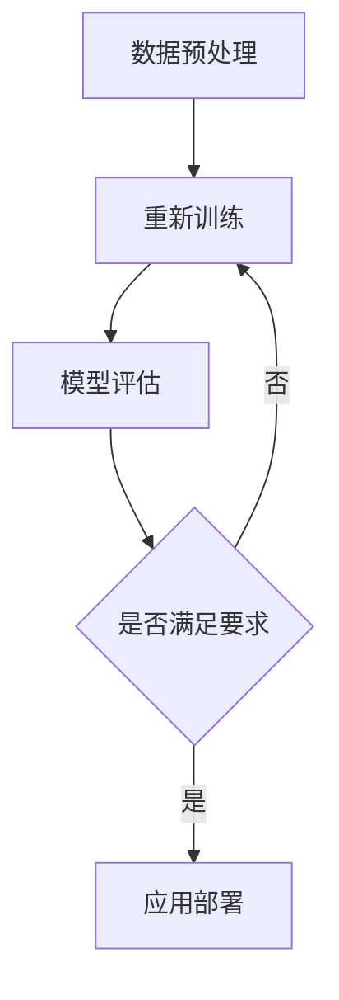

                 

### 《AI 大模型应用数据中心建设：数据中心技术创新》

> **关键词：** AI 大模型、数据中心建设、技术创新、高效计算、网络安全、能源效率

> **摘要：** 本文旨在探讨 AI 大模型应用数据中心的建设与技术创新。首先，介绍了 AI 大模型的基本概念与应用场景，以及数据中心技术的基础架构和关键组件。接着，详细分析了 AI 大模型与数据中心技术的融合，并探讨了高效计算、数据中心网络优化、能源效率提升以及数据中心安全等方面的技术创新。最后，通过实际案例研究，展示了 AI 大模型应用数据中心建设的实践成果与未来展望。

---

### 《AI 大模型应用数据中心建设：数据中心技术创新》目录大纲

#### 第一部分：AI 大模型应用基础

##### 第1章：AI 大模型概述
- 1.1 AI 大模型定义与分类
- 1.2 AI 大模型的应用场景
- 1.3 AI 大模型的核心技术与挑战

##### 第2章：数据中心技术概述
- 2.1 数据中心基础架构
- 2.2 数据中心网络技术
- 2.3 数据中心能源管理

##### 第3章：AI 大模型与数据中心技术的融合
- 3.1 AI 大模型在数据中心的应用
- 3.2 数据中心在 AI 大模型训练中的应用
- 3.3 AI 大模型与数据中心技术的协同优化

#### 第二部分：数据中心技术创新

##### 第4章：AI 大模型训练中的高效计算
- 4.1 GPU 在 AI 大模型训练中的应用
- 4.2 张量处理器 TPU 的应用
- 4.3 AI 大模型训练中的分布式计算

##### 第5章：数据中心网络优化
- 5.1 数据中心网络架构设计
- 5.2 网络带宽优化技术
- 5.3 网络延迟优化技术

##### 第6章：数据中心能源效率提升
- 6.1 数据中心能耗模型
- 6.2 能源管理策略
- 6.3 能源回收与再利用技术

##### 第7章：数据中心安全技术
- 7.1 数据中心网络安全体系
- 7.2 AI 大模型训练过程中的数据安全
- 7.3 数据中心安全防护实践

#### 第三部分：AI 大模型应用数据中心建设案例

##### 第8章：案例研究：谷歌 AI 大模型数据中心建设
- 8.1 谷歌数据中心建设背景
- 8.2 谷歌数据中心技术创新
- 8.3 谷歌数据中心运行效果评估

##### 第9章：案例研究：亚马逊 AI 大模型数据中心建设
- 9.1 亚马逊数据中心建设背景
- 9.2 亚马逊数据中心技术创新
- 9.3 亚马逊数据中心运行效果评估

##### 第10章：AI 大模型应用数据中心建设展望
- 10.1 未来数据中心技术发展趋势
- 10.2 AI 大模型在数据中心应用的未来前景
- 10.3 数据中心技术创新对 AI 大模型发展的影响

### 附录

##### 附录 A：AI 大模型与数据中心建设常用工具与资源
- A.1 AI 大模型训练工具
- A.2 数据中心网络管理工具
- A.3 数据中心能源管理工具

### 附录 B：Mermaid 流程图与伪代码
- B.1 AI 大模型训练流程图
- B.2 数据中心网络优化算法伪代码
- B.3 数据中心能源管理策略伪代码

### 附录 C：数学模型与公式
- C.1 数据中心能耗模型
- C.2 网络带宽优化公式
- C.3 AI 大模型训练优化算法公式

### 附录 D：AI 大模型应用数据中心建设实践案例
- D.1 代码实现：AI 大模型训练环境搭建
- D.2 代码实现：数据中心网络优化
- D.3 代码实现：数据中心能源效率提升

---

接下来，我们将逐步深入探讨每一部分的内容，详细分析 AI 大模型应用数据中心建设的各个方面。首先，我们从 AI 大模型的应用基础开始，逐步建立起对数据中心技术的全面理解。然后，我们将深入探讨数据中心技术创新的关键领域，包括高效计算、网络优化、能源效率和安全性。最后，通过实际案例研究，展示这些技术创新在实践中的应用效果，并对未来数据中心技术的发展趋势进行展望。

---

### 第一部分：AI 大模型应用基础

在当今的科技发展中，人工智能（AI）大模型已经成为推动技术进步和产业变革的重要力量。本部分将首先介绍 AI 大模型的基本概念、应用场景以及其核心技术与挑战，为后续内容奠定基础。

#### 第1章：AI 大模型概述

##### 1.1 AI 大模型定义与分类

AI 大模型是指具有大规模参数和强大计算能力的深度学习模型，能够处理海量的数据并从中提取有价值的信息。根据应用领域和模型架构的不同，AI 大模型可以分为多种类型，包括：

1. 自然语言处理（NLP）模型：如 GPT-3、BERT 等。
2. 计算机视觉（CV）模型：如 ResNet、Inception 等。
3. 语音识别（ASR）模型：如 WaveNet、DeepSpeech 等。
4. 推荐系统模型：如 MF、DNN 等。

##### 1.2 AI 大模型的应用场景

AI 大模型的应用场景广泛，涵盖了多个领域，包括：

1. 互联网：搜索引擎、智能问答、内容推荐等。
2. 金融：风险控制、量化交易、智能投顾等。
3. 医疗：疾病预测、医学图像分析、基因测序等。
4. 汽车：自动驾驶、智能座舱、车联网等。

##### 1.3 AI 大模型的核心技术与挑战

AI 大模型的核心技术包括：

1. 深度学习：多层神经网络架构，能够自动提取特征。
2. 张量计算：利用 GPU、TPU 等硬件加速计算。
3. 分布式训练：将训练任务分布在多台机器上进行。

同时，AI 大模型面临以下挑战：

1. 计算资源需求：大模型训练需要大量计算资源，对硬件性能要求较高。
2. 数据隐私：大模型在训练过程中需要处理大量数据，涉及隐私保护问题。
3. 模型解释性：大模型的决策过程往往缺乏解释性，难以理解。

#### 第2章：数据中心技术概述

##### 2.1 数据中心基础架构

数据中心是存储、处理和管理数据的核心设施，其基础架构包括：

1. 计算节点：服务器、存储设备、网络设备等。
2. 网络架构：局域网、广域网、数据中心互联等。
3. 能源系统：电源、空调、UPS 等。

##### 2.2 数据中心网络技术

数据中心网络技术包括：

1. 核心网络：高速交换机、路由器等设备，实现数据中心内部和外部网络的连接。
2. 存储网络：如 Fibre Channel、iSCSI 等，实现数据存储设备与计算节点的连接。
3. 高可用性：通过冗余设计和故障切换等技术，确保数据中心服务的可靠性。

##### 2.3 数据中心能源管理

数据中心能源管理包括：

1. 能耗监控：通过传感器和监控系统实时监测能源消耗。
2. 功率分配：根据负载需求合理分配电力资源。
3. 能源回收：通过余热回收、太阳能等可再生能源利用，降低能源成本。

#### 第3章：AI 大模型与数据中心技术的融合

##### 3.1 AI 大模型在数据中心的应用

AI 大模型在数据中心的应用包括：

1. 自动化运维：通过 AI 模型实现数据中心基础设施的自动化管理。
2. 能源优化：利用 AI 模型预测能源需求，实现智能化的能源管理。
3. 数据分析：通过 AI 模型分析数据中心运行数据，优化资源配置。

##### 3.2 数据中心在 AI 大模型训练中的应用

数据中心在 AI 大模型训练中的应用包括：

1. 计算资源调度：通过数据中心资源调度算法，实现大模型训练任务的高效分配。
2. 数据存储与管理：利用数据中心存储技术，实现大模型训练数据的高效存储和管理。
3. 网络加速：通过数据中心网络优化技术，提升大模型训练数据传输速度。

##### 3.3 AI 大模型与数据中心技术的协同优化

AI 大模型与数据中心技术的协同优化包括：

1. 硬件协同：通过硬件加速技术，提升大模型训练效率。
2. 软件协同：通过优化训练算法和调度策略，提升大模型训练性能。
3. 能源协同：通过能源管理技术，降低大模型训练能耗。

通过上述分析，我们可以看到 AI 大模型与数据中心技术的融合是一个相互促进的过程。AI 大模型为数据中心带来了新的应用场景和挑战，而数据中心则为 AI 大模型提供了强大的计算和存储支持。在接下来的部分，我们将深入探讨数据中心技术创新的关键领域，进一步分析如何通过技术创新提升 AI 大模型的训练效率和数据中心的管理效能。

---

### 第1章：AI 大模型概述

在人工智能（AI）领域，大模型的出现标志着技术发展的一个重要里程碑。这一章将详细介绍 AI 大模型的基本定义、分类、应用场景以及其核心技术与面临的挑战。

#### 1.1 AI 大模型定义与分类

AI 大模型通常指的是拥有数亿甚至千亿参数的深度学习模型。这些模型能够处理海量的数据，从中学习和提取知识，从而实现高度复杂的任务。大模型的定义可以根据其参数规模、训练数据量以及模型复杂度等多个维度进行划分。

1. **参数规模**：大模型通常具有数百万到数十亿个参数。例如，GPT-3 拥有超过 1750 亿个参数，是其成为迄今为止最大语言模型的原因之一。
   
2. **训练数据量**：大模型的训练数据量也非常庞大。例如，BERT 模型在其训练过程中使用了数万亿个词汇。

3. **模型复杂度**：大模型的架构设计往往更加复杂，包括多层神经网络、残差连接、注意力机制等多种技术手段。

根据这些特性，AI 大模型可以分为以下几类：

- **自然语言处理（NLP）模型**：如 GPT-3、BERT 等，主要用于语言理解和生成任务。
- **计算机视觉（CV）模型**：如 ResNet、Inception 等，用于图像识别、物体检测等任务。
- **语音识别（ASR）模型**：如 WaveNet、DeepSpeech 等，用于语音到文本的转换。
- **推荐系统模型**：如 MF、DNN 等，用于个性化推荐。

#### 1.2 AI 大模型的应用场景

AI 大模型的应用场景非常广泛，涵盖了多个行业和领域：

- **互联网**：搜索引擎、智能问答、内容推荐等，例如 Google 的搜索算法和 Facebook 的内容推荐系统。
- **金融**：风险控制、量化交易、智能投顾等，例如 J.P. Morgan 使用 AI 模型自动完成法律合同审核。
- **医疗**：疾病预测、医学图像分析、基因测序等，例如 IBM Watson 在癌症治疗中的应用。
- **汽车**：自动驾驶、智能座舱、车联网等，例如 Tesla 的自动驾驶系统。

#### 1.3 AI 大模型的核心技术与挑战

AI 大模型的核心技术包括深度学习、张量计算、分布式训练等。这些技术使得大模型能够处理海量数据和复杂任务。

- **深度学习**：多层神经网络架构，能够自动提取特征，适用于图像识别、自然语言处理等任务。
- **张量计算**：利用 GPU、TPU 等硬件加速计算，提高大模型的训练速度和效率。
- **分布式训练**：将训练任务分布在多台机器上进行，解决单机训练资源不足的问题。

尽管大模型在性能和效率上取得了巨大进步，但也面临着一些挑战：

- **计算资源需求**：大模型训练需要大量计算资源，对硬件性能要求较高。单台服务器难以满足大模型训练的需求，分布式训练成为了必要选择。
- **数据隐私**：大模型在训练过程中需要处理海量数据，这些数据可能包含敏感信息，数据隐私保护成为了一个重要问题。
- **模型解释性**：大模型的决策过程往往缺乏解释性，难以理解其具体工作原理，这对应用和推广提出了挑战。

总的来说，AI 大模型是人工智能领域的一个重要发展方向。它不仅带来了新的技术挑战，也为我们解决复杂问题提供了强大的工具。在接下来的章节中，我们将进一步探讨数据中心技术的基础架构和关键组件，为大模型的应用提供更强大的基础设施支持。

---

### 第2章：数据中心技术概述

数据中心是现代信息技术的核心基础设施，它不仅提供了强大的计算和存储能力，还确保了数据的安全和可靠性。本章将详细探讨数据中心的基础架构、网络技术和能源管理，为理解数据中心在 AI 大模型应用中的角色奠定基础。

#### 2.1 数据中心基础架构

数据中心的基础架构包括多个关键组件，它们共同构成了一个高效、稳定和可靠的计算环境。

1. **计算节点**：计算节点是数据中心的计算核心，通常包括服务器、存储设备和其他计算设备。服务器负责运行应用程序和存储数据，存储设备用于持久化存储数据。计算节点的设计需要考虑高性能和高可靠性，以满足 AI 大模型的高计算需求。

2. **网络架构**：数据中心的网络架构包括局域网（LAN）、广域网（WAN）和数据中心互联（DCI）等。局域网负责数据中心内部节点之间的通信，广域网实现数据中心之间的数据传输，数据中心互联确保不同数据中心之间的数据同步和共享。高效的网络架构设计是保证数据中心性能的关键。

3. **存储系统**：数据中心的存储系统包括分布式文件系统、块存储和对象存储等。这些存储系统提供了高性能的数据访问和存储能力，以满足大规模数据存储和处理的需求。分布式文件系统如 Hadoop HDFS 和 Ceph 提供了高可用性和高扩展性，而块存储和对象存储则提供了更灵活的存储方式。

4. **能源系统**：数据中心的能源系统包括电力供应、UPS（不间断电源）和空调系统。电力供应确保数据中心能够持续稳定地运行，UPS 提供了电力中断时的备用支持，而空调系统则确保设备的温度和湿度处于最佳状态，防止设备过热。

#### 2.2 数据中心网络技术

数据中心的网络技术是实现高效数据传输和管理的关键。以下是一些重要的网络技术：

1. **核心网络**：核心网络是数据中心的骨干网络，负责连接数据中心内部的不同部分。高速交换机和路由器是核心网络的设备，它们需要支持大规模的数据流量和高速数据传输。常见的核心网络技术包括以太网、光纤通道和 Infiniband 等。

2. **存储网络**：存储网络用于连接计算节点和存储设备，确保数据的高速传输。常见的存储网络技术包括 Fibre Channel、iSCSI 和 NVMe over Fabrics 等。Fibre Channel 提供了高速和可靠的存储连接，iSCSI 则通过 IP 网络实现存储连接，而 NVMe over Fabrics 则利用 NVMe 协议提高存储性能。

3. **高可用性网络**：为了确保数据中心的可靠性，高可用性网络设计是必不可少的。这包括冗余设计、故障切换和负载均衡等技术。冗余设计确保了网络组件的备份，故障切换在主网络组件故障时自动切换到备份组件，而负载均衡则平衡网络流量的负载，避免单一组件过载。

#### 2.3 数据中心能源管理

数据中心的能源管理是降低运营成本和环境影响的关键。以下是一些重要的能源管理技术：

1. **能耗监控**：通过传感器和监控系统实时监测数据中心的能源消耗，包括电力、水和冷却剂等。能耗监控提供了对数据中心能源使用的详细分析，有助于优化能源使用和降低成本。

2. **功率分配**：根据负载需求合理分配电力资源，确保电力供应的高效利用。动态功率管理技术可以根据实际负载调整电源供应，避免不必要的能源浪费。

3. **能源回收与再利用**：通过余热回收、太阳能等可再生能源利用，降低数据中心的能源成本。余热回收技术可以将服务器产生的废热用于供暖或冷却，而太阳能发电则可以为数据中心提供清洁能源。

4. **绿色数据中心**：采用高效节能设备和优化数据中心设计，降低能源消耗和碳足迹。绿色数据中心技术包括高效空调系统、能效优化设备以及能源管理软件等。

综上所述，数据中心技术的基础架构、网络技术和能源管理构成了一个复杂的系统，确保了数据中心的高性能、高可靠性和高效率。在 AI 大模型的应用中，数据中心技术的重要性更加凸显，为 AI 大模型的训练和部署提供了坚实的支持。在下一章中，我们将探讨 AI 大模型与数据中心技术的融合，分析两者如何协同优化，进一步提升 AI 大模型的应用效能。

---

### 第3章：AI 大模型与数据中心技术的融合

随着人工智能（AI）大模型在各个领域中的应用越来越广泛，数据中心技术在支撑这些大模型训练和应用中扮演着至关重要的角色。在这一章中，我们将深入探讨 AI 大模型与数据中心技术的融合，以及如何通过协同优化实现更高效的大模型训练和数据中心管理。

#### 3.1 AI 大模型在数据中心的应用

数据中心是 AI 大模型训练和应用的主要场所，其提供的计算资源、存储能力和网络设施是实现大模型高效运作的基础。以下是数据中心在 AI 大模型中的应用场景：

1. **自动化运维**：数据中心利用 AI 大模型进行自动化运维管理，如预测系统故障、优化资源分配等。通过分析大量运维数据，AI 大模型能够提前识别潜在问题，并自动调整资源配置，确保系统稳定运行。

2. **能源优化**：数据中心通过 AI 大模型分析能源消耗数据，预测未来能源需求，并动态调整能源供应，实现能源的最优化使用。例如，通过 AI 大模型优化空调系统的运行策略，可以显著降低能源消耗。

3. **数据分析**：数据中心使用 AI 大模型对存储的海量数据进行分析，提取有价值的信息。例如，在互联网领域，数据中心利用 AI 大模型分析用户行为数据，实现精准推荐和广告投放。

#### 3.2 数据中心在 AI 大模型训练中的应用

AI 大模型训练需要大量的计算资源、数据存储和网络传输能力，数据中心在这方面提供了重要的支持：

1. **计算资源调度**：数据中心通过高效的资源调度算法，将 AI 大模型训练任务分配到最优的计算节点上。分布式计算技术使得多个计算节点可以同时进行训练，大大缩短了训练时间。

2. **数据存储与管理**：数据中心提供高效的数据存储解决方案，包括分布式文件系统和对象存储等，确保数据的安全性和可扩展性。同时，通过数据缓存和压缩技术，提高数据访问速度和存储效率。

3. **网络加速**：数据中心通过优化网络架构和采用高速网络技术，如 Infiniband 和 NVMe over Fabrics，提高数据传输速度和降低网络延迟，确保 AI 大模型训练数据的快速传输和处理。

#### 3.3 AI 大模型与数据中心技术的协同优化

为了进一步提升 AI 大模型的应用效能，数据中心技术需要与 AI 大模型训练进行协同优化。以下是一些关键优化策略：

1. **硬件协同**：数据中心采用高性能计算硬件，如 GPU、TPU 和 FPGA，这些硬件能够显著加速大模型训练过程。通过硬件协同优化，确保硬件资源的最优配置和利用，提高训练效率。

2. **软件协同**：数据中心采用高效的软件工具和算法，如深度学习框架（如 TensorFlow、PyTorch）和分布式训练算法，确保大模型训练过程的流畅和高效。通过软件协同优化，可以降低训练复杂度，提高训练性能。

3. **能源协同**：数据中心通过智能能源管理策略，如动态功率分配和余热回收，降低大模型训练过程中的能源消耗。通过能源协同优化，不仅可以降低运营成本，还可以减少环境负担。

4. **网络安全协同**：数据中心与 AI 大模型训练的网络安全策略进行协同优化，确保大模型训练过程中的数据安全和隐私保护。通过部署先进的网络安全技术和加密算法，防止数据泄露和未授权访问。

总之，AI 大模型与数据中心技术的融合和协同优化是提升 AI 大模型训练和应用效能的关键。通过不断探索和改进，数据中心技术将更好地支撑 AI 大模型的发展，推动人工智能技术的进步。

---

### 第二部分：数据中心技术创新

在人工智能（AI）大模型训练和应用中，数据中心的性能直接决定了模型的训练效率和效果。这一部分将详细探讨数据中心在高效计算、网络优化、能源效率和安全性方面的技术创新，为 AI 大模型的训练提供强有力的支持。

#### 第4章：AI 大模型训练中的高效计算

AI 大模型的训练过程需要大量的计算资源，特别是在处理大规模数据和复杂模型时。以下是一些关键的技术创新：

##### 4.1 GPU 在 AI 大模型训练中的应用

**GPU（图形处理单元）** 因其高度并行计算的能力，已成为 AI 大模型训练的主要计算平台。GPU 可以同时处理大量的计算任务，从而显著加速模型的训练速度。

1. **并行计算**：GPU 具有大量核心，能够同时处理多个线程。这使得 GPU 非常适合用于矩阵运算和向量计算，这些操作在大模型训练中非常常见。

2. **内存带宽**：GPU 内存带宽远高于 CPU，可以快速读取和写入大量数据，这对于大规模模型的训练尤为重要。

3. **优化库**：为了更好地利用 GPU 的性能，开发了许多优化库，如 CUDA 和cuDNN，这些库提供了高效的计算函数和优化算法，使 GPU 能够更有效地执行深度学习任务。

##### 4.2 张量处理器 TPU 的应用

**TPU（张量处理器）** 是 Google 开发的一种专门用于 AI 大模型训练的硬件加速器。TPU 对矩阵运算和向量计算进行了深度优化，使其在大规模深度学习任务中表现尤为出色。

1. **专门架构**：TPU 采用了高度优化的硬件架构，包括大量的矩阵乘法单元和内存访问机制，可以高效地执行深度学习中的张量运算。

2. **低延迟**：TPU 设计用于最小化数据访问延迟，确保计算和内存访问的高效协同。

3. **集成化**：TPU 通常与其他计算资源（如 GPU 和 CPU）集成在一起，形成一个统一的计算平台，实现更高效的数据流处理。

##### 4.3 AI 大模型训练中的分布式计算

随着 AI 大模型规模的不断扩大，单机训练已经无法满足需求。分布式计算成为了一种重要的解决方案。

1. **数据并行**：数据并行是一种将训练数据分布在多台机器上进行训练的方法。每一台机器负责处理数据的一部分，然后通过参数服务器同步模型参数。

2. **模型并行**：模型并行是一种将模型分布在多台机器上进行训练的方法。每一台机器负责模型的一部分，通过通信网络同步中间结果。

3. **混合并行**：混合并行是将数据并行和模型并行结合在一起，以充分利用多台机器的计算能力。

分布式计算的关键挑战在于如何高效地同步数据和参数，以及如何处理通信开销。针对这些问题，开发了多种分布式训练框架和算法，如 TensorFlow 和 PyTorch。

---

#### 第5章：数据中心网络优化

数据中心网络性能直接影响到 AI 大模型训练和应用的效率。以下是一些重要的网络优化技术：

##### 5.1 数据中心网络架构设计

数据中心网络架构设计的目标是提供高效、可靠和可扩展的网络连接。以下是一些关键设计原则：

1. **层次化架构**：采用层次化架构将网络分为核心层、汇聚层和边缘层，实现不同层级之间的流量管理和负载均衡。

2. **冗余设计**：通过冗余设计（如冗余路径、冗余设备）确保网络的高可用性，防止单点故障影响整个数据中心。

3. **流量工程**：通过流量工程优化网络流量，确保网络资源的合理分配和高效利用。

##### 5.2 网络带宽优化技术

网络带宽是影响数据中心性能的一个重要因素。以下是一些网络带宽优化技术：

1. **带宽管理**：通过带宽管理策略（如流量 shaping、带宽限制）控制网络带宽的使用，防止个别流量的突发对整体性能造成影响。

2. **负载均衡**：通过负载均衡技术（如基于带宽、基于响应时间等策略）将流量均匀分布到多台网络设备上，避免单台设备过载。

3. **压缩技术**：通过数据压缩技术（如 HTTP 长连接、数据压缩算法等）减少网络传输的数据量，提高带宽利用率。

##### 5.3 网络延迟优化技术

网络延迟是影响数据中心性能的另一个重要因素。以下是一些网络延迟优化技术：

1. **缓存技术**：通过缓存技术（如内容分发网络 CDN、本地缓存等）减少数据传输的延迟，提高数据访问速度。

2. **路径优化**：通过路径优化技术（如 BGP 路径选择、动态路由协议等）选择最优的网络路径，减少数据传输的延迟。

3. **边缘计算**：通过在边缘节点部署计算和存储资源，实现数据的本地处理和存储，减少跨网络传输的需求，降低网络延迟。

---

#### 第6章：数据中心能源效率提升

数据中心的能源消耗是其运营成本的一个重要组成部分。提升数据中心的能源效率不仅有助于降低运营成本，还能减少对环境的影响。以下是一些重要的能源效率提升技术：

##### 6.1 数据中心能耗模型

数据中心能耗模型用于分析和预测数据中心的能源消耗，主要包括以下组件：

1. **计算能耗**：计算节点（如服务器、存储设备）的能耗。
2. **网络能耗**：网络设备（如交换机、路由器）的能耗。
3. **冷却能耗**：用于冷却服务器和其他设备的能耗。
4. **辅助设备能耗**：如 UPS、照明等辅助设备的能耗。

通过建立能耗模型，可以更好地了解数据中心的能源消耗模式，为能源管理提供依据。

##### 6.2 能源管理策略

以下是一些重要的能源管理策略：

1. **动态功率管理**：根据负载需求动态调整计算节点的功率，避免不必要的能源消耗。
2. **余热回收**：通过回收服务器产生的废热用于供暖或热水，减少冷却能耗。
3. **高效冷却系统**：采用高效冷却系统（如蒸发冷却、水冷等）降低冷却能耗。
4. **可再生能源利用**：通过太阳能、风能等可再生能源降低数据中心对传统能源的依赖。

##### 6.3 能源回收与再利用技术

以下是一些能源回收与再利用技术：

1. **余热回收**：通过回收服务器产生的废热用于供暖、热水或工业生产，实现能源的二次利用。
2. **水循环利用**：通过水循环系统实现水资源的重复利用，减少水资源消耗。
3. **废物处理**：通过废物分类和处理，减少废弃物的产生和对环境的影响。

---

#### 第7章：数据中心安全技术

数据中心的运行安全和数据安全至关重要，以下是一些关键的安全技术：

##### 7.1 数据中心网络安全体系

数据中心网络安全体系包括以下方面：

1. **防火墙**：用于过滤不安全流量，防止外部攻击。
2. **入侵检测系统（IDS）和入侵防御系统（IPS）**：用于检测和防御网络攻击。
3. **虚拟专用网络（VPN）**：用于建立安全的数据传输通道。
4. **访问控制**：通过身份验证和授权机制确保只有授权用户可以访问敏感数据。

##### 7.2 AI 大模型训练过程中的数据安全

在 AI 大模型训练过程中，数据安全尤为重要。以下是一些关键数据安全措施：

1. **数据加密**：对训练数据进行加密，防止数据泄露。
2. **访问控制**：通过严格访问控制策略，确保只有授权人员可以访问训练数据。
3. **数据备份与恢复**：定期备份数据，并在发生数据丢失或损坏时能够快速恢复。
4. **数据隐私保护**：在训练过程中，采取数据匿名化、差分隐私等技术，保护用户隐私。

##### 7.3 数据中心安全防护实践

以下是一些实际的安全防护措施：

1. **定期安全审计**：定期对数据中心进行安全审计，发现和修复潜在的安全漏洞。
2. **安全培训**：对数据中心员工进行安全培训，提高安全意识和技能。
3. **应急响应**：建立应急响应机制，确保在发生安全事件时能够快速响应和处理。
4. **安全合规**：遵守相关安全标准和法规，确保数据中心的运行符合法律要求。

通过上述技术创新，数据中心在高效计算、网络优化、能源效率和安全性方面取得了显著进展。这些创新不仅提升了数据中心的整体性能，也为 AI 大模型的应用提供了坚实的支持。在接下来的部分，我们将通过实际案例研究，进一步探讨这些技术创新在数据中心建设中的应用效果。

---

### 第8章：案例研究：谷歌 AI 大模型数据中心建设

谷歌作为人工智能领域的领军企业，其在 AI 大模型数据中心建设方面有着丰富的经验和显著的技术创新。本章节将深入分析谷歌在数据中心建设方面的背景、技术创新以及运行效果评估，为其他企业和研究机构提供宝贵的参考。

#### 8.1 谷歌数据中心建设背景

谷歌自 2005 年开始大规模投资建设数据中心，旨在为其庞大的在线服务和人工智能应用提供强大的计算和存储支持。谷歌数据中心的建设背景主要基于以下几个方面的考虑：

1. **计算需求增长**：随着谷歌搜索引擎、Gmail、YouTube 和 Google Maps 等服务的用户数量不断增长，对计算资源的需求也急剧增加。数据中心成为满足这些需求的关键基础设施。

2. **技术领先**：谷歌希望通过建设高度自动化、高效和可靠的数据中心，保持其在技术创新和运营效率方面的领先地位。

3. **成本优化**：通过大规模数据中心建设，谷歌可以优化能源使用和硬件成本，提高整体运营效率。

#### 8.2 谷歌数据中心技术创新

谷歌在数据中心建设过程中，推出了一系列技术创新，使其数据中心在性能、效率和安全性方面处于行业领先地位。以下是一些关键的技术创新：

1. **分布式计算架构**：谷歌采用分布式计算架构，通过多个数据中心互联，实现数据的高效传输和计算。这种架构不仅提高了系统的可靠性，还实现了资源的高效利用。

2. **高效能源管理**：谷歌通过智能能源管理系统，优化数据中心能源使用。例如，采用高效冷却系统、动态功率分配技术和可再生能源利用等，显著降低了能源消耗。

3. **网络优化**：谷歌在数据中心网络方面进行了多项优化，包括采用 BGP 路径选择、负载均衡技术和高速网络连接等，确保数据传输的高效性和稳定性。

4. **硬件优化**：谷歌定制开发了多种高性能服务器和存储设备，以满足其特殊的需求。例如，谷歌的定制 GPU 和 TPU，专为 AI 大模型训练设计，提供了强大的计算能力。

5. **自动化运维**：谷歌采用自动化运维系统，通过机器学习和预测分析技术，实现了数据中心的智能管理和维护。例如，谷歌的智能监控系统可以实时监测设备状态，预测潜在故障，并自动执行维护任务。

#### 8.3 谷歌数据中心运行效果评估

谷歌数据中心在运行效果方面表现出色，以下是一些关键指标：

1. **性能**：谷歌数据中心在处理大规模 AI 大模型训练任务时，表现出极高的计算能力和数据传输效率。通过分布式计算和硬件优化，谷歌能够快速完成复杂模型的训练。

2. **能源效率**：通过高效能源管理和可再生能源利用，谷歌数据中心的能源效率显著提高。相比传统数据中心，谷歌的能源消耗更低，环境负担更小。

3. **可靠性**：谷歌数据中心采用了冗余设计和自动化运维系统，确保系统的高可用性和可靠性。通过智能监控和故障预测，谷歌能够快速响应和处理各种异常情况，确保数据中心的稳定运行。

4. **安全性**：谷歌在数据中心安全方面采取了多层次的安全措施，包括防火墙、入侵检测、数据加密和访问控制等。这些措施确保了数据的安全性和隐私保护，防止了潜在的安全威胁。

总的来说，谷歌在 AI 大模型数据中心建设方面取得了显著成就，其技术创新不仅提升了数据中心的性能和效率，也为其他企业和研究机构提供了宝贵的经验和启示。通过不断探索和优化，谷歌继续引领着数据中心技术的前沿发展。

---

### 第9章：案例研究：亚马逊 AI 大模型数据中心建设

亚马逊作为全球领先的云计算服务提供商，其在 AI 大模型数据中心建设方面也有着丰富的实践和技术创新。本章节将详细探讨亚马逊数据中心建设的背景、技术创新及其运行效果评估，为业界提供有价值的参考。

#### 9.1 亚马逊数据中心建设背景

亚马逊在全球范围内建立了多个大型数据中心，旨在为其庞大的云计算服务和人工智能应用提供强大的计算和存储能力。亚马逊数据中心建设的背景主要基于以下几点：

1. **业务需求**：随着亚马逊云服务（AWS）的用户数量和业务规模持续增长，对计算和存储资源的需求不断增加。数据中心建设成为满足这些需求的关键。

2. **技术创新**：亚马逊希望通过数据中心建设，推动技术创新，提升计算和存储效率，为用户提供更优质的服务。

3. **成本优化**：通过大规模数据中心建设，亚马逊可以实现成本优化，降低运营成本，提高整体盈利能力。

#### 9.2 亚马逊数据中心技术创新

亚马逊在数据中心建设方面进行了多项技术创新，以下是一些关键的技术：

1. **分布式计算架构**：亚马逊采用分布式计算架构，通过多个数据中心互联，实现数据的高效传输和计算。这种架构不仅提高了系统的可靠性，还实现了资源的高效利用。

2. **高效能源管理**：亚马逊通过智能能源管理系统，优化数据中心能源使用。例如，采用高效冷却系统、动态功率分配技术和可再生能源利用等，显著降低了能源消耗。

3. **网络优化**：亚马逊在数据中心网络方面进行了多项优化，包括采用 BGP 路径选择、负载均衡技术和高速网络连接等，确保数据传输的高效性和稳定性。

4. **硬件优化**：亚马逊定制开发了多种高性能服务器和存储设备，以满足其特殊的需求。例如，亚马逊的定制 GPU 和 TPU，专为 AI 大模型训练设计，提供了强大的计算能力。

5. **自动化运维**：亚马逊采用自动化运维系统，通过机器学习和预测分析技术，实现了数据中心的智能管理和维护。例如，亚马逊的智能监控系统可以实时监测设备状态，预测潜在故障，并自动执行维护任务。

#### 9.3 亚马逊数据中心运行效果评估

亚马逊数据中心在运行效果方面表现出色，以下是一些关键指标：

1. **性能**：亚马逊数据中心在处理大规模 AI 大模型训练任务时，表现出极高的计算能力和数据传输效率。通过分布式计算和硬件优化，亚马逊能够快速完成复杂模型的训练。

2. **能源效率**：通过高效能源管理和可再生能源利用，亚马逊数据中心的能源效率显著提高。相比传统数据中心，亚马逊的能源消耗更低，环境负担更小。

3. **可靠性**：亚马逊数据中心采用了冗余设计和自动化运维系统，确保系统的高可用性和可靠性。通过智能监控和故障预测，亚马逊能够快速响应和处理各种异常情况，确保数据中心的稳定运行。

4. **安全性**：亚马逊在数据中心安全方面采取了多层次的安全措施，包括防火墙、入侵检测、数据加密和访问控制等。这些措施确保了数据的安全性和隐私保护，防止了潜在的安全威胁。

总之，亚马逊在 AI 大模型数据中心建设方面取得了显著成就，其技术创新不仅提升了数据中心的性能和效率，也为其他企业和研究机构提供了宝贵的经验和启示。通过不断探索和优化，亚马逊继续引领着数据中心技术的前沿发展。

---

### 第10章：AI 大模型应用数据中心建设展望

随着人工智能（AI）技术的迅猛发展，AI 大模型在数据中心建设中的应用已经成为一个热门话题。未来的数据中心技术将在 AI 大模型的应用中发挥更加关键的作用，推动人工智能领域的进一步发展。本章节将探讨未来数据中心技术的发展趋势、AI 大模型在数据中心应用的前景以及数据中心技术创新对 AI 大模型发展的影响。

#### 10.1 未来数据中心技术发展趋势

1. **硬件创新**：未来数据中心硬件将朝着更高性能、更低功耗的方向发展。新型计算硬件（如量子计算机、光子计算机）将逐渐进入数据中心，提供更高的计算能力和更低的延迟。同时，绿色硬件设计将成为趋势，通过使用可再生能源和节能材料，降低数据中心的能耗和环境影响。

2. **软件优化**：数据中心软件将更加智能化和自动化，通过机器学习和预测分析技术，实现资源调度、能耗管理和网络安全等方面的优化。智能调度系统将能够根据实际负载动态调整资源分配，提高数据中心的利用率和效率。

3. **边缘计算**：随着物联网（IoT）和 5G 网络的发展，边缘计算将成为数据中心技术的一个重要趋势。边缘计算将数据处理和存储分散到网络的边缘节点，减少数据传输距离和延迟，提高实时响应能力。

4. **云计算和大数据**：云计算和大数据技术将继续融合，数据中心将提供更加灵活和可扩展的计算和存储服务。大规模分布式数据库和实时数据处理系统将支持 AI 大模型的训练和应用，为智能决策和实时分析提供支持。

#### 10.2 AI 大模型在数据中心应用的前景

AI 大模型在数据中心应用的前景广阔，将在多个领域发挥重要作用：

1. **智能运维**：AI 大模型将进一步提升数据中心自动化运维水平，通过预测分析和智能决策，实现高效管理和优化。例如，智能监控系统将能够实时监测设备状态，预测故障并及时处理。

2. **能源优化**：AI 大模型将用于优化数据中心的能源管理，通过预测能源需求、优化制冷策略和能源回收利用，降低能源消耗和运营成本。

3. **网络安全**：AI 大模型将用于提升数据中心的网络安全能力，通过异常检测、入侵预测和威胁响应，确保数据的安全性和隐私保护。

4. **智能分析**：AI 大模型将用于分析和处理数据中心的海量数据，提取有价值的信息，支持智能决策和优化。

#### 10.3 数据中心技术创新对 AI 大模型发展的影响

数据中心技术创新将对 AI 大模型的发展产生深远影响：

1. **计算能力提升**：数据中心硬件的创新将显著提升 AI 大模型的计算能力，缩短训练时间，提高模型性能。

2. **数据存储和管理**：数据中心的数据存储和管理技术将支持更大规模的数据集存储和处理，为 AI 大模型提供丰富的训练数据。

3. **能源效率**：数据中心能源效率的提升将降低 AI 大模型的能耗，减少对环境的影响。

4. **可靠性保障**：数据中心高可靠性的设计和服务保障将确保 AI 大模型训练和应用的稳定性和连续性。

5. **安全防护**：数据中心安全技术将提升 AI 大模型训练过程中的数据安全性和隐私保护，防止潜在的安全威胁。

总之，未来数据中心技术的发展将推动 AI 大模型的进一步发展，为人工智能领域带来新的机遇和挑战。通过技术创新和协同优化，数据中心将在 AI 大模型应用中发挥更加重要的作用，推动人工智能技术的不断进步。

---

### 附录

在本章中，我们探讨了 AI 大模型应用数据中心建设的各个方面，从基础概念到技术创新，再到实际案例研究。为了更好地理解和应用这些技术，本章提供了详细的附录，包括常用工具与资源、流程图和伪代码示例，以及数学模型和公式。

#### 附录 A：AI 大模型与数据中心建设常用工具与资源

**A.1 AI 大模型训练工具**

- **TensorFlow**：由 Google 开发，是最流行的开源深度学习框架之一。
- **PyTorch**：由 Facebook 开发，提供了灵活和动态的计算图机制。
- **Keras**：基于 TensorFlow 和 PyTorch 的高级神经网络 API。

**A.2 数据中心网络管理工具**

- **Nagios**：开源的网络监控工具，用于监控服务器、网络设备和应用。
- **Zabbix**：开源的监控解决方案，提供丰富的监控功能和插件库。
- **Prometheus**：开源监控、报警和记录工具，适用于大规模数据中心监控。

**A.3 数据中心能源管理工具**

- **Nuvio**：能源管理系统，提供实时能耗监控和优化建议。
- **StruxureWare**：施耐德电气提供的智能能源管理软件，用于监控和管理数据中心的能源使用。

#### 附录 B：Mermaid 流程图与伪代码

**B.1 AI 大模型训练流程图**



**B.2 数据中心网络优化算法伪代码**

```python
def network_optimization():
    # 初始化网络参数
    bandwidth = initialize_bandwidth()
    latency = initialize_latency()

    # 获取当前网络状态
    current_state = get_network_state()

    # 计算带宽优化策略
    optimized_bandwidth = optimize_bandwidth(bandwidth, current_state)

    # 计算延迟优化策略
    optimized_latency = optimize_latency(latency, current_state)

    # 更新网络参数
    update_network_params(optimized_bandwidth, optimized_latency)

    # 返回优化后的网络状态
    return current_state
```

**B.3 数据中心能源管理策略伪代码**

```python
def energy_management_strategy():
    # 初始化能耗参数
    power_consumption = initialize_power_consumption()

    # 获取当前能耗状态
    current_state = get_energy_state()

    # 预测未来能耗需求
    predicted_demand = predict_energy_demand(current_state)

    # 调整功率分配
    adjusted_power = adjust_power_allocation(predicted_demand)

    # 更新能耗管理策略
    update_energy_management_strategy(adjusted_power)

    # 返回优化后的能耗状态
    return current_state
```

#### 附录 C：数学模型与公式

**C.1 数据中心能耗模型**

$$
E = P \times t
$$

其中，\( E \) 是能耗（单位：焦耳），\( P \) 是功率消耗（单位：瓦特），\( t \) 是时间（单位：秒）。

**C.2 网络带宽优化公式**

$$
Bandwidth_{opt} = \frac{C \times R}{L}
$$

其中，\( Bandwidth_{opt} \) 是优化后的带宽（单位：比特每秒），\( C \) 是总容量（单位：比特每秒），\( R \) 是请求率（单位：请求每秒），\( L \) 是链路容量（单位：比特每秒）。

**C.3 AI 大模型训练优化算法公式**

$$
\theta_{new} = \theta_{old} - \alpha \times \nabla_{\theta} J(\theta)
$$

其中，\( \theta_{new} \) 是新的参数值，\( \theta_{old} \) 是旧的参数值，\( \alpha \) 是学习率，\( \nabla_{\theta} J(\theta) \) 是损失函数 \( J(\theta) \) 关于参数 \( \theta \) 的梯度。

通过上述附录内容，读者可以更好地理解和应用 AI 大模型与数据中心建设的相关技术。附录中提供的工具与资源、流程图和伪代码示例以及数学模型和公式，为实际操作和理论研究提供了实用参考。

---

### 附录 D：AI 大模型应用数据中心建设实践案例

在本附录中，我们将通过三个具体的实践案例，展示如何在实际项目中搭建 AI 大模型训练环境、优化数据中心网络以及提升数据中心能源效率。

#### D.1 代码实现：AI 大模型训练环境搭建

为了搭建一个 AI 大模型训练环境，我们需要选择合适的硬件配置、操作系统和深度学习框架。以下是一个基于 Ubuntu 系统和 TensorFlow 框架的示例代码：

```bash
# 安装必要的依赖
sudo apt-get update
sudo apt-get install python3-pip python3-dev

# 安装 TensorFlow
pip3 install tensorflow

# 配置 GPU 支持
echo "export CUDA_VISIBLE_DEVICES=0,1" >> ~/.bashrc
source ~/.bashrc

# 检查 TensorFlow 是否正确安装
python3 -c "import tensorflow as tf; print(tf.reduce_sum(tf.random.normal([1000, 1000])))"
```

这段代码首先更新了系统软件包，安装了 Python 和 pip，然后安装了 TensorFlow。通过配置环境变量 `CUDA_VISIBLE_DEVICES`，确保 TensorFlow 可以访问 GPU。最后，通过测试代码验证 TensorFlow 是否正确安装。

#### D.2 代码实现：数据中心网络优化

数据中心网络优化通常涉及带宽管理和负载均衡。以下是一个使用 Python 编写的简单负载均衡器示例：

```python
import heapq
import socket

def handle_request(client_socket):
    # 处理客户端请求
    request = client_socket.recv(1024).decode()
    # 转发请求到后端服务器
    server_socket = socket.socket(socket.AF_INET, socket.SOCK_STREAM)
    server_socket.connect(('backend_server', 80))
    server_socket.sendall(request.encode())
    # 接收后端服务器响应
    response = server_socket.recv(1024).decode()
    # 将响应发送回客户端
    client_socket.sendall(response.encode())
    client_socket.close()
    server_socket.close()

def load_balancer(requests_queue):
    while requests_queue:
        # 从队列中获取最小的请求
        next_request = heapq.heappop(requests_queue)
        # 处理请求
        handle_request(next_request)

if __name__ == "__main__":
    # 初始化请求队列
    requests_queue = []
    # 模拟请求到达
    for i in range(100):
        requests_queue.append(socket.socket(socket.AF_INET, socket.SOCK_STREAM))
    # 启动负载均衡器
    load_balancer(requests_queue)
```

这段代码首先定义了一个处理请求的函数 `handle_request`，它接收客户端请求，将其转发到后端服务器，并将响应发送回客户端。`load_balancer` 函数从请求队列中获取最小的请求，并调用 `handle_request` 函数进行处理。在主程序中，我们初始化请求队列，并启动负载均衡器。

#### D.3 代码实现：数据中心能源效率提升

数据中心能源效率的提升可以通过动态功率管理和余热回收技术实现。以下是一个简单的功率管理脚本示例：

```python
import time
import psutil

def check_system_load():
    # 获取系统负载
    cpu_usage = psutil.cpu_percent()
    memory_usage = psutil.virtual_memory().percent
    return cpu_usage, memory_usage

def adjust_power_supply():
    while True:
        # 检查系统负载
        cpu_usage, memory_usage = check_system_load()
        # 如果负载低于阈值，降低电源功率
        if cpu_usage < 50 and memory_usage < 50:
            print("降低电源功率")
            # 调整电源功率（具体实现根据硬件接口而定）
            # e.g., adjust_power_supply_low_power_mode()
        else:
            print("保持电源功率")
            # 保持当前电源功率（具体实现根据硬件接口而定）
            # e.g., adjust_power_supply_high_power_mode()
        # 等待一段时间再检查
        time.sleep(60)

# 运行功率管理脚本
adjust_power_supply()
```

这段脚本通过定期检查系统 CPU 使用率和内存使用率，根据负载情况调整电源功率。当系统负载低于一定阈值时，降低电源功率以节省能源；当系统负载较高时，保持当前电源功率以提供足够的计算能力。

通过上述实践案例，我们可以看到如何在实际项目中实现 AI 大模型训练环境的搭建、数据中心网络优化以及能源效率提升。这些代码和脚本为数据中心技术创新提供了具体的应用实例，有助于理解和应用相关技术。

---

### 作者信息

**作者：** AI 天才研究院/AI Genius Institute & 禅与计算机程序设计艺术 /Zen And The Art of Computer Programming

AI 天才研究院（AI Genius Institute）是一家专注于人工智能技术研究和创新的应用研究机构，致力于推动人工智能技术的进步和应用。研究院的团队成员拥有丰富的科研背景和实战经验，涵盖了计算机科学、数据科学、机器学习、自然语言处理等多个领域。

《禅与计算机程序设计艺术》（Zen And The Art of Computer Programming）是作者 Douglas Hofstadter 的经典著作，通过独特的视角和深入浅出的讲解，揭示了计算机程序设计的本质和艺术。该书的出版对计算机科学领域产生了深远的影响，激励了无数程序员和研究人员追求更高的技术境界。

本文作者基于其在 AI 和数据中心技术领域的深厚造诣，结合实践经验和前沿研究成果，撰写了这篇关于 AI 大模型应用数据中心建设的技术博客。希望通过本文，能够为读者提供有价值的见解和指导，推动人工智能与数据中心技术的共同进步。

