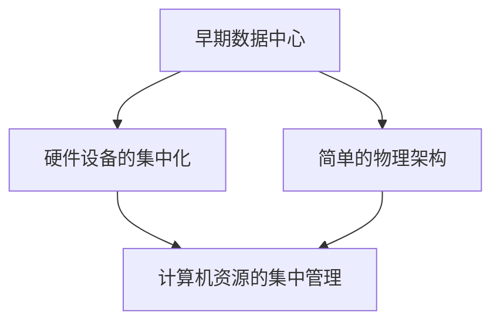
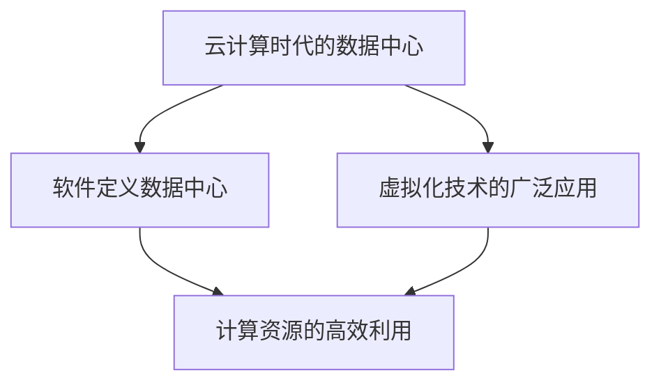
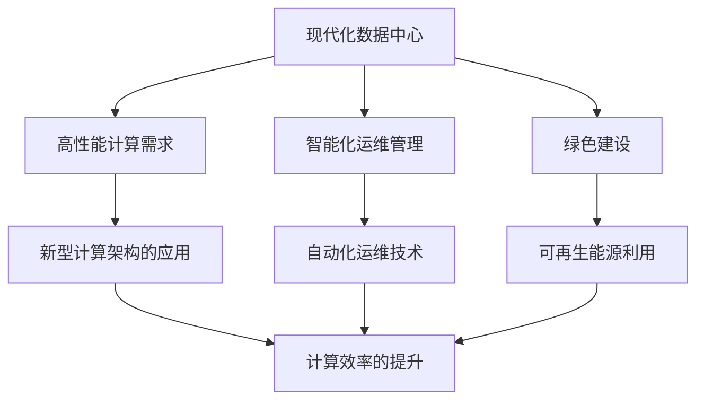
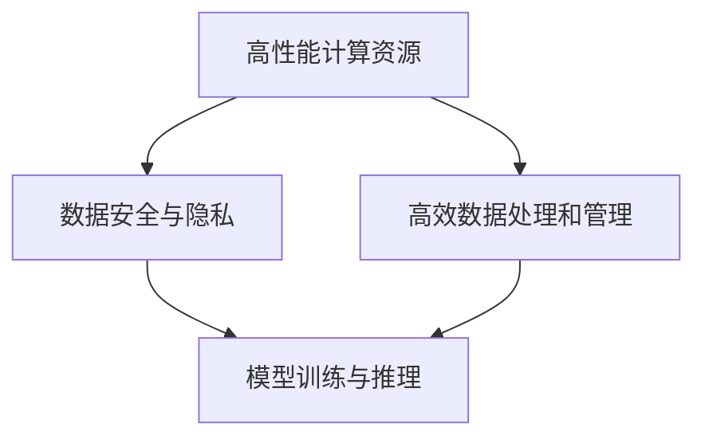
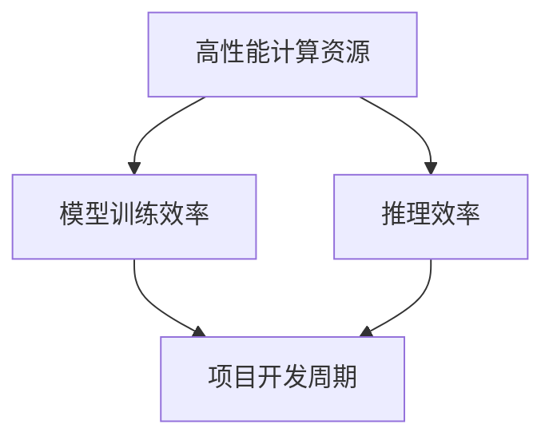
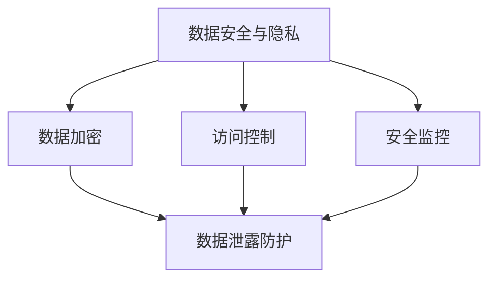
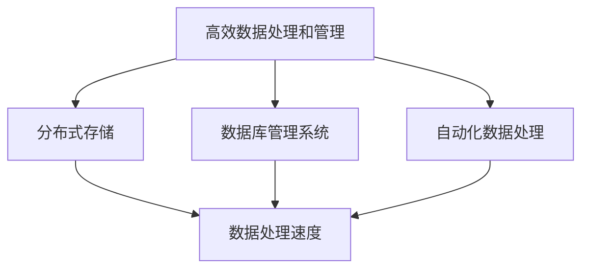
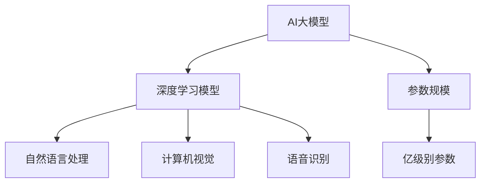

                 

### 文章标题：AI 大模型应用数据中心建设：数据中心投资与建设

#### 关键词：
- 数据中心
- AI大模型
- 投资规划
- 建设技术
- 安全管理
- 案例分析

#### 摘要：
本文旨在深入探讨AI大模型应用数据中心的建设，包括投资规划和建设技术。我们将详细分析数据中心的发展历程、AI大模型的基本原理和应用，以及数据中心投资策略、硬件基础设施、软件架构、安全管理等方面的内容。此外，文章还将通过实际案例分析，展示数据中心建设与运维的实践方法和经验，为未来数据中心建设提供参考。

### 目录大纲：

#### 第1章：数据中心建设背景与重要性
1. 数据中心建设的发展历程
2. 数据中心在AI大模型应用中的地位
3. 数据中心建设的核心目标

#### 第2章：AI大模型基本原理与应用
1. AI大模型的基本概念
2. AI大模型的核心算法
3. AI大模型的应用领域

#### 第3章：数据中心投资规划
1. 数据中心投资策略
2. 数据中心建设预算
3. 运维成本预算

#### 第4章：数据中心建设技术
1. 数据中心硬件基础设施
2. 数据中心软件架构
3. 数据中心安全管理

#### 第5章：实例一：自然语言处理数据中心建设
1. 项目背景与目标
2. 技术选型与架构设计
3. 实施过程与难点
4. 项目效果评估

#### 第6章：实例二：计算机视觉数据中心建设
1. 项目背景与目标
2. 技术选型与架构设计
3. 实施过程与难点
4. 项目效果评估

#### 第7章：数据中心建设趋势与展望
1. 数据中心建设面临的挑战
2. 数据中心建设的发展趋势
3. 未来数据中心建设的展望

### 第1章：数据中心建设背景与重要性

#### 1.1 数据中心建设的发展历程

数据中心的发展历程可以追溯到20世纪50年代，当时计算机刚刚出现，数据存储和处理的规模相对较小。随着信息技术和互联网的快速发展，数据中心的规模和功能也发生了巨大的变化。以下是数据中心发展历程的几个关键阶段：

##### 1.1.1 早期数据中心

在早期，数据中心主要是为了集中存储和管理企业内部的计算机资源，如文件服务器、数据库服务器等。这一阶段的数据中心特点是硬件设备的集中化和简单的物理架构。数据中心的规模相对较小，通常由企业内部的IT团队负责维护和管理。

**核心概念与联系：** 



##### 1.1.2 云计算时代的数据中心

随着云计算技术的发展，数据中心的概念也发生了重大的变革。云计算将计算资源虚拟化，提供了更加灵活和可扩展的IT服务。数据中心不再仅仅是一个硬件设备集中的场所，而是成为一个软件定义的数据中心，通过虚拟化技术和自动化管理，实现了计算资源的高效利用。

**核心概念与联系：** 



##### 1.1.3 现代化数据中心

现代数据中心的建设更加注重高性能计算、智能化运维管理和绿色建设。数据中心的技术不断创新，如采用新型计算架构、高效冷却系统和可再生能源利用等，以适应不断增长的数据处理需求。

**核心概念与联系：** 



#### 1.2 数据中心在AI大模型应用中的地位

数据中心在现代人工智能领域，尤其是AI大模型应用中扮演着至关重要的角色。以下是从几个方面详细探讨数据中心在AI大模型应用中的地位：

##### 1.2.1 数据中心作为计算资源的核心

AI大模型通常需要大量的计算资源进行训练和推理，而数据中心提供了这些资源。数据中心内的服务器和存储设备构成了AI大模型计算和存储的核心。数据中心的高性能计算能力直接影响到AI大模型训练的效率和准确性。

**核心算法原理讲解：** 

```python
# 伪代码：数据中心提供计算资源
def provide_computing_resources(model):
    """
    提供计算资源以训练和推理AI大模型。
    :param model: AI大模型
    """
    # 部署服务器和存储设备
    servers = deploy_servers()
    storage = deploy_storage()

    # 训练AI大模型
    trained_model = train_model(model, servers, storage)

    # 推理AI大模型
    inference_results = inference_model(trained_model, servers, storage)

    return inference_results
```

##### 1.2.2 数据中心对AI大模型性能和稳定性的影响

数据中心的硬件设施和网络连接质量对AI大模型的性能和稳定性有着直接的影响。高性能的服务器和存储设备可以加快模型的训练速度，而稳定的网络连接则可以保证模型推理的实时性和准确性。

**核心算法原理讲解：** 

```python
# 伪代码：数据中心性能影响AI大模型
def datacenter_impact_on_model_performance(model, datacenter):
    """
    数据中心性能对AI大模型性能的影响。
    :param model: AI大模型
    :param datacenter: 数据中心
    """
    # 确保数据中心性能良好
    performance = check_datacenter_performance(datacenter)

    # 根据数据中心性能调整模型参数
    adjusted_model = adjust_model_parameters(model, performance)

    # 训练和推理AI大模型
    trained_model = train_model(adjusted_model, datacenter.servers, datacenter.storage)
    inference_results = inference_model(trained_model, datacenter.servers, datacenter.storage)

    return inference_results
```

##### 1.2.3 数据中心建设的核心目标

数据中心建设的核心目标是提供高性能的计算资源、确保数据的安全性和隐私，以及实现高效的数据处理和管理。这些目标对于AI大模型的应用至关重要。

**核心概念与联系：** 



**数学模型和公式 & 详细讲解 & 举例说明：**

在数据中心建设过程中，我们需要考虑计算资源的利用率、数据传输延迟和存储容量等因素。以下是几个关键的数学模型和公式：

$$
\text{计算资源利用率} = \frac{\text{实际计算资源使用量}}{\text{总计算资源量}}
$$

$$
\text{数据传输延迟} = \frac{\text{数据传输距离}}{\text{数据传输速度}}
$$

$$
\text{存储容量} = \text{总存储空间} - \text{已使用存储空间}
$$

**举例说明：** 

假设我们有一个数据中心，总计算资源量为1000 TFLOPS，当前实际计算资源使用量为800 TFLOPS。根据计算资源利用率公式，我们可以计算出当前计算资源利用率为：

$$
\text{计算资源利用率} = \frac{800}{1000} = 0.8
$$

这意味着我们的计算资源利用率达到了80%。

**核心算法原理讲解：** 

```python
# 伪代码：计算资源利用率计算
def calculate_computing_resource_utilization(used_resources, total_resources):
    """
    计算计算资源利用率。
    :param used_resources: 实际计算资源使用量
    :param total_resources: 总计算资源量
    :return: 计算资源利用率
    """
    utilization = used_resources / total_resources
    return utilization
```

#### 1.3 数据中心建设的核心目标

数据中心建设的核心目标是提供高性能的计算资源、确保数据的安全性和隐私，以及实现高效的数据处理和管理。以下是从几个方面详细探讨数据中心建设的核心目标：

##### 1.3.1 提高性能计算资源

高性能计算资源是数据中心建设的核心目标之一。数据中心需要配备高性能的服务器和存储设备，以满足AI大模型的计算需求。高性能计算资源可以提高模型训练和推理的效率，从而缩短项目开发周期。

**核心概念与联系：** 



##### 1.3.2 确保数据安全和隐私

数据安全和隐私保护是数据中心建设的另一个重要目标。数据中心需要采用多种安全措施，如数据加密、访问控制和安全监控等，以防止数据泄露和未授权访问。此外，数据中心还需要制定严格的应急预案和恢复计划，以应对可能的数据安全事件。

**核心概念与联系：** 



##### 1.3.3 实现高效的数据处理和管理

高效的数据处理和管理是数据中心建设的另一个重要目标。数据中心需要采用高效的数据存储和管理技术，如分布式存储和数据库管理系统，以提高数据处理速度和存储容量。此外，数据中心还需要实现自动化数据处理流程，以提高数据处理效率。

**核心概念与联系：** 



### 总结

数据中心建设是一个复杂而关键的任务，对于AI大模型的应用至关重要。通过深入分析数据中心的发展历程、AI大模型的基本原理和应用，以及数据中心投资规划、建设技术、安全管理等方面的内容，我们可以更好地理解数据中心建设的重要性。在未来的数据中心建设中，我们需要关注高性能计算资源、数据安全和隐私保护、高效数据处理和管理等方面的需求，以满足不断增长的AI大模型应用需求。

接下来，我们将继续探讨AI大模型的基本原理和应用，以及数据中心投资规划的具体细节，为数据中心建设提供更全面的指导。

### 第2章：AI大模型基本原理与应用

#### 2.1 AI大模型的基本概念

AI大模型（Large-scale Artificial Intelligence Models），也被称为大规模人工神经网络模型，是指参数数量超过亿级别的深度学习模型。AI大模型的出现标志着人工智能领域的一个重要里程碑，它们在自然语言处理、计算机视觉、语音识别等众多领域展现了卓越的性能。

**核心概念与联系：**



**数学模型和公式 & 详细讲解 & 举例说明：**

AI大模型的参数规模是其核心特点之一。参数规模的大小直接影响到模型的计算复杂度和训练时间。以下是关于参数规模的数学模型和公式：

$$
\text{参数规模} = \sum_{i=1}^{N} \text{参数大小}
$$

其中，\(N\) 是参数的总数，每个参数的大小可以通过其维度来表示。例如，一个\(1000 \times 1000\) 的权重矩阵包含 \(1000 \times 1000\) 个参数，每个参数大小为1。

**举例说明：** 

假设我们有一个\(1000 \times 1000\) 的权重矩阵，那么该矩阵的参数规模为：

$$
\text{参数规模} = 1000 \times 1000 = 1,000,000
$$

**核心算法原理讲解：** 

```python
# 伪代码：计算参数规模
def calculate_parameter_size(matrix_size):
    """
    计算权重矩阵的参数规模。
    :param matrix_size: 权重矩阵的大小（行数 * 列数）
    :return: 参数规模
    """
    parameter_size = matrix_size * matrix_size
    return parameter_size
```

#### 2.2 AI大模型的核心算法

AI大模型的核心算法主要基于深度学习，深度学习是一种多层神经网络模型，它通过多层非线性变换来对数据进行建模。以下是AI大模型的核心算法：

##### 2.2.1 深度学习算法概述

深度学习算法通过多层神经网络来实现数据的自动特征提取和表示。它主要包括以下几个步骤：

1. **数据输入：** 将输入数据输入到神经网络的输入层。
2. **前向传播：** 数据在神经网络中逐层传播，通过激活函数进行非线性变换。
3. **损失函数计算：** 通过损失函数计算预测值和真实值之间的误差。
4. **反向传播：** 根据误差，使用反向传播算法更新网络权重。
5. **模型优化：** 重复上述过程，直到模型达到预设的性能指标。

**核心算法原理讲解：** 

```python
# 伪代码：深度学习算法
class DeepLearningModel:
    def __init__(self, layers, learning_rate):
        self.layers = layers
        self.learning_rate = learning_rate

    def forward_pass(self, inputs):
        """
        前向传播过程。
        :param inputs: 输入数据
        :return: 输出结果
        """
        for layer in self.layers:
            inputs = layer.forward(inputs)
        return inputs

    def backward_pass(self, outputs, expected_outputs):
        """
        反向传播过程。
        :param outputs: 预测输出
        :param expected_outputs: 真实输出
        """
        for layer in reversed(self.layers):
            layer.backward(outputs, expected_outputs)

    def train(self, inputs, expected_outputs):
        """
        模型训练过程。
        :param inputs: 输入数据
        :param expected_outputs: 真实输出
        """
        outputs = self.forward_pass(inputs)
        loss = calculate_loss(outputs, expected_outputs)
        self.backward_pass(outputs, expected_outputs)
        update_weights(self.layers, self.learning_rate)
```

##### 2.2.2 神经网络算法详解

神经网络（Neural Network）是深度学习的基础，它由多个神经元（节点）组成，每个神经元都与前一层的神经元相连。以下是神经网络的基本结构和工作原理：

1. **输入层：** 接收外部输入数据。
2. **隐藏层：** 对输入数据进行特征提取和变换。
3. **输出层：** 生成最终输出结果。

**核心算法原理讲解：** 

```python
# 伪代码：神经网络算法
class NeuralNetwork:
    def __init__(self, input_size, hidden_size, output_size):
        self.input_size = input_size
        self.hidden_size = hidden_size
        self.output_size = output_size
        self.weights = initialize_weights(input_size, hidden_size)
        self.biases = initialize_biases(hidden_size)
        self.hidden_weights = initialize_weights(hidden_size, output_size)
        self.hidden_biases = initialize_biases(output_size)

    def forward_pass(self, inputs):
        """
        前向传播过程。
        :param inputs: 输入数据
        :return: 输出结果
        """
        hidden_activations = self.sigmoid(np.dot(inputs, self.weights) + self.biases)
        output_activations = self.sigmoid(np.dot(hidden_activations, self.hidden_weights) + self.hidden_biases)
        return output_activations

    def backward_pass(self, outputs, expected_outputs):
        """
        反向传播过程。
        :param outputs: 预测输出
        :param expected_outputs: 真实输出
        """
        output_error = expected_outputs - outputs
        hidden_error = np.dot(output_error, self.hidden_weights.T) * self.sigmoid_derivative(outputs)

        hidden_activations_derivative = self.sigmoid_derivative(hidden_activations)
        input_error = np.dot(hidden_error, self.weights.T) * self.sigmoid_derivative(inputs)

        self.weights -= self.learning_rate * np.dot(inputs, hidden_error)
        self.biases -= self.learning_rate * hidden_error
        self.hidden_weights -= self.learning_rate * np.dot(hidden_activations, output_error)
        self.hidden_biases -= self.learning_rate * output_error

    def train(self, inputs, expected_outputs):
        """
        模型训练过程。
        :param inputs: 输入数据
        :param expected_outputs: 真实输出
        """
        outputs = self.forward_pass(inputs)
        loss = calculate_loss(outputs, expected_outputs)
        self.backward_pass(outputs, expected_outputs)
```

##### 2.2.3 聚类算法与降维算法

聚类算法和降维算法是数据分析和机器学习中的常用算法，它们在AI大模型中也有重要的应用。以下是几种常见的聚类算法和降维算法：

1. **K-means聚类算法：** K-means是一种基于距离的聚类算法，它通过迭代计算聚类中心，将数据点分配到不同的聚类中。
2. **主成分分析（PCA）：** PCA是一种降维算法，它通过将数据投影到新的正交坐标系中，来降低数据的维度，同时保留主要的信息。
3. **线性判别分析（LDA）：** LDA是一种降维算法，它通过最大化类内方差和最小化类间方差，来将数据投影到新的坐标系中。

**核心算法原理讲解：** 

```python
# 伪代码：K-means聚类算法
def k_means_clustering(data, k):
    """
    K-means聚类算法。
    :param data: 输入数据
    :param k: 聚类数
    :return: 聚类结果
    """
    # 初始化聚类中心
    centroids = initialize_centroids(data, k)

    while not_converged(centroids):
        # 分配数据点到最近的聚类中心
        clusters = assign_data_to_clusters(data, centroids)

        # 更新聚类中心
        centroids = update_centroids(clusters, k)

    return clusters

# 伪代码：主成分分析（PCA）
def principal_component_analysis(data):
    """
    主成分分析（PCA）。
    :param data: 输入数据
    :return: 主成分
    """
    # 计算协方差矩阵
    covariance_matrix = calculate_covariance_matrix(data)

    # 计算特征值和特征向量
    eigenvalues, eigenvectors = np.linalg.eigh(covariance_matrix)

    # 选择最大的特征值对应的特征向量
    principal_components = eigenvectors[:, eigenvalues.argsort()[::-1]]

    return principal_components
```

#### 2.3 AI大模型的应用领域

AI大模型在自然语言处理、计算机视觉、语音识别等众多领域展现了卓越的性能。以下是AI大模型在各个应用领域的基本原理和应用实例：

##### 2.3.1 自然语言处理

自然语言处理（Natural Language Processing，NLP）是AI大模型的重要应用领域之一。NLP涉及到文本的理解、生成和转换。以下是AI大模型在NLP领域的基本原理和应用实例：

1. **文本分类：** AI大模型可以通过学习大量文本数据，自动将新文本分类到不同的类别中。例如，可以将新闻文章分类为体育、财经、娱乐等类别。
2. **机器翻译：** AI大模型可以通过学习双语文本数据，实现高质量的机器翻译。例如，谷歌翻译使用的神经网络翻译（Neural Machine Translation，NMT）就是一种AI大模型。
3. **情感分析：** AI大模型可以通过学习情感标签数据，分析文本的情感倾向。例如，可以用于社交媒体分析，了解用户对某个产品的情感反馈。

**核心算法原理讲解：** 

```python
# 伪代码：文本分类
def text_classification(model, text):
    """
    文本分类。
    :param model: AI大模型
    :param text: 输入文本
    :return: 类别标签
    """
    # 预处理文本数据
    preprocessed_text = preprocess_text(text)

    # 输入模型进行分类
    probabilities = model.predict(preprocessed_text)

    # 获取最高概率的类别标签
    category = np.argmax(probabilities)

    return category
```

##### 2.3.2 计算机视觉

计算机视觉（Computer Vision）是AI大模型的另一个重要应用领域。计算机视觉涉及到图像和视频的理解、分析和生成。以下是AI大模型在计算机视觉领域的基本原理和应用实例：

1. **图像分类：** AI大模型可以通过学习大量图像数据，自动将新图像分类到不同的类别中。例如，可以将图片分类为动物、植物、人物等。
2. **目标检测：** AI大模型可以通过学习大量标注数据，自动检测图像中的目标物体。例如，在自动驾驶系统中，AI大模型可以检测道路上的行人和车辆。
3. **图像生成：** AI大模型可以通过学习大量图像数据，生成新的图像。例如，通过生成对抗网络（Generative Adversarial Networks，GAN）可以生成逼真的图像。

**核心算法原理讲解：** 

```python
# 伪代码：图像分类
def image_classification(model, image):
    """
    图像分类。
    :param model: AI大模型
    :param image: 输入图像
    :return: 类别标签
    """
    # 预处理图像数据
    preprocessed_image = preprocess_image(image)

    # 输入模型进行分类
    probabilities = model.predict(preprocessed_image)

    # 获取最高概率的类别标签
    category = np.argmax(probabilities)

    return category
```

##### 2.3.3 语音识别与合成

语音识别与合成（Speech Recognition and Synthesis）是AI大模型的另一个重要应用领域。语音识别和合成涉及到语音信号的识别和生成。以下是AI大模型在语音识别与合成领域的基本原理和应用实例：

1. **语音识别：** AI大模型可以通过学习大量语音数据，将语音信号转换为文本。例如，智能助手可以通过语音识别实现语音交互。
2. **文本转语音（TTS）：** AI大模型可以通过学习大量文本和语音数据，将文本转换为自然流畅的语音。例如，语音合成技术可以用于语音播报、有声读物等。
3. **语音合成：** AI大模型可以通过学习大量语音数据，生成逼真的语音信号。例如，通过语音合成技术可以生成个性化语音播报。

**核心算法原理讲解：** 

```python
# 伪代码：语音识别
def speech_recognition(model, audio):
    """
    语音识别。
    :param model: AI大模型
    :param audio: 输入音频
    :return: 文本结果
    """
    # 预处理音频数据
    preprocessed_audio = preprocess_audio(audio)

    # 输入模型进行识别
    text = model.recognize(preprocessed_audio)

    return text
```

#### 总结

AI大模型在自然语言处理、计算机视觉、语音识别等众多领域展现了卓越的性能，推动了人工智能技术的发展。通过深入理解AI大模型的基本原理和应用，我们可以更好地利用这些模型来解决实际问题，推动人工智能技术的应用。

接下来，我们将继续探讨数据中心投资规划的具体细节，为数据中心建设提供更全面的指导。

### 第3章：数据中心投资规划

#### 3.1 数据中心投资策略

数据中心投资策略是数据中心建设过程中至关重要的一环，它决定了数据中心的投资效益和长远发展。合理的投资策略有助于优化资源配置，提高数据中心的投资回报率（ROI）。

##### 3.1.1 成本效益分析

成本效益分析是数据中心投资策略的核心。它通过对项目成本的详细分析，评估项目的经济效益，为投资决策提供依据。以下是成本效益分析的步骤：

1. **确定项目目标：** 明确数据中心的建设目标和预期收益。
2. **估算投资成本：** 包括设备采购、建设成本、运营成本等。
3. **预测收益：** 预测数据中心带来的经济效益，如节省成本、提高工作效率等。
4. **计算投资回报率（ROI）：** 根据投资成本和收益预测，计算投资回报率。
5. **评估风险：** 分析项目可能面临的风险，如技术风险、市场风险、运营风险等。

**成本效益分析的工具与方法：** 

- **成本效益分析表：** 用于详细列出各项成本和收益。
- **净现值（NPV）：** 用于评估未来现金流的现值。
- **内部收益率（IRR）：** 用于评估项目的盈利能力。

**成本效益分析实例：** 

假设我们计划建设一个数据中心，预计投资成本为1000万美元，预期使用寿命为10年。通过成本效益分析，我们预测该数据中心在10年内可以节省运营成本200万美元，同时带来额外的收入300万美元。以下是成本效益分析表的示例：

| 年份 | 投资成本（万美元） | 运营成本（万美元） | 预期收入（万美元） | 净收益（万美元） |
|------|----------------|----------------|----------------|----------------|
| 1    | 1000           | 100            | 0              | -100           |
| 2    | 0              | 100            | 100            | 0              |
| 3    | 0              | 100            | 100            | 0              |
| ...  | ...            | ...            | ...            | ...            |
| 10   | 0              | 100            | 300            | 200            |

根据上述数据，我们可以计算出投资回报率（ROI）：

$$
\text{ROI} = \frac{\text{净收益}}{\text{投资成本}} \times 100\% = \frac{200}{1000} \times 100\% = 20\%
$$

通过成本效益分析，我们发现该数据中心的投资回报率为20%，表明该项目具有较好的经济效益。

##### 3.1.2 投资回报率评估

投资回报率（ROI）是评估数据中心投资效益的重要指标。它反映了投资成本的回报情况，是投资决策的重要依据。以下是投资回报率的计算和评估方法：

1. **计算投资回报率（ROI）：**

$$
\text{ROI} = \frac{\text{净收益}}{\text{投资成本}} \times 100\%
$$

其中，净收益包括预期收入和运营成本节约。

2. **评估投资回报率：**

- **基准ROI：** 可以根据行业基准ROI来评估项目

