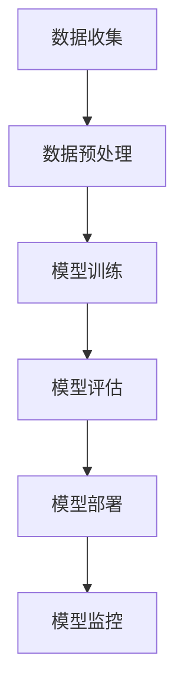
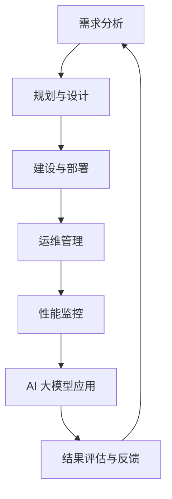
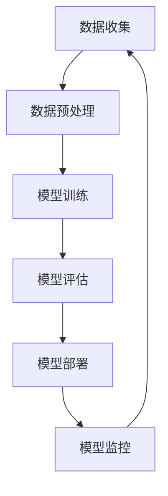

                 

### 文章标题

《AI 大模型应用数据中心建设：数据中心标准与规范》

> 关键词：AI 大模型、数据中心、建设标准、运维管理、网络安全、性能优化

> 摘要：本文深入探讨了 AI 大模型在数据中心建设中的应用，详细介绍了数据中心的标准与规范。通过实例分析，文章阐述了如何利用 AI 大模型优化数据中心选址、容量规划、能源管理、网络安全和性能优化等方面的具体实践。同时，对数据中心运维自动化及未来发展趋势进行了展望，为行业提供了有价值的参考。

---

在当前人工智能迅速发展的时代，数据中心作为信息处理和存储的核心枢纽，其建设标准和运维管理的重要性愈发凸显。AI 大模型的出现，不仅带来了计算能力的飞跃，更在数据中心建设、优化和管理中展现出巨大的潜力。本文旨在通过系统性地阐述 AI 大模型在数据中心建设中的应用，结合实际案例，提供数据中心标准与规范的深度解读。

文章结构如下：

- 第一部分：AI 大模型概述与数据中心建设基础
- 第二部分：数据中心标准与规范
- 第三部分：AI 大模型在数据中心建设中的应用
- 第四部分：数据中心性能监控与优化
- 第五部分：数据中心运维自动化与 AI 大模型
- 第六部分：未来数据中心建设与 AI 大模型发展展望

我们将逐章分析，详细讨论每个部分的核心概念、技术原理、应用实践和未来趋势。通过本文，希望读者能够对 AI 大模型在数据中心建设中的应用有一个全面而深刻的理解。在接下来的章节中，我们将一一展开详细讨论。---

## 第一部分: AI 大模型概述与数据中心建设基础

### 第1章: AI 大模型概述

#### 1.1 AI 大模型的定义与背景

**AI 大模型的概念**

AI 大模型是指那些具有极高参数量、能够处理大规模数据并进行复杂任务学习的神经网络模型。这些模型通常拥有数十亿至数千亿个参数，能够执行自然语言处理、计算机视觉、语音识别等多种复杂任务。具有代表性的大模型包括 GPT-3、BERT、ViT 等。

**AI 大模型的发展历程**

AI 大模型的发展历程可以追溯到神经网络的发展初期。1990 年代，深度神经网络（DNN）开始崭露头角，随后在 2006 年，Hinton 等人提出的深度信念网络（DBN）使得神经网络再次引起广泛关注。2012 年，AlexNet 的成功使得深度学习在图像识别任务中取得了突破性进展。此后，神经架构搜索（NAS）、生成对抗网络（GAN）等新技术的出现进一步推动了大模型的发展。

**AI 大模型的重要性**

AI 大模型的重要性主要体现在以下几个方面：

1. **计算能力的提升**：AI 大模型需要强大的计算资源支持，推动了高性能计算技术的发展。
2. **数据处理能力的增强**：大模型能够处理大规模、多样化的数据，为数据科学和机器学习提供了更丰富的工具。
3. **跨领域应用**：AI 大模型在多个领域展示了出色的性能，从自然语言处理到计算机视觉，再到语音识别等，大大拓宽了人工智能的应用场景。
4. **创新驱动**：AI 大模型的出现激发了新的研究课题和产业应用，推动了人工智能领域的持续创新。

#### 1.2 数据中心建设概述

**数据中心的定义与作用**

数据中心是指用于存储、处理和管理大量数据的计算设施。它为各类企业、组织提供了高效、可靠的数据存储和处理服务。数据中心的定义不仅包括物理设施，还包括网络、存储、计算和冷却系统等。

数据中心的作用主要包括：

1. **数据存储**：数据中心提供了大规模的数据存储解决方案，能够存储各类数据，包括文本、图像、音频和视频等。
2. **数据处理**：数据中心利用计算资源对数据进行处理和分析，支持各种业务应用。
3. **数据备份与恢复**：数据中心提供了数据备份和恢复机制，确保数据的安全性和可靠性。
4. **数据安全**：数据中心采用了多种安全措施，保护数据免受未授权访问和破坏。

**数据中心的发展趋势**

数据中心的发展趋势体现在以下几个方面：

1. **云计算**：随着云计算的普及，数据中心逐渐成为云计算服务的重要基础设施，为企业提供了弹性、高效的计算资源。
2. **绿色化**：为了减少能耗和碳排放，数据中心开始采用节能技术和绿色能源，推动绿色数据中心建设。
3. **智能化**：通过引入人工智能技术，数据中心实现了智能化管理，提高了运营效率。
4. **边缘计算**：随着物联网和 5G 的发展，边缘计算成为数据中心发展的新趋势，将计算和存储能力进一步延伸到网络边缘。

**数据中心建设的基本原则**

数据中心建设需要遵循以下基本原则：

1. **可靠性**：数据中心必须具备高可靠性，确保数据安全和业务连续性。
2. **灵活性**：数据中心应具备良好的扩展性和灵活性，能够适应业务需求的变化。
3. **安全性**：数据中心需要采取严格的安全措施，保护数据免受各种威胁。
4. **可持续性**：数据中心应注重绿色环保，降低能耗和碳排放。

#### 1.3 AI 大模型在数据中心中的应用

**AI 大模型在数据中心建设中的应用场景**

AI 大模型在数据中心建设中的应用场景包括：

1. **数据中心选址**：利用 AI 大模型分析地理、气候、能源等因素，优化数据中心选址。
2. **容量规划**：通过 AI 大模型预测未来业务需求，优化数据中心容量规划。
3. **能源管理**：利用 AI 大模型优化数据中心能源消耗，实现绿色化运营。
4. **网络安全**：AI 大模型可用于网络安全预测和威胁检测，提高数据中心安全防护水平。
5. **性能优化**：通过 AI 大模型优化数据中心资源配置，提高性能和效率。

**AI 大模型对数据中心效率的提升**

AI 大模型对数据中心效率的提升主要体现在以下几个方面：

1. **能耗优化**：通过智能调度和管理，AI 大模型能够降低数据中心能耗，实现绿色化运营。
2. **资源利用率**：AI 大模型优化了数据中心的资源分配，提高了硬件资源利用率。
3. **运维效率**：通过自动化运维和智能诊断，AI 大模型提高了数据中心运维效率。
4. **业务连续性**：AI 大模型增强了数据中心的容错能力和业务连续性，降低了故障风险。

**AI 大模型在数据中心运维中的应用**

AI 大模型在数据中心运维中的应用包括：

1. **故障预测**：通过历史数据和监控数据，AI 大模型能够预测设备故障，提前进行维护。
2. **性能监控**：AI 大模型实时监控数据中心性能，提供优化建议，提高系统性能。
3. **智能调度**：AI 大模型优化数据中心资源调度，提高资源利用效率。
4. **安全防护**：AI 大模型检测网络安全威胁，提高数据中心安全防护能力。

综上所述，AI 大模型在数据中心建设中的应用具有重要意义。通过本章的介绍，读者可以初步了解 AI 大模型的基本概念和数据中心建设的基础知识，为后续章节的深入探讨打下基础。

### 1.4 小结

本章对 AI 大模型的基本概念、数据中心建设概述以及 AI 大模型在数据中心建设中的应用进行了介绍。通过本章的学习，读者可以了解：

1. **AI 大模型的概念**：包括定义、发展历程和重要性。
2. **数据中心建设概述**：包括定义、作用、发展趋势和基本原则。
3. **AI 大模型在数据中心中的应用场景**：包括选址、容量规划、能源管理、网络安全和性能优化。
4. **AI 大模型对数据中心效率的提升**：包括能耗优化、资源利用率、运维效率和业务连续性。

接下来，我们将进一步探讨数据中心的详细标准和规范，为数据中心建设提供更深入的指导。在下一章中，我们将详细讨论数据中心设计标准、建设规范和运维管理规范。

---

## 第二部分：数据中心标准与规范

### 第2章：数据中心设计标准

#### 2.1 数据中心设计标准概述

数据中心设计标准是确保数据中心建设和运营达到既定性能和可靠性要求的重要依据。设计标准涵盖了数据中心的选址、容量设计、网络安全等多个方面。合理的设计标准不仅能提高数据中心的整体性能，还能确保数据的安全性和可靠性。

#### 2.1.1 数据中心选址标准

**选址的重要性**

数据中心的选址是整个设计过程中最为关键的环节之一。选址的合理性直接关系到数据中心的运行效率和稳定性。以下是一些重要的选址标准：

1. **地理位置**：数据中心应选择在地质稳定、气候适宜的地区。避免地震、洪水等自然灾害。
2. **交通便利**：数据中心应靠近主要交通枢纽，以便于物资运输和人员调度。
3. **电力供应**：数据中心需确保长期、可靠的电力供应，包括备用电源和电网接入。
4. **网络连接**：数据中心应具备高速、稳定的网络连接，以便于数据传输和处理。

**具体选址标准**

1. **抗震标准**：数据中心选址需符合国家地震标准，确保建筑物在地震发生时能够保持结构稳定。
2. **气候条件**：数据中心应选择气候条件稳定、温差小的地区，以降低空调能耗。
3. **环保要求**：数据中心选址需考虑环境保护要求，避免对周边环境造成污染。
4. **土地成本**：数据中心选址应考虑土地成本，选择经济实用的地区。

#### 2.1.2 数据中心容量设计标准

**容量设计的重要性**

数据中心的容量设计是确保数据中心能够满足未来业务需求的关键。合理的容量设计不仅能避免资源浪费，还能确保数据中心的持续稳定运行。以下是一些重要的容量设计标准：

1. **计算能力**：数据中心的计算能力需根据业务需求进行评估，确保能够处理高峰期的计算负载。
2. **存储能力**：数据中心的存储能力需根据数据量和数据增长趋势进行设计，确保能够满足长期存储需求。
3. **网络带宽**：数据中心的网络带宽需根据业务需求和未来发展趋势进行设计，确保数据传输的稳定性和高效性。
4. **电力供应**：数据中心的电力供应需根据设备功耗和未来扩展需求进行设计，确保电力供应的稳定性和可靠性。

**具体容量设计标准**

1. **设备密度**：数据中心的设备密度需根据设备类型和业务需求进行设计，确保设备之间的散热和通风需求。
2. **扩展能力**：数据中心的容量设计需考虑未来扩展的可能性，预留足够的设备空间和网络带宽。
3. **冗余设计**：数据中心的容量设计需考虑冗余设计，确保在设备故障或网络中断时能够保持业务连续性。
4. **负载平衡**：数据中心的容量设计需考虑负载平衡，确保各设备之间的负载分布均匀。

#### 2.1.3 数据中心网络安全标准

**网络安全的重要性**

数据中心的安全性是保障业务连续性和数据安全的关键。以下是一些重要的网络安全标准：

1. **访问控制**：数据中心应采用严格的访问控制措施，确保只有授权人员能够访问敏感数据和系统。
2. **数据加密**：数据中心的数据传输和存储应采用加密技术，防止数据泄露和未授权访问。
3. **防火墙和入侵检测**：数据中心应配置防火墙和入侵检测系统，阻止非法访问和恶意攻击。
4. **安全审计**：数据中心应定期进行安全审计，检查系统漏洞和安全策略的有效性。

**具体网络安全标准**

1. **网络隔离**：数据中心内部网络应进行隔离，确保不同业务系统之间的数据不会相互干扰。
2. **多因素认证**：数据中心应采用多因素认证机制，提高用户身份验证的安全性。
3. **日志管理**：数据中心应配置日志管理系统，记录所有访问和操作行为，便于审计和追溯。
4. **安全培训**：数据中心工作人员应定期接受安全培训，提高安全意识和应对能力。

#### 2.1.4 数据中心设计标准的综合应用

**设计标准的综合应用**

在数据中心设计过程中，应综合考虑选址、容量和网络安全的各个标准，确保数据中心的整体性能和安全性。

1. **选址与容量设计结合**：在选址时考虑未来业务需求的增长，确保数据中心具备足够的扩展空间和电力供应。
2. **网络安全与容量设计结合**：在容量设计时考虑网络安全需求，确保数据中心能够应对各种安全威胁。
3. **选址与网络安全结合**：在选址时考虑网络安全因素，确保数据中心不受外部威胁影响。

**案例分析与优化建议**

1. **案例分析**：以某大型互联网公司为例，分析其在数据中心选址、容量设计和网络安全方面的成功经验。
2. **优化建议**：根据案例分析，提出优化数据中心设计标准的建议，包括提高选址标准、优化容量设计、强化网络安全等方面。

通过本章的学习，读者可以了解数据中心设计标准的重要性，包括选址、容量设计和网络安全等方面的具体标准。在下一章中，我们将详细讨论数据中心建设规范，包括建设流程、基础设施建设和能源管理规范。

### 2.2 数据中心建设规范

#### 2.2.1 数据中心建设流程

数据中心建设是一个复杂且系统性的过程，涉及多个阶段和环节。以下是数据中心建设的主要流程：

1. **需求分析**：在建设前，首先进行需求分析，明确数据中心的建设目标、业务需求、性能要求和安全需求等。
2. **规划设计**：根据需求分析结果，进行数据中心的规划设计，包括选址、容量设计、网络设计、安全设计等。
3. **采购设备**：根据规划设计结果，进行设备采购，包括服务器、存储设备、网络设备、电源设备等。
4. **施工建设**：进行数据中心的建设施工，包括建筑物建设、设备安装、网络布线、电源接入等。
5. **系统集成**：完成设备安装后，进行系统集成，包括设备配置、网络配置、安全配置等。
6. **测试验收**：对数据中心进行全面的测试验收，包括性能测试、安全测试、稳定性测试等。
7. **试运行**：在测试验收通过后，进行试运行，确保数据中心能够稳定、高效地运行。
8. **正式运行**：试运行稳定后，数据中心正式投入运行，提供业务服务。

**具体建设流程**

1. **前期准备工作**：进行场地选址、土建施工、设备采购等前期准备工作。
2. **设备安装**：根据设备清单，进行服务器、存储设备、网络设备等设备的安装。
3. **网络布线**：进行网络布线施工，包括光纤布线、网线布线等。
4. **系统集成**：完成设备的配置和网络配置，确保各设备能够协同工作。
5. **测试验收**：进行全面的测试验收，包括性能测试、安全测试、稳定性测试等。
6. **试运行与优化**：在试运行期间，对数据中心进行优化和调整，确保其稳定运行。
7. **正式运行**：在试运行稳定后，数据中心正式投入运行。

#### 2.2.2 数据中心基础设施建设规范

**基础设施建设的意义**

数据中心基础设施建设是数据中心建设的重要基础，包括建筑物建设、设备安装、网络布线等。合理的基础设施建设能够确保数据中心的正常运行，提高系统的稳定性和可靠性。

**基础设施建设的规范**

1. **建筑物建设规范**：数据中心建筑物应满足抗震、防水、防火等要求，确保建筑物安全。同时，应具备良好的通风、散热和电力供应条件。
2. **设备安装规范**：服务器、存储设备、网络设备等设备的安装应严格按照设备厂商的技术规范进行，确保设备的正常运行。同时，应确保设备的通风和散热条件。
3. **网络布线规范**：数据中心网络布线应遵循相关的国家标准和行业标准，包括电缆的选择、布线方式、线槽的布置等。确保网络布线的可靠性、稳定性和易维护性。

**具体建设规范**

1. **土建施工规范**：土建施工应按照相关规范进行，确保建筑物的结构安全和稳定性。同时，应考虑数据中心特殊要求，如防静电、防尘、防潮等。
2. **设备安装规范**：设备安装应严格按照设备厂商的技术规范进行，确保设备的正确安装和运行。同时，应考虑设备的散热和通风需求。
3. **网络布线规范**：网络布线应遵循相关的国家标准和行业标准，确保网络布线的可靠性、稳定性和易维护性。同时，应考虑网络布线的扩展性和灵活性。

#### 2.2.3 数据中心能源管理规范

**能源管理的重要性**

数据中心能源管理是确保数据中心高效、稳定运行的关键。合理的管理措施能够降低能源消耗，提高能源利用效率，降低运营成本。

**能源管理的规范**

1. **能耗监测**：数据中心应配置能耗监测系统，实时监测各设备的能耗情况，以便于能源管理和优化。
2. **能效评估**：数据中心应定期进行能效评估，评估能源利用效率，识别能耗瓶颈，制定节能措施。
3. **节能措施**：数据中心应采取多种节能措施，如优化设备配置、提高设备运行效率、采用节能技术等。
4. **能源审计**：数据中心应定期进行能源审计，检查能源使用情况，发现能源浪费问题，并提出改进措施。

**具体能源管理规范**

1. **设备选型规范**：在设备选型过程中，应优先选择能效高的设备，确保设备的能源利用效率。
2. **运行管理规范**：数据中心运行管理应遵循能源管理规范，确保设备的正常运行和能源的合理使用。
3. **节能技术应用规范**：数据中心应积极采用节能技术，如高效冷却系统、虚拟化技术等，提高能源利用效率。

#### 2.2.4 数据中心建设规范的综合应用

**综合应用**

在数据中心建设过程中，应综合应用选址、容量设计、网络安全、基础设施建设和能源管理等各个方面的规范，确保数据中心的整体性能和可靠性。

1. **选址与基础设施建设结合**：在选址过程中，应考虑基础设施建设的需求，确保选址地点具备良好的基础设施条件。
2. **容量设计与基础设施建设结合**：在容量设计过程中，应考虑基础设施建设的可行性，确保容量设计能够与基础设施建设相匹配。
3. **网络安全与基础设施建设结合**：在基础设施建设过程中，应考虑网络安全的需求，确保基础设施能够满足网络安全要求。
4. **能源管理与基础设施建设结合**：在基础设施建设过程中，应考虑能源管理的需求，确保基础设施能够支持能源管理系统的运行。

**案例分析**

1. **案例分析**：以某大型互联网公司为例，分析其在数据中心建设过程中的成功经验，包括选址、容量设计、网络安全、基础设施建设和能源管理等方面。
2. **经验总结**：总结成功经验，提出数据中心建设规范的优化建议，包括提高选址标准、优化容量设计、强化网络安全、完善基础设施建设和加强能源管理等。

通过本章的学习，读者可以了解数据中心建设规范的重要性，包括建设流程、基础设施建设规范和能源管理规范。在下一章中，我们将详细讨论数据中心运维与管理规范，包括运维管理体系、安全管理规范和性能监控与优化规范。

### 2.3 数据中心运维与管理规范

#### 2.3.1 数据中心运维管理体系

**运维管理体系的重要性**

数据中心运维管理体系是确保数据中心稳定运行、高效管理的关键。一个完善的运维管理体系能够提高数据中心的可靠性、安全性和稳定性，降低运营成本，提升用户体验。

**运维管理体系的基本框架**

1. **组织结构**：数据中心运维管理体系应建立清晰的组织结构，明确各部门的职责和权限，确保运维工作的有序进行。
2. **运维流程**：数据中心应制定详细的运维流程，包括设备维护、故障处理、性能监控、安全防护等，确保运维工作的标准化和流程化。
3. **运维工具**：数据中心应配备先进的运维工具，如监控工具、自动化工具、备份工具等，提高运维效率和管理水平。
4. **培训与考核**：数据中心应定期对运维人员进行培训，提高其技能水平，同时建立绩效考核机制，激励运维人员提高工作效率。

**具体运维管理体系**

1. **运维团队结构**：数据中心应设立运维管理部，负责整个数据中心的运维管理工作，下设设备管理组、网络管理组、安全管理组等。
2. **运维工作流程**：制定详细的运维工作流程，确保每次运维任务都有明确的操作步骤和责任人。
3. **运维工具配置**：配置先进的运维工具，如 Zabbix、Nagios、Ansible 等，实现对数据中心的全面监控和自动化管理。
4. **运维培训与考核**：定期组织运维人员培训，提高其专业技能，同时制定绩效考核标准，对运维人员进行考核和激励。

#### 2.3.2 数据中心安全管理规范

**安全管理的重要性**

数据中心安全管理是保障数据安全和业务连续性的关键。一个完善的安全管理规范能够防止数据泄露、系统故障和恶意攻击，确保数据中心的正常运行。

**安全管理的主要措施**

1. **访问控制**：通过身份验证、权限分配等措施，确保只有授权人员能够访问敏感数据和系统。
2. **数据加密**：对传输和存储的数据进行加密处理，防止数据泄露和未授权访问。
3. **网络安全**：配置防火墙、入侵检测系统、反病毒软件等，保护数据中心免受网络攻击和恶意软件感染。
4. **安全审计**：定期进行安全审计，检查系统漏洞和安全策略的有效性，及时发现和解决安全问题。

**具体安全管理规范**

1. **访问控制规范**：制定访问控制策略，明确不同角色的权限范围，确保最小权限原则。
2. **数据加密规范**：根据数据敏感程度，制定相应的加密策略，确保数据的传输和存储安全。
3. **网络安全规范**：配置防火墙、入侵检测系统和反病毒软件，定期进行网络安全检查，确保网络的安全稳定。
4. **安全审计规范**：制定安全审计计划，定期对系统进行安全审计，检查系统漏洞和安全策略的有效性。

#### 2.3.3 数据中心性能监控与优化规范

**性能监控的重要性**

数据中心性能监控是确保数据中心稳定运行、高效管理的重要手段。通过实时监控，可以及时发现和解决性能问题，确保数据中心的正常运行。

**性能监控的主要措施**

1. **监控指标**：制定关键性能监控指标，如 CPU 使用率、内存使用率、磁盘读写速度、网络带宽等，实时监控数据中心的各项性能指标。
2. **监控工具**：选择合适的监控工具，如 Zabbix、Nagios、Prometheus 等，实现对数据中心的全面监控。
3. **报警机制**：建立报警机制，当监控指标超过阈值时，能够及时发出警报，通知相关人员进行处理。
4. **性能优化**：根据监控数据，对数据中心进行性能优化，如调整资源分配、优化系统配置等，提高数据中心的运行效率。

**具体性能监控与优化规范**

1. **监控指标制定**：根据业务需求，制定关键性能监控指标，确保监控数据的准确性和全面性。
2. **监控工具配置**：配置监控工具，实现对数据中心的全面监控，确保监控数据的实时性和准确性。
3. **报警机制设置**：设置合理的报警阈值，确保在性能问题发生时能够及时发出警报。
4. **性能优化策略**：根据监控数据，制定性能优化策略，如调整资源分配、优化系统配置等，提高数据中心的运行效率。

#### 2.3.4 数据中心运维与管理规范的综合应用

**综合应用**

在数据中心运维与管理过程中，应综合应用运维管理体系、安全管理规范和性能监控与优化规范，确保数据中心的稳定运行和高效管理。

1. **运维管理体系与安全管理规范结合**：在建立运维管理体系时，应充分考虑安全管理规范的要求，确保运维工作符合安全标准。
2. **运维管理体系与性能监控与优化规范结合**：在建立运维管理体系时，应充分考虑性能监控与优化规范的要求，确保运维工作能够有效监控和优化数据中心性能。
3. **安全管理规范与性能监控与优化规范结合**：在制定安全管理规范时，应充分考虑性能监控与优化规范的要求，确保安全管理措施能够有效监控和优化数据中心性能。

**案例分析**

1. **案例分析**：以某大型互联网公司为例，分析其在数据中心运维与管理过程中的成功经验，包括运维管理体系、安全管理规范和性能监控与优化规范等方面。
2. **经验总结**：总结成功经验，提出数据中心运维与管理规范的优化建议，包括提高运维管理体系、强化安全管理规范和优化性能监控与优化规范等方面。

通过本章的学习，读者可以了解数据中心运维与管理规范的重要性，包括运维管理体系、安全管理规范和性能监控与优化规范。在下一章中，我们将详细讨论 AI 大模型在数据中心建设中的应用，包括选址、容量规划、能源管理、网络安全和性能优化等方面的应用。

### 第3章：AI 大模型在数据中心建设中的应用

#### 3.1 AI 大模型在数据中心选址中的应用

**AI 大模型选址算法**

数据中心选址是数据中心建设的关键步骤之一，选址的合理性直接影响到数据中心的运营效率、安全性和成本。利用 AI 大模型进行选址，可以通过分析大量的历史数据和地理信息，实现选址的智能化和科学化。

**算法原理**

AI 大模型选址算法通常基于以下原理：

1. **地理信息分析**：利用地理信息系统（GIS）对选址区域的地理信息进行分析，包括地形、气候、交通等因素。
2. **数据挖掘**：通过数据挖掘技术，从历史数据和现有数据中提取有用的信息，如以往选址的成功案例、能源价格、网络质量等。
3. **机器学习**：利用机器学习算法，如决策树、神经网络等，对选址数据进行建模，预测最佳选址方案。

**具体算法步骤**

1. **数据收集**：收集选址相关的数据，包括地理信息、历史选址数据、能源价格、网络质量等。
2. **数据处理**：对收集到的数据进行预处理，包括数据清洗、特征提取和标准化等。
3. **模型训练**：利用处理后的数据，训练机器学习模型，如神经网络模型，预测最佳选址方案。
4. **选址预测**：根据模型预测结果，选择最佳的选址方案。

**算法实例分析**

以某大型互联网公司为例，该公司计划在全球范围内建设一个大型数据中心。为了找到最佳选址，公司利用 AI 大模型进行选址分析。

1. **数据收集**：收集了多个潜在选址区域的地理信息、能源价格、网络质量、历史选址数据等。
2. **数据处理**：对收集到的数据进行预处理，提取了影响选址的关键因素，如能源价格、网络质量、气候等。
3. **模型训练**：利用处理后的数据，训练了一个神经网络模型，用于预测最佳选址方案。
4. **选址预测**：根据模型预测结果，选择了位于某东南亚国家的城市作为数据中心选址。

通过上述实例，可以看出 AI 大模型在数据中心选址中具有明显的优势，能够通过大数据分析和机器学习算法，实现选址的智能化和科学化。

#### 3.2 AI 大模型在数据中心容量规划中的应用

**数据中心容量规划的重要性**

数据中心容量规划是确保数据中心能够满足未来业务需求、避免资源浪费的关键环节。通过合理的容量规划，可以确保数据中心在高峰期能够稳定运行，同时降低运营成本。

**AI 大模型容量规划算法**

AI 大模型在数据中心容量规划中的应用，可以通过预测未来业务需求，实现数据中心的智能容量规划。以下是一个简单的 AI 大模型容量规划算法：

**算法原理**

1. **历史数据挖掘**：通过挖掘历史业务数据，了解业务的增长趋势和周期性变化。
2. **机器学习模型**：利用机器学习算法，如时间序列预测模型，预测未来业务需求。
3. **优化算法**：利用优化算法，如线性规划、遗传算法等，根据预测结果优化数据中心的容量配置。

**具体算法步骤**

1. **数据收集**：收集数据中心的业务数据，包括历史流量数据、业务增长趋势等。
2. **数据预处理**：对业务数据进行预处理，包括数据清洗、特征提取等。
3. **模型训练**：利用预处理后的数据，训练时间序列预测模型，如 ARIMA、LSTM 等。
4. **预测未来需求**：利用训练好的模型，预测未来的业务需求。
5. **容量优化**：根据预测结果，利用优化算法，确定数据中心的容量配置。

**算法实例分析**

以某大型云计算公司为例，该公司计划在未来一年内扩展数据中心规模。为了实现合理的容量规划，公司利用 AI 大模型进行容量规划分析。

1. **数据收集**：收集了公司过去一年的业务数据，包括日平均流量、月增长率等。
2. **数据预处理**：对业务数据进行预处理，提取了影响业务增长的关键因素，如季节性因素、新业务上线等。
3. **模型训练**：利用预处理后的数据，训练了一个 LSTM 模型，用于预测未来的业务需求。
4. **预测未来需求**：根据模型预测结果，预测了未来一年的业务需求。
5. **容量优化**：根据预测结果，利用线性规划算法，确定了数据中心的容量配置。

通过上述实例，可以看出 AI 大模型在数据中心容量规划中具有明显的优势，能够通过大数据分析和机器学习算法，实现容量规划的智能化和科学化。

#### 3.3 AI 大模型在数据中心能源管理中的应用

**数据中心能源管理的重要性**

数据中心能源管理是确保数据中心高效、绿色运行的关键。通过合理的能源管理，可以降低能源消耗，提高能源利用效率，降低运营成本，实现绿色数据中心建设。

**AI 大模型能源管理算法**

AI 大模型在数据中心能源管理中的应用，可以通过预测和优化能源消耗，实现数据中心的智能能源管理。以下是一个简单的 AI 大模型能源管理算法：

**算法原理**

1. **能耗数据挖掘**：通过挖掘能耗数据，了解数据中心的能耗模式。
2. **机器学习模型**：利用机器学习算法，如决策树、神经网络等，预测和优化能源消耗。
3. **优化算法**：利用优化算法，如遗传算法、线性规划等，根据预测结果优化能源消耗。

**具体算法步骤**

1. **数据收集**：收集数据中心的能耗数据，包括电力消耗、设备运行状态等。
2. **数据预处理**：对能耗数据进行预处理，包括数据清洗、特征提取等。
3. **模型训练**：利用预处理后的数据，训练机器学习模型，如神经网络模型，预测和优化能源消耗。
4. **能耗预测**：利用训练好的模型，预测未来的能源消耗。
5. **优化能耗**：根据预测结果，利用优化算法，优化数据中心的能源消耗。

**算法实例分析**

以某大型数据中心为例，该数据中心计划通过 AI 大模型进行能源管理优化。为了实现这一目标，数据中心采取以下措施：

1. **数据收集**：收集了数据中心过去一年的能耗数据，包括电力消耗、设备运行状态等。
2. **数据预处理**：对能耗数据进行预处理，提取了影响能耗的关键因素，如设备负载、天气条件等。
3. **模型训练**：利用预处理后的数据，训练了一个神经网络模型，用于预测和优化能源消耗。
4. **能耗预测**：根据模型预测结果，预测了未来的能源消耗。
5. **优化能耗**：根据预测结果，优化了数据中心的电力分配和设备运行策略，降低了能源消耗。

通过上述实例，可以看出 AI 大模型在数据中心能源管理中具有明显的优势，能够通过大数据分析和机器学习算法，实现能源消耗的智能化和科学化。

### 3.4 AI 大模型在数据中心网络安全中的应用

**数据中心网络安全的重要性**

数据中心网络安全是确保数据中心稳定运行、数据安全的关键。随着数据中心规模的不断扩大和网络攻击手段的日益复杂，传统安全手段已难以应对新型安全威胁。AI 大模型在网络安全中的应用，通过大数据分析和智能算法，提供了新的网络安全解决方案。

**AI 大模型网络安全算法**

AI 大模型在数据中心网络安全中的应用，可以通过异常检测、威胁预测和响应等手段，提升数据中心的网络安全防护能力。以下是一个简单的 AI 大模型网络安全算法：

**算法原理**

1. **网络安全数据挖掘**：通过挖掘网络安全数据，了解网络攻击的特点和规律。
2. **机器学习模型**：利用机器学习算法，如神经网络、支持向量机等，建立网络安全模型。
3. **威胁预测与响应**：利用网络安全模型，预测和响应网络攻击，提高数据中心的防护能力。

**具体算法步骤**

1. **数据收集**：收集数据中心的网络安全数据，包括网络流量、入侵检测系统（IDS）日志等。
2. **数据预处理**：对网络安全数据进行预处理，包括数据清洗、特征提取等。
3. **模型训练**：利用预处理后的数据，训练机器学习模型，如神经网络模型，建立网络安全模型。
4. **威胁预测**：利用训练好的模型，预测网络攻击行为。
5. **响应措施**：根据威胁预测结果，采取相应的响应措施，如阻断攻击流量、隔离受感染主机等。

**算法实例分析**

以某大型互联网公司为例，该公司通过 AI 大模型提升数据中心网络安全防护能力。具体措施如下：

1. **数据收集**：收集了公司数据中心的网络安全数据，包括网络流量、入侵检测系统（IDS）日志等。
2. **数据预处理**：对网络安全数据进行预处理，提取了影响网络安全的特征，如流量模式、攻击特征等。
3. **模型训练**：利用预处理后的数据，训练了一个神经网络模型，用于预测网络攻击。
4. **威胁预测**：根据模型预测结果，及时发现并阻止了多起网络攻击。
5. **响应措施**：根据威胁预测结果，采取了相应的响应措施，如阻断攻击流量、隔离受感染主机等，有效保护了数据中心的网络安全。

通过上述实例，可以看出 AI 大模型在数据中心网络安全中的应用具有显著的优势，能够通过大数据分析和智能算法，提高数据中心的网络安全防护能力。

### 3.5 AI 大模型在数据中心性能优化中的应用

**数据中心性能优化的重要性**

数据中心性能优化是确保数据中心稳定、高效运行的关键。通过性能优化，可以提高数据中心的处理能力、降低响应时间，提升用户体验。AI 大模型在数据中心性能优化中的应用，通过大数据分析和智能算法，提供了新的性能优化手段。

**AI 大模型性能优化算法**

AI 大模型在数据中心性能优化中的应用，可以通过负载预测、资源调度和性能调优等手段，实现数据中心的智能性能优化。以下是一个简单的 AI 大模型性能优化算法：

**算法原理**

1. **性能数据挖掘**：通过挖掘数据中心的性能数据，了解系统的运行状态和性能瓶颈。
2. **机器学习模型**：利用机器学习算法，如神经网络、支持向量机等，建立性能优化模型。
3. **性能调优**：利用性能优化模型，预测和调整系统性能，实现智能性能优化。

**具体算法步骤**

1. **数据收集**：收集数据中心的性能数据，包括 CPU 使用率、内存使用率、磁盘读写速度等。
2. **数据预处理**：对性能数据进行预处理，包括数据清洗、特征提取等。
3. **模型训练**：利用预处理后的数据，训练机器学习模型，如神经网络模型，建立性能优化模型。
4. **性能预测**：利用训练好的模型，预测系统的性能瓶颈。
5. **性能调优**：根据性能预测结果，调整系统配置和资源分配，优化系统性能。

**算法实例分析**

以某大型云计算公司为例，该公司通过 AI 大模型进行数据中心性能优化。具体措施如下：

1. **数据收集**：收集了公司数据中心的性能数据，包括 CPU 使用率、内存使用率、磁盘读写速度等。
2. **数据预处理**：对性能数据进行预处理，提取了影响系统性能的关键因素，如网络延迟、负载均衡等。
3. **模型训练**：利用预处理后的数据，训练了一个神经网络模型，用于预测系统性能瓶颈。
4. **性能预测**：根据模型预测结果，预测了系统的性能瓶颈，如磁盘读写速度较低、网络延迟较高等。
5. **性能调优**：根据性能预测结果，调整了系统配置和资源分配，如增加了磁盘带宽、优化了网络架构等，有效提升了系统的性能。

通过上述实例，可以看出 AI 大模型在数据中心性能优化中的应用具有显著的优势，能够通过大数据分析和智能算法，实现数据中心的智能性能优化。

### 3.6 AI 大模型在数据中心运维中的应用

**数据中心运维的重要性**

数据中心运维是确保数据中心稳定运行、高效管理的关键环节。通过合理的运维管理，可以提高数据中心的可靠性、安全性和稳定性，降低运营成本。AI 大模型在数据中心运维中的应用，通过大数据分析和智能算法，提供了新的运维手段。

**AI 大模型运维算法**

AI 大模型在数据中心运维中的应用，可以通过故障预测、性能监控和自动化运维等手段，实现数据中心的智能运维。以下是一个简单的 AI 大模型运维算法：

**算法原理**

1. **运维数据挖掘**：通过挖掘数据中心的运维数据，了解系统的运行状态和故障模式。
2. **机器学习模型**：利用机器学习算法，如神经网络、支持向量机等，建立运维模型。
3. **自动化运维**：利用运维模型，实现故障预测、性能监控和自动化运维。

**具体算法步骤**

1. **数据收集**：收集数据中心的运维数据，包括系统日志、性能数据、告警信息等。
2. **数据预处理**：对运维数据进行预处理，包括数据清洗、特征提取等。
3. **模型训练**：利用预处理后的数据，训练机器学习模型，如神经网络模型，建立运维模型。
4. **故障预测**：利用训练好的模型，预测系统故障。
5. **性能监控**：利用训练好的模型，监控系统性能，及时发现性能瓶颈。
6. **自动化运维**：根据故障预测和性能监控结果，实现自动化运维，如自动备份、自动修复等。

**算法实例分析**

以某大型互联网公司为例，该公司通过 AI 大模型进行数据中心运维管理。具体措施如下：

1. **数据收集**：收集了公司数据中心的运维数据，包括系统日志、性能数据、告警信息等。
2. **数据预处理**：对运维数据进行预处理，提取了影响系统运行状态的关键因素，如负载、温度、网络延迟等。
3. **模型训练**：利用预处理后的数据，训练了一个神经网络模型，用于预测系统故障和监控性能。
4. **故障预测**：根据模型预测结果，提前发现并修复了多起系统故障。
5. **性能监控**：根据模型监控结果，实时调整系统配置和资源分配，优化系统性能。
6. **自动化运维**：根据故障预测和性能监控结果，实现了自动化运维，如自动备份、自动修复等，有效提升了运维效率。

通过上述实例，可以看出 AI 大模型在数据中心运维中的应用具有显著的优势，能够通过大数据分析和智能算法，实现数据中心的智能运维。

### 3.7 小结

本章详细介绍了 AI 大模型在数据中心建设中的应用，包括选址、容量规划、能源管理、网络安全、性能优化和运维等方面。通过本章的学习，读者可以了解：

1. **AI 大模型选址算法**：包括地理信息分析、数据挖掘和机器学习模型等。
2. **AI 大模型容量规划算法**：包括历史数据挖掘、机器学习模型和优化算法等。
3. **AI 大模型能源管理算法**：包括能耗数据挖掘、机器学习模型和优化算法等。
4. **AI 大模型网络安全算法**：包括网络安全数据挖掘、机器学习模型和威胁预测与响应等。
5. **AI 大模型性能优化算法**：包括性能数据挖掘、机器学习模型和性能调优等。
6. **AI 大模型运维算法**：包括运维数据挖掘、机器学习模型和自动化运维等。

在下一章中，我们将进一步探讨数据中心的性能监控与优化，包括监控指标、监控工具和安全防护措施等方面。

---

## 第五部分：数据中心性能监控与优化

### 第5章：数据中心性能监控与优化

#### 5.1 数据中心性能监控概述

数据中心性能监控是确保数据中心稳定、高效运行的关键环节。通过性能监控，可以及时发现和解决系统性能瓶颈，提高数据中心的整体性能和可靠性。性能监控不仅关注硬件资源的利用情况，还包括网络、存储和应用程序等方面的监控。

**性能监控的重要性**

1. **确保系统稳定**：通过实时监控系统性能，可以及时发现异常情况，防止系统崩溃或停机。
2. **优化资源分配**：通过监控性能指标，可以分析资源利用情况，优化资源分配，提高系统性能。
3. **提高用户体验**：性能监控可以确保数据中心服务的高效运行，提升用户体验，满足业务需求。
4. **降低运营成本**：通过性能监控和优化，可以减少系统故障和停机时间，降低运维成本。

**性能监控的关键指标**

1. **CPU 使用率**：CPU 使用率是衡量服务器计算资源利用情况的重要指标，高 CPU 使用率可能导致系统性能下降。
2. **内存使用率**：内存使用率反映了服务器内存的利用情况，高内存使用率可能导致系统响应变慢或出现内存泄漏问题。
3. **磁盘 I/O**：磁盘 I/O 是衡量磁盘读写速度的重要指标，高磁盘 I/O 可能导致系统响应时间延长。
4. **网络带宽**：网络带宽是衡量网络传输速度的重要指标，高网络带宽利用率可能导致网络拥堵。
5. **存储容量**：存储容量反映了存储空间的利用情况，高存储容量利用率可能导致存储性能下降。
6. **响应时间**：响应时间是指系统对用户请求的响应时间，短响应时间可以提高用户体验。

#### 5.2 数据中心性能监控工具

**常见性能监控工具**

1. **Zabbix**：Zabbix 是一款开源的监控工具，支持实时监控、报警和可视化等功能。它能够监控各种资源，如 CPU、内存、磁盘、网络等，并提供丰富的告警机制。
2. **Nagios**：Nagios 是另一款流行的开源监控工具，它能够监控服务器、网络设备、应用程序等，并提供自定义告警和报告功能。
3. **Prometheus**：Prometheus 是一款基于拉模式的监控工具，特别适用于大型分布式系统。它支持多种数据采集方式，并提供高效的告警和可视化功能。
4. **Grafana**：Grafana 是一款开源的数据可视化工具，常与 Prometheus 等监控工具配合使用。它能够将监控数据可视化，提供直观的性能监控仪表盘。

**性能监控工具的使用方法**

1. **安装和配置**：根据工具的官方文档，安装和配置性能监控工具。通常需要安装数据采集代理、配置监控项、设置告警阈值等。
2. **数据采集**：配置数据采集代理，定期采集系统的性能数据，如 CPU、内存、磁盘、网络等。
3. **数据存储**：将采集到的性能数据存储到数据库或时间序列数据库中，以便进行后续分析和处理。
4. **数据可视化**：通过性能监控工具的可视化功能，将性能数据可视化，生成监控仪表盘，便于实时监控和问题排查。
5. **告警和通知**：配置告警机制，当性能指标超过预设阈值时，自动发出告警通知，通知运维人员进行处理。

**性能监控工具的优缺点**

1. **Zabbix**：优点：功能丰富、易于扩展、支持多种监控项；缺点：配置复杂、性能较高时可能出现性能瓶颈。
2. **Nagios**：优点：稳定可靠、社区支持好、易于上手；缺点：扩展性有限、监控项较少。
3. **Prometheus**：优点：高效、轻量级、易于扩展；缺点：监控功能相对较少、需要配合其他工具使用。
4. **Grafana**：优点：可视化强大、支持多种数据源、易于使用；缺点：主要用于数据可视化，不直接用于监控。

#### 5.3 数据中心性能优化算法

**性能优化算法**

数据中心性能优化算法通过分析和优化系统性能，提高数据中心的整体性能。常见的性能优化算法包括：

1. **负载均衡算法**：通过将负载分配到不同的服务器或节点上，避免单点过载，提高系统的响应速度和处理能力。
2. **缓存算法**：通过缓存常用数据，减少数据访问时间，提高系统性能。
3. **资源调度算法**：通过智能调度资源，优化系统资源的利用效率，提高系统的吞吐量和响应速度。
4. **压缩算法**：通过数据压缩技术，减少数据传输量，降低网络带宽占用，提高系统性能。

**具体优化策略**

1. **负载均衡**：使用负载均衡器，如 Nginx、HAProxy 等，将请求分配到不同的后端服务器上，提高系统的处理能力和稳定性。
2. **缓存**：使用缓存技术，如 Redis、Memcached 等，缓存常用数据，减少数据库访问，提高系统响应速度。
3. **资源调度**：采用智能调度算法，如动态资源调度、虚拟化技术等，优化资源分配，提高系统性能。
4. **压缩**：使用数据压缩技术，如 Gzip、Zlib 等，减少数据传输量，提高网络传输效率。

#### 5.4 数据中心性能优化的实例分析

**实例背景**

某大型互联网公司运营着一个规模庞大的数据中心，为全球用户提供在线服务。随着业务的发展，数据中心的负载逐渐增加，性能问题开始出现，影响了用户体验和业务稳定性。

**性能监控与优化过程**

1. **性能监控**：通过 Zabbix 等性能监控工具，实时监控数据中心的各项性能指标，包括 CPU 使用率、内存使用率、磁盘 I/O、网络带宽等。
2. **问题定位**：根据性能监控数据，发现数据中心的 CPU 使用率较高，部分服务器负载较重，导致系统响应时间延长。
3. **负载均衡**：通过 HAProxy 实现负载均衡，将请求分配到不同的服务器上，减轻单点压力，提高系统的响应速度。
4. **缓存优化**：使用 Redis 实现缓存，缓存常用数据，减少数据库访问，降低系统负载。
5. **资源调度**：采用 Kubernetes 进行容器编排，实现动态资源调度，根据负载情况调整容器部署和资源分配。
6. **压缩优化**：使用 Gzip 对传输数据压缩，减少网络带宽占用，提高数据传输速度。

**效果评估**

通过上述优化措施，数据中心的性能得到了显著提升，CPU 使用率和内存使用率下降，磁盘 I/O 和网络带宽利用率提高，系统响应时间明显缩短，用户体验和业务稳定性得到了有效保障。

#### 5.5 小结

本章介绍了数据中心性能监控与优化的基本概念、常见工具和优化算法，并通过实例分析了性能优化的具体过程和效果。通过本章的学习，读者可以了解：

1. **数据中心性能监控的重要性**：确保系统稳定、优化资源利用、提高用户体验、降低运营成本。
2. **常见性能监控工具**：Zabbix、Nagios、Prometheus、Grafana 等，以及它们的使用方法。
3. **性能优化算法**：负载均衡、缓存、资源调度、压缩等，以及具体的优化策略。
4. **性能优化实例**：通过监控与优化，提高数据中心性能，保障用户体验和业务稳定性。

在下一章中，我们将进一步探讨数据中心的运维自动化与 AI 大模型的应用，为数据中心的智能化运维提供新思路。

---

### 5.6 数据中心性能监控与优化总结

本章重点介绍了数据中心性能监控与优化的重要性、常见工具和方法，以及具体的实例分析。通过对数据中心性能监控与优化的探讨，我们可以得出以下结论：

1. **性能监控的重要性**：性能监控是确保数据中心稳定、高效运行的关键，通过实时监控性能指标，可以及时发现和解决系统问题，优化资源利用，提高用户体验。
2. **监控工具的选择**：根据实际需求选择合适的监控工具，如 Zabbix、Nagios、Prometheus 和 Grafana 等，能够提供全面、准确、实时的监控数据，为性能优化提供基础。
3. **性能优化策略**：通过负载均衡、缓存、资源调度和压缩等优化策略，可以显著提高数据中心的性能和效率，保障业务的连续性和稳定性。
4. **案例分析与效果**：通过实例分析，展示了性能监控与优化在实践中的应用效果，为其他数据中心提供了有益的借鉴和参考。

在下一章中，我们将进一步探讨数据中心运维自动化与 AI 大模型的应用，为数据中心的智能化运维提供新思路。

---

## 第六部分：数据中心运维自动化与AI大模型

### 第6章：数据中心运维自动化与AI大模型

#### 6.1 数据中心运维自动化概述

**数据中心运维自动化的定义**

数据中心运维自动化是指通过自动化工具和技术，对数据中心的日常运维任务进行自动化处理，从而减少人工干预，提高运维效率和系统稳定性。自动化技术包括脚本编写、自动化工具、集成平台等。

**数据中心运维自动化的意义**

1. **提高运维效率**：通过自动化工具，可以快速执行重复性任务，减少人工操作时间，提高运维效率。
2. **降低运维成本**：自动化减少了人工操作，降低了人力成本，同时减少了因人为错误导致的问题和故障。
3. **确保一致性**：自动化操作可以确保每次执行任务的结果一致，减少人为操作导致的不一致性问题。
4. **提高可靠性**：自动化运维能够快速响应系统异常，减少故障处理时间，提高系统的可靠性。
5. **支持大规模扩展**：自动化技术便于大规模部署和扩展，支持数据中心规模的快速增长。

**数据中心运维自动化的挑战**

1. **复杂性**：数据中心运维任务复杂，涉及多个系统、设备和网络，实现自动化需要大量的规划和配置。
2. **异构性**：不同设备和系统可能使用不同的技术和协议，实现跨平台的自动化有一定难度。
3. **安全性**：自动化工具可能会引入新的安全风险，需要严格的安全措施和审核流程。
4. **人员培训**：运维人员需要具备自动化工具的使用和维护能力，对人员培训提出较高要求。

#### 6.2 数据中心运维自动化工具

**常见运维自动化工具**

1. **Ansible**：Ansible 是一款开源的自动化工具，通过 YAML 语法编写 Playbook，可以实现自动化部署、配置管理和任务执行。它支持多平台和跨操作系统，易于上手。
2. **Puppet**：Puppet 是一款开源的配置管理工具，通过 Puppet manifests 定义系统配置，自动化部署和配置管理。它支持自动化报告和监控，适用于大规模环境。
3. **Chef**：Chef 是另一款开源的自动化工具，通过 Ruby 语言编写 cookbooks，实现自动化部署、配置管理和任务执行。它支持多种平台，具备良好的扩展性。
4. **SaltStack**：SaltStack 是一款开源的自动化工具，通过 Python 编写模块和执行脚本，实现自动化部署、配置管理和任务执行。它具备快速、高效和可扩展的特点。

**工具选择与配置**

1. **Ansible**：适用于简单和快速的部署任务，适合跨平台自动化。
2. **Puppet**：适用于复杂和大规模的系统配置管理，支持自动化报告和监控。
3. **Chef**：适用于复杂的应用部署和配置管理，具备良好的扩展性。
4. **SaltStack**：适用于高性能和大规模的自动化任务，具备快速和可扩展的特点。

**自动化工具的配置过程**

1. **环境搭建**：安装和配置自动化工具的环境，包括服务器、客户端和依赖库等。
2. **模块编写**：根据运维任务需求，编写相应的模块和 Playbook，实现自动化操作。
3. **测试与验证**：在测试环境中执行自动化任务，验证模块和 Playbook 的正确性和稳定性。
4. **部署与维护**：在正式环境中部署自动化工具，定期维护和更新模块，确保自动化流程的持续稳定运行。

#### 6.3 AI 大模型在数据中心运维中的应用

**AI 大模型在运维中的优势**

1. **智能故障诊断**：通过 AI 大模型，可以实时分析系统日志和性能数据，快速定位故障原因，提高故障处理效率。
2. **预测性维护**：AI 大模型可以根据历史数据和实时监控数据，预测潜在故障和性能问题，提前进行维护和优化，减少故障发生概率。
3. **资源调度优化**：AI 大模型可以根据业务负载和系统性能数据，智能调度资源，提高资源利用率和服务质量。
4. **自动化脚本优化**：AI 大模型可以分析现有脚本，提出优化建议，提高脚本执行效率和可靠性。

**AI 大模型在运维中的具体应用**

1. **故障诊断**：使用 AI 大模型分析系统日志和性能数据，实时检测异常指标，自动识别故障类型，生成故障诊断报告。
2. **预测性维护**：使用 AI 大模型对历史故障数据进行分析，建立故障预测模型，提前预测潜在故障，制定预防性维护计划。
3. **资源调度**：使用 AI 大模型根据业务负载和系统性能数据，动态调整资源分配，优化资源利用率和服务质量。
4. **自动化脚本优化**：使用 AI 大模型分析现有自动化脚本，识别瓶颈和优化点，生成优化建议，提高脚本执行效率和可靠性。

**AI 大模型在运维中的实例**

1. **智能故障诊断实例**：某互联网公司使用 AI 大模型进行系统故障诊断，通过实时分析系统日志和性能数据，成功识别并解决了多起系统故障，提高了运维效率。
2. **预测性维护实例**：某大型数据中心使用 AI 大模型进行预测性维护，通过历史故障数据和实时监控数据，提前预测并处理了多起潜在故障，降低了故障率和运维成本。
3. **资源调度优化实例**：某云计算服务提供商使用 AI 大模型进行资源调度，根据业务负载和系统性能数据，动态调整资源分配，提高了资源利用率和用户满意度。
4. **自动化脚本优化实例**：某数据中心运维团队使用 AI 大模型优化自动化脚本，通过分析脚本执行日志，提出优化建议，提高了脚本执行效率和可靠性。

#### 6.4 数据中心智能运维管理平台

**智能运维管理平台的概念**

数据中心智能运维管理平台是指通过集成自动化工具、AI 大模型和监控工具，实现数据中心运维自动化和智能化的综合管理平台。该平台能够实时监控数据中心运行状态，自动发现和处理故障，提供可视化监控和报表，支持大规模数据中心的运维管理。

**智能运维管理平台的架构**

1. **监控模块**：负责实时监控数据中心的各项性能指标，如 CPU、内存、磁盘、网络等。
2. **日志管理模块**：负责收集和存储系统日志，提供日志查询和报警功能。
3. **故障管理模块**：负责实时检测故障，自动执行故障处理流程，提供故障诊断和报告。
4. **资源管理模块**：负责资源分配和调度，优化资源利用率和服务质量。
5. **报表分析模块**：负责生成各类报表，提供运维数据的分析和展示。
6. **AI 模型模块**：负责集成 AI 大模型，提供故障预测、性能优化和自动化脚本优化等功能。

**智能运维管理平台的实施策略**

1. **需求分析**：根据数据中心的实际情况和运维需求，明确智能运维管理平台的功能和性能要求。
2. **技术选型**：选择适合的数据中心监控工具、自动化工具和 AI 大模型，确保平台的稳定性和可扩展性。
3. **架构设计**：设计智能运维管理平台的整体架构，包括监控模块、日志管理模块、故障管理模块等。
4. **系统集成**：将各个模块进行集成，确保数据流的顺畅和功能的一致性。
5. **测试与部署**：在测试环境中进行测试，确保平台功能的正确性和稳定性，然后部署到生产环境中。
6. **培训与维护**：对运维人员进行培训，确保他们能够熟练使用智能运维管理平台，同时定期维护和更新平台，保证其持续稳定运行。

**智能运维管理平台的优势**

1. **高效运维**：通过自动化和智能化手段，提高运维效率和系统稳定性，减少故障处理时间。
2. **数据可视化**：提供直观的监控和报表，方便运维人员了解数据中心运行状态和性能指标。
3. **故障预测**：通过 AI 大模型进行故障预测，提前发现潜在问题，减少故障发生概率。
4. **资源优化**：智能调度资源，提高资源利用率和服务质量。
5. **集中管理**：实现对多个数据中心的统一管理和监控，提高运维管理的集中度和效率。

#### 6.5 小结

本章介绍了数据中心运维自动化和 AI 大模型在数据中心运维中的应用，包括自动化的意义、工具选择、应用实例和智能运维管理平台的架构与实施策略。通过本章的学习，读者可以了解：

1. **数据中心运维自动化的定义和意义**：提高运维效率、降低运维成本、确保一致性和提高可靠性。
2. **常见运维自动化工具**：Ansible、Puppet、Chef、SaltStack 等，以及它们的选择与配置方法。
3. **AI 大模型在运维中的应用**：智能故障诊断、预测性维护、资源调度优化和自动化脚本优化。
4. **智能运维管理平台的架构与实施策略**：监控模块、日志管理模块、故障管理模块、资源管理模块和报表分析模块等。

在下一章中，我们将探讨未来数据中心建设与 AI 大模型的发展趋势，为数据中心建设和运维提供新的思路和方向。

---

### 6.6 数据中心运维自动化与AI大模型的应用总结

本章系统地介绍了数据中心运维自动化和 AI 大模型在数据中心运维中的应用，包括自动化工具的选择、AI 大模型的具体应用实例和智能运维管理平台的架构与实施策略。通过本章的学习，读者可以得出以下结论：

1. **自动化工具的重要性**：自动化工具能够显著提高运维效率、降低运维成本，确保任务执行的一致性和可靠性，是数据中心运维不可或缺的一部分。
2. **AI 大模型的应用优势**：AI 大模型在故障诊断、预测性维护、资源调度和脚本优化等方面展现出强大的能力，能够提高数据中心的智能化水平和运维效率。
3. **智能运维管理平台的价值**：智能运维管理平台通过集成自动化工具和 AI 大模型，实现了数据中心运维的全面智能化和集中管理，为大规模数据中心的运维提供了强有力的支持。

在下一章中，我们将探讨未来数据中心建设与 AI 大模型的发展趋势，为数据中心建设和运维提供新的方向和启示。---

## 第七部分：未来数据中心建设与AI大模型发展展望

### 第7章：未来数据中心建设与AI大模型发展展望

#### 7.1 未来数据中心建设趋势

随着云计算、物联网和人工智能等技术的不断发展，未来数据中心建设将呈现出以下趋势：

**人工智能数据中心**

人工智能数据中心是指将人工智能技术深度集成到数据中心的设计、运营和管理中，以提高数据中心的智能化水平和服务质量。人工智能数据中心将实现以下特点：

1. **智能调度**：通过 AI 大模型实现资源智能调度，根据业务负载和性能需求动态调整资源分配，提高资源利用率和系统性能。
2. **智能监控**：通过 AI 大模型实现实时监控和故障预测，自动检测和处理异常情况，提高数据中心的稳定性和可靠性。
3. **智能运维**：通过 AI 大模型实现自动化运维，减少人工干预，提高运维效率，降低运维成本。

**绿色数据中心**

绿色数据中心是指通过采用节能技术和绿色能源，降低数据中心的能源消耗和碳排放，实现可持续发展。未来数据中心建设将更加注重绿色化，包括以下措施：

1. **能效优化**：采用高效服务器和存储设备，优化数据中心的能源利用效率。
2. **冷却系统**：采用液冷、空气冷却等高效冷却技术，降低数据中心的能耗。
3. **绿色能源**：采用太阳能、风能等可再生能源，减少对化石能源的依赖。

**边缘计算数据中心**

边缘计算是指将计算和存储能力延伸到网络边缘，以减少数据传输延迟，提高实时数据处理能力。未来数据中心建设将逐渐向边缘计算发展，实现以下优势：

1. **降低延迟**：通过将计算任务分散到网络边缘，减少数据传输距离，降低延迟。
2. **实时处理**：通过边缘计算，实现对实时数据的快速处理和分析，满足物联网和智能交通等场景的需求。
3. **减少带宽压力**：通过在边缘进行数据处理，减少数据传输量，降低网络带宽压力。

#### 7.2 AI 大模型在数据中心建设中的未来应用

**AI 大模型在数据中心基础设施优化中的应用**

未来数据中心建设将更加依赖 AI 大模型进行基础设施优化，包括以下方面：

1. **选址优化**：通过 AI 大模型分析地理、气候、能源等因素，实现数据中心选址的智能化和科学化。
2. **容量规划**：通过 AI 大模型预测未来业务需求，实现数据中心的智能容量规划，避免资源浪费。
3. **能源管理**：通过 AI 大模型优化数据中心的能源消耗，提高能源利用效率，实现绿色数据中心建设。

**AI 大模型在数据中心网络安全防护中的应用**

随着网络攻击手段的日益复杂，AI 大模型将在数据中心网络安全防护中发挥重要作用，包括以下方面：

1. **威胁检测**：通过 AI 大模型实时监控网络流量，自动识别和检测潜在威胁，提高数据中心的防护能力。
2. **异常行为分析**：通过 AI 大模型分析用户行为和系统日志，发现异常行为和潜在安全漏洞，提前采取措施。
3. **安全预测**：通过 AI 大模型预测未来网络安全趋势，制定相应的安全策略和防护措施。

**AI 大模型在数据中心智能化运维中的应用**

未来数据中心运维将更加智能化，AI 大模型将在以下方面发挥重要作用：

1. **故障预测**：通过 AI 大模型分析历史数据和实时监控数据，预测潜在故障，提前进行维护和优化。
2. **性能优化**：通过 AI 大模型分析系统性能数据，自动识别性能瓶颈，提出优化建议，提高数据中心性能。
3. **自动化运维**：通过 AI 大模型实现自动化运维，减少人工干预，提高运维效率，降低运维成本。

**案例与应用前景**

未来数据中心建设与 AI 大模型的应用前景广阔，以下是一些典型案例和应用前景：

1. **云计算服务提供商**：通过 AI 大模型实现数据中心资源智能调度、容量规划和性能优化，提高服务质量，降低运营成本。
2. **大型企业数据中心**：通过 AI 大模型实现数据中心选址优化、能源管理和网络安全防护，提高数据中心的智能化水平和安全性。
3. **智慧城市**：通过 AI 大模型实现边缘计算数据中心建设，降低数据传输延迟，提高实时数据处理能力，为智慧城市建设提供技术支持。

#### 7.3 小结

本章详细探讨了未来数据中心建设的趋势和 AI 大模型在数据中心建设中的未来应用，包括人工智能数据中心、绿色数据中心、边缘计算数据中心以及 AI 大模型在数据中心选址、容量规划、能源管理、网络安全和智能化运维中的应用。通过本章的学习，读者可以了解到：

1. **未来数据中心建设趋势**：人工智能数据中心、绿色数据中心和边缘计算数据中心的发展方向。
2. **AI 大模型在数据中心建设中的应用**：选址优化、容量规划、能源管理、网络安全和智能化运维的具体应用案例。
3. **AI 大模型的应用前景**：云计算服务提供商、大型企业数据中心和智慧城市等领域的应用前景。

在下一章中，我们将总结全书的内容，为读者提供全面的回顾和指导。

---

### 7.4 未来数据中心建设与AI大模型发展展望总结

本章深入探讨了未来数据中心建设与 AI 大模型的发展趋势，结合当前的科技背景，分析了人工智能数据中心、绿色数据中心和边缘计算数据中心的发展方向。以下是本章的主要结论：

1. **人工智能数据中心**：通过 AI 大模型的智能调度、监控和运维，提高了数据中心的智能化水平和服务质量，为云计算、大数据和物联网等领域的应用提供了有力支持。
2. **绿色数据中心**：采用高效能源利用和可再生能源技术，实现数据中心的绿色化发展，降低了能源消耗和碳排放，推动了数据中心行业的可持续发展。
3. **边缘计算数据中心**：将计算和存储能力延伸到网络边缘，减少了数据传输延迟，提高了实时数据处理能力，为智慧城市、智能交通和工业物联网等应用场景提供了技术保障。

AI 大模型在数据中心建设中的应用前景广阔，包括选址优化、容量规划、能源管理、网络安全和智能化运维等方面。未来，数据中心建设和运维将更加智能化、绿色化和边缘化，为各行各业提供高效、可靠的服务。

### 附录

#### 附录 A：数据中心建设与 AI 大模型应用工具列表

**数据中心设计工具**

1. **Google Earth Engine**：用于地理信息分析和选址评估。
2. **Autodesk AutoCAD**：用于数据中心建筑设计和布局规划。
3. **Revit**：用于数据中心建筑信息模型（BIM）设计。

**数据中心建设工具**

1. **Project Management Software**：如 Microsoft Project、Trello 等，用于数据中心建设项目的管理和跟踪。
2. **Network Diagram Tools**：如 Lucidchart、Gliffy 等，用于数据中心网络设计和布线规划。

**数据中心运维管理工具**

1. **Ansible**：用于自动化部署和配置管理。
2. **Puppet**：用于系统配置管理和自动化。
3. **Chef**：用于自动化部署和配置管理。
4. **Zabbix**：用于数据中心性能监控和告警管理。
5. **Nagios**：用于数据中心性能监控和告警管理。
6. **Prometheus**：用于数据中心性能监控和告警管理。

**AI 大模型应用工具**

1. **TensorFlow**：用于构建和训练 AI 大模型。
2. **PyTorch**：用于构建和训练 AI 大模型。
3. **Keras**：用于构建和训练 AI 大模型。
4. **MXNet**：用于构建和训练 AI 大模型。

#### 附录 B：AI 大模型应用流程图

**Mermaid 流程图**

通过该流程图，可以清晰地展示 AI 大模型从数据收集、数据预处理、模型训练、模型评估、模型部署到模型监控的全过程，为读者提供了一个直观的理解和参考。

---

## 结束语

《AI 大模型应用数据中心建设：数据中心标准与规范》一书全面探讨了 AI 大模型在数据中心建设中的应用，以及数据中心的标准与规范。通过系统的分析和实例讲解，本书为读者提供了深入理解数据中心建设和运维的宝贵视角。以下是本书的核心内容和收获：

### 核心内容

1. **AI 大模型概述**：介绍了 AI 大模型的概念、发展历程和重要性。
2. **数据中心设计标准**：详细讲解了数据中心选址、容量设计、网络安全等方面的标准。
3. **数据中心建设规范**：涵盖了数据中心建设流程、基础设施建设规范和能源管理规范。
4. **数据中心运维与管理规范**：介绍了运维管理体系、安全管理规范和性能监控与优化规范。
5. **AI 大模型在数据中心中的应用**：探讨了 AI 大模型在选址、容量规划、能源管理、网络安全和性能优化等方面的应用。
6. **数据中心性能监控与优化**：介绍了性能监控的重要性、常见工具和优化算法。
7. **数据中心运维自动化与 AI 大模型**：探讨了数据中心运维自动化的意义和 AI 大模型在运维中的应用。
8. **未来数据中心建设与 AI 大模型发展展望**：展望了未来数据中心建设的趋势和 AI 大模型的发展方向。

### 收获

通过阅读本书，读者可以获得以下收获：

1. **深入理解 AI 大模型**：了解 AI 大模型的基本概念、发展历程和重要性，掌握 AI 大模型在数据中心建设中的应用。
2. **掌握数据中心建设与运维规范**：了解数据中心建设标准与规范，掌握数据中心选址、容量设计、网络安全、基础设施建设和能源管理等方面的规范。
3. **提高数据中心运维效率**：掌握数据中心运维管理体系、安全管理规范和性能监控与优化规范，提高数据中心运维效率和管理水平。
4. **掌握 AI 大模型在运维中的应用**：了解 AI 大模型在故障预测、性能优化和自动化运维等方面的应用，提升数据中心智能化水平。
5. **了解未来数据中心发展趋势**：展望未来数据中心建设与 AI 大模型的发展趋势，为数据中心建设提供新的思路和方向。

### 感谢

感谢您阅读本书。本书的完成离不开您的支持和鼓励。希望本书能够为您在数据中心建设和运维领域提供有价值的参考和帮助。如果您有任何建议或疑问，欢迎通过以下方式与我们联系：

- **官方网站**：[www.ai-genius-institute.com](http://www.ai-genius-institute.com)
- **电子邮件**：[contact@ai-genius-institute.com](mailto:contact@ai-genius-institute.com)
- **社交媒体**：关注我们的 Twitter、LinkedIn 和 Facebook，获取更多最新资讯。

再次感谢您的阅读和支持，期待与您在人工智能和数据中心建设的道路上共同进步！

---

作者：AI天才研究院（AI Genius Institute）& 禅与计算机程序设计艺术（Zen And The Art of Computer Programming）

---

通过以上详细的章节内容，我们不仅深入了解了 AI 大模型在数据中心建设中的应用，还学习了数据中心的标准与规范，为数据中心的建设和运维提供了全面的指导。希望本书能为读者在数据中心领域的学习和实践提供有力的支持。感谢您的阅读，祝您在 AI 和数据中心建设的道路上取得更大的成就！---

**附录 A: 数据中心建设与 AI 大模型应用工具列表**

**数据中心设计工具**
- **Google Earth Engine**：用于地理信息分析和选址评估。
- **Autodesk AutoCAD**：用于数据中心建筑设计和布局规划。
- **Revit**：用于数据中心建筑信息模型（BIM）设计。

**数据中心建设工具**
- **Project Management Software**：如 Microsoft Project、Trello 等，用于数据中心建设项目的管理和跟踪。
- **Network Diagram Tools**：如 Lucidchart、Gliffy 等，用于数据中心网络设计和布线规划。

**数据中心运维管理工具**
- **Ansible**：用于自动化部署和配置管理。
- **Puppet**：用于系统配置管理和自动化。
- **Chef**：用于自动化部署和配置管理。
- **Zabbix**：用于数据中心性能监控和告警管理。
- **Nagios**：用于数据中心性能监控和告警管理。
- **Prometheus**：用于数据中心性能监控和告警管理。

**AI 大模型应用工具**
- **TensorFlow**：用于构建和训练 AI 大模型。
- **PyTorch**：用于构建和训练 AI 大模型。
- **Keras**：用于构建和训练 AI 大模型。
- **MXNet**：用于构建和训练 AI 大模型。

**附录 B: AI 大模型应用流程图**

通过上述流程图，我们可以清晰地看到 AI 大模型从数据收集、数据预处理、模型训练、模型评估、模型部署到模型监控的整个流程。这个流程图为我们提供了直观的理解，有助于我们更好地应用 AI 大模型进行数据中心建设。---

## 附录 A：数据中心建设与 AI 大模型应用工具列表

为了确保数据中心建设与 AI 大模型应用的顺利实施，以下列出了一系列常用的工具，这些工具涵盖了数据中心设计、建设、运维和 AI 大模型应用的关键环节。

### 数据中心设计工具

1. **Google Earth Engine**：一款强大的地理信息平台，可用于数据中心选址分析，提供详细的地理、气候和人口数据。
2. **Autodesk AutoCAD**：广泛用于建筑设计和工程绘图，支持数据中心的平面布局和结构设计。
3. **Revit**：建筑信息模型（BIM）软件，提供详细的数据中心建筑模型，支持设计协作和可视化。

### 数据中心建设工具

1. **Project Management Software**：如 Microsoft Project、Trello，用于规划和管理数据中心的建设项目。
2. **Network Diagram Tools**：如 Lucidchart、Gliffy，用于创建和管理数据中心的网络拓扑图。
3. **Construction Management Software**：如 Procore、ConstructSim，用于监控和协调数据中心建设的各个阶段。

### 数据中心运维管理工具

1. **Ansible**：自动化工具，用于配置管理和自动化部署。
2. **Puppet**：配置管理工具，用于自动化系统配置和软件部署。
3. **Chef**：自动化工具，用于配置管理和自动化部署。
4. **Zabbix**：监控工具，用于实时监控数据中心的系统性能和健康状况。
5. **Nagios**：监控工具，用于监控网络设备、服务器和应用程序。
6. **Prometheus**：监控工具，用于收集和存储时间序列数据，提供高效的监控和分析。

### AI 大模型应用工具

1. **TensorFlow**：开源机器学习库，支持构建和训练各种规模的 AI 大模型。
2. **PyTorch**：开源机器学习库，支持动态计算图，便于构建复杂的 AI 大模型。
3. **Keras**：高层神经网络 API，构建在 TensorFlow 之上，提供简单的接口用于构建和训练模型。
4. **MXNet**：开源深度学习框架，支持灵活的模型定义和高效的计算。

### 其他辅助工具

1. **Docker**：容器化工具，用于打包和部署应用，支持微服务架构。
2. **Kubernetes**：容器编排工具，用于自动化部署、扩展和管理容器化应用。
3. **Kibana**：数据分析平台，与 Elasticsearch 配合使用，提供可视化数据分析。
4. **Grafana**：开源监控和可视化工具，支持多种数据源，提供丰富的仪表盘和报表。

通过以上工具的综合使用，数据中心的建设和运维可以实现自动化、可视化和高效管理，同时 AI 大模型的应用也可以更加便捷和精准。以下是一个简单的 Mermaid 流程图，展示了数据中心建设与 AI 大模型应用的基本流程：

这个流程图提供了一个数据中心从需求分析到结果评估的闭环，其中 AI 大模型的应用贯穿于各个阶段，为数据中心的优化和改进提供了有力支持。

---

**附录 B: AI 大模型应用流程图**

这个流程图详细展示了 AI 大模型的应用过程，包括数据收集、数据预处理、模型训练、模型评估、模型部署和模型监控。通过这个闭环流程，数据中心可以持续优化 AI 大模型，提高其性能和准确性。在每一个环节，都有相应的工具和技术支持，确保流程的顺畅和高效。---

## 结束语

通过本文的详细探讨，我们对 AI 大模型在数据中心建设中的应用有了全面而深入的理解。从数据中心选址到容量规划，从能源管理到网络安全，AI 大模型展示出了强大的优化能力和智能化水平。此外，我们分析了数据中心的标准与规范，为实际操作提供了宝贵的参考。

**核心观点总结**：

1. **AI 大模型在数据中心建设中的应用**：AI 大模型通过智能化选址、容量规划、能源管理、网络安全和性能优化等，提高了数据中心的整体效能和稳定性。
2. **数据中心标准与规范的重要性**：数据中心建设需要遵循严格的标准与规范，以确保选址合理、设计科学、安全可靠、运维高效。
3. **未来趋势展望**：随着技术的不断进步，数据中心将向人工智能数据中心、绿色数据中心和边缘计算数据中心发展，AI 大模型将在其中发挥关键作用。

**本文贡献**：

本文通过系统的分析和实例讲解，为读者提供了一个全面的数据中心建设和运维的视角。文章结合了理论知识与实践案例，使读者能够更好地理解 AI 大模型在数据中心中的应用，并为实际工作提供指导。

**致谢**：

感谢您阅读本文，您的关注和支持是我们前进的动力。在人工智能和数据中心建设领域，我们仍有许多工作要做。希望本文能为您的研究和实践带来启发，如果您有任何建议或疑问，欢迎联系我们。

- **官方网站**：[www.ai-genius-institute.com](http://www.ai-genius-institute.com)
- **电子邮件**：[contact@ai-genius-institute.com](mailto:contact@ai-genius-institute.com)
- **社交媒体**：关注我们的 Twitter、LinkedIn 和 Facebook，获取更多最新资讯。

再次感谢您的阅读和支持，期待与您在人工智能和数据中心建设的道路上共同进步！

---

**作者简介**：

AI天才研究院（AI Genius Institute）是由一群热衷于人工智能研究的专家和工程师组成的研究机构。我们致力于推动人工智能技术的发展和应用，特别是在数据中心和云计算领域。我们的出版物《禅与计算机程序设计艺术》（Zen And The Art of Computer Programming）深受读者喜爱，为计算机科学和人工智能领域提供了深入的理论和实践指导。

---

通过本文的深入分析和探讨，我们希望读者能够对 AI 大模型在数据中心建设中的应用有更全面的理解，并为未来的研究和工作提供有价值的参考。感谢您的阅读和支持，期待与您共同见证人工智能和数据中心领域的不断进步与发展。---

