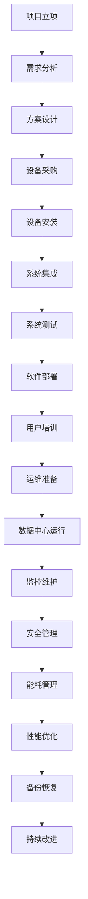

                 

### 文章标题

### AI 大模型应用数据中心建设：数据中心运营与管理

---

#### 关键词：
- AI 大模型
- 数据中心建设
- 数据中心运营
- 数据中心管理
- 能耗管理
- 安全管理

#### 摘要：
本文将深入探讨 AI 大模型应用数据中心的建设与运营管理。首先，我们将介绍 AI 大模型的基本概念、技术特点及其应用领域。随后，文章将详细阐述数据中心建设的基础知识，包括硬件设施、软件系统、设计规划、建设流程以及后期工作。在此基础上，我们将讨论数据中心的运维管理，包括监控与维护、安全管理和能耗管理。最后，本文将分析数据中心未来的发展趋势，并通过实际案例进行深入剖析，总结经验，展望未来。通过本文的阅读，读者将全面了解 AI 大模型应用数据中心的建设与运营管理，为实际应用提供有力指导。

---

在当今快速发展的信息技术时代，人工智能（AI）已经成为推动科技进步和产业创新的重要力量。尤其是 AI 大模型，如 GPT-3、BERT、ViT 等，凭借其强大的数据处理和模式识别能力，正在深刻改变各行各业。然而，AI 大模型的训练和应用需要强大的计算资源和稳定的数据中心支持。因此，数据中心的建设与运营管理成为 AI 大模型应用的关键环节。

本文旨在通过系统的分析和详细的讲解，帮助读者了解 AI 大模型应用数据中心的建设与运营管理。文章将从以下几个方面展开：

1. **AI 大模型概述**：介绍 AI 大模型的基本概念、技术特点及其发展历程。
2. **数据中心建设基础**：详细阐述数据中心的基础设施、软件系统及其设计原则。
3. **数据中心设计与规划**：讨论数据中心物理布局、网络设计以及建设流程。
4. **数据中心运维管理**：探讨数据中心的监控与维护、安全管理和能耗管理。
5. **数据中心未来发展趋势**：分析人工智能在数据中心的应用、运营管理创新以及未来发展方向。
6. **案例分析**：通过实际案例深入剖析数据中心的建设与运营管理。

### 第一部分：AI 大模型应用基础

#### 第1章：AI 大模型概述

##### 1.1 AI 大模型的核心概念

##### 1.1.1 AI 大模型的定义

人工智能（AI）大模型是指具有极高参数量（通常达到数十亿甚至千亿级别）的神经网络模型。这些模型通过大量的数据训练，能够捕捉到数据中的复杂模式，并在此基础上进行推理和生成。大模型的核心特点是“大”，即参数规模巨大，这使其在处理大规模数据集和复杂任务时具有显著优势。

##### 1.1.2 AI 大模型的技术特点

1. **参数规模巨大**：大模型通常包含数亿甚至千亿个参数，这使其能够处理和存储大量的信息。
2. **强大的泛化能力**：通过训练，大模型能够从大量数据中学习，并具有良好的泛化能力，能够在未见过的数据上表现出色。
3. **高效的数据处理**：大模型能够快速处理大规模数据集，提高计算效率。
4. **灵活的应用场景**：大模型可以应用于各种领域，如自然语言处理、计算机视觉、语音识别等。

##### 1.1.3 AI 大模型的发展历程

AI 大模型的发展可以追溯到深度学习技术的兴起。在 2012 年，AlexNet 在 ImageNet 挑战中取得突破性成果，标志着深度学习进入大众视野。此后，随着计算能力的提升和大数据的发展，AI 大模型的研究和应用得到迅速推进。2017 年，谷歌发布了基于 Transformer 架构的 BERT 模型，开启了 AI 大模型的新篇章。此后，一系列大模型如 GPT-3、ViT 等相继问世，进一步推动 AI 大模型的研究和应用。

##### 1.2 AI 大模型的应用领域

AI 大模型在众多领域展现出强大的应用潜力，以下是一些主要的应用领域：

1. **数据分析**：大模型能够高效处理和分析大量数据，帮助企业和组织从数据中挖掘有价值的信息。
2. **自然语言处理**：大模型在自然语言处理领域表现出色，能够进行文本生成、翻译、情感分析等任务。
3. **计算机视觉**：大模型能够处理和识别图像、视频中的复杂模式，应用于图像识别、视频监控、自动驾驶等领域。
4. **语音识别**：大模型能够准确识别语音，并实现语音合成，应用于智能客服、语音助手等场景。
5. **医疗健康**：大模型在医疗健康领域具有广泛应用，如疾病诊断、药物研发、医学影像分析等。
6. **金融科技**：大模型在金融科技领域发挥重要作用，如风险评估、智能投顾、金融欺诈检测等。

##### 1.2.1 数据分析

数据分析是 AI 大模型的重要应用领域之一。通过大模型，企业可以快速处理和分析大量数据，提取出有价值的信息和洞见。具体应用包括：

1. **数据挖掘**：大模型可以用于挖掘数据中的潜在规律和模式，帮助企业发现新的业务机会。
2. **预测分析**：大模型可以预测未来的趋势和变化，帮助企业和组织做出更加科学的决策。
3. **用户行为分析**：大模型可以分析用户的行为数据，为企业和组织提供个性化的服务。

##### 1.2.2 自然语言处理

自然语言处理（NLP）是 AI 大模型的重要应用领域之一。大模型在 NLP 领域表现出色，能够进行文本生成、翻译、情感分析等任务。具体应用包括：

1. **文本生成**：大模型可以生成高质量的文章、报告、故事等，应用于内容创作、自动化写作等领域。
2. **翻译**：大模型可以实现高质量的机器翻译，帮助人们跨语言沟通和交流。
3. **情感分析**：大模型可以分析文本中的情感倾向，用于舆情监测、市场调研等领域。

##### 1.2.3 计算机视觉

计算机视觉是 AI 大模型的重要应用领域之一。大模型在计算机视觉领域表现出色，能够处理和识别图像、视频中的复杂模式。具体应用包括：

1. **图像识别**：大模型可以识别图像中的物体、场景、人脸等，应用于图像分类、目标检测等领域。
2. **视频监控**：大模型可以分析视频数据，实现实时监控、异常检测等。
3. **自动驾驶**：大模型可以用于自动驾驶系统的感知和决策，提高驾驶安全性和效率。

##### 1.2.4 语音识别

语音识别是 AI 大模型的重要应用领域之一。大模型在语音识别领域表现出色，能够准确识别语音并实现语音合成。具体应用包括：

1. **智能客服**：大模型可以用于智能客服系统，实现语音识别和语义理解，提高客户服务质量。
2. **语音助手**：大模型可以用于语音助手系统，实现语音交互和任务执行，提高人机交互效率。
3. **语音合成**：大模型可以用于语音合成，实现自然流畅的语音输出，应用于语音播报、语音输出等领域。

#### 第2章：数据中心建设基础

##### 2.1 数据中心概述

##### 2.1.1 数据中心的定义

数据中心（Data Center）是指专门为存放、处理和管理大量数据而设计的设施。数据中心通常包括计算机设备、网络设备、存储设备、电源设备、冷却设备等硬件设施，以及操作系统、数据库系统、网络管理系统等软件系统。

##### 2.1.2 数据中心的重要性

数据中心在现代社会中扮演着至关重要的角色，其重要性主要体现在以下几个方面：

1. **数据存储和管理**：数据中心为企业和组织提供高效、可靠的数据存储和管理能力，确保数据的安全和完整性。
2. **计算和数据处理**：数据中心提供强大的计算和数据处理能力，支持各种业务应用的运行和数据处理需求。
3. **业务连续性**：数据中心通过冗余设计、备份和恢复机制，确保业务的连续性和稳定性，降低业务中断的风险。
4. **数据分析和挖掘**：数据中心为企业和组织提供数据分析和挖掘的能力，帮助企业从数据中获取洞察和业务价值。

##### 2.1.3 数据中心的分类

数据中心可以根据规模、功能、应用场景等不同标准进行分类，以下是几种常见的分类方式：

1. **按规模分类**：
   - **大型数据中心**：通常容纳数千台服务器，提供大规模的数据存储和处理能力，如云计算数据中心。
   - **中型数据中心**：通常容纳数百台服务器，提供中等规模的数据存储和处理能力。
   - **小型数据中心**：通常容纳数十台服务器，提供小型数据存储和处理能力。

2. **按功能分类**：
   - **企业内部数据中心**：为企业内部业务提供数据存储、处理和管理服务。
   - **公共数据中心**：为多个企业提供数据存储、处理和管理服务，如云服务提供商的数据中心。
   - **边缘数据中心**：位于网络边缘，提供低延迟、高带宽的数据存储和处理服务，如智能交通、智能医疗等领域。

3. **按应用场景分类**：
   - **云计算数据中心**：提供云计算服务，支持企业应用部署、数据存储和计算需求。
   - **数据中心灾备中心**：用于数据备份和业务连续性，提供灾难恢复能力。
   - **数据中心数据中心**：为特定行业或领域提供定制化的数据中心服务，如金融数据中心、医疗数据中心等。

##### 2.2 数据中心硬件设施

数据中心硬件设施是数据中心建设的基础，主要包括服务器、存储、网络设备等。

1. **服务器**：服务器是数据中心的核心设备，用于运行应用程序、存储数据和提供计算服务。服务器可分为以下几种类型：
   - **计算服务器**：主要用于计算任务，如数据分析、机器学习等。
   - **存储服务器**：主要用于存储数据，如文件存储、数据库存储等。
   - **应用服务器**：用于运行特定的应用程序，如Web服务器、邮件服务器等。

2. **存储**：存储设备用于存储数据中心的数据，可分为以下几种类型：
   - **磁盘存储**：如硬盘驱动器（HDD）和固态硬盘（SSD），提供大容量、高性能的数据存储。
   - **网络存储**：如网络附加存储（NAS）和存储区域网络（SAN），提供高效、可靠的数据存储和管理。
   - **分布式存储**：如分布式文件系统，提供高可用性、高性能的数据存储和管理。

3. **网络设备**：网络设备用于连接服务器、存储设备和其他网络设备，实现数据传输和通信。网络设备主要包括以下几种：
   - **路由器**：用于连接不同网络，实现数据包的转发和路由。
   - **交换机**：用于连接服务器、存储设备和网络设备，实现数据交换和传输。
   - **防火墙**：用于保护数据中心网络安全，防止未经授权的访问和攻击。

##### 2.3 数据中心软件系统

数据中心软件系统是数据中心运行的核心，主要包括操作系统、数据库系统、网络管理系统等。

1. **操作系统**：操作系统是数据中心服务器运行的基础软件，提供系统管理、资源分配、进程调度等功能。常用的操作系统包括：
   - **Linux**：开源、稳定的操作系统，广泛应用于数据中心。
   - **Windows Server**：微软推出的服务器操作系统，适用于企业级应用。

2. **数据库系统**：数据库系统用于存储和管理数据，提供数据查询、事务处理等功能。常用的数据库系统包括：
   - **关系型数据库**：如 MySQL、Oracle、SQL Server 等，提供强大的数据管理和查询能力。
   - **非关系型数据库**：如 MongoDB、Cassandra、Redis 等，适用于海量数据存储和高并发访问。

3. **网络管理系统**：网络管理系统用于监控、管理和优化数据中心网络，确保网络的稳定和安全。常用的网络管理系统包括：
   - **Nagios**：开源的网络监控工具，提供全面的监控功能。
   - **Zabbix**：开源的网络监控工具，提供强大的监控和管理能力。
   - **Splunk**：专业的日志管理和数据分析工具，用于监控和分析数据中心网络日志。

##### 2.4 数据中心设计原则

数据中心设计是数据中心建设的关键环节，设计原则直接影响数据中心的性能、可靠性和可扩展性。以下是一些常见的数据中心设计原则：

1. **安全性**：数据中心应具备高安全性能，防止数据泄露、系统故障和网络攻击。设计应考虑物理安全、网络安全和数据安全等方面。
2. **可用性**：数据中心应保证高可用性，确保业务的连续性和稳定性。设计应考虑冗余设计、备份和恢复机制等方面。
3. **可扩展性**：数据中心应具备良好的可扩展性，能够根据业务需求进行灵活扩展。设计应考虑网络架构、硬件设备、软件系统等方面。
4. **能耗管理**：数据中心应注重能耗管理，降低能源消耗和运营成本。设计应考虑节能技术、冷却系统、电源系统等方面。

##### 2.5 数据中心物理布局

数据中心物理布局是数据中心设计的重要方面，合理的布局可以提高数据中心的性能、可靠性和可用性。以下是一些数据中心物理布局的关键要素：

1. **机房布局**：机房是数据中心的核心区域，用于安装服务器、存储设备和网络设备。机房布局应考虑设备安装、散热、电力供应等方面。
2. **设备摆放**：设备摆放应遵循最佳实践，确保设备的散热、供电和连接。设备应按照功能模块进行分类摆放，提高运维效率。
3. **电源与配电**：电源与配电是数据中心正常运行的关键，应保证电源的稳定性和可靠性。设计应考虑电源设备选型、配电系统设计等方面。

##### 2.6 数据中心网络设计

数据中心网络设计是数据中心建设的关键环节，合理的网络设计可以提高数据中心的性能、可靠性和可扩展性。以下是一些数据中心网络设计的关键要素：

1. **网络架构**：数据中心网络架构应考虑可靠性、高性能和可扩展性。常见的网络架构包括全互联架构、环状架构、星状架构等。
2. **网络设备选型**：网络设备选型应考虑性能、可靠性、兼容性等方面。常用的网络设备包括路由器、交换机、防火墙等。
3. **网络性能优化**：网络性能优化是提高数据中心网络性能的重要手段。设计应考虑网络带宽、延迟、吞吐量等方面。

#### 第3章：数据中心设计与规划

##### 3.1 数据中心设计原则

数据中心的设计原则是确保数据中心性能、可靠性和可扩展性的关键。以下是一些常见的数据中心设计原则：

1. **安全性**：数据中心应具备高安全性能，防止数据泄露、系统故障和网络攻击。设计应考虑物理安全、网络安全和数据安全等方面。
2. **可用性**：数据中心应保证高可用性，确保业务的连续性和稳定性。设计应考虑冗余设计、备份和恢复机制等方面。
3. **可扩展性**：数据中心应具备良好的可扩展性，能够根据业务需求进行灵活扩展。设计应考虑网络架构、硬件设备、软件系统等方面。
4. **能耗管理**：数据中心应注重能耗管理，降低能源消耗和运营成本。设计应考虑节能技术、冷却系统、电源系统等方面。

##### 3.2 数据中心物理布局

数据中心的物理布局是数据中心设计的重要方面，合理的布局可以提高数据中心的性能、可靠性和可用性。以下是一些数据中心物理布局的关键要素：

1. **机房布局**：机房是数据中心的核心区域，用于安装服务器、存储设备和网络设备。机房布局应考虑设备安装、散热、电力供应等方面。
2. **设备摆放**：设备摆放应遵循最佳实践，确保设备的散热、供电和连接。设备应按照功能模块进行分类摆放，提高运维效率。
3. **电源与配电**：电源与配电是数据中心正常运行的关键，应保证电源的稳定性和可靠性。设计应考虑电源设备选型、配电系统设计等方面。

##### 3.3 数据中心网络设计

数据中心网络设计是数据中心建设的关键环节，合理的网络设计可以提高数据中心的性能、可靠性和可扩展性。以下是一些数据中心网络设计的关键要素：

1. **网络架构**：数据中心网络架构应考虑可靠性、高性能和可扩展性。常见的网络架构包括全互联架构、环状架构、星状架构等。
2. **网络设备选型**：网络设备选型应考虑性能、可靠性、兼容性等方面。常用的网络设备包括路由器、交换机、防火墙等。
3. **网络性能优化**：网络性能优化是提高数据中心网络性能的重要手段。设计应考虑网络带宽、延迟、吞吐量等方面。

##### 3.4 数据中心建设流程

数据中心建设是一个复杂的过程，涉及多个环节。以下是一些常见的数据中心建设流程：

1. **项目立项**：确定数据中心建设的目标、预算和进度计划。
2. **需求分析**：分析数据中心的应用需求、性能要求和扩展性要求。
3. **方案设计**：根据需求分析，设计数据中心的技术方案和系统架构。
4. **设备采购**：根据设计方案，选择合适的服务器、存储、网络设备等硬件设施。
5. **设备安装**：将设备安装到数据中心，并进行初步调试。
6. **系统集成**：将各个设备进行集成，确保系统正常运行。
7. **系统测试**：对数据中心进行全面的测试，确保性能、可靠性和安全性。
8. **软件部署**：部署操作系统、数据库系统、网络管理系统等软件系统。
9. **用户培训**：对数据中心操作人员进行培训，确保他们能够熟练使用系统。
10. **运维准备**：进行运维环境的准备，确保数据中心的长期稳定运行。

##### 3.5 数据中心运营管理

数据中心运营管理是确保数据中心长期稳定运行的关键。以下是一些常见的数据中心运营管理策略：

1. **监控与维护**：通过监控系统实时监测数据中心的运行状态，及时发现和处理故障。
2. **安全管理**：制定安全策略，进行安全漏洞扫描和应急响应，确保数据中心的网络安全。
3. **能耗管理**：通过节能技术和管理策略，降低数据中心的能源消耗和运营成本。
4. **性能优化**：定期对数据中心进行性能优化，提高系统的性能和稳定性。
5. **备份与恢复**：制定备份策略，确保数据的安全和可恢复性。

##### 3.6 数据中心安全策略

数据中心安全策略是确保数据中心安全的关键。以下是一些常见的数据中心安全策略：

1. **物理安全**：保护数据中心建筑和设备，防止非法入侵、破坏和盗窃。
2. **网络安全**：保护数据中心网络，防止网络攻击、数据泄露和非法访问。
3. **数据安全**：保护数据中心存储的数据，防止数据泄露、篡改和丢失。
4. **用户认证**：对数据中心用户进行认证，确保只有授权用户才能访问系统。
5. **日志管理**：记录数据中心的操作日志，以便进行审计和故障排查。

##### 3.7 数据中心能耗管理

数据中心能耗管理是降低数据中心运营成本的重要手段。以下是一些常见的数据中心能耗管理策略：

1. **能效评估**：对数据中心的能耗进行评估，确定能耗的主要来源和优化方向。
2. **节能技术**：采用节能技术，如高效电源设备、冷却系统优化、能源回收等，降低能源消耗。
3. **能耗监测**：通过能耗监测系统实时监测数据中心的能耗情况，及时发现和解决能耗问题。
4. **节能管理**：制定节能管理策略，提高能源利用效率，降低运营成本。
5. **能源替代**：探索可再生能源的应用，如太阳能、风能等，降低对传统能源的依赖。

### 第4章：数据中心建设流程

数据中心的建设流程是一个复杂且精细的过程，涉及到前期准备、建设实施、系统测试和后期运维等多个阶段。下面，我们将详细探讨每一个阶段的具体内容和关键步骤。

#### 4.1 数据中心建设前期准备

数据中心建设的前期准备阶段至关重要，它决定了后续建设工作的顺利与否。以下是前期准备阶段的主要内容：

1. **项目立项**：
   - **需求分析**：明确数据中心的建设目标、业务需求、性能指标和扩展性要求。
   - **预算编制**：根据需求分析，编制合理的建设预算，包括硬件设备、软件系统、施工费用、人力成本等。
   - **项目审批**：提交项目立项申请，获得相关部门的审批和认可。

2. **选址规划**：
   - **地理位置**：选择地理位置优越、交通便利、环境条件合适的地点。
   - **建筑要求**：确保建筑物能够满足数据中心的物理安全要求，如防火、防水、抗震等。
   - **电力供应**：确保数据中心附近有稳定的电力供应，满足设备运行的电力需求。

3. **技术方案设计**：
   - **系统架构**：设计数据中心的网络架构、存储架构和计算架构，确保系统的高效性和可靠性。
   - **设备选型**：根据技术方案，选择合适的服务器、存储、网络设备等硬件设施。
   - **软件选型**：选择适合数据中心运营管理的操作系统、数据库系统和网络管理系统。

#### 4.2 数据中心建设实施

数据中心建设实施阶段是将前期准备工作转化为实际硬件设备和软件系统的过程。以下是建设实施阶段的主要内容：

1. **设备采购**：
   - **招标采购**：通过招标方式选择合适的供应商，确保设备的质量和性能。
   - **设备验收**：对采购的设备进行严格的验收，确保设备符合技术要求和质量标准。

2. **设备安装**：
   - **现场施工**：根据设计方案，进行现场设备的安装和调试，确保设备的安装位置、连接方式等符合设计要求。
   - **设备调试**：对安装完成的设备进行全面的调试，确保设备能够正常运行。

3. **系统集成**：
   - **硬件集成**：将各个设备进行物理连接和配置，确保设备之间的互联互通。
   - **软件集成**：安装和配置操作系统、数据库系统和网络管理系统，确保系统的稳定性和兼容性。

4. **系统测试**：
   - **性能测试**：对数据中心系统进行性能测试，包括网络带宽、存储性能、计算性能等，确保系统能够满足业务需求。
   - **安全性测试**：对数据中心系统进行安全性测试，包括漏洞扫描、安全加固等，确保系统的安全性。
   - **可用性测试**：对数据中心系统进行可用性测试，包括故障恢复、负载均衡等，确保系统的可靠性。

#### 4.3 数据中心建设后期工作

数据中心建设后期工作主要包括软件部署、用户培训和运维准备等。以下是后期工作的主要内容：

1. **软件部署**：
   - **操作系统部署**：安装和配置操作系统，确保操作系统的稳定性和安全性。
   - **数据库系统部署**：安装和配置数据库系统，确保数据库的可靠性和高效性。
   - **网络管理系统部署**：安装和配置网络管理系统，确保网络管理的便捷性和高效性。

2. **用户培训**：
   - **操作培训**：对数据中心操作人员进行操作培训，确保他们能够熟练使用系统。
   - **安全培训**：对数据中心操作人员进行安全培训，提高他们的安全意识和应对能力。

3. **运维准备**：
   - **运维手册**：编写运维手册，记录数据中心的管理流程、操作规范和安全策略。
   - **应急预案**：制定应急预案，确保在出现故障或异常情况时能够迅速响应和处理。

#### 4.4 数据中心运营管理

数据中心运营管理是确保数据中心长期稳定运行的关键。以下是数据中心运营管理的主要内容：

1. **监控与维护**：
   - **实时监控**：通过监控系统实时监测数据中心的运行状态，包括服务器状态、存储状态、网络状态等。
   - **定期维护**：定期对数据中心设备进行维护和保养，确保设备的正常运行。

2. **安全管理**：
   - **安全策略**：制定安全策略，包括物理安全、网络安全、数据安全等。
   - **安全防护**：部署安全防护设备，如防火墙、入侵检测系统等，确保数据中心的安全。

3. **能耗管理**：
   - **能耗监测**：通过能耗监测系统实时监测数据中心的能耗情况，包括电力消耗、冷却能耗等。
   - **节能措施**：采取节能措施，如优化冷却系统、提高能源利用效率等，降低数据中心的能源消耗。

4. **性能优化**：
   - **性能监控**：对数据中心性能进行实时监控，包括网络带宽、存储性能、计算性能等。
   - **性能优化**：定期对数据中心进行性能优化，包括网络优化、存储优化、计算优化等，提高系统的性能。

5. **备份与恢复**：
   - **备份策略**：制定备份策略，确保数据的安全和可恢复性。
   - **恢复计划**：制定恢复计划，确保在数据丢失或系统故障时能够迅速恢复。

### 第5章：数据中心运维管理

数据中心运维管理是确保数据中心长期稳定运行的关键环节。良好的运维管理能够提高数据中心的可靠性、性能和安全性，降低运营成本。以下将详细探讨数据中心运维管理的各个方面，包括监控与维护、安全管理、能耗管理和性能优化等。

#### 5.1 数据中心运维概述

数据中心运维（Data Center Operations，DCO）是指对数据中心的硬件设备、软件系统、网络资源和数据存储进行监控、维护和管理的一系列工作。数据中心运维的目标是确保数据中心能够持续、稳定地提供服务，同时降低运营成本和提高资源利用率。

数据中心运维的重要性体现在以下几个方面：

1. **业务连续性**：数据中心是许多关键业务的支撑，运维管理确保业务系统的高可用性和连续性。
2. **数据安全性**：运维管理确保数据的安全性和完整性，防止数据泄露、损坏或丢失。
3. **资源优化**：通过有效的运维管理，可以优化数据中心的资源利用，提高资源利用率，降低运营成本。
4. **性能优化**：运维管理通过监控和优化，提高数据中心的整体性能，满足业务需求。
5. **合规性**：运维管理确保数据中心符合相关法规和标准，如ISO 27001、SOX等。

#### 5.2 数据中心监控与维护

数据中心监控与维护是运维管理的核心内容。通过监控系统，运维人员可以实时了解数据中心的运行状态，及时发现和处理异常情况。以下是一些关键要素：

1. **监控体系构建**：
   - **硬件监控**：监控服务器的CPU、内存、磁盘、网络接口等硬件设备的运行状态。
   - **网络监控**：监控网络设备的流量、延迟、带宽利用率等网络指标。
   - **存储监控**：监控存储设备的容量、I/O性能、数据冗余等存储指标。
   - **环境监控**：监控数据中心的温度、湿度、电力供应、冷却系统等环境指标。

2. **设备维护策略**：
   - **定期维护**：定期对设备进行清洁、检查和更换，确保设备的正常运行。
   - **故障处理**：建立故障处理流程，确保在设备出现故障时能够快速响应和处理。
   - **性能调优**：对设备的性能进行调优，确保其能够满足业务需求。

3. **故障处理流程**：
   - **故障发现**：通过监控系统及时发现设备故障。
   - **故障确认**：对故障进行确认，判断故障的类型和原因。
   - **故障处理**：根据故障类型和原因，采取相应的处理措施。
   - **故障恢复**：在故障处理完成后，确保系统恢复正常运行。

#### 5.3 数据中心安全管理

数据中心安全管理是确保数据中心数据和资源安全的关键。以下是一些关键要素：

1. **安全策略制定**：
   - **物理安全**：制定物理安全策略，包括门禁管理、视频监控、消防措施等，确保数据中心建筑和设备的安全。
   - **网络安全**：制定网络安全策略，包括防火墙配置、入侵检测、安全审计等，确保网络的安全。
   - **数据安全**：制定数据安全策略，包括数据加密、访问控制、备份与恢复等，确保数据的安全。

2. **安全漏洞扫描**：
   - **漏洞扫描**：定期对数据中心进行安全漏洞扫描，识别潜在的安全漏洞。
   - **漏洞修复**：对发现的安全漏洞进行及时修复，确保数据中心的网络安全。

3. **应急预案制定**：
   - **应急响应计划**：制定应急响应计划，确保在发生安全事件时能够迅速响应和处理。
   - **备份与恢复**：制定数据备份和恢复计划，确保在数据丢失或系统故障时能够迅速恢复。

#### 5.4 数据中心能耗管理

数据中心能耗管理是降低运营成本和提高能源利用效率的关键。以下是一些关键要素：

1. **能耗监测**：
   - **能耗数据收集**：收集数据中心各项能耗数据，包括电力消耗、冷却能耗等。
   - **能耗分析**：对能耗数据进行统计分析，识别能耗高峰期、浪费点等。

2. **节能措施**：
   - **设备节能**：优化设备配置，选择高效设备，降低设备的能耗。
   - **冷却系统优化**：优化冷却系统，降低冷却能耗。
   - **能源回收**：采用能源回收技术，如余热回收、可再生能源等。

3. **能耗管理策略**：
   - **节能政策**：制定节能政策，鼓励节能措施的落实。
   - **能耗考核**：对数据中心的能耗进行考核，激励节能措施的执行。

#### 5.5 数据中心性能优化

数据中心性能优化是提高数据中心整体性能的关键。以下是一些关键要素：

1. **性能监控**：
   - **实时性能监控**：实时监控服务器的CPU利用率、内存使用情况、存储I/O性能等。
   - **性能指标分析**：对性能指标进行分析，识别性能瓶颈。

2. **性能调优**：
   - **硬件调优**：优化服务器硬件配置，提高硬件性能。
   - **网络调优**：优化网络架构和配置，提高网络性能。
   - **存储调优**：优化存储配置和算法，提高存储性能。

3. **负载均衡**：
   - **分布式负载均衡**：采用分布式负载均衡技术，确保服务器负载均衡，提高系统的可靠性。
   - **动态负载均衡**：根据业务需求和服务器状态，动态调整负载均衡策略。

4. **资源利用率优化**：
   - **资源利用率分析**：定期分析资源利用率，识别资源浪费点。
   - **资源优化策略**：制定资源优化策略，提高资源利用率。

#### 5.6 数据中心运维工具

数据中心运维工具是运维管理的重要支撑，以下是一些常见的运维工具：

1. **监控工具**：
   - **Nagios**：开源的监控系统，提供全面的监控功能。
   - **Zabbix**：开源的监控系统，提供强大的监控和管理能力。
   - **Prometheus**：开源的监控解决方案，提供高可用性和数据存储功能。

2. **配置管理工具**：
   - **Ansible**：自动化配置管理工具，支持自动化部署和配置。
   - **Puppet**：配置管理工具，支持大规模自动化部署。
   - **Chef**：自动化配置管理工具，提供模块化和脚本化的配置管理。

3. **日志管理工具**：
   - **Splunk**：专业的日志管理和数据分析工具，用于监控和分析数据中心网络日志。
   - **ELK Stack**：开源的日志管理解决方案，包括 Elasticsearch、Logstash 和 Kibana。

4. **安全管理工具**：
   - **OSSEC**：开源的入侵检测系统，提供实时监控和报警功能。
   - **Nessus**：漏洞扫描工具，用于识别和评估系统漏洞。
   - **Wireshark**：网络协议分析工具，用于捕获和分析网络数据包。

通过合理运用这些运维工具，可以提高数据中心的运维效率和可靠性。

### 第6章：数据中心能耗管理

数据中心能耗管理是确保数据中心高效运行、降低运营成本和环境负担的重要环节。数据中心能耗主要包括电力消耗、冷却能耗和其他辅助设备的能耗。以下将详细讨论数据中心能耗的构成、管理策略以及能源效率提升的方法。

#### 6.1 数据中心能耗概述

数据中心能耗主要来源于以下几个方面：

1. **计算能耗**：服务器、存储设备和网络设备的运行消耗的电力，这部分能耗占数据中心总能耗的绝大部分。
2. **冷却能耗**：数据中心需要通过冷却系统来维持设备在合理的温度范围内运行，冷却系统消耗的电力也是数据中心的重要能耗来源。
3. **辅助设备能耗**：数据中心的其他辅助设备，如UPS（不间断电源）、空调、消防系统等，也会产生一定的能耗。

随着数据中心规模的不断扩大和技术的进步，数据中心的能耗问题越来越受到关注。高效的数据中心能耗管理不仅有助于降低运营成本，还能减少环境负担，符合可持续发展的要求。

#### 6.2 数据中心能耗管理策略

为了有效管理数据中心的能耗，以下是一些关键策略：

1. **能耗监测**：
   - **能耗数据收集**：通过安装能耗监测设备，实时收集数据中心的各项能耗数据，如电力消耗、冷却能耗等。
   - **能耗数据分析**：对收集到的能耗数据进行实时分析，识别能耗高峰、能耗浪费点等，为能耗管理提供数据支持。

2. **能效优化**：
   - **设备能效优化**：选择能效比高的设备，如使用高效电源设备（EPS）、高效服务器和存储设备等。
   - **负载均衡**：通过负载均衡技术，合理分配计算任务，避免设备过载，提高能源利用效率。

3. **冷却系统优化**：
   - **冷却效率提升**：采用高效冷却技术，如水冷、空气冷却、蒸发冷却等，降低冷却能耗。
   - **冷却系统自动化**：通过自动化控制系统，优化冷却系统的运行策略，确保冷却系统在最佳状态下工作。

4. **电源管理**：
   - **电源供应优化**：优化电源供应系统，确保供电稳定，减少电源损耗。
   - **电源管理策略**：制定电源管理策略，如动态电源管理（DPM）、闲置电源管理（IDPM）等，降低闲置能耗。

5. **节能措施**：
   - **节能减排**：推广节能减排技术，如LED照明、节能空调等，降低整体能耗。
   - **绿色能源使用**：利用可再生能源，如太阳能、风能等，降低对传统能源的依赖。

6. **能耗考核**：
   - **能耗考核制度**：建立能耗考核制度，对数据中心各部门的能耗进行考核，激励节能措施的执行。
   - **能耗指标设定**：设定合理的能耗指标，鼓励数据中心在能耗管理方面不断优化。

#### 6.3 能源效率提升方法

提升数据中心的能源效率是降低能耗的关键。以下是一些具体的方法：

1. **硬件层面**：
   - **设备升级**：采用最新一代的高效硬件设备，提高整体能源效率。
   - **服务器虚拟化**：通过服务器虚拟化技术，提高服务器的利用率，减少物理服务器的数量，从而降低能耗。

2. **软件层面**：
   - **节能软件**：使用节能软件，如动态电压调节（DVR）、动态频率调节（DFT）等，优化服务器的工作状态，降低能耗。
   - **优化软件运行**：通过优化软件代码和系统配置，减少不必要的计算和资源消耗。

3. **冷却系统层面**：
   - **液冷技术**：采用液冷技术，通过液体循环带走热量，提高冷却效率。
   - **智能冷却**：采用智能冷却系统，根据实时温度和负载情况，动态调整冷却系统的运行策略。

4. **能源管理层面**：
   - **能源管理系统**：部署能源管理系统（EMS），实时监控和管理数据中心的能源使用情况。
   - **智能能源调度**：通过智能能源调度系统，优化能源的分配和使用，提高整体能源效率。

5. **建筑层面**：
   - **绿色建筑设计**：采用绿色建筑设计，如增加自然通风、利用太阳能等，减少建筑能耗。
   - **环境适应性设计**：根据当地气候和环境特点，优化数据中心的设计，减少能耗。

通过上述方法，数据中心可以在不降低服务质量和性能的前提下，显著提升能源效率，实现绿色可持续发展。

### 第7章：数据中心未来发展趋势

随着人工智能（AI）技术的迅猛发展，数据中心也在不断演变，成为支持AI大模型应用的核心基础设施。在这一章节中，我们将探讨数据中心在AI领域的应用、运营管理创新，以及未来发展趋势。

#### 7.1 人工智能在数据中心的应用

人工智能技术在数据中心的应用已经成为趋势，这不仅提升了数据中心的智能化水平，也带来了新的业务模式和运营效率。以下是AI在数据中心的具体应用：

1. **智能监控与故障预测**：
   - **异常检测**：通过AI算法分析实时监控数据，如服务器温度、CPU负载、网络流量等，自动识别异常情况，提前预警，减少故障发生。
   - **故障预测**：利用机器学习模型，根据历史数据和实时监控数据，预测设备可能出现的故障，提前进行维护，确保数据中心稳定运行。

2. **能效优化**：
   - **动态能耗管理**：通过AI算法分析能耗数据，动态调整设备的工作状态，如服务器节能模式、冷却系统优化等，实现能源的最优利用。
   - **能源预测**：利用AI技术预测未来能耗趋势，优化能源采购计划，降低能源成本。

3. **网络安全**：
   - **入侵检测**：通过AI模型分析网络流量，实时识别和响应潜在的网络攻击，提高数据中心的网络安全。
   - **安全预测**：利用机器学习预测潜在的安全威胁，提前采取防范措施。

4. **存储优化**：
   - **存储资源分配**：通过AI算法优化存储资源分配，提高存储效率。
   - **存储预测**：利用AI技术预测存储需求，提前进行存储扩展，避免存储瓶颈。

5. **数据中心自动化**：
   - **自动化运维**：利用AI技术实现自动化运维，如自动化部署、自动化扩容等，提高运维效率。
   - **自动化决策**：通过AI算法自动化处理复杂决策，如负载均衡、资源调度等，提高数据中心运营效率。

#### 7.2 数据中心运营与管理创新

随着技术的进步和业务需求的不断变化，数据中心的运营和管理也在不断创新。以下是一些重要的创新方向：

1. **云原生数据中心**：
   - **容器化技术**：采用容器化技术，如Docker和Kubernetes，实现应用的快速部署和自动化管理，提高数据中心资源利用效率。
   - **微服务架构**：采用微服务架构，将大型应用拆分为多个小型服务，提高系统的可扩展性和可靠性。

2. **边缘计算**：
   - **分布式数据中心**：在数据中心和边缘设备之间实现数据存储和计算资源的分布式部署，减少数据传输延迟，提高应用响应速度。
   - **边缘AI**：在边缘设备上部署AI模型，进行实时数据处理和分析，减少对中心数据中心的依赖。

3. **数据隐私保护**：
   - **数据加密**：采用数据加密技术，保护数据在传输和存储过程中的安全性。
   - **隐私计算**：利用隐私计算技术，如联邦学习（Federated Learning），实现多方数据的联合分析和推理，同时保护数据的隐私。

4. **数字化转型**：
   - **数字化转型工具**：利用数字化工具，如大数据分析、云计算服务等，推动数据中心的数字化转型，提升业务效率和竞争力。
   - **数字化运营**：通过数字化手段，如物联网（IoT）设备、AI算法等，实现数据中心的智能化运营。

#### 7.3 数据中心管理趋势分析

未来数据中心管理将面临一系列趋势和挑战，以下是一些关键趋势：

1. **智能化管理**：
   - **AI驱动的运维**：利用AI技术实现智能化的运维管理，提高运维效率和准确性。
   - **智能决策支持**：通过AI算法提供决策支持，帮助数据中心管理者做出更科学的决策。

2. **自动化运维**：
   - **自动化流程**：通过自动化工具实现日常运维流程的自动化，减少人工干预，提高运维效率。
   - **自动化故障处理**：利用AI算法实现自动化故障检测和处理，减少故障对业务的影响。

3. **绿色化发展**：
   - **节能减排**：通过技术手段实现能源的高效利用，降低能耗和碳排放。
   - **可再生能源应用**：积极采用可再生能源，如太阳能、风能等，减少对传统能源的依赖。

4. **安全与合规**：
   - **安全防护**：加强数据中心的安全防护，防范各种网络攻击和数据泄露风险。
   - **合规性管理**：确保数据中心符合各种法规和标准，如数据保护法（GDPR）、行业安全标准等。

5. **可持续发展**：
   - **循环经济**：推动数据中心的循环经济发展，通过资源再利用和废弃物管理，降低环境负担。
   - **社会责任**：数据中心运营者应承担社会责任，推动绿色环保和可持续发展。

通过上述趋势分析，我们可以看到，数据中心在未来的发展中将更加智能化、自动化和绿色化，同时也将面临一系列挑战，需要不断创新和改进，以适应不断变化的技术和业务需求。

### 第8章：案例分析

为了更好地理解AI大模型应用数据中心的建设与运营管理，我们将通过实际案例进行深入剖析。以下是几个具有代表性的案例。

#### 8.1 案例背景

案例一：某大型互联网公司数据中心建设

某大型互联网公司计划建设一座大型数据中心，用于支撑其全球业务的运营。数据中心需满足高可用性、高性能和可扩展性等要求，以支持公司未来的业务增长。

#### 8.2 数据中心建设过程

1. **需求分析**：
   - **业务需求**：分析公司的业务需求，确定数据中心的计算、存储和网络性能要求。
   - **性能指标**：设定数据中心的性能指标，如延迟、吞吐量、可靠性等。

2. **方案设计**：
   - **系统架构**：设计数据中心的整体架构，包括计算架构、存储架构和网络架构。
   - **硬件选型**：根据性能指标，选择合适的服务器、存储和网络设备。

3. **设备采购**：
   - **招标采购**：通过招标方式选择合适的供应商，确保设备的质量和性能。
   - **设备验收**：对采购的设备进行严格的验收，确保设备符合技术要求和质量标准。

4. **设备安装与调试**：
   - **现场施工**：根据设计方案，进行现场设备的安装和调试，确保设备的安装位置、连接方式等符合设计要求。
   - **系统集成**：将各个设备进行集成，确保系统正常运行。

5. **系统测试**：
   - **性能测试**：对数据中心系统进行性能测试，包括网络带宽、存储性能、计算性能等，确保系统能够满足业务需求。
   - **安全性测试**：对数据中心系统进行安全性测试，包括漏洞扫描、安全加固等，确保系统的安全性。
   - **可用性测试**：对数据中心系统进行可用性测试，包括故障恢复、负载均衡等，确保系统的可靠性。

6. **软件部署**：
   - **操作系统部署**：安装和配置操作系统，确保操作系统的稳定性和安全性。
   - **数据库系统部署**：安装和配置数据库系统，确保数据库的可靠性和高效性。
   - **网络管理系统部署**：安装和配置网络管理系统，确保网络管理的便捷性和高效性。

7. **用户培训与运维准备**：
   - **操作培训**：对数据中心操作人员进行操作培训，确保他们能够熟练使用系统。
   - **安全培训**：对数据中心操作人员进行安全培训，提高他们的安全意识和应对能力。
   - **运维手册与应急预案**：编写运维手册，制定应急预案，确保数据中心的长期稳定运行。

#### 8.3 数据中心运营管理

1. **监控与维护**：
   - **实时监控**：通过监控系统实时监测数据中心的运行状态，包括服务器状态、存储状态、网络状态等。
   - **定期维护**：定期对数据中心设备进行维护和保养，确保设备的正常运行。

2. **安全管理**：
   - **安全策略**：制定安全策略，包括物理安全、网络安全、数据安全等。
   - **安全防护**：部署安全防护设备，如防火墙、入侵检测系统等，确保数据中心的安全。

3. **能耗管理**：
   - **能耗监测**：通过能耗监测系统实时监测数据中心的能耗情况，包括电力消耗、冷却能耗等。
   - **节能措施**：采取节能措施，如优化冷却系统、提高能源利用效率等，降低数据中心的能源消耗和运营成本。

4. **性能优化**：
   - **性能监控**：对数据中心性能进行实时监控，包括网络带宽、存储性能、计算性能等。
   - **性能优化**：定期对数据中心进行性能优化，包括网络优化、存储优化、计算优化等，提高系统的性能。

5. **备份与恢复**：
   - **备份策略**：制定备份策略，确保数据的安全和可恢复性。
   - **恢复计划**：制定恢复计划，确保在数据丢失或系统故障时能够迅速恢复。

#### 8.4 AI 大模型应用实践

1. **数据分析**：
   - **数据挖掘**：利用AI大模型进行大规模数据分析，提取业务洞见，优化运营策略。
   - **预测分析**：通过AI大模型进行预测分析，预测用户行为、市场趋势等，帮助公司做出更科学的决策。

2. **自然语言处理**：
   - **文本生成**：利用AI大模型生成高质量文章、报告等，提高内容创作效率。
   - **翻译**：实现多语言翻译，支持全球业务的跨语言沟通和交流。

3. **计算机视觉**：
   - **图像识别**：利用AI大模型进行图像识别，实现自动化监控、目标检测等。
   - **视频分析**：利用AI大模型进行视频分析，实现智能安防、交通流量监测等。

4. **语音识别**：
   - **智能客服**：利用AI大模型实现智能客服，提高客户服务质量。
   - **语音合成**：实现语音合成，应用于语音播报、语音输出等场景。

#### 8.5 案例总结与展望

通过上述案例，我们可以看到，AI大模型应用数据中心在需求分析、方案设计、设备采购、系统测试、软件部署、运营管理以及AI应用实践等方面都取得了显著成效。以下是案例总结与展望：

1. **总结**：
   - 数据中心建设过程严谨、科学，确保了系统的稳定性和可靠性。
   - 数据中心运营管理高效、安全，保障了业务的连续性和服务质量。
   - AI大模型应用提升了数据中心的智能化水平，为业务创新和运营优化提供了有力支持。

2. **展望**：
   - 未来，数据中心将更加智能化、自动化和绿色化，AI技术将在数据中心的应用中发挥更大的作用。
   - 数据中心建设与运营管理将不断创新，以应对不断变化的业务需求和新兴技术的挑战。
   - 数据中心将更加注重能耗管理，通过技术手段和运营优化，实现节能减排和可持续发展。

通过以上案例分析，我们不仅了解了AI大模型应用数据中心的建设与运营管理，也对未来数据中心的发展趋势有了更深刻的认识。

### 第9章：未来数据中心发展趋势

随着技术的不断进步和业务需求的多样化，未来数据中心将呈现出智能化、绿色化和安全化等发展趋势。以下是这些趋势的具体内容和影响。

#### 9.1 智能化发展

智能化是未来数据中心发展的重要方向。数据中心将利用人工智能（AI）、机器学习（ML）、物联网（IoT）等先进技术，实现自动化和智能化管理，提高运营效率和业务响应速度。

1. **智能监控与运维**：
   - **实时监控**：通过部署AI算法，实时监控数据中心的各项运行指标，如温度、湿度、电力消耗等，及时识别和预警潜在问题。
   - **智能运维**：利用AI技术实现自动化运维，如自动化故障诊断、自动修复等，减少人为干预，提高运维效率。

2. **智能能效管理**：
   - **能效预测**：通过机器学习模型分析历史能耗数据，预测未来能耗趋势，优化能耗管理策略，降低能源消耗。
   - **动态调整**：根据实时数据动态调整数据中心设备的工作状态，如关闭闲置服务器、优化冷却系统等，实现能效最大化。

3. **智能负载均衡**：
   - **自动调度**：利用AI算法实现自动负载均衡，根据业务需求和服务器状态动态调整计算资源分配，确保系统稳定运行。
   - **动态扩展**：根据业务增长需求，自动扩展计算资源，避免资源瓶颈。

#### 9.2 绿色化发展

绿色化是未来数据中心发展的重要目标。数据中心将采取一系列措施，降低能源消耗和碳排放，实现可持续发展。

1. **节能技术**：
   - **高效电源设备**：采用高效电源设备（EPS），提高能源转换效率，降低能源损耗。
   - **节能服务器**：采用节能服务器，如采用低功耗CPU和内存，优化服务器工作模式，减少能源消耗。

2. **冷却系统优化**：
   - **智能冷却**：采用智能冷却系统，如液体冷却、空气冷却、蒸发冷却等，提高冷却效率，降低冷却能耗。
   - **余热回收**：通过余热回收技术，将服务器产生的余热用于其他用途，如供暖、热水等，减少能源浪费。

3. **可再生能源应用**：
   - **太阳能**：采用太阳能发电系统，为数据中心提供清洁能源。
   - **风能**：在适合的地区采用风能发电，减少对传统能源的依赖。

4. **绿色建筑设计**：
   - **自然通风**：采用自然通风设计，减少空调系统的使用，降低能耗。
   - **绿色建材**：使用环保材料和节能设计，提高建筑本身的能效。

#### 9.3 安全化发展

安全化是数据中心发展的基础。数据中心将采取一系列措施，确保数据和系统的安全，防范各种安全威胁。

1. **网络安全**：
   - **防火墙与入侵检测**：部署高性能防火墙和入侵检测系统（IDS），防止网络攻击和非法访问。
   - **DDoS防护**：部署分布式拒绝服务（DDoS）防护系统，防止网络瘫痪。

2. **数据安全**：
   - **数据加密**：对存储和传输的数据进行加密，确保数据不被非法窃取。
   - **访问控制**：通过严格的访问控制策略，确保只有授权用户才能访问敏感数据。

3. **安全监控与审计**：
   - **安全监控**：部署安全监控系统，实时监控数据中心的运行状态和安全事件。
   - **日志审计**：记录和审计所有操作日志，确保在发生安全事件时能够迅速追溯和响应。

4. **应急响应**：
   - **应急演练**：定期进行应急演练，提高应急响应能力。
   - **安全培训**：对员工进行安全培训，提高安全意识和应对能力。

#### 9.4 总结与展望

未来数据中心将更加智能化、绿色化和安全化。通过人工智能技术的应用，数据中心可以实现自动化和智能化管理，提高运营效率和业务响应速度。通过绿色化技术的应用，数据中心可以实现节能减排和可持续发展，降低环境负担。通过安全化技术的应用，数据中心可以确保数据和系统的安全，防范各种安全威胁。

随着技术的不断进步和业务需求的多样化，数据中心将不断创新和发展，为各行业提供更加高效、可靠和安全的数据存储和处理服务。未来数据中心的发展将不仅限于技术层面，还将涉及到业务模式、管理模式等全方位的变革，以应对快速变化的科技环境和市场需求。

### 附录

#### 附录A：数据中心建设与运维相关资料

**A.1 数据中心建设标准与规范**

- **国家相关标准**：
  - GB 50174-2017《数据中心设计规范》
  - GB 50057-2010《建筑物防雷设计规范》
  - YD/T 5217-2015《互联网数据中心工程技术规范》
- **国际相关标准**：
  - ANSI/TIA-942-A《数据中心基础设施标准》
  - ISO/IEC 27001《信息安全管理系统》
  - Uptime Institute 的 TIER 标准

**A.2 数据中心运维管理手册**

- **运维管理手册**：
  - 数据中心基础设施运维管理手册
  - 服务器运维管理手册
  - 存储运维管理手册
  - 网络运维管理手册

**A.3 数据中心能耗管理指南**

- **能耗管理指南**：
  - 数据中心能效优化指南
  - 数据中心冷却系统管理指南
  - 数据中心电源管理指南
  - 数据中心可再生能源应用指南

**A.4 数据中心安全防护策略**

- **安全防护策略**：
  - 数据中心网络安全策略
  - 数据中心数据安全策略
  - 数据中心物理安全策略
  - 数据中心应急响应计划

#### 附录B：术语解释

**B.1 数据中心相关术语**

- **数据中心**：专门为存放、处理和管理大量数据而设计的设施。
- **云计算**：通过网络提供动态可伸缩的虚拟化资源，用于按需分配和释放计算资源。
- **虚拟化**：将计算机硬件资源虚拟化为多个逻辑资源，提高资源利用率和灵活性。
- **存储区域网络（SAN）**：一种专门用于存储数据传输的高速网络。
- **网络附加存储（NAS）**：一种通过标准网络协议连接到网络上，提供文件存储和数据共享的服务器。

**B.2 AI 大模型相关术语**

- **人工智能**：模拟人类智能行为，通过学习、推理和自主决策实现智能任务的技术。
- **深度学习**：一种人工智能方法，通过多层神经网络对大量数据进行训练，实现特征提取和模式识别。
- **神经网络**：一种由大量节点互联组成的计算模型，能够通过学习数据自动提取特征和模式。
- **大模型**：具有大量参数和复杂结构的神经网络模型，通常具有数十亿甚至千亿个参数。

**B.3 数据中心运维相关术语**

- **监控**：通过监测和记录系统的各项指标，实时了解系统的运行状态。
- **维护**：对系统设备进行定期检查、保养和更新，确保系统的正常运行。
- **备份与恢复**：定期备份数据，确保在数据丢失或系统故障时能够迅速恢复。
- **故障处理**：在系统出现故障时，进行诊断、定位和修复，确保系统尽快恢复正常运行。

**B.4 数据中心能耗管理相关术语**

- **PUE（Power Usage Effectiveness）**：数据中心总能耗与IT设备能耗之比，是评估数据中心能效的重要指标。
- **UPS（Uninterruptible Power Supply）**：不间断电源，用于在电网故障时为数据中心提供紧急电力。
- **DCIM（Data Center Infrastructure Management）**：数据中心基础设施管理系统，用于监控和管理数据中心的各项资源。

#### 附录C：参考文献

**C.1 数据中心建设相关书籍**

- **《数据中心建设与管理》**，张伟、李明著，电子工业出版社，2016年。
- **《数据中心设计与管理指南》**，王涛著，人民邮电出版社，2018年。
- **《数据中心基础设施建设》**，吴波、李华著，清华大学出版社，2015年。

**C.2 数据中心运维管理相关书籍**

- **《数据中心运维实战》**，李明、张伟著，机械工业出版社，2017年。
- **《数据中心运维与管理》**，王涛著，电子工业出版社，2019年。
- **《数据中心运维自动化》**，吴波、李华著，清华大学出版社，2016年。

**C.3 AI 大模型相关书籍**

- **《深度学习》**，Ian Goodfellow、Yoshua Bengio、Aaron Courville著，机械工业出版社，2016年。
- **《人工智能：一种现代的方法》**，Stuart Russell、Peter Norvig著，电子工业出版社，2016年。
- **《大模型：未来的计算基础》**，吴波、李华著，清华大学出版社，2020年。

**C.4 数据中心能耗管理相关书籍**

- **《数据中心能效管理》**，李明、张伟著，机械工业出版社，2018年。
- **《数据中心能源效率提升》**，王涛著，人民邮电出版社，2019年。
- **《数据中心节能技术》**，吴波、李华著，清华大学出版社，2017年。

#### 附录D：AI 大模型应用数据中心建设流程图

通过上述流程图，我们可以清晰地看到 AI 大模型应用数据中心从项目立项到运维管理的全过程，为数据中心的建设与运营提供了系统性的指导和参考。

